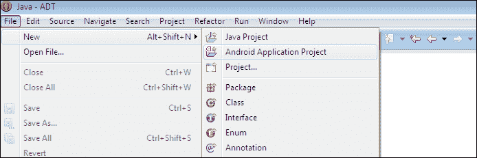
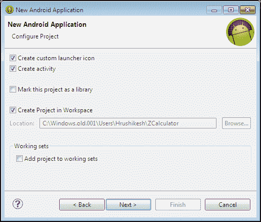
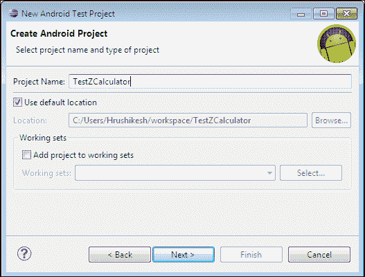
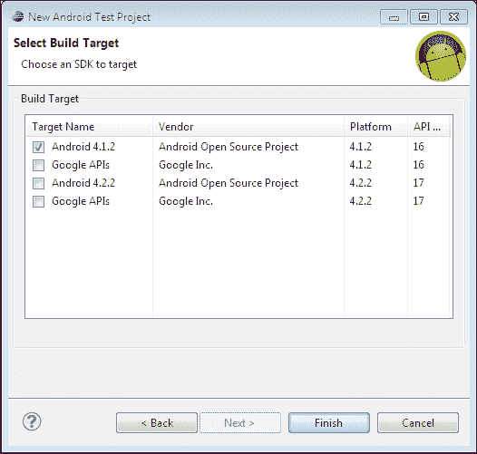
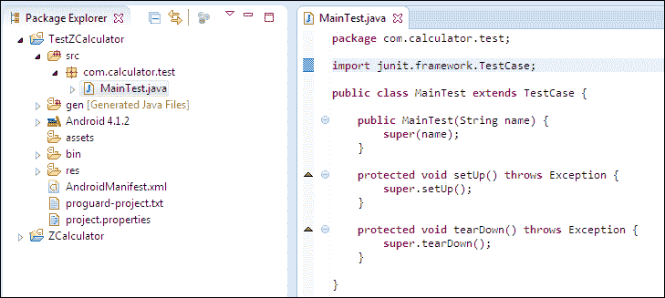
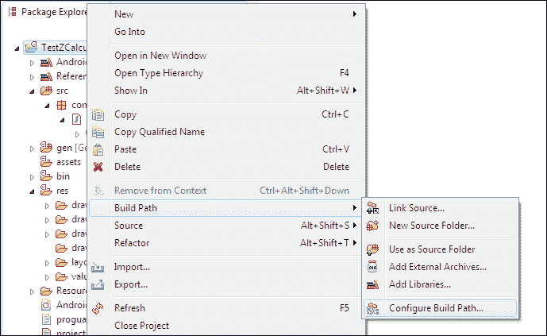
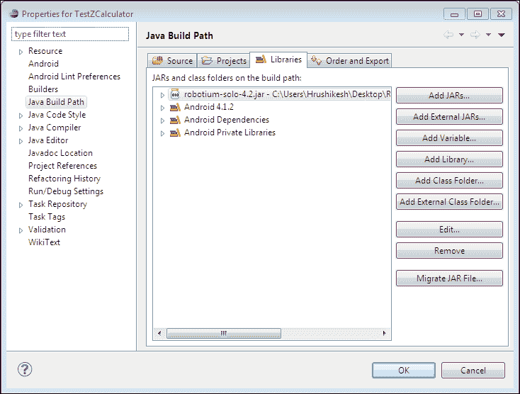
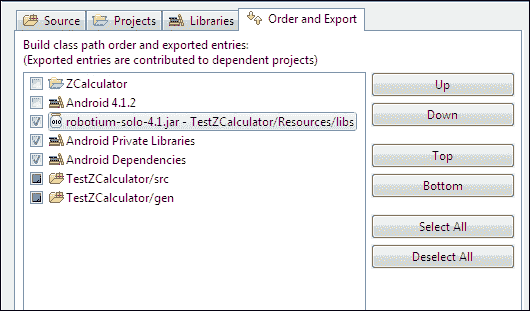

# 二、使用 Robotium 创建测试项目

本章将指导您使用机器人框架为安卓创建第一个测试项目。首先，让我们实现一个简单的计算器安卓应用。然后，使用这个【测试中的 T1】应用 ( **AUT** ，我们将研究创建机器人测试项目的过程。

# 创建自动测试

在本节中，我们将创建一个简单的计算器应用，允许输入两个数字。用户可以对这些号码执行以下两项操作:

*   添加
*   减法

这些操作可通过微调控制进行选择。Spinner 类似于其他编码语言(如 HTML 和 C#)中的组合框。出现**获取结果**按钮，在底部对齐的文本视图中获取操作结果。

下面的截图显示了 ZCalculator 应用:


要创建自动测试，请按照下列步骤操作:

1.  Create an **Android Application Project** by navigating to **File** | **New** | **Android Application Project** in Eclipse IDE.

    

2.  Enter the application details, as in the following screenshot, and click on the **Next** button:

    

3.  Keep the default options, as they are in the following screenshot, and click on the **Next** button:

    

4.  For this Android application project, we will configure the launcher icon with the default value set, as in the following screenshot, and click on the **Next** button:

    

5.  Check the **Create Activity** checkbox if it is not checked and select **Blank Activity**, as in the following screenshot, to create a default blank activity class in the project:

    

6.  Enter `Main` in the **Activity Name** field, as in the following screenshot, and click on the **Finish** button to create the Android application project:

    

你的安卓项目现在设置好了。您可以参考 ZCalculator 项目代码库，如下所示:

1.  在你的`Main.java`文件中使用以下代码:

    ```java
    package com.zcalculator;

    import com.calculator.R;

    import android.app.Activity;
    import android.os.Bundle;
    import android.view.View;
    import android.widget.Button;
    import android.widget.EditText;
    import android.widget.Spinner;
    import android.widget.TextView;

    public class Main extends Activity {
      Spinner	operationSpinner;
      TextView  result;
      Button    getResult;

      private enum OperationType
      {
        Addition, Subtraction
      }

      @Override
      public void onCreate(final Bundle savedInstanceState) {
        super.onCreate(savedInstanceState);
        this.setContentView(R.layout.main);

        final EditText txtfirstNumber = (EditText) this.findViewById(R.id.txtFirstNumber);
        final EditText txtsecondNumber = (EditText) this.findViewById(R.id.txtSecondNumber);

        this.result = (TextView) this.findViewById(R.id.resultText);
        this.result.setText("0.00");

        this.getResult = (Button) this.findViewById(R.id.btnGetResult);

        this.operationSpinner = (Spinner) this.findViewById(R.id.operationSpinner);

        // Adding listener to get result button
        this.getResult.setOnClickListener(new View.OnClickListener() {

          public void onClick(final View v) {
            OperationType operationType = OperationType.valueOf(Main.this.operationSpinner.getSelectedItem().toString());

            final float num1 = Float.parseFloat(txtfirstNumber.getText().toString());
            final float num2 = Float.parseFloat(txtsecondNumber.getText().toString());

        // Getting first & second values and passing to show result
            Main.this.showResult(num1,num2 ,operationType);
          }
        });
      }

      // Showing operation results
      protected void showResult(final float firstNumber, final float secondNumber, final OperationType type) {

        float resultVal = 0;
        if (type.equals(OperationType.Addition)) {
          resultVal = firstNumber + secondNumber;
        } else if (type.equals(OperationType.Subtraction)) {
          resultVal = firstNumber - secondNumber;
        }

        String operationResult = String.valueOf(resultVal);
        this.result.setText(operationResult);
      }
    }
    ```

2.  在`main.xml` 布局文件中使用以下代码:

    ```java
    <?xml version="1.0" encoding="utf-8"?>
    <LinearLayout xmlns:android="http://schemas.android.com/apk/res/android"android:orientation="vertical"android:layout_width=" match_parent"android:layout_height=" match_parent">

    <TextViewandroid:layout_width=" match_parent" android:layout_height="wrap_content" android:text="@string/hello"/>

    <TextView android:layout_width="wrap_content" 
      android:layout_height="wrap_content" 
      android:text="@string/txtSpace"/>

    <TextView android:layout_width="wrap_content" 
      android:layout_height="wrap_content" 
      android:text="@string/txtFirstNumber"/>

    <EditTextandroid:inputType="numberDecimal"
      android:id="@+id/txtFirstNumber" 
      android:layout_width=" match_parent" 
      android:layout_height="wrap_content"/>

    <TextViewandroid:layout_width="wrap_content"
      android:layout_height="wrap_content" 
      android:text="@string/txtSpace"/>

    <TextViewandroid:layout_width="wrap_content" 
      android:layout_height="wrap_content" 
      android:text="@string/txtSecondNumber"/>

    <EditTextandroid:inputType="numberDecimal"
      android:id="@+id/txtSecondNumber" 
      android:layout_width=" match_parent" 
      android:layout_height="wrap_content"/>

    <Spinnerandroid:id="@+id/operationSpinner"
      android:layout_width="match_parent"
      android:layout_height="wrap_content" 
      android:entries="@array/spinnerItems"/>

    <TextViewandroid:layout_width="wrap_content" 
      android:layout_height="wrap_content" 
      android:text="@string/txtSpace"/>

    <Buttonandroid:text="@string/btnResultString"
      android:id="@+id/btnGetResult" 
      android:layout_width=" match_parent" 
      android:layout_height="wrap_content"/>

    <TextViewandroid:layout_width="wrap_content" 
      android:layout_height="wrap_content" 
      android:text="@string/txtSpace"/>

    <TextViewandroid:id="@+id/resultText" 
      android:layout_width="wrap_content" 
      android:layout_height="wrap_content"/>

    <TextViewandroid:layout_width="wrap_content"
      android:layout_height="wrap_content" 
      android:text="@string/txtSpace"/>

    </LinearLayout>
    ```

3.  用以下条目更新文件:

    ```java
    <string name="hello">Enter any two numbers and select operation and get the result</string>
    <string name="app_name">ZCalculator</string>
    <string name="txtFirstNumber">First Number</string>
    <string name="txtSecondNumber">Second Number</string>
    <string name="btnResultString">Get Result</string>
    ```

4.  用以下条目更新`array.xml`文件:

    ```java
      <string-array name="spinnerItems">
        <item>Addition</item>
        <item>Subtraction</item>
      </string-array>
    ```

5.  另外，用以下活动动作和启动器条目更新`AndroidManifest.xml`文件:

    ```java
    <uses-sdk android:minSdkVersion="8"/>

    <application android:icon="@drawable/ic_launcher" android:label="@string/app_name">
      <activity android:name="com.zcalculator.Main"android:label="@string/app_name">
        <intent-filter>
          <action android:name="android.intent.action.MAIN" />
          <category android:name="android.intent.category.LAUNCHER" />
        </intent-filter>
      </activity>
    </application>
    ```

# 创建测试项目

让我们继续并创建一个测试项目来测试 ZCalculator 应用。

在 Eclipse 中，转到**新建**，从**选择**向导中，选择**安卓测试项目**。输入合适的项目名称，点击**下一步**按钮。建议测试项目名称遵循命名约定，如“测试+自动测试名称”这就是为什么这个测试应用被命名为`TestZCalculator`，如下图截图所示:



然后，选择 AUT 或目标项目(在我们的例子中是 ZCalculator)，如下图所示，点击**完成**按钮:


选择一个构建目标，如下图截图所示，(SDK 转目标)点击**完成**按钮:



您的测试项目已成功创建。让我们创建一个测试用例类来测试 ZCalculator 的主类。

# 创建测试用例

要创建测试用例，请按照下列步骤操作:

1.  To create a test case, right-click on the `com.calculator.test` package in the **Package Explorer** window and navigate to **New** | **JUnit Test Case**, as shown in the following screenshot. If this package is not present, create it under the **src** branch:

    

2.  On the **New JUnit Test Case** window, most of the fields are already filled. Just assign the name of the test case as `MainTest`, as we are going to test the `Main` class in ZCalculator. Keep the **setUp()**, **tearDown()**, and the **constructor** option checkboxes checked in the method stubs section and click on the **Finish** button.

    ### 注

    `setUp()`和`tearDown()`方法是`junit.framework.TestCase`类的一部分。`setUp()`方法用于初始化运行测试和重置环境变量所需的数据。`tearDown()`方法用于调用垃圾收集来强制恢复内存。在每个`@Test`方法之后调用，如下代码所示:

    ```java
    Call @Before setUp
    Call @Test method test1
    Call @After tearDown
    Call @Before setUp
    Call @Test method test2
    Call @After tearDown
    ```

    

3.  Once it is completed, a test case `MainTest.java` will be created under the `com.calculator.test` package, as shown in the following screenshot. Also, the three stub methods will be generated automatically in the `MainTest` class:

    

# 添加机器人库

所有版本的 Robotium JAR 文件都可以从[https://code.google.com/p/robotium/downloads/list](https://code.google.com/p/robotium/downloads/list)下载。

可以按照下列步骤添加机器人库:

1.  You need to add the Robotium JAR as a reference library to the test project. To reference this, right-click on your project and navigate to **Build Path** | **Configure Build Path**, as shown in the following screenshot:

    

2.  In the **Java Build Path** panel, go to the **Libraries** tab and click on the **Add External JARs…** button, as shown in the following screenshot. Then, provide a correct Robotium library (preferably the latest version) and add it to the list. The alternative way to achieve this is to copy the JAR file to the `lib` directory of the test:

    

3.  It is mostly observed in the latest SDK versions (mostly API 17 and above) that the **java.lang.NoClassDefFoundError: com.jayway.android.robotium.solo.Solo** error occurs when the Robotium JAR file is not exported. So, to export it, go to the **Order and Export** tab in the **Java Build Path** section and check the Robotium JAR file in the list, as shown in the following screenshot, and click on the **OK** button:

    ### 注

    检查安卓私人图书馆很重要；否则测试不会开始。

    

# 在 AndroidManifest.xml 中添加包名

一旦提供了机器人库对测试项目的引用，打开`AndroidManifest.xml`文件并更改目标包名称，如下所示:

```java
<instrumentation android:targetPackage="com.calculator" android:name="android.test.InstrumentationTestRunner" />
```

以下截图显示了`AndroidManifest.xml`文件中之前的变化:


# Robotium 的测试用例代码

在进入实际代码之前，有一些 Robotium 框架的类和方法你应该很熟悉。

`Solo`是用于测试的 Robotium 类。它是用测试用例和第一个要测试的活动来初始化的。这在`setUp()`方法中执行。`Solo`类为应用编程接口提供了对安卓用户界面组件的简单调用，例如，`enterText()`应用编程接口将文本放在编辑文本视图中。我们将在下一节中看到大多数这样的 API。

JUnit 中的测试用例方法名称应该总是以单词“test”开头。由于 Robotium 是建立在 JUnit 上的，所以我们有了测试用例的`testZCalculatorBlackBox()`方法。您可以在一个测试用例类中添加任意数量的测试用例方法。

在下面的测试案例中，我们将访问 ZCalculator 的 UI 组件，并按顺序执行以下操作:

1.  进入**编辑文本**字段进行输入(第一个和第二个数字)。
2.  输入任何值。
3.  访问并点击**微调器**选择操作。
4.  访问并点击**获取结果**按钮。

将以下代码放入`MainTest.java`文件并保存:

```java
package com.zcalculator.test;

import android.test.ActivityInstrumentationTestCase2;
import com.jayway.android.robotium.solo.Solo;
import com.zcalculator.Main;

public class MainTest extends ActivityInstrumentationTestCase2<Main> {
  private Solo	solo;

  public MainTest() {
    super(Main.class);
  }

  @Override
  protected void setUp() throws Exception {
    super.setUp();
    this.solo = new Solo(this.getInstrumentation(), this.getActivity());
  }

  public void testZCalculatorBlackBox() {

    // Enter 5 in first number field
    this.solo.enterText(0, "5");

    // Enter 4 in second number field
    this.solo.enterText(1, "4");

    // Press Addition Spinner Item
    this.solo.pressSpinnerItem(0, 0);

    // Click on get result button
    this.solo.clickOnButton(0);

    // Verify that resultant of 5 + 4
    assertTrue(this.solo.searchText("9"));

    // Press Subtraction Spinner Item
    this.solo.pressSpinnerItem(0, 1);

    // Click on get result button
    this.solo.clickOnButton(0);

    // Verify that resultant of 5 - 4
    assertTrue(this.solo.searchText("1"));
  }
  @Override
  protected void tearDown() throws Exception {
    this.solo.finishOpenedActivities();
  }
}
```

# 运行测试用例

我们现在已经完成了为 ZCalculator 创建一个带有有效测试用例的测试项目。是时候运行我们的测试用例了。

右键点击测试项目或测试用例文件`MainTest.java`，选择**运行为安卓 JUnit 测试**。从选择设备屏幕中选择**安卓仿真器**。

### 注

如果你想运行一个特定的测试用例，右击文件，然后选择**作为安卓 JUnit 测试**运行。要运行测试项目中所有可用的测试用例，右键单击项目本身，选择**作为安卓 JUnit 测试**运行，它将运行所有的测试用例。

Robotium 的 ZCalculator 测试用例将如下工作:

1.  将加载 ZCalculator 应用。
2.  第一个和第二个数字将自动输入到第一个和第二个**编辑文本**字段，然后点击微调器选择操作(首先需要加法)。
3.  点击**获取结果**按钮，结果将显示在结果文本视图中。
4.  The assert statement will check for the valid operation result. This process will continue for Subtraction and if every assert is true, the test case is passed, indicated by a green bar in the JUnit tab, as depicted in the following screenshot:

    

如果您想通过命令行运行测试项目，必须预先安装应用和仪器。如果已经安装，请使用以下命令:

```java
adb shell am instrument-w com.calculator.test/android.test.InstrumentationTestRunner

```

在运行前面的命令之前，请注意，您可以从`adb.exe`所在的位置运行它，或者将`adb.exe`路径添加到环境路径的变量列表中，以便从系统中的任何位置访问它。

可以在安卓 SDK 里面的`platform-tools`文件夹里找到`adb`。

# 总结

在本章中，我们已经看到了如何使用机器人框架创建测试项目。到目前为止，您已经学习了使用 Robotium 创建简单测试应用所需的基本流程。是时候深入研究框架，了解不同的机器人应用编程接口调用及其用法了。在下一章中，将向您介绍`Solo`类以及其中存在的关于 API 的信息。