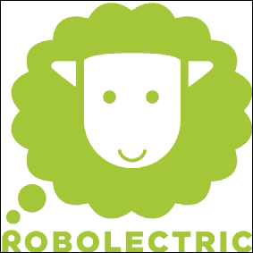

# 五、与其他框架的比较

本章提供了 Robotium 和基于某些参数的其他测试框架之间的比较。这将为您提供一种根据项目需求选择合适框架的方法。在这一章中，我们将把 Robotium 与 MonkeyRunner、Robolectric、UI Automator 和 Calabash 框架进行比较。

# MonkeyRunner

**MonkeyRunner** 是一个用来编写程序的工具，可以从安卓代码之外访问安卓仿真器/设备。编写 Python 程序是为了安装安卓测试应用，并向该应用发送击键。该程序将安卓用户界面的截图发送到工作站进行存储。

MonkeyRunner 是一个 API，而不是一个程序。它使用了使用 Java 编程语言的**Jython**(python 的实现)。

由于 MonkeyRunner 是 Python 的一个模块，所以您可以做 Python 支持的任何事情。你所需要做的就是创建一个 Python 程序，并在其中添加 MonkeyRunner，你就完成了！

让我们看看下表中机器人和 MonkeyRunner 的区别:

<colgroup><col style="text-align: left"> <col style="text-align: left"> <col style="text-align: left"></colgroup> 
| 

特征

 | 

机器人学

 | 

MonkeyRunner

 |
| --- | --- | --- |
| 对象选择 | 对象选择基于索引、文本/名称、图像和标识等属性。 | 对象的选择是基于它的位置(x，y 坐标)，这可以随着应用的发展而改变。触摸事件很有可能无法使用，因为没有提供准确的位置。 |
| 行动 | 它只能在测试过的应用上执行操作。 | 它可以点击整个设备，即所有存在的应用。 |
| 主张 | 基于 JUnit。显示红色/绿色条用于断言(验证)。 | 基于截图的验证。 |
| 语言 | Java。 | Python 脚本。 |
| 装置 | Robotium JAR 可以导入到 Eclipse 插件中，测试用例可以作为`.apk`文件执行。 | 要使用 MonkeyRunner，运行`<android sdk>/tools/`中的`monkeyrunner`工具，并传递文件名作为测试用例。它不在仿真器/设备内部安装任何程序。 |

这两个框架有一些共同点。它们可以在仿真器/设备上运行，并通过从应用编程接口发送特定的命令和事件从工作站控制设备/仿真器。

在安卓测试领域，不同的需求有不同的框架。由于 Robotium 主要用于用户界面测试，因此它不支持 MonkeyRunner 的以下一些功能:

*   可扩展自动化
*   多应用和设备控制

# Robolectric

**robo electric**是一个测试框架，它模仿了安卓框架的一部分，允许在 JUnit 4 框架的帮助下，直接在 **Java 虚拟机** ( **JVM** ) 上运行测试用例。Robolectric 最重要的一点是它不需要仿真器/设备。

Robolectric 包含行为类似于安卓软件开发工具包中存在的对象的浅层安卓对象。

让我们看看下表中机器人和机器人的区别:

<colgroup><col style="text-align: left"> <col style="text-align: left"> <col style="text-align: left"></colgroup> 
| 

特征

 | 

机器人学

 | 

机器人

 |
| --- | --- | --- |
| 仿真器/设备 | Robotium 需要模拟器或设备来执行测试。 | Robolectric 不需要任何仿真器/设备来执行测试。这就是为什么它比机器人快得多。 |
| 构建服务器 | 它需要一个模拟器或构建服务器上的一个设备来运行测试用例；否则，测试项目不能被添加到构建过程中。 | 它可以在构建服务器上轻松配置。 |
| 测试驱动开发 | 它用于在实际的安卓设备上测试，并测试不是由 Robolectric 模拟的应用编程接口边缘。 | 它比 Robotium 更有助于加快测试驱动的开发周期。 |
| 使用仪器 | 它使用 JUnit 3 仪器测试。 | 它使用 JUnit 4 非仪器测试。 |

# 用户界面自动机

UI Automator 是一个 Java 库，用于为 android 应用创建定制的 UI 测试用例，它提供了一个执行引擎来自动化和运行测试用例。

让我们看看下表中机器人与 UI Automator 的区别:

<colgroup><col style="text-align: left"> <col style="text-align: left"> <col style="text-align: left"></colgroup> 
| 

特征

 | 

机器人学

 | 

用户界面自动机

 |
| --- | --- | --- |
| 跨应用包 | Robotium 无法跨越应用包边界。 | UI Automator 可以跨越应用包边界。例如，如果您的应用打开图库并点击任何相册，这可以使用用户界面自动机来实现。图库是另一个应用包，点击图库中的相册是一个跨应用的操作。 |
| API 集 | Robotium 有一个巨大的 API 集，包含点击视图、获取视图等方法。正因为如此，Robotium 比 UI Automator 提供了更多的测试控制。 | UI Automator 包含单击和获取视图的方法，但是实现了对这些视图的不同访问。 |
| API 级支持 | Robotium 支持 API 等级 4 及以上。 | UI Automator 只支持 API 级别为 16(或以上)的设备，不回过头来支持较旧的 API 级别；因此，没有向后兼容性。 |
| 与集成开发环境集成 | Robotium 与 Eclipse IDE 顺利集成。 | UI Automator 与 IDE 的集成比较繁琐，因为需要手动添加带有`Android.jar`和`uiautomator.jar`的 JUnit 库，并使用 Ant 进行构建。 |
| 网络支持 | Robotium 完全支持应用中的网络元素。 | UI Automator 缺少此功能。 |

# 葫芦

葫芦是跨平台的，可以让你为移动应用编写自动化功能的验收测试，支持安卓和 iOS 原生应用。

让我们看看下表中机器人和葫芦的区别:

<colgroup><col style="text-align: left"> <col style="text-align: left"> <col style="text-align: left"></colgroup> 
| 

特征

 | 

机器人学

 | 

葫芦

 |
| --- | --- | --- |
| 语言 | Robotium 测试用例是用 Java 编写的 | 不需要用 Java 写测试，可以用更灵活的语言 **Ruby** ，更适合 |
| 控制 | 机器人测试需要通过一个设备来控制 | 葫芦测试可以通过计算机而不是设备来控制 |
| 旋转 | Robotium 可以将设备方向设置为横向或纵向 | 葫芦-安卓没有模仿手机旋转为横向或纵向 |

那么，哪个更好呢？机器人还是葫芦？我觉得两个都不错。它们仍在改进中，更多版本正在发布。

当两者都不能满足你的需求时，你可以随时使用`android.test.ActivityInstrumentationTestCase2`类。

正如所讨论的，每个框架都有它的优点和缺点，并且可用于自动化测试人员的不同需求。正如我们从前面的比较中看到的，Robotium 和 Calabash 相当受欢迎，并且在自动化 UI 测试方面一路领先。

# 总结

在这一章中，我们基于不同的因素将 Robotium 与不同的测试框架进行了比较，并得出结论:所有的框架都是根据不同的需求来使用的。没有一个框架是完美的，总有一些利弊与之相关。

在下一章中，我们将研究远程控制功能及其在 Robotium 中的使用。