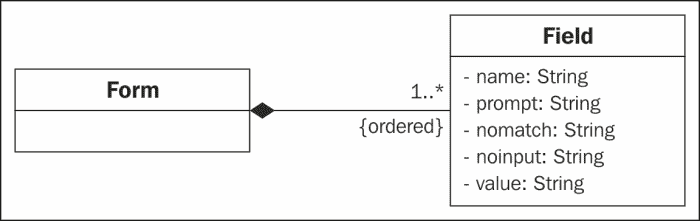

# 五、表单填充对话

许多支持语音的应用使用像上一章描述的一次性对话。你觉得语音接口能走得更远吗？你能想象更复杂的交互吗？在这种交互中，出于各种各样的目的，必须从用户那里获取几项信息，例如，启动应用、查询数据库、启动 web 服务或 web 服务混搭等等。

这些类型的对话类似于传统 web 应用中的表单填充。到本章结束时，您应该能够实现简单的表单填充对话，以便获得访问 web 服务所需的数据。

# 表单填写对话

表单填充对话可以根据要填充的插槽数量来查看。例如，在航班预订应用的情况下，系统可能必须填充五个槽:目的地、到达日期、到达时间、离开日期和离开时间。在一个简单的表单填充对话中，每次处理一个槽，并询问相关问题，直到所有槽都被填充。此时，应用可以查找所需的航班，并将结果呈现给用户。下面是一个对话如何进行的例子，以及插槽的状态如何随着对话的进行而改变。

App:欢迎使用航班信息服务。你想去哪里旅游？

来电者:伦敦。

<colgroup><col style="text-align: left"> <col style="text-align: left"> <col style="text-align: left"> <col style="text-align: left"> <col style="text-align: left"> <col style="text-align: left"></colgroup> 
| 

狭槽

 | 

目的地

 | 

到货日期

 | 

到达时间

 | 

启程日期

 | 

出发时间

 |
| --- | --- | --- | --- | --- | --- |
| 价值 | 伦敦 | 未知的 | 未知的 | 未知的 | 未知的 |

App:你想在什么日期飞往伦敦？

来电者:7 月 10 日。

<colgroup><col style="text-align: left"> <col style="text-align: left"> <col style="text-align: left"> <col style="text-align: left"> <col style="text-align: left"> <col style="text-align: left"></colgroup> 
| 

狭槽

 | 

目的地

 | 

到货日期

 | 

到达时间

 | 

启程日期

 | 

出发时间

 |
| --- | --- | --- | --- | --- | --- |
| 价值 | 伦敦 | 07/10/2013 | 未知的 | 未知的 | 未知的 |

帧也可以有附加到槽的条件，例如，如果是回程，那么返回段的槽也需要值。

在更复杂的对话中，用户可以一次填充多个槽，如下例所示:

App:欢迎使用航班信息服务。你想去哪里旅游？

打电话者:我想星期五飞往伦敦。

<colgroup><col style="text-align: left"> <col style="text-align: left"> <col style="text-align: left"> <col style="text-align: left"> <col style="text-align: left"> <col style="text-align: left"></colgroup> 
| 

狭槽

 | 

目的地

 | 

到货日期

 | 

到达时间

 | 

启程日期

 | 

出发时间

 |
| --- | --- | --- | --- | --- | --- |
| 价值 | 伦敦 | 21/06/2013 | 未知的 | 未知的 | 未知的 |

由于用户已经响应目的地问题提供了到达日期，该槽可以被填满，系统可以跳过到达问题。然而，在这个例子中，为了处理调用者的输入，需要更复杂的语法，如[第 6 章](06.html "Chapter 6. Grammars for Dialog")、*对话语法*中所讨论的。

# 实现表单填写对话

为了实现表单填写对话，有必要:

*   创建一个数据结构来表示插槽，该插槽将保存系统从用户那里获取的信息。
*   开发一种算法来处理插槽，为每个插槽提取所需的提示。

voice XML([http://www.w3.org/TR/voicexml20/](http://www.w3.org/TR/voicexml20/))为这项任务提供了一个有用的结构，表单中包含表示完成表单所需的不同信息项(槽)的字段。以下代码是一个示例:

```java
  <form id = "flight">
  <field name="destination">
  <prompt>where would you like to travel to?</prompt>
  <grammar src = "destinations.grxml"/>
  </field>
  <field name="date">
  <prompt>what day would you like to travel?</prompt>
  <grammar src = "days.grxml"/>
  </field>
  </form>
```

前面的例子展示了一个应用，它要求两个信息:目的地和日期。询问目的地，使用提示`where would you like to travel to?`，询问日期，合成`what day would you like to travel?`。每一条数据都是通过重新提示用户直到收集到所有信息而顺序获取的。在 VoiceXML 中，这是使用**形式解释算法** ( **国际汽联** ) 完成的，这将在[http://www.w3.org/TR/voicexml20/#dml2.1.6](http://www.w3.org/TR/voicexml20/#dml2.1.6)中进一步描述。

虽然实现完整的 VoiceXML 表单填充方法超出了本书的范围，但在本章的剩余部分，我们将展示如何创建一个简单的表单填充应用，该应用利用类似的数据结构和算法。

### 类型

**也可以试试…**

您可以使用**Voxeo Evolution**([http://evolution.voxeo.com/](http://evolution.voxeo.com/))创建自己的 VoiceXML 对话。您可以注册一个免费的开发人员帐户，然后您就可以创建自己的 VoiceXML 应用，这些应用将被分配一个您可以用来与它们交互的 Skype 号码。请注意，这对于安卓应用并不直接有用，但将提供对 VoiceXML 及其作为对话脚本语言的工作方式的深入了解。

您可能还希望研究使用 jvoice XML([http://jvoicexml.sourceforge.net/](http://jvoicexml.sourceforge.net/))来构建一个完整的 JVoiceXML 解析器。安卓初步实现的代码可以在这里找到:[http://SourceForge . net/p/jvoicexml/code/HEAD/tree/branch/Android/](http://sourceforge.net/p/jvoicexml/code/HEAD/tree/branches/android/)

# 穿线

在剩下的章节中，我们将使用 XML 文件来实现的各种目的，并将公共代码封装在`XMLLib`库中。一个重要的问题涉及线程。启动应用时，会创建一个线程来运行代码。这个线程负责涉及更新用户界面的动作，所以它有时被称为 **UI 线程** 。在用户界面线程中执行非常昂贵的操作，例如下载文件、执行 HTTP 请求、打开套接字连接或访问数据库，可能会长时间阻止用户界面线程，使其无响应并冻结界面更新。为此，从安卓 3(蜂巢)开始，当试图在安卓应用的主线程上执行联网操作时，`android.os.NetworkOnMainThreadException`会被提升。

安卓提供了几种方式来实现后台线程和用户界面线程之间的通信，如下所述:[http://developer . Android . com/guide/components/process-and-threads . html](http://developer.android.com/guide/components/processes-and-threads.html)

选择之一是使用异步任务(`AsyncTask`)。`AsyncTask`在后台运行所有耗时的操作，并在 UI 线程中发布结果。T2 的文档可以在这里找到:[http://developer . Android . com/reference/Android/OS/asynctask . html](http://developer.android.com/reference/android/os/AsyncTask.html)

简而言之，当一个异步任务被执行时，它经历四个阶段，可以用以下方法控制:`onPreExecute` 在任务被执行之前，`doInBackground` 在显示操作进度的`onPreExecute``onProgressUpdate`之后立即执行后台计算(例如，在用户界面的进度条中)，以及`onPostExecute`在后台计算完成时被调用。

# XMLLib

在我们的库(代码包中的`sandra.libs.util.xmllib`)中，`RetrieveXMLTask`(参见`RetrieveXMLTask.java`)负责从 web 中获取一个 XML 文件，并将其内容保存在一个字符串中以供进一步处理。它以下列方式声明:

```java
  class RetrieveXMLTask extends AsyncTask<String, Void, String>
```

它被定义为一个异步任务(`AsyncTask`)，接收一组字符串作为输入参数。它不产生任何类型的进度值(void)，并产生一个字符串作为后台计算的结果(<参数，进度，结果>)。在我们的例子中，字符串输入是检索 XML 文件的网址，字符串结果是文件中的 XML 代码。从指定的网址读取 XML 文件是在`doInBackground`方法中作为后台任务完成的，该方法使用其他私有方法打开 HTTP 连接并读取字节流(`saveXmlInString`和`readStream`)。看看代码包(`XMLLib`项目、`RetrieveXMLTask.java`)中的`doInBackground`和`saveXMLInString`方法。这里有一个很好的教程，介绍如何在以下网址发出异步 HTTP 请求:[HTTP://mobiledevtuts . com/Android/Android-HTTP-with-async task-example/](http://mobiledevtuts.com/android/android-http-with-asynctask-example/)

可以看出，`RetrieveXMLTask`中异常的管理是以一种特殊的方式进行的，因为有一个名为`exception` 的属性，用于保存连接或读取操作过程中可能出现的异常(方法`doInBackground`)。一旦异步任务完成，就对这种异常进行管理(在`onPostExecute`方法中)。

一旦后台任务完成，我们需要使用`onPostExecute`方法将结果提供回调用类。为了做到这一点，我们用抽象方法`processXMLContents`定义接口`XML AsyncResponse`(见`XML AsyncResponse.java`)。想法是调用异步任务的类实现为`processXMLContents`方法提供代码的接口，`onPostExecute`将输出的处理委托给这个方法(参见代码包中的`onPostExecute`方法:`sandra.libs.util.xmllib.RetrieveXMLTask`)。

# formfillib

要构建一个表单填写应用，我们必须指定一个数据结构，比如飞行示例中的数据结构。为此，我们定义了两个类:`Form`和`Field`。如图所示，一个 `Form`有一个字段集合，一个 `Field`有五个属性；一个名称、一个代表应用将用来询问数据的提示的字符串、两个代表当应用不理解用户对初始提示的响应(`nomatch`)或没有听到它时要使用的提示的字符串(`noinput`)以及应用已经理解的值。



例如，`Field`飞行设置可能有以下属性值:

**名称:** **目的地**

**提示:** **你的目的地是哪里？**

**nomatch:** **对不起，我没听懂你说的**

**否输入:** **抱歉，我听不到您的声音**

**值:** **罗马**(当用户响应系统提示说**罗马**时)

这种结构足以构建我们在本章中讨论的那种类型的应用。只需创建与要填充的槽一样多的`Field`类对象，以及包含所需顺序的字段集合的`Form`。这可以很容易地用 Java 编程来完成，但是它不是很方便读者，程序员很难像系统提示那样更改一些参数。

为了解决这个问题，我们将实现 VoiceXML 标准的一个子集，以创建包含对话结构的易于阅读的 XML 文件。然后，我们将使用`VXMLParser`类自动解析 XML 文件，并将它们翻译成`Field`和`Form`类的对象。最后，一个`DialogInterpretation` 类将使用这些对象来管理交互。

### 注

这并没有使 VoiceXML 设计完全独立于应用。应用需要知道需要处理哪些信息，这些信息在 VoiceXML 文件中表示为字段。因此，除了字段的编号和名称，开发人员可以更改 VoiceXML 中的任何内容。

## VXMLParser

安卓系统中有不同的实现解析器的方式，主要使用 DOM、SAX 或者一个 Pull 解析器。安卓推荐使用`XMLPullParser` 类([http://developer . Android . com/reference/org/xmlpull/v1/xmlpullparser . html](http://developer.android.com/reference/org/xmlpull/v1/XmlPullParser.html)，因为它的设计是为了更好的性能和简单性。XML 拉解析允许流式解析，在流式解析中，过程可以随时中断和恢复。

为了解析 VXML 文件，我们创建一个`XMLPullParser`来读取 XML 内容，并反复调用 `next()`方法来检索下一个事件，直到事件为`END_DOCUMENT`。这样，我们处理 `START_TAG`、`TEXT`、和`END_TAG`事件来分别管理系统遇到开始标签、处理标签内的文本或遇到结束标签的情况。

当系统遇到<表单>标签时，我们创建一个新的`Form`对象。由于解析器的思想是处理单个表单，如果文件中有几个表单，我们将只跟踪最后一个。这是通过只保留`Form`类的一个实例作为 `VXMLParser`类的属性来实现的。

关于字段，通过解析<field>标签的属性来提取它们的名称。然后，当遇到相应的 VoiceXML 标签时，我们还会保存关于`prompt`、`nomatch`和`noinput`提示的信息。</field>

任何使用 VoiceXML 解析器的类都可以调用`parseVXML`方法(参见`sandra.libs.dm.fomfilllib.VXMLParser`)来获取解析数据时创建的表单。解析器使用`FormFillLibException`类，以便对异常进行更细粒度的控制。

## 对话解释器

`DialogInterpreter`类似于语音 XML 中的 FIA 算法。它按顺序访问所有字段，直到应用获得每个字段的语音识别结果。在每个字段中，它合成提示并监听用户输入。如果语音识别成功，则移动到下一个字段，如果不成功，则系统对当前字段重复该过程。下面的伪代码描述了解释器的行为:

```java
Interpret field i:
        Play prompt of field i
        Listen for ASR result
        Process ASR result:
            If the recognition was successful, then save recognized keyword as value for the field i and move to the next field
            If there was a no match or no input, then interpret field i
            If there is any other error, then stop interpreting

Move to the next field:
        If the next field has already a value assigned, then move to the next one
        If the last field in the form is reached, then endOfDialogue=true
```

伪代码中描述的行为是在`DialogInterpreter`类中开发的。这个类使用不同的属性来控制解释:必须被解释的`Form`，一个整数`currentPosition`，它表示必须被解释的字段在表单字段列表中的位置，两个带有提示的字符串`nomatch` 和`noinput`事件(如果有可用的话，将被从 VoiceXML 文件中解析的事件代替)，以及一个包含成对字符串形式的解释结果的`HashMap`<字段名，字段值>。

当调用`startInterpreting`方法时，解释开始。提供要解释的表单，将 `currentPosition`初始化为 0，并调用`interpretCurrentField`。`interpretCurrentField`方法没有封装`interpret field i`伪代码中显示的所有行为，因为需要使用不同的方法来控制各种 ASR 事件。这样，`interpretCurrentField`只控制第一部分:播放字段提示，启动 ASR。然后用`ASRLib`中的`processAsrResults``processAsrErrors`的方法来说明不同的事件。前者控制 ASR 从用户输入中理解某些东西的情况，将其值保存在结果的`Hashmap`中，并调用`moveToNextField`方法。

后者控制 ASR 出现错误的情况，如果错误代码为`ERROR_NO_MATCH`或`ERROR_SPEECH_TIMEOUT` ( `nomatch`或`noinput`)，则合成相应的提示，重新解释字段。如果错误是由于网络问题造成的，解释将停止。您可以在代码包(`sandra.libs.dm.formfilllib.DialogInterpreter`)中查看这个方法。

`moveToNextField`方法类似于前面显示的伪代码:它向前移动当前字段的位置，而该字段没有值。如果有一个字段没有值，则解释，如果没有其他字段需要解释，则解释结束，调用`processDialogResults`方法。

`processDialogResults`方法是抽象的，因此`DialogInterpreter` 的任何子类都可以提供自己的代码来处理解释的结果。在下一节中，我们将展示一个使用`FormFillLib`库的应用，并实现这个方法来使用对话的结果来调用 web 服务。

### 类型

**也可以试试…**

另一个有趣的替代方法是在 Java 代码的不同数据结构中编码对话的结构。这是来自 p . Deitel，h . Deitel，a .和 m . Morgano，m .*的*披萨订购 App* 示例(第 15 章)中遵循的方法:面向程序员的 Android:一种应用驱动的方法*，Prentice Hall 2011，您可以在此找到:[http://ptgmedia . pearsonmg . com/imprint _ downloads/informit/bookreg/9780132121361/Android _ 15 _ speech _ final](http://ptgmedia.pearsoncmg.com/imprint_downloads/informit/bookreg/9780132121361/android_15_speech_final_a.pdf)

我们正在使用的方法的优点是，我们提供了不同的库来解析和管理交互，这些库可以被任何需要带有基本表单填充对话的界面的应用重用。因此，这是一种通用的方法，其中每个特定应用的细节都在一个简单的 VoiceXML 文件中提供。下一节将展示一个示例。

# MusicBrain app

为了说明如何使用`FormFillLib`，我们将开发一个应用，向用户询问查询网络服务所需的数据。应用中的类和本章中描述的库之间的关系如下类图所示:


应用不再是独立的孤立应用；通常，他们将自己的资源与从第三方 web 服务收集的数据和功能相结合。最近，许多网络应用已经发布了 API(应用编程接口)，允许感兴趣的开发人员在他们自己的应用中使用它们。这种集成可以像期望的那样复杂，涉及多个来源。这些被称为混搭。例如，旅游混搭可以将谷歌地图与 Flickr 集成在一起，以指示地理位置，从而显示相关旅游景点的图片，同时在 FoodSpotting 中查找好餐馆。

可在以下网站找到各种可用的原料药列表:[http://www.programmableweb.com](http://www.programmableweb.com)。其中一些(例如，亚马逊、谷歌和脸书)要求您注册才能使用它们的应用编程接口。其他的只能被授权的合作伙伴使用，还有一些是开放的，可以供公众(通常是非盈利性的)使用。

对于`MusicBrain`应用(`sandra.examples.formfill.musicbrain`)，我们将使用**音乐大脑**公共 API 。MusicBrainZ([http://musicbrainz.org/](http://musicbrainz.org/))是一个开放的音乐百科全书，包含音乐的元数据。它允许用户查询区域(来自某个地方的音乐)、艺术家或团体、专辑和发行。

MusicBrain 应用提供在两个日期之间发行的专辑的信息，这些专辑的标题包含特定的文本。与应用的交互示例如下摘录:

App> **请说出专辑标题的一句话**

用户>自动机

App> **请说出搜索的开始日期**

用户> 1970

App> **请说出搜索的最终日期**

用户> 2000

前面交互的结果产生如下截图所示的结果:


在`MusicBrain.java`中创建活动时，填表对话开始。这包括检索 VoiceXML 文件，解析它，并解释它以获得三个数据(标题中的单词、开始年份和最后一年)，这些数据将用于查询 MusicBrainZ 网络服务。VoiceXML 代码如下:

```java
  <form>
  <field name="query">
  <prompt>Please say a word in the album title</prompt>
  <noinput> Sorry, I could not hear you </noinput>
  <nomatch> Sorry, I did not understand what you said </nomatch>
  </field>
  <field name="initialyear">
  <prompt>Please say the starting year for the search</prompt>
  <noinput> Sorry, I could not hear you </noinput>
  <nomatch> Sorry, I did not understand what you said </nomatch>
  </field>
  <field name="finalyear">
  <prompt>Please say the final year for the search</prompt>
  <noinput> Sorry, I could not hear you </noinput>
  <nomatch> Sorry, I did not understand what you said
  </nomatch>
  </field>
  </form>
```

一旦对话结束，该应用查询 MusicBrainZ ，并获得一个包含所有专辑的 XML，这些专辑的标题包含用户说出的单词，然后对该 XML 进行解析和过滤，以仅保留在所选日期之间发行的专辑。最后，信息在图形用户界面中显示给用户。

### 注

网络服务通常以 XML 或 JSON 的形式提供结果。我们使用了 MusicBrainZ 的 XML 版本，因为它在这个特定的应用编程接口中更稳定，尽管您可能有兴趣在使用其他网络服务时考虑其他选项。

语音对话用`startDialog`、`processXMLContents`、和`processDialogResults`方法控制。`startDialog` 方法初始化 ASR 和 TTS 引擎(使用前面章节中描述的 `ASRLib`和`TTSLib`库，并开始检索 VoiceXML 文件。如前所述，当检索到 VoiceXML 文件时，调用`processXMLContents`方法。由于在应用中有两个可能的 XML 文件正在被检索(带有对话的语音 XML，以及带有来自网络服务的结果的 XML)，`processXMLContents`方法检查正在处理的当前 XML 是什么，并开始相应的解析过程。最后，当完成 VoiceXML 解析时，调用`processDialogResults`方法。该方法使用用户在对话期间说出的专辑标题中的单词来查询 MusicBrainZ。看看代码包(`MusicBrain.java`、`MusicBrain`项目)中的`startDialog`、和`processDialogResult`方法。

对网络服务的查询结果被编码在一个 XML 文件中，其结构在[中解释。该文件在`parseMusicResults`方法中解析。](http://musicbrainz.org/doc/Development/XML_Web_Service/Version_2/Search#Release)这个方法利用了`MusicBrainParser`类(见`MusicBrainParser.java`)，在这个类中我们实现了一个`XMLPullParser`。解析器遍历 XML 文件，获得一组相册。为了做到这一点，我们定义了`Album`类，它包含关于每个专辑标题、解释器、发行日期、国家和标签的信息。

我们使用警报对话来显示解析、ASR 或 TTS 错误的原因。这样，用户将更好地意识到这样一个事实，即由于格式不正确的 XMLs 或互联网连接问题，应用无法工作。用来创建它们的方法是 `createAlert`(在`MusicBrain.java`中)。

一旦 XML 文件被解析为一组`Album`对象，这些对象将使用`filterAlbums`方法 ( `MusicBrain.java`)进行过滤。这样，从标题包含所需单词的所有专辑中，我们只考虑那些在用户提供的日期之间发行的专辑。如果识别结果不能解析为日期，则考虑所有专辑。

一旦相册被过滤，我们用`showResults`方法在图形用户界面上显示它们。没有必要对相册进行后验排序，因为我们已经将它们保存在`TreeSet`中，这是一个允许我们避免重复并按顺序保存其元素的集合。为此，我们覆盖了`Album.java`中的`equals`方法，使用代码来比较两张专辑是否相等(我们检查它们是否有相同的标题和解释器)，并且我们在`AlbumComparator.java`中创建了一个自定义比较器，根据专辑的发行日期来比较专辑，以便它们可以从最近到最近进行排序。

# 总结

本章已经展示了如何实现表单填充对话，在该对话中，应用与用户进行简单的对话，以便检索几条数据，这些数据随后可用于通过 web 服务或混搭向用户提供高级功能。

`FormFillLib`包含检索对话结构的 XML 定义并将其解析为 Java 对象的类。这些对象用于控制与用户的口头交互。通过在互联网上可访问的简化 VoiceXML 文件中指定其结构，这个库使得在安卓应用中轻松构建任何表单填充对话成为可能。

`MusicBrain`应用展示了如何使用库通过口头对话从用户那里收集信息来查询网络服务。在这种情况下，应用会向用户询问一个单词和两个日期，用于在 MusicBrainZ 开放音乐百科全书中查询标题中带有该单词的专辑以及在指定日期之间发行的专辑。该示例还显示了如何解析和过滤 web 服务提供的结果，以便将它们呈现给用户。

在这个例子中，自动语音识别输入不受限制，但是在许多应用中，希望限制用户可能使用的词汇或短语。在[第 6 章](06.html "Chapter 6. Grammars for Dialog")、*对话语法*中，我们将研究如何使用对输入施加一些限制的语法，同时允许非常复杂的结构以及添加语义来提供对输入的解释。