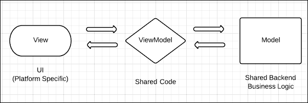
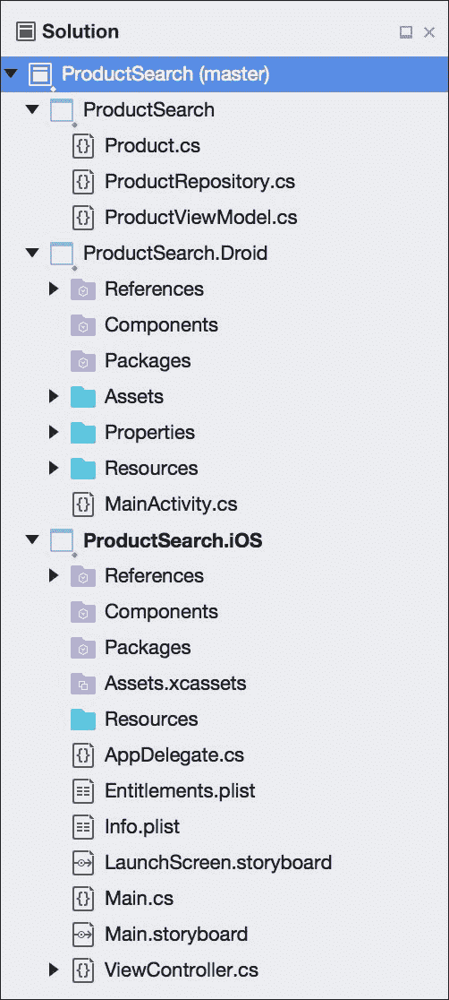

# 第三章。iOS 和安卓之间的代码共享

Xamarin 的工具承诺在 iOS 和 Android 之间共享您的大部分代码，同时尽可能利用每个平台上的本机 API。这样做是软件工程中的一项练习，而不是编程技能或掌握每个平台的知识。要设计一个 Xamarin 应用程序来实现代码共享，必须将应用程序分成不同的层。我们将介绍基础知识以及考虑特定情况的特定选项。

在本章中，我们将介绍:

*   代码共享的 MVVM 设计模式
*   项目和解决方案组织策略
*   可移植类库
*   平台特定代码的预处理器语句
*   简化依赖注入
*   控制反转

# 学习 MVVM 设计模式

**Model-View-View Model**(**MVVM**)设计模式最初是为**WPF**(**Windows Presentation Foundation**)应用而发明的，使用 **XAML** 将 UI 与业务逻辑分离，充分利用**数据绑定**。以这种方式构建的应用程序有一个独特的视图模型层，它不依赖于用户界面。这种架构本身针对单元测试和跨平台开发进行了优化。由于应用程序的视图模型类不依赖于用户界面层，所以您可以轻松地将 iOS 用户界面替换为安卓用户界面，并针对视图模型层编写测试。MVVM 设计模式也非常类似于前面章节中讨论的 MVC 设计模式。

MVVM 设计模式包括以下内容:

*   **模型**:模型层是驱动应用和任何业务对象的后端业务逻辑。这可以是从向服务器发出 web 请求到使用后端数据库的任何事情。
*   **查看**:这一层是屏幕上看到的实际用户界面。在跨平台开发的情况下，它包括用于驱动应用程序用户界面的任何平台特定代码。在 iOS 上，这包括应用程序中使用的控制器，在安卓上，包括应用程序的活动。
*   **视图模型**:该层在 MVVM 应用中充当胶水。视图模型层协调视图和模型层之间的操作。视图模型层将包含视图将获取或设置的属性，以及用户可以在每个视图上进行的每个操作的功能。如果需要，视图模型还将调用模型层上的操作。

下图显示了 MVVM 设计模式:



需要注意的是，视图和视图模型层之间的交互传统上是通过与 WPF 的数据绑定来创建的。然而，iOS 和安卓没有内置的数据绑定机制，所以我们在本书中的一般方法是从视图中手动调用视图模型层。有一些框架提供数据绑定功能，例如 **MVVMCross** 和 **Xamarin。表格**。

为了更好地理解这种模式，让我们实现一个常见的场景。假设我们在屏幕上有一个搜索框和一个搜索按钮。当用户输入一些文本并点击按钮时，产品和价格的列表将显示给用户。在我们的示例中，我们将使用 C# 5 中可用的**异步**和**等待**关键字来简化异步编程。

为了实现这个特性，我们将从一个简单的`model`类(也称为`business`对象)开始，如下所示:

```cs
public class Product 
{ 
    public int Id { get; set; } //Just a numeric identifier 
    public string Name { get; set; } //Name of the product 
    public float Price { get; set; } //Price of the product 
} 

```

接下来，我们将实现我们的模型层，用于基于搜索词检索产品。这是执行业务逻辑的地方，表达了搜索需要如何实际工作。这可以在下面几行代码中看到:

```cs
// An example class, in the real world would talk to a web 
// server or database. 
public class ProductRepository 
{ 
  // a sample list of products to simulate a database 
  private Product[] products = new[] 
  { 
    new Product { Id = 1, Name = "Shoes", Price = 19.99f }, 
    new Product { Id = 2, Name = "Shirt", Price = 15.99f }, 
    new Product { Id = 3, Name = "Hat", Price = 9.99f }, 
  }; 

  public async Task<Product[]> SearchProducts(string searchTerm) 
  { 
    // Wait 2 seconds to simulate web request 
    await Task.Delay(2000); 

    // Use Linq-to-objects to search, ignoring case 
    searchTerm = searchTerm.ToLower(); 

    return products.Where(p =>
      p.Name.ToLower().Contains(searchTerm)) 
      .ToArray(); 
  } 
} 

```

这里需要注意的是`Product`和`ProductRepository`类都被认为是跨平台应用程序的模型层的一部分。有些人可能会认为`ProductRepository`是一个**服务**，它通常是一个用于检索数据的独立类。将这个功能分成两个类是个好主意。`Product`班的工作是保存产品信息，而`ProductRepository`负责检索产品。这是**单一责任原则**的基础，该原则规定每个班级只能有一个工作或关注点。

接下来，我们将实现一个`ViewModel`类，如下所示:

```cs
public class ProductViewModel 
{ 
  private readonly ProductRepository repository =
      new ProductRepository(); 

  public string SearchTerm 
  { 
    get; 
    set; 
  } 

  public Product[] Products 
  { 
    get; 
    private set; 
  } 

  public async Task Search() 
  { 
    if (string.IsNullOrEmpty(SearchTerm)) 
      Products = null; 
    else 
      Products = await repository.SearchProducts(SearchTerm); 
  } 
} 

```

从这里，您的平台特定代码开始。每个平台将处理管理一个`ViewModel`类的实例，设置`SearchTerm`属性，并在点击按钮时调用`Search` 。当任务完成时，用户界面层将更新屏幕上显示的列表。

如果您熟悉 WPF 使用的 MVVM 设计模式，您可能会注意到我们没有实现数据绑定的`INotifyPropertyChanged`。由于 iOS 和安卓没有数据绑定的概念，所以我们省略了这个功能。如果您计划拥有 WPF 或 Windows UWP 版本的移动应用程序，或者正在使用提供数据绑定的框架，那么您应该在需要的地方实现对它的支持。

### 类型

要了解更多关于`INotifyPropertyChanged`的信息，请查看 MSDN 的这篇文章:[https://msdn . Microsoft . com/en-us/library/system . component model . inotifypropertychand](https://msdn.microsoft.com/en-us/library/system.componentmodel.inotifypropertychanged)

# 比较项目组织策略

此时，您可能会问自己，我如何在 Xamarin Studio 中设置我的解决方案来处理共享代码并拥有特定于平台的项目？Xamarin.iOS 应用程序只能引用 Xamarin.iOS 类库；因此，设置解决方案可能会有问题。设置跨平台解决方案有几种策略，每种策略都有自己的优缺点。

跨平台解决方案的选项如下:

*   **File Linking**: For this option, you would start with either a plain .NET 4.0 or .NET 4.5 class library containing all the shared code. You would then have a new project for each platform you want your app to run on. Each platform-specific project would have a subdirectory with all of the files linked in from the first class library. To set this up, add the existing files to the project, and select the **Add a link to the file** option. Any unit tests can run against the original class library. The advantages and disadvantages of file linking are as follows:
    *   **优势**:这种方式非常灵活。您可以选择链接或不链接某些文件，也可以使用预处理器指令，如`#if IPHONE`。你也可以参考安卓和 iOS 上不同的库。
    *   **缺点**:你必须在三个项目中管理一个文件的存在:核心库、iOS 和安卓。如果这是一个大型应用程序，或者很多人都在使用它，这可能会很麻烦。自从共享项目到来后，这个选项也有点过时了。

*   **Cloned Project Files**: It is very similar to file linking, the main difference being that you have a class library for each platform in addition to the main project. By placing the iOS and Android projects in the same directory as the main project, the files can be added without linking. You can easily add files by right-clicking on the solution and selecting **Display Options** | **Show All Files**. Unit tests can run against the original class library or the platform-specific versions:
    *   **优点**:这种方式和文件链接一样灵活，但是不需要手动链接任何文件。您仍然可以使用预处理器指令，并在每个平台上引用不同的库。
    *   **缺点**:一个文件在三个项目中的存在还是要管理的。此外，还需要一些手动文件整理来设置。您还会在每个平台上管理一个额外的项目。自从共享项目到来后，这个选项也有点过时了。
*   **Shared Project**: Beginning in Visual Studio 2013, Microsoft created the concept of shared projects to enable code sharing between Windows 8 and Windows Phone apps. Xamarin has also implemented shared projects in Xamarin Studio as another option for enabling code sharing. Shared projects are virtually the same as file linking, in that adding a reference to a shared project effectively adds its files to your project:
    *   **优点**:这种方法和文件链接一样，但是要干净得多，因为你的共享代码在一个项目中。Xamarin Studio 还提供了一个下拉菜单，用于在每个引用项目之间切换，因此您可以在代码中看到预处理器语句的效果。
    *   **缺点**:由于共享项目中的所有文件都会被添加到每个平台的主项目中，因此在共享项目中包含平台特定的代码会变得很难看。如果您有一个大型团队，或者有没有很多经验的团队成员，预处理器语句可能会很快失控。共享项目也不会编译成动态链接库，所以没有源代码就没有办法发布这种项目。

*   **Portable Class Libraries**: This is the most optimal option once you are more experienced with Xamarin; you begin the solution by making a **portable** class library (**PCL**) project for all your shared code. This is a special project type that allows multiple platforms to reference the same project, allowing you to use the smallest subset of C# and the .NET framework available in each platform. Each platform-specific project would reference this library directly, as well as any unit test projects:
    *   **优势**:你所有的共享代码都在一个项目中，所有平台都使用同一个库。因为预处理器语句是不可能的，所以 PCL 库通常有更干净的代码。平台特定的代码通常被接口或抽象类抽象掉。
    *   **劣势**:你仅限于的一个子集。NET，这取决于您的目标平台数量。平台特定代码需要使用**依赖注入**，对于不熟悉的开发人员来说，这可能是一个更高级的话题。

# 设置共享项目

为了完整地理解每个选项以及需要什么情况，让我们为共享项目和可移植类库定义一个解决方案结构。让我们使用本章前面的产品搜索示例，并为每种方法设置一个解决方案。

要设置共享项目，请执行以下步骤:

1.  打开 Xamarin Studio，开始一个新的解决方案。
2.  在**多平台|应用程序**部分下选择一个新的**单视图应用程序**。
3.  命名应用`ProductSearch`，选择**使用共享库**。
4.  完成这个新项目向导，Xamarin Studio 将生成三个项目:`ProductSearch`、`ProductSearch.Droid`和`ProductSearch.iOS`。
5.  在本章前面的`ProductSearch`项目中添加`Product`、`ProductRepository`和`ProductViewModel`类。您需要在需要的地方添加`using System.Threading.Tasks;`和`using System.Linq;`。
6.  从顶部的菜单中点击**构建** | **构建全部**，双击所有内容，您已经成功设置了跨平台解决方案。

完成所有操作后，您将看到一个解决方案树，看起来像您在下面的截图中看到的:



当开始跨平台开发时，共享项目是一个很好的起点。它们不会让你出错，它们给了你极大的灵活性，让你能够在整个共享代码中使用`#if`。只有当您需要将共享项目分发给其他人或者拥有非常大的团队或代码库时，共享项目才可能不是最合适的。如果不加以检查，预处理器指令肯定会失控。

### 类型

在 Visual Studio 中，跨平台应用的项目模板可以在**跨平台|空白 App(原生共享)**下找到。需要注意的一点是，它还将生成一个 Windows Phone 项目，如果不需要，您可以简单地删除它。

# 使用可移植类库

一个**可移植类库** ( **PCL** )是一个 C#库项目，能够在多个平台上支持，包括 iOS、安卓、Windows、Windows Store 应用、Windows phone、Silverlight 和 Xbox 360。PCLs 是微软为简化不同版本的开发而做出的努力。NET 框架。Xamarin 还在 iOS 和安卓上增加了对 PCLs 的支持。许多流行的跨平台框架和开源库都开始开发 PCL 版本，比如 Json.NET 和 MVVMCross。

要设置共享项目，请执行以下步骤:

1.  打开 Xamarin Studio，开始一个新的解决方案。
2.  在**多平台|应用程序**部分下选择一个新的**单视图应用程序**。或者在 Visual Studio 中，**跨平台|空白 App(原生便携)**。
3.  命名应用`ProductSearch`，选择**使用便携库**。
4.  完成这个新项目向导，Xamarin Studio 将生成三个项目:`ProductSearch`、`ProductSearch.Droid`和`ProductSearch.iOS`。
5.  在本章前面的`ProductSearch`项目中添加`Product`、`ProductRepository`和`ProductViewModel`类。您需要在需要的地方添加`using System.Threading.Tasks;`和`using System.Linq;`。
6.  从顶部的菜单中点击**构建** | **构建全部**双击一切，你就成功设置了一个 PCL 跨平台解决方案。

如果您需要将您的项目作为 DLL 或 NuGet 包共享，PCLs 是您的不二之选。它还帮助您将特定于平台的关注点分开，因为它迫使您使用接口或基类以及**依赖注入(DI)** 。如果您需要在 iOS 或 Android 上使用脸书 SDK 等本机库，也会出现类似的问题。

### 类型

在撰写本文时，微软刚刚发布。NET Core 和新的。NET 标准。这将影响 PCLs 未来的工作方式，但不应该破坏现有的 Xamarin.iOS 和 Xamarin。安卓项目。但是，它将使您能够与共享代码。NET Core 和 ASP.NET Core 项目正在进行中。

# 使用预处理器语句

使用共享项目时，您最强大的工具之一是使用预处理器语句。如果你不熟悉它们，C#有能力定义预处理器变量如`#define IPHONE`，然后使用`#if IPHONE`或`#if !IPHONE`。

下面是使用该技术的一个简单示例:

```cs
#if IPHONE 
  Console.WriteLine("I am running on iOS"); 
#elif ANDROID 
  Console.WriteLine("I am running on Android"); 
#else 
  Console.WriteLine("I am running on ???"); 
#endif 

```

在 Xamarin Studio 中，您可以在项目选项中的**构建** | **编译器** | **定义符号**下定义预处理器变量，用分号分隔。这些将应用于整个项目。请注意，您必须为解决方案中的每个配置设置设置这些变量(**调试**和**发布**)；这可能是容易错过的一步。您也可以通过声明`#define IPHONE`在任何 C#文件的顶部定义这些变量，但是它们将仅在 C#文件中应用。

让我们看另一个例子，假设我们想要实现一个类来打开每个平台上的 URL:

```cs
public static class Utility 
{ 
  public static void OpenUrl(string url) 
  { 
    //Open the url in the native browser 
  } 
} 

```

前面的例子是使用预处理器语句的最佳选择，因为它对每个平台都非常具体，并且是一个相当简单的函数。为了在 iOS 和 Android 上实现该方法，我们需要利用一些本地 API。重构该类，如下所示:

```cs
#if IPHONE 
  //iOS using statements 
  using MonoTouch.Foundation; 
  using MonoTouch.UIKit; 
#elif ANDROID 
  //Android using statements 
  using Android.App; 
  using Android.Content; 
  using Android.Net; 
#else 
  //Standard .Net using statement 
  using System.Diagnostics; 
#endif 

public static class Utility 
{ 
  #if ANDROID 
    public static void OpenUrl(Activity activity, string url) 
  #else 
    public static void OpenUrl(string url) 
  #endif 
  { 
    //Open the url in the native browser 
    #if IPHONE 
      UIApplication.SharedApplication.OpenUrl(
         NSUrl.FromString(url)); 
    #elif ANDROID 
      var intent = new Intent(Intent.ActionView,
         Uri.Parse(url)); 
      activity.StartActivity(intent); 
    #else 
      Process.Start(url); 
    #endif 
  } 
} 

```

前面的类支持三种不同类型的项目:安卓、iOS 和标准的 Mono 或。NET 框架类库。就 iOS 而言，我们可以使用苹果应用编程接口中可用的静态类来执行功能。安卓就有点问题了，需要一个`Activity`对象来本地启动浏览器。我们通过修改安卓系统上的输入参数来解决这个问题。最后，我们有一个平原。NET 版本，使用`Process.Start()`启动一个 URL。需要注意的是，使用第三个选项在 iOS 或 Android 上是行不通的，这就需要我们使用预处理器语句。

对于跨平台开发来说，使用预处理器语句通常不是最干净或最好的解决方案。一般来说，它们最适合在紧张的场合或非常简单的功能中使用。代码很容易失控，并且在许多`#if`语句的情况下变得非常难以阅读，因此适度使用它总是更好的。当类主要是平台特定的时，使用继承或接口通常是更好的解决方案。

# 简化依赖注入

**依赖注入**起初看起来是一个复杂的话题，但大部分是一个简单的概念。这是一种设计模式，旨在使应用程序中的代码更加灵活，以便在需要时可以替换某些功能。这个想法建立在建立应用程序中类之间的依赖关系上，这样每个类只与一个接口或基类/抽象类交互。这使您可以在需要填写本机功能时，自由地覆盖每个平台上的不同方法。

这个概念起源于 **SOLID** 面向对象的设计原则，如果你对软件架构感兴趣，你可能会想研究一套规则。固体中的 **D** 代表**从属关系**。具体来说，该原则声明程序应该依赖于抽象，而不是具体(具体类型)。

为了建立在这个概念上，让我们看一下下面的例子:

1.  假设我们需要在应用程序中存储一个设置来确定声音是开还是关。
2.  现在让我们为设置声明一个简单的界面:`interface ISettings { bool IsSoundOn { get; set; } }`。
3.  在 iOS 上，我们希望使用`NSUserDefaults`类实现这个接口。
4.  同样，在安卓系统上，我们会使用`SharedPreferences`来实现这一点。
5.  最后，任何需要与该设置交互的类都将只引用`ISettings`，以便在每个平台上替换实现。

作为参考，这个示例的完整实现看起来像下面的代码片段:

```cs
public interface ISettings 
{ 
  bool IsSoundOn 
  { 
    get; 
    set; 
  } 
} 

//On iOS 
using UIKit; 
using Foundation; 

public class AppleSettings : ISettings 
{ 
  public bool IsSoundOn 
  { 
    get 
    { 
      return NSUserDefaults.StandardUserDefaults 
        .BoolForKey("IsSoundOn"); 
    } 
    set 
    { 
      var defaults = NSUserDefaults.StandardUserDefaults; 
      defaults.SetBool(value, "IsSoundOn"); 
      defaults.Synchronize(); 
    } 
  } 
} 

//On Android 
using Android.Content; 

public class DroidSettings : ISettings 
{ 
  private readonly ISharedPreferences preferences; 

  public DroidSettings(Context context) 
  { 
    preferences = context.GetSharedPreferences(
       context.PackageName, FileCreationMode.Private); 
  } 

  public bool IsSoundOn 
  { 
    get 
    { 
      return preferences.GetBoolean("IsSoundOn", true); 
    } 
    set 
    { 
      using (var editor = preferences.Edit()) 
      { 
        editor.PutBoolean("IsSoundOn", value); 
        editor.Commit(); 
      } 
    } 
  } 
} 

```

现在你可能有一个`ViewModel`类，当遵循 MVVM 模式时，它将只引用`ISettings`。可以在下面的代码片段中看到:

```cs
public class SettingsViewModel 
{ 
  private readonly ISettings settings; 

  public SettingsViewModel(ISettings settings) 
  { 
    this.settings = settings; 
  } 

  public bool IsSoundOn 
  { 
    get; 
    set; 
  } 

  public void Save() 
  { 
    settings.IsSoundOn = IsSoundOn; 
  } 
} 

```

对于这样一个简单的例子，不一定需要使用视图模型层，但是如果您需要执行其他任务，例如输入验证，您可以看到它会很有用。一个完整的应用程序可能有更多的设置，可能需要向用户呈现一个负载指示器。抽象出设置的实现还有其他好处，可以为应用程序增加灵活性。假设你突然需要用 iCloud 版本代替 iOS 上的`NSUserDefaults`；您可以通过实现一个新的`ISettings`类来轻松做到这一点，代码的其余部分将保持不变。这也将帮助你瞄准新的平台，如视窗 UWP，在那里你可以选择以特定平台的方式实现`ISettings`。

# 实现控制反转

此时你可能会问自己，如何切换出不同的类，比如`ISettings`例子？**控制反转** ( **IoC** )是一种设计模式，旨在补充依赖注入并解决这个问题。基本原则是，在整个应用程序中创建的许多对象都由一个类来管理和创建。服务定位器或工厂类将在整个应用程序中管理它们，而不是为您的`ViewModel`或`Model`类使用标准的 C#构造函数。

IoC 有许多不同的实现和风格，所以让我们实现一个简单的服务定位器类，在本书的剩余部分中使用如下:

```cs
public static class ServiceContainer 
{ 
  static readonly Dictionary<Type, Lazy<object>> services = 
    new Dictionary<Type, Lazy<object>>(); 

  public static void Register<T>(Func<T> function) 
  { 
    services[typeof(T)] = new Lazy<object>(() => function()); 
  } 

  public static T Resolve<T>() 
  { 
    return (T)Resolve(typeof(T)); 
  } 

  public static object Resolve(Type type) 
  { 
    Lazy<object> service; 
    if (services.TryGetValue(type, out service)) 
    { 
      return service.Value; 
    } 
    throw new Exception("Service not found!"); 
  } 
} 

```

这个类的灵感来自 XNA/fiftie 的`GameServiceContainer`类的简单性，遵循**服务定位器**的模式。主要的区别是泛型的使用和它是一个静态类的事实。

为了使用我们的`ServiceContainer`类，我们将通过调用`Register`来声明我们希望在整个应用程序中使用的`ISettings`或其他接口的版本，如下面几行代码所示:

```cs
//iOS version of ISettings 
ServiceContainer.Register<ISettings>(() =>
   new AppleSettings()); 

//Android version of ISettings 
ServiceContainer.Register<ISettings>(() => 
   new DroidSettings(this)); 

//You can even register ViewModels 
ServiceContainer.Register<SettingsViewModel>(() => 
   new SettingsViewModel()); 

```

在 iOS 上，您可以将此注册码放入您的`static void Main()`方法或您的`AppDelegate`类的`FinishedLaunching`方法中。这些方法总是在应用程序启动之前调用。

在安卓上，就复杂一点。您不能将此代码放在作为主启动器的活动的`OnCreate`方法中。在某些情况下，安卓操作系统可以关闭您的应用程序，但稍后会在另一个活动中重新启动它。这种情况会导致您的应用程序崩溃，因为它会尝试从我们尚未注册的容器中访问服务。保证安全的地方是在一个定制的安卓`Application`类中，它有一个`OnCreate`方法，在你的应用程序中创建任何活动之前调用。下面几行代码显示了`Application`类的用法:

```cs
[Application] 
public class Application : Android.App.Application 
{ 
  //This constructor is required 
  public Application(IntPtr javaReference, JniHandleOwnership
      transfer): base(javaReference, transfer) 
  { 

  } 

  public override void OnCreate() 
  { 
    base.OnCreate(); 

    //IoC Registration here 
  } 
} 

```

要从`ServiceContainer`类中提取服务，我们可以重写`SettingsViewModel`类的构造函数，如下面几行代码所示:

```cs
public SettingsViewModel() 
{ 
  this.settings = ServiceContainer.Resolve<ISettings>(); 
} 

```

同样，您可以使用通用的`Resolve`方法从 iOS 上的控制器或安卓上的活动中提取任何需要调用的`ViewModel`类。这是管理应用程序内依赖关系的一种非常好的简单方法。

当然，有一些伟大的开源库为 C#应用程序实现了 IoC。如果您需要更高级的服务定位功能，或者只想升级到更复杂的 IoC 容器，您可以考虑切换到其中一个。

以下是一些与 Xamarin 项目一起使用的库:

*   **TinyIoC**:[https://github.com/grumpydev/TinyIoC](https://github.com/grumpydev/TinyIoC)
*   **项目**:[http://www.ninject.org/](http://www.ninject.org/)
*   **MvvmCross**:[https://github.com/MvvmCross/MvvmCross](https://github.com/MvvmCross/MvvmCross)包括一个完整的 MVVM 框架以及国际奥委会
*   **autoac**:[https://autoac . org](https://autofac.org)

# 总结

在本章中，我们了解了 MVVM 设计模式，以及如何使用它来更好地构建跨平台应用程序。我们比较了几种用于管理同时包含 iOS 和 Android 项目的 Xamarin Studio 解决方案的项目组织策略。我们讨论了作为共享代码的首选选项的可移植类库，以及如何使用预处理器语句作为实现特定于平台的代码的快捷方式。

完成本章后，您应该已经掌握了使用 Xamarin Studio 在 iOS 和 Android 应用程序之间共享代码的几种技术。使用 MVVM 设计模式将有助于您分离共享代码和特定于平台的代码。我们还介绍了设置跨平台 Xamarin 解决方案的几个选项。您还应该对使用依赖注入和控制反转来让您的共享代码访问每个平台上的本机 API 有一个坚定的理解。在下一章中，我们将从编写跨平台应用程序开始，并深入研究如何使用这些技术。