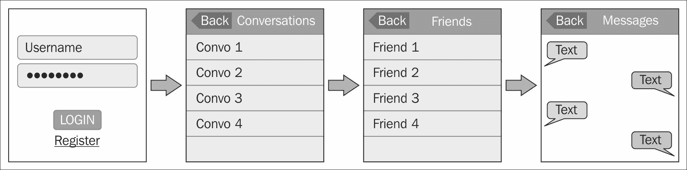
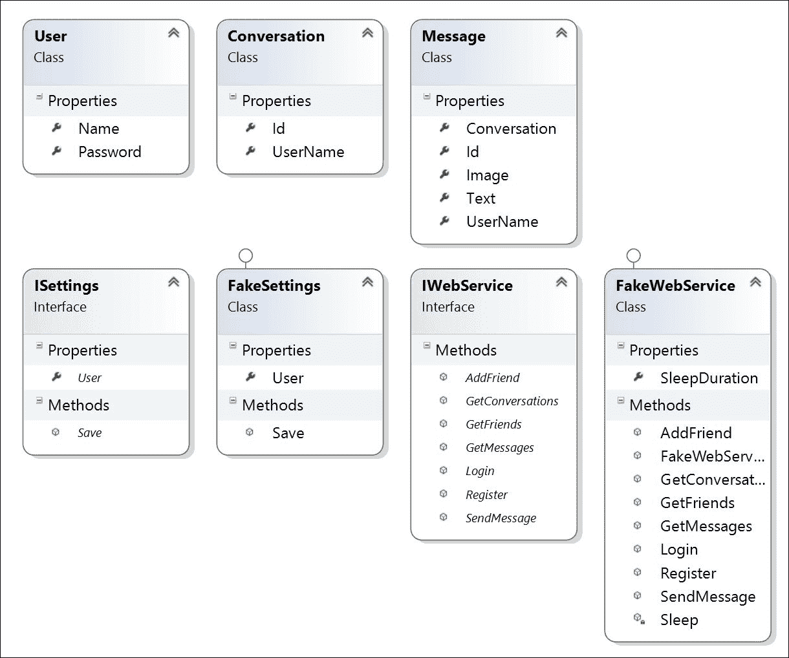
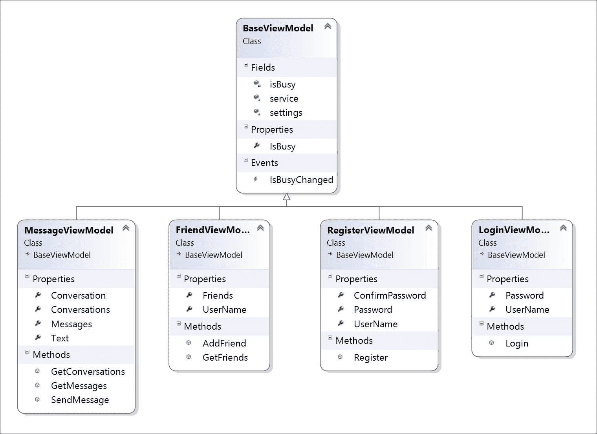
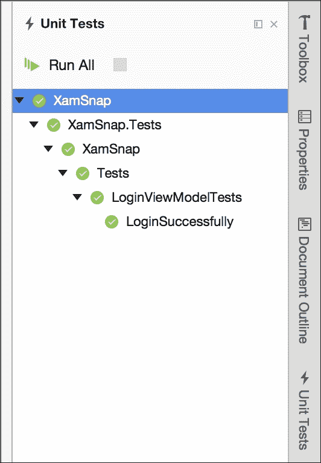
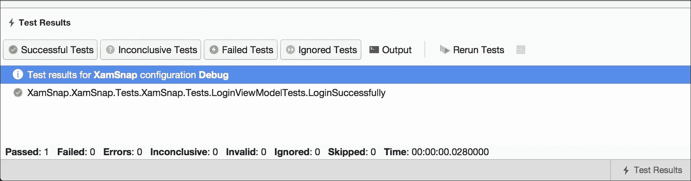
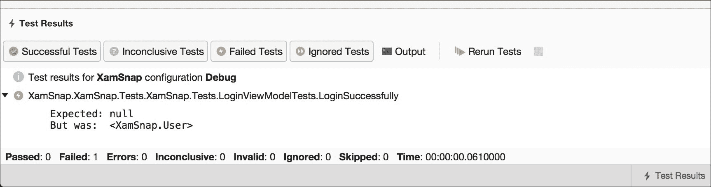

# 四、Xamsap——跨平台应用

在我看来，真正学习一项编程技能的最好方法是承担一个简单的项目，需要你锻炼这项技能。这给了新开发人员一个项目，在这个项目中，他们可以专注于他们试图学习的概念，而没有修复 bug 或遵循客户需求的开销。为了增加我们对 Xamarin 和跨平台开发的理解，让我们为 iOS 和 Android 开发一个名为 XamSnap 的简单应用。

在本章中，我们将涵盖以下主题:

*   我们的示例应用概念
*   我们应用的模型层
*   嘲笑网络服务
*   我们应用的视图模型层
*   编写单元测试

# 开始我们的示例应用概念

概念很简单:流行聊天应用 Snapchat 的简单克隆。苹果应用商店中有几个像这样受欢迎的应用，这可能是由于短信的成本以及对 iPod Touch 或 iPad 等设备的支持。这应该是一个简洁的真实例子，可能对用户有用，并将涵盖为 iOS 和 Android 开发应用的特定主题。

在开始开发之前，让我们列出一组我们需要的屏幕:

*   **登录/注册**:该屏幕将包括用户的标准登录和注册流程。
*   **对话列表**:该屏幕将包括一个按钮，用于开始新的对话。
*   **好友列表**:当我们开始新的对话时，这个屏幕会提供一个添加新好友的方式。
*   **对话**:这个屏幕会有你和另一个用户之间的消息列表，以及回复选项。

*   **摄像头**:除了短信，Snapchat 还有发送照片的功能。我们将添加使用设备的相机或照片库发送照片的选项。

因此，应用的快速线框布局将有助于我们更好地理解应用的布局。下图显示了要包含在应用中的一组屏幕:



# 开发我们的模型层

既然我们对应用有了很好的了解，下一步就是开发这个应用的业务对象或模型层。让我们从定义几个类开始，这些类将包含在整个应用中使用的数据。为了组织，建议将这些添加到项目中的`Models`文件夹中。

让我们从一个代表用户的类开始。该类可以按如下方式创建:

```cs
public class User 
{ 
  //NOTE: we will treat this as a unique name 
  public string Name { get; set; } 

  //NOTE: we'll try to use this in a secure way 
  public string Password { get; set; } 
} 

```

到目前为止相当简单；让我们继续创建表示对话和消息的类，如下所示:

```cs
public class Conversation 
{ 
  public string Id { get; set; } 

  public string UserName { get; set; } 
} 

public class Message 
{ 
  public string Id { get; set; } 

  //NOTE: the Id of a Conversation 
  public string Conversation { get; set; }  

  public string UserName { get; set; } 

  public string Text { get; set; }

//NOTE: some messages will include photos 
  public string Image { get; set; } 
} 

```

请注意，我们使用字符串作为各种对象的标识符；这将在后面的章节中简化我们与作为 Azure Function 运行的后端的集成。`UserName`是应用将设置的值，用于更改与对象相关联的用户。

现在，让我们继续执行以下步骤来设置我们的解决方案:

1.  首先创建一个新的解决方案，作为 iOS 和安卓的新**多平台|应用|单视图应用**项目。
2.  命名项目`XamSnap`并确保选择**使用可移植类库**。
3.  你也可以选择在这个项目中使用**共享项目**，但是我选择了使用一个可移植的类库。
4.  点击**创建**在指定目录下创建您的解决方案。

### 类型

就像前面几章一样，Visual Studio 的步骤有点不同。您将需要创建一个作为可移植类库的解决方案，然后*添加 iOS 和安卓项目。不要忘记在 iOS 和 Android 项目中都添加对 PCL 的引用。*

# 编写模拟网络服务

很多时候，在开发移动应用时，您可能需要在真正的后端 web 服务可用之前开始应用的开发。为了防止开发完全停止，一个好的方法是开发服务的模拟版本。当你需要编写单元测试，或者正在等待另一个团队为你的应用开发后端时，这也很有帮助。

首先，让我们分解我们的应用将对网络服务器执行的操作。操作如下:

1.  使用用户名和密码登录。
2.  注册一个新账户。
3.  获取用户的好友列表。
4.  通过用户名添加朋友。
5.  获取用户现有对话的列表。
6.  获取对话中的消息列表。
7.  发送消息。

现在让我们定义一个接口，为每个场景提供一个方法。方法如下:

```cs
public interface IWebService 
{ 
  Task<User> Login(string userName, string password); 

  Task<User> Register(User user); 

  Task<User[]> GetFriends(string userName); 

  Task<User> AddFriend(string username, string friendName); 

  Task<Conversation[]> GetConversations(string userName); 

  Task<Message[]> GetMessages(string conversation); 

  Task<Message> SendMessage(Message message); 
} 

```

如您所见，我们通过利用来自的**第三方物流** ( **任务并行库**)来简化与网络服务的任何异步通信。NET 基类库。

由于与 web 服务的通信可能是一个漫长的过程，因此使用`Task<T>`类进行这些操作总是一个好主意。否则，您可能会无意中在用户界面线程上运行冗长的任务，这将阻止用户在操作过程中输入。`Task`对于网络请求来说绝对是必需的，因为用户可以很容易地在 iOS 和安卓上使用蜂窝互联网连接，这将使我们能够在未来使用`async`和`await`关键词。

### 类型

如果您不熟悉 C#中的异步/等待简化异步编程，不妨在 https://msdn.microsoft.com/en-us/library/mt674882.aspx查看 MSDN 的相关主题

现在让我们实现一个实现这个接口的**假**服务。将`FakeWebService`等类放置在项目的`Fakes`文件夹中。让我们从类声明和接口的第一个方法开始:

```cs
public class FakeWebService : IWebService
{
  public int SleepDuration { get; set; }

  public FakeWebService()
  {
    SleepDuration = 1000;
  }

  private Task Sleep()
  {
    return Task.Delay(SleepDuration);
  }

  public async Task<User> Login(string userName, string password)
  {
    await Sleep(); 
    return new User { Name = userName }; 
  }
}

```

我们从一个`SleepDuration`属性开始，以毫秒为单位存储一个数字。这用于模拟与 web 服务器的交互，这可能需要一些时间。在不同情况下改变`SleepDuration`值也很有用。例如，在编写单元测试时，您可能希望将其设置为一个小数字，以便测试快速执行。

接下来，我们实现了一个简单的`Sleep`方法来返回一个引入了几毫秒延迟的任务。这种方法将在整个假服务中使用，从而导致每次操作的延迟。

最后，`Login`方法只使用了对`Sleep`方法的`await`调用，并返回了一个带有适当的`Name`的新的`User`对象。目前，任何用户名或密码组合都可以；但是，您可能希望在这里编写一些代码来检查特定的凭据。

现在，让我们再实现几个方法来继续我们的`FakeWebService`类，如下所示:

```cs
public async Task<User[]> GetFriends(string userId)
{
  await Sleep();
  return new[] 
  { 
    new User { Name = "bobama" }, 
    new User { Name = "bobloblaw" }, 
    new User { Name = "georgemichael" }, 
  };
}

public async Task<User> AddFriend(
  string username, string friendName)
{
  await Sleep(); 
  return new User { Name = friendName };
}

```

对于这些方法中的每一种，我们牢记与`Login`方法完全相同的模式。每种方法都会延迟并返回一些样本数据。请随意将数据与您自己的价值观相混淆。

现在，让我们如下实现界面所需的`GetConversations`方法:

```cs
public async Task<Conversation[]> GetConversations(
  string userName)
{
  await Sleep();
  return new[] 
  { 
    new Conversation { Id = "1", UserName = "bobama" },
    new Conversation { Id = "2", UserName = "bobloblaw" }, 
    new Conversation { Id = "3", UserName = "georgemichael" }, 
  };
}

```

基本上，我们只是用任意的 id 创建一个新的`Conversation`对象数组。我们还确保将`UserName`值与目前为止我们在`User`对象上使用的值相匹配。

接下来，让我们实现`GetMessages`来检索消息列表，如下所示:

```cs
public async Task<Message[]> GetMessages(string conversation) 
{ 
  await Sleep(); 

  return new[] 
  { 
    new Message 
    { 
      Id = "1", 
      Conversation = conversation, 
      UserName = "bobloblaw", 
      Text = "Hey", 
    }, 
    new Message 
    { 
      Id = "2", 
      Conversation = conversation, 
      UserName = "georgemichael", 
      Text = "What's Up?", 
    }, 
    new Message 
    { 
      Id = "3", 
      Conversation = conversation, 
      UserName = "bobloblaw", 
      Text = "Have you seen that new movie?", 
    }, 
    new Message 
    { 
      Id = "4", 
      Conversation = conversation, 
      UserName = "georgemichael", 
      Text = "It's great!", 
    }, 
  }; 
} 

```

我们再次在这里添加一些任意的数据，主要是确保`UserId`和`ConversationId`匹配到目前为止我们现有的数据。

最后，我们将编写一个方法来发送消息，如下所示:

```cs
public async Task<Message> SendMessage(Message message) 
{ 
  await Sleep(); 

  return message; 
} 

```

这些方法大多非常简单。请注意，服务不一定要完美工作；它应该只是延迟成功地完成每个操作。每个方法还应该返回某种要在用户界面中显示的测试数据。这将使我们能够在稍后填充网络服务时实现 iOS 和安卓应用。

接下来，我们需要实现一个简单的接口来保存应用设置。让我们定义一个名为`ISettings`的接口，如下所示:

```cs
public interface ISettings 
{ 
  User User { get; set; } 

  void Save(); 
} 

```

我们正在使`ISettings`同步，但是如果您计划将设置存储在云中，您可能希望将`Save`方法设置为异步并返回`Task`。我们的应用并不真正需要这个，因为我们将只在本地保存设置。

稍后，我们将使用安卓和 iOS APIs 在每个平台上实现这个接口。现在，让我们实现一个假版本，它将在我们编写单元测试时使用。用下面几行代码实现接口:

```cs
public class FakeSettings : ISettings 
{ 
  public User User { get; set; } 

  public void Save() { } 
} 

```

请注意，假版本实际上不需要做任何事情；我们只需要提供一个实现接口的类，并且不会抛出任何意外的错误。

这就完成了应用的模型层。这是我们到目前为止实现的最后一个类图:



# 编写视图模型层

现在我们已经实现了模型层，我们可以继续编写视图模型层了。视图模型将负责向用户界面呈现每个操作，并提供由视图层填充的属性。该层的其他常见职责是输入验证和显示繁忙指示器的简单逻辑。

此时，在我们的`XamSnap` PCL 项目中包含上一章的`ServiceContainer`类将是一个好主意，因为我们将通过视图模型使用它来与模型层交互。我们将使用它作为一个简单的选项来支持依赖注入和控制反转；但是，您可以为此使用另一个您喜欢的库。

通常，我们从为项目中的所有视图模型层编写一个基类开始。这是一个放置所有子类使用的部分代码的好地方，例如:通知更改、方法或常用接口。

将以下代码片段放入项目中的新`ViewModels`文件夹中:

```cs
public class BaseViewModel 
{ 
  protected readonly IWebService service = 
     ServiceContainer.Resolve<IWebService>(); 
  protected readonly ISettings settings = 
     ServiceContainer.Resolve<ISettings>(); 

  public event EventHandler IsBusyChanged = (sender, e) => { }; 

  private bool isBusy = false; 

  public bool IsBusy 
  { 
    get { return isBusy; } 
    set 
    { 
      isBusy = value; 
      IsBusyChanged(this, EventArgs.Empty); 
    } 
  } 
} 

```

`BaseViewModel`类是放置您计划在整个应用中重用的任何公共功能的好地方。对于这个应用，我们只需要实现一种方法来指示视图模型层是否繁忙。我们提供了一个属性和一个事件，用户界面将能够订阅并在屏幕上显示一个等待指示器。我们还为需要的服务添加了一些字段。可以添加的另一个常见功能是验证用户输入；然而，对于这个应用，我们并不真正需要它。

## 实现我们的 LoginViewModel 类

现在我们有了一个用于所有视图模型层的基类，我们可以为应用中的第一个屏幕**登录**屏幕实现视图模型。

现在让我们实现一个`LoginViewModel`类，如下所示:

```cs
public class LoginViewModel : BaseViewModel 
{ 
  public string UserName { get; set; } 

  public string Password { get; set; } 

  public async Task Login() 
  { 
    if (string.IsNullOrEmpty(UserName)) 
      throw new Exception("Username is blank."); 

    if (string.IsNullOrEmpty(Password)) 
      throw new Exception("Password is blank."); 

    IsBusy = true; 
    try 
    { 
      settings.User = await service.Login(UserName, Password); 
      settings.Save(); 
    } 
    finally 
    { 
      IsBusy = false; 
    } 
  } 
} 

```

在这个类中，我们实现了以下内容:

*   我们对`BaseViewModel`进行了子类化，以访问`IsBusy`和包含公共服务的字段
*   我们添加了要由视图层设置的`UserName`和`Password`属性
*   我们添加了一个`User`属性，在登录过程完成时进行设置
*   我们实现了一个从视图中调用的`Login`方法，对`UserName`和`Password`属性进行了验证
*   我们在调用`IWebService`上的`Login`方法时设置`IsBusy`
*   我们通过在网络服务上等待`Login`的结果来设置`User`属性

基本上，这是我们将在应用的其余视图模型中遵循的模式。我们提供了由用户输入设置的视图层的属性，以及调用各种操作的方法。如果这是一个可能需要一些时间的方法，比如一个 web 请求，你应该总是返回`Task`并使用`async`和`await`关键词。

### 类型

请注意，我们使用了`try`和`finally`块将`IsBusy`设置回`false`。这将确保即使在抛出异常时也能正确重置。我们计划在视图层处理错误，这样我们就可以向显示消息的用户显示一个本地弹出窗口。

## 实现我们的 RegisterViewModel 类

既然我们已经写完了登录的`ViewModel`类，我们现在需要为用户注册创建一个。

让我们实现另一个视图模型来注册一个新用户:

```cs
public class RegisterViewModel : BaseViewModel 
{ 
  public string UserName { get; set; } 

  public string Password { get; set; } 

  public string ConfirmPassword { get; set; } 
} 

```

这些属性将处理来自用户的输入。接下来，我们需要添加一个`Register`方法，如下所示:

```cs
public async Task Register() 
{ 
  if (string.IsNullOrEmpty(UserName)) 
    throw new Exception("Username is blank."); 

  if (string.IsNullOrEmpty(Password)) 
    throw new Exception("Password is blank."); 

  if (Password != ConfirmPassword) 
    throw new Exception("Passwords do not match."); 

  IsBusy = true; 
  try 
  { 
    settings.User = await service.Register(new User  
    {  
      Name = UserName, 
      Password = Password,  
    }); 
    settings.Save(); 
  } 
  finally 
  { 
    IsBusy = false; 
  } 
} 

```

`RegisterViewModel`类与`LoginViewModel`类非常相似，但是它有一个额外的`ConfirmPassword`属性供用户界面设置。当用户界面有一个新的屏幕时，总是创建一个新的类，这是分割视图模型层功能的一个很好的规则。这有助于保持你的代码整洁，并在某种程度上遵循你的类的**单一责任原则**。 **SRP** 规定，一个班级应该只有一个单一的目的或责任。我们将尝试遵循这个概念来保持我们的类小而有组织，这在跨平台共享代码时可能比平时更重要。

## 实现我们的 FriendViewModel 类

接下来是一个视图模型层，用于处理用户的朋友列表。我们将需要一种方法来加载用户的朋友列表，并添加一个新朋友。

下面我们来实现`FriendViewModel`如下:

```cs
public class FriendViewModel : BaseViewModel 
{ 
  public User[] Friends { get; private set; } 

  public string UserName { get; set; } 
} 

```

现在我们需要一个加载朋友的方法。这个方法如下:

```cs
public async Task GetFriends() 
{ 
  if (settings.User == null) 
    throw new Exception("Not logged in."); 

  IsBusy = true; 
  try 
  { 
    Friends = await service.GetFriends(settings.User.Name); 
  } 
  finally 
  { 
    IsBusy = false; 
  } 
} 

```

最后，我们需要一个方法来添加一个新朋友，然后更新本地包含的朋友列表:

```cs
public async Task AddFriend()
{
  if (settings.User == null)
    throw new Exception("Not logged in.");
  if (string.IsNullOrEmpty(UserName))
    throw new Exception("Username is blank.");
  IsBusy = true; 

  try 
  { 
    var friend = await service
      .AddFriend(settings.User.Name, UserName); 
    //Update our local list of friends 
    var friends = new List<User>(); 
    if (Friends != null)
      friends.AddRange(Friends); 
    friends.Add(friend); 
    Friends =  friends.OrderBy(f => f.Name).ToArray(); 
  } 
  finally 
  { 
    IsBusy =  false; 
  }
}

```

同样，这个类相当简单。这里唯一新的是，我们添加了一些逻辑来更新朋友列表，并在客户端应用而不是服务器中对他们进行排序。如果你有充分的理由，你也可以选择重新加载完整的好友列表。

## 实现我们的 MessageViewModel 类

我们最终需要的视图模型层将处理消息和对话。我们需要创建一种方法来加载对话和消息，并发送新消息。

让我们开始实现我们的`MessageViewModel`类，如下所示:

```cs
public class MessageViewModel : BaseViewModel 
{ 
  public Conversation[] Conversations { get; private set; } 

  public Conversation Conversation { get; set; } 

  public Message[] Messages { get; private set; } 

  public string Text { get; set; } 
} 

```

接下来，让我们实现一个方法来检索对话列表，如下所示:

```cs
public async Task GetConversations() 
{ 
  if (settings.User == null) 
    throw new Exception("Not logged in."); 

  IsBusy = true; 
  try 
  { 
    Conversations = await service
       .GetConversations(settings.User.Name); 
  } 
  finally 
  { 
    IsBusy = false; 
  } 
} 

```

同样，我们需要检索对话中的消息列表。我们需要将对话标识传递给服务，如下所示:

```cs
public async Task GetMessages() 
{ 
  if (Conversation == null) 
    throw new Exception("No conversation."); 

  IsBusy = true; 
  try 
  { 
    Messages = await service
       .GetMessages(Conversation.Id); 
  } 
  finally 
  { 
    IsBusy = false; 
  } 
} 

```

最后，我们需要编写一些代码来发送消息，并更新消息的本地列表，如下所示:

```cs
public async Task SendMessage() 
{ 
  if (settings.User == null) 
    throw new Exception("Not logged in."); 

  if (Conversation == null) 
    throw new Exception("No conversation."); 

  if (string.IsNullOrEmpty (Text)) 
    throw new Exception("Message is blank."); 

  IsBusy = true; 
  try 
  { 
    var message = await service.SendMessage(new Message  
    {  
        UserName = settings.User.Name,
         Conversation = Conversation.Id, 
        Text = Text 
    }); 

    //Update our local list of messages 
    var messages = new List<Message>(); 
    if (Messages != null) 
      messages.AddRange(Messages); 
    messages.Add(message); 

    Messages = messages.ToArray(); 
  } 
  finally 
  {
    IsBusy = false; 
  } 
} 

```

我们的应用的视图模型层以及 iOS 和安卓上使用的所有共享代码到此结束。对于`MessageViewModel`类，你也可以选择将`GetConversations`和`Conversations`属性放在自己的类中，因为它们可以被认为是一个单独的责任，但实际上没有必要。

这是我们的视图模型层的最终类图:



# 编写单元测试

因为我们到目前为止所写的所有代码都不依赖于用户界面，所以我们可以很容易地针对我们的类编写单元测试。这一步一般在第一次实现`ViewModel`类后进行。**测试驱动开发** ( **TDD)** 的支持者会建议先编写测试，然后再实现，所以选择哪种方法最适合你。无论是哪种情况，在从视图层开始使用共享代码之前，针对它们编写测试都是一个好主意，这样您就可以在 bug 阻碍您在用户界面上的开发之前发现它们。

Xamarin 项目利用了一个名为 **NUnit** 的开源测试框架。它最初源于一个名为 **JUnit** 的 Java 测试框架，是 C#应用单元测试的事实标准。Xamarin Studio 为使用 **NUnit** 编写测试提供了几个项目模板。

## 为单元测试建立一个新项目

让我们通过执行以下步骤来为单元测试设置一个新项目:

1.  为您的解决方案添加新的**努涅特库** **项目**，在**其他|下找到。Xamarin 工作室中的 Net** 部分。如果使用 Visual Studio，请创建一个. NET 类库并添加 NUnit NuGet 包。
2.  将项目命名为`XamSnap.Tests`以保持一致。
3.  右击项目引用，选择**编辑引用**。
4.  在**项目**选项卡下，添加对现有可移植类库 **XamSnap** 的引用。
5.  现在，打开`Test.cs`文件，注意到使用 NUnit 组成单元测试所需的以下属性:

*   `using NUnit.Framework`:这个属性是使用 NUnit 的主要语句
*   `[TestFixture]`:这修饰了一个类，表明这个类有一个运行测试的方法列表
*   `[Test]`:这修饰了一个表示测试的方法

除了必需的 C#属性之外，还有其他几个对编写测试有用的属性，如下所示:

*   `[TestFixtureSetUp]`:这修饰了一个在文本夹具类中包含的所有测试之前运行的方法。
*   `[SetUp]`:这修饰了一个在测试夹具类中每次测试之前运行的方法。
*   `[TearDown]`:这修饰了测试夹具类中每次测试后运行的方法。
*   `[TestFixtureTearDown]`:这修饰了一个在文本夹具类中的所有测试完成后运行的方法。
*   `[ExpectedException]`:这修饰了一个打算抛出异常的方法。测试被认为失败的案例是很有用的。
*   `[Category]`:这修饰了一个测试方法，可以用来组织不同的测试；例如，您可以对快速测试和慢速测试进行分类。

## 撰写断言

使用 NUnit 编写测试的下一个概念是学习如何编写**断言**。断言是一种方法，如果某个值不为真，它将引发异常。它会导致测试失败，并对发生的事情给出描述性的解释。NUnit 有几组不同的断言 APIs 然而，我们将使用可读性更强、更流畅的 API 版本。

流畅风格的 API 的基本语法是使用`Assert.That`方法。以下示例显示了这一点:

```cs
Assert.That(myVariable, Is.EqualTo(0)); 

```

同样，您可以断言相反的情况:

```cs
Assert.That(myVariable, Is.Not.EqualTo(0)); 

```

或以下任何一项:

*   断言。即(myVariable，Is。greater than(0))；
*   断言。即(myBooleanVariable，Is。真)；
*   断言。那个(我的对象，是。not . Null)；

请随意探索 API。在 Xamarin Studio 中完成代码后，您应该能够在`Is`类中发现有用的静态成员或方法，以便在测试中使用。

在我们开始为我们的应用编写特定的测试之前，让我们编写一个静态类和方法来创建一个全局设置，以便在整个测试中使用；您可以将`Test.cs`改写如下:

```cs
public class BaseTest 
{ 
  [SetUp] 
  public virtual void SetUp() 
  { 
    ServiceContainer.Register<IWebService>(() =>
       new FakeWebService { SleepDuration = 0 }); 
    ServiceContainer.Register<ISettings>(() =>
       new FakeSettings()); 
  } 
} 

```

我们将在整个测试中使用这种方法在我们的模型层中设置假服务。此外，这将替换现有的服务，以便我们的测试针对这些类的新实例执行。这是单元测试中的一个很好的实践，可以保证没有以前测试留下的旧数据。还要注意我们将`SleepDuration`设置为`0`。这将使我们的测试运行得非常快。

首先在测试项目中创建一个`ViewModels`文件夹，并添加一个名为`LoginViewModelTests`的类，如下所示:

```cs
[TestFixture] 
public class LoginViewModelTests : BaseTest 
{ 
  LoginViewModel loginViewModel; 
  ISettings settings; 

  [SetUp] 
  public override void SetUp() 
  { 
    base.SetUp(); 

    settings = ServiceContainer.Resolve<ISettings>(); 
    loginViewModel = new LoginViewModel(); 
  } 

  [Test] 
  public async Task LoginSuccessfully() 
  { 
    loginViewModel.UserName = "testuser"; 
    loginViewModel.Password = "password"; 

    await loginViewModel.Login(); 

    Assert.That(settings.User, Is.Not.Null); 
  } 
} 

```

注意我们使用的`SetUp`方法。我们重新创建每个测试中使用的对象，以确保没有以前测试运行留下的旧数据。另一点需要注意的是，在测试方法中使用`async` / `await`时，必须返回一个`Task`。否则，NUnit 将无法知道测试何时完成。

要运行测试，使用默认情况下停靠在 Xamarin Studio 右侧的 NUnit 菜单。使用带有档位图标的**运行测试**按钮继续运行测试；您应该会获得类似于下面截图所示的成功结果:



您还可以查看**测试结果**窗格，如果测试失败，该窗格将显示扩展的详细信息；如下图所示:



### 类型

如果使用 Visual Studio，您需要从 Visual Studio 图库安装 **NUnit 测试适配器**扩展。您可以在**工具|扩展和更新**菜单下找到该选项。Visual Studio 中的单元测试运行器和 Xamarin Studio 一样直观；但是，它只支持开箱即用的 MsTest。

要查看测试失败时会发生什么，请继续修改您的测试以断言不正确的值，如下所示:

```cs
//Change Is.Not.Null to Is.Null 
Assert.That(settings.User, Is.Null); 

```

您将在**测试结果**窗格中看到一个非常描述性的错误，如下图所示:



现在让我们为`LoginViewModel`类实现另一个测试；如果用户名和密码为空，让我们确保得到适当的结果。测试按如下方式实施:

```cs
[Test] 
public async Task LoginWithNoUsernameOrPassword() 
{ 
  //Throws an exception 
  await loginViewModel.Login(); 
} 

```

如果我们按原样运行测试，我们将得到一个异常，测试将失败。因为我们预期会发生异常，所以我们可以修饰方法，使测试仅在异常发生时通过，如下所示:

```cs
[Test,  
  ExpectedException(typeof(Exception),  
  ExpectedMessage = "Username is blank.")] 

```

### 类型

请注意，在我们的视图模型中，如果**字段为空**，则会抛出一个通用`Exception`类型。在异常类型不同的情况下，也可以更改预期异常的类型。

更多的测试包含在本书的示例代码中。建议在每个`ViewModel`类上针对每个公共操作编写测试。此外，为任何验证或其他重要的业务逻辑编写测试。我还建议针对模型层编写测试；然而，在我们的项目中还不需要它，因为我们只有假的实现。

# 总结

在这一章中，我们讨论了一个示例应用的概念，我们将在这本书《XamSnap》中构建这个示例应用。我们还在模型层实现了应用的核心业务对象。因为我们还没有服务器来支持这个应用，所以我们实现了一个假的 web 服务。这为我们提供了在不构建服务器应用的情况下推进应用的灵活性。我们还实现了视图模型层。该层将以简单的方式向视图层公开操作。最后，我们编写了测试，涵盖了我们到目前为止使用 NUnit 编写的代码。针对跨平台应用中的共享代码编写测试非常重要，因为它是多个应用的主干。

完成本章后，您应该已经完整地完成了我们跨平台应用的共享库。您应该对我们应用的体系结构及其不同的模型和视图模型层有一个非常坚定的理解。您还应该很好地理解如何编写应用中可能还没有准备好实现的部分的假版本。在下一章中，我们将实现 iOS 版本的 XamSnap。