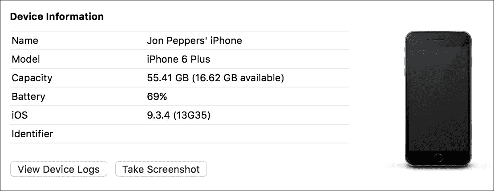
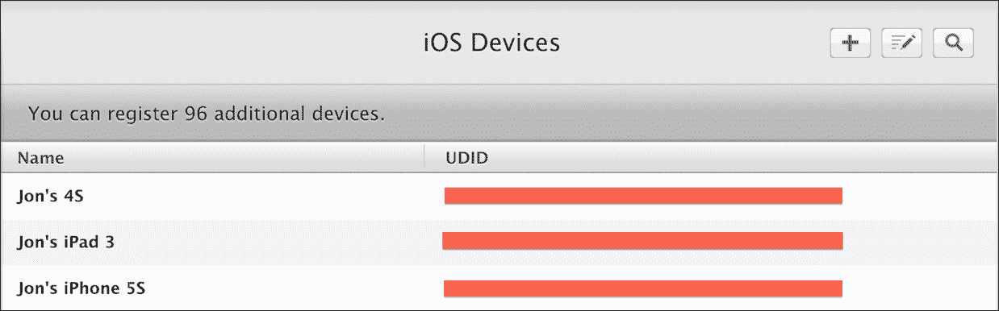
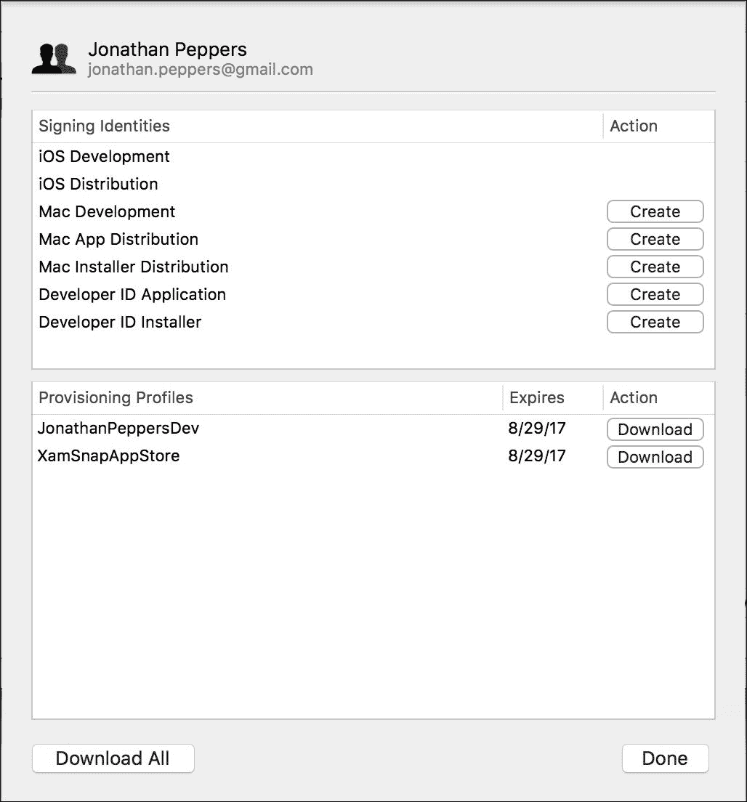
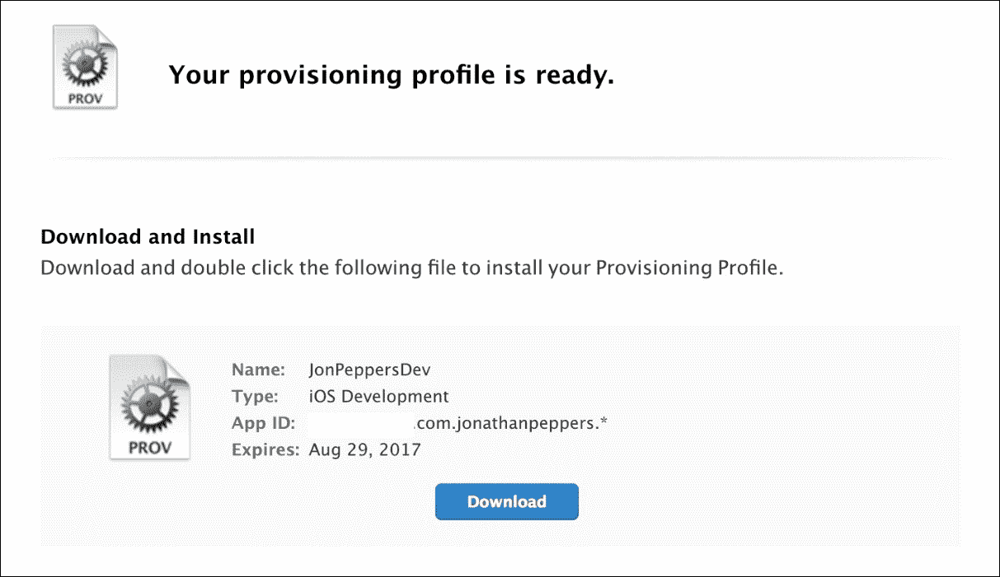
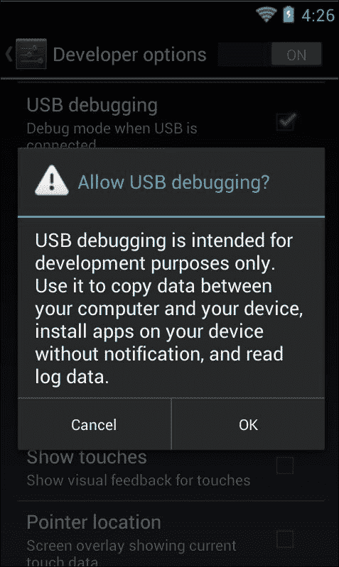
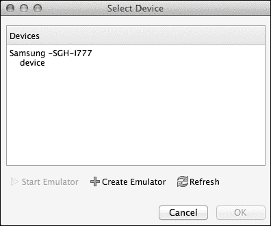

# 第七章。在设备上部署和测试

第一次尝试时，部署到设备既重要又有点麻烦。某些问题只会发生在移动设备上，无法在 iOS 模拟器或安卓模拟器中重现。您还可以测试仅在真实设备上可能进行的测试，例如全球定位系统、摄像头、内存限制或蜂窝网络连接。在为 Xamarin 开发时，也有一些常见的陷阱，只有在物理设备上进行测试时才会暴露出来。

在本章中，我们将介绍:

*   iOS 配置
*   用于调试的安卓设备设置
*   链接器
*   提前(AOT)编译
*   Xamarin 常见的内存陷阱

在我们开始本章之前，需要注意的是，要部署到 iOS 设备，需要有效的 iTunes 帐户或 iOS 开发者计划成员资格。请随意回到[第 1 章](01.html#aid-E9OE1 "Chapter 1. Xamarin Setup")、 *Xamarin 设置*，来完成这个过程。

# iOS 配置

苹果在 iOS 设备上部署应用程序有严格的流程。虽然对开发者来说相当复杂，有时也很痛苦，但苹果可以通过防止普通用户侧装潜在的恶意应用程序来实现一定程度的安全性。

在将我们的应用程序部署到 iOS 设备之前，我们需要在 **iOS 开发中心**中设置一些东西。我们将首先为您的帐户创建一个应用程序标识或捆绑包标识。这是任何 iOS 应用程序的主要标识符。

首先导航至[http://developer.apple.com/account](http://developer.apple.com/account)，并执行以下步骤:

1.  使用您的开发人员帐户登录。
2.  点击右侧导航中的**证书、身份证、&档案**。
3.  点击**应用标识**。
4.  单击加号按钮添加新的 iOS 应用程序标识。
5.  在**名称**字段中，输入有意义的内容，如`YourCompanyNameWildcard`。
6.  选择**通配符应用程序标识**单选按钮。
7.  在**捆绑包标识**字段中，为您的公司选择一个反向域名，如`com.yourcompanyname.*`。
8.  点击**继续**。
9.  查看最终设置，点击**提交**。

保持此网页打开，因为我们将在整个章节中使用它。

我们刚刚为您的帐户注册了通配符捆绑标识；将此作为您希望与此帐户相关联的所有未来应用程序的前缀。稍后，当您准备将应用部署到苹果应用商店时，您将创建一个**显式应用标识**，如`com.yourcompanyname.yourapp`。这允许您将特定的应用程序部署到商店，而通配符标识最适合部署到设备进行测试。

接下来，我们需要找到您计划调试应用程序的每个设备上的唯一标识符。苹果要求每台设备都在您的帐户下注册，每个开发者的每种设备类型最多只能有 110 台设备(110 台 iPhones、iPads、iPods、苹果电视或苹果手表)。规避这一要求的唯一方法是注册 iOS 开发者企业计划，该计划的年费为 299 美元，与标准的 99 美元开发者费用不同。

首先启动 Xcode，并执行以下步骤:

1.  点击顶部菜单中的**窗口** | **设备**。
2.  用 USB 电缆插入目标设备。
3.  在左侧导航中，您应该会看到设备的名称；选择它。
4.  请注意设备的**标识符**值。将其复制到剪贴板。

以下屏幕截图显示了在 Xcode 中选择设备时屏幕的外观:



返回[http://developer.apple.com/account](http://developer.apple.com/account)(希望本章前面的部分仍然打开)并执行以下步骤:

1.  点击左侧导航中的**设备|所有**。
2.  点击页面右上角的加号按钮。
3.  为您的设备输入一个有意义的名称，并将剪贴板中的**标识符**粘贴到 **UDID** 字段中。
4.  点击**继续**。
5.  查看您输入的信息，点击**注册**。

接下来，当你的账户设置完成后，你只需点击 Xcode 中的**用于开发**按钮，跳过第二组步骤。

以下屏幕截图显示了设备列表完成后的样子:



接下来，我们需要生成一个证书来代表您作为您帐户的开发者。在 Xcode 5 之前，您必须使用 Mac 上的**钥匙串**应用程序来创建证书签名请求。Xcode 的新版本通过将许多这种过程集成到 Xcode 中，使事情变得容易得多。

打开 Xcode 并执行以下步骤:

1.  导航至顶部菜单中的 **Xcode** | **偏好设置**。
2.  选择**账户**标签。
3.  点击左下角的加号按钮，然后点击**添加苹果 ID** 。
4.  输入开发人员帐户的电子邮件和密码。
5.  创建账户后，点击右下角的**查看详情**。
6.  点击左下角的**全部下载**按钮。
7.  如果这是一个新帐户，Xcode 将显示一个警告，说明还没有证书。选中每个框，点击**请求**生成证书。

Xcode 现在将自动为您的帐户创建一个开发者证书，并将其安装到您的 Mac 的钥匙串中。

以下屏幕截图显示了设置帐户后屏幕的外观:



接下来，我们需要创建一个**供应配置文件**。这是允许应用程序安装在 iOS 设备上的最终文件。供应配置文件包含应用程序标识、设备标识列表，最后是开发人员的证书。您还必须在 Mac 的钥匙串中拥有开发者证书的私钥，才能使用设置配置文件。

以下是几种类型的资源调配配置文件:

*   **开发**:用于调试或发布版本；当您的应用程序正在开发中时，您将积极使用这种类型的配置文件。
*   **临时**:主要用于发布版本；这种类型的证书非常适合 beta 测试或分发给一小部分用户。您可以通过企业开发人员帐户使用此方法向无限数量的用户分发。
*   **应用商店**:用于发布提交给应用商店的构建。您无法使用此证书将应用程序部署到您的设备；它只能用于商店提交。

让我们返回到[http://developer.apple.com/apple](http://developer.apple.com/apple)，通过执行以下步骤创建新的配置文件:

1.  点击左侧导航中的**供应配置文件|全部**。
2.  点击页面右上角的加号按钮。
3.  选择 **iOS 应用开发**，点击**继续**。
4.  选择您在本章前面创建的通配符应用程序标识，然后点击**继续**。
5.  选择我们在本章前面创建的证书，点击**继续**。
6.  选择要部署的设备，点击**继续**。
7.  输入适当的**档案名称**，如`YourCompanyDev`。
8.  点击**继续**，将创建您的供应配置文件。

下面的屏幕截图显示了您将在创建时使用的新配置文件。不用担心下载文件；我们将使用 Xcode 导入最终的概要文件。



要导入配置文件，请返回 Xcode 并执行以下步骤:

1.  导航至对话框顶部菜单中的 **Xcode** | **偏好设置**。
2.  选择**账户**标签。
3.  选择您的账户，点击**查看详情**。
4.  点击左下角的**全部下载**按钮。
5.  几秒钟后，您的配置文件将出现。

Xcode 应该自动包含您在苹果开发者网站上创建的任何配置文件。Xcode 还会自己创建一些配置文件。

在最新版本的 Xamarin Studio 中，您可以查看这些配置文件，但无法同步它们。导航至 **Xamarin Studio** | **首选项** | **开发人员帐户**查看 Xamarin Studio 的配置文件。您也可以在他们的文档网站[http://developer . Xamarin . com/guides/iOS/入门/device_provisioning/](http://developer.xamarin.com/guides/ios/getting_started/device_provisioning/) 上看到 Xamarin 关于 iOS 预配的文档。

# 安卓设备设置

与在 iOS 设备上部署应用程序的麻烦相比，安卓轻而易举。要将应用程序部署到设备，您只需在设备上设置一些设置。这是由于安卓相对于 iOS 的开放性。对于大多数用户来说，安卓设备调试是关闭的，但是任何希望尝试编写安卓应用程序的用户都可以轻松打开它。

首先打开**设置**应用程序。您可能需要通过查看设备上的所有应用程序来找到这个位置，如下所示:

1.  向下滚动并点击标有**开发者选项**的部分。
2.  在顶部的操作栏中，您可能需要将一个开关切换到 **ON** 位置。这因设备而异。
3.  向下滚动检查 **USB 调试**。
4.  将出现警告确认；点击**确定**。

### 类型

请注意，一些较新的安卓设备使普通用户打开 USB 调试变得有点困难。你必须点击**开发者选项**七次才能打开该选项。

以下屏幕截图显示了您的设备在此过程中的外观:



启用此选项后，您所要做的就是通过 USB 插入您的设备，并在 Xamarin Studio 中调试安卓应用程序。您将在**选择设备**对话框中看到您的设备。请注意，如果您在 Windows 上或有非标准设备，您可能需要访问设备供应商的网站来安装驱动程序。大多数三星和 Nexus 设备都会自动安装驱动程序。在 Android 4.3 及更高版本上，在开始 USB 调试会话之前，设备上还会出现一个确认对话框。

下面的截图显示了在**选择设备**对话框中，你的三星 Galaxy 设备会是什么样子。Xamarin Studio 将显示型号，这并不总是一个您可以识别的名称。您可以在设备设置中查看此型号。



# 理解连接体

为了让 Xamarin 应用程序在移动设备上保持小巧轻便，Xamarin 为其编译器创建了一个名为**链接器**的功能。它的主要目的是从核心 Mono 程序集(如`System.dll`)和平台特定程序集(`Mono.Android.dll`和`Xamarin.iOS.dll`)中剥离未使用的代码；但是，如果设置为在自己的程序集中运行，它也可以给您带来同样的好处。如果不运行链接器，整个 Mono 框架可以有 30 兆字节左右。这就是为什么默认情况下在设备构建中启用链接，这使您能够保持应用程序较小。

链接器使用静态分析来处理程序集中的各种代码路径。如果它确定从未使用过某个方法或类，它将从该程序集中移除未使用的代码。这可能是一个耗时的过程，因此在模拟器中运行的构建默认情况下会跳过这一步。

Xamarin 应用程序对链接器有以下三个主要设置:

*   **不链接**:这里跳过链接器编译步骤。这最适合在模拟器中运行的构建，或者如果您需要诊断链接器的潜在问题。
*   **仅链接 SDK 程序集**:在这种情况下，链接器将仅在核心 Mono 程序集如`System.dll`、`System.Core.dll`和`System.Xml.dll`上运行。
*   **链接所有程序集**:在这种情况下，链接器针对应用程序中的所有程序集运行，包括您正在使用的任何类库或第三方程序集。

这些设置可以在任何 Xamarin.iOS 或 Xamarin 的**项目**选项中找到。安卓应用。这些设置通常不会出现在类库中，因为它们通常与将要部署的 iOS 或 Android 应用程序相关联。

链接器也可能在运行时导致潜在的问题，因为在某些情况下，它的分析会错误地确定一段代码未被使用。如果您使用的是`System.Reflection`命名空间中的特性，而不是直接访问方法或属性，就会发生这种情况。这就是为什么在物理设备上测试应用程序很重要的一个原因，因为链接是为设备构建启用的。

为了演示这个问题，让我们看看下面的代码示例:

```cs
//Just a simple class for holding info 
public class Person 
{ 
  public int Id { get; set; } 
  public string Name { get; set; } 
} 

//Then somewhere later in your code 
var person = new Person { Id = 1, Name = "Chuck Norris" }; 
var propInfo = person.GetType().GetProperty("Name"); 
string value = propInfo.GetValue(person) as string; 
Console.WriteLine("Name: " + value); 

```

使用**不链接**或**仅链接软件开发工具包组件**选项，运行上述代码将会很好。但是，如果您在使用**链接所有组件**时尝试运行此操作，您将会得到类似以下内容的异常:

```cs
Unhandled Exception: 
System.ArgumentException: Get Method not found for 'Name'
   at System.Reflection.MonoProperty.GetValue (System.Object obj,
   BindingFlags invokeAttr, System.Reflection.Binder binder,
   System.Object[] index, System.Globalization.CultureInfo culture)
   at System.Reflection.PropertyInfo.GetValue (System.Object obj) 

```

由于`Name`属性的 getter 从未直接从代码中使用，链接器将其从程序集中剥离。这导致反射代码在运行时失败。

即使在您的代码中可能会出现潜在的问题，**链接所有程序集**的选项仍然非常有用。有一些优化只能在这种模式下执行，Xamarin 可以将您的应用程序缩小到尽可能小的大小。如果性能或微小的下载量是您的应用程序的要求，尝试这个选项。但是，应该执行彻底的测试来验证链接程序集不会导致任何问题。

为了解决代码中的问题，Xamarin 包含了一套完整的解决方法来防止代码的特定部分被剥离。

一些选项包括以下内容:

*   用`[Preserve]`标记班级成员；这将强制链接器包含属性化的方法、字段或属性。
*   用`[Preserve(AllMembers=true)]`标记一整节课；这将保留类中的所有代码。
*   用`[assembly: Preserve]`标记整个组件；这是一个程序集级属性，将保留其中包含的所有代码。
*   通过修改项目选项中的**附加参数**跳过整个装配；使用`--linkskip=System`跳过整个装配。这可用于没有源代码的程序集。
*   通过 XML 文件进行自定义链接，当您需要跳过没有源代码的特定类或方法的链接时，这是最好的选择。在附加参数中使用`--xml=YourFile.xml`。

以下是演示自定义链接的示例 XML 文件:

```cs
<linker> 
  <assembly fullname="mscorlib"> 
    <type fullname="System.Environment"> 
      <field name="mono_corlib_version" /> 
      <method name="get_StackTrace" />  
    </type> 
  </assembly> 
  <assembly fullname="My.Assembly.Name"> 
    <type fullname="MyTypeA" preserve="fields" /> 
      <method name=".ctor" /> 
    </type> 
    <type fullname="MyTypeB" />                          
      <method signature="System.Void MyFunc(System.Int32 x)" /> 
      <field signature="System.String _myField" /> 
    </type> 
  </assembly> 
</linker> 

```

自定义链接是最复杂的选项，通常是最后的手段。幸运的是，大多数 Xamarin 应用程序不必解决许多链接器问题。

# 了解 AOT 编译

Mono 和背后的运行时。NET 是基于一个及时的编译器。C#和其他。NET 语言编译成**微软中间语言** ( **MSIL** )。在运行时，MSIL 被编译成本机代码(及时)以在运行应用程序的任何类型的架构上运行。Xamarin。安卓遵循这种模式。但是由于苹果对动态生成代码的限制，iOS 上不允许使用**准时制(JIT)** 编译器。

为了解决这个限制，Xamarin 开发了一个名为**提前** ( **AOT** )编译的新选项，在这个选项中，你的 C#代码被编译成本机的、平台特定的机器代码。除了制作。NET 可能在 iOS 上运行，AOT 还有其他好处，比如启动时间更短，性能可能更好。

AOT 也有一些通常与 C#泛型相关的限制。为了提前编译程序集，编译器需要对代码运行一些静态分析来确定类型信息。泛型给这种情况带来了麻烦。

AOT 不支持一些情况，但是在 C#中完全有效。第一个是通用接口，如下所示:

```cs
interface MyInterface<T>  
{ 
  T GetMyValue(); 
} 

```

编译器无法提前确定可能实现此接口的类，尤其是当涉及多个程序集时。第二个限制与第一个限制相关:您不能重写包含泛型参数或返回值的虚拟方法。

下面是一个简单的例子:

```cs
class MyClass<T> 
{ 
  public virtual T GetMyValue()  
  { 
    //Some code here 
  } 
} 

class MySubClass : MyClass<int> 
{ 
  public override int GetMyValue() 
  { 
    //Some code here 
  } 
} 

```

同样，编译器的静态分析无法确定哪些类可以在编译时重写此方法。

另一个限制是不能在泛型类中使用`DllImport`，如下面的代码所示:

```cs
class MyGeneric<T> 
{ 
  [DllImport("MyImport")] 
  public static void MyImport(); 
} 

```

如果不熟悉语言特性，`DllImport`是从 C#调用原生 C/C++方法的一种方式。不支持在泛型类中使用它们。

这些限制是为什么在设备上测试很重要的另一个很好的原因，因为前面的代码在其他可以运行 C#代码的平台上可以很好地工作，但在 Xamarin.iOS 上不行。

# 避免常见的记忆陷阱

移动设备上的内存当然不是无限的商品。因此，应用程序中的内存使用可能比桌面应用程序更重要。有时，您可能会发现需要使用内存分析器或改进代码来更有效地使用内存。

以下是最常见的内存陷阱:

*   **垃圾收集器** ( **垃圾收集器**)无法快速收集大对象以跟上您的应用程序
*   您的代码无意中导致了内存泄漏
*   C#对象被垃圾收集，但后来被本机代码尝试使用

让我们看看第一个问题，GC 跟不上。假设我们有一个带有按钮的 Xamarin.iOS 应用程序，用于在 Twitter 上共享图像，如下所示:

```cs
twitterShare.TouchUpInside += (sender, e) => 
{ 
  var image = UImage.FromFile("YourLargeImage.png"); 
  //Share to Twitter 
}; 

```

现在让我们假设图像是来自用户相机胶卷的 10 MB 图像。如果用户点击按钮并迅速取消推特帖子，你的应用程序可能会内存不足。iOS 通常会强制使用过多内存的应用程序关闭，你不希望用户在你的应用程序中体验到这一点。

最好的解决方法是当你完成后在图像上调用`Dispose`，如下:

```cs
var image = UImage.FromFile("YourLargeImage.png"); 
//Share to Twitter 
image.Dispose(); 

```

更好的方法是利用 C# `using`语句，如下所示:

```cs
using(var image = UImage.FromFile("YourLargeImage.png")) 
{ 
  //Share to Twitter 
} 

```

C# `using`语句会自动调用`try-finally`块中的`Dispose`，因此即使抛出异常，对象也会被处理掉。在可能的情况下，我建议对任何`IDisposable`班级使用`using`语句。对于小物体，如`NSString`来说并不总是必要的，但对于更大、更重的`UIKit`物体来说，这总是一个好主意。

### 类型

类似的情况也可能发生在带有`Bitmap`类的安卓系统中。虽然略有不同，但最好在这个类上调用`Dispose`方法，就像在 iOS 上调用`UIImage`一样。

内存泄漏是下一个潜在的问题。C#作为一种托管的垃圾收集语言，可以防止大量内存泄漏，但不是全部。C#中最常见的泄漏是由事件引起的。

假设我们有一个带有事件的静态类，如下所示:

```cs
static class MyStatic 
{ 
  public static event EventHandler MyEvent; 
} 

```

现在，假设我们需要从 iOS 控制器订阅事件，如下所示:

```cs
public override void ViewDidLoad() 
{ 
  base.ViewDidLoad(); 

  MyStatic.MyEvent += (sender, e) => 
  { 
    //Do something 
  }; 
} 

```

这里的问题是，静态类将保存对控制器的引用，直到事件被取消订阅。这是很多开发人员可能会错过的情况。要在 iOS 上解决这个问题，我会在`ViewWillAppear`订阅活动，在`ViewWillDisappear`取消订阅。在安卓系统上，使用`OnStart`和`OnStop`，或者`OnPause`和`OnResume`。

您将正确实现此事件，如下所示:

```cs
public override void ViewWillAppear() 
{ 
  base.ViewWillAppear(); 
  MyStatic.MyEvent += OnMyEvent; 
} 

public override void ViewWillDisappear() 
{ 
  base.ViewWillDisappear (); 
  MyStatic.MyEvent -= OnMyEvent; 
} 

```

然而，事件并不是导致内存泄漏的可靠原因。例如，在`ViewDidLoad`方法内的按钮上订阅`TouchUpInside`事件就可以了。由于按钮在内存中的存在时间与控制器一样长，所以一切都可以被垃圾收集，而不会造成问题。

最后一个问题，垃圾收集器有时可以移除 C#对象；后来，一个 Objective-C 对象试图访问它。

下面是给`UITableViewCell`添加按钮的例子:

```cs
public override UITableViewCell GetCell(
   UITableView tableView, NSIndexPath indexPath) 
{ 
  var cell = tableView.DequeueReusableCell("MyCell"); 
  //Remaining cell setup here 

  var button = UIButton.FromType(UIButtonType.InfoDark); 
  button.TouchUpInside += (sender, e) => 
  { 
    //Do something 
  }; 
  cell.AccessoryView = button; 
  return cell; 
} 

```

我们将内置的信息按钮作为附件视图添加到单元格中。这里的问题是按钮将被垃圾收集，但是它的 Objective-C 对应物将保持在屏幕上显示时的使用状态。如果您在一段时间后单击该按钮，您将会看到类似以下内容的崩溃:

```cs
mono-rt: Stacktrace:
mono-rt:   at <unknown>
mono-rt:   at (wrapper managed-to-native) MonoTouch.UIKit.UIApplication.UIApplicationMain
    (int,string[],intptr,intptr) 
mono-rt:   at MonoTouch.UIKit.UIApplication.Main (string[],string,string) 
... Continued ...
=================================================================
Got a SIGSEGV while executing native code. This usually indicates
a fatal error in the mono runtime or one of the native libraries 
used by your application.
================================================================

```

这不是最具描述性的错误消息，但是，一般来说，您知道在原生的 Objective-C 代码中出现了问题。要解决这个问题，创建`UITableViewCell`的自定义子类，并为按钮创建一个专用的成员变量，如下所示:

```cs
public class MyCell : UITableViewCell 
{ 
  UIButton button;

  public MyCell() 
  { 
    button = UIButton.FromType(UIButtonType.InfoDark); 
    button.TouchUpInside += (sender, e) =>  
    { 
      //Do something 
    }; 
    AccessoryView = button; 
  } 
} 

```

现在，您的`GetCell`实现将如下所示:

```cs
public override UITableViewCell GetCell(
   UITableView tableView, NSIndexPath indexPath) 
{ 
  var cell = tableView.DequeueReusableCell("MyCell") as MyCell; 
  //Remaining cell setup here 
  return cell; 
} 

```

由于按钮不是局部变量，它将不再比需要的时间更早地被垃圾收集。避免了崩溃，从某些方面来说，这段代码更加简洁。类似的情况在安卓上也可以随着 C#和 Java 的交互而发生；然而，这种可能性较小，因为两种语言都是垃圾收集语言。

# 总结

在本章中，我们开始学习设置 iOS 配置文件以部署到 iOS 设备的过程。接下来，我们查看了将应用程序部署到安卓设备所需的设备设置。我们发现了 Xamarin 链接器，以及它如何使您的应用程序更小、性能更高。我们讨论了解决由代码和链接器引起的问题的各种设置，并解释了 iOS 上的 AOT 编译和出现的限制。最后，我们介绍了 Xamarin 应用程序中最常见的内存陷阱。

出于各种原因，在移动设备上测试 Xamarin 应用程序非常重要。由于 Xamarin 必须解决的平台限制，一些 bug 只显示在设备上。您的电脑功能强大得多，因此与在物理设备上相比，使用模拟器您会看到不同的性能。在下一章中，我们将使用 Windows Azure 创建一个真正的 web 服务来驱动我们的 XamChat 应用程序。我们将使用名为 Azure 移动服务的功能，并在 iOS 和 Android 上实现推送通知。