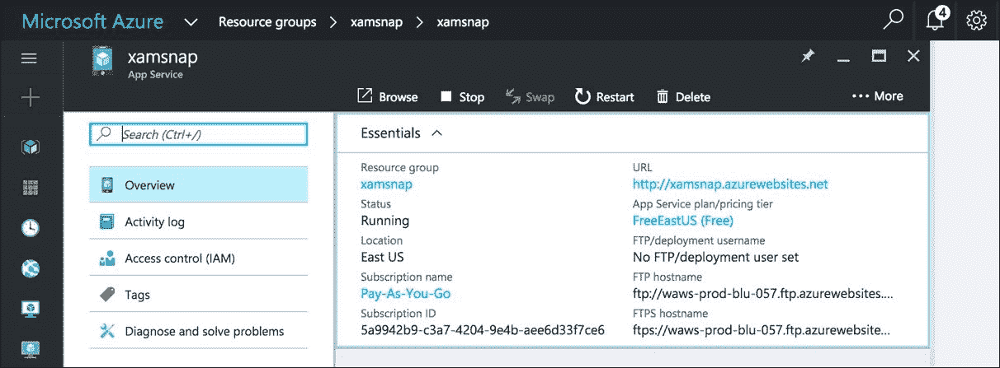
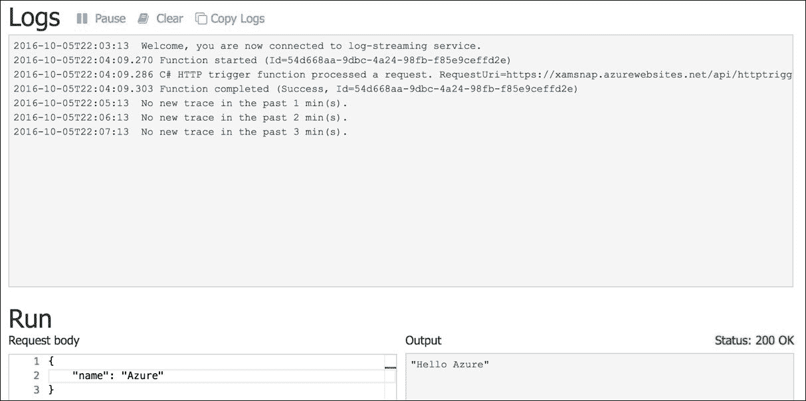
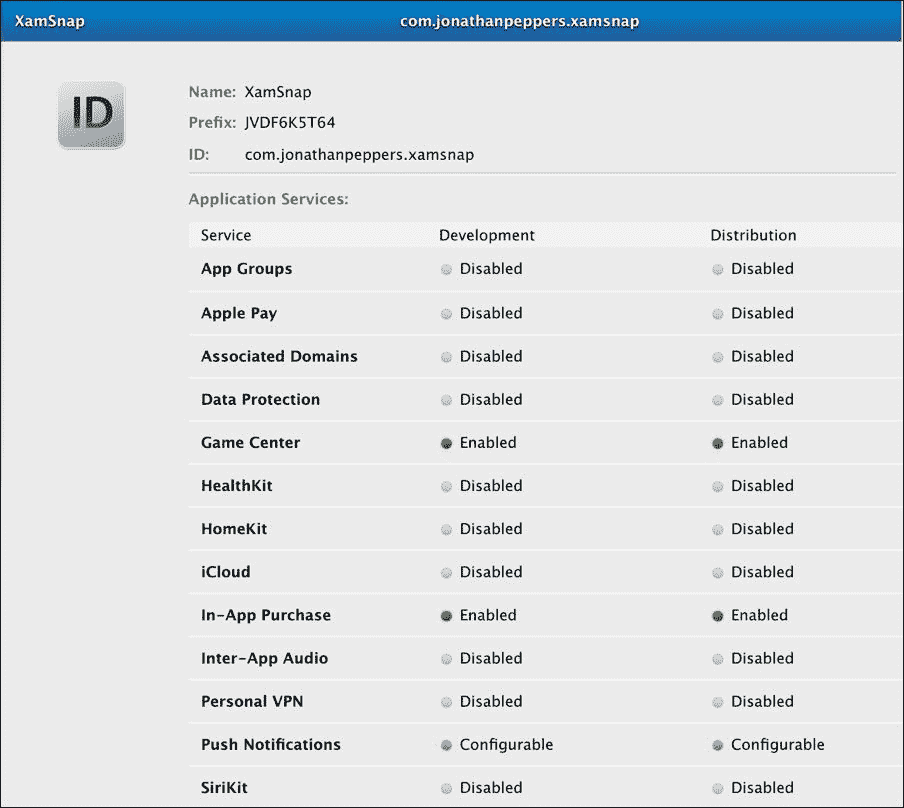
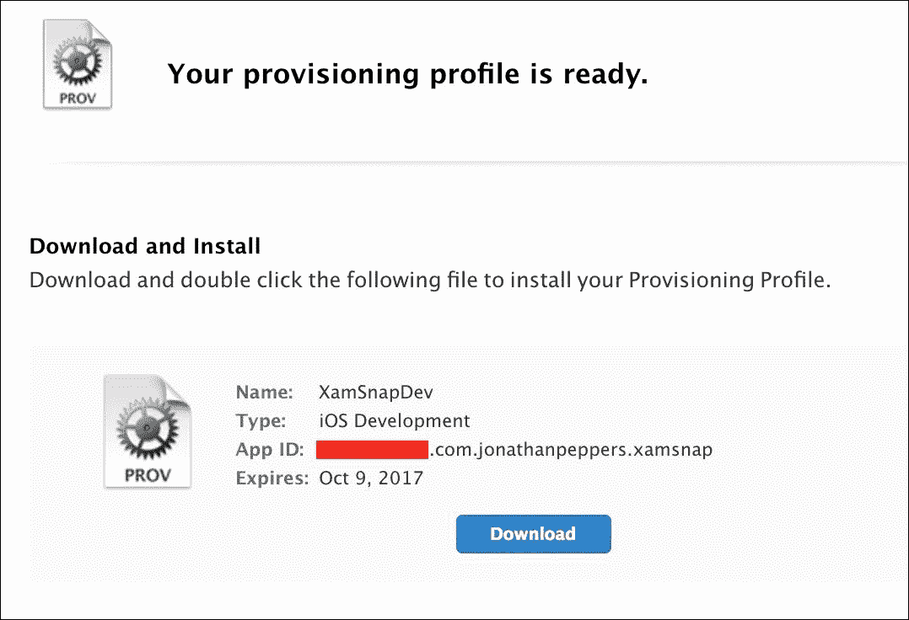
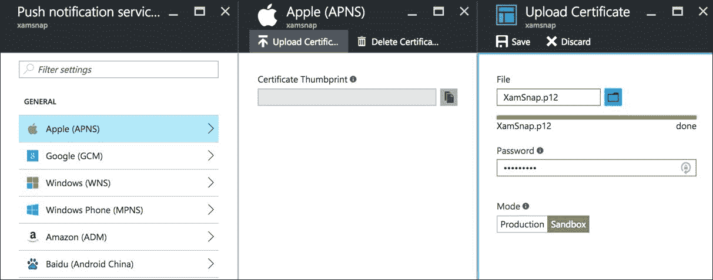
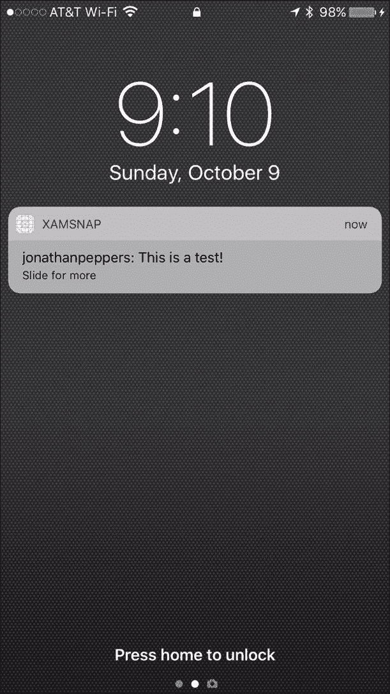
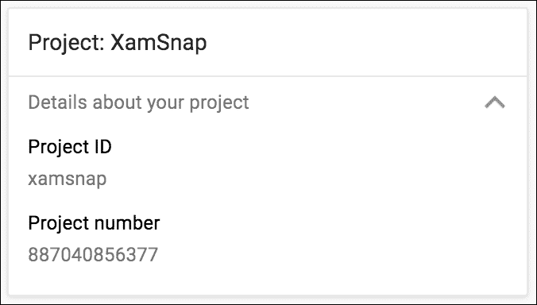
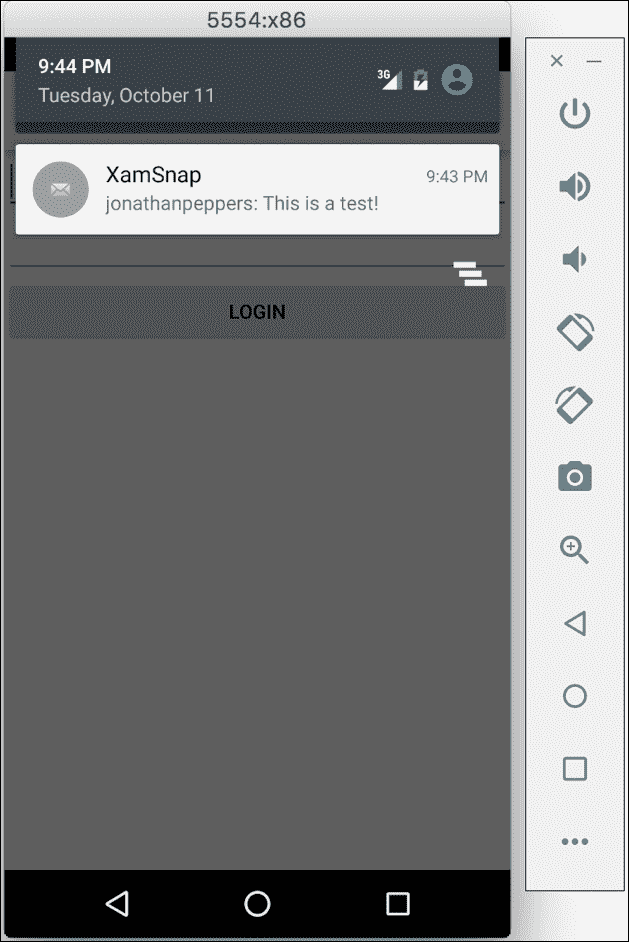

# 第九章。带有推送通知的网络服务

现代移动应用由其网络连接性定义。不与网络服务器交互的移动应用是一个罕见的发现，也可能是一个无聊的应用。在本书中，我们将使用 **Windows Azure** 云平台为我们的 XamSnap 应用实现一个服务器端后端。我们将使用名为 **Azure Functions** 的功能，它非常适合作为我们应用的简单后端，并且可以通过 **Azure 通知中心**发送推送通知。完成本章后，我们的 XamSnap 示例应用将更接近真实应用，并允许其用户相互交互。

在本章中，我们将涵盖以下主题:

*   Windows Azure 提供的服务
*   设置您的 Azure 帐户
*   Azure 充当 XamSnap 的后端
*   为 XamSnap 实现真正的网络服务
*   编写调用 Azure 函数的客户端代码
*   使用苹果推送通知服务
*   使用谷歌云消息发送通知

# 学习 Windows Azure

Windows Azure 是微软 2010 年发布的优秀云平台。Azure 同时提供**基础设施即服务** ( **IaaS** )和**平台即服务** ( **PaaS** )来构建现代网络应用和服务。这意味着它为您提供了对虚拟机的直接访问，您可以在其中部署您选择的任何操作系统或软件。这就是所谓的 IaaS。Azure 还提供了多个构建应用的平台，如 **Azure Web Apps** 或 **SQL Azure** 。这些平台被称为 PaaS，因为您可以在高层次上部署软件，而不必直接处理虚拟机或管理软件升级。

让我们看一下 Windows Azure 提供的以下更常见的服务:

*   **虚拟机** : Azure 可以让你访问各种规模的虚拟机。你几乎可以安装任何你选择的操作系统；在 Azure 的图库中有许多预制的发行版可供选择。
*   **网络应用**:你可以部署任何类型的网站，运行在微软 **IIS** 中，从 ASP。NET 站点到 **PHP** 或 **Node.js** 。
*   **SQL Azure** :这是基于云的微软 SQL Server 版本，是一个功能齐全的 **RDMS** ( **区域数据库管理系统**)用于存储数据。
*   **移动应用**:这是一个为移动应用搭建 web 服务的简单平台。它使用 **SQL Azure** 作为后端存储，并使用基于 Node.js 的简单 JavaScript 脚本系统来添加业务逻辑。
*   **Azure 功能**:Windows Azure 的首款产品，支持正在成为当今新流行语的全新“无服务器”架构。您可以直接在 web 浏览器中用各种语言开发简单的 API、后台作业、网络钩子等等。Azure 将根据传入的请求自动扩展您的功能。
*   **存储** : Azure 提供 **blob 存储**，一种存储二进制文件的方法，**表存储**，是一种 **NoSQL** 持久化数据的解决方案。
*   **服务总线**:这是一个基于云的解决方案，用于创建队列，以方便其他云服务之间的通信。它还包括通知中心，作为向移动应用提供推送通知的简单方式。
*   **通知中枢**:向安卓、iOS、Windows 等不同平台设备发送推送通知的简单方式。
*   **DocumentDB** :功能全面的 NoSQL 数据存储，可与其他 NoSQL 数据库媲美，如 **MongoDB** 。
*   **HDInsight** :在 Windows Azure 中运行的 Apache Hadoop 版本，用于管理超大数据集，也可以称之为大数据。

除了这些服务，还有许多新的服务正在积极开发中。我们将使用 Azure 函数，并利用 Azure 存储表，为 XamSnap 构建我们的网络服务。您可以访问[http://windowsazure.com](http://windowsazure.com)了解所提供的价格和服务的完整概要。

在本书中，我们选择演示一个使用 Windows Azure 作为 XamSnap 的 web 服务后端的解决方案，因为它与 C#、Visual Studio 和其他微软工具是互补的。然而，除了 Azure 之外，还有很多选择，您可能想看看。选择 Xamarin 并不会限制应用可以与之交互的网络服务类型。

以下是一些更常见的例子:

*   **Firebase** :谷歌的这项服务提供了一个类似于 Azure Mobile Apps 的产品，包括数据存储和推送通知。您可以在[https://firebase.google.com](https://firebase.google.com)获得更多信息。
*   **城市飞艇**:该服务为跨多个平台的移动应用提供推送通知。您可以在[http://urbanairship.com](http://urbanairship.com)获得更多信息。
*   **亚马逊 Web 服务**:这个服务是一个完整的云解决方案，相当于 Windows Azure。它拥有在云中部署应用所需的一切，并提供全面的虚拟机支持。还有一个名为 **AWS 移动枢纽**的功能，专门为移动开发量身定制。您可以在[http://aws.amazon.com](http://aws.amazon.com)获得更多信息。

此外，您可以使用自己选择的语言和技术，使用内部网络服务器或廉价的托管服务来开发自己的网络服务。

## 设置您的 Azure 帐户

要开始使用 Windows Azure 进行开发，您可以订阅一个月的免费试用以及 200 美元的免费 Azure 点数。与此同时，它的许多服务都有免费层，为您提供性能较低的版本。因此，如果您的试用到期，您可以根据您使用的服务，以很少或没有成本的方式继续您的开发。

首先导航到[http://azure.microsoft.com/en-us/free](http://azure.microsoft.com/en-us/free)，然后执行以下步骤:

1.  点击**开始免费**链接。
2.  使用 Windows Live ID 登录。
3.  出于安全考虑，请通过电话或短信验证您的帐户。
4.  输入付款信息。这仅在您超出支出限额时使用。开发你的应用不会意外地超出预算——在真正的用户与你的服务互动之前，意外花钱是不常见的。
5.  勾选**我同意**政策，点击**报名**。
6.  查看最终设置，点击**提交**。

如果所有必需的信息都输入正确，您现在终于可以访问您的 Azure 帐户了。您可以点击页面右上角的 **PORTAL** 链接访问您的账户。将来，您可以在[http://portal.azure.com](http://portal.azure.com)管理您的 Azure 服务。

Azure 门户使用一组名为刀片的面板来快速导航并深入查看更详细的信息，如下图所示:



您的 Windows Azure 注册到此结束。与苹果和GooglePlay开发者程序相比，这非常简单。随便玩，但不要太担心花钱。Azure 拥有大多数服务的免费版本，并且还免费提供大量带宽。您可以在[http://azure.microsoft.com/en-us/pricing](http://azure.microsoft.com/en-us/pricing)获取更多定价信息。

请注意，有很多关于 Windows Azure 昂贵的误解。你可以在免费层上为一个应用做所有的开发，而不用花一分钱。将应用投入生产时，您可以轻松地增加或减少虚拟机实例的数量，从而控制成本。一般来说，如果你没有很多用户，你不会花很多钱。同样，如果你碰巧有很多用户，你应该会获得大量收入。

# 探索天蓝色功能

对于 XamSnap 的服务器端，我们将使用 Azure 函数和 Azure 存储表来为应用提供后端存储。Azure Functions 是加速服务器端应用开发的简单解决方案，可以利用 Windows Azure 的所有功能。我们将使用。NET 基类库，用于与 C#中的服务进行交互。

Azure 函数的一些简洁特性如下:

*   您可以用各种编程语言编写函数，例如 JavaScript、C#、Python 和 PHP，以及一些脚本语言，例如 Batch、Bash 和 PowerShell
*   Azure Functions 与 Visual Studio Team Services、Bitbucket 和 GitHub 集成，用于**持续集成** ( **CI** )场景
*   您可以使用 Azure 活动目录、Windows Live ID、脸书、谷歌和推特轻松设置身份验证
*   功能可以通过 HTTP、时间表或计时器、Azure 队列等来触发
*   Azure Functions 确实是无服务器的，可以针对大量数据动态扩展

您可以看到为什么使用 Azure Functions 是简单移动应用的好选择。加速开发的好处及其提供的许多特性非常适合我们的 XamSnap 示例应用。

导航到您在[http://portal.azure.com](http://portal.azure.com)的帐户，并执行以下步骤创建一个 Azure 函数:

1.  点击页面左上角的加号按钮。
2.  通过菜单导航至**计算** | **功能应用**。
3.  输入您选择的域网址，如`yourname-xamsnap`。
4.  选择订阅以将服务置于。
5.  选择一个现有的**资源组**，或者创建一个名为`xamsnap`的新资源组。
6.  选择一个**动态** **应用服务**计划开始。如果你已经有一个应用服务计划，你可以使用一个现有的**经典**模式代替。
7.  选择一个现有的**存储帐户**或创建一个新的。
8.  查看您的最终设置并点击**创建**按钮。

管理门户将显示进度，创建您的 Azure Function App 实例可能需要几秒钟。

让我们创建一个简单的 Hello World 函数，看看事情是如何运作的:

1.  导航到您的功能应用。
2.  点击**快速启动**。
3.  选择 C#点击**网页钩子+应用编程接口**，然后点击**创建该功能**。
4.  Azure 门户将为您提供快速浏览，如果需要，您可以跳过。
5.  向下滚动到底部，点击**运行**查看您的天青功能运行情况。

完成后，您应该会在日志窗口中看到输出，以及带有`Hello Azure`输出的成功的 HTTP 请求。您应该会看到类似以下截图的内容:



## 创建和调用 Azure 函数

为了开始为 XamSnap 设置后端，我们需要创建一个登录函数。我们还需要实现应用其余部分使用的`IWebService`接口。由于我们的 MVVM 架构，我们应该能够替换当前正在使用的假服务，而不改变它上面的任何层。

返回到 Azure 门户，选择您的功能应用实例，并执行以下步骤:

1.  点击**新功能**按钮。
2.  选择**空- C#** 模板。
3.  输入`login`作为功能名称。
4.  点击**创建**按钮。
5.  点击**整合**部分。
6.  用默认设置添加一个 **HTTP** 触发器并输出，点击**保存**。
7.  增加一个**天青表存储**输出，将表名改为`users`，点击**保存**。

现在让我们为我们的函数编写一些代码，切换到**开发**部分，并添加以下代码作为起点:

```cs
#r "Microsoft.WindowsAzure.Storage" 

using System.Net; 
using System.Text; 
using Microsoft.WindowsAzure.Storage.Table; 

private const string PartitionKey = "XamSnap"; 

public static async Task<HttpResponseMessage>  
  Run(HttpRequestMessage req, CloudTable outputTable,  
  TraceWriter log) 
{ 
  dynamic data = await req.Content.ReadAsAsync<object>(); 
  string userName = data?.userName; 
  string password = data?.password; 

  if (string.IsNullOrEmpty(userName) ||  
    string.IsNullOrEmpty(password)) 
  { 
    return new HttpResponseMessage(HttpStatusCode.BadRequest); 
  } 
} 

```

首先，我们添加了对 Azure 存储 SDK 的引用。这是内置的，可用于 Azure 函数，我们将在以后使用它。接下来，我们添加了几个 using 语句和一个常量。我们创建了一个静态函数来处理前面定义的输入和输出。`req`是 HTTP 输入，`outputTable`是 Azure 表输出。`log`是可用于调试和记录目的的`TraceWriter`。最后，我们使用内置方法将 POST 数据读入`username`和`password`变量，以便在我们的函数中使用。

接下来，我们需要填写剩下的功能。将这段代码放在我们开始的函数的底部:

```cs
//Let's hash all incoming passwords 
password = Hash(password); 

var operation = TableOperation.Retrieve<User>( 
  PartitionKey, userName); 
var result = outputTable.Execute(operation); 
var existing = result.Result as User; 
if (existing == null) 
{ 
  operation = TableOperation.Insert(new User 
  { 
    RowKey = userName, 
    PartitionKey = PartitionKey, 
    PasswordHash = password, 
  }); 
  result = outputTable.Execute(operation); 

  if (result.HttpStatusCode == (int)HttpStatusCode.Created) 
  { 
    return new HttpResponseMessage(HttpStatusCode.OK); 
  } 
  else 
  { 
    return new HttpResponseMessage( 
      (HttpStatusCode)result.HttpStatusCode); 
  } 
} 
else if (existing.PasswordHash != password) 
{ 
  return new HttpResponseMessage(HttpStatusCode.Unauthorized); 
} 
else 
{ 
  return new HttpResponseMessage(HttpStatusCode.OK); 
} 

```

让我们总结一下我们在前面的 C#中做了什么:

1.  首先，我们使用稍后将添加的函数对传入的密码进行哈希运算。请注意，Azure 函数具有内置的身份验证功能，这对于生产应用来说是非常好的。对于我们的示例应用，我们至少采取了一种措施，不将密码以纯文本形式存储到我们的数据库中。
2.  接下来，我们使用 Azure 存储软件开发工具包来检查现有用户。
3.  如果没有结果，我们就创建一个新用户。分区键和行键是 Azure 表存储中的概念。在大多数情况下，您选择一个键来划分数据，如州或邮政编码，行键是唯一的键。对于这个示例，我们只是对分区键使用一个常量值。
4.  否则，我们比较散列的密码并返回成功。
5.  如果密码不匹配，我们将返回未经授权的错误代码。

在这之后，我们只需要更多一点的代码来定义`Hash`函数和`User`类:

```cs
private static string Hash(string password) 
{ 
  var crypt = new System.Security.Cryptography.SHA256Managed(); 
  var hash = new StringBuilder(); 
  byte[] crypto = crypt.ComputeHash( 
    Encoding.UTF8.GetBytes(password), 0,  
    Encoding.UTF8.GetByteCount(password)); 
  foreach (byte b in crypto) 
  { 
    hash.Append(b.ToString("x2")); 
  } 
  return hash.ToString(); 
} 

public class User : TableEntity 
{ 
  public string PasswordHash { get; set; } 
} 

```

我们使用了在`System.Security`命名空间中找到的内置 SHA-256 哈希算法。它至少比通常被破坏的 MD5 散列安全一点。我们还将`User`类声明为一个表实体，其中有一个包含哈希的附加列。

从这里，只要确保您点击**保存**按钮来应用您的更改。Azure Functions 还可以通过几个源代码管理提供程序为您的脚本提供源代码管理。如果您想在本地而不是网站编辑器中对您最喜欢的编辑器中的脚本进行更改，请随时利用此功能。您应该能够测试通过示例 JSON 的函数，如下所示:

```cs
{ 
  "userName":"test", 
  "password":"password" 
} 

```

有关 Azure Storage SDK 的完整文档，请确保您在[网站上查看 MSDN。](https://msdn.microsoft.com/en-us/library/azure/mt347887.aspx)

### 在 C#中使用 HttpClient

随着我们服务器端更改的完成，下一步是在我们的 XamSnap iOS 和 Android 应用中实现我们的新服务。幸运的是，当我们使用名为`IWebService`的接口时，我们所需要做的就是实现该接口，让它在我们的应用中工作。

现在，我们可以通过执行以下步骤开始在 iOS 应用中设置我们的服务:

1.  打开我们之前在书中创建的`XamSnap.Core`项目。
2.  在项目内创建一个`Azure`文件夹。
3.  创建一个名为`AzureWebService.cs`的新类。
4.  制作类`public`，实现`IWebService`。
5.  右键点击代码中的`IWebService`，选择**重构** | **实现界面**。
6.  会出现一行；按**进入**插入方法存根。

设置完成后，您的类将如下所示:

```cs
public class AzureWebService : IWebService 
{ 
  #region IWebService implementation 

  public Task<User> Login(string username, string password) 
  { 
    throw new NotImplementedException(); 
  } 

  // -- More methods here --  

  #endregion 
} 

```

接下来，我们需要添加对 JSON 的引用。NET 库。为此，我们将使用 NuGet 来添加库。右键点击`XamSnap.Core`项目，选择**添加** | **添加包**安装 Json .NET

现在让我们修改我们的`AzureWebService.cs`文件。为了开始，我们将进行以下更改:

```cs
using System.Net.Http; 
using System.Net.Http.Headers; 
using System.Threading.Tasks; 
using Newtonsoft.Json; 

public class AzureWebService : IWebService 
{ 
  private const string BaseUrl =  
    "https://xamsnap.azurewebsites.net/api/"; 
  private const string ContentType = "application/json"; 
  private readonly HttpClient httpClient = new HttpClient(); 

  // -- Existing code here -- 
} 

```

我们定义了一些使用语句和一些变量，我们将在整个课程中使用它们。确保您为您的 Azure 功能应用填写了正确的网址。

接下来，让我们编写一些助手方法来使调用 web 请求变得更容易:

```cs
private async Task<HttpResponseMessage> Post( 
  string url, string code, object obj) 
{ 
  string json = JsonConvert.SerializeObject(obj); 
  var content = new StringContent(json); 
  content.Headers.ContentType =  
    new MediaTypeHeaderValue(ContentType); 

  var response = await httpClient.PostAsync( 
    BaseUrl + url + "?code=" + code, content); 
  response.EnsureSuccessStatusCode(); 
  return response; 
} 

private async Task<T> Post<T>(string url, string code, object obj) 
{ 
  var response = await Post(url, code, obj); 
  string json = await response.Content.ReadAsStringAsync(); 
  return JsonConvert.DeserializeObject<T>(json); 
}} 

```

这段代码的大部分是实现在 C#中调用 RESTful 端点的基础。首先，我们将对象序列化为 JSON，并创建一个`StringContent`对象，该对象带有一个声明它是 JSON 的标题。我们用`code`参数格式化网址，这是一个简单的安全机制，默认情况下，Azure 函数是打开的。接下来，我们向服务器调用一个 POST 请求并调用`EnsureSuccessStatusCode`，以便为失败的请求抛出一个异常。最后，我们添加了第二个方法，将来自 JSON 的响应解析成 C#对象。我们的一些 Azure 函数将返回数据，所以我们需要这个。

现在让我们以下面的方式实现我们的第一个方法`Login`:

```cs
public async Task<User> Login(string userName, string password) 
{ 
  await Post("login", "key_here", new 
  { 
    userName, 
    password, 
  }); 

  return new User 
  { 
    Name = userName, 
    Password = password, 
  }; 
}} 

```

这相当简单，因为我们已经设置了助手方法。我们只需要传入我们的函数名、它的键和表示我们想要传递给 HTTP 请求的 JSON 的对象。您可以在天蓝色门户的**开发**部分的**功能网址**下找到所需的密钥。

接下来，打开`AppDelegate.cs`文件来设置我们的新服务，并添加以下代码:

```cs
//Replace this line 
ServiceContainer.Register<IWebService>( 
  () => new FakeWebService()); 

//With this line 
ServiceContainer.Register<IWebService>( 
  () => new AzureWebService()); 

```

现在，如果您在登录时编译并运行您的应用，您的应用将成功调用您的 Azure 函数，并将一个新用户插入 Azure 表存储。

### 类型

如果您正在寻找管理 Azure 表的快速方法，微软已经发布了一个名为 Azure 存储资源管理器的免费工具。它既适用于 Mac OS X，也适用于 Windows，可在[http://storageexplorer.com](http://storageexplorer.com)找到。第二个选项是 Visual Studio 中的**云资源管理器**，如果您为. NET 安装了 Azure SDK，就可以使用它

## 添加更多天青功能

对于我们的`IWebService`实现，我们还需要实现几个方法。让我们从添加另外两个 Azure 函数开始，这两个函数用于获取用户朋友的列表和添加一个朋友。

返回 Azure 门户并执行以下步骤:

1.  点击**新功能**按钮。
2.  选择**空- C#** 模板。
3.  输入`friends`作为功能名称。
4.  点击**创建**按钮。
5.  点击**整合**部分。
6.  用默认设置添加一个 **HTTP** 触发器并输出，点击**保存**。
7.  增加一个**天青表存储**输入，将表名改为`friends`，点击**保存**。
8.  对第二个名为`addfriend`的函数重复这些步骤，除了将 **Azure Table Storage** 作为输出而不是输入。

接下来，让我们用下面的 C#代码实现`friends` Azure 函数:

```cs
#r "Microsoft.WindowsAzure.Storage" 

using System.Net; 
using Microsoft.WindowsAzure.Storage.Table; 

public async static Task<HttpResponseMessage> Run( 
  HttpRequestMessage req, IQueryable<TableEntity> inputTable, 
  TraceWriter log) 
{ 
    dynamic data = await req.Content.ReadAsAsync<object>(); 
    string userName = data?.userName; 
    if (string.IsNullOrEmpty(userName)) 
    { 
      return new HttpResponseMessage(HttpStatusCode.BadRequest); 
    } 

    var results = inputTable 
      .Where(r => r.PartitionKey == userName) 
      .Select(r => new { Name = r.RowKey }) 
      .ToList(); 
    return req.CreateResponse(HttpStatusCode.OK, results); 
} 

```

这比我们的`login`功能简单一点。Azure Functions 可以选择使用与我们之前使用的`CloudTable`不同类型的参数。当使用`IQueryable`时，我们可以只写一个 LINQ 表达式来提取这个函数所需的数据:指定用户的朋友列表。我们计划将用户的名字存储为`PartitionKey`，将朋友的名字存储为`RowKey`。然后，我们可以只在 HTTP 响应中返回这些值。

现在，让我们用下面的 C#代码实现`addfriend`函数:

```cs
#r "Microsoft.WindowsAzure.Storage" 

using System.Net; 
using Microsoft.WindowsAzure.Storage.Table; 

public async static Task<HttpResponseMessage> Run( 
  HttpRequestMessage req, CloudTable outputTable, TraceWriter log) 
{ 
  dynamic data = await req.Content.ReadAsAsync<object>(); 
  string userName = data?.userName; 
  string friendName = data?.friendName; 
  if (string.IsNullOrEmpty(userName) || 
    string.IsNullOrEmpty(friendName)) 
  { 
    return new HttpResponseMessage(HttpStatusCode.BadRequest); 
  } 

  var operation = TableOperation.InsertOrReplace(new TableEntity 
  { 
    PartitionKey = userName, 
    RowKey = friendName, 
  }); 
  var result = outputTable.Execute(operation); 

  return req.CreateResponse( 
    (HttpStatusCode)result.HttpStatusCode); 
} 

```

就像之前的`login`函数一样，我们使用`CloudTable`向 Azure 存储表中添加一行。就像以前一样，我们处理空白输入的可能性，并返回与 Azure Storage SDK 返回的相同的状态代码。

最后我们来修改`AzureWebService.cs`:

```cs
public Task<User[]> GetFriends(string userName) 
{ 
  return Post<User[]>("friends", "key_here", new 
  { 
    userName 
  }); 
}
public async Task<User> AddFriend( 
  string userName, string friendName) 
{ 
  await Post("addfriend", "key_here", new 
  { 
    userName, 
    friendName 
  }); 

  return new User 
  { 
    Name = friendName 
  }; 
} 

```

我们正在调用我们在本章前面创建的助手方法，以便轻松处理我们的 Azure 函数的 HTTP 输入和输出。确保为每个 Azure 函数使用正确的密钥。您可能想使用一个工具将一些测试数据插入或播种到`friends` Azure 存储表中，以便我们的 Azure 函数使用。

最后，我们需要再做三个 Azure 函数来处理对话和消息。返回 Azure 门户并执行以下步骤:

1.  点击**新功能**按钮。
2.  选择**空- C#** 模板。
3.  输入`conversations`作为功能名称。
4.  点击**创建**按钮。
5.  点击**整合**部分。
6.  用默认设置添加一个 **HTTP** 触发器并输出，点击**保存**。
7.  增加一个**天青表存储**输入，将表名改为`friends`，点击**保存**。
8.  对第二个名为`messages`且表名为`messages`的函数重复这些步骤。
9.  对第三个名为`sendmessage`的函数重复这些步骤，除了将 **Azure Table Storage** 作为输出而不是输入。

`conversations`功能的 C#代码如下:

```cs
#r "Microsoft.WindowsAzure.Storage" 

using System.Net; 
using Microsoft.WindowsAzure.Storage.Table; 

public async static Task<HttpResponseMessage> Run( 
  HttpRequestMessage req, IQueryable<Conversation> inputTable, 
  TraceWriter log) 
{ 
  dynamic data = await req.Content.ReadAsAsync<object>(); 
  string userName = data?.userName; 
  if (string.IsNullOrEmpty(userName)) 
  { 
    return new HttpResponseMessage(HttpStatusCode.BadRequest); 
  } 

  var results = inputTable 
    .Where(r => r.PartitionKey == userName) 
    .Select(r => new { Id = r.RowKey, UserName = r.UserName }) 
    .ToList(); 
  return req.CreateResponse(HttpStatusCode.OK, results); 
} 

public class Conversation : TableEntity 
{ 
  public string UserName { get; set; } 
} 

```

这段代码与我们之前编写的`friends`函数几乎相同。然而，我们需要定义一个`Conversation`类，以便在默认的`RowKey`和`PartitionKey`之外给我们的表添加一个额外的列。

接下来，让我们为`messages`函数添加以下 C#代码:

```cs
#r "Microsoft.WindowsAzure.Storage" 

using System.Net; 
using Microsoft.WindowsAzure.Storage.Table; 

public async static Task<HttpResponseMessage> Run( 
  HttpRequestMessage req, IQueryable<Message> inputTable, 
  TraceWriter log) 
{ 
  dynamic data = await req.Content.ReadAsAsync<object>(); 
  string conversation = data?.conversation; 
  if (string.IsNullOrEmpty(conversation)) 
  { 
    return new HttpResponseMessage(HttpStatusCode.BadRequest); 
  } 

  var results = inputTable 
    .Where(r => r.PartitionKey == conversation) 
    .Select(r => new { Id = r.RowKey,  
      UserName = r.UserName, Text = r.Text }) 
    .ToList(); 
  return req.CreateResponse(HttpStatusCode.OK, results); 
} 

public class Message : TableEntity 
{ 
  public string UserName { get; set; } 
  public string Text { get; set; } 
} 

```

同样，对于我们为`friends`和`conversations`函数所做的事情，这应该非常简单。

最后，让我们为`sendmessage`函数添加如下代码:

```cs
#r "Microsoft.WindowsAzure.Storage" 

using System.Net; 
using Microsoft.WindowsAzure.Storage.Table; 

public async static Task<HttpResponseMessage> Run( 
  HttpRequestMessage req, CloudTable outputTable, TraceWriter log) 
{ 
  dynamic data = await req.Content.ReadAsAsync<object>(); 
  if (data == null) 
    return req.CreateResponse(HttpStatusCode.BadRequest); 

  var operation = TableOperation.InsertOrReplace(new Message 
  { 
    PartitionKey = data.Conversation, 
    RowKey = data.Id, 
    UserName = data.UserName, 
    Text = data.Text, 
  }); 
  var result = outputTable.Execute(operation); 

  return req.CreateResponse( 
    (HttpStatusCode)result.HttpStatusCode); 
} 

public class Message : TableEntity 
{ 
    public string UserName { get; set; } 
    public string Text { get; set; } 
} 

```

这个功能和我们用`addfriend`做的很接近。在本章的后面，我们将在这个函数中发送推送通知。

在继续之前，让我们实现我们的`IWebService`接口的其余部分。可以通过以下方式完成:

```cs
public Task<Conversation[]> GetConversations(string userName) 
{ 
  return Post<Conversation[]>("conversations", "key_here", new 
  { 
    userName 
  }); 
} 

public Task<Message[]> GetMessages(string conversation) 
{ 
  return Post<Message[]>("messages", "key_here", new 
  { 
    conversation 
  }); 
} 

public async Task<Message> SendMessage(Message message) 
{ 
  message.Id = Guid.NewGuid().ToString("N"); 
  await Post("sendmessage", "key_here", message); 
  return message; 
} 

```

客户端代码中的每个方法都非常简单，与我们调用其他 Azure 函数的方法非常相似。`SendMessage`是我们唯一要做的新事情:为新消息生成唯一的消息 ID。

这就完成了我们对`IWebService`的实现。如果此时运行该应用，它将完全像以前一样运行，除了该应用实际上正在与一个真实的 web 服务器对话。新消息将保存在 Azure 存储表中，我们的 Azure 函数将处理我们需要的定制逻辑。随意摆弄我们的实现；您可能会发现 Azure Functions 的一些特性，这些特性将非常适合您自己的应用。

此时，另一个很好的练习是在我们的安卓应用中设置`AzureWebService`。你应该可以在你的`Application`课上取消`ServiceContainer.Register`呼叫。一切都将像在 iOS 上一样运行。跨平台开发不是很棒吗？

# 使用苹果推送通知服务

从 Azure 的角度来看，使用 iOS 上的 Azure 通知中心实现推送通知非常容易设置。最复杂的部分是通过苹果创建证书和配置文件的过程来配置你的 iOS 应用。在继续之前，请确保您拥有有效的 iOS 开发者计划帐户，因为没有该帐户，您将无法发送推送通知。如果你不熟悉推送通知的概念，可以看看苹果在[http://tinyurl.com/XamarinAPNS](http://tinyurl.com/XamarinAPNS)的文档。

要发送推送通知，您需要设置以下内容:

*   苹果公司注册的明确的应用标识
*   针对该应用标识的供应配置文件
*   用于服务器触发推送通知的证书

苹果提供了开发和生产证书，你可以用它从你的服务器发送推送通知。

## 设置您的供应配置文件

让我们从导航到[http://developer.apple.com/account](http://developer.apple.com/account)开始，执行以下步骤:

1.  点击**标识符**链接。
2.  点击窗口右上角的加号按钮。
3.  输入捆绑包标识的描述，如`XamSnap`。
4.  在**明确应用标识**部分输入您的捆绑包标识。这应该与您在`Info.plist`文件中设置的捆绑包标识相匹配，例如`com.yourcompanyname.xamsnap`。
5.  在**应用服务**下，一定要勾选**推送通知**。
6.  现在，点击**继续**。
7.  查看您的最终设置并点击**提交**。

这将创建一个显式的应用标识，类似于我们在下面的截图中看到的，我们可以使用它来发送推送通知:



对于推送通知，我们必须使用带有明确应用标识的配置文件，该标识不是开发证书。现在让我们设置一个配置文件:

1.  点击右侧**供应配置文件**下的**开发**链接。
2.  点击右上角的加号按钮。
3.  查看 **iOS 应用开发**点击**继续**。
4.  选择我们刚刚创建的应用标识，点击**继续**。
5.  选择开发者，点击**继续**。
6.  选择您将要使用的设备，点击**继续**。
7.  输入配置文件的名称，点击**生成**。
8.  下载配置文件并安装，或者打开 **XCode** 并使用**偏好设置** | **帐户**中的同步按钮。

完成后，您应该会看到如下所示的成功网页:



## 设置推送通知的证书

接下来，我们执行以下步骤来设置服务器所需的证书:

1.  点击右侧**证书**下的**开发**链接。
2.  点击右上角的加号按钮。
3.  启用**苹果推送通知服务 SSL(沙盒)**，点击**继续**。
4.  像以前一样选择你的应用标识，点击**继续**。
5.  按照苹果的说明创建新的证书签名请求。您也可以参考[第 7 章](07.html#aid-1R42S2 "Chapter 7. Deploying and Testing on Devices")、*在设备上部署和测试*，或者从之前找到`*.certSigningRequest`文件。
6.  接下来，点击**继续**。
7.  上传签名请求文件，点击**生成**。
8.  接下来，点击**下载**。
9.  打开文件将证书导入**钥匙扣**。
10.  在**钥匙串**中找到证书。它将被命名为**苹果开发 iOS 推送服务**，并将包含您的捆绑包标识。
11.  右键单击证书并将其导出到文件系统的某个位置。输入您会记住的密码。

这将创建我们从 Azure 通知中心向用户发送推送通知所需的证书。

返回到 Azure 门户并执行以下步骤来创建 Azure 通知中心:

1.  导航到您的 **Azure 功能应用**所在的资源组。
2.  单击加号按钮向资源组添加新服务。
3.  选择一个**通知中心名称**和**命名空间**，如`xamsnap`。
4.  确保选择了所需的数据中心和资源组，然后点击**创建**。

剩下的就是返回到 Azure 门户，从 Azure 通知中心上传证书。您可以在**通知服务** | **苹果(APNS)** | **上传证书**下找到此设置，如下图截图所示:



这次上传总结了我们从苹果这边需要的配置。

## 对推送通知进行客户端更改

接下来，让我们返回到 Xamarin Studio 中的`XamSnap.iOS`项目，在客户端对推送通知进行必要的更改。首先，我们需要在共享代码中添加一些新的类。

在我们的 XamSnap PCL 项目中，创建一个名为`INotificationService`的新接口，如下所示:

```cs
public interface INotificationService 
{ 
  void Start(string userName); 
  void SetToken(object deviceToken); 
} 

```

接下来，我们需要在登录完成后调用`Start`。在`LoginViewModel.cs`中，成功登录后添加以下几行:

```cs
//At the top of the class 
readonly INotificationService notificationService =  
  ServiceContainer.Resolve<INotificationService>();

//Later, after a successful login 
notificationService.Start(UserName); 

```

接下来，让我们在名为`AppleNotificationService`的 iOS 项目中的一个新类中实现这个接口，如下所示:

```cs
public class AppleNotificationService : INotificationService 
{ 
  private readonly CultureInfo enUS =  
    CultureInfo.CreateSpecificCulture("en-US"); 
  private SBNotificationHub hub; 
  private string userName; 
} 

```

我们需要定义一个`CultureInfo`对象供以后使用，并且需要两个私有变量用于我们的通知中心和当前登录用户的名称。

现在，让我们实现`Start`方法:

```cs
public void Start(string userName) 
{ 
  this.userName = userName; 

  var pushSettings =  
    UIUserNotificationSettings.GetSettingsForTypes( 
    UIUserNotificationType.Alert |  
    UIUserNotificationType.Badge |  
    UIUserNotificationType.Sound, null); 

  UIApplication.SharedApplication 
    .RegisterUserNotificationSettings(pushSettings); 
} 

```

我们将用户名存储在一个成员变量中，然后调用本机 iOS APIs 来设置远程通知的注册。

接下来，我们需要实现`SetToken`方法如下:

```cs
public void SetToken(object deviceToken) 
{ 
    if (hub == null) 
    { 
        hub = new SBNotificationHub("yourconnection", "xamsnap"); 
    } 

    string template = "{"aps": {"alert": "$(message)"}}"; 
    var tags = new NSSet(userName); 
    hub.RegisterTemplateAsync((NSData)deviceToken, "iOS",  
      template, DateTime.Now.AddDays(90).ToString(enUS), tags, 
      errorCallback => 
      { 
        if (errorCallback != null) 
          Console.WriteLine("Push Error: " + errorCallback); 
      }); 
}} 

```

首先，如果需要，我们创建了一个新的通知中心。确保用只有**监听**权限的真实连接字符串替换`yourconnection`。这可以在**设置** | **访问策略** | **默认列表共享访问签名**下找到。接下来，我们声明了一个 iOS 模板，该模板采用 iOS 推送通知的正确格式使用`message`变量。这是启用跨平台推送通知的通知中心的一项功能。最后，我们向通知中心注册了设备令牌，记录了可能出现的任何错误。

接下来，我们需要对`AppDelegate.cs`进行一些特定于 iOS 的更改:

```cs
public override void DidRegisterUserNotificationSettings( 
  UIApplication application,  
  UIUserNotificationSettings notificationSettings) 
{ 
  application.RegisterForRemoteNotifications(); 
} 

public override void RegisteredForRemoteNotifications( 
  UIApplication application, NSData deviceToken) 
{ 
  var notificationService =  
    ServiceContainer.Resolve<INotificationService>(); 
  notificationService.SetToken(deviceToken); 
} 

public override void FailedToRegisterForRemoteNotifications( 
  UIApplication application, NSError error) 
{ 
  Console.WriteLine("Push Error: " + error.LocalizedDescription); 
} 

```

我们在前面的代码片段中实现了几个重要的方法。`DidRegisterUserNotificationSettings`是用户接受 iOS 权限弹出窗口时的回调。`RegisteredForRemoteNotifications`将在苹果从其服务器成功返回设备令牌时发生。我们通过 `INotificationService`将设备令牌传递给 Azure 通知中心。我们还实现了`FailedToRegisterForRemoteNotifications`来报告整个过程中可能出现的任何错误。

最后，我们需要添加一个小的修改来注册我们的`INotificationService`实现:

```cs
ServiceContainer.Register<INotificationService>( 
  () => new AppleNotificationService()); 

```

## 从服务器端发送推送通知

既然我们已经成功地为推送通知配置了 iOS，现在是时候从我们的`sendmessage` Azure 功能实际发送它们了。Azure 函数支持开箱即用的通知中枢，但是在编写本文时，不可能将它们用作输出并指定针对特定用户的标签。幸运的是，Azure Functions 只是 C#代码，因此我们可以轻松地利用 Azure Notification Hub SDK 从代码中手动发送推送通知。让我们切换到 Azure 门户，并在服务器端进行其余的更改。

首先，让我们在顶部添加一些语句，以包含 Azure 通知中心 SDK:

```cs
#r "Microsoft.Azure.NotificationHubs"  
using Microsoft.Azure.NotificationHubs; 

```

接下来，让我们添加一种发送推送通知的快速方法:

```cs
private async static Task SendPush( 
  string userName, string message) 
{ 
  var dictionary = new Dictionary<string, string>(); 
  dictionary["message"] = userName + ": " + message; 

  var hub = NotificationHubClient 
    .CreateClientFromConnectionString("yourconnection "xamsnap"); 
  await hub.SendTemplateNotificationAsync(dictionary, userName); 
} 

```

确保将`yourconnection`替换为有效的连接字符串，同时具有**发送**和**监听**权限。默认情况下，您可以在 Azure 门户中使用名为**的默认完整共享签名**。

最后，我们需要在调用 Azure 函数时发送推送通知:

```cs
//Place this right before returning the HTTP response 
await SendPush((string)data.UserName, (string)data.Text); 

```

要测试推送通知，请部署应用并使用辅助用户登录。登录后，您只需使用主页按钮在应用中添加背景即可。接下来，在 iOS 模拟器上以主要用户身份登录并发送消息。您应该会收到推送通知，如下图所示:



### 类型

如果您在工作中遇到一些问题，请尝试从通知中心下的 Azure Portal 发送测试通知，然后**故障排除** | **测试发送**。您可以使用本机格式或我们在本章中使用的自定义模板格式发送测试通知。

# 实现谷歌云消息

因为我们已经在共享代码和 Azure 上设置了我们需要的一切，所以在这个时候为安卓设置推送通知将会少很多工作。要继续，您将需要一个谷歌帐户，并有一个经过验证的电子邮件地址；但是，我建议使用在**谷歌 Play** 注册的账户，如果你有的话。您可以参考位于[https://developers.google.com/cloud-messaging/](https://developers.google.com/cloud-messaging/)的**谷歌云消息** ( **GCM** )上的完整文档。

### 类型

请注意，谷歌云消息要求在安卓设备上安装谷歌应用编程接口，并且安卓操作系统至少为 2.2 版。

首先导航至[http://cloud.google.com/console](http://cloud.google.com/console)，然后执行以下步骤:

1.  点击**创建项目**按钮。
2.  输入适当的项目名称，如`XamSnap`。
3.  同意**服务条款**。
4.  点击**创建**按钮。
5.  创建第一个项目时，您可能需要验证与您的帐户关联的手机号码。
6.  请注意**概述**页面上的**项目编号**字段。我们稍后会需要这个号码。

下面的截图显示了我们在**仪表板**选项卡上的项目小部件:



现在，我们可以继续进行如下设置:

1.  点击**使用谷歌 API**小部件。
2.  点击**库**，搜索**安卓**谷歌云消息。
3.  点击顶部的**启用**按钮启用服务。你可能不得不接受另一个协议。
4.  点击**转到凭证**，凭证将出现在顶部的警告提示中。
5.  点击**我需要什么凭证？**按钮。
6.  点击**限制键**，选择 **IP 地址**，进入 **0.0.0.0/0** 。
7.  将密钥复制到剪贴板以备后用，然后点击**保存。**
8.  切换到 Azure 门户，导航到 Azure 通知中心实例中的**通知服务** | **谷歌(GCM)** 部分。
9.  将应用编程接口密钥粘贴到**应用编程接口密钥**字段，点击**保存**。请注意，第一次，谷歌控制台可能需要长达五分钟的时间密钥才有效。

这就完成了我们在 Azure 方面的设置。我们需要为 Xamarin 获得几个开源库。安卓应用。首先安装 **Xamarin。azure . notificationhubs . Android**从 NuGet，然后从 Xamarin 组件商店安装**谷歌云消息客户端**。

接下来，创建一个名为`Constants.cs`的新类，如下所示:

```cs
public static class Constants 
{ 
    public const string ProjectId = "yourprojectid"; 
    public const string ConnectionString = "yourconnectionstring"; 
    public const string HubName = "xamsnap"; 
} 

```

用之前在谷歌云控制台的**概述**页面上找到的项目编号填写`ProjectId`值。`ConnectionString`和`HubName`应该和 iOS 输入的完全一样。

接下来，我们需要设置一些权限来支持应用中的推送通知。在该文件的命名空间声明之上，添加以下内容:

```cs
[assembly: Permission(Name =  
  "@PACKAGE_NAME@.permission.C2D_MESSAGE")] 
[assembly: UsesPermission(Name =  
  "@PACKAGE_NAME@.permission.C2D_MESSAGE")] 
[assembly: UsesPermission(Name =  
  "com.google.android.c2dm.permission.RECEIVE")] 
[assembly: UsesPermission( 
  Name = "android.permission.GET_ACCOUNTS")] 
[assembly: UsesPermission( 
  Name = "android.permission.WAKE_LOCK")] 

```

您也可以在我们的`AndroidManifest.xml`文件中进行这些更改；但是，使用 C#属性可能更好，因为它提供了在键入时使用代码完成的能力。

接下来，创建另一个名为`PushBroadcastReceiver.cs`的新类，如下所示:

```cs
[BroadcastReceiver(Permission =  
  Gcm.Client.Constants.PERMISSION_GCM_INTENTS)] 
[IntentFilter(new string[] {  
  Gcm.Client.Constants.INTENT_FROM_GCM_MESSAGE },  
  Categories = new string[] { "@PACKAGE_NAME@" })] 
[IntentFilter(new string[] {  
  Gcm.Client.Constants.INTENT_FROM_GCM_REGISTRATION_CALLBACK },  
  Categories = new string[] { "@PACKAGE_NAME@" })] 
[IntentFilter(new string[] {  
  Gcm.Client.Constants.INTENT_FROM_GCM_LIBRARY_RETRY },  
  Categories = new string[] { "@PACKAGE_NAME@" })] 
public class PushBroadcastReceiver :  
  GcmBroadcastReceiverBase<PushHandlerService> 
{ } 

```

`PushBroadcastReceiver.cs`类设置`BroadcastReceiver`，这是安卓的原生方式，让不同的应用相互对话。有关该主题的更多信息，请访问[上的安卓文档](http://developer.android.com/reference/android/content/BroadcastReceiver.html)

接下来，创建最后一个名为`PushHandlerService.cs`的类，如下所示:

```cs
[Service] 
public class PushHandlerService : GcmServiceBase  
{ 
  public PushHandlerService() : base (PushConstants.ProjectNumber)  
  { } 
} 

```

现在，右击`GcmServiceBase`并选择**重构** | **实现抽象成员**。接下来，让我们逐个实现每个成员:

```cs
protected async override void OnRegistered( 
  Context context, string registrationId) 
{     
  var notificationService =  
    ServiceContainer.Resolve<INotificationService>(); 
  notificationService.SetToken(registrationId); 
} 

```

前面这段代码与我们在 iOS 上所做的非常相似。我们只需将`registrationId`值发送给`INotificationService`。

接下来，我们必须在收到消息时编写以下代码:

```cs
protected override void OnMessage( 
  Context context, Intent intent) 
{ 
  string message = intent.Extras.GetString("message"); 
  if (!string.IsNullOrEmpty(message)) 
  { 
    var notificationManager = (NotificationManager) 
      GetSystemService(Context.NotificationService); 

    var notification = new NotificationCompat.Builder(this) 
      .SetContentIntent( 
        PendingIntent.GetActivity(this, 0,  
          new Intent(this, typeof(LoginActivity)), 0)) 
      .SetSmallIcon(Android.Resource.Drawable.SymActionEmail) 
      .SetAutoCancel(true) 
      .SetContentTitle("XamSnap") 
      .SetContentText(message) 
      .Build(); 
    notificationManager.Notify(1, notification); 
  } 
} 

```

这段代码实际上会从通知中拉出值，并在安卓设备的通知中心显示它们。我们使用`SymActionEmail`的内置资源在通知中显示一个电子邮件图标。

接下来，我们只需要实现两个更抽象的方法。现在我们就用`Console.WriteLine`来报道这些事件，如下:

```cs
protected override void OnUnRegistered( 
  Context context, string registrationId) 
{ 
  Console.WriteLine("GCM unregistered!"); 
} 

protected override void OnError ( 
  Context context, string errorId) 
{ 
  Console.WriteLine("GCM error: " + errorId); 
} 

```

接下来，当调用`OnUnRegistered`时，您应该考虑从 Azure 中删除注册。偶尔，用户的`registrationId`会发生变化，所以这是通知您的应用的地方。

接下来，我们需要为安卓实现`INotificationService`。首先创建一个名为`GoogleNotificationService.cs`的新文件，并添加以下代码:

```cs
public class GoogleNotificationService : INotificationService 
{ 
  readonly Context context; 
  NotificationHub hub; 
  string userName; 

  public GoogleNotificationService(Context context) 
  { 
    this.context = context; 
  } 

  public void SetToken(object deviceToken) 
  { 
    hub = new NotificationHub( 
      Constants.HubName, Constants.ConnectionString, context); 
    try 
    { 
      string template = "{"data":{"message":"$(message)"}}"; 
      hub.RegisterTemplate((string)deviceToken,  
        "Android", template, userName); 
    } 
    catch (Exception exc) 
    { 
      Console.WriteLine("RegisterTemplate Error: " + exc.Message); 
    } 
  } 

  public void Start(string userName) 
  { 
    this.userName = userName; 
    GcmClient.CheckDevice(context); 
    GcmClient.CheckManifest(context); 
    GcmClient.Register(context, Constants.ProjectId); 
  } 
} 

```

接下来，打开`Application.cs`并添加以下行来注册我们的新服务:

```cs
ServiceContainer.Register<INotificationService>( 
  () => new GoogleNotificationService(this)); 

```

现在，如果您重复在 iOS 上测试推送通知的步骤，您应该能够向我们的安卓应用发送推送通知。更好的是，您应该能够跨平台发送推送通知，因为 iOS 用户可以向安卓用户发送消息:



# 总结

在本章中，我们介绍了 Windows Azure 提供的功能:基础架构即服务和平台即服务。我们设置了一个免费的 Windows Azure 帐户，并设置了一个 Azure 函数应用实例。我们实现了客户端代码，用于对我们的 Azure 函数进行请求。最后，我们使用 Azure 通知中心为 iOS 实现了推送通知，以整合通过苹果推送通知服务发送到 iOS 设备的消息，以及通过谷歌云消息发送到安卓设备的消息。

使用 Azure 函数，我们能够在不编写太多服务器端代码的情况下生存。在下一章中，我们将探讨如何将第三方库与 Xamarin 一起使用。这包括从 Xamarin 组件存储到使用本机 Objective-C 或 Java 库的一切。