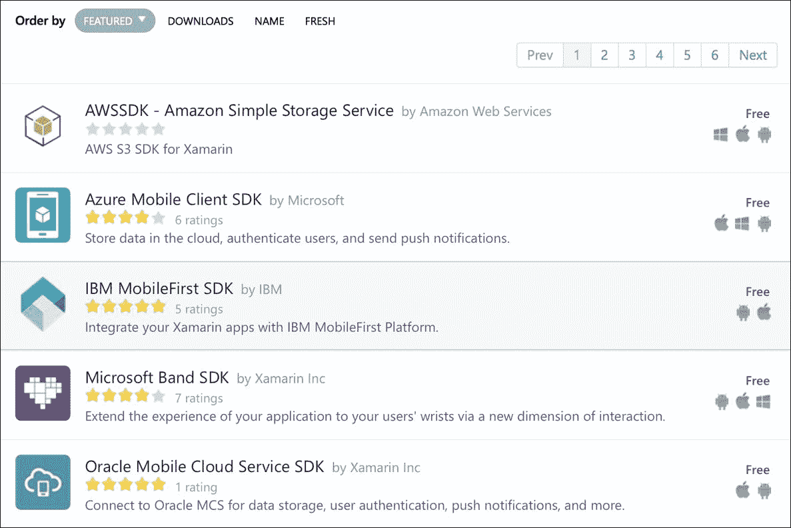
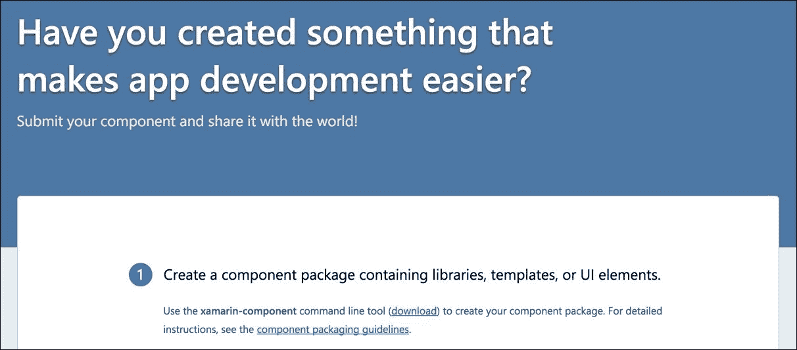
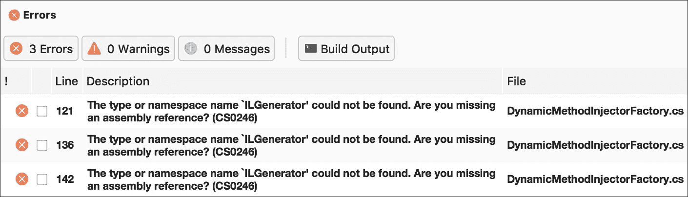
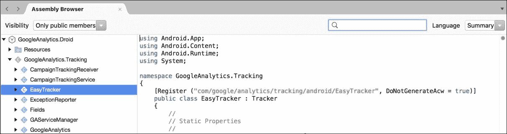

# 十、第三方库

Xamarin 支持。NET 框架，但在大多数情况下，它包含了您在。NET 基类库。正因为如此，很大一部分 C#开源库可以直接在 Xamarin 项目中使用。此外，如果一个开源项目没有 Xamarin 或可移植类库版本，移植用于 Xamarin 项目的代码通常会非常简单。Xamarin 还支持调用原生的 Objective-C 和 Java 库，因此我们将把这些作为重用现有代码的附加方法来探讨。

在本章中，我们将介绍以下内容:

*   Xamarin 组件存储
*   移植现有的 C#库
*   目标-C 绑定
*   Java 绑定

# Xamarin 组件商店

向项目中添加第三方组件的主要且显而易见的方法是通过 Xamarin 组件存储。组件商店相当类似于所有 C#开发人员都熟悉的 *NuGet 包管理器*，除了组件商店还包含非免费的高级组件。所有 Xamarin 组件还需要包括完整的示例项目和入门指南，而 NuGet 本身并不在其包中提供文档。

所有`Xamarin.iOS`和`Xamarin.Android`项目都带有一个`Components`文件夹。要开始，只需右击文件夹，选择**获取更多组件**启动商店对话框，如下图所示:



在撰写本书时，有超过 200 个组件可用于增强您的 iOS 和安卓应用。这是一个寻找 Xamarin 应用中最常用组件的好地方。每个组件都配有艺术品，可能是演示视频、评论和您在购买高级组件之前需要的其他信息。

最著名和最有用的组件如下:

*   **Json.NET**:这是用 C#解析和序列化 JSON 的事实标准
*   **RestSharp** :这是一个常用的简单 REST 客户端。网
*   **SQLite.NET**:这是一个简单的**对象关系映射** ( **ORM** )用于在移动应用中使用本地 SQLite 数据库
*   **脸书 SDK** :这是脸书提供的标准 SDK，用于将其服务集成到您的应用中
*   **Xamarin。移动**:这是一个跨平台的库，通过一个通用的 API 来访问你的设备的联系人、GPS、照片库和相机
*   **ZXing。Net.Mobile** :流行条码扫描库的. Net 版本，**中兴** ( **斑马线**)。

请注意，其中一些库是本机 Java 或 Objective-C 库，而另一些是普通的 C#。Xamarin 从头开始构建，以支持调用本机库，因此 Component Store 提供了许多 Objective-C 或 Java 开发人员在开发移动应用时可以利用的通用库。

您也可以将自己的组件提交到组件存储。如果你有一个有用的开源项目，或者只是想赚一点额外的钱，创建一个组件很简单。我们不会在本书中介绍它，但导航到[http://components.xamarin.com/submit](http://components.xamarin.com/submit)以获取关于该主题的完整文档，如下图所示:



# 移植现有 C#库

尽管 Xamarin 正在成为一个受欢迎的平台，但许多开源的。NET 库根本跟不上支持`Xamarin.iOS`和`Xamarin.Android`的速度。但在这些情况下，你绝对不是运气不好。通常，如果有一个 Silverlight 或 Windows Phone 版本的库，您可以简单地创建一个 iOS 或 Android 类库，并添加文件，而无需更改代码。

为了说明这个过程，让我们移植一个不支持 Xamarin 或可移植类库的开源项目。我选择了一个名为**nineject**的依赖注入库，这是因为它的有用性和与忍者的关系。在[http://www.ninject.org/](http://www.ninject.org/)了解更多关于库的信息。

让我们开始设置库来处理 Xamarin 项目，如下所示:

1.  首先，从[https://github.com/ninject/ninject](https://github.com/ninject/ninject)下载 Ninject 的源代码。
2.  使用名为`Ninject.iOS`的 **iOS 类库**项目创建一个新的解决方案。
3.  链接来自`Ninject`主项目的所有文件。确保使用**添加现有文件夹**对话框来加速此过程。

### 类型

如果你不熟悉 GitHub，我建议你下载 GitHub Desktop，这是一款适用于 Windows 或 OS X 的不错的客户端应用，可以在[https://desktop.github.com/](https://desktop.github.com/)找到。

现在尝试建设`Ninject.iOS`项目；你会在一个名为`DynamicMethodFactory.cs`的文件中得到几个编译器错误，如下图截图所示:



打开`DynamicMethodInjectorFactory.cs`，注意文件顶部有如下代码:

```cs
#if !NO_LCG 
namespace Ninject.Injection 
{ 
    using System; 
    using System.Reflection; 
    using System.Reflection.Emit; 
    using Ninject.Components; 

/// *** File contents here *** 

#endif 

```

由于苹果平台限制，无法在 iOS 上使用`System.Reflection.Emit`。幸运的是，库作者创建了一个名为`NO_LCG`(代表**轻量级代码生成**)的预处理器指令，允许库在不支持`System.Reflection.Emit`的平台上运行。

要修复我们的 iOS 项目，请执行以下步骤:

1.  打开项目选项，导航至**构建** | **编译器**部分。
2.  在**配置**下拉菜单中，为**调试**和**发布**添加`NO_LCG`到**定义符号**字段。
3.  点击**确定**保存更改。

如果您现在编译项目，它将成功完成并创建一个`Ninject.iOS.dll`文件，您可以从任何`Xamarin.iOS`项目中引用该文件。您也可以直接引用`Ninject.iOS`项目，而不是使用`*.dll`文件。

此时，您可能希望重复创建`Xamarin.Android`类库项目的过程。幸运的是，`Xamarin.Android`支持`System.Reflection.Emit`，所以如果你愿意，你可以跳过添加额外的预处理器指令。

# 目标-C 绑定

Xamarin 开发了一个复杂的系统，用于在 iOS 项目中从 C#调用本机 Objective-C 库。`Xamarin.iOS`的核心使用同样的技术在**ui kit****CoreGraphics**等 iOS 框架中调用原生的苹果 API。开发人员可以创建 iOS 绑定项目，使用简单的接口和属性向 C#公开 Objective-C 类和方法。

为了帮助创建 Objective-C 绑定，Xamarin 创建了一个名为 **Objective Sharpie** 的小工具，可以为您处理 Objective-C 头文件，并导出有效的 C#定义以添加到绑定项目中。对于大多数绑定来说，这个工具是一个很好的起点，在大多数情况下，它将使您的绑定项目的 75%工作。大多数时候，您会希望手工编辑和微调这些东西，使其对 C#更加友好。

### 类型

注意，iOS 绑定项目可以在 Visual Studio 中创建；但是，Objective Sharpie 是 OS X 的命令行工具，它利用了 Xcode 附带的工具，因此 iOS 绑定开发最好在 Mac OS X 上完成。

例如，我们将为 iOS 的谷歌分析库编写一个绑定。这是一个简单而有用的库，可以跟踪你的 iOS 或安卓应用中的用户活动。在撰写本文时，谷歌分析软件开发工具包的版本是 3.17，因此随着新版本的发布，其中一些说明可能会发生变化。

从[https://developer . xamarin . com/guides/跨平台/macios/binding/Objective-Sharpie/](https://developer.xamarin.com/guides/cross-platform/macios/binding/objective-sharpie/)下载并安装 Objective Sharpie，并执行以下步骤:

1.  在[https://tinyurl.com/GoogleAnalyticsForiOS](https://tinyurl.com/GoogleAnalyticsForiOS)下载最新的 iOS 谷歌分析软件开发工具包。
2.  创建名为`GoogleAnalytics.iOS`的新 **iOS** | **绑定库**项目。
3.  从步骤 1 中提取 zip 文件的内容，并将`GoogleAnalytics`文件夹移动到与绑定项目相同的目录中。
4.  打开**终端**，导航到与新项目相同的目录。
5.  使用以下命令运行**目标清晰度**:

```cs
        sharpie bind --output=. --namespace=GoogleAnalytics.iOS 
          --sdk=iphoneos10.0 ./GoogleAnalytics/Library/*.h 
        mv -f ApiDefinitions.cs ApiDefinition.cs 
        mv -f StructsAndEnums.cs Structs.cs 

```

目标 Sharpie 将输出两个文件:`ApiDefinitions.cs`和`Structs.cs`。后两个命令将文件复制到创建的**绑定库**项目模板的默认文件之上。

### 类型

请注意，在编写时，前面的命令中使用了 iOS 10 SDK。要发现`--sdk`选项需要输入什么，运行`sharpie xcode --sdks`，您将看到输出中打印的值。

现在，如果您返回到您的绑定项目，您会注意到 Objective Sharpie 已经为在库的头文件中发现的每个类生成了一个接口定义。它还生成了库使用的许多`enum`值，并改变了大小写和命名约定，以便尽可能更接近 C#的格式。

当您通读绑定时，您会注意到定义了 Objective-C 库不同方面的几个 C#属性，如下所示:

*   `BaseType`:这将一个接口声明为 Objective-C 类。基类(也称为超类)被传递给属性。如果没有基类，应该使用`NSObject`。
*   `Export`:这声明了 Objective-C 类上的一个方法或属性。传入一个将目标 C 名称映射到 C#名称的字符串。Objective-C 方法名称一般有以下几种形式:`myMethod:someParam:someOtherParam`。
*   `Static`:这在 C#中将方法或属性标记为`static`。
*   `Bind`:这在属性上使用，将一个 getter 或 setter 映射到一个不同的 Objective-C 方法。Objective-C 属性可以为属性重命名一个 getter 或 setter。
*   `NullAllowed`:这允许将`null`传递给方法或属性。默认情况下，如果发生这种情况，将引发异常。
*   `Field`:这声明了一个 Objective-C 字段，在 C#中作为公共变量公开。
*   `Model`:这向`Xamarin.iOS`标识了一个类，该类具有可以可选地被覆盖的方法。这通常用于目标 C 代表。
*   `Internal`:用 C#内部关键字标记生成的成员。它可以用来隐藏某些你不想暴露给外界的成员。
*   `Abstract`:根据需要确定一个客观-C 方法，与`Model`齐头并进。在 C#中，它会生成一个抽象方法。

唯一需要知道的其他规则是如何定义构造函数。Xamarin 必须为此发明一个约定，因为 C#接口不支持构造函数。

要定义默认构造函数之外的构造函数，请使用以下代码:

```cs
[Export("initWithFrame:")] 
IntPtr Constructor(RectangleF frame); 

```

这将在类上定义一个接受`RectangleF`作为参数的构造函数。方法名`Constructor`和返回类型`IntPtr`向 Xamarin 编译器发出信号以生成构造函数。

现在，让我们回到我们的绑定项目来完成所有的设置。如果您在此时编译项目，您将会得到一些编译器错误。让我们逐个修复它们，如下所示:

1.  从谷歌分析下载添加`libGoogleAnalyticsServices.a`和`libAdIdAccess.a`作为**原生参考**。
2.  将在`Structs.cs`中找到的枚举`GAILogLevel`和`GAIDispatchResult`的基本类型更改为`ulong`。
3.  从在`ApiDefinitions.cs`找到的`Constants`类中删除`[Static]`的重复声明。
4.  移除所有`Verify`属性。这些地方是夏普客观不确定它执行的操作。在我们的示例中，它们都很好，因此移除它们是安全的。

此时，如果您试图在 iOS 项目中使用该库，您将会收到如下错误:

```cs
Error MT5210: Native linking failed, undefined symbol:
 _FooBar. Please verify that all the necessary frameworks
 have been referenced and native libraries are properly
 linked in.

```

我们需要定义 Objective-C 库使用的其他框架和库。这与 C#中引用的工作方式非常相似。如果我们查看谷歌分析文档，它说您必须添加`CoreData`、`SystemConfiguration`和`libsqlite3.dylib`。

右键单击`libGoogleAnalyticsServices`的原生引用，选择**属性**，并进行以下更改:

1.  将`Frameworks`设置为`CoreData SystemConfiguration`。
2.  将`Linker Flags`设置为`-lsqlite3`。

本机目标库通过以下选项之一引用其他库:

*   **框架**:将它们添加到`LinkWith`属性的`Frameworks`值中，用空格分隔。
*   **弱框架**:以同样的方式将其添加到`LinkWith`属性的`WeakFrameworks`属性中。弱框架是如果找不到就可以忽略的库。这种情况下，iOS 6 增加了`AdSupport`；但是，这个库仍然可以在旧版本的 iOS 上工作。
*   **动态库**:可以在`LinkerFlags`中声明`libz.dylib`等库。一般情况下，你放下`.dylib`分机，用`-l`替换`lib`。

实施这些更改后，您将能够成功使用 iOS 项目中的库。有关 Objective-C 绑定的完整文档，请访问位于[https://developer.xamarin.com/guides/ios/](https://developer.xamarin.com/guides/ios/)的 Xamarin 文档网站。

# Java 绑定

和 iOS 一样，Xamarin 已经用`Xamarin.Android`为从 C#调用 Java 库提供了全面的支持。原生 Android SDKs 以这种方式运行，开发人员可以利用`Android Java Bindings`项目来利用 C#中的其他原生 Java 库。这里的主要区别是，与 Objective-C 绑定相比，手动完成的工作并不多。Java 的语法和 C#非常相似，所以很多映射都是一对一的。此外，Java 的库中包含元数据信息，Xamarin 使用这些信息自动生成调用 Java 所需的 C#代码。

例如，让我们为谷歌分析软件开发工具包的安卓版本进行绑定。在我们开始之前，请在[https://developers . Google . com/analytics/dev guides/collection/Android/v3/](https://developers.google.com/analytics/devguides/collection/android/v3/)下载该 SDK。在撰写本文时，Google Analytics 正在迁移到 Google Play Services，但是我们将使用这个 Java 库作为创建 Java 绑定的练习，供 C#使用。

让我们开始创建一个 Java 绑定，如下所示:

1.  在 Xamarin 工作室开始一个新的`Android | Library | Bindings Library`项目。如果您愿意，您可以使用我们为 iOS 使用的相同解决方案。
2.  命名项目`GoogleAnalytics.Droid`。
3.  将 Android SDK 中的`libGoogleAnalyticsServices.jar`添加到`Jars`文件夹下的项目中。
4.  构建项目。您会遇到一些错误，我们稍后会解决这些错误。

您花在 Java 绑定上的大部分时间将用于修复阻止生成的 C#代码编译的小问题。但是不要烦恼；许多库将在第一次尝试时工作，而根本不需要进行任何更改。一般来说，Java 库越大，您需要做的工作就越多，才能让它与 C#一起工作。

### 类型

请注意，如果您在第一次编译时没有得到任何错误，但是有许多警告说了一些类似`unsupported major.minor version 52.0`的话，那么您需要安装一个较新版本的 Java JDK。从[http://tinyurl.com/XamarinJDK8](http://tinyurl.com/XamarinJDK8)下载 JDK 1.8，在设置中将 Xamarin Studio 或 Visual Studio 指向 JDK 的更新版本。

以下是您可能遇到的问题类型:

*   **Java 混淆**:如果库是通过一个混淆工具运行的，比如 **ProGuard** ，类和方法名可能不是有效的 C#名。
*   **协变返回类型**:对于子类中被覆盖的方法中的返回类型，Java 和 C#有不同的规则。因此，您可能需要修改生成的 C#代码的返回类型以进行编译。
*   **可见性**:Java 对于可访问性的规则与 C#不同；子类中方法的可见性可以改变。有时你必须改变 C#中的可见性才能编译它。
*   **命名冲突**:有时候 C#代码生成器会把事情搞得有点不对，生成两个同名的成员或者类。
*   **Java 泛型**:Java 中的泛型类经常会在 C#中引发问题。

# 在 Java 绑定中使用 XPath

因此，在我们开始解决 Java 绑定中的这些问题之前，让我们首先清理项目中的名称空间。默认情况下，Java 名称空间是`com.mycompany.mylibrary`的形式，所以让我们更改定义以更紧密地匹配 C#。在项目的`Transforms`目录中，打开`Metadata.xml`，在根元数据节点中添加以下 XML 标签:

```cs
<attr path="/api/package[@name='com.google.analytics.tracking   
  .android']" name="managedName">GoogleAnalytics.Tracking</attr> 

```

`attr`节点告诉 Xamarin 编译器在 Java 定义中需要用另一个值替换什么。在这种情况下，我们用`GoogleAnalytics.Tracking`替换包的`managedName`，因为它在 C#中会更有意义。路径值可能看起来有点奇怪，这是因为它使用的是名为 **XPath** 的 XML 匹配查询语言。一般来说，只要把它看作是对 XML 的模式匹配查询。有关 XPath 语法的完整文档，请查看一些在线资源，例如[http://w3schools.com/xpath](http://w3schools.com/xpath)。

此时你可能会问自己，XPath 表达式匹配的依据是什么？返回 Xamarin Studio，右键单击顶部的解决方案。点击**显示选项** | **显示所有文件**。打开`obj`中`Debug`文件夹下的`api.xml`。这是描述 Java 库中所有类型和方法的 Java 定义文件。您可能会注意到，这里的 XML 与我们将要编写的 XPath 表达式直接相关。

对于我们的下一步，让我们删除所有我们不打算在这个库中使用的包(或名称空间)。对于大型库来说，这通常是一个好主意，因为您不想浪费时间来修复库的某些部分，因为您甚至不会从 C#调用这些部分。

在`Metadata.xml`中增加以下声明:

```cs
<remove-node path="/api/package[@name='com.google.analytics
   .containertag.common']" /> 
<remove-node path="/api/package[@name='com.google.analytics
   .containertag.proto']" /> 
<remove-node path="/api/package[@name='com.google.analytics
   .midtier.proto.containertag']" /> 
<remove-node path="/api/package[@name='com.google.android
   .gms.analytics.internal']" /> 
<remove-node path="/api/package[@name='com.google.android
   .gms.common.util']" /> 
<remove-node 
   path="/api/package[@name='com.google.tagmanager']" /> 
<remove-node
   path="/api/package[@name='com.google.tagmanager.proto']" /> 
<remove-node
   path="/api/package[@name='com.google.tagmanager.protobuf.nano']" /> 

```

### 类型

请注意，移除这些命名空间实际上并不会从绑定中移除编译后的 Java 代码。它只是防止绑定项目生成 C#代码来使用这个命名空间中的类。

现在，当您构建库时，我们可以开始解决问题。您将收到的第一个错误如下:

```cs
GoogleAnalytics.Tracking.GoogleAnalytics.cs(74,74):
 Error CS0234: The type or namespace name `TrackerHandler'
 does not exist in the namespace `GoogleAnalytics.Tracking'.
 Are you missing an assembly reference?

```

如果我们在`api.xml`文件中定位`TrackerHandler`，我们将看到以下类声明:

```cs
<class
   abstract="true" deprecated="not deprecated"
   extends="java.lang.Object"
   extends-generic-aware="java.lang.Object"
   final="false" name="TrackerHandler"
   static="false" visibility=""/> 

```

那么，你能发现问题吗？我们需要填写`visibility` XML 属性，由于某种原因是空白的。在`Metadata.xml`增加以下一行:

```cs
<attr
  path="/api/package[@name='com.google.analytics
  .tracking.android']/class[@name='TrackerHandler']"
  name="visibility">public</attr> 

```

这个 XPath 表达式将定位`com.google.analytics.tracking.android`包内的`TrackerHandler`类，并将`visibility`改为`public`。

如果您现在构建项目，它将成功完成，但会出现一些警告。在 Java 绑定项目中，在可能的情况下修复警告是一个好主意，因为它们通常指示绑定中省略了一个类或方法。请注意以下警告:

```cs
GoogleAnalytics.Droid: Warning BG8102:
 Class GoogleAnalytics.Tracking.CampaignTrackingService has 
 unknown base type android.app.IntentService (BG8102) 
 (GoogleAnalytics.Droid)

```

要解决此问题，请在`api.xml`中找到`CampaignTrackingService`的类型定义，如下所示:

```cs
<class
   abstract="false" deprecated="not deprecated"
   extends="android.app.IntentService"
   extends-generic-aware="android.app.IntentService"
   final="false" name="CampaignTrackingService"
   static="false" visibility="public"> 

```

解决此问题的方法是将基类更改为`IntentService`的`Xamarin.Android`定义。将以下代码添加到`Metadata.xml`:

```cs
<attr
   path="/api/package[@name='com.google.analytics
   .tracking.android']/class[@name='CampaignTrackingService']"
   name="extends">mono.android.app.IntentService</attr> 

```

这会将`extends`属性更改为使用在`Mono.Android.dll`中找到的`IntentService`。我在 Xamarin Studio 的**汇编浏览器**中打开`Mono.Android.dll`并查看`Register`属性，找到了这个类的 Java 名称，如下图截图所示:



要在 Xamarin Studio 中检查`*.dll`文件，您只需打开它们。您也可以双击项目中`References`文件夹中的任何组件。

如果您现在构建绑定项目，我们会留下最后一个错误，如下所示:

```cs
GoogleAnalytics.Tracking.CampaignTrackingService.cs(24,24):
 Error CS0507:
 `CampaignTrackingService.OnHandleIntent(Intent)':
 cannot change access modifiers when overriding `protected' 
 inherited member
 `IntentService.OnHandleIntent(Android.Content.Intent)'
 (CS0507) (GoogleAnalytics.Droid)

```

如果导航到`api.xml`文件，可以看到`OnHandleIntent`的定义如下:

```cs
<method
   abstract="false" deprecated="not deprecated" final="false"
   name="onHandleIntent" native="false" return="void"
   static="false" synchronized="false" visibility="public"> 

```

这里我们可以看到这个类的 Java 方法是`public`，但是基类是`protected`。所以，解决这个问题的最好方法就是把 C#版本也改成`protected`。编写一个 XPath 表达式来匹配这一点有点复杂，但是幸运的是，Xamarin 有一个简单的方法来检索它。如果您双击 Xamarin Studio 的**错误**面板中的错误消息，您将在生成的 C#代码中看到以下注释:

```cs
// Metadata.xml XPath method reference:
   path="/api/package[@name='com.google.analytics
   .tracking.android']/class[@name='CampaignTrackingService']
   /method[@name='onHandleIntent' and count(parameter)=1 and
   parameter[1][@type='android.content.Intent']]" 

```

复制`path`的这个值，并在`Metadata.xml`上加上以下内容:

```cs
<attr path="/api/package[@name='com.google.analytics
   .tracking.android']/class[@name='CampaignTrackingService']
   /method[@name='onHandleIntent' and count(parameter)=1 and
   parameter[1][@type='android.content.Intent']]"
   name="visibility">protected</attr> 

```

现在，我们可以构建项目，并且只有与`[Obsolete]`成员被覆盖相关的警告(没什么好担心的)。该库现在可以在您的`Xamarin.Android`项目中使用。

但是，如果您开始使用该库，请注意方法的参数名称是如何的`p0`、`p1`、`p2`等等。以下是`EasyTracker`类的一些方法定义:

```cs
public static EasyTracker GetInstance(Context p0); 
public static void SetResourcePackageName(string p0); 
public virtual void ActivityStart(Activity p0); 
public virtual void ActivityStop(Activity p0); 

```

您可以想象，如果不知道正确的参数名称，使用一个 Java 库是多么困难。之所以以这种方式命名参数，是因为其库的 Java 元数据不包括为每个参数设置正确名称的信息。因此，`Xamarin.Android`尽其所能，按顺序自动命名每个参数。

要重命名该类中的参数，我们可以在`Metadata.xml`中添加以下内容:

```cs
<attr path="/api/package[@name='com.google.analytics
   .tracking.android']/class[@name='EasyTracker']
   /method[@name='getInstance']/parameter[@name='p0']"
   name="name">context</attr> 
<attr path="/api/package[@name='com.google.analytics
   .tracking.android']/class[@name='EasyTracker']
   /method[@name='setResourcePackageName']/parameter[@name='p0']"
   name="name">packageName</attr> 
<attr path="/api/package[@name='com.google.analytics
   .tracking.android']/class[@name='EasyTracker']
   /method[@name='activityStart']/parameter[@name='p0']"
   name="name">activity</attr> 
<attr path="/api/package[@name='com.google.analytics
   .tracking.android']/class[@name='EasyTracker'] 
  /method[@name='activityStop']/parameter[@name='p0']"
   name="name">activity</attr> 

```

在重建绑定项目时，这将有效地重命名`EasyTracker`类中这四个方法的参数。此时，我建议仔细检查您计划在应用中使用的类，并重命名参数，以便对您更有意义。您可能需要参考谷歌分析文档来获得正确的命名。幸运的是，SDK 中包含一个`javadocs.zip`文件，为库提供 HTML 参考。

有关实现 Java 绑定的完整参考资料，请务必查看 Xamarin 位于[https://developer.xamarin.com/guides/android/](https://developer.xamarin.com/guides/android/)的文档网站。当然，还有比我们在为谷歌分析库创建绑定时遇到的更复杂的场景。

# 总结

在本章中，我们将 Xamarin 组件存储中的库添加到 Xamarin 项目中，并将一个现有的 C#库 Ninject 移植到`Xamarin.iOS`和`Xamarin.Android`中。接下来，我们安装了 Objective Sharpie，并探索了它用于生成 Objective-C 绑定的用法。最后，我们为 iOS 的谷歌分析软件开发工具包编写了一个功能性的 Objective-C 绑定，为安卓的谷歌分析软件开发工具包编写了一个 Java 绑定。我们还编写了几个 XPath 表达式来清理 Java 绑定。

从您的`Xamarin.iOS`和`Xamarin.Android`应用中使用现有的第三方库有几个可用的选项。我们查看了从使用 Xamarin 组件存储、移植现有代码，到设置从 C#使用的 Java 和 Objective-C 库的所有内容。在下一章中，我们将介绍`Xamarin.Mobile`库，作为访问用户联系人、相机和全球定位系统位置的一种方式。