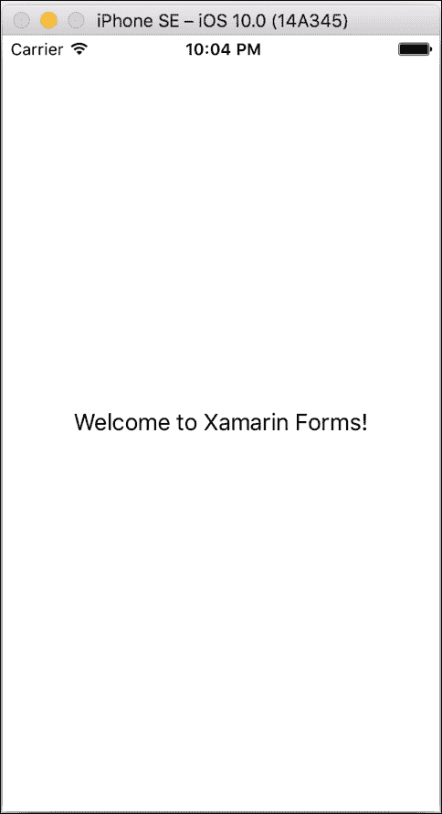
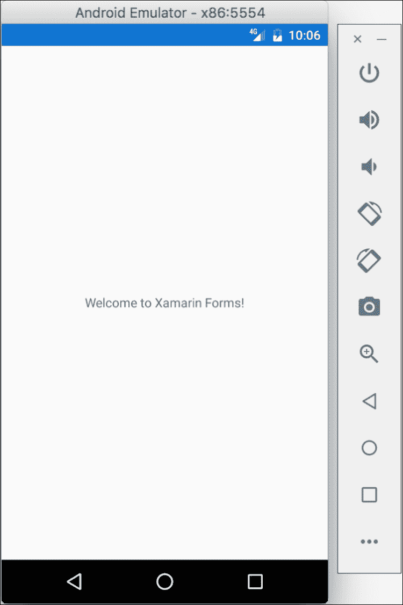
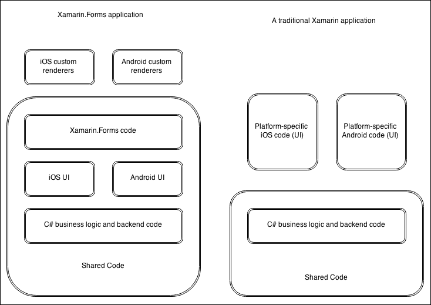
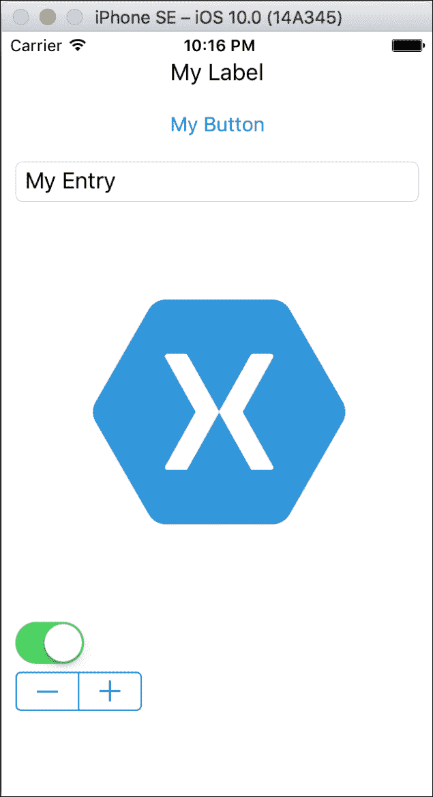
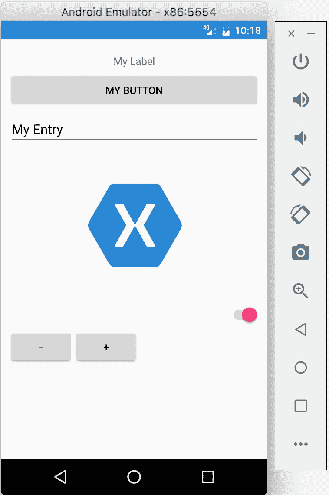
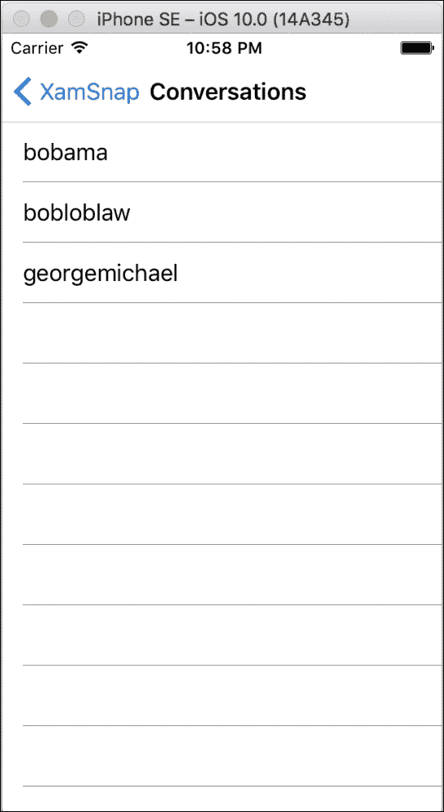

# 十一、Xamarin.Forms

从 Xamarin 作为一家公司开始，他们的座右铭一直是将 iOS 和 Android 上的原生 API 习惯性地呈现给 C#。这在一开始是一个很好的策略，因为应用是用 Xamarin.iOS 或 Xamarin 构建的。安卓与原生的 Objective-C 或 Java 应用几乎没有区别。代码共享通常仅限于非用户界面代码，这给 Xamarin 生态系统留下了一个潜在的空白:跨平台的用户界面抽象。Xamarin。表单是这个问题的解决方案，它是一个跨平台的 UI 框架，在每个平台上呈现本机控件。`Xamarin.Forms`对于那些了解 C#(和 XAML)的人来说是一个很好的框架，但也可能不想深入了解使用原生 iOS 和 Android APIs 的全部细节。

在本章中，我们将执行以下操作:

*   在 Xamarin 中创建 *Hello World* .Forms
*   讨论 Xamarin。表单架构
*   用 XAML 和 Xamarin.Forms
*   用 Xamarin 覆盖数据绑定和 MVVM.Forms

# 在 Xamarin 创建 Hello World.Forms

来理解一个 Xamarin。表单应用放在一起，让我们从创建一个简单的 *Hello World* 应用开始。

打开 Xamarin Studio 并执行以下步骤:

1.  从新解决方案对话框创建新的**多平台** | **应用** | **表单应用**项目。
2.  给你的解决方案起一个合适的名字，比如`HelloForms`。
3.  确保选择了**使用可移植类库**。
4.  点击**下一步**，然后点击**创建**。

请注意成功创建的三个新项目:

*   HelloForms
*   HelloForms。机器人
*   HelloForms.iOS

在`Xamarin.Forms`应用中，您的大部分代码将被共享，每个特定于平台的项目只是启动 Xamarin 的少量代码。表单框架。

让我们检查 Xamarin 的最小部分。表单应用:

*   `HelloForms` PCL 库中的`App.xaml`和`App.xaml.cs`-这个类是 Xamarin 的主要起点。表格申请。在应用的第一页设置了一个简单的属性`MainPage`。在默认的项目模板中，`HelloFormsPage`是用一个标签创建的，这个标签在 iOS 上呈现为`UILabel`，在安卓上呈现为`TextView`。
*   `MainActivity.cs`在`HelloForms.Android`安卓项目中——安卓应用的主启动器活动。Xamarin 的重要部分。这里的表单是对`Forms.Init(this, bundle)`的调用，它初始化了 Xamarin 的安卓专用部分。表单框架。接下来是对`LoadApplication(new App())`的调用，启动我们的 Xamarin。表格申请。
*   `AppDelegate.cs`在`HelloForms.iOS` iOS 项目中——非常类似于安卓，除了 iOS 应用使用`UIApplicationDelegate`类启动。`Forms.Init()`将初始化 Xamarin 的 iOS 特定部分。表单，就像安卓的`LoadApplication(new App())`一样，将启动 Xamarin。表格申请。

继续运行 iOS 项目；您应该会看到类似以下截图的内容:



如果您运行安卓项目，您将获得一个与下面截图中显示的 iOS 非常相似的用户界面，但使用的是原生安卓控件:



### 类型

即使这本书没有涉及它，Xamarin。窗体还支持 Windows Phone、WinRT 和 UWP 应用。但是，需要运行 Windows 和 Visual Studio 的 PC 来为 Windows 平台开发。如果你能得到一个 Xamarin。在 iOS 和安卓上运行表单应用，那么让一个 Windows Phone 版本运行起来应该是小菜一碟。

# 了解 Xamarin 背后的架构.Forms

Xamarin 入门。表格很容易，但看着幕后了解所有东西是如何组合在一起的总是好的。在本书的前几章中，我们直接使用原生的 iOS 和 Android APIs 创建了一个跨平台应用。某些应用更适合这种开发方法，所以理解 Xamarin。在选择最适合您的应用的框架时，表单应用和经典的 Xamarin 应用非常重要。

Xamarin。表单是对本机 iOS 和 Android APIs 的抽象，您可以直接从 C#中调用。所以，Xamarin。Forms 使用的 API 与经典的 Xamarin 应用相同，同时提供了一个框架，允许您以跨平台的方式定义用户界面。像这样的抽象层在许多方面都是一件非常好的事情，因为它让您能够共享驱动您的用户界面的代码以及任何后端 C#代码，这些代码也可以在标准的 Xamarin 应用中共享。然而，主要的缺点是性能稍有下降，这可能会使创造完美、流畅的体验变得更加困难。Xamarin。表单提供了编写**渲染器**和**效果**的选项，允许您以特定于平台的方式覆盖用户界面。这使您能够在需要时下拉到本机控件。

看看 Xamarin 和。表单应用和传统的 Xamarin 应用，如下图所示:



在这两个应用中，应用的业务逻辑和后端代码可以共享，但是 Xamarin。表单还允许共享用户界面代码，从而带来了巨大的好处。

另外，Xamarin。表单应用有两个项目模板可供选择，因此让我们介绍每个选项:

*   **Xamarin。共享表单**:创建一个共享项目。表单代码、一个 iOS 项目和一个安卓项目
*   **Xamarin。表单可移植**:创建一个包含所有共享 Xamarin 的**可移植类库** ( **PCL** )。表单代码、一个 iOS 项目和一个安卓项目

总的来说，这两种选择对任何应用都适用。共享项目基本上是由引用它的另一个项目自动添加的代码文件的集合。使用共享项目允许您使用预处理器语句来实现特定于平台的代码。另一方面，PCL 项目创造了一个可移植的。NET 程序集，可以在 iOS、安卓和各种其他平台上使用。PCLs 不能使用预处理器语句，所以您通常使用接口或抽象/基类来设置平台特定的代码。在大多数情况下，我认为 PCL 是一个更好的选择，因为它本质上鼓励更好的编程实践。这两种代码共享技术的优缺点详见[第三章](03.html#aid-TI1E2 "Chapter 3. Code Sharing Between iOS and Android")、*iOS 和安卓之间的代码共享*。

# 在 Xamarin 中使用 XAML.Forms

除了定义 Xamarin。Xamarin 从 C#代码中生成表单控件，提供了在**可扩展应用标记语言(XAML)** 中开发用户界面的工具。XAML 是一种声明性语言，基本上是一组映射到 Xamarin 中某个控件的 XML 元素。表单框架。使用 XAML 相当于使用 HTML 来定义网页上的用户界面，除了 Xamarin 中的 XAML。表单正在创建代表本机用户界面的 C#对象。

了解 XAML 如何在 Xamarin 工作。表单，让我们用不同类型的 Xamarin 创建一个新页面。窗体控件。回到你之前的`HelloForms`项目，打开`HelloFormsPage.xaml`文件。在`<ContentPage>`标签之间添加以下 XAML 代码:

```cs
<StackLayout Orientation="Vertical" Padding="10,20,10,10"> 
    <Label Text="My Label" XAlign="Center" /> 
    <Button Text="My Button" /> 
    <Entry Text="My Entry" /> 
    <Image Source="https://www.xamarin.com/conteimg/ 
      pages/branding/img/xamagon.png" /> 
    <Switch IsToggled="true" /> 
    <Stepper Value="10" /> 
</StackLayout> 

```

继续在 iOS 上运行应用；您的应用看起来像下面的截图:



在安卓系统上，该应用看起来与 iOS 完全相同，只是它使用的是原生安卓控件，而不是 iOS 对应控件:



在我们的 XAML 中，我们创建了一个`StackLayout`控件，它是其他控件的容器。它可以按照`Orientation`值的定义，一个接一个地垂直或水平布局控件。我们还在两侧和底部应用了 10 的填充，从顶部应用了 20 的填充来调整 iOS 状态栏。如果您熟悉 WPF 或 Silverlight，您可能会熟悉这个定义矩形的语法。Xamarin。表单使用相同的左、顶、右和底值语法，用逗号分隔。

我们还使用了几个内置的 Xamarin。表单控件来查看它们的工作方式:

1.  `Label`:这一点我们在前面的章节中已经用过了。仅用于显示文本，它映射到 iOS 上的`UILabel`和安卓上的`TextView`。
2.  `Button`:用户可以点击的通用按钮。这个控件映射到 iOS 上的一个`UIButton`和安卓上的一个`Button`。
3.  `Entry`:该控件为单行文本输入。它映射到 iOS 上的 T1 和安卓上的 T2。
4.  `Image`:这是一个在屏幕上显示图像的简单控件，映射到 iOS 上的`UIImage`和安卓上的`ImageView`。我们使用了这个控件的`Source`属性，它从一个网址加载一个图像。在这个属性上使用 URL 是很好的，但是在可能的情况下将图像包含在项目中对性能来说是最好的。
5.  `Switch`:这是开/关开关或拨动按钮。它映射到 iOS 上的`UISwitch`和安卓上的`Switch`。
6.  `Stepper`:这是一个通用输入，使用两个加号和减号按钮输入数字。在 iOS 上，这映射到一个`UIStepper`，而在安卓上，则是 Xamarin。表单通过两个按钮实现此功能。

这些只是 Xamarin.Forms 提供的一些控件，还有更复杂的控件，比如`ListView`和`TableView`，你可以预期它们会提供移动用户界面。

即使我们在这个例子中使用了 XAML，您也可以实现这个 Xamarin。C#中的表单页面。下面是一个类似的例子:

```cs
public class UIDemoPageFromCode : ContentPage 
{ 
  public UIDemoPageFromCode() 
  { 
    var layout = new StackLayout  
    { 
      Orientation = StackOrientation.Vertical, 
      Padding = new Thickness(10, 20, 10, 10), 
    }; 

    layout.Children.Add(new Label  
    { 
      Text = "My Label", 
      XAlign = TextAlignment.Center, 
    }); 

    layout.Children.Add(new Button  
    { 
      Text = "My Button", 
    }); 

    layout.Children.Add(new Image  
    { 
      Source = "https://www.xamarin.com/conteimg/pages/ 
        branding/img/xamagon.png", 
    }); 

    layout.Children.Add(new Switch  
    { 
      IsToggled = true, 
    }); 

    layout.Children.Add(new Stepper  
    { 
      Value = 10, 
    }); 

    Content = layout; 
  } 
} 

```

因此，您可以看到在哪里使用 XAML 更易读，并且通常比 C#更擅长声明用户界面。然而，使用 C#来定义用户界面仍然是一种可行的、简单的方法。

# 使用数据绑定和 MVVM

此时，您应该已经掌握了 Xamarin 的基础知识.Forms，但想知道 MVVM 的设计模式如何适应图片。MVVM 设计模式最初是为与 XAML 一起使用而设计的，XAML 提供了强大的数据绑定功能，因此它是与 Xamarin.Forms 一起使用的完美设计模式是很自然的

让我们介绍数据绑定和 MVVM 是如何用 Xamarin 设置的基础知识。表格:

1.  您的模型和视图模型层将与我们在本书前面介绍的 MVVM 模式基本保持不变。
2.  您的视图模型应该实现`INotifyPropertyChanged`接口，这有助于数据绑定。来简化 Xamarin 中的事情。表单中，当视图模型中的值发生变化时，您可以使用`BindableObject`基类并调用`OnPropertyChanged`。
3.  Xamarin 中的任何`Page`或控件。表单有一个`BindingContext`，它是数据绑定到的对象。通常，您可以为每个视图的`BindingContext`属性设置相应的视图模型。
4.  在 XAML，您可以使用`Text="{Binding Name}"`形式的语法来设置数据绑定。本示例将控件的`Text`属性绑定到位于`BindingContext`中的对象的`Name`属性。
5.  结合数据绑定，可以使用`ICommand`界面将事件转换为命令。例如，`Button`的点击事件可以数据绑定到视图模型公开的命令。Xamarin 中有一个内置的`Command`类。支持这一点的表格。

### 类型

数据绑定也可以用 Xamarin 中的 C#代码来设置。表单使用`Binding`类。但是，一般来说，使用 XAML 设置绑定要容易得多，因为使用 XAML 标记扩展简化了语法。

现在我们已经介绍了基础知识，让我们一步一步地部分转换本书前面的`XamSnap`示例应用，以使用 Xamarin.Forms。在大多数情况下，我们可以重用大部分的 Model 和 ViewModel 层，尽管我们将不得不做一些小的更改来支持与 XAML 的数据绑定。

让我们从创建一个新的 Xamarin 开始。由名为`XamSnap`的 PCL 支持的表单应用:

1.  首先，在名为`Views`、`ViewModels`和`Models`的`XamSnap`项目中创建三个文件夹。
2.  从前面章节的`XamSnap`应用中添加适当的`ViewModels`和`Models`类；这些都是在`XamSnap`项目中找到的。
3.  构建项目，只是为了确保保存所有内容。您会遇到一些编译器错误，我们将很快解决。

我们需要编辑的第一个类是`BaseViewModel`类；打开它并进行以下更改:

```cs
public class BaseViewModel : BindableObject 
{ 
  protected readonly IWebService service =  
    DependencyService.Get<IWebService>(); 
  protected readonly ISettings settings =  
    DependencyService.Get<ISettings>(); 

  bool isBusy = false; 

  public bool IsBusy 
  { 
    get { return isBusy; } 
    set 
    { 
      isBusy = value; 
      OnPropertyChanged(); 
    } 
  } 
} 

```

首先，我们删除了对`ServiceContainer`类的调用，因为 Xamarin。Forms 提供了自己的名为`DependencyService`的 IoC 容器。它的功能与我们在前面章节中构建的容器非常相似，只是它只有一个方法，`Get<T>`，注册是通过我们将很快设置的程序集属性来设置的。

此外，我们删除了`IsBusyChanged`事件，支持支持数据绑定的`INotifyPropertyChanged`接口。继承自`BindableObject`给了我们辅助方法`OnPropertyChanged`，我们用它来通知 Xamarin 中的绑定。值已更改的窗体。请注意，我们没有将包含物业名称的`string`传递给`OnPropertyChanged`。此方法使用的一个不太为人知的功能。NET 4.0 调用`CallerMemberName`，运行时会自动填写调用属性的名称。

接下来，让我们用`DependencyService`设置我们需要的服务。在 PCL 项目的根目录下打开`App.xaml.cs`，在名称空间声明上面添加以下两行:

```cs
[assembly: Dependency(typeof(XamSnap.FakeWebService))] 
[assembly: Dependency(typeof(XamSnap.FakeSettings))] 

```

`DependencyService`会自动拾取这些属性，并检查我们声明的类型。这些类型实现的任何接口都将返回给`DependencyService.Get<T>`的任何未来调用方。我通常会将所有的`Dependency`申报放在`App.cs`文件中，这样它们就很容易管理并放在一个地方。

接下来，让我们通过添加一个新属性来修改`LoginViewModel`:

```cs
public Command LoginCommand { get; set; } 

```

我们将很快使用它来对`Button`命令进行数据绑定。视图模型层的最后一个变化是为`MessageViewModel`设置`INotifyPropertyChanged`:

```cs
Conversation[] conversations; 

public Conversation[] Conversations 
{ 
  get { return conversations; } 
  set 
  { 
    conversations = value; 
    OnPropertyChanged(); 
  } 
} 

```

同样，您可以在整个视图模型层中对剩余的公共属性重复这种模式，但这是本例中我们所需要的。接下来，让我们在`Views`文件夹中创建一个名为`LoginPage`的新`Forms ContentPage Xaml`文件。在代码隐藏文件`LoginPage.xaml.cs`中，我们只需要做一些更改:

```cs
public partial class LoginPage : ContentPage 
{     
  readonly LoginViewModel loginViewModel = new LoginViewModel(); 

  public LoginPage() 
  { 
    Title = "XamSnap"; 
    BindingContext = loginViewModel; 

    loginViewModel.LoginCommand = new Command(async () => 
    { 
      try 
      { 
        await loginViewModel.Login(); 
        await Navigation.PushAsync(new ConversationsPage()); 
      } 
      catch (Exception exc) 
      { 
        await DisplayAlert("Oops!", exc.Message, "Ok");                 
      } 
    }); 

    InitializeComponent(); 
  } 
} 

```

我们在这里做了一些重要的事情，包括将`BindingContext`设置为我们的`LoginViewModel`。我们设置了`LoginCommand`，它基本上调用`Login`方法，并在出现问题时显示一条消息。如果成功，它还会导航到新页面。我们还设置了`Title`，它将显示在应用的顶部导航栏中。

接下来，打开`LoginPage.xaml`，我们将在`ContentPage`中添加以下 XAML 代码:

```cs
<StackLayout Orientation="Vertical" Padding="10,10,10,10"> 
    <Entry  
        Placeholder="Username" Text="{Binding UserName}" /> 
    <Entry  
        Placeholder="Password" Text="{Binding Password}"  
        IsPassword="true" /> 
    <Button  
        Text="Login" Command="{Binding LoginCommand}" /> 
    <ActivityIndicator  
        IsVisible="{Binding IsBusy}"  
        IsRunning="true" /> 
</StackLayout> 

```

这将设置两个文本字段的基础，一个按钮和一个微调器，完成所有绑定使一切正常工作。自从我们从`LoginPage`代码隐藏文件中设置`BindingContext`后，所有属性都绑定到`LoginViewModel`。

接下来，像之前一样将`ConversationsPage`创建为 XAML 页面，并编辑`ConversationsPage.xaml.cs`代码隐藏文件:

```cs
public partial class ConversationsPage : ContentPage 
{     
  readonly MessageViewModel messageViewModel =  
    new MessageViewModel(); 

  public ConversationsPage() 
  { 
    Title = "Conversations"; 
    BindingContext = messageViewModel; 

    InitializeComponent(); 
  } 

  protected async override void OnAppearing() 
  { 
    try 
    { 
      await messageViewModel.GetConversations(); 
    } 
    catch (Exception exc) 
    { 
      await DisplayAlert("Oops!", exc.Message, "Ok"); 
    } 
  } 
} 

```

在这种情况下，我们重复了许多相同的步骤。例外的是，我们使用`OnAppearing`方法作为加载对话以显示在屏幕上的方式。

现在让我们将以下 XAML 代码添加到`ConversationsPage.xaml`:

```cs
<ListView ItemsSource="{Binding Conversations}"> 
    <ListView.ItemTemplate> 
        <DataTemplate> 
            <TextCell Text="{Binding UserName}" /> 
        </DataTemplate> 
    </ListView.ItemTemplate> 
</ListView> 

```

在这个例子中，我们使用`ListView`来数据绑定一个项目列表并显示在屏幕上。我们定义了一个`DataTemplate`类，它代表了列表中`ItemsSource`数据绑定到的每个项目的一组单元格。在我们的例子中，显示`Username`的`TextCell`是为`Conversations`列表中的每个项目创建的。

最后，我们必须返回`App.xaml.cs`文件并修改启动页面:

```cs
MainPage = new NavigationPage(new LoginPage());  

```

我们在这里使用了`NavigationPage`以便 Xamarin。表单可以在不同的页面之间推送和弹出。这在 iOS 上使用了一个`UINavigationController`，所以你可以看到原生 API 在每个平台上是如何使用的。

此时，如果您编译并运行该应用，您将获得一个可登录并查看对话列表的功能性 iOS 和 Android 应用:



# 总结

在本章中，我们介绍了 Xamarin 的基础知识。表单以及它如何对构建您自己的跨平台应用非常有用。Xamarin。表单适用于某些类型的应用，但如果您需要编写更复杂的用户界面或利用本地绘图 API，表单可能会受到限制。我们发现了如何使用 XAML 来声明我们的 Xamarin。形成 UIs 并理解 Xamarin 如何。表单控件在每个平台上呈现。我们还深入探讨了数据绑定的概念以及如何将 MVVM 设计模式用于 Xamarin.Forms。最后但同样重要的是，我们开始将本书前面的`XamSnap`应用移植到 Xamarin。表单，并且能够重用我们现有的大量代码。

在下一章中，我们将介绍向 iOS 应用商店和 Google Play 提交应用的过程。让你的应用进入商店可能是一个耗时的过程，但是下一章的指导会让你有一个好的开始。