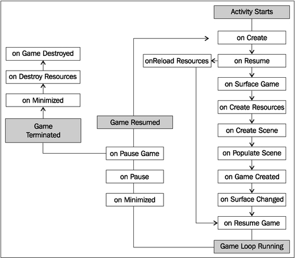

# 一、AndEngine游戏结构

在本章中，我们将了解在**和**中构建游戏所需的主要组件。主题包括:

*   了解生命周期
*   选择我们的发动机类型
*   选择解决策略
*   创建对象工厂
*   创建游戏管理器
*   介绍声音和音乐
*   使用不同类型的纹理
*   应用纹理选项
*   使用AndEngine字体资源
*   创建资源管理器
*   保存和加载游戏数据

# 简介

AndEngine 最吸引人的一面是创建游戏的不可思议的简单性。在第一次研究 AndEngine 后，在几周内设计和编写一个游戏的可能性并不太牵强，但这并不是说它将是一个完美的游戏。当我们不了解引擎如何工作时，编码过程可能是一项乏味的任务。为了创建精确的、有组织的和可扩展的项目，理解 AndEngine 的主要构建块和游戏结构是一个好主意。

在这一章中，我们将讨论 AndEngine 和一般游戏编程的一些最必要的组件。我们将看一些课程，这些课程将帮助我们快速有效地为各种游戏奠定基础。此外，我们将讨论资源和对象类型之间的一些差异，它们在塑造我们游戏的整体外观和感觉方面起着最大的作用。如果需要，我们鼓励您随时关注本章作为参考。

# 了解生命周期

当涉及到我们游戏的初始化时，理解操作的顺序是很重要的。游戏的基本需求包括创建引擎、加载游戏资源以及设置初始屏幕和设置。这就是为一款安卓游戏奠定基础所需要的一切。然而，如果我们计划在我们的游戏中增加多样性，了解 AndEngine 中包含的整个生命周期是明智的。

## 做好准备

请参考代码包中名为`PacktRecipesActivity`的类。

## 怎么做…

AndEngine 生命周期包括一些我们直接负责定义的方法。这些方法包括创建`EngineOptions`对象、创建`Scene`对象以及用子实体填充场景。这些方法按以下顺序调用:

1.  定义`onCreateEngineOptions()`方法:

    ```java
    @Override
    public EngineOptions onCreateEngineOptions() {

      // Define our mCamera object
      mCamera = new Camera(0, 0, WIDTH, HEIGHT);

      // Declare & Define our engine options to be applied to our Engine object
      EngineOptions engineOptions = new EngineOptions(true,
          ScreenOrientation.LANDSCAPE_FIXED, new FillResolutionPolicy(),
          mCamera);

      // It is necessary in a lot of applications to define the following
      // wake lock options in order to disable the device's display
      // from turning off during gameplay due to inactivity
      engineOptions.setWakeLockOptions(WakeLockOptions.SCREEN_ON);

      // Return the engineOptions object, passing it to the engine
      return engineOptions;
    }
    ```

2.  定义`onCreateResources()`方法:

    ```java
    @Override
    public void onCreateResources(
        OnCreateResourcesCallback pOnCreateResourcesCallback) {

      /* We should notify the pOnCreateResourcesCallback that we've finished
        * loading all of the necessary resources in our game AFTER they are loaded.
        * onCreateResourcesFinished() should be the last method called.  */
      pOnCreateResourcesCallback.onCreateResourcesFinished();
    }
    ```

3.  定义`onCreateScene()`方法:

    ```java
    @Override
    public void onCreateScene(OnCreateSceneCallback pOnCreateSceneCallback) {
      // Create the Scene object
      mScene = new Scene();

      // Notify the callback that we're finished creating the scene, returning
      // mScene to the mEngine object (handled automatically)
      pOnCreateSceneCallback.onCreateSceneFinished(mScene);
    }
    ```

4.  定义`onPopulateScene()`方法 :

    ```java
    @Override
    public void onPopulateScene(Scene pScene,
      OnPopulateSceneCallback pOnPopulateSceneCallback) {

      // onPopulateSceneFinished(), similar to the resource and scene callback
      // methods, should be called once we are finished populating the scene.
      pOnPopulateSceneCallback.onPopulateSceneFinished();
    }
    ```

## 它是如何工作的…

这个食谱类中的代码是任何安卓游戏的基础。我们已经建立了一个主活动类，作为我们应用程序的入口点。该活动包含我们负责的 AndEngine 活动生命周期中包含的四种主要方法，从创建`EngineOptions`选项、创建资源、创建场景和填充场景开始。

第一步，我们覆盖引擎的`onCreateEngineOptions()`方法。在这个方法中，我们的主要焦点是实例化我们的`Camera`对象以及我们的`EngineOptions`对象。这两个对象的构造函数允许我们定义应用程序的显示属性。此外，我们已经通过`engineOptions.setWakeLockOptions(WakeLockOptions.SCREEN_ON)`方法调用禁止屏幕在应用程序不活动时自动关闭。

在第二步中，我们继续覆盖`onCreateResources()`方法，该方法为我们提供了一个指定的方法来创建和设置我们游戏中所需的任何资源。这些资源可能包括纹理、声音和音乐以及字体。在这个步骤和接下来的两个步骤中，我们需要调用各自的方法回调，以便继续应用程序的生命周期。对于`onCreateResources()`方法，我们必须调用`pOnCreateResourcesCallback.onCreateResourcesFinished()`，应该包含在方法的末尾。

第三步包括实例化和设置`Scene`对象。设置场景可以像本食谱中显示的那样简单，或者对于更复杂的项目，它可以包括设置触摸事件侦听器、更新处理器等。设置完场景后，我们必须调用`pOnCreateSceneCallback.onCreateSceneFinished(mScene)`方法，将新创建的`mScene`对象传递给引擎以显示在设备上。

需要注意的最后一步包括定义`onPopulateScene()`方法。此方法专门用于将子实体附着到场景。与前两个步骤一样，我们必须调用`pOnPopulateSceneCallback.onPopulateSceneFinished()`才能继续进行剩余的AndEngine生命周期调用。

在下面的列表中，我们将按照生命周期方法从活动开始到终止的顺序来介绍它们。

启动期间的生命周期调用如下:

*   `onCreate` : 这个方法是安卓 SDK 的原生应用入口点。在 AndEngine 开发中，这个方法只是调用我们的`BaseGameActivity`类中的`onCreateEngineOptions()`方法，然后将返回的选项应用到游戏引擎中。
*   `onResume` : 这是另一个安卓 SDK 原生方法。在这里，我们只需从我们的`EngineOptions`对象中获取唤醒锁定设置，然后为引擎的`RenderSurfaceView`对象调用`onResume()`方法。
*   `onSurfaceCreated` : 这个方法要么在我们活动的初始启动过程中调用`onCreateGame()`，要么将一个布尔变量注册为`true`，以便在活动之前已经部署的情况下重新加载资源。
*   `onReloadResources` : 如果我们的应用程序从最小化中回到焦点，这个方法会重新加载我们的游戏资源。在应用程序的初始执行中不调用此方法。
*   `onCreateGame`:这是为了处理 AndEngine 生命周期中接下来三个回调的执行顺序。
*   `onCreateResources` : 这个方法允许我们声明和定义在活动启动期间需要的应用程序的初始资源。这些资源包括但不限于纹理、声音和音乐以及字体。
*   `onCreateScene` : 这里，我们处理活动场景对象的初始化。在这种方法中可以将实体附加到场景中，但是为了保持事物的有序性，通常最好在`onPopulateScene()`中附加实体。
*   `onPopulateScene` : 在生命周期的`onPopuplateScene()`方法中，我们即将完成场景的设置，尽管还有一些生命周期调用将由引擎自动处理。当我们的应用程序第一次启动时，应该使用这个方法来定义场景的视觉结果。请注意，此时场景已经创建并应用于引擎。在某些情况下，如果没有加载屏幕或启动屏幕，并且有大量实体要附加，则可以看到实体被附加到场景。
*   `onGameCreated`:表示`onCreateGame()`序列已经结束，必要时重新加载资源，否则不做任何事情。重新加载资源依赖于`onSurfaceCreated`方法中简单提到的布尔变量五个生命周期的回调。
*   `onSurfaceChanged` : 每当我们的应用程序的方向从横向模式变为纵向模式或者相反时，都会调用这个方法。T3】
*   `onResumeGame` : 这里我们有最后一个方法调用，它发生在活动的启动周期中。如果我们的活动达到这一点没有任何问题，就会调用引擎的`start()`方法，让游戏的更新线程起死回生。

最小化/终止期间的生命周期调用如下:

*   `onPause`:活动最小化或终止时的第一次方法调用。这是原生安卓暂停方法，调用`RenderSurfaceView`对象的暂停方法，恢复游戏引擎应用的唤醒锁定设置。
*   `onPauseGame` : 接下来，是引擎对`onPause()`的实现，它只是在引擎上调用 `stop()`方法，导致引擎的所有更新处理器随着更新线程一起停止。
*   `onDestroy` : 在`onDestroy()`方法中，AndEngine 清除引擎管理器类持有的`ArrayList`对象中包含的所有图形资源。这些经理包括`VertexBufferObjectManager`班、`FontManager`班、`ShaderProgramManager`班，最后是`TextureManager`班。
*   `onDestroyResources` : 这个方法名可能有点误导，因为我们已经卸载了`onDestroy()`中的大部分资源。这个方法真正做的是通过调用它们的`releaseAll()`方法来释放存储在各自管理器中的所有声音和音乐对象。
*   `onGameDestroyed` : 最后，我们到达了完整AndEngine生命周期中所需的最后一个方法调用。在这种方法中，并没有太多的动作发生。AndEngine 只需将引擎中使用的`mGameCreated`布尔变量设置为`false`，表示活动不再运行。

在下图中，我们可以看到当游戏被创建、最小化或销毁时，生命周期在行动中的样子:



### 注

由于 AndEngine 生命周期的异步特性，某些方法可能会在单个启动实例中执行多次。这些事件的发生因设备而异。

## 还有更多…

在本食谱的前一部分，我们介绍了主要的`BaseGameActivity`课程。以下类可以作为`BaseGameActivity`类的替代类，每个类都有自己的细微差别。

### 布局游戏活动类

`LayoutGameActivity`类是一个有用的活动类，它允许我们将 AndEngine 场景图视图合并到普通的安卓应用程序中。另一方面，有了这个类，我们也能够在我们的游戏中包含原生的安卓软件开发工具包视图，例如按钮、搜索栏、微调器、附加布局或任何其他视图。然而，使用这种活动的最流行的原因是允许容易地将广告实施到游戏中，作为获得收入的手段。

设置`LayoutGameActivity`类还有几个额外的步骤。

1.  将以下行添加到项目的默认布局 XML 文件中。这个文件通常叫做`main.xml`。下面的代码片段将 AndEngine `RenderSurfaceView`类添加到我们的布局文件中。这是将在设备上显示我们游戏的视图:

    ```java
    <org.andengine.opengl.view.RenderSurfaceView
    android:id="@+id/gameSurfaceView"
    android:layout_width="fill_parent"
    android:layout_height="fill_parent"/>
    ```

2.  该活动类型的第二个也是最后一个附加步骤是在第一步中引用布局 XML 文件和`LayoutGameActivity`重写方法。下面的代码假设布局文件在`res/layout/`文件夹中被称为`main.xml`；在这种情况下，可以在第一步完成后将它们复制/粘贴到我们的`LayoutGameActivity`课程中:

    ```java
    @Override
    protected int getLayoutID() {
      return R.layout.main;
    }

    @Override
    protected int getRenderSurfaceViewID() {
      return R.id.gameSurfaceView;
    }
    ```

### 简单基础游戏活动和简单布局游戏活动类

正如所建议的那样，`SimpleBaseGameActivity`和`SimpleLayoutGameActivity`类使得被覆盖的生命周期方法更容易处理。它们不要求我们重写 `onPopulateScene()`方法，除此之外，当我们完成被重写方法的定义时，我们不需要调用方法回调。有了这些活动类型，我们可以简单地添加未实现的生命周期方法，AndEngine 将为我们处理回调。

### 简单游戏活动类

最后我们要讲的游戏活动课是`SimpleAsyncGameActivity`课。除了通常的 `onCreateEngineOptions()`方法之外，该类还包括三种可选的生命周期方法，称为`onCreateResourcesAsync()`、`onCreateSceneAsync()`和`onPopulateSceneAsync()`。这个活动和其他活动的主要区别在于，它为我们提供了每个“异步”方法的加载栏。下面的代码片段展示了如何在加载纹理的情况下增加加载条:

```java
@Override
public void onCreateResourcesAsync(IProgressListener pProgressListener)
    throws Exception {

  // Load texture number one
  pProgressListener.onProgressChanged(10);

  // Load texture number two
  pProgressListener.onProgressChanged(20);

  // Load texture number three
  pProgressListener.onProgressChanged(30);

  // We can continue to set progress to whichever value we'd like
  // for each additional step through onCreateResourcesAsync...
}
```

### 类型

**下载示例代码**

您可以从您在[http://www.PacktPub.com](http://www.PacktPub.com)的账户中下载您购买的所有 Packt 书籍的示例代码文件。如果您在其他地方购买了这本书，您可以访问[http://www.PacktPub.com/support](http://www.PacktPub.com/support)并注册，以便将文件直接通过电子邮件发送给您。

# 选择我们的发动机类型

在我们开始为游戏编程之前，提出游戏的性能需求是一个好主意。发动机包括几种不同类型的发动机，我们可以选择使用，每种发动机都有各自的优点。当然，好处取决于我们计划创建的游戏类型。

## 做好准备

执行本章中的*了解生命周期*方法，获取在我们的 IDE 中设置的基本AndEngine项目，然后继续学习*如何操作...*段。

## 怎么做…

为了让我们正确定义一个特定的`Engine`对象供我们的游戏使用，我们必须覆盖`onCreateEngine()`方法，这是 AndEngine 启动过程的一部分。将以下代码添加到任何基础和引擎活动中，以便手动处理引擎的创建:

```java
/* The onCreateEngine method allows us to return a 'customized' Engine object
* to the Activity which for the most part affects the way frame updates are 
* handled. Depending on the Engine object used, the overall feel of the 
* gameplay can alter drastically. 
*/
@Override
public Engine onCreateEngine(EngineOptions pEngineOptions) {
  return super.onCreateEngine(pEngineOptions);
  /* The returned super method above simply calls:
      return new Engine(pEngineOptions);
  */
}
```

## 它是如何工作的…

以下是和引擎中可用的各种`Engine`对象的概述，以及显示如何设置每个`Engine`对象的简短代码片段:

*   `Engine` : 首先，我们有普通的`Engine`对象。`Engine`对象对于大多数游戏开发来说并不理想，因为它绝对没有每秒帧数的限制。在两个独立的设备上，您很可能会注意到游戏速度的差异。一种想法是，如果两个独立的设备同时观看一个视频，速度较快的设备可能会先结束视频，而不是两个设备同时结束。由于这个原因，在运行速度可能不够快的设备中会出现明显的问题，尤其是当物理是游戏的一个重要部分时。在我们的游戏中加入这种引擎不需要额外的步骤。
*   `FixedStepEngine` : 我们拥有的第二种发动机是`FixedStepEngine`。这是游戏开发中使用的理想引擎，因为它强制游戏循环以恒定的速度更新，而不管设备如何。这是通过根据过去的时间更新游戏来完成的，而不是设备更快执行代码的能力。`FixedStepEngine`要求我们依次传递`EngineOptions`对象以及一个`int`值。`int`值定义了发动机将被强制运行的每秒步数。下面的代码创建了一个引擎，它将以每秒恒定的`60`步数运行:

    ```java
    @Override
    public Engine onCreateEngine(EngineOptions pEngineOptions) {
      // Create a fixed step engine updating at 60 steps per second
        return new FixedStepEngine(pEngineOptions, 60);
      }
    ```

*   `LimitedFPSEngine`:`LimitedFPSEngine`引擎允许我们设置引擎每秒运行的帧数限制。这将导致引擎进行一些内部计算，如果首选 FPS 之间的差异大于引擎正在实现的当前 FPS，则引擎将等待几分之一秒，然后继续下一次更新。`LimitedFPSEngine`需要构造函数中的两个参数，包括`EngineOptions`对象和指定每秒最大帧数的`int`值。下面的代码创建了一个引擎，它将以每秒最多 60 帧的速度运行:

    ```java
    @Override
    public Engine onCreateEngine(EngineOptions pEngineOptions) {
      // Create a limited FPS engine, which will run at a maximum of 60 FPS
      return new LimitedFPSEngine(pEngineOptions, 60);
    }
    ```

*   `SingleSceneSplitScreenEngine` 和`DoubleSceneSplitScreenEngine` : 通过`SingleSceneSplitScreenEngine`引擎和`DoubleSceneSplitScreenEngine`引擎，我们可以用两个独立的摄像头创建一个游戏，要么是单个场景，最常用于单个玩家游戏，要么是单个设备上多人游戏的两个场景。然而，这些只是例子，但是这两个引擎可以有广泛的用途，包括迷你地图、多视角、菜单系统等等。有关设置这些类型的`Engine`对象的更多具体细节，请参见[第 4 章](04.html "Chapter 4. Working with Cameras")、*创建分屏游戏*。

# 选择解决策略

选择分辨率策略可能是一个敏感的话题，尤其是因为我们正在处理的平台目前运行的设备范围从 3 英寸显示器到 10.1 英寸的大部分。一般来说，开发者和用户都喜欢游戏占据设备显示器的整个宽度和高度，但在某些情况下，我们的分辨率策略可能需要仔细选择，以便在我们——开发者——认为合适的时候正确显示我们的场景。在本食谱中，我们将讨论 AndEngine 中包含的各种解析策略，这将帮助我们决定哪种策略最适合我们的应用程序需求。

## 怎么做…

我们选择遵守的解析策略必须作为参数包含在`EngineOptions`构造函数中，该构造函数是在 AndEngine 生命周期的`onCreateEngineOptions()`方法中创建的。下面的代码使用`FillResolutionPolicy`类创建了我们的`EngineOptions`对象，这将在本章后面解释:

```java
EngineOptions engineOptions = new EngineOptions(true,
    ScreenOrientation.LANDSCAPE_FIXED, new FillResolutionPolicy(),
    mCamera); 
```

我们可以通过简单地将解析策略类的另一个变体传递给这个构造函数来选择不同的解析策略。

## 它是如何工作的…

以下是 AndEngine 的`BaseResolutionPolicy`亚型概述。这些策略用于根据各种因素指定 AndEngine 如何处理我们应用程序的显示宽度和高度:

*   `FillResolutionPolicy` : 如果我们只想让我们的应用程序占据显示器的全部宽度和高度，那么`FillResolutionPolicy`类就是典型的分辨率策略。虽然此策略允许我们的应用程序以真正的全屏模式运行，但它可能会导致一些明显的拉伸，以便我们的场景占据显示器的全部可用尺寸。我们可以通过在`EngineOptions`构造器中简单地包含`new FillResolutionPolicy()`作为我们的解析策略参数来选择这个解析策略。
*   `FixedResolutionPolicy`:`FixedResolutionPolicy`类允许我们为应用程序应用固定的显示大小，而不管设备显示器的大小或`Camera`对象的尺寸。该策略可以通过`new FixedResolutionPolicy(pWidth, pHeight)`传递给`EngineOptions`，其中`pWidth`定义应用视图将覆盖的最终宽度，`pHeight`定义应用视图将覆盖的最终高度。例如，如果我们将`800`的宽度和`480`的高度传递给这个策略类型构造器，在分辨率为 1280 x 752 的平板电脑上，我们会留下一个空白的黑色区域，因为分辨率策略和实际显示大小之间没有补偿。
*   `RatioResolutionPolicy` : 如果我们需要获得最大的显示尺寸而不会导致子画面的任何失真，`RatioResolutionPolicy`类是分辨率策略的最佳选择。另一方面，由于安卓设备的范围很广，跨越了许多显示器尺寸，因此一些设备可能会在显示器的顶部和底部，或者左侧和右侧看到“黑条”。该解析策略的构造函数可以被传递一个`float`值，该值定义了显示尺寸的首选比率值，也可以被传递一个宽度和高度参数，通过将宽度除以高度来提取比率值。例如，`new RatioResolutionPolicy(1.6f)`定义一个比率，或者`new RatioResolutionPolicy(mCameraWidth, mCameraHeight)`，假设`mCameraWidth`和`mCameraHeight`是定义的`Camera`对象尺寸。
*   `RelativeResolutionPolicy` : 这是最终决议政策。该策略允许我们基于比例因子对整个应用程序视图应用更大或更小的比例，其中`1f`为默认值。我们可以使用构造函数`new RelativeResolutionPolicy(1.5f)`对视图应用常规缩放，这将使宽度和高度的比例增加`1.5`倍，或者我们可以指定单独的宽度和高度比例，例如`new RelativeResolutionPolicy(1.5f, 0.5f)`。此策略需要注意的一点是，我们必须小心缩放因子，因为缩放过大会导致应用程序在没有警告的情况下关闭。尽量保持比例因子小于`1.8f`；否则，请确保对各种设备进行广泛的测试。

# 创建对象工厂

对象工厂是一种有用的设计模式，用于编程的各种领域。具体来说，在游戏开发中，工厂可能被用来产生敌人对象、子弹对象、粒子效果、物品对象等等。事实上，AndEngine 甚至在我们创建声音、音乐、纹理和字体等时使用工厂模式。在本食谱中，我们将了解如何创建对象工厂，并讨论如何使用它们来简化我们自己项目中的对象创建。

## 做好准备

请参考代码包中名为`ObjectFactory`的类。

## 怎么做…

在这个食谱中，我们使用`ObjectFactory`类作为我们轻松创建和返回`BaseObject`类的子类型的一种方式。然而，在现实世界的项目中，工厂通常不包含内部类。

1.  在我们创建我们的对象工厂之前，我们应该创建我们的基类以及至少几个扩展基类的子类型:

    ```java
    public static class BaseObject {

      /* The mX and mY variables have no real purpose in this recipe, however in
       * a real factory class, member variables might be used to define position,
       * color, scale, and more, of a sprite or other entity.   */
      private int mX;
      private int mY;

      // BaseObject constructor, all subtypes should define an mX and mY value on creation
      BaseObject(final int pX, final int pY){
        this.mX = pX;
        this.mY = pY;
      }
    }
    ```

2.  一旦我们有了具有任意数量子类型的基类，我们现在就可以开始考虑实现工厂设计模式了。`ObjectFactory`类包含处理创建和返回类型为`LargeObject`和`SmallObject`的对象的方法，在这种情况下:

    ```java
    public class ObjectFactory {

      // Return a new LargeObject with the defined 'x' and 'y' member variables.
      public static LargeObject createLargeObject(final int pX, final int pY){
        return new LargeObject(pX, pY);
      }
      // Return a new SmallObject with the defined 'x' and 'y' member variables.
      public static SmallObject createSmallObject(final int pX, final int pY){
        return new SmallObject(pX, pY);
      }
    }
    ```

## 它是如何工作的…

在这个食谱的第一步，我们正在创建一个`BaseObject`类。这个类包括两个名为`mX`和`mY`的成员变量，我们可以想象，如果我们处理的是实体AndEngine实体，它们将定义设备显示屏上的位置。一旦我们建立了基类，我们就可以开始创建基类的子类型了。本食谱中的`BaseObject`类有两个扩展它的内部类，一个名为`LargeObject`，另一个名为`SmallObject`。对象工厂的工作是确定我们需要创建基类的哪个子类型，以及定义对象的属性，或者这个实例中的`mX`和`mY`成员变量。

第二步，我们来看看`ObjectFactory`代码。这个类应该包含与工厂处理的特定对象类型相关的对象创建的所有变体。在这种情况下，两个独立的对象只需要定义一个`mX`和`mY`变量。在现实世界中，我们可能会发现创建一个`SpriteFactory`类很有帮助。这个类可能包含一些通过`SpriteFactory.createSprite()`、`SpriteFactory.createButtonSprite()`和`SpriteFactory.createTiledSprite()`创建普通精灵、按钮精灵或平铺精灵的不同方法。除此之外，这些方法中的每一种都可能需要定义位置、比例、纹理区域、颜色等的参数。这个类最重要的方面是它的方法返回一个对象的新的子类型，因为这是工厂类背后的全部目的。

# 创建游戏管理器

游戏经理是大多数游戏的重要组成部分。游戏管理器是一个应该包含游戏相关数据的类；包括但不限于记录分数、积分/货币、玩家健康和其他一般游戏信息。在这个主题中，我们将看一看一个游戏管理器类，以了解它们如何在我们的游戏结构中工作。

## 做好准备

请参考代码包中名为`GameManager`的类。

## 怎么做…

我们将要介绍的游戏管理器将遵循单例设计模式。这意味着我们将在整个应用程序生命周期中只创建该类的一个实例，并且我们可以在整个项目中访问它的方法。请遵循以下步骤:

1.  创建游戏管理器单例:

    ```java
    private static GameManager INSTANCE;

    // The constructor does not do anything for this singleton
    GameManager(){
    }

    public static GameManager getInstance(){
      if(INSTANCE == null){
        INSTANCE = new GameManager();
      }
      return INSTANCE;
    }
    ```

2.  用相应的获取器和设置器创建成员变量，这些获取器和设置器应该跟踪游戏数据:

    ```java
    // get the current score
    public int getCurrentScore(){
      return this.mCurrentScore;
    }

    // get the bird count
    public int getBirdCount(){
      return this.mBirdCount;
    }

    // increase the current score, most likely when an enemy is destroyed
    public void incrementScore(int pIncrementBy){
      mCurrentScore += pIncrementBy;
    }

    // Any time a bird is launched, we decrement our bird count
    public void decrementBirdCount(){
      mBirdCount -= 1;
    }
    ```

3.  创建一个重置方法，将所有数据恢复到初始值:

    ```java
    // Resetting the game simply means we must revert back to initial values.
    public void resetGame(){
      this.mCurrentScore = GameManager.INITIAL_SCORE;
      this.mBirdCount = GameManager.INITIAL_BIRD_COUNT;
      this.mEnemyCount = GameManager.INITIAL_ENEMY_COUNT;
    }
    ```

## 它是如何工作的…

根据正在创建的游戏类型，游戏管理器必然会有不同的任务。这个食谱的`GameManager`类是为了类似于某个情感鸟系列。我们可以看到这个特殊的`GameManager`类涉及的任务是有限的，但是随着游戏变得越来越复杂，游戏管理器通常会随着需要跟踪的信息越来越多而增长。

在这个食谱的第一步中，我们将`GameManager`类设置为单例。singleton 是一种设计模式，旨在确保在应用程序的整个生命周期中只有一个静态的实例。由于是静态的，这将允许我们在全局级别上调用游戏管理器的方法，这意味着我们可以从项目中的任何类访问它的方法，而不必创建新的`GameManager`类。为了检索`GameManager`类的实例，我们可以在项目的任何类中调用`GameManager.getInstance()`。如果`GameManager`类尚未被引用，这样做将为`INSTANCE`分配一个新的`GameManager`类。然后将返回`INSTANCE`对象，允许我们调用`GameManager`类的数据修改方法，例如`GameManager.getInstance().getCurrentScore()`。

在第二步中，我们创建 getter 和 setter 方法，用于修改和获取`GameManager`类中存储的数据。本食谱中的`GameManager`类包含三个`int`值，用于跟踪重要的游戏数据；`mCurrentScore`、`mBirdCount`和`mEnemyCount`。这些变量中的每一个都有自己相应的获取器和设置器，允许我们轻松地修改游戏数据。在游戏中，如果一个敌人碰巧被消灭了，那么我们可以把`GameManager.getInstance().decrementEnemyCount()`和`GameManager.getInstance().incrementScore(pValue)`一起叫做`GameManager.getInstance().decrementEnemyCount()`，其中`pValue`很可能是由被消灭的敌人提供的。

设置这个游戏管理器的最后一步是为游戏数据提供一个重置方法。由于我们使用的是单例，无论我们从游戏切换到主菜单、商店还是任何其他场景，我们的`GameManager`类数据都不会自动恢复到默认值。这意味着任何时候一个关卡被重置，我们也必须重置游戏管理员的数据。在`GameManager`类中，我们设置了一个名为`resetGame()`的方法，它的工作就是简单地将数据恢复到原始值。

当开始一个新的级别时，我们可以调用`GameManager.getInstance().resetGame()`，以便快速将所有数据恢复到初始值。然而，这是一个通用的`GameManager`类，在等待级别重置或级别加载时，哪些数据应该被重置完全取决于开发人员。例如，如果`GameManager`类存储的是信用/货币数据，明智的做法可能是不要将该特定变量重置回默认值，以便在商店中使用。

# 介绍声音和音乐

对于用户来说，声音和音乐在游戏中扮演着重要的角色。如果使用得当，它们可以给游戏带来额外的优势，让玩家在玩的时候完全沉浸其中。另一方面，如果使用不当，它们也会引起烦恼和不满。在这个食谱中，我们将跳转到 AndEngine 中`Sound`和`Music`对象的主题，包括如何加载它们以修改它们的速率等等。T3】

## 做好准备

完成本章中给出的*知道生命周期*配方，这样我们就有了一个在我们的 IDE 中建立的基础AndEngine项目。此外，我们应该在项目的`assets/`文件夹中创建一个新的子文件夹。将此文件夹命名为`sfx`，并添加一个名为`sound.mp3`的声音文件和另一个名为`music.mp3`的声音文件。完成后，继续进行*操作...*段。

## 怎么做…

执行以下步骤设置一个使用`Sound`和`Music`对象的游戏。请注意，`Sound`对象是用来产生声音效果的，例如爆炸、碰撞或其他短音频回放事件。`Music`对象用于长时间的音频播放事件，如循环菜单音乐或游戏音乐。

1.  第一步包括确保我们的`Engine`对象认识到我们计划在游戏中使用`Sound`和`Music`对象。在创建`EngineOptions`对象后，在活动生命周期的`onCreateEngineOptions()`方法中添加以下行:

    ```java
    engineOptions.getAudioOptions().setNeedsMusic(true);
    engineOptions.getAudioOptions().setNeedsSound(true);
    ```

2.  在第二步中，我们将为声音和音乐工厂设置资产路径，然后加载`Sound`和`Music`对象。`Sound`和`Music`对象是资源，所以你可能已经猜到了，下面的代码可以放到我们活动生命周期的`onCreateResources()`方法中:

    ```java
    /* Set the base path for our SoundFactory and MusicFactory to
      * define where they will look for audio files.
     */
    SoundFactory.setAssetBasePath("sfx/");
    MusicFactory.setAssetBasePath("sfx/");

    // Load our "sound.mp3" file into a Sound object
    try {
      Sound mSound = SoundFactory.createSoundFromAsset(getSoundManager(), this, "sound.mp3");
    } catch (IOException e) {
      e.printStackTrace();
    }

    // Load our "music.mp3" file into a music object
    try {
      Music mMusic = MusicFactory.createMusicFromAsset(getMusicManager(), this, "music.mp3");
    } catch (IOException e) {
      e.printStackTrace();
    }
    ```

3.  一旦`Sound`对象被加载到`SoundManager`类中，我们可以通过调用`play()`来播放它们，无论是在碰撞、按钮点击还是其他情况下:

    ```java
    // Play the mSound object
    mSound.play();
    ```

4.  `Music`对象的处理方式应与`Sound`对象不同。在我们的`Music`对象应该在整个游戏中连续循环的情况下，这在大多数情况下，我们处理活动生命周期内的所有`play()`和`pause()`方法:

    ```java
    /* Music objects which loop continuously should be played in
    * onResumeGame() of the activity life cycle
    */
    @Override
    public synchronized void onResumeGame() {
      if(mMusic != null && !mMusic.isPlaying()){
        mMusic.play();
      }

      super.onResumeGame();
    }

    /* Music objects which loop continuously should be paused in
    * onPauseGame() of the activity life cycle
    */
    @Override
    public synchronized void onPauseGame() {
      if(mMusic != null && mMusic.isPlaying()){
        mMusic.pause();
      }

      super.onPauseGame();
    }
    ```

## 它是如何工作的…

在这个食谱的第一步中，我们需要让引擎知道我们是否会利用 AndEngine 的能力来玩`Sound`或`Music`对象。未能解决这一步将导致应用程序出错，因此在我们将音频实现到我们的游戏中之前，请确保在`onCreateEngineOptions()`方法中返回`EngineOptions`之前完成了这一步。

第二步，我们访问应用程序生命周期的`onCreateResources()`方法。首先，我们正在设置`SoundFactory`和`MusicFactory`的基本路径。正如*准备*部分提到的，我们应该在项目的`assets/sfx`文件夹中有一个存放音频文件的文件夹，其中包括我们所有的音频文件。通过在用于音频的两个工厂类中的每一个上调用`setAssetBasePath("sfx/")`，我们现在指向适当的文件夹来寻找音频文件。完成后，我们可以通过使用`SoundFactory`类加载`Sound`对象，通过使用`MusicFactory`类加载`Music`对象。`Sound`和`Music`对象要求我们传递以下参数:`mEngine.getSoundManager()`或`mEngine.getMusicManager()`取决于我们正在加载的音频对象的类型、`Context`类(即`BaseGameActivity`)或此活动，以及字符串格式的音频文件的名称。

在第三步中，我们现在可以对我们希望播放的音频对象调用 `play()`方法。但是，只有在`onCreateResources()`回调被通知所有资源都已加载后，才应该调用该方法。为了安全起见，在 AndEngine 生命周期的`onCreateResources()`部分结束之前，我们不应该玩任何`Sound`或`Music`物品。

最后一步，我们正在设置我们的`Music`对象，以便在我们的活动开始时调用它的`play()`方法，并且从生命周期中调用`onResumeGame()`。另一端，在`onPauseGame()`期间，调用`Music`对象的 `pause()`方法。在大多数情况下，以这种方式设置我们的`Music`对象是最佳实践，特别是由于应用程序中断的最终不可避免性，例如电话或意外弹出点击。这种方法将允许我们的`Music`对象在应用程序离开焦点时自动暂停，并在我们从最小化(包括执行)返回时开始备份。

### 注

在这个方法以及其他与资源加载相关的方法中，文件的名称已经被硬编码到代码片段中。这样做是为了增加简单性，但建议使用为我们的项目提供的`strings.xml`安卓资源文件，以保持字符串的组织性和易于管理。

## 还有更多…

AndEngine 使用安卓原生声音类在我们的游戏中提供音频娱乐。除了`play()`和`pause()`之外，这些类还包括一些额外的方法，允许我们在运行时对音频对象有更多的控制。

### 音乐对象

以下列表包括为`Music`对象提供的方法:

*   `seekTo`:`seekTo(pMilliseconds)`方法允许我们定义特定`Music`对象的音频回放应该从哪里开始。`pMilliseconds`等于音轨的位置，以毫秒为单位，我们希望在调用`Music`对象上的`play()`时开始回放。为了获得以毫秒为单位的`Music`对象的持续时间，我们可以调用`mMusic.getMediaPlayer().getDuration()`。
*   `setLooping`:`setLooping(pBoolean)`方法只是定义一旦到达持续时间的末尾，`Music`对象是否应该从头重放。如果`setLooping(true)`，则`Music`对象将持续重复，直到应用程序关闭或调用`setLooping(false)`。
*   `setOnCompletionListener` : 这个方法允许我们在`Music`对象中应用一个监听器，这给了我们执行一个等待轨迹完成的函数的机会。这是通过将`OnCompletionListener`添加到我们的`Music`对象来完成的，如下所示:

    ```java
    mMusic.setOnCompletionListener(new OnCompletionListener(){
      /* In the event that a Music object reaches the end of its duration,
      * the following method will be called
      */
      @Override
      public void onCompletion(MediaPlayer mp) {
      // Do something pending Music completion
      }
    });
    ```

*   `setVolume` : 通过`setVolume(pLeftVolume, pRightVolume)`方法，我们可以独立调节左右立体声声道。音量控制的最小和最大范围等于无音量时的`0.0f`和满音量时的`1.0f`。

### 声音物体

以下列表包括为`Sound`对象提供的方法:

*   `setLooping` : 详见上面`Music`对象的`setLooping`方法描述。此外，`Sound`对象允许我们设置音轨将与`mSound.setLoopCount(pLoopCount)`循环多少次，其中`pLoopCount`是定义循环次数的`int`值。
*   `setRate`:`setRate(pRate)`方法允许我们定义`Sound`对象的播放速率或速度，其中`pRate`等于作为浮点值的速率。默认速率等于`1.0f`，降低速率会降低音频音高，提高速率会增加音频音高。请记住，安卓应用编程接口文档声明该速率接受介于`0.5f`到`2.0f`之间的值。在负或正标度上超过该范围可能会导致回放错误。
*   `setVolume`:详见上面`Music`对象的`setVolume`方法描述。

### 注

对于我们这些不喜欢音频创意的人来说，有很多资源可以免费使用。网上有很多免费的声音数据库，我们可以在公共项目中使用，比如[http://www.soundjay.com](http://www.soundjay.com)。请记住，大多数自由使用的数据库都要求所用文件的属性。

# 处理不同类型的纹理

了解如何管理纹理应该是每个游戏开发者的首要任务之一。当然，有可能在只知道纹理基础的情况下构建一个游戏，但是这很可能会导致性能问题、纹理溢出和其他不想要的结果。在这个食谱中，我们将看看如何在我们的游戏中构建纹理，以提供效率，同时减少纹理填充问题的可能性。

## 做好准备

执行本章中给出的*了解生命周期*方法，这样我们就在 IDE 中建立了一个基本的工程项目。此外，这个食谱将需要三个巴布亚新几内亚格式的图像。第一个矩形将被命名为`rectangle_one.png`，宽 30 像素，高 40 像素。第二个矩形名为`rectangle_two.png`，宽 40 像素，高 30 像素。最后一个矩形被命名为`rectangle_three.png`，宽 70 像素，高 50 像素。一旦这些矩形图像被添加到项目的`assets/gfx/`文件夹中，继续进行*操作...*段。

## 怎么做…

在和引擎中构建纹理时，涉及两个主要组件。在接下来的步骤中，我们将创建一个纹理图谱，它将存储*准备*部分中提到的三个矩形 PNG 图像中的三个纹理区域。

1.  这一步是可选的。我们将`BitmapTextureAtlasTextureRegionFactory`类指向图形图像所在的文件夹。默认情况下，工厂指向`assets/`文件夹。通过将`gfx/`附加到工厂的默认基本路径，它现在将在`assets/gfx/`中查找我们的图像:

    ```java
    BitmapTextureAtlasTextureRegionFactory.setAssetBasePath("gfx/");
    ```

2.  接下来，我们将创建`BitmapTextureAtlas`。纹理图谱可以被认为是包含许多不同纹理的地图。在这种情况下，我们的“地图”或`BitmapTextureAtlas`，将具有 120 x 120 像素的大小:

    ```java
    // Create the texture atlas at a size of 120x120 pixels
    BitmapTextureAtlas mBitmapTextureAtlas = new BitmapTextureAtlas(mEngine.getTextureManager(), 120, 120);
    ```

3.  一旦我们有了`BitmapTextureAtlas`可以使用，我们现在可以创建我们的`ITextureRegion`对象，并将它们放置在`BitmapTextureAtlas`纹理内的特定位置。我们将使用`BitmapTextureAtlasTextureRegionFactory`类，它帮助我们将我们的 PNG 图像绑定到一个特定的`ITextureRegion`对象，并定义一个位置来将`ITextureRegion`对象放置在我们在上一步中创建的`BitmapTextureAtlas`纹理图谱中:

    ```java
    /* Create rectangle one at position (10, 10) on the mBitmapTextureAtlas */
    ITextureRegion mRectangleOneTextureRegion = BitmapTextureAtlasTextureRegionFactory.createFromAsset(mBitmapTextureAtlas, this, "rectangle_one.png", 10, 10);

    /* Create rectangle two at position (50, 10) on the mBitmapTextureAtlas */
    ITextureRegion mRectangleTwoTextureRegion = BitmapTextureAtlasTextureRegionFactory.createFromAsset(mBitmapTextureAtlas, this, "rectangle_two.png", 50, 10);

    /* Create rectangle three at position (10, 60) on the mBitmapTextureAtlas */
    ITextureRegion mRectangleThreeTextureRegion = BitmapTextureAtlasTextureRegionFactory.createFromAsset(mBitmapTextureAtlas, this, "rectangle_three.png", 10, 60);
    ```

4.  最后一步是将我们的`ITextureRegion`物体载入记忆。我们可以通过调用包含所述`ITextureRegion`对象的`BitmapTextureAtlas`图册来实现这一点:

    ```java
    mBitmapTextureAtlas.load();
    ```

## 它是如何工作的…

在 AndEngine 开发中，我们将使用两个主要组件来为我们的项目创建纹理。第一个组件被称为`BitmapTextureAtlas`，它可以被认为是一个最大宽度和高度的平面，可以在其宽度和高度边界内存储子纹理。这些子纹理被称为纹理区域，具体来说，就是“和”中的`ITextureRegion`对象。`ITextureRegion`对象的目的仅仅是作为内存中特定纹理的参考，该纹理位于`BitmapTextureAtlas`图谱中的 x 和 y 位置。观察这两个组件的一种方法是绘制一张空白画布，它将代表一个纹理图谱，以及一把贴纸，它将代表纹理区域。画布会有一个最大尺寸，在这个区域内，我们可以把贴纸放在任何我们想放的地方。考虑到这一点，我们在画布上贴了一把贴纸。我们现在已经将所有的贴纸整齐地摆放在这块画布上，可以随意抓取和放置。还有一点点，但这将很快涵盖。

随着`BitmapTextureAtlas`和`ITextureRegion`对象的基础知识的消失，创建我们的纹理所涉及的步骤现在应该更有意义了。如第一步所述，设置 `BitmapTextureAtlasTextureRegionFactory`类的基本路径是完全可选的。我们只是简单地包括了这一步，因为一旦我们开始创建`ITextureRegion`对象，我们就不必重复说我们的图像在哪个文件夹中。例如，如果我们不设置基本路径，我们将不得不引用我们的图像作为`gfx/rectangle_one.png`、`gfx/rectangle_two.png`等等。

第二步，我们正在创建我们的`BitmapTextureAtlas`对象。这一步非常简单，因为我们必须简单地指定引擎的`TextureManager`对象，它将处理纹理的加载，以及纹理图谱的宽度和高度。由于我们在这些步骤中只处理三个小图像，120 x 120 像素就可以了。

关于纹理图谱要记住的一件重要的事情是永远不要创建过多的纹理图谱；如中所述，不要创建 256 x 256 的地图集来保存例如 32 x 32 像素的单个图像。另一个要点是避免创建大于 1024 x 1024 像素的纹理图谱。安卓设备的最大纹理大小各不相同，虽然有些设备可以存储高达 2048 x 2048 像素的纹理，但大量设备的最大限制是 1024 x 1024。超过最大纹理大小将导致启动时强制关闭，或者根本无法根据设备显示正确的纹理。如果没有其他选择，大图是绝对必要的，参见[第四章](04.html "Chapter 4. Working with Cameras")、*使用相机*中的*背景拼接*。

在这个食谱的第三步中，我们正在创建我们的`ITextureRegion`对象。换句话说，我们将指定的图像应用于`mBitmapTextureAtlas`对象，并定义该图像在地图集上的确切位置。使用`BitmapTextureAtlasTextureRegionFactory`类，我们可以调用`createFromAsset(pBitmapTextureAtlas, pContext, pAssetPath, pTextureX, pTextureY)`方法，这使得创建纹理区域变得很容易。按照从左到右列出参数的顺序，`pBitmapTextureAtlas`参数指定了我们希望将`ITextureRegion`对象存储在其中的纹理图谱。`pContext`参数允许类从`gfx/`文件夹打开图像。`pAssetPath`参数定义了我们要查找的特定文件的名称；例如，`rectangle_one.png`。最后两个参数`pTextureX`和`pTextureY`定义了纹理图谱上放置`ITextureRegion`对象的位置。下图显示了第三步中定义的三个`ITextureRegion`对象的外观。请注意，代码和图像之间的位置是一致的:


在上一个图像中，请注意每个矩形和纹理边缘之间至少有 10 个像素的间隙。`ITextureRegion`物体没有这样隔开，让事情更容易理解，虽然有帮助。它们实际上被隔开是为了添加所谓的 **纹理图谱源间距**。这种间距的作用是，当纹理应用于精灵时，它防止了纹理重叠的可能性。这种重叠称为 **纹理出血**。虽然创建本食谱中所见的纹理并不能完全减少纹理渗色的机会，但当某些纹理选项应用于纹理图谱时，它确实降低了出现此问题的可能性。

有关纹理选项的更多信息，请参见本章中给出的*应用纹理选项*配方。此外，*还有更多...*本主题部分介绍了另一种创建纹理图谱的方法，完全解决了纹理出血问题！强烈推荐。

## 还有更多…

当我们在游戏中加入纹理时，我们可以采取很多不同的方法。它们都有各自的好处，有些甚至有负面影响。

### buildablebitmaptextatlas

`BuildableBitmapTextureAtlas`对象是将`ITextureRegion`对象实现到我们的纹理图谱中而不必手动定义位置的好方法。`BuildableBitmapTextureAtlas`纹理图谱的目的是通过将其应用到最方便的坐标，将其`ITextureRegion`对象自动放置到图谱上。这种创建纹理的方法是最简单和最有效的方法，因为当构建具有许多纹理图谱的大型游戏时，它会变得耗时，有时甚至容易出错。除了`BuildableBitmapTextureAtlas`是自动化的，它还允许开发人员定义纹理图谱源的透明填充，消除任何出现的纹理出血。这是 AndEngine GLES 1.0 分支中最突出的视觉问题之一，因为没有为纹理图谱提供填充的内置方法。

使用`BuildableBitmapTextureAtlas`图谱与`BitmapTextureAtlas`路线略有不同。使用`BuildableBitmapTextureAtlas`图册代替本食谱的代码，见以下代码:

```java
/* Create a buildable bitmap texture atlas - same parameters required
* as with the original bitmap texture atlas */
BuildableBitmapTextureAtlas mBuildableBitmapTextureAtlas = new BuildableBitmapTextureAtlas(mEngine.getTextureManager(), 120, 120);

/* Create the three ITextureRegion objects. Notice that when using 
 * the BuildableBitmapTextureAtlas, we do not need to include the final
 * two pTextureX and pTextureY parameters. These are handled automatically! */
ITextureRegion mRectangleOneTextureRegion = BitmapTextureAtlasTextureRegionFactory.createFromAsset(mBuildableBitmapTextureAtlas, this, "rectangle_one.png");
ITextureRegion mRectangleTwoTextureRegion = BitmapTextureAtlasTextureRegionFactory.createFromAsset(mBuildableBitmapTextureAtlas, this, "rectangle_two.png");
ITextureRegion mRectangleThreeTextureRegion = BitmapTextureAtlasTextureRegionFactory.createFromAsset(mBuildableBitmapTextureAtlas, this, "rectangle_three.png");

// Buildable bitmap texture atlases require a try/catch statement
try {
  /* Build the mBuildableBitmapTextureAtlas, supplying a BlackPawnTextureAtlasBuilder
    * as its only parameter. Within the BlackPawnTextureAtlasBuilder's parameters, we
    * provide 1 pixel in texture atlas source space and 1 pixel for texture atlas source
    * padding. This will alleviate the chance of texture bleeding.
    */
  mBuildableBitmapTextureAtlas.build(new BlackPawnTextureAtlasBuilder<IBitmapTextureAtlasSource, BitmapTextureAtlas>(0, 1, 1));
} catch (TextureAtlasBuilderException e) {
  e.printStackTrace();
}

// Once the atlas has been built, we can now load
mBuildableBitmapTextureAtlas.load();
```

正如我们在这段代码中看到的那样，`BuildableBitmapTextureAtlas`和`BitmapTextureAtlas`地图集之间有一些细微的区别。第一个需要注意的要点是，当创建我们的`ITextureRegion`对象时，我们不再需要指定纹理区域应该放在纹理图谱的什么位置。使用`BuildableBitmapTextureAtlas`替代方法时的第二个小变化是，在调用`load()`方法之前，我们必须先调用`mBuildableBitmapTextureAtlas` 上的`build(pTextureAtlasBuilder)`方法。在`build(pTextureAtlasBuilder)`方法中，我们必须提供一个`BlackPawnTextureAtlasBuilder`类，定义三个参数。参数依次为`pTextureAtlasBorderSpacing`、`pTextureAtlasSourceSpacing`和`pTextureAtlasSourcePadding`。在前面的代码片段中，我们将消除几乎所有情况下纹理出血的可能性。但是，在极端情况下，如果有纹理出血，那么只需增加第三个参数，这将有助于缓解任何问题。

### 平铺纹理区域

平铺纹理区域与普通纹理区域本质上是同一个对象。两者的区别在于，平铺纹理区域允许我们将一个图像文件传递给它，并从中创建一个精灵表。这是通过指定子画面表中的列数和行数来实现的。从那里，AndEngine 会自动将平铺纹理区域分割成均匀分布的片段。这将允许我们浏览`TiledTextureRegion`对象内的每个片段。这就是平铺纹理区域创建动画精灵的方式:


### 注

一个真正的精灵表不应该在每一列和每一行都有轮廓。它们位于上一张图像中，用于显示子画面如何被分成相等的片段。

让我们假设前面的图像宽 165 像素，高 50 像素。因为我们有 11 个单独的列和一行，所以我们可以这样创建`TiledTextureRegion`对象:

```java
TiledTextureRegion mTiledTextureRegion = BitmapTextureAtlasTextureRegionFactory.createTiledFromAsset(mBitmapTextureAtlas, context,"sprite_sheet.png",11,1);
```

这段代码告诉 AndEngine 将`sprite_sheet.png`图像分成`11`个独立的片段，每个片段有 15 个像素宽(因为 165 个像素除以 11 个片段等于 15)。我们现在可以使用这个平铺纹理区域对象来实例化一个带有动画的精灵。

### 压缩纹理

除了更常见的图像类型(`.bmp`、`.jpeg`和`.png`，AndEngine 还内置了对 PVR 和 ETC1 压缩纹理的支持。使用压缩纹理的主要好处是它对减少加载时间和在游戏中可能增加帧速率的影响。注意，使用压缩纹理也有缺点。例如，ETC1 不允许在其纹理中使用 alpha 通道。压缩纹理也可能导致纹理质量明显下降。这些类型纹理的使用应该与压缩纹理所代表的对象的重要性相关。你很可能不想让整个游戏的纹理格式建立在压缩纹理的基础上，但是对于大量细微的图像，使用压缩纹理可以为你的游戏增加显著的性能。

## 另见

*   *创建本章中的资源管理器*。
*   *应用本章中的纹理选项*。

# 应用纹理选项

我们已经讨论了不同类型的纹理和引擎提供的；现在让我们回顾一下我们可以为纹理提供的选项。本主题中的内容往往会对我们游戏的质量和性能产生明显的影响。

## 做好准备

执行本章中给出的*处理不同类型纹理*的方法，这样我们就有了一个基本的AndEngine项目，并在适当的位置加载`BitmapTextureAtlas`或`BuildableBitmapTextureAtlas`。

## 怎么做…

为了修改纹理图谱的选项和/或格式，我们需要向`BitmapTextureAtlas`构造函数添加一个或两个参数，这取决于我们想要定义选项、格式还是两者都定义。请参见下面的代码来修改纹理格式和纹理选项:

```java
BitmapTextureAtlas mBitmapTextureAtlas = new BitmapTextureAtlas(mEngine.getTextureManager(), 1024, 1024, BitmapTextureFormat.RGB_565, TextureOptions.BILINEAR);
```

从这里开始，放置在这个特定纹理图谱上的所有纹理区域都将应用已定义的纹理格式和选项。

## 它是如何工作的…

AndEngine 允许我们将纹理选项和格式应用到我们的纹理图谱中。应用于纹理图谱的选项和格式的各种组合将影响精灵对我们游戏的整体质量和性能影响。当然，那是如果提到的精灵使用的是`ITextureRegion`对象，与修改后的`BitmapTextureAtlas`图谱有关。

AndEngine中可用的基本纹理选项如下:

*   **最近的** : 默认情况下，此纹理选项应用于纹理图谱。这是我们可以应用于纹理图谱的最快的纹理选项，但也是质量最差的。此选项意味着纹理将通过获得与像素最接近的纹理元素颜色来混合组成显示的像素。类似于像素代表数字图像的最小元素，T4 纹理元素代表纹理的最小元素。
*   **双线性**:AndEngine 中第二个主要的纹理过滤选项叫做双线性纹理过滤。这种方法在性能上很受欢迎，但是缩放后的精灵的质量会提高。双线性过滤获得每个像素四个最近的纹理元素，以便为屏幕图像提供更平滑的混合。

请看下图，查看双线性过滤和最近过滤之间的比较:


这两幅图像以最高位图格式呈现。在这种情况下，最近滤波和双线性滤波之间的区别非常明显。在图像的左侧，双线性星几乎没有锯齿边缘，颜色非常平滑。在右边，我们用最近的过滤渲染了一颗星。质量水平受到影响，因为锯齿状边缘更明显，如果仔细观察，颜色不会那么平滑。

以下是一些附加的纹理选项:

**重复**:重复纹理选项允许精灵“重复”纹理，假设`ITextureRegion`对象的宽度和高度已经超过精灵的大小。在大多数游戏中，地形通常是通过创建重复的纹理和拉伸精灵的大小来生成的，而不是创建许多单独的精灵来覆盖地面。

让我们看看如何创建重复纹理:

```java
    /* Create our repeating texture. Repeating textures require width/height which are a power of two */
    BuildableBitmapTextureAtlas texture = new BuildableBitmapTextureAtlas(engine.getTextureManager(), 32, 32, TextureOptions.REPEATING_BILINEAR);

    // Create our texture region - nothing new here
    mSquareTextureRegion = BitmapTextureAtlasTextureRegionFactory.createFromAsset(texture, context, "square.png");

    try {
      // Repeating textures should not have padding
      texture.build(new BlackPawnTextureAtlasBuilder<IBitmapTextureAtlasSource, BitmapTextureAtlas>(0, 0, 0));
      texture.load();

    } catch (TextureAtlasBuilderException e) {
      Debug.e(e);
    }
```

之前的代码是基于一个 32 x 32 像素的正方形图像。创建重复纹理时，需要记住以下两点:

*   使用重复纹理选项格式的纹理图谱需要二维(2、4、8、16 等)的能力
*   如果您使用的是可构建的纹理图谱，请不要在`build()`方法中应用填充或间距，因为在重复纹理时会考虑到这一点，这违反了重复纹理的第一条规则

接下来，我们必须创建一个使用这种重复纹理的精灵:

```java
/* Increase the texture region's size, allowing repeating textures to stretch up to 800x480 */
ResourceManager.getInstance().mSquareTextureRegion.setTextureSize(800, 480);
// Create a sprite which stretches across the full screen
Sprite sprite = new Sprite(0, 0, 800, 480, ResourceManager.getInstance().mSquareTextureRegion, mEngine.getVertexBufferObjectManager());
```

我们正在做的是将纹理区域的尺寸增加到 800 x 480 像素。当重复选项应用于纹理时，这不会改变图像的大小，而是允许图像重复高达 800 x 480 像素。这意味着，如果我们创建一个精灵并提供重复纹理，我们可以将精灵缩放到 800 x 480 像素，同时仍然显示重复效果。但是，如果精灵超出纹理区域的宽度或高度尺寸，则超出的区域将不会应用任何纹理。

以下是设备截图的结果:


**预乘阿尔法** : 最后，我们可以选择将预乘阿尔法纹理选项添加到我们的纹理中。该选项的作用是将每个 RGB 值乘以指定的 alpha 通道，然后最终应用 alpha 通道。这个选项的主要目的是允许我们在不损失颜色的情况下修改颜色的不透明度。请记住，直接修改精灵的 alpha 值可能会在使用预先相乘的 alpha 值时引入不必要的效果。当此选项应用于 alpha 值为`0`的子画面时，子画面可能不会完全透明。

当将纹理选项应用到我们的纹理图谱时，我们可以选择最近的或双线性纹理过滤选项。除了这些纹理过滤选项之外，我们还可以包括重复选项、预乘 alpha 选项，甚至两者都有。

## 还有更多…

除了纹理选项，AndEngine 还允许我们设置每个纹理图谱的纹理格式。纹理格式，类似于纹理选项，通常取决于其用途。纹理的格式比纹理选项更能显著地影响图像的性能和质量。纹理格式允许我们选择纹理图谱中 RGB 值的可用颜色范围。根据所使用的纹理格式，我们也可以允许或不允许精灵具有任何影响纹理透明度的 alpha 值。

纹理格式命名约定不是很复杂。所有格式都有一个类似于 **RGBA_8888** 、的名称，其中下划线的左侧表示纹理可用的颜色或 alpha 通道。下划线的右侧指的是每个颜色通道可用的位。

### 纹理格式

以下纹理格式可用:

*   `RGBA_8888` : 允许纹理使用红色、绿色、蓝色和 alpha 通道，每个通道分配 8 位。因为我们有 4 个通道，每个通道分配 8 位(4 x 8)，所以剩下的是 32 位纹理格式。这是四种纹理格式中最慢的。
*   `RGBA_4444`: Allows the texture to use red, green, blue, and alpha channels, assigned 4 bits each. Following the same rule as the previous format, we're left with a 16-bit texture format. You will notice an improvement with this format over `RGBA_8888` as we're only saving half as much information as the 32-bit format. The quality will suffer noticeably; see the following image:

    

    在这张图片中，我们比较了两种纹理格式之间的差异。星星都是用默认的纹理选项(最近的)渲染的，这与图像的 RGBA 格式无关。这里我们更感兴趣的是两颗星的颜色质量。左侧的星形渲染有完整的 32 位颜色功能，右侧渲染有 16 位。两颗星之间的差别很明显。

*   `RGB_565`: Another 16-bit texture format, though this one does not include an alpha channel; textures using this texture format will not allow for transparency. Due to the lack of transparency, the need for this format is limited, but it is still valuable. One example of this texture format being used would be to display a fullscreen image such as a background. Backgrounds don't require transparency, so it is wise to keep this format in mind when introducing a background. The performance saved is fairly noticeable.

    ### 类型

    `RGB_565`格式的颜色质量与您从之前显示的`RGBA_4444`星形图像中预期的颜色质量大致相同。

*   `A_8` : 最后是最后一种纹理格式，是 8 位 alpha 通道(不支持颜色)。另一种限制使用的格式；A8 格式通常用作具有颜色的子画面的 alpha 蒙版(叠加)。使用这种格式的一个例子是屏幕淡入或淡出，只需用这种纹理覆盖一个精灵，然后改变透明度久而久之。

当创建你的纹理地图集时，考虑哪种类型的精灵将使用哪种类型的纹理区域并相应地将它们打包到纹理地图集是一个好主意。对于更重要的精灵，我们很可能会使用`RGBA_8888`纹理格式，因为这些精灵将是我们游戏的主要焦点。这些对象可能包括前景精灵、主要角色精灵或屏幕上视觉上更突出的任何东西。背景覆盖了设备的整个表面区域，因此我们很可能不需要透明。我们将对这些精灵使用`RGB_565`来移除阿尔法通道，这将有助于提高性能。最后，我们有可能不是很丰富多彩，可能很小，或者根本不需要太多的视觉吸引力的对象。我们可以对这些类型的精灵使用纹理格式`RGBA_4444`，以便将这些纹理所需的内存减半。

## 另见

*   *了解本章中的生命周期*。
*   *使用本章中不同类型的纹理*。
*   *在[第二章](02.html "Chapter 2. Working with Entities")、*与实体合作*中用精灵*将场景带入生活。

# 使用AndEngine字体资源

引擎字体很容易设置，并包含在我们要显示在屏幕上的`Text`对象中。我们可以从预设字体中选择，也可以通过`assets`文件夹添加自己的字体。T3】

## 做好准备

执行本章中给出的*了解生命周期*方法，这样我们就在 IDE 中建立了一个基本的工程项目，然后继续进行*如何做...*段。

## 怎么做…

以下代码片段显示了我们用于创建预设、自定义资源、预设描边和自定义资源描边字体对象的四个不同选项。字体创建应该在我们`BaseGameActivity`类的`onCreateResources()`方法中进行。

*   预设字体的`create()`方法如下:

    ```java
    Font mFont = FontFactory.create(mEngine.getFontManager(), mEngine.getTextureManager(), 256, 256, Typeface.create(Typeface.DEFAULT, Typeface.NORMAL),  32f, true, org.andengine.util.adt.color.Color.WHITE_ABGR_PACKED_INT)

    mFont.load();
    ```

*   自定义字体的`createFromAsset()`方法如下:

    ```java
    Font mFont = FontFactory.createFromAsset(mEngine.getFontManager(), mEngine.getTextureManager(), 256, 256, this.getAssets(), "Arial.ttf", 32f, true, org.andengine.util.adt.color.Color.WHITE_ABGR_PACKED_INT); 

    mFont.load();
    ```

*   轮廓字体的`createStroke()`和`createStrokeFromAsset()`方法是:

    ```java
    BitmapTextureAtlas mFontTexture = new BitmapTextureAtlas(mEngine.getTextureManager(), 256, 256, TextureOptions.BILINEAR);

    Font mFont = FontFactory.createStroke(mEngine.getFontManager(), mFontTexture, Typeface.create(Typeface.DEFAULT, Typeface.BOLD), 32, true, org.andengine.util.adt.color.Color.WHITE_ABGR_PACKED_INT, 3, org.andengine.util.adt.color.Color.BLACK_ABGR_PACKED_INT);

    mFont.load();
    ```

## 它是如何工作的…

正如我们所看到的，根据我们想要的字体外观，我们可以采用不同的方法来创建我们的`Font`对象。然而，所有字体都需要我们定义纹理宽度和纹理高度，无论是在`FontFactory`类的`create`方法中直接作为参数，还是通过使用`BitmapTextureAtlas`对象间接作为参数。在前面的代码片段中，我们使用宽度为`256`像素、高度为`256`像素的纹理大小创建了所有三个`Font`对象。不幸的是，目前没有简单的方法来自动确定运行时所需的纹理大小，以支持不同的语言、文本大小、笔画值或字体样式。

目前，最常见的方法是将纹理宽度和高度设置为大约`256`像素，并向上或向下进行小的调整，直到纹理大小刚好合适，以免在`Text`对象中造成伪像。字体大小在确定`Font`对象所需的最终纹理大小方面起着最大的作用，因此过大的字体，如 32 或更大的字体，可能需要更大的纹理大小。

### 注

所有`Font`对象都需要调用`load()`方法才能正确显示`Text`对象中的字符。

让我们来看看*中呈现的每种方法是如何做到的...*工段工作:

*   `create()`方法:`create()`方法不允许太多的定制。该方法的参数从第五个参数开始，包括提供字体、字号、抗锯齿选项和颜色。我们使用的是安卓原生字体类，它只支持几种不同的字体和样式。
*   `createFromAsset()`方法:我们可以使用这种方法通过`assets`文件夹将自定义字体引入我们的项目。假设我们在项目的`assets`文件夹中有一个名为`Arial.ttf`的真实字体。我们可以看到一般的创作都是一样的。在这种方法中，我们必须通过活动的`AssetManager`课，这可以通过我们活动的`getAssets()`方法获得。下面的参数是我们想要导入的真实字体。
*   `createStroke()``createStrokeFromAsset()`方法:最后，我们有了我们的笔画字体。笔画字体使我们能够为我们的`Text`对象中的字符添加轮廓。这些字体在我们希望文本“弹出”的情况下非常有用。为了创建笔画字体，我们需要提供一个纹理图谱作为第二个参数，而不是通过引擎的纹理管理器。从这一点来看，我们可以通过字体或者通过`assets`文件夹来创建笔画字体。此外，我们可以选择定义两个新的颜色值，这两个颜色值被添加为最后两个参数。有了这些新参数，我们能够调整轮廓的厚度以及颜色。

## 还有更多…

当前设置`Font`类的方式是，最好预加载我们期望通过`Text`对象显示的字符。不幸的是，AndEngine 目前在新的字母仍未绘制时会调用垃圾收集器，因此为了避免当`Text`对象第一次“熟悉”字母时打嗝，我们可以调用方法:

```java
mFont.prepareLetters("abcdefghijklmnopqrstuvwxyz".toCharArray())
```

这个方法调用将准备从 a 到 z 的小写字母。这个方法应该在游戏中的某个点的加载屏幕期间被调用，以避免任何明显的垃圾收集。在离开`Font`对象的话题之前，我们还有一个重要的类要讨论。AndEngine 包括一个名为`FontUtils`的类，允许我们通过`measureText(pFont, pText)`方法在屏幕上检索关于`Text`对象宽度的信息。这在处理动态变化的字符串时很重要，因为它给我们提供了重新定位`Text`对象的选项，假设字符串的宽度或高度(以像素为单位)发生了变化。

## 另见

*   *了解本章中的生命周期*。
*   *处理不同类型的纹理【本章中的 T1】。*
*   将文本应用于第 2 章、*中的图层使用实体*。

# 创建资源管理器

在这个主题中，我们最终将从一个更大的角度来看我们的资源。有了资源管理器，我们将能够轻松地对`loadTextures()`、`loadSounds()`或`loadFonts()`等方法进行单次调用，以便从一个方便的位置加载我们游戏所需的不同类型的资源。

## 做好准备

请参考代码包中名为`ResourceManager`的类。

## 怎么做…

`ResourceManager`类的设计考虑了单例设计模式。这允许通过对`ResourceManager.getInstance()`的简单调用来访问我们游戏的所有资源。`ResourceManager`类的主要目的是存储资源对象、加载资源和卸载资源。以下步骤显示了我们如何使用`ResourceManager`来处理游戏场景的纹理。

1.  声明将在我们游戏的不同场景中使用的所有资源:

    ```java
    /* The variables listed should be kept public, allowing us easy access
    to them when creating new Sprites, Text objects and to play sound files */
    public ITextureRegion mGameBackgroundTextureRegion;
    public ITextureRegion mMenuBackgroundTextureRegion;
    public Sound  mSound;

    public Font  mFont;
    ```

2.  提供`load`方法来处理加载`ResourceManager`类中声明的音频、图形和字体资源:

    ```java
    public synchronized void loadGameTextures(Engine pEngine, Context pContext){
    // Set our game assets folder in "assets/gfx/game/"
        BitmapTextureAtlasTextureRegionFactory.setAssetBasePath("gfx/game/");

    BuildableBitmapTextureAtlas mBitmapTextureAtlas = new BuildableBitmapTextureAtlas(pEngine.getTextureManager(), 800, 480);

    mGameBackgroundTextureRegion = BitmapTextureAtlasTextureRegionFactory.createFromAsset(mBitmapTextureAtlas, pContext, "game_background.png");

    try {
      mBitmapTextureAtlas.build(new BlackPawnTextureAtlasBuilder<IBitmapTextureAtlasSource, BitmapTextureAtlas>(0, 1, 1));
      mBitmapTextureAtlas.load();
    } catch (TextureAtlasBuilderException e) {
      Debug.e(e);
    }
    }
    ```

3.  第三步包括提供一种卸载所有资源的方法，这些资源对应于我们的`ResourceManager`类】`load`方法:

    ```java
    public synchronized void unloadGameTextures(){
      // call unload to remove the corresponding texture atlas from memory
      BuildableBitmapTextureAtlas mBitmapTextureAtlas = (BuildableBitmapTextureAtlas) mGameBackgroundTextureRegion.getTexture();
      mBitmapTextureAtlas.unload();

      // ... Continue to unload all textures related to the 'Game' scene

      // Once all textures have been unloaded, attempt to invoke the Garbage Collector
      System.gc();
    }
    ```

## 它是如何工作的…

通过在我们的项目中实现一个`ResourceManager`类，我们可以轻松地将我们的各种场景资源彼此完全独立地加载。因此，我们必须确保我们的`public`类方法是同步的，以便确保我们在线程安全的环境中运行。这对于使用单例尤其重要，因为我们只有一个类的实例，有可能有多个线程访问它。除此之外，我们现在只需要一行代码就可以加载场景资源，这大大有助于保持我们的主活动类更有条理。使用资源管理器时，我们的`onCreateResources()`方法应该是这样的:

```java
@Override
public void onCreateResources(
    OnCreateResourcesCallback pOnCreateResourcesCallback) {

  // Load the game texture resources
  ResourceManager.getInstance().loadGameTextures(mEngine, this);

  // Load the font resources
  ResourceManager.getInstance().loadFonts(mEngine);

  // Load the sound resources
  ResourceManager.getInstance().loadSounds(mEngine, this);

  pOnCreateResourcesCallback.onCreateResourcesFinished();
}
```

第一步，我们声明所有的资源，包括`Font`对象、`ITextureRegion`对象和`Sound` / `Music`对象。在这个特殊的食谱中，我们只使用了有限的资源，但是在一个全功能的游戏中，这个类可能包括 50、75 甚至 100 多个资源。为了从我们的`ResourceManager`类中获取资源，我们可以简单地将以下行包含到我们项目中的任何类中:

`ResourceManager.getInstance().mGameBackgroundTextureRegion`。

第二步，我们创建 `loadGameTextures(pEngine, pContext)`方法，用于加载`Game`场景纹理。对于游戏中的每一个附加场景，我们都应该有一个单独的`load`方法。这允许在运行中轻松加载资源。

在最后一步中，我们创建`unload`方法，处理卸载对应于每个`load`方法的资源。然而，如果在我们游戏的许多场景中碰巧使用了任何数量的资源，那么可能有必要创建一个不附带`unload`方法的`load`方法。

## 还有更多…

在大型项目中，有时我们可能会发现自己非常频繁地将主对象传递给类。资源管理器的另一个用途是存储一些更重要的游戏对象，如`Engine`或`Camera`。通过这种方式，我们不再需要不断地将这些对象作为参数传递，而是可以调用各自的`get`方法来获得游戏的`Camera`、`Engine`，或者我们需要在整个类中引用的任何其他特定对象。

## 另见

*   *本章介绍声音和音乐*。
*   *处理不同类型的纹理【本章中的 T1】。*
*   *使用本章中的AndEngine字体资源*。

# 保存和加载游戏数据

在游戏结构一章的最后一个主题中，我们将设置一个可以在我们的项目中用来管理数据和设置的类。我们必须保存的更明显的游戏数据应该包括角色统计数据、高分以及我们可能在游戏中包含的其他各种数据。我们还应该跟踪游戏可能有的某些选项，比如用户是否静音、戈尔效应等等。在这个食谱中，我们将使用一个名为`SharedPreferences`的类，它将允许我们轻松地将数据存储到设备中，以便以后检索。

### 注

`SharedPreferences`类是快速存储和检索原始数据类型的好方法。然而，随着数据大小的增加，我们用来存储数据的方法的需求也会增加。如果我们的游戏确实需要存储大量数据，那么需要考虑的是查看一下用于数据存储的 SQLite 数据库。

## 做好准备

请参考代码包中名为`UserData`的类。

## 怎么做…

在这个食谱中，我们设置了一个`UserData`类，它将存储一个布尔变量来确定静音，以及一个`int`变量来定义用户达到的最高解锁级别。根据游戏的需要，由于不同的原因，类中可能包含或多或少的数据类型，无论是高分、货币还是其他与游戏相关的数据。以下步骤描述了如何设置一个类，以在用户设备上包含和存储用户数据:

1.  第一步包括声明我们的常量`String`变量，它将保存对我们的首选项文件的引用，以及“键”名称，它将保存对首选项文件中数据的引用，以及相应的“值”变量。另外，我们声明了`SharedPreferences`对象以及一个编辑器:

    ```java
    // Include a 'filename' for our shared preferences
    private static final String PREFS_NAME = "GAME_USERDATA";

    /* These keys will tell the shared preferences editor which
      data we're trying to access */

    private static final String UNLOCKED_LEVEL_KEY = "unlockedLevels";
    private static final String SOUND_KEY = "soundKey";

    /* Create our shared preferences object & editor which will
     be used to save and load data */
    private SharedPreferences mSettings;
    private SharedPreferences.Editor mEditor;

    // keep track of our max unlocked level
    private int mUnlockedLevels;

    // keep track of whether or not sound is enabled
    private boolean mSoundEnabled;
    ```

2.  为我们的`SharedPreferences`文件创建一个初始化方法。这个方法会在我们的游戏第一次启动的时候被调用，要么为我们的游戏创建一个新的文件，如果它还不存在的话，要么从我们的偏好文件中加载现有的值，如果它确实存在的话:

    ```java
    public synchronized void init(Context pContext) {
      if (mSettings == null) {
        /* Retrieve our shared preference file, or if it's not yet
          * created (first application execution) then create it now
          */
        mSettings = context.getSharedPreferences(PREFS_NAME, Context.MODE_PRIVATE);
        /* Define the editor, used to store data to our preference file
         */
        mEditor = mSettings.edit();

        /* Retrieve our current unlocked levels. if the UNLOCKED_LEVEL_KEY
          * does not currently exist in our shared preferences, we'll create
          * the data to unlock level 1 by default
          */
        mUnlockedLevels = mSettings.getInt(UNLOCKED_LEVEL_KEY, 1);

        /* Same idea as above, except we'll set the sound boolean to true
          * if the setting does not currently exist
          */
        mSoundEnabled = mSettings.getBoolean(SOUND_KEY, true);
      }
    }
    ```

3.  接下来，我们将为每个要存储在我们的`SharedPreferences`文件中的值提供 getter 方法，这样我们就可以在整个游戏中访问数据:

    ```java
    /* retrieve the max unlocked level value */
    public synchronized int getMaxUnlockedLevel() {
      return mUnlockedLevels;
    }
    ```

4.  最后，我们必须为要存储在`SharedPreferences`文件中的每个值提供 setter 方法。设置者方法将负责将数据保存到设备:

    ```java
    public synchronized void unlockNextLevel() {
      // Increase the max level by 1
      mUnlockedLevels++;

      /* Edit our shared preferences unlockedLevels key, setting its
       * value our new mUnlockedLevels value
        */
      mEditor.putInt(UNLOCKED_LEVEL_KEY, mUnlockedLevels);

      /* commit() must be called by the editor in order to save
        * changes made to the shared preference data
       */
      mEditor.commit();
    }
    ```

## 它是如何工作的…

这个类展示了通过使用`SharedPreferences`类，我们能够多么容易地存储和检索游戏的数据和选项。`UserData`类的结构相当简单，可以以同样的方式使用，以适应我们可能希望包含在游戏中的各种其他选项。

在第一步中，我们简单地从声明我们在游戏中处理不同类型数据所需的所有必要常数和成员变量开始。对于常量，我们有一个名为`PREFS_NAME`的`String`变量，它定义了我们游戏的偏好文件的名称，以及另外两个`String`变量，每个变量都将作为偏好文件中单个原始数据类型的引用。对于每个键常量，我们应该声明一个相应的变量，首选项文件数据将在首次加载时存储到该变量中。

在第二步中，我们提供了一种从游戏的偏好文件中加载数据的方法。这个方法只需要调用一次，在一个游戏的启动过程中，为了用`SharedPreferences`文件中存储的数据加载 `UserData`类成员变量。通过首先调用`context.getSharedPreferences(PREFS_NAME, Context.MODE_PRIVATE)`，我们检查在`PREFS_NAME`字符串下我们的应用程序是否存在`SharedPreference`文件，如果不存在，那么我们创建一个新的文件 a— `MODE_PRIVATE`，这意味着该文件对其他应用程序不可见。

一旦完成，我们可以从首选项文件中调用 getter 方法，比如`mUnlockedLevels = mSettings.getInt(UNLOCKED_LEVEL_KEY, 1)`。这将把存储在偏好文件的`UNLOCKED_LEVEL_KEY`键中的数据传递给`mUnlockedLevels`。如果游戏的偏好文件当前没有为定义的键保存任何值，则默认值`1`被传递给`mUnlockedLevels`。这将继续为`UserData`类处理的每种数据类型进行。在这种情况下，只有水平和声音。

在第三步中，我们设置 getter 方法，这些方法将对应于`UserData`类正在处理的每个数据类型。这些方法可以在整个游戏中使用；例如，我们可以在关卡加载期间调用`UserData.getInstance().isSoundMuted()`来确定是否应该在`Music`对象上调用`play()`。

在第四步中，我们创建将数据保存到设备的方法。这些方法非常简单，无论我们使用什么数据，都应该非常相似。我们可以从参数中获取一个值，如`setSoundMuted(pEnableSound)`所示，或者简单地从`unlockNextLevel()`中获取增量。

当我们想要最终将数据保存到设备时，我们使用`mEditor`对象，使用适合于我们想要存储的原始数据类型的推杆方法，指定存储数据的键和值。例如，对于级别解锁，我们使用方法`mEditor.putInt(UNLOCKED_LEVEL_KEY, mUnlockedLevels)`，因为我们正在存储一个`int`变量。对于`boolean`变量，我们称之为`putBoolean(pKey, pValue)`，对于`String`变量，我们称之为`putString(pKey, pValue)`，以此类推..

## 还有更多...

不幸的是，当在客户端设备上存储数据时，无法保证用户不能访问数据来操作它。在安卓平台上，大多数用户将无法访问保存我们游戏数据的`SharedPreferences`文件，但另一方面，拥有根设备的用户将能够看到该文件，并根据自己的意愿进行更改。为了解释，我们使用了明显的键名，如`soundKey`、`unlockedLevels`。使用某种错误的解释有助于让文件看起来更像普通用户的胡言乱语，因为普通用户在使用根设备时意外地发现了游戏数据。

如果我们想进一步保护游戏数据，那么更安全的方法是加密偏好文件。Java 的`javax.crypto.*`包是一个很好的起点，但是请记住，加密和解密确实需要时间，并且可能会增加游戏内加载时间的持续时间。