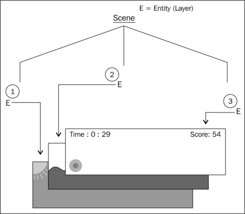
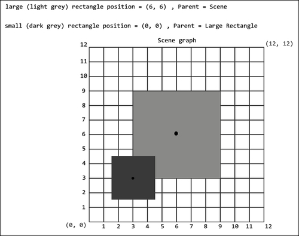
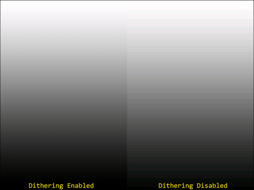
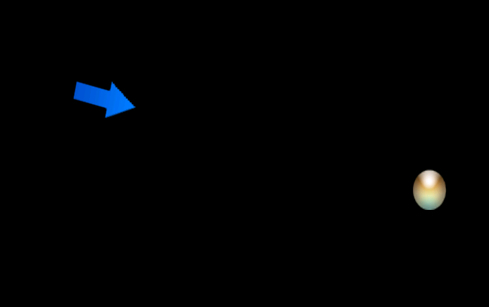

# 二、使用实体

在这一章中，我们将开始在屏幕上显示对象，以及处理这些对象的各种方法。主题包括:

*   理解和工程实体
*   将图元应用于图层
*   用精灵将场景带入生活
*   将文本应用于图层
*   使用相对旋转
*   覆盖`onManagedUpdate`方法
*   使用修改器和实体修改器
*   使用粒子系统

# 简介

在本章中，我们将开始使用 AndEngine 中包含的所有精彩实体。 实体为我们提供了一个基础，游戏世界中显示的每个对象都将依赖于这个基础，无论是乐谱文本、背景图像、玩家角色、按钮还是其他一切。有一种观点认为，在我们的游戏中，任何物体，只要有能力通过 AndEngine 的坐标系放置，都是最基本的实体。在本章中，我们将开始处理`Entity`对象及其许多子类型，以便让我们在自己的游戏中充分利用它们。

# 理解和工程实体

AndEngine 游戏引擎遵循 **实体组件**模型。实体组件设计在当今许多游戏引擎中非常普遍，这是有充分理由的。它很容易使用，它是模块化的，从所有游戏对象都可以追溯到单一的、最基本的`Entity`对象的意义上来说，它非常有用。实体-组件模型可以被认为是“实体”部分，指的是游戏引擎对象系统的最基本层次。`Entity`类只处理我们的游戏对象所依赖的最基本的数据，比如位置、旋转、颜色、场景的附着和脱离等等。“组件”部分指的是实体类的模块化子类型，例如`Scene`、`Sprite`、`Text`、`ParticleSystem`、`Rectangle`、`Mesh`以及我们游戏中可以放置的所有其他对象。组件意味着处理更具体的任务，而实体意味着充当所有组件将依赖的基础。

## 怎么做...

从最基本的`Entity`方法开始，我们将一个`Entity`对象附加到一个`Scene`对象:

创建一个`Entity`对象并将其附加到`Scene`对象只需要下面两行代码:

```java
Entity layer = new Entity();
mScene.attachChild(layer);
```

## 它是如何工作的…

这里给出的两行代码允许我们创建一个基本的`Entity`对象并将其附加到我们的`Scene`对象上。一个被定义为在*中看到的`Entity`物体怎么做...*这个食谱的一部分最常用作图层。层的用途将在接下来的段落中讨论。

实体在开发游戏时非常重要。事实上，我们场景中显示的所有对象都是从实体中派生出来的(包括`Scene`对象本身！).在大多数情况下，我们可以假设实体或者是视觉显示的对象，例如场景中的`Sprite`、`Text`或`Rectangle`对象，或者是图层，例如`Scene`对象。看到`Entity`类有多广泛，我们将讨论实体的两种用途，就像它们是单独的对象一样。

实体的第一个也可以说是最重要的方面是分层能力。一层是游戏设计中非常简单的概念；然而，由于游戏在游戏过程中倾向于支持的实体数量，当第一次了解它们时，事情会很快变得令人困惑。除非另有定义，否则我们必须将层视为具有一个父层和无限数量子层的对象。顾名思义，层的目的是以有组织的方式在场景中应用我们的各种实体对象，幸运的是，这也使我们能够在层上执行一个动作，该动作将一致地影响其所有子对象，例如，重新定位和应用某些实体修改器。我们可以假设，如果我们有一个背景，一个中间地带和一个前景，我们的游戏将有三个独立的层。这三层会以特定的顺序出现，这取决于它们附着在场景上的顺序，就像一张张纸叠在一起一样。如果我们低头看那叠纸，最后一张加到纸堆里的纸就会出现在其他纸堆的前面。相同的规则适用于附着到`Scene`对象的`Entity`对象；如下图所示:



上图描绘了一个由三个`Entity`物体层组成的基本游戏场景。三层中的每一层都有一个特定的目的，那就是按照深度存储所有相关的实体。应用于场景的第一层是背景层，包括一个精灵，它包含一个蓝天和一个太阳。应用于场景的第二层是中间地面层。在这一层，我们可以找到与玩家相关的物体，包括玩家行走的风景、可收集的物品、敌人等等。最后，我们有前景层，用于在设备的显示器上显示最前面的实体。如图所示，前景层用于显示用户界面，包括一个按钮和两个`Text`对象。

让我们再来看看附加了子实体的层的场景会是什么样子:


该图显示了场景如何根据深度/分层在屏幕上显示实体。在图的底部，我们看到了设备的显示屏。我们可以看到**背景层**先附着在**场景**上，然后再附着**玩家层**。这意味着附着在背景上的实体将显示在**玩家图层**子级的后面。记住这一点，规则也适用于子实体。就深度而言，附着到该层的第一个子对象将出现在任何后续附着对象的后面。

最后，与一般实体和工程实体相关的最后一个重要主题是实体组合。在继续下一步之前，有一件事我们应该回顾一下*孩子继承了父母的价值观！*这是很多新手和工程师在游戏中设置多层时会遇到的问题。当子实体的父实体的属性改变时，从倾斜、缩放、位置、旋转、可见性等等的一切都会被考虑在内。请看下图，该图显示了实体在 AndEngine 中的**位置**组成:



首先，我们应该知道，在 AndEngine 的锚点中心分支中，坐标系从实体的左下角开始。增加 x 值会将实体位置向右移动，增加 y 值会将实体位置向上移动。减少 x/y 值将产生相反的影响。考虑到这一点，我们可以看到附在**场景**上的较大矩形的位置被设置为坐标**场景**上的 **(6，6)** 。由于较小的矩形附着在较大的矩形上，而不是其坐标系相对于**场景**，因此它实际上使用的是大矩形的坐标系。这意味着小矩形的锚定中心位置将直接位于大矩形坐标系的位置 **(0，0)** 。正如我们在上图中所看到的， **(0，0)** 在大矩形坐标系中的位置是其左下角。

### 注

较旧的 AndEngine 分支和 AndEngine 最新的锚点中心分支之间的主要区别在于，定位实体不再意味着我们将实体的左上角设置为坐标系上的位置。相反，实体的中心点将被放置在定义的位置，也可以在上图中看到。

## 还有更多...

AndEngine 中的`Entity`对象包括许多不同的方法，这些方法影响实体的许多方面。无论实体的子类型如何，这些方法在塑造`Entity`对象的整体特征方面发挥着至关重要的作用。了解如何操作实体是一个好主意，以便完全控制实体如何出现、如何反应、如何存储信息等等。使用下面的列表来熟悉`Entity`对象的一些最重要的方法，以及它们对应的 getter 方法。本列表中缺少的方法将在本章节和以下章节中详细介绍:

*   `setVisible(pBoolean)``isVisible()`:这个方法可以设置实体在场景中是否可见。将这些方法设置为`true`将允许实体渲染，将它们设置为`false`将禁用渲染。
*   `setChildrenVisible(pBoolean)``isChildrenVisible()`:类似于`setVisible(pBoolean)`方法，只是定义了调用实体的子代的可见性，而不是本身。
*   `setCullingEnabled(pBoolean)``isCullingEnabled()`:实体剔除是一种非常有前途的性能优化技术。详见[第八章](08.html "Chapter 8. Maximizing Performance")、*性能最大化*中*禁用实体剔除渲染*。
*   `collidesWith(pOtherEntity)` : 该方法用于检测调用该方法的实体何时与作为该方法参数提供的`Entity`对象发生碰撞或重叠。如果实体发生碰撞，该方法返回`true`。
*   `setIgnoreUpdate(pBoolean)` 和 `isIgnoreUpdate()` : 忽略实体更新可以提供明显的性能提升。详见[第八章](08.html "Chapter 8. Maximizing Performance")、*性能最大化*中*忽略实体更新*。
*   `setChildrenIgnoreUpdate(pBoolean)``isChildrenIgnoreUpdate()`:类似于`setIgnoreUpdate(pBoolean)`方法，只是只影响调用实体的子代，不影响自身。
*   `getRootEntity()` : 这个方法将遍历实体的父实体，直到到达根父实体。一旦找到根父对象，该方法将返回根`Entity`对象；在大多数情况下，根源是我们游戏的`Scene`对象。
*   `setTag(pInt)``getTag()`:此方法可用于存储实体内的整数值。通常用于设置实体的标识值。
*   `setParent(pEntity)``hasParent()`:将父实体设置为调用该方法的实体。`hasParent()`方法根据调用实体是否有父实体返回`true`或`false`值。
*   `setZIndex(pInt)``getZIndex()`:设置主叫实体的`Z`索引。值较大的实体将出现在值较小的实体前面。默认情况下，所有实体都有一个`0`的`Z`索引，这意味着它们只是按照它们被附加的顺序出现。详见以下`sortChildren()`方法。
*   `sortChildren()` : 必须在实体或实体组的父级上调用此方法，这些实体或实体组的`Z`索引在更改在屏幕上生效之前已被修改。
*   `setPosition(pX, pY)`或`setPosition(pEntity)`:该方法可以将一个实体的位置设置为特定的 x/y 值，也可以设置为另一个实体的位置。此外，我们可以使用`setX(pX)`和`setY(pY)`方法仅更改单个轴位置。
*   `getX()``getY()`:这些方法用于获取实体在局部坐标中的位置；即与其父代的关系。
*   `setWidth(pWidth)``setHeight(pHeight)`或`setSize(pWidth, pHeight)` : 这些方法可以用来设置调用实体的宽度和高度。此外，我们可以使用`getWidth()`和`getHeight()`方法，它们在中以浮点数据类型返回各自的值。
*   `setAnchorCenter(pAnchorCenterX, pAnchorCenterY)` : 这个方法可以用来设置实体的锚点中心。锚定中心是`Entity`对象内的位置，它将围绕该位置旋转、倾斜和缩放。此外，修改锚点中心值将从默认中心点重新定位实体的“定位”锚点。例如，如果我们将锚点中心位置移动到实体的左上角，调用`setPosition(0,0)`会将实体的左上角放置到`(0,0)`位置。
*   `setColor(pRed, pGreen, pBlue)``getColor()`:这个方法可以用来设置一个实体的颜色，从无颜色的`0.0f`到全颜色的`1.0f`不等。
*   `setUserData(pObject)` 和`getUserData(`【T2:这两个方法在用 AndEngine 开发游戏的时候非常有用。它们允许我们在实体中存储我们选择的对象，并在任何时间点修改或检索它。用户数据存储的一种可能性是确定玩家角色持有的武器类型。充分利用这些方法！

# 将图元应用于图层

AndEngine 的原始类型包括`Line`、`Rectangle`、`Mesh`和`Gradient`对象。在这个话题中，我们将集中讨论`Mesh`课。网格对于在我们的游戏中创建更复杂的形状非常有用，它可以有无限的用途。在本食谱中，我们将使用`Mesh`物体建造房屋，如下图所示:


## 准备…

请参考代码包中名为`ApplyingPrimitives`的类。

## 怎么做…

为了创建一个`Mesh`对象，我们需要比典型的`Rectangle`或`Line`对象做更多的工作。使用`Mesh`对象很有用，原因有很多。它们允许我们加强我们的技能，就 OpenGL 坐标系而言，我们可以创建奇怪形状的图元，并且我们可以改变单个顶点的位置，这对于某些类型的动画非常有用。

1.  创建`Mesh`对象的第一步是创建我们的缓冲区数据，该数据用于指定构成网格形状的点:

    ```java
      float baseBufferData[] = {
          /* First Triangle */
          0, BASE_HEIGHT, UNUSED, /* first point */
          BASE_WIDTH, BASE_HEIGHT, UNUSED, /* second point */
          BASE_WIDTH, 0, UNUSED, 	/* third point */

          /* Second Triangle */
          BASE_WIDTH, 0, UNUSED, /* first point */
          0, 0, UNUSED, /* second point */
          0, BASE_HEIGHT, UNUSED, /* third point */
      };
    ```

2.  一旦缓冲区数据配置到我们喜欢的程度，我们就可以创建`Mesh`对象了。

    ```java
    Mesh baseMesh = new Mesh((WIDTH * 0.5f) - (BASE_WIDTH * 0.5f), 0, baseBufferData, baseBufferData.length / POINTS_PER_TRIANGLE, DrawMode.TRIANGLES, mEngine.getVertexBufferObjectManager());
    ```

## 它是如何工作的…

让我们把这个过程再分解一点，以便找出我们最终是如何得到一个由原始物体构成的房子的。

第一步，我们创建`baseMesh`对象的缓冲区数据。该缓冲区数据用于存储 3D 空间中的点。存储在缓冲区数据中的每三个值由换行符分隔，构成三维世界中的一个顶点。然而，应该理解的是，由于我们使用的是 2D 游戏引擎，第三个值，即`Z`指数，对我们来说没有任何用处。因此，我们将每个顶点的第三个值定义为配方类中声明的`UNUSED`常数，等于`0`。每个三角形的点都表示为`(x, y, z)`，以免混淆顺序。请参见下图，了解第一步中定义的点如何在网格上绘制矩形:


上图表示`baseMesh`对象的缓冲区数据，或绘制的点，如*中所示...*节的第一步。黑线代表第一组点:

```java
      0, BASE_HEIGHT, UNUSED, /* first point */
      BASE_WIDTH, BASE_HEIGHT, UNUSED, /* second point */
      BASE_WIDTH, 0, UNUSED,  /* third point */
```

`baseMesh`对象缓冲区数据中的第二组点由灰色线条表示:

```java
      BASE_WIDTH, 0, UNUSED, /* first point */
      0, 0, UNUSED, /* second point */
      0, BASE_HEIGHT, UNUSED, /* third point */
```

由于`BASE_HEIGHT`等于`200`、`BASE_WIDTH`等于`400`，我们可以读到第一个三角形的第一个点，也就是`(0, BASE_HEIGHT)`，位于矩形的左上角。顺时针移动，第一个三角形的第二个点位于`(BASE_WIDTH, BASE_HEIGHT)`位置，也就是矩形的右上角。三角形显然是由三个点组成的，所以我们还有一个顶点要画。我们第一个三角形的最后一个顶点位于`(BASE_WIDTH, 0)`位置。作为个人挑战，使用上图中的场景图，找出灰色三角形的绘制点与缓冲区数据的比较情况！

在第二步中，我们获取`baseMesh`对象的缓冲区数据，并使用它来构建`Mesh`对象。`Mesh`对象是`Entity`类的一个子类型，所以一旦我们创建了`Mesh`对象，我们就可以重新定位它，缩放它，旋转它，以及进行任何其他我们需要的调整。参数在构造函数中出现的顺序如下:x 轴位置、y 轴位置、缓冲区数据、顶点计数、绘制模式和顶点缓冲区对象管理器。前两个和最后一个参数是所有实体的典型参数，但是缓冲区数据、顶点计数和绘制模式对我们来说是新的。缓冲区数据是指定绘制顶点的数组，这在第一步中有所介绍。顶点计数只是缓冲区数据包含的顶点数。缓冲区数据中的每个 x、y 和 z 坐标组成一个顶点，这就是为什么我们要将`baseBufferData.length`值除以 3 作为该参数。最后，`DrawMode`定义`Mesh`对象将如何解释缓冲区数据，这会极大地改变网格的最终形状。不同的`DrawMode`类型和用途可以在*中找到，还有更多...*这一节的题目。

在继续之前，您可能会注意到“门”，或者更确切地说，代表门的蓝线不是以与屋顶和基础`Mesh`对象相同的方式创建的。相反，我们使用线条而不是三角形来绘制门的轮廓。看看下面的代码，它取自`doorBufferData`数组，定义了线连接的点:

```java
      0, DOOR_HEIGHT, UNUSED, /* first point */
      DOOR_WIDTH, DOOR_HEIGHT, UNUSED, /* second point */
      DOOR_WIDTH, 0, UNUSED, /* third point */
      0, 0, UNUSED, /* fourth point */
      0, DOOR_HEIGHT, UNUSED /* fifth point */
```

同样，如果我们绘制一个场景图，并绘制这些点，类似于上图中代表`baseMesh`对象的点，我们实际上可以将这些点连接起来，这些线将形成一个矩形。起初这可能看起来很混乱，尤其是当我们试图在头脑中创造形状的时候。从定义的顶点开始绘制自定义形状的技巧是将空白场景图保存在最喜欢的文档或图像编辑软件中。创建一个类似于`baseMesh`对象的缓冲区数据表示图的场景图，并使用它来绘制点，然后简单地将点复制到代码中！

### 注

非常重要的一点是要记住上一个场景图图上的`(0,0)`位置代表的是`Mesh`物体的中心。因为我们正在建立网格顶点向上和向右，网格的锚中心位置将不会代表手动绘制的形状的中心！建造`Mesh`物件时，这一点非常重要。

## 还有更多...

对于初学者来说，创建网格可能是一个相当令人生畏的主题，但是出于许多原因，习惯于网格是一个好主意。AndEngine 开发人员的主要原因之一是，它可以帮助我们理解 OpenGL 是如何将形状绘制到较低级别的显示器上的，这反过来又使我们能够更容易地掌握较高级别的游戏开发功能。下图包含了 AndEngine 方便地为我们提供的各种`DrawMode`类型，以便以不同的方式创建`Mesh`对象:


上图显示了根据所选的`DrawMode`类型，我们的`Mesh`对象将如何将缓冲数据中的顶点绘制到场景中。该图中的每个 **p#** 代表我们的缓冲区数据数组中的一个`vertice (x, y, and z value)`。每种`DrawMode`类型的图像表示说明见以下几点:

*   `DrawMode.POINTS` : 该选项允许我们为网格缓冲区数据中的每个顶点绘制单个点。这些点不会被任何线连接；他们只是在网格上为每个点显示一个点。
*   `DrawMode.LINES`:这个选择可以让我们在网格上画出单独的线条。每两个顶点将由一条线连接。
*   `DrawMode.LINE_STRIP`:这个选择允许我们在网格上绘制点，第一个点之后的每个点都连接到上一个点。例如 **p1** 将连接到 **p0** ， **p2** 将连接到 **p1** 等等。
*   `DrawMode.LINE_LOOP` : 该选择的作用类似于`DrawMode.LINE_STRIP`类型，但是，第一个点和最后一个点也将由一条线连接。这允许我们通过线条创建封闭的形状。
*   `DrawMode.TRIANGLES`:–该选项允许我们为缓冲区数据中定义的每个三个顶点在网格上绘制单独的三角形。对于这种绘制模式，我们需要将顶点保持在 3 的倍数。
*   `DrawMode.TRIANGLE_FAN`:这个选择可以让我们画出锥形或者金字塔形的网格。正如我们在上图中看到的，我们从指定一个点开始，该点定义了圆锥体的最顶点，然后继续为形状指定任意数量的基点。这种绘制模式需要在缓冲区数据中定义三个或更多顶点。
*   `DrawMode.TRIANGLE_STRIP`:这个选择让我们可以轻松创建定制的多边形网格。在缓冲区数据中定义的每个顶点，在初始三角形的第三个顶点之后，将产生一个新的三角形，创建一个新的“条”。有关示例，请参见图形表示。这种绘制模式需要在缓冲区数据中定义三个或更多顶点。

## 另见

*   *理解本章给出的和工程实体*。

# 用精灵把场景变得生动

在这里，我们进入一个话题，这个话题可能被认为是创造任何 2D 游戏最必要的方面。精灵允许我们在场景中显示 2D 图像，这些图像可用于显示按钮、角色/化身、环境和主题、背景以及游戏中可能需要通过图像文件表示的任何其他实体。在本食谱中，我们将涵盖 AndEngine 的`Sprite`实体的各个方面，这些实体将为我们提供在更复杂的情况下继续使用`Sprite`对象所需的信息。

## 准备…

在我们深入研究如何创建精灵的内部工作之前，我们需要了解如何创建和管理引擎的`BitmapTextureAtlas` / `BuildableBitmapTextureAtlas`对象以及`ITextureRegion`对象。更多信息，请参考食谱，*使用不同类型的纹理*和*应用纹理选项[第 1 章](01.html "Chapter 1. AndEngine Game Structure")、*和工程游戏结构*中的*。

一旦这些食谱已经涵盖，创建一个新的空的和工程项目与`BaseGameActivity`类，提供一个 PNG 格式的任何大小的图像高达 1024 x 1024 像素的尺寸，命名为`sprite.png`，并把它放在项目的`assets/gfx/`文件夹，然后继续到*如何做...*本食谱的一节。

## 怎么做…

只需几步，就可以创建精灵并将其应用于我们的`Scene`对象。我们必须首先设置精灵将使用的必要纹理资源，我们必须创建`Sprite`对象，然后我们必须将`Sprite`对象附加到我们的`Scene`对象。有关更多详细信息，请参见以下步骤:

1.  我们将从创建我们的`BaseGameActivity`类的`onCreateResources()`方法中的纹理资源开始。确保`mBitmapTextureAtlas`和`mSpriteTextureRegion`对象是全局变量，以便在我们活动的各种生命周期方法中都可以到达它们:

    ```java
      BitmapTextureAtlasTextureRegionFactory.setAssetBasePath("gfx/");

        /* Create the bitmap texture atlas for the sprite's texture region */
        BuildableBitmapTextureAtlas mBitmapTextureAtlas = new BuildableBitmapTextureAtlas(mEngine.getTextureManager(), 256, 256, TextureOptions.BILINEAR);

        /* Create the sprite's texture region via the BitmapTextureAtlasTextureRegionFactory */
        mSpriteTextureRegion = BitmapTextureAtlasTextureRegionFactory.createFromAsset(mBitmapTextureAtlas, this, "sprite.png");

        /* Build the bitmap texture atlas */
        try {
          mBitmapTextureAtlas.build(new BlackPawnTextureAtlasBuilder<IBitmapTextureAtlasSource, BitmapTextureAtlas>(0, 1, 1));
        } catch (TextureAtlasBuilderException e) {
          e.printStackTrace();
        }
        /* Load the bitmap texture atlas into the device's gpu memory */
        mBitmapTextureAtlas.load();
    ```

2.  接下来，我们将创建`Sprite`对象。我们可以在活动的`onCreateScene()`或`onPopulateScene()`方法中创建`Sprite`对象并将其附加到`Scene`对象。在其构造函数中提供的参数依次包括子画面的初始 x 坐标、初始 y 坐标、`ITextureRegion`对象，最后是`mEngine`对象的顶点缓冲区对象管理器:

    ```java
        final float positionX = WIDTH * 0.5f;
        final float positionY = HEIGHT * 0.5f;

        /* Add our marble sprite to the bottom left side of the Scene initially */
        Sprite mSprite = new Sprite(positionX, positionY, mSpriteTextureRegion, mEngine.getVertexBufferObjectManager());
    The last step is to attach our Sprite to the Scene, as is necessary in order to display any type of Entity on the device's display:
        /* Attach the marble to the Scene */
        mScene.attachChild(mSpriteTextureRegion);
    ```

## 它是如何工作的…

正如在上一节的步骤中可能出现的，设置`mBitmapTextureAtlas`和`mSpriteTextureRegion`对象实际上比创建和设置`mSprite`对象需要更多的工作。因此，鼓励完成*入门中提到的两个食谱...*节预。

第一步，我们将创建我们的`mBitmapTextureAtlas`和`mSpriteTextureRegion`对象，适合我们的`sprite.png`形象的需要。在此步骤中，请随意使用任何纹理选项或纹理格式。深入了解他们是一个非常好的主意。

一旦我们创建了`ITextureRegion`对象并准备使用，我们就可以进入第二步，创建`Sprite`对象。创建精灵是一项简单的任务。前两个参数将用于定义子画面相对于其中心点的初始位置。对于第三个参数，我们将传入我们在第一步中创建的`ITextureRegion`对象，以便为精灵提供其作为场景中的图像的外观。最后，我们传入`mEngine.getVertexBufferObjectManager()`方法，这是大多数实体子类型所必需的。

一旦我们的`Sprite`对象被创建，我们必须在它显示在设备上之前将其附加到`Scene`对象，或者我们可以将其附加到已经附加到`Scene`对象的另一个`Entity`对象。参见本章中给出的*理解和工程实体*配方，了解更多关于实体组成、位置和`Entity`对象的其他各种必须知道的方面的信息。

## 还有更多...

没有某种精灵动画，任何游戏都是不完整的。毕竟，在一个游戏中，角色在屏幕上滑动而不移动脚，攻击敌人时不挥动武器，甚至当手榴弹简单消失而不是造成良好的爆炸效果时，玩家只能回到游戏中这么多次才会感到无聊。在这个时代，人们想玩看起来和感觉都很好的游戏，没有什么说“好！”就像光滑的动画精灵，对吧？

在[第 1 章](01.html "Chapter 1. AndEngine Game Structure")、*和*的*处理不同类型的纹理*配方中，我们已经介绍了如何创建一个`TiledTextureRegion`对象，它允许我们将可用的精灵表作为纹理导入到我们的游戏中。现在让我们来看看如何将`TiledTextureRegion`对象与`AnimatedSprite`对象结合使用，以便为游戏的精灵添加一些动画。对于这个演示，代码将使用 300 x 50 像素的图像。sprite 表可以像下图一样简单，只是为了了解如何创建动画:


上图中的精灵表可以用来创建一个 12 列 1 行的`TiledTextureRegion`对象。使用以下代码可以为这个精灵表创建`BuildableBitmapTextureAtlas`和`TiledTextureRegion`对象。但是，在导入此代码之前，请确保在您的测试项目中对纹理区域进行全局声明-`TiledTextureRegion mTiledTextureRegion`:

```java
    /* Create the texture atlas at the same dimensions as the image (300x50)*/
    BuildableBitmapTextureAtlas mBitmapTextureAtlas = new BuildableBitmapTextureAtlas(mEngine.getTextureManager(), 300, 50, TextureOptions.BILINEAR);

    /* Create the TiledTextureRegion object, passing in the usual parameters,
     * as well as the number of rows and columns in our sprite sheet for the 
     * final two parameters */
    mTiledTextureRegion = BitmapTextureAtlasTextureRegionFactory.createTiledFromAsset(mBitmapTextureAtlas, this, "gfx/sprite_sheet.png", 12, 1);

    /* Build and load the mBitmapTextureAtlas object */
    try {
      mBitmapTextureAtlas.build(new BlackPawnTextureAtlasBuilder<IBitmapTextureAtlasSource, BitmapTextureAtlas>(0, 0, 0));
    } catch (TextureAtlasBuilderException e) {
      e.printStackTrace();
    }
    mBitmapTextureAtlas.load();
```

现在我们已经在项目中使用了`mTiledTextureRegion`精灵表，我们可以创建`AnimatedSprite`对象并制作其动画。如果您使用的是上图中带有黑色圆圈的精灵表，请不要忘记将`Scene`对象的颜色更改为非黑色，这样我们就可以看到`AnimatedSprite`对象:

```java
    /* Create a new animated sprite in the center of the scene */
    AnimatedSprite animatedSprite = new AnimatedSprite(WIDTH * 0.5f, HEIGHT * 0.5f, mTiledTextureRegion, mEngine.getVertexBufferObjectManager());

    /* Length to play each frame before moving to the next */
    long frameDuration[] = {100, 200, 300, 400, 500, 600, 700, 800, 900, 1000, 1100, 1200};

    /* We can define the indices of the animation to play between */
    int firstTileIndex = 0;
    int lastTileIndex = mTiledTextureRegion.getTileCount();

    /* Allow the animation to continuously loop? */
    boolean loopAnimation = true;

    * Animate the sprite with the data as set defined above */
    animatedSprite.animate(frameDuration, firstTileIndex, lastTileIndex, loopAnimation, new IAnimationListener(){

      @Override
      public void onAnimationStarted(AnimatedSprite pAnimatedSprite,
          int pInitialLoopCount) {
        /* Fired when the animation first begins to run*/
      }

      @Override
      public void onAnimationFrameChanged(AnimatedSprite pAnimatedSprite,
          int pOldFrameIndex, int pNewFrameIndex) {
         /* Fired every time a new frame is selected to display*/
      }

      @Override
      public void onAnimationLoopFinished(AnimatedSprite pAnimatedSprite,
          int pRemainingLoopCount, int pInitialLoopCount) {
        /* Fired when an animation loop ends (from first to last frame) */
      }

      @Override
      public void onAnimationFinished(AnimatedSprite pAnimatedSprite) {
        /* Fired when an animation sequence ends */
      }
      );

    mScene.attachChild(animatedSprite);
```

创建`AnimatedSprite`对象可以在创建常规`Sprite`对象时按照本食谱中的步骤进行。一旦它被创建，我们就可以设置它的动画数据，包括单个帧的持续时间，第一个和最后一个要动画显示的图块索引，以及是否连续循环动画。注意`frameDuration`数组必须等于帧数！不遵守此规则将导致`IllegalArgumentException`异常。一旦数据已经建立，我们可以在`AnimatedSprite`对象上调用`animate()`方法，提供所有的数据，如果我们愿意，还可以添加一个`IAnimationListener`监听器。正如监听器中的评论所暗示的，我们通过 AndEngine 的`AnimatedSprite`类获得了对动画的很大一部分控制。

### 利用 OpenGL 的抖动能力

当在移动平台上开发视觉上吸引人的游戏时，我们很可能希望在图像中包含一些渐变，尤其是在处理 2D 图形时。渐变非常适合创建灯光效果、阴影和许多其他我们无法应用于完整 2D 世界的对象。问题在于，我们正在为移动设备开发，因此不幸的是，我们没有无限量的资源可供支配。因此，AndEngine 默认将曲面视图颜色格式下采样为`RGB_565`。无论我们在纹理中定义何种纹理格式，它们在显示在设备上之前都会被降采样。我们可以改变应用于 AndEngine 表面视图的颜色格式，但是在开发带有许多精灵的大型游戏时，这种性能损失可能是不值得的。

在这里，我们有两个单独的屏幕截图，一个简单的具有渐变纹理的精灵；两种纹理都使用`RGBA_8888`纹理格式和`BILINEAR`纹理过滤(最高质量)。



右侧的图像应用于`Scene`对象，没有任何修改，而左侧的图像启用了 OpenGL 的抖动功能。这两幅完全相同的图像之间的差异是显而易见的。抖动是一个很好的方法，让我们不用依赖最大的颜色质量格式，就可以对抗表面视图应用的下采样。简而言之，通过抖动图像颜色中的低水平随机噪声，可以在左侧图像中获得更平滑的效果。

启用抖动在 AndEngine 中应用于我们的实体很简单，但是像所有东西一样，选择应用抖动的纹理是明智的。该算法确实增加了一点额外的开销，如果使用过于频繁，可能会导致比简单地将我们的表面视图恢复到`RGBA_8888`更大的性能损失。在下面的代码中，我们在`preDraw()`方法中启用抖动，在`postDraw()`方法中禁用抖动:

```java
@Override
protected void preDraw(GLState pGLState, Camera pCamera) {
  // Enable dithering
  pGLState.enableDither();
  super.preDraw(pGLState, pCamera);
}

@Override
protected void postDraw(GLState pGLState, Camera pCamera) {
  // Disable dithering
  pGLState.disableDither();
  super.postDraw(pGLState, pCamera);
}
```

抖动可以应用于 AndEngine 的`Shape`类(`Sprites`、`Text`、原语等的任何子类型。).

### 注

有关 OpenGL ES 2.0 以及如何使用所有不同功能的更多信息，请访问位于[http://www.khronos.org/opengles/sdk/docs/man/](http://www.khronos.org/opengles/sdk/docs/man/)的链接。

## 另见

*   *处理不同类型的纹理[第 1 章](01.html "Chapter 1. AndEngine Game Structure")、*处理实体**
*   *在[第 1 章](01.html "Chapter 1. AndEngine Game Structure")、*中应用纹理选项*处理实体*。
*   *理解和设计本章中的实体*。

# 将文本应用到图层

文本是游戏开发的重要部分，因为它可以用来动态显示点数系统、教程、描述等等。AndEngine 还允许我们通过指定定制的`Font`对象来创建更适合单个游戏类型的文本样式。在本食谱中，我们将创建一个`Text`对象，它会用当前系统时间更新自己，并在每次字符串长度增长或收缩时校正其位置。这将为我们在需要显示分数、时间和其他非特定动态字符串的情况下使用`Text`对象做好准备。

## 准备…

将`Text`对象应用到我们的`Scene`对象需要对 AndEngine 的字体资源有一定的了解。请执行[第 1 章](01.html "Chapter 1. AndEngine Game Structure")、*实体工作*中的“使用和工程字体资源”的配方，然后继续执行*如何操作...*本食谱的一节。请参考代码包中名为`ApplyingText`的类，了解该配方的代码活动。

## 怎么做…

当将`Text`对象应用到我们的`Scene`对象时，我们需要创建一个`Font`对象来定义文本的样式，并创建`Text`对象本身。为了在我们的场景中正确显示`Text`物体，我们必须采取的具体行动见以下步骤:

1.  创建任何`Text`对象的第一步是为自己准备一个`Font`对象。`Font`对象将充当定义`Text`对象样式的资源。此外，我们需要准备我们计划显示的`Text`对象的字母:

    ```java
        mFont = FontFactory.create(mEngine.getFontManager(),
            mEngine.getTextureManager(), 256, 256,
            Typeface.create(Typeface.DEFAULT, Typeface.NORMAL), 32f, true,
            Color.WHITE);
        mFont.load();

        /*
         * Prepare the mFont object for the most common characters used. This
         * will eliminate the need for the garbage collector to run when using a
         * letter/number that's never been used before
         */
          mFont.prepareLetters("Time: 1234567890".toCharArray());
    Once we've got our Font object created and ready for use, we can create the Text:
        /* Create the time Text object which will update itself as time passes */
        Text mTimeText = new Text(0, timeTextHeight, mFont, TIME_STRING_PREFIX
            + TIME_FORMAT, MAX_CHARACTER_COUNT, mEngine.getVertexBufferObjectManager()) {

          // Overridden methods as seen in step 3...
        };
    ```

2.  如果我们处理的是可能永远不会改变的最终字符串，那么只需要涵盖前两个步骤。然而，在这个配方中，我们需要覆盖`Text`实体的`onManagedUpdate()`方法，以便随时间对其字符串进行调整。在这种情况下，我们每过一秒就更新一次字符串的时间值:

    ```java
        int lastSecond = 0;

        @Override
        protected void onManagedUpdate(float pSecondsElapsed) {

          Calendar c = Calendar.getInstance();

          /*
          * We will only obtain the second for now in order to verify
           * that it's time to update the Text's string
          */
          final int second = c.get(Calendar.SECOND);

          /*
           * If the last update's second value is not equal to the
          * current...
           */
          if (lastSecond != second) {

          /* Obtain the new hour and minute time values */
            final int hour = c.get(Calendar.HOUR);
            final int minute = c.get(Calendar.MINUTE);

            /* also, update the latest second value */
            lastSecond = second;

             /* Build a new string with the current time */
            final String timeTextSuffix = hour + ":" + minute + ":"
               + second;

            /* Set the Text object's string to that of the new time */
            this.setText(TIME_STRING_PREFIX + timeTextSuffix);

            /*
              * Since the width of the Text will change with every change
             * in second, we should realign the Text position to the
              * edge of the screen minus half the Text's width
            */
            this.setX(WIDTH - this.getWidth() * 0.5f);
          }

          super.onManagedUpdate(pSecondsElapsed);
        }
    Finally, we can make color adjustments to the Text and then attach it to the Scene or another Entity:
        /* Change the color of the Text to blue */
        mTimeText.setColor(0, 0, 1);

        /* Attach the Text object to the Scene */
        mScene.attachChild(mTimeText);
    ```

## 它是如何工作的…

至此，我们应该已经了解了如何创建`Font`对象，正如我们在第一章中讨论的那样。如果还不了解创建`Font`对象，请访问[第 1 章](01.html "Chapter 1. AndEngine Game Structure")、*中的*使用和工程字体资源*使用实体*。

在第一步中，我们简单地创建一个基本的`Font`对象，它将为我们的`Text`对象创建一个相当通用的样式。一旦创建了`Font`对象，我们就只准备在`Text`对象的整个生命周期中使用`mFont.prepareLetters()`方法显示的必要字符。这样做允许我们避免在`Font`对象内的垃圾收集器调用。本食谱中使用的数值范围显然从`0`到`9`不等，因为我们处理的是时间，以及组成字符串的单个字符`Time:`。

一旦第一步完成，我们就可以进入第二步，创建`Text`对象。`Text`对象要求我们在 x 和 y 坐标中指定它在屏幕上的初始位置、`Font`对象用作样式、要显示的初始字符串、它的最大字符数，最后是所有`Entity`对象所需的顶点缓冲区对象管理器。然而，由于我们正在处理这个`Text`对象的动态更新`String`值，这将需要在 x 轴上进行调整，因此包括 x 坐标以及初始字符串在内的参数并不重要，因为它们将在更新`Text`对象的过程中频繁调整。最重要的参数是最大字符数。未能保持`Text`对象的最大字符数低于该参数中指定的值将导致应用程序接收到`ArrayIndexOutOfBoundsException`异常，并可能需要终止。因此，我们将最大字符串的长度相加，如下面的代码片段所示:

```java
  private static final String TIME_STRING_PREFIX = "Time: ";
  private static final String TIME_FORMAT = "00:00:00";

  /* Obtain the maximum number of characters that our Text 
   * object will need to display*/
  private static final int MAX_CHARACTER_COUNT = TIME_STRING_PREFIX.length() + TIME_FORMAT.length();
```

在第三步中，我们覆盖`Text`对象的`onManagedUpdate()`方法，以便在每过一秒钟后对`Text`对象的字符串进行更改。首先，我们简单地获取设备当前的第二个值，用它与之前调用`Text`对象的`onManagedUpdate()`方法中的第二个值进行比较。这允许我们避免在每次更新时用系统时间更新`Text`对象。如果`Text`对象的字符串被更新的前一秒与新的第二个值不相同，那么我们继续通过`Calendar.getInstance().get(HOUR)`方法和`MINUTE`变化获得当前的分钟和小时值。现在我们已经得到了所有的值，我们构建一个包含更新时间的新字符串，并在`Text`对象上调用`setText(pString)`来更改它将在设备上显示的字符串。

然而，由于每个单独的字符宽度可能有不同的值，我们还需要在位置上进行校正，以便在屏幕上保持完整的`Text`对象。默认情况下，锚点位置被设置为`Entity`对象的中心，因此通过调用`this.setX(WIDTH - this.getWidth() * 0.5f)`，其中`this`指的是`Text`对象，我们将实体的最中心点定位在最大屏幕宽度的右侧，然后减去实体宽度的一半。这将允许文本沿着屏幕边缘放置，即使其字符改变了`Text`对象的宽度。

## 还有更多...

有时我们的游戏可能需要对`Text`对象的字符串进行一点点格式化。在我们需要调整`Text`对象的水平对齐的情况下，如果文本的字符串超过某个宽度，或者文本有一个前导空格，我们可以用一些非常容易使用的方法来实现。可以在`Text`对象上直接调用以下方法；例如`mText.setLeading(3)`:

*   `setAutoWrap(pAutoWrap)`:这个方法允许我们定义一个`Text`实体是否会自动换行，如果会自动换行。我们的参数选项包括`AutoWrap.NONE`、`AutoWrap.LETTERS`、`AutoWrap.WORDS`和`AutoWrap.CJK`。使用`LETTERS`，换行符不会在换到新行之前等待空白，而`WORDS`会。`CJK`变体是一个允许中文、日文和韩文字符自动换行的选项。此方法应与`setAutoWrapWidth(pWidth)`一起使用，其中`pWidth`定义了`Text`对象字符串中任何一行的最大宽度，必要时会导致换行。
*   `setHorizontalAlign(pHorizontalAlign)`:这个方法允许我们定义`Text`对象的字符串应该遵循的对齐类型。参数包括`HorizontalAlign.LEFT`、`HorizontalAlign.CENTER`和`HorizontalAlign.RIGHT`。结果类似于我们在文本编辑器中设置对齐时看到的结果。
*   `setLeading(pLeading)`:这个方法允许我们在`Text`对象的字符串开头设置一个前导空格。所需的参数是一个浮点值，它定义了 sring 的前导宽度。T3】

## 另见

*   *使用[第一章](01.html "Chapter 1. AndEngine Game Structure")、*中的*和*中的【工程字体资源】。
*   *覆盖本章中的 onManagedUpdate 方法*。

# 使用相对旋转

相对于 2D 空间中其他实体的位置旋转实体是一个很好的功能。相对旋转的用途是无限的，似乎一直是新手机游戏开发者的“热门话题”。这种技术的一个比较突出的例子是在塔防游戏中，它允许塔的炮塔瞄准敌人的方向，一个不可玩的角色正在行走。在这个食谱中，我们将介绍一种旋转`Entity`物体的方法，以便将它们指向给定的 x/y 位置。下图显示了我们将如何在场景上创建一个箭头，该箭头将自动指向圆形图像的位置，无论它移动到哪里:



## 准备…

我们需要包括这个食谱的两张图片；一个名为`marble.png`，尺寸为 32×32 像素，另一个名为`arrow.png`，宽 31 像素，高 59 像素。大理石可以是任何图像。我们将简单地在场景中随意拖动这个图像。箭头图像应该是箭头形状，箭头在图像上直接指向上方。参见介绍中的截图，了解要包含的图像示例。将这些资产包含在一个空的`BaseGameActivity`测试项目中，然后请参考代码包中名为`RelativeRotation`的类。

## 怎么做…

请遵循以下步骤:

1.  在`BaseGameActivity`类中实现`IOnSceneTouchListener`监听器:

    ```java
    public class RelativeRotation extends BaseGameActivity implements IOnSceneTouchListener{
    ```

2.  在活动的`onCreateScene()`方法中设置`Scene`对象的`onSceneTouchListener`:

    ```java
    mScene.setOnSceneTouchListener(this);
    ```

3.  用大理石和箭头精灵填充`Scene`对象。箭头精灵位于场景的中心，而大理石的位置更新为任何触摸事件位置的坐标:

    ```java
        /* Add our marble sprite to the bottom left side of the Scene initially */
        mMarbleSprite = new Sprite(mMarbleTextureRegion.getWidth(), mMarbleTextureRegion.getHeight(), mMarbleTextureRegion, mEngine.getVertexBufferObjectManager());

        /* Attach the marble to the Scene */
        mScene.attachChild(mMarbleSprite);

        /* Create the arrow sprite and center it in the Scene */
        mArrowSprite = new Sprite(WIDTH * 0.5f, HEIGHT * 0.5f, mArrowTextureRegion, mEngine.getVertexBufferObjectManager());

        /* Attach the arrow to the Scene */
        mScene.attachChild(mArrowSprite);
    ```

4.  第四步介绍`onSceneTouchEvent()`方法，通过设备显示屏上的触摸事件处理大理石精灵的移动:

    ```java
      @Override
      public boolean onSceneTouchEvent(Scene pScene, TouchEvent pSceneTouchEvent) {
        // If a user moves their finger on the device
        if(pSceneTouchEvent.isActionMove()){

          /* Set the marble's position to that of the touch even coordinates */
         mMarbleSprite.setPosition(pSceneTouchEvent.getX(), pSceneTouchEvent.getY());

          /* Calculate the difference between the two sprites x and y coordinates */
          final float dX = mMarbleSprite.getX() - mArrowSprite.getX();
          final float dY = mMarbleSprite.getY() - mArrowSprite.getY();

          /* Calculate the angle of rotation in radians*/
          final float angle = (float) Math.atan2(-dY, dX);
          /* Convert the angle from radians to degrees, adding the default image rotation */
          final float rotation = MathUtils.radToDeg(angle) + DEFAULT_IMAGE_ROTATION;

          /* Set the arrow's new rotation */
          mArrowSprite.setRotation(rotation);

          return true;
        }

        return false;
      }
    ```

## 它是如何工作的…

在这个类中，我们创建了一个由箭头图像表示的精灵，并将其放置在屏幕的正中央，自动指向由大理石表示的另一个精灵。通过使用我们的`BaseGameActivity`类中的`IOnSceneTouchListener`监听器实现，可以通过触摸事件拖动大理石。然后，我们将触摸监听器注册到`mScene`对象。在一个实体根据另一个实体的位置旋转的情况下，我们必须将旋转功能包含在某个不断更新的方法中，否则我们的箭头不会持续做出反应。我们可以通过更新线程来做到这一点，但是在这种情况下，我们将在`onSceneTouchEvent()`重写方法中包含该功能，因为“目标”实际上不会移动，直到我们触摸场景。

在第一步中，我们允许我们的活动通过实现`IOnSceneTouchListener`接口来覆盖`onSceneTouchEvent()`方法。一旦我们实现了触摸监听器，我们就可以完成第二步，允许`Scene`对象接收触摸事件，并根据位于活动的覆盖`onSceneTouchEvent()`方法中的代码进行响应。这是用`setOnSceneTouchListener(pSceneTouchListener)`法完成的。

第四步，`if(pSceneTouchEvent.isActionMove())`条件语句确定手指是否在场景上移动，更新大理石的位置，如果条件语句返回`true`，则计算箭头精灵的新旋转。

我们首先通过使用`setPosition(pX, pY)`方法将大理石的位置更新为触摸位置，如下面的代码片段所示:

```java
mMarbleSprite.setPosition(pSceneTouchEvent.getX(), pSceneTouchEvent.getY());
```

接下来，我们从目标的 x/y 坐标中减去指针的 x/y 坐标。这给了我们每个精灵坐标之间的差异，这将用于计算两个位置之间的角度。在这种情况下，指针是`mArrowSprite`对象，目标是`mMarbleSprite`对象:

```java
/* Calculate the difference between the two sprites x and y coordinates */
final float dX = mMarbleSprite.getX() - mArrowSprite.getX();
final float dY = mMarbleSprite.getY() - mArrowSprite.getY();

/* Calculate the angle of rotation in radians*/
final float angle = (float) Math.atan2(-dY, dX);
```

最后，由于 AndEngine 的`setRotation(pRotation)`方法使用度数，`atan2(pY, pX)`方法返回弧度，所以我们必须执行简单的转换。我们将使用 AndEngine 的`MathUtils`类，该类包含一个`radToDeg(pRadian)`方法来将我们的角度值从弧度转换为角度。一旦我们获得正确的角度，我们将设置`mArrowSprite`物体的旋转:

```java
/* Convert the angle from radians to degrees, adding the default image rotation */
final float rotation = MathUtils.radToDeg(angle) + DEFAULT_IMAGE_ROTATION;

/* Set the arrow's new rotation */
mArrowSprite.setRotation(rotation);
```

最后要注意的是`DEFAULT_IMAGE_ROTATION`值是一个代表`90`度的`int`值。该值仅用于抵消`mArrowSprite`子画面的旋转，否则我们需要在图像编辑软件中正确旋转图像。如果自定义图像中的指针没有朝向图像的最高点，则可能需要调整该值，以便将指针与目标正确对齐。

# 覆盖 onManagedUpdate 方法

覆盖`Entity`对象的`onManagedUpdate()`方法在所有类型的情况下都非常有用。通过这样做，我们可以允许我们的实体在每次通过更新线程更新实体时执行代码，每秒发生多次，除非实体被设置为忽略更新。有很多可能性，包括动画我们的实体，检查碰撞，产生定时事件，等等。使用我们的`Entity`对象的`onManagedUpdate()`方法也使我们不必为单个实体的基于时间的事件创建和注册新的计时器处理器。

## 准备…

这个配方需要对 AndEngine 中的`Entity`对象有基本的了解。请通读整个配方，理解本章中给出的实体和工程实体，然后用一个`BaseGameActivity`类创建一个新的空的工程项目，并参考代码包中名为`OverridingUpdates`的类。

## 怎么做…

在这个食谱中，我们正在创建两个`Rectangle`对象。一个矩形将保持在场景的中心，持续旋转。第二个矩形将在场景上从左到右、从下到上连续移动，到达右侧时重置回左侧，到达场景顶部时重置回底部。此外，移动的矩形在与中心矩形碰撞时会变成绿色。所有这些移动和条件将通过使用每个对象的覆盖`onManagedUpdate(pSecondsElapsed)`方法来应用和执行。

1.  覆盖第一个`Rectangle`对象的`onManagedUpdate()`方法进行连续旋转:

    ```java
        /* Value which defines the rotation speed of this Entity */
        final int rotationIncrementalFactor = 25;

        /* Override the onManagedUpdate() method of this Entity */
        @Override
        protected void onManagedUpdate(float pSecondsElapsed) {

          /* Calculate a rotation offset based on time passed */
          final float rotationOffset = pSecondsElapsed * rotationIncrementalFactor;

          /* Apply the rotation offset to this Entity */
          this.setRotation(this.getRotation() + rotationOffset);

          /* Proceed with the rest of this Entity's update process */
          super.onManagedUpdate(pSecondsElapsed);
        }
    ```

2.  覆盖第二个`Rectangle`对象的`onManagedUpdate()`方法，用于连续位置更新、条件检查和碰撞检测:

    ```java
        /* Value to increment this rectangle's position by on each update */
        final int incrementXValue = 5;

        /* Obtain half the Entity's width and height values */
        final float halfWidth = this.getWidth() * 0.5f;
        final float halfHeight = this.getHeight() * 0.5f;

        /* Override the onManagedUpdate() method of this Entity */
        @Override
        protected void onManagedUpdate(float pSecondsElapsed) {

          /* Obtain the current x/y values */
          final float currentX = this.getX();
          final float currentY = this.getY();

          /* obtain the max width and next height, used for condition checking */
          final float maxWidth = currentX + halfWidth;
          final float nextHeight = currentY + halfHeight;

          // On every update...
          /* Increment the x position if this Entity is within the camera WIDTH */
           if(maxWidth <= WIDTH){
            /* Increase this Entity's x value by 5 pixels */
            this.setX(currentX + incrementXValue);
          } else {
            /* Reset the Entity back to the bottom left of the Scene if it exceeds the mCamera's
            * HEIGHT value */
            if(nextHeight >= HEIGHT){
            this.setPosition(halfWidth, halfHeight);
            } else {
              /* if this Entity reaches the WIDTH value of our camera, move it
               * back to the left side of the Scene and slightly increment its y position */
              this.setPosition(halfWidth, nextHeight);
            }
          }

           /* If the two rectangle's are colliding, set this rectangle's color to GREEN */
          if(this.collidesWith(mRectangleOne) && this.getColor() != org.andengine.util.adt.color.Color.GREEN){
          this.setColor(org.andengine.util.adt.color.Color.GREEN);

          /* If the rectangle's are no longer colliding, set this rectangle's color to RED */
          } else if(this.getColor() != org.andengine.util.adt.color.Color.RED){
          this.setColor(org.andengine.util.adt.color.Color.RED);
          }

          /* Proceed with the rest of this Entity's update process */
          super.onManagedUpdate(pSecondsElapsed);
       }
    ```

## 它是如何工作的…

在我们创建的第一个`Rectangle`对象中，我们覆盖了它的`onManagedUpdate(pSecondsElapsed)`方法，以持续更新旋转到一个新值。对于第二个`Rectangle`对象，我们将它从屏幕的最左侧连续移动到屏幕的最右侧。一旦第二个矩形到达屏幕的最右侧，它将重新定位到左侧，我们将场景中的`Rectangle`对象抬高`Rectangle`对象高度的一半。此外，当两个矩形重叠时，移动的矩形会将其颜色变为绿色，直到它们不再接触。

第一步中的代码允许我们在每次更新实体时创建一个事件。在这个特定的覆盖方法中，我们根据自上次更新以来经过的秒数来计算`Rectangle`对象的旋转偏移。因为实体每秒更新多次，根据设备每秒能够达到的帧数，我们将`pSecondsElapsed`乘以`25`，以便稍微提高旋转速度。否则，每次更新时，我们都会沿着`0.01`的方向旋转我们的实体，以这样的速度旋转一个物体需要相当长的时间。我们可以利用`pSecondsElapsed`更新来处理更新，以便根据自上次更新以来经过的时间对事件进行修改。

第二步比第一步稍微稳健一点。在第二步中，我们覆盖第二个矩形的`onManagedUpdate()`方法，以便在每次更新实体时执行位置检查、碰撞检查和更新矩形的位置。首先，我们声明变量，这些变量将包含一些值，例如实体的当前位置，实体的半宽半高值，用于从锚点中心适当偏移，以及用于检查位置的下一个更新位置。这样做允许我们减少整个实体更新所需的计算数量。在更新线程中应用优化不佳的代码会很快导致帧率降低。进行尽可能多的方法调用和计算非常重要；例如，在整个`onManagedUpdate()`方法中获得`currentX`值五次将比调用`this.getX()`五次更理想。

继续第二步中的位置检查和更新，我们首先确定`Rectangle`对象的锚点中心加上其宽度的一半(由`maxWidth`变量表示)是否小于或等于表示显示屏右侧最远坐标的`WIDTH`值。如果为真，我们继续将`Rectangle`对象的 x 坐标增加`incrementXValue`，等于 5 个像素。另一方面，如果`nextHeight`值大于或等于我们相机的`HEIGHT`值，我们将把`Rectangle`对象重置回场景的左下角，或者如果矩形还没有到达显示器的顶部，我们将简单地把`Rectangle`对象的高度增加其宽度的一半，并将其返回到显示器的左侧。

最后，我们得到了第二个`Rectangle`对象的`onManagedUpdate()`方法中的碰撞检查方法。通过调用`this.collidesWith(mRectangleOne)`，我们可以确定`this`对象是否与指定的对象重叠，或者在本例中是否与`mRectangleOne`重叠。然后，如果检测到碰撞，我们将进行一次额外的检查，以确定颜色是否已经等于我们计划将`Rectangle`对象更改为的颜色；如果条件恢复`true`，将`Rectangle`对象设置为绿色。但是，如果每次更新都由多个`Entity`对象执行，`collidesWith()`可能是一种相当昂贵的碰撞检查方法！在这个食谱中，我们纯粹使用这个碰撞检查方法作为例子。要研究的一个选项是在执行碰撞检测之前执行两个对象之间的轻量级距离检测。

## 还有更多…

如前所述，*所有孩子都会收到父母*的更新电话。在这种情况下，子实体也继承父实体的修改后的`pSecondsElapsed`值。我们甚至可以通过覆盖其`onManagedUpdate()`方法并降低`pSecondsElapsed`值来减缓整个`Scene`对象，包括其所有子对象，如下所示:

```java
super.onManagedUpdate(pSecondsElapsed * 0.5f);
```

将等于`pSecondsElapsed`值一半的值返回给`super`方法将导致所有附加到该`Scene`对象的实体在所有方面都减慢一半。这只是在考虑暂停或为我们的游戏创建慢动作效果的选项时需要记住的一点。

# 使用修饰符和实体修饰符

AndEngine 为我们提供了所谓的 **修改器**和**实体修改器**。通过使用这些修改器，我们可以非常轻松地将简洁的效果应用到实体中。这些修改器在定义的时间段内对`Entity`对象应用特定的更改，例如移动、缩放、旋转等。除此之外，我们还可以将监听器和 ease 函数添加到实体修改器中，以便完全控制它们的工作方式，这使得它们成为将某些类型的动画应用于 AndEngine 中的`Scene`对象的最强大的方法之一。

### 注

在继续之前，我们应该提到 AndEngine 中的修饰符和实体修饰符是两个不同的对象。修改器旨在直接应用于实体，随着时间的推移导致对实体属性的修改，例如缩放、移动和旋转。另一方面，实体修饰符意味着充当任意数量修饰符的容器，这些修饰符处理一组修饰符的执行顺序。这将在整个食谱中更深入地讨论。

## 准备…

这个配方需要对 AndEngine 中的`Entity`对象有基本的了解。请通读整个配方，理解本章中给出的工程实体，然后创建一个新的空的带有`BaseGameActivity`类的工程项目，然后参考*如何做...*本食谱的一节。

## 怎么做…

在这个食谱中，我们将涵盖 AndEngine 的实体修改器，包括修改器监听器和缓和函数，以对修改器应用平滑的过渡效果。如果这听起来令人困惑，不要害怕！AndEngine 修改器实际上使用起来非常简单，只需几个基本修改器的步骤，就可以将不同类型的动画应用到我们的`Entity`对象上。以下步骤包括用移动修改器设置`Entity`对象，这将使我们更容易进一步讨论实体修改器。将这些步骤中的代码导入活动的`onPopulateScene()`方法:

1.  创建任何类型的实体并将其附加到`Scene`对象。我们将对该实体应用实体修改器:

    ```java
    /* Define the rectangle's width/height values */
    final int rectangleDimensions = 80;

    /* Define the initial rectangle position in the bottom 
     * left corner of the Scene */
    final int initialPosition = (int) (rectangleDimensions * 0.5f);

    /* Create the Entity which we will apply modifiers to */
    Rectangle rectangle = new Rectangle(initialPosition, initialPosition, rectangleDimensions, rectangleDimensions, mEngine.getVertexBufferObjectManager());

    /* Set the rectangle's color to white so we can see it on the Scene */
    rectangle.setColor(org.andengine.util.adt.color.Color.WHITE);

    /* Attach the rectangle to the Scene */
    mScene.attachChild(rectangle);
    ```

2.  一旦我们在`Scene`对象上放置了一个实体，我们就可以开始创建修改器了。在这一步中，我们将创建一个`MoveModifier`对象，它允许我们随着时间的推移对一个实体应用位置变化。但首先，我们将定义它的价值观:

    ```java
    /* Define the movement modifier values */
    final float duration = 3;
    final float fromX = initialPosition;
    final float toX = WIDTH - rectangleDimension * 0.5f;
    final float fromY = initialPosition;
    final float toY = HEIGHT - rectangleDimension * 0.5f;

    /* Create the MoveModifier with the defined values */
    MoveModifier moveModifier = new MoveModifier(duration, fromX, fromY, toX, toY);
    ```

3.  现在我们已经创建了我们想要的`moveModifier`对象，我们可以用下面的调用将这个修改器注册到我们想要的任何实体，这将启动移动效果:

    ```java
    /* Register the moveModifier to our rectangle entity */
    rectangle.registerEntityModifier(moveModifier);
    ```

## 它是如何工作的…

实体修饰符的主题相当广泛，所以我们将从跳到步骤开始。从那里，我们将使用这些步骤作为基础，让我们更深入地了解关于实体修饰符使用的更复杂的讨论和示例。

在第一步中，我们只是创建我们的`Entity`对象，在这种情况下是一个`Rectangle`，我们将使用它作为我们的测试主题来应用修改器。只需将此步骤中的代码添加到`onPopulateScene()`方法中；在我们即将进行的修改器和实体修改器“实验”中，该代码将保持不变。

在第二步中，我们将开始使用最基本的修改器之一，当然是`MoveModifier`修改器。这个修改器只是允许我们定义移动的开始位置，移动的结束位置，以及从起点移动到终点所需的持续时间(以秒为单位)。正如我们所看到的，这是非常简单的事情，关于修改器最值得注意的是，在大多数情况下，这是设置大多数修改器真正需要的全部。所有修饰符真正需要的是一个“从”值，一个“到”值，以及一个定义“从到”发生时间的持续时间(以秒为单位)。记住这一点，在大多数情况下，使用修改器绝对是轻而易举的事情！

接下来，在第三步中，我们简单地通过`registerEntityModifier(pModifier)`方法将新创建的`moveModifier`对象应用到我们的`rectangle`对象。这将对矩形应用`moveModifier`效果，首先将其定位到“从”坐标，然后在 3 秒的时间跨度内将其移动到“到”坐标。

我们知道，要将修改器或实体修改器注册到`Entity`对象，我们可以调用`entity.registerEntityModifier(pEntityModifier)`，但我们也应该知道，一旦完成修改器，我们就应该将其从`Entity`对象中移除。我们可以通过调用`entity.unregisterEntityModifier(pEntityModifier)`来实现，或者如果我们想要移除所有附加到`Entity`对象的实体修改器，我们可以调用`entity.clearEntityModifiers()`。另一方面，如果一个修改器或实体修改器运行了它的整个持续时间，而我们还没有准备好从实体中移除它，我们必须调用`modifier.reset()`来重放效果。或者如果我们想在回放效果之前对修改器做一个小的调整，我们可以调用`modifier.reset(duration, fromValue, toValue)`。`reset`方法中的参数与我们正在重置的修改器的类型相关。

`moveModifier`对象可以工作，但是非常无聊！毕竟，我们只是将一个矩形从场景的左下角移动到右上角。幸运的是，这只是修改器应用的表面。下面的小标题包含了一个引用，必要时还包含了一个例子，引用了 AndEngine 能够应用于我们的`Entity`对象的所有修饰符。

### 和工程师的修饰语

以下是我们能够应用于实体的所有 AndEngine 修饰符的集合。更高级的修饰符将提供一个快速的示例代码片段。请随意在您的测试项目中试用它们，因为我们会介绍它们:

*   `AlphaModifier` : 使用此修改器调整实体随时间的 alpha 值。构造函数的参数包括从 alpha 到 alpha 的持续时间。
*   `ColorModifier`:用这个修改器调整一个实体随时间的颜色值。构造函数的参数包括持续时间，从红色到红色，从绿色到绿色，从蓝色到蓝色，依次为。
*   `DelayModifier`:该修饰符是指实体修饰符对象，以便在一个修饰符被执行和另一个修饰符被执行之间提供延迟。该参数包括持续时间。
*   `FadeInModifier`:基于`AlphaModifier`类，`FadeInModifier`修改器在定义的持续时间内将实体的 alpha 值从`0.0f`更改为`1.0f`，该持续时间由构造函数提供。
*   `FadeOutModifier` : 类似于`FadeOutModifier`，除了阿尔法值被交换。
*   `JumpModifier` : 此修改器可用于对实体应用“跳跃”运动。参数包括持续时间、从 x 到 x、从 y 到 y 以及跳跃高度。这些值将定义实体在定义的持续时间内跳跃的距离和高度。
*   `MoveByModifier` : 这个修改器允许我们偏移实体的位置。这些参数依次包括持续时间、x 偏移和 y 偏移。例如，指定`-15`的偏移量会将场景中的实体向左移动 15 个单位。
*   `MoveXModifier` 和`MoveYModifier` : 这些修饰语，类似于`MoveModifier`，允许我们为实体提供运动。但是，这些方法仅在由方法名称确定的单个轴上应用移动。这些参数包括持续时间，从坐标开始，到坐标，依次为。
*   `RotationAtModifier` : 这个修改器允许我们在偏移旋转中心的同时对实体应用旋转。参数包括从旋转到旋转的持续时间、旋转中心 x 和旋转中心 y。
*   `RotationByModifier` : 这个修改器允许我们偏移实体当前的旋转值。参数包括持续时间和旋转偏移值。例如，提供旋转偏移值`90`将顺时针旋转实体 90 度。
*   `RotationModifier`:这个修改器允许我们将一个实体从一个特定值旋转到另一个特定值。这些参数包括从旋转到旋转的持续时间。
*   `ScaleAtModifier` : 这个修改器允许我们在偏移缩放中心的同时缩放一个实体。这些参数包括持续时间、从刻度到刻度、刻度中心 x 和刻度中心 y。
*   `ScaleModifier` : 这个修改器允许我们将一个实体从一个特定值缩放到另一个特定值。这些参数包括持续时间，从刻度到刻度，依次为。
*   `SkewModifier` : 这个修饰符允许我们随着时间倾斜一个实体的 x 和 y 值。这些参数包括持续时间，从偏斜 x 到偏斜 x，从偏斜 y 到偏斜 y，以特定的顺序。
*   `PathModifier` : 这个修改器是相对于`MoveModifier`的，只不过我们可以随意添加任意多的“to”坐标。这允许我们通过为`PathModifier`修改器指定 x/y 坐标对，在`Scene`对象上为实体创建路径。关于为实体创建`PathModifier`修改器的主题，请参见以下步骤:
    1.  定义路径的路点。x 和 y 坐标的路点阵列应具有相同数量的点，因为它们将被配对以形成`PathModifier`的单个 x/y 坐标。我们必须在每个数组中设置至少两个点，因为我们至少需要一个起点和终点:

        ```java
            /* Create a list which specifies X coordinates to follow */
            final float pointsListX[] = {
                initialPosition, /* First x position */
                WIDTH - initialPosition, /* Second x position */
                WIDTH - initialPosition, /* Third x position */
                initialPosition, /* Fourth x position */
                initialPosition /* Fifth x position */
            };

            /* Create a list which specifies Y coordinates to follow */
            final float pointsListY[] = {
                initialPosition, /* First y position */
                HEIGHT - initialPosition, /* Second y position */
                initialPosition, /* Third y position */
                HEIGHT - initialPosition, /* Fourth y position */
                initialPosition /* Fifth y position */
            };
        ```

    2.  创建一个`Path`对象，我们将使用该对象将独立数组中的各个点配对成路点。我们通过遍历数组并在`path`对象上调用`to(pX, pY)`方法来实现这一点。请注意，每次我们调用这个方法时，我们都会向`path`对象添加一个额外的路点:

        ```java
            /* Obtain the number of control points we have */
            final int controlPointCount = pointsListX.length;

            /* Create our Path object which we will pair our x/y coordinates into */
            org.andengine.entity.modifier.PathModifier.Path path = new Path(controlPointCount);

            /* Iterate through our point lists */
            for(int i = 0; i < controlPointCount; i++){
              /* Obtain the coordinates of the control point at the index */
              final float positionX = pointsListX[i];
              final float positionY = pointsListY[i];

              /* Setup a new way-point by pairing together an x and y coordinate */
              path.to(positionX, positionY);
            }
        ```

    3.  最后，一旦我们定义了我们的路点，我们就可以创建`PathModifier`对象，提供一个持续时间和我们的`path`对象作为参数:

        ```java
            /* Movement duration */
            final float duration = 3;
            /* Create the PathModifier */
            PathModifier pathModifier = new PathModifier(duration, path);

            /* Register the pathModifier object to the rectangle */
            rectangle.registerEntityModifier(pathModifier);
        ```

*   `CardinalSplineMoveModifier` : 这是我们将要讨论的最后一个修饰语。该修改器与`PathModifier`修改器相对类似，除了我们能够对`Entity`对象的运动施加张力。这使得接近弯道或倒车时的运动更加流畅，实际上看起来很不错。有关为实体创建`CardinalSplineMoveModifier`修改器主题的演练，请参见以下步骤:
    1.  第一步，类似于`PathModifier`修改器，是创建我们的点数组。在这个例子中，我们可以复制`PathModifier`例子第一步的代码。然而，这个修改器和`PathModifier`对象之间的一个区别是，我们至少需要 4 个单独的 x 和 y 点。
    2.  第二步确定控制点数量，定义张力，创建`CardinalSplineMoveModifierConfig`对象。这是`CardinalSplineMoveModifier`修改器与`PathModifier`修改器的`Path`对象的等效物。张力可以在`-1`和`1`之间，不多不少。`-1`的张力将使`Entity`对象的运动非常松散，产生非常松散的拐角和方向变化，而`1`的张力将非常像`PathModifier`修改器，因为它的运动非常严格:

        ```java
            /* Obtain the number of control points we have */
            final int controlPointCount = pointsListX.length;

            /* Define the movement tension. Must be between -1 and 1 */
            final float tension = 0f;

            /* Create the cardinal spline movement modifier configuration */
            CardinalSplineMoveModifierConfig config = new CardinalSplineMoveModifierConfig(controlPointCount, tension);
        ```

    3.  在第三步中，再次非常类似于`PathModifier`修改器，我们必须在我们的点阵列中配对 x/y 坐标，除了在这种情况下我们将它们存储在`config`对象中:

        ```java
            /* Iterate through our control point indices */
            for(int index = 0; index < controlPointCount; index++){

              /* Obtain the coordinates of the control point at the index */
              final float positionX = pointsListX[index];
              final float positionY = pointsListY[index];

              /* Set position coordinates at the current index in the config object */
              config.setControlPoint(index, positionX, positionY);
            }
        ```

    4.  接下来，我们将简单地定义移动的持续时间，创建`CardinalSplineMoveModifier`修改器，提供持续时间和`config`对象作为参数，最后将修改器注册到`Entity`对象:

        ```java
            /* Movement duration */
            final float duration = 3;

            /* Create the cardinal spline move modifier object */
            CardinalSplineMoveModifier cardinalSplineMoveModifier = new CardinalSplineMoveModifier(duration, config);

            /* Register the cardinalSplineMoveModifier object to the rectangle object */
            rectangle.registerEntityModifier(cardinalSplineMoveModifier);
        ```

现在我们已经对能够应用于实体的单个修饰符有了一个坚实的理解，我们将介绍 AndEngine 中的三个主要实体修饰符以及它们的用途。

### 和工程师的实体修饰符

AndEngine 包括三个实体修改器对象，用于通过将两个或更多修改器组合成单个事件或序列来为我们的`Entity`对象构建复杂的动画。三种不同的实体修改器包括`LoopEntityModifier`、`ParallelEntityModifier`和`SequenceEntityModifier`对象。接下来，我们将描述这些实体修改器的细节和示例，展示如何使用它们将多个修改器组合成一个动画事件。

*   `LoopEntityModifier` : 如果提供第二个`int`参数，该实体修改器允许我们无限期或 N 次循环指定的修改器。这是最简单的实体修饰语。一旦我们设置了`LoopEntityModifier`修改器，我们就可以将其直接应用到`Entity`对象:

    ```java
        /* Define the move modifiers properties */
        final float duration = 3;
        final float fromX = 0;
        final float toX = 100;

        /* Create the move modifier */
        MoveXModifier moveXModifier = new MoveXModifier(duration, fromX, toX);

        /* Create a loop entity modifier, which will loop the move modifier
         *  indefinitely, or until unregistered from the rectangle.
         *  If we want to provide a loop count, we can add a second int parameter 
         *  to this constructor */
        LoopEntityModifier loopEntityModifier = new LoopEntityModifier(moveXModifier);

        /* register the loopEntityModifier to the rectangle */
        rectangle.registerEntityModifier(loopEntityModifier);

    ```

*   `ParallelEntityModifier` : 这个实体修改器可以让我们将无限多的修改器组合成一个动画。作为该实体修改器的参数提供的修改器将同时在`Entity`对象上运行。这允许我们在旋转修改器的同时缩放修改器，例如，如下例所示。请随意在示例中添加更多修改器以进行一些练习:

    ```java
        /* Scale modifier properties */
        final float scaleDuration = 2;
        final float fromScale = 1;
        final float toScale = 2;
        /* Create a scale modifier */
        ScaleModifier scaleModifier = new ScaleModifier(scaleDuration, fromScale, toScale);

        /* Rotation modifier properties */
        final float rotateDuration = 3;
        final float fromRotation = 0;
        final float toRotation = 360 * 4;
        /* Create a rotation modifier */
        RotationModifier rotationModifier = new RotationModifier(rotateDuration, fromRotation, toRotation);

        /* Create a parallel entity modifier */
        ParallelEntityModifier parallelEntityModifier = new ParallelEntityModifier(scaleModifier, rotationModifier);

        /* Register the parallelEntityModifier to the rectangle */
        rectangle.registerEntityModifier(parallelEntityModifier);

    ```

*   `SequenceEntityModifier` : 这个实体修改器允许我们将在单个`Entity`对象上顺序执行的修改器串在一起。理想情况下，该修改器是使用前面在修改器列表中提到的`DelayModifier`对象的合适的实体修改器。以下示例显示一个`Entity`对象，该对象从屏幕左下角移动到屏幕中心，暂停`2`秒，然后缩小到比例因子`0` :

    ```java
        /* Move modifier properties */
        final float moveDuration = 2;
        final float fromX = initialPosition;
        final float toX = WIDTH * 0.5f;
        final float fromY = initialPosition;
        final float toY = HEIGHT * 0.5f;
        /* Create a move modifier */
        MoveModifier moveModifier = new MoveModifier(moveDuration, fromX, fromY, toX, toY);

        /* Create a delay modifier */
        DelayModifier delayModifier = new DelayModifier(2);

        /* Scale modifier properties */
        final float scaleDuration = 2;
        final float fromScale = 1;
        final float toScale = 0;
        /* Create a scale modifier */
        ScaleModifier scaleModifier = new ScaleModifier(scaleDuration, fromScale, toScale);

        /* Create a sequence entity modifier */
        SequenceEntityModifier sequenceEntityModifier = new SequenceEntityModifier(moveModifier, delayModifier, scaleModifier);

        /* Register the sequenceEntityModifier to the rectangle */
       rectangle.registerEntityModifier(sequenceEntityModifier);
    ```

更重要的是要知道，我们可以给`ParallelEntityModifier`修改器添加`SequenceEntityModifier`修改器，给`LoopEntityModifier`修改器添加`ParallelEntityModifier`修改器，或者我们能想到的任何其他变体！这使得修改器和实体修改器的可能性极其广泛，并且允许我们非常容易地为我们的实体创建难以置信的复杂动画。

## 还有更多…

在进入下一个主题之前，我们应该看一下实体修改器包含的额外特性。还有两个参数可以传递给实体修饰符，我们还没有讨论过；那些是修饰符监听器和缓和函数。这两个类可以帮助我们的修改器比我们已经在*中看到的更加定制化...*节！

当修改器开始和结束时，可以使用`IEntityModifierListener`监听器触发事件。在下面的代码片段中，我们只是将日志打印到 logcat，它会在修饰符开始和结束时通知我们。

```java
IEntityModifierListener entityModifierListener = new IEntityModifierListener(){

  // When the modifier starts, this method is called
  @Override
  public void onModifierStarted(IModifier<IEntity> pModifier,
      IEntity pItem) {
    Log.i("MODIFIER", "Modifier started!");
  }

  // When the modifier finishes, this method is called
  @Override
  public void onModifierFinished(final IModifier<IEntity> pModifier,
      final IEntity pItem) {
    Log.i("MODIFIER", "Modifier started!");
  }
};

modifier.addModifierListener();
```

前面的代码显示了带有基本日志输出的修饰符侦听器的框架。在与游戏开发更相关的场景中，一旦修改器完成，我们可以调用`pItem.setVisible(false)`。例如，这对于处理离开摄像机视野的场景中细微的落叶或雨滴可能很有用。然而，我们决定使用监听器做什么完全取决于我们自己的判断。

最后，我们将快速讨论 AndEngine 中的 ease 函数。轻松功能是为我们的实体修改器增加额外一层“令人敬畏”的好方法。在习惯了修改器之后，很可能轻松功能会真正在你身上成长，因为它们会给修改器额外的动力，让它们产生完美的效果。解释轻松功能的最好方法是考虑一个游戏，其中菜单按钮从屏幕顶部掉落并“反弹”到位。这种情况下的反弹将是我们的放松功能生效。

```java
    /* Move modifier properties */
    final float duration = 3;
    final float fromX = initialPosition;
    final float toX = WIDTH - initialPosition;
    final float fromY = initialPosition;
    final float toY = HEIGHT - initialPosition;

    /* Create a move modifier with an ease function */
    MoveModifier moveModifier = new MoveModifier(duration, fromX, fromY, toX, toY, org.andengine.util.modifier.ease.EaseElasticIn.getInstance());

    rectangle.registerEntityModifier(moveModifier);
```

正如我们在这里看到的，对修改器应用一个 ease 函数就像给修改器的构造函数添加一个额外的参数一样简单。通常最难的部分是选择哪一个作为易用功能列表有点大。花点时间浏览定位`org.andengine.util.modifier.ease`包提供的各种简易功能。只需用您想要测试的轻松功能替换前面代码中的`EaseElasticIn`，并重新构建项目以查看它的运行情况！

### 类型

**缓解功能参考**

从谷歌 Play 下载**和引擎–示例**应用程序到您的设备。打开应用程序，使用画架功能找到**示例。虽然与最新的 AndEngine 分支相比，示例应用程序已经相当过时，但 ease 函数示例仍然是确定哪些 ease 函数最适合我们自己的游戏需求的绝对有效的工具！**

## 另见

*   *理解和设计本章中的实体*。

# 使用粒子系统

**粒子系统**可以为我们游戏中的许多不同事件提供非常吸引人的效果，例如爆炸、火花、戈尔、雨等等。在这一章中，我们将介绍 AndEngine 的`ParticleSystem`类，这些类将用于创建定制的粒子效果，以满足我们的每一个需求。

## 准备…

这个配方需要对 AndEngine 中的`Sprite`对象有基本的了解。请通读整个食谱，*使用不同类型的纹理*在[第 1 章](01.html "Chapter 1. AndEngine Game Structure")、*和引擎游戏结构*中，以及*理解和引擎实体*在本章中给出。接下来，用一个`BaseGameActivity`类创建一个新的空的和工程项目，并从代码包中的`WorkingWithParticles`类导入代码。

## 怎么做…

为了开始在 AndEngine 中创建粒子效果，我们至少需要三个对象。这些对象包括一个`ITextureRegion`对象，它将代表产生的单个粒子，一个`ParticleSystem`对象和一个`ParticleEmitter`对象。一旦我们有了这些，我们就可以开始在我们的粒子系统中添加所谓的粒子初始化器和粒子修改器，以创建我们自己的个性化效果。请参阅以下步骤，了解如何设置我们可以在其中构建的基本粒子系统。

1.  第一步包括决定我们希望粒子系统生成的图像。这可以是任何图像、任何颜色和任何尺寸。随意创建一个图像并设置`BuildableBitmapTextureAtlas`和`ITextureRegion`将图像加载到测试项目的资源中。为了简单起见，请将此配方的图像尺寸保持在 33 x 33 像素以下。
2.  创建`ParticleEmitter`对象。现在我们将使用一个`PointParticleEmitter`对象子类型:

    ```java
        /* Define the center point of the particle system spawn location */
        final int particleSpawnCenterX = (int) (WIDTH * 0.5f);
        final int particleSpawnCenterY = (int) (HEIGHT * 0.5f);

        /* Create the particle emitter */
        PointParticleEmitter particleEmitter = new PointParticleEmitter(particleSpawnCenterX, particleSpawnCenterY);
    ```

3.  创建`ParticleSystem`对象。我们将使用`BatchedSpriteParticleSystem`对象实现，因为它是 AndEngine 中包含的最新和最大的`ParticleSystem`对象子类型。它允许我们创建大量的粒子，同时大大减少典型的`SpriteParticleSystem`物体的开销:

    ```java
        /* Define the particle system properties */
        final float minSpawnRate = 25;
        final float maxSpawnRate = 50;
        final int maxParticleCount = 150;

        /* Create the particle system */
        BatchedSpriteParticleSystem particleSystem = new BatchedSpriteParticleSystem(
            particleEmitter, minSpawnRate, maxSpawnRate, maxParticleCount,
            mTextureRegion,
            mEngine.getVertexBufferObjectManager());
    ```

4.  在创建粒子系统的最后一步，我们将添加粒子发射器和粒子修改器的任意组合，然后将粒子系统附着到`Scene`对象:

    ```java
        /* Add an acceleration initializer to the particle system */
        particleSystem.addParticleInitializer(new AccelerationParticleInitializer<UncoloredSprite>(25f, -25f, 50f, 100f));

        /* Add an expire initializer to the particle system */
        particleSystem.addParticleInitializer(new ExpireParticleInitializer<UncoloredSprite>(4));

        /* Add a particle modifier to the particle system */
        particleSystem.addParticleModifier(new ScaleParticleModifier<UncoloredSprite>(0f, 3f, 0.2f, 1f));

        /* Attach the particle system to the Scene */
        mScene.attachChild(particleSystem);
    ```

## 它是如何工作的…

对于许多新开发人员和工程师来说，使用粒子似乎是一个相当困难的课题，但事实上，恰恰相反。在 AndEngine 中创建粒子效果非常简单，但和往常一样，我们应该先学会走路，然后才能飞行！在这个配方的步骤中，我们建立了一个相当基本的粒子系统。随着主题的进展，我们将讨论并插入粒子系统的额外模块化组件，以拓宽我们对构成复杂粒子系统效果的各个部分的知识。

第一步，我们需要设置一个`ITextureRegion`物体来供给我们的粒子系统。`ITextureRegion`对象将在视觉上代表每个单独产生的粒子。纹理区域可以是任何大小，但通常在 2×2 到 32×32 像素之间。请记住，粒子系统旨在产生大量对象，因此`ITextureRegion`对象越小，粒子系统的性能就越好。

在第二步中，我们创建我们的粒子发射器，并将其集中在`Scene`对象上。粒子发射器是粒子系统中的一个组件，它控制粒子最初将在哪里产生。在这个配方中，我们使用的是一个`PointParticleEmitter`对象类型，它简单地在场景中完全相同的坐标下生成所有粒子，如`particleSpawnCenterX`和`particleSpawnCenterY`变量所定义的。引擎包括其他四种粒子发射器类型，这将在稍后讨论。

一旦我们创建了我们的粒子发射器，并按照我们认为合适的方式进行设置，我们就可以进入第三步，创建`BatchedSpriteParticleSystem`对象。我们需要传递给`BatchedSpriteParticleSystem`对象的参数依次包括粒子发射器、粒子的最小产卵率、最大产卵率、可以同时显示的最大粒子数、粒子应该可视化表示的`ITextureRegion`对象以及`mEngine`对象的顶点缓冲区对象管理器。

最后，在第四步中，我们将添加一个`AccelerationParticleInitializer`对象，它将为粒子提供加速运动，这样它们就不会简单地坐在它们产卵的地方。我们还添加了一个`ExpireParticleInitializer`对象，用于在定义的时间后破坏粒子。如果没有某种初始化器或修改器移除粒子，`BatchedParticleSystem`对象将最终达到其最大粒子极限并停止粒子繁殖。最后，我们将向粒子系统添加一个`ScaleParticleModifier`对象，它将随着时间的推移改变每个粒子的比例。这些粒子初始化器和粒子修改器将很快得到更深入的解释，现在，只要知道这是我们将它们应用于粒子系统的步骤。一旦我们添加了我们选择的初始值设定项和修饰符，我们就将`particleSystem`对象附加到`Scene`对象上。

完成这四个步骤后，粒子系统将开始产生粒子。然而，我们可能不总是希望粒子从特定的粒子系统中产生。要禁用粒子产卵，我们可以调用`particleSystem.setParticlesSpawnEnabled(false)`或`true`来重新启用粒子产卵。除了这个方法之外，`BatchedSpriteParticleSystem`对象包含了一个`Entity`对象的所有普通功能和方法。

有关粒子系统各个组件的更多信息，请参见以下分主题。这些主题包括粒子发射器、粒子初始化器和粒子修改器。

### 粒子发射器选择

AndEngine 包括五个现成的粒子发射器，可以改变粒子在场景中的初始位置，这不会与定义粒子发射器位置相混淆。请参见粒子发射器列表，了解它们的工作原理。请随意用下表中给出的粒子发射器替换配方第二步中的粒子发射器:

*   `PointParticleEmitter` : 束中最基本的粒子发射器；该粒子发射器使所有产卵粒子最初在场景中相同的定义位置产卵。粒子产生的位置不会有变化。然而，一般的粒子发射器位置可以通过调用`pointParticleEmitter.setCenter(pX, pY)`方法来改变，其中`pX`和`pY`定义新的坐标来产生粒子。
*   `CircleOutlineParticleEmitter` : 这个粒子发射器子类型会导致粒子在勾勒出圆形的位置产卵。该发射器的构造函数中包含的参数包括 x 坐标、y 坐标和定义圆轮廓整体大小的半径。见下例:

    ```java
        /* Define the center point of the particle system spawn location */
        final int particleSpawnCenterX = (int) (WIDTH * 0.5f);
        final int particleSpawnCenterY = (int) (HEIGHT * 0.5f);

        /* Define the radius of the circle for the particle emitter */
        final float particleEmitterRadius = 50;

        /* Create the particle emitter */
        CircleOutlineParticleEmitter particleEmitter = new CircleOutlineParticleEmitter(particleSpawnCenterX, particleSpawnCenterY, particleEmitterRadius);
    ```

*   `CircleParticleEmitter` : 该粒子发射器子类型将允许粒子在圆形的任何区域内繁殖，而不仅仅是`CircleOutlineParticleEmitter`对象中的轮廓边缘。`CircleParticleEmitter`对象的构造函数需要与`CircleOutlineParticleEmitter`对象相同的参数。要测试此粒子发射器子类型，只需重构`CircleOutlineParticleEmitter`示例中的对象，改为使用`CircleParticleEmitter`对象。
*   `RectangleOutlineParticleEmitter` : 该粒子发射器子类型将导致粒子从矩形的四个角产生，矩形的大小由构造函数参数定义。与`CircleOutlineParticleEmitter`对象不同，该粒子发射器不允许粒子围绕矩形的完整参数产生。见下例:

    ```java
        /* Define the center point of the particle system spawn location */
        final int particleSpawnCenterX = (int) (WIDTH * 0.5f);
        final int particleSpawnCenterY = (int) (HEIGHT * 0.5f);

        /* Define the width and height of the rectangle particle emitter */
        final float particleEmitterWidth = 50;
        final float particleEmitterHeight = 100;

        /* Create the particle emitter */
        RectangleOutlineParticleEmitter particleEmitter = new RectangleOutlineParticleEmitter(particleSpawnCenterX, particleSpawnCenterY, particleEmitterWidth, particleEmitterHeight);
    ```

*   `RectangleParticleEmitter` : 该粒子发射器子类型允许粒子在构造函数参数定义的矩形边界区域内的任何地方繁殖。要测试此粒子发射器子类型，只需重构`RectangleOutlineParticleEmitter`示例中的对象，改为使用`RectangleParticleEmitter`对象。

### 粒子初始化器选择

粒子初始化器对粒子系统至关重要。它们为我们提供了对最初产生的每个粒子进行操作的可能性。这些粒子初始化器最棒的地方在于，它们允许我们提供最小值/最大值，让我们有机会随机化衍生粒子的属性。在这里，找到 AndEngine 必须提供的所有粒子初始值设定项的列表以及它们的使用示例。请随意用这个列表中的粒子初始化器替换配方中的粒子初始化器。

### 注

只需简单调用`particleSystem.addParticleInitializer(pInitializer)`，即可添加以下粒子初始值设定项。此外，它们可以通过`particleSystem.removeParticleInitializer(pInitializer)`移除。

*   `ExpireParticleInitializer` : 我们将从列表中最必要的粒子初始化器开始。`ExpireParticleInitializer`对象提供了一种清除存活时间过长的粒子的方法。如果我们不包括某种形式的粒子过期，我们的粒子将很快耗尽粒子来繁殖，因为所有粒子系统在任何给定时间都有活跃粒子的数量限制。以下示例创建了一个`ExpireParticleModifier`对象，该对象导致单个粒子在`2`和`4`秒之间过期:

    ```java
        /* Define min/max particle expiration time */
        final float minExpireTime = 2;
        final float maxExpireTime = 4;
        ExpireParticleInitializer<UncoloredSprite> expireParticleInitializer = new ExpireParticleInitializer<UncoloredSprite>(minExpireTime, maxExpireTime);
    ```

*   `AccelerationParticleInitializer` : 这个初始化器允许我们以加速度的形式应用运动，使产生的粒子在达到定义的速度之前加快速度。x 轴或 y 轴上的正值将导致粒子向上和向右移动，而负值将使粒子向下和向左移动。在下面的例子中，粒子将被赋予最小/最大值，这将导致粒子运动方向是随机的:

    ```java
        /* Define the acceleration values */
        final float minAccelerationX = -25;
        final float maxAccelerationX = 25;
        final float minAccelerationY = 25;
        final float maxAccelerationY = 50;

        AccelerationParticleInitializer<UncoloredSprite> accelerationParticleInitializer = new AccelerationParticleInitializer<UncoloredSprite>(minAccelerationX, maxAccelerationX, minAccelerationY, maxAccelerationY);
    ```

*   `AlphaInitializer`:`AlphaInitializer`对象还是蛮基础的。它只是允许我们用一个未确定的α值初始化粒子。以下示例将导致单个粒子以介于`0.5f`和`1f`之间的 alpha 值产卵:

    ```java
        /* Define the alpha values */
        final float minAlpha = 0.5f;
        final float maxAlpha = 1;

        AlphaParticleInitializer<UncoloredSprite> alphaParticleInitializer = new AlphaParticleInitializer<UncoloredSprite>(minAlpha, maxAlpha);
    ```

*   `BlendFunctionParticleInitializer` : 这个粒子初始化器允许我们使用特定的 OpenGL 混合函数来生成粒子。有关混合函数和结果的更多信息，可以在网上找到许多资源。以下是使用`BlendFunctionParticleInitializer`对象的示例:

    ```java
        BlendFunctionParticleInitializer<UncoloredSprite> blendFunctionParticleInitializer = new BlendFunctionParticleInitializer<UncoloredSprite>(GLES20.GL_ONE, GLES20.GL_ONE_MINUS_SRC_ALPHA);
    ```

*   `ColorParticleInitializer` : 对象允许我们为精灵提供最小/最大值之间的颜色。这让我们可以随机选择每个粒子的颜色。以下示例将生成粒子，每个粒子具有完全不同的随机颜色:

    ```java
        /* Define min/max values for particle colors */
        final float minRed = 0f;
        final float maxRed = 1f;
        final float minGreen = 0f;
        final float maxGreen = 1f;
        final float minBlue = 0f;
        final float maxBlue = 1f;

        ColorParticleInitializer<UncoloredSprite> colorParticleInitializer = new ColorParticleInitializer<UncoloredSprite>(minRed, maxRed, minGreen, maxGreen, minBlue, maxBlue);
    ```

*   `GravityParticleInitializer` : 这个粒子初始化器允许我们产生粒子，这些粒子的行为就像它们遵循地球引力的规则一样。`GravityParticleInitializer`对象的构造函数中不需要参数:

    ```java
        GravityParticleInitializer<UncoloredSprite> gravityParticleInitializer = new GravityParticleInitializer<UncoloredSprite>();
    ```

*   `RotationParticleInitializer`:`RotationParticleInitializer`对象允许我们定义粒子产生时旋转的最小值/最大值。以下示例将导致单个粒子在`0`和`359`度之间的任何地方产卵:

    ```java
        /* Define min/max values for the particle's rotation */
        final float minRotation = 0;
        final float maxRotation = 359;

        RotationParticleInitializer<UncoloredSprite> rotationParticleInitializer = new RotationParticleInitializer<UncoloredSprite>(minRotation, maxRotation);
    ```

*   `ScaleParticleInitializer`:`ScaleParticleInitializer`对象允许我们定义粒子产生时的最小/最大值。以下示例将允许粒子以介于`0.5f`和`1.5f`之间的比例因子产卵:

    ```java
        /* Define min/max values for the particle's scale */
        final float minScale = 0.5f;
        final float maxScale = 1.5f;
        ScaleParticleInitializer<UncoloredSprite> scaleParticleInitializer = new ScaleParticleInitializer<UncoloredSprite>(minScale, maxScale);
    ```

*   `VelocityParticleInitializer` : 这个最终的粒子初始化器，类似于`AccelerationParticleInitializer` 对象，允许我们在产生粒子时为单个粒子提供运动。然而，这个初始化器使粒子以恒定的速度运动，并且不会随着时间的推移增加或减少速度，除非手动配置这样做:

    ```java
        /* Define min/max velocity values of the particles */
        final float minVelocityX = -25;
        final float maxVelocityX = 25;
        final float minVelocityY = 25;
        final float maxVelocityY = 50;

        VelocityParticleInitializer<UncoloredSprite> velocityParticleInitializer = new VelocityParticleInitializer<UncoloredSprite>(minVelocityX, maxVelocityX, minVelocityY, maxVelocityY);
    ```

请参见下一节，了解 AndEngine 粒子修改器的列表。

### 粒子修改器选择

AndEngine 的粒子修改器在复杂粒子系统的开发中非常有用。它们允许我们根据单个粒子存活的时间来改变它们。类似于实体修改器，粒子修改器是“从时间到时间，从值到值”的格式。再次，请随意将列表中的任何粒子修改器添加到您当前的测试项目中。

### 注

只需简单调用`particleSystem.addParticleModifier(pModifier)`，即可添加以下粒子修改器。此外，它们可以通过`particleSystem.removeParticleModifier(pModifier)`移除。

*   `AlphaParticleModifier` : 该修改器允许粒子在其生命周期中的两个时间点之间移动阿尔法值。在以下示例中，修改器将在`1`秒的持续时间内从`1`的 alpha 值过渡到`0`。该修改器将在粒子产生后第二秒生效`1`:

    ```java
        /* Define the alpha modifier's properties */
        final float fromTime = 1;
        final float toTime = 2;
        final float fromAlpha = 1;
        final float toAlpha = 0;
        AlphaParticleModifier<UncoloredSprite> alphaParticleModifier = new AlphaParticleModifier<UncoloredSprite>(fromTime, toTime, fromAlpha, toAlpha);
    ```

*   `ColorParticleModifier` : 这个修改器可以让一个粒子在其生命周期中的两个时间点之间改变颜色。以下修改器将导致粒子在两秒钟内从绿色变为红色，起始时间为`0`。这意味着粒子一产生，跃迁就会开始:

    ```java
        /* Define the color modifier's properties */
        final float fromTime = 0;
        final float toTime = 2;
        final float fromRed = 0;
        final float toRed = 1;
        final float fromGreen = 1;
        final float toGreen = 0;
        final float fromBlue 0;
        final float toBlue = 0;

        ColorParticleModifier<UncoloredSprite> colorParticleModifier = new ColorParticleModifier<UncoloredSprite>(fromTime, toTime, fromRed, toRed, fromGreen, toGreen, fromBlue, toBlue);
    ```

*   `OffCameraExpireParticleModifier` : 通过在粒子系统中加入这个修改器，离开我们`Camera`物体视野的粒子将会被破坏。我们可以用它来替代`ExpireParticleInitializer`物体，但是两者中至少有一个应该在任何粒子系统上是活跃的。提供给这个修改器的唯一参数是我们的`Camera`对象:

    ```java
        OffCameraExpireParticleModifier<UncoloredSprite> offCameraExpireParticleModifier = new OffCameraExpireParticleModifier<UncoloredSprite>(mCamera);
    ```

*   `RotationParticleModifier` : 这个修改器允许我们在一个粒子的生命周期内，改变粒子在两个时间点之间的旋转。以下示例将导致粒子在粒子寿命的`1`和`4`秒之间旋转`180`度:

    ```java
        /* Define the rotation modifier's properties */
        final float fromTime = 1;
        final float toTime = 4;
        final float fromRotation = 0;
        final float toRotation = 180;

        RotationParticleModifier<UncoloredSprite> rotationParticleModifier = new RotationParticleModifier<UncoloredSprite>(fromTime, toTime, fromRotation, toRotation);
    ```

*   `ScaleParticleModifier`:`ScaleParticleModifier`对象允许我们在粒子生命周期中的两个时间点之间改变粒子的比例。以下示例将导致粒子在粒子寿命的`1`和`3`秒之间从`0.5f` 到`1.5f`的范围内增长:

    ```java
        /* Define the scale modifier's properties */
        final float fromTime = 1;
        final float toTime = 3;
        final float fromScale = 0.5f;
        final float toScale = 1.5f;

        ScaleParticleModifier<UncoloredSprite> scaleParticleModifier = new ScaleParticleModifier<UncoloredSprite>(fromTime, toTime, fromScale, toScale);
    ```

*   `IParticleModifier` : 最后，我们有了粒子修改器界面，它允许我们在粒子初始化的情况下或者通过更新线程对粒子进行每次更新时，创建我们自己对单个粒子的修改。以下示例显示了当粒子在`Scene`对象的坐标系中达到小于`20`的值时，我们如何通过禁用 y 轴上的移动来模拟粒子落地。我们可以使用这个界面对粒子进行任何我们认为合适的更改:

    ```java
        IParticleModifier<UncoloredSprite> customParticleModifier = new IParticleModifier<UncoloredSprite>(){

          /* Fired only once when a particle is first spawned */
          @Override
          public void onInitializeParticle(Particle<UncoloredSprite> pParticle) {
              * Make customized modifications to a particle on initialization */
          }

          /* Fired on every update to a particle in the particle system */
          @Override
          public void onUpdateParticle(Particle<UncoloredSprite> pParticle) {
              * Make customized modifications to a particle on every update to the particle */
                    Entity entity = pParticle.getEntity();
              * Obtain the particle's position and movement properties */
            final float currentY = entity.getY();
            final float currentVelocityY = pParticle.getPhysicsHandler().getVelocityY();
            final float currentAccelerationY = pParticle.getPhysicsHandler().getAccelerationY();

            /* If the particle is close to the bottom of the Scene and is moving... */
            if(entity.getY() < 20 && currentVelocityY != 0 || currentAccelerationY != 0){

              /* Restrict movement on the Y axis. Simulates landing on the ground */
              pParticle.getPhysicsHandler().setVelocityY(0);
              pParticle.getPhysicsHandler().setAccelerationY(0);
            }
            }

        };
    ```

现在，我们已经涵盖了所有的粒子发射器，粒子初始化器和粒子修改器，练习通过组合任意数量的初始化器和修改器来制作更复杂的粒子系统。

## 另见

*   *在[第一章](01.html "Chapter 1. AndEngine Game Structure")、*和*中使用不同类型的纹理*。
*   *理解和设计本章中的实体*。