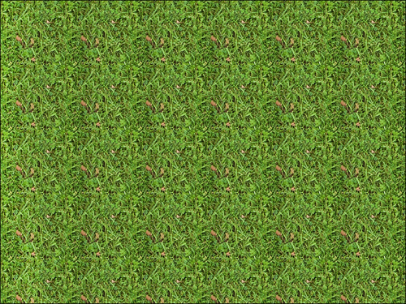

# 三、设计您的菜单

在这一章中，我们将开始了解如何用 AndEngine 创建一个可管理的菜单系统。主题包括:

*   向菜单添加按钮
*   向菜单添加音乐
*   应用背景
*   使用视差背景创建透视
*   创建我们的级别选择系统
*   隐藏和检索图层

# 简介

游戏中的菜单系统本质上是游戏提供的场景或活动的地图。在游戏中，菜单应该看起来有吸引力，并给出在游戏过程中会发生什么的微妙提示。菜单应该有条理，让玩家容易理解。在这一章中，我们将看看我们拥有的各种选项，这些选项可以应用到我们自己的游戏中，以便为任何类型的游戏创建功能性和吸引力的菜单。

# 向菜单添加按钮

在 AndEngine 中，我们可以从任何`Entity`对象或`Entity`对象子类型中创建触摸响应按钮。但是，AndEngine 包含一个名为`ButtonSprite`的类，它的纹理表示取决于`Entity`对象是被按压还是未被按压。在本食谱中，我们将利用 AndEngine 的`ButtonSprite`类并覆盖其 `onAreaTouched()`方法，以便向我们的菜单和/或游戏的`Scene`对象添加触摸响应按钮。此外，本食谱中关于触摸事件的代码可以应用于我们游戏中的任何其他`Entity`对象。

## 准备…

这个配方需要对 AndEngine 中的`Sprite`对象有基本的了解。请通读整个食谱，*使用不同类型的纹理*在[第 1 章](01.html "Chapter 1. AndEngine Game Structure")、*和工程游戏结构*中，特别是关于平铺纹理区域的部分。接下来，访问食谱，*用精灵将场景带入生活[第 2 章](02.html "Chapter 2. Working with Entities")、*用实体工作*。*

一旦关于纹理和精灵的配方被覆盖，创建一个新的空`BaseGameActivity`类的引擎项目。最后，我们需要创建一个名为`button_tiles.png`的精灵表，包含两个图像，并将其放在项目的`assets/gfx/`文件夹中；一个用于“未按下”按钮表示，一个用于“按下”按钮表示。查看下图，了解图像应该是什么样子。以下图像为 300 x 50 像素，即每个图块 150 x 50 像素:


参考代码包中名为`CreatingButtons`的类，将代码导入到您的项目中。

## 怎么做…

`ButtonSprite`类很方便，因为它为我们处理平铺纹理区域和按钮状态的变化。以下步骤概述了设置`ButtonSprite`对象所涉及的任务:

1.  声明一个全局`ITiledTextureRegion`对象，将其命名为`mButtonTextureRegion`，然后在`BaseGameActivity`类的`onCreateResources()`方法中，创建一个新的适合你的`button_tiles.png`图像的`BuildableBitmapTextureAtlas`对象。构建并加载纹理区域和纹理图谱对象，以便我们以后可以使用它们来创建`ButtonSprite`对象。
2.  为了使`ButtonSprite`物体按预期工作，我们应该在`mScene`物体上设置适当的触摸区域绑定。将以下代码复制到活动的`onCreateScene()`方法中:

    ```java
    mScene.setTouchAreaBindingOnActionDownEnabled(true);
    ```

3.  创建`ButtonSprite`对象，为其提供`mButtonTextureRegion`对象并覆盖其`onAreaTouched()`方法:

    ```java
    /* Create the buttonSprite object in the center of the Scene */
    ButtonSprite buttonSprite = new ButtonSprite(WIDTH * 0.5f,
        HEIGHT * 0.5f, mButtonTextureRegion,
        mEngine.getVertexBufferObjectManager()) {
      /* Override the onAreaTouched() event method */
      @Override
      public boolean onAreaTouched(TouchEvent pSceneTouchEvent,
          float pTouchAreaLocalX, float pTouchAreaLocalY) {
        /* If buttonSprite is touched with the finger */
        if(pSceneTouchEvent.isActionDown()){
          /* When the button is pressed, we can create an event 
           * In this case, we're simply displaying a quick toast */
          CreatingButtons.this.runOnUiThread(new Runnable(){
            @Override
            public void run() {
              Toast.makeText(getApplicationContext(), "Button Pressed!", Toast.LENGTH_SHORT).show();
            }
          });
        }
        /* In order to allow the ButtonSprite to swap tiled texture region 
         * index on our buttonSprite object, we must return the super method */
        return super.onAreaTouched(pSceneTouchEvent, pTouchAreaLocalX, pTouchAreaLocalY);
      }
    };
    ```

4.  最后一步是注册触摸区域并将`buttonSprite`对象附加到`mScene`对象:

    ```java
    /* Register the buttonSprite as a 'touchable' Entity */
    mScene.registerTouchArea(buttonSprite);
    /* Attach the buttonSprite to the Scene */
    mScene.attachChild(buttonSprite);
    ```

## 它是如何工作的…

该配方利用带有`ITiledTextureRegion`对象的`ButtonSprite`对象来显示两个独立的按钮状态。当手指触摸显示屏上的`Entity`对象时，一个图块将作为按钮的未按压纹理，另一个将作为按钮的按压纹理。

在第一步中，我们正在创建我们的纹理资源以应用于`ButtonSprite`对象，这将在接下来的步骤中实现。`ButtonSprite`类需要一个带有两个索引的`ITiledTextureRegion`对象，或者两个图块，如*入门图所示...*本食谱的一节。`ITiledTextureRegion`对象的第一个索引应该包含按钮的未压缩表示，默认情况下将应用于`ButtonSprite`对象。第二个`ITiledTextureRegion`索引应该代表`ButtonSprite`对象的按下状态。根据`ButtonSprite`对象当前处于哪种状态，`ButtonSprite`类将在这两个`ITiledTextureRegion`索引之间自动交替；要么是`ButtonSprite.State.NORMAL`为未按下，将`ButtonSprite`对象的当前平铺索引设置为`0`，而`ButtonSprite.State.PRESSED`为`ButtonSprite`对象的当前平铺索引设置为`1`的按下状态。

在第二步中，为了使`ButtonSprite`对象按预期工作，我们需要在`mScene`对象内的向下动作上启用触摸区域绑定。我们在活动生命周期的`onCreateScene()`方法中启用这个功能，就在`mScene`对象创建之后。这样做的目的是，当我们将手指拖离`ButtonSprite`触摸区域时，它允许我们的`ButtonSprite`对象注册为未被按压。如果我们将手指从`Entity`对象的触摸区域按下并拖离，忽略此步骤将导致`ButtonSprite`对象保持按下状态，如果留给玩家处理，这很可能被认为是“有问题的”。在第三步中，我们创建`ButtonSprite`对象，使其在场景中居中。理想情况下，我们可以创建`ButtonSprite`对象并将其放置在场景中，它将正常工作。但是，`ButtonSprite`毕竟是一个按钮，因此按下时应该会提示事件发生。我们可以通过覆盖`onAreaTouched()`超级方法并根据`ButtonSprite`对象的触摸区域是否被按下、手指是否被拖过或手指是否在触摸区域内从显示器中释放来创建事件来实现这一点。在本食谱中，我们只是在`ButtonSprite`对象的`pSceneTouchEvent`注册了`isActionDown()`方法的情况下显示一条`Toast`消息。在游戏开发过程中的一个更现实的场景中，这个按钮可以允许/不允许静音，开始一个新游戏，或者我们为它选择的任何其他动作。用于触摸事件状态检查的另外两种方法是`pSceneTouchEvent.isActionMove()`和`pSceneTouchEvent.isActionUp()`。

最后，一旦创建了`buttonSprite`对象，我们将需要注册触摸区域并将`Entity`对象附加到`mScene`对象。现在，我们应该很清楚，为了在场景中显示一个实体，我们必须首先附加它。同样，为了执行`buttonSprite`对象的`onAreaTouched()`超级方法，我们必须记住调用`mScene.registerTouchArea(buttonSprite)`。这同样适用于我们希望为其提供 touh 事件的任何其他`Entity`对象。

## 另见

*   *在[第一章](01.html "Chapter 1. AndEngine Game Structure")、*和*中使用不同类型的纹理*。
*   *理解和设计实体[第二章](02.html "Chapter 2. Working with Entities")、*使用实体*。*
*   *在[第二章](02.html "Chapter 2. Working with Entities")、*与实体合作*中用精灵*将场景带入生活。

# 向菜单添加音乐

在本主题中，我们将创建一个静音按钮来控制菜单的主题音乐。按下静音按钮将使音乐在当前暂停时播放，或者在当前播放时暂停。这种静音音乐和声音的方法也可以应用于游戏内选项和游戏中允许声音和音乐播放的其他区域。这个配方和之前的不同之处在于，我们将使用一个`TiledSprite`对象，它将允许我们根据声音是正在播放还是暂停来设置`Sprite`对象的平铺索引。请记住，这个食谱的用处不仅仅是启用和禁用菜单音乐。在游戏过程中，我们也可以对许多其他可切换的选项和状态采用同样的方法。

## 准备…

本食谱要求对 AndEngine 中的`Sprite`对象有基本的了解，并使用触摸事件来执行动作。此外，由于我们将把`Music`对象合并到这个食谱中，我们应该了解如何将`Sound`和`Music`对象加载到我们的游戏资源中。请通读整个食谱，*使用不同类型的纹理[第 1 章](01.html "Chapter 1. AndEngine Game Structure")、*和工程游戏结构*中的*，特别是关于平铺纹理区域的部分。接下来，查看食谱，在[第 1 章](01.html "Chapter 1. AndEngine Game Structure")、*和*中介绍声音和音乐。最后，我们将和精灵一起工作，所以我们应该在食谱中加入一个快速的峰值，*用精灵带来一个场景*，在[第 2 章](02.html "Chapter 2. Working with Entities")，*和实体一起工作*。

一旦涉及到纹理、声音和精灵的主题，创建一个空的`BaseGameActivity`类的新的和工程项目。我们需要创建一个名为`sound_button_tiles.png`的精灵表单，包含两个图像，并将其放入项目的`assets/gfx/`文件夹中；一个用于“非静音”按钮表示，一个用于“静音”按钮表示。查看下图，了解图像应该是什么样子。以下图像为 100 x 50 像素，即每个图块 50 x 50 像素:


我们还需要在我们项目的`assets/sfx/`文件夹中包含一个 MP3 格式的声音文件。声音文件可以是您选择的任何首选音乐曲目，用于执行本食谱。

参考代码包中名为`MenuMusic`的类，将代码导入到您的项目中。

## 怎么做…

这个食谱结合了工程学和工程学的特点。我们将音乐、纹理、精灵、平铺纹理区域和触摸事件都整合到一个方便的小包装中。结果——一个切换按钮将控制`Music`对象的回放。按照这些步骤来看看我们如何创建切换按钮。

1.  第一步，我们将处理两个全局对象；`mMenuMusic`是`Music`对象，`mButtonTextureRegion`是`ITiledTextureRegion`对象。在活动的 `onCreateResources()`方法中，我们在`assets/*`文件夹中创建这些对象及其各自的资源。参考*入门中提到的食谱...*部分了解更多关于创建这些资源的信息(如果需要)。
2.  接下来，我们可以直接跳到活动的 `onPopulateScene()`方法，在这里我们将使用`TiledSprite`类创建我们的`mMuteButton`对象。我们需要覆盖`mMuteButton`对象的`onAreaTouched()`方法，以便在按下按钮时暂停或播放音乐:

    ```java
    /* Create the music mute/unmute button */
    TiledSprite mMuteButton = new TiledSprite(buttonX, buttonY,
        mButtonTextureRegion, mEngine.getVertexBufferObjectManager()) {

      /* Override the onAreaTouched() method allowing us to define custom
      * actions */
      @Override
      public boolean onAreaTouched(TouchEvent pSceneTouchEvent,
          float pTouchAreaLocalX, float pTouchAreaLocalY) {
        /* In the event the mute button is pressed down on... */
        if (pSceneTouchEvent.isActionDown()) {
          if (mMenuMusic.isPlaying()) {
            /*  If music is playing, pause it and set tile index to  MUTE  */
            this.setCurrentTileIndex(MUTE);
            mMenuMusic.pause();
          } else {
            /* If music is paused, play it and set tile index to UNMUTE */
            this.setCurrentTileIndex(UNMUTE);
            mMenuMusic.play();
          }
          return true;
        }
        return super.onAreaTouched(pSceneTouchEvent, pTouchAreaLocalX,
            pTouchAreaLocalY);
      }
    };
    ```

3.  一旦按钮被创建，我们需要初始化`mMuteButton`和`mMenuMusic`对象的初始状态。该步骤包括将`mMuteButton`对象的平铺索引设置为等于`1`的`UNMUTE`常数值，将`mMuteButton`对象注册并附加到`mScene`对象，将`mMenuMusic`设置为循环，然后最终在`mMenuMusic`对象上调用【T8:

    ```java
    /* Set the current tile index to unmuted on application startup */
    mMuteButton.setCurrentTileIndex(UNMUTE);

    /* Register and attach the mMuteButton to the Scene */
    mScene.registerTouchArea(mMuteButton);
    mScene.attachChild(mMuteButton);

    /* Set the mMenuMusic object to loop once it reaches the track's end */
    mMenuMusic.setLooping(true);
    /* Play the mMenuMusic object */
    mMenuMusic.play();
    ```

4.  处理任何`Music`对象时要包括的最后一步是确保我们在应用最小化时暂停它，否则它将继续在后台播放。在这个食谱中，我们暂停最小化`mMenuMusic`对象。但是，如果用户返回应用程序，只有当`mMuteButton`对象的平铺索引等于应用程序最小化时的`UNMUTE`常量值时，音乐才会播放:

    ```java
    @Override
    public synchronized void onResumeGame() {
      super.onResumeGame();

      /* If the music and button have been created */
      if (mMenuMusic != null && mMuteButton != null) {
        /* If the mMuteButton is set to unmuted on resume... */
        if(mMuteButton.getCurrentTileIndex() == UNMUTE){
          /* Play the menu music */
          mMenuMusic.play();
        }
      }
    }

    @Override
    public synchronized void onPauseGame() {
      super.onPauseGame();

      /* Always pause the music on pause */
      if(mMenuMusic != null && mMenuMusic.isPlaying()){
        mMenuMusic.pause();
      }
    }
    ```

## 它是如何工作的…

这个特殊的配方在游戏开发中非常有用；不仅用于声音和音乐静音，还用于各种切换按钮。虽然这个食谱专门处理`Music`对象回放，但它包含了所有必要的代码，以便开始使用各种其他切换按钮，这些按钮可能适合我们游戏的更具体需求。

第一步，我们必须在`mMenuMusic`对象和`mMuteButton`对象内设置必要的资源。`mMenuMusic`对象将加载名为`menu_music.mp3`的声音文件，该文件可以是任何 MP3 文件，最好是音乐曲目。`mMuteButton`对象将加载一个名为`sound_button_tiles.png`的带有两个独立图块的精灵表。这些对象都在`BaseGameActivity`对象生命周期的`onCreateResourceS()`方法中处理。更多关于创建这些资源的信息可以在*入门中提到的食谱中找到...*本食谱的一节。

在第二步中，我们正在设置`mMuteButton`对象，它属于`TiledSprite`类型。`TiledSprite`类允许我们使用一个`ITiledTextureRegion`对象，该对象使我们能够设置`mMuteButton`对象将在我们的场景中显示的当前图块索引。在被覆盖的 `onAreaTouched()`方法中，我们检查`mMuteButton`对象是否被`if (pSceneTouchEvent.isActionDown())`语句按下。然后，我们继续确定`mMenuMusic`对象当前是否正在使用`Music`对象的`isPlaying()`方法。如果音乐正在播放，那么按下`mMuteButton`按钮的手指会使`mMenuMusic`对象调用`pause()`，并将`mMuteButton`对象的当前平铺索引恢复为`MUTE`常量值，等于`0`。如果音乐没有播放，那么我们反其道而行之，在`mMenuMusic`对象上调用`play()`，将`mMuteButton`对象的平铺索引还原回`UNMUTE`，等于`1`。

在第三步中，我们设置`mMenuMusic`和`mMuteButton`对象的默认状态，等于播放音乐并将当前平铺索引设置为`UNMUTE`。这将导致音乐在应用程序最初启动时播放。设置好默认按钮和音乐状态后，我们继续注册`mMuteButton`对象的触摸区域，并将`Entity`对象附加到`Scene`对象上。为了将`mMuteButton`对象的状态保存到设备中，可以进一步采取该步骤，允许我们根据用户过去的偏好加载音乐静音的默认状态。有关保存/加载数据和状态的更多信息，请参见配方、[第 1 章](01.html "Chapter 1. AndEngine Game Structure")、*和【工程游戏结构】*中的*保存和加载游戏数据*。

最后一步非常重要，在处理`Music`对象时应该始终包括在内。这一步的目的在菜谱中有更详细的说明，[第一章](01.html "Chapter 1. AndEngine Game Structure")*和【游戏结构】中*介绍声音和音乐*。然而，该配方的`onResumeGame()`方法中的代码略有变化。在应用程序最小化的情况下，用户可能期望他们的游戏状态等待，因为当他们最终将它返回到焦点时，它已经离开了。因此，当`onResumeGame()`在应用程序最大化上被触发时，我们确定`mMuteButton`按钮的平铺索引是否在我们的游戏窗口最小化之前被设置为`UNMUTE`，而不是播放`mMenuMusic`对象。如果是，那么我们可以在`mMenuMusic`对象上调用`play()`方法，否则我们可以忽略它，直到用户再次按下`mMuteButton`决定播放音乐。*

## 另见

*   *在[第一章](01.html "Chapter 1. AndEngine Game Structure")、*和*中使用不同类型的纹理*。
*   *在[第一章](01.html "Chapter 1. AndEngine Game Structure")、*和*中介绍声音和音乐*。
*   *理解和设计实体[第二章](02.html "Chapter 2. Working with Entities")、*使用实体*。*
*   *在[第二章](02.html "Chapter 2. Working with Entities")、*与实体合作*中用精灵*将场景带入生活。

# 应用背景

AndEngine 的`Scene`对象允许我们对其应用静态背景。背景可用于显示纯色、实体、子画面或重复子画面，它们不受`Camera`对象位置或缩放因子变化的影响。在这个食谱中，我们将看看如何将不同类型的背景应用于我们的`Scene`对象。

## 怎么做..

`Background`对象是 AndEngine 中我们`Scene`对象最基本的背景类型。该对象允许场景在视觉上呈现纯色。我们将通过设置`Scene`对象来显示一个`Background`对象来开始这个食谱，以便熟悉如何将背景应用到场景中。稍后在这个食谱中，我们将介绍大部分剩余的`Background`对象的子类型，以涵盖所有选项，只要应用背景到我们的场景。用背景设置`Scene`对象只需要以下两个步骤:

1.  定义并创建`Background`对象的属性:

    ```java
    /* Define background color values */
    final float red = 0;
    final float green = 1;
    final float blue = 1;
    final float alpha = 1;

    /* Create a new background with the specified color values */
    Background background = new Background(red, green, blue, alpha);
    ```

2.  将`Background`对象设置为`Scene`对象，并启用背景功能:

    ```java
    /* Set the mScene object's background */
    mScene.setBackground(background);

    /* Set the background to be enabled */
    mScene.setBackgroundEnabled(true);
    ```

## 它是如何工作的…

在决定使用 AndEngine 的默认背景之一之前，我们必须弄清楚我们的背景是否应该考虑相机运动。我们可以把这些背景想象成是“固定”在摄像机的视角上。这意味着对相机的任何移动都不会对背景的位置产生任何影响。同样的规则适用于任何其他形式的相机重新定位，包括缩放。出于这个原因，我们不应该在我们的背景中包含任何需要随着相机移动而滚动的对象。这是应用于`Scene`对象的`Background`对象和附着于`Scene`对象的`Entity`对象之间的区别。任何看起来会随着相机移动而移动的“背景”都应该作为`Entity`对象附加到`Scene`对象上。最方便的方法是将一个`Entity`对象应用到`Scene`对象上，作为一个“背景层”，代表背景图像的所有精灵都将附着到这个“背景层”上。

既然我们已经讨论了`Background`对象和`Entity`对象之间的区别，我们将继续这个方法的步骤。正如我们在这个食谱的步骤中所看到的，建立一个无聊的、旧的彩色背景是一个简单的任务。不过，知道还是碰巧有用的。在第一步中，我们将定义`Background`对象的属性，并创建提供所述属性作为参数的`Background`对象。对于基本的`Background`对象，这些参数仅包括三个颜色值和`Background`对象颜色的 alpha 值。然而，正如我们将很快讨论的，不同类型的背景将根据类型需要不同的参数。当我们谈到这一点时，为了方便起见，将概述这些差异。

在`Scene`对象上设置`Background`对象的第二步将是相同的两个方法调用，无论我们应用什么类型的背景。我们必须用`setBackground(pBackground)`设置场景的背景，并通过调用`setBackgroundEnabled(true)`确保场景的背景被启用。另一方面，我们也可以通过为后一种方法提供一个`false`参数来禁用背景。

这就是在我们的`Scene`对象上设置背景所需要的全部内容。然而，在我们自己的游戏中，我们不太可能满足于基本的彩色背景。参见*还有更多...本食谱的*部分提供了各种`Background`对象子类型的列表和示例。

## 还有更多...

在接下来的部分中，我们将介绍我们可以在游戏中使用的不同类型的静态背景。所有的`Background`对象子类型都允许我们为背景中未被`Sprite`实体、`Rectangle`实体或其他实体覆盖的部分指定背景颜色。这些背景都有相同的“静态”规则，如*中所述...*节，说明他们在摄像机移动之前不会移动。

### 实体背景类

`EntityBackground`类允许我们应用单个`Entity`对象，或者整个实体对象的层作为场景的背景。这对于将多个`Entity`对象组合成要在场景中显示的单个`Background`对象非常有用。在下面的代码中，我们将两个矩形附加到一个`Entity`对象的图层上，然后使用`Entity`对象作为背景:

```java
    /* Create a rectangle in the bottom left corner of the Scene */
    Rectangle rectangleLeft = new Rectangle(100, 100, 200, 200,
        mEngine.getVertexBufferObjectManager());

    /* Create a rectangle in the top right corner of the Scene */
    Rectangle rectangleRight = new Rectangle(WIDTH - 100, HEIGHT - 100, 200, 200,
        mEngine.getVertexBufferObjectManager());
    /* Create the entity to be used as a background */
    Entity backgroundEntity = new Entity();

    /* Attach the rectangles to the entity which will be applied as a background */
    backgroundEntity.attachChild(rectangleLeft);
    backgroundEntity.attachChild(rectangleRight);

    /* Define the background color properties */
    final float red = 0;
    final float green = 0;
    final float blue = 0;

    /* Create the EntityBackground, specifying its background color & entity to represent the background image */
    EntityBackground background = new EntityBackground(red, green, blue, backgroundEntity);

    /* Set & enable the background */
    mScene.setBackground(background);
    mScene.setBackgroundEnabled(true);
```

`EntityBackground`对象的参数包括`red`、`green`和`blue`颜色值，最后是要显示为背景的`Entity`对象或图层。一旦创建了`EntityBackground`对象，我们只需遵循本食谱*中的步骤二即可...*部分和我们的`EntityBackground`对象将准备显示我们选择附加到`backgroundEntity`对象的任何内容！

### SpriteBackground 类

`SpriteBackground`类允许我们将单个`Sprite`对象作为背景图像附加到场景中。请记住，精灵不会被拉伸或扭曲以适应显示器的大小。为了让精灵在相机视图的整个宽度和高度上伸展，我们必须在考虑相机宽度和高度的同时创建`Sprite`对象。通过下面的代码，我们可以在场景中应用单个`Sprite`对象作为我们的背景图像。假设`mBackgroundTextureRegion`对象的尺寸与以下代码中的`WIDTH`和`HEIGHT`值相同，这两个值代表摄像机的宽度和高度值:

```java
/* Create the Sprite object */
Sprite sprite = new Sprite(WIDTH * 0.5f, HEIGHT * 0.5f, mBackgroundTextureRegion,
    mEngine.getVertexBufferObjectManager());

/* Define the background color values */
final float red = 0;
final float green = 0;
final float blue = 0;

/* Create the SpriteBackground object, specifying 
 * the color values & Sprite object to display*/
SpriteBackground background = new SpriteBackground(red, green, blue, sprite);

/* Set & Enable the background */
mScene.setBackground(background);
mScene.setBackgroundEnabled(true);
```

我们可以像创建任何其他对象一样创建`Sprite`对象。当创建`SpriteBackground`对象时，我们传递通常的颜色参数以及我们希望在背景上显示的`Sprite`对象。

### 注

在使用`SpriteBackground`和`RepeatingSpriteBackground`时，将`BitmapTextureFormat.RGB_565`应用到纹理图谱是一个好主意。由于背景可能会在整个显示屏上延伸，我们通常不需要阿尔法通道来提高低端设备上的游戏性能。

### repeating pritchebackground 类

`RepeatingSpriteBackground`类对于为地形创建纹理贴图或者简单地用纹理填充场景中的空白空间非常有用。我们可以轻松地将下面的 128 x 128 像素纹理转换为背景，该背景在显示器的整个长度上重复纹理:


从前面的纹理创建`RepeatingSpriteBackground`对象后，生成的背景在 1280 x 752 像素的维度上看起来像下面的图像:



创建一个`RepeatingSpriteBackground`对象比之前的`Background`对象子类型需要更多的工作。我们将把我们的重复图像文件加载到一个`AssetBitmapTexture`对象中，然后提取到一个`ITextureRegion`对象中，供背景使用。由于我们使用纹理的目的是为了在`RepeatingSpriteBackground`上重复它，我们必须在 `AssetBitmapTexture`构造函数中提供`TextureOptions.REPEATING_BILINEAR`或`TextureOptions.REPEATING_NEAREST`纹理选项。最重要的是，当处理重复纹理时，我们必须保持我们的图像文件绑定到二维的力量。OpenGL 的环绕模式需要 2 次方的纹理尺寸，以便正确地重复纹理。不遵循此规则将导致重复的精灵显示为黑色形状。将以下代码放入测试活动的`onCreateResources()`方法中。`mRepeatingTextureRegion`对象必须声明为全局`ITextureRegion`对象:

```java
AssetBitmapTexture mBitmapTexture = null;

try {
  /* Create the AssetBitmapTexture with the REPEATING_* texture option */
  mBitmapTexture = new AssetBitmapTexture(mEngine.getTextureManager(), this.getAssets(), "gfx/grass.png", BitmapTextureFormat.RGB_565,TextureOptions.REPEATING_BILINEAR);
} catch (IOException e) {
  e.printStackTrace();
}
/* Load the bitmap texture */
mBitmapTexture.load();

/* Extract the bitmap texture into an ITextureRegion */
mRepeatingTextureRegion = TextureRegionFactory.extractFromTexture(mBitmapTexture);
```

下一步是创建`RepeatingSpriteBackground`对象。我们将把这段代码包含在我们活动生命周期的`onCreateScene()`方法中:

```java

/* Define the RepeatingSpriteBackground sizing parameters */
final float cameraWidth = WIDTH;
final float cameraHeight = HEIGHT;
final float repeatingScale = 1f;

/* Create the RepeatingSpriteBackground */
RepeatingSpriteBackground background = new RepeatingSpriteBackground(cameraWidth, cameraHeight, mRepeatingTextureRegion, repeatingScale,
    mEngine.getVertexBufferObjectManager());

/* Set & Enable the background */
mScene.setBackground(background);
mScene.setBackgroundEnabled(true);
```

`RepeatingSpriteBackground`对象的前两个参数定义了重复纹理将覆盖的最大区域，从显示屏的左下角开始延伸。在这种情况下，我们覆盖了整个显示屏。我们传递的第三个纹理是`ITextureRegion`对象，用作重复纹理。如前所述，这个纹理区域必须遵循二维幂规则。第四个参数是重复纹理的比例因子。默认比例为`1`；增加比例会导致重复纹理放大，从而更容易看到重复图案。降低比例因子会缩小每个重复纹理，这有时有助于隐藏重复纹理中的图案或明显瑕疵。请记住，调整重复纹理的比例不会影响前两个参数中定义的`RepeatingSpriteBackground`对象的整体大小，因此请随意调整它们，直到纹理看起来正确为止。

## 另见

*   *在[第一章](01.html "Chapter 1. AndEngine Game Structure")、*和*中使用不同类型的纹理*。
*   *在[第二章](02.html "Chapter 2. Working with Entities")、*与实体合作*中用精灵*将场景带入生活。

# 使用视差背景创建透视

将**视差**背景应用到游戏中可以产生视觉上令人愉悦的透视效果。即使我们使用的是 2D 引擎，我们也可以通过使用基于相机运动决定精灵运动速度的视差值来创建一个会发出深度错觉的背景。本主题将介绍视差背景，以及我们如何使用它们来增加一个完全 2D 世界的深度感。我们将使用的类是`ParallaxBackground`和`AutoParallaxBackground`类。

## 准备…

这个配方需要对 AndEngine 中的`Sprite`对象有基本的了解。请通读整个食谱，*使用不同类型的纹理*在[第 1 章](01.html "Chapter 1. AndEngine Game Structure")、*和工程游戏结构*中。接下来，请访问食谱，*用精灵将场景带入生活[第 2 章](02.html "Chapter 2. Working with Entities")、*用实体工作*。*

一旦关于纹理和精灵的配方被覆盖，创建一个新的空`BaseGameActivity`类的引擎项目。最后，我们需要创建一个名为`hill.png`的图像，并将其放置在项目的`assets/gfx/`文件夹中。该图像的尺寸应为 800 x 150 像素。该图像类似于下图:


参考代码包中名为`UsingParallaxBackgrounds`的类，将代码导入到您的项目中。

## 怎么做…

`ParallaxBackground`对象是 AndEngine 中最高级的`Background`对象子类型。在所有的`Background`对象子类型中，它需要最多的设置，但是如果分解成小步骤，它真的没有那么难。执行以下步骤，了解如何设置`ParallaxBackground`对象，使其与摄像机的移动相关。为了简洁起见，我们将省略活动生命周期的 `onCreateEngineOptions()`方法中的自动相机移动代码:

1.  为`Sprite`对象创建`ITextureRegion`对象时，第一步是典型的，就是创建我们的`BuildableBitmapTextureAtlas`。纹理图谱应该足够大，包含`hill.png`图像，宽 800 像素，高 150 像素。创建纹理贴图后，继续创建`ITextureRegion`对象，然后像往常一样构建和加载纹理贴图。这些都应该发生在活动生命周期的`onCreateResources()`方法中。
2.  其余步骤将在活动生命周期的`onCreateScene()`方法中进行。首先，我们需要创建所有将出现在背景上的`Sprite`对象。在这个食谱中，我们应用了三个`Sprite`物体，它们将被方便地放置在背景上，以增强不同精灵之间的距离错觉:

    ```java
    final float textureHeight = mHillTextureRegion.getHeight();

    /* Create the hill which will appear to be the furthest
    * into the distance. This Sprite will be placed higher than the 
     * rest in order to retain visibility of it */
    Sprite hillFurthest = new Sprite(WIDTH * 0.5f, textureHeight * 0.5f + 50, mHillTextureRegion,
        mEngine.getVertexBufferObjectManager());

    /* Create the hill which will appear between the furthest and closest
     * hills. This Sprite will be placed higher than the closest hill, but
    * lower than the furthest hill in order to retain visibility */
    Sprite hillMid = new Sprite(WIDTH * 0.5f, textureHeight * 0.5f + 25, mHillTextureRegion,
        mEngine.getVertexBufferObjectManager());

    /* Create the closest hill which will not be obstructed by any other hill 
    * Sprites. This Sprite will be placed at the bottom of the Scene since
    * nothing will be covering its view */
    Sprite hillClosest = new Sprite(WIDTH * 0.5f, textureHeight * 0.5f, mHillTextureRegion,
        mEngine.getVertexBufferObjectManager());
    ```

3.  接下来，我们将创建`ParallaxBackground`对象。构造函数的三个参数像往常一样定义背景颜色。更重要的是，我们必须覆盖`ParallaxBackground`对象的`onUpdate()`方法，以便在任何相机移动之前处理背景上`Sprite`对象的移动:

    ```java
    /* Create the ParallaxBackground, setting the color values to represent 
    * a blue sky */
    ParallaxBackground background = new ParallaxBackground(0.3f, 0.3f, 0.9f) {

      /* We'll use these values to calculate the parallax value of the background */
      float cameraPreviousX = 0;
      float parallaxValueOffset = 0;

      /* onUpdates to the background, we need to calculate new 
       * parallax values in order to apply movement to the background
      * objects (the hills in this case) */
      @Override
      public void onUpdate(float pSecondsElapsed) {
        /* Obtain the camera's current center X value */
        final float cameraCurrentX = mCamera.getCenterX();

        /* If the camera's position has changed since last 
         * update... */
        if (cameraPreviousX != cameraCurrentX) {

          /* Calculate the new parallax value offset by 
           * subtracting the previous update's camera x coordinate
           * from the current update's camera x coordinate */
          parallaxValueOffset +=  cameraCurrentX - cameraPreviousX;

          /* Apply the parallax value offset to the background, which 
           * will in-turn offset the positions of entities attached
           * to the background */
          this.setParallaxValue(parallaxValueOffset);

          /* Update the previous camera X since we're finished with this 
           * update */
          cameraPreviousX = cameraCurrentX;
        }
        super.onUpdate(pSecondsElapsed);
      }
    };
    ```

4.  一旦`ParallaxBackground`对象被创建，我们现在必须将`ParallaxEntity`对象附加到`ParallaxBackground`对象。`ParallaxEntity`对象要求我们为实体定义一个视差因子以及一个用于视觉表示的`Sprite`对象，在这种情况下是山丘:

    ```java
    background.attachParallaxEntity(new ParallaxEntity(5, hillFurthest));
    background.attachParallaxEntity(new ParallaxEntity(10, hillMid));
    background.attachParallaxEntity(new ParallaxEntity(15, hillClosest));
    ```

5.  最后，与所有`Background`对象一样，我们必须将其应用于`Scene`对象并启用:

    ```java
    /* Set & Enabled the background */
    mScene.setBackground(background);
    mScene.setBackgroundEnabled(true);
    ```

## 它是如何工作的…

在这个食谱中，我们设置了一个`ParallaxBackground`对象，它将包含三个独立的`ParallaxEntity`对象。这三个`ParallaxEntity`物体中的每一个都将代表我们场景背景中的一座小山。通过使用视差因子和视差值，`ParallaxBackground`对象允许每个`ParallaxEntity`对象在`Camera`对象改变其位置的情况下以不同的速度偏移其位置。这允许`ParallaxEntity`对象发出透视效果。众所周知，离我们较近的物体似乎比远处的物体移动得快得多。

第一步*怎么做...*部分是创建我们的`Sprite`对象的基本和必要任务。在这个食谱中，我们使用一个单独的纹理区域/图像来表示将附加到背景上的所有三个精灵。但是，请随意修改此配方，以便允许三个`Sprite`对象中的每一个都使用自己定制的图像。练习将有助于进一步理解如何操纵`ParallaxBackground`物体在游戏中创造出整洁的场景。

第二步，我们设置三个`Sprite`对象，它们将作为`ParallaxEntity`对象附着在背景上。我们把它们都放在场景的中心，直到 x 坐标。 `ParallaxBackground`类只用于将透视应用于 x 坐标移动，因此背景上精灵的位置将随着相机移动而移出初始 x 坐标。也就是说，重要的是要知道`ParallaxBackground`对象将连续地将附着在背景上的每个`ParallaxEntity`对象的副本缝合在一起，以便补偿可能离开摄像机视野的背景对象。参见下图，了解`ParallaxBackground`对象如何首尾相连缝合背景对象的视觉表示:


由于`ParallaxEntity`对象拼接在`ParallaxBackground`对象上的工作方式，为了创建可能不会经常出现在背景上的对象，我们必须在图像文件本身中包含透明填充。

至于定义精灵的 y 坐标，最好将精灵展开，以便能够区分背景上最近和最远的山丘。为了创造最佳的透视效果，最远处的物体应该在场景中显得更高，因为它们会隐藏在更近的物体后面，直到分层为止。

第三步，我们创建`ParallaxBackground`对象。与所有其他`Background`对象子类型类似，构造函数定义背景颜色。真正的魔法发生在`ParallaxBackground`物体的超驰`onUpdate()`方法中。我们有两个变量；`cameraPreviousX`和`cameraCurrentX`最初将进行测试，以确保两者之间存在差异，从而减少任何不必要的代码执行。如果这两个值不相等，我们将前一个和当前摄像机位置之间的差值累加到一个`parallaxValueOffset`变量中。通过在`ParallaxBackground`对象上调用`setParallaxValue(parallaxValueOffset)`，我们基本上只是告诉背景，相机已经改变了位置，是时候更新所有的`ParallaxEntity`对象位置进行补偿了。增加视差值会导致`ParallaxEntity`对象向左平移，而减少视差值会导致它们向右平移。

在第四步中，我们最终创建`ParallaxEntity`对象，为每个对象提供一个视差因子和一个`Sprite`对象。视差因子将根据摄像机的运动来精确定义`Sprite`物体的运动速度。为了创建更真实的场景，距离最远的对象应该比距离较近的对象具有更小的值。此外，`attachParallaxEntity(pParallaxEntity)`方法类似于将`Entity`对象附加到`Scene`对象，因为附加的第二个对象将出现在第一个对象的前面，第三个对象将出现在第二个对象的前面，依此类推。为此，我们先将`ParallaxEntity`物体附着到离最远的`ParallaxBackground`物体上，然后再向上移动到最近的物体上。

一旦完成了前面的所有步骤，我们可以简单地将`ParallaxBackground`应用到`Scene`对象并启用它。从现在开始，任何和所有的相机移动将决定背景风景中物体的位置！

## 还有更多…

AndEngine 还包括一个`AutoParallaxBackground`类，在设置视觉效果方面类似于`ParallaxBackground`类。两者的区别在于`AutoParallaxBackground`类允许我们指定一个恒定的速率，在该速率下`ParallaxEntity`对象将在屏幕上移动，而不管摄像机的移动。这种类型的背景对于那些看起来经常移动的游戏很有用，比如赛车游戏或者任何类型的快节奏侧滚游戏。另一方面，`AutoParallaxBackground`类也可以用于创建简单的效果，例如在游戏过程中云在屏幕上持续滚动，甚至在游戏中可能会出现在`Camera`和`Scene`对象位置方面保持静态。

我们可以通过对这个食谱的活动进行简单的调整来创建一个`AutoParallaxBackground`对象。用以下代码片段替换当前的`ParallaxBackground`对象创建。请注意，`autoParallaxSpeed`变量定义了`ParallaxEntity`对象在背景上的移动速度，因为它们不再基于摄像机的移动:

```java
/* Define the speed that the parallax entities will move at.
 * 
* Set to a negative value for movement in the opposite direction */
final float autoParallaxSpeed = 3;

/* Create an AutoParallaxBackground */
AutoParallaxBackground background = new AutoParallaxBackground(0.3f, 0.3f, 0.9f, autoParallaxSpeed);
```

此外，删除与`mCamera`对象的 `onUpdate()`方法相关的所有代码，因为它将不再影响`ParallaxEntity`对象的位置。

下图显示了在不同高度的`ParallaxBackground`或`AutoParallaxBackground`对象上附加三个山形图层的结果，当然减去了运动:


## 另见

*   *在[第一章](01.html "Chapter 1. AndEngine Game Structure")、*和*中使用不同类型的纹理*。
*   *在[第二章](02.html "Chapter 2. Working with Entities")、*与实体合作*中用精灵*将场景带入生活。
*   *应用本聊天器中给出的背景*。T3】

# 创建我们的等级选择系统

很有可能，如果你曾经玩过一个多关卡的手机游戏，那么你已经知道我们在这一章要做什么了。我们将创建一个类，为我们的游戏提供一个网格，其中包含我们可以使用的关卡，以便让用户选择要玩的关卡。这个类可以非常容易地管理，并且是高度可定制的，从按钮纹理，列计数，行计数，等等，非常容易。最终结果如下所示:


### 注

`LevelSelector`类的这个实现扩展了 AndEngine 的`Entity`对象。这使得使用实体修改器应用过渡效果并允许基于触摸事件的滚动成为一项相当琐碎的任务。

## 准备…

`LevelSelector`类高度基于 AndEngine 的`Entity`、`Sprite`和`Text`对象的使用。为了理解`LevelSelector`是如何工作的，请花点时间复习一下关于这些物品的食谱。这些食谱包括，*理解和工程实体*在[第 2 章](02.html "Chapter 2. Working with Entities")、*与实体一起工作*、*在[第 2 章](02.html "Chapter 2. Working with Entities")、*与实体一起工作*、*在[第 2 章](02.html "Chapter 2. Working with Entities")中应用文本到图层*、*与实体一起工作*。*

`LevelSelector`对象需要一个参照图像文件的`ITextureRegion`对象。请随意创建一个图像，它将代表一个尺寸为 50 x 50 像素的方形按钮，如本食谱介绍图中所示。虽然在`LevelSelector`类内部不需要这个`ITextureRegion`对象，但是为了在本食谱末尾的空`BaseGameActivity`测试项目中测试出`LevelSelector`类，这个对象是需要的。

关于该配方的工作代码，请参考代码包中名为`LevelSelector`的类。请随意使用这个类，并根据您认为合适的情况进行修改，以适应您自己游戏的需要！

## 怎么做…

`LevelSelector`类实际上很容易使用，尽管它的大小可能很大。在这个食谱中，我们实际上将引入两个类；第一个是`LevelSelector`类，它处理水平平铺或按钮如何在场景中形成网格。第二个是`LevelSelector`的一个内班，叫`LevelTile`。`LevelTile`类允许我们轻松添加或删除我们自己的游戏可能需要的额外数据。为了简单起见，我们将从`LevelSelector`课开始，分步骤讨论这两个课程。

以下步骤解释了`LevelSelector`类如何工作，以便以网格格式排列场景中的`LevelTile`对象:

1.  创建`LevelSelector`构造函数，初始化所有变量。这个构造函数很简单，直到我们必须通过`mInitialX`和`mInitialY`变量

    ```java
    final float halfLevelSelectorWidth = ((TILE_DIMENSION * COLUMNS) + TILE_PADDING
        * (COLUMNS - 1)) * 0.5f;
    this.mInitialX = (this.mCameraWidth * 0.5f) - halfLevelSelectorWidth;

    /* Same math as above applies to the Y coordinate */
    final float halfLevelSelectorHeight = ((TILE_DIMENSION * ROWS) + TILE_PADDING
        * (ROWS - 1)) * 0.5f;
    this.mInitialY = (this.mCameraHeight * 0.5f) + halfLevelSelectorHeight;
    ```

    指定第一个`LevelTile`对象的位置
2.  接下来，我们必须创建用于构建`LevelSelector`对象的平铺网格的方法。我们正在创建一个名为`createTiles(pTextureRegion, pFont)`的方法，通过循环设置数量的`ROWS`和`COLUMNS`值，将图块放置在预定的坐标:

    ```java
    public void createTiles(final ITextureRegion pTextureRegion,
        final Font pFont) {

      /* Temp coordinates for placing level tiles */
      float tempX = this.mInitialX + TILE_DIMENSION * 0.5f;
      float tempY = this.mInitialY - TILE_DIMENSION * 0.5f;

      /* Current level of the tile to be placed */
      int currentTileLevel = 1;

      /* Loop through the Rows, adjusting tempY coordinate after each
       * iteration */
      for (int i = 0; i < ROWS; i++) {

        /* Loop through the column positions, placing a LevelTile in each
         * column */
        for (int o = 0; o < COLUMNS; o++) {

          final boolean locked;

          /* Determine whether the current tile is locked or not */
          if (currentTileLevel <= mMaxLevel) {
            locked = false;
          } else {
            locked = true;
          }

          /* Create a level tile */
          LevelTile levelTile = new LevelTile(tempX, tempY, locked,
              currentTileLevel, pTextureRegion, pFont);

          /* Attach the level tile's text based on the locked and
          * currentTileLevel variables pass to its constructor */
          levelTile.attachText();

          /* Register & Attach the levelTile object to the LevelSelector */
          mScene.registerTouchArea(levelTile);
          this.attachChild(levelTile);

          /* Increment the tempX coordinate to the next column */
          tempX = tempX + TILE_DIMENSION + TILE_PADDING;

          /* Increment the level tile count */
          currentTileLevel++;
        }

        /* Reposition the tempX coordinate back to the first row (far left) */
        tempX = mInitialX + TILE_DIMENSION * 0.5f;

        /* Reposition the tempY coordinate for the next row to apply tiles */
        tempY = tempY - TILE_DIMENSION - TILE_PADDING;
      }
    }
    ```

    中，使创建水平图块网格完全自动化
3.  第三步也是最后一步`LevelSelector`类包括两种方法；一个用于显示`LevelSelector`类的网格，另一个用于隐藏`LevelSelector`类的网格。为了简单起见，我们将这些方法称为`show()`和`hide()`，没有参数:

    ```java
    /* Display the LevelSelector on the Scene. */
    public void show() {

      /* Register as non-hidden, allowing touch events */
      mHidden = false;

      /* Attach the LevelSelector the the Scene if it currently has no parent */
      if (!this.hasParent()) {
        mScene.attachChild(this);
      }

      /* Set the LevelSelector to visible */
      this.setVisible(true);
    }

    /* Hide the LevelSelector on the Scene. */
    public void hide() {

      /* Register as hidden, disallowing touch events */
      mHidden = true;

      /* Remove the LevelSelector from view */
      this.setVisible(false);
    }
    ```

现在我们进入`LevelTile`级的步骤。`LevelTile`内部类是 AndEngine 的`Sprite`对象的扩展。我们实现自己的`LevelTile`类的原因是允许每个图块存储自己的数据，例如图块所代表的级别是否被锁定，`Font`和`Text`对象用于显示图块的级别号、图块本身的级别号等等。这个类可以很容易地修改，以存储更多的信息，例如用户对特定级别的高分、级别颜色主题或我们想要包括的任何其他信息。以下步骤引导我们创建`LevelTile`内部类:

1.  创建`LevelTile`构造函数:

    ```java
    public LevelTile(float pX, float pY, boolean pIsLocked,
        int pLevelNumber, ITextureRegion pTextureRegion, Font pFont) {
      super(pX, pY, LevelSelector.this.TILE_DIMENSION,
        LevelSelector.this.TILE_DIMENSION, pTextureRegion,
        LevelSelector.this.mEngine.getVertexBufferObjectManager());

      /* Initialize the necessary variables for the LevelTile */
      this.mFont = pFont;
      this.mIsLocked = pIsLocked;
      this.mLevelNumber = pLevelNumber;
    }
    ```

2.  为`LevelTile`类创建必要的获取者。对于这样一个基本的`LevelTile`类，我们需要访问的只是关于图块所代表的级别编号的锁定状态的数据，以及图块所代表的级别编号:

    ```java
    /* Method used to obtain whether or not this level tile represents a
     * level which is currently locked */
    public boolean isLocked() {
      return this.mIsLocked;
    }

    /* Method used to obtain this specific level tiles level number */
    public int getLevelNumber() {
      return this.mLevelNumber;
    }
    ```

3.  为了显示每个`LevelTile`对象上的级别编号，我们将创建一个 `attachText()`方法来处理将`Text`对象应用到创建后的每个`LevelTile`对象:

    ```java
    public void attachText() {
      String tileTextString = null;

      /* If the tile's text is currently null... */
      if (this.mTileText == null) {
        /* Determine the tile's string based on whether it's locked or
        * not */
        if (this.mIsLocked) {
          tileTextString = "Locked";
        } else {
          tileTextString = String.valueOf(this.mLevelNumber);
        }
        /* Setup the text position to be placed in the center of the tile */
        final float textPositionX = LevelSelector.this.TILE_DIMENSION * 0.5f;
        final float textPositionY = textPositionX;

        /* Create the tile's text in the center of the tile */
        this.mTileText = new Text( textPositionX,
            textPositionY, this.mFont,
            tileTextString, tileTextString.length(),
            LevelSelector.this.mEngine.getVertexBufferObjectManager());

        /* Attach the Text to the LevelTile */
        this.attachChild(mTileText);
      }
    }
    ```

4.  最后但肯定不是最不重要的，我们将覆盖`LevelTile`类的`onAreaTouched()`方法，以便在按下图块时提供默认操作。执行的事件应根据`mIsLocked`布尔值

    ```java
    @Override
    public boolean onAreaTouched(TouchEvent pSceneTouchEvent,
        float pTouchAreaLocalX, float pTouchAreaLocalY) {
      /* If the LevelSelector is not hidden, proceed to execute the touch
       * event */
      if (!LevelSelector.this.mHidden) {
        /* If a level tile is initially pressed down on */
        if (pSceneTouchEvent.isActionDown()) {
          /* If this level tile is locked... */
          if (this.mIsLocked) {
            /* Tile Locked event... */
        LevelSelector.this.mScene.getBackground().setColor(
            org.andengine.util.adt.color.Color.RED);
          } else {
            /* Tile unlocked event... This event would likely prompt
             * level loading but without getting too complicated we
             * will simply set the Scene's background color to green */
        LevelSelector.this.mScene.getBackground().setColor(
                org.andengine.util.adt.color.Color.GREEN);

            /**
             * Example level loading:
             *     LevelSelector.this.hide();
             * SceneManager.loadLevel(this.mLevelNumber);
             */
          }
          return true;
        }
      }
      return super.onAreaTouched(pSceneTouchEvent, pTouchAreaLocalX,
          pTouchAreaLocalY);
    }
    ```

    而有所不同

## 它是如何工作的…

这个`LevelSelector`类的实现允许我们通过在活动中添加最少量的代码来创建一个可选择级别的网格。在我们将`LevelSelector`类的实现引入我们的活动之前，让我们看看这个类是如何工作的，以便让我们知道如何修改这个类来更好地适应一系列不同游戏的特定需求。正如*怎么做...*部分根据本食谱中使用的两个类别将步骤分为两个部分，我们还将解释每个类别如何在两个部分中工作。我们将再次从`LevelSelector`课开始。

### 解释级别选择器类

首先也是最重要的是，`LevelSelector`类包含了许多成员变量，为了充分利用这个对象，我们应该了解这些变量。以下是此类中使用的变量列表以及每个变量的描述:

*   `COLUMNS` : 要在`LevelSelector`类网格的横轴上显示的`LevelTile`对象的数量。
*   `ROWS` : 要在`LevelSelector`类网格的垂直轴上显示的`LevelTile`对象的数量。
*   `TILE_DIMENSION`:每个单独`LevelTile`物体的宽度和高度值。
*   `TILE_PADDING`:T2 类网格上每个`LevelTile`对象之间的间距，以像素为单位。
*   `mChapter` : 该值定义了`LevelSelector`类的章节值。这个变量允许我们通过为每个`LevelSelector`对象指定不同的章节值来创建多个`LevelSelector`对象，这些对象代表我们游戏中不同的章节/世界/区域。
*   `mMaxLevel` : 该值定义了用户当前在我们的游戏中达到的最大解锁等级。该变量将针对每个被触摸的`LevelTile`对象的级别号进行测试。不应允许用户进入大于此变量的级别。
*   `mCameraWidth` / `mCameraHeight`:这些值只是用来帮助正确对齐场景中心的`LevelSelector`和`LevelTile`对象。
*   `mInitialX` : 该变量用于保存对每个`LevelSelector`类网格行的初始 x 坐标的引用。每当网格的一整行被布局时，下一行的第一个`LevelTile`对象返回到这个 x 坐标。
*   `mInitialY` : 该变量仅用于定义第一个`LevelTile`对象的 y 坐标一次。由于我们是从左到右和从上到下构建`LevelSelector`类的网格，我们将永远不必回到初始的 y 坐标进行后续的平铺放置。
*   `mHidden` : 该变量的`boolean`语句决定了`LevelTile`对象是否会响应触摸事件。如果`LevelSelector`对象在场景中不可见，则设置该变量`true`，否则设置`false`。

随着所有成员变量的消失，理解`LevelSelector`类的工作原理将变得轻而易举！第一步，我们创建`LevelSelector`构造函数来初始化所有的类变量。构造器应该很容易跟踪，直到我们定义了`mInitialX`和`mInitialY`变量。我们所做的就是根据列数、行数、图块尺寸和图块填充来计算`LevelSelector`类网格整体宽度和高度的一半。为了计算整体宽度，我们需要将`COLUMNS`值的数量乘以每个`LevelTile`对象的宽度。因为我们包括了每个图块之间的填充，我们还必须计算填充将消耗多少空间。但是，填充只会出现在图块之间，这意味着最终列没有要计算的填充，因此我们可以从填充计算中减去一列。然后我们将这个值除以一半，得到整个网格宽度的一半。最后，从`Camera`对象的中心位置减去整个网格宽度的一半，就会得到第一个`LevelTile`对象的 x 坐标！同样的数学适用于计算初始 y 坐标，除了 y 轴处理行而不是列，因此我们需要在`mInitiaY`变量计算中进行调整，以获得适当的 y 坐标。

`LevelSelector`类的第二步介绍了`LevelTile`对象的创建和放置方法。这就是网格制造魔法的开始。在我们开始迭代之前，我们声明并定义临时坐标，该坐标将用于在网格上放置每个`LevelTile`对象，在放置每个图块后相应地增加它们的值。`TILE_DIMENSION * 0.5f`计算只是为了适应 AndEngine 的`Entity`对象的定位点，或者依赖于`Entity`对象中心的放置坐标。此外，我们正在初始化一个名为`currentTileLevel`的临时级别号，它被初始化为`1`，表示 1 级图块。每次在网格上放置一个级别切片时，该变量都会增加一个值 1。一旦定义了初始级别图块的值，我们将继续创建`for`循环，该循环将循环通过构成网格的行和列的每个位置。从第一行开始，我们将循环 N 列，在放置每个图块后，通过添加`TILE_DIMENSION`和`TILE_PADDING`来增加`tempX`变量，这将给出下一个位置。一旦达到最大列数，我们通过添加`TILE_DIMENSION`和`TILE_PADDING`来减少`tempY`变量，以便将我们放到下一行进行填充。这个过程一直持续到没有要填充的行为止。

包含在`LevelSelector`类中的最后一步包括在`LevelSelector`对象上调用`setVisible(pBoolean)`的代码，如果调用`show()`方法则启用可见性，如果调用 `hide()`方法则禁用可见性。第一次`LevelSelector`对象调用`show()`时，它将被附加到`Scene`对象上。此外，`mHidden`变量将根据`LevelSelector`对象的可见性进行调整。

### 解释 LevelTile 类

与`LevelSelector`类一样，我们将首先概述不同`LevelTile`类成员变量的用途。以下是本课程中使用的变量列表以及每个变量的描述:

*   `mIsLocked` : 布尔变量由`LevelTile`构造函数中的参数定义。该变量定义该`LevelTile`对象的触摸事件是否应产生一个正事件，如继续加载级别，或一个负事件，如级别被锁定的通知。
*   `mLevelNumber` : 这个变量只是保存了`LevelTile`对象的等级数表示的值。该值根据其在网格上的位置确定；例如，放置在网格上的第一个图块将代表级别 1，第二个图块将代表级别 2，依此类推。
*   `mFont`和`mTileText`:`mFont`和`mTileText`对象用于在每个`LevelTile`上显示一个`Text`对象。如果认为`LevelTile`对象被锁定，则在图块上显示显示单词**锁定**的字符串，否则显示图块的级别号。

在`LevelTile`类的第一步中，我们简单地介绍了构造函数。这里没有什么不寻常的。但是，需要注意的一点是，构造函数确实依赖常量`TILE_DIMENSION`值来指定图块的宽度/高度尺寸，而不指定参数。这是为了保持`LevelSelector`级和`LevelTile`级之间的一致性。

在第二步中，我们引入了两个 getter 方法，可以用来获取`LevelTile`类的更重要的值。尽管我们目前没有在任何一个类中使用这些方法，但是当`LevelSelector` / `LevelTile`对象被实现到一个全功能游戏中时，它们可能会很重要，这需要在游戏中传递诸如等级号之类的数据。

第三步介绍一种方法，用于将一个`Text`对象附加到名为 `attachText()`的`LevelTile`上。该方法将使用依赖于`LevelTile`对象锁定状态的字符串将`mTileText`对象放置在`LevelTile`对象的正中心。如`mFont`和`mTileText`变量说明所述，`mTileText`对象的`String`变量将显示**锁定的**或图块的级别号。

最后一步需要我们覆盖`LevelTile`对象的`onAreaTouched()`方法。在我们考虑响应任何图块上的触摸事件之前，我们首先确定包含`LevelTile`对象的`LevelSelector`对象是否可见。如果没有，继续任何触摸事件是没有意义的，但是如果`LevelSelector`对象是可见的，那么我们继续检查瓷砖是否被按下。如果按下`LevelTile`对象，我们将继续检查图块是否锁定或解锁。在类的当前状态下，我们只是简单地设置场景背景的颜色，以表示被按下的图块是否被锁定。但是，在现实世界的应用程序中，当前锁定的事件可以用一个基本通知来替换，该通知声明选定的图块已被锁定。在图块未被锁定的情况下，触摸事件应根据`LevelTile`对象的`mLevelNumber`变量将用户带到所选级别。如果游戏包含多个章节/世界/区域，那么我们甚至可以进行以下伪代码实现，这取决于游戏的加载级别方法:

```java
LevelSelector.this.hide();
SceneManager.loadLevel(this.mLevelNumber, LevelSelector.this.mChapter);
```

## 还有更多…

一旦我们将`LevelSelector`类包含到我们选择的任何项目中，我们就可以很容易地将工作级选择网格实现到我们的`BaseGameActivity`中。为了正确创建`LevelSelector`对象并将其显示在场景中，我们需要确保已经创建了一个`ITextureRegion`对象和`Font`对象，以便在为`LevelSelector`类创建`LevelTile`对象时使用。为了使`LevelSelector`类的例子简短，我们将省略资源创建代码。如果需要，请访问食谱，*使用不同类型的纹理*在[第 1 章](01.html "Chapter 1. AndEngine Game Structure")、*和工程游戏结构*中，以及*使用和工程字体资源*在[第 1 章](01.html "Chapter 1. AndEngine Game Structure")、*和工程游戏结构*中，了解更多关于如何设置本课程所需资源的信息。

以下显示如何创建`LevelSelector`对象的代码可以在创建必要的`ITextureRegion`和字体`objects`之前复制到任何活动的 `onCreateScene()`方法中:

```java
/* Define the level selector properties */
final int maxUnlockedLevel = 7;
final int levelSelectorChapter = 1;
final int cameraWidth = WIDTH;
final int cameraHeight = HEIGHT

/* Create a new level selector */
LevelSelector levelSelector = new LevelSelector(maxUnlockedLevel, levelSelectorChapter, cameraWidth, cameraHeight, mScene, mEngine);

/* Generate the level tiles for the levelSelector object */
levelSelector.createTiles(mTextureRegion, mFont);

/* Display the levelSelector object on the scene */
levelSelector.show();
```

这个`LevelSelector`类的一个很大的特点是它是一个`Entity`对象子类型。如果我们希望根据需要为其应用花哨的过渡效果，使其进出相机的视野，我们可以简单地称之为`levelSelector.registerEntityModifier(pEntityModifier)`。由于调用`createTiles()`方法时`LevelTile`对象被附加到`LevelSelector`对象，因此`LevelSelector`对象位置的任何变化也会同步影响所有`LevelTile`对象。如果处理多个章节，这也使得创建可滚动的级别选择器实现非常容易添加。

## 另见

*   *理解和设计实体[第二章](02.html "Chapter 2. Working with Entities")、*使用实体*。*
*   *在[第二章](02.html "Chapter 2. Working with Entities")、*与实体合作*中用精灵*将场景带入生活
*   *将文本应用于图层[第 2 章](02.html "Chapter 2. Working with Entities")、*使用实体*。*

# 隐藏和检索图层

在我们的游戏中，屏幕管理有几种不同的选择；屏幕可以是菜单屏幕、加载屏幕、游戏屏幕等等。我们可以用多个活动来充当每个屏幕，我们可以用比较明显的`Scene`对象来充当我们游戏中的每个屏幕，也可以用`Entity`对象来充当每个屏幕。虽然大多数开发人员倾向于跟随多个活动或多个`Scene`对象来充当不同的游戏屏幕，但我们将快速了解如何使用`Entity`对象来充当我们游戏中的不同屏幕。

使用`Entity`对象作为我们游戏的各种屏幕，与上面提到的其他两种方法相比，有很多好处。实体方法允许我们同时将许多不同的屏幕或层应用到我们的游戏中。与在我们的游戏中使用多个活动或`Scene`对象作为不同的屏幕不同，我们可以使用`Entity`对象在设备上直观地显示多个屏幕。这是非常有用的，因为我们可以在进入或离开游戏时应用过渡效果，并轻松地加载和卸载我们认为合适的资源。

下图显示了该配方的代码。我们看到的是两个`Entity`对象层，其中有多个`Rectangle`子对象在相机视图中的过渡和过渡之间交替。这代表了我们如何使用`Entity`对象来处理一小群或一大群孩子之间的过渡效果:


## 准备…

这个食谱需要了解`Entity`对象，以及它们如何作为层来包含一组子对象。此外，我们通过使用实体修改器将过渡效果加入到这些层中。在继续本食谱之前，请务必通读整个食谱，*理解并设计实体*在[第 2 章](02.html "Chapter 2. Working with Entities")、*使用实体*、*覆盖[第 2 章](02.html "Chapter 2. Working with Entities")、*使用实体*中的*方法，以及*使用修改器和实体修改器*在[第 2 章](02.html "Chapter 2. Working with Entities")、*使用实体*中。

参考代码包中名为`HidingAndRetrievingLayers`的类获取该配方的工作代码，并将其导入到空的和工程`BaseGameActivity`类中。

## 怎么做…

以下步骤概述了我们如何使用实体修改器来处理游戏中不同屏幕/层之间的过渡效果。这个方法包括一个简单的处理层转换的方法，但是在现实世界的应用程序中，这个任务通常是使用屏幕/层管理器类来执行的。仅出于自动演示的目的，根据经过的时间来交换层。

1.  创建并定义图层/屏幕为`Entity`对象和带有`ParallelEntityModifier`对象的过渡效果。这些对象应该是全局的:

    ```java
    /* These three Entity objects will represent different screens */
    private final Entity mScreenOne = new Entity();
    private final Entity mScreenTwo = new Entity();
    private final Entity mScreenThree = new Entity();

    /* This entity modifier is defined as the 'transition-in' modifier
     * which will move an Entity/screen into the camera-view */
    private final ParallelEntityModifier mMoveInModifier = new ParallelEntityModifier(
      new MoveXModifier(3, WIDTH, 0),
      new RotationModifier(3, 0, 360),
      new ScaleModifier(3, 0, 1));

    /* This entity modifier is defined as the 'transition-out' modifier
     * which will move an Entity/screen out of the camera-view */
    private final ParallelEntityModifier mMoveOutModifier = new ParallelEntityModifier(
      new MoveXModifier(3, 0, -WIDTH),
      new RotationModifier(3, 360, 0),
      new ScaleModifier(3, 1, 0));
    ```

2.  创建`mScene`对象，覆盖其`onManagedUpdate()`方法，以便处理调用下一步介绍的`setLayer(pLayerIn, pLayerOut)`方法。此外，一旦创建了`mScene`对象，我们将附加我们的`Entity`对象层:

    ```java
    mScene = new Scene() {
      /* Variable which will accumulate time passed to
       * determine when to switch screens */
      float timeCounter = 0;

      /* Define the first screen indices to be transitioned in and out */
      int layerInIndex = 0;
      int layerOutIndex = SCREEN_COUNT - 1;

      /* Execute the code below on every update to the mScene object */
      @Override
      protected void onManagedUpdate(float pSecondsElapsed) {

        /* If accumulated time is equal to or greater than 4 seconds */
        if (timeCounter >= 4) {

         /* Set screens to be transitioned in and out */
          setLayer(mScene.getChildByIndex(layerInIndex),
              mScene.getChildByIndex(layerOutIndex));

          /* Reset the time counter */
          timeCounter = 0;

          /* Setup the next screens to be swapped in and out */
          if (layerInIndex >= SCREEN_COUNT - 1) {
            layerInIndex = 0;
           layerOutIndex = SCREEN_COUNT - 1;
          } else {
            layerInIndex++;
            layerOutIndex = layerInIndex - 1;
          }

        }
        /* Accumulate seconds passed since last update */
        timeCounter += pSecondsElapsed;
        super.onManagedUpdate(pSecondsElapsed);
      }
    };

    /* Attach the layers to the scene.
     * Their layer index (according to mScene) is relevant to the
     * order in which they are attached */
    mScene.attachChild(mScreenOne); // layer index == 0
    mScene.attachChild(mScreenTwo); // layer index == 1
    mScene.attachChild(mScreenThree); // layer index == 2
    ```

3.  最后，我们将创建一个`setLayer(pLayerIn, pLayerOut)`方法，我们可以使用它来处理将实体修改器注册到适当的`Entity`对象，这取决于它是否应该进入或离开摄像机的视图:

    ```java
    /* This method is used to swap screens in and out of the camera-view */
    private void setLayer(IEntity pLayerIn, IEntity pLayerOut) {

      /* If the layer being transitioned into the camera-view is invisible,
       * set it to visibile */
      if (!pLayerIn.isVisible()) {
       pLayerIn.setVisible(true);
      }

      /* Global modifiers must be reset after each use */
      mMoveInModifier.reset();
      mMoveOutModifier.reset();

      /* Register the transitional effects to the screens */
      pLayerIn.registerEntityModifier(mMoveInModifier);
      pLayerOut.registerEntityModifier(mMoveOutModifier);
    }
    ```

## 它是如何工作的…

该配方涵盖了一个简单而有用的系统，该系统与`Entity`层转换相关。大型游戏在处理层交换时可能会涉及更多的变量，但就实体/屏幕索引和创建转换屏幕的方法而言，这个概念适用于所有项目规模。

第一步，我们创建我们的全局对象。三个`Entity`对象将代表我们游戏中的不同屏幕。在这个食谱中，所有三个`Entity`对象都包含四个`Rectangle`子对象，这允许我们可视化屏幕过渡，但是我们可以将三个`Entity`对象解释为不同的屏幕，例如菜单屏幕、加载屏幕和游戏屏幕。我们还创建了两个全局`ParallelEntityModifier`实体修改器来处理屏幕的位置变化。`mMoveInModifier`修改器将把注册的屏幕从摄像机视图的右侧移到摄像机视图的中心。`mMoveOutModifier`修改器将注册的屏幕从摄像机视图的中心移动到摄像机视图左侧的外部。两个修改器都包括简单的旋转和缩放效果，以产生“滚动”过渡效果。

在下一步中，我们将创建我们的`mScene`对象，并将全局声明的`Entity`对象附加到它上面。在本食谱中，我们将根据过去的时间设置`mScene`对象来处理屏幕交换，但是在讨论`mScene`对象的`onManagedUpdate()`方法如何处理屏幕交换之前，让我们看一下我们是如何获得`Entity`对象索引的，因为它们将用于确定哪些屏幕将被转换:

```java
mScene.attachChild(mScreenOne); // layer index == 0
mScene.attachChild(mScreenTwo); // layer index == 1
mScene.attachChild(mScreenThree); // layer index == 2
```

正如我们在这个代码片段中看到的，我们根据屏幕的名称以数字顺序附加屏幕。一旦一个`Entity`对象被附加到了`Scene`对象上，我们就可以调用父对象上的方法`getChildByIndex(pIndex)`，以便通过其索引获得一个`Entity`对象。子对象的索引由它们附加到另一个对象的顺序决定。我们在`mScene`对象的`onManagedUpdate()`方法中使用这些索引，以便每四秒钟确定换入哪个实体/屏幕以及换出摄像机的视野。

在`mScene`对象的初始化过程中，我们实例化了两个`int`变量，这两个变量将用于确定哪些屏幕要在摄像机的视图中转换和转换。最初，我们将`layerInIndex`定义为值`0`，该值等于`mScreenOne`对象的索引，`layerOutIndex`定义为值`SCREEN_COUNT – 1`，该值等于`mScreenThree`对象的索引，基于它们附加到`Scene`对象的顺序。在`mScene`对象的`onManagedUpdate()`方法内每四秒钟后，我们调用`setLayer(pLayerIn, pLayerOut)`方法开始屏幕转换，重置`timeCounter`变量以累积接下来的四秒钟，并确定下一个要在摄像机视野内外转换的`Entity`对象。虽然这个例子与大多数游戏并不完全相关，但它旨在让我们了解如何使用子索引通过`setLayer(pLayerIn,pLayerOut)`等方法进行转换调用。

在最后一步中，我们引入`setLayer(pLayerIn, pLayerOut)`方法，该方法处理实体修改器对通过参数传入的`Entity`对象的应用。这个方法有三个目标；首先，它将正在转换到视图中的图层设置为可见(如果它当前不可见)，它重置我们的 `mMoveInModifier`和`mMoveOutModifier`对象，以便它们可以为`Entity`对象提供完整的过渡效果，最后，它在`pLayerIn`和`pLayerOut`参数上调用`registerEntityModifier(pEntityModifier)`，启动`Entity`对象的过渡效果。

## 还有更多...

这个方法只适用于使用多个`Entity`对象在我们的游戏中充当不同屏幕的游戏结构。然而，如何处理屏幕之间的转换完全取决于开发人员。在做出决定之前，明智的做法是了解我们在一个游戏中处理多个屏幕的不同选项的利弊。请看看下面列出的不同方法的优缺点:

*   **活动/屏幕**:
    *   Pro: 安卓操作系统会通过简单调用活动的`finish()`方法为我们处理资源卸载，让资源管理变得非常简单。
    *   缺点:每次屏幕转换都会在启动新活动/屏幕时提示显示一个简短的黑屏。
    *   缺点:多个活动必须各自加载自己的资源。这意味着预加载资源不是一个选项，这会增加整体加载时间，尤其是考虑到可能在所有屏幕上使用的资源，如字体或音乐播放资源。
    *   反对:由于安卓的内存管理功能，假设设备内存不足，被认为是后台进程的活动随时可能被终止。当我们离开一个应该保持暂停状态直到用户返回的活动时，这可能会导致问题。当需要时，任何从转换而来的活动都有可能无法返回到相同的状态。
*   **场景/画面**:
    *   Pro:预载必要资源的可能性，这些资源可以跨多个屏幕使用。这可以极大地减少加载时间，具体取决于可预加载资源的数量。
    *   Pro: 我们能够在游戏中引入加载屏幕，而不是在资源加载时显示空白屏幕。
    *   赞成/反对:必须开发一个屏幕和资源管理系统，以便处理资源和屏幕的加载/卸载。根据具体游戏的大小和需求，这可能是一个相当大的任务。然而，当在屏幕之间移动时，这种方法可以允许无缝的转换时间，因为我们能够在更方便的时间加载/卸载资源，而不是一旦用户决定在屏幕之间切换。
    *   Con:通常一次只能将一个`Scene`对象应用到我们的 Engine 对象上，这意味着在动画/流畅性方面会缺少屏幕过渡。正在设置的屏幕将简单地替换先前的屏幕。
*   **实体/屏幕**:
    *   专业人士:当把`Entity`物体当作屏幕处理时，我们可以把任意多的物体附加到`Scene`物体上。这给了我们所有场景/屏幕方法的专业人员，以及能够添加基于时间的过渡效果的额外好处，例如在菜单屏幕、加载屏幕和游戏屏幕之间“滑动”。这是这个配方代码正在进行的演示。
    *   赞成/反对:和场景/屏幕路线一样，我们需要自己处理所有屏幕和资源清理。积极的一面大于消极的一面，但是当与活动/屏幕方法进行比较时，屏幕/资源管理系统的需求可能会被一些人认为是一个缺点，这取决于项目的规模。

在我们总结这个食谱之前，还有一个更重要的话题没有在这个食谱中讨论。请看下图，该图显示了该配方在设备上的显示结果:


上图显示了当用户在游戏中的不同屏幕上导航时的典型过渡事件。我们介绍了这种导航是如何将一个新屏幕带入相机视野的。更重要的是，这些过渡事件还应该处理资源的加载和卸载。毕竟，没有理由让**菜单屏幕**占用设备的宝贵资源而不向用户显示。在理想情况下，如果我们从 **菜单屏幕**移动到**游戏播放屏幕**，如前图所示，在 **T1** 阶段，**游戏播放**屏幕将开始加载其资源。一旦到达 **T2** 阶段，意味着**加载屏幕**是游戏当前的主屏幕，**菜单屏幕**将卸载所有必要的资源，并从`Scene`对象上分离，以消除不必要的开销。

这只是一个简短的概述，说明如何最好地处理游戏中屏幕之间的转换，以允许平滑的转换，并减少转换之间涉及的加载时间。有关屏幕管理内部工作的更多详细信息，请参见[第 5 章](05.html "Chapter 5. Scene and Layer Management")、*场景和图层管理*。

## 另见

*   *理解和设计实体[第二章](02.html "Chapter 2. Working with Entities")、*使用实体*。*
*   *覆盖[第二章](02.html "Chapter 2. Working with Entities")、*中的*方法【同实体一起工作】。*
*   *在[第二章](02.html "Chapter 2. Working with Entities")、*中使用修改器和实体修改器*处理实体*。