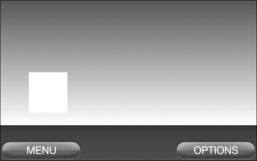
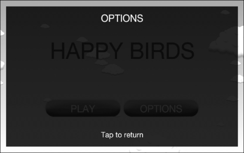
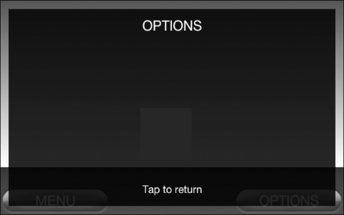

# 五、场景和图层管理

管理场景和层对于一个使用菜单和多个游戏级别的游戏来说是必要的。本章将介绍场景管理器的创建和使用，包括以下主题:

*   创建场景管理器
*   为场景资源设置资源管理器
*   自定义托管场景和图层
*   设置使用场景管理器的活动

# 简介

创建一个管理和处理游戏菜单和场景的过程是改进框架的最快方法之一。一个设计良好的游戏通常依赖于一个健壮且定制的场景管理器来处理菜单和游戏中的关卡。自定义场景管理器有多种方法，但基础通常包括:

*   场景切换
*   场景资源和元素的自动加载和卸载
*   在处理场景资源和场景构建时显示加载屏幕

除了场景管理器的核心功能之外，我们还将创建一种在场景顶部显示图层的方法，这样我们就可以为游戏增加另一个级别的可用性。

# 创建场景管理器

创建一个场景管理器，只是把引擎的当前场景换成另一个场景，这很简单，但对玩家来说没有图形吸引力。在资源加载和场景构建时显示加载屏幕已经成为游戏设计中被广泛接受的实践，因为它让玩家知道游戏不仅仅是在空转。

## 做好准备...

打开本章代码包中的`SceneManager.java`类。另外，打开`ManagedScene.java`和`ManagedLayer.java`课程。我们将在整个食谱中引用所有这三个类。类中的内联注释提供了本食谱中所讨论内容的附加信息。

## 怎么做...

按照以下步骤理解`SceneManager`类的功能，以便我们可以为未来的项目创建一个定制的类:

1.  首先，请注意`SceneManager`类是作为单例创建的，因此我们可以从项目中的任何地方访问它。此外，它使用我们的`ResourceManager`类提供的`getEngine()`引用来存储对引擎对象的本地引用，但是如果我们选择不使用资源管理器，这个引用可以在创建`SceneManager`类时设置。
2.  其次，注意在`getInstance()`方法之后创建的变量。前两个变量`mCurrentScene`和`mNextScene`保存对当前加载场景和下一个要加载场景的引用。`mEngine`变量保存对发动机的引用。我们将使用引擎引用来设置我们的托管场景，并注册/注销`mLoadingScreenHandler`更新处理器。`mNumFramesPassed`整数计算更新处理器中渲染帧的数量，以确保加载屏幕至少显示一帧。显示加载屏幕的功能由下一个变量`mLoadingScreenHandler`实现，我们将在下一步中更仔细地查看它。剩余的变量用于层的管理，或者跟踪分层过程的状态，或者保存对与分层过程相关的实体的引用。
3.  第三，看看`mLoadingScreenHandler IUpdateHandler`更新处理器内的`onUpdate()`方法。请注意，有两个条件块——第一个在卸载前一个场景并随后加载下一个场景之前等待一帧，而第二个在隐藏加载屏幕并重置更新处理器使用的变量之前等待，直到显示下一个场景的加载屏幕的时间最短。更新处理器中的整个过程允许在`ManagedScene`加载和构建自身时使用加载屏幕。
4.  The next method in the class is the `showScene()` method, which we will call when we want to navigate away from the current scene to a following scene. It first resets the position and size of the engine's camera to its starting location and size to prevent any prior adjustments to the camera from ruining the presentation of a new scene. Next, we check if the new scene will show a loading screen via the `hasLoadingScreen` property of the `ManagedScene` class.

    如果新的`ManagedScene`类将显示加载屏幕，我们将其子场景设置为`onLoadingScreenLoadAndShown()`方法返回的场景，并暂停所有的`ManagedScene`类渲染、更新和触摸事件。以下`if`块确保如果一个新场景已经处于加载阶段，则可以加载该场景。这种情况应该很少发生，但是如果从用户界面线程调用一个新场景来显示，这种情况就会发生。然后将`mNextScene`变量设置为新的`ManagedScene`类，供`mLoadingScreenHandler`更新处理器使用，并将引擎的场景设置为新的`ManagedScene`类。

    如果新的`ManagedScene`类不会显示加载画面，我们将`mNextScene`变量设置为新的`ManagedScene`类，将新的`ManagedScene`类设置为引擎的场景，卸载之前显示的场景，加载新的场景。如果没有显示加载屏幕，`showScene()`方法只是用先前显示的场景替换新场景。

5.  接下来看看`showLayer()`法。因为我们的图层在游戏中显示在其他东西的上面，所以我们将它们附加为相机`HUD`对象的子场景。该方法首先确定摄像机是否有一个`HUD`对象来附加一个子场景。如果是，则将`mCameraHadHud`布尔值设置为`true`。如果没有，我们创建一个占位符 HUD 对象，并将其设置为相机的`HUD`对象。接下来，如果调用`showLayer()`方法来暂停底层`ManagedScene`的渲染、更新或触摸事件，我们将占位符场景设置为`ManagedScene`场景的子场景，模态属性传递给`showLayer()`方法。最后，我们将图层的相机设置为引擎的相机，缩放图层以匹配相机的屏幕相关比例，并设置将由下一步中引用的`hideLayer()`方法使用的局部图层相关变量。
6.  `hideLayer()`方法首先检查当前是否正在显示图层。如果是，相机`HUD`对象的子场景被清除，占位符子场景从`ManagedScene`类中清除，图层显示系统被重置。

按照以下步骤理解`ManagedScene`和`Man` `gedLayer`类是如何构造的:

1.  看着`ManagedScene`类，记下类开头列出的变量。`hasLoadingScreen`布尔、`minLoadingScreenTime`浮点和`elapsedLoadingScreenTime`浮点变量由`SceneManager`类在处理`ManagedScene`类的加载屏幕时使用。`isLoaded`布尔值反映了`ManagedScene`类构造的完成状态。在不需要加载屏幕的情况下，第一个构造函数是一个方便的构造函数。第二个构造函数根据传递的值设置加载屏幕变量，该值确定加载屏幕应该显示的最小时间长度。跟随构造函数的公共方法由`SceneManager`类调用，并调用适当的抽象方法，在类的底部列出。
2.  `ManagedLayer`类与`ManagedScene`类非常相似，但其固有功能和缺少加载屏幕使其更容易创建。构造函数根据传递的`pUnloadOnHidden`布尔变量设置图层隐藏后是否卸载。构造函数后面的公共方法调用它们下面适当的抽象方法。

## 它是如何工作的...

场景管理器存储对引擎当前场景的引用。当场景管理器被告知显示新场景时，它会隐藏并卸载当前场景，然后将新场景设置为当前场景。然后，它加载并显示新场景的加载屏幕(如果场景有)。为了在加载场景的其余部分之前显示加载屏幕，我们必须允许引擎渲染一帧。`mNumFramesPassed`整数值记录自进程开始以来发生了多少次更新，从而场景渲染。

加载画面显示后，或者不使用加载画面时，场景管理器通过调用`onLoadManagedScene()`调用场景自行加载。加载完成后，在加载屏幕(如果存在)显示最少时间后，加载屏幕将被隐藏，场景将被显示。如果加载屏幕没有显示最少的时间，我们暂停场景的更新，这样场景就不会启动，直到加载屏幕被隐藏。请参考`SceneManager.java`中补充代码的内联注释，了解该场景管理器如何处理场景切换的更多信息。

为了方便图层的使用，场景管理器利用相机的平视显示器来确保图层绘制在其他所有图层之上。如果相机已经有了 HUD，我们会在应用图层之前存储它，以便在图层隐藏后恢复原始 HUD。此外，我们可以选择通过使用占位符场景来暂停底层场景的更新、渲染和触摸区域。占位符场景作为子场景附加到基础场景，因此我们必须存储基础场景已经附加的任何子场景。图层的加载和显示由场景管理器的相同方法调用处理，以让图层的子类决定是否需要重新加载，或者是否只加载一次图层以减少性能负载。

## 另见...

*   *定制本章给出的托管场景和图层*。
*   *使用本章中给出的场景管理器*设置活动。
*   *在[第 4 章](04.html "Chapter 4. Working with Cameras")、*中，将平视显示器应用于摄像头*使用摄像头*。

# 设置场景资源的资源管理器

为了便于通过菜单和游戏场景加载资源，必须首先设置资源管理器来处理资源。当我们调用其`loadMenuResources()`或`loadGameResources()`方法时，我们的资源管理器将自动加载相应的资源。同样，为使用大量内存的菜单或游戏场景卸载资源将只是使用`unloadMenuResources()`、`unloadGameResources()`或`unloadSharedResources()`调用资源管理器。

## 做好准备...

在本章的代码包中打开`ResourceManager.java`类，因为我们将在本食谱中引用它。此外，有关代码特定部分的更多信息，请参考类的内联注释。

## 怎么做...

按照以下步骤了解`ResourceManager`类是如何设置的，以便与我们的托管场景一起使用:

1.  注意`ResourceManager`类中定义的公共非静态变量。加载纹理时，类中使用了引擎和上下文变量，但它们也为我们提供了一种在整个项目中访问这些重要对象的方法。`cameraWidth`、`cameraHeight`、`cameraScaleFactorX`和`cameraScaleFactorY`变量不在此类中使用，但将在整个项目中用于相对于屏幕放置和缩放实体。
2.  找到`setup()`方法。该方法设置了上一步中引用的非静态变量，并将从我们活动类中被覆盖的`onCreateResources()`方法中调用。重要的是在调用`ResourceManager`类之前调用`setup()`，因为其他方法和变量都依赖于引擎和上下文变量。
3.  接下来，看看静态资源变量。这些将被我们的场景用于实体或声音，并且必须在它们被调用之前设置。还要注意，带有游戏或菜单前缀的静态变量将分别用于我们的游戏或菜单场景，而不带前缀的静态变量将在两种类型之间共享。
4.  现在找到`loadGameResources()` 和`loadMenuResources()` 方法。我们的托管游戏和菜单场景会在第一次启动时调用这些方法。这些方法的重要职责是调用后续的`ResourceManager`方法来设置上一步中引用的静态变量。相反，`unloadGameResources()`和`unloadMenuResources()`卸载各自场景的资源，当应用程序的流程使用完这些资源时，应该调用它们。

## 它是如何工作的...

最基本的资源管理器提供了一种加载和卸载资源的方法。除此之外，我们还定义了一组变量，包括引擎和上下文对象，这使得我们在场景中创建实体时可以轻松访问游戏的一些常见元素。这些变量也可以放在游戏管理器或对象工厂中，但是我们将把它包含在我们的资源管理器中，因为对资源管理器的大多数调用都在用于创建实体的代码附近。

## 另见...

*   *在[第一章](01.html "Chapter 1. AndEngine Game Structure")、*和*中创建资源管理器*。
*   *在[第一章](01.html "Chapter 1. AndEngine Game Structure")、*和*中创建游戏管理器*。
*   *在[第一章](01.html "Chapter 1. AndEngine Game Structure")、*和*中创建对象工厂*。

# 定制管理场景和图层

场景管理器的主要目的是处理我们游戏中被管理的场景。托管场景是高度可定制的，但是我们希望尽可能避免重写代码。为了实现这个任务，我们将使用两个类来扩展`ManagedScene`类，`ManagedGameScene`和`ManagedMenuScene`。通过以这种方式构建我们的场景类，我们将拥有共享一个共同的、各自的基础的菜单和游戏场景。

## 做好准备...

从本章的代码包中打开以下类:`ManagedMenuScene.java`、`ManagedGameScene.java`、`MainMenu.java`、`GameLevel.java`和`OptionsLayer.java`。我们将在整个食谱中引用这些课程。

## 怎么做...

按照以下步骤理解`ManagedMenuScene`和`ManagedGameScene`类如何在`ManagedScene`类的基础上创建可传递给`SceneManager`类的定制的、可扩展的场景:

1.  看看`ManagedMenuScene`班。它只包含两个简单的构造函数和被覆盖的`onUnloadManagedScene()`方法。被覆盖的方法使`isLoaded`布尔值不被设置，因为我们不会利用场景管理器自动卸载菜单场景的优势。
2.  Now, we turn our attention to the `ManagedGameScene` class. The class starts off by creating an in-game `HUD` object, a loading screen `Text` object, and a loading screen `Scene` object. The main constructor of the `ManagedGameScene` class starts by setting the touch-event-binding settings of the scene to true. Next, the scene's scale is set to mirror the camera's screen-dependent scaling and the scene's position is set to the bottom-center of the camera. Finally, the constructor sets the HUD's scale to match the camera's scale.

    `ManagedGameScene`类覆盖`ManagedScene`类的`onLoadingScreenLoadAndShown()`和`onLoadingScreenUnloadAndHidden()`方法，以显示和隐藏显示单个`Text`对象的简单加载屏幕。

    来自`ManagedScene`类的`onLoadScene()`方法被覆盖，以构建一个场景，该场景代表游戏的游戏内部分，带有一个背景和两个按钮，允许玩家返回`MainMenu`或显示`OptionsLayer`。

按照以下步骤理解如何扩展`ManagedMenuScene`和`ManagedGameScene`类来创建`MainMenu`和`GameLevel`场景:

1.  `MainMenu`类是作为单例创建的，以防止创建该类的多个实例并占用宝贵的内存。它也放弃了加载屏幕，因为它几乎是立即加载和创建的。构成`MainMenu`类的所有实体都被定义为类级变量，包括背景、按钮、文本和移动实体。`MainMenu`类从`ManagedScene`类继承的场景流方法是`onLoadScene()`、`onShowScene()`、`onHideScene()`和`onUnloadScene()`方法，其中只有`onLoadScene()`方法包含任何代码。`onLoadScene()`方法加载并构建一个场景，该场景由一个背景、20 个水平移动的云、一个标题和两个按钮组成。请注意，每个按钮都会呼叫场景管理器—播放按钮显示`GameLevel`场景，选项按钮显示`OptionsLayer`。
2.  `GameLevel`类扩展了`ManagedGameScene`类，只覆盖了`onLoadScene()`方法，在场景中创建并随机定位一个方形矩形。这表明`ManagedGameScene`类创建了`GameLevel`类的主体，不同级别的元素仍然可以使用`ManagedGameScene`类创建的相同基础。

按照以下步骤理解`OptionsLayer`类如何扩展`ManagedLayer`类的层功能:

1.  关于`OptionsLayer`类，首先要注意它被定义为单例，这样它在第一次创建后就会保留在内存中。接下来，注意两个更新处理器，`SlideIn`和`SlideOut`。这些动画层，当它被显示或隐藏时，给游戏一个额外的图形兴趣层。更新处理器只是以与`onUpdate()`方法的`pSecondsElapsed`参数成比例的速度将图层移动到特定位置，以使移动平滑。
2.  从`ManagedLayer`类继承的`onLoadLayer()`方法被覆盖，以创建一个黑色矩形，作为图层的背景，以及两个`Text`对象，显示标题和退出图层的方式。`onShowLayer()`和`onHideLayer()`方法向引擎注册适当的更新处理器。将图层移出屏幕后，请注意`SlideOut`更新处理器调用场景管理器来隐藏图层，这就是如何使用这个特定的场景管理器框架实现结束动画。

## 它是如何工作的...

`ManagedMenuScene`类的唯一目的是覆盖从`ManagedScene`类继承的`onUnloadManagedScene()`方法，以防止场景内实体的重新创建。注意`MainMenu`类中被覆盖的 `onUnloadScene()`方法，它扩展了`ManagedMenuScene`。我们将其留空以确保`MainMenu`类保留在内存中，以便我们可以从游戏场景和其他菜单中快速切换回它。

### 注

运行此项目时，如果主菜单中有任何动画，请注意动画会在显示另一个场景时暂停，但一旦主菜单再次显示，动画就会恢复。这是因为主菜单不会像引擎的当前场景一样更新，即使它仍然加载在内存中。

`ManagedGameScene`类使用一个`HUD`对象来允许游戏关卡一组随引擎摄像头移动的控件。即使我们在这个例子中给`GameHud`对象添加了按钮，任何控件都可以在平视显示器上使用。我们用于`ManagedGameScene`类的构造器设置加载屏幕持续时间、触摸选项以及游戏场景和`GameHud`的比例，以提高游戏在设备间的视觉吸引力。对于游戏场景，我们利用场景管理器启用的加载屏幕。对于加载屏幕，我们创建一个简单的场景来显示文本，**加载...**，但是可以使用任何非动画实体的排列。当加载屏幕显示时，我们加载游戏资源并创建游戏场景。在这种情况下，一个简单的背景由一个精灵构成，屏幕控制被添加到`GameHud`对象。请注意，添加到`GameHud`对象的控制被缩放到相机比例因子的倒数。这是必要的，因为我们希望在所有设备上创建相同的物理大小。我们在`ManagedGameScene`类`onUnloadScene()`中定义的最后一个方法卸载场景。

### 注

请注意，我们在更新线程上完成了所有的卸载。这可以防止引擎试图处理一个在线程中较早被移除的实体，并防止引发`ArrayIndexOutOfBoundsException`异常。

对于主菜单，我们不需要加载屏幕，因此我们只需在`onLoadingScreenLoadAndShown()` 方法中返回`null`。当为主菜单创建简单的精灵背景时，我们必须缩放它来填充屏幕。注意在创建精灵和按钮时，主菜单是如何利用`ResourceManager`类的菜单资源的。另外，请注意，通过单击按钮，我们调用`SceneManager`类来加载下一个场景或显示一个层。以下两个截图显示了两个不同设备上的主菜单，以演示相机缩放如何随着场景的构成而工作。第一张截图是在 10.1 英寸的摩托罗拉 Xoom 上拍摄的:


第二款是 5.3 英寸三星 Galaxy Note:


我们的`GameLevel`类相对于它的超级类`ManagedGameScene`来说是比较小的。这是因为我们希望级别仅包括每个单独级别所需的信息。下面的截图显示了`GameLevel`班在行动:



`OptionsLayer` 类可以从任意场景显示，如下两张截图所示。首先是在主菜单:



而第二个是游戏中加载的`GameLevel`类:



## 另见...

*   *创建本章中的场景管理器*。
*   *在[第四章](04.html "Chapter 4. Working with Cameras")、*与*和*摄像机*的显示器上连接一个控制器。*

# 设置使用场景管理器的活动

由于我们的场景管理器的工作方式，将其设置为由扩展的`Activity`类和工程师的`BaseGameActivity`类使用只需要很少的努力。我们还将实施精确的屏幕分辨率缩放方法，以确保所有设备的外观一致。`SceneManager`类和`ManagedScenes`类依赖于`ResourceManager`类中定义的变量来注册更新处理器和创建实体。当我们浏览食谱时，请注意我们在使用`SceneManager`类的任何功能之前设置了`ResourceManager`类。

## 做好准备...

创建一个扩展 AndEngine 的`BaseGameActivity`类的新活动，或者加载一个您已经创建的活动。调整现有活动以使用场景管理器需要与新活动相同的步骤，所以不要担心仅仅为了实现场景管理器而重新开始一个项目。

## 怎么做...

按照以下步骤准备使用场景管理器的活动:

1.  在您的活动中定义以下变量来处理精确的屏幕分辨率缩放。这样做将使所有安卓设备上的屏幕元素在物理上几乎相同:

    ```java
    static float DESIGN_SCREEN_WIDTH_PIXELS = 800f;
    static float DESIGN_SCREEN_HEIGHT_PIXELS = 480f;
    static float DESIGN_SCREEN_WIDTH_INCHES = 4.472441f;
    static float DESIGN_SCREEN_HEIGHT_INCHES = 2.805118f;
    static float MIN_WIDTH_PIXELS = 320f, MIN_HEIGHT_PIXELS = 240f;
    static float MAX_WIDTH_PIXELS = 1600f, MAX_HEIGHT_PIXELS = 960f;
    public float cameraWidth;
    public float cameraHeight;
    public float actualScreenWidthInches;
    public float actualScreenHeightInches;
    ```

2.  在活动类中放置以下方法来处理**返回**按钮:

    ```java
    public boolean onKeyDown(final int keyCode, final KeyEvent event) 
    {
      if (keyCode == KeyEvent.KEYCODE_BACK
        && event.getAction() == KeyEvent.ACTION_DOWN) {
        if(ResourceManager.getInstance().engine!=null){
          if(SceneManager.getInstance().isLayerShown)
            SceneManager.getInstance().
              currentLayer.onHideLayer();
          else if( SceneManager.getInstance().
              mCurrentScene.getClass().
              getGenericSuperclass().
              equals(ManagedGameScene.class) || 
              (SceneManager.getInstance().
              mCurrentScene.getClass().
              getGenericSuperclass().
              equals(ManagedMenuScene.class) &!
              SceneManager.getInstance().
              mCurrentScene.getClass().
              equals(MainMenu.class)))
              SceneManager.getInstance().
              showMainMenu();
          else
            System.exit(0);
        }
        return true;
      } else {
        return super.onKeyDown(keyCode, event);
      }
    }
    ```

3.  接下来，用以下代码填充`onCreateEngineOptions()`方法:

    ```java
    actualScreenWidthInches = getResources().
      getDisplayMetrics().widthPixels /
      getResources().getDisplayMetrics().xdpi;
    actualScreenHeightInches = getResources().
      getDisplayMetrics().heightPixels / 
      getResources().getDisplayMetrics().ydpi;
    cameraWidth = Math.round(
      Math.max(
        Math.min(
          DESIGN_SCREEN_WIDTH_PIXELS * 
          (actualScreenWidthInches / 
            DESIGN_SCREEN_WIDTH_INCHES),
        MAX_WIDTH_PIXELS),
      MIN_WIDTH_PIXELS));
    cameraHeight = Math.round(
      Math.max(
        Math.min(
          DESIGN_SCREEN_HEIGHT_PIXELS * 
          (actualScreenHeightInches /
            DESIGN_SCREEN_HEIGHT_INCHES),
        MAX_HEIGHT_PIXELS),
      MIN_HEIGHT_PIXELS));
    EngineOptions engineOptions = new EngineOptions(true,
      ScreenOrientation.LANDSCAPE_SENSOR,
      new FillResolutionPolicy(), 
      new Camera(0, 0, cameraWidth, cameraHeight));
    engineOptions.getAudioOptions().setNeedsSound(true);
    engineOptions.getAudioOptions().setNeedsMusic(true);
    engineOptions.getRenderOptions().setDithering(true);
    engineOptions.getRenderOptions().
      getConfigChooserOptions().setRequestedMultiSampling(true);
    engineOptions.setWakeLockOptions(WakeLockOptions.SCREEN_ON);
    return engineOptions;
    ```

4.  在`onCreateResources()`方法中放置以下行:

    ```java
    ResourceManager.getInstance().setup(this.getEngine(),
      this.getApplicationContext(),
      cameraWidth, cameraHeight,
      cameraWidth/DESIGN_SCREEN_WIDTH_PIXELS,
      cameraHeight/DESIGN_SCREEN_HEIGHT_PIXELS);
    ```

5.  最后，将以下代码添加到`onCreateScene()`方法中:

    ```java
    SceneManager.getInstance().showMainMenu();
    pOnCreateSceneCallback.onCreateSceneFinished(
      MainMenu.getInstance());
    ```

## 它是如何工作的...

我们要做的第一件事是定义我们的开发设备屏幕的属性，这样我们就可以进行计算，以确保所有玩家尽可能接近我们看到的方式来看待我们的游戏。计算实际上是在第三步所示的`onCreateEngineOptions()`方法中进行的。对于引擎选项，我们启用了声音、音乐、平滑渐变的抖动、平滑边缘的多采样和唤醒锁定，以防止玩家短暂离开我们的游戏时破坏我们的游戏资源。

在第 4 步中，我们通过向其传递`Engine`对象、`Context`、当前相机宽度和高度以及当前相机尺寸与设计设备屏幕尺寸的比率来设置`ResourceManager`类。最后，我们告诉`SceneManager`类显示主菜单，并通过`pOnCreateSceneCallback`参数将`MainMenu`类作为发动机场景传递。

## 另见...

*   *创建本章中的场景管理器*。
*   *了解[第一章](01.html "Chapter 1. AndEngine Game Structure")、*和*中的生命周期*。