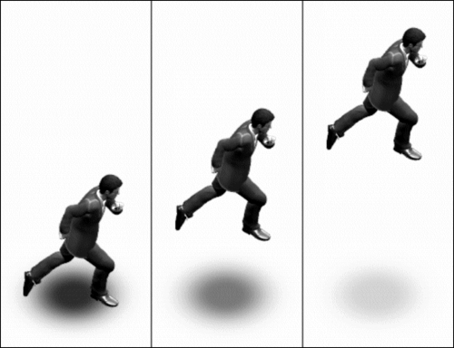

# 十、从AndEngine中获得更多

这一章将涵盖比前几章有更具体应用的其他食谱。这些食谱包括:

*   从文件夹加载所有纹理
*   使用纹理网格
*   应用基于精灵的阴影
*   创建基于物理的移动平台
*   创建一个基于物理的绳索桥

# 从文件夹加载所有纹理

当创建一个有大量纹理的游戏时，单独加载每个纹理会变得乏味。在这样的游戏中创建一个加载和检索纹理的方法不仅可以节省开发时间，还可以减少运行时的整体加载时间。在这个食谱中，我们将创建一种方法，只使用一行代码加载大量纹理。

## 做好准备...

首先，创建一个名为`TextureFolderLoadingActivity`的新活动类，扩展`BaseGameActivity`类。接下来，在`assets/gfx/`文件夹中创建一个名为`FolderToLoad`的文件夹。最后，在`assets/gfx/FolderToLoad/`文件夹中放置五张图片，名称分别为:`Coin1`、`Coin5`、`Coin10`、`Coin50`和`Coin100`。

## 怎么做...

按照以下步骤填写我们的`TextureFolderLoadingActivity`活动课:

1.  在我们的活动中放置以下简单的代码，使其发挥作用:

    ```java
    @Override
    public EngineOptions onCreateEngineOptions() {
      return new EngineOptions(true,
        ScreenOrientation.LANDSCAPE_SENSOR, 
        new FillResolutionPolicy(), 
        new Camera(0, 0, 800, 480))
        .setWakeLockOptions(WakeLockOptions.SCREEN_ON);
    }
    @Override
    public void onCreateResources(OnCreateResourcesCallback
        pOnCreateResourcesCallback) {
      pOnCreateResourcesCallback.onCreateResourcesFinished();
    }
    @Override
    public void onCreateScene(OnCreateSceneCallback 
        pOnCreateSceneCallback) {
      Scene mScene = new Scene();
      mScene.setBackground(new Background(0.9f,0.9f,0.9f));
      pOnCreateSceneCallback.onCreateSceneFinished(mScene);
    }
    @Override
    public void onPopulateScene(Scene pScene, 
        OnPopulateSceneCallback pOnPopulateSceneCallback) {
      pOnPopulateSceneCallback.onPopulateSceneFinished();
    }
    ```

2.  接下来，将这个`ArrayList`变量和`ManagedStandardTexture`类放入活动中:

    ```java
    public final ArrayList<ManagedStandardTexture> loadedTextures = 
      new ArrayList<ManagedStandardTexture>();
    public class ManagedStandardTexture {
      public ITextureRegion textureRegion;
      public String name;
      public ManagedStandardTexture(String pName, 
          final ITextureRegion pTextureRegion) {
        name = pName;
        textureRegion = pTextureRegion;
      }
      public void removeFromMemory() {
        loadedTextures.remove(this);
        textureRegion.getTexture().unload();
        textureRegion = null;
        name = null;
      }
    }
    ```

3.  然后，将接下来的两个方法添加到活动类中，允许我们仅通过传递`TextureOptions`参数和文件名:

    ```java
    public ITextureRegion getTextureRegion(TextureOptions 
          pTextureOptions, String pFilename) {
      loadAndManageTextureRegion(pTextureOptions,pFilename);
      return loadedTextures.get(
        loadedTextures.size()-1).textureRegion;
    }
    public void loadAndManageTextureRegion(TextureOptions 
          pTextureOptions, String pFilename) {
      AssetBitmapTextureAtlasSource cSource = 
        AssetBitmapTextureAtlasSource.create(
        this.getAssets(), pFilename);  
      BitmapTextureAtlas TextureToLoad = 
        new BitmapTextureAtlas(mEngine.getTextureManager(), 
          cSource.getTextureWidth(), 
          cSource.getTextureHeight(), 
          pTextureOptions);
      TextureRegion TextureRegionToLoad = 
        BitmapTextureAtlasTextureRegionFactory.
          createFromAsset(TextureToLoad, this, 
            pFilename, 0, 0);     
      TextureToLoad.load();
      loadedTextures.add(new ManagedStandardTexture(
        pFilename.substring(
          pFilename.lastIndexOf("/")+1, 
          pFilename.lastIndexOf(".")),
        TextureRegionToLoad));
    }
    ```

    来加载纹理
4.  现在插入以下方法，允许我们加载一个文件夹或多个文件夹中的所有纹理:

    ```java
    public void loadAllTextureRegionsInFolders(TextureOptions 
        pTextureOptions, String... pFolderPaths) {
      String[] listFileNames;
      String curFilePath;
      String curFileExtension;
      for (int i = 0; i < pFolderPaths.length; i++)
        try {
          listFileNames = this.getAssets().
            list(pFolderPaths[i].substring(0, 
            pFolderPaths[i].lastIndexOf("/")));
          for (String fileName : listFileNames) {
            curFilePath = 
              pFolderPaths[i].concat(fileName);
            curFileExtension = 
              curFilePath.substring(
              curFilePath.lastIndexOf("."));
            if(curFileExtension.
              equalsIgnoreCase(".png")
              || curFileExtension.
              equalsIgnoreCase(".bmp")
              || curFileExtension.
              equalsIgnoreCase(".jpg"))
              loadAndManageTextureRegion(
                pTextureOptions, 
                curFilePath);
          }
        } catch (IOException e) {
          System.out.print("Failed to load textures
            from folder!");
          e.printStackTrace();
          return;
        }
    }
    ```

5.  接下来，将以下方法放入活动中，让我们卸载所有`ManagedStandardTexture`类或通过其短文件名检索纹理:

    ```java
    public void unloadAllTextures() {
      for(ManagedStandardTexture curTex : loadedTextures) {
        curTex.removeFromMemory();
        curTex=null;
        loadedTextures.remove(curTex);
      }
      System.gc();
    }

    public ITextureRegion getLoadedTextureRegion(String pName) {
      for(ManagedStandardTexture curTex : loadedTextures)
        if(curTex.name.equalsIgnoreCase(pName))
          return curTex.textureRegion;
      return null;
    }
    ```

6.  现在我们已经在活动中拥有了所有的方法，在`onCreateResources()`方法中放置下面一行代码:

    ```java
    this.loadAllTextureRegionsInFolders(TextureOptions.BILINEAR, "gfx/FolderToLoad/");
    ```

7.  最后，在`onPopulateScene()`方法中添加以下代码，展示我们如何通过名称检索加载的纹理:

    ```java
    pScene.attachChild(new Sprite(144f, 240f, 
      getLoadedTextureRegion("Coin1"), 
      this.getVertexBufferObjectManager()));
    pScene.attachChild(new Sprite(272f, 240f, 
      getLoadedTextureRegion("Coin5"), 
      this.getVertexBufferObjectManager()));
    pScene.attachChild(new Sprite(400f, 240f, 
      getLoadedTextureRegion("Coin10"), 
      this.getVertexBufferObjectManager()));
    pScene.attachChild(new Sprite(528f, 240f, 
      getLoadedTextureRegion("Coin50"), 
      this.getVertexBufferObjectManager()));
    pScene.attachChild(new Sprite(656f, 240f, 
      getLoadedTextureRegion("Coin100"), 
      this.getVertexBufferObjectManager()));
    ```

## 它是如何工作的...

在第一步中，我们通过实现标准的`BaseGameActivity`方法来建立我们的`TextureFolderLoadingActivity`活动类，这种方法是大多数安卓游戏都使用的。有关设置与和引擎一起使用的活动的更多信息，请参见[第 1 章](01.html "Chapter 1. AndEngine Game Structure")、*和引擎游戏结构*中的*了解生命周期*食谱。

在第二步中，我们创建一个由`ManagedStandardTexture`对象组成的`ArrayList`变量，该变量是根据`ArrayList`变量的定义直接定义的。`ManagedStandardTextures`是简单的容器，包含指向`ITextureRegion`区域的指针和表示`ITextureRegion`对象名称的字符串变量。`ManagedStandardTexture`类还包括一个卸载`ITextureRegion`的方法，并准备在下一次垃圾收集时从内存中移除变量。

第三步包括两种方法，`getTextureRegion()`和`loadAndManageTextureRegion()`:

*   `getTextureRegion()`方法调用`loadAndManageTextureRegion()`方法，并从步骤二中定义的名为`loadedTextures`的`ArrayList`变量中返回最近加载的纹理。
*   `loadAndManageTextureRegion()`方法创建名为`cSource`的`AssetBitmapTextureAtlasSource`源，该源仅用于传递`BitmapTextureAtlas`对象`TextureToLoad`的以下定义中纹理的宽度和高度。

`TextureRegion`对象`TextureRegionToLoad`是通过调用`BitmapTextureAtlasTextureRegionFactory`对象的`createFromAsset()`方法创建的。然后加载`TextureToLoad`，通过创建新的`ManagedStandardTexture`类将`TextureRegionToLoad`对象添加到`loadedTextures` `ArrayList`变量中。有关纹理的更多信息，请参见[第 1 章](01.html "Chapter 1. AndEngine Game Structure")、*和《工程游戏结构》*中的*不同类型的纹理*配方。

在第四步中，我们创建一个方法，解析在`pFolderPaths`数组中传递的每个文件夹中的文件列表，并将图像文件加载为纹理，其中`TextureOptions`参数应用于每个图像。`listFileNames`字符串数组保存每个`pFolderPaths`文件夹中的文件列表，`curFilePath`和`curFileExtension`变量用于存储文件路径和它们的相对扩展名，以确定哪些文件是和工程支持的图像。第一个`for`循环只是为每个给定的文件夹路径运行解析和加载过程。`getAssets().list()`方法抛出`IOException`异常，因此需要包含在`try-catch`块中。它用于检索传递的`String`参数内所有文件的列表。第二个`for`循环将`curFilePath`设置为当前`i`值的文件夹路径，该路径与来自`listFileNames`数组的当前文件名相连接。接下来，`curFileExtension`字符串变量被设置为`curFilePath`变量的最后一个索引“.”，使用`substring()`方法返回扩展名。然后，我们检查当前文件的扩展名是否等于 AndEngine 支持的扩展名，如果是`true`，则调用`loadAndManageTextureRegion()`方法。最后，我们通过向日志发送消息并打印来自`IOException`异常的`StackTrace`消息来捕获`IOException`异常。

第五步包括两个方法，`unloadAllTextures()`和`getLoadedTextureRegion()`，它们帮助我们管理由我们之前的方法加载的纹理:

*   `unloadAllTextures()`方法贯穿`loadedTextures` `ArrayList`对象中的所有`ManagedStandardTextures`，并使用`removeFromMemory()`方法卸载它们，然后将它们从`loadedTextures`中移除并请求从系统中进行垃圾收集
*   `getLoadedTextureRegion()`方法对照`pName`字符串参数检查`loadedTextures`变量中的每个`ManagedStandardTexture`，如果名称相等，则返回当前的`ManagedStandardTexture`类‘`ITextureRegion`区域，如果不匹配，则返回`null`

第六步通过传递一个`BILINEAR` `TextureOption`参数和我们的`FolderToLoad`文件夹的资产文件夹路径，从`onCreateResources()`活动方法内部调用`loadAllTextureRegionsInFolders()`方法。有关`TextureOptions`的更多信息，请参见[第 1 章](01.html "Chapter 1. AndEngine Game Structure")、*和工程游戏结构*中的*将选项应用于我们的纹理*配方。

在最后一步中，我们在`onPopulateScene()`活动方法中为场景添加了五个精灵。每个精灵构造函数调用`getLoadedTextureRegion()` 方法，并传递精灵图像文件各自的短名称。每个精灵的位置将它们放置在屏幕上的一条水平线中。一次加载所有纹理的精灵的显示应该类似于下图。有关创建精灵的更多信息，请参见第 2 章、*使用实体*中的*将精灵添加到图层*配方。


## 另见

*   *了解[第一章](01.html "Chapter 1. AndEngine Game Structure")、*和*中的生命周期*。
*   *不同类型的纹理[第一章](01.html "Chapter 1. AndEngine Game Structure")、*和引擎游戏结构*中的*。
*   *在[第一章](01.html "Chapter 1. AndEngine Game Structure")、*和*中对我们的纹理*应用选项。
*   *在[第二章](02.html "Chapter 2. Working with Entities")、*中添加精灵到图层*中使用实体*。

# 使用纹理网格

**纹理网格**、是简单的应用了纹理的三角多边形，在移动游戏中变得越来越流行，因为它们允许创建和操纵非矩形形状。拥有处理纹理网格的能力通常会创建一个额外的游戏机制层，这在以前是非常昂贵的。在这个食谱中，我们将学习如何从一组预定的三角形创建一个纹理网格。

## 做好准备...

首先，创建一个名为`TexturedMeshActivity`的新活动类，扩展`BaseGameActivity`。接下来，在我们项目的`assets/gfx/`文件夹中放置一个名为`dirt.png`的无缝平铺纹理，尺寸为 512 x 128。最后，将`TexturedMesh.java`类从代码包导入到我们的项目中。

## 怎么做...

按照以下步骤构建我们的`TexturedMeshActivity`活动课:

1.  将以下代码放入我们的活动中，为我们提供一个标准的工程活动:

    ```java
    @Override
    public EngineOptions onCreateEngineOptions() {
      return new EngineOptions(true,
        ScreenOrientation.LANDSCAPE_SENSOR, 
        new FillResolutionPolicy(), 
        new Camera(0, 0, 800, 480))
        .setWakeLockOptions(WakeLockOptions.SCREEN_ON);
    }
    @Override
    public void onCreateResources(OnCreateResourcesCallback
        pOnCreateResourcesCallback) {
      pOnCreateResourcesCallback.onCreateResourcesFinished();
    }
    @Override
    public void onCreateScene(OnCreateSceneCallback 
        pOnCreateSceneCallback) {
      Scene mScene = new Scene();
      mScene.setBackground(new Background(0.9f,0.9f,0.9f));
      pOnCreateSceneCallback.onCreateSceneFinished(mScene);
    }
    @Override
    public void onPopulateScene(Scene pScene, 
        OnPopulateSceneCallback pOnPopulateSceneCallback) {
      pOnPopulateSceneCallback.onPopulateSceneFinished();
    }
    ```

2.  将以下代码片段添加到`onPopulateScene()`方法中:

    ```java
    BitmapTextureAtlas texturedMeshT = new BitmapTextureAtlas(
      this.getTextureManager(), 512, 128, 
      TextureOptions.REPEATING_BILINEAR);
    ITextureRegion texturedMeshTR = 
      BitmapTextureAtlasTextureRegionFactory.
      createFromAsset(texturedMeshT, this, "gfx/dirt.png", 0, 0);
    texturedMeshT.load();
    float[] meshTriangleVertices = {
        24.633111f,37.7835047f,-0.00898f,113.0324447f,
        -24.610162f,37.7835047f,0.00387f,-37.7900953f,
        -103.56176f,37.7901047f,103.56176f,37.7795047f,
        0.00387f,-37.7900953f,-39.814736f,-8.7311953f,
        -64.007044f,-83.9561953f,64.00771f,-83.9621953f,
        39.862562f,-8.7038953f,0.00387f,-37.7900953f};
    float[] meshBufferData = new float[TexturedMesh.VERTEX_SIZE * 
      (meshTriangleVertices.length/2)];
    for( int i = 0; i < meshTriangleVertices.length/2; i++) {
      meshBufferData[(i * TexturedMesh.VERTEX_SIZE) + 
        TexturedMesh.VERTEX_INDEX_X] = 
        meshTriangleVertices[i*2];
      meshBufferData[(i * TexturedMesh.VERTEX_SIZE) + 
        TexturedMesh.VERTEX_INDEX_Y] = 
        meshTriangleVertices[i*2+1];
    }
    TexturedMesh starTexturedMesh = new TexturedMesh(400f, 225f, 
      meshBufferData, 12, DrawMode.TRIANGLES, texturedMeshTR, 
      this.getVertexBufferObjectManager());
    pScene.attachChild(starTexturedMesh);
    ```

## 它是如何工作的...

在第一步中，我们通过在我们的`TexturedMeshActivity`类中插入标准的、被覆盖的`BaseGameActivity`方法来准备我们的`TexturedMeshActivity`类，这是大多数安卓游戏都使用的方法。有关设置与和引擎一起使用的活动的更多信息，请参见[第 1 章](01.html "Chapter 1. AndEngine Game Structure")、*和引擎游戏结构*中的*了解生命周期*食谱。

在第二步中，我们首先定义`texturedMeshT`，一个`BitmapTextureAtlas`对象，构造器的最终参数是`REPEATING_BILINEAR` `TextureOption`参数，以创建一个纹理，该纹理将无缝地平铺在构成我们的纹理网格的三角形内。有关`TextureOptions`的更多信息，请参见[第 1 章](01.html "Chapter 1. AndEngine Game Structure")、*和工程游戏结构*中的*将选项应用于我们的纹理*配方。

在创建了`texturedMeshTR` `ITextureRegion`对象并加载了我们的`texturedMeshT`对象之后，我们定义了一个浮动变量数组，该数组指定了构成我们的纹理网格的每个三角形的每个顶点的相对和连续的 x 和 y 位置。查看下图，更好地了解如何在纹理网格中使用三角形的顶点:


接下来，我们创建`meshBufferData`浮动数组，并将其大小设置为`TexturedMesh`类的顶点大小乘以`meshTriangleVertices`数组中的顶点数——一个顶点占据数组中的两个索引，`X`和`Y`，因此我们必须将长度除以`2`。然后，对于`meshTriangleVertices`数组中的每个顶点，我们将顶点的位置应用于`meshBufferData`数组。最后，我们创建`TexturedMesh`对象，命名为`starTexturedMesh`。`TexturedMesh`构造器的参数如下:

*   构造函数的前两个参数是`400f`、`225f`的 x 和 y 位置
*   接下来的两个参数是`meshBufferData`缓冲区数据和顶点数量`12`，我们将其放入`meshBufferData`数组中
*   `TexturedMesh`构造器的最后三个参数是`Triangles`的`DrawMode`、【网格】的`ITextureRegion`，以及我们的`VertexBufferObjectManager`对象。

有关创建`TexturedMesh`类的更多信息，请参见[第 2 章](02.html "Chapter 2. Working with Entities")、*使用实体*中的*将图元应用于图层*方法。

## 另见

*   *了解[第一章](01.html "Chapter 1. AndEngine Game Structure")、*和*中的生命周期*。
*   *在[第一章](01.html "Chapter 1. AndEngine Game Structure")、*和*中对我们的纹理*应用选项。
*   *在[第 2 章](02.html "Chapter 2. Working with Entities")、*中对图层*应用图元处理实体*。

# 应用基于精灵的阴影

给游戏增加阴影可以增加视觉深度，让游戏有更吸引人的外观。简单地在对象下面放置一个带有阴影纹理的精灵是处理阴影创建的快速有效的方法。在本章中，我们将学习如何在保持阴影与其父对象正确对齐的同时做到这一点。

## 做好准备...

首先，创建一个名为`SpriteShadowActivity`的新活动类，扩展`BaseGameActivity`并实现`IOnSceneTouchListener`。接下来，将一个大小为 256 x 128 并命名为`shadow.png`的阴影图像放入`assets/gfx/`文件夹中。最后，将一个大小为 128 x 256 并命名为`character.png`的字符图像放入`assets/gfx/`文件夹中。

## 怎么做...

按照以下步骤构建我们的`SpriteShadowActivity`活动课:

1.  在我们的活动类中放置以下标准和工程活动代码:

    ```java
    @Override
    public EngineOptions onCreateEngineOptions() {
      EngineOptions engineOptions = new EngineOptions(true, 
        ScreenOrientation.LANDSCAPE_SENSOR, 
        new FillResolutionPolicy(), 
        new Camera(0, 0, 800, 480))
        .setWakeLockOptions(WakeLockOptions.SCREEN_ON);
      engineOptions.getRenderOptions().setDithering(true);
      return engineOptions;
    }
    @Override
    public void onCreateResources(OnCreateResourcesCallback 
        pOnCreateResourcesCallback) {
      pOnCreateResourcesCallback.onCreateResourcesFinished();
    }
    @Override
    public void onCreateScene(OnCreateSceneCallback 
        pOnCreateSceneCallback) {
      Scene mScene = new Scene();
      mScene.setBackground(new Background(0.8f,0.8f,0.8f));
      pOnCreateSceneCallback.onCreateSceneFinished(mScene);
    }
    @Override
    public void onPopulateScene(Scene pScene, OnPopulateSceneCallback 
        pOnPopulateSceneCallback) {
      pScene.setOnSceneTouchListener(this);
      pOnPopulateSceneCallback.onPopulateSceneFinished();
    }
    @Override
    public boolean onSceneTouchEvent(Scene pScene, 
        TouchEvent pSceneTouchEvent) {
      return true;
    }
    ```

2.  接下来，将这些变量放入我们的活动中，以给予我们对阴影的特定控制:

    ```java
    Static final float CHARACTER_START_X = 400f;
    static final float CHARACTER_START_Y = 128f;
    static final float SHADOW_OFFSET_X = 0f;
    static final float SHADOW_OFFSET_Y = -64f;
    static final float SHADOW_MAX_ALPHA = 0.75f;
    static final float SHADOW_MIN_ALPHA = 0.1f;
    static final float SHADOW_MAX_ALPHA_HEIGHT = 200f;
    static final float SHADOW_MIN_ALPHA_HEIGHT = 0f;
    static final float SHADOW_START_X = CHARACTER_START_X + SHADOW_OFFSET_X;
    static final float SHADOW_START_Y = CHARACTER_START_Y + SHADOW_OFFSET_Y;
    static final float CHARACTER_SHADOW_Y_DIFFERENCE = 
      CHARACTER_START_Y - SHADOW_START_Y;
    static final float SHADOW_ALPHA_HEIGHT_DIFFERENCE = 
      SHADOW_MAX_ALPHA_HEIGHT - SHADOW_MIN_ALPHA_HEIGHT;
    static final float SHADOW_ALPHA_DIFFERENCE = 
      SHADOW_MAX_ALPHA - SHADOW_MIN_ALPHA;
    Sprite shadowSprite;
    Sprite characterSprite;
    ```

3.  现在在我们的活动中放置以下方法，使阴影的 alpha 与角色离阴影的距离成反比:

    ```java
    public void updateShadowAlpha() {
      shadowSprite.setAlpha(MathUtils.bringToBounds(
        SHADOW_MIN_ALPHA, SHADOW_MAX_ALPHA, 
        SHADOW_MAX_ALPHA - ((((characterSprite.getY()-
        CHARACTER_SHADOW_Y_DIFFERENCE)-SHADOW_START_Y) / 
        SHADOW_ALPHA_HEIGHT_DIFFERENCE) * 
        SHADOW_ALPHA_DIFFERENCE)));
    }
    ```

4.  将以下代码片段插入`onSceneTouchEvent()`方法 :

    ```java
    if(pSceneTouchEvent.isActionDown() || 
        pSceneTouchEvent.isActionMove()) {
      characterSprite.setPosition(
        pSceneTouchEvent.getX(), 
        Math.max(pSceneTouchEvent.getY(), 
          CHARACTER_START_Y));
    }
    ```

5.  最后，用以下片段填充`onPopulateScene()`方法:

    ```java
    BitmapTextureAtlas characterTexture = 
      new BitmapTextureAtlas(this.getTextureManager(), 128, 256, 
        TextureOptions.BILINEAR);
    TextureRegion characterTextureRegion = 
      BitmapTextureAtlasTextureRegionFactory.createFromAsset(
        characterTexture, this, "gfx/character.png", 0, 0);
    characterTexture.load();
    BitmapTextureAtlas shadowTexture = 
      new BitmapTextureAtlas(this.getTextureManager(), 256, 128, 
        TextureOptions.BILINEAR);
    TextureRegion shadowTextureRegion = 
      BitmapTextureAtlasTextureRegionFactory.createFromAsset(
        shadowTexture, this, "gfx/shadow.png", 0, 0);
    shadowTexture.load();
    shadowSprite = new Sprite(SHADOW_START_X, SHADOW_START_Y, 
      shadowTextureRegion,this.getVertexBufferObjectManager());
    characterSprite = new Sprite(CHARACTER_START_X, CHARACTER_START_Y, 
      characterTextureRegion,this.getVertexBufferObjectManager()) 
      {
      @Override
      public void setPosition(final float pX, final float pY) {
        super.setPosition(pX, pY);
        shadowSprite.setPosition(
          pX + SHADOW_OFFSET_X, shadowSprite.getY());
        updateShadowAlpha();
      }
    };
    pScene.attachChild(shadowSprite);
    pScene.attachChild(characterSprite);
    updateShadowAlpha();
    ```

## 它是如何工作的...

在第一步中，我们通过实现标准的`BaseGameActivity`方法来建立我们的`SpriteShadowActivity`活动类，这种方法是大多数安卓游戏都使用的。有关设置与和引擎一起使用的活动的更多信息，请参见[第 1 章](01.html "Chapter 1. AndEngine Game Structure")、*和引擎游戏结构*中的*了解生命周期*食谱。

下图显示了这个配方如何将我们的阴影精灵与角色精灵相关联:


在第二步中，我们定义了几个常量来控制阴影精灵`shadowSprite`如何与角色精灵`characterSprite` : 对齐

*   前两个常数`CHARACTER_START_X`和`CHARACTER_START_Y`设置`characterSprite`的初始位置
*   接下来的两个常数`SHADOW_OFFSET_X`和`SHADOW_OFFSET_Y`控制 x 轴和 y 轴上的距离，即阴影相对于角色精灵的初始位置
*   当移动角色精灵时，`SHADOW_OFFSET_X`常数也用于更新阴影精灵的位置

接下来的四个常量控制`shadowSprite`精灵的 alpha 将如何控制，以及控制到什么级别:

*   `SHADOW_MAX_ALPHA`和`SHADOW_MIN_ALPHA`设置绝对最小和最大 alpha，根据角色在 y 轴上距离阴影的距离变化。距离越远，`shadowSprite`精灵的阿尔法值越低，直到达到最低等级。
*   `SHADOW_MAX_ALPHA_HEIGHT`常数表示在默认为`SHADOW_MIN_ALPHA`之前，`shadowSprite`精灵的 alpha 将受到影响的角色到阴影的最大距离。
*   `SHADOW_MIN_ALPHA_HEIGHT`常数表示角色到阴影的最小距离，阴影的 alpha 应该改变。如果`SHADOW_MIN_ALPHA_HEIGHT`大于`0`，当角色与阴影的距离低于`SHADOW_MIN_ALPHA_HEIGHT`时，阴影的 alpha 将达到最大值。

剩余的常数是根据前一组自动计算的。`SHADOW_START_X`和`SHADOW_START_Y`代表`shadowSprite`精灵的起始位置。它们是通过将阴影的偏移值添加到角色的起始位置来计算的。`CHARACTER_SHADOW_Y_DIFFERENCE`常数代表 y 轴上字符和阴影之间的初始起始距离。`SHADOW_ALPHA_HEIGHT_DIFFERENCE`常数代表最小和最大高度之间的差值，用于在运行时调整阴影的 alpha。最终常数`SHADOW_ALPHA_DIFFERENCE`代表`shadowSprite`精灵的最小和最大阿尔法等级之间的差异。与`SHADOW_ALPHA_HEIGHT_DIFFERENCE`常量类似，它在运行时用于确定阴影的 alpha 级别。

第二步最后两个变量`shadowSprite`和`characterSprite`代表我们场景中的阴影和人物。

第三步，我们创建一个更新阴影阿尔法的方法。我们称`shadowSprite.setAlpha()`方法为`MathUtils.bringToBounds()`方法为参数。`MathUtils.bringToBounds()`方法取最小值和最大值，并确保第三个值在该范围内。我们将`SHADOW_MIN_ALPHA`和`SHADOW_MAX_ALPHA`常数作为`bringToBounds()`方法的前两个参数。

第三个参数是根据`characterSprite`子画面到`shadowSprite`子画面的距离确定阴影阿尔法的算法。该算法从字符在 y 轴上的位置减去`CHARACTER_SHADOW_Y_DIFFERENCE`常数开始。这给了我们影响阴影阿尔法的 y 值的当前上限。接下来，我们减去阴影在 y 轴上的起始位置，得到角色与阴影的当前理想距离。接下来，我们将该距离除以`SHADOW_ALPHA_HEIGHT_DIFFERENCE`以获得约束距离与α的单位比率，并将该比率乘以`SHADOW_ALPHA_DIFFERENCE`常数以获得约束距离与约束α的单位比率。目前，我们的比例是颠倒的，将随着距离增加阿尔法，这与我们的目标是随着角色进一步移动而减少阿尔法相反，所以我们从`SHADOW_MAX_ALPHA`常数中减去它，以给我们一个适当的比例，随着距离的增加而减少阿尔法。完成算法后，我们再用`bringToBounds()`方法保证算法产生的 alpha 值被约束在`SHADOW_MIN_ALPHA`到`SHADOW_MAX_ALPHA`的范围内。

第四步通过检查触摸事件的`isActionDown()`和`isActionMove()`属性，设置首次触摸屏幕时`characterSprite`精灵的位置，或者如果触摸被移动。在这种情况下，`setPosition()`方法只需将 x 值设置为触摸的 x 值，将 x 值设置为触摸的 y 值或字符的起始 y 值，以较大者为准。

在最后一步中，我们为角色和阴影加载`TextureRegions`、`characterTextureRegion`和`shadowTextureRegion`对象。关于`TextureRegions`的更多信息，请参见[第一章](01.html "Chapter 1. AndEngine Game Structure")、*和【引擎游戏结构】*中的*不同类型纹理*配方。然后，我们使用它们的起始常数作为构造函数中的位置来创建`shadowSprite`和`characterSprite`精灵。对于`characterSprite`，我们覆盖 `setPosition()`方法来设置`shadowSprite`精灵的位置，并应用 x 偏移，然后调用`updateShadowAlpha()`方法来设置角色移动后阴影的适当 alpha。最后，我们将`shadowSprite`和`characterSprite`精灵附加到我们的场景中，并调用`updateShadowAlpha()`方法来设置阴影的初始 alpha。下图显示了阴影的 alpha 级别如何随着与角色的距离而变化:



## 另见

*   *了解[第一章](01.html "Chapter 1. AndEngine Game Structure")、*和*中的生命周期*。
*   *不同类型的纹理[第一章](01.html "Chapter 1. AndEngine Game Structure")、*和引擎游戏结构*中的*。

# 创建基于物理的移动平台

大多数平台风格的游戏都有某种移动平台，这要求玩家在准确的时间落地。从开发人员的角度来看，平台只是一个物理实体，从一个位置移动到另一个位置。在这个食谱中，我们将看到如何创建一个水平移动的平台。

## 做好准备...

创建一个名为`MovingPhysicsPlatformActivity`的新活动类，扩展`BaseGameActivity`。

## 怎么做...

按照以下步骤构建我们的`MovingPhysicsPlatformActivity`活动课:

1.  将以下代码片段插入到我们的活动中，使其发挥作用:

    ```java
    @Override
    public Engine onCreateEngine(final EngineOptions pEngineOptions) {
      return new FixedStepEngine(pEngineOptions, 60);
    }
    @Override
    public EngineOptions onCreateEngineOptions() {
      return new EngineOptions(true, 
        ScreenOrientation.LANDSCAPE_SENSOR, 
        new FillResolutionPolicy(), 
        new Camera(0, 0, 800, 480)
        ).setWakeLockOptions(WakeLockOptions.SCREEN_ON);
    }
    @Override
    public void onCreateResources(OnCreateResourcesCallback 
        pOnCreateResourcesCallback) {
      pOnCreateResourcesCallback.onCreateResourcesFinished();
    }
    @Override
    public void onCreateScene(OnCreateSceneCallback 
        pOnCreateSceneCallback) {
      Scene mScene = new Scene();
      mScene.setBackground(new Background(0.9f,0.9f,0.9f));
      pOnCreateSceneCallback.onCreateSceneFinished(mScene);
    }
    @Override
    public void onPopulateScene(Scene pScene, OnPopulateSceneCallback 
        pOnPopulateSceneCallback) {
      pOnPopulateSceneCallback.onPopulateSceneFinished();
    }
    ```

2.  将以下代码片段添加到`onPopulateScene()`方法中:

    ```java
    FixedStepPhysicsWorld mPhysicsWorld = 
      new FixedStepPhysicsWorld(60, 
      new Vector2(0,-SensorManager.GRAVITY_EARTH*2f), 
      false, 8, 3); 
    pScene.registerUpdateHandler(mPhysicsWorld);
    Rectangle platformRect = new Rectangle(400f, 200f, 250f, 20f, 
      this.getVertexBufferObjectManager());
    platformRect.setColor(0f, 0f, 0f);
    final FixtureDef platformFixtureDef = 
      PhysicsFactory.createFixtureDef(20f, 0f, 1f);
    final Body platformBody = PhysicsFactory.createBoxBody( 
      mPhysicsWorld, platformRect, BodyType.KinematicBody, 
      platformFixtureDef);
    mPhysicsWorld.registerPhysicsConnector(
      new PhysicsConnector(platformRect, platformBody));
    pScene.attachChild(platformRect);
    float platformRelativeMinX = -200f;
    float platformRelativeMaxX = 200f;
    final float platformVelocity = 3f;
    final float platformMinXWorldCoords = 
      (platformRect.getX() + platformRelativeMinX) / 
      PhysicsConstants.PIXEL_TO_METER_RATIO_DEFAULT;
    final float platformMaxXWorldCoords = 
      (platformRect.getX() + platformRelativeMaxX) / 
      PhysicsConstants.PIXEL_TO_METER_RATIO_DEFAULT;
    platformBody.setLinearVelocity(platformVelocity, 0f);
    ```

3.  在`onPopulateScene()`方法中，在前面代码的正下方插入以下代码:

    ```java
    pScene.registerUpdateHandler(new IUpdateHandler() {
      @Override
      public void onUpdate(float pSecondsElapsed) {
        if(platformBody.getWorldCenter().x > 
            platformMaxXWorldCoords) {
          platformBody.setTransform(
            platformMaxXWorldCoords,
            platformBody.getWorldCenter().y,
            platformBody.getAngle());
          platformBody.setLinearVelocity(
            -platformVelocity, 0f);
        } else if(platformBody.getWorldCenter().x < 
            platformMinXWorldCoords) {
          platformBody.setTransform(
            platformMinXWorldCoords,
            platformBody.getWorldCenter().y,
            platformBody.getAngle());
          platformBody.setLinearVelocity(
            platformVelocity, 0f);
        }
      }
      @Override
      public void reset() {}
    });
    ```

4.  完成`onPopulateScene()`方法和我们的活动，将下面的代码放在前面的代码之后，创建一个物理激活的盒子，放在平台上:

    ```java
    Rectangle boxRect = new Rectangle(400f, 240f, 60f, 60f, 
      this.getVertexBufferObjectManager());
    boxRect.setColor(0.2f, 0.2f, 0.2f);
    FixtureDef boxFixtureDef = 
      PhysicsFactory.createFixtureDef(200f, 0f, 1f);
    mPhysicsWorld.registerPhysicsConnector(
      new PhysicsConnector(boxRect,
        PhysicsFactory.createBoxBody( mPhysicsWorld, boxRect, 
        BodyType.DynamicBody, boxFixtureDef)));
    pScene.attachChild(boxRect);
    ```

## 它是如何工作的...

在第一步中，我们准备我们的`MovingPhysicsPlatformActivity`类，在其中插入标准的，被大多数安卓游戏使用的`BaseGameActivity`方法覆盖。有关设置与和引擎一起使用的活动的更多信息，请参见[第 1 章](01.html "Chapter 1. AndEngine Game Structure")、*和引擎游戏结构*中的*了解生命周期*食谱。下图显示了我们的平台如何在单个轴上移动，在本例中是向右移动，同时将盒子放在上面:


在第二步中，我们首先创建一个`FixedStepPhysicsWorld`对象，并将其注册为场景的更新处理器。然后，我们创建一个名为`platformRect`的`Rectangle`对象，它将代表我们的移动平台，并将其放置在屏幕中心附近。接下来，我们使用`setColor()`方法将`platformRect`矩形的颜色设置为黑色，红色、绿色和蓝色浮动参数的值为`0f`。然后，我们为平台创建一个夹具定义。请注意，摩擦力被设置为`1f`以防止其上的物体在移动时滑动过多。

接下来，我们为平台创建名为`platformBody`的`Body`对象。然后，我们注册一个`PhysicsConnector`类，将`platformRect`矩形连接到`platformBody`主体。将`platformRect`附加到我们的场景后，我们声明并设置控制移动平台的变量:

*   `platformRelativeMinX`和`platformRelativeMaxX`变量表示平台将从其起始位置向左和向右移动多远(以场景为单位)。
*   `platformVelocity`变量代表我们物理平台体的速度，单位为米每秒。
*   接下来的两个变量`platformMinXWorldCoords`和`platformMaxXWorldCoords`代表`platformRelativeMinX`和`platformRelativeMaxX`变量的绝对位置，并且是根据默认`PIXEL_TO_METER_RATIO_DEFAULT`缩放的平台初始 x 位置计算的。
*   最后，我们将`platformBody`身体的初始速度设置为`platformVelocity`变量，以便在第一次绘制场景时让身体主动移动。有关创建物理模拟的更多信息，请参见第 6 章、*物理应用*中*对 Box2D 物理扩展*的介绍和*了解不同的身体类型*食谱。

第三步向我们的场景注册一个新的`IUpdateHandler`处理器。在`onUpdate()`方法中，我们测试平台的位置是否超出了我们之前定义的绝对边界`platformMinXWorldCoords`和`platformMaxXWorldCoords`。根据到达的绝对边界，我们将`platformBody`物体的位置设置为到达的边界，并设置其离开边界的速度。有关条件更新处理器的更多信息，请参见[第 7 章](07.html "Chapter 7. Working with Update Handlers")、*使用更新处理器*中的*更新处理器和条件*配方。

在第四步中，我们创建并附加一个箱体来放置在平台上。有关创建物理启用盒的更多信息，请参见[第 6 章](06.html "Chapter 6. Applications of Physics")、*物理应用*中的*了解不同身体类型*食谱。

## 另见

*   *了解[第一章](01.html "Chapter 1. AndEngine Game Structure")、*和*中的生命周期*。
*   *[第 6 章](06.html "Chapter 6. Applications of Physics")*物理学应用*中的 Box2D 物理学扩展*介绍。
*   *了解不同体型[第六章](06.html "Chapter 6. Applications of Physics")、*物理学应用*。*
*   *更新处理器和条件句[第 7 章](07.html "Chapter 7. Working with Update Handlers")、*使用更新处理器*。*

# 创建基于物理的绳索桥

使用 Box2D 物理扩展，创建复杂的物理使能元素很简单。这种复杂元素的一个例子是对碰撞做出反应的绳索桥。在本食谱中，我们将看到如何实现一种方法，根据控制桥梁大小和物理属性的特定参数创建一个绳索桥。

## 做好准备...

创建一个名为`PhysicsBridgeActivity`的新活动类，扩展`BaseGameActivity`。

## 怎么做...

按照以下步骤构建我们的`PhysicsBridgeActivity`活动课:

1.  将以下代码放入我们的活动中，为我们提供一个标准的工程活动:

    ```java
    @Override
    public Engine onCreateEngine(final EngineOptions pEngineOptions) {
      return new FixedStepEngine(pEngineOptions, 60);
    }
    @Override
    public EngineOptions onCreateEngineOptions() {
      return new EngineOptions(true, 
        ScreenOrientation.LANDSCAPE_SENSOR,
        new FillResolutionPolicy(), 
        new Camera(0, 0, 800, 480))
        .setWakeLockOptions(WakeLockOptions.SCREEN_ON);
    }
    @Override
    public void onCreateResources(OnCreateResourcesCallback 
        pOnCreateResourcesCallback) {
      pOnCreateResourcesCallback.onCreateResourcesFinished();
    }
    @Override
    public void onCreateScene(OnCreateSceneCallback 
        pOnCreateSceneCallback) {
      Scene mScene = new Scene();
      mScene.setBackground(new Background(0.9f,0.9f,0.9f));
      pOnCreateSceneCallback.onCreateSceneFinished(mScene);
    }
    @Override
    public void onPopulateScene(Scene pScene, OnPopulateSceneCallback 
        pOnPopulateSceneCallback) {
      pOnPopulateSceneCallback.onPopulateSceneFinished();
    }
    ```

2.  接下来，在我们的活动中放置以下不完整的方法。这种方法将有助于创建我们的桥梁:

    ```java
    public void createBridge(Body pGroundBody,
        final float[] pLeftHingeAnchorPoint, 
        final float pRightHingeAnchorPointX, 
        final int pNumSegments, 
        final float pSegmentsWidth, 
        final float pSegmentsHeight,
        final float pSegmentDensity, 
        final float pSegmentElasticity,
        final float pSegmentFriction, 
        IEntity pScene, PhysicsWorld pPhysicsWorld, 
        VertexBufferObjectManager 
          pVertexBufferObjectManager) {
      final Rectangle[] BridgeSegments = 
        new Rectangle[pNumSegments];
      final Body[] BridgeSegmentsBodies = new Body[pNumSegments];
      final FixtureDef BridgeSegmentFixtureDef =
        PhysicsFactory.createFixtureDef(
        pSegmentDensity, pSegmentElasticity, 
        pSegmentFriction);
      final float BridgeWidthConstant = pRightHingeAnchorPointX – 
        pLeftHingeAnchorPoint[0] + pSegmentsWidth;
      final float BridgeSegmentSpacing = (
        BridgeWidthConstant / (pNumSegments+1) – 
        pSegmentsWidth/2f);
      for(int i = 0; i < pNumSegments; i++) {

      }
    }
    ```

3.  在上述`createBridge()`方法的`for`循环内插入以下代码:

    ```java
    BridgeSegments[i] = new Rectangle(
      ((BridgeWidthConstant / (pNumSegments+1))*i) + 
        pLeftHingeAnchorPoint[0] + BridgeSegmentSpacing, 
      pLeftHingeAnchorPoint[1]-pSegmentsHeight/2f,
      pSegmentsWidth, pSegmentsHeight, 
      pVertexBufferObjectManager);
    BridgeSegments[i].setColor(0.97f, 0.75f, 0.54f);
    pScene.attachChild(BridgeSegments[i]);
    BridgeSegmentsBodies[i] = PhysicsFactory.createBoxBody(
      pPhysicsWorld, BridgeSegments[i], BodyType.DynamicBody, 
      BridgeSegmentFixtureDef);
    BridgeSegmentsBodies[i].setLinearDamping(1f);
    pPhysicsWorld.registerPhysicsConnector(
      new PhysicsConnector(BridgeSegments[i], 
        BridgeSegmentsBodies[i]));
    final RevoluteJointDef revoluteJointDef = new RevoluteJointDef();
    if(i==0) {
      Vector2 anchorPoint = new Vector2(
        BridgeSegmentsBodies[i].getWorldCenter().x – 
          (BridgeSegmentSpacing/2 + pSegmentsWidth/2)/ 
          PhysicsConstants.PIXEL_TO_METER_RATIO_DEFAULT, 
        BridgeSegmentsBodies[i].getWorldCenter().y);
      revoluteJointDef.initialize(pGroundBody, 
        BridgeSegmentsBodies[i], anchorPoint);
    } else {
      Vector2 anchorPoint = new Vector2(
        (BridgeSegmentsBodies[i].getWorldCenter().x + 
          BridgeSegmentsBodies[i-1]
          .getWorldCenter().x)/2, 
        BridgeSegmentsBodies[i].getWorldCenter().y);
      revoluteJointDef.initialize(BridgeSegmentsBodies[i-1], 
        BridgeSegmentsBodies[i], anchorPoint);
    }
    pPhysicsWorld.createJoint(revoluteJointDef);
    if(i==pNumSegments-1) {
      Vector2 anchorPoint = new Vector2(BridgeSegmentsBodies[i].getWorldCenter().x + (BridgeSegmentSpacing/2 + pSegmentsWidth/2)/PhysicsConstants.PIXEL_TO_METER_RATIO_DEFAULT, BridgeSegmentsBodies[i].getWorldCenter().y);
      revoluteJointDef.initialize(pGroundBody, BridgeSegmentsBodies[i], anchorPoint);
      pPhysicsWorld.createJoint(revoluteJointDef);
    }
    ```

4.  最后，在我们的`onPopulateScene()`方法中添加以下代码:

    ```java
    final FixedStepPhysicsWorld mPhysicsWorld = new FixedStepPhysicsWorld(60, new Vector2(0,-SensorManager.GRAVITY_EARTH), false, 8, 3);
    pScene.registerUpdateHandler(mPhysicsWorld);

    FixtureDef groundFixtureDef = PhysicsFactory.createFixtureDef(0f, 0f, 0f);
    Body groundBody = PhysicsFactory.createBoxBody(mPhysicsWorld, 0f, 0f, 0f, 0f, BodyType.StaticBody, groundFixtureDef);

    createBridge(groundBody, new float[] {0f,240f}, 800f, 16, 40f, 10f, 4f, 0.1f, 0.5f, pScene, mPhysicsWorld, this.getVertexBufferObjectManager());

    Rectangle boxRect = new Rectangle(100f,400f,50f,50f,this.getVertexBufferObjectManager());
    FixtureDef boxFixtureDef = PhysicsFactory.createFixtureDef(25f, 0.5f, 0.5f);
    mPhysicsWorld.registerPhysicsConnector(new PhysicsConnector(boxRect, PhysicsFactory.createBoxBody(mPhysicsWorld, boxRect, BodyType.DynamicBody, boxFixtureDef)));
    pScene.attachChild(boxRect);
    ```

## 它是如何工作的...

在第一步中，我们通过实现标准的`BaseGameActivity`方法来建立我们的`PhysicsBridgeActivity`活动类，这种方法是大多数安卓游戏都使用的。有关设置与和引擎一起使用的活动的更多信息，请参见[第 1 章](01.html "Chapter 1. AndEngine Game Structure")、*和引擎游戏结构*中的*了解生命周期*食谱。下图显示了我们的物理启用桥，上面有一个物理启用的正方形:


在第二步中，我们实现一个名为`createBridge()`的方法的开始，它将创建我们的物理使能桥。第一个参数`pGroundBody`是桥梁将附着的地面`Body`物体。第二个参数`pLeftHingeAnchorPoint`表示桥左上角的 x 和 y 位置。第三个参数`pRightHingeAnchorPointX`表示桥梁右侧的 x 位置。接下来的三个参数`pNumSegments`、`pSegmentsWidth`和`pSegmentsHeight`表示桥梁将由多少节段组成，以及每个节段的宽度和高度。`pSegmentDensity`、`pSegmentElasticity`和`pSegmentFriction`参数将直接传递给夹具定义，夹具定义将应用于桥梁的各个部分。有关夹具定义的更多信息，请参见[第 6 章](06.html "Chapter 6. Applications of Physics")、*物理应用*中的*Box2D 物理扩展*配方介绍。接下来的两个参数`pScene`和`pPhysicsWorld`告诉我们的方法桥段矩形和桥段体应该附着什么。最后一个参数是我们的`VertexBufferObjectManager`对象，将被传递给代表我们的桥的每个片段的矩形。

在`createBridge()`方法中定义的前两个变量`BridgeSegments`和`BridgeSegmentsBodies`是保存分段矩形和分段主体的数组。它们被定义为具有由`pNumSegments`参数传递的长度。下一个变量`BridgeSegmentFixtureDef`，是桥梁每个部分的固定装置定义。`BridgeWidthConstant`变量表示桥梁的宽度，通过计算左锚和右锚加到桥梁单个部分宽度上的差值来计算。最后一个变量`BridgeSegmentSpacing`表示每个线段之间应该有多少空间，它是通过将桥的宽度除以线段数的 1 并从中减去线段宽度的一半来确定的。然后我们创建一个`for`循环，该循环将创建并定位在`pNumSegments`参数中传递的线段数。

第三步，我们填充之前创建的`for`循环。首先，我们创建当前线段的矩形`BridgeSegments[i]`，它将作为线段的视觉表示。我们使用`BridgeWidthConstant`变量将它放在 x 轴上，除以比线段数多一的数，再乘以当前线段数，然后加上左铰链的 x 位置`pLeftHingeAnchorPoint[0]`和线段之间的间距`BridgeSegmentSpacing`。对于当前线段矩形的 y 轴位置，我们将其放置在左铰链的 y 位置减去线段高度除以`2f`使其与铰链位置齐平。

接下来，我们将每个片段的颜色设置为浅橙色、`0.97f`红色、`0.75f`绿色和`0.54f`蓝色。将`Rectangle`对象附加到传递的场景后，我们通过将线段的矩形和`Dynamic`的`BodyType`值传递到标准的`PhysicsFactory.CreateBoxBody()`方法来创建当前线段的主体。然后我们将线性阻尼设置为`1f`来平滑碰撞引起的节奏运动。接下来，我们注册一个`PhysicsConnector`类，将当前线段的矩形连接到当前线段的主体。

现在我们已经建立了一个位置，并为每个片段创建了相应的矩形和主体，我们创建了一个`RevoluteJointDef`对象，`revoluteJointDef`，通过旋转关节将每个片段连接到桥上。我们测试当前线段是否是第一个线段，如果是，则将该线段连接到地面`Body`对象，而不是前一个线段。对于第一个桥段，`Vector2 anchorPoint`的定义将`RevoluteJointDef`定义的锚点放置在该段 x 值的 x 位置，`BridgeSegmentsBodies[i].getWorldCenter().x`，减去段间距，`BridgeSegmentSpacing`，除以`2`，加上段宽度，`pSegmentsWidth`，除以`2`，并缩放至`PIXEL_TO_METER_RATIO_DEFAULT`默认值。第一个线段锚点的 y 位置就是当前线段的 y 值`BridgeSegmentsBodies[i].getWorldCenter().y`。对于剩余的线段，通过将当前线段的 x 位置与前一线段的 x 位置进行平均来计算锚点的 x 位置。

然后，使用`initialize()`方法初始化`revoluteJointDef`，如果当前片段是第一个，则将第一个身体设置为地面身体，`pGroundBody`，如果当前片段不是第一个，则设置为前一个片段的身体，`BridgeSegmentsBodies[i-1]`。`revoluteJointDef`的第二个主体设置为当前线段的主体，退出`if`语句后，使用`pPhysicsWorld`对象的`createJoint()`方法创建关节。然后，我们测试当前线段是否是最后创建的线段，如果是，则创建另一个旋转关节，使用与第一个线段类似的锚点 x 位置公式，将该线段附着到该线段右侧的地面体。有关物理模拟的更多信息，请参见[第 6 章](06.html "Chapter 6. Applications of Physics")、*物理应用*中的*Box2D 物理扩展*介绍和*了解不同体型*食谱。

在最后一步中，我们首先在`onPopulateScene()`方法内部创建一个`FixedStepPhysicsWorld`对象，并将其注册为场景的更新处理器。然后，我们创建一个地面体，我们的桥将连接到其上。接下来，我们通过调用 `createBridge()`方法来创建我们的桥。我们通过`groundBody`作为第一个参数，`0f,240f`的一个位置代表屏幕的左中间作为左锚点，x 位置代表屏幕的右手边作为右锚点。然后我们传递一个整数`16`作为要创建的线段数，以及一个线段宽度和高度`40f`和`10f`。接下来，我们传递`4f`的线段密度、`0.1f`的线段弹性、`0.5f`的线段摩擦力、我们的线段矩形将要附着的场景、我们的物理世界以及我们的`VertexBufferObjectManager`对象。现在我们的桥梁已经建立，我们创建一个简单的箱体来显示桥梁对碰撞的正确反应。

## 另见

*   *了解[第一章](01.html "Chapter 1. AndEngine Game Structure")、*和*中的生命周期*。
*   *[第 6 章](06.html "Chapter 6. Applications of Physics")*物理学应用*中的 Box2D 物理学扩展*介绍。
*   *了解不同体型[第六章](06.html "Chapter 6. Applications of Physics")、*物理学应用*。*