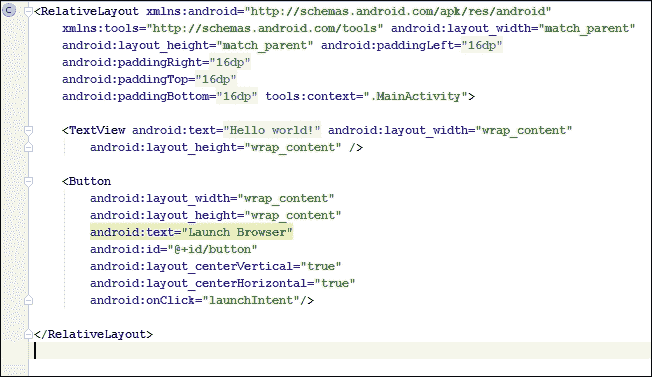
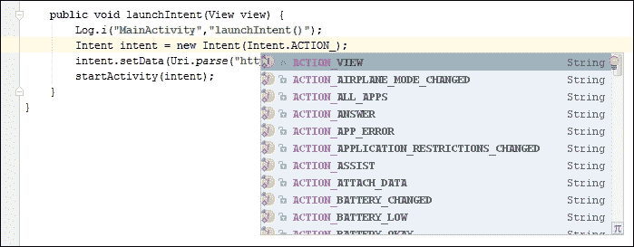
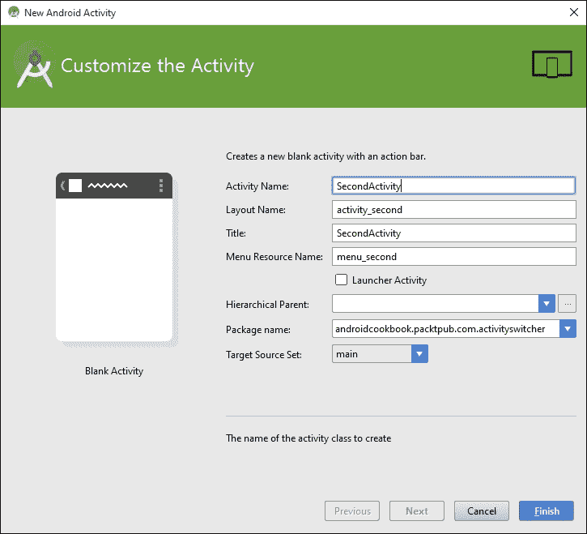
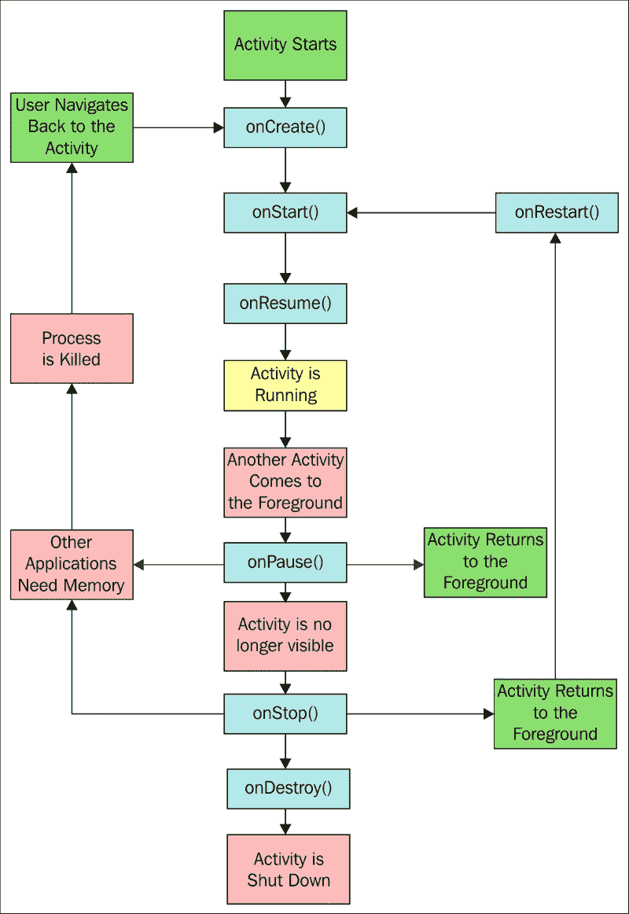

# 第一章。活动

本章涵盖以下配方:

*   宣布一项活动
*   使用意图对象开始新活动
*   在活动之间切换
*   将数据传递给另一个活动
*   返回活动的结果
*   保存活动的状态
*   存储持久活动数据
*   了解活动生命周期

# 简介

安卓软件开发工具包提供了一个强大的工具来编程移动设备，掌握这样一个工具的最好方法是直接跳进来。虽然你可以从头到尾阅读这本书，因为它是一本烹饪书，但它是专门设计来让你跳到特定的任务并立即获得结果的。

**活动** 是大多数安卓应用的基本构件，因为活动类提供了应用和屏幕之间的接口。大多数安卓应用程序将至少有一个活动，如果不是几个(但它们不是必需的)。如果没有用户界面，后台服务应用程序不一定需要活动。

本章解释了如何在应用程序中*声明*和*启动*活动，以及如何通过在它们之间共享数据、从它们请求结果以及从另一个活动中调用一个活动来同时管理几个活动。

本章还简要探讨了 **意向**对象，该对象经常与活动结合使用。意图可用于在您自己的应用程序以及外部应用程序(如安卓操作系统中包含的应用程序)中的活动之间传输数据(一个常见的例子是使用意图来启动默认的网络浏览器)。

### 注

要开始开发安卓应用程序，请前往**安卓工作室**页面下载新的安卓工作室 IDE 和 **安卓软件开发工具包**包:

[http://developer.android.com/sdk/index.html](http://developer.android.com/sdk/index.html)

# 宣布一项活动

活动和其他应用程序组件，如 **服务**，在`AndroidManifest` XML 文件中声明。声明一个活动就是我们如何告诉系统我们的活动以及如何请求它。例如，应用程序通常会指示至少一个活动应该作为桌面图标可见，并作为应用程序的主要入口点。

## 做好准备

安卓工作室是用来开发安卓应用的新工具，取代了现在已经被弃用的 **Eclipse ADT** 解决方案。安卓工作室将用于本书中显示的所有食谱，因此如果您尚未安装，请访问安卓工作室网站(前面已经提供了链接)安装 IDE 和 SDK 捆绑包。

## 怎么做...

对于第一个示例，我们将指导您创建一个新项目。安卓工作室提供了**快速启动**向导，让这个过程变得极其简单。按照以下步骤开始:

1.  启动安卓工作室，弹出**欢迎来到安卓工作室**对话框。
2.  点击**开始新的安卓工作室项目**选项。
3.  输入应用程序名称；对于这个例子，我们使用了`DeclareAnActivity`。点击**下一步**。
4.  在**移动**对话框中，点击**空白活动**按钮，然后点击**下一步**。
5.  在**目标安卓设备**对话框中，选择**安卓 6.0 (API 23)** 作为最小 SDK(对于本例，选择哪个 API 级别真的不重要，因为从 API 级别 1 开始就有活动了，但选择最新版本被认为是最佳实践)。点击**下一步**。
6.  由于我们之前选择了**空白活动**选项，因此会显示**自定义活动**对话框。您可以保留提供的默认值，但请注意默认活动名称为`MainActivity`。点击**完成**。

完成向导后，安卓工作室将创建项目文件。对于这个食谱，我们将检查的两个文件是`MainActivity.java`(对应于步骤 6 中提到的活动名称)和`AndroidManifest.xml`。

如果你看一下`MainActivity.java`文件，你会意识到这是相当基本的。这是因为我们选择了**空白活动**选项(在步骤 4 中)。现在看`AndroidManifest.xml`文件。这是我们实际申报活动的地方。`<application>`元素内是`<activity>`元素:

```java
<activity
    android:name=".MainActivity"
    android:label="@string/app_name">
    <intent-filter>
        <action android:name="android.intent.action.MAIN"/>

        <category android:name="android.intent.category.LAUNCHER"/>
    </intent-filter>
</activity>
```

### 注

在 Android Studio 中查看此`xml`时，您可能会注意到标签元素显示了`strings.xml`资源文件中定义的实际文本。这只是新 IDE 中增强功能的一个小例子。

## 它是如何工作的...

声明一个活动很简单，只需声明`<activity>`元素，并用`android:name`属性指定活动类的名称。通过将`<activity>`元素添加到 **安卓清单**中，我们指定了将该组件包含在我们的应用程序中的意图。清单中未声明的任何活动(或任何其他组件)都不会包含在应用程序中。试图访问或利用未声明的组件将导致在运行时引发异常。

在前面的代码中，还有另一个属性— `android:label`。该属性指示屏幕上显示的标题，以及图标标签(如果这是启动器活动)。

### 注

有关可用应用程序属性的完整列表，请查看以下资源:

[http://developer . Android . com/guide/topics/manifest/activity-element . html](http://developer.android.com/guide/topics/manifest/activity-element.html)

# 用意图对象开始新的活动

安卓应用模型可以看作是一个面向服务的模型，活动作为组件，意图作为它们之间发送的消息。这里，意图用于启动显示用户呼叫日志的活动，但是意图可以用于做许多事情，我们将在本书中遇到它们。

## 做好准备

为了简单起见，我们将使用一个意图对象来启动安卓的一个内置应用程序，而不是创建一个新的应用程序。这只需要一个非常基础的应用，所以用安卓工作室开始一个新的安卓项目，称之为`ActivityStarter`。

## 怎么做...

同样，为了保持示例简单，以便我们可以专注于手头的任务，我们将创建一个函数来显示行动意图，并从活动中的一个按钮调用该函数。

在安卓工作室中创建新项目后，请按照以下步骤操作:

1.  Open the `MainActivity.java` class and add the following function:

    ```java
    public void launchIntent(View view) {
        Intent intent = new Intent(Intent.ACTION_VIEW);
        intent.setData(Uri.parse("https://www.packtpub.com/"));
        startActivity(intent);
    }
    ```

    当您键入此代码时，安卓工作室将在视图和意图上给出此警告:**无法解析符号“意图”**。

    这个意味着您需要将库引用添加到项目中。您可以通过在`import`部分输入以下代码来手动完成:

    ```java
    import android.view.View;

    import android.content.Intent;
    ```

    或者，只需点击文字(红色字体)，点击 *Alt* + *进入*，让安卓工作室为你添加库参考。

2.  Open the `activity_main.xml` file and add the following XML:

    ```java
    <Button
        android:layout_width="wrap_content"
        android:layout_height="wrap_content"
        android:text="Launch Browser"
        android:id="@+id/button"
        android:layout_centerVertical="true"
        android:layout_centerHorizontal="true"
        android:onClick="launchIntent"/>
    ```

    

3.  现在是时间运行应用程序并看到行动中的意图。您需要创建一个安卓模拟器(在安卓工作室中，转到**工具|安卓| AVD 管理器**)或者将一个物理设备连接到您的计算机。
4.  当您按下**启动浏览器**按钮时，您将看到默认的网络浏览器打开，并显示指定的网址。

## 它是如何工作的...

虽然很简单，但这款应用展示了安卓操作系统背后的强大功能。意图对象只是一个消息对象。意图可用于跨应用程序的组件(如服务和广播接收器)以及设备上的其他应用程序进行通信(就像我们在本食谱中所做的那样)。

### 注

要在物理设备上进行测试，您可能需要为您的设备安装驱动程序(驱动程序特定于硬件制造商)。您还需要在设备上启用开发人员模式。启用开发者模式因安卓操作系统版本而异。如果您在设备设置中没有看到“开发者模式”选项，请打开“关于电话”选项，并开始点击“T2”内部号码。三次点击后，你应该会看到一条**吐司**信息告诉你，你正在成为一名开发人员。再按四次将启用该选项。

在这个食谱中，我们通过指定`ACTION_VIEW`作为我们想要做的事情(我们的意图)来创建意图对象。您可能已经注意到，当您键入`Intent`然后输入句号时，Android Studio 提供了一个弹出的可能性列表(这是自动完成功能)，如下所示:



`ACTION_VIEW`与数据中的 URL 一起表示意图是查看网站，因此启动默认浏览器(不同的数据可能会启动不同的应用程序)。在这个例子中，我们的意图仅仅是查看网址，所以我们把这个意图仅仅用称为`startActivity()`方法。根据我们的需要，还有其他方法来调用意图。在*返回活动*配方的结果中，我们将使用`startActivityForResult()`方法。

## 还有更多...

安卓用户下载自己喜欢的应用进行网页浏览、拍照、发短信等非常常见。使用意图，你可以让你的应用程序利用你用户最喜欢的应用程序，而不是试图重新发明所有这些功能。

## 另见

要从菜单选择开始活动，请参考[第 4 章](04.html "Chapter 4. Menus")、*菜单*中的*处理菜单选择*食谱。

# 在活动之间切换

通常我们会想从另一个活动中激活一个活动。虽然这不是一个困难的任务，但它将需要比以前的食谱多一点的设置，因为它需要两个活动。我们将创建两个活动类，并在清单中声明它们。我们还将创建一个按钮，就像我们在前面的食谱中所做的那样，来切换到活动。

## 做好准备

我们将在安卓工作室创建一个新项目，就像我们在以前的食谱中所做的那样，并将这个项目称为`ActivitySwitcher`。安卓工作室将创建第一个活动`ActivityMain`，并在清单中自动声明。

## 怎么做...

1.  Since the Android Studio New Project wizard has already created the first activity, we just need to create the second activity. Open the **ActivitySwitcher** project and navigate to **File** | **New** | **Activity** | **Blank** **Activity**, as shown in this screenshot:

    

2.  In the **Customize the Activity** dialog, you can leave the default **Activity Name** as it is, which is `Main2Activity`, or change it to `SecondActivity`, as shown here:

    

3.  打开`MainActivity.java`文件，增加如下功能:

    ```java
    public void onClickSwitchActivity(View view) {
        Intent intent = new Intent(this, SecondActivity.class);
        startActivity(intent);
    }
    ```

4.  现在，打开位于`\res\layout`文件夹中的`activity_main.xml`文件，并添加以下 XML 来创建按钮:

    ```java
    <Button
        android:id="@+id/button"
        android:layout_width="wrap_content"
        android:layout_height="wrap_content"
        android:layout_centerVertical="true"
        android:layout_centerHorizontal="true"
        android:text="Launch SecondActivity"
        android:onClick="onClickSwitchActivity"/>
    ```

5.  此时，您实际上可以运行代码，并看到第二个活动出现。我们将更进一步，在`SecondActivity`上添加一个按钮来关闭它，这将使我们回到第一个活动。打开`SecondActivity.java`文件，添加此功能:

    ```java
    public void onClickClose(View view) {
        finish();
    }
    ```

6.  最后，在`SecondActivity`布局中增加**关闭**按钮。打开`activity_second.xml`文件，在自动生成的`<TextView>`元素后添加以下`<Button>`元素:

    ```java
    <Button
        android:id="@+id/buttonClose"
        android:layout_width="wrap_content"
        android:layout_height="wrap_content"
        android:text="Close"
        android:layout_centerVertical="true"
        android:layout_centerHorizontal="true"
        android:onClick="onClickClose"/>
    ```

7.  在您的设备或模拟器上运行应用程序，并查看正在运行的按钮。

## 它是如何工作的...

这个练习的真正工作是在第三步的`onClickSwitchActivity()`方法中。这是我们使用`SecondActivity.class`为意图声明第二个活动的地方。我们更进一步，在第二个活动中添加了关闭按钮，以显示一个常见的现实情况——启动一个新的活动，然后关闭它，并返回到最初的调用活动。这个行为是在`onClickClose()`功能中完成的。它所做的只是调用`finish()`，但这告诉系统我们已经完成了活动。Finish 实际上并没有让我们返回到调用活动或任何特定的活动；它只是关闭当前活动，依靠 **回叠**。如果我们想要一个特定的活动，我们可以再次使用意图对象(我们只是在创建意图时更改类名)。

这种活动切换不会产生非常令人兴奋的应用。我们的活动只是演示如何从一个活动切换到另一个活动，这当然会成为我们开发的几乎所有应用程序的一个基本方面。

如果我们手动创建了活动，我们需要将它们添加到清单中。通过使用这些步骤，安卓工作室已经处理好了 XML。要查看安卓工作室做了什么，打开`AndroidManifest.xml`文件，查看`<application>`元素:

```java
<activity
    android:name=".MainActivity"
    android:label="@string/app_name">
    <intent-filter>
        <action android:name="android.intent.action.MAIN"/>
        <category android:name="android.intent.category.LAUNCHER/>
    </intent-filter>
</activity>
<activity
    android:name=".SecondActivity"
    android:label="@string/title_activity_second">
</activity>
```

在前面自动生成的代码中需要注意的一点是第二个活动没有`<intent-filter>`元素。主要活动通常是启动应用程序时的入口点。这就是定义`MAIN`和`LAUNCHER`的原因——这样系统就知道应用程序启动时启动哪个活动。

## 另见

*   要了解有关嵌入按钮等小部件的更多信息，请访问[第 3 章](03.html "Chapter 3. Views, Widgets, and Styles")、*视图、小部件和样式*。

# 将数据传递给另一个活动

意图对象是定义为消息对象的。作为消息对象，它的目的是与应用程序的其他组件进行通信。在这个食谱中，我们将向您展示如何传递信息的意图，以及如何再次获得它。

## 做好准备

这个食谱将从前一个结束的地方继续。我们将这个项目称为`SendData`。

## 怎么做...

因为这个食谱是建立在前一个食谱的基础上，所以大部分工作已经完成了。我们将在主活动中添加一个`EditText`元素，这样我们就有东西可以发送到`SecondActivity`。我们将使用(自动生成的)`TextView`视图来显示消息。以下是完整的步骤:

1.  Open `activity_main.xml`, remove the existing `<TextView>` element, and add the following `<EditText>` element:

    ```java
    <EditText
        android:id="@+id/editTextData"
        android:layout_width="match_parent"
        android:layout_height="wrap_content"/>
    ```

    我们在上一个食谱中创建的`<Button>`元素不会改变。

2.  现在，打开`MainActivity.java`文件，更改`onClickSwitchActivity()`方法如下:

    ```java
    public void onClickSwitchActivity(View view) {
        EditText editText = (EditText)findViewById(R.id.editTextData);
        String text = editText.getText().toString();
        Intent intent = new Intent(this, SecondActivity.class);
        intent.putExtra(Intent.EXTRA_TEXT,text);
        startActivity(intent);
    }
    ```

3.  接下来，打开`activity_second.xml`文件，修改`<TextView>`元素，使其包含 ID 属性:

    ```java
    <TextView
        android:id="@+id/textViewText"
        android:text="@string/hello_world"
        android:layout_width="wrap_content"
        android:layout_height="wrap_content"/>
    ```

4.  最后一个变化是编辑第二个活动来寻找这个新数据，并将其显示在屏幕上。打开`SecondActivity.java`并编辑`onCreate()`如下:

    ```java
    protected void onCreate(Bundle savedInstanceState) {
        super.onCreate(savedInstanceState);
        setContentView(R.layout.activity_second);
        TextView textView = (TextView)findViewById(R.id.textViewText);
        if (getIntent()!=null && getIntent().hasExtra(Intent.EXTRA_TEXT)) {
            textView.setText(getIntent().getStringExtra(Intent.EXTRA_TEXT));
        }
    }
    ```

5.  现在运行项目。在主活动上输入一些文字，按**启动第二个活动**看它发送数据。

## 它是如何工作的...

不出所料，的意图对象正在做所有的工作。我们创建了一个意图，就像在前面的食谱中一样，然后添加了一些额外的数据。你注意到`putExtra()`方法调用了吗？在我们的例子中，我们使用了已经定义的`Intent.EXTRA_TEXT`作为标识符，但是我们不必这样做。我们可以使用我们想要的任何键(如果您熟悉名称/值对，您以前见过这个概念)。

使用名称/值对的关键点在于，您必须使用相同的名称才能将数据取出。这就是为什么我们在用`getStringExtra()`读取额外数据时使用相同的密钥标识符。

第二个活动是根据我们创建的意图启动的，所以这只是一个获取意图并检查随之发送的数据的问题。我们在`onCreate()`中这样做:

```java
textView.setText(getIntent().getStringExtra(Intent.EXTRA_TEXT));
```

## 还有更多...

我们不仅限于发送`String`数据。意图对象非常灵活，并且已经支持基本的数据类型。回到安卓工作室，点击`putExtra`方法。然后按下 *Ctrl* 和*空格键*。安卓工作室将调出自动完成列表，这样你就可以看到你可以存储的不同数据类型。

# 返回活动的结果

能够从一个活动开始另一个活动是很好的，但是我们经常需要知道被调用的活动在它的任务中进展如何，甚至哪个活动被调用了。`startActivityForResult()`方法提供了解决方案。

## 做好准备

从一个活动中返回一个结果与我们刚才在前面的食谱中所称的活动没有太大的不同。你可以使用上一个食谱中的项目，或者开始一个新的项目并将其称为`GettingResults`。无论哪种方式，一旦你有了一个包含两个活动的项目，并且有了调用第二个活动所需的代码，你就可以开始了。

## 怎么做...

获得结果只需要一些改变:

1.  首先打开`MainActivity.java`给类添加以下常量:

    ```java
    public static final String REQUEST_RESULT="REQUEST_RESULT";
    ```

2.  接下来，通过修改`onClickSwitchActivity()`方法来改变调用意图的方式，以期望一个结果:

    ```java
    public void onClickSwitchActivity(View view) {
        EditText editText = (EditText)findViewById(R.id.editTextData);
        String text = editText.getText().toString();
        Intent intent = new Intent(this, SecondActivity.class);
        intent.putExtra(Intent.EXTRA_TEXT,text);
        startActivityForResult(intent,1);
    }
    ```

3.  然后，添加这个新方法来接收结果:

    ```java
    @Override
    protected void onActivityResult(int requestCode, int resultCode, Intent data) {
        super.onActivityResult(requestCode, resultCode, data);
        if (resultCode==RESULT_OK) {
            Toast.makeText(this, Integer.toString(data.getIntExtra(REQUEST_RESULT, 0)), Toast.LENGTH_LONG).show();
        }
    }
    ```

4.  最后，在`SecondActivity.java`中修改`onClickClose`设置返回值如下:

    ```java
    public void onClickClose(View view) {
        Intent returnIntent = new Intent();
        returnIntent.putExtra(MainActivity.REQUEST_RESULT,42);
        setResult(RESULT_OK, returnIntent);
        finish();
    }
    ```

## 它是如何工作的...

如你所见，拿回结果相对简单。我们只是用`startActivityForResult`来称呼意图，所以它知道我们想要一个结果。我们设置`onActivityResult()`回调处理程序来接收结果。最后，我们确保第二个活动在结束活动之前返回一个带有`setResult()`的结果。在这个例子中，我们只是用一个静态值设置一个结果。我们只是展示我们收到的东西来展示这个概念。

检查结果代码以确保用户没有取消操作是一个很好的做法。从技术上讲，它是一个整数，但系统将其用作布尔值。检查`RESULT_OK`或`RESULT_CANCEL`并进行相应操作。在我们的例子中，第二个活动没有取消按钮，所以为什么要费心检查呢？如果用户点击后退按钮怎么办？系统将结果代码设置为`RESULT_CANCEL`，意图设置为空，这将导致我们的代码抛出异常。

我们使用了 **Toast** 对象，这是一个方便的弹出**消息** ，可以用来不引人注目地通知用户。它还可以作为一种方便的调试方法，因为它不需要特殊的布局或屏幕空间。

## 还有更多...

除了结果代码，`onActivityResults()`还包括一个 **请求代码**。你想知道这是从哪里来的吗？它只是通过`startActivityForResult()`调用传递的整数值，其形式如下:

```java
startActivityForResult(Intent intent, int requestCode);
```

我们没有检查请求代码，因为我们知道我们只有一个结果要处理——但是在有几个活动的琐碎应用程序中，这个值可以用来识别请求的来源。

### 类型

如果用否定的请求代码调用`startActivityForResult()`，它的行为将完全像调用`startActivity()`一样——也就是说，它不会返回结果。

## 另见

*   要了解更多关于创建新活动类的信息，请参考*在活动间切换*食谱
*   有关祝酒的更多信息，请查看[第 7 章](07.html "Chapter 7. Alerts and Notifications")、*提醒和通知*中的*制作祝酒食谱*

# 保存活动状态

移动环境非常动态，用户更换任务的频率远高于桌面。由于移动设备上的资源通常较少，您的应用程序可能会在某个时候被中断。也很有可能系统会完全关闭你的应用，给手头的任务额外的资源。这是手机的本质。

用户可能会开始在你的应用程序中键入一些东西，被电话打断，或者切换到另一个应用程序发送短信，当他们回到你的应用程序时，系统可能已经完全关闭以释放内存。为了提供最佳的用户体验，您需要预期这样的行为，并使您的用户更容易从他们停止的地方继续。好消息是，安卓操作系统通过提供回调来通知你的应用程序状态的变化，使得这变得更加容易。

### 注

只需旋转设备，操作系统就会破坏并重新创建您的活动。这可能看起来有点沉重，但这样做是有充分理由的——肖像和风景有不同的布局是很常见的，所以这可以确保你的应用程序使用正确的资源。

在本食谱中，您将看到如何处理`onSaveInstanceState()`和`onRestoreInstanceState()`回调来保存应用程序的状态。我们将通过创建一个计数器变量来演示这一点，并在每次按下**计数**按钮时递增该变量。我们还将有一个`EditText`和一个`TextView`小部件来查看它们的默认行为。

## 做好准备

在安卓工作室新建一个项目，命名为`StateSaver`。我们只需要一个活动，所以自动生成的主活动就足够了。但是，我们需要一些小部件，包括`EditText`、`Button`和`TextView`。他们的布局(在`activity_main.xml`中)会是这样的:

```java
<EditText
    android:id="@+id/editText"
    android:layout_width="match_parent"
    android:layout_height="wrap_content"
    android:layout_alignParentTop="true"
    android:layout_alignParentStart="true"/>

<Button
    android:id="@+id/button"
    android:layout_width="wrap_content"
    android:layout_height="wrap_content"
    android:layout_centerInParent="true"
    android:text="Count"
    android:onClick="onClickCounter"/>

<TextView
    android:id="@+id/textViewCounter"
    android:layout_width="wrap_content"
    android:layout_height="wrap_content"
    android:layout_below="@id/button"/>
```

## 怎么做...

执行以下一组步骤:

1.  为了跟踪计数器，我们需要向项目中添加一个全局变量，以及一个用于保存和恢复的键。将以下代码添加到`MainActivity.java`类中:

    ```java
    static final String KEY_COUNTER = "COUNTER";
    private int mCounter=0;
    ```

2.  然后添加处理按钮按压所需的代码；它递增计数器并在`TextView`小部件中显示结果:

    ```java
    public void onClickCounter(View view) {
        mCounter++;
        ((TextView)findViewById(R.id.textViewCounter)).setText("Counter: " + Integer.toString(mCounter));
    }
    ```

3.  要接收应用程序状态更改的通知，我们需要向应用程序添加`onSaveInstanceState()`和 `onRestoreInstanceState()`方法。打开`MainActivity.java`并添加以下内容:

    ```java
    @Override
    protected void onSaveInstanceState(Bundle outState) {
        super.onSaveInstanceState(outState);
        outState.putInt(KEY_COUNTER,mCounter);
    }

    @Override
    protected void onRestoreInstanceState(Bundle savedInstanceState) {
        super.onRestoreInstanceState(savedInstanceState);
        mCounter=savedInstanceState.getInt(KEY_COUNTER);
    }
    ```

4.  运行程序，尝试改变方向，看看它的行为(如果你使用模拟器， *Ctrl* + *F11* 将旋转设备)。

## 它是如何工作的...

所有的活动在一生中都要经历多个状态。通过设置回调来处理事件，我们可以让代码在活动被破坏之前保存重要信息。

步骤 3 是实际保存和恢复的地方。系统向方法发送一个**包**(也使用名称/值对的数据对象)。我们使用`onSaveInstanceState()`回调保存数据，并在`onRestoreInstanceState()`回调中将其拉出。

但是等等！在旋转设备之前，您是否尝试在`EditText`视图中键入文本？如果是这样，您会注意到文本也被恢复了，但是我们没有任何代码来处理该视图。默认情况下，系统会自动保存状态，前提是它有一个唯一的 ID(不是所有的视图都会自动保存它们的状态，比如`TextView`，但是如果我们愿意，我们可以手动保存)。

### 类型

请注意，如果您希望安卓自动保存和恢复视图的状态，它必须有一个唯一的标识(在布局中用`android:id=`属性指定)。当心；并非所有视图类型都会自动保存和恢复视图状态。

## 还有更多...

`onRestoreInstanceState()`回调不是唯一可以恢复状态的地方。看`onCreate()`的签名:

```java
onCreate(Bundle savedInstanceState)

```

两种方法都接收到相同的名为`savedInstanceState`的`Bundle`实例。您可以将恢复代码移动到`onCreate()`方法，它将同样有效。但是一个问题是，如果没有数据，例如在活动的初始创建期间，那么`savedInstanceState`包将为空。如果您想从`onRestoreInstanceState()`回调移动代码，只需检查以确保数据不为空，如下所示:

```java
if (savedInstanceState!=null) {
    mCounter = savedInstanceState.getInt(KEY_COUNTER);
}
```

## 另见

*   *存储持久活动数据*配方将引入持久存储。
*   查看[第 6 章](06.html "Chapter 6. Working with Data")、*使用数据*，了解更多安卓活动示例。
*   *了解活动生命周期*食谱解释了安卓活动生命周期。

# 存储持久活动数据

能够临时存储关于我们活动的信息是非常有用的，但是更多时候，我们希望我们的应用程序能够跨多个会话记住信息。

安卓支持 SQLite，但对于简单的数据，比如用户名或高分，这可能是一个很大的开销。幸运的是，安卓也为这些场景提供了一个轻量级的选项，有`SharedPreferences`。

## 做好准备

你可以使用上一个食谱中的项目，也可以开始一个新的项目并将其称为`PersistentData`(在现实世界的应用程序中，你很可能两者都要做)。在上一个食谱中，我们将`mCounter`保存在会话状态。在这个食谱中，我们将增加一个新的方法来处理`onPause()`并将`mCounter`保存到`SharedPreferences`。我们将在`onCreate()`中恢复该值。

## 怎么做...

我们只有两个的改动，都在`MainActivity.java`里面:

1.  增加以下`onPause()`方式，在活动结束前保存数据:

    ```java
    @Override
    protected void onPause() {
        super.onPause();

        SharedPreferences settings = getPreferences(MODE_PRIVATE);
        SharedPreferences.Editor editor = settings.edit();
        editor.putInt(KEY_COUNTER, mCounter);
        editor.commit();
    }
    ```

2.  然后在`onCreate()`末尾添加以下代码恢复计数器:

    ```java
    SharedPreferences settings = getPreferences(MODE_PRIVATE);

    int defaultCounter = 0;
    mCounter = settings.getInt(KEY_COUNTER, defaultCounter);
    ```

3.  运行该程序并进行测试。

## 它是如何工作的...

如您所见，这与保存状态数据非常相似，因为它也使用名称/值对。这里，我们只是存储了一个`int`，但是我们也可以轻松地存储其他原始数据类型之一。每个数据类型都有等效的获取器和设置器，例如`SharedPreferences.getBoolean()`或`SharedPreferences.setString()`。

保存我们的数据需要`SharedPreferences.Editor`的服务。这被`edit()`唤起，接受`remove()`和`clear()`程序以及`putInt()`等设定者。请注意，我们必须用`commit()`语句来结束我们在这里所做的任何存储。

## 还有更多...

`getPreferences()`存取器还有一个稍微复杂一点的变体:`getSharedPreferences()`。它可以用来存储多个偏好设置。

### 使用多个首选项文件

使用`getSharedPreferences()`与使用其对应的没有什么不同，但是它允许多个偏好文件。它采用以下形式:

```java
getSharedPreferences(String name, int mode)
```

这里，`name`是文件。`mode` 可以是`MODE_PRIVATE``MODE_WORLD_READABLE`或`MODE_WORLD_WRITABLE`，描述文件的访问级别。

## 另见

*   [第 6 章](06.html "Chapter 6. Working with Data")、*处理数据*，了解更多数据存储示例

# 了解活动生命周期

安卓操作系统是一个危险的活动场所。电池供电平台对资源的需求是由系统无情管理的。当内存不足时，我们的活动可以从内存中被转储，甚至不需要片刻的注意，也不需要包含任何数据。因此，理解活动生命周期至关重要。

下图显示了活动在其生命周期中经历的阶段:



除了阶段，图表还显示了可以被覆盖的方法。正如您所看到的，我们已经在前面的食谱中使用了大多数这些方法。希望，了解全局会有助于你的理解。

## 做好准备

在安卓工作室用**空白活动**创建一个新项目，称之为`ActivityLifecycle`。我们将使用(自动生成的)`TextView`方法来显示状态信息。

## 怎么做...

为了查看应用程序在各个阶段的运行情况，我们将为所有阶段创建方法:

1.  打开`activity_main.xml`并给自动生成的`TextView`添加一个 ID:

    ```java
    android:id="@+id/textViewState"
    ```

2.  剩余步骤将在`MainActivity.java`中。增加如下全局申报:

    ```java
    private TextView mTextViewState;
    ```

3.  修改`onCreate()`方法保存`TextView`并设置初始文本:

    ```java
    mTextViewState = (TextView)findViewById(R.id.textViewState);
    mTextViewState.setText("onCreate()\n");
    ```

4.  添加以下方法来处理剩余事件:

    ```java
    @Override
    protected void onStart() {
        super.onStart();
        mTextViewState.append("onStart()\n");
    }

    @Override
    protected void onResume() {
        super.onResume();
        mTextViewState.append("onResume()\n");
    }

    @Override
    protected void onPause() {
        super.onPause();
        mTextViewState.append("onPause()\n");
    }

    @Override
    protected void onStop() {
        super.onStop();
        mTextViewState.append("onStop()\n");
    }

    @Override
    protected void onRestart() {
        super.onRestart();
        mTextViewState.append("onRestart()\n");
    }

    @Override
    protected void onDestroy() {
        super.onDestroy();
        mTextViewState.append("onDestroy()\n");
    }
    ```

5.  运行应用程序，观察按下后退和主页键中断活动时会发生什么。尝试其他操作，如任务切换，看看它们如何影响您的应用程序。

## 它是如何工作的...

我们的活动可以存在于这三种状态之一:**活动**、**暂停**或**停止**。那里也是第四种状态，**消灭了**，但是我们可以放心地忽略它:

*   当一个活动的界面可供用户使用时，该活动处于`active`状态。它从`onResume()`一直持续到`onPause()`，这是当另一个活动出现在前台时带来的。如果这个新活动没有完全掩盖我们的活动，那么我们的活动将保持在`paused`状态，直到新活动完成或被取消。然后它将立即呼叫`onResume()`并继续。
*   当一个新开始的活动填满屏幕或使我们的活动不可见时，那么我们的活动将进入`stopped`状态，并且恢复将总是调用`onRestart()`。
*   当活动处于`paused`或`stopped`状态时，当内存不足或其他应用程序需要时，操作系统可以(并将)将其从内存中移除。
*   值得注意的是，我们从来没有真正看到`onDestroy()`方法的结果，因为活动被这个点移除了。如果您想进一步探索这些方法，那么在执行`onDestroy()`之前，非常值得使用`Activity.isFinishing()`来查看活动是否真的结束了，如下面的片段所示:

    ```java
    @Override
      public void onPause() {
      super.onPause();
      mTextView.append("onPause()\n ");
      if (isFinishing()){
        mTextView.append(" ... finishing");
      }
    }
    ```

### 类型

当实现这些方法时，总是在做任何工作之前调用超类。

## 还有更多...

### 关闭活动

要关闭一个活动，直接调用其`finish()`方法，该方法又调用`onDestroy()`。要在子活动中执行相同的动作，请使用`finishFromChild(Activity child)`，其中`child`是调用子活动。

知道一个活动是被关闭还是仅仅被暂停通常是有用的，并且`isFinishing(boolean)`方法返回一个值，该值指示该活动处于这两种状态中的哪一种。