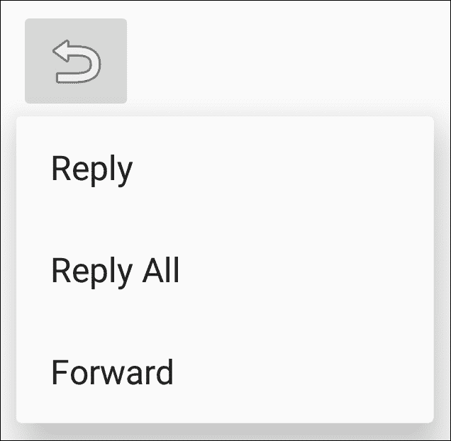

# 第四章。菜单

在本章中，我们将涵盖以下主题:

*   创建选项菜单
*   运行时修改菜单和菜单项
*   为视图启用上下文操作模式
*   在列表视图中使用上下文批处理模式
*   创建弹出式菜单

# 简介

安卓操作系统是一个不断变化的环境。最早的安卓设备(安卓 3.0 之前)需要有一个硬件菜单按钮。虽然不再需要硬件按钮，但菜单也同样重要。事实上，**菜单** API 已经扩展到现在支持三种不同类型的菜单:

*   **选项菜单和动作栏**:这是标准菜单，用于应用的全局选项。将此用于附加功能，如搜索、设置等。
*   **上下文** **模式** ( **上下文动作模式**):此为一般长按激活。(可以把这想象成在桌面上单击鼠标右键。)这用于对按下的项目执行操作，例如回复电子邮件或删除文件。
*   **弹出** **菜单**:这个为一个附加动作提供了一个弹出选择(像旋转器一样)。菜单选项并不意味着影响按下的项目，而是使用上下文模式，如前所述。一个例子是点击分享按钮，获得一个额外的股票期权列表。

菜单资源与其他 Android UI 组件类似；它们通常是用 XML 创建的，但是也可以用代码创建。我们的第一个食谱，如下节所示，将显示 XML 菜单格式以及如何膨胀它。

# 创建选项菜单

在我们实际创建和显示一个菜单之前，让我们看一个菜单来看看最终的结果。以下是显示 Chrome 菜单部分的截图:


需要注意的最明显的特征是，菜单将根据屏幕大小而有所不同。默认情况下，菜单项将被添加到溢出菜单中，这是您按下最右边三个点时看到的菜单。

菜单通常使用`XML`在资源文件中创建(像许多其他安卓资源一样)，但是它们存储在`res/menu`目录中，尽管它们也可以用代码创建。要创建菜单资源，使用`<menu>`元素，如图所示:

```java
<menu xmlns:android="http://schemas.android.com/apk/res/android">
</menu>
```

`<item>`元素定义了每个单独的菜单项，并包含在`<menu>`元素中。基本菜单项如下所示:

```java
<item 
    android:id="@+id/settings"
    android:title="@string/settings" />
```

最常见的`<item>`属性如下:

*   `id`:这是标准的资源标识
*   `title`:表示要显示的文本
*   `icon`:这是一个可抽取的资源
*   `showAsAction`:这个已经解释如下了(*见下一段*
*   `enabled`:默认启用

让我们更详细地看看`showAsAction`。

`showAsAction`属性控制菜单项的显示方式。选项包括以下内容:

*   `ifRoom`:如果有足够的空间，这个菜单项应该包含在动作栏中
*   `withText`:这表示标题和图标都要显示
*   `never`:这表示菜单项永远不应该包含在动作栏中；总是显示在溢出菜单中
*   `always`: This indicates that the menu item should be always included in the Action Bar (use sparingly as space is limited)

    ### 注

    可以使用管道(|)分隔符组合多个选项，如`showAsAction="ifRoom|withText"`。

介绍了菜单资源的基础知识，我们现在准备创建一个标准的选项菜单并对其进行扩展。

## 做好准备

使用安卓工作室创建一个名为`OptionsMenu`的新项目。当提示输入活动类型时，使用默认的**电话&平板电脑**选项并选择**空活动**选项。由于向导默认不创建`res/menu`文件夹，请导航至**文件** | **新建|目录**创建文件夹，然后继续。

## 怎么做...

按照上一节所述创建新项目后，就可以创建菜单了。然而，首先，我们将为菜单标题向`strings.xml`文件添加一个字符串资源。当我们为菜单创建 XML 时，我们将使用新的字符串作为菜单标题。以下是步骤:

1.  首先打开`strings.xml`文件，将以下`<string>`元素添加到`<resources>`元素中:

    ```java
    <string name="menu_settings">Settings</string>
    ```

2.  在`res/menu`目录下新建一个文件，称之为`menu_main.xml`。
3.  打开`menu_main.xml`文件，添加以下 XML 定义菜单:

    ```java
    <?xml version="1.0" encoding="utf-8"?>
    <menu
        xmlns:android="http://schemas.android.com/apk/res/android"
        xmlns:app="http://schemas.android.com/apk/res-auto">
        <item android:id="@+id/menu_settings"
            android:title="@string/menu_settings"
            app:showAsAction="never">
        </item>
    </menu>
    ```

4.  有了现在创建的菜单，我们只需要覆盖`ActivityMain.java`中的`onCreateOptionsMenu()`方法来膨胀菜单:

    ```java
    @Override
    public boolean onCreateOptionsMenu(Menu menu) {
        getMenuInflater().inflate(R.menu.menu_main, menu);
        return true;
    }
    ```

5.  在设备或模拟器上运行程序，查看操作栏中的菜单。

## 它是如何工作的...

这里有两个基本步骤:

1.  用 XML 定义菜单。
2.  创建活动时扩大菜单。

作为一种良好的编程习惯，我们在`strings.xml`文件中定义字符串，而不是在`XML`中硬编码。然后，我们在步骤 3 中使用标准的安卓字符串标识符来设置菜单的标题。由于这是一个“设置”菜单项，我们不希望它显示在操作栏中。要确保它永远不会显示，请使用`showAsAction="never"`。

定义好菜单后，我们将在步骤 4 中使用菜单充气器在活动创建过程中加载菜单。注意`R.menu.menu_main`菜单资源语法？这就是为什么我们在`res/menu`目录中创建了 XML 这样系统就会知道这是一个菜单资源。

在第四步中，我们使用了`app:showAsAction`而不是安卓:`android:showAsAction`。这是因为我们正在使用`AppCompat`库(也称为安卓支持库)。默认情况下，Android Studio 新项目向导会在项目中包含支持库。

## 还有更多...

如果您在步骤 5 中运行程序，那么当您按下菜单溢出按钮时，您一定看到了**设置**菜单项。但仅此而已。其他什么都没发生。显然，如果应用程序不响应菜单项，菜单项就不是很有用。通过`onOptionsItemSelected()`回拨完成对**选项**菜单的响应。

将以下方法添加到应用程序中，以便在选择“设置”菜单时查看吐司:

```java
@Override
public boolean onOptionsItemSelected(MenuItem item) {
    if (item.getItemId() == R.id.menu_settings) {
        Toast.makeText(this, "Settings", Toast.LENGTH_LONG).show();
    } else {
        return super.onContextItemSelected(item);
    }
    return true;
}
```

就这样。你现在有一个工作菜单！

### 类型

如前例所示，处理完回调后返回`true`；否则，调用超级类，如`else`语句所示。

### 使用菜单项启动活动

在这个例子中，我们展示了一个吐司，这样我们就可以看到一个工作示例；然而，如果需要的话，我们可以同样轻松地启动一项新活动。如您在*中所做的，使用[第 1 章](01.html "Chapter 1. Activities")、*活动*的意图对象*配方开始一个新活动，创建一个意图并用`startActivity()`调用它。

### 创建子菜单

**子菜单** 的创建和访问方式与其他菜单元素几乎完全相同，并且可以放置在任何提供的菜单中，尽管它们不能放置在其他子菜单中。要定义子菜单，请在`<item>`元素中包含一个`<menu>`元素。这是这个配方的 XML 表单，添加了两个子菜单项:

```java
<?xml version="1.0" encoding="utf-8"?>
<menu
    xmlns:android="http://schemas.android.com/apk/res/android"
    xmlns:app="http://schemas.android.com/apk/res-auto">
    <item android:id="@+id/menu_settings
        android:title="@string/menu_settings"
        app:showAsAction="never">
        <menu>
            <item android:id="@+id/menu_sub1"
                android:title="Storage Settings" />
            <item android:id="@+id/menu_sub2"
                android:title="Screen Settings" />
        </menu>
    </item>
</menu>
```

### 菜单项分组

安卓支持的另一个菜单功能是菜单项分组。Android 为群组提供了几种方法，包括以下几种:

*   `setGroupVisible()`:显示或隐藏所有项目
*   `setGroupEnabled()`:启用或禁用所有项目
*   `setGroupCheckable()`:设置可检查行为

### 类型

安卓会将所有带有`showAsAction="ifRoom"`的分组项目放在一起。这意味着带有`showAsAction="ifRoom"` 的组中的所有项目都将在动作栏中，或者所有项目都将在溢出区中。

要创建一个组，将`<item>`菜单元素添加到`<group>`元素中。下面是一个使用菜单 XML 的例子，该菜单来自一个组中的两个附加项目:

```java
<?xml version="1.0" encoding="utf-8"?>
<menu
    xmlns:android="http://schemas.android.com/apk/res/android"
    xmlns:app="http://schemas.android.com/apk/res-auto">

    <group android:id="@+id/group_one" >
        <item android:id="@+id/menu_item1"
            android:title="Item 1"
            app:showAsAction="ifRoom"/>
        <item android:id="@+id/menu_item2"
            android:title="Item 2"
            app:showAsAction="ifRoom"/>
    </group>
    <item android:id="@+id/menu_settings"
        android:title="@string/menu_settings"
        app:showAsAction="never"/>
</menu>
```

## 另见

*   有关菜单的完整详细信息，请访问安卓开发者菜单资源网站，网址为

# 运行时修改菜单和菜单项

虽然它已经被多次声明，但是用 XML 而不是用 Java 创建用户界面被认为是“最好的”编程实践。仍然有可能需要用代码来完成。如果您希望菜单项基于某些外部标准可见(或启用)，这一点尤其正确。菜单也可以包含在资源文件夹中，但是有时需要代码来执行逻辑。一个例子可能是，如果你想提供一个上传菜单项，只有当用户登录到你的应用程序。

在这个食谱中，我们将只通过代码来创建和修改菜单。

## 做好准备

在安卓工作室创建一个新项目，并使用默认的**手机&平板电脑**选项调用它`RuntimeMenu`。当提示添加活动时，选择**清空活动**选项。由于我们将完全在代码中创建和修改菜单，因此我们不需要创建`res/menu`目录。

## 怎么做...

首先，我们将为菜单项添加字符串资源，并添加一个按钮来切换菜单可见性。打开`res/strings.xml`文件，按照以下步骤操作:

1.  将以下两个字符串添加到现有的`<resources>`元素中:

    ```java
    <string name="menu_download">Download</string>
    <string name="menu_settings">Settings</string>
    ```

2.  在`activity_main.xml`上增加一个按钮，将`onClick()`设置为`toggleMenu`，如下图:

    ```java
    <Button
        android:id="@+id/buttonToggleMenu"
        android:layout_width="wrap_content"
        android:layout_height="wrap_content"
        android:text="Toggle Menu"
        android:layout_centerVertical="true"
        android:layout_centerHorizontal="true"
        android:onClick="toggleMenu"/>
    ```

3.  打开`ActivityMain.java`，在类声明的正下方添加以下三行代码:

    ```java
    private final int MENU_DOWNLOAD = 1;
    private final int MENU_SETTINGS = 2;
    private boolean showDownloadMenu = false;
    ```

4.  为要调用的按钮添加以下方法:

    ```java
    public void toggleMenu(View view) {
        showDownloadMenu=!showDownloadMenu;
    }
    ```

5.  首次创建活动时，安卓调用`onCreateOptionsMenu()`创建菜单。下面是动态构建菜单的代码:

    ```java
    @Override
    public boolean onCreateOptionsMenu(Menu menu) {
        menu.add(0, MENU_DOWNLOAD, 0, R.string.menu_download);
        menu.add(0, MENU_SETTINGS, 0, R.string.menu_settings);
        return true;
    }
    ```

6.  为了最好的编程练习，不要使用`onCreateOptionsMenu()`来更新或更改您的菜单；相反，使用`onPrepareOptionsMenu()`。下面是根据我们的旗帜更改**下载**菜单项可见性的代码:

    ```java
    @Override
    public boolean onPrepareOptionsMenu(Menu menu) {
        MenuItem menuItem = menu.findItem(MENU_DOWNLOAD);
        menuItem.setVisible(showDownloadMenu);
        return true;
    }
    ```

7.  虽然这个食谱在技术上没有要求，但是这个`onOptionsItemSelected()`代码显示了如何响应每个菜单项:

    ```java
    @Override
    public boolean onOptionsItemSelected(MenuItem item) {
        switch (item.getItemId()) {
            case MENU_DOWNLOAD:
                Toast.makeText(this, R.string.menu_download, Toast.LENGTH_LONG).show();
                break;
            case MENU_SETTINGS:
                Toast.makeText(this, R.string.menu_settings, Toast.LENGTH_LONG).show();
                break;
            default:
                return super.onContextItemSelected(item);
        }
        return true;
    }
    ```

8.  在设备或模拟器上运行程序，查看菜单变化。

## 它是如何工作的...

我们为`onCreateOptionsMenu()`创建了一个覆盖，就像我们在之前的食谱*中所做的那样，创建一个选项菜单*。但是我们没有膨胀现有的菜单资源，而是使用`Menu.add()`方法创建了菜单。由于我们希望稍后修改菜单项以及响应菜单项事件，因此我们定义了自己的菜单标识，并将它们传递给`add()`方法。

对所有菜单项调用`onOptionsItemSelected()`，因此我们获得菜单 ID，并使用基于我们创建的 ID 的`switch`语句。如果我们正在处理菜单事件，我们返回`true`，否则我们将事件传递给超级类。

改变菜单发生在`onPrepareOptionsMenu()`方法中。为了模拟外部事件，我们创建了一个按钮来切换布尔标志。**下载**菜单的可见性由旗帜决定。这是您希望基于您设置的任何标准创建自定义代码的地方。你的标志可以用当前的玩家等级来设置，也可以在新等级准备发布时设置；您发送一条“推送”消息，这将启用菜单项。

## 还有更多...

如果我们希望这个**下载**选项容易被注意到，以表明它是否可用，会怎么样？我们可以通过在`onPrepareOptionsMenu()`(返回语句之前)中添加以下代码来告诉安卓我们想要操作栏中的菜单:

```java
menuItem.setShowAsAction(MenuItem.SHOW_AS_ACTION_ALWAYS);
```

现在如果你运行代码，你会在动作栏看到**下载**菜单项，但是行为不正确。

之前我们在动作栏没有菜单项的时候，安卓每次打开溢出菜单都会调用`onPrepareOptionsMenu()`，所以可见性总是更新的。要纠正此行为，请向按钮调用的`toggleMenu()`方法添加以下代码行:

```java
invalidateOptionsMenu();
```

`invalidateOptionsMenu()`调用告诉安卓我们的选项菜单不再有效，这就迫使我们调用`onPrepareOptionsMenu()`给出我们期望的行为。

### 注

如果一个菜单项显示在操作栏中，安卓会认为该菜单始终是打开的。

# 启用视图的上下文动作模式

上下文菜单提供了与特定视图相关的附加选项，与在桌面上右键单击的概念相同。安卓目前支持两种不同的方法:浮动上下文菜单和上下文模式。安卓 3.0 引入了上下文动作模式。旧的浮动上下文菜单可能会导致混乱，因为没有当前选定项目的指示，并且它不支持对多个项目的操作，例如在一个操作中选择多个要删除的电子邮件。

## 创建浮动上下文菜单

如果需要使用老风格的上下文菜单，比如支持 preAndroid 3.0 设备，和 Option Menu API 很像，只是方法名称不同。要创建菜单，请使用`onCreateContextMenu()`代替`onCreateOptionsMenu()`。要处理菜单项选择，请使用`onContextItemSelected()`代替`onOptionsItemSelected()`。最后，调用`registerForContextMenu()`让系统知道您想要视图的上下文菜单事件。

因为上下文模式被认为是显示上下文选项的首选方式，所以这个方法将集中在更新的应用编程接口上。上下文模式提供了与浮动上下文菜单相同的功能，但也通过在使用批处理模式时允许多项选择来添加附加功能。

该方法将演示单个视图的上下文模式设置。一旦激活，长按**上下文动作栏** ( **驾驶室** ) 将取代动作栏，直到上下文模式结束。

### 注

上下文操作栏与操作栏不同，您的活动不需要包含操作栏。

## 做好准备

使用安卓工作室创建一个新项目，并将其称为`ContextualMode`。当提示添加活动时，使用默认的**电话&平板电脑**选项并选择**空活动**。创建一个菜单目录(`res/menu`)，就像我们在第一个食谱中所做的那样，*创建一个选项菜单*，以存储上下文菜单的 XML。

## 怎么做...

我们将创建一个**图像视图** 作为初始化上下文模式的主视图。由于上下文模式通常由长按触发，我们将在`onCreate()`中为`ImageView`设置长按监听器。当被调用时，我们将启动上下文模式并传递一个`ActionMode`回调来处理上下文模式事件。以下是步骤:

1.  我们将从增加两个新的字符串资源开始。打开`strings.xml`文件，添加如下:

    ```java
    <string name="menu_cast">Cast</string>
    <string name="menu_print">Print</string>
    ```

2.  创建好字符串后，我们现在可以通过使用以下 XML 在`res/menu`中创建新的名为`context_menu.xml`的文件来创建菜单:

    ```java
    <?xml version="1.0" encoding="utf-8"?>
    <menu
        xmlns:android="http://schemas.android.com/apk/res/android"
        xmlns:app="http://schemas.android.com/apk/res-auto">
    <item android:id="@+id/menu_cast"
        android:title="@string/menu_cast" />
    <item android:id="@+id/menu_print"
        android:title="@string/menu_print" /> </menu>
    ```

3.  现在在`activity_main.xml`上添加一个`ImageView`作为启动上下文模式的来源。这是图像视图的 XML:

    ```java
    <ImageView
        android:id="@+id/imageView"
        android:layout_width="wrap_content"
        android:layout_height="wrap_content"
        android:layout_centerVertical="true"
        android:layout_centerHorizontal="true"
        android:src="@mipmap/ic_launcher"/>
    ```

4.  现在用户界面已经设置好了，我们可以添加上下文模式的代码。首先，我们需要一个全局变量来存储调用`startActionMode()`时返回的`ActionMode`实例。将下面一行代码添加到类构造器下面的`MainActivity.java`:

    ```java
    ActionMode mActionMode;
    ```

5.  接下来，创建一个`ActionMode`回调传递给`startActionMode().`将以下代码添加到上一步代码下面的`MainActivity`类中:

    ```java
    private ActionMode.Callback mActionModeCallback = new ActionMode.Callback() {
        @Override
        public boolean onCreateActionMode(ActionMode mode, Menu menu) {
            mode.getMenuInflater().inflate(R.menu.context_menu, menu);
            return true;
        }
        @Override
        public boolean onPrepareActionMode(ActionMode mode, Menu menu) {
            return false;
        }
        @Override
        public boolean onActionItemClicked(ActionMode mode, MenuItem item) {
            switch (item.getItemId()) {
                case R.id. menu_cast:
                    Toast.makeText(MainActivity.this, "Cast", Toast.LENGTH_SHORT).show();
                    mode.finish();
                    return true;
                case R.id. menu_print:
                    Toast.makeText(MainActivity.this, "Print", Toast.LENGTH_SHORT).show();
                    mode.finish();
                    return true;
                default:
                    return false;
            }
        }
        @Override
        public void onDestroyActionMode(ActionMode mode) {
            mActionMode = null;
        }
    };
    ```

6.  创建`ActionMode`回调后，我们只需调用`startActionMode()`即可开始上下文模式。在`onCreate()`方法中添加以下代码来设置长点击监听器:

    ```java
    ImageView imageView = (ImageView)findViewById(R.id.imageView);
    imageView.setOnLongClickListener(new View.OnLongClickListener() {
        public boolean onLongClick(View view) {
            if (mActionMode != null) return false;
            mActionMode = startActionMode(mActionModeCallback);
            return true;
        }
    });
    ```

7.  在设备或模拟器上运行程序，查看正在运行的 CAB。

## 它是如何工作的...

正如您在步骤 2 中看到的，我们已经使用了与其他菜单相同的菜单 XML 来定义上下文菜单。

要理解的主要代码是`ActionMode`回调。这是我们处理上下文模式事件的地方:初始化菜单、处理菜单项选择和清理。在长按事件中，我们通过传入在步骤 5 中创建的`ActionMode`回调来调用`startActionMode()`来启动上下文模式。

当动作模式被触发时，系统调用`onCreateActionMode()`回调，该回调膨胀菜单并将其显示在上下文动作栏中。用户可以通过按下后退箭头或后退键来关闭上下文操作栏。当用户进行菜单选择时，CAB 也会消失。我们展示了一个吐司来给出这个食谱的视觉反馈，但是这是你实现你的功能的地方。

## 还有更多...

在这个例子中，我们存储从`startActionMode()`调用返回的`ActionMode`。我们使用它来防止在动作模式已经激活时创建新实例。我们还可以使用此实例对上下文操作栏本身进行更改，例如用以下内容更改标题:

```java
mActionMode.setTitle("New Title");
```

这在处理多个项目选择时特别有用，我们将在下一个食谱中看到。

## 另见

*   参见下一个配方*，使用带有列表视图的上下文批处理模式*，处理多个项目选择

# 在列表视图中使用上下文批处理模式

如前配方中所述，上下文模式支持两种使用形式:单视图模式(如图所示)和多选(或批量)模式。批处理模式是上下文模式优于旧样式上下文菜单的模式，因为不支持多重选择。

如果您曾经使用过电子邮件应用程序，如 Gmail 或文件浏览器，您可能会在选择多个项目时看到上下文模式。这是来自 Solid Explorer 的截图，显示了材质主题和上下文模式的出色实现:


在本食谱中，我们将创建一个`ListView`填充有多个国家名称，以演示多选或批量模式。本示例将使用正常的长按事件以及项目单击事件来启动上下文模式。

## 做好准备

在 Android Studio 中创建新项目，并将其称为`ContextualBatchMode`。当提示添加活动时，使用默认的**电话&平板电脑**选项并选择**空活动**。为上下文菜单创建菜单目录(`res/menu`)。

## 怎么做...

类似于之前的食谱，我们从用 XML 创建菜单开始，当上下文模式开始时膨胀。我们需要定义`MultiChoiceModeListener`来用`ListView`处理批处理模式。然后我们设置`ListView`允许多选并通过`MultiChoiceModeListener`。以下是步骤:

1.  打开`strings.xml`文件，为菜单项添加两个新的字符串资源，如下所示:

    ```java
    <string name="menu_move">Move</string>
    <string name="menu_delete">Delete</string>
    ```

2.  使用以下 XML 在`res/menu`文件夹中创建一个名为`contextual_menu.xml`的新文件:

    ```java
    <?xml version="1.0" encoding="utf-8"?>
    <menu
        xmlns:android="http://schemas.android.com/apk/res/android"
        xmlns:app="http://schemas.android.com/apk/res-auto">
        <item android:id="@+id/menu_move"
            android:title="@string/menu_move" />
        <item android:id="@+id/menu_delete
            android:title="@string/menu_delete" />
    </menu>
    ```

3.  由于我们需要一个`ListView`，我们将`MainActivity`改为从`ListActivity`延伸如下:

    ```java
    public class MainActivity extends ListActivity
    ```

4.  创建一个`MultiChoiceModeListener`来处理上下文动作栏事件。将以下代码添加到类构造器下面的`MainActivity.java`:

    ```java
    AbsListView.MultiChoiceModeListener mMultiChoiceModeListener = new AbsListView.MultiChoiceModeListener() {
        @Override
        public void onItemCheckedStateChanged(ActionMode mode, int position, long id, boolean checked) {
        }

        @Override
        public boolean onCreateActionMode(ActionMode mode, Menu menu) {
            // Inflate the menu for the CAB
            MenuInflater inflater = mode.getMenuInflater();
            inflater.inflate(R.menu.contextual_menu, menu);
            return true;
        }

        @Override
        public boolean onPrepareActionMode(ActionMode mode, Menu menu) {
            return false;
        }

        @Override
        public boolean onActionItemClicked(ActionMode mode, MenuItem item) {
            // Handle menu selections
            switch (item.getItemId()) {
                case R.id.menu_move
                    Toast.makeText(MainActivity.this, "Move", Toast.LENGTH_SHORT).show();
                    mode.finish();
                    return true;
                case R.id.menu_delete
                    Toast.makeText(MainActivity.this, "Delete", Toast.LENGTH_SHORT).show();
                    mode.finish();
                    return true;
                default:
                    return false;
            }
        }

        @Override
        public void onDestroyActionMode(ActionMode mode) {
        }
    };
    ```

5.  接下来，我们将更改`onCreate()`以设置设置`ListView`，并使用国家名称的字符串数组填充一个`ListAdapter`，如下所示:

    ```java
    @Override
    protected void onCreate(Bundle savedInstanceState) {
        super.onCreate(savedInstanceState);

        String[] countries = new String[]{"China", "France", "Germany", "India", "Russia", "United Kingdom", "United States"};
        ListAdapter countryAdapter = new ArrayAdapter<String>(this, android.R.layout.simple_list_item_checked, countries);
        setListAdapter(countryAdapter);
        getListView().setChoiceMode(ListView.CHOICE_MODE_MULTIPLE_MODAL);
        getListView().setMultiChoiceModeListener(mMultiChoiceModeListener);

        getListView().setOnItemClickListener(new AdapterView.OnItemClickListener() {
            @Override
            public void onItemClick(AdapterView<?> parent, View view, int position, long id) {
                ((ListView)parent).setItemChecked(position, true);
            }
        });
    }
    ```

6.  在设备或模拟器上运行程序，查看正在运行的 CAB。

## 它是如何工作的...

使动作模式在批处理模式下工作的三个关键元素是:

1.  创建上下文菜单进行膨胀
2.  定义`MultiChoiceModeListener`传递给`setMultiChoiceModeListener()`
3.  将`ListView`的`ChoiceMode`设置为`CHOICE_MODE_MULTIPLE_MODAL`。

`MultiChoiceModeListener`与单视图上下文模式中使用的`ActionMode`回调作用相同，实际上实现了`ActionMode.Callback`。与`ActionMode.Callback`一样，`MultiChoiceModeListener`调用`onCreateActionMode()`时菜单会膨胀。

默认情况下，通过长按`ListView`中的项目启动上下文模式。当使用`onItemClick()`事件检查项目时，我们将通过启动上下文模式更进一步。如果我们不这样做，启动上下文模式的唯一方法是长时间点击，这可能会让许多用户不知道额外的功能。

## 还有更多...

正如本章介绍中提到的，您的活动不需要包含操作栏来使用上下文操作栏。如果你有一个动作栏，并且它是可见的，它将被 CAB 覆盖。如果你没有一个动作栏作为这个方法的默认值，布局将被重新绘制以包括 CAB(并且当 CAB 被取消时再次重新绘制)。如果您希望动作栏可见，请更改活动的主题或更改基类并手动设置`ListView`。

## 另见

*   关于`ListView`的更多信息，请参考[第二章](02.html "Chapter 2. Layouts")、*布局*

# 创建弹出菜单

弹出菜单被附加到类似于微调器下拉菜单的视图上。弹出式菜单的想法是提供额外的选项来完成一个动作。一个常见的例子可能是电子邮件应用程序中的**回复**按钮。按下时，显示几个回复选项，如:**回复**、**回复全部**、**转发**。

以下是菜谱中弹出菜单的示例:



如果有空间，安卓会在锚点视图下方显示菜单选项；否则，它会在视图上方显示它们。

### 类型

弹出菜单是*而不是*意在影响视图本身。这就是上下文菜单的目的。相反，请参考视图配方的*启用上下文操作模式中描述的浮动菜单/上下文模式。*

在这个食谱中，我们将创建前面显示的弹出菜单，使用`ImageButton`作为锚视图。

## 做好准备

在安卓工作室创建一个新的项目，并将其命名为`PopupMenu`。使用默认的**电话&平板电脑**选项，并在提示添加活动时选择**清空活动**。像以前一样，创建一个菜单目录(`res/menu`)来存储菜单 XML。

## 怎么做...

我们从创建 XML 菜单开始，通过按键来膨胀。膨胀弹出菜单后，我们通过传入回调来调用`setOnMenuItemClickListener()`来处理菜单项的选择。以下是步骤:

1.  将以下字符串添加到`strings.xml` :

    ```java
    <string name="menu_reply">Reply</string>
    <string name="menu_reply_all">Reply All</string>
    <string name="menu_forward">Forward</string>
    ```

2.  使用以下 XML 在名为`menu_popup.xml`的`res/menu`目录中创建新文件:

    ```java
    <?xml version="1.0" encoding="utf-8"?>
    <menu
        xmlns:android="http://schemas.android.com/apk/res/android"
        xmlns:app="http://schemas.android.com/apk/res-auto">
        <item android:id="@+id/menu_reply
            android:title="@string/menu_reply" />
        <item android:id="@+id/menu_reply_all
            android:title="@string/menu_reply_all" />
        <item android:id="@+id/menu_forward
            android:title="@string/menu_forward" />
    </menu>
    ```

3.  在`activity_main.xml`中创建`ImageButton`，为弹出菜单提供定位视图。创建它，如下面的 XML 代码所示:

    ```java
    <ImageButton
        android:id="@+id/imageButtonReply"
        android:layout_width="wrap_content"
        android:layout_height="wrap_content"
        android:layout_centerVertical="true"
        android:layout_centerHorizontal="true"
        android:src="@android:drawable/ic_menu_revert"
        android:onClick="showPopupMenu"/>
    ```

4.  打开`MainActivity.java`，在类构造函数下面添加如下`OnMenuItemClickListener`:

    ```java
    private PopupMenu.OnMenuItemClickListener mOnMenuItemClickListener = new PopupMenu.OnMenuItemClickListener() {
        @Override
        public boolean onMenuItemClick(MenuItem item) {
            // Handle menu selections
            switch (item.getItemId()) {
                case R.id.menu_reply
                    Toast.makeText(MainActivity.this, "Reply", Toast.LENGTH_SHORT).show();
                    return true;
                case R.id.menu_reply_all
                    Toast.makeText(MainActivity.this,"Reply All",Toast.LENGTH_SHORT).show();
                    return true;
                case R.id.menu_forward
                    Toast.makeText(MainActivity.this, "Forward", Toast.LENGTH_SHORT).show();
                    return true;
                default:
                    return false;
            }
        }
    };
    ```

5.  最后的代码是处理按钮`onClick()`事件，如下:

    ```java
    public void showPopupMenu(View view) {
        PopupMenu popupMenu = new PopupMenu(MainActivity.this,view);
        popupMenu.inflate(R.menu.menu_popup);
        popupMenu.setOnMenuItemClickListener(mOnMenuItemClickListener);
        popupMenu.show();
    }
    ```

6.  在设备或模拟器上运行程序以查看弹出菜单。

## 它是如何工作的...

如果你读过以前的菜单食谱，这可能会看起来很熟悉。基本上，我们只是在按下`ImageButton`时膨胀一个弹出菜单。我们设置了一个菜单项监听器来响应菜单选择。

关键是要理解安卓系统中可用的每个菜单选项，这样你就可以为给定的场景使用正确的菜单类型。这将通过提供一致的用户体验和缩短学习曲线来帮助您的应用。