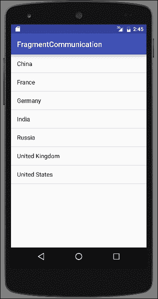
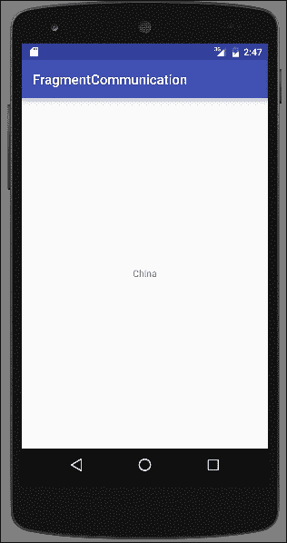
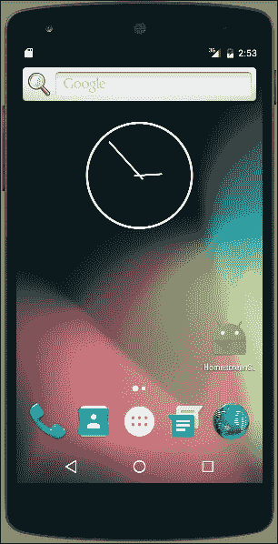
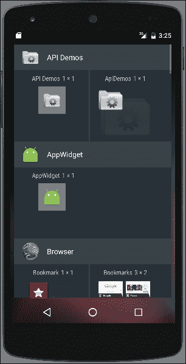

# 五、探索片段、应用小部件和系统用户界面

在本章中，我们将涵盖以下主题:

*   创建和使用片段
*   运行时添加和删除片段
*   在片段之间传递数据
*   在主屏幕上创建快捷方式
*   创建主屏幕小部件
*   将搜索添加到操作栏
*   全屏显示您的应用

# 简介

从[第二章](02.html "Chapter 2. Layouts")、*布局*对布局有了一个坚定的理解，我们将更深入地用碎片来挖掘 UI 开发。片段是将用户界面分成更小的部分的一种方式，这些部分可以很容易地被重用。把片段想象成小型活动，有自己的类、布局和生命周期。您可以将屏幕分成更小的逻辑部分，并将其转换为片段，而不是在一个活动布局中设计屏幕，也可能在多个布局中复制功能。然后，您的活动布局可以根据需要引用一个或多个片段。前三个食谱将深入探索碎片。

了解了片段之后，我们就可以继续讨论小部件了。在[第 3 章](03.html "Chapter 3. Views, Widgets, and Styles")、*视图、小部件和样式*中，我们讨论了如何将小部件添加到您自己的应用中。现在，我们将看看如何创建一个应用小部件，以便用户可以将他们的应用放在主屏幕上。

本章的最后一个食谱将探索系统用户界面选项。我们有一个使用安卓`SearchManager`应用编程接口向动作栏添加`Search`选项的方法。最后一个配方显示了全屏模式和几个改变系统用户界面的附加变化。

# 创建和使用片段

安卓并不总是支持碎片。安卓的早期版本是为 T2 手机设计的，当时屏幕相对较小。直到安卓开始在平板电脑上使用，才有必要将屏幕分成更小的部分。安卓 3.0 引入了`Fragments`类和片段管理器。

除了一个新的类，还出现了片段生命周期。片段生命周期类似于[第 1 章](01.html "Chapter 1. Activities")、*活动*中介绍的活动生命周期，因为大多数事件都与活动生命周期平行。

以下是主要回调的简要概述:

*   `onAttach()`:当片段与活动相关联时调用。
*   `onCreate()`:第一次创建碎片的时候叫。
*   `onCreateView()`:片段即将第一次显示时调用。
*   `onActivityCreated()`:创建关联活动时调用。
*   `onStart()`:当碎片对用户可见时，称为。
*   `onResume()`:就在显示片段之前调用。
*   `onPause()`:片段第一次暂停的时候叫。用户可以返回到片段，但这是您应该保存任何用户数据的地方。
*   `onStop()`:当片段对用户不再可见时调用。
*   `onDestroyView()`:调用允许最终清理。
*   `onDetach()`:当碎片不再与活动相关联时调用。

对于我们的第一个练习，我们将创建一个从标准`Fragment`类派生的新片段。但是我们还可以从其他几个`Fragment`类中派生出来，包括:

*   `DialogFragment`:用于创建浮动对话框
*   `ListFragment`:它在一个片段中创建了一个`ListView`，类似于`ListActivity`
*   `PreferenceFragment`:这是创建一个首选项对象列表，通常用于设置页面

在本食谱中，我们将逐步创建一个从`Fragment`类派生的基本片段，并将其包含在活动布局中。

## 做好准备

在 Android Studio 中创建新项目，并将其称为:`CreateFragment`。使用默认的**电话&平板电脑**选项，并在提示输入活动类型时选择**空活动**选项。

## 怎么做...

在这个食谱中，我们将创建一个新的`Fragment`类，并附带一个布局文件。然后，我们将片段添加到活动布局中，以便在活动开始时可见。以下是创建和显示新片段的步骤:

1.  使用以下 XML 创建名为`fragment_one.xml`的新布局:

    ```java
    <RelativeLayout xmlns:android="http://schemas.android.com/apk/res/android"
        android:layout_height="match_parent"
        android:layout_width="match_parent">
        <TextView
            android:layout_width="wrap_content"
            android:layout_height="wrap_content"
            android:text="Fragment One"
            android:id="@+id/textView"
            android:layout_centerVertical="true"
            android:layout_centerHorizontal="true" />
    </RelativeLayout>
    ```

2.  用以下代码创建一个名为`FragmentOne`的新 Java 文件:

    ```java
    public class FragmentOne extends Fragment {
        @Override
        public View onCreateView(LayoutInflater inflater, ViewGroup container, Bundle savedInstanceState) {
            return inflater.inflate(R.layout.fragment_one, container, false);
        }
    }
    ```

3.  打开`main_activity.xml`文件，用以下`<fragment>`元素替换现有的`<TextView>`元素:

    ```java
      <fragment
        android:name="com.packtpub.androidcookbook.createfragment.FragmentOne"
        android:id="@+id/fragment"
        android:layout_width="wrap_content"
        android:layout_height="wrap_content"
        android:layout_centerVertical="true"
        android:layout_centerHorizontal="true"
        tools:layout="@layout/fragment_one" />
    ```

4.  在设备或模拟器上运行程序。

## 它是如何工作的...

我们从创建一个新类开始，就像我们为一个活动所做的一样。在这个配方中，我们只为`onCreateView()`方法创建一个覆盖来加载我们的片段布局。但是，就像活动事件一样，我们可以根据需要覆盖其他事件。一旦创建了新片段，我们就将其添加到活动布局中。由于`Activity`类是在`Fragments`存在之前创建的，所以不支持`Fragments`。如果我们使用纯框架类，我们会希望使用`FragmentActivity`来代替。如果您使用的是安卓工作室新项目向导，那么默认情况下`MainActivity`会扩展`AppCompatActivity`，这已经包括了对碎片的支持。

## 还有更多...

我们只是在这个食谱中创建了一个简单的片段来教授片段的基础知识。但这是指出碎片力量的好时机。如果我们正在创建多个片段(通常情况下，这就是使用片段的意义所在)，当我们在步骤 4 中创建活动布局时，我们可以使用安卓资源文件夹创建不同的布局配置。纵向布局可能只有一个片段，而横向布局可能有两个或更多。

# 在运行时添加和删除片段

在布局中定义一个片段，就像我们在前面的食谱中所做的那样，就是被称为静态片段，在运行时不能改变。我们将创建一个容器来保存片段，然后在活动的`onCreate()`方法中动态创建片段，而不是使用`<fragment>`元素。

`FragmentManager`提供了在运行时使用`FragmentTransaction`添加、删除和更改片段的应用编程接口。片段事务包括:

*   开始交易
*   执行一个或多个操作
*   提交交易

该配方将通过在运行期间添加和移除碎片来演示`FragmentManager`。

## 做好准备

在 Android Studio 中创建新项目，并将其称为:`RuntimeFragments`。使用默认的**电话&平板电脑**选项，并在提示输入**活动类型**时选择**空活动**选项。

## 怎么做...

为了演示添加和删除片段，我们首先需要创建片段，我们将扩展`Fragment`类。在创建新的片段后，我们需要改变主活动的布局以包含`Fragment`容器。从那里，我们只需添加代码来处理片段事务。以下是步骤:

1.  创建一个名为`fragment_one.xml`的新布局文件，并包含以下 XML:

    ```java
    <RelativeLayout xmlns:android="http://schemas.android.com/apk/res/android"
        android:layout_height="match_parent"
        android:layout_width="match_parent">
        <TextView
            android:layout_width="wrap_content"
            android:layout_height="wrap_content"
            android:text="Fragment One"
            android:id="@+id/textView"
            android:layout_centerVertical="true"
            android:layout_centerHorizontal="true" />
    </RelativeLayout>
    ```

2.  第二个布局文件`fragment_two.xml`几乎相同，唯一不同的是文本:

    ```java
    android:text="Fragment Two"
    ```

3.  Create a new Java file called `FragmentOne` with the following code:

    ```java
    public class FragmentOne extends Fragment {
        @Override
        public View onCreateView(LayoutInflater inflater, ViewGroup container, Bundle savedInstanceState) {
            return inflater.inflate(R.layout.fragment_one, container, false);
        }
    }
    ```

    从以下库中导入:

    ```java
    android.support.v4.app.Fragment
    ```

4.  Create the second Java file called `FragmentTwo` with the following code:

    ```java
    public class FragmentTwo extends Fragment {
        @Override
        public View onCreateView(LayoutInflater inflater, ViewGroup container, Bundle savedInstanceState) {
            return inflater.inflate(R.layout.fragment_two, container, false);
        }
    }
    ```

    从以下库中导入:

    ```java
    android.support.v4.app.Fragment
    ```

5.  现在我们需要向主活动布局添加一个容器和一个按钮。更改`main_activity.xml`如下:

    ```java
    <?xml version="1.0" encoding="utf-8"?>
    <RelativeLayout xmlns:android="http://schemas.android.com/apk/res/android"
        xmlns:tools="http://schemas.android.com/tools"
        android:layout_width="match_parent"
        android:layout_height="match_parent">
        <FrameLayout
            android:id="@+id/frameLayout"
            android:layout_width="match_parent"
            android:layout_height="wrap_content"
            android:layout_above="@+id/buttonSwitch"
            android:layout_alignParentTop="true">
        </FrameLayout>
        <Button
            android:id="@+id/buttonSwitch"
            android:layout_width="wrap_content"
            android:layout_height="wrap_content"
            android:text="Switch"
            android:layout_alignParentBottom="true"
            android:layout_centerInParent="true"
            android:onClick="switchFragment"/>
    </RelativeLayout>
    ```

6.  创建片段并将容器添加到布局中后，我们现在就可以编写操作片段的代码了。打开`MainActivity.java`，在类构造函数下面添加如下代码:

    ```java
    FragmentOne mFragmentOne;
    FragmentTwo mFragmentTwo;
    int showingFragment=0;
    ```

7.  Add the following code to the existing `onCreate()` method, below `setContentView()`:

    ```java
    mFragmentOne = new FragmentOne();
    mFragmentTwo = new FragmentTwo();
    FragmentManager fragmentManager = getSupportFragmentManager();
    FragmentTransaction fragmentTransaction = fragmentManager.beginTransaction();
    fragmentTransaction.add(R.id.frameLayout, mFragmentOne);
    fragmentTransaction.commit();
    showingFragment=1;
    ```

    从以下库导入:

    ```java
    android.support.v4.app.FragmentManager
    android.support.v4.app.FragmentTransaction
    ```

8.  我们需要添加的最后一个代码处理片段切换，由按钮

    ```java
    public void switchFragment(View view) {
        FragmentManager fragmentManager = getSupportFragmentManager();
        FragmentTransaction fragmentTransaction = fragmentManager.beginTransaction();
        if (showingFragment==1) {
            fragmentTransaction.replace(R.id.frameLayout, mFragmentTwo);
            showingFragment = 2;
        } else {
            fragmentTransaction.replace(R.id.frameLayout, mFragmentOne);
            showingFragment=1;
        }
        fragmentTransaction.commit();
    }
    ```

    调用
9.  在设备或模拟器上运行程序。

## 它是如何工作的...

本食谱的大部分步骤涉及设置碎片。一旦碎片被声明，我们用`onCreate()`方法创建它们。虽然代码可以压缩成一行，但它以长形式显示，因为它更容易阅读和理解。

首先，我们得到`FragmentManager`，这样我们就可以开始一个`FragmentTransaction`。一旦我们有了`FragmentTransaction`，我们就开始与`beginTransaction()`交易。事务中可以发生多个动作，但我们在这里只需要`add()`我们的初始片段。我们称之为`commit()`方法来完成交易。

现在您已经理解了片段事务，下面是`onCreate()`的简洁版本:

```java
getFragmentManager().beginTransaction().add(R.id.framLayout, mFragmentOne).commit();
```

`switchFragment`做基本相同类型的 Fragment 事务。我们不调用`add()`方法，而是用现有的片段调用`replace()`方法。我们用`showingFragment`变量跟踪当前片段，这样我们就知道下一个要显示哪个片段了。我们也不限于在两个片段之间切换。如果我们需要额外的片段，我们只需要创建它们。

## 还有更多...

在[第一章](01.html "Chapter 1. Activities")、*活动*的*活动切换*食谱中，我们讨论了后栈。大多数用户会期望后退键在“屏幕”中向后移动，他们不知道或不关心这些屏幕是活动还是片段。幸运的是，安卓只需在调用`commit()`之前添加对`addToBackStack()`的调用，就可以非常容易地将碎片添加到后栈。

### 类型

当片段被移除或替换而没有将其添加到后堆栈中时，它会立即被销毁。如果它被添加到后栈，它将被停止，如果用户返回到片段，它将被重新启动，而不是重新创建。

# 在片段之间传递数据

通常，需要在片段之间传递信息。一个电子邮件应用就是一个经典的例子。在一个片段中有电子邮件列表，在另一个片段中显示电子邮件详细信息是很常见的(这通常被称为主/细节模式)。片段使创建这种模式变得更容易，因为我们只需要对每个片段编码一次，然后我们就可以将它们包含在不同的布局中。我们可以很容易地在纵向布局中有一个单独的片段，当选择一封电子邮件时，可以用细节片段替换主片段。我们还可以创建一个双面板布局，其中列表和细节片段是并排的。无论哪种方式，当用户单击列表中的电子邮件时，电子邮件都会在详细信息面板中打开。这是我们需要在两个片段之间进行通信的时候。

由于碎片的主要目标之一是它们完全独立，所以不鼓励碎片之间的直接通信，这是有充分理由的。如果片段必须依赖于其他片段，那么当布局改变并且只有一个片段可用时，您的代码可能会崩溃。幸运的是，这种情况下也不需要直接通信。所有片段通信都应通过主机活动进行。主机活动负责管理片段，并可以正确路由消息。

现在问题变成了:片段如何与活动交流？答案是一个`interface`。您可能已经熟悉了一个界面，因为视图就是这样将事件传递回活动的。按钮点击是一个常见的例子。

在本食谱中，我们将创建两个片段来演示如何通过主机活动将数据从一个片段传递到另一个片段。我们还将通过包含两种不同的活动布局(一种用于纵向，另一种用于横向)来建立我们从之前的配方中学到的知识。在纵向模式下，活动将根据需要交换碎片。下面是应用首次以纵向模式运行时的屏幕截图:



这是当你点击一个国家名称时显示细节片段的屏幕:



当处于横向时，两个碎片会并排，如横向截图所示:


由于主/细节模式通常包含主的列表，我们将利用`ListFragment`(在*创建和使用片段*介绍中提到)。)当选择列表中的项目时，项目文本(在我们的示例中是国家/地区名称)将通过主机“活动”发送到详细片段。

## 做好准备

在 Android Studio 中创建新项目，并将其称为:`Fragmentcommunication`。使用默认的**电话&平板电脑**选项，并在提示输入**活动类型**时选择**空活动**。

## 怎么做...

为了充分展示工作片段，我们需要创建两个片段。第一个片段将从`ListFragment`开始延伸，因此不需要布局。我们将更进一步，为我们的活动创建纵向和横向布局。对于纵向模式，我们将交换碎片，对于横向模式，我们将并排显示两个碎片。

### 注

当输入这段代码时，安卓工作室将提供两种不同的库导入选项。由于新建项目向导会自动引用`AppCompat`库，所以我们需要使用支持库 API，而不是框架 API。虽然非常相似，但下面的代码使用了支持的片段应用编程接口。

以下是从第一个片段开始的步骤:

1.  Create a new Java class called `MasterFragment` and change it so it extends `ListFragment` as shown:

    ```java
    public class MasterFragment extends ListFragment
    ```

    从以下库中导入:

    ```java
    android.support.v4.app.ListFragment
    ```

2.  在`MasterFragment`类中创建以下`interface`:

    ```java
    public interface OnMasterSelectedListener {
        public void onItemSelected(String countryName);
    }
    ```

3.  用以下代码设置接口回调监听器:

    ```java
    private OnMasterSelectedListener mOnMasterSelectedListener=null;

    public void setOnMasterSelectedListener(OnMasterSelectedListener listener) {
        mOnMasterSelectedListener=listener;
    }
    ```

4.  `MasterFragment`的最后一步是创建一个`ListAdapter`来填充`ListView`，这是我们在`onViewCreated()`方法中做的。当用以下代码选择一个国家名称时，我们将使用`setOnItemClickListener()`调用我们的`OnMasterSelectedListener`界面:

    ```java
    public void onViewCreated(View view, Bundle savedInstanceState) {
        super.onViewCreated(view, savedInstanceState);
        String[] countries = new String[]{"China", "France", "Germany", "India", "Russia", "United Kingdom", "United States"};
        ListAdapter countryAdapter = new ArrayAdapter<String>(getActivity(), android.R.layout.simple_list_item_1, countries);
        setListAdapter(countryAdapter);
        getListView().setChoiceMode(ListView.CHOICE_MODE_SINGLE);
        getListView().setOnItemClickListener(new AdapterView.OnItemClickListener() {
            @Override
            public void onItemClick(AdapterView<?> parent, View view, int position, long id) {
                if (mOnMasterSelectedListener != null) {
                    mOnMasterSelectedListener.onItemSelected(((TextView) view).getText().toString());
                }
            }
        });
    }
    ```

5.  接下来我们需要创建`DetailFragment`，从开始布局。使用以下 XML 创建名为:`fragment_detail.xml`的新布局文件:

    ```java
    <?xml version="1.0" encoding="utf-8"?>
    <RelativeLayout
        xmlns:android="http://schemas.android.com/apk/res/android"
        android:layout_width="match_parent"
        android:layout_height="match_parent">
        <TextView
            android:id="@+id/textViewCountryName"
            android:layout_width="wrap_content"
            android:layout_height="wrap_content"
            android:layout_centerVertical="true"
            android:layout_centerHorizontal="true" />
    </RelativeLayout>
    ```

6.  Create a new Java class called `DetailFragment` extending from `Fragment` as follows:

    ```java
    public class DetailFragment extends Fragment
    ```

    从以下库中导入:

    ```java
    android.support.v4.app.Fragment
    ```

7.  将以下常量添加到类中:

    ```java
    public static String KEY_COUNTRY_NAME="KEY_COUNTRY_NAME";
    ```

8.  覆盖`onCreateView()`，如下所示:

    ```java
    public View onCreateView(LayoutInflater inflater, ViewGroup container, Bundle savedInstanceState) {
        return inflater.inflate(R.layout.fragment_detail, container, false);
    }
    ```

9.  将`onViewCreated()`编码如下:

    ```java
    public void onViewCreated(View view, Bundle savedInstanceState) {
        super.onViewCreated(view, savedInstanceState);

        Bundle bundle = getArguments();
        if (bundle != null && bundle.containsKey(KEY_COUNTRY_NAME)) {
            showSelectedCountry(bundle.getString(KEY_COUNTRY_NAME));
        }
    }
    ```

10.  这个片段的最后一步是当我们收到选定的国家名称时更新文本视图。将以下方法添加到类中:

    ```java
    public void showSelectedCountry(String countryName) {
        ((TextView)getView().findViewById(R.id.textViewCountryName)).setText(countryName);
    }
    ```

11.  现有的`activity_main.xml`布局将处理人像模式布局。去掉现有的`<TextView>`和替换为以下的`<FrameLayout>` :

    ```java
    <FrameLayout
        android:id="@+id/frameLayout"
        android:layout_width="match_parent"
        android:layout_height="match_parent"/>
    ```

12.  Create a new directory in the **res** folder for the landscape layout as: `res/layout-land`.

    ### 类型

    如果您没有看到新的 res/layout-land 目录，请从 **Android** **视图**更改为**项目** **视图**。

13.  在`res/layout-land`中创建新的`activity_main.xml`布局，如下所示:

    ```java
    <?xml version="1.0" encoding="utf-8"?>
    <LinearLayout xmlns:android="http://schemas.android.com/apk/res/android"
        xmlns:tools="http://schemas.android.com/tools"
        android:layout_width="match_parent"
        android:layout_height="match_parent"
        android:orientation="horizontal">
        <FrameLayout
            android:id="@+id/frameLayoutMaster"
            android:layout_width="0dp"
            android:layout_weight="1"
            android:layout_height="match_parent"/>
        <FrameLayout
            android:id="@+id/frameLayoutDetail"
            android:layout_width="0dp"
            android:layout_weight="1"
            android:layout_height="match_parent"/>
    </LinearLayout>
    ```

14.  最后的步骤是设置`MainActivity`到处理碎片。打开`MainActivity.java`文件，添加以下类变量来跟踪单/双窗格:

    ```java
    boolean dualPane;
    ```

15.  接下来，将`onCreate()`更改如下:

    ```java
    protected void onCreate(Bundle savedInstanceState) {
        super.onCreate(savedInstanceState);
        setContentView(R.layout.activity_main);

        MasterFragment masterFragment=null;
        FrameLayout frameLayout = (FrameLayout)findViewById(R.id.frameLayout);
        if (frameLayout != null) {
            dualPane=false;
            FragmentTransaction fragmentTransaction = getSupportFragmentManager().beginTransaction();
            masterFragment=(MasterFragment)getSupportFragmentManager().findFragmentByTag("MASTER");
            if (masterFragment == null) {
                masterFragment = new MasterFragment();
                fragmentTransaction.add(R.id.frameLayout, masterFragment, "MASTER");
            }
            DetailFragment detailFragment = (DetailFragment)getSupportFragmentManager().findFragmentById(R.id.frameLayoutDetail);
            if (detailFragment != null) {
                fragmentTransaction.remove(detailFragment);
            }
            fragmentTransaction.commit();
        } else {
            dualPane=true;
            FragmentTransaction fragmentTransaction = getSupportFragmentManager().beginTransaction();
            masterFragment=(MasterFragment)getSupportFragmentManager().findFragmentById(R.id.frameLayoutMaster);
            if (masterFragment==null) {
                masterFragment = new MasterFragment();
                fragmentTransaction.add(R.id.frameLayoutMaster, masterFragment);
            }
            DetailFragment detailFragment=(DetailFragment)getSupportFragmentManager().findFragmentById(R.id.frameLayoutDetail);
            if (detailFragment==null) {
                detailFragment = new DetailFragment();
                fragmentTransaction.add(R.id.frameLayoutDetail, detailFragment);
            }
            fragmentTransaction.commit();
        }
        masterFragment.setOnMasterSelectedListener(new MasterFragment.OnMasterSelectedListener() {
            @Override
            public void onItemSelected(String countryName) {
                sendCountryName(countryName);
            }
        });
    }
    ```

16.  最后一个添加的代码是`sendCountryName()`方法，处理发送国名到`DetailFragment` :

    ```java
    private void sendCountryName(String countryName) {
        DetailFragment detailFragment;
        if (dualPane) {
            //Two pane layout
            detailFragment = (DetailFragment)getSupportFragmentManager().findFragmentById(R.id.frameLayoutDetail);
            detailFragment.showSelectedCountry(countryName);
        } else {
            // Single pane layout
            detailFragment = new DetailFragment();
            Bundle bundle = new Bundle();
            bundle.putString(DetailFragment.KEY_COUNTRY_NAME, countryName);
            detailFragment.setArguments(bundle);
            FragmentTransaction fragmentTransaction = getSupportFragmentManager().beginTransaction();
            fragmentTransaction.replace(R.id.frameLayout, detailFragment);
            fragmentTransaction.addToBackStack(null);
            fragmentTransaction.commit();
        }
    }
    ```

17.  在设备或模拟器上运行程序。

## 它是如何工作的...

我们从创造`MasterFragment`开始。在我们使用的主/细节模式中，这通常代表一个列表，所以我们通过扩展`ListFragment`来创建一个列表。`ListFragment`是`ListActivity`的片段等价物。除了从一个片段延伸出来，基本上是一样的。

正如配方介绍中所述，我们不应该试图直接与其他片段通信。

为了提供交流列表项选择的方法，我们公开了接口:`OnMasterSelectedListener`。每次在列表中选择一个项目，我们都会调用`onItemSelected()`。

在片段之间传递数据的大部分工作是在主机活动中完成的，但是最终，接收片段需要一种接收数据的方式。`DetailFragment`以两种方式支持这一点:

*   在参数包中传递国家名称，在创建时可用。
*   活动直接调用的公共方法。

当活动创建片段时，它还会创建一个`bundle`来保存我们想要发送的数据。这里我们使用步骤 7 中定义的`KEY_COUNTRY_NAME`添加国家名称。我们在`onViewCreated()`中用`getArguments()`取回这个包裹。如果在包中找到密钥，则使用`showSelectedCountry()`方法提取并显示密钥。如果片段已经可见(在双面板布局中)，活动将直接调用相同的方法。

这个食谱的大部分工作都在活动中。我们创建了两种布局:一种用于纵向，一种用于横向。安卓将使用在*第 12 步*中创建的`res/layout-land`目录选择风景布局。两种布局都使用`<FrameLayout>`占位符，类似于前面的练习。我们在`onCreate()`和`sendCountryName()`管理碎片。

在`onCreate()`中，我们通过检查当前布局是否包含`frameLayout`视图来设置`dualPane`标志。如果找到`frameLayout`(不会为空)，那么我们只有一个面板，因为`frameLayout`标识只在人像布局中。如果找不到框架布局，那么我们有两个`<FrameLayout>`元素:一个用于`MasterFragment`，另一个用于`DetailFragment`。

我们在`onCreate()`中做的最后一件事是通过创建一个匿名回调来设置`MasterFragment`侦听器，该回调将国家名称传递给`sendCountryName()`。

`sendCountryName()`是数据实际传递到`DetailFragment`的地方。如果我们处于纵向(或单窗格)模式，我们需要创建一个`DetailFragment`并替换现有的`MasterFragment`。这就是我们用国家名称创建捆绑包并将其称为`setArguments()`的地方。注意我们在提交事务之前如何调用`addToBackStack()`？这允许后退键将用户带回列表(`MasterFragment`)。如果我们处于横向模式，则`DetailFragment`已经可见，因此我们直接调用`showSelectedCountry()`公共方法。

## 还有更多...

在`MasterFragment`中，在发送`onItemSelected()`事件之前，我们检查以确保监听器不为空，代码如下:

```java
if (mOnMasterSelectedListener != null)
```

虽然活动的工作是设置回调来接收事件，但是如果没有侦听器，我们不希望这段代码崩溃。另一种方法是在片段的`onAttach()`回调中验证活动扩展了我们的接口。

## 另见

*   有关列表视图的更多信息，请参见[第 2 章](02.html "Chapter 2. Layouts")、*布局*中的*使用列表视图、网格视图和适配器*。
*   有关资源目录的更多信息，请参见[第 3 章](03.html "Chapter 3. Views, Widgets, and Styles")、*视图、小部件和样式*中的*基于安卓版本选择主题。*

# 在主屏幕上创建快捷方式

这个食谱解释了如何在用户的主屏幕上为你的应用创建链接或快捷方式。为了不太引人注目，通常最好让用户启动这个选项，例如在设置中。

这是一个截图，显示了我们在主屏幕上的快捷方式:



如您所见，这只是一个快捷方式，但我们将在下一个食谱中探索创建一个 Home 屏幕(AppWidget)。

## 做好准备

在 Android Studio 中创建新项目，并将其称为:`HomescreenShortcut`。使用默认的**电话&平板电脑**选项，并在提示输入**活动类型**时选择**空活动**选项。

## 怎么做...

第一步是添加适当的权限。以下是步骤:

1.  打开`AndroidManifest`文件，添加如下权限:

    ```java
    <uses-permission android:name="com.android.launcher.permission.INSTALL_SHORTCUT" />
    ```

2.  接下来，打开 `activity_main.xml`并用以下按钮替换现有文本视图:

    ```java
    <Button
        android:layout_width="wrap_content"
        android:layout_height="wrap_content"
        android:text="Create Shortcut"
        android:id="@+id/button"
        android:layout_centerVertical="true"
        android:layout_centerHorizontal="true"
        android:onClick="createShortcut"/>
    ```

3.  在`ActivityMain.java`中增加以下方法:

    ```java
    public void createShortcut(View view) {
        Intent shortcutIntent = new Intent(this, MainActivity.class);
        shortcutIntent.setAction(Intent.ACTION_MAIN);
        Intent intent = new Intent();
        intent.putExtra(Intent.EXTRA_SHORTCUT_INTENT, shortcutIntent);
        intent.putExtra(Intent.EXTRA_SHORTCUT_NAME, getString(R.string.app_name));
        intent.putExtra(Intent.EXTRA_SHORTCUT_ICON_RESOURCE, Intent.ShortcutIconResource.fromContext(this, R.mipmap.ic_launcher));
        intent.setAction("com.android.launcher.action.INSTALL_SHORTCUT");
        sendBroadcast(intent);
    }
    ```

4.  在设备或模拟器上运行程序。请注意，每次您按下按钮，应用都会在主屏幕上创建一个快捷方式。

## 它是如何工作的...

一旦您设置了适当的权限，这是一个相当简单的任务。单击按钮时，代码会创建一个名为:`shortcutIntent`的新意图。这是在主屏幕上按下图标时将调用的意图。下一个创建的意图`installIntent`是负责实际创建快捷方式。

## 还有更多...

如果您还想删除快捷方式，您需要以下权限:

```java
<uses-permission android:name="com.android.launcher.permission.UNINSTALL_SHORTCUT" />
```

您应该设置以下操作，而不是使用 INSTALL _ SHAREPOINT 操作:

```java
com.android.launcher.action.UNINSTALL_SHORTCUT
```

# 创建主屏幕小部件

在我们深入研究创建应用小部件的代码之前，让我们先了解一下基础知识。有三个必需组件和一个可选组件:

*   `AppWidgetProviderInfo`文件:这是一个稍后描述的 XML 资源
*   `AppWidgetProvider`类:这是一个 Java 类
*   视图布局文件:这是一个标准的布局 XML 文件，后面列出了一些限制
*   应用小部件配置活动(可选):该活动在放置小部件以设置配置选项时启动

`AppWidgetProvider`也必须在`AndroidManifest`文件中声明。由于`AppWidgetProvider`是一个基于广播接收器的辅助类，它在清单中用`<receiver>`元素声明。下面是一个清单条目示例:

```java
<receiver android:name="AppWidgetProvider" >
    <intent-filter>
        <action android:name="android.appwidget.action.APPWIDGET_UPDATE" />
    </intent-filter>
    <meta-data android:name="android.appwidget.provider"
        android:resource="@xml/appwidget_info" />
</receiver>
```

元数据指向`AppWidgetProviderInfo`文件，该文件位于`res/xml`目录中。这里有一个样本`AppWidgetProviderInfo.xml`文件:

```java
<appwidget-provider xmlns:android="http://schemas.android.com/apk/res/android"
    android:minWidth="40dp"
    android:minHeight="40dp"
    android:updatePeriodMillis="1800000"
    android:previewImage="@drawable/preview_image"
    android:initialLayout="@layout/appwidget"
    android:configure="com.packtpub.androidcookbook.AppWidgetConfiguration"
    android:resizeMode="horizontal|vertical"
    android:widgetCategory="home_screen">
</appwidget-provider>
```

以下是可用属性的简要概述:

*   `minWidth`:放置在首页画面时的默认宽度
*   `minHeight`:放置在主屏幕上时的默认高度
*   `updatePeriodMillis`:是`onUpdate()`轮询间隔的部分(毫秒)
*   `initialLayout`:应用窗口小部件布局
*   `previewImage`(可选):浏览 App Widgets 时显示的图像
*   `configure`(可选):启动配置设置的活动
*   `resizeMode`(可选):标志指示调整大小选项— `horizontal`、`vertical`、`none`
*   `minResizeWidth`(可选):调整大小时允许的最小宽度
*   `minResizeHeight`(可选):调整大小时允许的最小高度
*   `widgetCategory`(可选):安卓 5+仅支持主屏幕小部件

`AppWidgetProvider`扩展了`BroadcastReceiver`类，这就是为什么在清单中声明`AppWidget`时使用`<receiver>`的原因。因为它是`BroadcastReceiver`，这个类仍然接收操作系统广播事件，但是助手类将这些事件过滤到那些适用于应用小部件的事件。`AppWidgetProvider`类公开了以下方法:

*   `onUpdate()`:最初创建时按指定的时间间隔调用。
*   `onAppWidgetOptionsChanged()`:最初创建时调用，大小随时变化。
*   `onDeleted()`:任何时候移除小部件都会调用。
*   `onEnabled()`:第一次放置小部件时调用(添加第二个及后续小部件时不调用)。
*   `onDisabled()`:移除最后一个小部件时调用。
*   `onReceive()`:是对收到的每个事件进行调用，包括之前的事件。通常不会被覆盖，因为默认实现只发送适用的事件。

最后需要的组件是布局。远程视图仅支持可用布局的子集。由于应用小部件是远程视图，因此仅支持以下布局:

*   `FrameLayout`
*   `LinearLayout`
*   `RelativeLayout`
*   `GridLayout`

以及以下小部件:

*   `AnalogClock`
*   `Button`
*   `Chronometer`
*   `ImageButton`
*   `ImageView`
*   `ProgressBar`
*   `TextView`
*   `ViewFlipper`
*   `ListView`
*   `GridView`
*   `StackView`
*   `AdapterViewFlipper`

应用小部件的基础知识已经涵盖，现在是时候开始编码了。我们的示例将涵盖基础知识，以便您可以根据需要扩展功能。这个食谱使用了一个带时钟的视图，当按下时，打开我们的活动。

此屏幕截图显示了添加到主屏幕时小部件列表中的小部件:



### 注

小部件列表的外观因启动器而异。

这里有一个截图显示了添加到主屏幕后的小部件:


## 做好准备

在安卓工作室新建一个项目，并命名为:`AppWidget`。使用默认的**电话&平板电脑**选项，并在提示输入**活动类型**时选择**空活动**选项。

## 怎么做...

我们将从创建小部件布局开始，它位于标准布局资源目录中。然后我们将创建 xml 资源目录来存储`AppWidgetProviderInfo`文件。我们将添加一个新的 Java 类并扩展`AppWidgetProvider`，它处理小部件的`onUpdate()`调用。创建接收器后，我们可以将其添加到安卓清单中。

以下是详细的步骤:

1.  使用以下 XML 在`res/layout`中创建新文件，称为【T1:

    ```java
    <?xml version="1.0" encoding="utf-8"?>
    <RelativeLayout xmlns:android="http://schemas.android.com/apk/res/android"
        android:layout_width="match_parent"
        android:layout_height="match_parent">
        <AnalogClock
            android:layout_width="wrap_content"
            android:layout_height="wrap_content"
            android:id="@+id/analogClock"
            android:layout_centerVertical="true"
            android:layout_centerHorizontal="true" />
    </RelativeLayout>
    ```

2.  在资源目录中创建新目录`xml`。最终结果将是:`res/xml`。
3.  Create a new file in `res/xml` called `appwidget_info,xml` using the following xml:

    ```java
    <appwidget-provider xmlns:android="http://schemas.android.com/apk/res/android"
        android:minWidth="40dp"
        android:minHeight="40dp"
        android:updatePeriodMillis="0"
        android:initialLayout="@layout/widget"
        android:resizeMode="none"
        android:widgetCategory="home_screen">
    </appwidget-provider>
    ```

    ### 类型

    如果看不到新的 xml 目录，在**项目**面板下拉菜单中，从**安卓**视图切换到**项目**视图。

4.  创建一个名为`HomescreenWidgetProvider`的新的 Java 类，扩展`AppWidgetProvider`。
5.  将以下`onUpdate()`方法添加到`HomescreenWidgetProvider`类:

    ```java
    public void onUpdate(Context context, AppWidgetManager appWidgetManager, int[] appWidgetIds) {
        super.onUpdate(context, appWidgetManager, appWidgetIds);
        for (int count=0; count<appWidgetIds.length; count++) {
            RemoteViews appWidgetLayout = new RemoteViews(context.getPackageName(), R.layout.widget);
            Intent intent = new Intent(context, MainActivity.class);
            PendingIntent pendingIntent = PendingIntent.getActivity(context, 0, intent, 0);
            appWidgetLayout.setOnClickPendingIntent(R.id.analogClock, pendingIntent);
            appWidgetManager.updateAppWidget(appWidgetIds[count], appWidgetLayout);
        }
    }
    ```

6.  在`<application>`元素中使用以下 XML 声明将`HomescreenWidgetProvider`添加到`AndroidManifest`中:

    ```java
    <receiver android:name=".HomescreenWidgetProvider" >
        <intent-filter>
            <action android:name="android.appwidget.action.APPWIDGET_UPDATE" />
        </intent-filter>
        <meta-data android:name="android.appwidget.provider"
            android:resource="@xml/appwidget_info" />
    </receiver>
    ```

7.  在设备或模拟器上运行程序。在第一次运行应用后，小部件将可以添加到主屏幕。

## 它是如何工作的...

我们的第一步是为小部件创建布局文件。这是一个标准布局资源，其限制基于作为远程视图的应用小部件，如配方介绍中所述。虽然我们的示例使用模拟时钟小部件，但这是您希望根据应用需求扩展功能的地方。

xml 资源目录用于存储`AppWidgetProviderInfo`，它定义了默认的小部件设置。配置设置决定了最初浏览可用小部件时小部件的显示方式。我们在这个配方中使用了非常基本的设置，但是它们可以很容易地扩展到包括额外的功能，例如预览图像来显示一个功能部件和大小选项。`updatePeriodMillis`属性设置更新频率。由于更新会唤醒设备，因此在拥有最新数据和电池寿命之间进行权衡。(这是可选的设置活动对让用户决定有用的地方。)

`AppWidgetProvider`类是我们处理由`updatePeriodMillis`投票触发的`onUpdate()`事件的地方。我们的示例不需要任何更新，因此我们将轮询设置为零。最初放置小部件时，仍会调用更新。`onUpdate()`是我们在按下时钟时设置打开应用的待定意图的地方。

由于`onUpdate()`方法可能是 AppWidgets 最复杂的方面，我们将解释这是一些细节。首先，值得注意的是`onUpdate()`在这个提供者为所有小部件创建的每个轮询间隔中只会出现一次。(在第一个小部件之后创建的小部件将处于第一个小部件的周期中。)这解释了`for`循环，因为我们需要它迭代所有现有的小部件。这是我们创建一个待定的意图，当按下时钟时调用我们的应用。如前所述，应用小部件是一个远程视图。因此，为了得到布局，我们用我们的全限定包名和布局 ID 调用`RemoteViews()`。一旦我们有了布局，我们可以使用`setOnClickPendingIntent()`将待定的意图附加到时钟视图。我们称`AppWidgetManager`为`updateAppWidget()`来启动我们所做的改变。

完成所有这些工作的最后一步是在安卓清单中声明小部件。我们用`<intent-filter>`来识别我们想要处理的动作。大多数应用小部件可能会像我们一样想要处理更新事件。声明中需要注意的另一项是这一行:

```java
<meta-data android:name="android.appwidget.provider"
    android:resource="@xml/appwidget_info" />
```

这告诉系统在哪里可以找到我们的配置文件。

## 还有更多...

添加应用小部件配置活动允许您的小部件具有更大的灵活性。您不仅可以提供轮询选项，还可以提供不同的布局、点击行为等等。用户倾向于真正欣赏灵活的应用小部件。

添加配置活动需要一些额外的步骤。活动需要像往常一样在清单中声明，但需要包括`APPWIDGET_CONFIGURE`动作，如本例所示:

```java
<activity android:name=".AppWidgetConfigureActivity">
    <intent-filter>
        <action android:name="android.appwidget.action.APPWIDGET_CONFIGURE"/>
    </intent-filter>
</activity>
```

还需要使用配置属性在`AppWidgetProviderInfo`文件中指定活动，如本例所示:

```java
android:configure="com.packtpub.androidcookbook.appwidget.AppWidgetConfigureActivity"
```

`configure`属性需要完全限定的包名，因为该活动将从应用外部调用。

### 类型

请记住，使用配置活动时不会调用`onUpdate()`方法。如果需要，配置活动负责处理任何初始设置。

## 另见

*   欲了解应用小部件设计指南，请访问谷歌页面:[http://developer.android.com/design/patterns/widgets.html](http://developer.android.com/design/patterns/widgets.html)

# 将搜索添加到动作栏

除了动作栏，安卓 3.0 还引入了`SearchView`小部件，在创建菜单时可以作为菜单项包含在内。这是现在推荐的用户界面模式，以提供一致的用户体验。

以下屏幕截图显示了操作栏中搜索图标的初始外观:


此屏幕截图显示了按下时搜索选项如何扩展:


如果您想在您的应用中添加搜索功能，这个方法将引导您完成设置用户界面和正确配置搜索管理器应用编程接口的步骤。

## 做好准备

在 Android Studio 中创建新项目，并将其称为:`SearchView`。使用默认的**电话&平板电脑**选项，并在提示输入活动类型时选择**空活动**。

## 怎么做...

要设置搜索用户界面模式，我们需要创建搜索菜单项和一个名为`searchable`的资源。我们将创建第二个活动来接收搜索查询。然后我们将在`AndroidManifest`文件中将其全部连接起来。首先，打开`res/values`中的`strings.xml`文件，按照以下步骤操作:

1.  添加以下字符串资源:

    ```java
    <string name="search_title">Search</string>
    <string name="search_hint">Enter text to search</string>
    ```

2.  创建菜单目录:`res/menu`。
3.  使用以下 xml 在`res/menu`中创建新的名为`menu_options.xml`的菜单资源:

    ```java
    <?xml version="1.0" encoding="utf-8"?>
    <menu
        xmlns:android="http://schemas.android.com/apk/res/android"
        xmlns:app="http://schemas.android.com/apk/res-auto">
        <item android:id="@+id/menu_search"
            android:title="@string/search_title"
            android:icon="@android:drawable/ic_menu_search"
            app:showAsAction="collapseActionView|ifRoom"
            app:actionViewClass="android.support.v7.widget.SearchView" />
    </menu>
    ```

4.  覆盖`onCreateOptionsMenu()`使菜单膨胀并如下设置搜索管理器:

    ```java
    public boolean onCreateOptionsMenu(Menu menu) {
        MenuInflater inflater = getMenuInflater();
        inflater.inflate(R.menu.menu_options, menu);
        SearchManager searchManager = (SearchManager) getSystemService(Context.SEARCH_SERVICE);
        SearchView searchView = (SearchView) MenuItemCompat.getActionView(menu.findItem(R.id.menu_search));
        searchView.setSearchableInfo(searchManager.getSearchableInfo(getComponentName()));
        return true;
    }
    ```

5.  创建新的 xml 资源目录:`res/xml`。
6.  使用以下 xml 在中创建一个名为`searchable.xml`的新文件:

    ```java
    <?xml version="1.0" encoding="utf-8"?>
    <searchable xmlns:android="http://schemas.android.com/apk/res/android"
        android:label="@string/app_name"
        android:hint="@string/search_hint" />
    ```

7.  使用以下 xml 创建一个名为`activity_search_result.xml`的新布局:

    ```java
    <?xml version="1.0" encoding="utf-8"?>
    <RelativeLayout xmlns:android="http://schemas.android.com/apk/res/android"
        xmlns:tools="http://schemas.android.com/tools"
        android:layout_width="match_parent"
        android:layout_height="match_parent" >
        <TextView
            android:id="@+id/textViewSearchResult"
            android:layout_width="wrap_content"
            android:layout_height="wrap_content"
            android:layout_centerInParent="true" />
    </RelativeLayout>
    ```

8.  创建一个名为`SearchResultActivity`的新活动。
9.  向类中添加以下变量:

    ```java
    TextView mTextViewSearchResult;
    ```

10.  更改`onCreate()`以加载我们的布局，设置文本视图并检查`QUERY`动作:

    ```java
    protected void onCreate(Bundle savedInstanceState) {
        super.onCreate(savedInstanceState);
        setContentView(R.layout.activity_search_result);
        mTextViewSearchResult = (TextView)findViewById(R.id.textViewSearchResult);

        if (Intent.ACTION_SEARCH.equals(getIntent().getAction())) {
            handleSearch(getIntent().getStringExtra(SearchManager.QUERY));
    }
    ```

11.  增加以下方法处理搜索:

    ```java
    private void handleSearch(String searchQuery) {
        mTextViewSearchResult.setText(searchQuery);
    }
    ```

12.  随着用户界面和代码的完成，我们只需要在`AndroidManifest`中正确地连接一切。以下是包括两项活动的完整清单:

    ```java
    <?xml version="1.0" encoding="utf-8"?>
    <manifest xmlns:android="http://schemas.android.com/apk/res/android"
        package="com.packtpub.androidcookbook.searchview" >
        <application
            android:allowBackup="true"
            android:icon="@mipmap/ic_launcher"
            android:label="@string/app_name"
            android:supportsRtl="true"
            android:theme="@style/AppTheme" >
            <meta-data
                android:name="android.app.default_searchable"
                android:value=".SearchResultActivity" />
            <activity android:name=".MainActivity" >
                <intent-filter>
                    <action android:name="android.intent.action.MAIN" />
                    <category android:name="android.intent.category.LAUNCHER" />
                </intent-filter>
            </activity>
            <activity android:name=".SearchResultActivity" >
                <intent-filter>
                    <action android:name="android.intent.action.SEARCH" />
                </intent-filter>
                <meta-data android:name="android.app.searchable" android:resource="@xml/searchable" />
            </activity>
        </application>
    </manifest>
    ```

13.  在设备或模拟器上运行应用。输入搜索查询并点击**搜索**按钮(或按回车键)。`SearchResultActivity`将显示输入的搜索查询。

## 它是如何工作的...

由于新项目向导使用`AppCompat`库，我们的示例使用支持库应用编程接口。使用支持库提供了最大的设备兼容性，因为它允许在旧版本的安卓操作系统上使用现代功能(如操作栏)。这有时会带来额外的挑战，因为官方文档通常关注框架 API。虽然支持库通常紧跟框架 API，但它们并不总是可以互换的。搜索用户界面模式就是其中的一种情况，因此值得特别注意前面概述的步骤。

我们从为`searchable`创建字符串资源开始，如步骤 6 中所声明的。

在步骤 3 中，我们创建了菜单资源，就像我们多次做的那样。一个不同之处是我们使用`showAsAction`和`actionViewClass`属性的`app`命名空间。安卓操作系统的早期版本在其安卓命名空间中不包括这些属性。这是为旧版安卓操作系统带来新功能的一种方式

在步骤 4 中，我们再次使用支持库 API 设置`SearchManager`。

步骤 6 是我们定义`searchable`的地方，它是`SearchManager`使用的 xml 资源。唯一需要的属性是`label`，但是推荐使用`hint`，这样用户就可以知道他们应该在字段中键入什么。

### 类型

`android:label`必须与应用名或活动名匹配，并且必须使用字符串资源(因为它不能使用硬编码字符串)。

步骤 7-11 适用于`SearchResultActivity`。调用第二个活动不是`SearchManager`的要求，但通常是为应用中启动的所有搜索提供一个活动。

如果此时运行应用，您会看到搜索图标，但没有任何效果。步骤 12 是我们在`AndroidManifest`文件中把它们放在一起的地方。首先要注意的事项如下:

```java
<meta-data
android:name="android.app.default_searchable"
android:value=".SearchResultActivity" />
```

请注意，这是在应用元素中，而不是在两个`<activity>`元素中。

我们在`SearchResultActivity <meta-data>`元素中指定了可搜索的资源:

```java
<meta-data android:name="android.app.searchable" android:resource="@xml/searchable" />
```

我们还需要为`SearchResultActivity`设置意图过滤器，如下所示:

```java
<intent-filter>
    <action android:name="android.intent.action.SEARCH" />
</intent-filter>
```

当用户启动搜索时，`SearchManager` 广播`SEARCH`意图。该声明将意图指向`SearchResultActivity`活动。一旦触发搜索，使用`SEARCH`意图将查询文本发送到`SearchResultActivity`。我们检查`onCreate()`中的`SEARCH`意图，并使用以下代码提取查询字符串:

```java
if (Intent.ACTION_SEARCH.equals(getIntent().getAction())) {
    handleSearch(getIntent().getStringExtra(SearchManager.QUERY));
}
```

现在您已经完全实现了搜索用户界面模式。随着用户界面模式的完成，您如何处理搜索是特定于您的应用需求的。根据您的应用，您可能会搜索本地数据库或 web 服务。

## 另见

要将您的搜索带至互联网，请参见[第 12 章](12.html "Chapter 12. Telephony, Networks, and the Web")、*电话、网络和网络*中的*互联网查询*。

# 全屏显示你的应用

安卓 4.4 (API 19)引入了名为沉浸式模式的 UI 功能。与以前的全屏标志不同，您的应用在沉浸式模式下接收所有触摸事件。这种模式非常适合某些活动，例如阅读书籍和新闻、全屏绘图、游戏或观看视频。全屏有几种不同的方法，每种方法都有一个最佳用例:

*   阅读书籍/文章等:沉浸式模式，可轻松访问系统用户界面
*   游戏/绘图应用:沉浸式模式，全屏使用，但系统界面最小
*   观看视频:全屏正常系统界面

这两种模式的主要区别在于系统用户界面的响应方式。在前两种情况下，你的应用是期待用户交互的，所以 System UI 是隐藏的，让你的用户更容易操作(比如玩游戏的时候不要按后退键)。在使用正常系统 UI 的全屏时，例如观看视频，您根本不会期望您的用户使用屏幕，因此当他们使用屏幕时，系统 UI 应该会正常响应。在所有模式下，用户都可以通过向内滑动隐藏的系统栏来恢复系统用户界面。

由于观看视频不需要的新的**沉浸式模式**，全屏模式可以使用两个标志来实现:`SYSTEM_UI_FLAG_FULLSCREEN`和`SYSTEM_UI_FLAG_HIDE_NAVIGATION`，从安卓 4.0 (API 14)开始可用。

我们的食谱将演示如何设置沉浸式模式。我们还将添加通过点击屏幕来切换系统用户界面的功能。

## 做好准备

在 Android Studio 中创建新项目，并将其称为:`ImmersiveMode`。使用默认的**电话&平板电脑**选项，当提示输入**活动类型**时，选择**空活动**。选择**最低空气污染指数**时，选择**空气污染指数 19** 或更高。

## 怎么做...

我们将创建两个函数来处理系统用户界面可见性，然后我们将创建一个手势监听器来检测屏幕点击。这个食谱的所有步骤都是给`MainActivity.java`添加代码，所以打开文件，让我们开始:

1.  增加以下方法隐藏系统界面:

    ```java
    private void hideSystemUi() {
        getWindow().getDecorView().setSystemUiVisibility(
            View.SYSTEM_UI_FLAG_IMMERSIVE | View.SYSTEM_UI_FLAG_FULLSCREEN | View.SYSTEM_UI_FLAG_LAYOUT_STABLE | View.SYSTEM_UI_FLAG_LAYOUT_HIDE_NAVIGATION | View.SYSTEM_UI_FLAG_LAYOUT_FULLSCREEN | View.SYSTEM_UI_FLAG_HIDE_NAVIGATION);
    }
    ```

2.  增加以下方法显示系统界面:

    ```java
    private void showSystemUI() {
        getWindow().getDecorView().setSystemUiVisibility(
            View.SYSTEM_UI_FLAG_LAYOUT_STABLE | View.SYSTEM_UI_FLAG_LAYOUT_HIDE_NAVIGATION | View.SYSTEM_UI_FLAG_LAYOUT_FULLSCREEN);
    }
    ```

3.  添加以下类变量:

    ```java
    private GestureDetectorCompat mGestureDetector;
    ```

4.  在上一个类变量下面，在类级别添加下面的`GestureListener`类:

    ```java
    private class GestureListener extends GestureDetector.SimpleOnGestureListener {
        @Override
        public boolean onDown(MotionEvent event) {
            return true;
        }

        @Override
        public boolean onFling(MotionEvent event1, MotionEvent event2, float velocityX, float velocityY) {
            return true;
        }

        @Override
        public boolean onSingleTapUp(MotionEvent e) {
            if (getSupportActionBar()!= null && getSupportActionBar().isShowing()) {
                hideSystemUi();
            } else {
                showSystemUI();
            }
            return true;
        }
    }
    ```

5.  用以下内容覆盖`onTouchEvent()`回调:

    ```java
    public boolean onTouchEvent(MotionEvent event){
        mGestureDetector.onTouchEvent(event);
        return super.onTouchEvent(event);
    }
    ```

6.  在`onCreate()`方法中添加以下代码设置`GestureListener`并隐藏系统界面:

    ```java
    mGestureDetector = new GestureDetectorCompat(this, new GestureListener());
    hideSystemUi();
    ```

7.  在设备或仿真器上运行应用。在隐藏的系统栏上向内滑动将显示系统用户界面。轻按屏幕将切换系统用户界面。

## 它是如何工作的...

我们在应用窗口中使用`setSystemUiVisibility()`创建`showSystemUI()`和`hideSystemUI()`方法。我们设置(和不设置)的标志控制什么是可见的，什么是隐藏的。当我们在没有`SYSTEM_UI_FLAG_IMMERSIVE`标志的情况下设置可见性时，我们实际上禁用了沉浸式模式。

如果我们只想隐藏系统用户界面，我们可以将`hideSystemUI()` 添加到`onCreate()`中，我们就完成了。问题是它不会隐藏起来。一旦用户退出沉浸式模式，它将停留在常规显示模式。这就是为什么我们创造了`GestureListener`。(我们将在[第 8 章](08.html "Chapter 8. Using the Touchscreen and Sensors")、*中使用触摸屏和传感器*再次讨论手势。)由于我们只想响应`onSingleTapUp()`手势，所以不执行全范围手势。当检测到`onSingleTapUp`时，我们切换系统界面。

## 还有更多...

让我们看看其他一些可以执行的重要任务:

### 粘性浸泡

如果我们想让系统用户界面自动隐藏，我们可以使用另一个选项。不用`SYSTEM_UI_FLAG_IMMERSIVE`隐藏 UI，我们可以用`SYSTEM_UI_FLAG_IMMERSIVE_STICKY`。

### 调暗系统用户界面

如果你只需要降低导航栏的可见性，还有`SYSTEM_UI_FLAG_LOW_PROFILE`来调暗用户界面。

将此标志与沉浸式模式标志使用相同的`setSystemUiVisibility()`调用:

```java
getWindow().getDecorView().setSystemUiVisibility(View.SYSTEM_UI_FLAG_LOW_PROFILE);
```

用 0 调用`setSystemUiVisibility()`清除所有标志:

```java
getWindow().getDecorView().setSystemUiVisibility(0);
```

### 将动作栏设置为覆盖

如果您只需要隐藏或显示动作栏，请使用以下方法:

```java
getActionBar().hide();
getActionBar().show();
```

这种方法的一个问题是每次调用任一方法时，系统都会调整布局。相反，您可能希望考虑使用主题选项来使系统用户界面表现为覆盖。要启用叠加模式，请将以下内容添加到主题中:

```java
<item name="android:windowActionBarOverlay">true</item>
```

### 半透明系统条

这两个主题启用半透明设置:

```java
Theme.Holo.NoActionBar.TranslucentDecor
Theme.Holo.Light.NoActionBar.TranslucentDecor
```

如果您正在创建自己的主题，请使用以下主题设置:

```java
<item name="android:windowTranslucentNavigation">true</item>
<item name="android:windowTranslucentStatus">true</item>
```

## 另见

使用触摸屏和传感器识别手势[第 8 章](08.html "Chapter 8. Using the Touchscreen and Sensors")、*中的*食谱。