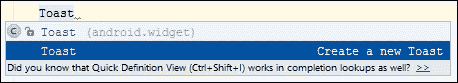
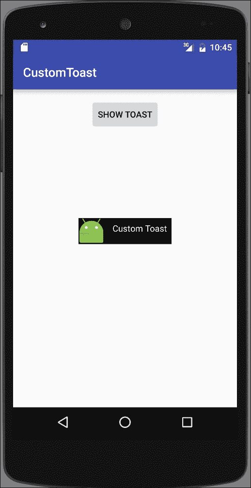
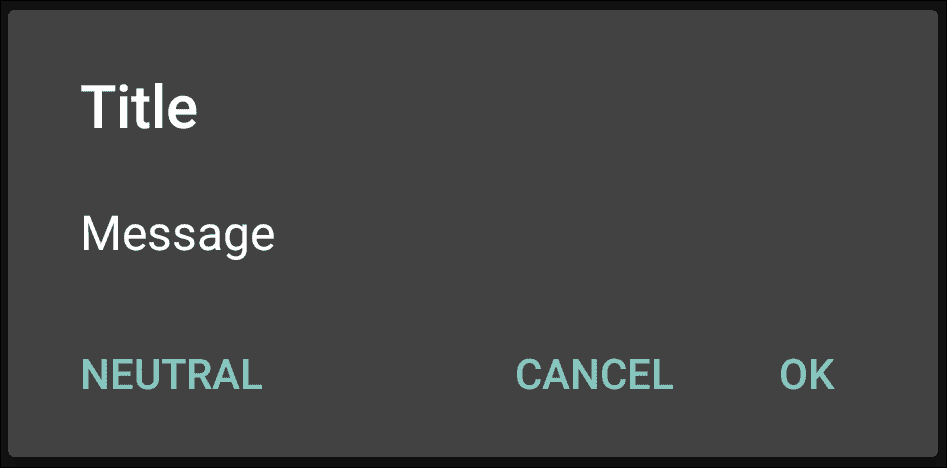
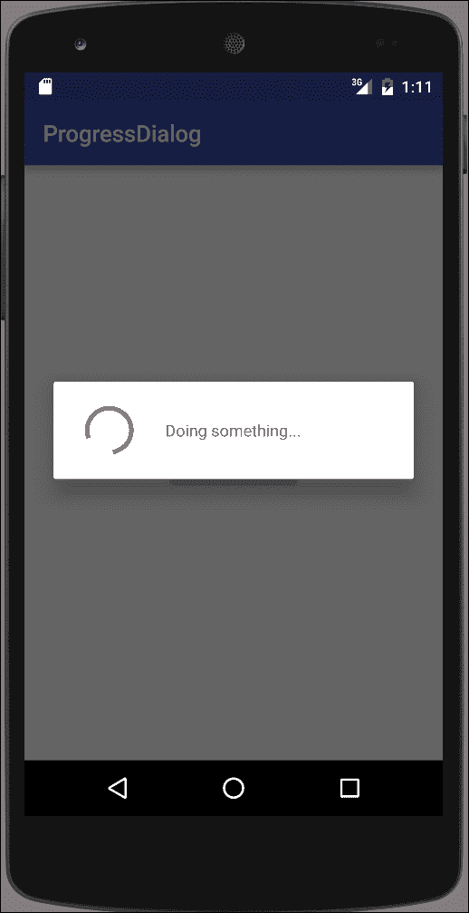
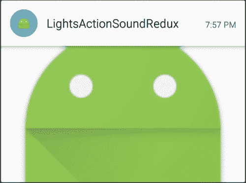

# 第七章。警报和通知

在本章中，我们将涵盖以下主题:

*   灯光、动作和声音——吸引用户的注意力！
*   使用自定义布局创建吐司
*   显示带有警报对话框的消息框
*   显示进度对话框
*   使用通知减少灯光、动作和声音
*   创建媒体播放器通知
*   制作带有提醒提示的手电筒

# 简介

安卓提供了许多通知用户的方法——从非视觉方法，包括声音、灯光和振动，到视觉方法，包括祝酒词、对话框和状态栏通知。

请记住，通知会分散您用户的注意力，因此在使用任何通知时非常明智是个好主意。用户喜欢控制他们的设备(毕竟这是他们的设备)，所以给他们一个选项来根据需要启用和禁用通知。否则，你的用户可能会生气，并完全卸载你的应用程序。

我们将从查看以下非基于用户界面的通知选项开始:

*   闪光发光二极管
*   振动电话
*   播放铃声

然后，我们将继续讨论视觉通知，包括:

*   烤面包
*   `AlertDialog`
*   `ProgressDialog`
*   状态栏通知

下面的食谱将向您展示如何在您自己的应用程序中实现这些功能。使用通知时，阅读以下链接以了解“最佳实践”是值得的:

### 类型

参考【开发人员.安卓. com/设计/模式/通知. html】的**安卓通知设计指南**

# 灯光、动作和声音——吸引用户的注意力！

本章中的大多数方法都使用 Notification 对象来提醒用户，所以这个方法会在您实际上不需要通知时显示一个替代方法。

正如菜谱标题所暗示的，我们将使用灯光、动作和声音:

*   **灯**:通常情况下，您会使用发光二极管设备，但这只能通过通知对象来实现，我们将在本章后面演示。相反，我们将借此机会使用`setTorchMode()`(在 API 23—Android 6.0 中添加)，将相机闪光灯用作手电筒。(注意:正如您将在代码中看到的，该功能仅适用于带有相机闪光灯的安卓 6.0 设备。)
*   **动作**:我们来震动手机。
*   **声音**:我们将使用`RingtoneManager`播放默认通知声音。

正如您将看到的，每一个的代码都非常简单。

如以下使用通知配方的*灯光、动作和声音还原所示，所有三个选项:发光二极管、振动和声音都可以通过通知对象获得。当用户没有积极参与您的应用程序时，通知对象无疑是提供警报和提醒的最合适的方法。但是当你想在他们使用你的应用程序时提供反馈时，这些选项是可用的。振动选项就是一个很好的例子；如果您想为按钮按压提供触觉反馈(键盘应用程序常见)，请直接调用振动方法。*

## 做好准备

在 Android Studio 中创建新项目，并将其称为:`LightsActionSound`。当提示输入 API 级别时，我们需要 API 21 或更高版本来编译项目。当提示输入**活动类型**时，选择**空活动**。

## 怎么做...

我们将使用三个按钮启动每个动作，因此从打开`activity_main.xml`开始，并按照以下步骤操作:

1.  用以下三个按钮替换现有的`<TextView>`元素:

    ```java
    <ToggleButton
        android:id="@+id/buttonLights"
        android:layout_width="wrap_content"
        android:layout_height="wrap_content"
        android:text="Lights"
        android:layout_centerHorizontal="true"
        android:layout_above="@+id/buttonAction"
        android:onClick="clickLights" />
    <Button
        android:id="@+id/buttonAction"
        android:layout_width="wrap_content"
        android:layout_height="wrap_content"
        android:text="Action"
        android:layout_centerVertical="true"
        android:layout_centerHorizontal="true"
        android:onClick="clickVibrate"/>
    <Button
        android:id="@+id/buttonSound"
        android:layout_width="wrap_content"
        android:layout_height="wrap_content"
        android:text="Sound"
        android:layout_below="@+id/buttonAction"
        android:layout_centerHorizontal="true"
        android:onClick="clickSound"/>
    ```

2.  将以下权限添加到安卓清单中:

    ```java
    <uses-permission android:name="android.permission.VIBRATE"></uses-permission>
    ```

3.  打开`ActivityMain.java`并添加以下全局变量:

    ```java
    private CameraManager mCameraManager;
    private String mCameraId=null;
    private ToggleButton mButtonLights;
    ```

4.  添加以下方法获取摄像机标识:

    ```java
    private String getCameraId() {
        try {
            String[] ids = mCameraManager.getCameraIdList();
            for (String id : ids) {
                CameraCharacteristics c = mCameraManager.getCameraCharacteristics(id);
                Boolean flashAvailable = c.get(CameraCharacteristics.FLASH_INFO_AVAILABLE);
                Integer facingDirection = c.get(CameraCharacteristics.LENS_FACING);
                if (flashAvailable != null && flashAvailable && facingDirection != null && facingDirection == CameraCharacteristics.LENS_FACING_BACK) {
                    return id;
                }
            }
        } catch (CameraAccessException e) {
            e.printStackTrace();
        }
        return null;
    }
    ```

5.  将以下代码添加到`onCreate()`方法中:

    ```java
    mButtonLights = (ToggleButton)findViewById(R.id.buttonLights);
    if (Build.VERSION.SDK_INT >= Build.VERSION_CODES.M) {
        mCameraManager = (CameraManager) this.getSystemService(Context.CAMERA_SERVICE);
        mCameraId = getCameraId();
        if (mCameraId==null) {
            mButtonLights.setEnabled(false);
        } else {
            mButtonLights.setEnabled(true);
        }
    } else {
        mButtonLights.setEnabled(false);
    }
    ```

6.  现在添加代码来处理每个按钮点击:

    ```java
    public void clickLights(View view) {
        if (Build.VERSION.SDK_INT >= Build.VERSION_CODES.M) {
            try {
                mCameraManager.setTorchMode(mCameraId, mButtonLights.isChecked());
            } catch (CameraAccessException e) {
                e.printStackTrace();
            }
        }
    }

    public void clickVibrate(View view) {
        ((Vibrator)getSystemService(VIBRATOR_SERVICE)).vibrate(1000);
    }

    public void clickSound(View view) {
        Uri notificationSoundUri = RingtoneManager.getDefaultUri(RingtoneManager.TYPE_NOTIFICATION);
        Ringtone ringtone = RingtoneManager.getRingtone(getApplicationContext(), notificationSoundUri);
        ringtone.play();
    }
    ```

7.  您已经准备好在物理设备上运行应用程序。这里展示的代码需要安卓 6.0(或更高版本)才能使用手电筒选项。

## 它是如何工作的...

从前面的段落中可以看出，大部分代码都与查找和打开相机以使用闪光灯功能有关。`setTorchMode()` 是在 API 23 中引入的，这也是我们进行 API 版本检查的原因:

```java
if (Build.VERSION.SDK_INT >= Build.VERSION_CODES.M){}
```

这个应用程序演示了如何使用棒棒糖(API 21)中引入的新`camera2`库。自 API 1 以来，`vibrate`和`ringtone`方法均已推出。

`getCameraId()`方法是我们检查摄像头的地方。我们想要一台带闪光灯的外向照相机。如果找到一个，返回标识，否则为空。如果摄像机 id 为空，我们禁用该按钮。

为了播放声音，我们使用来自`RingtoneManager`的`Ringtone`对象。除了相对容易实现之外，这种方法的另一个好处是我们可以使用默认的通知声音，这是通过下面的代码获得的:

```java
Uri notificationSoundUri = RingtoneManager.getDefaultUri(RingtoneManager.TYPE_NOTIFICATION);
```

这样，如果用户更改了他们喜欢的通知声音，我们会自动使用它。

最后是振动电话。这是使用起来最简单的代码，但是它确实需要权限，这是我们添加到清单中的:

```java
<uses-permission android:name="android.permission.VIBRATE"></uses-permission>
```

## 还有更多...

在生产级应用程序中，如果没有必要，您不会希望简单地禁用按钮。在这种情况下，还有其他方法可以将相机闪光灯用作手电筒。看看多媒体章节，了解更多使用相机的例子，我们会看到`getCameraId()`再次被使用。

## 另见

*   参见本章后面的*带通知的灯光、动作和声音还原*方法，查看使用通知对象的等效功能
*   参考[第 11 章](11.html "Chapter 11. Multimedia")、*多媒体*，了解使用新相机 API 和其他声音选项的示例

# 使用自定义布局创建吐司

在前面的章节中，我们已经使用了很多祝酒词，因为提供了一种快速简单的信息显示方式——在调试时，用户和我们自己都可以使用。

前面的例子都使用了简单的单行语法，但是 Toast 并不限于此。祝酒词，像安卓中的大多数组件一样，可以定制，正如我们将在本食谱中演示的那样。

安卓工作室为简单的吐司语句提供了一个快捷方式。当您开始键入吐司命令时，按下 *Ctrl* + *空格键*，您将看到以下内容:


按*进入*至自动完成。然后，再次按下 *Ctrl* + *空格键* ，您将看到以下内容:



再次按下*进入*时，会自动完成以下操作:

```java
Toast.makeText(MainActivity.this, "", Toast.LENGTH_SHORT).show();
```

在本食谱中，我们将使用吐司生成器来更改默认布局，并使用重力来创建一个自定义吐司，如下图所示:



## 做好准备

在 Android Studio 中创建新的项目，并将其称为:`CustomToast`。使用默认的**电话&平板**选项，当提示输入**活动类型**时，选择**空活动**。

## 怎么做...

我们将把吐司的形状改为正方形，并创建一个自定义布局来显示图像和文本消息。首先打开`activity_main.xml`，按照以下步骤操作:

1.  用`<Button>`替换现有的`<TextView>`元素，如下所示:

    ```java
    <Button
        android:layout_width="wrap_content"
        android:layout_height="wrap_content"
        android:text="Show Toast"
        android:id="@+id/button"
        android:layout_alignParentTop="true"
        android:layout_centerHorizontal="true"
        android:onClick="showToast"/>
    ```

2.  在名为`border_square.xml`的`res/drawable`文件夹中创建新的资源文件，并键入以下代码:

    ```java
    <?xml version="1.0" encoding="utf-8"?>
    <layer-list xmlns:android="http://schemas.android.com/apk/res/android">
        <item
            android:left="4px"
            android:top="4px"
            android:right="4px"
            android:bottom="4px">
            <shape android:shape="rectangle" >
                <solid android:color="@android:color/black" />
                <stroke android:width="5px" android:color="@android:color/white"/>
            </shape>
        </item>
    </layer-list>
    ```

3.  在名为`toast_custom.xml`的`res/layout`文件夹中创建新的资源文件，并键入以下代码:

    ```java
    <?xml version="1.0" encoding="utf-8"?>
    <LinearLayout xmlns:android="http://schemas.android.com/apk/res/android"
        android:id="@+id/toast_layout_root"
        android:layout_width="match_parent"
        android:layout_height="match_parent"
        android:orientation="horizontal"
        android:background="@drawable/border_square">
        <ImageView
            android:layout_width="wrap_content"
            android:layout_height="wrap_content"
            android:id="@+id/imageView"
            android:layout_weight="1"
            android:src="@mipmap/ic_launcher" />
        <TextView
            android:id="@android:id/message"
            android:layout_width="0dp"
            android:layout_height="match_parent"
            android:layout_weight="1"
            android:textColor="@android:color/white"
            android:padding="10dp" />
    </LinearLayout>
    ```

4.  现在打开`ActivityMain.java`并输入以下方法:

    ```java
    public void showToast(View view) {
        LayoutInflater inflater = (LayoutInflater)this.getSystemService(Context.LAYOUT_INFLATER_SERVICE);
        View layout = inflater.inflate(R.layout.toast_custom, null);
        ((TextView) layout.findViewById(android.R.id.message)).setText("Custom Toast");
        Toast toast = new Toast(this);
        toast.setGravity(Gravity.CENTER, 0, 0);
        toast.setDuration(Toast.LENGTH_LONG);
        toast.setView(layout);
        toast.show();
    }
    ```

5.  在设备或模拟器上运行程序。

## 它是如何工作的...

这个定制的吐司改变了默认的重力，形状，并添加了一个图像，只是为了显示“这是可以做到的”。

第一步是创建一个新的吐司布局，我们通过膨胀我们的`custom_toast`布局来实现。一旦我们有了新的布局，我们需要得到`TextView`，这样我们就可以设置我们的消息，这是我们用标准的`setText()`方法做的。完成后，我们创建一个 Toast 对象并设置各个属性。我们用`setGravity()`方法设置吐司重力。重力决定了我们的吐司在屏幕上的显示位置。我们使用`setView()`方法调用来指定我们的自定义布局。就像在单行变体中一样，我们使用`show()`方法显示吐司。

# 显示带有警报对话框的消息框

在[第 4 章](04.html "Chapter 4. Menus")、*菜单*中，我们创建了一个主题，使活动看起来像一个对话框。在这个食谱中，我们将演示如何使用`AlertDialog`类创建一个对话框。`AlertDialog`提供一个标题，最多三个按钮，以及一个列表或自定义布局区域，如本例所示:



### 注

按钮的位置可能因操作系统版本而异。

## 做好准备

在安卓工作室新建一个项目，并命名为:`AlertDialog`。使用默认的**电话&平板电脑**选项，并在提示输入**活动类型**时选择**空活动**选项。

## 怎么做...

为了演示，我们将创建一个**确认删除**对话框，在按下*删除*按钮后提示用户确认。首先打开`main_activity.xml`布局文件，按照以下步骤操作:

1.  增加以下`<Button>` :

    ```java
    <Button
        android:id="@+id/buttonClose"
        android:layout_width="wrap_content"
        android:layout_height="wrap_content"
        android:text="Delete"
        android:layout_centerVertical="true"
        android:layout_centerHorizontal="true"
        android:onClick="confirmDelete"/>
    ```

2.  添加按钮调用的`confirmDelete()`方法:

    ```java
    public void confirmDelete(View view) {
        AlertDialog.Builder builder = new AlertDialog.Builder(this);
        builder.setTitle("Delete")
            .setMessage("Are you sure you?")
            .setPositiveButton(android.R.string.ok, new DialogInterface.OnClickListener() {
                public void onClick(DialogInterface dialog, int id) {
                    Toast.makeText(MainActivity.this, "OK Pressed", Toast.LENGTH_SHORT).show();
            }})
            .setNegativeButton(android.R.string.cancel, new DialogInterface.OnClickListener() {
                public void onClick(DialogInterface dialog, int id) {
                    Toast.makeText(MainActivity.this, "Cancel Pressed", Toast.LENGTH_SHORT).show();
            }});
        builder.create().show();
    }
    ```

3.  在设备或模拟器上运行应用程序。

## 它是如何工作的...

该对话框旨在作为一个简单的确认对话框，例如确认删除操作。基本上，只需创建一个`AlertDialog.Builder`对象，并根据需要设置属性。我们使用 Toast 消息来指示用户的选择，我们甚至不需要关闭对话框；它由基类处理。

## 还有更多...

如菜谱介绍截图所示，`AlertDialog`还有第三个按钮，叫做 Neutral 按钮，可以用以下方法设置:

```java
builder.setNeutralButton()
```

### 添加图标

要在对话框中添加图标，请使用`setIcon()`方法。这里有一个例子:

```java
.setIcon(R.mipmap.ic_launcher)
```

### 使用列表

我们还可以通过各种列表设置方法创建一个要选择的项目列表，包括:

```java
.setItems()
.setAdapter()
.setSingleChoiceItems()
.setMultiChoiceItems()
```

如您所见，也有方法用于单项选择(使用单选按钮)和多项选择列表(使用复选框)。

### 类型

您不能同时使用消息和列表，因为`setMessage()`将优先。

### 自定义布局

最后，我们还可以创建一个自定义布局，并使用:

```java
.setView()
```

如果使用自定义布局并替换标准按钮，您还需要负责关闭对话框。如果您计划重用对话框，请使用`hide()`，完成后使用`dismiss()`释放资源。

# 显示进度对话框

自 API 1 以来，`ProgressDialog`一直是可用，并被广泛使用。正如我们将在本食谱中演示的那样，它使用起来很简单，但请记住这一点(来自安卓对话指南网站):

> 避免进度对话框
> 
> 安卓包括另一个名为 ProgressDialog 的对话框类，它显示一个带有进度条的对话框。但是，如果您需要指示加载或不确定的进度，您应该遵循进度和活动的设计准则，并在布局中使用进度栏。

[http://developer.android.com/guide/topics/ui/dialogs.html](http://developer.android.com/guide/topics/ui/dialogs.html)

该消息并不意味着`ProgressDialog`被否决或为错误代码。建议避免使用`ProgressDialog`，因为对话框显示时，用户无法与您的应用程序交互。如果可能，使用包含进度条的布局，而不是使用`ProgressDialog`。

谷歌游戏应用程序提供了一个很好的例子。添加要下载的项目时，Google Play 会显示一个进度条，但不是对话框，这样用户就可以继续与应用进行交互，甚至添加更多要下载的项目。如果可能的话，使用这种方法。

有时候你可能没有这种奢侈，比如下订单后，用户会期待订单确认。(即使使用谷歌 Play，在实际购买应用程序时，您仍然会看到确认对话框。)所以，请记住，尽可能避免进度对话框。但是，当某些事情必须在继续之前完成时，这个食谱提供了一个如何使用`ProgressDialog`的例子。以下截图显示了配方中的`ProgressDialog`:



## 做好准备

在安卓工作室新建一个项目，并命名为:`ProgressDialog`。使用默认的**电话&平板电脑**选项，并在提示输入**活动类型**时选择**空活动**。

## 怎么做...

1.  由于这只是使用 ProgressDialog 的演示，我们将创建一个按钮来显示对话框。为了模拟等待服务器响应，我们将使用延迟的消息来关闭对话框。首先，打开`activity_main.xml`并按照以下步骤操作:
2.  将`<TextView>`替换为以下`<Button>` :

    ```java
    <Button
        android:layout_width="wrap_content"
        android:layout_height="wrap_content"
        android:text="Show Dialog"
        android:id="@+id/button"
        android:layout_centerVertical="true"
        android:layout_centerHorizontal="true"
        android:onClick="startProgress"/>
    ```

3.  打开`MainActivity.java`并添加以下两个全局变量:

    ```java
    private ProgressDialog mDialog;
    final int THIRTY_SECONDS=30*1000;
    ```

4.  添加按钮点击引用的`showDialog()`方法:

    ```java
    public void startProgress(View view) {
        mDialog= new ProgressDialog(this);
        mDialog.setMessage("Doing something...");
        mDialog.setCancelable(false);
        mDialog.show();
        new Handler().postDelayed(new Runnable() {
            public void run() {
                mDialog.dismiss();
            }}, THIRTY_SECONDS);
    ```

5.  在设备或模拟器上运行程序。当您按下**显示对话框**按钮时，您将从介绍中看到如屏幕所示的对话框。

## 它是如何工作的...

我们使用`ProgressDialog`类来显示我们的对话框。选项应该是不言自明的，但是这个设置值得注意:

```java
mDialog.setCancelable(false);
```

正常情况下，可以使用*后退*键取消对话框，但当该键设置为假时，用户会一直停留在对话框上，直到它从代码中隐藏/消失。为了模拟服务器的延迟响应，我们使用`Handler`和`postDelayed()`方法。在指定的毫秒(在本例中为 30，000，代表 30 秒)之后，将调用`run()`方法，该方法将关闭我们的对话框。

## 还有更多...

我们使用了这个配方的默认`ProgressDialog`设置，它创建了一个不确定的对话框指示器，例如，连续旋转的圆圈。如果您可以测量手头的任务，例如加载文件，则可以使用确定的样式。添加并运行这一行代码:

```java
mDialog.setProgressStyle(ProgressDialog.STYLE_HORIZONTAL);
```

您将获得以下对话框样式作为前一行代码的输出:


# 使用通知减少灯光、动作和声音

您可能已经熟悉通知，因为它们已经成为一个突出的特性(甚至正在进入桌面环境)并且有充分的理由。它们提供了一种向用户发送信息的绝佳方式。在所有可用的警报和通知选项中，它们提供了侵入性最小的选项。

正如我们在第一份食谱中看到的那样，*灯光、动作和声音——吸引用户的注意力！*、灯光、震动、声音都非常有助于吸引用户的注意力。这就是为什么 Notification 对象包括对所有三种方法的支持，正如我们将在本食谱中演示的那样。考虑到这种吸引用户注意力的能力，仍然应该注意不要滥用你的用户。否则，他们可能会卸载你的应用程序。一般来说，让您的用户选择启用/禁用通知，甚至选择如何呈现通知(有声音或没有声音，等等)是一个好主意。

## 做好准备

在 Android Studio 中创建新项目，并将其称为:`LightsActionSoundRedux`。使用默认的**电话&平板电脑**选项，并在提示输入**活动类型**时选择**空活动**。

## 怎么做...

我们需要获得使用振动选项的许可，因此从打开安卓清单文件开始，并按照以下步骤操作:

1.  添加以下权限:

    ```java
    <uses-permission android:name="android.permission.VIBRATE"/>
    ```

2.  打开`activity_main.xml`并用以下按钮替换现有的【T1:

    ```java
    <Button
        android:id="@+id/buttonSound"
        android:layout_width="wrap_content"
        android:layout_height="wrap_content"
        android:text="Lights, Action, and Sound"
        android:layout_centerVertical="true"
        android:layout_centerHorizontal="true"
        android:onClick="clickLightsActionSound"/>
    ```

3.  现在打开`MainActivity.java`并添加以下方法来处理按钮点击:

    ```java
    public void clickLightsActionSound(View view) {
        Uri notificationSoundUri = RingtoneManager.getDefaultUri(RingtoneManager.TYPE_NOTIFICATION);
        NotificationCompat.Builder notificationBuilder = new NotificationCompat.Builder(this)
            .setSmallIcon(R.mipmap.ic_launcher)
            .setContentTitle("LightsActionSoundRedux")
            .setContentText("Lights, Action & Sound")
            .setSound(notificationSoundUri)
            .setLights(Color.BLUE, 500, 500)
            .setVibrate(new long[]{250,500,250,500,250,500});
        NotificationManager notificationManager = (NotificationManager) this.getSystemService(Context.NOTIFICATION_SERVICE);
        notificationManager.notify(0, notificationBuilder.build());
    }
    ```

4.  在设备或模拟器上运行程序。

## 它是如何工作的...

首先，我们将所有三个动作组合成一个通知，仅仅因为我们可以。您不必使用所有三个额外的通知选项，甚至任何选项。仅需要以下内容:

```java
.setSmallIcon()
.setContentText()
```

如果您没有设置图标和文本，通知将不会显示。

其次，我们使用`NotificationCompat`来构建我们的通知。这来自于支持库，使其更容易向后兼容旧的操作系统版本。如果我们请求的通知功能在用户的操作系统版本上不可用，它将被忽略。

产生额外通知选项的三行代码包括以下内容:

```java
.setSound(notificationSoundUri)
.setLights(Color.BLUE, 500, 500)
.setVibrate(new long[]{250,500,250,500,250,500});
```

值得注意的是，我们在通知中使用了与早期*灯光、动作和声音*配方中`RingtoneManager`相同的声音 URI。振动功能也需要与前一个配方相同的振动许可，但是请注意我们发送的值是不同的。我们发送的不是振动的持续时间，而是振动模式。第一个值代表`off`持续时间(毫秒)，下一个值代表振动`on`持续时间，并重复。

### 类型

在带有发光二极管通知的设备上，当屏幕处于活动状态时，您将看不到发光二极管通知。

## 还有更多...

这个食谱展示了通知的基础知识，但是像安卓上的许多功能一样，选项随着操作系统的发布而扩展。

### 使用 addAction()向通知添加按钮

添加动作按钮时，您应该记住几个设计注意事项，如介绍一章中链接的通知指南中所列。您可以使用通知生成器上的`addAction()`方法添加一个按钮(最多三个)。下面是一个带有一个操作按钮的通知示例:


下面是创建这个通知的代码:

```java
NotificationCompat.Builder notificationBuilder = new NotificationCompat.Builder(this).setSmallIcon(R.mipmap.ic_launcher)
        .setContentTitle("LightsActionSoundRedux")
        .setContentText("Lights, Action & Sound");
Intent activityIntent = new Intent(this,MainActivity.class);
PendingIntent pendingIntent = PendingIntent.getActivity(this,0,activityIntent,0);
notificationBuilder.addAction(android.R.drawable.ic_dialog_email, "Email", pendingIntent);
notificationManager.notify(0, notificationBuilder.build());
```

一个`Action`需要三个参数——图像、文本和一个`PendingIntent`。前两项用于视觉显示，而第三项`PendingIntent`在用户按下按钮时被调用。

前面的代码创建了一个非常简单的`PendingIntent;`，它只是启动应用程序。这可能是通知最常见的意图，通常用于用户按下通知时。要设置通知意图，请使用以下代码:

```java
.setContentIntent(pendingIntent)
```

一个按钮动作可能需要更多的信息，因为它应该把用户带到你的应用程序中的特定项目。您还应该创建一个应用程序堆栈，以获得最佳的用户体验。查看以下链接中的主题“开始活动时保留导航”:

[http://developer . Android . com/guide/topics/ui/notification/notification . html # notification response](http://developer.android.com/guide/topics/ui/notifiers/notifications.html#NotificationResponse)

### 扩展通知

扩展通知是在 Android 4.1 (API 16)中引入的，可以通过通知构建器上的`setStyle()`方法获得。如果用户的操作系统不支持扩展通知，该通知将显示为普通通知。

`NotificationCompat`库中当前可用的三种扩展样式包括:

*   `InboxStyle`
*   `BigPictureStyle`
*   `BigTextStyle`

下面是每个通知样式的示例，以及用于创建示例的代码:


*   `InboxStyle`:

    ```java
    NotificationCompat.Builder notificationBuilderInboxStyle = new NotificationCompat.Builder(this).setSmallIcon(R.mipmap.ic_launcher);
    NotificationCompat.InboxStyle inboxStyle = new NotificationCompat.InboxStyle();
    inboxStyle.setBigContentTitle("InboxStyle - Big Content Title")
        .addLine("Line 1")
        .addLine("Line 2");
    notificationBuilderInboxStyle.setStyle(inboxStyle);
    notificationManager.notify(0, notificationBuilderInboxStyle.build());
    ```

    

*   `BigPictureStyle`:

    ```java
    NotificationCompat.Builder notificationBuilderBigPictureStyle = new NotificationCompat.Builder(this).setSmallIcon(R.mipmap.ic_launcher).setContentTitle("LightsActionSoundRedux").setContentText("BigPictureStyle");
    NotificationCompat.BigPictureStyle bigPictureStyle = new NotificationCompat.BigPictureStyle();
    bigPictureStyle.bigPicture(BitmapFactory.decodeResource(getResources(), R.mipmap.ic_launcher));
    notificationBuilderBigPictureStyle.setStyle(bigPictureStyle);
    notificationManager.notify(0, notificationBuilderBigPictureStyle.build());
    ```

    

*   `BigTextStyle`

    ```java
    NotificationCompat.Builder notificationBuilderBigTextStyle = new NotificationCompat.Builder(this).setSmallIcon(R.mipmap.ic_launcher).setContentTitle("LightsActionSoundRedux");
    NotificationCompat.BigTextStyle BigTextStyle = new NotificationCompat.BigTextStyle();
    BigTextStyle.bigText("This is an example of the BigTextStyle expanded notification.");
    notificationBuilderBigTextStyle.setStyle(BigTextStyle);
    notificationManager.notify(0, notificationBuilderBigTextStyle.build());
    ```

### 锁定屏幕通知

安卓 5.0 (API 21)及以上可以在锁屏显示通知，基于用户的锁屏可见性。使用`setVisibility()`使用以下值指定通知可见性:

*   `VISIBILITY_PUBLIC`:可以显示所有内容
*   `VISIBILITY_SECRET`:不应显示任何内容
*   `VISIBILITY_PRIVATE`:显示基本内容(标题和图标)，其余隐藏

## 另见

*   有关 Android 5.0 (API 21)及更高版本的其他通知选项，请参见*创建媒体播放器通知*和*制作带抬头通知的手电筒*菜谱

# 创建媒体播放器通知

这个食谱将带你去看看安卓 5.0 (API 21)中引入的新媒体播放器风格。与之前使用`NotificationCompat`的*灯光、动作和声音还原使用通知的*不同，这个配方没有，因为这个样式在支持库中不可用。

下面是显示通知将如何显示的屏幕截图:


此屏幕截图显示了锁定屏幕上的媒体播放器通知示例:


## 做好准备

在 Android Studio 中创建新项目，并将其称为:`MediaPlayerNotification`。当提示输入应用编程接口级别时，我们需要这个项目的应用编程接口 21(或更高)。当提示输入**活动类型**时，选择**空活动**。

## 怎么做...

我们只需要一个按钮来调用我们的代码来发送通知。打开`activity_main.xml`并按照以下步骤操作:

1.  将现有的`<TextView>`替换为以下按钮代码:

    ```java
    <Button
        android:layout_width="wrap_content"
        android:layout_height="wrap_content"
        android:text="Show Notification"
        android:id="@+id/button"
        android:layout_centerVertical="true"
        android:layout_centerHorizontal="true"
        android:onClick="showNotification"/>
    ```

2.  打开`MainActivity.java`并添加`showNotification()`方法:

    ```java
    @Deprecated
    public void showNotification(View view) {
        Intent activityIntent = new Intent(this,MainActivity.class);
        PendingIntent pendingIntent = PendingIntent.getActivity(this, 0, activityIntent, 0);

        Notification notification;
        if (Build.VERSION.SDK_INT >= Build.VERSION_CODES.M) {
            notification = new Notification.Builder(this).setVisibility(Notification.VISIBILITY_PUBLIC)
                .setSmallIcon(Icon.createWithResource(this, R.mipmap.ic_launcher))
                .addAction(new Notification.Action.Builder(Icon.createWithResource(this, android.R.drawable.ic_media_previous), "Previous", pendingIntent).build())
                .addAction(new Notification.Action.Builder(Icon.createWithResource(this, android.R.drawable.ic_media_pause), "Pause", pendingIntent).build())
                .addAction(new Notification.Action.Builder(Icon.createWithResource(this, android.R.drawable.ic_media_next), "Next", pendingIntent).build())
                .setContentTitle("Music")
                .setContentText("Now playing...")
                .setLargeIcon(Icon.createWithResource(this, R.mipmap.ic_launcher))
                .setStyle(new Notification.MediaStyle().setShowActionsInCompactView(1)).build();
        } else {
            notification = new Notification.Builder(this)
                .setVisibility(Notification.VISIBILITY_PUBLIC)
                .setSmallIcon(R.mipmap.ic_launcher)
                .addAction(new Notification.Action.Builder(android.R.drawable.ic_media_previous, "Previous", pendingIntent).build())
                .addAction(new Notification.Action.Builder(android.R.drawable.ic_media_pause, "Pause", pendingIntent).build())
                .addAction(new Notification.Action.Builder(android.R.drawable.ic_media_next, "Next", pendingIntent).build())
                .setContentTitle("Music")
                .setContentText("Now playing...")
                .setLargeIcon(BitmapFactory.decodeResource(getResources(), R.mipmap.ic_launcher))
                .setStyle(new Notification.MediaStyle()
                .setShowActionsInCompactView(1)).build();
        }
        NotificationManager notificationManager = (NotificationManager) this.getSystemService(Context.NOTIFICATION_SERVICE);
        notificationManager.notify(0, notification);
    }
    ```

3.  在设备或仿真器上运行程序。

## 它是如何工作的...

需要注意的第一个细节是，我们用以下方法来装饰我们的`showNotification()`方法:

```java
@Deprecated
```

这告诉编译器我们知道我们正在使用不推荐使用的调用。(如果没有这个，编译器将标记代码。)我们使用 API 检查遵循这一点，使用以下调用:

```java
if (Build.VERSION.SDK_INT >= Build.VERSION_CODES.M)
```

在 API 23 中更改了图标资源，但是我们希望这个应用在 API 21 (Android 5.0)及更高版本上运行，所以在 API 21 和 API 22 上运行时仍然需要调用旧方法。

如果用户在安卓 6.0(或更高版本)上运行，我们使用新的`Icon`类来创建我们的图标，否则我们使用旧的构造函数。(您会注意到集成开发环境会用删除线显示不推荐使用的调用。)在运行时检查当前操作系统版本是保持向后兼容的常见策略。

我们使用`addAction()`创建三个动作来处理媒体播放器功能。因为我们没有真正的媒体播放器，所以我们对所有的动作都使用相同的意图，但是您会想要在您的应用程序中创建单独的意图。

为了使通知在锁定屏幕上可见，我们需要将可见性级别设置为`VISIBILITY_PUBLIC`，我们通过以下调用来实现:

```java
.setVisibility(Notification.VISIBILITY_PUBLIC)
```

这个电话毫无价值:

```java
.setShowActionsInCompactView(1)
```

正如方法名所暗示的，这设置了当通知以简化的布局显示时要显示的操作。(见菜谱介绍中的锁屏图。)

## 还有更多...

我们只在这个食谱中创建了视觉通知。如果我们正在创建一个实际的媒体播放器，我们可以实例化一个`MediaSession`类，并通过这个调用传递会话令牌:

```java
.setMediaSession(mMediaSession.getSessionToken())
```

这将允许系统识别媒体内容并做出相应的反应，例如用当前专辑插图更新锁定屏幕。

## 另见

*   参考**开发者文档-媒体会话** 在[https://Developer . Android . com/reference/Android/media/session . html](https://developer.android.com/reference/android/media/session/MediaSession.html)
*   使用通知菜单的*灯光、动作和声音还原中的*锁定屏幕可见性*部分讨论了可见性选项。*

# 制作带有抬头通知的手电筒

安卓 5.0——棒棒糖(API 21)引入了一种新型通知，称为平视通知。许多人不喜欢这种新的通知，因为它可能会极具侵扰性，因为它会强行凌驾于其他应用之上。(见下面截图。)在使用这种类型的通知时，请记住这一点。我们将用手电筒演示抬头通知，因为这展示了一个很好的用例场景。

这是一张截图，显示了我们将进一步创建的提醒通知:


如果你有一个运行安卓 6.0 的设备，你可能已经注意到了新的手电筒设置选项。作为示范，我们将在这个配方中创建类似的东西。

## 做好准备

在 Android Studio 中创建新项目，并将其称为:`FlashlightWithHeadsUp`。当提示输入应用编程接口级别时，我们需要这个项目的应用编程接口 23(或更高)。当提示输入**活动类型**时，选择**空活动**。

## 怎么做...

我们的活动布局将只包含一个`ToggleButton`来控制手电筒模式。我们将使用与*灯光、动作和声音相同的`setTorchMode()`代码——吸引用户的注意力！*配方前面已经介绍过了，加一个抬头通知。我们需要获得使用振动选项的许可，所以首先打开安卓清单并按照以下步骤操作:

1.  添加以下权限:

    ```java
    <uses-permission android:name="android.permission.VIBRATE"/>
    ```

2.  通过将`android:launchMode="singleInstance"`添加到`<MainActivity>`元素中，指定我们只需要`MainActivity`的单个实例。看起来如下:

    ```java
    <activity android:name=".MainActivity"
        android:launchMode="singleInstance">
    ```

3.  完成对`AndroidManifest`的更改后，打开的`activity_main.xml`布局，并用此`<ToggleButton>`代码替换现有的`<TextView>`元素:

    ```java
    <ToggleButton
        android:id="@+id/buttonLight"
        android:layout_width="wrap_content"
        android:layout_height="wrap_content"
        android:text="Flashlight"
        android:layout_centerVertical="true"
        android:layout_centerHorizontal="true"
        android:onClick="clickLight"/>
    ```

4.  现在打开`ActivityMain.java`并添加以下全局变量:

    ```java
    private static final String ACTION_STOP="STOP";
    private CameraManager mCameraManager;
    private String mCameraId=null;
    private ToggleButton mButtonLight;
    ```

5.  将以下代码添加到`onCreate()`以设置摄像机:

    ```java
    mButtonLight = (ToggleButton)findViewById(R.id.buttonLight);

    mCameraManager = (CameraManager) this.getSystemService(Context.CAMERA_SERVICE);
    mCameraId = getCameraId();
    if (mCameraId==null) {
        mButtonLight.setEnabled(false);
    } else {
        mButtonLight.setEnabled(true);
    }
    ```

6.  增加以下方法处理用户按下通知时的响应:

    ```java
    @Override
    protected void onNewIntent(Intent intent) {
        super.onNewIntent(intent);
        if (ACTION_STOP.equals(intent.getAction())) {
            setFlashlight(false);
        }
    }
    ```

7.  添加获取摄像机 id 的方法:

    ```java
    private String getCameraId() {
        try {
            String[] ids = mCameraManager.getCameraIdList();
            for (String id : ids) {
                CameraCharacteristics c = mCameraManager.getCameraCharacteristics(id);
                Boolean flashAvailable = c.get(CameraCharacteristics.FLASH_INFO_AVAILABLE);
                Integer facingDirection = c.get(CameraCharacteristics.LENS_FACING);
                if (flashAvailable != null && flashAvailable && facingDirection != null && facingDirection == CameraCharacteristics.LENS_FACING_BACK) {
                    return id;
                }
            }
        } catch (CameraAccessException e) {
            e.printStackTrace();
        }
        return null;
    }
    ```

8.  将这两种方法添加到手柄手电筒模式:

    ```java
    public void clickLight(View view) {
        setFlashlight(mButtonLight.isChecked());
        if (mButtonLight.isChecked()) {
            showNotification();
        }
    }

    private void setFlashlight(boolean enabled) {
        mButtonLight.setChecked(enabled);
        try {
            mCameraManager.setTorchMode(mCameraId, enabled);
        } catch (CameraAccessException e) {
            e.printStackTrace();
        }
    }
    ```

9.  最后，添加这个方法来创建通知:

    ```java
    private void showNotification() {
        Intent activityIntent = new Intent(this,MainActivity.class);
        activityIntent.setAction(ACTION_STOP);
        PendingIntent pendingIntent = PendingIntent.getActivity(this,0,activityIntent,0);
        final Builder notificationBuilder = new Builder(this).setContentTitle("Flashlight")
            .setContentText("Press to turn off the flashlight")
            .setSmallIcon(R.mipmap.ic_launcher)
            .setLargeIcon(BitmapFactory.decodeResource(getResources(), R.mipmap.ic_launcher))
            .setContentIntent(pendingIntent)
            .setVibrate(new long[]{DEFAULT_VIBRATE})
            .setPriority(PRIORITY_MAX);
        NotificationManager notificationManager = (NotificationManager) this.getSystemService(Context.NOTIFICATION_SERVICE);
        notificationManager.notify(0, notificationBuilder.build());
    }
    ```

10.  您已经准备好在物理设备上运行应用程序。如前所述，您将需要一个安卓 6.0(或更高版本)设备，带有朝外的相机闪光灯。

## 它是如何工作的...

因为这个食谱使用与*相同的手电筒代码，灯光，动作和声音–引起用户的注意！*，我们马上跳到`showNotification()`法。大多数通知生成器调用与前面的示例相同，但有两个显著的区别:

```java
.setVibrate()
.setPriority(PRIORITY_MAX)
```

### 类型

除非优先级设置为`HIGH`(或以上)并使用振动或声音，否则通知不会升级为平视通知。

请从以下网站的开发者文档中注意这一点:[http://Developer . Android . com/reference/Android/app/notification . html # headlocontentview](http://developer.android.com/reference/android/app/Notification.html#headsUpContentView):

系统用户界面可自行决定将此显示为提醒通知

我们像以前一样创建了一个`PendingIntent`，但是在这里我们设置了动作:

```java
activityIntent.setAction(ACTION_STOP);
```

我们将应用设置为只允许`AndroidManifest`文件中的单个实例，因为我们不想在用户按下通知时启动应用的新实例。我们创建的`PendingIntent`设置动作，我们在`onNewIntent()`回调中检查动作。如果用户在没有按下通知的情况下打开应用，他们仍然可以使用`ToggleButton`禁用手电筒。

## 还有更多...

就像前面的*使用自定义布局*创建吐司一样，我们可以使用带有通知的自定义布局。在生成器上使用以下方法指定布局:

```java
headsupContentView()
```

## 另见

*   参考*灯、动作、嗖**nd–引起用户注意！*食谱