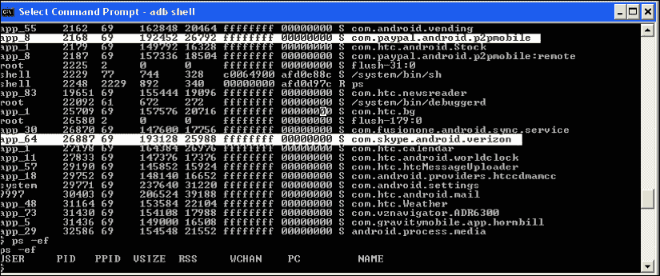
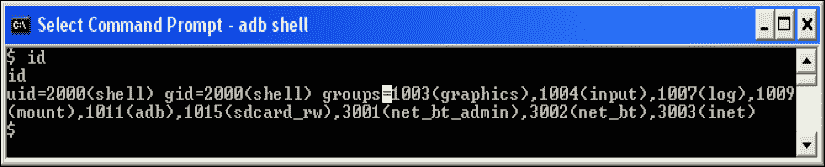
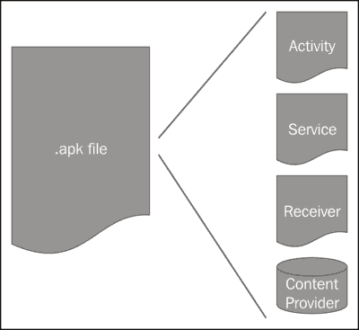
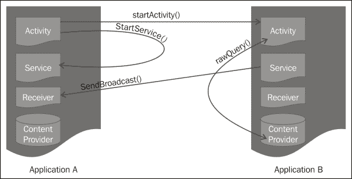

# 第一章。安卓安全模式——大局

欢迎来到*安卓应用安全精要*第一章！

安卓堆栈在许多方面都有所不同。它是开放的；比其他一些平台更先进，并从过去开发移动平台的尝试中吸取了经验。在第一章中，我们介绍了从内核到应用程序级别的安卓安全模型的基础知识。本章中介绍的每个安全构件将在后面的章节中详细讨论。

我们以解释为什么安装时间应用程序权限评估对于安卓平台和用户数据的安全性是不可或缺的开始这一章。Android 有一个分层的架构，本章将讨论每个架构层的安全性评估。我们在这一章的最后讨论了核心安全工件，如应用程序签名、设备上的安全数据存储、加密应用编程接口和安卓设备的管理。

# 小心安装

安卓与其他移动操作系统的区别因素之一是应用程序权限的安装时间审查。应用程序所需的所有权限都必须在应用程序的清单文件中声明。这些权限是应用程序正常运行所需的功能。示例包括访问用户的联系人列表、从电话发送短信、打电话和访问互联网。有关权限的详细说明，请参考[第 3 章](03.html "Chapter 3. Permissions")、*权限*。

当用户安装应用程序时，清单文件中声明的所有权限都会呈现给用户。然后，用户可以选择查看权限，并做出安装或不安装应用程序的明智决定。用户应该非常仔细地检查这些权限，因为这是用户唯一一次被要求权限。在此步骤之后，用户对应用程序没有控制权。用户能做的最好的事情就是卸载应用程序。参考下面的截图作为参考。在这个例子中，应用程序将跟踪或访问用户位置，它将使用网络，读取用户的联系人列表，读取电话状态，并将使用一些开发功能。在筛选该应用的安全性时，用户必须评估是否需要授予该应用一定的权限。如果这是一个游戏应用程序，它可能不需要开发工具功能。如果这是一个面向儿童的教育应用程序，它应该不需要访问联系人列表或用户位置。还要注意，开发人员可以添加他们自己的权限，尤其是如果他们想要与他们已经开发并可能安装在设备上的其他应用程序进行通信。开发人员有责任提供这种权限的清晰描述。

在安装时，框架确保应用程序中使用的所有权限都在清单文件中声明。然后，操作系统在运行时强制执行这些权限。

# 安卓平台架构

安卓是一个现代操作系统，有一个分层的软件栈。下图说明了安卓软件栈中的各层。这个软件栈运行在设备硬件之上。安卓的软件堆栈可以运行在许多不同的硬件配置上，如智能手机、平板电脑、电视，甚至是嵌入式设备，如微波炉、冰箱、手表和笔。每一层都提供了安全性，为移动应用的运行和执行创造了一个安全的环境。在本节中，我们将讨论安卓堆栈的每一层提供的安全性。

## Linux 内核

设备硬件之上是 **Linux 内核**。Linux 内核作为一个安全的多用户操作系统已经使用了几十年，将一个用户与另一个用户隔离开来。安卓使用 Linux 的这个属性作为安卓安全的基础。把安卓想象成一个多用户平台，每个用户都是一个应用，每个应用都是相互隔离的。Linux 内核托管设备驱动程序，例如蓝牙、摄像头、无线网络和闪存的驱动程序。内核还提供了一种机制来保护**远程过程调用** ( **RPC** )。

当每个应用程序安装在设备上时，它会被赋予唯一的**用户标识** ( **UID** )和**组标识** ( **GID** )。只要安装在设备上，该 UID 就是应用程序的标识。

参考下面的截图。第一列是所有的应用指南。请注意高亮显示的应用程序。应用程序`com.paypal.com`有 UID `app_8`，`com.skype.com`有 UID `app_64`。在 Linux 内核中，这两个应用程序都在自己的进程中使用这个 ID 运行。

参考下一张截图。当我们在 shell 中给出`id`命令时，内核显示 UID、GID 和 shell 关联的组。这是安卓用来隔离一个进程和另一个进程的进程沙箱模型。两个进程可以相互共享数据。这样做的适当机制在[第 4 章](04.html "Chapter 4. Defining the Application's Policy File")、*定义应用程序的策略文件*中讨论。

虽然大多数安卓应用都是用 Java 编写的，但有时需要编写原生的应用。原生应用程序更加复杂，因为开发人员需要管理内存和设备特定的问题。开发人员可以使用安卓 NDK 工具集，用 C/C++开发部分应用程序。所有原生应用都符合 Linux 进程沙箱；本机应用程序和 Java 应用程序的安全性没有区别。请记住，就像任何 Java 应用程序一样，需要适当的安全构件，如加密、哈希和安全通信。

## 中间件

在 Linux 内核的顶部是中间件，它为代码执行提供库。这样的库的例子有`libSSL`、`libc`、`OpenGL`。该层还为 Java 应用程序提供运行时环境。

由于大多数用户在安卓系统上用 Java 编写应用，一个显而易见的问题是:安卓系统是否提供了一个 **Java 虚拟机**？这个问题的答案是否定的，安卓不提供 Java 虚拟机。所以一个 **Java Archive** ( **JAR** )文件不会在安卓上执行，因为安卓不执行字节码。安卓提供的是**达尔维克虚拟机**。安卓使用名为`dx` 的工具将字节码转换为 **Dalvik 可执行文件** ( **DEX** )。

### 达尔维克虚拟机

最初是由丹·博恩施泰因开发的，他以他的一些祖先居住的冰岛渔村达尔维克命名为，达尔维克是一个基于注册、高度优化、开源的虚拟机。Dalvik 不与 Java SE 或 Java ME 结盟，其库是基于 **Apache Harmony** 的。

每个 Java 应用程序都在自己的虚拟机中运行。当设备启动时，一个名为**合子**T2 的新生进程会产生一个虚拟机进程。这个合子然后分叉，根据请求为进程创建新的虚拟机。

Dalvik 背后的主要动机是通过增加共享来减少内存占用。因此，达尔维克的恒定池是一个共享池。它还在不同的虚拟机进程之间共享核心只读库。

Dalvik 依赖 Linux 平台来实现所有底层功能，如线程和内存管理。Dalvik 确实为每个虚拟机都有单独的垃圾收集器，但是负责共享资源的进程。

丹·博恩施泰因在 2008 年谷歌信息作战大会上做了一个关于达尔维克的精彩演讲。你可以在[http://www.youtube.com/watch?v=ptjedOZEXPM](http://www.youtube.com/watch?v=ptjedOZEXPM)找到它。快看。

## 应用层

开发基于 Java 的应用程序的应用程序开发人员与安卓堆栈的应用层进行交互。除非您正在创建本机应用程序，否则该层将为您提供创建应用程序所需的所有资源。

我们可以进一步把这个应用层分为应用框架层和应用层。应用程序框架层提供安卓堆栈公开的类，供应用程序使用。示例包括管理活动生命周期的活动管理器、管理应用程序安装和卸载的包管理器以及向用户发送通知的通知管理器。

应用层是应用程序驻留的层。这些可以是系统应用程序或用户应用程序。系统应用程序是与设备捆绑在一起的应用程序，如邮件、日历、联系人和浏览器。用户无法卸载这些应用程序。用户应用程序是用户安装在其设备上的第三方应用程序。用户可以随意安装和卸载这些应用程序。

### 安卓应用架构

要了解应用层的安全性，了解安卓应用结构很重要。每个安卓应用程序都被创建为一个组件堆栈。这种应用程序结构的美妙之处在于，每个组件本身都是一个独立的实体，甚至可以被其他应用程序专门调用。这种应用程序结构鼓励共享组件。下图显示了由活动、服务、广播接收器和内容提供者组成的安卓应用的解剖结构:

安卓支持四种组件:

*   **活动**:这个组件通常是应用的 UI 部分。这是与用户交互的组件。“活动”组件的一个示例是登录页面，用户在其中输入用户名和密码以针对服务器进行身份验证。
*   **服务**:这个组件负责后台运行的流程。服务组件没有用户界面。一个例子可以是与音乐播放器同步并播放用户预先选择的歌曲的组件。
*   **广播接收器**:该组件是接收来自安卓系统或其他应用的消息的邮箱。举个例子，安卓系统启动后会触发一个名为`BOOT_COMPLETED`的意图。应用程序组件可以在清单文件中注册收听该广播。
*   **内容提供者**:这个组件是应用程序的数据存储。应用程序也可以与安卓系统的其他组件共享这些数据。内容提供商组件的一个示例用例是一个应用程序，该应用程序存储了用户保存在其购物愿望列表中的项目列表。

所有之前的组件都在`AndroidManifest.xml`(清单)文件中声明。除了组件之外，清单文件还列出了其他应用程序要求，如所需的安卓最低应用程序接口级别、应用程序所需的用户权限(如访问互联网和读取联系人列表)、应用程序使用硬件的权限(如蓝牙和摄像头)以及应用程序链接到的库(如谷歌地图应用程序接口)。[第 4 章](04.html "Chapter 4. Defining the Application's Policy File")*定义应用程序的策略文件*，更详细地讨论清单文件。

活动、服务、内容提供商和广播接收器都使用 Intents 相互交谈。意图是安卓的异步**进程间通信** ( **IPC** ) 的机制。组件激发出执行动作的意图，接收组件对其进行操作。有单独的机制向每种类型的组件传递意向，因此活动意向只传递给活动，广播意向只传递给广播接收器。意图还包括一组称为`Intent`对象的信息，接收组件使用这些信息来采取适当的行动。重要的是要理解意图并不安全。任何窥探应用程序都可以嗅探到意图，所以不要把任何敏感信息放在那里！想象一下，恶意应用程序不仅嗅到了意图，还改变了意图。

例如，下图显示了两个应用程序，**应用程序 A** 和**应用程序 B** ，这两个应用程序都有自己的组件堆栈。这些组件可以相互通信，只要它们有这样做的权限。**应用程序 A** 中的一个**活动**组件可以使用`startActivity()` 启动**应用程序 B** 中的一个**活动**组件，它也可以使用`startService()`启动自己的**服务**。

在应用程序层面，安卓组件遵循基于权限的模型。这意味着一个组件必须有适当的权限来调用其他组件。尽管安卓提供了应用程序可能需要的大部分权限，但开发人员有能力扩展这一模型。但这种情况应该很少使用。

位图、UI 布局、字符串等附加资源独立维护在不同的目录中。为了获得最佳用户体验，这些资源应该针对不同的地区进行本地化，并针对不同的设备配置进行定制。

接下来的三章详细讲述了应用程序结构、清单文件和权限模型。

# 申请签署

安卓的区别因素之一是安卓应用程序的签名方式。安卓中的所有应用都是自签名的。不需要使用证书颁发机构对应用程序进行签名。这不同于传统的应用程序签名，在传统的应用程序签名中，签名标识作者并基于签名建立信任。

应用程序的签名将应用程序与作者相关联。如果用户安装了由同一作者编写的多个应用程序，并且这些应用程序想要共享彼此的数据，它们需要与相同的签名相关联，并且应该在清单文件中设置`SHARED_ID`标志。

应用程序签名也在应用程序升级期间使用。应用程序升级要求两个应用程序具有相同的签名，并且没有权限升级。这是安卓系统中保证应用安全的另一种机制。

作为应用程序开发人员，保持用于签署应用程序的私钥的安全非常重要。作为一个应用程序作者，你的声誉取决于此。

# 设备上的数据存储

安卓为设备上的安全数据存储提供了不同的解决方案。根据数据类型和应用用例，开发人员可以选择最适合的解决方案。

对于需要跨用户会话持久化的原语数据类型，如 int、booleans、longs、floats 和 strings，最好使用共享数据类型。共享首选项中的数据存储为键值对，允许开发人员使用`save`、`retrieve`和`persist`数据。

所有应用数据与应用一起存储在沙箱中。这意味着只有该应用程序或具有相同签名并被授予共享数据权限的其他应用程序才能访问这些数据。最好将私有数据文件存储在这个内存中。卸载应用程序时，这些文件将被删除。

对于大型数据集，开发人员可以选择使用安卓软件堆栈附带的 SQLite 数据库。

所有安卓设备都允许用户挂载 SD 卡等外部存储设备。开发人员可以编写他们的应用程序，以便大文件可以存储在这些外部设备上。大多数外部存储设备都有 VFAT 文件系统，Linux 访问控制在这里不起作用。敏感数据应在存储到这些外部设备之前进行加密。

从安卓 2.2 (API 8)开始，apk 可以存储在外部设备上。使用随机生成的密钥，APK 存储在一个名为`asec` 文件的加密容器中。该密钥存储在设备上。安卓上的外部设备搭载`noexec`。所有 DEX 文件、私有数据和本机共享库仍然驻留在内部内存中。

只要网络连接可能，开发人员也可以将数据存储在他们自己的网络服务器上。建议将可能危及用户隐私的数据存储在您自己的服务器上。这种应用的一个例子是银行应用，其中用户账户信息和交易细节应该存储在服务器上，而不是用户的设备上。

[第 7 章](07.html "Chapter 7. Securing Application Data")*保护应用数据*详细讨论了安卓设备上的数据存储选项。

版权视频、电子书、音乐等受保护内容，可以使用 DRM 框架 API 在安卓上进行保护。应用程序开发人员可以使用该数字版权管理框架应用编程接口向数字版权管理方案注册设备，获取与内容相关联的许可证，提取约束，并将相关内容与其许可证相关联。

# 加密 API

安卓拥有一个全面的加密应用编程接口套件，应用程序开发人员可以使用它来保护静态和传输中的数据。

Android 提供数据对称和非对称加密、随机数生成、哈希、消息认证码、不同密码模式的 API。支持的算法包括 DH、DES、三重 DES、RC2 和 RC5。

安全通信协议，如 SSL 和 TLS，结合加密应用编程接口，可用于保护传输中的数据。还提供了密钥管理应用编程接口，包括 X.509 证书的管理。

从安卓 1.6 开始就有一个系统密钥库被虚拟专用网使用。在安卓 4.0 中，一个名为`KeyChain` 的新应用编程接口为应用程序提供了对存储在那里的凭据的访问。该应用编程接口还支持安装来自 X.509 证书和 PKCS#12 密钥存储的证书。一旦应用程序被授予访问证书的权限，它就可以访问与证书相关联的私钥。

加密应用程序接口在[第 6 章](06.html "Chapter 6. Your Tools – Crypto APIs")、*你的工具-加密应用程序接口*中有详细讨论。

# 设备管理

随着移动设备在工作场所的日益普及，安卓 2.2 引入了**设备管理应用编程接口**让用户和信息技术专业人员管理访问企业数据的设备。使用此应用编程接口，信息技术专业人员可以在设备上实施系统级安全策略，如远程擦除、密码启用和密码细节。安卓 3.0 和安卓 4.0 通过密码过期、密码限制、设备加密要求和禁用摄像头的策略进一步增强了该应用编程接口。如果你有一个电子邮件客户端，你用它来访问你的安卓手机上的公司电子邮件，你最有可能使用的是设备管理应用编程接口。

设备管理应用编程接口通过实施安全策略来工作。`DevicePolicyManager`列出了设备管理员可以在设备上实施的所有策略。

设备管理员编写用户安装在其设备上的应用程序。安装后，用户需要激活策略，以便在设备上实施安全策略。如果用户没有安装该应用程序，则安全策略不适用，但用户无法访问该应用程序提供的任何功能。如果设备上有多个设备管理应用程序，则以最严格的策略为准。如果用户卸载应用程序，策略将被停用。应用程序可能会决定将手机重置为出厂设置，或者在卸载时根据其拥有的权限删除数据。

我们将在[第 8 章](08.html "Chapter 8. Android in the Enterprise")、*企业中的安卓*中更详细地讨论设备管理。

# 总结

安卓是一个现代操作系统，平台内置了安全性。正如我们在本章中了解到的，Linux 内核及其进程隔离为安卓的安全模型提供了基础。每个应用程序及其应用程序数据都与其他进程隔离开来。在应用程序级别，组件使用 Intents 相互对话，并且需要有适当的特权来调用其他组件。这些权限在作为安全多用户操作系统经受住时间考验的 Linux 内核中实施。开发人员有一套全面的加密 API 来保护用户数据。

了解了安卓平台的这些基本知识，让我们进入下一章，从安全的角度理解应用程序组件和组件间通信。祝你好运！