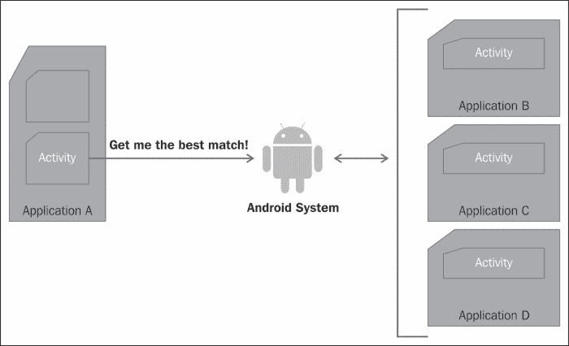

# 第二章。应用构建模块

本章重点介绍安卓应用的构建模块，即应用组件和组件间通信。安卓系统中有四种类型的组件:活动、服务、广播接收器和内容提供商。每个组件都是专门为完成特定任务而设计的。这些组件的集合构成了一个安卓应用。这些组件使用 Intents 相互对话，这是安卓的进程间通信机制。

有几本书讨论了如何构建安卓组件和意图。事实上，安卓开发者网站也很好地介绍了使用这些组件的编程。因此，在本章中，我们的目标不是讨论实现细节，而是讨论每个组件的安全方面，以及如何在应用中安全地定义和使用组件和意图，以保护我们作为开发人员的声誉和消费者的隐私。

组件和意图是本章的重点。对于每个安卓组件，我们将涵盖组件声明、与该组件相关联的权限以及特定于该特定组件的其他安全注意事项。我们将讨论不同类型的意图以及在特定环境中使用的最佳意图。

# 应用组件

正如我们在[第 1 章](01.html "Chapter 1. The Android Security Model – the Big Picture")、*安卓安全模型——大图*中简要提到的，安卓应用是松散绑定的应用组件堆栈。应用组件、清单文件和应用资源打包在**应用包格式** `.apk`文件中。一个 **APK** 文件本质上是一个以 JAR 文件格式格式化的 ZIP 文件。安卓系统只识别 APK 格式，所以所有软件包都必须是 APK 格式才能安装在安卓设备上。然后用开发者的签名签署一个 APK 文件来确认作者身份。`PackageManager`类处理安装和卸载应用的任务。

在本节中，我们将详细讨论每个组件的安全性。这包括清单文件中组件的声明，因此我们删除了松散的结尾和每个组件独有的其他安全注意事项。

## 活动

活动是通常与用户交互的应用组件。活动扩展了`Activity`类，作为视图和片段实现。**蜂巢**T5 中引入了碎片来解决不同屏幕尺寸的问题。在较小的屏幕上，一个片段显示为单个活动，并允许用户导航到第二个活动以显示第二个片段。活动在活动上下文中运行时产生的片段和线程。因此，如果活动被销毁，与之相关的片段和线程也将被销毁。

一个应用可以有几个活动。最好使用“活动”来关注单个任务，并为单个任务创建不同的活动。例如，如果我们正在创建一个允许用户在网站上订购图书的应用，最好创建一个让用户登录的活动，另一个用于在数据库中搜索图书的活动，另一个用于输入订购信息的活动，另一个用于输入付款信息的活动，等等。这种风格鼓励应用内部以及设备上安装的其他应用重用活动。组件的重用有两个主要好处。首先，它有助于减少错误，因为减少了代码的重复。其次，它使应用更加安全，因为不同组件之间的数据共享更少。

### 活动申报

应用使用的任何活动都必须在`AndroidManifest.xml`文件中声明。下面的代码片段显示了清单文件中声明的登录活动和订单活动:

```java
<activity android:label="@string/app_name" android:name=".LoginActivity">
  <intent-filter>
    <action android:name="android.intent.action.MAIN" />
    <category android:name="android.intent.category.LAUNCHER" />
  </intent-filter>
</activity>
<activity android:name=".OrderActivity" android:permission="com.example.project.ORDER_BOOK" android:exported="false"/>
```

注意`LoginActivity`被声明为公共活动，可以由系统中的任何其他活动发起。`OrderActivity`被声明为私有活动(没有意图过滤器的活动是仅通过指定其确切文件名来调用的私有活动)，该活动不会暴露在应用之外。一个附加的`android:exported`标签可以用来指定它在应用之外是否可见。值`true`使活动在应用之外可见，值`false`则不然。本章稍后将讨论意图过滤器。

所有活动都可以通过权限进行保护。在前面的例子中，`OrderActivity,`除了是私有的，还受到权限`com.example.project.ORDER_BOOK`的保护。任何试图调用`OrderActivity`的组件都应该有这个自定义权限来调用它。

通常，每当活动被启动时，它都会在声明它的应用的进程中运行。将`android:multiprocess`属性设置为`true`可以让活动在不同于应用的流程中运行。这些过程细节可以使用`android:process`属性来定义。如果该属性的值以冒号(`:`)开头，则创建一个应用专用的新进程；如果它以小写字符开头，则 Activity 在全局进程中运行。

`android:configChanges`标记允许应用处理由于列出的配置更改而导致的活动重启。这些变化包括区域设置的变化、插入外部键盘和 SIM 卡的变化。

### 保存活动状态

所有活动都由系统在**活动堆栈**T3 中管理。当前与用户交互的活动在前台运行。当前活动可以启动其他活动。由于资源限制，任何在后台的活动都可能被安卓系统杀死。在配置更改(如从垂直方向更改为水平方向)期间，活动也可能会重新启动。如前所述，一个活动可以使用`android:configChanges`标签来处理其中的一些事件。不鼓励这样做，因为这可能会导致不一致。

在重新启动之前，应该保留活动的状态。活动的生命周期由以下方法定义:

```java
public class Activity extends ApplicationContext {
  protected void onCreate(Bundle savedInstanceState);
  protected void onStart();
  protected void onRestart();
  protected void onResume();
  protected void onPause();
  protected void onStop();
  protected void onDestroy();
}
```

活动可以覆盖`onSaveInstanceState(Bundle savedInstanceState)`和`onRestoreInstanceState(Bundle savedInstanceState)`，以保存和恢复实例值，如用户首选项和未保存的文本。安卓开发者网站[http://www.developer.android.com](http://www.developer.android.com)用下面的流程图很好地说明了这个过程:


下面的代码片段显示了活动如何存储和检索首选语言、搜索结果数量和作者姓名。当活动被终止时，用户偏好被存储为**包**，该包存储名称-值对。当活动重新启动时，该捆绑包被传递到`onCreate`方法，该方法恢复活动状态。需要注意的是，这种存储方法不会持续应用重启。

```java
@Override
public void onSaveInstanceState(Bundle savedInstanceState) {
  super.onSaveInstanceState(savedInstanceState);
  savedInstanceState.putInt("ResultsNum", 10);
  savedInstanceState.putString("MyLanguage", "English");
  savedInstanceState.putString("MyAuthor", "Thomas Hardy");
}

@Override
public void onRestoreInstanceState(Bundle savedInstanceState) {
  super.onRestoreInstanceState(savedInstanceState);
  int ResultsNum = savedInstanceState.getInt("ResultsNum");
  String MyLanguage = savedInstanceState.getString("MyLanguage");
  String MyAuthor = savedInstanceState.getString("MyAuthor");
}
```

### 保存用户数据

正如我们前面讨论的，活动与用户交互，因此他们可能会收集一些用户数据。数据可以是应用私有的，也可以与其他人共享。这种数据的一个例子可以是用户偏好的语言或书籍类别。这种数据通常由应用保留，以增强用户体验。它在应用本身中很有用，不会与其他应用共享。

共享数据的一个例子可能是用户在浏览商店时不断添加到收藏中的图书的愿望列表。这些数据可能会也可能不会与其他应用共享。

基于隐私和数据种类，可以采用不同的存储机制。一个应用可以决定使用`SharedPreferences,`内容提供程序，一个存储在内部或外部存储器，甚至开发人员自己的网站上的文件来存储这种类型的数据。本章将讨论内容提供商。其他持久数据存储机制将在[第 7 章](07.html "Chapter 7. Securing Application Data")、*保护应用数据*中详细讨论。

## 服务

与活动不同，服务缺少可视化界面，并且在后台用于长时间运行的任务。理想情况下，服务应该保持在后台运行，即使启动它的活动不再存在。任务完成后，服务应该自行停止。最适合服务的任务示例有:与数据库同步、从网络上传或下载文件、与音乐播放器交互以播放用户选择的曲目，以及应用可以绑定以获取信息的全局服务。

保护服务从清单文件中的服务声明开始。接下来，为用例确定正确的服务并管理服务的生命周期非常重要。这包括启动和停止服务以及创建工作线程以避免阻塞应用。在接下来的几节中，我们将逐一介绍这些方面。这一章的最后一部分是关于绑定器的，它是安卓 IPC 的大部分的主干，并使服务能够以客户端-服务器的方式使用。

### 服务声明

应用计划启动的所有服务都需要在清单文件中声明。服务声明定义了服务一旦创建，将如何运行。清单文件中的`<service>`标记的语法如以下代码片段所示:

```java
<service android:enabled=["true" | "false"]
         android:exported=["true" | "false"]
         android:icon="drawable resource"
         android:isolatedProcess=["true" | "false"]
         android:label="string resource"
         android:name="string"
         android:permission="string"
         android:process="string" >
   . . . . .
</service>
```

根据前面的声明语法，应用私有的服务在其全局进程中运行以将图书存储在数据库中，该服务可以声明如下:

```java
<service
  android:name="bookService"
  android:process=":my_process"
  android:icon="@drawable/icon"
  android:label="@string/service_name" >
</service>
```

默认情况下，服务在应用的全局进程中运行。如果应用想要在不同的进程中启动服务，它可以使用属性`android:process`来启动服务。如果该属性的值以冒号(`:`)开头，服务将在应用中的新私有进程中启动。如果该值以小写字母开头，则会创建一个新的全局进程，安卓系统的所有应用都可以看到并访问该进程。在前面的示例中，该服务在其自己的全局进程中运行。应用应该有权限创建这样的进程。

这个`android:enabled`属性定义了服务是否可以被系统实例化。默认值为`true`。

`android:exported`属性限制了服务的曝光。值为`true`意味着该服务在应用外部可见。如果服务包含意图过滤器，则其他应用可以看到该服务。该属性的默认值为`true`。

要在没有所有权限的独立进程中运行服务，请将`android:isolatedProcess`属性设置为`true`。在这种情况下，与服务交互的唯一方式是绑定到服务。该属性的默认值为`false`。

与活动一样，服务可以受到权限的保护。这些服务在清单文件中使用`android:permission`属性声明。调用组件需要有适当的权限来调用服务，否则会从调用中抛出`SecurityException`。

### 服务模式

服务可以在两种情况下使用。在第一种情况下，服务充当辅助服务，组件可以开始运行长时间运行的任务。这样的 a 服务被称为**启动服务**。服务的第二个用例是作为一个或多个应用的组件的信息提供者。在这种情况下，服务在后台运行，应用组件通过调用`bindService ()` 绑定到服务。这样的服务称为绑定服务**。**

 **已启动的服务扩展了`Service`级或`IntentService`级。这两种方法的主要区别是对多个请求的处理。扩展`Service`类时，应用需要处理多个请求。这是通过`onStartCommand()`方法完成的。

`IntentService()`类通过对所有请求进行排队并一次处理一个，使其变得更加容易，因此开发人员不需要处理线程。如果适合一个用例，那么使用`IntentService`类总是更好，以避免多线程 bug。`IntentService`类为任务启动一个工作线程，请求自动排队。任务在`onHandleIntent`完成，就这样！以下是一堂`IntentService`课的例子:

```java
public class MyIntentService extends IntentService {
  public MyIntentService() {
    super("MyIntentService");
  }
  @Override
  protected void onHandleIntent(Intent intent) {
    // TODO Auto-generated method stub
  }
}
```

绑定的服务是客户端服务器的情况，在这种情况下，服务充当服务器，客户端绑定到它以获取信息。这是使用`bindService()`方法完成的。当客户满意时，他们使用`unbindService()`解除自己与服务的绑定。

绑定服务可以满足一个应用的组件或不同应用的组件。只满足一个应用组件的绑定服务可以扩展`Binder`类，实现返回`IBinder`对象的`onBind()`方法。如果一个服务满足多个应用，可以使用信使或**安卓界面定义语言** ( **AIDL** )工具生成一个服务发布的界面。使用 messenger 更容易实现，因为它处理多线程。

绑定到服务时，检查活动绑定到的服务的身份很重要。这可以通过显式指定服务名来实现。如果服务名称不可用，客户端可以使用`ServiceConnection.onServiceConnected()` 检查其连接的服务的身份。另一种方法是使用权限检查。

### 类型

对于已启动的服务，`onBind()`方法返回空值。

### 生命周期管理

服务可以由任何组件使用`startService()`方法启动，并传递一个意图对象，如下所示:

```java
Intent intent = new Intent(this, MyService.class);
startService(intent);
```

就像任何其他组件一样，启动的服务也可以被安卓系统销毁，为用户正在交互的过程收集资源。在这种情况下，服务将根据`onStartCommand`方法中设置的返回值重新启动。以下是一个例子:

```java
@Override
public int onStartCommand(Intent intent, int flags, int startId) {
  handleCommand(intent);
  // Let the service run until it is explicitly stopped
  return START_STICKY;
}
```

重新启动服务有三个选项:

*   `START_NOT_STICKY`:此选项表示安卓系统不重启服务，除非有未决意向。本章稍后将讨论待定意图。此选项最适合未完成的作业可以安全地重新启动并在以后完成的情况。
*   `START_STICKY`:这个选项表示系统应该启动一个服务。如果初始意图丢失，`onStartCommand()`方法以无效的意图开始。这最适合这样的情况，即使初始意图丢失，服务也可以恢复其任务。一个例子是音乐播放器一旦被系统关闭就会重新启动。
*   `START_REDELIVER_INTENT`:在这个选项中，服务被重新启动，待定的意向被重新交付给服务`onStartCommand()`。一个例子是通过网络下载文件。

需要注意的是，服务不同于创建线程。当旋转线程的组件被终止时，线程会立即被终止。默认情况下，服务在全局应用线程中运行，即使调用组件被销毁，它也保持活动状态。如果服务正在进行一些耗时的活动，例如下载一个巨大的文件，谨慎的做法是在一个单独的线程中进行，以避免阻塞应用。

默认情况下，已启动的服务在应用线程中运行。任何阻塞活动都应该在单独的线程中完成，以避免运行应用时出现潜在的瓶颈。`IntentService`类通过生成一个工作线程来处理这个场景。

当任务完成时，这两种启动的服务都应该通过调用`stopSelf()`来停止自己。任何组件也可以使用`stopService()`方法停止服务。

当没有更多的客户端绑定到绑定的服务时，它会被系统销毁。

### 注

服务既可以启动，也可以绑定。在这种情况下，不要忘记调用`stopSelf()`或`stopService()`来阻止服务在后台继续运行。

### 粘合剂

**Binder** 是安卓大部分 IPC 的主干。它是一个内核驱动程序，所有对 Binder 的调用都要经过内核。信使也是基于 Binder 的。绑定器实现起来可能会很混乱，只有当服务满足在不同进程中运行的多个应用，并且希望自己处理多线程时，才应该使用绑定器。Binder 框架集成在操作系统中，因此一个进程想要使用另一个进程的服务，需要将对象封送到原语中。然后，操作系统跨流程边界交付它。为了让开发者更容易完成这项任务，安卓提供了 AIDL。下图说明了 Binder 是如何成为所有安卓 IPC 的核心的。AIDL 曝光了一个活页夹。意图也被实现为绑定。但是这些错综复杂的东西对用户来说是隐藏的。随着我们转向更大的同心圆，实现变得更加抽象。


要使用 AIDL 创建有界服务，我们首先创建 AIDL 文件。然后，使用安卓软件开发工具包工具，我们生成界面。该接口包含扩展`android.os.Binder`类并实现`onTransact()`方法的`stub`方法。客户端收到对 Binder 接口的引用，并调用其`transact()`方法。数据作为一个`Parcel`对象流经这个通道。一个`Parcel`对象是可序列化的，因此它可以有效地跨越进程边界。

### 注

`Parcel`对象是为高性能 IPC 传输定义的，因此不应用于通用序列化。

如果多个进程正在使用该服务，请注意，一旦您公开了您的 AIDL，就不要更改它，因为其他应用可能也在使用它。如果这种改变是绝对必要的，那么它至少应该是向后兼容的。

绑定在系统中是全局唯一的，对绑定的引用可以作为共享的秘密来验证可信组件。保持活页夹的私密性总是一个好主意。任何对 Binder 有引用的人都可以调用它，并且可以调用`transact()`方法。应由该处对请求做出回应。例如，合子系统服务公开了一个任何活动都可以绑定到的绑定器。但是调用它的`transact()`方法并不意味着它会被娱乐。

根据`<service>`标签的`android:process`属性，活页夹可以在同一个流程中运行，也可以在不同的流程中运行。

Binder 通过内核安全地提供调用组件的身份及其权限。可以使用活页夹的`getCallingPid()`和`getCallingUid()`方法检查来电者的身份。一个绑定器又可以调用其他绑定器，在这种情况下，其他绑定器可以使用调用绑定器的身份。要检查呼叫者的许可，可以使用`Context.checkCallingPermission()`。要检查调用者或活页夹本身是否具有特定权限，可以使用`Context.checkCallingOrSelfPermission()`。

## 内容提供商

安卓系统使用内容提供商进行数据存储，如联系人列表、日历和单词词典。内容提供商是安卓处理跨流程边界结构化数据的机制。它也可以在应用中使用。

在大多数情况下，内容提供商的数据存储在 SQL 数据库中。标识符`_id`用作主键。与 SQL 一样，用户通过编写查询来访问数据。根据它们是原始 SQL 语句还是结构化查询，它们可以是`rawQuery()`或`query()`。查询的返回类型是一个`Cursor`对象，它指向结果的一行。用户可以使用`getCount()`、`moveToFirst()`、`isAfterLast()`、`moveToNext()`等辅助方法导航多行。一旦任务完成，需要使用`close()`关闭`Cursor`。

提供程序支持许多不同类型的数据，包括整数、长整型、浮点型、双精度型和以 64 KB 数组实现的 BLOB(二进制大对象)。提供程序还可以返回标准或 MIME 类型。标准 MIME 类型的一个例子是`text/html`。对于自定义 MIME 类型，对于多行和单行，该值始终分别为`vnd.android.cursor.dir`和`vnd.android.cursor.item`。

下图说明了可以抽象数据库、文件甚至远程服务器的内容提供程序。应用的其他组件可以访问它。其他应用组件也可以，只要它们有适当的权限。


以下各节讨论提供程序的正确声明、定义适当的权限以及避免安全访问提供程序数据所必需的常见安全陷阱。

### 提供商声明

应用想要使用的任何提供程序都必须在清单文件中声明。`provider`标记的语法如下:

```java
<provider android:authorities="list"
          android:enabled=["true" | "false"]
          android:exported=["true" | "false"]
          android:grantUriPermissions=["true" | "false"]
          android:icon="drawable resource"
          android:initOrder="integer"
          android:label="string resource"
          android:multiprocess=["true" | "false"]
          android:name="string"
          android:permission="string"
          android:process="string"
          android:readPermission="string"
          android:syncable=["true" | "false"]
          android:writePermission="string" >
  . . . . . . .
</provider>
```

基于前面的声明语法，在用户的愿望列表中维护图书列表的自定义提供程序可以声明如下。提供者拥有读写权限，客户端可以请求临时访问路径`/figures`。

```java
<provider
  android:authorities="com.example.android.books.contentprovider"
  android:name=".contentprovider.MyBooksdoContentProvider"
  android:readPermission="com.example.android.books.DB_READ"
  android:writePermission="com.example.android.book.DB_WRITE">

  <grant-uri-permission android:path="/figures/" />
  <meta-data android:name="books" android:value="@string/books" />
</provider>
```

字符串`android:authorities`列出了应用公开的提供程序。比如一个提供商的 URI 是`content://com.example.android.books.contentprovider/wishlist/English`、`content://`是方案、`com.example.android.books.contentprovider`是权限、`wishlist/English`是路径。必须至少指定一个权限。分号应该分隔多个权限。它应该遵循 Java 命名空间规则，以避免冲突。

布尔`android:enabled`标记指定系统可以启动提供程序。如果该值为真，则系统可以。值 false 不会让系统启动提供程序。需要注意的是，`<application>`标签中的`android:enabled`属性和`<provider>`标签中的另一个属性都需要为真才能实现。

如果提供程序发布到其他应用，则`android:exported`设置为真。对于将`android:targetSdkVersion`或`android:minSdkVersion`设置为 16 或更低的应用，默认值为真。对于所有其他应用，默认值为 false。

属性标签`android:grantUriPermissions`用于提供对受权限保护的数据的一次性访问，否则组件无法访问这些数据。该功能如果设置为`true`，则允许组件克服`android:readPermission`、`android:writePermission`和`android:permission`属性所施加的限制，并允许访问任何内容提供商的数据。如果该属性设置为`false`，则只能向`<grant-uri-permission>`标签中列出的数据集授予权限。此标记的默认值为 false。

整数`android:initOrder`是初始化提供程序的顺序。数字越高，初始化越早。如果应用的提供者之间存在依赖关系，这个属性就特别重要。

字符串`android:label`是内容提供商的用户可读标签。

布尔`android:multiprocess`属性，如果设置为真，允许系统在与它交互的每个应用的进程中创建一个提供程序的实例。这避免了进程间通信的开销。默认值为 false，这意味着提供程序仅在定义它的应用进程中实例化。

字符串`android:permission`标签声明了客户端应该拥有的与提供者交互的权限。

字符串`android:readPermission`和字符串`android:writePermission`分别定义了客户端应该具有的读取和写入提供者数据的权限。如果定义，这些权限将取代`android:permission`值。有趣的是，虽然字符串`android:writePermission`只允许在数据库上写，但它通常使用`WHERE`子句，聪明的工程师可以绕过这些子句来读取数据库。所以写权限也应该被视为读权限。

`android:process`属性定义了提供者应该运行的过程。通常，提供程序与应用运行在相同的进程中。但是，如果需要在单独的私有进程中运行该进程，可以为它分配一个以冒号(`:`)开头的名称。如果名称以小写字符开头，则在全局进程中实例化提供程序，以启用跨应用共享。

`android:syncable`属性允许通过将值设置为`true`来将数据同步到服务器。`false`值不允许数据同步到服务器。

一个`<provider>`标签可以包含三个子标签。

第一个是`<grant-uri-permission>`，语法如下:

```java
<grant-uri-permission android:path="string"
                      android:pathPattern="string"
                      android:pathPrefix="string" />
```

另一个是`<path-permission>`标签，语法如下:

```java
<path-permission android:path="string"
 android:pathPrefix="string"
 android:pathPattern="string"
 android:permission="string"
 android:readPermission="string"
 android:writePermission="string" />

```

第三个是`<meta-data>`标签，它定义了与提供者相关的元数据，如下所示:

```java
<meta-data android:name="string"
           android:resource="resource specification"
           android:value="string" />
```

### 注

要提供提供者级别的单一读写，请分别使用`android:readPermission`和`android:writePermission`。要提供一揽子提供商级别的读/写权限，请使用`android:permission`属性。要启用临时权限，请设置`android:grantUriPermissions`属性。您也可以使用`<grant-uri-permission>`子元素进行同样的操作。要启用路径级别权限，请使用`<provider>`的`<path-permission>`子元素。

### 其他安全考虑

内容提供者扩展了`ContentProvider`抽象类。这个类有`query()`、`insert()`、`update()`、`delete()`、`getType()`、`onCreate()`六种方法，都需要实现。如果提供程序不支持某些功能，则应返回异常。这个异常应该能够跨越流程边界进行通信。

如果多个线程正在读写提供程序数据，同步可能会成为一个问题。这可以通过使用关键字`synchronize`使前面提到的所有方法同步来解决，因此只有一个线程可以访问提供程序。或者，可以设置`android:multipleprocess=true`，以便为每个客户端创建一个实例。在这种情况下，延迟和性能问题必须得到平衡。

在某些情况下，为了保持数据的完整性，数据可能必须以某种格式输入到提供程序中。例如，标签可能需要附加每个元素。为了实现这一点，客户端可以决定不直接调用`ContentProvider`和`ContentResolver`类。相反，可以委托一个活动与提供者接口。所有需要访问提供者数据的客户端都应该向此活动发送一个意图，然后此活动执行预期的操作。

如果提供给查询的值未经验证，内容提供商很容易出现 SQL 注入问题。下面是一个如何发生的例子:

```java
// mUserInput is the user input
String mSelectionClause =  "var = " + mUserInput;
```

恶意用户可以在此输入任何文本。可能是`nothing; DROP TABLE *;`，会删除表格。开发人员应该使用适用于任何 SQL 查询的同样的判断力。用户数据应该被参数化，并检查可能的不良活动。

用户可以决定使用正则表达式来检查用户输入的输入的语法。下面的代码片段显示了如何验证字母数字字符的用户输入。这个片段使用了`String`类的`matches`函数。

```java
if (myInput.length() <= 0) {
  valid = false;
} else if (!myInput.matches("[a-zA-Z0-9 ]+")) {
  valid = false;
} else {
  valid = true;
}
```

在数据库中存储数据时，您可能希望在存储之前加密敏感信息，如密码和信用卡信息。请注意，加密某些字段可能会影响您对字段进行索引和排序的能力。此外，还有一些开源工具，例如安卓的 sqlcifer([http://sqlcipher.net](http://sqlcipher.net))使用 256 位 AES 提供完整的 SQLite 数据库加密。

## 广播接收器

在应用编程接口级别 1 中引入的广播接收器是一种应用从系统或其他应用接收意图的机制。接收器的美妙之处在于，即使应用没有运行，它仍然接收能够触发进一步事件的意图。用户不知道有广播。例如，一旦系统启动，打算启动后台服务的应用可以注册`Intent.ACTION_BOOT_COMPLETE`系统意图。想要自定义自己到新时区的应用可以注册`ACTION_TIMEZONE_CHANGED`事件。下图显示了一个发送广播意图的服务示例。已经向安卓系统注册了这种广播的接收器将接收广播意向。


应用可以在清单文件中声明接收者。然后，接收器类扩展了`BroadcastReceiver`类，并实现了`onReceive()`方法。或者应用可以使用`Context.registerReceiver`动态创建并注册接收器。

### 接收方声明

接收方可以在清单文件中声明如下:

```java
<receiver android:enabled=["true" | "false"]
          android:exported=["true" | "false"]
          android:icon="drawable resource"
          android:label="string resource"
          android:name="string"
          android:permission="string"
          android:process="string" >
    . . .
</receiver>
```

例如，让我们假设有两个应用。第一个应用允许用户搜索书籍并将书籍添加到愿望清单中。第二个应用监听一本书被添加到愿望列表的意图。然后，第二个应用将愿望列表与服务器上的列表同步。第二个应用的清单文件中的接收者声明示例如下:

```java
<receiver
  android:name="com.example.android.book2.MessageListener" >
  <intent-filter>
    <action
      android:name="com.example.android.book1.my-broadcast" />
  </intent-filter>
</receiver>
```

接收器`com.example.android.book2.MessageListener`是公共接收器，从应用`com.example.android.book1`中监听事件。`intent-filter`标签过滤掉意图。

应用`book1`可以发送如下意向:

```java
Intent intent = new Intent();
intent.setAction("com.example.android.book1.my-broadcast");
sendBroadcast(intent);
```

`<receiver>`标签的属性讨论如下:

*   `android:enabled`:将该属性设置为 true 可以让系统实例化接收器。该属性的默认值为真。该标签必须与`<application>`的`android:enabled`属性结合使用。两者都必须为真，系统才能实例化它。
*   `android:exported`:将该属性设置为 true，系统中的所有应用都可以看到您的接收器。如果它是假的，那么它只能从相同的应用或具有相同用户标识的应用接收意图。如果您的应用没有意图过滤器，那么默认值为假，因为它假设此接收器是您的私人。如果定义了意图过滤器，则默认值为真。在前面的例子中，我们确实有意图过滤器，所以接收器对系统的其余部分是可见的。
*   `android:name`:这个是实现接收器的类的名字。这是必需的属性，应该是类的完全限定名。一旦你声明了一个接收者，你应该尽量不要改变名字，因为其他应用可能正在使用它，改变名字会破坏它们的功能。
*   `android:permission`:你可以用权限保护你的接收器。使用这个属性，您可以指定向您的接收者发送意图的组件应该拥有的权限。如果这里没有列出权限，则使用`<application>`标签的权限。如果那里也没有指定权限，那么你的接收者根本不受保护。
*   `android:process`:默认情况下，接收器在应用进程中被实例化。如果你愿意，你可以在这里声明一个进程的名字。如果名称以冒号(`:`)开头，它将在应用中的私有进程中实例化。如果它以小写字母开头，并且您的应用有权限这样做，那么它将在全局进程中运行。

### 安全发送和接收广播

有两种类型的广播，正常广播和有序广播。正常广播使用`Context.sendBroadcast()`异步发送，所有收听它的接收机都会收到。用`Context.sendOrderedBoradcast`发送的有序广播，一次传送到一个接收器。接收者将其结果相加，并将其发送给下一个接收者。可以使用意图过滤器中的`android:priority`属性设置顺序。如果有多个具有相同优先级的过滤器，则接收广播的顺序是随机的。

广播是异步的。你把它们发送出去，但不能保证接收者会收到。在这种情况下，应用必须优雅地运行。

广播可以包含额外的信息。任何收听广播的接收机都可以接收发送的广播。因此，谨慎的做法是不在广播中发送任何敏感信息。此外，广播可以用权限来保护。这是通过在`sendBroadcast()`方法中提供一个权限字符串来实现的。只有具有适当权限的应用，通过用`<uses-permission>`声明它，才能接收它。类似地，权限字符串可以添加到`sendOrderedBroadcast()`方法中。

当一个进程仍在执行`onReceive()`时，被认为是前台进程。一旦进程退出`onReceive()`方法，它将被视为非活动进程，系统将尝试将其终止。在`onReceive()`方法中执行的任何异步动作都可能被终止。例如，当接收到广播时，应使用`Context.startService()`启动服务。

粘性广播一直存在，直到手机关机或某个组件将其移除。当广播中的信息被更新时，广播被更新的信息更新。任何拥有`BROADCAST_STICKY`权限的应用都可以移除或发送粘性广播，因此不要在其中放置任何敏感信息。此外，粘性广播不能受到权限的保护，因此应该谨慎使用。

可以对接收者强制执行权限。如前一节所述，这可以通过在清单文件中添加权限或通过在`registerReceiver()`方法中动态添加权限来实现。

开始一个**冰淇淋三明治**，你可以通过设置`Intent.setPackage`来限制广播只能被一个应用接收。

在`Intent`类中定义了一些系统广播动作。这些事件由系统触发，应用无法触发它们。接收者可以注册收听这些事件中的任何一个。这些动作包括`ACTION_TIMEZONE_CHANGED`、`ACTION_BOOT_COMPLETED`、`ACTION_PACKAGE_ADDED`、`ACTION_PACKAGE_REMOVED`、`ACTION_POWER_DISCONNECTED`和`ACTION_SHUTDOWN`。

### 本地广播

如果广播仅针对应用中的组件，最好使用`LocalBroadcastManager`助手类。这个助手类是安卓支持包的一部分。除了比发送全球广播更高效之外，它还更安全，因为它不会离开应用进程，其他应用也看不到它。本地广播不需要在清单中声明，因为它是应用本地的。

本地广播可以按如下方式创建:

```java
Intent intent = new Intent("my-local-broadcast");
Intent.putExtra("message", "Hello World!");
LocalBroadcastManager.getInstance(this).sendBroadcast(intent);
```

下面的代码片段侦听本地广播:

```java
@Override
public void onCreate(Bundle savedInstanceState) {
  super.onCreate(savedInstanceState);
  //  ... other code goes here

  LocalBroadcastManager.getInstance(this).registerReceiver(
    mMessageReceiver, new IntentFilter("my-local-broadcast"));
}

private BroadcastReceiver mMessageReceiver = new BroadcastReceiver() {
  @Override
  public void onReceive(Context context, Intent intent) {
    String message = intent.getStringExtra("message");
    Log.d("Received local broadcast" + message);
    // ... other code goes here
  }
};
```

# 意图

意图是安卓的组件间通信机制。意图是异步的，因此组件触发它们，接收组件有责任验证传入意图的数据并对其采取行动。意图由安卓系统用于启动活动或服务、与服务通信、广播事件或更改、使用待定意图接收通知以及查询内容提供商。

有不同的机制来处理每个组件的意图。因此，发送到活动、服务和广播接收器的意图仅由安卓系统发送到它们各自的对应方。例如，使用`Context.startActivity()`发出的启动活动的事件将仅解析符合意图标准的活动。类似地，使用`Context.sendBroadcast()`发出的广播将仅被接收器接收，而不会被其他组件接收。

在发送意图之前，检查是否有组件来处理意图是很重要的。如果没有组件来处理意图，应用将崩溃。可以使用`PackageManager`类的`queryIntentActivities()`方法查询匹配意图。

### 注

任何恶意应用都可以向公开的组件发送意图。在对输入进行操作之前，验证输入是组件的责任。

意图基本上是在组件之间传递的序列化对象。该对象包含其他组件使用的一些信息。例如，使用用户的登录凭证登录用户的活动可以启动另一个活动，该活动加载用户先前使用`Context.startActivity()`选择的书籍。在这种情况下，意图可能包含用户的帐户名，该帐户名将用于获取存储在服务器上的图书。

一个`Intent`对象包含以下四种信息:

1.  **组件名称**:只有在明确意图的情况下才需要组件名称。如果与外部组件通信，它必须是一个完全限定的类名，如果是内部组件，它只能是类名。
2.  **动作串**:动作串是应该执行的动作。例如，一个动作串`ACTION_ CALL`发起一个电话。广播动作`ACTION_BATTERY_LOW`是对低电量应用的警告。
3.  **数据**:这是数据的 URI 连同 MIME 类型。例如`ACTION_CALL`的数据类型为`tel:`。数据和数据类型是密切相关的。为了处理一些数据，知道类型以便能够适当地处理它是很重要的。
4.  **类别**:该类别提供了关于组件可以接收的意图种类的附加信息，从而增加了进一步的限制。例如，浏览器可以安全地调用类别为`CATEGORY_BROWSERABLE`的活动。

意图是异步的，所以不期望有结果。在“活动”的情况下，“意图”也可以用来启动“活动”以获得结果。这是使用`Context.startActivityForResult()`完成的，并且使用`finish()`方法将结果返回给调用活动。

用于广播的意图通常是关于刚刚发生的行动的公告。广播接收器注册收听此类事件。例如`ACTION_PACKAGE_ADDED`、`ACTION_TIME_TICK`、`ACTION_BOOT_COMPLETED`。在这个场景中，一个意图就像一个触发器，一旦一个事件发生，就要执行一些动作。

### 注

不要在`Intent`对象中放入任何敏感信息。使用另一种机制(如内容提供者)在组件之间共享信息，该机制可以受到权限的保护。

接收组件使用`getIntent().getExtras()`获取附加到`Intent`类的额外信息。安全的编程实践要求验证和审查该输入的可接受值。

## 明确的意图

一个组件只能向一个组件发送目标意图。为此，组件应该知道目标组件的完全限定名。在**应用 A** 中的一个活动向在**应用 B** 中的一个活动发送一个明确的意图可以用图形显示如下:


例如，活动可以使用以下代码与名为`ViewBooksActivity`的内部活动进行显式通信:

```java
Intent myIntent = new Intent (this, ViewBooksActivity.class);
startActivity(myIntent);
```

如果`ViewBooksActivity`是外部 Activity，那么组件名应该是类的完全限定名。这可以通过以下方式实现:

```java
Intent myIntent = new Intent (this, "com.example.android.Books.ViewBooksActivity.class");
startActivity(myIntent);
```

由于意图可以被任何应用截获，如果组件名称可用，最好显式调用该组件。

## 隐含意图

如果组件的完全限定名未知，则可以通过指定接收组件需要对其执行的操作来隐式调用该组件。然后，系统通过匹配`Intent`对象中指定的标准来识别最适合处理意图的组件。隐含意图的示例如下所示。**应用 A** 中的一个活动发出一个意图，系统搜索能够处理该意图的相关组件(基于它们的意图过滤器和权限)。



以下是一些隐含意图的例子:

```java
// Intent to view a webpage
Intent intent = new Intent(Intent.ACTION_VIEW, Uri.parse("http://www.google.com"));

// Intent to dial a telephone number
Intent intent = new Intent(Intent.ACTION_DIAL, Uri.parse("tel:4081112222"));

//Intent to send an email
Intent intent = new Intent(Intent.ACTION_SEND);
emailIntent.setType(HTTP.PLAIN_TEXT_TYPE);
emailIntent.putExtra(Intent.EXTRA_EMAIL, new String[] {"me@example.com"});
emailIntent.putExtra(Intent.EXTRA_SUBJECT, "Hello Intent!");
emailIntent.putExtra(Intent.EXTRA_TEXT, "My implicit intent");
```

## 意图过滤器

对于要由系统解析的组件，它需要在清单文件中用适当的标识符声明。此任务使用意图过滤器完成。使用`<activity>`、`<service>`或`<receiver>`声明的`<intent-filter>`子标签为活动定义意图过滤器。在为意图解析适当的活动时，系统只考虑`Intent`对象的三个方面。这些是动作、数据(URI 和 MIME 类型)和类别。所有这些意图方面必须匹配才能成功解决。组件名称仅用于显式意图。

意图过滤器必须包含`<action>`子标签，并且可以包含`<category>`和`<data>`。`<intent-filter>`声明的一些例子如下。

作为应用起点的活动由以下标签标识:

```java
<intent-filter>
  <action android:name="android.intent.action.MAIN" />
  <category android:name="android.intent.category.LAUNCHER" />
</intent-filter>
```

允许用户请求类型为`book`的数据的活动可以定义如下:

```java
<intent-filter>
  <action android:name="android.intent.action.GET_CONTENT" />
  <category android:name="android.intent.category.DEFAULT" />
  <data android:mimeType="vnd.android.cursor.item/vnd.example.book"/>
</intent-filter>
```

意图过滤器不是安全边界，不应该依赖于安全。意图过滤器不能用权限保护。此外，任何带有意图过滤器的组件都将成为导出组件，任何应用都可以向该组件发送意图。

## 待定意图

在意图的情况下，接收应用在自己的许可下执行代码，就像它是接收应用的一部分一样。在未决的意图的情况下，接收应用使用原始应用的身份和权限，并代表其执行代码。

因此，待定意图是一个应用给予另一个应用的令牌，以便另一个应用可以使用原始应用的权限和身份执行一段代码。即使发送应用进程被终止或破坏，挂起的意图也会执行。一旦事件发生，挂起意图的这个属性可以很好地用于向发起应用发送通知。待定意图可以是显式的，也可以是隐式的。

为了额外的安全性，使得只有一个组件接收到意图，可以使用`setComponent()`方法将一个组件烘焙到意图中。默认情况下，接收组件不能修改待定的意向。出于安全考虑，这很好。接收组件唯一可以编辑的部分是`extras`。然而，发送者可以设置标志来明确地允许接收组件编辑`PendingIntent`。为此，发送者设置使用`fillIn(Intent, int)`方法的规则。例如，如果发送方想让接收方覆盖数据字段，即使设置了，发送方也可以设置`FILL_IN_DATA=true`。这是一个非常敏感的操作，应该小心进行。

# 总结

在这一章中，我们回顾了安卓系统的四个组件——活动、服务、内容提供商和广播接收器，以及组件间的通信机制——意图和绑定。安全性从这些组件的安全声明开始。作为安全性的一般规则，公开最低限度总是一个好主意。所有安卓组件都受权限保护。意图是异步组件，应该总是验证它们的输入。意图过滤器是减少应用攻击面的好方法，但是显式的意图仍然可以向它发送意图。现在我们已经了解了 Android 组件和通信机制，接下来让我们进入下一章，详细回顾一下 Android 权限。**