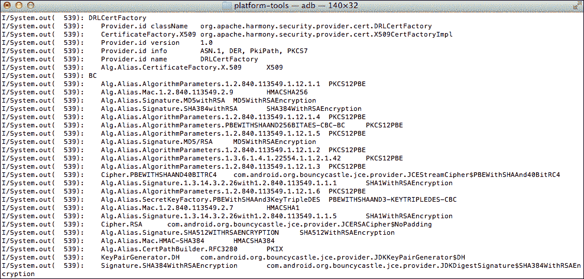
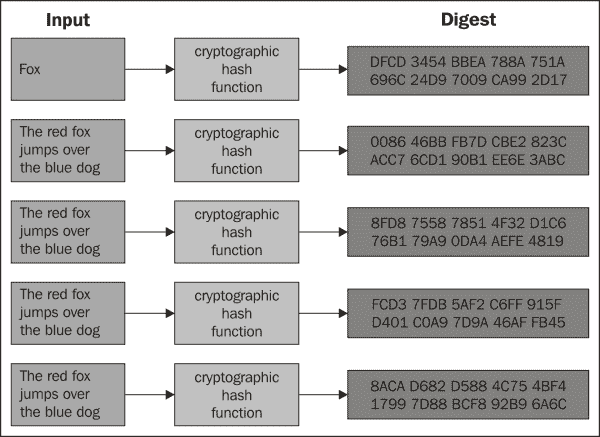
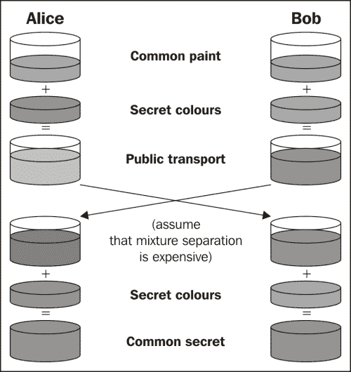
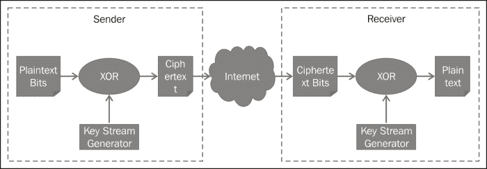
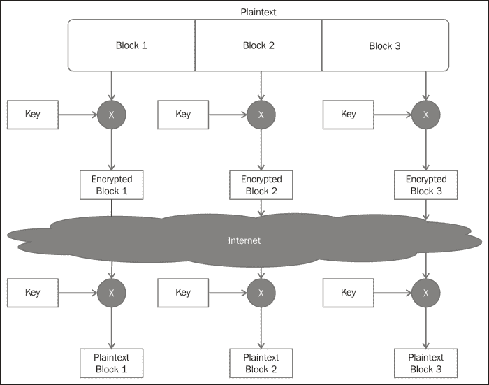
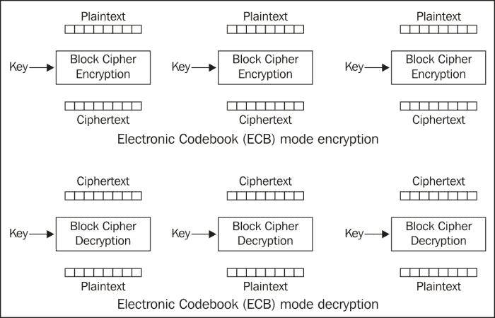
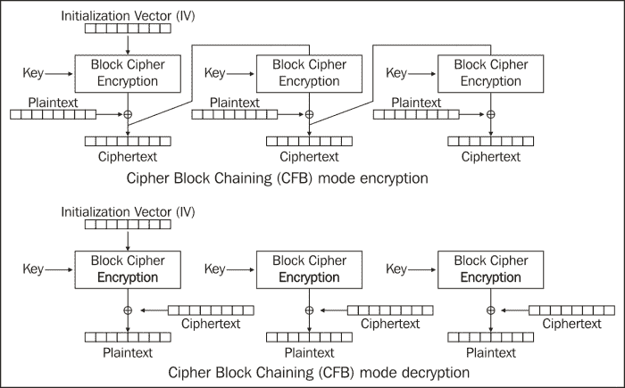
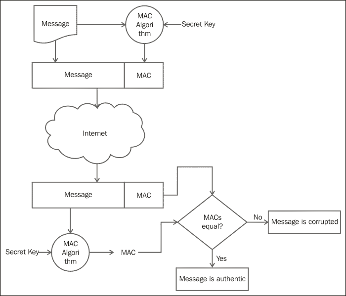

# 第六章。您的工具–加密应用编程接口

为了尊重用户隐私，处理敏感数据的应用程序需要保护这些数据免受窥探。尽管安卓堆栈提供了分层的安全架构，操作系统本身内置了安全性，但在设备上获得根访问权限相对容易，从而危及存储在设备上的数据。因此，应用程序开发人员了解他们可以用来安全存储数据的工具非常重要。同样，让他们了解如何正确传输数据也很重要。

安卓堆栈提供了开发人员可以用来执行加密和解密、哈希、生成随机数和消息认证码等任务的工具。这些工具是堆栈中各种包提供的加密 API。`javax.crypto`包提供了加密和解密消息的能力，并生成消息认证码和密钥协议 API。随机数生成由`java.util.Random`类提供，而`java.security`包提供了用于哈希、密钥生成和证书管理的 API。

在本章中，我们将讨论安卓堆栈提供的加密 API，应用程序开发人员可以使用这些 API 来保护敏感信息。我们首先介绍密码学中使用的基本术语，然后介绍如何找到可用的安全提供者。接下来，我们将讨论随机数生成，然后是散列函数。接下来讨论非对称和对称密钥加密以及不同的密码模式，然后是消息认证码。

# 术语

让我们从理解密码学中使用的一些术语开始。随着本章的深入，这些术语将被重复使用，因此在继续之前熟悉它们非常重要。

*   密码学:密码学是在不安全的环境中，在对手存在的情况下，对安全通信的研究和实践。随着我们的生活变得更加数字化和互联，密码学变得越来越重要。密码学以算法和协议的形式实施，这些算法和协议是使用数学公式和计算困难的问题设计的。
*   明文:也称明文，明文是发送者想要传输的需要保密的信息。如果爱丽丝想给鲍勃发信息“你好世界”，那么“你好世界”就是明文。
*   密文:也叫 codetext，这是发送给接收者的明文的编码或加密信息。让我们按照前面的例子，爱丽丝想发送消息“你好世界”给鲍勃。爱丽丝使用一种替换方法，用下一个字母替换每个字母，形成密文。所以，明文“Hello World”现在被转换成了“Ifmmp Xpsme”。“Ifmmp Xpsme”是传输给 Bob 的密文。
*   Encryption: Encryption is the process of converting plaintext into ciphertext such that an eavesdropper cannot decipher the message as it is being transmitted or stored, and only the parties that know the code can understand it. In the preceding example the process of converting "Hello World" to "Ifmmp Xpsme" is called encryption.

    

*   Decryption: Decryption is the reverse of encryption. It is the process of converting a ciphertext back to a plaintext at the receiving end to retrieve the information. So, the conversion of "Ifmmp Xpsme" back to "Hello World" is called decryption.

    

*   密钥:在密码术语中，密钥是决定密码算法输出的关键信息或数学参数。在前面的例子中，当“Hello World”转换为“Ifmmp Xpsme”时，关键信息是在每个字母表中添加一个字母，这是关键。在解密过程中，关键信息是从每个字母中减去一个，这是解密的关键。
*   密码:密码是对消息进行加密和解密的密码算法。它也被称为密码算法。在前面的例子中，密码是将“Hello World”加密为“Ifmmp Xpsme”，然后在接收端将“Ifmmp Xpsme”转换回“Hello World”的算法。

# 安全提供商

就安全提供商而言，安卓堆栈是可定制的。这意味着设备制造商可以添加他们自己的加密提供商。作为应用程序开发人员，您也可以自由使用自己的安全提供商。由于安卓堆栈只提供了蹦跳城堡安全提供商的一些功能，海绵城堡非常受欢迎。此外，安卓堆栈的不同版本通过移除不安全的加密算法并添加新算法来不断更新其加密功能。您可能希望查看提供商及其在给定时间点支持的完整算法列表。此外，请确保在不同的设备上测试您的应用程序，以确认加密算法按预期工作。

以下代码片段显示了如何使用`java.security.Providers`方法获取加密提供程序列表:

```java
for (Provider provider: Security.getProviders()) {
    System.out.println(provider.getName());
}
```


现在到获取每个提供者的详细信息，让我们增强记录更多细节的功能，如下所示:

```java
for (Provider provider: Security.getProviders()) {
    System.out.println(provider.getName());
    for (String key: provider.stringPropertyNames()) {
      System.out.println("\t" + key +
        "\t" + provider.getProperty(key));
    }
}
```

下面的截图显示了一些安全提供商的详细信息:



始终使用众所周知的行业标准加密算法。编写一个密码例程听起来很有趣也很容易，但是看起来要难很多。像我们将在下一节中研究的行业标准算法已经由密码专家开发并经过彻底测试。如果在这样的算法中发现了任何弱点，那么它就会被公之于众，开发人员可以用更强的加密算法来更新他们的代码。

# 随机数生成

生成随机数是密码学中最重要的任务之一。随机数充当其他加密功能的种子，例如加密和生成消息认证码。很难模拟真实随机数的生成，因为它来自不可预测的自然行为。计算机系统产生伪随机数，这意味着它们不是真正随机的，而是看起来随机的。

计算生成的随机数有两种方法:**伪随机数生成器** ( **PRNG** ) 和**真** 随机数生成器 ( **TRNG** )。PRNGs 是由基于某种数学公式的算法生成的。TRNGs 基于系统特性，例如 **CPU** ( **中央处理器** ) 周期、时钟、噪音和击键。圣三一学院教授马德斯·哈尔博士经营着 www.random.org，对于任何对随机性感兴趣的人来说，这是一个非常有趣的 T21 站。快看。

随机数的使用案例包括游戏应用程序，如用户掷骰子的应用程序、赌博应用程序、随机播放歌曲的音乐应用程序，以及作为散列、加密或密钥生成等加密操作的种子。并非所有用例都需要强随机性。随机播放曲目的音乐播放器不像密钥生成算法那样需要很强的随机性。

安卓提供了使用`java.util`包的`java.util.Random`类生成随机数的能力。该类提供生成一个或多个随机双精度、字节、浮点、int 或 long 数组的方法。这个类是线程安全的。

下面的代码片段显示了如何生成 1 到 100 范围内的随机数的示例。

```java
int min = 1;
int max = 100;

public int getRandom(int min, int max) {
  Random random = new Random();
  int num = random.nextInt(max - min + 1) + min;
  return num;
}
```

随机数也可以使用种子生成。然而，由于安卓堆栈有一个伪随机数生成器，它用一个相当不可预测的初始状态来播种自己，种子实际上使随机数更可预测。

# 散列函数

散列函数是对任意长度的数据进行运算以产生固定长度输出的算法。给定相同的输入，输出总是相同的，对于不同的输入值，输出总是不同的。这些函数是单向的，这意味着对数据的反向操作是不可能的。

用数学术语来说，单向散列函数可以定义如下:

给定一条消息 *M* ，和一个单向散列函数 *H* ，很容易计算出 *x* ，使得 *H(M) = x* 。但是给定 *x* 和 *H* ，获取消息 *M* 是不可行的。这可以用数学方法表示如下:

*H(M) = x*

*h(x)≥m*

哈希函数的另一个特性是冲突概率低。这意味着给定一条消息 *M* ，很难找到另一条消息 *M* ，比如:

*h(m)**h(m)*

单向散列函数可用于各种应用。它们用于为可变长度字符串创建固定大小的输出。使用散列，可以安全地存储散列给出的值；检索原始消息是不可行的。例如，不是存储密码，而是将密码的散列存储在表中。由于给定消息的哈希值始终相同，输入正确的密码将导致生成相同的哈希值。它们用作校验和，以确保消息在传输过程中不会被更改。

今天使用的最流行的哈希函数是 **MD5** ( **消息摘要算法**)和 **SHA** ( **安全哈希算法**)哈希函数家族。所有这些散列函数在强度和碰撞概率上是不同的，您应该使用最适合您的应用程序的。通常，使用 SHA-256 是一个不错的选择。许多应用程序仍然使用 MD5 和 SHA-1，但这些现在被认为足够安全。对于需要非常高安全级别的应用程序，应该考虑更强的哈希函数，如 SHA-3。下表总结了一些常见哈希函数的输出长度:

<colgroup><col style="text-align: left"> <col style="text-align: left"> <col style="text-align: left"></colgroup> 
| 

散列算法

 | 

块长度(以位为单位)

 | 

输出长度(位)

 |
| --- | --- | --- |
| 讯息摘要 5 | Five hundred and twelve | One hundred and twenty-eight |
| SHA-1 | Five hundred and twelve | One hundred and sixty |
| SHA-256 | Five hundred and twelve | Two hundred and fifty-six |
| SHA-512 | One thousand and twenty-four | Five hundred and twelve |

维基百科的下图显示了输入的微小变化如何完全改变输出。这种情况下的哈希函数是 SHA-1:



哈希功能由`java.security`包的`java.security.MessageDigest`类提供。下面的代码片段显示了如何使用这个类在字符串`s`上创建阿沙-256 散列。方法`update`用字节更新摘要，方法`digest`创建最终摘要。

```java
final MessageDigest digest = MessageDigest.getInstance("SHA-256");
digest.update(s.getBytes());
byte messageDigest[] = digest.digest();
```

# 公钥密码

公钥密码是使用两个密钥的密码系统:一个用于加密，一个用于解密。其中一个密钥是公开的，另一个是保密的。

公钥加密最常用于两种情况。一个用于保密，另一个用于认证。在保密的情况下，发送方使用接收方的公钥对消息进行加密，然后发送出去。由于接收方拥有私钥，因此接收方使用私钥解密消息。

在认证作为数字签名的情况下，发送者使用他们的私钥加密消息(在大多数使用情况下，加密的是消息的散列而不是整个消息)并使其可用。任何拥有公钥的人都可以访问它，并确信消息来自发送者。

下面的截图显示了这两个用例:


在下一节中，我们将讨论两种常见的公钥密码算法:用于加密和身份验证的 RSA ，以及用于密钥交换的 Diffie-Hellman。

## 的话

RSA 是一种基于公钥密码的算法，以它的发明者罗恩·瑞文斯特、阿迪·萨莫尔和伦纳德·阿德曼的名字命名。RSA 的安全性基于两个大素数的因式分解。算法本身不是秘密，公钥也不是。只有质数是秘密的。

根据所需的强度，所使用的 RSA 密钥的长度可以是 512、1024、2048 或 4096 位。目前，2048 位密钥被认为是强密钥。RSA 速度非常慢，因此应避免将其用于加密大型数据集。需要注意的是，可以用 RSA 加密的消息长度不能超过模数长度(两个素数乘积的长度)。由于 RSA 天生速度慢，通常的方法是用对称密钥加密明文，然后用 RSA 加密密钥。

RSA 可用于机密性和使用数字签名的身份验证。在使用 RSA 时，有三种主要的操作进行讨论，如下所示:

### 密钥生成

实现 RSA 的第一步是生成密钥。在安卓系统中，这可以通过使用`java.security.KeyPairGenerator`类来完成。下面的代码片段显示了如何生成 2048 位密钥对:

```java
KeyPairGenerator keyGen = KeyPairGenerator.getInstance("RSA");
keyGen.initialize(2048);
KeyPair key = keyGen.generateKeyPair();
```

如果密钥已经在 raw 中可用，并且需要从中提取私钥和公钥，则可以使用`java.security.KeyFactory`类从密钥规范中提取公钥和私钥，如下所示:

```java
KeyFactory keyFactory = KeyFactory.getInstance("RSA");
keyFactory.generatePublic(keySpecs);
```

### 加密

加密和解密都可以根据用例通过私钥或公钥来执行。下面的代码片段用接收方的公钥加密数据。这个例子来自前面的方法，其中通过使用`java.security.KeyPairGenerator`类生成一个键对。以下示例使用`java.security.Cipher`类初始化密码并执行操作:

```java
private String rsaEncrypt (String plainText) {
    Cipher cipher = Cipher.getInstance("RSA/ECB/PKCS1Padding");
    PublicKey publicKey = key.getPublic();
    cipher.init(Cipher.ENCRYPT_MODE, publicKey);
    byte [] cipherBytes = cipher.doFinal(plainText.getBytes());
    String cipherText = new String(cipherBytes,
        "UTF8").toString();
    return cipherText;
}
```

### 解密

解密是加密的相反操作。下面的代码展示了如何使用私钥解密数据。根据前面的示例，这是发送方使用接收方的公钥加密消息，然后接收方使用其私钥解密消息的情况。

```java
private String rsaDecrypt (String cipherText) {
    Cipher cipher = Cipher.getInstance("RSA/ECB/PKCS1Padding");
    PrivateKey privateKey = key.getPrivate();
    cipher.init(Cipher.DECRYPT_MODE, privateKey);
    byte [] plainBytes = cipher.doFinal(cipherText.getBytes());
    String plainText = new String(plainBytes, "UTF8").toString();
    return plainText;
}
```

### 填料

在前面的例子中，你会注意到密码是用**pkcs1 padding**T3 初始化的。让我们多谈谈填充。RSA 算法没有随机成分。这意味着用相同的密钥加密时，相同的明文将产生相同的密文。该属性会导致针对密码系统的选择明文攻击。在加密明文之前，通常用随机数据填充。 **PKCS#1** ( **公钥密码标准** ) 由 RSA 实验室发布，用于以明文形式嵌入结构化随机数据。后来证明，即使是 PKCS#1 填充也不足以避免自适应选择明文攻击。这是一种选择密文攻击，根据第一组解密密文的结果选择后续的密码。为了减轻这些类型的攻击，推荐使用 PKCS # 1v 1.5。另一种可以使用的填充是 **OAEP** ( **光学非对称加密填充**)。

在示例中，您还会注意到 **CBC** ( **密码块链接** ) 作为参数。该模式将在本章后面的*分组密码模式*部分讨论。

## 迪菲-赫尔曼算法

由怀特菲尔德·迪菲和马丁·赫尔曼于 1976 年出版，迪菲-赫尔曼是最流行的密钥交换算法。该算法的妙处在于，双方可以在不安全的信道上独立生成密钥，而无需交换密钥。然后，该密钥可以用于对称加密。

Diffie-Hellman 算法不验证双方。因此，它容易受到中间人攻击，即窃听者坐在中间，以对方的身份与双方通信。维基百科下面的插图用爱丽丝和鲍勃这两个人漂亮地解释了迪菲-赫尔曼的概念:



下面的代码示例显示了生成密钥对的示例实现。`java.security.KeyPairGenerator`类用于根据 DH 参数生成密钥对。接下来，`javax.crypto`类用于生成密钥协商:

```java
// DH params
BigInteger g = new BigInteger("0123456789", 16);
BigInteger p = new BigInteger("0123456789", 16);
DHParameterSpec dhParams = new DHParameterSpec(p, g);

// Generate Key pair
KeyPairGenerator keyGen = KeyPairGenerator.getInstance("DH");
keyGen.initialize(dhParams, new SecureRandom());

// Generate individual keys
KeyAgreement aKeyAgree = KeyAgreement.getInstance("DH");
KeyPair aPair = keyGen.generateKeyPair();
aKeyAgree.init(aPair.getPrivate());

KeyAgreement bKeyAgree = KeyAgreement.getInstance("DH");
KeyPair bPair = keyGen.generateKeyPair();
bKeyAgree.init(bPair.getPrivate());

// Do the final phase of key agreement using other party's 
  public key
aKeyAgree.doPhase(bPair.getPublic(), true);
bKeyAgree.doPhase(aPair.getPublic(), true);
```

# 对称密钥加密

对称密钥加密基于双方都相同的密钥。加密和解密使用相同的密钥。与公钥加密相比，这是一个问题，因为需要通过某种方式安全地交换密钥。如果窃听者得到了密钥，系统的安全性就会被破坏。


对称密钥比公钥快得多，是加密/解密大块数据的理想选择。对称密钥算法的安全性基于密钥的长度。

## 流密码

流密码是对称密钥加密的一种，其中数据的每个位或字节都用称为密钥流的随机比特流单独加密。通常，每个位或字节都用一个密钥流进行**异或** ed ( **异或** ) 。密钥流的长度与数据的长度相同。流密码的安全性取决于密钥流的随机性。如果使用相同的密钥流对多个数据集进行加密，则可以识别和利用算法中的漏洞。下图显示了一个正在运行的流密码:



流密码的最佳用途是数据长度可变的地方，如无线网络或加密语音数据。它们也很容易在硬件中实现。使用流密码技术的算法的一些例子包括 RC4、A5/1、A5/2 和 Helix。

由于密钥与所讨论的数据一样长，流密码存在严重的密钥管理问题。

## 分组密码

在分组密码的情况下，一个数据块是用一次一个的密钥加密的。明文被分成固定长度的块，每个块被单独加密。下图显示了分组密码的基本思想。每个明文被分成固定的数据块。如果块不能被均匀划分，则用一组标准的位来填充它们，以使它们达到所需的长度。然后用密钥对每个块进行加密，并生成固定长度的加密块。



分组密码的一个问题是，如果重复相同的数据块，输出总是相同的。另一个问题是，如果一个区块在运输途中丢失，没有办法识别该区块已经丢失。已经设计了各种块密码模式，有助于解决前面提到的问题。分组密码广泛应用于密码算法中，如 AES、DES、RC5 和 Blowfish。

由于明文被分成块，通常最后一块没有足够的比特来填充该块。在这种情况下，最后一个块用额外的比特填充，以获得期望的长度。这个过程被称为填充。

## 分组密码模式

在分组密码模式下，明文被分成块，每个块用相同的密钥加密。在下一节中，将讨论一些用于实现块加密的技术。这些模式既用于对称加密，也用于非对称加密，例如 RSA。然而在实践中，大块数据很少使用非对称密码加密，因为这些密码往往非常慢。

### 电子码本(ECB)

在 ECB 模式下，一个明文被分成多个块，每个块用密钥独立加密。这种模式可以很容易地并行化，因此速度很快。该模式不会隐藏明文中的模式。因此，相同的块将产生相同的密文。任何攻击者都可以修改或窃取明文，并且发送者不会察觉。

下图显示了加密和解密是如何在 ECB 模式下实现的:



下面的代码说明了如何用 ECB 模式初始化 RSA 密码:

```java
Cipher cipher = Cipher.getInstance("RSA/ECB/PKCS1Padding");
```

同样，要用 ECB 初始化 AES 对称算法，可以使用以下代码:

```java
Cipher cipher = Cipher.getInstance("AES/ECB");
```

### 密码块链接

在 CBC 模式下，每一个明文块都与前一个密文异或，然后加密。这种模式解决了欧洲央行模式的两个缺点。用先前的明文块异或该块会隐藏明文中的任何模式。此外，除了第一个和最后一个块，如果任何其他块被移除或更改，接收器很容易检测到它。

下图说明了使用 CBC 模式对明文块进行加密和解密。请注意使用**初始化向量** ( **IV** ) 为第一块增加随机性。IV 是与第一块异或的一组随机位:


下面的代码说明了如何用 CBC 模式初始化 RSA 密码:

```java
Cipher cipher = Cipher.getInstance("RSA/CBC/PKCS1Padding");
```

类似地，用 CBC 初始化 AES 对称算法，可以使用以下代码:

```java
Cipher cipher = Cipher.getInstance("AES/CBC");
```

### 密码反馈链(CFB)

在 CFB 模式下，先前的密文首先被加密，然后与明文异或以产生密文。这种模式还隐藏了明文模式，并使一个明文块依赖于前一个块。这使得能够在传输期间跟踪和完整性验证块。再次注意，第一个块使用了 IV。



下面的代码说明了如何用 CFB 模式初始化 RSA 密码:

```java
Cipher cipher = Cipher.getInstance("RSA/ECB/PKCS1Padding");
```

同样，要使用 CFB 初始化 AES 对称算法，可以使用以下代码:

```java
Cipher cipher = Cipher.getInstance("AES/CFB");
```

### 输出反馈模式(OFB)

OFB 类似于 CFB 模式，除了 XORed 密文充当同步流密码，使得一个比特中的错误只影响一个比特，而不影响整个块。同样，静脉注射用于播种过程如下:


下面的代码说明了如何用 OFB 模式初始化 RSA 密码:

```java
Cipher cipher = Cipher.getInstance("RSA/OFB/PKCS1Padding");
```

同样，要使用 OFB 初始化 AES 对称算法，可以使用以下代码:

```java
Cipher cipher = Cipher.getInstance("AES/OFB");
```

## 高级加密标准(AES)

AES 是最流行的块对称密码。它比其他常见的块对称密码，如 DES 和 DES3 安全得多。该密码将明文分成 128 位的固定块大小，密钥可以是 128 位、192 位或 256 位密钥。AES 速度快，内存要求低。安卓磁盘加密也使用 AES 128 位加密，主密钥也使用 AES 128 位加密进行加密。

以下代码片段显示了如何生成 128 位 AES 密钥:

```java
//Generate individual keys
Cipher cipher = Cipher.getInstance("AES");
KeyGenerator keyGen = KeyGenerator.getInstance("AES");
generator.init(128);
Key secretKey = keyGen.generateKey();
byte[] key = skey.getEncoded();
```

接下来，下面的代码显示了如何用 AES 密钥加密明文:

```java
byte[] plaintext = "plainText".getBytes();
SecretKeySpec skeySpec = new SecretKeySpec(raw, "AES");
Cipher cipher = Cipher.getInstance("AES");
cipher.init(Cipher.ENCRYPT_MODE, skeySpec);
byte[] cipherText = cipher.doFinal(plainText);
```

根据前面的示例，要使用 AES 进行解密，可以使用以下代码:

```java
SecretKeySpec skeySpec = new SecretKeySpec(raw, "AES");
Cipher cipher = Cipher.getInstance("AES");
cipher.init(Cipher.ENCRYPT_MODE, skeySpec);
byte[] encrypted = cipher.doFinal(cipherText);
```

# 消息认证码

一个**消息认证码** ( **MAC** )是一个标签或校验和，它被附加到一个消息中以确定其真实性和完整性。通过拥有密钥来提供身份验证，验证消息中的意外或有意更改可以提供完整性。下图说明了媒体访问控制的工作原理:



MAC 可以使用不同的方法生成:通过使用一次性 pad 或一次性密钥，通过使用散列函数，以及通过使用流密码或通过使用块密码，并输出最终块作为校验和。最后一种方法的一个例子是带有 CBC 模式的 DES。

哈希函数用于创建一个名为**哈希 MAC** ( **HMAC** )的校验和。这个散列然后被用对称密钥加密并附加到消息中。这是最流行的生成 MAC 的方法。这种媒体访问控制的一些例子是 SHA1 的 AES 128 和 SHA1 的 AES 256。

安卓提供了通过使用`javax.crypto.Mac`类生成 HMAC 的能力。下面的代码片段显示了如何使用 SHA-1 生成摘要:

```java
String plainText = "This is my test string.";
String key = "This is my test key.";
Mac mac = Mac.getInstance("HmacSHA1");
SecretKeySpec secret = new SecretKeySpec(key.getBytes("UTF-8"),
    mac.getAlgorithm());
mac.init(secret);
byte[] digest = mac.doFinal(plainText.getBytes());
String stringDigest = new String(digest);
```

# 总结

在本章中，我们讨论了应用程序开发人员可以用来保护其应用程序和用户数据隐私的工具。我们讨论了用于播种的随机数生成，以及用作加密算法的初始化向量。讨论了哈希技术，如 SHA-1 和 MD5，开发人员可以使用它们来存储密码。它们也非常适合将大数据压缩到有限且定义好的长度。还讨论了用于交换秘密密钥的公开密钥加密和对称密钥算法，例如加密大量数据的 AES。我们还讨论了流密码、分组密码和分组密码模式。大多数算法都发布了测试向量，并在网上提供。开发人员可以根据这些测试向量测试他们的实现。在接下来的章节中，我们将使用这些工具和技术来保护数据。现在，让我们进入下一章，了解如何为不同类型的数据确定最佳存储选项。