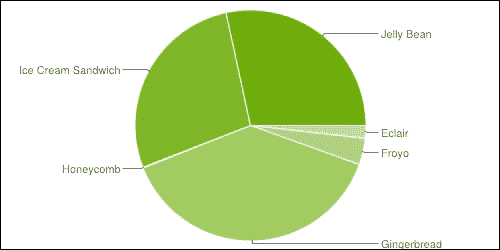
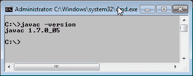
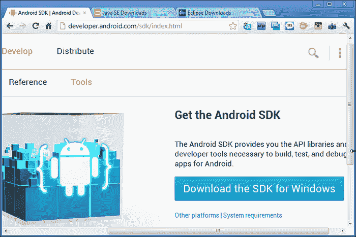
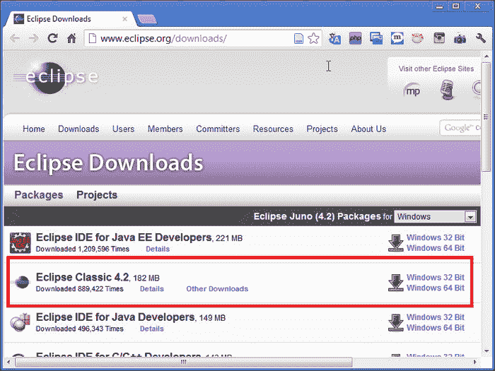
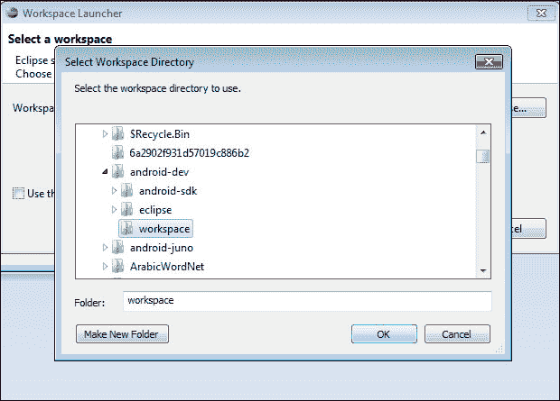
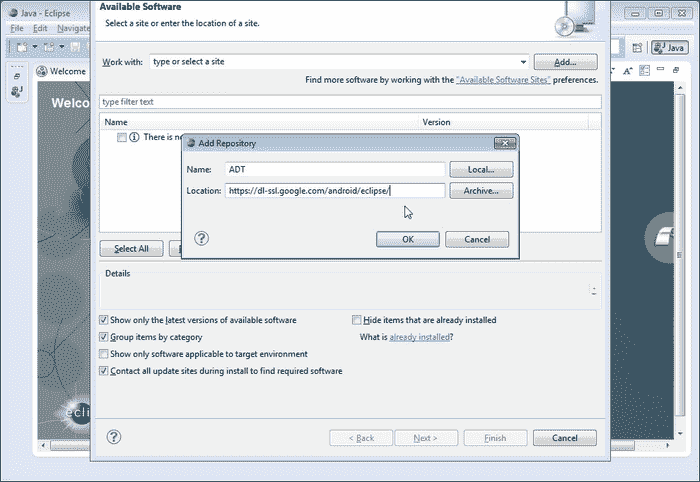
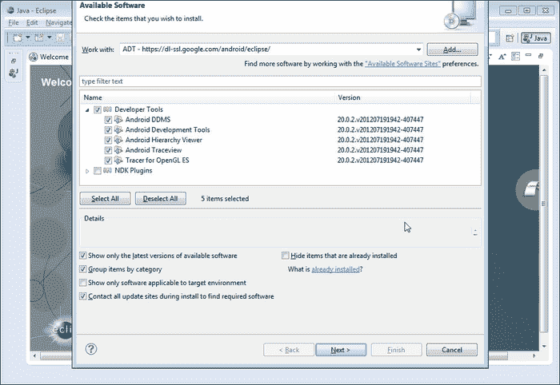
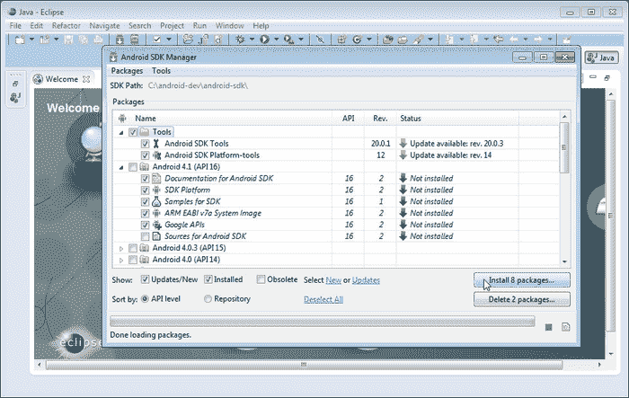

# 一、安装 Eclipse、ADT 和 SDK

本章作为在 Windows 环境下开发 Android 所需的所有开发工具包的安装说明。它分为以下几个分主题:

*   安卓平台简介
*   安装 Java 开发工具包(JDK)
*   安装安卓软件开发工具包
*   安装 Eclipse(朱诺)
*   在 Eclipse(朱诺)中安装安卓开发工具包
*   将安卓软件开发工具包链接到 Eclipse

在我们继续安装指南之前，安卓开发者必须了解一些基本信息。

# 介绍安卓平台

简而言之，安卓是一个基于 Linux 的触摸屏设备操作系统，由安卓公司开发，由谷歌资助，于 2005 年晚些时候被收购。安卓测试版于 2007 年 11 月回归，商业版 1.0 于 2008 年 9 月发布。截至 2013 年，全球使用安卓操作系统的活跃设备超过 5 亿台。

# 什么是安卓？

安卓是一个面向移动设备的软件栈，包括操作系统、中间件和关键应用(平台)。安卓**软件开发工具包** ( **SDK** )提供了开始在安卓平台上使用 Java 编程语言开发应用所需的工具和**应用编程接口** ( **API** s )。Android 的内核是 Linux。

## 介绍安卓应用

运行在安卓系统上的移动软件应用是一个安卓应用。这些应用使用的扩展。`apk`作为的安装程序文件扩展名。有几个流行的移动应用的例子，比如 Foursquare、愤怒的小鸟、水果忍者等等。

主要在 Eclipse 环境中，我们使用 Java，然后将其编译成 Dalvik 字节码(不是普通的 Java 字节码)。安卓在安卓内部提供**达尔维克虚拟机** ( **DVM** ) (不是 Java 虚拟机 JVM)。Dalvik VM 不与 Java SE 和 Java ME 库结盟，而是基于 Apache Harmony java 实现构建。

## 什么是达尔维克虚拟？

达尔维克虚拟机是一个基于注册的架构，作者是丹博恩施泰因 T2。它针对低内存需求进行了优化，虚拟机也进行了精简，以使用更少的空间和功耗。

## 了解 API 等级

应用编程接口级别是一个整数值，唯一标识安卓平台版本提供的框架应用编程接口版本。

Android 平台提供了一个框架 API，应用可以使用它与底层 Android 系统进行交互。框架应用编程接口包括:

*   一套核心的包和类
*   用于声明清单文件的一组 XML 元素和属性
*   一组用于声明和访问资源的 XML 元素和属性
*   一套意图
*   应用可以请求的一组权限，以及系统中包含的权限实施

## 安卓有多少个版本(发行版)？

截止 2013 年 5 月 1 日的最新分布统计，如下截图所示。说明安卓 2.3.3 市场份额最大；然而，Android 4.1.x 正在获得势头，并将占据主导份额。重要的是要知道，如果应用主要针对安卓版本，它将不会在以前版本的安卓上运行。

例如，如果您正在为安卓 2.2(应用编程接口级别 8)开发应用，那么该应用将不会在安卓 2.1(应用编程接口级别 7)及以下版本上运行。但是，该应用兼容安卓 2.2 及更高版本。

安卓应用编程接口级别分布饼图(来源:[http://developer.android.com/about/dashboards/index.html](http://developer.android.com/about/dashboards/index.html)

安卓应用编程接口级别分布(来源:[http://developer.android.com/about/dashboards/index.html](http://developer.android.com/about/dashboards/index.html)

# 准备安卓开发

在本章的这一部分，我们将看到如何在 Eclipse Juno (4.2)上安装 Android 的开发环境。Eclipse 是安卓开发的主要 IDE(见下面的截图)。我们需要安装 eclipse 扩展 ADT(安卓开发工具包)来开发安卓应用:

Eclipse 上的 ADT 正在运行

要下载安卓软件包，谷歌应用编程接口互联网连接是必须的，因此在进一步行动之前，请注意这一点。使用 Eclipse Juno 在窗口上的步骤如下:

所需软件:

*   甲骨文最新 JDK1.6.x
*   最新安卓 SDK
*   Eclipse 4.2(朱诺)

## 安装 JDK

要检查你的电脑是否有现有的 JDK 并且安装正确，进入命令提示符，输入`javac –version`(如下图截图所示)。建议为安卓应用开发安装 JDK 1.6.x，因为它可能会抱怨编译器合规级别大于 6，可能会遇到问题:

检查 JDK 版本

您可以从下载网站下载并安装 JDK 1.6 (Java 开发工具包)。确保安装后设置了 JAVA_HOME，并检查执行前面命令的版本。[http://www . Oracle . com/tech network/Java/javase/downloads/index . html](http://www.oracle.com/technetwork/java/javase/downloads/index.html)(见下面截图)。

如果我们安装了 java 1.6.x，可以跳过这一步:

Java PATH 设置

## 安装安卓软件开发工具包

创建一个名为`android-dev`的文件夹(安卓-dev 只是一个建议；您可以创建另一个名称)。文件夹`android-dev`将在本章中一致使用。这个文件夹用来存放安卓开发所需的所有软件。在另一个过程中再次需要该文件夹。

从[http://developer.android.com/sdk/index.html](http://developer.android.com/sdk/index.html)下载，安装在`android-dev`文件夹中。请记住，此下载仅提供了 Android SDK 的基本工具，而不是完整的安装。稍后，我们需要下载安卓系统映像、API、示例、文档和其他库:

安卓 SDK 下载页面

下载完成后，将 SDK 安装在前面提到的文件夹中；在`C:\android-dev\android-sdk`中如下截图所示。

在安装期间，安卓 SDK 会检测机器中的 Java 开发工具包。如果我们安装了最新的 JDK，应该没有问题:

Android SDK 安装路径

## 安装月食(朱诺)

eclipse Juno(4.2)可在[http://www.eclipse.org/downloads/](http://www.eclipse.org/downloads/)从下载:

Eclipse 经典的下载页面

Eclipse 有一个 ZIP 文件，所以只要解压缩它并找到`eclipse.exe`文件来运行它。

立即在先前创建的文件夹中提取 Eclipse(在`C:\android-dev`中)。提取后，创建桌面快捷方式，让生活更轻松，如下图所示:

创建 Eclipse 快捷方式

## 在 Eclipse Juno 中安装 ADT

通过识别 Eclipse 安装文件夹并双击`eclipse.exe`(或双击**桌面**中的快捷方式)运行 Eclipse。提供一个文件夹存储所有项目的源代码。再次，在`android-dev`文件夹下创建该文件夹，如下图所示:

选择 Eclipse 工作区

这个新的 Eclipse 安装不提供安卓开发工具包插件。要安装此插件，导航至**窗口** | **首选项**打开首选项面板。点击**安装/更新** | **可用软件站点**(在左侧面板)。点击**添加**按钮(在右侧面板)添加软件下载站点(同样需要互联网连接)。

另一个窗口将出现。在**名称中提供`ADT`**(例如)，在**位置提供** `https://dl-ssl.google.com/android/eclipse/`(在[http://developer.android.com/sdk/eclipse-adt.html 提供](http://developer.android.com/sdk/eclipse-adt.html)):

在**可用软件**对话框、中，选择**开发工具**旁边的复选框，然后点击**下一步**。在下一个窗口，你会看到一个需要下载的工具列表。选择除**以外的所有 NDK 插件**，点击**下一步**。我们将在接下来的章节中讨论这些工具:

选择 ADT 和 SDK 工具

阅读并接受许可协议，然后点击**完成**。如果您收到安全警告称无法确定软件的真实性或有效性，请点击**确定**。安装完成后，重启 **Eclipse** 。

# 将安卓软件开发工具包链接到 Eclipse

运行 Eclipse。在**窗口** | **偏好设置**中，点击**安卓**。从安装 android-sdk 的步骤找到`android-sdk`的文件夹，如下图截图所示:

Eclipse 中的安卓首选项

点击**应用**，点击**确定**。

接下来要做的就是下载安卓的 API 和操作系统镜像。安装 Android SDK 很费时间。它需要一条流畅的宽带线路，因为安装后，你需要下载安卓和谷歌 API 的 API 包。

为此，点击**安卓 SDK 管理器**图标，如下图所示:

安卓软件开发工具包管理器图标

您将获得所有安卓版本的所有软件开发工具包平台的列表。我建议你有选择性，先下载你的目标平台。如果你要为 **Froyo** (安卓 2.2 ) 开发一个应用，你需要下载 API 版本 8。稍后，当你有更多的时间，你可以回来下载另一个版本。如果您没有任何时间和互联网数据限制，那么您可以下载所有。它将获取应用编程接口包、安卓操作系统映像、调试工具以及其他与安卓开发相关的软件。

这次我们将下载最新的带有**软糖**系统镜像和 **API 级别** 16 的 SDK，如下图截图所示:

安装应用编程接口级别为 16 的软件开发工具包

在点击**安装**按钮之前，有一个重要的提示我想分享一下。执行此程序时，我们可能会遇到连接重置问题，原因不明。要解决这个问题，在**安卓软件开发工具包管理器**窗口中，导航至**工具** | **选项**。取消选中强制 **https://...要使用 https://提取的源...**选项，**关闭**(如下截图所示)。您现在可以开始安装软件开发工具包和应用编程接口了:

下载完软件开发工具包、应用编程接口和系统映像后，重新启动 Eclipse。等待是值得的！经过差不多几个小时的安装和下载包，我得到了这个不错的屏幕布局排列的图形界面，如下图截图所示。查看**安卓首选项**窗口，在 API 列表中可能会看到**安卓 4.1** 。要添加另一个应用编程接口，您还需要通过安卓软件开发工具包管理器下载:

安卓应用接口列表

为避免更早的步骤使用 Eclipse 设置 ADT 并启动开发，请从[http://developer.android.com/sdk/index.html](http://developer.android.com/sdk/index.html)下载 ADT 包，并按照[http://developer.android.com/sdk/installing/bundle.html](http://developer.android.com/sdk/installing/bundle.html)的步骤进行设置。

在下一章中，我们将研究简化开发的 ADT 环境的工具。

# 总结

在这一章中，我们学习了如何安装 Eclipse Juno(IDE)、Android SDK 和测试平台。在我们创建新的安卓应用项目之前，下一章将讨论集成开发环境的重要元素。