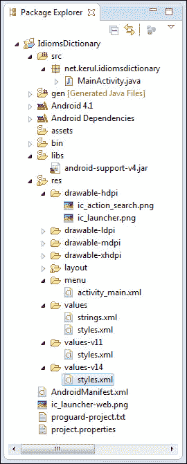
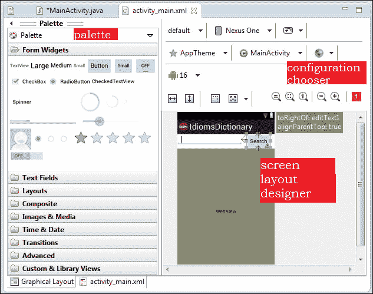
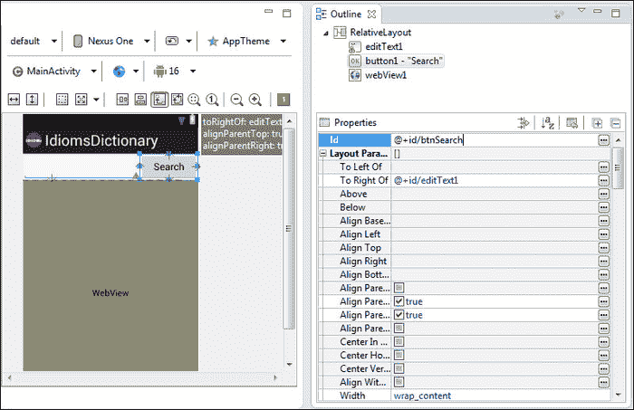
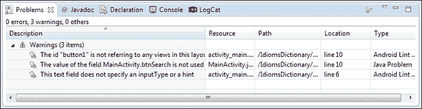
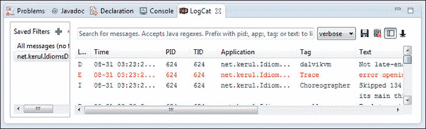
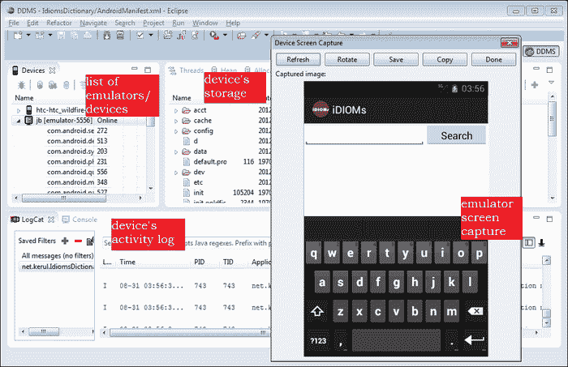
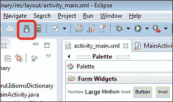
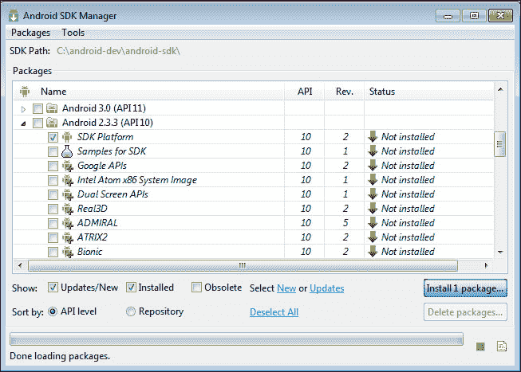
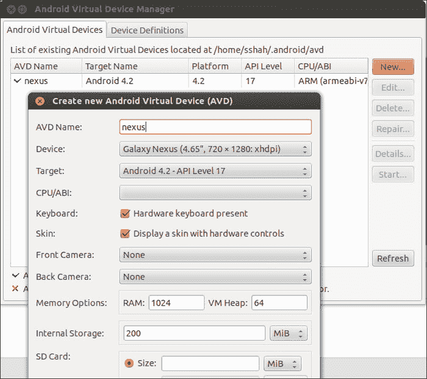
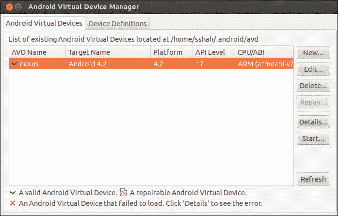

# 二、集成开发环境的重要特性

本章描述了 Eclipse 中的几个重要特性和一个对开发安卓应用有用的 ADT 环境。它分为以下主题:

*   项目浏览器
*   代码编辑器
*   图形用户界面设计器
*   属性窗口
*   调试窗格
*   达尔维克调试监控服务器(DDMS)
*   软件开发工具包管理器
*   安卓虚拟设备管理器
*   运行应用
*   寻求帮助

# 项目浏览器

项目浏览器是查看项目下所有文件夹和文件的工具。双击该项目，可以打开和编辑文件。当我们创建一个新项目时，这将在[第 3 章](3.html "Chapter 3. Creating a New Android Project")、*创建一个新项目*中详细讨论，ADT 将自动创建所有这些默认文件夹和文件，如下图所示。根据项目的不同，我们可能会忽略或修改所有这些文件。以下是安卓项目中默认文件夹和文件的简要描述:



项目浏览器

后面的表格包含项目树中可用的重要文件夹和文件的简要描述:

<colgroup><col style="text-align: left"> <col style="text-align: left"></colgroup> 
| 

文件夹

 | 

功能

 |
| --- | --- |
| `/src` | Java 代码在这里 |
| `/gen` | 自动生成 |
| `/assets` | 把你的字体，视频，声音放在这里。更像是一个文件系统，还可以放置 css、javascript 文件等等。 |
| `/libs` | 外部库(通常在 JAR 中) |
| `/res` | 图像、布局和全局变量 |
| `/drawable-xhdpi` | 对于超高规格设备(例如平板电脑、Galaxy SIII、HTC One X) |
| `/drawable-hdpi ` | 适用于高规格手机(例如:SGSI、上海通用电气) |
| `/drawable-mdpi` | 适用于中等规格手机(示例:Galaxy W、HTC Desire) |
| `/drawable-ldpi ` | 适用于低规格手机(示例:Galaxy Y、HTC 野火) |
| `/layout ` | 屏幕布局的所有 XML 文件 |
| `/menu` | 屏幕菜单的 XML 文件 |
| `/values` | 全局常数 |
| `/values-v11` | 带有蜂巢的设备的模板样式定义(安卓应用编程接口级别 11) |
| `/values-v14` | 带有 ICS 的设备的模板样式定义(Android API 级别 14) |
| `AndroidManifest.xml` | 定义应用的重要文件之一。这是安卓操作系统为了运行应用而找到的第一个文件。它包含应用的属性、活动声明和权限列表。 |

# 代码编辑器

这是烹饪编程的工具。Eclipse 代码编辑器的几个重要特性(程序员喜欢拥有)是智能和错误标记(参考下面的截图)。代码完成建议将对象、方法或变量合并到我们的代码中，而错误标记会立即通知任何语法错误，而无需编译代码。这些特性有助于加快编程速度:


代码编辑器

代码编辑器的外观是可定制的，以适合您的风格和偏好。要更改编辑器的环境，如背景颜色或代码的字体样式，右键单击编辑器并选择**首选项**，然后导航至**常规** | **外观** | **颜色和字体**。然后点击**编辑**进行自定义，参考如下截图:


自定义代码编辑器的外观

还有其他几个在设计和开发过程中提供帮助的 XML 代码编辑器。它们有两种风格:基于图形用户界面的；在这里，可以使用图形用户界面来操作事物，对于不习惯手动编辑 XML 代码的人来说很有用；基于源代码:可以手动编辑 XML 代码的地方。下面列出了一些编辑器:

## 图形布局编辑器

使用拖放界面编辑和设计您的 XML 布局文件。布局编辑器也渲染您的界面，在您设计布局时为您提供预览。

## 安卓清单编辑器

用简单的图形界面编辑安卓清单。当你打开一个`AndroidManifest.xml`文件时，这个编辑器被调用。

## 菜单编辑器

使用简单的图形界面编辑菜单组和项目。当您打开一个声明了`<menu>`的 XML 文件(通常位于`res/menu`文件夹中)时，会调用这个编辑器。

## 资源编辑器

使用简单的图形界面编辑资源。当你打开一个声明了`<resources>`标签的 XML 文件时，这个编辑器被调用。

## XML 资源编辑器

用简单的图形界面编辑 XML 资源。当您打开一个 XML 文件时，会调用这个编辑器。

# 图形用户界面设计器

这是设计师的界面。它用作控件的图形用户界面编辑器或应用屏幕的**小部件** 。这个 GUI 设计器有三个部分，调色板、配置选择器和屏幕布局预览，如下图所示:



自动数据终端的图形用户界面设计器

**调色板**包含了所有可以帮助我们设计界面的 GUI 控件(小部件)。可用的控件取决于我们在项目创建期间选择的 API 级别。一些常见的控件有:按钮、文本栏、单选按钮、复选框、多媒体控件等。

## 配置选择器

它可以让你通过不同的屏幕尺寸、方向、密度和主题来决定应用视图的外观。

## 屏幕布局设计师

把东西放上去尝试不同的设计是画布。这是一个设计工作空间。此外，它还提供了屏幕如何在设备中显示的预览。

# 属性窗口

它有助于编辑小部件的属性。所有与小部件相对应的属性都可以通过这个窗口直观地查看和编辑。虽然属性可以通过编辑 XML 文件直接编辑，但是这个图形用户界面简化了它。所做的所有更改都会立即自动保存到 XML 文件中。以下截图显示了**属性**窗口:



“属性”窗口

# 调试窗格

在调试方面，我们看到语法错误、警告、控制台消息、运行时错误、变量转换(如果使用断点)和 **LogCat。** **LogCat** 可用于跟踪设备或仿真器内发生的任何活动。下面的屏幕截图显示了列出所有代码问题(如警告或语法错误)的窗口:



问题警告或代码语法错误

来自亚行的控制台消息示例如下图所示。作为一个 java 人，我们会被诱惑使用`System.out.println()`来分割消息和对象的值；显示在 **LogCat** 视图中，但是最好使用`Log`类，因为我们可以过滤、打印不同的颜色和定义日志类型。这可能是调试程序的一种方式，通过显示变量的值或参数。要使用`Log`，请导入`android.util.Log`，并使用以下方法之一将消息打印到**日志文件**:

```java
v(String, String) (verbose)

d(String, String) (debug)

i(String, String) (information)

w(String, String) (warning)

e(String, String) (error)
```


安卓调试桥控制台(显示亚行活动)

**LogCat** 用于查看安卓系统的内部日志，如下图截图所示。通过 ADB (安卓调试桥)跟踪设备或仿真器内部发生的任何活动是非常有用的。ADB 是一种将您的电脑与虚拟设备或实际设备连接起来的工具。没有它，开发人员无法直接将 APK 文件传输到安卓设备/仿真器:



LogCat(所有设备/仿真器活动的跟踪转储)

# 达尔维克调试监控服务器(DDMS)

DDMS 是查看仿真器/设备活动的必备工具。要在月食中访问 DDMS，导航至**窗口** | **打开视角** | **其他**，然后选择 **DDMS** 。默认情况下，它在安卓软件开发工具包中可用(它在文件`ddms`旁边的文件夹`android-sdk/tools`中)。从这个角度来看，有以下几个方面:

*   **设备**:连接到 ADB 的设备和avd 列表
*   **仿真器控制**:帮助执行设备功能
*   **日志猫**:查看实时系统日志消息
*   **线程**:它给出了当前在虚拟机中运行线程的想法
*   **堆**:显示应用的堆使用情况
*   **分配跟踪器**:提供对象内存分配的信息
*   **文件浏览器**:探索设备文件系统

下图显示了 DDMS 的重要方面:



达尔维克调试监控服务器(DDMS)

# SDK 管理器

软件开发工具包管理器是更新安卓软件开发工具包和管理安卓操作系统映像、文档和应用编程接口下载的工具。出现图标，如下图所示:



软件开发工具包管理器图标

接下来的屏幕，如截图所示，有一个很长的列表。我们需要非常果断地决定我们需要什么样的应用编程接口级别，并根据互联网速度相应地选择，因为下载可能需要很长时间。如果不确定，则选择最新的 API 级别。

展开我们要发布的 API 级别，检查 SDK 平台。该下载由相应级别的 API 和 Android OS 系统映像组成。默认情况下，系统映像基于 ARM 的架构。但是，要在英特尔架构机器上更快地运行安卓操作系统映像，只需勾选**英特尔凌动 x86 系统映像**选项。

如果您需要从样本中学习，请勾选 SDK 的**样本。如果你的应用需要加入谷歌特殊应用编程接口(比如谷歌地图)，那么你可能需要下载谷歌应用编程接口。列表的其余部分是关于设备特定的 API。除非你计划为某个设备优化你的应用，否则不要下载。**

选择完必要的应用编程接口后，点击**安装软件包**按钮。如果您在下载时遇到任何连接重置问题，请导航至**工具** | **选项**。取消选中**强制 https://...**要使用**获取的来源 http://...**再试一次:



安卓软件开发工具包管理器窗口

# 安卓虚拟设备管理器

安卓虚拟设备是运行在你电脑上的虚拟移动设备(仿真器)。模拟器允许您在不使用物理设备的情况下测试安卓应用。虽然，这不是最好的测试方法，因为它只是模仿设备，但至少你有东西要测试，以防你买不起真正的安卓设备。

当仿真器运行时，您可以像在实际的移动设备中一样与仿真的移动设备交互，只是您可以使用鼠标指针触摸触摸屏，并且可以使用一些键盘按键来调用设备上的某些按键。

安卓模拟器模仿了典型移动设备的所有硬件和软件功能，除了它不能拨打实际的电话。它提供了多种导航和控制键，您可以使用鼠标或键盘“点击”这些键来为您的应用生成事件。它还提供了一个显示您的应用的屏幕，以及和任何其他正在运行的安卓应用。对于某些功能，我们可能需要注意热键，详情请访问

点击如下截图所示的按钮，打开安卓 SDK 和 **AVD 管理器**窗口。 **AVD** 是**安卓虚拟设备**:


AVD 图标

**AVD 管理器**T3 如下图所示。首先，点击**新建…** 设置一个新的模拟器，如截图所示。输入一个名称(例如`nexus`)，选择一个目标(确保已为所选目标下载了安卓操作系统映像)，为简单起见，选择设备，所有其他字段将自动填充。如果你想要不同的东西，我们也可以编辑。另外，选择**中央处理器**作为 **ARM (armeabi-v7a)** ，点击**创建 AVD** :



创建新的 AVD

点击已经创建的新自动增值设备，使用**启动**按钮启动自动增值设备。使用默认设置，点击**启动**按钮。



如果我们对处理器和内存有更低的规格，你会注意到它的仿真器启动真的很慢。我想建议你至少有 3GB 的内存，让它更快。

等到左边的屏幕显示出一个带有图标的精美图片，如下图截图所示。左侧组件是您的设备(智能手机)屏幕，右侧组件是物理智能手机键盘:


安卓模拟器

# 运行应用

无错误的项目将可以执行并发送到 AVD。要运行项目，点击**运行**按钮，如下图所示。如果您的系统已经运行了几个模拟器，Eclipse 将询问使用哪个版本的模拟器:


运行应用按钮

# 寻求帮助

*   进入菜单 **帮助**，选择**搜索**
*   日食帮助:[http://help.eclipse.org/juno/index.jsp](http://help.eclipse.org/juno/index.jsp)T2】
*   ADT 帮助:[http://developer.android.com/tools/help/adt.html](http://developer.android.com/tools/help/adt.html)
*   安卓开发者官方参考:[http://developer.android.com](http://developer.android.com)
*   ADT 更新:定期从菜单中查看 ADT 更新，**帮助** | **查看更新**
*   更多关于 DDMS 的信息:[http://developer.android.com/tools/debugging/ddms.html](http://developer.android.com/tools/debugging/ddms.html)

# 总结

在本章中，我们讨论了 Eclipse 和 ADT 中可用的几个重要工具，如项目资源管理器、代码编辑器、图形用户界面设计器、属性窗口、调试窗格、Dalvik 调试监视器、SDK 管理器、AVD 管理器和运行应用工具。下一章将讨论如何创建一个新的安卓应用项目。