# 四、融入多媒体元素

本章将讨论如何在一个项目中加入多媒体元素，并在一个应用中处理多个屏幕。将向读者展示如何在项目中添加图像、声音和网页。我们将借助一个名为`SimpleNumb3r5`的项目讨论以下主题:

*   形成布局
*   添加图像资源
*   插入图像视图
*   插入图像按钮
*   图像按钮和处理事件
*   添加音频和多屏幕支持
*   在网页视图中插入 HTML
*   使用意图和活动
*   在清单文件中添加新活动
*   最终产品——运行、部署和测试应用

对于这一章，我们需要一个新的项目，该项目将涵盖从 2.1 版(应用编程接口级别 7)到最新版本的安卓设备。所以设置`android:minSdkVersion`为 7，`android:targetSdkVersion`为 16。

图标和其他资源可以在可下载的源代码中获得(参考本书*前言*中提到的下载提示)。在开发此应用之前，请下载这些材料。我们不想做平面设计让你的生活变得痛苦。

新 app 选择的名称为 `SimpleNumb3r5`，如下图截图所示。如果你想知道我们为什么选择安卓 2.1，这是为了扩大设备覆盖范围:

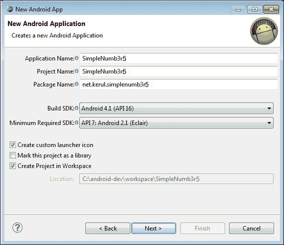

创建一个名为 SimpleNumb3r5 的新安卓项目

我们在资源素材中提供启动器图标，在**图像文件**字段中提供名为`ic_launcher-web.png`的图像，如下图截图所示。这是这个应用的专用标志。如果你喜欢不同的标志来适合你的应用，欢迎你亲自设计。通过使用该向导，图标启动器将准备好适合各自可绘制文件夹中的`xhdpi`、`hdpi`、`mdpi`和`ldpi`格式。

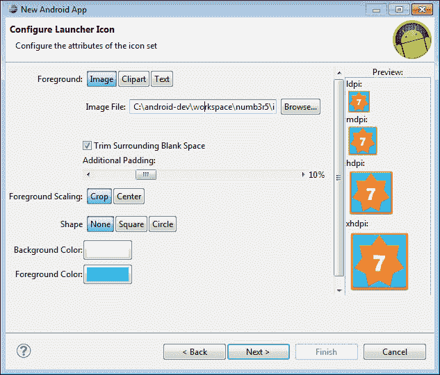

创建启动器图标

下一个屏幕如下图所示，是提供应用的名称。这可以是任何具有适合该应用的正确含义的字符串。布局名称将自动为您创建，并可根据您的喜好进行更改。选择导航类型为**无**，因为它与我们的应用开发无关。

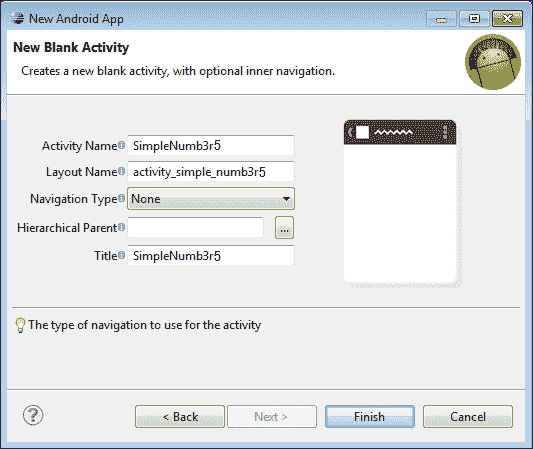

选择空白活动

以下截图是正在开发的应用的实体模型。我们有一个屏幕的主要部分，专门显示数字 0 到 9 的图像和拼写。屏幕的底部一行是导航栏，用户可以在其中导航到上一个和下一个屏幕。带扬声器的按钮是让用户听对他们说的数字。小写的 **i** 按钮是显示信息屏幕的图标。

*   项目标题(默认情况下显示)。
*   图像编号位置。该行由合并在一起的三个单元格组成。
*   底部一行由“上一个”、“信息”、“播放声音”和“下一个”按钮组成。

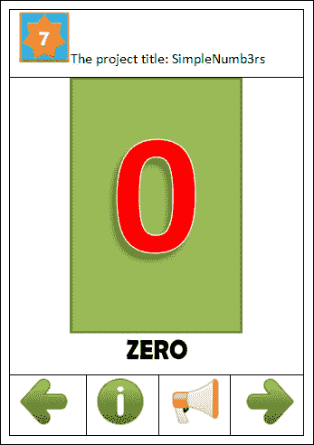

主屏幕模型

# 添加表格布局

我们的项目将由一个表格布局组成，其中有两个表格行。默认情况下，添加表格布局时，集成开发环境将包括四组表格行。通过使用 XML 代码编辑器删除两行，之前的 app 实体模型可以提供一些指南来删除不使用的行。调整 TableLayout，使其利用屏幕布局的所有空间，如下图截图所示:


插入表格布局

# 添加图像资源

通过 Windows 文件管理器将[第四章](4.html "Chapter 4. Incorporating Multimedia Elements")补充文件中提供的图片复制到`res/drawable-hdpi`文件夹，如下图截图所示。在本练习中，我们只提供`hdpi`可绘制的图像资源。为`xhdpi`、`mdpi`和`ldpi`准备所有合适的资源总是一个好的做法。别忘了安卓设备中有很多不同的屏幕尺寸。目前，我们也不考虑平板电脑设备的资源。

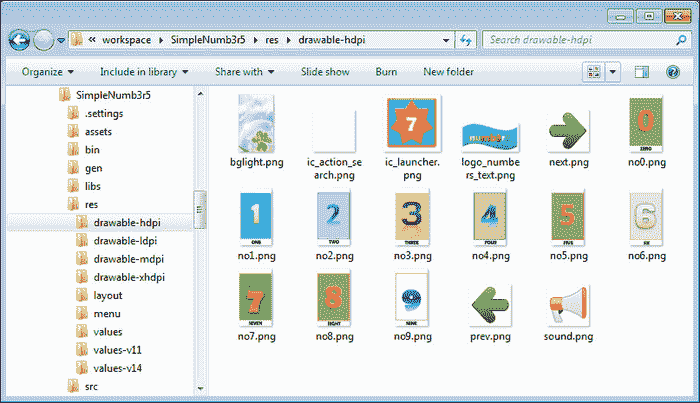

可提取的资源

然后转到您的项目浏览器(在 Eclipse 中)，右键单击`res/drawable-hdpi`，然后单击**刷新**。以下截图显示了复制图像资源后`drawable-hdpi`文件夹的外观:

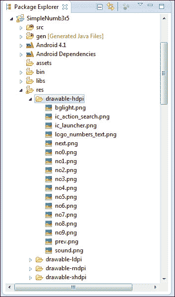

可提取的资源

# 添加图像视图

如上一张截图所示，我们的应用有一个图像 0 填充了整个屏幕，为了实现这一点，让我们在 TableLayout 的第一行添加一个 ImageView。使用可绘制文件夹中的 no0 图像作为初始图像(零是要显示的第一个数字)。调整图像视图的宽度和高度以填充屏幕。

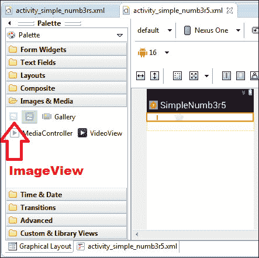

将图像视图添加到应用屏幕

平均分配权重(指定布局中要分配给视图的额外空间)，使小部件居中。使用下面截图中显示的按钮将 ImageView 调整到屏幕中心。在图像视图处于活动状态(选中)时执行此操作:


均匀分配重量

# 添加图像按钮

TableLayout 中的第二行是导航按钮(上一个和下一个)和播放声音按钮的。ImageButton 对这类应用更有吸引力。创建图像按钮时，会要求您选择图像。对于第一个按钮，使用图纸上的图像 **prev** 。第二个是**音**，最后一个是**下一个**。这些按钮需要一次添加一个，如下图所示:

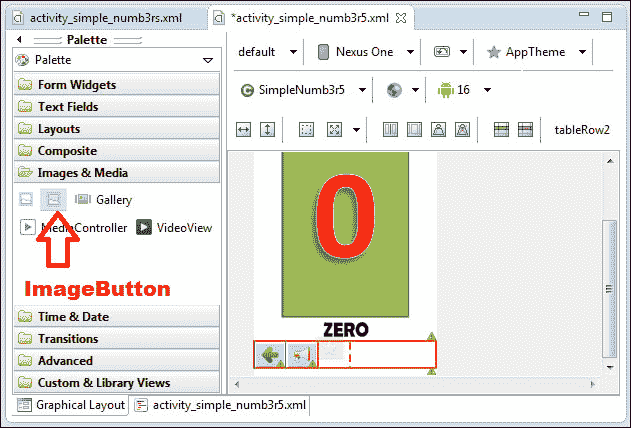

添加图像按钮

激活(选择)其中一个按钮，均匀分布，如下图截图所示。这是为了确保所有按钮在屏幕宽度上均匀分布。


平均分配图像按钮的重量

如果你愿意，可以改变屏幕的背景。已经为您准备了背景图像；它在图纸中被命名为 **bglight** 。点击应用屏幕上的应用标题/标志，激活主布局。通过单击属性右侧的三点按钮来更改背景属性。稍后，您可以添加 **btninfo** 按钮来显示该应用的信息。

# 分配部件的标识

基本上有一个图像视图和三个图像按钮。要更改图像视图标识，请选择它并转到右侧的小部件属性。点击**身份证**属性上的三点按钮。将图像视图的标识改为**图像号**，如下图所示:

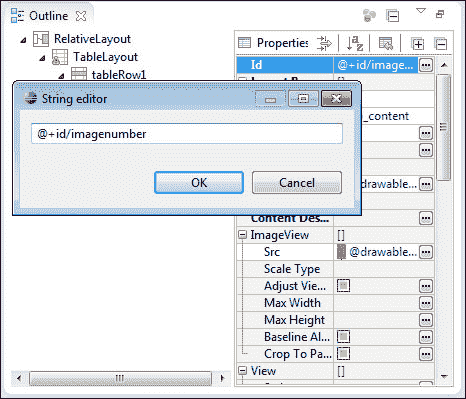

通过属性窗口更改小部件的标识

之后，将所有按钮的所有标识改为**BTN 先前的**、 **btninfo** 、**BTN soud**、 **btnnext** 。使用下表作为指南:

<colgroup><col style="text-align: left"> <col style="text-align: left"></colgroup> 
| 

小部件

 | 

身份证明

 |
| --- | --- |
| image view〔t0〕 | 图像号 |
| 最左侧按钮 | btnprevious |
| 显示应用信息 | btninfo |
| 播放声音按钮 | bonsound |
| 最右侧按钮 | btnnext |

最后，您将看到屏幕，如下所示:

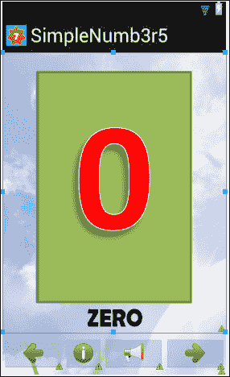

主要活动的整体布局设计

以下 XML 代码可通过**图形布局**选项卡中的`activity_simple_numb3rs.xml`选项卡中的 XML 编辑器获得:

```java
<RelativeLayout xmlns:android="http://schemas.android.com/apk/res/android"
    xmlns:tools="http://schemas.android.com/tools"
    android:layout_width="match_parent"
    android:layout_height="match_parent"
    android:background="@drawable/bglight" >

    <TableLayout
        android:layout_width="wrap_content"
        android:layout_height="wrap_content"
        android:layout_alignParentBottom="true"
        android:layout_alignParentLeft="true"
        android:layout_alignParentRight="true"
        android:layout_alignParentTop="true" >

        <TableRow
            android:id="@+id/tableRow1"
            android:layout_width="wrap_content"
            android:layout_height="0dp"
            android:layout_weight="1" >

            <ImageView
                android:id="@+id/imagenumber"
                android:layout_width="0dp"
                android:layout_height="wrap_content"
                android:layout_weight="1"
                android:src="@drawable/no0" />
        </TableRow>

        <TableRow
            android:id="@+id/tableRow2"
            android:layout_width="wrap_content"
            android:layout_height="0dp"
            android:layout_weight="1" >

            <ImageButton
                android:id="@+id/btnprevious"
                android:layout_width="0dp"
                android:layout_height="wrap_content"
                android:layout_weight="1"
                android:src="@drawable/prev" />
            <ImageButton
                android:id="@+id/btninfo"
                android:layout_width="0dp"
                android:layout_height="wrap_content"
                android:layout_weight="1"
                android:src="@drawable/info" />
            <ImageButton
                android:id="@+id/btnsound"
                android:layout_width="0dp"
                android:layout_height="wrap_content"
                android:layout_weight="1"
                android:src="@drawable/sound" />
            <ImageButton
                android:id="@+id/btnnext"
                android:layout_width="0dp"
                android:layout_height="wrap_content"
                android:layout_weight="1"
                android:src="@drawable/next" />
        </TableRow>
    </TableLayout>
</RelativeLayout>
```

# 图像按钮和事件处理

这是我们对图像按钮点击事件进行编码的地方。从`src/net.kerul.simplenumb3r5/SimpleNumb3r5.java`打开 Java 源代码。在这里，我们将讨论主活动类，它将为屏幕导航提供以下代码:

```java
public class SimpleNumb3r5 extends Activity implements OnClickListener
```

主类和往常一样，将继承`Activity`类，并实现`OnClickListener`来启用小部件交互。

主要变量声明如下:

```java
//initialize all widgets
  private ImageView imagenumber;
  private ImageButton btnprevious, btninfo, btnsound, btnnext;
  //define variables to track screen number, start from 0
  private int screennumber=0;
  //define a sound controller
  private MediaPlayer mp;
  //define an array for the sound files
  private String[] soundfile={"0.mp3","1.mp3","2.mp3","3.mp3",
    "4.mp3","5.mp3","6.mp3","7.mp3","8.mp3","9.mp3"};
```

Widget 对象是`imagenumber`至于显示图片数量的容器，我们有`btnprevious`、`btnsound`，按钮有`btnnext`。

`screennumber`是记录当前屏幕位置的变量；最初给它的值是 0，因为我们有一个从零(0)开始的数字列表。

声控器对象名为`mp`，字符串数组名为`soundfile`是从零到九的所有语音数字的录音列表。

`onCreate`方法是视图中所有小部件初始化并链接在一起的地方，如下所示:

```java
public void onCreate(Bundle savedInstanceState) {
        super.onCreate(savedInstanceState);
        setContentView(R.layout.activity_simple_numb3r5);
        imagenumber=(ImageView)findViewById(R.id.imagenumber);

        //create the object for the button
        btnprevious=(ImageButton)findViewById(R.id.btnprevious);
          //this button will initially be disabled
          btnprevious.setEnabled(false);
          //add listener to the button
          btnprevious.setOnClickListener(this);
        btninfo=(ImageButton)findViewById(R.id. btninfo);
          btninfo.setOnClickListener(this);
          btnsound=(ImageButton)findViewById(R.id.btnsound);
          btnsound.setOnClickListener(this);
          btnnext=(ImageButton)findViewById(R.id.btnnext);
          btnnext.setOnClickListener(this);

}//end onCreate
```

接下来，我们有`onClick`方法来处理导航交互。我们在这里做的基本上是如果`screennumber`为 0，禁用`btnprevious`按钮，如果`screennumber`大于 0，启用按钮。如果`screennumber`值为 9，当小于 9 时，`btnnext`也将被禁用。这些是为了防止当用户试图访问小于 0 或大于 9 的内容时出现运行时错误。`btnsound`值当前被忽略；稍后当我们处理声音(即声音/音频的播放)时将会讨论它。

```java
//this method is to handle button click
  public void onClick(View arg0) {
    //when btnprevious is clicked
    if(arg0.getId()==R.id.btnprevious){
      screennumber--;// Decrement  1 to the screennumber
      changeNumber(screennumber);
      if(screennumber==0){
        // Disable previous Button 
        btnprevious.setEnabled(false);
      }else{
        // Enable back disabled Button.
        btnprevious.setEnabled(true);
      }
      changeNumber(screennumber);
      btnnext.setEnabled(true);
    }

    //when btnnext is clicked
    else if(arg0.getId()==R.id.btnnext){
      screennumber++;//add 1 to the screennumber
      changeNumber(screennumber);
      if(screennumber==9){
        Disable  no screen available  next 
        btnnext.setEnabled(false);
      }else{
        / Only prevoius screen  available  
        btnnext.setEnabled(true);
      }
      changeNumber(screennumber);
      btnprevious.setEnabled(true);

    }
    //when btnplay is clicked
    else if(arg0.getId()==R.id.btnsound){
      //playSound -  will implement later 
    }
    else if(arg0.getId()==R.id.btninfo){
      //display info  will implement later 
    }

  }//end onClick
```

还有一个额外的方法来切换数字的图像。`R.id.imagefile`是实际可绘制图像资源的表示。由于我们总共有 10 个图像，`R.id`返回`int`，所以我们可以如下使用开关盒 10 次:

```java
//this method is to change the number that appears on the screen
//  after the navigation button is clicked
//    as R.id retuns int so we  use switch 
private void changeNumber(int screen){
    switch (screen){
      case 0:  imagenumber.setImageResource(R.drawable.no0);
      break;
      case 1:  imagenumber.setImageResource(R.drawable.no1);
      break;
      case 2:  imagenumber.setImageResource(R.drawable.no2);
      break;
      case 3:  imagenumber.setImageResource(R.drawable.no3);
      break;
      case 4:  imagenumber.setImageResource(R.drawable.no4);
      break;
      case 5:  imagenumber.setImageResource(R.drawable.no5);
      break;
      case 6:  imagenumber.setImageResource(R.drawable.no6);
      break;
      case 7:  imagenumber.setImageResource(R.drawable.no7);
      break;
      case 8:  imagenumber.setImageResource(R.drawable.no8);
      break;
      case 9:  imagenumber.setImageResource(R.drawable.no9);
      break;

      }
    }//end changeNumber
```

# 添加音频

在做这个练习之前，把所有的声音资源复制到`assets`文件夹。您可以通过`File Manager`将所有 mp3 文件复制到`assets`文件夹，如下图所示:


将 MP3 文件复制到文件夹资源

在`onClick`方法中添加`btnsound`的代码。添加以下几行，这样当点击`btnplay`按钮时，它将执行名为`playSound()`的方法。此方法将接收字符串参数作为要播放的声音文件名的值。

`soundfile`数组变量是存储 mp3 文件名列表的变量，而`screennumber`表示屏幕上的当前数字。

```java
//when btnplay is clicked
    else if(arg0.getId()==R.id.btnsound){
      //call the method playSound
      playSound(soundfile[screennumber].toString());
    }//end btnsound clicked
```

下一个重要的方法是`playsound`方法。这个方法将播放 mp3 声音文件。`soundname`参数是包含位于安卓项目`assets`文件夹中的声音文件名的字符串。

```java
public void playSound(String soundName){
  Boolean mpPlayingStatus;

  try{//try to check MediaPlayer status
    mpPlayingStatus=mp.isPlaying();
  }
  catch (Exception e){
    mpPlayingStatus=false;
  }
//if the MediaPlayer is playing a sound, stop it to play new voice
  if(mp.isPlaying()){
       mp.stop(); //stop the sound
       mp.release(); //remove sound from the memory
  }
  else{
    try{
      mp = new MediaPlayer();
      AssetFileDescriptor afd = getAssets().openFd(soundName);
      //set the sound source file 

      FileDescriptor fd = afd.getFileDescriptor();
      mp.setDataSource(fd);

      mp.prepare(); // prepare for playback
      mp.start(); //play the sound

    }//try block
    catch(IOException e) {
      //display the error message in debug
      Log.i("Error playing sound: ", e.toString());
    }
  }
}//end playSound
```

以下是对所涉及的变量和过程的解释:

*   `try…catch block`:这是一个异常处理程序，其目的是封装可能抛出异常的代码。在这种情况下，例外情况是在尝试使用`MediaPlayer`播放声音文件时尝试捕捉任何问题。如果您注意到，catch 块是当某个代码执行导致异常时将执行的语句。
*   `mp`是从类`MediaPlayer`实例化的对象。
    *   `isPlaying()`:检查`MediaPlayer`是否在玩，`True`是否在玩，反之`false`是否在玩
    *   `setDataSource()`:设置要使用的数据源。这种情况下，数据源为`FileDescriptor`
    *   `prepare()`:同步准备播放器播放
    *   `play()`:播放声音文件
    *   `stop()`:停止当前声音播放
    *   `release()`:从记忆中释放声音
*   `afd`是从类`AssetFileDescriptor`实例化的变量。
    *   `getAssets()`:通过`AssetManager`应用编程接口从`assets`文件夹中检索底层资源
    *   `openFD()`:打开`String`参数中指定的文件
    *   `getFileDescriptor()`:返回可用于读取文件中数据的`FileDescriptor`数据源
    *   `getStartOffSet()`:返回该资产条目数据开始的字节偏移量
    *   `getLength()`:返回该资产条目数据的总字节数

# 在应用中添加另一个屏幕

这个练习是在`SimpleNumb3r5` app 上增加一个信息屏。关于开发者、电子邮件、脸书粉丝页面和其他信息的信息显示在下一个屏幕中。由于屏幕包含许多文本信息，包括一些图片，因此我们在这里使用一个 HTML 页面作为我们的方法:

1.  现在，创建一个活动类来处理新屏幕。打开`src`文件夹，右键点击包名(`net.kerul.SimpleNumb3r5`)，选择**新建** | **其他...**从选项中选择添加新的安卓活动，点击**下一步**按钮。然后，选择一个空白活动，点击**下一步**。
2.  Set the activity name as **Info**, as shown in the following screenshot and the wizard will suggest the screen layout as **info_activity**. Click on the **Finish** button.

    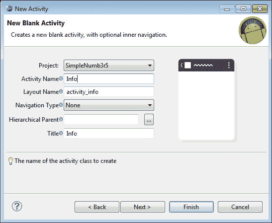

    创建名为“信息”的新活动

3.  将出现一个空白的新屏幕布局。删除`HelloWorld`文本视图(默认)。在**面板**上，打开名为`Composite`的文件夹。
4.  Click and drag the WebView widget. Change the ID of WebView to `webinfo`. This layout will be saved in the file `info_activity.xml`.

    

    添加网络视图小部件

# 在网页视图中添加 HTML

使用您最喜欢的网页编辑器创建一个网页，或者您可以在提供的资源中重用该网页(在`assets`文件夹中，文件名`info.html`)。HTML 页面，如下图截图所示，是一个包含 app 信息的简单 HTML 页面。如果你发现 HTML 太简单，一定要添加自己的信息。在本练习中，我们将把 HTML 页面和资源放在`assets`文件夹中，因此在继续之前，将 HTML 页面的所有相关资料复制到`assets`文件夹中。


info.html 的网页

接下来是编辑`src/net.kerul.simplenumb3r5`文件夹中`Info.java`的源代码。将以下代码添加到现有模板中:

```java
package net.kerul.simplenumb3r5;
import android.app.Activity;
import android.os.Bundle;
import android.webkit.WebView;

public class Info extends Activity {
    private WebView webinfo;
    @Override
    public void onCreate(Bundle savedInstanceState) {
        super.onCreate(savedInstanceState);
        setContentView(R.layout.activity_info);

        webinfo=(WebView)findViewById(R.id.webinfo);
        //provide the URL path pointing to info.html
        webinfo.loadUrl("file:///android_asset/info.html");
    }
}
```

让我们了解一下添加到上面模板的代码的第行和第行:

*   `setContentView(R.layout.activity_info)` : `R.layout.activity_info`是指之前创建的布局。
*   `webinfo.loadUrl("file:///android_asset/info.html")`:这是从特定 URL 加载 HTML 页面的方法。指向`assets`文件夹中的一个 HTML 文件的路径是`file:///android_asset/info.html`。该路径在真实设备上找不到，但是它提供了对`app asset`文件的访问。

# 意图和活动

意图是对要执行的操作的抽象描述。更具体地说，它是一个异步调用，允许应用从其他安卓组件请求功能，例如服务/活动。它可以与`startActivity()`命令一起使用来发起活动。`SimpleNumb3r5.java`中的前一个代码是该应用的主要活动(或类)。我们刚刚创建了文件`Info.java`中的第二个活动(类)。为了让第二个活动出现，它必须使用一个意图开始。

我们已经决定使用按钮`btninfo`作为触发器来调用第二个活动。再次，打开文件`SimpleNumb3r5.java`并添加以下行来调用另一个活动。这些线必须添加到`btninfo`按钮的`onClick`方法中。请注意，`Intent`的一个实例被创建为信息。主类可以使用`startActivity()`方法调用第二类。`Info.class`论点指的是第二类。

```java
  else if(arg0.getId()==R.id.btninfo){
    //invoke the Info activity
    Intent info = new Intent(this, Info.class);
    startActivity(info);
  }Adding Activity in Manifest file
```

为了通过`Intent`调用第二类，需要修改`Manifest.xml`文件。但是，您会注意到，这是从第 20 版开始由**安卓开发工具包** 自动完成的。如果`AndroidManifest.xml`缺少以下几行，请手动添加:

```java
<activity
    android:name=".Info"
    android:label="@string/title_activity_info" >
    <intent-filter>
        <action android:name="android.intent.action.MAIN" />
        <category 
android:name="android.intent.category.LAUNCHER" />
    </intent-filter>
</activity>
```

如果您需要在网络视图中显示来自互联网的网页，您必须通过在`<application>`标签上方的`AndroidManifest.xml`中添加以下这一行来声明用户权限:

```java
<uses-permission android:name="android.permission.INTERNET" />
```

# 最终产品运行和测试

在我们经历了所有的过程之后，在模拟器中运行该应用，您将看到以下屏幕:

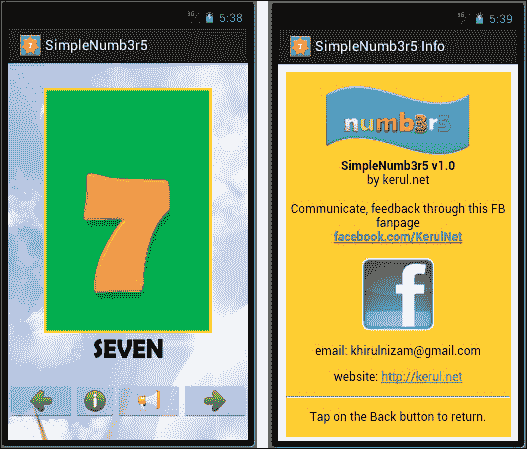

SimpleNumb3r5 正在运行

# 总结

在这一章中，我们探索了一种简单的方法来整合几个多媒体元素，如图像、HTML 页面和语音。最新的软件开发工具包比以前的任何版本都更加用户友好。

在下一章中，我们将了解更多关于不同的小部件，如菜单、复选框、单选按钮，以及关于添加首选项屏幕的信息。