# 一、安卓开发工具

在本章中，我们将介绍以下食谱:

*   安装安卓开发工具
*   安装 Java 开发工具包(JDK)
*   更新应用编程接口源
*   自动驾驶仪的替代安装
*   安装本机开发工具包(NDK)
*   模仿安卓
*   创建安卓虚拟设备
*   使用安卓调试桥与自动增值设备交互
*   将文件复制到 AVD
*   通过 ADB 在自动增值设备上安装应用

# 简介

一个非常聪明的人曾经说过，“你应该和你的朋友保持距离，但是和你的敌人保持距离”。成为一名安全专业人员意味着关注开发人员正在做的、已经做的和可能做的事情。这是因为他们做出的决策会极大地影响安全格局；毕竟，如果没有人写坏软件，就没有人会去利用它！

鉴于这本书针对的是任何对分析、黑客攻击或开发安卓平台感兴趣的人，*了解你的敌人*的概念也适用于你！如果安卓开发者希望在安全漏洞对用户造成负面影响之前发现它们，他们需要在一定程度上了解安卓黑客的最新动向。相反，安卓黑客需要跟上安卓开发者正在做的事情。

接下来的章节将带您了解最新最棒的开发和黑客工具，并让您直接与安卓安全架构互动，既可以破解应用，也可以保护它们。

本章重点介绍如何启动并运行**安卓开发工具** ( **ADT** ，并讨论如何对安装进行故障排除并保持更新。如果你觉得你已经对安卓开发环境和工具链非常熟悉，请随意跳过这一章。

废话不多说，我们来谈谈抓取和安装最新的安卓开发工具。

# 安装安卓开发工具(ADT)

考虑到已经有许多版本的安卓框架部署在移动平台上，以及各种支持它的手机，安卓开发者需要能够访问安卓平台上许多特定于设备和操作系统的应用编程接口(T1)和应用编程接口(T2)的工具。

我们谈论的不仅仅是安卓应用接口，还有手机专用的应用接口。每个手机制造商都喜欢以自己的方式投资开发人员共享，为他们的开发人员提供独家应用接口和服务，例如 HTC OpenSense 应用接口。会计发展工具整合了对这些应用接口的访问；提供所有必要的工具来调试、开发和部署您的安卓应用；并使您能够轻松下载它们并保持更新。

## 怎么做...

以下步骤将引导您完成下载 ADT 并启动和运行的过程:

1.  You'll need to head over to [https://developer.android.com](https://developer.android.com) and navigate to the ADT **Download** page or just visit [https://developer.android.com/sdk/index.html#download](https://developer.android.com/sdk/index.html#download). You should see a page like the one in the following screenshot:

    

2.  Once you're there, click on **Download the SDK** and the following screen should appear:

    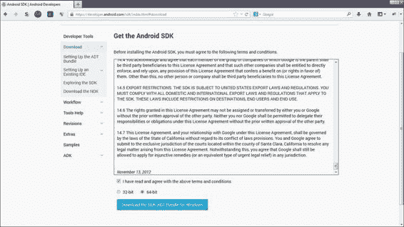

3.  Of course, you will need to accept the license agreement before downloading and select the appropriate CPU type, or register size if you're not sure how to check your CPU type.

    在 Windows 上，您需要完成以下步骤:

    1.  点击**开始**。
    2.  右键点击**我的电脑**。
    3.  选择**属性**。
    4.  应该会弹出一个窗口，显示您计算机的系统特定信息。你要找的信息应该在**系统**部分，标注**系统类型**。

    

    要在基于 Ubuntu、Debian 或 Unix 的发行版上检查您的系统类型，请执行以下步骤:

    1.  通过按下*Ctrl*+*Alt*+*T*或简单地使用图形界面启动终端来打开终端。
    2.  执行以下命令:

        ```java
         uname -a

        ```

    3.  或者，您可以使用`lscpu`显示类似于下面截图的内容:

    

4.  When you're happy with the license agreement and you've selected the correct system type, click on **Download** in the ADT **Download** page. Once the ZIP file has been downloaded, it should look like the following screenshot on Windows:

    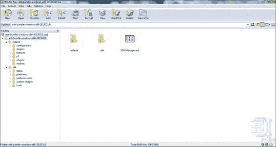

在基于 Linux 或 Unix 的发行版上，该档案将具有相同的结构。

# 安装 Java 开发工具包(JDK)

安卓使用定制版本的 Java 运行时来支持其应用。这意味着，在我们开始使用 Eclipse 和开发安卓应用之前，我们实际上需要安装 Java 运行时和开发工具。这些都可以在 **Java 开发工具包** ( **JDK** )中找到。

## 怎么做...

在窗口上安装 JDK 的工作原理如下:

1.  Grab a copy of the JDK from Oracle's **Downloads** page, [http://www.oracle.com/technetwork/java/javase/downloads/index.html](http://www.oracle.com/technetwork/java/javase/downloads/index.html). Click on **DOWNLOAD**. The following screenshot shows the **Downloads** page:

    

2.  Make sure to select the appropriate version for your system type; see the previous walkthrough to find out how to check your system type. The following screenshot highlights the Windows system types supported by the Oracle Java JDK:

    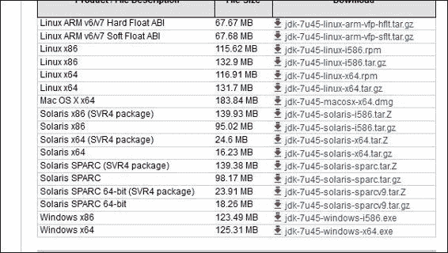

3.  After downloading the JDK, run the `jdk-[version]-[platform version].exe` file. For instance, you could have an EXE file named something like `jdk-7u21-windows-i586.exe`. All you need to do now is follow the prompts until the installation of all the setups is completed. The following screenshot is what the install wizard should look like once it's launched:

    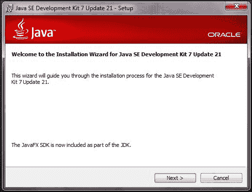

一旦安装向导完成了它的工作，你应该会在`C:\Program Files\Java\jdk[version]`下看到你的 JDK 和 JRE 的新安装，现在应该可以启动 Eclipse 了。

## 还有更多…

在 Ubuntu Linux 上安装 Java 运行时和开发工具稍微简单一些。看到 Ubuntu 有一个复杂的包和存储库管理器，你所需要做的就是通过从终端窗口发出一些简单的命令来利用它。您需要执行以下步骤:

1.  打开一个终端，或者通过您的 Unity、KDE 或 Gnome 桌面搜索终端应用，或者按下*Ctrl*+*Alt*+*T*。
2.  You may need to update your package list before installation, unless you've already done that a couple of minutes ago. You can do this by executing either of the following commands:

    ```java
    sudo aptitude update   //If you have aptitude installed 

    ```

    或者:

    ```java
    sudo apt-get update

    ```

    您应该会看到您的终端从您的存储库中打印出它正在执行的所有下载，如下图所示:

    

3.  Once that's done, execute the following command:

    ```java
    sudo apt-get install openjdk-[version]-jdk apt-get 

    ```

    如果您已被正确添加到您的`sudoers`文件中，您将需要输入您的密码。或者，假设您有根用户的密码，您可以通过执行以下命令来借用根权限:

    ```java
    su root

    ```

    这显示在以下屏幕截图中:

    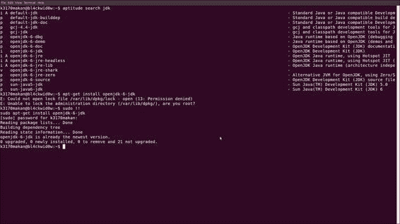

一旦你的 JDK 安装正确，你应该可以启动 Eclipse 并开始你的安卓开发。当您启动 Eclipse 时，您应该会看到下面的截图:


安装成功后，您的 Eclipse 安装中的工具栏应该看起来像下面截图中的工具栏:


# 更新原料药来源

SDK 管理器和相关工具与 ADT 包捆绑在一起；它们提供了对最新和最稳定的API、Android 模拟器映像以及各种调试和应用测试工具的访问。下面的演练向您展示了如何更新您的应用编程接口和其他安卓开发相关资源。

## 怎么做...

更新应用编程接口的工作原理如下:

1.  导航到软件开发工具包管理器。如果你是在 Windows 中完成这些，你应该在名为`SDK Manager.exe`的`ADT-bundle`文件夹的根目录中找到它。Ubuntu 用户可以在`[path to ADT-bundle]/sdk/tools/android`找到它。
2.  All you need to do is launch the SDK manager. It should start up and begin retrieving a fresh list of the available API and documentation packages.

    

3.  您需要确保选择了**工具**包；当然，您也可以选择任何其他附加套餐。一个好主意是下载最后两个版本。安卓是非常向后兼容的，所以你真的不需要太担心旧的应用编程接口和文档，除非你用它来支持真正旧的安卓设备。
4.  您需要表明您接受许可协议。您可以对正在安装的每个对象执行此操作，也可以单击**全部接受**。
5.  Once you've accepted the licenses, you can collect your documentation and APIs by clicking on **Install** as shown in the following screenshot:

    

# 自动驾驶仪的替代安装

如果前面安装 Eclipse 和 ADT 插件的方法由于某种原因不起作用，你可以一直走老路，下载你自己的 Eclipse，通过 Eclipse 手动安装 ADT 插件。

## 怎么做...

下载并插入 ADT 的工作原理如下:

1.  Download Eclipse—Helios or a later version—from [http://www.eclipse.org/downloads/](http://www.eclipse.org/downloads/). Please make sure to select the appropriate version for your operating system. You should see a page that looks like the following screenshot:

    

2.  Download the ADT bundle for your platform version from the Android website, [http://developer.android.com/sdk/installing/installing-adt.html](http://developer.android.com/sdk/installing/installing-adt.html). The following screenshot displays a part of the page on this website:

    

3.  确保您已经安装了 Java JDK。
4.  如果您的 JDK 安装可以运行，请运行您在步骤 1 中下载的 Eclipse 安装程序。
5.  一旦 Eclipse 安装好并准备好了，插入您的 ADT。
6.  Open Eclipse and click on the **Help** button in the menu bar.

    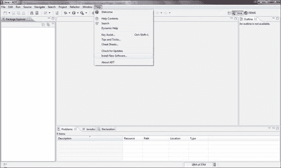

7.  点击 **安装新软件...**。
8.  The **Available Software** dialog box will pop up. You need to click on **Add…**.

    

9.  将显示**添加存储库**对话框。你需要点击**档案...**按钮。
10.  A file browser should pop up. At this point, you will need to navigate to the ADT ZIP file that you downloaded in the previous steps.

    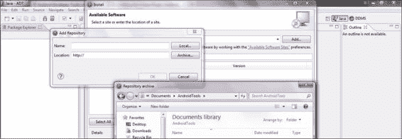

11.  找到 ADT 文件后，点击**打开**。
12.  然后点击**确定**。
13.  You will be shown the available packages in the `.zip` archive. Click on **Select All** and then on **Next**.

    

14.  You will now need to accept the license agreement; of course, you reserve the right not to. It's always a good idea to give it a read. If you're happy, select the **I accept the terms of the license agreements** option and then click on **Finish**.

    

15.  The software installation will now begin. You may get a warning stating that the content is unsigned and the authenticity cannot be verified. Click on **OK**.

    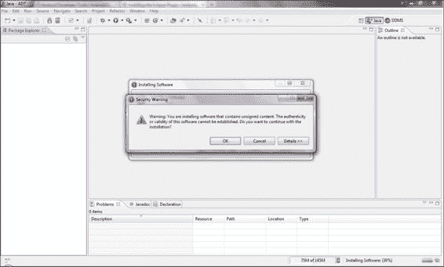

16.  重启 Eclipse。

安卓软件开发工具包、设备仿真器和支持 Eclipse 的功能应该已经准备好了。查看您的 Eclipse 工具栏。它应该有一些新的图标。

# 安装本机开发工具包(NDK)

如果你想在你的安卓设备上做任何低级别的开发或开发，你需要确保你可以在安卓平台上编写低级别的应用。低级意味着使用编译器在 C/C++等语言中进行开发，这些编译器是为适应嵌入式平台及其各种细微差别而构建的。

Java 和原生/低级编程语言有什么区别？光是这个话题就能填满整本书。但是，仅陈述最基本的表层差异，在虚拟机中运行之前，Java 代码被编译并静态检查——这意味着源代码被分析。对于安卓 Java 来说，这个虚拟机被称为达尔维克——稍后将详细介绍。安卓原生开发的组件在安卓设备附带的类似嵌入式 Linux 的操作系统上一字不差地运行——正如它们的源代码所规定的那样。除了奇怪的编译器扩展和优化之外，没有额外的解释和检查层来运行本机代码。

安卓团队提供的让原生开发成为安卓开发者无痛体验的工具链和文档被称为**原生开发工具包** ( **NDK** )。NDK 包含安卓开发者为安卓设备编译 C/C++代码所需的所有工具，并支持 ARM、MIPS 和 x86 嵌入式平台。它包括一些帮助原生开发人员分析和调试原生应用的工具。本演练讨论如何在您的计算机上启动和运行 NDK。

在我们开始之前，您需要查阅[http://developer.android.com/tools/sdk/ndk/index.html#Reqs](http://developer.android.com/tools/sdk/ndk/index.html#Reqs)上的系统需求列表，以确保您的机器可以正常运行。

## 怎么做...

在你的机器上安装 NDK 就像下载它并确保它实际运行一样简单。我们可以使用以下步骤:

1.  Downloading the NDK is pretty straightforward. Go to [http://developer.android.com/tools/sdk/ndk/index.html](http://developer.android.com/tools/sdk/ndk/index.html) to grab the latest copy and make sure to select the appropriate version for your system type.

    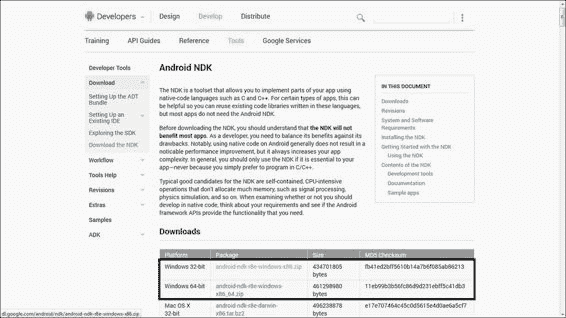

2.  将 NDK 解压到一个方便的位置。

# 模仿安卓

安卓软件开发工具包附带了一个非常简洁的工具，叫做模拟器，它允许你模拟安卓设备。模拟器附带了一些最流行的手机，可以让你创建一个自己的模拟手机。使用这个工具，你可以刷新新内核，摆弄平台，当然，调试应用，测试你的安卓恶意软件和应用漏洞。在整本书中，我们将大量使用这个工具，因此，了解安卓模拟器非常重要。

模拟器使用起来非常简单。当你想要启动一个设备时，你只需要从你的 SDK 文件夹或者直接从 Eclipse 打开**安卓虚拟设备** ( **AVD** )工具。然后，您可以为新设备设置自己的存储卡、中央处理器和屏幕大小以及其他自定义功能，也可以从列表中选择一个预配置的设备。在这一节中，我将详细介绍这些内容。

只是一个快速的免责声明:下面的截图是在 Windows 7 机器上拍摄的，但是 AVD 管理器和设备仿真器在 Windows 和 Linux 平台上的工作方式完全相同，因此 Linux 用户也将能够遵循这个演练。

## 怎么做...

要模拟 Eclipse 中的设备，请执行以下步骤:

1.  Click on the AVD manager icon on your toolbar.

    

2.  AVD 会弹出。您可以选择预配置的特色设备，也可以根据自己的标准设置设备。对于这个食谱，让我们坚持配置自己的设备。
3.  Click on **New…**.

    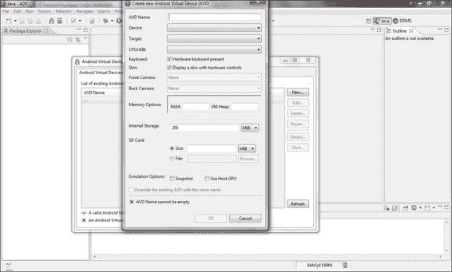

4.  应弹出**新建安卓虚拟设备(AVD)** 对话框。您需要为新的虚拟设备填写一些指标并给它命名。你可以在这里输入任何你感觉到的，因为这个食谱只是让你模仿你的第一台设备。
5.  完成后，点击**确定**。新设备应显示在自动车辆识别对话框中。
6.  Click on the device you just created and click on **Start…**.

    

此时，AVD 会提示您屏幕尺寸选项；默认值不算太差。完成后，点击**启动**，几秒钟后，你的新自动驾驶仪将启动。

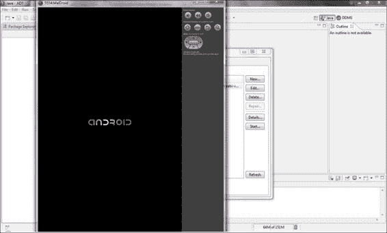

# 创建安卓虚拟设备(AVDs)

出于某种原因，你们中的一些人可能更喜欢从命令行界面使用 avd。也许你有一些很棒的脚本，你想写出来设置一些很棒的 avd。本食谱详细介绍了如何创建自动视频设备，并直接从命令行启动它们。

## 怎么做…

在创建自己的 AVDs 之前，需要为其指定一些属性；最重要的是将要使用的系统映像。为此，请执行以下步骤:

1.  You can find a list of the system images available to you by using the following command:

    ```java
    [path-to-sdk-install]/tools/android list targets

    ```

    或者从 Windows 终端使用以下命令:

    ```java
    C:\[path-to-sdk-install]\tools\android list targets

    ```

    例如，在命令提示符下输入以下内容:

    ```java
    C:\Users\kmakan\Documents\adt-bundle-windows-x86-20130219\sdk\tools\android list targets

    ```

    此命令将列出系统上可用的系统映像。如果你想要更多，你需要通过软件开发工具包管理器安装它们。您在此列表中寻找的信息片段是目标标识，因为您需要它们来标识系统映像，您将需要在下一步中指定该映像。

2.  Create the AVD using the following command:

    ```java
    [path-to-sdk-install]/tools/android create avd –n [name of your new AVD] –t [system image target id]

    ```

    您将需要决定您刚刚创建的 AVD 的名称，您将使用`–n`开关指定该名称。必须使用`–t`开关指定您在上一步中选择的系统映像标识。如果一切顺利，你应该刚刚创建了一个全新的虚拟机。

3.  You can launch your brand new AVD using the following command:

    ```java
    [path-to-sdk-install]/tools/emulator –avd [avd name]

    ```

    这里，`[avd name]`是你上一步决定的 AVD 名称。如果一切顺利，您的新 AVD 应该会立即启动。

## 还有更多…

您可能想了解更多关于命令的信息。关于仿真器，它能够仿真具有不同配置的设备。

### 模拟存储卡或外部存储器

您可以指定您的虚拟设备在创建时也使用`–c`选项模拟一些外部存储，如以下命令所示:

```java
android create –avd –n [avd name] –t [image id] –c [size][K|M]

```

例如，请参见以下命令:

```java
android create –avd –n virtdroid –t 1 –c 128

```

你显然需要提供你的新仿真存储卡的大小。您还需要通过为千字节指定`K`或为兆字节指定`M`来指定单位。

### 分区大小

您可能想要做的另一件非常有用的事情是指定您想要授予内部存储分区多少空间。您可以通过使用`-partition-size`开关来实现这一点，该开关是在调用模拟器时指定的，如以下命令所示:

```java
emulator –avd [name] –partition-size [size in MBs]

```

您还需要提供分区的大小。默认情况下，度量单位是兆字节(MBs)。

## 另见

当涉及到模拟器时，您可以利用许多其他选项。如果您有兴趣了解更多信息，请查看以下链接中提供的文档:

*   [http://developer . Android . com/tools/devices/management-avds-cmd line . html](http://developer.android.com/tools/devices/managing-avds-cmdline.html)
*   [http://developer.android.com/tools/help/android.html](http://developer.android.com/tools/help/android.html)

# 使用安卓调试桥(ADB)与 AVDs 交互

对于开发者和安卓安全工程师/审计员来说，与仿真安卓设备交互是最重要的技能之一。**安卓调试桥** ( **ADB** ) 提供了与安卓设备的本地组件交互所需的功能。它允许开发人员和安全工程师读取文件系统的内容，并与包管理器、应用管理器、内核驱动程序接口和初始化脚本等交互。

## 怎么做...

使用 ADB 与虚拟设备交互的工作原理如下:

1.  你需要先启动一个自动增值设备，或者，如果你愿意，只需通过一个通用串行总线将你自己的安卓设备插入你想使用的任何机器——假设这台机器已经安装了软件开发工具包。您可以使用以下命令启动自动电压调节器:

    ```java
    emulator –avd [name]

    ```

2.  We can list all the connected Android Devices by using the following command for a Windows machine:

    ```java
    C;\\[path-to-sdk-install]\platform-tools\adb devices

    ```

    或者，如果您使用的是 Linux 机器，请使用以下命令:

    ```java
    [path-to-sdk-install]/platform-tools/adb devices

    ```

    这个命令应该会给你一个连接设备的列表，基本上是你可以使用 ADB 连接的所有设备。您需要注意列表中的设备名称。当您使用 ADB 启动与设备的连接时，您需要识别这些设备。

3.  You can launch a shell connection to your Android device using the following command:

    ```java
    /sdk/platform-tools/abd shell –s [specific device]

    ```

    或者，如果您碰巧知道您想要连接的安卓设备是唯一的模拟设备，您可以使用以下命令:

    ```java
    /sdk/platform-tools/adb shell –e

    ```

    或者，如果该设备是唯一的 USB 连接设备，您可以使用以下命令:

    ```java
    /sdk/platform-tools/adb shell –d

    ```

    开关`–d`、`-e`和`-p`适用于其他 ADB 命令，而不仅仅是外壳。如果运行良好，您应该会看到一个提示字符串，该字符串用于标识正在使用的命令外壳，类似于以下命令:

    ```java
    root@android$

    ```

你现在应该有一个成熟的外壳，指尖上有一些传统的 Unix/Linux 命令和实用程序。试着在文件系统上搜索一下，了解所有的东西都保存在哪里。

## 还有更多…

现在您已经有了一个连接的设备，您需要了解一点关于导航安卓文件系统和使用命令的知识。这里有一个让你开始的小清单:

*   `ls {path}`:这将列出路径处目录的内容
*   `cat {file}`:这将在屏幕上打印文本文件的内容
*   `cd {path}`:这会将工作目录更改为路径所指向的目录
*   `cd ../`:这将工作目录更改为高一级的目录
*   `pwd`:打印当前工作目录
*   `id`:这将检查您的用户 ID

## 另见

*   [http://developer.android.com/tools/help/adb.html](http://developer.android.com/tools/help/adb.html)

# 将文件复制到 AVD 上或从 AVD 上复制文件

在你即将到来的安卓平台冒险中，你可能想在某个时候从你的安卓设备上复制东西，不管它们是不是模拟器。复制文件非常简单。您只需要以下内容:

*   你想要的联网设备
*   您想要复制的文件
*   你想把这个文件放在什么地方

## 怎么做...

要使用 ADB 访问安卓设备上的文件，您需要执行以下操作:

1.  这实际上很简单。您需要从命令行界面发出以下命令:

    ```java
    adb {options} pull [path to copy from] [local path to copy to]

    ```

2.  要将文件复制到 AVD 上，可以使用以下命令:

    ```java
    adb {options} push [local path to copy from] [path to copy to on avd]

    ```

# 通过 ADB 将应用安装到 avd 上

有时，您可能需要将本地文件系统上的**应用包** ( **APKs** ) 安装到您拥有的仿真器或设备上。通常基于安卓的安全工具在 Play Store 上是不可用的——因为它们会让不守规矩的用户面临太大的风险或被恶意软件滥用——并且需要手动安装。此外，您可能会开发应用和安卓原生二进制文件来演示和验证漏洞。

## 怎么做...

使用亚行安装 APK 可以通过以下方式完成:

1.  您需要知道 APK 在本地机器上的位置，当您找到它时，您可以用`path`替换它，如下命令所示:

    ```java
    adb {options} install [path to apk]

    ```

2.  您也可以使用特定于设备的命令来缩小要安装的设备的范围。您可以使用以下命令:

    ```java
    adb {-e | -d | -p } install [path to apk]

    ```