# 第三章。安卓安全评估工具

在本章中，我们将介绍以下食谱:

*   安装和设置桑托库
*   设置 drozer
*   运行 drozer 会话
*   正在枚举已安装的包
*   枚举活动
*   枚举内容提供者
*   正在枚举服务
*   枚举广播接收器
*   确定应用攻击面
*   启动活动
*   编写驱动程序模块–设备枚举模块
*   编写应用程序证书枚举器

# 简介

我们已经介绍了所有的安卓开发基础知识，并介绍了所有的安卓开发工具。现在是时候开始接触安卓黑客和安全评估工具了。

本章向您介绍一个名为**drozer**—正式名称为**Mercury**—的开发和安卓安全评估框架，由 MWR 实验室的一些人开发。本章还涉及了一个基于 Debian 的 Linux 发行版，名为 **Santoku** ，基本上类似于 Mobile 安全评估的 BackTrack 或者 Kali Linux。这里我们介绍如何设置和运行它。

在我们开始设置 drozer 并编写一些示例脚本之前，对您来说非常重要的一点是了解 drozer 是如何运行的，以及它如何解决安卓安全评估游戏中的一些问题。

drozer 来了分两部分:一部分是运行在你本地机器上的“控制台”，另一部分是“服务器”，基本上是安装在目标安卓设备上的应用程序。当您使用控制台与安卓设备交互时，您基本上是将 Java 代码注入到 drozer 代理中，该代理在实际设备上执行。

为什么要这样设计？早在 drozer 出现之前，编写以应用程序漏洞为中心的漏洞攻击就意味着必须编译一个 Android 应用程序，利用给定的漏洞，将其部署到目标手机上，并检查它是否有效。如果没有，你需要重做整个过程！这种做法非常繁琐，会让安卓安全评估感觉像是一件苦差事。drozer 通过 drozer Agent 的代理向设备动态传递命令，使部署和测试漏洞利用变得非常容易，这意味着您永远不需要多次接触 Android 开发环境或重新编译漏洞利用应用程序。

drozer 之所以被称为框架，是因为它允许您通过编写自己的模块或插件来扩展其功能，并使其适应您的需求。它本质上是最接近移动安全评估的 Metasploit。

标准 drozer 框架的另一个影响是，它本质上是一个安卓应用程序——它的一个组件——没有权限，这意味着无论你在安卓设备上成功利用什么，它都将自动非常便携，并且需要非常低的权限级别才能成功。目的是展示“无权限”应用程序在利用安卓设备和其上托管的应用程序方面有多有效。

这就是德罗泽的一些基本背景。就本章的其余部分而言，您可能需要一些 Python 编程语言的基本知识，因为 drozer 的模块是用 Python 开发的。如果你对 Java Reflection 有所了解，并且知道如何或者已经开发了一些安卓应用程序，这可能也会有所帮助。如果您从未开发过任何严肃的东西，或者通常从未用 Python 编程过，请不要担心——我会确保遍历所有 Python 代码并仔细解释它。

所以不再多言，让我们开始吧！

# 安装和设置桑托库

ViaFaceBook 的工作人员开发了一个非常酷的基于 Ubuntu 的发行版，其中包含了移动安全评估工具，名为 Santoku。下面的方法向您展示了如何设置您自己的安装。我首先做的原因是因为你可能想在你的 Santoku 操作系统安装中安装并运行 drozer。

## 做好准备

首先，我们要做一些下载。从[https://santoku-linux.com/download](https://santoku-linux.com/download)获取一份最新的圣德库图片。

## 怎么做...

下载完最新版本的 Santoku 后，您可以按如下方式开始设置:

1.  首先，您可以使用 Ubuntu 启动盘创建器或通用 USB Windows 安装程序将 Santoku 映像写入 USB 记忆棒，可从[http://www . pendrivellinux . com/downloads/Universal-USB-Installer/Universal-USB-Installer-1 . 9 . 4 . 7 . exe](http://www.pendrivelinux.com/downloads/Universal-USB-Installer/Universal-USB-Installer-1.9.4.7.exe)获得。
2.  把你下载的桑托库图像写到你的 u 盘上。
3.  使用通用 USB 安装程序，执行以下步骤:
    1.  Start up the Universal USB installer and select **Try Unlisted Linux ISO** at **Step 1**.

        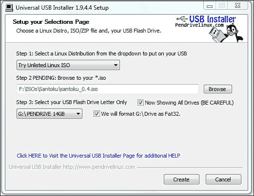

    2.  点击**浏览**并选择你的圣多库 ISO 的路径，如前一张截图所示。
    3.  在**步骤 3** 中，选择您想要写入图像的 u 盘。
    4.  点击**创建**，在准备安装盘映像时，坐下来放松一下。
4.  插上 USB 设备，重启主机机器；打开启动菜单，选择从 u 盘启动。
5.  Once it boots from the USB start-up disk, you should see the following screen:

    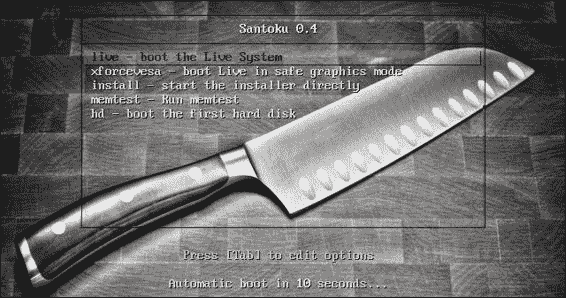

6.  在开机画面，选择**安装–直接启动安装程序**。
7.  The installation should begin with the screen shown in the following screenshot:

    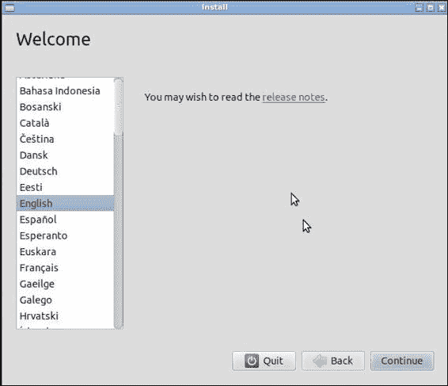

8.  Follow the rest of the install wizard prompts until installation begins. The process is very easy to understand and should be familiar to anyone who has installed Ubuntu before.

    安装完成后，您应该会看到一个全新的 Santoku 桌面，如下图所示:

    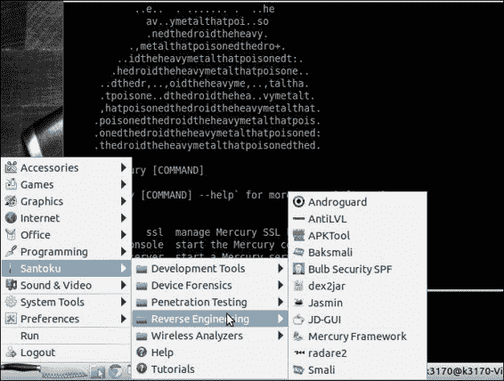

## 还有更多...

如果您要在虚拟机上安装这个，您需要获取一个 VirtualBox 的副本。对于 Windows 和 Unix/Linux 用户，可在[https://www.virtualbox.org/wiki/Downloads](https://www.virtualbox.org/wiki/Downloads)获得。

下载并安装 VirtualBox 后，您需要通过执行以下步骤来创建新的虚拟机:

1.  点击位于虚拟盒子窗口左上方的**新建**按钮。
2.  将弹出**创建虚拟机**对话框。在**名称**字段中输入`Santuko`，或者选择您想要命名的新虚拟机。
3.  在**类型**下拉菜单中选择 **Linux** 。
4.  Select **Ubuntu** in the **Version** drop-down menu and click on **Next**.

    

5.  **内存大小**对话框现在应该出现了；默认设置为 **512** 。这就足够了；然而，如果你的主机上有一个结实的内存，欢迎你慷慨一点。一旦你决定了内存大小，点击**下一步**。
6.  将显示**硬盘设置** 对话框；选择**立即创建虚拟硬盘**选项，点击**下一步**。
7.  将出现**硬盘文件类型**对话框；选择 **VDI (VirtualBox 磁盘映像)**选项，点击**下一步**。
8.  物理硬盘上的**存储**对话框应该出现；选择**动态分配的**选项；这是因为你可能会安装和下载一大堆应用程序和工具到这个虚拟机的硬盘上。点击**下一步**。
9.  **文件位置和大小**对话框应该会出现。您可以在此接受默认值；8gb 足以存储所有初始操作系统数据和实用程序。如果您想要更多，可以将虚拟机配置为占用更多一点的存储空间；一切都取决于你。选择合适的尺寸后，点击**下一步**。
10.  您的虚拟机现在应该全部设置好了；您需要配置一张实时光盘，以便从该光盘启动。为此，点击**设置**。
11.  一旦**设置**对话框出现，点击**设置**对话框左侧窗格的**存储**。
12.  Under the **Controller: IDE** section, click on the **Add CD/DVD Device** button, which is the first button next to the **Controller: IDE** section label.

    

13.  将弹出**虚拟对话框问题**对话框；在该对话框中，点击**选择磁盘**。你应该被呈现一个**文件**对话框。
14.  导航到并选择您下载的桑托库图像。
15.  You can now start your new Santoku Virtual Machine and begin installing it.

    

# 设置 drozer

安装和设置 drozer 相当简单；为 Windows 7 和 Unix/Linux 类型的系统演示了设置过程。

## 怎么做...

在我们开始破解一些 drozer 脚本并了解利用和枚举模块之前，您需要获取一份适合您系统的 drozer 安装程序。你是这样做的:

1.  Head over to [https://www.mwrinfosecurity.com/products/drozer/community-edition/](https://www.mwrinfosecurity.com/products/drozer/community-edition/) to grab a copy of the drozer framework; of course, here I will be talking about the community edition. If you wish to spend some cash on the non-free edition, head over to [https://products.mwrinfosecurity.com/drozer/buy](https://products.mwrinfosecurity.com/drozer/buy).

    

    Windows 用户应点击 **drozer (Windows installer)** 选项；它应该立即开始下载`drozer-installer-[version].zip`文件。

    

    Unix/Linux 用户会根据您的发行版或操作系统风格，选择**drozer(Debian/Ubuntu Archive)**文件或 **drozer (RPM)包**文件。

2.  Once you've downloaded the drozer version compatible with your system, you will need to do the following, depending on your system:

    对于 Windows 用户:

    1.  You will need to unzip/unpack the `drozer-installer-[version].zip` file to a place/path you can easily remember.

        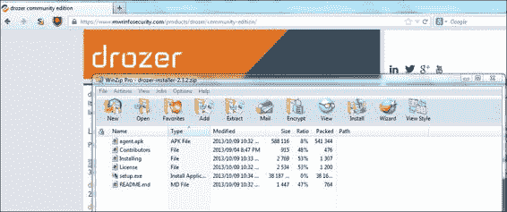

    2.  Once unzipped, run the file called `setup.exe` included in the ZIP archive. An install wizard should start up as shown in the following screenshot:

        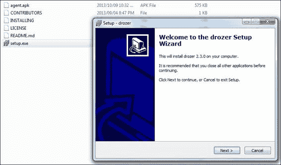

    3.  Once the install wizard is set up, all you need to do is follow the prompts, pay attention to the configuration dialogs, and also make sure to take note of where drozer will be installed on your system; you will need to visit this path often to use drozer. Once installation starts, you should see the following dialog appear:

        

    4.  Once installation is complete, you should have drozer installed to the path you've specified. By default, this is configured to be at the root of the `C` drive, as shown in the following screenshot:

        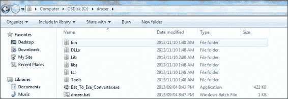

        对于 Unix/Linux 用户:

        drozer 框架以与您的系统相关的包文件格式提供，因此要么是 Debian 用户的 DEB 文件，要么是 Red Hat 用户的 RPM 文件。你需要做的就是用你的包管理器打开这个文件，它会处理剩下的。Debian 用户可以使用以下命令来安装 drozer:

        ```java
        dpkg –I drozer-[version].deb

        ```

3.  Once drozer is installed, you should try to run it. How you run it will partly depend on your operating system.

    对于 Windows 用户:

    1.  打开命令提示符，前往您安装驱动程序的路径。默认情况下——如前所述——这是`C:\drozer`路径。
    2.  Invoke drozer by executing the following command:

        ```java
         C:\drozer\drozer

        ```

        您应该会看到类似于下面截图的输出:

        

    3.  As a diagnostic test, try invoking the drozer console. If there's anything wrong, it should notify you of the errors before telling you that the device—which is not attached here—is unavailable or refusing connections. Execute the following command:

        ```java
         C:\drozer\drozer console

        ```

        除非您已经足够聪明地修复了错误，否则您应该会看到类似于下面截图所示的输出:

        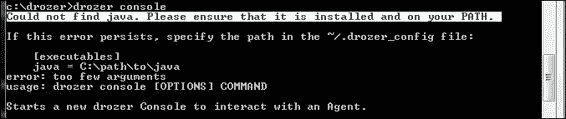

        这个错误意味着 drozer 找不到你的 Java 安装。

4.  Assuming you've already installed Java, you can add drozer to your system `PATH` variable.

    在 Windows 上，增加你的`PATH`变量是非常简单的；首先执行以下步骤:

    1.  打开**我的电脑**。
    2.  点击**系统属性**。
    3.  Under the **Control Panel** section of the screen, click on **Advanced system settings**.

        

    4.  应弹出**用户访问控制**提示。如果您有管理员权限，只需点击**确定**或输入管理员密码。
    5.  On the **System Properties** dialog, click on the button labeled **Environment Variables...**.

        

    6.  Once the **Environment Variables** dialog pops up, under the section labeled **System variables**, scroll down to the variable called **Path** and click on **Edit…**.

        

    7.  应该会弹出另一个对话框，允许您编辑`PATH`变量。将以下字符串添加到值的末尾:

        ```java
               ;C:\Program Files\Java\jre7
        ```

对于 Unix/Linux 用户:

1.  您可以通过从终端窗口执行以下命令来调用 drozer:

    ```java
    drozer

    ```

2.  如果一切都是那么，你应该会看到与 Windows drozer 版本完全相同的输出。
3.  If Java has not been added to your `PATH` variable, execute the following command to get it added:

    ```java
    PATH=$PATH:`which java

    ```

    为了保持这一点，在`/home/[user]/.bashrc`文件的末尾添加上一个命令行。

## 还有更多…

在 drozer 启动并运行之前，您需要在安卓设备上安装 drozer 代理。这很简单；你是这样做的:

1.  假设设备通过 USB 连接到你的主机，你可以安装`drozer.apk file`如下:

    ```java
    adb install drozer.apk

    ```

2.  For this to work, you need to make sure that **Unknown Sources** and **USB Debugging** are both enabled for the target Android device.

    在启动 drozer 时，您应该会看到以下内容:

    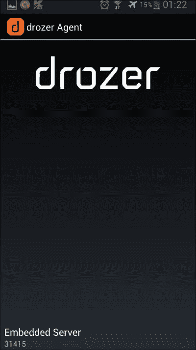

3.  To make using the drozer console from the command-line interface a little easier, you could also add drozer itself to your system `PATH` variable.

    对于 Windows 用户:

    1.  进入**环境变量**对话框，如前一个配方所述。
    2.  Add the following string to your `PATH` variable:

        ```java
               ;C:\drozer\drozer

        ```

    如果您是 Unix/Linux 用户，请从您的终端执行以下命令:

    ```java
    PATH=$PATH:`which drozer`

    ```

    为了保持这一点，在`/home/[user]/.bashrc`文件的末尾添加上一个命令行。

如果 DEB 文件安装失败，有另一种方法可以安装 drozer，这种方法相对来说没有痛苦。要在没有 DEB 包的情况下安装 drozer，请执行以下步骤:

1.  To start off, grab a copy of the Python development headers and packages by executing the following command:

    ```java
    apt-get install python-dev

    ```

2.  Grab a copy of the Python setup tools by executing the following command:

    ```java
    apt-get install python-setuptools

    ```

3.  Install the 32-bit support libraries for your Debian system:

    ```java
    apt-get install ia32-libs-i386

    ```

4.  安装 Python 依赖项；第一个是`protobuf`，可以通过执行以下命令进行安装:

    ```java
    easy_install –allow-hosts pypi.python.org protobuf==2.4.1

    ```

5.  Once `protobuf` is installed, you'll need to install `twisted` for python, which you can do by executing the following command:

    ```java
    easy_install twisted==10.2.0

    ```

6.  然后你需要做的是抓取 drozer 架构独立包的副本，可在[https://www . mwrinfosecurity . com/system/assets/571/original/dro zer-2 . 3 . 2 . tar . gz](https://www.mwrinfosecurity.com/system/assets/571/original/drozer-2.3.2.tar.gz)获得。
7.  Once downloaded, unpack this into some directory of your choice. Once unpacked, it should contain a file called `drozer-[version]-py2.7.egg`. You can then install this EGG by executing the following command:

    ```java
    easy_install drozer-[version]-py2.7.egg

    ```

    就这样——德罗泽应该准备好摇滚了！

# 运行 drozer 会话

所以你已经让德罗泽准备好出发了；你可以开始在一个示例安卓设备上运行一些 drozer 会话——最好是一个安装了 drozer Agent 的设备。

以下食谱将带您了解设置 drozer 会话的基础知识，以及如何通过 drozer 控制台启动一些快速简单的模块。

## 怎么做...

在继续执行此方法之前，您需要在计算机上安装 drozer 控制台，并在目标设备上安装 drozer 代理。如果所有这些都已排序，您可以通过执行以下步骤继续运行 drozer 控制台会话:

1.  使用 ADB，设置一些端口转发，前提是连接了某种设备:

    ```java
    adb forward tcp:31415 tcp:31415

    ```

2.  您需要确保 drozer 嵌入式服务器已经启动。您需要通过设备上的应用程序界面启动它。只需在您的设备上找到 drozer 代理；它应该会在你设备上的其他应用程序中弹出，但是看到你可能刚刚安装了它，你可能会看到一个关于它的通知，并且能够从你的通知菜单中启动它。
3.  Press the button labeled **Embedded Server via the drozer Agent User interface**. You should be presented with the screen as shown in the following screenshot:

    

4.  Drag the button labeled **Disabled** to the right. It should say **Enabled** now and the **Enabled** label under the **Server Details** section of the user interface should be engaged, as shown in the following screenshot:

    

5.  You can then connect the drozer console by executing the following command:

    ```java
    drozer console connect

    ```

    然后 drozer 将进入控制台模式，允许您启动命令和模块。

    

# 枚举已安装的包

drozer 代理都设置好了并且你已经设法启动了 drozer 控制台；您可以开始启动一些 drozer 模块，并真正关注设备的安全性。

下面的方法详细介绍了 drozer 框架的基本用法，用于执行一些新颖的任务，例如枚举已安装的包并根据包名过滤它们。

## 怎么做...

一旦你启动并运行了 drozer 框架，你可能想开始在你的安卓设备上乱搞。您可能想做的一件有用的事情是列出设备上安装的所有软件包。您可以通过从 drozer 控制台发出以下命令来实现这一点:

```java
dz> run app.package.list

```

您应该会看到屏幕上开始出现类似以下内容的内容:

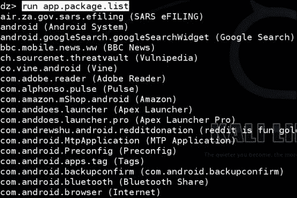

## 它是如何工作的...

让我们看一下 drozer 源代码，了解它是如何与包管理器 API 接口以获取所有这些有用信息的。我将解释大部分模块背后的代码，以便您了解 drozer 是如何工作的，并在本章的后面部分帮助您编写自己的 drozer 模块！毕竟，这就是框架的意义所在——构建自己的 mod 和插件。

当心非 Python 用户/开发者！您可能需要一点 Python 背景才能阅读此源代码；尽管，即使您从未编写过 Python 代码，但看到 Python 非常语义化，您应该能够非常容易地理解。drozer 设计的另一个好处是，它们基本上反映了安卓的 Java 应用编程接口，使安卓开发人员可以轻松进行模块开发。所以，总而言之，你还不需要跑出去买一本关于 Python 的书。如果你以前写过安卓应用，这将非常容易理解。总之，说够了——让我们看看代码吧！

### 注

以下代码可在[https://github . com/mwr labs/dro zer/blob/master/src/dro zer/modules/app/package . py](https://github.com/mwrlabs/drozer/blob/master/src/drozer/modules/app/package.py)获得(第 99-121 行)。

```java
def add_arguments(self, parser):
  parser.add_argument("-a", "--package", default=None, help="the identifier of the package to inspect")
  parser.add_argument("-d", "--defines-permission", default=None, help="filter by the permissions a package defines")
  parser.add_argument("-f", "--filter", default=None, help="keyword filter conditions")
  parser.add_argument("-g", "--gid", default=None, help="filter packages by GID")
  parser.add_argument("-p", "--permission", default=None, help="permission filter conditions")
  parser.add_argument("-u", "--uid", default=None, help="filter packages by UID")

def execute(self, arguments):
  if arguments.package == None:
    for package in self.packageManager().getPackages(common.PackageManager.GET_PERMISSIONS | common.PackageManager.GET_CONFIGURATIONS | common.PackageManager.GET_GIDS | common.PackageManager.GET_SHARED_LIBRARY_FILES):
      self.__get_package(arguments, package)
  else:
    package = self.packageManager().getPackageInfo(arguments.package, common.PackageManager.GET_PERMISSIONS | common.PackageManager.GET_CONFIGURATIONS | common.PackageManager.GET_GIDS | 
            common.PackageManager.GET_SHARED_LIBRARY_FILES)

      self.__get_package(arguments, package)

def get_completion_suggestions(self, action, text, **kwargs):
  if action.dest == "permission":
    return android.permissions

def __get_package(self, arguments, package):
  application = package.applicationInfo
```

每当您从控制台启动`app.activity.info`模块时，都会调用`execute()`方法。它本质上是该模块所做的真正艰苦工作的切入点。

我们看到对包管理器的调用，`self.packageManager().getPackages(…)`；这将返回包对象列表以及每个包的权限、配置、GID 和共享库。脚本在每个包对象上调用`self.__get_package()`将其打印到 drozer 控制台。对于通过命令行参数提供特定包的情况也是如此。

如果你想获得自己的这段代码的副本，你可以从官方的 drozer GitHub 存储库中获取，如果你足够努力地谷歌，它非常容易找到。但是为了让你的生活更轻松，我在这个食谱的*部分放了一个到代码库的网址。*

## 还有更多...

`dz> run app.package.list`命令是安卓包管理器的包装器；因此，您可以做的一件很酷的事情是根据应用程序的名称对其进行过滤，如下所示:

```java
dz> run app.package.list –f [application name]

```

这里，`[application name]`是您要检查的应用程序或包的名称。这里有一个例子:

```java
dz> run app.package.list –f facebook

```

drozer 中另一个可以用来提取信息的枚举型模块是`app.package.info`，它将获取关于一个包的以下信息:

*   许可
*   配置
*   组标识
*   共享库

您可以通过从 drozer 控制台发出以下命令来使用该模块:

```java
dz> run app.package.info --help

```

当以这种方式使用时，它将提取关于您的安卓设备上所有包的所有相关信息。

当然，您可能希望将此信息缩小到特定的包:

```java
dz> run app.package.info –-package [package name]

```

您也可以使用开关的简写形式，如下所示:

```java
dz> run app.package.info –a [package name]

```

这里有一个例子:

```java
dz> run app.package.info –a com.android.browser

```

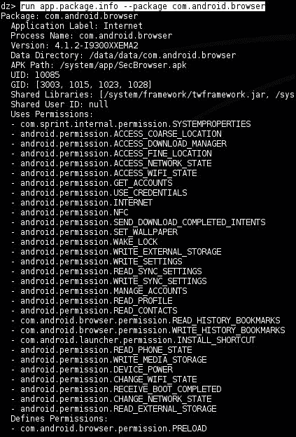

上一张截图所示输出的快速解释如下:

*   **应用标签**:显示的应用名称
*   **进程名称**:该应用运行的进程的名称
*   **版本**:应用安装的版本
*   **数据目录**:将用于存储用户数据和与该应用程序特定关联的应用程序的目录的完整路径
*   **APK 路径**:设备上实际安卓应用包文件的路径
*   **UID** :与应用关联的用户 ID；它在安卓系统上所做的一切都将使用与该用户 id 相关联的访问权限来完成，除非它让其他应用程序和进程代表它做事情
*   **GID** :与这个应用的用户标识关联的系统组标识；通常，这些权限基于授予应用程序的许多特殊权限与应用程序相关联
*   **共享库**:该应用程序使用的共享库的完整路径
*   **共享用户 ID** :该应用允许使用的共享用户 ID
*   **使用权限**:授予此应用程序的权限列表

另一个例子是，如果你有一个 Nexus 设备，将在谷歌服务框架下运行如下:

```java
dz> run app.package.info –a com.google.android.gsf

```

前面的命令应该会产生如下图所示的输出:


使用`app.package.info`模块可以做的另一件很酷的事情是根据权限查找包。您可以通过执行以下命令来做到这一点:

```java
dz> run app.package.info –p [permission label]

```

一个例子如下:

```java
dz> run app.package.info –p android.permission.INTERNET

```

为什么这很酷？嗯，你可能想知道所有具有一组危险权限的应用程序。我的意思是，你知道你有多少申请获得了`INTERNET`许可或者任何其他危险的许可吗？没有吗？没错。

## 另见

*   https://github.com/mwrlabs/drozer 的 drozer GitHub 存储库
*   位于[的`package.py` drozer 模块](https://github.com/mwrlabs/drozer/blob/master/src/drozer/modules/app/package.py)

# 列举活动

drozer 还提供了一个有用模块，用于枚举目标 Android 设备上可用的活动组件的相关信息。以下配方演示了该模块的使用。

## 怎么做...

您可能会在某个时候想要找出在您的设备上安装和导出了哪些活动。drozer 框架使这变得非常容易，下面是如何做到这一点:

从您的 drozer 控制台发出以下命令:

```java
dz> run app.activity.info

```

此命令将列出设备上导出的所有活动。

## 还有更多...

您可能希望获得有关设备上活动的更多信息；例如，列出所有名称中有特定名称或特定字符串的应用程序，如“浏览器”或“facebook”，哪些应用程序有哪些权限，甚至搜索未报告的活动。以下是如何做到这一点:

通过执行以下命令，基于名称搜索活动:

```java
dz> run app.activity.info –-filter [activity name]

```

这将列出所有名称中带有`[activity name]`的活动。这里有一个例子:

```java
dz> run app.activity.info –-filter facebook

```

与所有 Unix 风格或 Linux 风格的命令一样，这有一个快捷方式:

```java
dz> run app.activity.info –f facebook

```

前面的命令应该会产生如下图所示的输出:


也可以指定要检查哪个包的活动。

在给定的包中搜索活动，如下所示:

```java
dz> run app.activity.info –-package [package name]

```

您也可以使用此命令的快捷方式:

```java
dz> run app.activity.info –a [package name]

```

这里有一个例子:

```java
dz> run app.activity.info –a com.android.phone

```

前面的命令应该会产生如下图所示的输出:

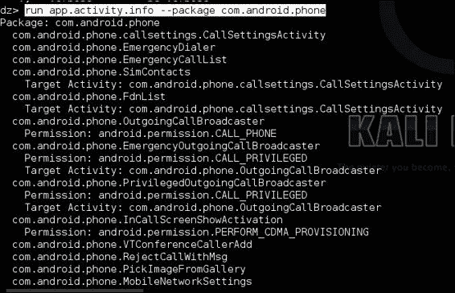

## 另见

*   [中的 drozer](https://github.com/mwrlabs/drozer/blob/master/src/drozer/modules/app/activity.py) 活动模块源代码

# 枚举内容提供商

很像列举活动和包，drozer 还提供了一些模块来列出所有的内容提供者和关于它们的一些信息。下面的食谱讲述了如何使用`app.provider.info`模块来做到这一点。

## 怎么做...

让我们开始列举内容提供者。

1.  从您的 drozer 终端执行以下命令:

    ```java
    dz> run app.provider.info

    ```

2.  这将返回有关内容提供商的以下信息:
    *   权威–实现其 SQLite 前端的类的名称
    *   读取权限
    *   写权限
    *   授予 URI 权限
    *   小路

## 它是如何工作的...

让我们看看模块的代码。

### 注

以下代码可在[https://github . com/mwr labs/dro zer/blob/766329 cacde 6 dbf1 ba 05 ca 5 dee 36 b 882041 f1 b 01/src/dro zer/modules/app/provider . py](https://github.com/mwrlabs/drozer/blob/766329cacde6dbf1ba05ca5dee36b882041f1b01/src/drozer/modules/app/provider.py)获得。

```java
def execute(self, arguments):
  if arguments.package == None:
    for package in self.packageManager().getPackages      (common.PackageManager.GET_PROVIDERS |         common.PackageManager.GET_URI_PERMISSION_PATTERNS):
      self.__get_providers(arguments, package)
  else:
    package = self.packageManager().getPackageInfo(arguments.package, common.PackageManager.GET_PROVIDERS | common.PackageManager.GET_URI_PERMISSION_PATTERNS)

    self.__get_providers(arguments, package)

def get_completion_suggestions(self, action, text, **kwargs):
  if action.dest == "permission":
    return ["null"] + android.permissions

def __get_providers(self, arguments, package):
  providers = self.match_filter(package.providers, 'authority', arguments.filter)

  if arguments.permission != None:
    r_providers = self.match_filter(providers, 'readPermission',       arguments.permission)
    w_providers = self.match_filter(providers, 'writePermission',       arguments.permission)

```

代码的第一个值得注意的部分是脚本调用包管理器的地方。看起来是这样的:

```java
self.packageManager().getPackages(common.PackageManager.GET_PROVIDERS | common.PackageManager.GET_URI_PERMISSION_PATTERNS)
```

该脚本通过调用安卓包管理器获取一个包列表，并向它抛出一些标志，以确保它能让提供者返回他们的授权 URI 许可模式。接下来我们看到，一旦包管理器收集了关于内容提供者的详细信息，脚本就会调用一个名为`__get_provider()`的函数，该函数提取关于提供者读写权限的信息(如果有的话)。通过`match_filters()`调用使用一些简单的字符串匹配，`__get_provider()`函数基本上在定义内容提供商权限的部分中寻找一些字符串值。该字符串值由`readPermission`标记为从内容提供商读取所需的权限，或者由`writePermission`标记为向内容提供商写入所需的权限。此后，它会在将提供程序对象打印到控制台之前重置该对象。

## 还有更多...

与 drozer 中的其他`.info`模块非常相似，您可以通过以下方式添加过滤器信息:

*   Search based on package names:

    ```java
    dz> run app.provider.info –a [package name]

    ```

    或者:

    ```java
    dz> run app.provider.info –-package [package name]

    ```

*   Search based on permissions:

    ```java
    dz> run app.provider.info –p [Permission label]

    ```

    或者:

    ```java
    dz> run app.provider.info –-permission [permission label]

    ```

## 另见

*   位于[的*内容提供商*网页](http://developer.android.com/guide/topics/providers/content-providers.html)

# 列举服务

您可能还想了解设备上安装的服务。drozer 有一个名为 `app.service.info`的模块，可以提取一些关于服务的有用信息。

## 怎么做...

从您的 drozer 控制台执行以下命令:

```java
dz> run app.service.info –-package [package name]

```

在没有参数的情况下运行此命令会列出目标设备上安装的所有服务。运行时，它看起来像下面的截图:


您也可以使用以下过滤器缩小搜索范围:

*   基于权限的搜索:

    ```java
    dz> run app.service.info –p [permission label]
    dz> run app.service.info –-permission [permission label]

    ```

*   基于服务名称的搜索:

    ```java
    dz> run app.service.info –f [Filter string]
    dz> run app.service.info. –filter [filter string]

    ```

*   您也可以选择列出未导出的服务，如以下:

    ```java
    dz> run app.service.info –u
    dz> run app.service.info –-unexported

    ```

*   And lastly, if you'd like information about the other switches and options, you can always run the `–help` option as follows:

    ```java
    dz> run app.service.info –-help

    ```

    前面的命令应该产生如下截图所示的输出:

    

## 它是如何工作的…

`app.service.info`模块的工作方式与大多数其他`.info`和`.list`类型的驱动程序模块一样，通过应用编程接口调用包管理器。这是`drozer/master/src/drozer/modules/service.py`打给包装经理的电话:

```java
def execute(self,arguments):
  if arguments.package == None:
    for package in self.packageManager().getPackageInfo      (common.PackageManager.GET_SERVICES |         common.PackageManager.GET_PERMISSIONS):
      self.__get_servcies(arguments, package)
  else:
    package = self.packageManager().getPackageInfo(arguments.package, common.PackageManager.GET_SERVICES | common.PackageManager.GET_PERMISSIONS)
    self.__get_services(arguments,package)
```

该脚本执行检查，以查看特定的包是否作为参数传递，这是`execute`方法中的第一段代码:

```java
if arguments.package == None:
```

如果没有定义参数或包名，脚本抓取包列表，并通过调用`self.__get_services()`方法遍历它们，该方法通过字符串匹配从`self.packageManager().getPackageInfo(arguments.package,common.PackageManager.GET_SERVICES | common.PackageManager.GET_PERMISSIONS)`调用返回的数据来确定一些包属性；例如，当查找具有指定权限的服务时，它会执行以下操作:

```java
services = self.match_filter(services, "permission", arguments.permission)
```

这是为了提取具有所需权限的服务列表。

## 另见

*   drozer *service.py* 模块来源于
*   位于[http://developer.android.com/guide/components/services.html](http://developer.android.com/guide/components/services.html)的*服务–安卓开发者*网页
*   位于[的*绑定服务-安卓开发者*网页](http://developer.android.com/guide/components/bound-services.html)
*   *服务–安卓应用编程接口参考*网页，位于

# 列举广播接收器

广播接收器通常保存关于应用程序攻击面的有用信息，并可能为攻击者提供做许多事情的机会，从执行任意代码到扩散信息；因此，在以应用程序为中心的安全评估过程中，不能忽略它们。drozer 开发人员非常清楚这一事实，并提供了一些模块来帮助获取有关广播接收器的信息。

下面的方法通过详细说明不同的调用选项来演示`app.broadcast.info`模块。

## 怎么做...

使用以下命令执行广播接收器的计数:

```java
dz> run app.broadcast.info

```

前一个命令的输出应该类似于下面的截图:


这个`app.broadcast.info`模块拥有其他`.info`模块拥有的所有酷功能，以及一些特定于广播接收器的选项。

您可以指定从中提取接收者信息的特定包；以下命令是一个示例:

```java
dz> run app.broadcast.info –a [package]

```

下面的命令是另一个例子:

```java
dz> run app.broadcast.info –-package [package]

```

您也可以根据名称搜索并列出广播接收器；例如:

```java
dz> run app.broadcast.info –f [filter]

```

或者使用更长的形式:

```java
dz> run app.broadcast.info –-filter [filter]

```

另一种选择是选择包括未报告的接收者:

```java
dz> run app.broadcast.info –u
dz> run app.broadcast.info –-unexported

```

最后，您可以选择是否在请求的信息中包含意图过滤器；例如:

```java
dz> run app.broadcast.info –i

```

或者:

```java
dz> run app.broadcast.info –-show-intent-filters

```

## 另见

*   *广播接收器–安卓参考*网页，网址为
*   [的 drozer Source*broadcast . py*模块](https://github.com/mwrlabs/drozer/blob/master/src/drozer/modules/app/broadcast.py)

# 确定应用攻击面

在应用程序安全评估期间，您可能想知道给定的应用程序的攻击面是什么。drozer 有一个非常简洁的模块，可以帮助您确定这一点。就本模块而言，应用程序的攻击面只是导出组件的数量。

## 怎么做...

从您的 drozer 控制台执行以下命令:

```java
dz> app.package.attacksurface [package name]

```

该命令将列出由包管理器 API 确定的给定包的所有导出活动。

作为一个例子，您可以尝试对一个示例包运行它，如下所示:


## 它是如何工作的…

我们来看看`app.package.attacksurface`模块代码。我认为这可能是最有趣的模块之一，遍历它的代码应该会激发一些关于如何以应用程序的形式编写自动化测试工具的想法。当您想要进行大规模自动化应用程序扫描时，它肯定会派上用场！

`drozer-master/src/mrw/droidhg/modules/package.py`开始的代码如下:

```java
from drozer import android
from drozer.modules import common, Module
class AttackSurface(Module,common.Filters, common.PackageManager):

def execute(self,arguments):
  If arguments.package != None:
    Package = self.packageManger().getPackageInfo(arguments.package, common.PackageManager.GET_ACTIVITIES | common.PackageManager.GET_RECEIVERS | common.PackageManager.GET_PROVIDERS | common.PackageManager.GET_SERVICES)
    application = package.applicationInfo
    activities = self.match_filter(package.activities, 'exported',True)
    receivers = self.match_filter(package.receivers, 'exported', True)
    providers = self.match_filter(package.proviers, 'exported', True)
    services = self.match_filter(package.services, 'exported', True)
    self.stdout.write("Attack Surface:\n")
    self.stdout.write(" %d activities exported\n" % len(activities))
    self.stdout.write(" %d broadcast receivers exported\n" % len(receivers))
    self.stdout.write(" %d content providers exported\n" % len(providers))
    self.stdout.write(" %d services exported\n" % len(services))
    if (application.flags & application.FLAG_DEBUGGABLE) != 0:
      self.stdout.write("is debuggable\n")
    if package.sharedUserId != None:
      self.stdout.write("Shared UID (%s)\n" % package.sharedUserId)
  else:
  self.stdout.write("Package Not Found\n")
```

这里有很多代码，但是这个模块的伟大之处在于它通过与包管理器接口遵循了与其他模块相同的风格。该模块从包管理器提取关于服务、活动、广播接收器和内容提供者的信息，并简单地尝试根据包管理器确定它们是否被导出。确定导出哪些组件后，它只需枚举它们，并在屏幕上打印导出组件的数量。该模块所做的事情是，它试图确定应用程序是否可调试，以及它是否使用共享的用户标识，这是关于攻击面的非常有价值的信息。我会在下一章解释原因。

## 另见

*   [的 drozer Source*broadcast . py*模块](https://github.com/mwrlabs/drozer/blob/master/src/drozer/modules/app/package.py)

# 发射活动

活动是促进用户交互的应用程序组件。在应用程序安全评估期间，找出哪些应用程序可以在没有权限的情况下启动可能很有用，以防其中任何一个提供对敏感数据的访问，或者在错误的上下文中启动时导致应用程序崩溃。除了通过 drozer 控制台参与活动的明显好处之外，它还为参与应用程序组件提供了一个很好的响应性介绍，因为您实际上可以看到您的安卓设备从终端响应您的命令。所以，不用多说，让我们开始一些活动吧！

## 怎么做...

你需要选择一个活动来启动，但是看到你不能固有地知道可启动的活动在哪里或者它们被称为什么，我想我会在这个食谱中包括找到一个可启动的活动的过程。

1.  Find some activities using the `app.activity.info` module:

    ```java
    dz> run app.activity.info –-package [package name]

    ```

    您需要选择一个包和一个活动，以便在下一步中使用。习惯运行这个命令几次；如果你想进入安卓渗透测试，你会经常使用它。

2.  When you've found the activity you're looking for, you can send it some launch intents and watch it pop up on your Android device's screen. Here's how you do that:

    ```java
    dz> run app.activity.start –-action [intent action] –-category [intent category] –-component [package name] [component name]

    ```

    这里`[intent action]`是目标活动设置的意图过滤器的动作属性，`[intent category]`是目标活动设置的意图过滤器的类别属性，可以从步骤 1 的命令中获取。

这里有一个你可以尝试的例子:

```java
dz> run app.activity.start –-action android.intent.action.MAIN –-category android.intent.category.LAUNCHER –-component com.android.browser com.android.browser.BrowserActivity

```

## 它是如何工作的...

让我们看看 drozer 的源代码，看看它是如何启动一些活动的。

### 注

以下代码可在[https://github . com/mwr labs/dro zer/blob/master/src/dro zer/modules/app/activity . py](https://github.com/mwrlabs/drozer/blob/master/src/drozer/modules/app/activity.py)获得(第 166-174 行)。

```java
.... #some code has been omitted for brevity
def execute(self,arguments)
  intent = android.Intent.fromParser(arguments)

  if len(intent.flags) == 0:
    intent.flags.append('ACTIVITY_NEW_TASK')

  if intent.isValid():
    self.getContext().startActivity(intent.buildIn(self))
  else:
    self.stderr.write('invlaid intent: one of action or component must be set')
...#some code has been omitted for brevity
```

所以，我们在这里看到的是，drozer 在通过参数解析器拉取用户提供的参数后，简单地将其捆绑成一个意图；然后，它在检查该意图是否有效后发送该意图。这与安卓应用程序的意图是一样的。

## 还有更多…

您可以使用`app.activity.forintent`模块开始寻找要启动的活动。

这个漂亮的模块允许你根据给定的意图动作和类别搜索活动；下面是如何做到这一点:

```java
dz> run app.activity.forintent –-action [intent action] –category [intent category]

```

这里有一个例子:

```java
dz> run app.activity.forintent –-action android.intent.action.VIEW –-category android.intent.category.DEFAULT

```

## 另见

*   *意向*在[过滤参考资料](http://developer.android.com/reference/android/content/Intent.html)
*   位于[的*意图和意图过滤器-安卓开发者*网页](http://developer.android.com/guide/components/intents-filters.html)
*   位于[的*活动–安卓开发者*网页](http://developer.android.com/guide/components/activities.html)

# 编写驱动程序模块–设备枚举模块

这个食谱解释了如何通过演示组成 drozer 模块开发的实际步骤来实际开发 drozer 模块。以下设备信息枚举器获取一些硬件和操作系统版本的信息。

## 怎么做...

让我们开始编写驱动程序设备枚举模块:

1.  打开文本编辑器，输入以下代码:

    ```java
    from drozer.modules import Module
    class Info(Module):
      name = "Get Device info"
      description = "A module that returns information about the device and hardware features"
      examples = "run ex.device.info"
      date = "10-11-13"
      author = "Keith Makan"
      license = "GNU GPL"
      path = ["ex","device"]
      def execute(self,arguments):
        build = self.new("android.os.Build")
        self.stdout.write("Getting device info...\n")
        self.stdout.write("[*] BOARD : %s\n" % (build.BOARD))
        self.stdout.write("[*] BOOTLOADER : %s\n" % (build.BOOTLOADER))
        self.stdout.write("[*] BRAND : %s\n" % (build.BRAND))
        self.stdout.write("[*] CPU_ABI : %s\n" % (build.CPU_ABI))
        self.stdout.write("[*] CPU_ABI2 : %s\n" % (build.CPU_ABI2))
        self.stdout.write("[*] DEVICE : %s\n" % (build.DEVICE))
        self.stdout.write("[*] DISPLAY : %s\n" % (build.DISPLAY))
        self.stdout.write("[*] FINGERPRINT : %s\n" % (build.FINGERPRINT))
        self.stdout.write("[*] HARDWARE : %s\n" % (build.HARDWARE))
        self.stdout.write("[*] MANUFACTURER : %s\n" % (build.MANUFACTURER))
        self.stdout.write("[*] MODEL : %s\n" % (build.MODEL))
        self.stdout.write("[*] TAGS : %s\n" % (build.TAGS))
    ```

2.  将该文件保存为`ex.device.info`。
3.  为所有未来的驱动程序模块创建一个目录，并将`ex.device.info`文件保存在其中。
4.  启动 drozer 控制台并执行以下命令:

    ```java
    dz> module repository create [path-to-your-module-dir]/repo

    ```

5.  然后执行以下命令:

    ```java
    dz> module install [path-to-your-module-dir]/ex.device.info

    ```

6.  drozer should have installed your new module if there were no syntax errors or faults. You can now execute it using the following command:

    ```java
    dz> run ex.device.info

    ```

    前一个命令的输出应该类似于下面截图中的输出:

    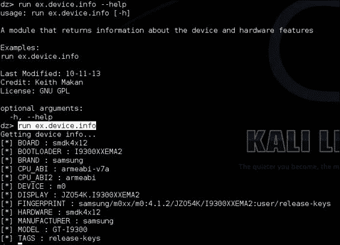

接下来的几个食谱都是关于编写一些有用的模块来扩展您的 drozer 框架；在每篇文章中，我将展示一些关键的模块开发技巧，您会在本书的后面部分发现这些技巧很有用。

## 它是如何工作的...

首先，我想我应该讨论一下你刚刚为你的新 drozer 模块编写的代码，以及它究竟是如何提取你的设备信息的。

首先，我想谈谈 drozer 模块的结构。您编写的每个模块都将从下面一行开始:

```java
import drozer.modules import Module
class Info(Module)
```

第一行基本上包含了来自`modules`库的一些代码，它让 drozer 模块可以访问它们需要操作的所有神奇的方法和属性。第二行称为类声明的头，它标志着 Python 中对象定义的开始。你可能会注意到标题的`(Module)`部分；这就是`Info`类如何设法采用`Module`类的属性，在语义上这很像 Java 中的继承。

接下来的几行如下:

```java
name = ""
description = ""

license = ""
```

这些只是 drozer 用来将一些元数据与模块相关联并使文档更加标准化和易于执行的变量，在这里看不到任何技术性的东西。继续前进:

```java
def execute(self, arguments):
```

这段特殊的代码被称为函数头，它标志着 Python 函数定义的开始。这个函数的特别之处在于，它是被调用来为模块做所有艰苦工作的方法，类似于 Java 类中的`Main`方法。让我们谈谈`execute`方法希望通过的论点:

*   `self`:这是正在定义的类的一个实例。它被解析到类中的每个函数，以便它们可以访问类实例。
*   `arguments`:这是从控制台解析到 drozer 模块的参数的字典。

最后，我们有以下代码:

```java
build = self.new("android.os.Build")
```

嗯，除了取消引用`self`对象和使用一些叫做`new`的神奇方法之外，我们还看到`android.os.Build`的字符串值作为参数被传递。这个字符串是 Android Java API 中一个 Java 类的名称，新方法使用了一个叫做 Java Reflection 的东西来实例化`Build`类，这个类保存了我们想要打印到屏幕上的所有信息。

代码的其余部分如下所示:

```java
self.stdout.write("[*] BOARD : %s\n" % (build.BOARD))
```

前面的代码只是打印出设备信息。

## 另见

*   位于[的*构建类参考-安卓开发者*网页](http://developer.android.com/reference/android/os/Build.html)
*   在[https://github.com/mwrlabs/drozer/wiki/Writing-a-Module](https://github.com/mwrlabs/drozer/wiki/Writing-a-Module)写模块网页

# 编写应用证书枚举器

在这个食谱中，我将向您展示如何编写证书枚举器，它只不过是将应用程序证书作为十六进制摘要提取出来，并将其转储到您的屏幕上。我包含这个的原因是，首先，它演示了如何与包管理器交互，并提取一些本节中其他模块没有的信息。其次，当你在寻找所有用相同公钥签名的应用程序时，获取应用程序签名可能会很有用，这很有用，因为开发人员和恶意软件作者通常会在他们的大多数应用程序中使用相同的密钥。它还将允许您识别可能共享资源的应用程序，并自主授予彼此权限；下一节将详细讨论这是如何发生的。

## 怎么做...

1.  打开你喜欢的文本编辑器，输入如下代码:

    ```java
    from drozer.modules import Module, common
    from drozer import android
    import M2Crypto
    import subprocess
    from OpenSSL import crypto
    class Info(Module,common.Filters,common.PackageManager):
      name = "Print the Signer certificate for an application"
      description = "this module allows you to print the signer x509 certificate for a given applicaiton"
      examples = "run ex.cert.info -p com.android.browser"
      author = "Keith Makan"
      date = "11-11-2013"
      license = "GNU GPL"
      path = ["ex","cert"]
      def add_arguments(self, parse):
        parse.add_argument("-p","--package",default=None,help="The Package Name")
      def execute(self,arguments):
        pm = self.packageManager()
        if arguments.package == None:
          for info in pm.getPackages(common.PackageManager.GET_SIGNATURES):
            self.stdout.write("[*] certificate info for {%s}\n" % (info.packageName))
            self.__print_certs(info)
        elif arguments.package != None:
          self.stdout.write("[*] certificate info for {%s}\n" % (arguments.package))
          info = pm.getPackageInfo(arguments.package,common.PackageManager.GET_SIGNATURES)
          self.__print_certs(info)
        else:
          self.stdout.write("[!] cannot process arguments : '%s'\n" % (repr(arguments)))
      def __print_certs(self,info):
        sigs = info.signatures[0].toCharsString()
        sigs = sigs + '\n'
        temp_cert = open("/tmp/cert.crt","w")
        end = 2
        #converting to DER file
        for start in range(0,len(sigs)-2,2):
          temp_cert.write(chr(int(sigs[start:end],16)))
          end +=2
        temp_cert.flush()
        temp_pem = open("/tmp/cert.pem","w")
        temp_pem.flush()
        temp_pem.close()
        certtext = subprocess.check_output(["openssl","x509","-inform","DER","-in","/tmp/cert.crt","-outform","PEM","-out","/tmp/cert.pem","-text"])
        temp_pem = open("/tmp/cert.pem","r")
        pem_cert_string = temp_pem.read()
        temp_pem.close()
        x509cert = crypto.load_certificate(crypto.FILETYPE_PEM,pem_cert_string)
        m2crypto_crt = M2Crypto.X509.load_cert_string(pem_cert_string,1)
        self.stdout.write("[*] Version : %s\n" % (x509cert.get_version()))
        self.stdout.write("[*] Issuer : %s\n" % (self._print_x509Name(x509cert.get_issuer())))
        self.stdout.write("[*] Subject : %s\n" % (self._print_x509Name(x509cert.get_subject())))
        self.stdout.write("[*] Algorithm : %s\n" % 
          (x509cert.get_signature_algorithm()))
        self.stdout.write("[*] NotBefore : %s\n" % (x509cert.get_notBefore()))
        self.stdout.write("[*] NotAfter : %s\n" % (x509cert.get_notAfter()))
        self.stdout.write("[*] Key Length : %s\n" % (x509cert.get_pubkey().bits()))
        self.stdout.write("[*] Public Key : \n%s\n" % (self._print_key(m2crypto_crt)))
        self.stdout.write("\n")
        #self.stdout.write("\n%s\n" % (certtext))
      def _print_x509Name(self,xname):
        return ''.join(["%s=%s " % (i[0],i[1]) for i in xname.get_components()])
      def _print_key(self,m2cert):
        return m2cert.get_pubkey().get_rsa().as_pem()
    ```

2.  Save it to your module repo; if you don't have one, simply create a file somewhere on your machine where you'll save all your modules. You can install the module by executing the following command from your drozer console:

    ```java
    dz> module install [path to your module code]

    ```

    完成所有这些后，您可以使用以下命令运行该模块:

    ```java
    run external.cert.info –p com.google.android.gsf

    ```

    您应该会在屏幕上看到如下截图:

    