# 第四章。开发应用

在本章中，我们将介绍以下食谱:

*   通过 logcat 披露信息
*   检查网络流量
*   通过活动管理器进行被动意图嗅探
*   攻击服务
*   攻击广播接收器
*   枚举易受攻击的内容提供商
*   从易受攻击的内容提供商处提取数据
*   将数据插入内容提供商
*   枚举 SQL 注入易受攻击的内容提供程序
*   利用可调试的应用
*   对应用的中间人攻击

# 简介

到目前为止，我们已经介绍了一些基本的开发和安全评估工具，甚至还介绍了一些扩展和定制这些工具的例子。本章将重点介绍如何使用这些工具来分析安卓应用，以识别漏洞并为其开发漏洞。尽管，考虑到应用功能的任意性和安卓应用开发人员几乎可以发挥的无限创造力，不难看出，评估安卓应用的安全性必须被视为一门艺术。这对作为安全审计员、分析师、顾问或爱好者的你来说，意味着你可以确定永远不会有一种完全自主的方法来分析安卓应用的安全性。几乎总是，你需要依靠你的创造力和分析来对安卓应用的安全性进行具体的评估。

在我们开始敲打一些应用之前，重要的是要框定安卓应用的安全问题，定义一些目标，并列举应用的攻击面。在接下来的几节中，我们将讨论应用安全性的一些一般目标，以及帮助实现这些目标所需的控制。讨论应用安全目标之所以如此重要，是因为它有助于确保您在访问应用安全时有正确的心态和原则。此外，它使审核应用安全性变得简单，只需验证这些控件的存在，然后开发利用上述控件的不足或不足的方法。

那么应用安全的目标是什么呢？

## 保护用户数据

应用经常被委托处理与用户相关的非常敏感的数据，例如:

*   密码
*   身份验证令牌
*   联系人
*   沟通记录
*   敏感服务的 IP 地址或域名

每个应用的数据都会被缓存(如果它是这样的话)，并且通常会以数据库、XML 文件或任何其他磁盘存储格式显式保存用户内容；他们可以自由使用所需的任何文件格式或存储机制。以评估和审核在线或基于云的数据库和信息存储机制的同样努力来评估这些数据存储的安全性非常重要，尤其是因为存储在应用中的信息会影响网站和其他云服务的安全性。例如，如果攻击者从应用向云服务扩散身份验证凭据，他/她可以立即访问实际的云服务。想想在线银行应用，以及这些应用存储的双因素身份验证令牌及其存储方式——短信收件箱？真的！

应用需要执行在线数据库使用的许多控制，这些控制独立于安卓操作系统提供的控制；即确保以下属性的控件:

*   机密
*   完整
*   有效性
*   认可
*   证明

我们将在后面的章节中讨论如何确保这些控制。目前，您需要关注的是了解当这些控制措施没有得到执行时，用户会遇到的风险。

## 保护应用免受彼此的影响(隔离和特权分离)

应用通过安卓沙箱得到保护，这只是另一种说法，即每个应用都被分配了一个用户标识，并且只能访问自己的资源。就安卓的 Linux 部分而言，这就是应用隔离的故事。安卓引入了自己的一些保护机制，以防止应用滥用彼此的组件和数据；最值得注意的是 Android 权限框架，它在应用级别运行，由应用中间件强制执行。它的存在是为了将 Linux 访问控制机制转化为应用级别，反之亦然。更实际地说，这意味着每次一个应用被授予一个权限，它可能意味着相关的 UID 被分配一个相应的 GID。例如`android.permission.INTERNET`，映射到`inet`组。任何获得此许可的申请都将被放入`inet`组。

应用通常由许多经典应用组件、服务、内容提供商、活动和广播接收器的实例组成。为了保护这些组件免受恶意或任何无意的有害影响，应用开发人员必须就他们可以访问的服务和数据进行沟通，并降低他们的应用给用户带来的风险。应用开发人员也应该尊重这些资源的完整性。安全开发的这两个原则可以通过权限框架来实施，方法是确保它们只请求必要的权限，并且不会过分热衷于它们期望被授予的权限。这里的关键是确保开发人员实践最小特权原则。通过确保访问给定应用的组件和数据需要正确的权限，并且只有必要的服务和组件可供系统的其他部分使用，也就是说，在不需要的时候不要导出组件，可以在一定程度上加强对恶意应用的保护。

当分析应用对其数据和组件实施的隔离时，考虑访问它们所需的权限是很重要的。授予这些权限有多容易？是否需要权限来访问分配了正确保护级别的给定组件？一个不好的例子是，一个应用只需要`android.permission.SEARCH`权限就可以方便地搜索和检索用户的银行对账单。

## 保护敏感信息的交流

应用开发人员保护应用存储的数据是不够的，他们还需要注意这些信息的交流方式。例如，考虑这样一个应用，它安全地存储用户的数据，但允许将数据传递给未经授权的一方。如果通信不安全，世界上所有的数据存储安全都毫无意义！

可以通过以下方式进行沟通:

*   **组件间通信**:应用经常需要在各自的组件之间发送信息，例如，在广播接收器和活动之间。考虑到这种通信可以通过意图和意图过滤器来实现，并且考虑到意图过滤器的非排他性，未经授权的应用可能会以各种方式拦截这种通信。
*   **应用间通信**:应用之间的数据通信应以的方式进行，以防止未经授权的应用篡改、拦截或访问它。
*   **设备外通信**:有可能应用会利用 NFC、蓝牙、GMS 或者 Wi-Fi 通信媒介来传输敏感数据。应用开发人员必须采取适当的预防措施来确保以这种方式传递的数据的机密性、完整性和不可否认性。

因此，在审核应用的通信故障时，寻找提供以下功能的控件非常重要:

*   接收和启动应用之间的身份验证
*   访问控制防止未授权方/应用获得对通信数据的访问或控制通信流

因此，希望您真的阅读了介绍，并且很好地掌握了安全应用所期望的控制；因为在接下来的部分中，我将介绍如何验证这些控件是否到位，以及如何利用这些控件的缺失。

# 通过日志披露信息

安卓应用可能会泄露敏感信息，或者是固有的，或者是有害影响的结果。当这种情况发生时，称为*信息泄露*漏洞。这个食谱讲述了如何通过检查安卓 logcat 来检查应用是否存在敏感信息的潜在泄漏，安卓 logcat 被应用开发人员用作调试工具。我们还将讨论如何利用安卓内置的基准测试工具来帮助让 logcat 检查更有价值。

## 做好准备

在我们开始之前，您将需要以下内容:

*   模拟器或安卓设备通过 ADB 设置并连接到您的机器，这将需要在您的安卓设备上启用 USB 调试
*   **安卓调试桥** ( **亚行**)

在开始这个食谱之前，你应该已经下载并更新了你的安卓软件开发工具包。您应该已经适当地设置了您的`PATH`变量，或者您应该在包含适当工具/二进制文件的工作目录中。

## 怎么做...

首先，让我们通过 ADB 启用调试。在 Windows 或 Linux 上执行以下命令:

```java
adb logcat

```

这只有在你在正确的工作目录下才会起作用，对于 Linux 用户是`[path-to-sdk]/sdk/platform-tools/`或者对于 Windows 用户是`[path-to-sdk]\sdk\platformtools\`。

这将输出一些软件和硬件级别事件的日志信息。自然，我们希望将重点放在我们正在检查安全漏洞的事件和应用上。幸运的是，logcat 能够过滤日志信息。以下是所有选项的明细:

```java
adb logcat [options] [filter]

```

其中`[options]`可以是以下任何一个——为了简明扼要，我省略了其中一些:

*   `-v <format>`:该选项设置输出的格式；这可能是`brief`、`process`、`tag`、`thread`、`raw`、`time`、`threadtime`或`long`
*   `-d`:该选项转储日志文件并退出

`[filter]`是`tag:priority`命令的列表，讨论如下:

*   `tag`: It is the string that identifies a log component. Log components are the strings that log outputs. For instance, if the log output looks like the following:

    ```java
    E/ClockAlarmWidget( 6590): [AlarmWidgetIdManager] getListItem()
    ```

    `ClockAlarmWidget`，在前面的代码中突出显示的部分将是日志组件标签。`/`之前的部分称为优先级。这里的优先级是`Error`，用`E`表示。

*   `priority`:可以是以下任意一种:
    *   `V, verbose`:启用详细日志记录
    *   `D, debug`:启用调试日志
    *   `I, Info`:它启用日志记录以供参考
    *   `W, Warn`:启用所有警告信息的记录
    *   `E, Error`:允许记录错误

例如，如果您想要监控`Error`级优先级日志组件和更高的日志，您可以使用以下命令:

```java
adb logcat *:E

```

`*`表示我们想要所有日志组件标签的`Error`级别优先级。

您可以非常有效地过滤日志的另一种方法是将 logcat 输出转储到一个文本文件中，并使用大多数 Linux/Unix 发行版附带的`grep`或类似记事本++的文本编辑器对其进行搜索。记事本++和`grep`下载页面的链接可在本食谱的*部分找到。对于 Windows 用户来说，如果你真的想做一些强大的基于正则表达式的匹配，有一个微软版本的`grep`叫做 WinGrep。在本食谱的*参见*部分也提供了一个到 WinGrep 下载页面的链接。*

一旦你决定了如何搜索文本，只要你知道如何在日志中找到你要找的东西，你怎么做并不重要。您可以通过执行以下命令来转储日志文件的输出:

```java
adb logcat > output.txt

```

这通过 Linux 终端或 Windows 命令提示符以同样的方式工作。您还可以“管道化”——这意味着将一个程序的输出馈送到另一个程序的输入——像这样直接馈送到另一个程序。这可以在窗口命令提示符或 Linux 终端中工作。

```java
adb logcat | [other program]

```

如果您使用`grep`，您可以通过执行以下命令来完成:

```java
adb logcat | grep [pattern]

```

其中`[pattern]`将是您正在搜索的文本模式，例如:

```java
adb logcat | grep ApplicationManager

```

我真的不想在这里写一篇如何使用`grep`的完整教程。如果您想利用`grep`或 WinGrep 的一些更强大的功能，请参见本食谱的*部分。*

这里有一些你可能会发现有用的例子；监控日志文件中与 web 相关的信息:

```java
adb logcat | grep [Cc]ookie
adb logcat | grep "http[s]*"
adb logcat | grep "ftp[s]*"

```

我知道这些不是很严格的例子，但它们只是严格到足以匹配网址。

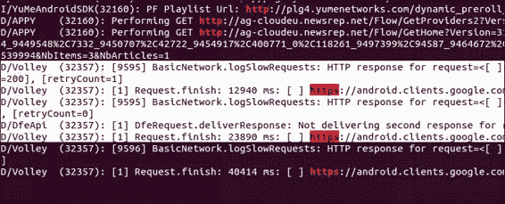

之前的日志是由三星 Galaxy S3 手机上的谷歌 Play 商店应用生成的。

您还可以尝试捕获一些通过日志文件泄露的登录或身份验证类型的令牌字符串:

```java
adb logcat | grep –i "[\w\s_-]*token[\w\s_-]*"

```

在日志文件中寻找有价值的信息时，一般来说，寻找您需要权限才能获得或直接导致您获得受其他应用保护的信息的信息是一个好主意。例如，如果应用记录了用户登录其 LinkedIn 个人资料后返回的 cookie 值，这是否会很危险？

没错。实际上，您只是绕过了知道他/她的领英密码的需要，或者让您的应用获得领英应用中某些身份验证功能的权限的需要。在阅读日志文件的几个小时里，你应该集中精力寻找这类信息。


案例和观点！这里记录的 cookies 是由银河 S3 手机上的安卓领英应用恶意披露的。这个漏洞的另一个真实例子可以在*发现脸书安卓软件开发工具包*中的一个主要安全漏洞中找到。相关链接见*部分。*

## 还有更多...

当然，应用通常是为了响应硬件或软件事件而开发的，或者是通过广播接收器，或者是来自其他应用或系统服务的意图。自然，您想知道应用如何响应这些事件，或者它们的行为在响应这类事件时是否会变得潜在有害。那么问题是，如何在不按下音量增大按钮、锁定和解锁屏幕以及自己按下按钮的情况下，将这些事件创建/发送到您正在测试的应用？答案是安卓猴子测试框架。它旨在向应用发送系统和硬件级别的事件，以便开发人员能够评估他们的应用处理这些事件的能力。它在某种程度上作为应用的设备事件“模糊化”框架运行。

在解释如何使用它之前，重要的是要提到，针对安装在您或其他人的个人安卓设备上的应用运行 Monkey tester 可能不是一个好主意。这是因为这些应用对 Monkey tester 的响应方式可能会对被“Monkey”的应用造成一些损害，导致应用数据丢失，甚至使您的手机崩溃。除非您有适当的许可或认可，否则您可能会丢失或损坏正在测试的应用存储的某些数据，您应该只在模拟设备或安全测试专用设备上执行此操作。

使用该框架的一种方法是通过 ADB 连接一个设备，并通过您的命令提示符或终端执行以下命令:

```java
adb shell monkey –p [package] –v [event count]

```

其中`[package]`是您想要将这些事件发送到的包/应用的名称，`[event count]`是您想要发送的随机事件的数量。下面是一个如何在 Flipboard 应用中使用它的例子:

```java
adb shell monkey –p Flipboard.app –v 10

```

这将向 Flipboard 应用发送 10 个随机选择的事件，并报告应用的行为。

## 另见

*   *安卓调试桥–在[https://developer.android.com/tools/help/adb.html#logcat](https://developer.android.com/tools/help/adb.html#logcat)启用日志记录*网页
*   http://www.vogella.com/articles/AndroidTesting/article.html的*沃杰拉教程-猴子测试*网页
*   [http://notepad-plus-plus.org/download/v6.3.3.html](http://notepad-plus-plus.org/download/v6.3.3.html)的*记事本++* 软件
*   位于[https://developer.android.com/tools/help/logcat.html](https://developer.android.com/tools/help/logcat.html)的*安卓开发者–日志文件*网页
*   [http://www.wingrep.com/download.htm](http://www.wingrep.com/download.htm)的 WinGrep 软件
*   在脸书安卓软件开发工具包网页上发现重大安全漏洞
*   位于[的*安卓开发者-读写日志*网页](http://developer.android.com/tools/debugging/debugging-log.html)

# 检查网络流量

众所周知，应用可以利用安卓设备上可用的网络服务，许多应用是作为基于云的服务的前端开发的。这意味着，了解它如何与互联网服务通信是安全风险概况的一个非常重要的部分，即应用向其用户和设备暴露的风险集合。

在这个食谱中，我将向您展示一些新颖的方法，您可以使用这些方法，使用曾经流行的 **Wireshark** 直接从安卓设备监控网络流量。

## 做好准备

在我们开始破解之前，您需要在本地机器和安卓设备上安装几个工具。以下是您需要获得的工具:

*   **Wireshark** :可在 Wireshark 网站[http://www.wireshark.org](http://www.wireshark.org)下载，Wireshark 同时支持 Linux/Unix 和 Windows 机器。您应该确保这是安装在您的主机上，然后再启动。安装 Wireshark 非常简单；Wireshark 的人甚至为 Windows 和 Unix/Linux 发行版提供了一些非常有用的文档，这些文档可以在[http://www . Wireshark . org/docs/wsug _ html _ chunked/ChapterBuildInstall . html](http://www.wireshark.org/docs/wsug_html_chunked/ChapterBuildInstall.html)上找到。
*   **网猫**:可在[http://netcat.sourceforge.net/download.php](http://netcat.sourceforge.net/download.php)为 Linux/Unix 用户下载，在[http://joncraton.org/blog/46/netcat-for-windows/](http://joncraton.org/blog/46/netcat-for-windows/)为 Windows 用户下载。Linux/Unix 用户可能不需要显式下载 Netcat，因为它附带了许多 Linux/Unix 发行版。
*   **安卓**TCPdump:在[http://www.strazzere.com/android/tcpdump](http://www.strazzere.com/android/tcpdump)可以下载。

## 怎么做…

设置好所有工具并准备就绪后，您可以通过执行以下步骤来监控安卓设备的流量:

1.  Assuming your Android device is rooted, you should create a directory to host your TCPdump binary as follows:

    在安卓设备上，按照出现的顺序通过 ADB 执行以下命令:

    ```java
    su
    mkdir /data/tcpdump/
    chmod 755 /data/tcpdump/

    ```

    然后在本地机器上，在下载安卓 TCPdump 版本的文件夹中，执行以下命令:

    ```java
    adb push tcpdump /data/tcpdump/.
    adb shell chmod 755 /data/tcpdump/tcpdump

    ```

2.  Once the TCPdump Android version is uploaded to the device and marked as executable. You should make sure Netcat is available on the Android device by trying to run the following command:

    ```java
    nc

    ```

    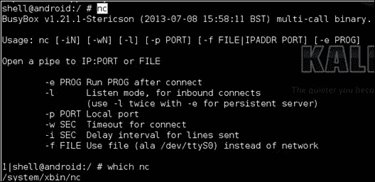

    这仅仅是一个明智的检查，大多数安卓版本默认都附带了网猫。如果没有，谷歌源安卓 GitHub 存储库中有一个安卓版本，NDK Makefile 位于[https://Android . googlesource . com/platform/external/netcat/+/master](https://android.googlesource.com/platform/external/netcat/+/master)。要了解如何使用该 Makefile，请参考[第 8 章](8.html#page "Chapter 8. Native Exploitation and Analysis")、*本地开发和分析*中的*交叉编译本地可执行文件*配方。

3.  To make sure that everything works, after you've managed to confirm that both TCPdump and Netcat are installed on your Android device, you can actually dump some network traffic and try executing the following command:

    ```java
    ./data/tcpdump/tcpdump –w - | nc –l –p 31337

    ```

    如果一切正常，您应该会在屏幕上看到以下内容:

    

    要查看一些实际输出，您可以尝试打开一个向网络发出请求的应用，或者使用一些网络应用接口。

4.  如果一切正常的话，你应该可以开始将 TCPdump 输出馈送到安装在你本地设备上的 Wireshark。为此，您首先需要通过 ADB 设置一些端口转发，这是通过执行以下命令完成的:

    ```java
    adb forward tcp:12345 tcp:31337

    ```

5.  设置端口转发后，您应该可以通过执行以下命令在本地机器上使用 Netcat:

    ```java
    netcat 127.0.0.1 12345

    ```

6.  This means all the traffic is being forwarded correctly. You should be able to pipe the output into Wireshark, which will interpret it and facilitate deep packet inspection and other useful things. To pipe the output into Wireshark, execute the following command on your local machine:

    ```java
    adb forward tcp:12345 tcp:31337 && netcat 127.0.0.1 12345 | wireshark –k –S –i – 

    ```

    几秒钟后，如果一切正常，您应该会看到 Wireshark 启动。屏幕上会显示以下内容:

    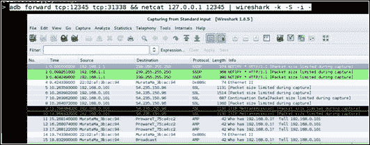

## 它是如何工作的...

在这个配方中，我们使用了 Netcat、Wireshark 和 TCPdump 直接从安卓设备中提取网络流量，用于分析和深度数据包检查。鉴于本演练中对命令行参数和工具组合的解释很少，本食谱详细说明了如何以及为什么执行每一个操作。

在步骤 1 中，执行以下命令，以便在安卓设备上创建托管 TCPdump 安装的目录:

```java
su; mkdir /data/tcpdump/; chmod 755 /data/tcpdump/

```

代表 **【替代用户】** ( **SU** )的`su`命令允许我们假设根权限——这是`su`在没有提供参数时的行为。我们使用`su`假设的根权限包括能够修改和查看安卓文件系统上的任何目录或文件。这是需要的，因为我们在`/data/ folder`内创建了`tcpdump`目录。

执行`su`后，我们执行`mkdir`命令，参数为`/data/tcpdump/`，创建`/data/ folder`下的`tcpdump/`目录。

接下来是`chmod`命令，这是变更模式的缩写，参数为`755`。它修改了`/data/tcpdump`文件夹的访问模式，并允许具有较低权限的用户访问`tcpdump`路径。这是必需的，因为我们将使用`adb push`命令在此路径下存储`tcpdump`二进制文件。

创建`tcpdump`文件夹后，我们执行以下命令:

```java
adb push tcpdump /data/tcpdump/.
adb shell chmod 755 /data/tcpdump/tcpdump

```

这些确保了`tcpdump`二进制存储在`tcpdump`路径下。第一个命令将`push`命令传递给`adb`，参数为`tcpdump`，这是安卓的 TCPdump 版本。您会注意到在`/data/tcpdump`文件夹下提供了一个点作为`tcpdump`二进制的名称；这是一种速记方式，可以确保被复制的文件在被复制后保留其文件名。这是显而易见的，因为我们从本地机器上复制了一个名为`tcpdump`的文件，该文件在安卓设备上也被称为`tcpdump`。

跟随 `push`命令的是参数为`chmod 755 /data/tcpdump/tcpdump`的`adb shell`命令，它改变了`tcpdump`二进制文件的访问模式，允许权限较低的用户执行。

在第 2 步中，我们使用了 `nc`命令——这是 Netcat 的缩写。这个工具就像一把瑞士军刀，用于与网络服务交互。在本食谱中，我们将使用它来读取网络连接中的数据。在没有任何参数的情况下运行`nc`会打印使用说明。这使我们能够确保`nc`运行正常，并实际安装在我们的安卓设备上。

在第三步中，我们将`tcpdump`与`–w`的参数一起使用，这允许我们指定一个要向外写入的文件，第二个参数确保输出被写入终端屏幕。作为我们执行的命令的一部分，我们还指定了以下内容:`| nc –l –p 31337`。`|`字符在操作系统术语中称为管道，它将前一个程序的输出作为输入馈送给管道后的程序。使用`–l`参数调用 Netcat，这使得 Netcat 监听作为参数提供给`–p`命令行开关的端口上的连接。在这种情况下，所有这一切意味着来自`tcpdump`的原始二进制网络流量作为输入被馈送给 Netcat 这意味着它将从端口号`31337`输出该原始流量。

在第 4 步中，我们使用 ADB 的端口转发功能。它允许我们将安卓设备上的一个端口(作为第二个参数`tcp:12345`提供)与本地机器上的一个端口(作为第一个参数`tcp:31337`提供)相耦合。您会注意到我们将端口`12345`连接到端口`31337`，并在上一步中告诉网猫监听端口`31337`上的连接。这样我们就可以通过本地机器上的端口`31337`与 Netcat 实例进行交互。简单来说，安卓设备上的端口`31337`变成了我们本地机器上的端口`12345`。

在第 5 步中，我们用参数`127.0.0.1`和`12345`启动了 Netcat，前者是我们本地机器的地址(称为环回地址)，后者是我们在上一步中转发的端口。这告诉网猫连接到我们本地机器上的端口`12345`；由于端口`12345`耦合到安卓设备上的端口`31337`，这实际上意味着我们通过本地代理端口`12345`与端口`31337`交互。这样做的结果是，我们可以从本地机器上抓取安卓设备上传输到 Netcat 的网络流量。

在步骤 6 中，我们组合了与本地机器相关的所有命令，以确保 Wireshark 获得原始的二进制网络流量并为我们解释它。我们推出 Wireshark 的理由如下:

*   `–k`:根据 Wireshark 手册，这个论点有以下作用:
    *   立即启动捕获会话。如果指定了`-i`标志，捕获将使用指定的接口。
    *   否则，Wireshark 会搜索接口列表，如果有非环回接口，则选择第一个非环回接口，如果没有非环回接口，则选择第一个环回接口。
    *   如果没有接口，Wireshark 会报告错误，并且不会开始捕获。
*   `–S`:此参数指定快照长度，即每个数据包要捕获的字节数。如果没有给出长度参数，则捕获整个数据包。
*   `–i`:该参数指定从哪个输入端捕获数据包。这里我们再次提供了–符号，它告诉 Wireshark 从标准输入中读取输入。我们这样做是因为 Wireshark 的输入是通过来自 Netcat 的管道传递给它的。

为了更有趣地利用这个想法，您可以尝试通过运行 **【入侵检测系统】** ( **IDS** )或其他专注于安全的网络监控工具(如 Snort)，对安卓设备生成的一些网络流量进行分析，从而构建分析安卓流量的主动威胁工具。这个想法将有助于非常有趣的恶意软件和漏洞分析。

## 另见

*   [的*分析安卓网络流量*网页](http://mobile.tutsplus.com/tutorials/android/analyzing-android-network-traffic/)
*   位于[http://www.wireshark.org/docs/wsug_html_chunked/](http://www.wireshark.org/docs/wsug_html_chunked/)的 *Wireshark 用户指南*
*   *Wireshark 在[http://wiki.wireshark.org/DisplayFilters](http://wiki.wireshark.org/DisplayFilters)显示过滤*网页
*   [http://wiki.wireshark.org/CaptureFilters](http://wiki.wireshark.org/CaptureFilters)的*线鲨捕捉过滤器*网页
*   [http://www.tcpdump.org/tcpdump_man.html](http://www.tcpdump.org/tcpdump_man.html)的 *TCPdump* 手册页

# 通过活动管理器进行被动意图嗅探

传播关于应用及其组件的信息的一个好方法是窃听应用间的通信。您可以这样做的一种方法是向活动管理器请求关于最新意图的信息。

这非常简单，事实证明，如果你愿意做一些 Python 脚本，可以通过 drozer(在[第 3 章](3.html#page "Chapter 3. Android Security Assessment Tools")、*安卓安全评估工具*中介绍)来完成。iSec Partners 的人已经开发了一个能够做到这一点的安卓应用，下面食谱中讨论的 drozer 模块的大部分灵感来自他们的应用。要了解如何使用该应用，请参阅本食谱的*部分。*

## 做好准备

在我们真正编写这个模块之前，我们需要稍微修改一下 drozer Agent，这样它就有必要的权限从活动管理器中请求关于意图的信息。最简单的方法是通过 drozer 的`AndroidManifest.xml`文件来增加 drozer 请求的权限。在这里，我将向您展示如何使用 Eclipse 来实现这一点。

1.  首先，您需要从以下站点获取 drozer 代理及其依赖项的副本:
    *   位于[https://github.com/mwrlabs/drozer-agent](https://github.com/mwrlabs/drozer-agent)的 *drozer Agent* 网页
    *   [https://github.com/mwrlabs/jdiesel](https://github.com/mwrlabs/jdiesel)的 *jdiesel(为 drozer 加油)*网页
    *   位于[https://github.com/mwrlabs/mwr-tls](https://github.com/mwrlabs/mwr-tls)的*顶级域名系统支持*网页
    *   [https://github.com/mwrlabs/mwr-android](https://github.com/mwrlabs/mwr-android)drozer 网页的*安卓实用程序*
2.  Once you have these downloaded and saved them in the same folder, you can open Eclipse and import each of them as Android projects. For each of them, once Eclipse is opened, navigate to **File** | **Import**.

    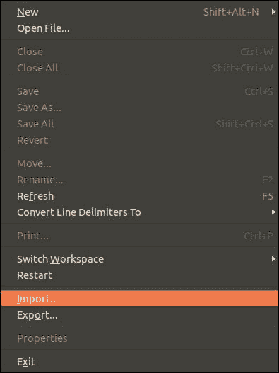

3.  Click on the **Android** folder, then go to **Existing Android Code into Workspace** and click on **Next**.

    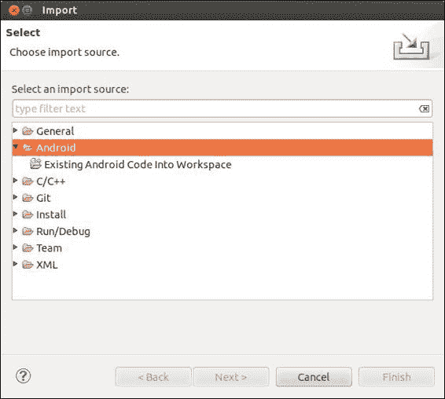

4.  At this point, Eclipse will ask you to specify a folder to import from. You'll need to add one of the folders you downloaded in step 1\. To select a folder, click on **Browse...** and a file selection dialog will pop up.

    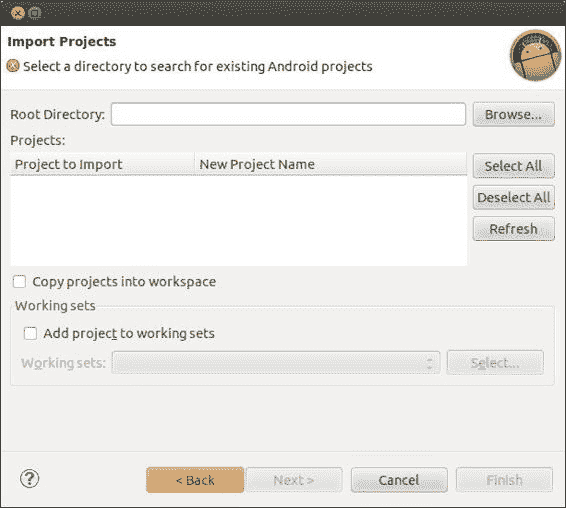

5.  Using the **File** dialog, navigate to the file path where you've downloaded the drozer Agent and dependencies. You'll need to add each one of them this way.

    确保以这种方式导入每个文件夹。在这样做之前，Eclipse 将无法成功构建 drozer 代理。

6.  Once you've imported all the projects, you'll need to edit the drozer Agent's `AndroidManifest.xml`. You do this by double-clicking on the `AndroidManifest.xml` file in the `drozer-agent project` folder in Eclipse (make sure that you select the `AndroidManifest.xml` tab before editing so you can edit the XML directly). Then, enter the following line:

    ```java
    <uses-permission android:name="android.permission.GET_TASKS"/>

    ```

    如果您正确执行了该步骤，`AndroidManifest.xml`文件应该如下图所示:

    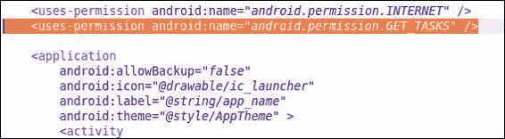

    就这样！您刚刚向 drozer 代理添加了额外的权限。现在，您可以将 drozer Agent 导出为 APK 文件，将其上传到您的设备，然后开始破解。

    请注意，在安装修改后的驱动程序之前，您可能需要卸载当前安装在设备上的驱动程序代理。

## 怎么做...

这就是脱水剂的制作和撒粉。我们现在可以继续开发意图嗅探器模块了。

1.  导航到您的 drozer 模块存储库；如果您尚未设置，请参考[第 3 章](3.html#page "Chapter 3. Android Security Assessment Tools")、*安卓安全评估工具*中的*编写驱动程序模块-设备枚举模块*配方，了解如何设置。一旦你在你的模块库中，创建一个名为`ex.sniffer.intents`的文件，并在其中输入以下内容(以下代码将在本书的代码库中提供):

    ```java
    from drozer.modules import Module,common
    from drozer.modules import android
    class Intents(Module, common.PackageManager):
      name = "Dump recent intents to the console"
      description = "This module allows you to see the most recent intents that were sent, via the ActivityManager"
      examples = "run ex.sniffer.intents"
      author = "[your name]"
      date = "[the date]"
      license = "GNU GPL"
      path = ["ex","sniffer"]
      def execute(self,arguments):
        self.stdout.write("[*] initializing intent sniffer…\n")
        context = self.getContext()
        activityService = context.getSystemService("activity")
        self.stdout.write("[*] got system service ..\n")
        recentTasks = activityService.getRecentTasks(1000,1)
        self.stdout.write("[*] recentTasts Extracted..\n")
        list_length = recentTasks.size()
        self.stdout.write("[*] Extracted %s tasks ..\n" % (list_length))
        for task in range(list_length):
          cur_task = recentTasks.get(task)
          cur_taskBaseIntent = cur_task.baseIntent
          self.stdout.write("\t[%d] %s\n" % (task,cur_taskBaseIntent.toString()))
    ```

2.  完成后，通过执行以下命令将模块安装到驱动程序中:

    ```java
    dz> module install [path-to-module-repo]/ex.sniffer.intent

    ```

3.  Then run it by executing the following command:

    ```java
    dz> run ex.sniffer.intents

    ```

    您应该会看到类似以下截图的内容:

    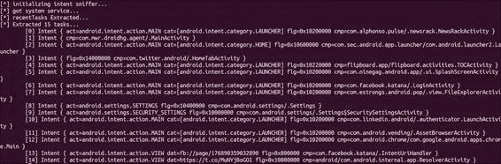

## 它是如何工作的...

意图嗅探器脚本实际上非常简单。在这里，我将分解它在做什么，以及它是如何真正嗅到一些意图的。

意图嗅探器调用`Context.getSystemService()`并将`ACTIVITY_SERVICE`标志的标识符传递给它，该标志只是一个值为“activity”的字符串。这将返回一个`ActivityManager`类的实例，它允许脚本与活动管理器交互并像`ActivityManager.getRecentTasks()`一样进行调用。该方法接受两个参数，第一个参数是整数，即脚本希望从活动管理器接收的`RecentTaskInfo`对象的最大数量，第二个参数是指定最近活动类型的标志。在本例中，编写脚本是为了请求完整的列表，而不省略任何任务。我以这种方式编写脚本的原因是，用于启动每个最近任务的意图与`RecentTaskInfo`对象捆绑在一起，作为一个名为`RecentTaskInfo.baseIntent`的字段。然后，脚本可以使用它来提取一些关于意图的有用信息，例如组件名称、标志、操作和类别。为了使这里的事情快速简单，脚本记录对`Intent.toString()`方法的调用，该方法简单地将关于意图的信息格式化为字符串并返回。

当然，欢迎您对意图信息进行更智能的解析。您甚至可以尝试找出一种方法来确定哪个包发出了原始呼叫。尽管这非常困难，但完成它将是一个相当有意义的 drozer 模块。

## 另见

*   *意向性嗅探器*安卓应用在[https://www . isecpartners . com/tools/mobile-security/意向性嗅探器. aspx](https://www.isecpartners.com/tools/mobile-security/intent-sniffer.aspx)
*   位于[的`Context.getSystemService(String name)`命令](http://developer.android.com/reference/android/content/Context.html#getSystemService%28java.lang.String%29)
*   *活动管理员。[参考资料。RecentTaskInfo.html](http://developer.android.com/reference/android/app/ActivityManager.RecentTaskInfo.html)*
*   位于[的*意向*参考](http://developer.android.com/reference/android/content/Intent.html)

# 攻击服务

服务可能看起来不是很危险，他们坚持在后台工作。但它们是为了支持其他应用组件而开发的，并可能执行非常敏感的操作，例如登录在线配置文件、重置密码，甚至通过充当主机设备系统服务的代理来促进一些潜在的危险过程。无论哪种方式，在应用评估期间都不能忽视它们。

服务何时易受攻击？嗯，当您可以使用服务的功能来滥用用户、提升另一个应用/用户的权限或使用它来提取敏感信息时，服务是可利用的。这意味着您需要能够与服务交互，这意味着它必须被导出，或者响应/接受来自消息格式(如意图、文件或网络堆栈)的输入。另一个需要考虑的问题是，与服务交互需要什么样的权限——无论是潜在危险的服务、执行非常敏感的操作，还是可能被滥用来造成应用甚至设备中的**拒绝服务** ( **DoS** )情况(即，当攻击者通过强制服务停止工作或拒绝用户的服务来阻止对服务的访问时)！更不用说应用及其用户在潜在危险的服务根本不需要任何权限的情况下会有多糟糕！

尝试考虑所需的权限，以及它们的保护级别是否合适。确定保护级别是否合适的一个好方法是考虑哪些其他类型的应用可能被授予这些权限。如果服务属于一个银行应用，您应该期待像自定义权限这样的东西来保护服务，而不仅仅是一般的危险级别权限。这是因为它们不适合所有潜在的危险操作，这是银行应用能够做到的。您需要考虑用户将用于验证向其他应用授予这些权限的信息类型，即权限标签和描述。在检查其他应用组件的安全缺陷时，您也应该应用同样的思路，因为权限框架将以完全相同的方式使用。

这个食谱将详细说明如何找到易受攻击的服务，这将大致包括枚举导出的服务，详细说明如何通过 drozer 框架启动它们，还将向您展示如何创建一些自定义意图来启动它们。

在我们开始之前，从`AndroidManifest.xml`文件的角度向您展示服务的潜在危险情况会很有用。这是一个来自 *OWASP 山羊机器人*项目的应用片段。试着通读一遍，思考一下这种设置可能存在的危险和风险:

```java
<service android:name=".services.LocationService" >
  <intent-filter>
    <action android:name="org.owasp.goatdroid.fourgoats.      services.LocationService" />
  </intent-filter>
</service>
</application>
  <uses-permission android:name="android.permission.SEND_SMS" />
  <uses-permission android:name="android.permission.CALL_PHONE" />
  <uses-permission android:name="android.permission.    ACCESS_COARSE_LOCATION" />
  <uses-permission android:name="android.permission.    ACCESS_FINE_LOCATION" />
  <uses-permission android:name="android.permission.INTERNET" />
</manifest>
```

我在这里强调了一些重要的方面。您应该注意到，名为`.services.LocationService`的服务可能有助于通过 GPS 服务或地理定位应用编程接口确定用户的位置，它不需要任何权限就可以启动！考虑到应用本身将被授予`android.permission.ACCESS_COARSE_LOCATION`和`android.permission.ACCESS_FINE_LOCATION`两个权限，这意味着攻击者很有可能在离该服务足够近的情况下未经授权使用该服务(可能是对设备的物理访问，或者是通过安装在用户设备上的恶意应用)。

上一个示例取自*owsps 山羊机器人*项目，参见*另请参见*部分，获取 GitHub 存储库的链接。

所以这就是漏洞从代码源，或者更确切地说从开发人员/逆向工程人员的角度看的样子。让我们开始真正使用 drozer 来攻击一些易受攻击的服务，并让您了解攻击者对该漏洞的看法。

## 怎么做...

以下是如何找到一些易受攻击的服务:

1.  Given a sample application, find out which services are exported. You can do this via drozer by executing the following command:

    ```java
     dz> run app.service.info –-permission null

    ```

    正如我在上一章中解释的，这个命令查找不需要任何权限的服务。

2.  Once you've found a bunch of services, you can launch them using the following command:

    ```java
    dz> run app.service.start –-action [ACTION] –-category [CATEGORY] –-data-uri [DATA-URI] –-component [package name] [component name] –-extra [TYPE KEY VALUE] –-mimetype [MIMETYPE]

    ```

    举个简单的例子，这就是如何在`com.linkedin.android`应用中启动一个服务:

    ```java
    dz> run app.service.start –-component com.linkedin.android com.linkedin.android.authenticator.AuthenticationService

    ```

    在您停止和启动这些服务时，让 logcat 运行总是一个好主意，以防它们可能会泄露一些有关其操作方式的敏感信息，并泄露一些身份验证凭据或其他有用数据。

    当然，如果你想通过一个意图向服务发送一些数据，你需要知道你的目标服务的意图过滤器是什么样子的。如果您还没有猜到，了解这一点的最简单方法是检查应用清单。如果您需要回顾如何做到这一点，请参考[第 2 章](2.html#page "Chapter 2. Engaging with Application Security")、*中的【检查 AndroidManifest.xml 文件*方法与应用安全。

3.  Essentially, the piece of XML you're looking for would look something like the following code snippet:

    ```java
    <service android:name=".authenticator.AuthenticationService" android:exported="true">
        <intent-filter>
          <action android:name="android.accounts.AccountAuthenitcator" />
        </intent-filter>
      <meta-data android:name="android.accounts.AccountAuthenticator"
      android:resource="@xml/authenticator" />
    </service>
    ```

    前面的代码片段取自 Android LinkedIn 应用的`AndroidManifest.xml`文件。

4.  要触发此服务的意图，您可以通过 drozer 控制台执行以下命令:

    ```java
    dz> run app.service.start –-component com.linkedin.android com.linkedin.android.authenticator.AuthenitactionService –-action anroid.accounts.AccountAuthenitcator

    ```

顺便提一下，有些服务可能与本机库接口，并且实际上将从意向接受的数据传递给 C/C++数据结构，如堆栈或基于堆的变量。当审核需要通过意图传递数据的服务的安全性时，您应该始终尝试识别由意图数据导致的任何潜在内存损坏漏洞。在检查其他应用组件类型的漏洞时，请记住这一点，因为任何应用组件都可能助长这些类型的漏洞。

有一些默认的系统服务，当手工制作的意图被发送给它们时，它们的行为非常奇怪。考虑以下发送给`com.android.systemui`的意图示例:

```java
dz> run app.service.start –-component com.android.systemui com.android.systemui.PhoneSettingService

```

这是三星 Galaxy S3 的结果:


这是 DoS 漏洞的典型例子。系统用户界面服务不会预期具有空元数据或额外数据字段的意图。因此，当发送没有额外数据的意图时，会导致空指针异常，整个服务就会崩溃。考虑到它只是一个 UI 服务，这个漏洞可能看起来不太苛刻。但是，如果安全相关服务的密钥安全机制或用户界面组件依赖系统用户界面服务来运行(例如，可能是锁屏或设置应用)，这种简单的无数据意图可能会级联成一个非常复杂、非常高风险的漏洞。

为了帮助您在这里描绘危险，想象一下安装在您的手机上的恶意应用，它反复向您的系统用户界面服务发送有害的意图。这导致它一次又一次地崩溃，让你的屏幕充满弹出窗口和警告，并有效地禁止你与手机用户界面的交互。这将是一个非常讨厌的错误，并且它不需要任何权限来安装！

## 另见

*   位于 http://web.nvd.nist.gov/view/vuln/detail?[的*CVE 漏洞摘要-2011-4276* 网页 vulnId = CVE-2011-4276&cid = 6](http://web.nvd.nist.gov/view/vuln/detail?vulnId=CVE-2011-4276&cid=6)
*   位于[的*OWASP-山羊机器人*网页](https://github.com/jackMannino/OWASP-GoatDroid-Project/blob/master/)

# 攻击广播接收器

广播接收器响应硬件和软件级别的事件；他们通过意向获得这些事件的通知。通常，广播接收器可能会使用通过意图发送的信息来执行敏感操作，并且这样做可能会受到正在广播或接收的数据的恶意影响。

当利用广播接收器时，挑战在于确定输入是否可信以及*有多糟糕*。为此，您可能需要在目标应用中有效地模糊广播接收器的意图过滤器定义，或者读取实际代码(如果您设法得到它的话)，以找出接收器操作哪种数据以及如何操作。

和前面的食谱一样，这里我们将看到一个经典的易受攻击广播接收器的示例。以下示例也来自 OWASP 山羊机器人项目:

```java
 <receiver
    android:name=".broadcastreceivers.SendSMSNowReceiver"
    android:label="Send SMS" >
    <intent-filter>
        <action android:name="org.owasp.goatdroid.fourgoats.SOCIAL_SMS" />
    </intent-filter>
</receiver>
</application>

    <uses-permission android:name="android.permission.SEND_SMS" />
    <uses-permission android:name="android.permission.CALL_PHONE" />
    <uses-permission android:name="android.permission.ACCESS_COARSE_LOCATION" />
    <uses-permission android:name="android.permission.ACCESS_FINE_LOCATION" />
    <uses-permission android:name="android.permission.INTERNET" />

</manifest>
```

代码中的关键问题是，该应用将被授予`android.permission.SEND_SMS`权限，同时留下其`.SendSMSNowReceiver`易受攻击的接收者，没有适当权限的保护，并暴露给其他应用。

这并不是这些漏洞的全部；还有一部分。仅仅因为接收者让其他应用与之交互，并不一定意味着它是可利用的；为了验证它是否可被利用，你可以试着启动配方中后面讨论的一些命令，如果可能的话，为接收器读取一些源代码。

以下是决定接收器如何处理`org.owasp.goatdroid.fourgoats.SOCIAL_SMS`动作的代码:

```java
public void onReceive(Context arg0, Intent arg1) {
  context = arg0;
  SmsManager sms = SmsManager.getDefault();

  Bundle bundle = arg1.getExtras();
  sms.sendTextMessage(bundle.getString("phoneNumber"), null,
    bundle.getString("message"), null, null);
    Utils.makeToast(context, Constants.TEXT_MESSAGE_SENT, Toast.LENGTH_LONG);
}
```

代码中的关键问题是接收器直接从`bundle`对象中获取值，而无需首先检查调用应用或提供的值，并将其插入`sendTextMessage`调用。这基本上意味着任何应用都能够发送任意的、不受控制的 SMS。

好吧，这就是典型的广播接收器漏洞的样子；让我们看看如何利用这些漏洞，实际上，使用 drozer。

## 怎么做...

要向广播接收器发送意图，请执行以下命令:

```java
dz> run app.broadcast.send –-action [ACTION] –-category [CATEGORY] –-component [PACKAGE COMPONENT] –data-uri [DATA_URI] –extra [TYPE KEY VALUE] –flags [FLAGS*] –mimetype [MIMETYPE]

```

例如，在这个食谱的介绍部分，我们看到了一个可以接受电话号码和短信的接收器。要攻击该接收器，您可以发出以下命令:

```java
dz> run app.broadcast.send –-action org.owasp.goatdroid.fourgoats.SOCIAL_SMS –-component org.owasp.goatdroid.fourgoats org.owasp.goatdroid.fourgoats.broadcastreceivers.SendSMSNowReceiver –-extra string phoneNumber 1234567890 –-extra string message PWNED

```

执行之前的命令会向`1234567890`的电话号码发送包含消息`PWNED`的文本消息。

## 它是如何工作的…

在这个食谱中，我们滥用了保护`org.owasp.goatdroid.fourgoats.broadcastreceivers.SendSMSNowReceive`广播接收器的不充分权限。缺乏保护该组件的权限使得没有`SEND_SMS`权限的攻击者能够实际发送 SmS。这种情况的危险在于，恶意攻击者可以开发针对该接收者的应用，将 SMSs 发送到高级服务或从设备中泄漏信息。

事实上，许多安卓木马和基于安卓的恶意软件利用这种模式从受害者那里窃取金钱；这方面有数百个实际例子。关于其中一些好的资源，请参见部分。希望这能让你意识到，对于这样的广播接收器来说，权限不足是多么危险。

## 另见

*   *短信木马:世界各地*文章作者:*丹尼斯·马斯伦尼科夫*在 secureist([https://www.securelist.com/en/blog/208193261/](https://www.securelist.com/en/blog/208193261/))
*   *安卓木马*项目由*杰瑞米·克莱因*和*帕克·斯皮尔曼*([http://www . cs . wustl . edu/~ Jain/CSE 571-11/FTP/木马/index.html](http://www.cs.wustl.edu/~jain/cse571-11/ftp/trojan/index.html) )
*   *首次在野外发现安卓短信木马*文章作者:*蒂姆·怀亚特*在 Lookout([https://blog . Lookout . com/blog/2010/08/10/security-alert-First-Android-SMS-木马-野外发现/](https://blog.lookout.com/blog/2010/08/10/security-alert-first-android-sms-trojan-found-in-the-wild/) )

# 列举易受攻击的内容提供商

内容提供商通常掌握着大量有价值的信息，例如用户的电话号码或推特密码，你可能想知道恶意攻击者是否有可能获得这些信息。找出内容提供商是否容易受到攻击的最好方法是尝试自己攻击它。

为了能够攻击内容提供商，就像许多应用级别的攻击一样，通常归结为向应用发送恶意的意图。当涉及到内容提供商时，你的意图将通过它包含的 URI 字符串被磨砺到它的目标，因为这个 URI 标识了哪个内容提供商应该处理该意图。

那么就只有一个问题——我们如何找到使用哪个 URIs？一个简单的解决办法是猜测他们，但这可能需要很长时间！drozer 有一个名为`app.provider.info`的模块，可以为你解决这个问题。

本食谱详细介绍了一些 drozer 模块，您可以使用这些模块来查找可能容易受到攻击的内容提供商。

## 怎么做...

要找到最容易受到攻击的内容提供商，您需要执行以下操作:

1.  Finding content providers that require no permissions is really easy with drozer; all you need to do is execute the following command from your drozer console:

    ```java
    dz> run app.provider.info –-permission null

    ```

    前面的命令列出了不需要任何读/写权限的所有内容提供者。

2.  Once you've found an appropriate content provider, you may want to enumerate the URIs it has authority over; you can do this using the following command:

    ```java
    dz> run app.provider.finduri [package]

    ```

    在前面的命令中，`[package]`是要提取信息的包的全名。

3.  以下命令是您可以尝试的示例:

    ```java
    dz> run app.provider.finduri com.android.providers.downloads

    ```

因此，您刚才所做的是找到一个可能的入口点，进入给定包保存在其内容提供程序中的数据。下一个食谱讨论了如何提取这些数据。

## 它是如何工作的...

`.finduri`模块相当简单；它实际上使用了一种非常“偷偷摸摸”的方法来列举 URIs 可能的内容。它基本上是为应用打开`DEX`文件，并扫描未分析的文件中任何类似于有效内容 URI 格式字符串的字符串。之所以如此有效，是因为应用开发人员通常会将这些作为静态字符串保存在应用的源代码中。下面是 Python 脚本的实际源代码。摘自[https://github . com/mwrlabs/dro zer/blob/master/src/dro zer/modules/common/provider . py](https://github.com/mwrlabs/drozer/blob/master/src/drozer/modules/common/provider.py)。

```java
 def findContentUris(self, package):

    self.deleteFile("/".join([self.cacheDir(), "classes.dex"]))

    content_uris = []
    for path in self.packageManager().getSourcePaths(package):
// This is where the script requests the application path from the 
// package manager, which will determine where the actual .apk file
// is stored.
        strings = []

        if ".apk" in path:
            dex_file = self.extractFromZip("classes.dex", path,self.cacheDir())
// In this line you can see the script extract the "classes.dex"
// file from the .apk file

            if dex_file != None:
                strings = self.getStrings(dex_file.getAbsolutePath())

                dex_file.delete()

                # look for an odex file too, because some system packages do not
                # list these in sourceDir
            strings += self.getStrings(path.replace(".apk",".odex")) 
        elif (".odex" in path):
            strings = self.getStrings(path)

        content_uris.append((path, filter(lambda s: ("CONTENT://"in s.upper()) and ("CONTENT://" != s.upper()), strings)))
// In this you can see the script actually search for the literal //"CONTENT://" or "content://" in the extracted .dex file.

return content_uris
```

## 另见

*   drozer Master 存储库–provider . py([https://github . com/mwrlabs/drozer/blob/Master/src/drozer/modules/app/provider . py](https://github.com/mwrlabs/drozer/blob/master/src/drozer/modules/app/provider.py)
*   dro zer Master–Common/provider . py([https://github . com/mwrlabs/dro zer/blob/Master/src/dro zer/modules/Common/provider . py](https://github.com/mwrlabs/drozer/blob/master/src/drozer/modules/common/provider.py))
*   Android 开发者–URI 权限([http://Developer . Android . com/guide/topics/security/permissions . html # uri](http://developer.android.com/guide/topics/security/permissions.html#uri))
*   CVE-2013-231-MovatwiTouch内容提供商漏洞([http://web.nvd.nist.gov/view/vuln/detail?vulnId = CVE-2013-2318&cid = 3](http://web.nvd.nist.gov/view/vuln/detail?vulnId=CVE-2013-2318&cid=3)
*   marakana–安卓内容提供商教程([http://marakana . com/s/post/1375/Android _ content _ provider _ tutorial](http://marakana.com/s/post/1375/android_content_provider_tutorial))

# 从易受攻击的内容提供商提取数据

如果某些内容提供商的 URIs 不需要**读取**权限和/或**将**设置为，您可以使用一些 drozer 工具从中提取数据。此外，在某些情况下，发布和实施**读取** / **写入**权限的方式也会使内容提供商中的数据受到攻击。

这个食谱将包括一些简单的技巧，您可以使用来感受存储在提供者中的信息类型。这个方法是从上一个开始的，假设你已经列举了 URIs 的一些内容，并且确定交互和查询相关的 URIs 不需要或者没有足够的权限。

## 怎么做...

找到 URI 后，您可以使用上一个食谱中详细介绍的命令进行查询，即:

```java
run app.provider.info –-permission null
run app.provider.finduri [package]

```

前面的命令会给你一些非常有用的 URIs 作为目标；然后，您可以执行以下命令来提取一些数据:

```java
dz> run app.provider.query [URI]

```

下面是一个简单的例子；drozer 帮助文档中许多与内容提供商相关的脚本都使用了这个例子:

```java
dz> run app.provider.query content://settings/secure

```

下面是一个来自易受攻击的内容提供商的示例。在这个例子中，攻击者使用 drozer 提取的关于用户银行交易的信息；有关查询命令的输出，请参见下面的屏幕截图:


一些内容提供商支持文件查询，尤其是文件管理器类型的应用。如果内容提供商对允许应用读取的文件类型和路径没有限制，这意味着攻击者可能能够执行内容提供商实际打算提供的文件之外的目录的路径遍历，或者在许多情况下，允许攻击者从受害者设备上的敏感目录中提取文件。要提取文件，可以使用以下命令:

```java
dz> run app.provider.download [URI]

```

在前面的命令中，`URI`将是您想要从内容提供商提取的文件的 URI。如果在内容提供者处理这类查询的部分的实际实现中没有对输入进行保护或过滤，您可能会插入文件路径并滥用缺乏保护来枚举设备文件系统的其他区域中的文件和文件内容；您可以尝试不同的文件路径，如下所示:

```java
dz> run app.provider.download content://[valid-URI]/../../[other file path]    [local-path]

```

在前面的命令中，`[valid-URI]`将是易受攻击的内容提供商拥有权限或已注册处理的 URI，`[other file path]`将是您想要提取的文件的路径，`[local-path]`将是您想要“下载”该文件的文件路径。以下是一个例子:

```java
dz> run app.provider.download content://vulnerabledatabase/../../../system/etc/hosts /tmp/hostsFileExtracted.txt

```

对于那些有黑客/审计 web 应用经验的人来说，这与 web 应用中的路径遍历和本地文件包含漏洞非常相似。这也让安卓应用面临许多同样的风险。针对非常流行的应用，报告了几个此漏洞的实际示例；参见*参见...*部分食谱举例。

如果您的内容提供商使用`PATTERN_LITERAL`匹配类型设置路径级别权限，安卓权限框架将仅在请求的路径与您的完全匹配时执行检查以保护您的内容提供商！下面截图一个例子:

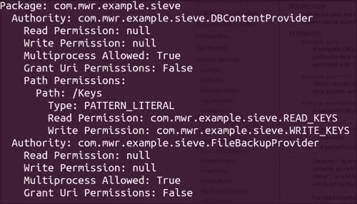

这个例子取自 MWR 实验室的筛安卓应用，开发时内置了某些漏洞；有关下载页面的链接，请参见*另请参见*部分。

在前面的截图中，我们可以看到这个 app 使用`PATTERN_LITERAL`-类型匹配来保护`Keys`路径，这意味着如果我们尝试使用 drozer 进行查询，结果会如下:

```java
run app.provider.query content://com.mwr.example.sieve.DBContentProvider/Keys

```

下面的屏幕截图显示了上一个命令的输出:

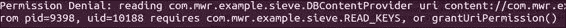

前面的屏幕截图显示了由于 drozer 没有与提供程序交互所需的权限而导致的权限拒绝。但是，如果我们简单地将`/`附加到路径上，仍然有效，结果如下:

```java
run app.provider.query content://com.mwr.example.siever.DBContentProvider/Keys/

```

下面的屏幕截图显示了前面命令的输出:


路径增加了一个正斜杠，所以`PATTERN_LITERAL`检查没有找到`content://com.mwr.example.sieve.DBConentProvider/Keys`路径，而是找到了`content://com.mwr.example.sieve.DBConentProvider/Keys/`路径。这意味着查询内容提供商的应用将需要`/Keys/`路径的权限，该路径没有定义，因此不需要权限，从而允许查询顺利解决。在前面的截图中，我们可以看到，在这种情况下，恶意应用将能够为 Size 密码管理器应用提取用户登录 pin 的详细信息。

## 另见

*   Shazam (Android)应用上的*路径遍历漏洞*文章([http://blog . seguesec . com/2012/09/Path-遍历-漏洞-on-Shazam-Android-应用/](http://blog.seguesec.com/2012/09/path-traversal-vulnerability-on-shazam-android-application/) )
*   Adobe Reader (Android)应用中的*路径遍历漏洞*文章([http://blog . seguesec . com/2012/09/Path-遍历-漏洞-on-Adobe-Reader-Android-application/](http://blog.seguesec.com/2012/09/path-traversal-vulnerability-on-adobe-reader-android-application/))
*   安卓内容处理目录遍历漏洞的*WinZip*文章([http://vuln.sg/winzip101-en.html](http://vuln.sg/winzip101-en.html))
*   安卓 2.3.4 浏览器本地文件包含在 CVE 详情；**CVE-2010-4804**([http://www.cvedetails.com/cve/CVE-2010-4804/](http://www.cvedetails.com/cve/CVE-2010-4804/))
*   dro zer screen–一款密码管理器应用，展示了一些常见的 Android 漏洞([https://www . mwrinfosecurity . com/system/assets/380/original/screen . apk](https://www.mwrinfosecurity.com/system/assets/380/original/sieve.apk))

# 将数据插入内容提供商

像任何面向数据库的应用一样，内容提供商也可以促进将数据插入其 SQLite 数据库或文件存储的能力；如果任何内容提供商不使用适当的 **write** 权限来限制此功能，攻击者可能会恶意地将数据插入到 SQLite 数据库中。本教程讨论如何执行这种攻击；在下一章中，我们将查看导致这些漏洞的实际代码，并讨论一些补救措施。

## 怎么做...

在我们向内容提供者中插入数据之前，我们需要知道为数据库设置的模式或列是什么样子的；您可以使用 drozer 控制台中的以下命令来枚举这些信息:

```java
dz> run app.provider.columns [URI]

```

在前面的命令中`[URI]`是你想要找到的 URI。例如，如果您想对 screen 运行它，您可以执行以下命令:

```java
dz> run app.provider.columns content://com.mwr.example.seive.DBContentProvider/Passwords

```

前面的命令将产生如下截图所示的输出:


枚举数据库的列之所以有用，是因为它可以帮助您构建未来对内容提供商的攻击；您可能需要稍微了解一下模式，以便能够知道您可能对从中提取和插入哪些列和行感兴趣。

一旦您稍微了解了数据库的结构以及正确构建查询所需的列名，就可以使用以下命令将数据插入到内容提供程序中:

```java
dz> run app.provider.insert [URI] [--boolean [name] [value]] [--integer [name] [value]] [--string [name] [value]]...

```

在前面的命令中，`[URI]`是指向相关数据库的 URI，`--boolean`、`--integer`、`--string`是您应该提供的标志，用于将给定的数据标记为给定的数据类型。该模块支持以下数据类型:

```java
--boolean –-double –-float –-integer –-long –-string –short
```

它们都需要表示列名的`[name]`值和表示要插入的实际值的`[value]`。

以下代码是一个示例:

```java
dz> run app.provider.insert –-int _id 12 –-int from_account 31337 –-int to_account –-int amount 31337    content://com.example.vulnerabledatabase.contentprovider/statements 

```

下面是一个虚构的例子。你的设备上可能不存在 URI，除非你已经明确开发了一些处理它的应用。

下面是一个针对 Sieve 的工作示例:

```java
dz>  run app.provider.insert content://com.mwr.example.sieve.DBContentProvider/Passwords –-int _id 3 –-string username injected –-string service injected –-string password woopwoop –-string email myspam@gmail.com 

```

一旦您查询了 Sieve 的密码 URI 并执行了前面的命令，将返回以下数据:

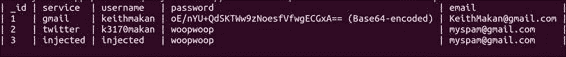

我们可以清楚地看到，对于 **_id** **3** 来说，我们刚刚注入的数据实际上出现在数据库中。这意味着我们刚刚设法用一些伪造的数据破坏了密码数据库中的数据。在实际环境中，这可能允许攻击者更改或删除用户的密码，从而拒绝用户访问相关帐户；更具体地说，在像 screen 这样的密码管理应用中——这里以此为例——攻击者将能够阻止用户访问他们存储的密码，甚至可能阻止用户访问他们的 Gmail、Twitter 或 LinkedIn 帐户。

关于这个例子的一点小注意:我们注入密码字符串`woopwoop`仅仅是作为一个标记，以确保我们可以注入密码数据——它只是一个非常容易识别的字符串；如果你要测试这个密码，它可能不会工作。要实际注入有效的密码，需要注入密码的 base64 编码值。

# 枚举 SQL 注入易受攻击的内容提供程序

就像网络应用一样，安卓应用可能会使用不可信的输入来构建 SQL 查询，并且是以一种可利用的方式进行的。最常见的情况是，应用不清理任何 SQL 的输入，也不限制对内容提供者的访问。

为什么要阻止 SQL 注入攻击？好吧，假设你正处于一个经典的情况，试图通过比较查询数据库提供的用户名来授权用户。代码看起来类似于以下内容:

```java
public boolean isValidUser(){ 
u_username = EditText( some user value );
u_password = EditText( some user value );
//some un-important code here...
String query = "select * from users_table where username = '" +  u_username + "' and password = '" + u_password +"'";
SQLiteDatabase db
//some un-important code here...
Cursor c = db.rawQuery( p_query, null );
return c.getCount() != 0;
}
```

前面的代码有什么问题？那么，当用户提供密码`'' or '1'='1'`时会发生什么？传递给数据库的查询如下所示:

```java
select * from users_table where username = '" +  u_username + "' and password = '' or '1'='1'"
```

前面的粗体字符表示用户提供的部件；这个查询形成了布尔代数中所谓的逻辑重言式；意思是无论查询针对的是什么表或者数据，都会一直设置为`true`，也就是说数据库中的所有行都会满足选择标准。这意味着将返回`users_table`中的所有行，因此，即使提供了无效密码`'`或`'1'='`，调用`c.getCount()`也将始终返回非零计数，从而导致身份验证旁路！

考虑到没有多少安卓开发者会使用`rawQuery`调用，除非他们需要完成一些非常混乱的 SQL 查询，我已经包含了另一个 SQL 注入漏洞的代码片段在现实应用中更常见。因此，当审计安卓代码的注入漏洞时，一个好主意是寻找类似以下的东西:

```java
public Cursor query(Uri uri, String[] projection, String selection,String[] selectionArgs, String sortOrder) {
   SQLiteDBHelper sdbh = new StatementDBHelper(this.getContext());
   Cursor cursor;
   try {
//some code has been omitted  
   cursor = sdbh.query(projection,selection,selectionArgs,sortOrder);
   } finally {
      sdbh.close();
   }
   return cursor;
}
```

在前面的代码中，`projection`、`selection`、`selectionArgs`或`sortOrder`变量都不是直接来自外部应用。如果内容提供者被导出并授予 URI 权限，或者像我们之前看到的那样，不需要任何权限，这意味着攻击者将能够注入任意 SQL 来增强恶意查询的评估方式。

让我们看看您实际上是如何使用 drozer 攻击 SQL 注入易受攻击的内容提供者的。

## 怎么做...

在这个食谱中，我将讨论两种 SQL 注入漏洞:一种是当 SQL 语句的 select 子句是可注入的，另一种是当投影是可注入的。使用 drozer，很容易找到 select 子句可注入的内容提供者:

```java
dz> run app.provider.query [URI] –-selection "1=1" 

```

前一种方法试图将所谓的逻辑重言式注入到内容提供者解析的 SQL 语句中，并最终注入到数据库查询解析器中。由于这里使用的模块的性质，您可以判断它是否实际工作，因为它应该返回数据库中的所有数据；也就是说，select 子句条件应用于每一行，并且因为它总是返回 true，所以每一行都将被返回！

您也可以尝试任何始终正确的值:

```java
dz> run app.provider.query [URI] –-selection "1-1=0"
dz> run app.provider.query [URI] –-selection "0=0"

dz> run app.provider.query [URI] –-selection "(1+random())*10 > 1" 

```

以下是一个故意使用易受攻击的内容提供商的示例:

```java
dz> run app.provider.query content://com.example.vulnerabledatabase.contentprovider/statements –-selection "1=1"

```

返回整个被查询的表，如下图所示:


当然可以注入`SELECT`语句的投影，也就是语句中`FROM`之前的部分，也就是`SELECT [projection] FROM [table] WHERE [select clause]`。

## 另见

*   SQLite 语言参考指南([http://www.sqlite.org/lang.html](http://www.sqlite.org/lang.html))中的*SQlite 理解的 SQL*文章
*   [https://www.owasp.org/index.php/SQL_Injection](https://www.owasp.org/index.php/SQL_Injection)的 SQL 注入文章

# 开发可调试的应用

应用可以被标记为可调试的，通过允许您在应用执行期间设置断点，使功能测试和错误跟踪变得更加容易。为此，请查看虚拟机堆栈，并在设备上运行应用时暂停和恢复线程。

不幸的是，谷歌游戏商店上的一些应用仍然被标记为可调试的。这可能并不总是世界末日，但如果应用希望保护任何身份验证数据、密码地址或应用内存中存储的任何值，将其标记为可调试意味着攻击者将能够非常容易地访问这些数据。

这个方法讨论了如何从可调试的应用中泄漏变量值。攻击者还可以通过应用触发远程代码执行，并在应用上下文中运行一些代码。

这里使用的例子是安卓《华尔街日报》应用，在撰写本文时，它是谷歌游戏商店中发布的可调试应用之一。

## 怎么做...

您需要做的第一件事是确定应用是否可调试。这相当简单，因为应用是否可调试直接取决于它的应用清单。安卓应用清单的应用元素中的`debuggable`字段。要枚举和利用可调试的应用，您需要执行以下步骤:

1.  To check whether or not an application is debuggable, you can either extract the manifest or execute the following command from your drozer console:

    ```java
    dz> run app.package.debuggable 

    ```

    这将列出所有被设置为可调试的包，并显示它们被授予的权限。以下屏幕截图显示了软件包列表:

    

    你可能会问自己，像这样简单的漏洞在现实世界中是否真的存在？嗯，是的，事实上仍然如此！下面的截图显示了一个相对知名的应用，该应用已发布到谷歌游戏市场，可调试:

    

    此示例显示了`.debuggable`模块的输出，表明华尔街日报阅读器应用是可调试的。

2.  一旦您确定了一个好的目标，您应该使用如下命令启动它:

    ```java
    dz> run app.activity.start –-component com.example.readmycontacts com.example.readmycontacts.MainActivity 

    ```

3.  Once it's running, you can use ADB to get the Java Debug Wire Protocol Port which has been opened for that instance of the VM for debugging; the following is how you do that:

    ```java
    adb jdwp

    ```

    您应该会看到如下内容:

    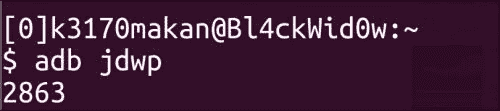

4.  The number returned by ADB is the port you can use to connect to the VM, but before you can do that from your machine, you need to forward that port via `adb`; the following is how you do that:

    ```java
    adb forward tcp:[localport] jdwp:[jdwp port on device]

    ```

    对于屏幕截图中的示例，您将执行以下命令来转发端口:

    

5.  You can now access the VM running this app from your machine. From this point on, you can rely on the Java Debugger to connect to the VM; you do this by running the following command:

    ```java
    jdb –attach localhost:[PORT]

    ```

    您将使用的`[PORT]`端口将是上一步中转发的端口；在这个例子中，那将是`31337`。通过`jdb`连接的工作方式如下:

    ```java
    jdb –attach localhost:31337

    ```

    以下截图显示了前面命令的输出:

    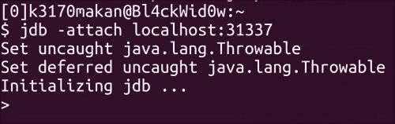

6.  Then you would be connected to the VM running this app on the Android device; you can then do things such as extract information about the classes compiled with the application; this is done by executing the following command from within your `jdb` session:

    ```java
    classes

    ```

    这将产生类似如下的输出:

    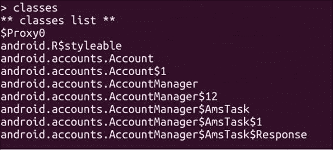

7.  You can also enumerate the methods per class by firing off the following command:

    ```java
    > methods [class-path]

    ```

    在前面的命令中，`[class-path]`是该类想要了解的完整类路径。

8.  The following is a screenshot demonstrating the previous command against an application package called `com.example.readmycontacts`. Here we are extracting information about the `.MainActivity` class, which is the class called to launch the activity.

    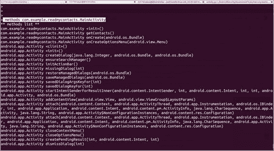

9.  You can even dig a little deeper and list the "fields" or class attribute names and values for a given class; this is done by executing the following command from within JDB:

    ```java
    > fields [class name ]

    ```

    例如:

    ```java
    > fields com.example.readmycontacts.MainActivity

    ```

作为一名安卓应用黑客，你为什么会对从类文件的字段中读取值感兴趣？嗯，因为开发人员可能经常将敏感细节显式存储在类文件中，而不是从云中获取它们；因此，您可以期待值，例如密码、API 令牌、单点登录令牌、默认用户名，以及通常保存在类字段中的用于身份验证或其他敏感操作的任何数据。

对于一些安卓操作系统，特别是任何未修补的姜饼设备和任何较低版本。此漏洞可能意味着恶意应用可能能够在另一个应用的上下文中执行任意命令。为什么只有姜饼和更低的？早在 Dalvik 虚拟机更新到 Gingerbread 之前，Dalvik 就导致可调试应用尝试连接到 Java Debug Wire 协议端口，即使 ADB 没有运行；这意味着能够在目标设备上打开网络套接字的恶意应用将能够接受来自可调试应用的连接，并且由于 Java Debugging 的工作方式，能够执行任意代码。有关此行为的更多详细信息，请访问*参见*部分中*安卓市场中可调试应用文章*的链接，以及不同版本的达尔维克虚拟机代码的链接。

用 Java 调试器可以做的事情还有很多；对于那些想了解更多的人，我在*部分加入了一些有用的链接，也请参见*部分。

## 另见

*   位于[的*Jdb–Java 调试器*文章](http://docs.oracle.com/javase/1.5.0/docs/tooldocs/windows/jdb.html)
*   *Java 平台调试器架构*文章在[http://docs . Oracle . com/javase/1 . 5 . 0/docs/guide/JPDA/index . html](http://docs.oracle.com/javase/1.5.0/docs/guide/jpda/index.html)
*   位于[的 *Android:可调试–Android 开发者参考*指南](http://developer.android.com/guide/topics/manifest/application-element.html#debug)
*   MWRLabs 上的*安卓市场可调试应用*文章
*   绍里克在[http://www.saurik.com/id/17](http://www.saurik.com/id/17)发布的*漏洞利用(&修复)安卓“万能钥匙”*文章
*   *使用 JDB* 调试 Java 程序文章在[http://www . packtpub . com/article/debug-Java-Programs-use-jdb](http://www.packtpub.com/article/debugging-java-programs-using-jdb)
*   jdwpadb . c–Kitkat 版本，安卓源代码库([https://Android . googlesource . com/platform/dalvik/+/Kitkat-release/VM/jdwp/jdwpadb . CPP](https://android.googlesource.com/platform/dalvik/+/kitkat-release/vm/jdwp/JdwpAdb.cpp))
*   jdwpadb . c–éclair 激情版，安卓源代码库([https://Android . googlesource . com/platform/dalvik/+/eclair-激情版/vm/jdwp/JdwpAdb.c](https://android.googlesource.com/platform/dalvik/+/eclair-passion-release/vm/jdwp/JdwpAdb.c) )
*   jdwpadb . c–姜饼发布，安卓源代码库([https://Android . googlesource . com/platform/dalvik/+/姜饼-发布/vm/jdwp/JdwpAdb.c](https://android.googlesource.com/platform/dalvik/+/gingerbread-release/vm/jdwp/JdwpAdb.c) )

# 对应用的中间人攻击

移动电话用户经常使用公共无线网络在咖啡店、图书馆和任何可以上网的地方上网。不幸的是，由于某些应用的开发方式，它们仍然可能成为**中间人** ( **MITM** )攻击的受害者。对于那些不了解 MITM 攻击的人来说，它们本质上是允许对手拦截你与你的网络上的设备的通信的攻击；如果你想知道更多关于非移动环境下这些攻击的危险和技术细节，请查看*部分的链接。*

我们为什么要关心 MITM 对手机的攻击？嗯，根据从“不安全”渠道到基于网络的资源的内容被信任的程度，攻击者可能可以做任何事情，从对您设备上运行的应用进行指纹识别，到详细描述您去过的每个地方，大约是您生活和工作的地方，甚至控制您移动设备上的一些应用，甚至可能控制您的整个手机——如果它的根不安全或可以被根。非常流行的应用中有许多漏洞的实际例子，可以使用中间人攻击来利用这些漏洞；查看*中的链接，部分链接请参见*部分。

这个食谱演示了如何在安卓手机上执行 MITM 攻击，以及在 MITM 攻击中可以使用的一个简单漏洞，即域名系统中毒。

这里有一个小警告，用于执行 MITM 攻击的工具 Ettercap 没有正式提供任何 Windows 支持。不过，如果你没有 Ubuntu 或 Debian Linux 机器，你可以设置一个，只需为 Ubuntu 下载一个光盘映像，并使用甲骨文的 Virtualbox 从虚拟机上运行它，或者 VMware 在这方面也很有效。要了解如何安装虚拟机，请参阅[第 3 章](3.html#page "Chapter 3. Android Security Assessment Tools")、*安卓安全评估工具*中*安装和设置三兔子*食谱的*还有更多…* 部分。如果你真的热衷于在你的 Windows 机器上使用 Ettercap，你可以在*部分查看非官方 Windows 二进制文件的下载链接。*

## 做好准备

为了让整个过程更简单，我将向你们展示如何下载一个可怕的工具，让 MITM 攻击变得非常容易。您可以使用以下命令下载 Ettercap:

```java
sudo aptitude install ettercap-graphical

```

下面的屏幕截图显示了前面命令的输出:


一旦下载并设置好，你就可以开始 MITM 攻击了。

## 怎么做...

让我们从以下步骤开始:

1.  Before we start setting up the MITM attack, you will need to set up the DNS Spoof plugin for Ettercap; the only thing you need to do is add some useful addresses to the DNS configs script for Ettercap that is saved in `/usr/share/ettercap/etter.dns` on Linux machines.

    

    `etter.dns`文件看起来应该有点像下面这样:

    

    编辑这个文件后，应该如下图所示:

    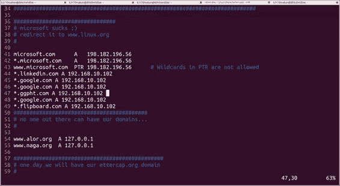

    地址`192.168.10.102`应该替换为你机器的互联网地址，因为你想用你的机器欺骗域名系统服务器，这基本上意味着你的机器将充当域名系统服务器。

2.  Once the DNS plugin has been set up properly, you can start an MITM attack by executing the following command from your terminal or command prompt:

    ```java
    ettercap –T –I [interface] –M ARP:remote –P dns_spoof /[address of target] /[address of gateway]/

    ```

    在前面的命令中，`[interface]`是您用来连接网络的网络接口；它可以是以太网或无线接口。`[address of target]`是你的安卓设备的互联网地址；你可以在你的安卓手机上的**设置** | **Wi-Fi** | **【网络名称】** | **IP 地址**下找到这个。`[address of gateway]`是该网络默认网关的互联网地址。该攻击通过滥用**地址解析协议** ( **ARP** ) 的认证缺失，忽悠你的手机以为你攻击的机器是实际网关。

3.  For example, if your gateway's IP address is `192.168.10.1` and your Android device's IP is `192.168.10.106`, the following is how you would set up the MITM attack:

    ```java
    sudo ettercap –T –i wlan0 –M ARP:remote –P dns_spoof /192.168.10.1/ /192.168.10.106/

    ```

    你可以互换最后两个地址；只要他们都在，订单就不重要。执行此命令后，您应该会在终端上看到以下内容:

    

4.  After a while, you should see something similar to the following screenshot of the traffic being logged by Ettercap:

    

5.  Once you start some apps using this "poisoned" network, you'll be able to see some strange things happen on your attacker machine; for instance, you'll be able to see the DNS requests being sent by your Android apps; The following screenshot shows the DNS requests sent by the Flipboard app:

    

    该输出由 Wireshark 生成。

6.  If you have a web server configured on your machine, you'll be able to serve some content to your Android phone by pretending to be websites such as LinkedIn and Google; the following are some screenshots demonstrating this:

    

    这里还有一个例子；对[www.google.com](http://www.google.com)的请求在以下截图中被拦截:

    

显然，这些不是领英和谷歌的网页；事实上，这里返回的页面是从本地机器到网络的。这可能是一个非常普通的演示，尽管它涵盖了攻击的硬部分，即建立攻击者能够控制应用向互联网发出的响应的 MITM 上下文。

在这里，一旦你建立了你的 MITM 环境，你能做的就是利用移动浏览器使用一些东西，比如 Metasploit 和它的`browser_autopwn`模块，或者通过使用一个工具镜像这些站点来使用一些社会工程——社会工程工具包在这方面很有效。参见*另请参见*部分，获取这些优秀工具的信息链接。

除了普通的 MITM 攻击之外，还有一些特定于安卓的 MITM 攻击，即那些针对使用不安全的`addJavaScriptInterface`网络工具包和相关应用编程接口调用的应用的攻击。有关此漏洞的更多信息，请参见*部分中的*安卓网络视图历险记*文章和对安卓系统中网络视图的*攻击的链接。**

## 另见

*   安卓系统中对 WebView 的*攻击*论文罗桐波、郝浩、、、、(】http://www . cis . syr . edu/~ wedu/Research/paper/WebView _ acsac 2011 . pdf)
*   MWR 信息安全[上的*WebView addJavaScriptInterface 远程代码执行*论文](https://labs.mwrinfosecurity.com/system/assets/563/original/mwri_webview-addjavascriptinterface-code-execution_2013-09-23.pdf)
*   MWR 实验室的*安卓网络视图冒险*文章
*   Ettercap Windows 二进制文件([http://SourceForge . net/project/ettercap/files/非官方% 20 二进制文件/windows/](http://sourceforge.net/projects/ettercap/files/unofficial%20binaries/windows/) )
*   Ettercap 主页([http://ettercap.github.io/ettercap/index.html](http://ettercap.github.io/ettercap/index.html))
*   渗透测试实验室的 *Metasploit 浏览器自动下载*文章
*   该隐和亚伯主页(http://www.oxid.it/cain.html)
*   以太网地址解析协议，互联网标准 STD 37([http://tools.ietf.org/html/rfc826](http://tools.ietf.org/html/rfc826))