# 第六章。逆向工程应用

在本章中，我们将介绍以下食谱:

*   从 Java 编译到 DEX
*   反编译 DEX 文件
*   解释达尔维克字节码
*   将 DEX 反编译成 Java
*   反编译应用的本机库
*   使用 GDB 服务器调试安卓进程

# 简介

前一章讨论了应用中的缺陷；它们可以被开发和发现，而不需要确切知道它们是如何开发的。虽然对导致这个特定问题的一些常见源代码有详细的解释，但我们不需要阅读源代码就知道 SQL 注入是可能的。很大程度上，我们成功利用漏洞的第一步是从不了解应用行为的实际细节的上下文中分析应用的行为。本章中讨论的逆向工程旨在揭示应用内部工作的每一个细节，以便利用它。

当应用于计算机软件时，逆向工程是学习事物如何工作并开发利用或滥用这些信息的方法的过程。例如，读取内核驱动程序的源代码可能会导致发现潜在的内存损坏缺陷，例如缓冲区边界检查不当。鉴于此漏洞存在的背景，知道这一点可能允许您开发利用漏洞。逆向工程是任何安全专家最基本的技能，也是所有真正开发的核心。当在导致成功利用的事件链中的某个地方开发了利用和漏洞时，就发生了逆向工程。

安卓应用与其他计算机软件类型没有什么不同，因此，它们也可以进行逆向工程。为了对一个应用进行逆向工程，人们需要了解它们是如何构建的，什么去了哪里，为什么。没有这些信息会导致无休止、不眠不休的模糊测试和暴力强迫，在大多数情况下，最终会以失败告终。本章讨论了一些可以用来提取应用内部工作信息的方法，并讨论了恶意软件开发人员和安全审计人员用来滥用和逆向工程应用的一些新颖技巧。

在我们开始烹饪食谱之前，只有一个问题需要问；为什么要对安卓应用进行逆向工程？

这里有几个方法来回答这个问题:

*   **阅读源代码**:通常，许多漏洞对攻击者来说是隐藏的，仅仅是因为它们在应用的“黑盒”评估过程中没有表现出来。这并不意味着他们不容易受到剥削；引用一句话，“没有证据不是缺席的证据！”阅读应用的源代码是了解其弱点的最有效方法，并且通常会比纯粹的黑盒分析发现更多的漏洞。阅读源代码仍然是理解应用的唯一具体方法；除了源代码，你不能相信任何东西；换句话说，文档是一个谎言，直到源代码证明不是这样！
*   **泄露信息**:应用中的一些漏洞不是直接源于代码的行为，而是源于应用中存储的信息类型，例如静态私钥和密码、电子邮件地址、登录令牌、URIs 和其他敏感内容。破解一个应用可以让你接触到它的所有秘密。
*   **分析防御机制**:往往应用中常见的漏洞都是用最可笑的方式来保护的。虽然减少了常见的攻击路径，但应用是否受到某些攻击的保护完全取决于其源代码和配置。通常，如果没有源代码和内部配置，要发现它是如何保护自己的可能是极其困难的，有时甚至是不可能的。阅读同一类别中大量应用的源代码可以让您对保护应用(例如登录应用)的最佳和最差方法有相当深入和丰富的见解。阅读其中的大量源代码可能会教您开发人员如何创建针对身份验证暴力攻击、凭据嗅探攻击和其他登录应用特定防御的防御措施。
*   **分析攻击技术**:您可能有兴趣了解哪个应用和系统级别利用了最新最棒的安卓恶意软件。真正发现这一点，让自己站在安卓安全研究前沿的唯一方法，就是对安卓应用进行逆向工程。

考虑到这些目标，让我们开始食谱。

# 从 Java 编译到 DEX

接下来的食谱打破了 DEX 文件格式；但是在深入研究 DEX 文件之前，先了解一下将 Java 程序解释/编译成 DEX 程序的过程会很有用。演示从 Java 到 DEX 编译的一个关键原因是，这里例子中使用的文件将用于解释下一个配方中的 DEX 文件格式。

## 做好准备

在我们开始之前，您需要一些东西:

*   **Java 开发工具包**:我们需要这个能够把 Java 代码编译成类文件
*   **安卓 SDK** :我们需要这个包里面的一些工具，能够把 Java 类文件转换成 DEX 文件
*   **文本编辑器**:我们需要一个文本编辑器，这样我们就可以编写一个样例 Java 程序来转换成 DEX 程序

一旦您获得了所有这些东西，我们就可以开始准备一个示例的 DEX 文件了。

## 怎么做...

要将一个 Java 程序编译成一个 DEX 程序，您需要执行以下操作:

1.  打开文本编辑器，使用以下代码创建一个文件:

    ```java
    public class Example{
      public static void main(String []args){
        System.out.printf("Hello World!\n");
      }
    }
    ```

2.  将之前的文件保存为`Example.java`，然后通过在终端或命令提示符下键入以下内容来编译代码:

    ```java
    javac –source 1.6 –target 1.6 Example.java

    ```

3.  If you've got your `CLASS` file ready, you can now whip out a tool called `dx`, found under:

    ```java
    [SDK path]/sdk/platform-tools/dx

    ```

    如果您有 4.4 版的软件开发工具包，您可以在下面找到它:

    ```java
    /sdk/built-tools/android-[version]/dx

    ```

    

4.  To prepare a DEX file, you need to execute the following command:

    ```java
    [SDK path]/sdk/platform-tools/dx –-dex –-output=Example.dex Example.class

    ```

    

    完成后，您的当前目录中应该有一个名为`Example.dex`的文件；这是`Example.class`的 DEX 版本。

## 它是如何工作的...

在第 1 步中，我们做了 Java 开发人员每天都在做的事情，以及描述 Java 对象的内容；我们的目标被称为`Example`。

第二步，我们把`Example.java`编译成一个类文件。这里发生的事情是，Java 编译器抓取我们编写的漂亮的语义代码，并将其解析为一堆基于堆栈的 Java 虚拟机指令。

在第 3 步中，我们获取了`CLASS`文件及其 Java 元数据和基于堆栈的指令，并准备了资源、数据结构和基于寄存器的指令的集合，Dalvik VM 将其理解为一个 DEX 文件。下面是我们使用的`dx`命令的分解:

*   `-dex`:这个命令告诉`dx`你想要创建一个 DEX 文件
*   `-output=Example.dex`:这个指令让`dx`知道我们希望程序的输出进入一个名为`Example.dex`的文件
*   `Example.class`:这是输入文件，也就是我们在第二步编译的`class`文件

# 反编译 DEX 文件

DEX 文件，或者说 Dalvik 可执行文件，是安卓版的 Java 的`CLASS`文件。它们包括定义安卓应用行为的 Java 代码的编译格式，作为一名安卓安全专家，你自然会有兴趣知道这些文件是如何工作的，以及它们的确切用途。对 DEX 文件进行反编译是许多应用安全评估的重要组成部分；它们为 Android 应用的行为提供了一个很好的信息来源，并且通常可以收集应用开发的细节，这是纯源代码视角所不能做到的。对 DEX 文件格式以及如何解释它的良好理解可能会导致识别新的漏洞，或者开发和改进针对安卓平台和达尔维克虚拟机的漏洞。恶意软件可能很快会开始利用 DEX 文件的解释方式来隐藏与其行为相关的细节。唯一一个对新的安卓恶意软件混淆技术有所了解并拥有必要技能来挫败它们的安全爱好者，将是真正了解 DEX 文件工作原理的少数开明人士。该方法包括一个详细的 DEX 文件格式的细分，并描述了如何使用和解释 DEX 文件中的每个字段。然后讨论如何将一个 DEX 文件反编译回 Java 源代码，以便于阅读和逆向工程。

## 了解 DEX 文件格式

这个方法专门用于分解和描述 DEX 文件的每个重要部分。它遍历每个字段，直接从用于解释 DEX 文件的 Dalvik 源代码开始工作。

接下来的几个段落提供了关于 DEX 文件不同部分的信息，例如在哪里可以找到对可打印字符串的引用，以及在哪里可以找到每个编译类的实际 DEX 代码。DEX 文件的格式相当简单易懂。DEX 文件的结构如下:

```java
struct DexFile {
/* directly-mapped "opt" header */
  const DexOptHeader* pOptHeader;

/* pointers to directly-mapped structs and arrays in base DEX */
  const DexHeader*    pHeader;
  const DexStringId*  pStringIds;
  const DexTypeId*    pTypeIds;
  const DexFieldId*   pFieldIds;
  const DexMethodId*  pMethodIds;
  const DexProtoId*   pProtoIds;
  const DexClassDef*  pClassDefs;
  const DexLink*      pLinkData;
/*
    * These are mapped out of the "auxiliary" section, and may not be
    * included in the file.
*/
  const DexClassLookup* pClassLookup;
  const void*         pRegisterMapPool;       // RegisterMapClassPool

/* points to start of DEX file data */
  const u1*           baseAddr;

/* track memory overhead for auxiliary structures */
  int                 overhead;

/* additional app-specific data structures associated with the DEX */
  //void*               auxData;
};
```

### 注

之前的代码可以在[https://github . com/Android/platform _ dal vik/blob/master/lib dex/DEXFIle . h](https://github.com/android/platform_dalvik/blob/master/libdex/DexFile.h)上找到。

### DEX 文件头

一个文件的第一部分叫做头。以下是根据达尔维克虚拟机中的`libdex`对 DEX 文件头的定义:

```java
struct DexHeader {
  u1  magic[8];           /* includes version number */
  u4  checksum;           /* adler32 checksum */
  u1  signature[kSHA1DigestLen]; /* SHA-1 hash */
  u4  fileSize;           /* length of entire file */
  u4  headerSize;         /* offset to start of next section */
  u4  endianTag;
  u4  linkSize;
  u4  linkOff;
  u4  mapOff;
  u4  stringIdsSize;
  u4  stringIdsOff;
  u4  typeIdsSize;
  u4  typeIdsOff;
  u4  protoIdsSize;
  u4  protoIdsOff;
  u4  fieldIdsSize;
  u4  fieldIdsOff;
  u4  methodIdsSize;
  u4  methodIdsOff;
  u4  classDefsSize;
  u4  classDefsOff;
  u4  dataSize;
  u4  dataOff;
};
```

数据类型`u1`和`u4`只是无符号整数类型的别名。以下是达尔维克虚拟机本身的`Common.h`头文件中的类型定义:

```java
  typedef uint8_t             u1; /*8 byte unsigned integer*/
  typedef uint16_t            u2; /*16 byte unsigned integer*/
  typedef uint32_t            u4; /*32 byte unsigned integer*/
  typedef uint64_t            u8; /*64 byte unsigned integer*/
  typedef int8_t              s1; /*8 byte signed integer*/
  typedef int16_t             s2; /*16 byte signed integer*/
  typedef int32_t             s4; /*32 byte signed integer*/
  typedef int64_t             s8; /*64 byte signed integer*/
```

### 注

之前的代码可以在[https://github . com/Android/platform _ dalvik/blob/master/VM/common . h](https://github.com/android/platform_dalvik/blob/master/vm/Common.h)上找到。

所以，这就排除了准备工作。现在，您已经对一个 DEX 文件的样子有了一个基本的概念，并且对一切的走向有了一个基本的把握。接下来的几个段落详细说明了每个部分的目的以及达尔维克虚拟机如何使用它们。

首先，DEX 文件中的第一个字段定义如下:

```java
  u1  magic[8];           /* includes version number */
```

`magic[8]`保存一个“标记”，通常称为幻数，它保存了 DEX 文件特有的字符集合。DEX 文件的神奇数字是`dex\n035`，或者十六进制中的`64 65 78 0a 30 33 35 00`。

下面是`classes.dex`的截图，显示了十六进制中的神奇数字:


下一个字段定义如下:

```java
  u4  checksum;           /* adler32 checksum */
```

下面的屏幕截图显示了 Adler32 校验和，它将出现在 DEX 文件中:


这个 4 字节的字段是整个报头的校验和。校验和是对组成报头的位执行的**异或** ( **异或** )和加法运算的结果。检查以确保`DexHeader`文件的内容没有损坏或错误更改。确保没有任何东西损坏这个头是非常重要的，因为它决定了如何解释 DEX 文件的其余部分，并作为解释其余部分的路线图。因此，达尔维克使用`DexHeader`文件来定位 DEX 文件的其余组件。

下一个字段是 21 字节**安全散列算法** ( **SHA** ) 签名，定义如下:

```java
  u1  signature[kSHA1DigestLen]; /* SHA-1 hash length = 20*/
```

以下屏幕截图显示了 SHA 摘要在 DEX 文件中的显示方式:


`kSHA1DigestLen`定义为`20`，如果你还没有猜到的话。这是因为 SHA1 的街区长度被标准化为`20`。根据达尔维克代码中的一个小注释，该摘要用于唯一标识 DEX 文件，并在签名后的 DEX 文件部分计算。计算 SHA 摘要的 DEX 文件部分是指定所有地址偏移量和其他大小参数的地方，也是它们所指的地方。

SHA 摘要字段之后是`fileSize`字段，定义如下:

```java
  u4  fileSize;/* length of entire file */
```

下面的截图显示了出现在 DEX 文件中的`fileSize`字段:

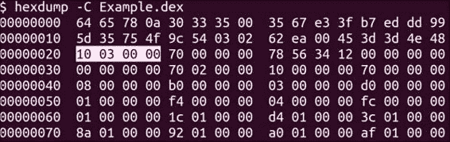

`fileSize`字段是一个 4 字节的字段，保存整个 DEX 文件的长度。此字段用于帮助计算偏移并轻松定位某些部分。它还有助于唯一地识别 DEX 文件，因为它构成了被输入到安全散列操作中的 DEX 文件部分的一部分:

```java
  u4  headerSize;/* offset to start of next section */
```

下面的截图显示了出现在 DEX 文件中的`headerSize`字段:

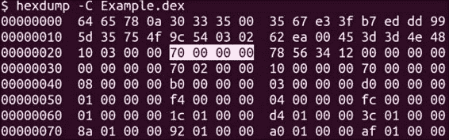

`headerSize`以字节为单位保存整个`DexHeader`结构的长度，正如注释所建议的，它用于帮助计算它在文件中的位置，该文件标志着下一部分的开始。

DEX 文件中的以下字段是字符顺序标记，定义如下:

```java
  u4  endianTag;
```

下面的截图显示了一个样本`classes.dex`文件的`endianTag`字段:


`endianTag`字段保存一个静态值，该值在所有 DEX 文件中是相同的。该字段的值`12345678`用于确保以正确的“字符顺序”或位顺序解释文件。一些架构更喜欢将它们的最高有效位放在左边，而另一些架构更喜欢放在右边；这被称为体系结构的字符顺序。此字段通过允许达尔维克虚拟机读取值并检查字段中的数字出现的顺序，帮助识别体系结构使用的是哪一个。

接下来是`linkSize`和`linkOff`字段；当多个类文件被编译成一个 DEX 文件时使用:

```java
  u4  linkSize;
  u4  linkOff;
```

地图部分偏移量接下来是，定义如下:

```java
  u4  mapOff;
```

下一个字段`stringIdsSize`定义如下:

```java
  u4  stringIdsSize;
```

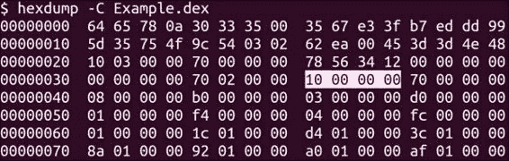

`stringIdsSize`字段保存`StringIds`部分的大小，并以与其他大小字段相同的方式使用，以帮助计算`StringIds`部分相对于 DEX 文件开始的起始位置。

下一个字段`stringIdsOff`定义如下:

```java
  u4  stringIdsOff;
```

该字段保存实际`stringIds`部分的字节偏移量。它帮助 Dalvik 编译器和虚拟机跳转到这个部分，而不需要做任何严格的计算，也不需要一遍又一遍地重新读取文件来找到`stringIds`部分。在`StringIdsOff`字段之后是相同的类型、原型、方法、类和数据标识部分的偏移量和大小字段—这些属性中的每一个都有与`stringIds`和`stringIdsOff`字段完全相同的大小和偏移量字段。这些与`stringIdsOff`和`stringIdsSize`字段的目的相同，除了它们旨在并促进高效和简单的机制来访问相关部分。如前所述，这意味着要么多次重新读取文件，要么在相对起始地址上做一些简单的加法和减法。以下是尺寸和偏移字段的定义:

```java
  u4  typeIdsSize;
  u4  typeIdsOff;
  u4  protoIdsSize;
  u4  protoIdsOff;
  u4  fieldIdsSize;
  u4  fieldIdsOff;
  u4  methodIdsSize;
  u4  methodIdsOff;
  u4  classDefsSize;
  u4  classDefsOff;
  u4  dataSize;
  u4  dataOff;
```

所有这些大小和偏移字段都保存要解释的值，或者保存需要形成对延迟了 DEX 文件内位置的地址的计算的一部分的值。这就是为什么它们都有相同的类型定义的主要原因，即一个无符号的 4 字节整数字段。

### 字符串部分

`StringIds`部分完全由一组地址组成，或者相对于达尔维克命名法的识别号，相对于用于查找`Data`部分中定义的实际静态字符串的起始位置的 DEX 文件的起始位置。根据达尔维克虚拟机中的`libdex`，在`StringIds`部分的字段定义如下:

```java
struct DexStringId {
  u4 stringDataOff;      /* file offset to string_data_item */
};
```

所有这些定义都说每个字符串标识只是一个无符号的 4 字节字段，这并不奇怪，因为它们都是偏移值，就像在`DexHeader`部分中找到的值一样。这是来自样本文件`classes.dex`的`StringIds`部分的截图:

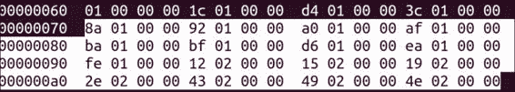

在前面的截图中，突出显示的值是之前引用的地址，或者来自`StringIDs`部分的值。如果您要抓取其中一个值，以正确的字符顺序读取它们，并向下跳过 DEX 文件到具有这个值偏移量的部分，您将会得到一个类似于下面截图的部分:


如您所见，由于文件格式的字符顺序，读取`00 00 01 8a`的采样值实际上指向 DEX 文件中的一个字符串。下面的截图向我们展示了在 DEX 文件中`0x018a`的偏移量:

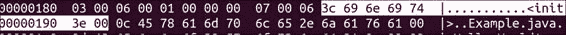

如您所见，位置`0x018a`包含值`3c 69 6e 69 74 3e 00`，它实际上是`<init>`的十六进制等价物。

这与编译器、反编译程序和达尔维克虚拟机在查找字符串值时所经历的过程基本相同。以下是`libdex`的代码摘录，它就是这么做的:

```java
DEX_INLINE const char* dexGetStringData(const DexFile* pDexFile,
  const DexStringId* pStringId) {
    const u1* ptr = pDexFile->baseAddr + pStringId->stringDataOff;

    // Skip the uleb128 length.
    while (*(ptr++) > 0x7f) /* empty */ ;

    return (const char*) ptr;
}
```

### 注

上述代码可在[https://github . com/Android/platform _ dal vik/blob/master/lib dex/DEXFIle . h](https://github.com/android/platform_dalvik/blob/master/libdex/DexFile.h)获得(第 614-622 行)。

前面的代码返回了一个指向 DEX 文件中字符串的指针，给定了一个表示 DEX 文件的结构(其定义在前面已经详细描述过)和一个由`DexStringId`结构表示的字符串的标识。代码只是取消引用文件的基址，并添加`stringId`值，如前所述，该值是 DEX 文件中字符串数据的偏移量。前面的代码可能遗漏了几点，例如，实际的文件数据如何与这段代码中发生的事情相关联，以及每个参数是如何准备的。正因为如此，我在这里包含了一段代码展示了如何解析参数以及如何使用文件数据。具体如下:

```java
void dexFileSetupBasicPointers(DexFile* pDexFile, const u1* data){
    DexHeader *pHeader = (DexHeader*) data;

    pDexFile->baseAddr = data;
    pDexFile->pHeader = pHeader;
    pDexFile->pStringIds = (const DexStringId*) (data + pHeader-      >stringIdsOff);
...some code has been omitted for brevity
}
```

### 注

上述代码可在[https://github . com/Android/platform _ dal vik/blob/master/lib dex/dexfile . CPP](https://github.com/android/platform_dalvik/blob/master/libdex/DexFile.cpp)获得(第 269-274 行)。

被称为`data`的指针取消引用的字符数组是 DEX 文件的实际内容。前面的代码片段应该非常有效地演示了如何使用每个`DexHeader`字段来查找 DEX 文件中的不同位置；代码的某些部分突出显示了这一点。

### 类型标识部分

接下来是`TypeIds`部分。本部分包含如何找到每种类型的字符串标签的信息。在我们进入这个工作之前，让我们看看`TypeIds`是如何定义的:

```java
struct DexTypeId {
  u4  descriptorIdx;      /* index into stringIds list for type descriptor */
};
```

### 注

上述代码可在[https://github . com/Android/platform _ dal vik/blob/master/lib dex/dexfile . h](https://github.com/android/platform_dalvik/blob/master/libdex/DexFile.h)获得(第 270-272 行)。

如注释所述，该值保存一个标识，或者更确切地说，`StringIds`部分中某个东西的索引，是所描述类型的字符串标签。下面是一个从`TypeIds`部分获取样本值(定义的第一个样本值)的示例:


该值如前所述，读作`03`。如前所述，我们需要尊重文件的字符顺序，这是`StringIds`部分中某个值的索引，具体来说，是`StringIds`部分中第四个定义的字符串标识。具体如下:


第四个定义的值是`0x01af`，它反过来在数据段中取消引用该偏移量:


在前面的截图中，我们可以看到值`LExample`，这可能看起来有点奇怪，因为我们明确地将我们的类定义为`Example`。`L`是什么意思？这个字符串实际上是根据达尔维克类型描述符语言对类型的描述，与 Java 的方法、类型和类签名非常相似。事实上，它的工作方式完全相同。Dalvik 的类型、方法和其他描述或签名的完整分类可在[http://source . Android . com/devices/tech/Dalvik/dex-format . html](http://source.android.com/devices/tech/dalvik/dex-format.html)上找到。在我们的例子中，类名前面的`L`值表示`Example`是一个类或者一个对象的描述名。当达尔维克编译器和虚拟机查找和构建类型时，它们遵循相同的基本过程。现在我们了解了这一部分的工作原理，我们可以进入下一部分，即`ProtoIds`部分。

### 原型部分

`ProtoIds`部分保存了用于描述方法的原型标识的集合；它们包含关于每个方法的返回类型和参数的信息。以下是您在`libdex`文件中看到的命令:

```java
struct DexProtoId {
  u4  shortyIdx;          /* index into stringIds for shorty descriptor */
  u4  returnTypeIdx;      /* index into typeIds list for return type */
  u4  parametersOff;      /* file offset to type_list for parameter types */
};
```

这个结构很容易理解。名为`shortyIdx`的无符号 4 字节字段保存了在`StringIds`部分定义的字符串标识的索引，该标识给出了原型的简短描述；该描述的工作方式与类型描述对达尔维克的工作方式几乎相同。`returnTypeIdx`，如果你没有猜到的话，在`TypeIds`部分有一个取消引用值的索引。这是返回类型的描述。最后，`parametersOff`保存该方法参数列表的地址偏移量。这是`Example.dex`的样品`ProtoIds`部分。这就是在我们的示例 DEX 文件中`ProtoIds`部分的样子:


### 字段编号部分

`FieldIds`部分，很像其他部分，由引用`StringIds`和`TypeIds`的字段集合组成，但专门用于描述类中的字段。以下是来自`libdex`的一个 DEX 文件的官方定义`FieldIds`:

```java
struct DexFieldId {
  u2  classIdx;           /* index into typeIds list for defining class */
  u2  typeIdx;            /* index into typeIds for field type */
  u4  nameIdx;            /* index into stringIds for field name */
};
```

### 注

上述代码可在[https://github . com/Android/platform _ dal vik/blob/master/lib dex/DEXFIle . h # L277](https://github.com/android/platform_dalvik/blob/master/libdex/DexFile.h#L277)获得。

我们在这里可以看到构成类型描述的三个字段，即它所属的类(由`classIdx`字段中的类 ID 标识)、字段的类型(`string`、`int`、`bool`等等，在`TypeId`中有详细说明，并从`typeIdx`变量中保存的值中取消引用)、和类型的名称，即根据我们前面讨论的规范定义的。与所有字符串值一样，该值存储在数据段中，并与存储在`nameIdx`中的值从`StringIds`段中取消引用。这是我们`FieldIds`部分的截图:


让我们进入下一个部分，也就是`MethodIds`部分。

### 方法部分

每个方法标识的字段为，定义如下:

```java
struct DexMethodId {
  u2  classIdx;           /* index into typeIds list for defining class */
  u2  protoIdx;           /* index into protoIds for method prototype */
  u4  nameIdx;            /* index into stringIds for method name */
};
```

### 注

上述代码可在[https://github . com/Android/platform _ dal vik/blob/master/lib dex/DEXFIle . h # L286](https://github.com/android/platform_dalvik/blob/master/libdex/DexFile.h#L286)获得。

方法所属的类由`classIdx`字段中存储的值取消引用。这与`TypeIds`部分的工作方式完全相同。此外，每个方法都有一个附加的原型引用。这存储在`protoIdx`变量中。最后，`nameIdx`变量存储对构成方法定义的字符的引用。以下是我们的`Example.dex`文件中的方法定义示例:

```java
([Ljava/lang/String;)V
```

理解前面定义的最好方法是从右向左读。将定义细分如下:

*   `V`:这表示一个空类型，是该方法的返回类型。
*   `()`:这表示方法参数将遵循哪个类型规范。
*   `java/lang/String;`:这是`String`类的标识符。这里，第一个也是唯一的参数是一个字符串。
*   `L`:表示这个字符后面的类型是类。
*   `[`:表示该字符后面的类型是指定类型的数组。

因此，将这些信息放在一起，该方法返回一个 void，并接受来自`String`类的对象数组。

下面是我们例子中`MethodIds`部分的截图:


### 分类定义部分

`ClassDefs`部分定义如下:

```java
struct DexClassDef {
  u4  classIdx;           /* index into typeIds for this class */
  u4  accessFlags;
  u4  superclassIdx;      /* index into typeIds for superclass */
  u4  interfacesOff;      /* file offset to DexTypeList */
  u4  sourceFileIdx;      /* index into stringIds for source file name */
  u4  annotationsOff;     /* file offset to annotations_directory_item */
  u4  classDataOff;       /* file offset to class_data_item */
  u4  staticValuesOff;    /* file offset to DexEncodedArray */
};
```

这些字段对于来说很容易理解，首先从`classIdx`字段开始，正如评论所建议的，它在`TypeIds`部分包含一个指示文件类型的索引。`AccessFlags`字段包含一个数字，指示其他对象如何访问该类，并描述了它的一些用途。以下是标志的定义方式:

```java
enum {
  ACC_PUBLIC       = 0x00000001,       // class, field, method, ic
  ACC_PRIVATE      = 0x00000002,       // field, method, ic
  ACC_PROTECTED    = 0x00000004,       // field, method, ic
  ACC_STATIC       = 0x00000008,       // field, method, ic
  ACC_FINAL        = 0x00000010,       // class, field, method, ic
  ACC_SYNCHRONIZED = 0x00000020,       // method (only allowed on natives)
  ACC_SUPER        = 0x00000020,       // class (not used in Dalvik)
  ACC_VOLATILE     = 0x00000040,       // field
  ACC_BRIDGE       = 0x00000040,       // method (1.5)
  ACC_TRANSIENT    = 0x00000080,       // field
  ACC_VARARGS      = 0x00000080,       // method (1.5)
  ACC_NATIVE       = 0x00000100,       // method
  ACC_INTERFACE    = 0x00000200,       // class, ic
  ACC_ABSTRACT     = 0x00000400,       // class, method, ic
  ACC_STRICT       = 0x00000800,       // method
  ACC_SYNTHETIC    = 0x00001000,       // field, method, ic
  ACC_ANNOTATION   = 0x00002000,       // class, ic (1.5)
  ACC_ENUM         = 0x00004000,       // class, field, ic (1.5)
  ACC_CONSTRUCTOR  = 0x00010000,       // method (Dalvik only)
  ACC_DECLARED_SYNCHRONIZED =
  0x00020000,       // method (Dalvik only)
  ACC_CLASS_MASK =
  (ACC_PUBLIC | ACC_FINAL | ACC_INTERFACE | ACC_ABSTRACT
  | ACC_SYNTHETIC | ACC_ANNOTATION | ACC_ENUM),
  ACC_INNER_CLASS_MASK =
  (ACC_CLASS_MASK | ACC_PRIVATE | ACC_PROTECTED | ACC_STATIC),
  ACC_FIELD_MASK =
  (ACC_PUBLIC | ACC_PRIVATE | ACC_PROTECTED | ACC_STATIC | ACC_FINAL
  | ACC_VOLATILE | ACC_TRANSIENT | ACC_SYNTHETIC | ACC_ENUM),
  ACC_METHOD_MASK =
  (ACC_PUBLIC | ACC_PRIVATE | ACC_PROTECTED | ACC_STATIC | ACC_FINAL
  | ACC_SYNCHRONIZED | ACC_BRIDGE | ACC_VARARGS | ACC_NATIVE
  | ACC_ABSTRACT | ACC_STRICT | ACC_SYNTHETIC | ACC_CONSTRUCTOR
  | ACC_DECLARED_SYNCHRONIZED),
};
```

`superClassIDx`字段也保存`TypeIds`部分中某个类型的索引，用于描述超类的类型。`SourceFileIDx`字段指向`StringIds`部分，允许达尔维克查找该类的实际来源。`classDef`结构的另一个重要字段是`classdataOff`字段，它指向达尔维克文件中的一个偏移量，该偏移量描述了类的一些更重要的属性，即代码在哪里以及有多少代码。`classDataOff`字段将指向保持以下结构之一的偏移:

```java
/* expanded form of class_data_item. Note: If a particular item is
 * absent (e.g., no static fields), then the corresponding pointer
 * is set to NULL. */
struct DexClassData {
  DexClassDataHeader header;
  DexField*          staticFields;
  DexField*          instanceFields;
  DexMethod*         directMethods;
  DexMethod*         virtualMethods;
};
```

`DexClassDataHeader`文件保存了一些关于类的元数据，即静态字段、实例字段、直接方法和虚拟方法的大小。达尔维克利用这些信息来计算重要的参数，这些参数决定了每个方法可以访问的内存大小，同时也是检查字节码所需信息的一部分。这里一组有趣的字段是`DexMethod` ，定义如下:

```java
struct DexMethod {
  u4 methodIdx;    /* index to a method_id_item */
  u4 accessFlags;
  u4 codeOff;      /* file offset to a code_item */
};
```

这个组保存对组成类的代码的实际引用。代码偏移量保存在`codeOff`字段；`methodId`和`accessFlags`场也是这个结构的一部分。

既然我们已经讨论了大多数东西是如何放在一个普通的 DEX 文件中的，我们可以继续用一些自动化工具来反编译它们。

## 做好准备

在我们开始反编译之前，您需要确保您已经设置了几个工具，即安卓软件开发工具包。

## 怎么做…

现在您已经理解了DEX 文件的格式和结构，您可以使用`dexdump`实用程序按照以下步骤对其进行反编译:

安卓软件开发工具包包括一个名为`dexdump`的工具，它保存在软件开发工具包的`sdk/build-tools/android-[version]/dexdump`文件夹下。要反编译一个 DEX 文件，你只需要把它作为一个参数传递给`dexdump`。你是这样做的:

```java
[SDK-path]/build-tools/android-[version]/dexdump classes.dex

```

这里，`[SDK-path]` 将是你的 SDK 的路径，`classes.dex`将是你想要解析的 DEX 文件。对于我们的示例，您将对我们在前面的一节中编译成 Java 代码的文件执行以下命令:

```java
[SDK-path]/build-tools/android-[version]/dexdump Example.dex

```

我们示例的输出如下所示:


## 还有更多...

安卓软件开发工具包有另一个名为`dx`的工具，它能够以一种更符合 DEX 文件格式的方式分解 DEX 文件。你很快就会明白为什么:


不幸的是，`dx`只对`CLASS`文件进行操作，并且通过将它们编译成 DEX 文件，然后执行指定的操作来工作。因此，如果您有一个想要处理的`CLASS`文件，您可以执行以下命令来查看相应的 DEX 文件的语义结构和内容:

```java
dx –dex –verbose-dump –dump-to=[output-file].txt [input-file].class

```

`dx`可以在安卓 SDK 包的`sdk/build-tools/android-[version]/`路径下找到:


对于我们的示例，即`Example.class`，输出如下所示:

```java
000000: 6465 780a 3033|magic: "dex\n035\0"
000006: 3500          |
000008: 3567 e33f     |checksum
00000c: b7ed dd99 5d35|signature
000012: 754f 9c54 0302|
000018: 62ea 0045 3d3d|
00001e: 4e48          |
000020: 1003 0000     |file_size:       00000310
000024: 7000 0000     |header_size:     00000070
000028: 7856 3412     |endian_tag:      12345678
00002c: 0000 0000     |link_size:       0
000030: 0000 0000     |link_off:        0
000034: 7002 0000     |map_off:         00000270
000038: 1000 0000     |string_ids_size: 00000010
00003c: 7000 0000     |string_ids_off:  00000070
000040: 0800 0000     |type_ids_size:   00000008
000044: b000 0000     |type_ids_off:    000000b0
000048: 0300 0000     |proto_ids_size:  00000003
00004c: d000 0000     |proto_ids_off:   000000d0
000050: 0100 0000     |field_ids_size:  00000001
000054: f400 0000     |field_ids_off:   000000f4
000058: 0400 0000     |method_ids_size: 00000004
00005c: fc00 0000     |method_ids_off:  000000fc
000060: 0100 0000     |class_defs_size: 00000001
000064: 1c01 0000     |class_defs_off:  0000011c
000068: d401 0000     |data_size:       000001d4
00006c: 3c01 0000     |data_off:        0000013c
                      |
                      |
```

输出左侧的列详细说明了文件偏移量及其十六进制内容。右侧的列保存语义值以及如何解释每个偏移量和值的细分。

请注意，为了简洁起见，一些输出被省略了；只包括了包含`DexHeader`文件中所有内容的部分。

## 另见

*   位于[http://www.retrodev.com/android/dexformat.html](http://www.retrodev.com/android/dexformat.html)的*索引文件格式-追溯开发*网页
*   [https://code.google.com/p/smali/](https://code.google.com/p/smali/)的 *Smali 反编译程序-谷歌代码*网页
*   *由*戈弗雷诺兰*反编译安卓*，阿普瑞斯
*   [上的*练习安全指数*文件](http://www.strazzere.com/papers/DexEducation-PracticingSafeDex.pdf)
*   [https://github . com/Android/platform _ Dalvik/tree/master/libdex](https://github.com/android/platform_dalvik/tree/master/libdex)的安卓 Dalvik 内核源代码库网页
*   位于[的*达尔维克可执行格式-安卓开源项目*文档](http://source.android.com/devices/tech/dalvik/dex-format.html)

# 解释达尔维克字节码

您现在可能已经知道，与 Java 虚拟机相比，Dalvik 虚拟机在结构和操作上略有不同；它的文件和指令格式是不同的。Java 虚拟机是基于堆栈的，这意味着字节码(代码格式是这样命名的，因为每个指令都有一个字节长)通过在堆栈上推送和弹出指令来工作。达尔维克字节码的设计类似于 x86 指令集；它还使用了某种 C 风格的调用约定。稍后，您将看到每个调用方法如何负责在调用另一个方法之前设置参数。有关达尔维克代码格式的设计和一般注意事项的更多详细信息，请参考*部分中名为*通用设计-达尔维克虚拟机字节码、安卓开源项目*的条目。*

解释字节码意味着实际上能够理解指令格式是如何工作的。本节专门为您提供理解达尔维克字节码所需的参考和工具。让我们深入字节码格式，了解它是如何工作的，以及它的全部含义。

## 理解达尔维克字节码

在进入字节码细节之前，建立一些上下文是很重要的。我们需要稍微了解一下字节码是如何执行的。这将有助于您理解 Dalvik 字节码的属性，并确定在给定的执行上下文中，知道什么是字节码和字节码意味着什么之间的区别，这是一项非常有价值的技能。

达尔维克机器一个接一个地执行方法，必要时在方法之间分支，例如，当一个方法调用另一个方法时。每个方法都可以被认为是达尔维克虚拟机执行的一个独立实例。每个方法都有一个名为**框架** 的私有内存空间，该空间刚好容纳方法执行所需的数据。每个帧还保存一个对 DEX 文件的引用；自然，该方法需要这个引用，以便引用类型标识和对象定义。它还保存对程序计数器实例的引用，程序计数器是一个控制执行流的寄存器，可用于分支到其他执行流。例如，在执行“if”语句时，该方法可能需要根据比较结果，在代码的不同部分之间跳转。框架还保存名为 **寄存器**的区域，用于执行诸如加、乘和移动值等操作，这有时可能意味着将参数传递给其他方法，如对象构造函数。

字节码由操作符和操作数的集合组成，每个操作符对提供给它的操作数执行特定的操作。一些操作符还总结了复杂的操作，例如调用方法。这些操作符的简单性和原子性是它们如此健壮、易于阅读和理解以及支持像 Java 这样的复杂高级语言的原因。

与所有中间代码表示一样，关于达尔维克需要注意的一件重要事情是达尔维克字节码的操作数顺序。操作的目标总是出现在相关操作符的源之前，例如，执行如下操作:

```java
move vA,vB
```

这意味着寄存器 B 的内容将被放置在寄存器 A 中。这个顺序的一个流行行话是“目的地-然后-源”；这意味着操作结果的目的地首先出现，然后是指定源的操作数。

操作数可以是寄存器，其中每个方法(独立执行的实例)都有一组寄存器。操作数也可以是文字值(指定大小的有符号/无符号整数)或给定类型的实例。对于字符串等非原语类型，字节码会取消引用`TypeIds`部分中定义的类型。

有许多指令格式规定了多少寄存器和多少类型实例可以用作给定操作码的参数。你可以在[上找到这些细节。阅读这些定义是非常值得的，因为 Dalvik 指令集中的每个操作码及其细节只是操作码格式之一的实现。尝试理解格式标识，因为它们在阅读指令格式时非常有用。](http://source.android.com/devices/tech/dalvik/instruction-formats.html)

在介绍了一些基础知识，并且相信您至少已经浏览了操作码和操作码格式之后，我们可以继续转而以一种使字节码具有可阅读语义的方式来转储一些字节码。

## 做好准备

在我们开始之前，您将需要 Smali 反编译程序，它被称为 baksmali。为了方便起见，我们现在将讨论如何设置路径变量，这样您就可以从机器上的任何地方使用 baksmali 脚本和 JAR 文件，而不必每次都引用它。以下是您的设置方式:

1.  在[https://code.google.com/p/smali/downloads/list](https://code.google.com/p/smali/downloads/list)或者从位于[https://bitbucket.org/JesusFreke/smali/download](https://bitbucket.org/JesusFreke/smali/download)的较新的存储库中获取 baksmali JAR 文件的副本。具体查看`baksmali[version].jar`文件，其中`[version]`是最新的可用版本。
2.  把它保存在一个方便命名的目录下，因为你需要下载的两个文件需要在同一个目录下，这样事情就简单多了。
3.  下载 baksmali 包装脚本；它允许您避免每次需要运行 baksmali JAR 时都显式调用`java –jar`命令。你可以在[的 https://code.google.com/p/smali/downloads/list](https://code.google.com/p/smali/downloads/list)或者在[的 https://bitbucket.org/JesusFreke/smali/downloads](https://bitbucket.org/JesusFreke/smali/downloads)从更新的存储库中获取一份脚本。将其保存在与 baksmali JAR 文件相同的目录中。这个步骤不适用于 Windows 用户，因为它是一个 bash 脚本文件。
4.  Change the name of the baksmali jar file to `baksmali.jar`, omitting the version number so that the wrapper script you've downloaded in step 2 will be able to find it. You can change the name using the following command on a Linux or Unix machine:

    ```java
    mv baksmali-[version-number].jar baksmali.jar

    ```

    您也可以使用操作系统使用的任何窗口管理器来实现这一点；只要你把名字改成`baksmali.jar`，你就做对了！

5.  然后您需要确保 baksmali 脚本是可执行的。如果您使用的是 Unix 或 Linux 操作系统，您可以通过发出以下命令来做到这一点:

    ```java
    chmod +x 700 baksmali

    ```

6.  Add, the current folder to your default `PATH` variable.

    你们都完了！您现在可以反编译 DEX 文件了！请参阅以下部分，了解如何操作。

## 怎么做...

那么，您已经下载并设置好了 baksmali，并且您想要将一些 DEX 文件反编译成 smali 的漂亮语义语法；以下是你如何做到这一点。

从终端或命令提示符执行以下命令:

```java
baksmali [Dex filename].dex

```

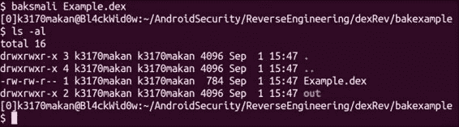

这个命令将输出 DEX 文件的内容，就好像它是一个膨胀的 JAR 文件，但是不是类文件的，所有的源文件将是`.smali`文件，包含语义 Dalvik 字节码的轻微翻译或方言，称为 smali:

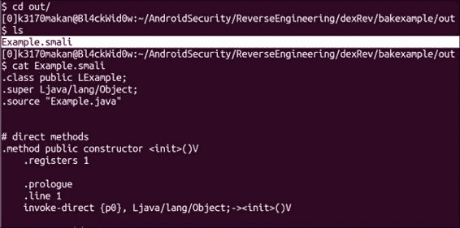

让我们来看看 baksmali 生成的 smali 文件，看看每个字节码指令意味着什么。代码如下:

```java
.class public LExample;
.super Ljava/lang/Object;
.source "Example.java"

# direct methods
.method public constructor <init>()V
    .registers 1

    .prologue
    .line 1
    invoke-direct {p0}, Ljava/lang/Object;-><init>()V

    return-void
.end method

.method public static main([Ljava/lang/String;)V
    .registers 4

    .prologue
    .line 3
    sget-object v0, Ljava/lang/System;->out:Ljava/io/PrintStream;

    const-string v1, "Hello World!\n"

    const/4 v2, 0x0

    new-array v2, v2, [Ljava/lang/Object;

    invoke-virtual {v0, v1, v2}, Ljava/io/PrintStream;->printf(Ljava/lang/String;[Ljava/lang/Object;)Ljava/io/PrintStream;

    .line 4
    return-void
.end method
```

请注意，因为 baksmali、Android Dalvik VM 和 Java 语言都在不断改进，所以您可能会看到与前面的代码示例略有不同的结果。如果你这样做了，不要惊慌；前面的示例代码只是一个示例，供您学习。您仍然可以将本章中的信息应用于 baksmali 生成的代码，其前几行如下:

```java
.class public LExample;
.super Ljava/lang/Object;
.source "Example.java"
```

这些只是正在反编译的实际类的一些元数据；它们提到类名、源文件和超级类(这个方法继承的类)。你可能会从`Example.java`的代码中注意到，我们从来没有从另一个类显式继承，尽管当反编译时，`Example.java`似乎有一个父类:这怎么可能？嗯，因为所有的 Java 类都隐式继承自`java.lang.Object`。

继续，接下来的几行更有趣。它们是`Example.java`构造器的 smali 代码:

```java
# direct methods
.method public constructor <init>()V
    .registers 1

    .prologue
    .line 1
    invoke-direct {p0}, Ljava/lang/Object;-><init>()V

    return-void
.end method
```

第一行`.method public constructor <init>()V`，是要遵循的方法的声明。它说调用`init`的方法返回一个 void 类型，并且有公共访问标志。

包含这段代码的下一行，即:

```java
.registers 1
```

说这个方法只使用一个寄存器。该方法知道这一点，因为它需要的寄存器数量是在运行之前决定的。我很快会提到它需要的一个寄存器。下面是一行代码:

```java
.prologue
```

这声明方法`prologue`跟随，这是每个 Java 方法都有的。它确保调用方法的继承形式(如果有)。这解释了为什么包含以下代码的下一行似乎调用了另一个名为`init`的方法:

```java
invoke-direct {p0}, Ljava/lang/Object;-><init>()V
```

但这次它从`java.lang.Object`类中取消了引用。这里的`invoke-direct`方法接受两个参数:`p0`寄存器和对需要在这里调用的方法的引用。这由`Ljava/lang/Object;-><init>()V`标签指示。`invoke-direct`操作码的描述如下:

“`invoke-direct`用于调用非静态直接方法(本质上不可重写的实例方法，或者是`private`实例方法，或者是构造函数)。”

### 注

摘录见[http://source . Android . com/devices/tech/dal vik/dal vik-byte code . html](http://source.android.com/devices/tech/dalvik/dalvik-bytecode.html)。

总之，它所做的就是调用一个非静态的直接方法，也就是`java.lang.Object`类的构造函数。

让我们进入 smali 代码的下一行:

```java
return-void
```

它完全按照看起来的那样做，即返回一个`void`类型，并退出当前方法，将执行流程返回给调用它的任何方法。

根据官方网站，这个操作码的定义是“从无效方法返回”

没什么复杂的。下一行，与以句点(")开头的其他行一样)字符是一段元数据，或者是 smali 反编译程序添加的脚注，用来帮助添加一些关于代码的语义信息。`.end`方法线标志着该方法的结束。

主方法的代码如下。在这里，您将看到一些反复出现的代码形式，即当参数被传递给方法时以及当它们被调用时生成的代码。由于 Java 是面向对象的，当您的代码调用另一个对象的方法时，您所做的很多事情就是传递参数并从一种对象类型转换到另一种对象类型。因此，一个好主意是通过反编译一些对 smali 代码执行这种操作的 Java 代码来学习识别这种情况何时发生。主方法的代码如下:

```java
.method public static main([Ljava/lang/String;)V
    .registers 4

    .prologue
    .line 3
    sget-object v0, Ljava/lang/System;->out:Ljava/io/PrintStream;

    const-string v1, "Hello World!\n"

    const/4 v2, 0x0

    new-array v2, v2, [Ljava/lang/Object;

    invoke-virtual {v0, v1, v2}, Ljava/io/PrintStream;->printf(Ljava/lang/String;[Ljava/lang/Object;)Ljava/io/PrintStream;

    .line 4
    return-void
.end method
```

根据第一行`.method public static main([Ljava/lang/String;)V`，该方法接受类型为`java.lang.String`的数组，并返回一个 void，如下所示:

```java
([Ljava/lang/String;)V
```

继续讨论方法名，它还说主方法是静态的，并且有公共访问标志。

在方法头之后，我们看到下面这段代码，它显示一个`sget-object`操作正在形成:

```java
sget-object v0, Ljava/lang/System;->out:Ljava/io/PrintStream;
```

根据官方网站，此操作码的描述是“使用识别的静态字段执行识别的对象静态字段操作，加载或存储到值寄存器中。”

根据官方的文件，`sget-object`操作接受两个参数:

*   达尔维克将用来存储操作结果的寄存器
*   要存储在所述寄存器中的对象引用

因此，这实际上是获取一个对象的实例并将其存储在寄存器中。这里，这个寄存器是第一个被称为`v0`的寄存器。下一行如下所示:

```java
const-string v1, "Hello World!\n"
```

前面的代码显示了`const-string`指令的作用。它所做的是获取一个字符串，并将其保存在第一个参数指示的寄存器中。这个寄存器是主方法框架中的第二个寄存器，叫做`v1`。根据官方网站，`const-string`操作码的定义是“将对给定索引指定的字符串的引用移动到指定的寄存器中。”

如果不够明显，这里取的字符串是“Hello World\n”。

继续，下一行也是`const`操作码族的一部分，在这里用来将`0`值移入名为`v2`的第三个寄存器:

```java
const/4 v2, 0x0
```

这可能看起来有点随机，但在下一行中，您将看到为什么它需要`v2`寄存器中的`0`值。下一行的代码如下:

```java
new-array v2, v2, [Ljava/lang/Object;
```

新数组的作用是构造一个给定类型和大小的数组，并将其保存在左边的第一个寄存器中。这里这个寄存器是`v2`，所以在这个操作码被执行之后，`v2`将保存一个类型为`java.lang.Object`的数组，其大小为`0`；这是操作码第二个参数中`v2`寄存器的值。这也使得在执行该操作码之前将`0`值移入`v2`的先前操作变得清晰。根据官方网站，这个操作码的定义是“构建一个指定类型和大小的新数组。该类型必须是数组类型。

下一行包含一个非常常见的操作码；确保你知道这个操作码家族是如何工作的，因为你会看到很多。继续，下一行如下:

```java
invoke-virtual {v0, v1, v2}, Ljava/io/PrintStream;->printf(Ljava/lang/String;[Ljava/lang/Object;)Ljava/io/PrintStream;
```

官网对`invoke-virtual`操作码的定义是“`invoke-virtual`用于调用正常的虚方法(不是`private`、`static`或`final`的方法，也不是构造函数)。”

`invoke-virtual`方法的论据如下:

```java
invoke-kind {vC, vD, vE, vF, vG}, meth@BBBB
```

其中`vC`、`vD`、`vE`、`vF`和`vG`是参数寄存器，用于将参数传递给被调用的方法，该方法由最后一个参数`meth@BBBB`取消引用。这意味着它接受 16 位方法引用，因为每个`B`字段指示一个大小为 4 位的字段。总之，这个操作码在我们的`Example.smali`代码中的作用是调用一个名为`java.io.PrintStream.printf`的方法，该方法接受一个`java.lang.Object`类型的数组和一个`java.lang.String`对象，并返回一个`java.io.PrintStream`类型的对象。

就这样！你刚刚解释了一些小代码。习惯阅读 smali 代码需要一点练习。如果您想了解更多，请查看*部分的参考资料。*

## 另见

*   位于[的*通用设计-达尔维克虚拟机*安卓开源项目的字节码](http://source.android.com/devices/tech/dalvik/dalvik-bytecode.html)
*   *简介及概述-达尔维克指令格式*安卓开源项目位于
*   位于[的【达尔维克虚拟机和类路径库】文档的*分析*](http://imsciences.edu.pk/serg/wp-content/uploads/2009/07/Analysis-of-Dalvik-VM.pdf)

# 将 DEX 反编译成 Java

众所周知，DEX 代码是从 Java 编译而来的，这是一种非常语义化、易于阅读的语言，我相信你们中的一些人现在已经在想，是否有可能将 DEX 代码反编译回 Java？好消息是，这当然是可能的，这取决于您使用的反编译程序的质量和 DEX 代码的复杂性。这是因为除非你理解 DEX 代码实际上是如何工作的，否则你将永远受你的 DEX 反编译程序的支配。有很多方法可以挫败流行的反编译程序，比如反射和非标准的 DEX 操作码变体，所以如果你希望这个食谱意味着即使你不能阅读 DEX 代码，你也可以称自己为安卓逆向工程师，那你就错了！

也就是说，安卓应用中的大多数 DEX 代码都是标准的，反编译程序，比如我们将要使用的反编译程序，可以处理一个普通的 DEX 文件。

## 做好准备

在我们开始之前，您需要从互联网上获取一些工具。

*   **Dex2Jar** :这是从 APK 文件中抓取 Dex 文件，输出包含对应类文件的 Jar 的工具；你可以在[http://code.google.com/p/dex2jar/](http://code.google.com/p/dex2jar/)买到这个。访问此网址并下载适合您的操作系统的版本。
*   **JD-GUI** :这是一个 Java 类文件反编译程序；你可以在[http://jd.benow.ca/](http://jd.benow.ca/)买到这个。它支持 Linux、Mac 和 Windows。

## 怎么做...

要将示例 DEX 文件反编译成一些 Java 代码，您需要执行以下步骤:

1.  Let's assume we are starting from either an APK or DEX file. In that case, you would start out by interpreting the DEX files into the Java `CLASS` files. Here's how you do that with `Dex2jar`:

    ```java
    dex2jar [Dex file].dex

    ```

    或者，对于我们的运行示例，您将执行以下语句:

    ```java
    dex2jar Example.dex

    ```

    输出应该如下图所示:

    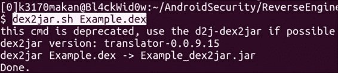

    如果您正确执行了此操作，您的工作或当前目录中应该有一个名为`Example_dex2jar.jar`的文件:

    

2.  So now that we have our class files, we need to work them back into the Java code. `JD-GUI` is the tool that we will be using to sort this out. To launch `JD-GUI`, all you need to do is execute the `JD-GUI` executable that comes with the `JD-GUI` tool. Here's how you do it from Linux; execute the following command from your terminal:

    ```java
    jd-gui

    ```

    它应该会生成一个如下图所示的窗口:

    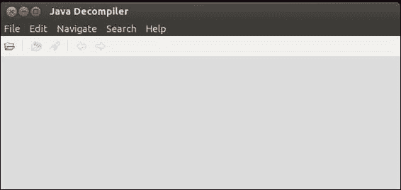

3.  Once this window shows up, you can open a class file by clicking on the folder icon; the following file selection dialog box should show up:

    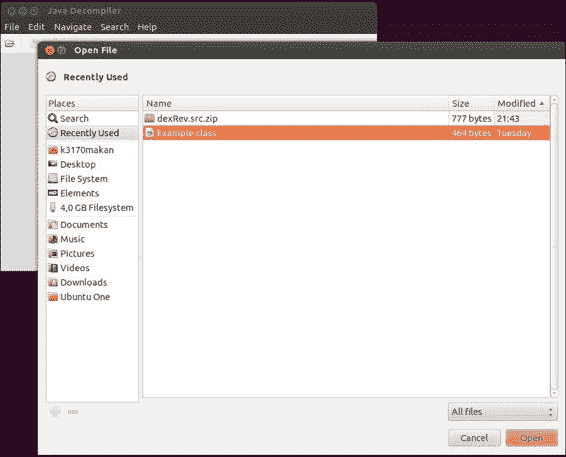

    一旦这个对话框打开，你应该导航到我们从`Example.dex`文件解析的`Example.class`文件的路径。如果您设法找到它，`JD-GUI`将显示如下代码:

    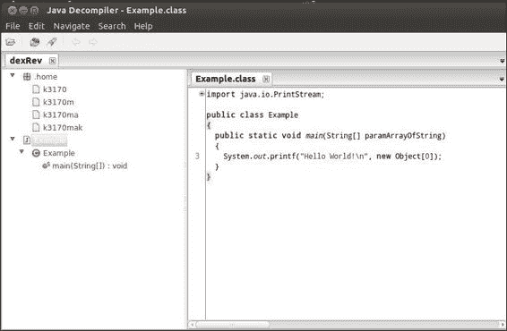

4.  You can use `JD-GUI` to save the source files; all you need to do is click on the **File** menu on the toolbar, select **Save All Sources**, and then provide a directory to save it in:

    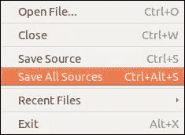

# 反编译应用的本机库

安卓原生库非常容易反编译；它们毕竟只是 C/C++目标文件和从 ARM 平台编译的二进制文件。因此，对它们进行反编译就像找到一个反编译程序一样简单，就像“一直流行的”【Linux 反编译程序一样，可以容纳 ARM 二进制文件，事实证明，安卓 NDK 已经为我们解决了这个问题。

在我们进入这个过程的细节之前，你需要确保你有合适的工具。

## 做好准备

为这个食谱做准备就像确保你有一个新的安卓 NDK 软件包一样简单；你可以在[http://developer.android.com/tools/sdk/ndk/index.html](http://developer.android.com/tools/sdk/ndk/index.html)买到一份。

## 怎么做...

对原生库进行反编译就像调用安卓 NDK 工具链提供的工具之一`objdump`一样简单；它已经被预构建为包括所有允许`objdump`解释特定于 ARM 二进制文件的字符顺序和代码结构的插件。

要反编译安卓本机库，您需要从终端或命令提示符执行以下命令:

```java
arm-linux-androideabi-objdump –D [native library].so

```

这里有一个例子:


其中`arm-linux-androideabi-objdump`位于安卓 NDK 的`toolchains/arm-linux-androideabi-[version]/prebuilt/[arch]/bin/`文件夹下，`[arch]`将是与你的机器相关的架构或构建版本。在这个例子中，我使用的是一台 Linux x86_64 机器。

要利用`objdump`输出中的信息，需要了解 ARM 平台的操作码格式和指令，以及一点关于 ELF 格式的知识。我在*部分包含了一些后续的参考资料，包括一个名为“筛”的安卓应用的链接，该程序用于演示本食谱中使用的一些命令。*

## 另见

*   ARM 架构文档的 *ELF，位于*
*   [http://www.atmel.cimg/DDI0029G_7TDMI_R3_trm.pdf](http://www.atmel.cimg/DDI0029G_7TDMI_R3_trm.pdf)的 *ARM7TDMI 技术参考手册*文件
*   位于[的 *ARM 处理器架构*网页](http://www.arm.com/products/processors/instruction-set-architectures/index.php)
*   *工具接口标准(TIS)可执行和链接格式(ELF)规范 1.2 版*文件可在[http://refspecs.linuxbase.org/elf/elf.pdf](http://refspecs.linuxbase.org/elf/elf.pdf)获得
*   *screen*–一款密码管理器应用，展示了一些常见的安卓漏洞，网址为[https://www . mwrinfosecurity . com/system/assets/380/original/screen . apk](https://www.mwrinfosecurity.com/system/assets/380/original/sieve.apk)

# 使用 GDB 服务器调试安卓进程

大多数内存损坏、缓冲区溢出和恶意软件分析专家每天都在通过类似 GDB 的工具调试进程。检查内存并对应用流程进行动态分析是任何逆向工程的基础，无论您关注的是什么平台；这其中，当然包括安卓。下面的食谱向您展示了如何使用 GDB 调试运行在安卓设备上的进程。

## 做好准备

为了完成这个食谱，你需要抓住以下几点:

*   安卓 NDK 套装在[http://developer.android.com/tools/sdk/ndk/index.html](http://developer.android.com/tools/sdk/ndk/index.html)提供
*   安卓软件开发工具包

## 怎么做...

要使用`gdbserver`调试实时安卓进程，您需要执行以下步骤:

1.  The first step is to make sure that you either have a rooted Android device or an up-and-running emulator. I'm not going to detail the entire process of setting up an emulator here, but if you're not clear on the details of getting an emulated Android device up and running, refer to the *Inspecting application certificates and signatures* recipe in [Chapter 2](2.html#page "Chapter 2. Engaging with Application Security"), *Engaging with Application Security*. If you're already aware of how to create an emulated Android device, you can launch it using the following command:

    ```java
    [SDK-path]/sdk/tools/emulator –no-boot-anim –memory 128 –partition-size 512

    ```

    

2.  Once the emulator or target device is up and running, you should access the device using an ADB shell. You can do this by executing the following command:

    ```java
    abd shell

    ```

    您还需要确保您拥有根权限。默认情况下，仿真器授予根权限，但是，如果您在实际的设备上这样做，您可能需要首先执行`su`替换用户命令。

3.  You then need to mount the system directory as read-write so that we can pop a copy of `gdbserver` into it. Here's how you remount the directory, while in your adb shell, execute the following command:

    ```java
    mount

    ```

    

    这应该会输出一些关于每个块设备安装位置的信息；我们对`/system`目录感兴趣。请注意在提及`/system`的行中打印的`/dev/`路径。在前面的例子中，名为`/dev/block/mtdblock0`的设备安装在`/system`上。

4.  Remount the directory using the following command:

    ```java
    mount –o rw,remount [device] /system

    ```

    

5.  You're now ready to pop a copy of the `gdbserver` into the device. Here's how you do this from your non-Android machine:

    ```java
    adb push [NDK-path]/prebuilt/android-arm/gdbserver/gdbserver /system/bin

    ```

    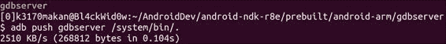

6.  Once `gdbserver` is on the target device, you can launch it by attaching it to a running process; but before you can do that, you'll need to grab a sample **Process ID** (**PID**). You can do that by launching the `ps` command on the target device in the following manner:

    ```java
    ps

    ```

    `ps`命令将列出当前运行进程的信息汇总；我们对当前正在运行的进程之一的 PID 感兴趣。下面是我们正在运行的模拟器的`ps`命令输出示例:

    

    在上图截图中，可以看到第二列标题为`PID`；这就是你要找的信息。这里以日历为例，其 PID 为`766`:

    

7.  Once you have a valid PID, you can use `gdbserver` to attach to it by executing the following command:

    ```java
    gdbserver :[tcp-port number] –-attach [PID]

    ```

    其中`[tcp-port number]`是您希望允许连接的 TCP 端口的编号，而 PID 当然是您在上一步中获取的 PID 编号。如果操作正确，`gdbserver`应产生以下输出:

    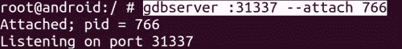

8.  Once `gdbserver` is up and running, you need to ensure that you forward the TCP port number from the target Android device so that you can connect to it from your machine. You can do this by executing the following command:

    ```java
    adb forward tcp:[device port-number] tcp:[local port-number]

    ```

    以下是示例中的`adb`端口转发:

    

9.  You should then launch the prebuild `gdb`, which is found under the path `android-ndk-r8e/toolchains/arm-linux-androideabi-[version]/prebuilt/linux-x86_64/bin/`, on your Linux machine. You launch it by running the following command once inside the aforementioned NDK path:

    ```java
    arm-linux-androideabi-gdb

    ```

    下面是它是如何推出的截图:

    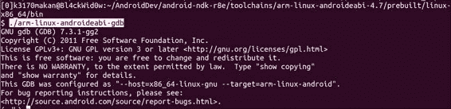

10.  Once `gdb` is up and running, you should try to connect it to the `gdb` instance running the target device by issuing the following command from within the `gdb` command prompt:

    ```java
    target remote :[PID]

    ```

    其中`[PID]`是您在步骤 8 中使用`adb`转发的本地 TCP 端口号。这是一张截图:

    

    就这样！你可以与安卓设备上运行的进程的内存段和寄存器进行交互！