# 第八章。本土开发与分析

在本章中，我们将介绍以下食谱:

*   检查文件权限
*   交叉编译本机可执行文件
*   利用种族条件漏洞
*   利用堆栈内存损坏
*   自动原生安卓模糊化

# 简介

到目前为止，我们已经涵盖了安卓平台上应用程序的大部分高级方面；本章重点介绍一些原生方面，即支持应用层组件的所有方面。本机方面包括系统守护程序、二进制可执行文件(专门为系统体系结构编译)以及文件系统和设备级配置的组件。安卓系统的任何这些方面都可能导致安全漏洞，并使安卓设备(尤其是智能手机)上的权限升级成为可能，因此在对安卓系统进行全面的安全审查时，这些方面都是不可忽视的。

本章还介绍了如何发现一些基本的内存损坏漏洞。但是，请注意，本章没有涵盖所有已知的内存利用风格和技术。但是所涵盖的内容足以让您学会如何独立实现大多数其他功能。这一章也包括好的文章和其他技术的信息来源，给那些想一路深入兔子洞的人。

为什么要研究本土开发技术？那你还会怎么根你的手机呢？Root 漏洞通常通过滥用安卓设备中基于本机的漏洞来工作，这些漏洞允许权限升级到足以允许对安卓设备上的 root(或超级用户)帐户的持久访问。自然，这些可能会呈现为一个不受约束的定制安卓设备的网关，但它们也为恶意软件和远程攻击者打开了大门；不难看出，为什么允许某人在你的手机上获得超级用户权限的漏洞是个坏主意！因此，任何值得信任的移动安全审计员都应该能够识别任何可能导致此类利用的潜在漏洞。

# 检查文件权限

在本地环境中升级权限最常被利用的方法之一是滥用操作系统中文件系统权限(或访问权限)设置方式的差异和不足。滥用文件权限的漏洞和权限提升攻击方法的例子数不胜数，无论是全局可执行的易受攻击二进制文件(如`su`或`symlink`)上的`setuid`标志，还是超级用户拥有的应用程序可全局读取和写入的文件上的竞争条件攻击；例如，脉冲音频 CVE-2009-1894。

能够清楚地识别文件系统呈现的任何潜在入口点是开始定义安卓原生攻击面的好地方。本节中的演练详细介绍了一些方法，您可以使用这些方法来查找危险或潜在的文件，这些文件在通过 ADB shell 与设备交互时可能会被利用。

鉴于以下教程侧重于详细介绍查找权限不足或不一致的文件的方法，要理解为什么执行某些命令，您需要的一项基本技能是理解基于 Linux 或 Unix 的操作系统如何定义文件权限。一个简短的附带说明:在一些 Linux 圈子里，把文件和目录权限说成是访问权限是很常见的；这里，这些术语将互换使用。

基于 Linux 或 Unix 的操作系统的文件权限是根据以下内容定义的:

*   文件中不属于其他用户类别的可能用户(缩写为`o`)
*   文件的所有者(缩写为`u`)
*   对文件所有者所属的用户组实施的访问控制(缩写为`g`)

以这种方式对用户进行分类允许相互排斥，使用户能够微调谁有权访问该文件。这意味着可以对文件和每个可能的用户进行访问权限的指定。

对于用户(组、其他用户和所有者)的每个集合，定义了访问控制的五个属性，即:

*   文件的读取能力(**r**)；谁被允许实际读取文件的内容。
*   文件的写入能力(**w**)；这个控制谁被允许增加或修改文件的内容。
*   文件的执行能力(**×**)；给定的用户集合是否被允许执行文件的指令。
*   设定组标识能力(**s**)；文件应该是可执行的；这定义了如何根据用户的组权限来增加用户的权限。此权限可能允许低特权用户提升其特权以执行某些任务；例如，替换一个用户，该用户将任何用户的权限升级到 root 用户或其希望的任何用户，当然前提是身份验证成功！
*   设置用户标识能力(**s**)；这决定了文件所有者的用户标识，以及随之而来的所有访问权限，是否可以传输到执行进程。

每一个都是根据助记符(使用缩写)或以八进制格式编码的文字位值来定义的。对于第一次使用的人来说，这可能是一个令人困惑的描述，这就是为什么这一部分包括一个定义二进制和八进制(以 8 为基数的数字)值的小表。

为什么是 8 号基地？嗯，因为二进制的基数 8 允许有三个位的空间，每个位描述每个属性的布尔值；`1`为开(或真)`0`为关(或假):

<colgroup class="calibre19"><col class="calibre20"> <col class="calibre20"> <col class="calibre20"></colgroup> 
| 

描述

 | 

二进制值

 | 

十进制值

 |
| --- | --- | --- |
| 阅读 | One hundred | four |
| 写 | 010 | Two |
| 执行 | 001 | one |

这些通过将二进制值相加而结合。下面的表格描述了这一点:

<colgroup class="calibre19"><col class="calibre20"> <col class="calibre20"> <col class="calibre20"> <col class="calibre20"> <col class="calibre20"> <col class="calibre20"> <col class="calibre20"></colgroup> 
| 

描述

 | 

阅读

 | 

写

 | 

执行

 |
| --- | --- | --- | --- |
| 阅读 | One hundred | four | One hundred and ten | six | One hundred and one | five |
| 写 |   | 010 | Two | 011 | three |
| 执行 |   | 001 | one |

这些是为每个用户集合指定的；这意味着每个用户的权限也有一位，因为有三个集合，即文件所有者、组和其他用户——通常称为“世界”。许可位还包括用于定义`setuid`、`setguid`的额外位和 **粘性**位。

粘性位是一种访问权限，只允许文件或目录的所有者删除或重命名文件或目录。当指定时，它在由`ls`命令显示的访问权位中显示为`T`符号。

结构如下所示:

<colgroup class="calibre19"><col class="calibre20"> <col class="calibre20"> <col class="calibre20"> <col class="calibre20"> <col class="calibre20"> <col class="calibre20"> <col class="calibre20"> <col class="calibre20"> <col class="calibre20"></colgroup> 
| 

物主

 | 

组

 | 

其他的

 |
| --- | --- | --- |
| r | w | x | r | w | x | r | w | x |

就文件访问权限的基础而言，差不多就是这样了；如果你仔细阅读了前面的段落，你应该有足够的时间来发现安卓原生访问权限方面最根本的缺陷。

为了正确理解供应商添加到设备构建中的差异，您需要稍微了解一下“默认”或标准安卓文件系统的结构和访问权限设置。

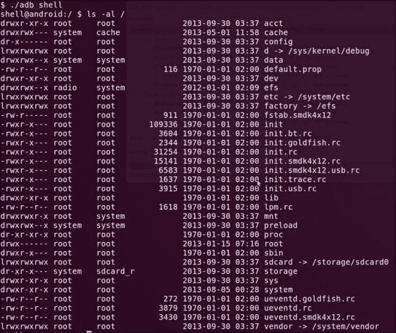

根据 Linux 文件系统层次标准和果冻豆上的`init.rc`脚本，这里总结了默认的或标准文件系统文件夹及其用途。其他平台的`init.rc`脚本参考见下一个教程检查系统配置的*部分。*

<colgroup class="calibre19"><col class="calibre20"> <col class="calibre20"></colgroup> 
| 

文件夹

 | 

目的

 |
| --- | --- |
| `/acct` | `cgroup`挂载点 CPU 资源的核算和监控 |
| `/cache` | 用于正在进行的下载的临时存储，也用于不重要的数据 |
| `/data` | 包含应用程序和其他特定于应用程序的存储的目录 |
| `/dev` | 设备节点，就像在经典的 Linux 系统中一样，虽然没有被大量用于设备和硬件驱动程序访问 |
| `/etc` | 到`/system/etc/`的符号链接包含配置脚本，其中一些在引导过程中启动时启动 |
| `/mnt` | 一个临时挂载点，类似于许多其他传统的 Linux 系统 |
| `/proc` | 包含关于进程的数据结构和信息，就像传统的基于 Linux 或 Unix 的系统一样 |
| `/root` | 通常是一个空目录，但类似于许多 Linux/Unix 系统上的根用户主目录 |
| `/sbin` | 包含用于系统管理任务的重要实用程序的文件夹 |
| `/sdcard` | 外部 SD 卡的安装点 |
| `/sys` | `sysfs`的挂载点，保存导出的内核数据结构 |
| `/system` | 不可变(只读)系统构建过程中生成的二进制文件和脚本；在许多安卓系统上，这也适用于系统拥有的应用程序 |
| `/vendor` | 为特定于供应商的设备扩展预留的目录，包括二进制文件、应用程序和配置脚本 |
| `/init` | 内核加载后在引导过程中执行的`init`二进制文件 |
| `/init.rc` | `init`二进制的配置脚本 |
| `/init[device_name].rc` | 特定于设备的配置脚本 |
| `/ueventd.rc` | `uevent`守护程序配置脚本 |
| `/uevent[device_name].rc` | `uevent`守护程序的设备特定配置脚本 |
| `/default.prop` | 包含系统全局属性(包括设备名称)的配置文件 |
| `/config` | `configfs`的安装点 |
| `/storage` | 4.1 及更高版本设备的添加目录；用作外部存储的挂载点 |
| `/charger` | 显示电池充电进度的本机独立应用程序 |

请记住，设备的供应商版本可能不同；将这些作为最基本的、未触及的文件系统布局和目的。通常情况下，供应商在使用这些文件路径时也会犯错误，这违背了他们的预期目的，所以要注意这些文件夹的目的和默认访问权限。

本节没有详细介绍文件系统布局；然而，在*部分中有一些关于安卓和 Linux 文件系统的语义、布局和约定的好的来源。*

让我们看看如何在安卓系统上寻找有趣的基于文件或目录的目标。以下演练假设您对正在评估的设备拥有 ADB shell 权限。

## 做好准备

为了使用下面例子中提到的命令，你需要能够安装`find`二进制或者安卓版的 Busybox 安装说明可以在【http://www.busybox.net/】的[和本章末尾的【自动原生安卓模糊化】配方的*设置 Busybox* 部分找到。](http://www.busybox.net/)

## 怎么做...

要根据文件的访问权限搜索文件，您可以通过在 ADB shell 中执行以下命令来找到可读文件的列表；首先，对于世界可读，这个命令的作用是:

```java
find [path-to-search] –perm  0444 –exec ls –al {} \;

```

示例输出见下面的截图:


上一张截图——以及本节随后的截图——来自一个根深蒂固的三星 Galaxy S3。这里，命令行指令包括一个到`/dev/null`的重定向，以便省略由拒绝许可引起的错误输出。

### 类型

**只是对非 Linux/Unix 用户的一点警告**

`/dev/null`就像是一种输出的“黑洞”，允许 Linux/Unix 用户将它作为一个放置他们不感兴趣的输出的地方。作为一个额外的好处，它还返回一个值，让您知道写操作是否成功。

继续，如果您正在寻找世界可写文件，您可以使用以下参数找到它们:

```java
find [path-to-search] –perm  0222 –exec ls –al {} \;

```

示例输出见下面的截图:


对于为所有用户设置了可执行权限的文件:

```java
find [path-to-search] –perm  0111 –exec ls –al {} \;

```

没有明确要求您使用八进制格式；`find`命令还理解了用户集合和权限的流行缩写。

例如，要查找所有者组之外的所有人都可读的文件，您可以这样指定权限:

```java
find [path-to-search] –perm  a=r –exec ls –al {} \;

```

示例输出见下面的截图:


以前的规格将仅确保精确匹配；这意味着返回的文件必须只有指定的位。如果您正在查找至少设置了指定位和任何其他位的文件(您可能会经常这样做)，您可以像前面的示例一样，通过包含一个`-`符号作为前缀来指定权限。对于八进制模式，其工作原理如下:

```java
find [path-to-search] –perm  -444 –exec ls –al {} \;

```

示例输出见下面的截图:


这将至少匹配为所有用户集合设置了读取位的文件，这意味着将匹配 445、566、777 等权限位。而 344、424、222 等等将不会匹配。

您可能会感兴趣的几个真正有用的访问权限模式包括查找带有`setuid`的可执行文件:

```java
find [path-to-search] –perm  -4111 –exec ls –al {} \;

```

示例输出见下面的截图:


在前面的截图中，我们看到`su`二进制是使用前面的命令找到的。如果你在安卓设备上找到这个二进制文件，它总是一个很强的迹象，表明这个设备已经扎根。

还可以找到带有`setguid`的文件，并对所有文件执行权限:

```java
find [path-to-search] –perm  -2111 –exec ls –al {} \;

```

示例输出见下面的截图:

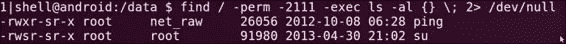

`find`命令还允许您指定用户作为搜索条件的一部分；例如:

*   您可以列出属于根用户的所有文件，如下所示:

    ```java
    find [path-to-search] –user 0 –exec ls –al {} \;

    ```

*   您可以为系统用户列出所有文件如下:

    ```java
    find [path-to-search] –user 1000 –exec ls –al {} \;

    ```

*   您也可以根据组标识设置列出文件，如下所示:

    ```java
    find [path-to-search] –group 0 –exec ls –al {} \;

    ```

您可能希望了解您的安卓系统上的每个用户(或者更确切地说，应用程序)可以访问多少内容，为此，您可能希望建立一个用户标识列表，或者更重要的是，应用程序的用户标识列表。最简单的方法是转储`/data/data`目录中文件的访问权限，因为它包含安卓设备上安装的大多数应用程序的数据。但是，为了从 ADB shell 访问此列表，您需要访问根或系统帐户或任何具有同等权限的帐户；这在模拟器上很容易获得——它是自动授予的。或者，如果你选择这样做，你可以在 XDA 开发者网站上搜索几次，寻找一种方法来找到你的手机。XDA 开发商的网站可在[http://www.xda-developers.com/](http://www.xda-developers.com/)找到。

在手机上生根有好有坏；在这种情况下，它允许您更详细地检查文件系统和访问权限。但是，另一方面，如果对 root 权限的访问没有得到适当的管理，它可能会使您的手机遭受许多极具破坏性的攻击！所以要吝啬你的根权限，只在手机需要根的时候临时根手机。

继续，如果列出`/data/data`目录下的所有文件，应该会看到如下内容；这是从三星 Galaxy S3 拍摄的:


您可能会注意到每个应用程序的奇怪命名约定，即`u[number]_a[number]`，这意味着该应用程序所安装的用户配置文件的名称为`u[profile number]`——因为一些安卓版本支持多个用户配置文件，即从果冻豆及更高版本的所有内容——以及`a[number]`，这是应用程序标识。

您可以使用应用程序标识，通过将此号码添加到`10000`来构建应用程序的实际系统用户标识(UID)；例如，对于用户名为`u0_a170`的 Mozilla 安装，相应的 UID 将是`10170`。要查找所有以此 UID 为其所有者的文件，您可以执行以下命令:

```java
find /data/data/ -user 10170 –exec ls –al {} \;  2> /dev/null

```

示例输出见下面的截图:


您可以通过查看*中引用的`Android_filesystem_config.h`文件找到其他用户名，另请参见本食谱的*部分。

## 还有更多...

可以使`find`命令的输出更有用一点的命令是`stat`。此命令显示文件的属性，并允许您指定显示这些详细信息的格式。`stat`命令有无数的功能，使得搜索不正确“许可”的文件比仅仅通过`find –exec`命令调用`ls –al`更有信息价值。

您可以将`stat`与`find`一起使用，如下所示:

```java
find . –perm [permission mode] –exec stat –c "[format]" {} \;

```

例如，如果您想要显示以下内容:

*   `%A`:人类可读格式的访问权限
*   `%u`:文件所有者的用户标识
*   `%g`:文件所有者的组标识
*   `%f`:原始十六进制文件模式
*   `%N`:引用的文件名，如果是符号链接，则取消引用

您可以通过执行以下命令来实现:

```java
find . –perm [permission] –exec stat –c "%A %u %g  %f  %N" {} \;

```

该命令产生如下输出——此处示例使用`-0666`作为示例权限模式:

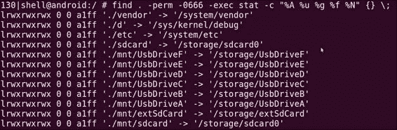

## 另见

*   CVE 的*漏洞摘要-2009-1894* 文章，位于[http://web.nvd.nist.gov/view/vuln/detail?vulnId=CVE-2009-1894](http://web.nvd.nist.gov/view/vuln/detail?vulnId=CVE-2009-1894)
*   [https://Android . googlesource . com/platform/system/core/](https://android.googlesource.com/platform/system/core/+/android-4.4.2_r1/include/private/android_filesystem_config.h)
*   [http://www.tldp.org/HOWTO/HighQuality-Apps-HOWTO/fhs.html](http://www.tldp.org/HOWTO/HighQuality-Apps-HOWTO/fhs.html)的 Linux 文档项目中的*文件系统层次标准*
*   由位于 http://www.pathname.com/fhs/pub/fhs-2.3.pdf的文件系统层级组指导的*文件系统教主标准*
*   *嵌入式安卓*，*奥赖利*，2013 年 3 月，作者*卡里姆·雅格穆尔*

# 交叉编译本机可执行文件

在我们开始粉碎安卓设备上的堆栈和劫持指令指针之前，我们需要一种方法来准备一些易受攻击的示例应用程序。要做到这一点，我们需要能够编译本机可执行文件，为此，我们需要使用一些打包到安卓本机开发工具包中的出色应用程序。

## 怎么做...

要交叉编译您自己的原生安卓组件，您需要执行以下操作:

1.  准备一个目录来开发你的代码。所有这些都需要你创建一个目录来命名你想要命名的“模块”；例如，您可以调用目录`buffer-overflow`，就像我在这里的例子中所做的那样。一旦创建了该目录，就需要创建一个名为`jni/`的子目录。你必须这样命名它，因为 NDK 的编译脚本会专门寻找这个目录。
2.  一旦你有了你的目录，你可以创建一个`Android.mk`文件。在你的`jni`目录中创建这个文件。`Android.mk`文件基本上是一个 Make 文件，它为你的编译准备了一些属性；以下是它应该包含的内容:

    ```java
    LOCAL_PATH := $(call my-dir)
    include $(CLEAR_VARS)
    # give module name
    LOCAL_MODULE    := buffer-overflow  #name of folder
    # list your C files to compile
    LOCAL_SRC_FILES :=  buffer-overflow.c #name of source to compile
    # this option will build executables instead of building library for Android application.
    include $(BUILD_EXECUTABLE)

    ```

3.  Once you have both your required `jni` directory structure and `Android.mk` set up properly, you can start writing some C code; here's an example you can use:

    ```java
    #include <stdio.h>
    #include <string.h>
    void vulnerable(char *src){
      char dest[10]; //declare a stack based buffer
      strcpy(dest,src);
      printf("[%s]\n",dest); //print the result
      return;  }

    void call_me_maybe(){
      printf("so much win!!\n");
      return;  }

    int main(int argc, char **argv){
      vulnerable(argv[1]); //call vulnerable function
      return (0);  }
    ```

    请确保该文件与`Android.mk`文件一起出现在`jni`目录中。

4.  Here's the fun part; you can now compile your code. You can do this by invoking the NDK build script, which surprisingly is done by executing the following command:

    ```java
    [path-to-ndk]/ndk-build

    ```

    这里，`[path-to-ndk]`是你的安卓 NDK 的路径。

如果一切顺利，应该会看到类似如下的输出:

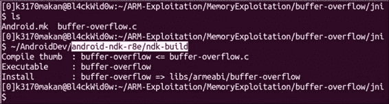

## 还有更多...

仅仅编译是不够的；我们需要能够修改普通可执行文件的编译方式，这样我们就可以利用和研究某些漏洞。我们将在这里移除的保护是一种保护函数堆栈不被破坏的方法，这种方法允许利用——大多数利用。在移除此保护之前，详细说明此保护的实际工作方式，并向您展示移除保护后的区别，将非常有用。振作起来——arm V7 汇编代码来了！

所以我们可以使用 NDK 附带的 **objdump** 工具来转储这个可执行文件的汇编代码；自然，您会期望与任何普通 Linux 或 Unix 发行版捆绑在一起的标准`objdump`工具可以正常工作，但是这些可执行文件是专门为嵌入式 ARM 设备交叉编译的。这意味着字符顺序可能不同；可执行文件的结构也可能是一个普通的`objdump`所不理解的。

为了确保我们可以使用正确的`objdump`工具，安卓的人确保了与 ARM 可执行文件兼容的版本与 NDK 一起打包。你应该在 NDK 的`/toolchains/arm-linux-androideabi-[version]/prebuilt/linux-x86-64/bin/`路径下找到它；你可以使用任何一个`arm-linux-androideabi`版本，尽管坚持最新版本总是更简单。

在前面提到的文件夹中，`objdump`二进制将被命名为类似`arm-linux-androideabi-objdump`的东西。

要使用它，您所需要做的就是将它指向`/buffer-overflow/obj/local/armeabi/`目录根目录中的二进制文件，该文件应该出现在您的`jni`目录中，并执行以下命令:

```java
[path-to-ndk]/toolchains/arm-linux-Androideabi-[version]/prebuilt/linux-x86_64/bin/arm-linux-Androideabi-objdump –D /[module name]/obj/local/armeabi/[module name] | less

```

对于我们的示例，该命令看起来如下所示:

```java
[path-to-ndk]/toolchains/arm-linux-Androideabi-4.8/prebuilt/linux-x86_64/bin/arm-linux-Androideabi-objdump –D /buffer-overflow/obj/local/armeabi/buffer-overflow | less

```

这将产生相当多的输出；我们感兴趣的是围绕“脆弱”函数编译的函数。我已经将输出输入`less`，它允许我们滚动和搜索文本；接下来要做的是在`less`打开`objdump`输出并输入`<vulnerable>`时按`/`字符，然后按*进入*。

如果您已经正确完成此操作，您的屏幕将显示以下输出:

```java
00008524 <vulnerable>:
 8524:  b51f        push  {r0, r1, r2, r3, r4, lr}
 8526:  4c0a        ldr  r4, [pc, #40]  ; (8550 <vulnerable+0x2c>)
 8528:  1c01        adds  r1, r0, #0
 852a:  4668        mov  r0, sp
 852c:  447c        add  r4, pc
 852e:  6824        ldr  r4, [r4, #0]
 8530:  6823        ldr  r3, [r4, #0]
 8532:  9303        str  r3, [sp, #12]
 8534:  f7ff ef7e   blx  8434 <strcpy@plt>
 8538:  4806        ldr  r0, [pc, #24]  ; (8554 <vulnerable+0x30>)
 853a:  4669        mov  r1, sp
 853c:  4478        add  r0, pc
 853e:  f7ff ef80   blx  8440 <printf@plt>
 8542:  9a03        ldr  r2, [sp, #12]
 8544:  6823        ldr  r3, [r4, #0]
 8546:  429a        cmp  r2, r3
 8548:  d001        beq.n  854e <vulnerable+0x2a>
 854a:  f7ff ef80   blx  844c <__stack_chk_fail@plt>
 854e:  bd1f        pop  {r0, r1, r2, r3, r4, pc}
 8550:  00002a7c   andeq  r2, r0, ip, ror sl
 8554:  00001558   andeq  r1, r0, r8, asr r5

00008558 <main>:
 8558:  b508        push  {r3, lr}
 855a:  6848        ldr  r0, [r1, #4]
 855c:  f7ff ffe2   bl  8524 <vulnerable>
 8560:  2000        movs  r0, #0
 8562:  bd08        pop  {r3, pc}

```

### 类型

**只是一点小提示**

在前面的`objdump`输出中，最左边一列显示指令的偏移量；其后由`:`字符分隔的列保存代码的实际十六进制表示；其后的一列显示了相关汇编指令的人类可读助记符。

注意之前`objdump`输出中的加粗代码。`8526`偏移量处的指令将从程序计数器(`pc`)寄存器中的当前值加载内存中找到的`0x40`地址的内容；这个地址有一个特殊的值叫做**栈金丝雀** 。

### 类型

它通常被称为金丝雀，因为矿工们实际上是如何使用金丝雀来确保矿井勘探安全的。

该值放在局部变量和保存的指令和基指针之间的堆栈上；这样做的目的是，如果攻击者或错误的指令破坏堆栈到足以影响保存在那里的值，它也需要销毁或更改堆栈加那利，这意味着程序将能够检查值是否更改。这个值是由一个加密安全的伪随机数发生器生成的，它在运行时被卡在程序的内存中，以避免可靠地预测这个值。

继续，我们看到偏移量`852c-8530`处的指令将堆栈加那利放入`r3`和`r4`寄存器中。偏移量`8532`处的以下指令确保堆栈加那利在偏移量`8534`处的危险`strcpy`调用之前放置在堆栈上。到目前为止，所有的代码都是在`strcpy`调用之后将值放在堆栈上——实际上，更接近于`printf`函数。从偏移`8542`到偏移`8544`，堆栈加那利值从寄存器`r4`及其在堆栈上的位置获取，加载到`r2`和`r3`寄存器，然后在偏移`8546`进行比较。如果它们不匹配，我们看到`854a`处的指令将被执行，这将基本上导致程序中止，不能正常退出。因此，概括地说，它从文件中的某个偏移量获取堆栈加那利，将其放在寄存器和堆栈上的另一个副本中，并在退出之前检查任何更改。

有一点你可能会注意到，虽然这可以防止保存的指令指针被破坏，但它根本不能保护局部变量！仍然有可能恶意破坏堆栈上的其他变量，这取决于它们在内存中的布局——它们出现在与加那利和其他堆栈缓冲区相关的地方。在某些非常特殊的情况下，这仍然可能被滥用来恶意影响流程的行为。

那么现在我们如何去掉这个烦人的保护，让我们可以适当粉碎一些堆栈，获得控制指令指针的能力呢？既然堆栈加那利是一种基于编译器的保护——这意味着它是可执行编译器强制执行的——我们应该能够修改 NDK 可执行文件的编译方式，这样就不会强制执行堆栈保护。

虽然对于安卓系统上的二进制文件来说，这可能很少是一个实际的情况，但这仍然是很可能发生的事情。为了模拟基于堆栈的溢出漏洞，我们正在删除此保护。

要取消保护，您需要更改 NDK 使用的一些 GCC 编译器扩展。为此，您需要:

1.  Navigate to the `/toolchains/arm-linux-Androideabi-4.9/` directory and locate a file called `setup.mk`. Please note, your NDK may use a different version of `arm-linux-androideabi`. If the following steps don't work or have the desired effect, you should try removing the stack protection:

    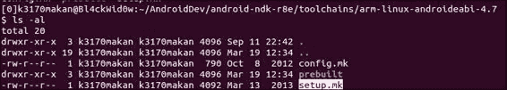

2.  The next thing you may want to do is back up the `setup.mk` file. We're about to change the default compilation configuration for the NDK, so it's always good to back it up. You can create a makeshift back up by copying the script to another file named slightly differently. For instance, you can back up the `setup.mk` file by executing this command:

    ```java
    cp setup.mk setup.mk.bk

    ```

    

3.  After backing it up, you should open the `setup.mk` file in your favorite text editor and remove the flags, specifically the one containing the `-fstack-protector` switch; see the following screenshots for more clarity:

    

    删除指定标志后，您的`setup.mk`文件应该如下所示:

    

4.  完成后，您可以使用`ndk-build`脚本编译可执行文件的新副本，然后将其传递给`androideabi-objdump`。如果没有堆栈保护，您的代码应该如下所示:

    ```java
    000084bc <vulnerable>:
     84bc:  b51f        push  {r0, r1, r2, r3, r4, lr}
     84be:  1c01        adds  r1, r0, #0
     84c0:  a801        add  r0, sp, #4
     84c2:  f7ff ef8a   blx  83d8 <strcpy@plt>
     84c6:  4803        ldr  r0, [pc, #12]  ; (84d4 <vulnerable+0x18>)
     84c8:  a901        add  r1, sp, #4
     84ca:  4478        add  r0, pc
     84cc:  f7ff ef8a   blx  83e4 <printf@plt>
     84d0:  b005        add  sp, #20
     84d2:  bd00        pop  {pc}
     84d4:  0000154a   andeq  r1, r0, sl, asr #10

    000084d8 <main>:
     84d8:  b508        push  {r3, lr}
     84da:  6848        ldr  r0, [r1, #4]
     84dc:  f7ff ffee   bl  84bc <vulnerable>
     84e0:  2000        movs  r0, #0
     84e2:  bd08        pop  {r3, pc}

    ```

请注意，先前版本的可执行文件中没有指令。这是因为我们删除的`-fstack-protector`编译器标志告诉 GCC 自主寻找任何可能破坏函数堆栈的函数实例。

## 另见

*   ARM 信息中心在[发布的 *ARM 和 Thumb 指令集快速参考卡*文档](http://infocenter.arm.com/help/topic/com.arm.doc.qrc0001l/QRC0001_UAL.pdf)
*   位于[http://simplemachines.it/doc/arm_inst.pdf](http://simplemachines.it/doc/arm_inst.pdf)的 *ARM 指令集*文档
*   密歇根大学电气工程和计算机科学系[发布的 *ARM v7-M 架构参考手册*文档](http://web.eecs.umich.edu/~prabal/teaching/eecs373-f10/readings/ARMv7-M_ARM.pdf)
*   *开发 Arm Linux 系统，由*伊曼纽·阿克雷*在[发布的简介](http://www.exploit-db.com/wp-content/themes/exploit/docs/16151.pdf)*
*   位于[的【ARM 架构】文档的*程序标准*](http://infocenter.arm.com/help/topic/com.arm.doc.ihi0042e/IHI0042E_aapcs.pdf)
*   位于[http://bear.ces.cwru.edu/eecs_382/ARM7-TDMI-manual-pt2.pdf](http://bear.ces.cwru.edu/eecs_382/ARM7-TDMI-manual-pt2.pdf)的 *ARM 指令集*文档
*   ARM 信息中心在[发布的 *ARM 开发套件 1.2 版汇编指南*文档](http://infocenter.arm.com/help/topic/com.arm.doc.dui0068b/DUI0068.pdf)
*   *安卓平台仿生 GitHub 页面的 DLMalloc 实现库*位于[https://GitHub . com/Android/Platform _ Bionic/blob/master/libc/upstream-DLMalloc/malloc . c](https://github.com/android/platform_bionic/blob/master/libc/upstream-dlmalloc/malloc.c)
*   在安卓平台仿生 GitHub 页面的 DLMalloc 实现中的`ok_magic`调用位于[https://GitHub . com/Android/Platform _ Bionic/blob/master/libc/upstream-DLMalloc/malloc . c # l 4715](https://github.com/android/platform_bionic/blob/master/libc/upstream-dlmalloc/malloc.c#L4715)
*   位于 https://android.googlesource.com/platform/bionic/的安卓源代码库的*仿生*源代码
*   `DLMalloc.c`，安卓平台仿生`jb-mr0-release`在[的安卓官方 GitHub 资源库](https://android.googlesource.com/platform/bionic/+/jb-mr0-release/libc/bionic/dlmalloc.c)

# 利用种族条件漏洞

竞态条件造成了安卓平台相当多的问题和特权升级攻击；其中许多允许恶意攻击者获得根权限。

本质上，当多线程(允许多个进程同时运行的平台)系统上的进程使用抢占式进程调度时，竞争条件是由于缺乏强制互斥造成的。抢先调度允许任务调度器抢先中断线程或正在运行的进程，这意味着无需首先等待任务准备好中断。这使得竞争条件成为可能，因为开发人员通常不会让应用程序以适应来自进程调度器的任意和不可预测的中断的方式运行；因此，依赖于访问潜在共享资源(如文件、环境变量或共享内存中的数据结构)的进程总是“竞相”获得对这些资源的第一次独占访问。攻击者滥用这种情况，首先获取对这些资源的访问权，然后以某种方式破坏这些资源，这种方式要么会破坏进程的操作，要么会让它们恶意影响进程的行为。一个简单的例子是一个程序，它检查用户是否在一个列出有效用户名的给定文件中验证自己；如果这个过程不适应抢先调度程序，它可能只在恶意用户通过将他/她的用户名添加到列表中来破坏文件之后才访问该文件，从而允许对他们进行身份验证。

在本演练中，我将详细介绍一些基本的比赛条件漏洞，并讨论其他潜在原因；我还将详细介绍一些最基本的种族条件漏洞。本演练以过去基于安卓的比赛条件漏洞的参考和有用信息来源结束；他们中的大多数人在撰写本文的那一年进行了报道。

利用竞争条件漏洞取决于几个因素，即攻击者必须至少能够:

*   **获得对资源的访问权限一个易受攻击的进程正在争用对**的访问权限:仅仅拥有一个不对其外部资源强制互斥但让攻击者无法访问这些相同资源的进程不会有太大的开发潜力。如果这不是真的，那么一个进程进行的每一次非互斥访问都是可以利用的。这包括每次进程在不检查信号量或自旋锁的情况下取消引用内存中的指针，这可能会发生数十亿次！
*   **恶意影响这些资源**:如果一个进程在攻击不能增加或恶意修改资源的情况下不能独占地访问它的资源，那就没有多大帮助了。例如，如果一个进程访问共享内存或一个攻击者只有读取权限的文件——当然，除非这导致易受攻击的进程崩溃，给定进程的语义优先级；例如，防病毒程序、IDS 或防火墙。
*   **使用时间/检查窗口大小的时间** ( **TOU/TOC** ):这本质上是应用程序检查对资源的访问和实际访问资源之间的时间差，或者更有效地说是调度程序中断的可能性。争用条件的可利用性在很大程度上取决于这个时间差，因为在这个时间范围内，为了恶意影响资源，利用实际上会争用访问。

考虑到这些条件，让我们看看一些构建的种族条件漏洞的例子，以及如何在安卓上利用它们。

## 做好准备

在我们开始利用种族条件之前，我们需要准备一个例子。你是这样做的:

1.  We're going to prepare to an embedded ARM Android platform—the Jelly Bean emulator in this example—that causes race condition vulnerability. The following code details the behavior of a vulnerable process:

    ```java
    #include <stdio.h>
    #include <unistd.h>
    #include <errno.h>
    #define MAX_COMMANDSIZE 100
    int main(int argc,char *argv[],char **envp){
      char opt_buf[MAX_COMMANDSIZE];
      char *args[2];
      args[0] = opt_buf;
      args[1] = NULL;
      int opt_int;
      const char *command_filename = "/data/race-condition/commands.txt";
      FILE *command_file;
      printf("option: ");
      opt_int = atoi(gets(opt_buf));
      printf("[*] option %d selected...\n",opt_int);
      if (access(command_filename,R_OK|F_OK) == 0){
        printf("[*] access okay...\n");
        command_file = fopen(command_filename,"r");
        for (;opt_int>0;opt_int--){
          fscanf(command_file,"%s",opt_buf);
        }
        printf("[*] executing [%s]...\n",opt_buf);
        fclose(command_file);
      }
      else{
        printf("[x] access not granted...\n");
      }
      int ret = execve(args[0],&args,(char **)NULL);
      if (ret != NULL){
        perror("[x] execve");
      }
      return 0;
    }
    ```

    按照*交叉编译本地可执行文件*方法中详细描述的相同过程进行编译，并将其部署到您的安卓设备上。试着将其部署到一个分区或文件夹中，该分区或文件夹已被安装为安卓系统上的任何用户都可以执行和读取(要了解如何操作，请参考[第 1 章](1.html#page "Chapter 1. Android Development Tools")、*安卓开发工具*中的*将文件复制到 AVD* 食谱)。在整个配方中，我们使用作为`/system`挂载的分区，该分区与其他配方一样，以读写权限重新挂载。请注意，这可能会导致 NDK 抛出一些警告，但只要一切编译成可执行文件，你就可以开始了！

2.  您还需要将`commands.txt`文件放在代码中提到的目录中，即`/data/race-condition/command.txt`。这需要在`/data`路径中创建一个种族条件文件夹。如何做到这一点的一个很好的例子可以在[第 4 章](4.html#page "Chapter 4. Exploiting Applications")、*利用应用程序*中的*检查网络流量*食谱中找到，因为我们需要为`TCPdump`创建一个类似的设置。
3.  You will need to set the `setuid` permission for this executable on the Android device; you can do this by executing the following command after deploying it to the device:

    ```java
    chmod 4711 /system/bin/race-condition

    ```

    此命令还确保系统上的任何用户都具有执行权限。请注意，执行此命令需要 root 权限。我们正在模拟`setuid`二进制的效果，以及它如何导致任意代码执行。

我们为剥削准备了一切；我们现在可以继续详细介绍这种剥削。

## 怎么做...

要利用易受攻击的二进制文件，您需要执行以下操作:

1.  Run the ADB shell into the Android device; if you're using an emulator or a rooted device, you should be able to use `su` to assume another application's access rights.

    尝试访问一些没有为您的用户设置执行、读取或写入权限的根拥有的文件夹和文件。这里我选择了用户`10170`作为例子，当您试图访问`/cache/`目录时，您应该会看到`Permission denied`消息被抛出:

    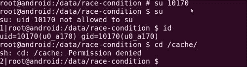

2.  Let's exploit the `race-condition` binary. We do this by augmenting the `commands.txt` file with another command, namely `/system/bin/sh`, which will open a shell for us. You can do this by executing the following command:

    ```java
    echo "/system/bin/sh" >> /data/race-condition/commands.txt

    ```

    `/system/bin/sh`命令现在应该是`commands.txt`文件中的最后一个条目，这意味着，如果我们希望从菜单中选择它，我们需要选择选项 5。

    

3.  在安卓设备上执行`race-condition`并提供`5`作为选项。易受攻击的二进制文件将执行`sh`命令并给你根权限。
4.  Test your root access by trying to change the directory to `/cache`. If you're running a Jelly Bean or later version of Android, you should not see any `Permission denial` messages, which means you've just escalated your privileges to root!

    

前面的例子旨在详细说明竞态条件下最基本的概念，即当应用程序访问任何其他进程都可以扩充的文件并以根用户的身份使用它来执行操作时。有更复杂和微妙的情况会导致种族状况，其中一个被普遍利用的情况是那些涉及符号链接的情况。这些漏洞源于应用程序无法区分文件和符号链接，这允许攻击通过精心制作的符号链接来扩充文件，或者当文件读取符号或硬链接但无法确定链接目标的真实性时，这意味着链接可能被恶意重定向。有关比赛条件漏洞的更多现代示例，请查看*中的链接，另请参见*部分。

## 另见

*   CVE 的*漏洞摘要-2013-1727* 文章，位于[http://web.nvd.nist.gov/view/vuln/detail?vulnId = CVE-2013-1727&cid = 8](http://web.nvd.nist.gov/view/vuln/detail?vulnId=CVE-2013-1727&cid=8)
*   CVE 的*漏洞摘要-2013-1731* 文章，位于[http://web.nvd.nist.gov/view/vuln/detail?vulnId = CVE-2013-1731&cid = 8](http://web.nvd.nist.gov/view/vuln/detail?vulnId=CVE-2013-1731&cid=8)
*   *贾斯汀·凯斯*在[发布的*雪碧软件安卓比赛条件*文章](http://packetstormsecurity.com/files/122145/Sprite-Software-Android-Race-Condition.html)
*   *比赛条件利用*普拉巴克·马蒂提*在[的文章](http://cecs.wright.edu/~pmateti/InternetSecurity/Lectures/RaceConditions/index.html)*

# 利用堆栈内存损坏

堆栈内存漏洞可能不是安卓漏洞和安全漏洞的最大来源，尽管即使在 ASLR、StackGuard 和 SE Linux 等保护措施中，这类内存损坏漏洞仍有可能影响本机安卓可执行文件。除此之外，安卓市场的大部分份额是由对堆栈和其他基于内存的攻击没有强大保护的设备组成的，即 2.3.3 姜饼设备。除了与安全研究直接相关之外，包含对基于堆栈的利用的讨论和演练的另一个重要原因是，它为更高级的利用技术提供了一个很好的入口。

在本节中，我们将详细介绍如何利用一个常见的基于堆栈的内存损坏缺陷来控制执行流程。

## 做好准备

在我们开始之前，您需要准备一个易受攻击的可执行文件；你是这样做的:

1.  用通常的`jni`文件夹创建一个目录，并使用与前面食谱中相同的命名约定。如果您需要回顾，请参见本章中的*交叉编译本机可执行文件*方法。
2.  Write this code into a `.c` file in the `jni` folder:

    ```java
    #include <stdio.h>
    #include <string.h>
    void
    vulnerable(char *src){
      char dest[10]; //declare a stack based buffer
      strcpy(dest,src); //always good not to do bounds checking
      printf("[%s]\n",dest); //print the result
      return;  }

    int
    main(int argc, char **argv){
      vulnerable(argv[1]); //call vulnerable function
      printf("you lose...\n");
      return (0);  }
    ```

    这段代码与前面的例子惊人地相似。事实上，您甚至可以编辑前面的示例代码，因为它只有几行不同。

3.  像以前一样使用`ndk-build`脚本编译代码。
4.  将代码部署到安卓设备或模拟器上；对于下面的例子，我使用了一个模拟的 Android 4.2.2 设备。

一旦你把代码都设置好了，你就可以继续把二进制文件推到你的模拟器或设备上了——如果你准备好迎接挑战的话。

## 怎么做...

要利用基于堆栈的缓冲区溢出，您可以执行以下操作:

1.  Launch the application on your emulator a couple of times, each time giving it a bigger input until it fails to exit the execution gracefully and your Android system reports a segmentation fault.

    试着记住你给了应用程序多少个输入字符，因为你需要给它相同的数字来使用`gdbserver`触发崩溃。下面是可执行文件正常运行的截图:

    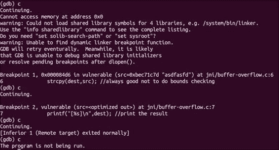

    您应该会看到 GDB 输出`exited normally`，表示进程的返回代码是相同的，没有任何东西中断或迫使它停止。

    一旦给应用程序太多的输入，它就会出现一个分段错误，在 GDB 是这样的:

    

2.  在`gdbserver`中启动应用程序，给它一个“不安全”的输入量，即会使其崩溃的输入量。对于我们的代码，应该是 14 到 16 个字符以上。在本例中，我输入了大约 16 个字符，以确保覆盖了正确的内存部分。
3.  运行`androideabi-gdb`并连接到远程进程。如果您需要回顾如何做到这一点，请参见第 6 章、*逆向工程应用程序*中的*使用 GDB 服务器*配方调试安卓进程。
4.  Set a couple of breakpoints using GDB. Set a breakpoint just before `blx` to `strcpy` and another after, as in the following screenshot:

    

    ### 类型

    您可以使用`break`命令或`b`作为简写来设置断点，并为其提供一行代码的偏移量或指向保存指令的地址的指针；于是有了`*`字前的记忆值。

5.  Once your breakpoints are set, re-run the application via `gdbsever` and reconnect to it using the Android GDB. Step through each breakpoint as explained later. All you need to do is type in `continue` in the GDB prompt, or `c` as shorthand. GDB will continue the execution of the program until a breakpoint is reached.

    您到达的第一个断点应该是`strcpy`调用之前的断点；我们在这里设置了一个断点，这样您就可以看到在`strcpy`调用前后堆栈是如何变化的。理解这一点非常重要，这样您就可以在开始覆盖返回地址之前计算出要给应用程序多少数据。这显示在下面的截图中:

    

    这是调用`strcpy`之前`vulnerable`函数堆栈的快照；除了为局部变量准备了一些空间之外，还没有发生什么。一旦到达第一个断点，您应该通过打印堆栈的一些内存内容来检查堆栈。

    在下面的例子中，这是通过在 GDB 执行这个`x`命令来显示的:

    ```java
    x/32xw $sp

    ```

    该命令告诉 GDB 从包含在`sp`(堆栈指针)寄存器中的存储器地址打印 32 个十六进制字；以下是您应该看到的内容:

    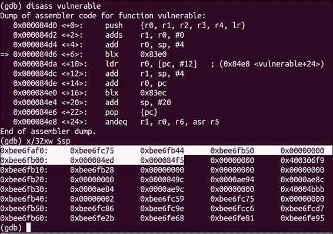

    您会注意到一对值被高亮显示；这些值是由函数序言中的一条指令传递给堆栈的，这条指令如下:

    ```java
    push  {r0, r1, r2, r3, r4, lr}

    ```

    ### 类型

    `push`指令——如前一条命令中所用——确保调用函数的寄存器值被保留。此指令有助于确保当正在执行的函数将控制权返回给调用它的函数时，堆栈会返回到其原始状态。

    `push`指令中使用的值之一是`lr`或链接寄存器。链接寄存器通常保存当前函数的返回地址。这里，`lr`寄存器保存值`0x000084f5`。我们稍后将尝试用我们自己的一个覆盖它；几分钟后，你应该会看到我们的输入是如何改变这个值的，所以暂时试着记住它。

    您想要这样做是因为`vulnerable`功能中有一个进一步向下的指令，即:

    ```java
    pop   {pc}

    ```

    该指令将保存的`lr`值直接移入程序计数器寄存器；这使得在保存在`lr`寄存器中的地址继续执行。如果我们可以覆盖保存的`lr`值，我们就可以有效地控制`vulnerable`函数的执行在最后分支到哪里。下一步包括如何精确计算，以及输入什么到程序中，以确保您控制执行，如前所述。

6.  Continue to the next breakpoint. Once GDB hits this breakpoint, `strcpy` should have written your input to the stack. Inspecting the stack at this point should yield the following output:

    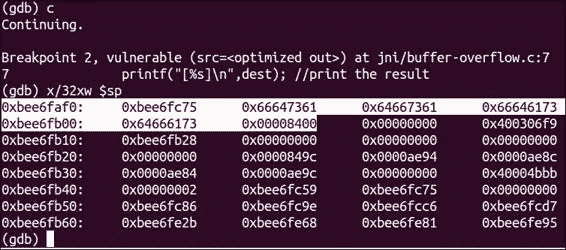

    你应该注意到数值`0x000084f5`变成了`0x00008400`；它们非常相似，因为当`strcpy`将我们的输入写入缓冲区时，它用跟在我们字符串后面的`NULL`字节部分覆盖了保存的`lr`值；这就是为什么`0xf5`被`0x00`取代的原因。我们现在知道，我们输入的 16 个字符覆盖了保存的返回地址的一个字节。这意味着要完全覆盖 2 个字节的返回地址，我们需要添加 2 个字节的输入—容纳`NULL`字节—最后 4 个字节是新的返回地址。以下是它的工作原理:

    在`strcpy`调用之前，堆栈有这样的结构:

    <colgroup class="calibre19"><col class="calibre20"> <col class="calibre20"> <col class="calibre20"> <col class="calibre20"> <col class="calibre20"> <col class="calibre20"> <col class="calibre20"> <col class="calibre20"></colgroup> 
    | 

    无趣的堆栈内容

     | 

    输入缓冲区字段

     | 

    保存的 lr 值

     |
    | --- | --- | --- |
    | S7-1200 可编程控制器 | S7-1200 可编程控制器 | S7-1200 可编程控制器 | 0x00000000 | 0x000084ed | 0x00000 | 0x84 | 0xF5 |

    在输入 16 字节的`strcpy`调用之后，堆栈具有以下结构:

    <colgroup class="calibre19"><col class="calibre20"> <col class="calibre20"> <col class="calibre20"> <col class="calibre20"> <col class="calibre20"></colgroup> 
    | 

    无趣的堆栈内容

     | 

    输入缓冲区字段

     | 

    保存的 lr 值

     |
    | --- | --- | --- |
    | …0 个 xbee 6 个 fc75 | 16 个字符 | 0x00000 | 0x84 | 0x00 |

    粗体`0x00`值是来自我们输入的`NULL`字节；基于此，我们希望输入 16 个字符加上 2 个字符作为新的返回地址，如下所示:

    <colgroup class="calibre19"><col class="calibre20"> <col class="calibre20"> <col class="calibre20"> <col class="calibre20"> <col class="calibre20"></colgroup> 
    | 

    无趣的堆栈内容

     | 

    输入缓冲区字段

     | 

    保存的 lr 值

     |
    | --- | --- | --- |
    | …0 个 xbee 6 个 fc75 | [16 个字符] | 0x00000 | 0x？？ | 0x？？ |

    这里`0x??`字符表示我们调用`strcpy`来覆盖返回地址的额外输入字符；我们再次在额外的输入字符后看到`0x00`字符。

7.  Relaunch the GDB server with the given input; try skipping over the `printf "you lose"` call and checking that it wasn't executed—this makes for an easy way to check if you've successfully redirected execution. Here's how you can grab an example address to redirect execution flow to. Disassemble the main section by executing the following command in the GDB shell:

    ```java
    disass main

    ```

    这将产生以下输出:

    ```java
    0x000084ec <+0>:  push {r3,lr}
    0x000084ee <+2>:  ldr r0,[r1, #4]
    0x000084f0 <+4>:  bl 0x84d0 <vulnerable>
    0x000084f4 <+8>:  ldr r0, [pc, #8]
    0x000084f6 <+10>:  add r0,pc
    0x000084f8 <+12>:  blx 0x83f8
    0x000084fc <+16>:  movs r0,#0
    0x000084f3 <+18>:  pop {r3,pc}
    0x00008500 <+20>:  andeq r1,r0,r2,asr,r5

    ```

    `0x000084f8`处的`blx`指令显然是对`printf`的调用，因此，如果我们想跳过它，我们需要抓取紧随其后的指令的地址，即`0x000084fc`。更具体地说，我们将把以下作为我们计划的输入:

    `[16 padding chars] \xfc\x84`

    由于体系结构的字符顺序，指定返回地址的字节以相反的顺序给出。

8.  Relaunch the application using the GDB server, this time giving it the following input:

    ```java
    echo –e "1234567890123456\xfc\x84"`

    ```

    如果一切顺利，您应该不会看到应用程序打印`"you lose"`消息，而只是退出。

你能做的远不止跳过一个简单的`print`指令；在某些情况下，您甚至可以完全控制运行具有此类漏洞的程序的进程。有关如何做到这一点的更多信息，请参见*中标题为*无返回的面向返回编程*的链接，另请参见*部分。有关一般内存损坏攻击的良好来源，请参见*内存损坏攻击、(几乎)完整历史记录*以及*中的*粉碎堆栈获取乐趣和利润*链接，另请参见*部分。

## 另见

*   *ARM 开发的简短指南*，网址为
*   *阿莱弗一*在[http://www.phrack.org/issues.html?issue=49&打堆取乐篇 id = 14 #篇](http://www.phrack.org/issues.html?issue=49&id=14#article)
*   *内存损坏攻击,(几乎)完整的历史*指南，Thinkst Security 2010，作者:*哈龙·米尔*，网址:
*   *无返回的面向返回的编程*由*斯蒂芬·查科威*、*卢卡斯·达维*、*亚历山德拉·德米特里恩科*、*艾哈迈德-雷扎·萨德吉*、*霍瓦夫·沙哈姆*和*马塞尔·温安迪*在[http://cseweb.ucsd.edu/~hovav/dist/noret-ccs.pdf](http://cseweb.ucsd.edu/~hovav/dist/noret-ccs.pdf)指导
*   *卢卡斯·达维*、*亚历山德拉·德米特里延科*、*艾哈迈德-雷扎·萨德吉*和*马塞尔·温安迪*在[上指导的*面向返回的编程*](http://www.informatik.tu-darmstadt.de/fileadmin/user_upload/Group_TRUST/PubsPDF/ROP-without-Returns-on-ARM.pdf)

# 自动原生安卓模糊化

模糊测试是发现系统实用程序中可利用的错误的好方法。它允许审计员评估文件处理程序和任何其他应用程序针对格式错误和可能的恶意输入的有效性，并帮助确定系统上是否有任何容易被利用的入口点。这也是一种自动化安全测试的好方法。

安卓和其他系统没什么不同，有无数有趣的模糊目标。安卓设备的攻击面不止于 Java 应用层；事实上，根利用有时是基于本地可执行文件或系统实用程序，它们不能正确处理任何给定的输入或以安全的方式对某些情况做出响应。模糊化是在安卓设备上发现这些情况和可能的根漏洞的好方法。

这里我要介绍的是如何将一个名为 **【雷达 msa】**的模糊测试生成器移植到安卓平台上，并且安装一些实用程序来帮助你编写一些使用雷达 MSA 的健壮模糊脚本。

## 做好准备

在我们开始移植之前，你需要获取一份雷达引信的副本；你是这样做的:

1.  Make sure you have either **CURL** or **Wget** installed on your Linux machines. Wget will work fine, but sticking to the recommendation on the Radamsa site, you can install the prerequisites by executing the following command from your Ubuntu machines:

    ```java
    sudo apt-get install gcc curl

    ```

    运行此命令应该会产生类似于以下屏幕截图的输出:

    

2.  Once they've been downloaded, you can grab your copy of the Radamsa source code as follows:

    ```java
    curl http://ouspg.googlecode.com/files/radamsa-0.3.tar.gz > radamsa-0.3.tar.gz

    ```

    运行此命令应该会产生类似于以下屏幕截图的输出:

    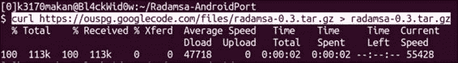

3.  You should then extract the Radamsa source by executing this command:

    ```java
    tar –zxvf radamsa-0.3.tar.gz

    ```

    如果您正确执行了此命令，您的输出应该类似于下面的截图:

    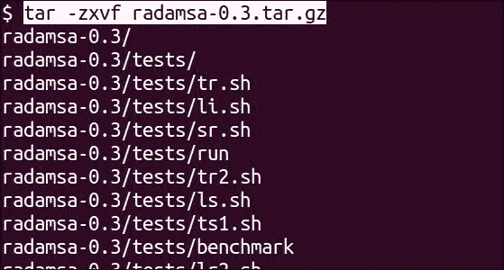

    完成后，您的目录应该如下所示:

    

    现在一切都安排好了；我们可以开始设置`jni`目录结构，为安卓编译 Radamsa。

## 怎么做...

要为安卓交叉编译 Radamsa ，您应该执行以下操作:

1.  你应该在这个目录里面拆包 Radamsa 源码后有一个名为`radamsa-0.3`的目录；您应该创建一个名为`jni`的目录，就像我们在*交叉编译本地可执行文件*食谱中所做的那样。
2.  Make a copy of the `Android.mk` file you used for the buffer overflow recipe and stick it inside the `jni` directory; your directory should look similar to the following screenshot:

    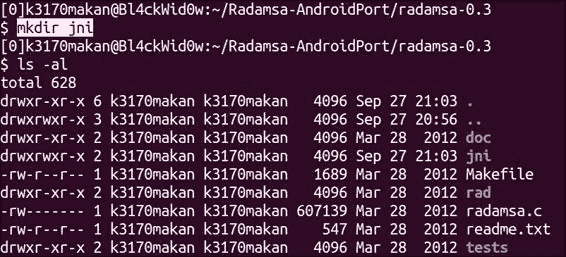

3.  Copy the `radamsa.c` file, which contains the Radamsa source, into the `jni` directory as in the following screenshot:

    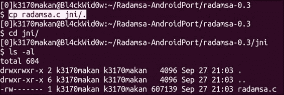

4.  Grab a copy of the `Android.mk` file and stick it inside the `jni` folder.

    复制您的`Android.mk`文件应该类似于下面截图所示的演示:

    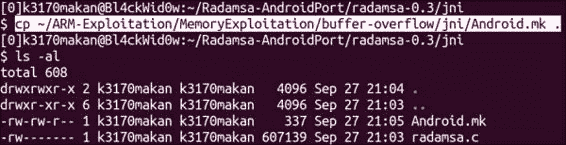

5.  Edit the `Android.mk` file you copied in the previous step so that it looks like the following:

    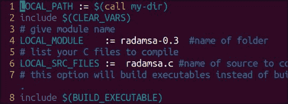

6.  Once you're done setting up the `Android.mk` file, you can execute the `ndk-build` command; you should get the following output:

    

    这意味着构建失败。GCC 还会显示哪些代码行导致了错误。实际上，这是一个贯穿代码其余部分的问题，即`typedef`，它将一个无符号长整型别名为一个叫做`in_addr_t`的东西；在下一步中，我们将修复这个问题，以成功编译 Radamsa。

7.  Open the `radamsa.c` file in your favorite code editor—preferably one that displays line numbers. Scroll down to line number `3222`; you should see the following code if you're using the vim text editor:

    

8.  In line `3222` of the `radamsa.c` code, replace the `in_addr_t` type name to an unsigned long. The code should look something like this when you've changed it correctly:

    

9.  You should also remove the `typedef` command in line `2686`; before editing the line, it should look like the following:

    

    注释完之后，应该如下所示:

    

10.  After you're done editing the `radamsa.c` source so it pleases the NDK GCC compiler, you can run the `ndk-build` script. If you've done everything correctly, your output should look something like this:

    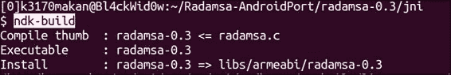

11.  After successfully building the executable you can then push it to an Android emulator as follows—assuming you have one set up already, and you've remounted the system partition as writeable:

    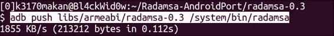

12.  Once you've pushed the Radamsa executable, you can test it by executing this command on your Android emulator:

    ```java
    radamsa –-help

    ```

    这将生成以下输出:

    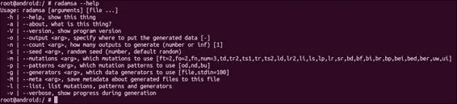

13.  You can run Radamsa on some test input to make sure everything is working fine. As an example, see how Radamsa was run using the following command to make sure everything was sane and in working condition:

    ```java
    echo "99 bottles of beer on the wall" | radamsa

    ```

    运行此命令应该会产生类似于以下屏幕截图的输出:

    

就这样！Radamsa 已经在安卓系统上启动并运行。下一节将讨论设置一个简单的模糊脚本，并将其指向 dexdump，以尝试并生成一些崩溃，并希望找到一些可利用的漏洞。

如果你要做一些模糊化，你最终将需要做一些 bash 脚本来在正确的目标上磨练雷达，并自动报告引起有趣行为的输入数据。不幸的是，安卓平台没有打包所有使 bash 脚本强大的实用程序；他们甚至没有提供 bash shell 应用程序，主要是因为不需要它。

我们可以使用`sh` shell 来完成我们的脚本，但是 bash 更强大，通常大多数人更习惯于 bash 脚本。正因为如此，这个食谱的下一部分解释了如何让 Busybox 在安卓平台上运行。

### 设置 Busybox

要在安卓上获得 Busybox 实用程序(一个有用的终端应用程序包)，您需要执行以下操作:

1.  Grab a copy of the Android port from [http://benno.id.au/Android/busybox](http://benno.id.au/Android/busybox); in the example, we used `wget` to do this:

    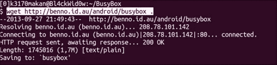

2.  What you need to do then is prepare a `busybox` directory on your Android emulator—assuming you have one already set up and ready to go.

    本例中，`busybox`目录是在`/data/`文件夹中创建的；因为它是可写的和可执行的，所以在分区上装载的任何具有写、读和执行权限的文件夹都应该工作良好。

    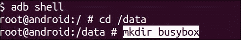

3.  Once you've made a dedicated directory for Busybox, you can push it to the emulator using this command:

    ```java
    adb push [path to busybox] /data/busybox/.

    ```

    您应该在做类似于下面截图的事情:

    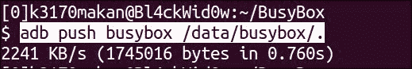

4.  Once you've pushed a copy of the `busybox` binary to your emulator, you can install the binaries by executing the following command on your emulator:

    ```java
    /data/busybox –-install

    ```

    以下是三星 Galaxy S3 智能手机的一个例子:

    

    执行此命令后，您的`busybox`文件夹应该如下所示:

    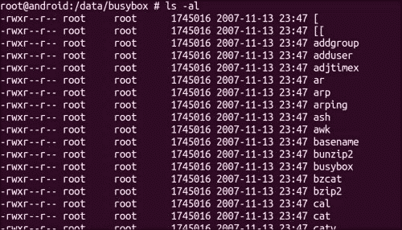

### 模糊化数据转储

现在您已经启动并运行了您的测试用例生成器，并且安装了 Busybox 实用程序，您可以开始生成一些崩溃了！

在这个例子中，我们将看到如何设置一个简单的脚本来对 dexdump 进行一些“愚蠢”的模糊测试，dexdump 是一个实用程序解析安卓 DEX 文件并打印其内容:

1.  在我们开始之前，您将需要一个示例 DEX 文件；您可以通过使用 Android SDK 编写一个示例“hello world”类型的应用程序来获得一个，也可以只抓取上一章菜谱中创建的`Example.dex`文件。如果您想要生成此文件，请参见[第 6 章](6.html#page "Chapter 6. Reverse Engineering Applications")、*逆向工程应用程序*中的*从 Java 编译到 DEX* 配方。
2.  创建一个目录作为输入测试用例生成文件的基础。这是安卓模拟器上的文件夹，你的脚本将在这里生成文件。测试它们，如果它们导致任何崩溃，复制有趣的；`/data/`目录再次是一个很好的地方来做这件事，尽管考虑模拟一个 SD 卡并在那里保存你的数据是很好的。
3.  在您的模糊化目录(上一步创建的目录)中，创建一个 bash 脚本，其中包含以下代码:

    ```java
    #!/bin/bash
    ROOT=$1
    TARGET=dexdump
    ITER=$2
    for ((c=0;1;c++))
    do
     cat $ROOT | radamsa -m bf,br,sr -p bu > fuzz.dex
     $TARGET -d fuzz.dex 2>&1 > /dev/null
     RET_CODE=$?
     echo "[$c] {$RET_CODE} ($WINS)"
     test $RET_CODE -gt 127 && cp fuzz.dex win-dexdump_$ITER"_"$c.dex && WINS=`expr $WINS + 1`
    done

    ```

4.  通过在模拟器上执行以下命令，在 bash 中运行脚本:

    ```java
    /data/busybox/bash; /data/busybox/source [fuzz script name] [example.dex]

    ```

现在你变模糊了！

## 它是如何工作的...

在这个食谱的第一部分*如何做…* 中，我们介绍了交叉编译一个流行的模糊测试生成器，名为拉达姆萨。我们所做的大部分已经在*交叉编译本地可执行文件*食谱中解释过了。当 NDK 构建脚本因为类型定义而无法编译雷达图时，事情就变得有趣了；这是它的样子:

```java
typedef unsigned long in_addr_t;

```

这导致构建脚本失败，因为 NDK 构建脚本使用的 GCC 编译器(即为支持 ARM 应用程序二进制接口而构建的编译器)无法识别类型定义的影响。

### 类型

当引用上述语句定义的类型时，会导致 GCC 暂停并报告基本不知道`in_addr_t`是什么。通过用无符号长整型变量替换提及的`in_addr_t`别名并注释掉`typedef`语句，消除了对`typedef`的需求，从而解决了这个问题。

一旦这个问题得到解决，Radamsa 就可以成功编译并部署到安卓设备上。

然后我们为目标 dexdump 编写了一个临时的模糊脚本。为了确保你们确切地理解在这个食谱中你们在做什么，我们详细说明 bash 脚本做什么是很重要的。

前几条指令确保我们有一些有用的助记符来帮助我们引用传递给脚本的参数。这些出现在`#!/bin/bash`指令之后的指令只是给一些变量名赋值。

分配完这些值后，脚本进入一个带有哨兵值的`for`循环，该值限制了`for`循环的迭代次数，这将导致脚本永远迭代，除非被用户或操作系统明确停止。

在 for 循环中，我们看到下面一行:

```java
cat $ROOT | radamsa -m bf,br,sr -p bu > fuzz.dex

```

所有这些都是抓取`ROOT`变量指向的文件，并将其馈送给雷达。Radamsa 然后对文件应用一些随机转换。

在对 DEX 文件进行所请求的随机转换后，Radamsa 将输出重定向到名为`fuzz.dex`的文件，该文件是示例 DEX 文件的“模糊化”版本。

然后使用模糊化的 DEX 文件作为参数调用 dexdump 看起来是这样的:

```java
$TARGET -d fuzz.dex 2>&1 > /dev/null

```

并且所有输出都被重定向到`/dev/null`，因为我们可能对它不感兴趣。这一行代码还将所有输出从`STDIN`(标准输出文件)重定向到`STDERR`文件(标准错误输出文件)。这使得程序产生的所有输出——任何可能会使屏幕混乱的输出——都被重定向到`/dev/null`。

下一条指令如下所示:

```java
RET_CODE=$?
```

这记录了最后一个命令的退出代码；在这种情况下，是`dexdump`。

脚本这样做是因为它将揭示`dexdump`是如何退出的信息。如果`dexdump`正常退出执行，返回代码为`0`；如果发生了任何导致 dexdump 异常退出或停止的情况，比如输入损坏导致的故障，退出代码将是非零的。

更有趣的是，如果故障要求操作系统通过使用进程间信令来停止 dexdump，返回代码将大于 127。这些返回代码是我们感兴趣生成的代码，因为它们给了我们一个强有力的迹象，表明由于给定的 dexdump 输入，暴露了一个相对严重的缺陷。像分段错误这样的错误，通常发生在无效的内存部分以不正确的方式使用时，总是生成高于 127 的返回代码。有关退出代码或退出状态如何工作的更多详细信息，请参见*中的*操作外壳-了解退出代码*链接，另请参见*部分。

继续，代码的其余部分如下所示:

```java
echo "[$c] {$RET_CODE} ($WINS)"
test $RET_CODE -gt 127 && cp fuzz.dex win-dexdump_$ITER"_"$c.dex && WINS=`expr $WINS + 1
```

这部分代码的第一条指令只是帮助我们跟踪脚本当前正在执行哪个迭代——通过打印`$c`值。它还会打印出上一次运行 dexdump 的返回代码，以及发生了多少值得注意的停顿。

打印出上述“状态指示器”后，脚本将保存在`RET_CODE`变量值中的值与`127`进行比较；如果该值更大，它会复制导致该错误的样本输入，并将`WINS`变量增加`1`，以反映产生了另一个明显的错误。

## 另见

*   在[http://www.linuxjournal.com/article/10844](http://www.linuxjournal.com/article/10844)的*工作外壳-理解退出代码* Linux 日志
*   http://code.google.com/p/ouspg/wiki/Radamsa T2 雷达站的谷歌代码
*   在 http://code.google.com/p/ouspg/wiki/Blab T2 发布谷歌代码
*   位于[http://gcc.gnu.org/onlinedocs/gcc/Code-Gen-Options.html](http://gcc.gnu.org/onlinedocs/gcc/Code-Gen-Options.html)的*代码生成惯例选项*网页
*   [http://www . cs . tut . fi/tapahtumat/test us12/kalvot/威瑟 _ 20120606 Radamsa-coverage . pdf](http://www.cs.tut.fi/tapahtumat/testaus12/kalvot/Wieser_20120606radamsa-coverage.pdf)上的*雷达卫星模糊化和一些关于覆盖的想法*