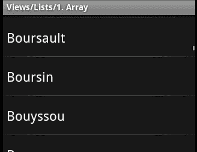
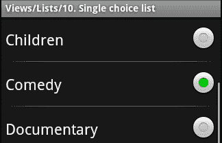
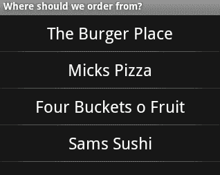
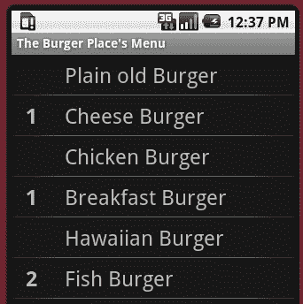
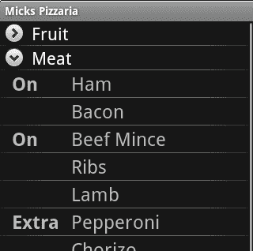

# 第二章。为视图呈现数据

*在第一章中，我们介绍了项目的基本创建，以及如何构建一个简单的用户界面。我们用足够的代码来支持我们的第一个`Activity`，以动态生成一些按钮，用户可以使用这些按钮来回答我们的选择题。*

*那么现在我们可以捕捉一些数据，但是显示数据呢？软件的一大优势是它能够以易于阅读的格式快速呈现和过滤大量数据。在这一章中，我们将看到一系列专为呈现数据而设计的安卓小部件。*

大多数安卓以数据为中心的类都建立在`Adapter`对象之上，从而扩展了`AdapterView` 。一个`Adapter`可以被认为是一个摇摆模型类和一个渲染器(或演示者)的交叉。一个`Adapter`对象用于为你的软件需要显示给用户的数据对象创建`View`对象。这种模式允许软件维护和使用数据模型，并且只在实际需要时为每个数据对象创建一个图形`View`。这不仅有助于节省内存，而且从开发的角度来看也更符合逻辑。作为开发人员，您使用自己的数据对象，而不是试图将数据保存在图形小部件中(图形小部件通常不是最健壮的结构)。

最常见的`AdapterView`类有:`ListView``Spinner``GridView`。在这一章中，我们将介绍`ListView`类和`GridView`，并探索它们的各种使用方式和风格。

# 列出并选择数据

`ListView`类可能是显示数据列表最常见的方式。它由一个 `ListAdapter`对象支持，该对象负责保存数据并在`View`中呈现数据对象。一个`ListView`包含内置滚动，所以不需要用 `ScrollView`包装。

## 列表视图选择模式

`ListView`类允许三种基本的项目选择模式，由它的常量定义:`CHOICE_MODE_NONE`、`CHOICE_MODE_SINGLE`和`CHOICE_MODE_MULTIPLE`。可以使用布局 XML 文件中的 `android:choiceMode`属性或 Java 中的 `ListView.setChoiceMode`方法来设置`ListView`的模式。

### 注

**选择模式和项目**

`ListView`的选择模式会改变`ListView`结构的行为方式，但不会改变它的外观。`ListView`的外观主要由`ListAdapter`定义，它为应该出现在`ListView`中的每个项目提供`View`对象

### 无选择模式–选择 _ 模式 _ 无

在桌面系统上，这毫无意义——一个不允许用户选择任何东西的列表？然而，这是安卓系统的默认模式。原因是，当用户通过触摸进行导航时，这是有意义的。`ListView`的默认模式允许用户点击其中一个元素，并触发一个动作。这种行为的结果是，不需要“下一步”按钮或任何类似的东西。所以`ListView`的默认模式是像菜单一样。下面的截图是一个默认的`ListView`对象，显示来自`String`数组 Java 对象的不同字符串列表，取自 Android SDK 中的一个默认`ApiDemos`示例。



### 单一选择模式–选择 _ 模式 _ 单一

在此模式下，`ListView`更像是一个桌面`List`小部件。它有当前选择的概念，点击列表项无非是选择它。这种行为对于配置或设置之类的事情来说很好，用户希望应用记住他或她的当前选择。单个选择列表变得有用的另一个地方是当屏幕上有其他交互式小部件时。不过，注意不要在一个`Activity`里放太多信息。`ListView`占据几乎整个屏幕是很常见的。

### 注

单项选择:它不会直接改变列表项目的显示方式。列表项目的外观完全由`ListAdapter`对象定义。

然而，安卓确实在系统资源中提供了一组合理的默认值。在`android`包中你会发现一个`R`类。这是一种访问系统默认资源的编程方式。如果你想创建一个单一的选择`ListView`其中有一个`<string-array>`的颜色，你可以使用以下代码:

```java
list.setAdapter(new ArrayAdapter(
        this,
        android.R.layout.simple_list_item_single_choice,
        getResources().getStringArray(R.array.colors)));
```

在这种情况下，我们使用从`android.widget`包中提供的 `ArrayAdapter`类。在第二个参数中，我们引用了名为`simple_list_item_single_choice`的安卓布局资源。安卓系统将该资源定义为在带有`CHOICE_MODE_SINGLE`的`ListView`中显示项目的默认方式。最典型的 这是一个标签，对于`ListAdapter`中的每个对象都有一个`RadioButton`。



### 多选模式–选择 _ 模式 _ 多选

在 多选模式下，`ListView`用普通复选框代替了单选模式的单选按钮。这种设计结构也常用于桌面和基于网络的系统。复选框很容易被用户识别，并且很容易返回并再次关闭选项。如果你想使用一个标准的`ListAdapter`，安卓系统会为你提供`android.R.layout.simple_list_item_multiple_choice`资源作为一个有用的默认资源:一个标签，里面有一个`ListAdapter`中每个对象的`CheckBox`。


## 添加页眉和页脚小部件

a `ListView`中的 Hea 页面和页脚允许您在`List`的顶部和底部放置额外的小部件。默认情况下，页眉和页脚小部件被视为列表中的项目(好像它们来自您的`ListAdapter`)。这意味着您可以选择它们，就像它们是`List`结构中的数据元素一样。标题项的一个非常简单的例子可能是:

```java
TextView header = new TextView(this);
header.setText("Header View");
list.addHeaderView(header);
```

通常，您不希望页眉和页脚是`ListView`中的项目，而是一个标签或一组标签来标识`ListView`的部分，或者提供其他信息。在这种情况下，您需要告诉`ListView`您的页眉或页脚视图是不可选择的列表项。这可以通过使用`addHeaderView`或`addFooterView`的扩展实现来实现:

```java
TextView footer = new TextView(this);
footer.setText("Footer View");
list.addFooterView(footer, null, false);
```

`ListView`类将页眉和页脚如此紧密地集成到列表结构中，以至于您还可以提供一个`Object`，它将从`Ad` `apterView.getItemAtPosition(index)`方法返回。在前面的例子中，我们提供了`null`。每个标题项将使后续视图的索引偏移一个(就像您在`ListView`中添加新项一样)。第三个参数告诉`ListView`页眉或页脚是否应该被算作可选列表项(在我们前面的例子中不应该)。

如果你习惯了桌面小部件，安卓`ListView`上的页眉和页脚小部件会给你带来一点惊喜。它们将与列表项目的其余部分一起滚动，不会停留在`ListView`对象的顶部和底部。

## 创建一个简单的列表视图

为了介绍`ListView`类，我们将开始一个新的例子，这将在本章后面的各节中得到加强。我们将创建的第一个`Activity`将使用从`<string-array>`资源填充的简单`ListView`。

# 行动时间——创建快餐菜单

到继续食物和饮食主题，让我们构建一个简单的应用，允许我们订购各种类型的快餐，并获得它的交付！用户将首先选择他们想要从哪里点菜，然后选择他们想要吃的各种食物。

1.  使用安卓命令行工具创建一个新的`android`项目:

    ```java
    android create project -n DeliveryDroid -p DeliveryDroid -k com.packtpub.deliverydroid -a SelectRestaurantActivity -t 3
    ```

2.  在自己喜欢的编辑器或 IDE 中打开`/res/values/strings.xml`文件。
3.  创建一个字符串数组结构，列出我们的用户可以从

    ```java
    <string-array name="restaurants">
        <item>The Burger Place</item>
        <item>Mick's Pizza</item>
        <item>Four Buckets \'o Fruit</item>
        <item>Sam\'s Sushi</item>
    </string-array>
    ```

    点的各种快餐店
4.  在自己喜欢的编辑器或 IDE 中打开`/res/layout/main.xml`文件。
5.  移除默认`LinearLayout`内的任何小部件。
6.  添加新的`<ListView>`元素。
7.  给`<ListView>`元素分配一个`restaurant`的标识:

    ```java
    <ListView android:id="@+id/restaurant"/>
    ```

8.  将`ListView`的宽度和高度指定给`fill_parent`:T2
9.  因为我们有一个字符串数组资源，我们想用它来填充`ListView`，我们可以直接在布局 XML 文件中引用它:

    ```java
    android:entries="@array/restaurants"
    ```

10.  完成指定步骤后，您应该有一个如下所示的`main.xml`布局文件:

    ```java
    <?xml version="1.0" encoding="UTF-8"?>
    <LinearLayout
        xmlns:android="http://schemas.android.com/apk/res/android"
        android:orientation="vertical"
        android:layout_width="fill_parent"
        android:layout_height="fill_parent">

     <ListView android:id="@+id/restaurant"
     android:layout_width="fill_parent"
     android:layout_height="fill_parent"
     android:entries="@array/restaurants"/>
    </LinearLayout>
    ```

## *刚刚发生的事情*

如果将应用安装到模拟器中并运行它，您将看到一个屏幕，您可以从字符串数组资源中指定的餐馆列表中进行选择。请注意，`ListView`上的`choiceMode`被保留为`CHOICE_MODE_NONE`，使其成为一个更直接的菜单，用户可以在其中选择他们的餐厅，并立即进入其菜单。


在本例中，我们使用布局 XML 文件中的`android:entries`属性来指定对字符串数组资源的引用，其中包含我们想要的列表项。通常，使用`AdapterView`需要创建一个`Adapter`对象来为每个数据对象创建`View`对象。

使用`android:entries`属性允许您从布局资源中指定`ListView`的数据内容，而不是要求您编写与`AdapterView`相关联的普通 Java 代码。然而，它有两个缺点需要注意:

*   由生成的`ListAdapter`创建的`View`对象将始终是系统指定的默认值，因此无法轻松设置主题。
*   您不能定义将在`ListView`中表示的数据对象。因为字符串数组很容易本地化，所以您的应用将依赖于项的索引位置来确定它们所指示的内容。

你可能会注意到截图顶部的标签`Where should we order from?`不是应用默认。`Activity`的标签在`AndroidManifest.xml`文件中定义如下:

```java
<activity
    android:name=".SelectRestaurantActivity"
    android:label="Where should we order from?">
```

## 设置标准列表适配器的样式

标准的`ListAdapter`实现要求每个项目都用一个`TextView`项目来表示。默认的单项选择和多项选择是使用`CheckedTextView`构建的，虽然安卓系统中有很多其他`TextView`实现，但它确实有点限制了我们的选择。然而，标准的`ListAdapter`实现非常方便，并且为最常见的清单需求提供了可靠的实现。

既然一个带有`CHOICE_MODE_NONE`的`ListView`很像菜单，那把物品换成`Button`物件而不是普通的`TextView`物品不是很好吗？从技术上讲，`ListView`可以包含任何扩展`TextView`的小部件。然而，一些实现比其他实现更适合(例如，当用户触摸某个`ToggleButtonView`时，它不会保持指定的文本值)。

### 定义标准尺寸

在 这个例子中，我们将为应用创建各种菜单。为了保持一致的外观和感觉，我们应该定义一组标准尺寸，用于我们的每个布局文件。这样我们就可以为不同类型的屏幕重新定义尺寸。对于用户来说，没有什么比只能看到部分项目更令人沮丧的了，因为它的尺寸比他们的屏幕还要大。

创建一个包含维度的新资源文件。文件应命名为`res/values/dimens.xml`。将以下代码复制到新的 XML 文件中:

```java
<?xml version="1.0" encoding="UTF-8"?>

<resources>
    <dimen name="item_outer_height">48sp</dimen>
    <dimen name="menu_item_height">52sp</dimen>
    <dimen name="item_inner_height">45sp</dimen>
    <dimen name="item_text_size">24sp</dimen>
    <dimen name="padding">15dp</dimen>
</resources>
```

我们 为列表项声明了两个高度维度:`item_outer_height`和`item_inner_height`。`item_outer_height`将是列表项的高度，而`item_inner_height`是列表项中包含的任何`View`对象的高度。

文件末尾的 `padding`维度用于定义两个视觉元素之间的标准空白量。这被定义为`dp`，因此它将根据屏幕的 DPI 保持不变(而不是根据用户的字体大小偏好进行缩放)。

### 类型

**交互式项目的大小**

在 t 他的造型中，你会注意到`item_outer_height`和`menu_item_height`是`48sp`和`52sp`，这使得`ListView`中的物品相当大。安卓中列表视图项目的标准大小是`48sp`。列表项的高度至关重要。如果你的用户手指很大，如果你把他们做得太小，他们将很难点击他们的目标列表项。

这是安卓用户界面设计的通用“好做法”。如果用户需要触摸，就把它做大。

# 行动时间-改善餐厅列表

我们之前整理的 餐厅列表很不错，但这是菜单。为了进一步强调菜单，文本应该更加突出。为了用标准的`ListAdapter`实现来设计`ListView`的样式，您需要在您的 Java 代码中指定`ListAdapter`对象。

1.  在名为`menu_item.xml`的`res/layout`目录中创建新文件。
2.  将根 XML 元素创建为`TextView` :

    ```java
    <?xml version="1.0" encoding="UTF-8"?>
    <TextView />
    ```

3.  导入安卓资源 XML 命名空间:

    ```java
    xmlns:android="http://schemas.android.com/apk/res/android"
    ```

4.  通过设置其重力

    ```java
    android:gravity="center|center_vertical"
    ```

    ，使文本在`TextView`部件中居中
5.  我们将`TextView`的`textSize`分配给我们的标准`item_text_size` :

    ```java
    android:textSize="@dimen/item_text_size"
    ```

6.  `TextView`文本默认颜色有点灰，我们希望是白色:

    ```java
    android:textColor="#ffffff"
    ```

7.  我们希望`TextView`的宽度与包含它的`ListView`相同。因为这是我们的主菜单，所以它的高度是`menu_item_height` :

    ```java
    android:layout_width="fill_parent"
    android:layout_height="@dimen/menu_item_height"
    ```

8.  现在我们有了一个风格化的`TextView`资源，我们可以将它合并到我们的菜单中。打开`SelectRestaurantActivity.java`文件。
9.  在`onCreate`方法中，在你使用`setContentView`之后，我们需要一个对我们之前在`main.xml`中创建的`ListView`的引用:

    ```java
    ListView restaurants = (ListView)findViewById(R.id.restaurant);
    ```

10.  将餐厅`ListAdapter`设置为新的`ArrayAdapter`，包含我们在`values.xml`文件中创建的餐厅字符串数组:

    ```java
    restaurants.setAdapter(new ArrayAdapter<String>(
        this,
        R.layout.menu_item,
        getResources().getStringArray(R.array.restaurants)));
    ```

## *刚刚发生的事情*

我们 首先创建了一个新的布局 XML 资源，其中包含我们希望用于我们餐厅的`ListView`中每个列表项的样式`TextView`。您编写的`menu_item.xml`文件应该包含以下代码:

```java
<?xml version="1.0" encoding="UTF-8"?>

<TextView xmlns:android="http://schemas.android.com/apk/res/android"
              android:gravity="center|center_vertical"
              android:textSize="@dimen/item_text_size"
              android:textColor="#ffffff"
              android:layout_width="fill_parent"
              android:layout_height="@dimen/menu_item_height" />
```

与我们之前的布局资源不同，`menu_item.xml`不包含`ViewGroup`(如`LinearLayout`)。这是因为`ArrayAdapter`将尝试将`menu_item.xml`文件的根`View`铸造为`TextView`。因此，如果我们将`TextView`嵌套在某种`ViewGroup`中，我们会得到一个`ClassCastException`。

我们还创建了一个`ArrayAdapter`实例来引用我们的`menu_item` XML 资源，以及我们之前创建的餐馆的字符串数组。此操作取消了在`main.xml`布局 XML 资源的`ListView`上使用`android:entries`属性。如果需要，可以删除该属性。您在`SelectRestaurantActivity`中的`onCreate`方法现在应该如下所示:

```java
public void onCreate(final Bundle icicle) {
        super.onCreate(icicle);
        setContentView(R.layout.main);

        final ListView restaurants = (ListView)
                findViewById(R.id.restaurant);

 restaurants.setAdapter(new ArrayAdapter<String>(
 this,
 R.layout.menu_item,
 getResources().getStringArray(R.array.restaurants)));
    }
```

试试 用 Apache Ant 将应用重新安装到模拟器中，你现在会看到一个看起来更像菜单的屏幕:



## 玩一把围棋英雄——开发选择题应用

试着回到我们在[第 1 章](01.html "Chapter 1. Developing a Simple Activity")*中写的选择题应用，开发一个简单的活动*。它使用`LinearLayout`和`Button`对象来显示问题的可能答案，但是它也使用字符串数组来表示答案。尝试将应用修改为:

*   用`ListView`代替`LinearLayout`
*   用`Button`对象设计`ListView`，就像我们用`TextView`对象设计餐厅菜单一样
*   确保`Button`列表项之间有一定的间隔，这样它们就不会靠得太近

## 创建自定义适配器

当我们想点食物时，我们经常想点不止一个同样的东西。`ListView`实现和标准`ListAdapter`实现允许我们选择**奶酪汉堡**项目，但不允许我们请求 **3 奶酪汉堡**。为了显示用户可以多次订购的不同食物的菜单，我们需要一个定制的`ListAdapter`实现。

### 为汉堡店创建菜单

对于我们主菜单中的每个餐厅，我们将建立一个单独的`Activity`类。实际上，这不是一个好主意，但它允许我们研究组织和显示菜单数据的不同方式。我们的第一站是**汉堡店**，我们为用户提供一份汉堡清单，让他们在屏幕上点击他们想要的汉堡。每次他们点击一个列表项，就会点另一个汉堡。我们将在汉堡名称的左侧以粗体显示他们订购的汉堡数量。在他们没有点的汉堡旁边，不应该有数字(这样用户可以快速看到他们点的是什么)。

#### 汉堡班

为了显示菜单，我们需要一个简单的`Burger`数据对象。`Burger`类会有一个名字显示在菜单中，用户点的是`Burger`号。使用以下代码在项目的根包中创建一个`Burger.java`文件:

```java
class Burger {
    final String name;
    int count = 0;

    public Burger(String name) {
        this.name = name;
    }
}
```

您会注意到在前面的代码中没有 getters 和 setters，并且`name`和`count`字段都被声明为受包保护的。在 2.2 之前的安卓版本中，与直接的字段查找相比，方法花费了大量的费用。由于这个类将是渲染过程的一小部分(我们将从中提取数据进行显示)，我们应该确保花费尽可能少。

# 行动时间-创建汉堡项目布局

为了给**汉堡店**创建一个好看的菜单，首先要做的是设计菜单项。这与使用布局 XML 资源对餐厅列表进行样式化的方式非常相似。但是，由于这次我们将自己构建`ListAdapter`，所以我们不会被迫使用单个`TextView`，而是可以构建更复杂的布局。

1.  在名为`burger_item.xml`的`res/layout`目录中创建新的 XML 文件。该文件将用于`ListView`的每个汉堡。
2.  将布局的根声明为`horizontal LinearLayout`(注意高度，这将是`ListView`中每个项目的高度):

    ```java
    <LinearLayout 
        xmlns:android="http://schemas.android.com/apk/res/android"
        android:orientation="horizontal"
        android:layout_width="fill_parent"
        android:layout_height="@dimen/item_outer_height">
    ```

3.  接下来，声明一个`TextView`，我们将使用它作为`counter`来表示正在订购的汉堡数量。我们稍后将通过它的 ID

    ```java
    <TextView android:id="@+id/counter" />
    ```

    访问它
4.  `counter`文本大小与应用中的所有其他列表项完全相同。不过应该是`bold`，所以很容易识别，读出来:

    ```java
    android:textSize="@dimen/item_text_size"
    android:textStyle="bold"

    ```

5.  我们也希望`counter`是正方形的，所以设置宽度和高度完全相同:

    ```java
    android:layout_width="@dimen/item_inner_height"
    android:layout_height="@dimen/item_inner_height"
    ```

6.  我们还希望将文本居中放在`counter` :

    ```java
    android:gravity="center|center_vertical"
    ```

    中
7.  我们还需要一个文本空间来显示汉堡的名称:

    ```java
    <TextView android:id="@+id/text" />
    ```

8.  文字大小标准:

    ```java
    android:textSize="@dimen/item_text_size"
    ```

9.  我们希望`counter`和`text`标签之间有一点空间:

    ```java
    android:layout_marginLeft="@dimen/padding"
    ```

10.  标签的宽度应该填满`ListView`，但是我们希望两个`TextView`对象的大小相同:

    ```java
    android:layout_width="fill_parent"
    android:layout_height="@dimen/item_inner_height"
    ```

11.  标签的文字应垂直居中，以匹配`counter`的位置。但是，标签应该左对齐:

    ```java
    android:gravity="left|center_vertical"
    ```

## *刚刚发生了什么？*

您刚刚构建了一个非常好的`LinearLayout ViewGroup`，将为我们从**汉堡店**出售的每个汉堡渲染。由于`counter TextView`是一个独立于标签的对象，因此可以独立设置样式和管理。如果我们想独立地应用额外的风格，这将使事情变得更加灵活。您完整的`burger_item.xml`文件现在应该如下所示:

```java
<?xml version="1.0" encoding="UTF-8"?>

<LinearLayout
    xmlns:android="http://schemas.android.com/apk/res/android"
    android:orientation="horizontal"
    android:layout_width="fill_parent"
    android:layout_height="@dimen/item_outer_height">

 <TextView android:id="@+id/counter"
 android:textSize="@dimen/item_text_size"
 android:textStyle="bold"
 android:layout_width="@dimen/item_inner_height"
 android:layout_height="@dimen/item_inner_height"
 android:gravity="center|center_vertical" />

 <TextView android:id="@+id/text"
 android:textSize="@dimen/item_text_size"
 android:layout_marginLeft="@dimen/padding"
 android:layout_width="fill_parent"
 android:layout_height="@dimen/item_inner_height"
 android:gravity="left|center_vertical" />
</LinearLayout>
```

# 行动时间——展示汉堡物件

如果您的数据对象是字符串或者很容易表示为字符串，那么标准的`ListAdapter`类可以很好地工作。为了在屏幕上很好地显示我们的`Burger`对象，我们需要编写一个自定义的`ListAdapter`类。幸运的是，安卓为我们提供了一个很好的名为`BaseAdapter`的`ListAdapter`实现框架类。

1.  创建一个名为`BurgerAdapter`的新类，并让它从`android.widget.BaseAdapter`类扩展:

    ```java
    class BurgerAdapter extends BaseAdapter {
    ```

2.  一个`Adapter`是表示层的一部分，但也是`ListView`的底层模型。在`BurgerAdapter`中，我们存储了一组`Burger`对象，这些对象是我们在构造器中分配的:

    ```java
    private final Burger[] burgers;
    BurgerAdapter(Burger... burgers) {
        this.burgers = burders;
    }
    ```

3.  直接在`Burger`对象的数组上实现`Adapter.getCount()`和`Adapter.getItem(int)`方法:

    ```java
    public int getCount() {
        return burgers.length;
    }

    public Object getItem(int index) {
        return burgers[index];
    }
    ```

4.  一个`Adapter`也要提供各种物品的标识符，我们只需要返回它们的索引:

    ```java
    public long getItemId(int index) {
        return index;
    }
    ```

5.  当一个`Adapter`被请求一个列表项的`View`时，它可能被给予一个可重用的现有`View`对象。我们将实现一个简单的方法来处理这种情况，如果需要的话，使用`android.view`包中的`LayoutInflator`类对我们之前编写的`burger_item.xml`文件进行膨胀:

    ```java
    private ViewGroup getViewGroup(View reuse, ViewGroup parent) {
        if(reuse instanceof ViewGroup) {
            return (ViewGroup)reuse;
        }
        Context context = parent.getContext();
        LayoutInflater inflater = LayoutInflater.from(context);
        ViewGroup item = (ViewGroup)inflater.inflate(
                R.layout.burger_item, null);
    return item;
    }
    ```

6.  在`BurgerAdapter`中对我们来说最重要的方法就是`getView`法。这就是`ListView`要求我们提供一个`View`对象来表示它需要显示的每个列表项的地方:

    ```java
    public View getView(int index, View reuse, ViewGroup parent) {
    ```

7.  为了获取给定项目的正确`View`，您首先需要使用`getViewGroup`方法来确保您有`burger_item.xml ViewGroup`在:

    ```java
    ViewGroup item = getViewGroup(reuse, parent);
    TextView counter = (TextView)item.findViewById(R.id.counter);
    TextView label = (TextView)item.findViewById(R.id.text);
    ```

    中显示`Burger`项目
8.  我们将用来自请求的`index`处的`Burger`对象的数据填充这两个`TextView`对象。如果当前`count`为零:

    ```java
    Burger burger = burgers[index];
    counter.setVisibility(
            burger.count == 0
            ? View.INVISIBLE
            : View.VISIBLE);
    counter.setText(Integer.toString(burger.count));
    label.setText(burger.name);
    return item;
    ```

    ，则`counter`小部件需要对用户隐藏

## *刚刚发生了什么？*

我们刚刚编写了一个定制的`Adapter`类，在一个`ListView`中向用户呈现一组`Burger`对象。当`ListView`调用`Adapter.getView`方法时，它将尝试传入从先前对`Adapter.getView`的调用返回的`View`对象。将为`ListView`中的每个项目创建一个`View`对象。但是当`ListView`显示的数据发生变化时，`ListView`会要求`ListAdapter`重新使用它第一次生成的每个`View`对象。尝试并尊重这种行为很重要，因为它会直接影响应用的响应能力。在我们前面的例子中，我们实现了 `getViewGroup`方法，以便它将这个需求考虑在内。

`getViewGroup`方法也被用来对我们写的`burger_item.xml`文件进行膨胀。我们使用一个`LayoutInflator`对象来实现，这正是`Activity.setContentView(int)`方法加载 XML 布局资源的方式。我们从`parent ViewGroup`获取的`Context`对象(通常是`ListView`)定义了我们将从哪里加载布局资源。如果用户没有选择`Burger`，我们使用`View.setVisibility`方法隐藏计数器`TextView`。在 AWT 和 Swing 中，`setVisible`方法采用`Boolean`参数，而在 Android 中，`setVisibility`采用`int`值。原因是安卓将可见性视为布局过程的一部分。在我们的例子中，我们希望`counter`消失，但仍然占据布局中的空间，这将保持`text`标签彼此左对齐。如果我们希望计数器消失并且不占用空间，我们可以使用:

```java
counter.setVisibility(burger.count == 0
        ? View.GONE
        : View.VISIBLE);
```

`ListView`对象将自动处理选中项目的高亮显示。这包括当用户将手指放在项目上时，以及当他们使用跟踪板或方向按钮导航`ListView`时。根据标准的用户界面约定，当一个项目被突出显示时，它的背景通常会改变颜色。

然而，在以某种方式直接捕获用户输入的`ListView`中使用小部件(即`Button`或`EditText`)将导致`ListView`停止显示该小部件的选择高亮。事实上，这将完全阻止`ListView`注册`OnItemClick`事件。

### 类型

**列表视图中的自定义分隔符**

如果你覆盖了`ListAdapter`的`isEnabled(int index)`方法，你可以策略性的禁用`ListView`中的指定项目。这种方法的一个常见用途是将某些项目变成逻辑分隔符。例如，按字母顺序排序的列表中的一个节分隔符，包含下一个“节”中所有项目的第一个字母。

## 创建博客空间活动类

为了将`Burger`菜单放在屏幕上，并允许用户订购项目，我们需要一个新的`Activity`类。我们需要知道用户何时触摸列表中的项目，为此我们需要实现`OnItemClickListener`界面。当特定事件发生时(在这种情况下，用户触摸`ListView`中的特定项目)，注册为侦听器的对象将调用与发生的事件的细节相关的方法。安卓提供了一个简单的`ListActivity`类来为这个场景提供一些默认的布局和实用方法。

# 行动时间——实施紧急行动

为了用`BurgerAdapter`类呈现`Burger`对象的`ListView`，我们需要为**汉堡店**创建一个`Activity`实现。新的`Activity`还将负责收听`ListView`中项目的“触摸”或“点击”事件。当用户触摸其中一个项目时，我们需要更新型号和`ListView`来反映用户已经订购了另一个`Burger`。

1.  在项目的根包中创建一个名为`TheBurgerPlaceActivity`的新类，并确保它扩展了`ListActivity` :

    ```java
    public class TheBurgerPlaceActivity extends ListActivity {
    ```

2.  覆盖`Activity.onCreate`方法。
3.  调用`super.onCreate`允许正常安卓启动。
4.  用一些`Burger`对象创建一个`BurgerAdapter`的实例，并将其设置为`ListActivity`代码使用的`ListAdapter`:

    ```java
    setListAdapter(new BurgerAdapter(
            new Burger("Plain old Burger"),
            new Burger("Cheese Burger"),
            new Burger("Chicken Burger"),
            new Burger("Breakfast Burger"),
            new Burger("Hawaiian Burger"),
            new Burger("Fish Burger"),
            new Burger("Vegatarian Burger"),
            new Burger("Lamb Burger"),
            new Burger("Rare Tuna Steak Burger")));
    ```

5.  最后，执行`onListItemClicked`方法，代码如下:

    ```java
    protected void onListItemClick(
            ListView parent,
            View item,
            int index,
            long id) {
    BurgerAdapter burgers = (BurgerAdapter)
                parent.getAdapter();
    Burger burger = (Burger)burgers.getItem(index);
        burger.count++;
        burgers.notifyDataSetInvalidated();
    }
    ```

## *刚刚发生了什么？*

`TheBurgerPlaceActivity`的这个实现有一个简单的硬编码列表`Burger`对象显示给用户，并创建一个`BurgerAdapter`将这些对象转换成我们之前创建的`burger_item View`对象。

当用户点击列表项时，我们在`onItemClick`方法中增加相关`Burger`对象的`count`。然后我们在`BurgerAdapter`上呼叫`notifyDataSetInvalidated()`。该方法将通知`ListView`底层数据已经改变。当数据发生变化时，`ListView`将对`ListView`中的每一项重新调用`Adapter.getView`方法。

一个`ListView`中的项目由有效静态的`View`对象表示。这意味着当数据模型更新时，必须允许`Adapter`更新或重新创建该`View`。一个常见的替代方法是获取代表您的更新数据的`View`，并直接更新它。

## 注册并启动紧急位置活动

为了从我们的餐厅菜单开始新的`Activity`课程，您需要在`AndroidManifest.xml`文件中注册。首先，在编辑器或 IDE 中打开`AndroidManifest.xml`文件，将下面的`<activity>`代码复制到`<application>...</application>`块中:

```java
<activity android:name=".TheBurgerPlaceActivity"
          android:label="The Burger Place\'s Menu">

    <intent-filter>
        <action android:name=
                "com.packtpub.deliverydroid.TheBurgerPlaceActivity"/>
    </intent-filter>
</activity>
```

要启动`Activity`，你需要回到`SelectRestaurantActivity`并实现`OnItemClickListener`界面。在`restaurants ListView`上设置`Adapter`后，将`SelectRestaurantActivity`设置为`restaurants ListView`的`OnItemClickListener`。您可以使用`onItemClick`方法中的`Intent`对象启动`TheBurgerPlaceActivity`。您的`SelectRestaurantActivity`类现在应该看起来像下面的代码片段:

```java
public class SelectRestaurantActivity extends Activity
 implements OnItemClickListener {

    @Override
    public void onCreate(Bundle icicle) {
        super.onCreate(icicle);
        setContentView(R.layout.main);

        ListView restaurants = (ListView)
                findViewById(R.id.restaurant);

        restaurants.setAdapter(new ArrayAdapter<String>(
                this,
                R.layout.menu_item,
                getResources().getStringArray(R.array.restaurants)));

 restaurants.setOnItemClickListener(this);
    }

 public void onItemClick(
 AdapterView<?> parent,
 View item,
 int index,
 long id) {

 switch(index) {
 case 0:
 startActivity(new Intent(
 this,
 TheBurgerPlaceActivity.class));
 break;
 }
 }
}
```

当您重新安装应用并在模拟器中启动它时，您将能够导航到**汉堡店**并订购汉堡。按下**汉堡店**菜单中的硬件“返回”按钮，将带您返回餐厅菜单。



## 突击测验

1.  将`ListView`对象的选择模式设置为`CHOICE_MODE_SINGLE`将会:
    1.  每个项目加一个`RadioButton`。
    2.  什么都不做(这是默认设置)。
    3.  使`ListView`跟踪一个“选定”的项目。
2.  一个`ListAdapter`定义一个`ListView`如何显示它的项目。什么时候会被要求为物品对象重用一个`View`？
    1.  当数据模型失效或改变时。
    2.  每一件物品上都有橡皮图章。
    3.  当`ListView`重绘自身时。
3.  当`ListView`可滚动时，页眉和页脚对象将被定位:
    1.  滚动项目的上方和下方。
    2.  水平并排，在滚动项目的上方和下方。
    3.  与其他项目一起滚动。

# 使用可扩展的列表视图类

T he `ListView`类非常适合显示小到中等数量的数据，但是有时它会向您的用户提供过多的信息。想想一个电子邮件应用。如果你的用户是一个重度电子邮件用户，或者订阅了一些邮件列表，他们很可能在一个文件夹中有几百封电子邮件。即使他们可能不需要滚动超过前几个，看到滚动条缩小到几个像素的大小对你的用户没有很好的心理效果。

I n 桌面邮件客户端，你会经常把邮件列表按时间分组:今天、昨天、本周、本月、永远(或者类似的)。安卓包括这种分组的`ExpandableListView`。每个项目都嵌套在一个组中，用户可以显示或隐藏一个组。它有点像树形视图，但总是嵌套在一个级别上(您不能在组外显示项目)。

### 类型

**大规模可扩展列表视图组**

有时，即使一个`ExpandableListView`也不足以将数据量保持在合理的长度。在这些情况下，考虑给你的用户组中的前几个项目，并在最后添加一个特殊的**查看更多**项目。或者，对组使用`ListView`，对嵌套项使用单独的`Activity`。

## 创建可扩展的适配器实现

S 由于`ExpandableList`类包含两个细节层次，它不能与只处理一个层次的普通`ListAdapter`对抗。相反，它包括使用两组方法的`ExpandableListAdapter`:一组用于组级别，另一组用于项目级别。当实现一个定制的`ExpandableListAdapter`时，通常最容易让你的`ExpandableListAdapter`实现从`BaseExpandableListAdapter`继承，因为它提供了事件注册和触发的实现。

T 他`ExpandableListAdapter`会在每个组项目的左侧放置一个箭头指针，指示该组是打开还是关闭(很像下拉/组合框)。箭头被渲染在由`ExpandableListAdapter`返回的组的`View`对象的顶部。为了防止您的群组标签被这个箭头部分遮挡，您需要在列表项目`View`结构中添加填充。列表项的默认填充可用作主题参数`expandableListPreferredItemPaddingLeft`，您可以使用它:

```java
android:paddingLeft=
    "?android:attr/expandableListPreferredItemPaddingLeft"
```

为了保持你的`ExpandableListView`看起来一致，最好给`ExpandableListView`的正常(子)项目添加相同数量的填充(以保持它们的文本与其父组的文本对齐)，除非你把一个项目放在左边，比如一个图标或复选框。

## 玩得开心点定制披萨

举个`Mick's Pizza`的例子，我们将创建一个分类披萨配料的菜单。每个浇头都有一个名字，无论是披萨上的“开”还是“关”，或者是“额外的”(例如，额外的奶酪)。每个项目使用两个水平排列的`TextView`对象。右边的`TextView`可以保存浇头的名称。左边的`TextView`可以是不加配料的空的，`On`可以是加配料的空的，`Extra`可以是用户想要的比平时多的配料。

用`ToppingCatagory`对象创建一个对象模型，包含一个名称和一组`PizzaTopping`对象。你会想要存储一些状态，每个浇头是否被订购，数量是多少。

您还想实现一个`PizzaToppingAdapter`类，扩展`BaseExpandableListAdapter`类。为组标签使用默认的安卓`simple_expandable_list_item_1`布局资源，并为项目标签使用新的定制布局资源。

当用户点击披萨浇头时，它会在三个值之间改变状态:**关闭**、**开启**和**额外**。

### 注

使用`ListView.getAdapter()`方法不会返回您的`ExpandableListAdapter`实现，而是返回一个包装器。要获取原件`ExpandableListAdapter`，您需要使用`getExpandableListAdapter()`方法。您还想利用`ExpandableListView. OnChildClickListener`界面接收点击事件。

当您的新`Activity`完成时，您应该有一个类似如下的屏幕:



# 使用 GridView 类

A `GridView`是一个`ListView`，列数固定，从左到右，从上到下排列。标准(非主题)安卓应用菜单像`GridView`一样排列。`GridView`类使用与`ListView`格式完全相同的`ListAdapter`。然而，由于其固定的列数，a `GridView`非常适合图标列表。

### 类型

**有效使用网格视图**

一个 `GridView`可以在单个屏幕上显示比一个`ListView`多得多的信息，代价是不能显示同样多的文本信息。从可用性的角度来看，图标通常比文本更容易使用。由于图标的颜色，它们比文本更容易被识别。当你有可以用图标表示的信息时，这样显示是个好主意。但是，请记住，图标需要在单个屏幕中是唯一的，最好是在整个应用中。

F 或者我们的下一个例子，我们将使用`GridView`构建**四桶水果**菜单。`GridView`菜单上的每个项目都有一个图标，图标下方有项目的名称。因此，当完成时，它将看起来很像标准的安卓应用菜单。下一个例子将不再关注`ListAdapter`的实现，因为它与我们为**汉堡店**建造的`ListAdapter`基本相同。

### 类型

**触摸屏设备上的图标**

思考触摸屏设备上的图标很重要。它们需要比平时更加不言自明，或者附有一些文字。有了触摸屏，很难提供任何类型的上下文帮助，比如工具提示。如果用户正在触摸对象，它通常会被他们的手指和/或手遮住，使得图标和工具提示不可见。

# 行动时间-创建水果图标

为了将各种类型的水果显示为图标，我们需要创建一个布局 XML 文件。`GridView`中的每个图标将被表示为该布局的一个实例，其方式与列表项在`ListView`中的表示方式完全相同。我们为图标创建了一个`ImageView`项目，在它下面有一个`TextView`作为标签。

1.  在`res/layout`目录下创建一个名为`fruit_item.xml`的文件。
2.  将图标的根元素声明为垂直的`LinearLayout` :

    ```java
    <LinearLayout
        xmlns:android="http://schemas.android.com/apk/res/android"
        android:orientation="vertical"
        android:layout_width="fill_parent"
        android:layout_height="fill_parent">
    ```

3.  创建`ImageView`元素作为我们的图标:

    ```java
    <ImageView android:id="@+id/icon"
        android:layout_width="fill_parent"
        android:layout_height="wrap_content"/>
    ```

4.  接下来，创建`TextView`元素作为标签:

    ```java
    <TextView android:id="@+id/text"
        android:textSize="@dimen/item_description_size"
        android:layout_width="fill_parent"
        android:layout_height="wrap_content"
        android:gravity="center|center_vertical" />
    ```

## *刚刚发生了什么？*

文件对于我们的菜单图标来说是一个非常简单的布局，并且可以用于许多其他类型的图标，表示为一个网格。`ImageView`默认情况下，对象会尝试根据其大小缩放其内容。在我们前面的例子中，根`LinearLayout`的宽度和高度定义为`fill_parent`。当作为单个项目放置在`GridView`中时，使用`fill_parent`作为尺寸将导致`LinearLayout`填充为该网格项目提供的空间(而不是整个`GridView`)。

## 在网格视图中显示图标

我们需要一个对象模型和`ListAdapter`，以便在`GridView`中向用户显示水果。适配器在这一点上相当简单。这是一个普通的`ListAdapter`实现，建立在一个项目类和我们为图标定义的布局 XML 之上。

对于每一种水果，我们需要一个同时包含水果名称和图标的对象。用下面的代码在根包中创建一个`FruitItem`类:

```java
class FruitItem {
    final String name;
    final int image;

    FruitItem(String name, int image) {
        this.name = name;
        this.image = image;
    }
}
```

在前面的代码中，我们将水果的图标图像引用为一个整数。当我们在安卓中引用应用资源和 id 时，总是用整数。在这个例子中，我们假设所有不同类型的水果都有一个图标作为应用资源。另一种选择是在每个`FruitItem`中保存对`Bitmap`对象的引用。然而，这意味着当`FruitItem`可能不在屏幕上时，在内存中保存完整的图像。

为了让安卓资产打包工具识别和存储图标，您需要将它们放在`res/drawable`目录中。

### 类型

**安卓影像资源**

一般来说，在安卓系统中，将位图图像存储为 PNG 文件被认为是一种很好的做法。因为您将从代码中访问这些文件，所以请确保它们具有 Java 友好的文件名。PNG 格式(不像 JPG)是无损的，可以有各种不同的颜色深度，并正确处理透明度。总的来说，这是一个很好的图像格式。

# 行动时间到——建立水果菜单

对于或**水果四桶**菜单，我们需要一个`ListAdapter`实现来将`FruitItem`对象渲染到`fruit_item.xml`布局资源中。我们还需要`GridView`的布局资源，我们将在新的`Activity`类中加载。

1.  在项目的根包中创建一个名为`FruitAdapter`的扩展`BaseAdapter`的新类。
2.  `FruitAdapter`需要持有并表示一个`FruitItem`对象的数组。使用与`BurgerAdapter`相同的结构实现类。
3.  在`ListAdapter.getView`方法中，按照`fruit_item.xml`布局资源中的定义设置标签和图标:

    ```java
    FruitItem item = items[index];
    TextView text = ((TextView)view.findViewById(R.id.text));
    ImageView image = ((ImageView)view.findViewById(R.id.icon));
    text.setText(item.name);
    image.setImageResource(item.image);
    ```

4.  创建一个新的布局资源来保存我们将用于**水果四桶**菜单的`GridView`，并将其命名为`res/layout/four_buckets.xml`。
5.  用三列`GridView` :

    ```java
    <GridView 
        xmlns:android="http://schemas.android.com/apk/res/android"
        android:numColumns="3"
        android:horizontalSpacing="5dip"
        android:verticalSpacing="5dip"
        android:layout_width="fill_parent"
        android:layout_height="fill_parent"/>
    ```

    填充新布局资源

## *刚刚发生了什么？*

新的`four_buckets.xml`布局资源只有一个`GridView`。这与我们到目前为止所写的其他布局资源不同，尤其是因为`GridView`没有 ID。例如，水果菜单`Activity`将只包含`GridView`，因此不需要 ID 引用或布局结构。我们还规定了`5dip`的水平和垂直间距。一个`GridView`对象的默认是其单元格之间没有间距，这使得内容相当拥挤。为了把事情隔开一点，我们要求每个单元格之间有一些空白。

# 行动时间——创建四个桶活动

因为我们使用的布局资源只有一个`GridView`，没有 ID 引用，所以我们将逐步完成`Activity`的创建。与之前的`Activity`实现不同，我们需要直接引用在`four_buckets.xml`中定义的`GridView`，这意味着手动加载它。

1.  从在项目的根包中创建一个新类开始:

    ```java
    public class FourBucketsActivity extends Activity {
    ```

2.  覆盖`onCreate`方法，调用超级实现:

    ```java
    protected void onCreate(final Bundle istate) {
        super.onCreate(istate);
    ```

3.  获取您的`Activity`对象的`LayoutInflator`实例:

    ```java
    LayoutInflater inflater = getLayoutInflater();
    ```

4.  膨胀`four_buckets.xml`资源并将其内容直接投射到`GridView`对象:

    ```java
    GridView view = (GridView)inflater.inflate(
            R.layout.four_buckets,
            null);
    ```

5.  将`view`对象的`ListAdapter`设置为`FruitAdapter`类的新实例，并用一些`FruitItem`对象填充新的【T3:

    ```java
    view.setAdapter(new FruitAdapter(
            new FruitItem("Apple", R.drawable.apple),
            new FruitItem("Banana", R.drawable.banana),
            new FruitItem("Black Berries", R.drawable.blackberry),
            // and so on
    ```

6.  使用`setContentView`使`GridView`成为你的根`View`对象:

    ```java
    setContentView(view);
    ```

7.  在您的`AndroidManifest.xml`中注册您的`FourBucketsActivity`课程。
8.  在`SelectRestaurantActivity`上增加一个案例，当用户选择时，开始新的`FourBucketsActivity`。

## *刚刚发生了什么？*

您刚刚完成了**四桶水果**菜单。如果你将应用重新安装到模拟器中，你现在就可以去订购水果了(只是要小心准备好 16 吨重的水果，以防送货员攻击你)。

如果你浏览一下`Activity`文档，你会注意到虽然有`setContentView`方法，但是没有相应的`getContentView`方法。仔细看看，你会注意到`addContentView`法。一个`Activity`对象可以附加任意数量的`View`对象作为“内容”。这排除了任何有用的`getContentView`方法的实现。

I n 为了绕开这个限制，我们自己对布局进行了膨胀。使用的`getLayoutInflator()`方法只是`LayoutInflator.from(this)`的一个捷径。我们不使用 ID 和`findViewById`，而是直接将`View`转换成`GridView`，因为这就是我们的`four_buckets.xml`文件包含的全部内容(与`ArrayAdapter`类处理`TextView`对象的方式非常相似)。如果我们想让事情更抽象一点，我们可以将其转换为`AdapterView<ListAdapter>`，在这种情况下，我们可以用`ListView`替换文件中的实现。然而，这对于这个例子来说不是很有用。

如果您现在重新安装并运行该应用，您的新`FourBucketsActivity`将显示一个类似于下面的屏幕:


## 加油英雄——山姆寿司

菜单上最后一家餐厅是`Sam's Sushi`。尝试使用`Spinner`类和`GridView`来创建一个复合寿司菜单。将旋转器放在屏幕顶部，可以选择不同类型的寿司:

*   生鱼片
*   牧卷
*   Nigiri
*   Oshi
*   加州卷
*   时尚三明治
*   手卷

在`Spinner`下方，使用`GridView`显示用户可以订购的每种不同类型鱼的图标。以下是一些建议:

*   金枪鱼
*   黄色尾巴
*   鲷鱼
*   鲑
*   鳗
*   海胆
*   鱿鱼
*   虾

这个类使用了`SpinnerAdapter`而不是`ListAdapter`。`SpinnerAdapter`包括一个代表下拉菜单的附加`View`对象。这通常是对`android.R.layout.simple_dropdown_item_1line`资源的引用。但是，对于这个例子，您可能可以利用`Spinner` XML 元素上的`android:entries`属性。

# 总结

数据显示是移动应用最常见的要求之一，安卓有许多不同的选项。`ListView`可能是标准安卓套件中最常用的小部件之一，它的样式允许它用于显示不同数量的数据，从单行菜单项到多行待办事项。

`GridView`实际上是`ListView`的表格版本，非常适合向用户呈现图标视图。图标比文本有着巨大的优势，因为用户可以更快地识别它们。图标占用的空间也可以大大减少，在 T2，你可以很容易地在一个纵向屏幕上显示四到六个图标，而不会使用户界面变得混乱或更难操作。这也为其他项目的显示释放了宝贵的屏幕空间。

构建定制的`Adapter`类不仅可以让你完全控制`ListView`的样式，还可以决定数据来自哪里，以及如何加载。例如，您可以通过使用`Adapter`直接从 web 服务中加载数据，它会生成虚拟的`View`对象，直到 web 服务用实际数据进行响应。好好看看默认的`Adapter`实现，它们通常会满足您的需求，尤其是当与自定义布局资源相结合时。

在下一章中，我们将看看安卓提供的一些不太通用、更专业的`View`类。就像安卓系统中的几乎所有东西一样，默认值可能是特定的，但它们可以以任何方式定制，以适应一些非常不寻常的目的。