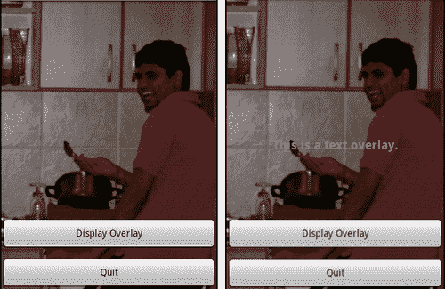
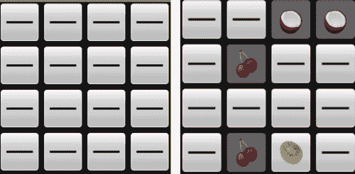
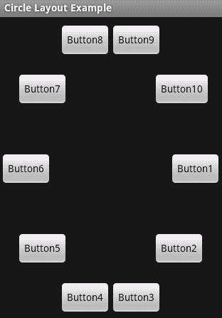
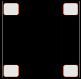
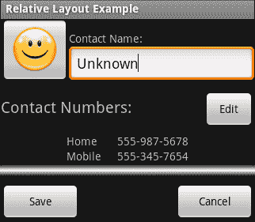
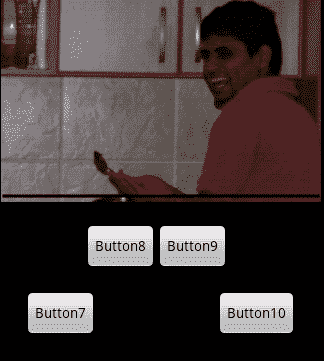

# 五、开发非线性布局

*非线性布局通常是用户界面设计的一个完全基本的主题。然而，在一个小屏幕的设备上(就像许多安卓设备一样)，这并不总是有意义的。也就是说，安卓设备可以转向横向模式，在这种模式下，你突然有了大量的水平空间，而有限的垂直空间。在这些情况下(正如我们将看到的，在许多其他情况下也是如此)，您将希望使用一种不同于我们迄今为止使用的简单的旧 `LinearLayout`结构的布局。*

*安卓布局的真正力量来自与旧 Java AWT `LayoutManagers`的力量相同的地方——通过将不同的布局类相互结合。例如，将 `FrameLayout`与其他`ViewGroup`实现相结合，可以让用户界面的各个部分相互叠加。*

重要的是要考虑你的布局如何在不同尺寸的屏幕上发挥作用。虽然安卓确实允许你根据设备的屏幕大小选择不同的布局，但这意味着你必须为你的应用在野外遇到的不同屏幕大小和密度保持多种布局。你应该尽可能利用安卓提供的工具，并使用根据各种`View`对象的大小而缩放的布局。

在这一章中，我们将研究安卓默认提供给我们的各种其他布局风格，并研究每种布局风格的各种替代用途。我们还将仔细研究您如何为不同的布局指定参数，以及它们如何有助于可用性，而不是简单地将您的小部件按特定的顺序排列。

# 行动时间-创建布局示例项目

在我们浏览每一个布局之前，我们需要一个共同的项目，我们将在其中展示每一个布局。

1.  在命令提示符下，创建名为**布局** :

    ```java
    android create project -n Layouts -p Layouts -k com.packtpub.layouts -a LayoutSelectorActivity -t 3
    ```

    的新项目
2.  删除标准`res/layout/main.xml`布局资源文件。
3.  在编辑器或 IDE 中打开`res/values/strings.xml`文件。
4.  在文件中添加一个名为`layouts`的新`<string-array>`:

    ```java
    <string-array name="layouts">
    ```

5.  向新的 `<string-array>`元素添加以下项目:

    ```java
    <item>Frame Layout</item>
    <item>Table Layout</item>
    <item>Custom Layout</item>
    <item>Relative Layout</item>
    <item>Sliding Drawer</item>
    ```

6.  在编辑器或 IDE 中打开 `LayoutSelectorActivity`源文件。
7.  让类从`ListActivity`继承而不是`Activity` :

    ```java
    public class LayoutSelectorActivity extends ListActivity {
    ```

8.  在`onCreate`方法中，将您在`strings.xml`资源文件中声明的`ListActivity`的内容设置为您的`layouts`数组:

    ```java
    setListAdapter(new ArrayAdapter<String>(
            this,
            android.R.layout.simple_list_item_1, Have the class inherit from"
            getResources().getStringArray(R.array.layouts)));
    ```

9.  覆盖 `onListItemClick`方法:

    ```java
    protected void onListItemClick(
            ListView l,
            View v,
            int position,
            long id) {
    ```

10.  在 `position`参数上创建`switch`语句:

    ```java
    switch(position) {
    ```

11.  添加一个`default`子句(目前唯一的一个)让自己知道还没有为所选项目实现一个示例:

    ```java
    default:
        Toast.makeText(
                this,
                "Example not yet implemented.",
                Toast.LENGTH_SHORT).show();
    ```

## *刚刚发生了什么？*

新项目将作为本章中每个示例的基础。对于我们处理的每个布局，我们将构建一个新的`Activity`，它将成为这个应用的一部分。目前，该应用仅包含一个用于访问每个布局示例的菜单。现在的想法是用有趣的东西填满每一个。

在这一章中，我们将不仅探索基本的布局，还将探索如何使它们相互作用。

# 帧布局

`FrameLayout`类将其每个小部件锚定在自己的左上角。这意味着每个子小部件都绘制在前一个之上。这可以用来从 AWT 中模拟一个 `CardLayout`，通过使用`View.setVisible`来显示其中一个孩子，同时隐藏所有其他孩子(这是`TabHost`的有效工作方式)。

由于`FrameLayout`实际上绘制了它所有可见的子部件，它可以用来将子部件层叠在一起。在某些情况下，它会产生非常奇怪的效果，而在其他情况下，它会非常有用。例如，可以通过使用半透明`View`对象和`FrameLayout`来使除一个之外的所有小部件变暗。不活动的小部件是`FrameLayout`中的第一层，半透明的`View`对象是第二层，活动的小部件是第三层。

## 常用

`FrameLayout`最常见的用法可能是与 `TabHost`结合使用——为每个选项卡保存内容`View`对象。您还可以使用它来模拟更多的桌面感觉，方法是将小部件层叠在一起。它也可以在游戏中非常有效地使用，显示游戏中的菜单，或者在游戏的主菜单后面画一个动画背景。

通过将`FrameLayout`对象与占据整个屏幕的小部件相结合，您可以利用`gravity`属性将对象更精确地放置在其他小部件之上。为此，你通常会希望每个`FrameLayout`孩子成为某种`ViewGroup`，因为除非被告知，否则他们通常不会在背景中绘画(让较低的层可见)。

一`FrameLayout`也能显示一`foreground`。虽然所有`View`对象都有 `background`属性，`FrameLayout`包含一个`foreground`(也是可选的`Drawable`)。`foreground`将绘制在所有子部件的顶部，允许显示一个“框架”。

# 行动时间到了——开发框架布局示例

要真正理解`FrameLayout`是做什么的，以及如何使用它，最好用一个例子来说明一下。在这个例子中，我们将使用一个`FrameLayout`在一个`ImageView`之上放置一些`Button`小部件，并且当点击其中一个按钮时显示和隐藏一个`TextView`消息。

为了让这个例子起作用，你需要一个图像作为背景图像。我要用我一个朋友的照片。像往常一样，把你的图片放在`res/drawable`目录下，试着用一个 PNG 文件。

1.  创建一个名为`res/layout/frame_layout.xml`的新布局资源文件。
2.  将根元素声明为消耗所有可用空间的【T0:

    ```java
    <FrameLayout
        xmlns:android="http://schemas.android.com/apk/res/android"
        android:layout_width="fill_parent"
        android:layout_height="fill_parent">
    ```

3.  在`FrameLayout`内部，创建一个`ImageView`作为背景图像。它应该可以扩展到填满所有可用空间:

    ```java
    <ImageView android:src="@drawable/jaipal"
               android:scaleType="centerCrop"
               android:layout_width="fill_parent"
               android:layout_height="fill_parent"/>
    ```

4.  现在创建一个垂直的`LinearLayout`，我们将在屏幕底部放置两个`Button`对象:

    ```java
    <LinearLayout android:orientation="vertical"
                  android:gravity="bottom"
                  android:layout_width="fill_parent"
                  android:layout_height="fill_parent">
    ```

5.  创建一个`Button`，我们将使用它来切换`FrameLayout`的一个子层(创建一个类似对话框的效果):

    ```java
    <Button android:text="Display Overlay"
            android:id="@+id/overlay_button"
            android:layout_width="fill_parent"
            android:layout_height="wrap_content"/>
    ```

6.  创建另一个`Button`退出演示并返回菜单:

    ```java
    <Button android:text="Quit"
            android:id="@+id/quit"
            android:layout_marginTop="10sp"
            android:layout_width="fill_parent"
            android:layout_height="wrap_content"/>
    ```

7.  在`</LinearLayout>`之后，创建一个最终的`TextView`元素，当点击第一个按钮时，我们将显示和隐藏该元素。默认情况下，它是隐藏的:

    ```java
    <TextView android:visibility="gone"
              android:id="@+id/overlay"
              android:textSize="18sp"
              android:textStyle="bold"
              android:textColor="#ffff843c"
              android:text="This is a text overlay."
              android:gravity="center|center_vertical"
              android:layout_width="fill_parent"
              android:layout_height="fill_parent"/>
    ```

8.  在项目的根包中创建新的`FrameLayoutActivity` Java 类，并在编辑器或 IDE 中打开源文件。新类需要从`Activity`扩展并实现`OnClickListener`类(针对来自这两个`Button`小部件的事件):

    ```java
    public class FrameLayoutActivity
            extends Activity implements OnClickListener {
    ```

9.  覆盖`onCreate`方法:

    ```java
    protected void onCreate(Bundle savedInstanceState) {
    ```

10.  调用`super.onCreate`方法使`Activity`代码工作:

    ```java
    super.onCreate(savedInstanceState);
    ```

11.  将内容布局设置为刚刚创建的`frame_layout`资源:

    ```java
    setContentView(R.layout.frame_layout);
    ```

12.  找到您在`frame_layout`资源文件中声明的`overlay Button`小部件，并创建对它的引用:

    ```java
    Button overlay = (Button)findViewById(R.id.overlay_button);
    ```

13.  将其`OnClickListener`设置为新的`FrameLayoutActivity`对象:

    ```java
    overlay.setOnClickListener(this);
    ```

14.  找到`quit Button`部件:

    ```java
    Button quit = (Button)findViewById(R.id.quit);
    ```

15.  然后将其设置为`FrameLayoutActivity`对象:

    ```java
    quit.setOnClickListener(this);
    ```

16.  `OnClickListener`界面要求我们实现一个`onClick`方法，签名如下:

    ```java
    public void onClick(View view) {
    ```

17.  在`View`参数的标识上创建`switch`语句:

    ```java
    switch(view.getId()) {
    ```

18.  如果用户小部件点击的`View`是`overlay_button Button`，那么使用如下:

    ```java
    case R.id.overlay_button:
    ```

19.  从布局中获取`overlay View`对象:

    ```java
    View display = findViewById(R.id.overlay);
    ```

20.  根据其当前状态切换其可见性，然后从开关

    ```java
    display.setVisibility(
            display.getVisibility() != View.VISIBLE
            ? View.VISIBLE
            : View.GONE);
    break;
    ```

    切换`break`
21.  如果用户小部件点击的`View`是`quit Button`，那么使用如下:

    ```java
    case R.id.quit:
    ```

22.  调用`finish()`方法，从`switch`语句中调用【T1:

    ```java
    finish();
    break;
    ```

23.  在你的编辑器或者 IDE 中打开`LayoutSelectorActivity` Java 源码。
24.  在`onListItemClick`方法中，在`switch`语句中创建新的`case`，对于`position`值`0` :

    ```java
    case 0:
    ```

25.  使用明确的`Intent` :

    ```java
    startActivity(new Intent(this, FrameLayoutActivity.class));
    break;
    ```

    启动`FrameLayoutActivity`
26.  在编辑器或 IDE 中打开`AndroidManifest.xml`文件。
27.  将新的`FrameLayoutActivity`添加到清单文件中:

    ```java
    <activity android:name=".FrameLayoutActivity"
              android:label="Frame Layout Example"/>
    ```

## *刚刚发生了什么？*

新的`FrameLayoutActivity`利用了简单的三层`FrameLayout`。我们使用一个`ImageView`对象来绘制一个漂亮的背景图像，在它上面我们放置了两个按钮。虽然第三层(第三层`TextView`小部件)在点击顶部按钮之前是不可见的，但需要注意的是，不仅顶部`TextView`的背景是透明的，它还将点击事件委托给技术上位于其下方的小部件(第五层`TextView`有一个小部件，其高度消耗了整个`FrameLayout`)。这将继续工作，即使`TextView`的背景不透明。更多的是和`TextView`不“可点击”有关。如果您将`OnClickListener`添加到`overlay TextView`对象中，它下面的按钮将停止工作。这意味着您需要小心如何在`FrameLayout`中对小部件进行分层(尽管只要一个小部件不占用另一个小部件相同的空间，这不会成为您的问题)。

在本例中，我们在布局中添加了一个**退出**按钮，并使用`finish()`方法在点击`Button`时关闭`Activity`。你会发现你通常不会直接使用 `finish()`方法，因为用户将主要通过你的应用前进。如果用户想要返回，他们通常会使用硬件“返回”按钮，或者按硬件“主页”按钮来完全退出您的应用。

上面例子的最后一点——在`frame_layout.xml`文件中，我们将`overlay`声明为`TextView`小部件。然而，在 Java 代码中，我们使用`View`类而不是`TextView`来访问它。这是一个简单的解耦案例。除非您在一段以性能为中心的代码中工作，否则在尽可能高的类树中引用布局小部件是个好主意。这将允许您在以后更快地修改用户界面。在这种情况下，您可以将简单的`TextView`更改为整个`LinearLayout`，而完全不需要更改 Java 代码。

以下是`FrameLayout`示例的两个截图，启用和不启用`overlay TextView`。这种布局非常适合在游戏菜单或类似的结构中使用，在这种结构中，您需要将不同的小部件层叠在一起。



# 表格布局

第 e `Table Layout`在一个 HTML 样式的网格中排列它的孩子。这有点像 AWT `Grid Layout`类，但灵活性更高。与安卓系统中的大多数其他布局类不同，`Table Layout`使用自己的专用直子`View`类，名为`Table Row`。`Table Layout`类也不允许定义行数或列数(使其更像 HTML 的`<` `table>`元素)。取而代之的是，行数和列数是通过`Table Layout`及其`Table Row`子代中的小部件数量来计算的。

`Table Layout`中的一个单元格可以占用任意数量的行和列，尽管`Table Row`中的`View`的默认值是占用一个表格单元格。但是，如果您将`View`作为`Table Layout`的直接子代，它将消耗一整行。

`Table Layout`也是一个相对的布局结构，这在使用安卓设备时至关重要。能够根据网格线对齐所有内容，使您的用户界面能够从微型手机的最低分辨率扩展到 7 英寸平板电脑的高密度屏幕。

`android:gravity`属性在`Table Layout`中的作用远远大于其他布局类。在小屏幕上看起来很棒的东西在大屏幕上看起来可能完全不同，这不是因为屏幕的大小，而是因为所使用的字体的缩放比例。要小心，尤其是标签和小部件的垂直对齐。最简单的方法是将所有的表格部件垂直居中，然后从那里开始工作。请务必在各种屏幕分辨率和尺寸下测试任何基于表格的布局。

## 常用

最常见的是，你会发现自己在使用`Table Layout`来排列输入表单。它对于布局复杂的信息也很有用，尤其是当制作一些跨几行几列的`View`对象时。`Table Layout`最重要的特点来自于它以非常严格的方式排列单元格，以及它是相对大小的布局。

A `Table Layout`也可以用来达到类似于 AWT `Border Layout`类的效果。一般来说，当调整一个`Table Layout`来适应整个屏幕时，它就变成了一个非常不同于简单网格的工具，允许你在控件中间适应一个`Scroll View`。

通过在`FrameLayout`中使用`Table Layout`，您可以在内容`View`上安排一个控件`View`(想想谷歌地图中的控件)。此外，请记住，与 AWT `GridLayout`不同的是，`TabelLayout`内的`View`的大小并不取决于其所在的桌子单元的大小。通过使用`gravity`属性(可能还有布局边距)，您可以在表格单元格中放置一个`View`对象，从而使布局更加用户友好。

## 使用 TableLayout 进行记忆游戏

为了 演示`TableLayout`，我想写一个简单的记忆卡游戏会很有趣。你会看到一个网格(以`TableLayout`的形式)的“卡片”，你可以触摸它来有效地翻转。然后，您可以尝试将所有这些卡片与卡片上显示的内容进行匹配(一次只能翻两张)。在这个例子中，你需要一些图片放在卡片上(我重复使用了发货例子中的水果图标)。在这个应用中，我们还将以 XML 文件的形式创建一个简单的占位符图像。

要创建占位符图像，在`res/drawable`目录中创建新的 XML 资源，命名为`line.xml`。这将是一个“形状”资源。形状资源对于创建简单、可缩放的形状非常有用。此外，形状资源文件可以利用您可以从代码中提供的任何颜色、纹理或渐变。

将以下代码复制到`line.xml`文件中，以便为我们的示例创建简单的占位符图像:

```java
<?xml version="1.0" encoding="UTF-8"?>

<shape xmlns:android="http://schemas.android.com/apk/res/android"
       android:shape="line">

    <stroke android:width="3dp"
            android:color="#ff000000"/>

    <padding android:left="1dp"
             android:top="1dp"
             android:right="1dp"
             android:bottom="1dp"/>
</shape>
```

# 行动时间——开发一款简单的记忆游戏

像几乎所有以前的例子一样，我们将在这个游戏中完全用 Java 代码生成布局。其主要原因是内容高度重复，每个单元格包含几乎完全相同的小部件。我们用一个`TableLayout`来创建网格，并在`ImageButton`小部件中显示“卡片”。为了封装单个卡的行为，我们创建了一个`MemoryCard`内部类，它保存了对它所控制的`ImageButton`的引用。

1.  Cr 在项目的根包中创建一个新的 Java 类，并命名为`TableLayoutActivity`。
2.  使新类扩展`Activity` :

    ```java
    public class TableLayoutActivity extends Activity {
    Declare and array of all the icon resources to use as card images, there must be eight images resources declared in this array:private static final int[] CARD_RESOURCES = new int[]{
        R.drawable.apple,
        R.drawable.banana,
        R.drawable.blackberry,
        // …
    };
    ```

3.  你需要一个计时器来翻牌，所以声明一个`Handler` :

    ```java
    private final Handler handler = new Handler();
    ```

4.  声明一组`MemoryCard`对象:

    ```java
    private MemoryCard[] cards;
    ```

5.  我们要么交出一两张卡片(我们想记录下来)。为第一个声明一个占位符:

    ```java
    private MemoryCard visible = null;
    ```

6.  如果有两张牌翻过来，但是不匹配，我们用一个简单的`boolean`开关禁用触摸(我们的事件监听器会检查这个):

    ```java
    private boolean touchEnabled = true;
    ```

7.  现在声明一个名为`MemoryCard`的内部类，它实现了`OnClickListener`接口:

    ```java
    private class MemoryCard implements OnClickListener {
    ```

8.  `MemoryCard`类引用了一个`ImageButton` :

    ```java
    private ImageButton button;
    ```

9.  `MemoryCard`类还有一个值，是对其表面图像资源的引用:

    ```java
    private int faceImage;
    ```

10.  最后，一个`MemoryCard`使用一个`boolean`值来记住它的状态(无论是面部图像，还是占位符图像是可见的):

    ```java
    private boolean faceVisible = false;
    ```

11.  为`MemoryCard`类声明一个构造函数，它只需要取人脸图像的资源标识符:

    ```java
    MemoryCard(int faceImage) {
    ```

12.  存储`faceImage`资源标识符以备后用:

    ```java
    this.faceImage = faceImage;
    ```

13.  创建一个新的`ImageButton`对象，使用`TableLayoutActivity`对象作为其`Context`(该`ImageButton`将用于加载图像):

    ```java
    this.button = new ImageButton(TableLayoutActivity.this);
    ```

14.  将`ImageButton`的大小设置为固定的 64 x 64 像素:

    ```java
    this.button.setLayoutParams(new TableRow.LayoutParams(64, 64));
    ```

15.  设置缩放类型，使图标适合`ImageButton`，然后将图像设置为占位符资源:

    ```java
    this.button.setScaleType(ScaleType.FIT_XY);
    this.button.setImageResource(R.drawable.line);
    ```

16.  将`MemoryCard`对象指定为`ImageButton`对象的`OnClickListener`:

    ```java
    this.button.setOnClickListener(this);
    ```

17.  为了以后方便起见，`MemoryCard`需要一个`setFaceVisible`方法，该方法将在显示占位符和`faceImage`资源之间切换:

    ```java
    void setFaceVisible(boolean faceVisible) {
        this.faceVisible = faceVisible;
        button.setImageResource(faceVisible
                ? faceImage
                : R.drawable.line);
    }
    ```

18.  在`MemoryCard`班实施`onClick`方法:

    ```java
    public void onClick(View view) {
    ```

19.  首先，确保面部当前不可见(因此我们被调低了)，并且触摸被启用(并且其他一些卡片不会再次被调低):

    ```java
    if(!faceVisible && touchEnabled) {
    ```

20.  如果满足这些条件，我们告诉`TableLayoutActivity`我们已经被触摸了，想要被正面朝上:

    ```java
    onMemoryCardUncovered(this);
    ```

21.  在`MemoryCell`内部类之后，在`TableLayoutActivity`中创建一个简单的实用方法来创建一个特定大小的`MemoryCell`对象的有序数组:

    ```java
    private MemoryCard[] createMemoryCells(int count) {
    ```

22.  当我们创建每个`MemoryCell`对象时，我们成对地创建它们，并且以与我们的图标资源数组中指定的相同顺序:

    ```java
    MemoryCard[] array = new MemoryCard[count];
    for(int i = 0; i < count; i++) {
        array[i] = new MemoryCard(CARD_RESOURCES[i / 2]);
    }
    ```

23.  完成后，返回`MemoryCell`对象的新数组:

    ```java
    return array;
    ```

24.  现在覆盖`onCreate`方法:

    ```java
    protected void onCreate(Bundle savedInstanceState) {
    ```

25.  调用`Activity.onCreate`方法:

    ```java
    super.onCreate(savedInstanceState);
    ```

26.  现在创建一个新的`TableLayout`对象，将`TableLayoutActivity`作为`Context`传递给它，用于加载样式和资源:

    ```java
    TableLayout table = new TableLayout(this);
    ```

27.  默认情况下，我们创建一个四乘四的网格:

    ```java
    int size = 4;
    cards = createMemoryCells(size * size);
    ```

28.  然后我们对它进行随机排序:

    ```java
    Collections.shuffle(Arrays.asList(cards));
    ```

29.  创建每一个需要的`TableRow`对象，并用`ImageButtons`填充，由网格中的`MemoryCard`对象创建:

    ```java
    for(int y = 0; y < size; y++) {
        TableRow row = new TableRow(this);
        for(int x = 0; x < size; x++) {
            row.addView(cards[(y * size) + x].button);
        }
        table.addView(row);
    }
    ```

30.  将`Activity`内容视图设置为`TableLayout`对象:

    ```java
    setContentView(table);
    ```

31.  现在我们编写`onMemoryCardUncovered`方法，由`MemoryCard.onClick`实现调用:

    ```java
    private void onMemoryCardUncovered(final MemoryCard cell) {
    ```

32.  首先，查看当前是否有`visible MemoryCard`，如果没有，则用户触摸的卡片正面朝上，我们记住了:

    ```java
    if(visible == null) {
        visible = cell;
        visible.setFaceVisible(true);
    }
    ```

33.  如果已经有面朝上的卡片，检查它们是否有相同的图像。如果图像相同，禁用`ImageButton`小部件，这样我们就可以忽略事件:

    ```java
    else if(visible.faceImage == cell.faceImage) {
        cell.setFaceVisible(true);
        cell.button.setEnabled(false);
        visible.button.setEnabled(false);
        visible = null;
    }
    ```

34.  最后，如果面部图像不匹配，我们将用户触摸的卡片面朝上翻转`touchEnabled`开关，这样`MemoryCard`对象将忽略所有其他触摸事件一秒钟:

    ```java
    else {
        cell.setFaceVisible(true);
        touchEnabled = false;
    ```

35.  然后我们在我们的`Handler`上发布一条延迟消息，这将再次使两张卡片面朝上，并重新启用触摸事件:

    ```java
    handler.postDelayed(new Runnable() {
        public void run() {
            cell.setFaceVisible(false);
            visible.setFaceVisible(false);
            visible = null;
            touchEnabled = true;
        }
    }, 1000); // one second before we flip back over again
    ```

## *刚刚发生的事情*

在前面的例子中，应该很明显地看到为什么我们手动编写布局代码，在一个 XML 文件中构建它会非常重复。您会注意到代码创建了一个`TableRow`对象作为`TableLayout`的直接子对象，就像我们在一个 XML 文件中所做的那样。

`MemoryCard`的`onClick`方法使用`touchEnabled`开关决定是否呼叫`onMemoryCardUncovered`。然而，这并不能阻止用户按压`ImageButton`物体，也不能阻止物体对用户做出反应(尽管它们不会翻转)。为了获得更友好的用户体验，最好在每个启用的`ImageButton`对象上使用`setClickable`方法，以完全阻止它们对用户的触摸做出反应。

当我们创建`ImageButton`对象时，我们以 64 x 64 像素预先调整它们的大小。虽然这对于大模拟器屏幕来说很好，但有很多设备不适合屏幕上的 4×4 按钮网格。我建议您使用一个 XML 资源来创建`ImageButton`对象。

前面的代码使用`setLayoutParams(new TableRow.LayoutParams(64, 64));`来设置`ImageButton`对象的大小。需要注意的是，因为我们将`ImageButton`物体放入`TableRow`中，它们的`LayoutParams`必须是`TableRow.LayoutParams`类型。如果你试着换一个通用的`ViewGroup.LayoutParams`，那么用户界面就不会布局(只是空白)。以下是工作应用的两个截图:



## 加油英雄

`TableLayout`的例子效果很好，但是网格的位置不太好(在屏幕的左上方)，在黑色背景下很沉闷。是时候让它看起来很棒了！

首先使用`FrameLayout`给游戏添加一个背景图像。这将通过增加更多的颜色来增强游戏的整体吸引力。你也应该借此机会将网格居中显示在屏幕上。把它放在左上角会让它看起来有些不平衡。

您还应该尝试移除`touchEnabled`开关，而不是在每个`ImageButton`对象上使用`setClickable`。这将阻止他们在你正面朝下翻牌时提供视觉上的“按下并释放”反馈。

# 绝对布局/自定义布局

**不要使用绝对视频！绝对不推荐使用！**也就是说，有时候使用`AbsoluteLayout`类是有意义的。那么为什么不应该使用`AbsoluteLayout`类，应该在哪里使用呢？第一个问题的答案很简单——一个`AbsoluteLayout`的所有子部件都有它们的确切位置，它们不会在不同的屏幕上改变大小或位置。这也使得您的布局几乎不可能被重用(例如，将其导入另一个布局，或者将其嵌入另一个应用)。

如果你要和一个`AbsoluteLayout`一起工作，你应该用以下两种方法中的任何一种:

1.  为每个不同的屏幕大小仔细构建一个单独的布局 XML。
2.  用 Java 代码而不是 XML 编写布局数据。

T 他首先是不切实际的，除非你指定应用只在特定的设备上运行，并且布局不能在你的应用之外使用。然而，第二个选项开辟了“正确”的途径——编写自定义布局管理器。由于`AbsoluteLayout`要求严格的位置，并且不允许与子`View`对象的测量进行简单的交互，定义不适合任何过度布局类的布局的最佳方式是在您自己的`ViewGroup`类中定义自定义布局。

## 开发自己的布局

由于`AbsoluteLayout`已被弃用，但许多人似乎仍坚持使用它，这个例子将不仅展示编写自己的`ViewGroup`类定义一个新的布局是多么容易，而且展示将该布局集成到布局 XML 资源中是多么容易。这将因此证明没有令人信服的理由使用`AbsoluteLayout`(除非它真的有意义)。

# 行动时间-创建自定义布局

要真正演示自定义布局的使用，您需要尝试构建一些不同寻常的东西。在下面的例子中，你将把一个`ViewGroup`放在一起，它把它的孩子排列成一个漂亮的圆圈。这不是一个非常辉煌的布局，也不是特别有用，但是圆圈很好看，它会在屏幕中心提供有用的负空间(可以使用`FrameLayout`填充)。

1.  在名为`CircleLayout.java`的项目的根包中创建新的 Java 源文件，并在您的编辑器或 IDE 中打开它。
2.  宣布`CircleLayout`为扩展`ViewGroup`类:

    ```java
    public class CircleLayout extends ViewGroup
    ```

3.  声明三个`ViewGroup`构造函数，并让它们直接委托给`ViewGroup`默认构造函数:

    ```java
    public CircleLayout(Context context) {
        super(context);
    }
    // ...
    ```

4.  我们需要知道子`View`物体的宽度所占的最大像素数量，以及子`View`物体的高度所占的最大像素数量。为了避免不必要的开销，我们借此机会把`measure`这个孩子`View`也当成了对象。声明一个名为`measureChildrenSizes`的实用方法来执行这两个操作:

    ```java
    private int[] measureChildrenSizes(int sw, int sh) {
    ```

5.  声明一个`int`来保持我们找到的最大宽度和高度:

    ```java
    int maxWidth = 0;
    int maxHeight = 0;
    ```

6.  创建一个`for`循环来迭代这个`CircleLayout`对象中的每个子`View`对象:

    ```java
    for(int i = 0; i < getChildCount(); i++) {
    ```

7.  在当前索引处声明对`View`的引用:

    ```java
    View child = getChildAt(i);
    ```

8.  作为一个布局小部件，您的类将负责设置它的所有子小部件的显示大小。为了知道子部件所需的宽度和高度，需要使用`ViewGroup`类中的`measureChild`方法:

    ```java
    measureChild(child, sw, sh);
    ```

9.  根据您之前创建的最大宽度和高度变量，测试子对象的宽度和高度:

    ```java
    maxWidth = Math.max(maxWidth, child.getMeasuredWidth());
    maxHeight = Math.max(maxHeight, child.getMeasuredHeight());
    ```

10.  在方法的最后，返回一个包含在过程中找到的最大宽度和高度的数组:

    ```java
    return new int[]{maxWidth, maxHeight};
    ```

11.  执行`ViewGroup`

    ```java
    protected void onLayout(boolean changed,
            int l, int t, int r, int b) {
    ```

    的`onLayout`方法
12.  计算我们可用空间的宽度和高度:

    ```java
    int w = r – l;
    int h = b - t;
    ```

13.  声明一个变量来保存子`View`对象的数量:

    ```java
    int count = getChildCount();
    ```

14.  根据可用空间量

    ```java
    int[] max = measureChildrenSizes(w, h);
    ```

    ，对所有子`View`对象进行测量
15.  从可用空间中减去最大宽度和高度，以便所有子`View`对象都适合屏幕:

    ```java
    w -= max[0];
    h -= max[1];
    ```

16.  计算`CircleLayout`中的中心点:

    ```java
    int cx = w / 2;
    int cy = h / 2;
    ```

17.  创建一个`for`循环，再次迭代每个子`View`对象:

    ```java
    for(int i = 0; i < count; i++) {
    ```

18.  声明一个变量来保存当前子`View`对象:

    ```java
    View child = getChildAt(i);
    ```

19.  计算子`View`对象的`x`和`y`位置:

    ```java
    double v = 2 * Math.PI * i / count;
    int x = l + (cx + (int)(Math.cos(v) * cx));
    int y = t + (cy + (int)(Math.sin(v) * cy));
    ```

20.  在中，使用计算出的圆中的坐标选择子`View`对象的布局方法:

    ```java
    child.layout(
            x, y,
            x + child.getMeasuredWidth(),
            y + child.getMeasuredHeight());
    ```

## *刚刚发生了什么？*

类是一个非常简单的实现。除了其子元素的要求宽度和高度之外，它没有可以在 XML 资源中使用的特殊属性。但是，它会注意到您为其子代声明的大小，因此`layout_width`和`layout_height`属性将正常工作。

需要注意的是，为了利用布局 XML 资源中的自定义`View`或`ViewGroup`，需要覆盖所有三个默认构造函数。

### 注

第 e `LayoutInflater`将使用这些构造函数之一来创建你的类的实例。如果它想要使用的那个没有到位，当你试图膨胀布局 XML 文件时，你会得到可怕的**强制关闭**对话框。

`CircleLayout`有自己的实用方法来处理其子`View`对象的测量。一般来说，`ViewGroup`会使用`V` `iewGroup.measureChildren`实用程序方法，在执行实际布局之前，查看其所有子`View`对象的测量情况。然而，我们需要迭代子`View`对象的列表，以便找到最大的使用宽度和高度，因此我们自己执行测量，而不是执行三次迭代。

## 使用循环布局

为了利用您的自定义`ViewGroup`实现，很高兴知道安卓已经覆盖了您的 XML 布局资源。当您需要从一个 XML 布局资源中引用一个定制的`View`或`ViewGroup`类时，您只需使用完整的类名而不是简单的类名。下面是一个使用`CircleLayout`的 XML 布局的简单示例:

```java
<com.packtpub.layouts.CircleLayout
    xmlns:android="http://schemas.android.com/apk/res/android"
    android:layout_width="fill_parent"
    android:layout_height="fill_parent">

    <Button android:text="Button1"
            android:layout_width="wrap_content"
            android:layout_height="wrap_content"/>

    <Button android:text="Button2"
            android:layout_width="wrap_content"
            android:layout_height="wrap_content"/>

    <!-- 10 Buttons in total works nicely 

</com.packtpub.layouts.CircleLayout>
```

# 行动时间-完成循环布局示例

我们已经有了`CicleLayout`实现，但是我们现在真的应该把它包括在我们的“布局”例子中。为此，我们需要一个布局资源 XML 文件，一个新的`CircleLayoutActivity`类。我们还需要向安卓(在清单文件中)和我们的`LayoutSelectorActivity`类(在其事件监听器中)注册新的`Activity`。

1.  将前面的 XML 布局复制到名为`res/layout/circle_layout.xml`的新文件中。它最适合作为`CircleLayout ViewGroup`的子代添加的大约十个小部件。
2.  在名为`CircleLayoutActivity.java`的项目根包中创建新的 Java 源文件。在编辑器或集成开发环境中打开它。
3.  `CircleLayoutActivity`必须延长`Activity`级:

    ```java
    public class CircleLayoutActivity extends Activity {
    ```

4.  覆盖`Activity`的`onCreate`方法:

    ```java
    protected void onCreate(Bundle savedInstanceState) {
    ```

5.  调用超级类:

    ```java
    super.onCreate(savedInstanceState);
    ```

6.  将内容视图设置为`circle_layout`布局资源:

    ```java
    setContentView(R.layout.circle_layout);
    ```

7.  在编辑器或 IDE 中打开`AndroidManifest.xml`文件。
8.  Af 之三`TableLayoutActivity`申报，申报新`CircleLayoutActivity` :

    ```java
    <activity android:name=".CircleLayoutActivity"
              android:label="Circle Layout Example"/>
    ```

9.  在编辑器或 IDE 中打开`LayoutSelectorActivity`源文件。
10.  在`onListItemClick`方法中，在`default case`之前，添加一个新的`case`语句来启动`CircleLayoutActivity` :

    ```java
    case 2:
        startActivity(new Intent(
            this, CircleLayoutActivity.class));
        break;
    ```

## *刚刚发生了什么？*

哟你现在有了一个新的`Activity`实现，它使用了你自己定制的`ViewGroup`实现。当你有一个难以表达的布局，而标准的`ViewGroup`实现不能很好地处理时，定制的`ViewGroup`类不仅仅是有用的。当默认的`ViewGroup`实现对于您想要实现的特定结构来说太慢时，定制的`ViewGroup`也是一个选项。

您在本章中构建的“布局”示例现在将有一个可用的**自定义布局**菜单项。点击它，你会看到下面的截图。尝试添加除`Button`对象之外的小部件，甚至可能尝试扔一个孩子`ViewGroup`进去看看会发生什么。



## 突击测验

1.  布局一般分两个阶段，第一阶段叫什么？
    1.  预布局
    2.  计算
    3.  父布局
    4.  尺寸
2.  布局方法的四个参数意味着什么？
    1.  x、y、宽度和高度。
    2.  左、上、右、下。
    3.  父`ViewGroup`的大小。
3.  自定义`ViewGroup`实现如何读取布局 XML 属性？
    1.  它们由`LayoutInflator`注入沉降器。
    2.  它们装载了`View.getAttribute`方法。
    3.  他们从传递到`ViewGroup`构造函数的`AttributeSet`对象中读取它。

# 相对布局

`RelativeLayout`类可以说是安卓提供的最强大的布局。这是一个相对的布局，管理不同大小的小部件，并且将小部件相互对齐，而不是与父部件或网格线对齐。在某些方面，`RelativeLayout`与 Swing `GroupLayout`类有着惊人的相似之处，尽管它远没有那么复杂。`RelativeLayout`中的每个小部件都定位在另一个小部件或其父部件(T4)上。

`RelativeLayout`计算单个循环中每个子对象的位置，因此它强烈依赖于您指定子对象的顺序。然而，这并不意味着您必须按照小部件在屏幕上的显示顺序来指定它们。由于`RelativeLayout`的性质，子部件通常以不同的顺序声明和显示。这还要求用于对齐其他小部件的任何用户界面元素都必须分配有一个标识。这甚至包括通常不需要标识的非交互用户界面元素，现在必须分配一个标识，即使它们永远不会在布局之外使用。

使用`RelativeLayout`非常灵活，但也可能需要一些仔细的计划。与任何用户界面一样，首先在纸上绘制布局会有很大帮助。一旦有了纸质图，就可以开始根据`RelativeLayout`类指定的规则规划如何构建布局。

## 常用

`RelativeLayout`的用法与`TableLayout`非常相似。它非常适合绘制表单和内容视图。然而，`RelativeLayout`并不局限于`TableLayout`的网格模式，因此可以在屏幕上物理上彼此远离的小部件之间创建关系(即，通过将它们彼此对齐)。

`RelativeLayout`根据同一`RelativeLayout`中的其他部件和/或`RelativeLayout`本身的边界来定位和调整部件的大小。这意味着一些小部件可能被放置在屏幕的顶部，您可以在屏幕的底部对齐另一组小部件，如下图所示。



## 整合相对布局

当面对联系人编辑器时， `RelativeLayout`是产生易于使用的用户界面的完美工具。对于下一个示例，我们构建了一个非常简单的联系人编辑用户界面，其中包括用户的图像。

# 行动时间-创建联系人编辑器

他的例子要求一些用户界面元素被无序声明(如前所述)。我们还将在屏幕底部包括**保存**和**取消** `Button`小部件。这个例子可以追溯到在资源 XML 文件中声明用户界面，而不是用 Java 代码编写它。在本例中，您将需要用户联系人照片的占位符图像。一个 64 x 64 像素的 PNG 文件是合适的大小(我使用了一个大的笑脸图像)。

1.  首先创建一个名为`res/layout/relative_layout.xml`的新的 XML 布局文件。在编辑器或 IDE 中打开此文件。
2.  将根元素声明为全屏`RelativeLayout` :

    ```java
    <RelativeLayout
        xmlns:android="http://schemas.android.com/apk/res/android"
        android:layout_width="fill_parent"
        android:layout_height="fill_parent">
    ```

3.  创建一个上面有用户图标的`ImageButton`。`ImageButton`应与屏幕左上角对齐，并有一个占位符图像:

    ```java
    <ImageButton android:src="@drawable/face"
                 android:id="@+id/photo"
                 android:layout_alignParentTop="true"
                 android:layout_alignParentLeft="true"
                 android:layout_width="wrap_content"
                 android:layout_height="wrap_content"/>
    ```

4.  添加一个`EditText`，用户可以在其中键入联系人的姓名。将其与`ImageButton` :

    ```java
    <EditText android:text="Unknown"
              android:id="@+id/contact_name"
              android:layout_alignBottom="@id/photo"
              android:layout_toRightOf="@id/photo"
              android:layout_width="fill_parent"
              android:layout_height="wrap_content"/>
    ```

    的右下方对齐
5.  现在添加一个`TextView`作为`EditText`小部件的标签。我们把它对准`ImageButton`的右边，但是在`EditText`的上面:

    ```java
    <TextView android:text="Contact Name:"
              android:id="@+id/contact_label"
              android:layout_above="@id/contact_name"
              android:layout_toRightOf="@id/photo"
              android:layout_width="wrap_content"
              android:layout_height="wrap_content"/>
    ```

6.  我们需要一个**编辑** `Button`来允许用户编辑联系人的电话号码列表。将其放在屏幕的右侧，在`EditText`的下方。我们在这个`Button`的顶部添加了一个空白，以在用户界面中给出一个逻辑分离:

    ```java
    <Button android:id="@+id/edit_numbers"
            android:text="Edit"
            android:paddingLeft="20dp"
            android:paddingRight="20dp"
            android:layout_below="@id/contact_name"
            android:layout_alignParentRight="true"
            android:layout_marginTop="10dp"
            android:layout_width="wrap_content"
            android:layout_height="wrap_content"/>
    ```

7.  C 创建一个漂亮的大`TextView`作为电话号码的标签，我们将在新的`TextView`和**下面列出编辑**T2:

    ```java
    <TextView android:text="Contact Numbers:"
              android:id="@+id/numbers_label"
              android:textSize="20sp"
              android:layout_alignBaseline="@id/edit_numbers"
              android:layout_alignParentLeft="true"
              android:layout_width="wrap_content"
              android:layout_height="wrap_content"/>
    ```

8.  现在创建一个`TableLayout`来保存联系人的电话号码列表，将这个`TableLayout`居中对齐在`RelativeLayout`中，并将其放置在**联系号码**标签下方，并留有一点空白:

    ```java
    <TableLayout android:layout_below="@id/edit_numbers"
                 android:layout_marginTop="5dp"
                 android:layout_centerInParent="true"
                 android:layout_width="wrap_content"
                 android:layout_height="wrap_content">
    ```

9.  在`TableLayout`中添加两个带有虚拟内容的`TableRow`元素:

    ```java
    <TableRow>
        <TextView android:text="Home"
                  android:layout_marginRight="20dp"/>
        <TextView android:text="555-987-5678"/>
    </TableRow>
    <TableRow>
        <TextView android:text="Mobile" 
                  android:layout_marginRight="20dp"/>
        <TextView android:text="555-345-7654"/>
    </TableRow>
    ```

10.  创建位于屏幕左下角的**保存**T0:

    ```java
    <Button android:text="Save"
            android:id="@+id/save"
            android:layout_alignParentLeft="true"
            android:layout_alignParentBottom="true"
            android:layout_width="100sp"
            android:layout_height="wrap_content"/>
    ```

11.  创建一个位于屏幕右下角的**取消**`Button`:

    ```java
    <Button android:text="Cancel"
            android:id="@+id/cancel"
            android:layout_alignParentRight="true"
            android:layout_alignParentBottom="true"
            android:layout_width="100sp"
            android:layout_height="wrap_content"/>
    ```

## *刚刚发生的事情*

前面示例中的任何用户界面元素都是以与逻辑布局顺序相反的顺序声明的，而其他元素是相对于`RelativeLayout`本身定位的，因此可以放在 XML 文件中的任何位置。

**联系人姓名**标签和编辑器相对于“联系人照片”定位，而“联系人照片”又相对于屏幕(或`RelativeLayout`)定位。但是，因为我们希望标签出现在编辑器的正上方，所以我们需要在`TextView`元素之前声明并定位`EditText`元素。

**联系人姓名** `EditText`元素使用`fill_parent`的宽度，这在`RelativeLayout`中只是填充了可用的水平空间(或垂直空间，如果它用于小部件的高度)。当您希望一个元素简单地消耗掉“线”的剩余部分，或者跨越整个屏幕(也就是一条分界线)时，这是一个有用的特性。在`RelativeLayout`中，您不能使用与小部件的同一轴冲突的两个布局属性。例如，您可以在同一个`View`小部件上使用`layout_toRightOf`和`layout_alignRight`。

# 行动时间-与布局示例集成

这个`RelativeLayout`例子的集成几乎和你之前写的自定义`CircleLayout`例子的集成一样。集成将需要一个新的`Activity`实现，然后我们需要向安卓和`LayoutSelectorActivity`注册它。

1.  在“布局”示例项目的根包中创建新的 Java 源文件，命名为`RelativeLayoutActivity.java`。在编辑器或集成开发环境中打开它。
2.  新的`RelativeLayoutActivity`需要扩展`Activity`等级:

    ```java
    public class RelativeLayoutActivity extends Activity {
    ```

3.  覆盖`onCreate`方法:

    ```java
    protected void onCreate(Bundle savedInstanceState) {
    ```

4.  调用`super`类设置其状态:

    ```java
    super.onCreate(savedInstanceState);
    ```

5.  将新`Activity`的内容视图设置为之前创建的`relative_layout` XML 布局资源:

    ```java
    setContentView(R.layout.relative_layout);
    ```

6.  在编辑器或 IDE 中打开`AndroidManifest.xml`文件。
7.  `CircleLayoutActivity`后注册`RelativeLayoutActivity`:

    ```java
    <activity android:name=".RelativeLayoutActivity"
              android:label="Relative Layout Example"/>
    ```

8.  在编辑器或 IDE 中打开`LayoutSelectorActivity` Java 源代码。
9.  在`onListItemClick`方法中，在`default`语句之前声明一个新的`case`语句，并开始新的`RelativeLayoutActivity` :

    ```java
    case 3:
        startActivity(new Intent(
                this, RelativeLayoutActivity.class));
        break;
    ```

## *刚刚发生了什么？*

现在 `RelativeLayoutActivity`已经与布局示例的其余部分集成在一起，您可以启动模拟器并查看刚刚构建的屏幕。正如您在下面的截图中看到的，这种设计比我们到目前为止构建的大多数其他设计更加用户友好。其主要原因是能够以逻辑上相互关联的方式对小部件进行分组和对齐，而不是被迫局限于所选的`ViewGroup`的需求。

然而，这种灵活性不是没有代价的。`RelativeLayout`结构远比其他`ViewGroup`实现更容易被破坏，并且在许多情况下不会给你提供太多额外的灵活性。在前面的例子中，我们嵌入了一个`TableLayout`来显示联系号码列表，而不是直接显示在`RelativeLayout`元素下。`TableLayout`不仅更适合这项任务，而且它还允许我们将数字作为一个单独的组居中对齐，而不是将它们对齐到`RelativeLayout`的左右。

`RelativeLayout`与嵌入式`ScrollView`或`FrameLayout`相结合，是为更多以内容为中心的用户界面提供工具栏的一种出色方式。当你有一个以媒体为中心的用户界面(有全屏地图、视频、照片或类似的东西)时，使用`RelativeLayout`在屏幕外部排列工具按钮，然后用`FrameLayout`将实际内容放在后面，效果非常好，这可以在许多安卓应用中看到，如谷歌地图或默认浏览器应用。这种设计还允许您根据用户与应用的交互来显示或隐藏工具按钮，使他们在不与工具集交互时可以更好地查看媒体内容。



# 滑板机

如果你使用了非主题的安卓系统(比如模拟器)，或者大多数主题版本的安卓系统，那么你就使用了`SlidingDrawer`。它是驱动启动器菜单打开和关闭的小部件。虽然`SlidingDrawer`本身并不完全是一种布局，但它可以让用户非常快速地获得大量较少使用的小部件。这使得它成为开发新用户界面时需要考虑的重要小部件。

一般来说，这将是使用菜单和`SlidingDrawer`之间的决定。虽然菜单非常适合显示动作项目，但是`SlidingDrawer`可以显示您想要的任何内容。然而，`SlidingDrawer`对其使用也有一些限制。例如，它要求您将其放置在`FrameLayout`或`RelativeLayout`实例中(其中`FrameLayout`更为典型)，以便正确运行。

在某种程度上，一个 `SlidingDrawer`是一种披露小工具。它由句柄和内容组成。默认情况下，只有手柄在屏幕上可见，直到用户触摸或拉动手柄打开`SlidingDrawer`并显示内容部分。

## 常用

第 e`SlidingDrawer`类的开/关内容特性使其成为 Android 中应用启动器的理想选择。默认情况下，它是隐藏的，因此桌面是可见和可用的，直到您轻按手柄以查看可用应用的列表。

这也使得`SlidingDrawer`成为构建战略游戏等应用的绝佳工具。不要向用户提供所有可用的构建选项(例如)，而是将默认屏幕视图限制为关键地图元素。当他们想要构建一些东西，或者检查一些状态信息时，他们可以从屏幕底部点击或拖动打开一个`SlidingDrawer`，显示所有的构建/命令选项。

一般来说，当你有用户不需要经常交互的动作或信息时，一个`SlidingDrawer`是一个很好的呈现方式。当需要用户注意的关键事件发生时，也可以从您的 Java 代码中打开和关闭它。

`SlidingDrawer`的手柄元素也是一个完整的`View`或者`ViewGroup`，可以在里面放状态信息。`slidingdrawer`小部件的另一个常见用途是，大多数安卓设备顶部的状态栏通常被实现为`SlidingDrawer`。当事件发生时，句柄上会显示一个摘要，用户可以拖动打开内容来查看最近事件的完整详细信息。

## 创建滑动抽屉示例

为了让示例保持简洁美观，我们将重复使用`CircleLayout`示例，但有一个主要的修改——背景颜色需要改变。如果没有专门设置`SlidingDrawer`的背景，背景将是透明的。通常，这是不可取的，因为打开的`SlidingDrawer`小部件后面的内容是可见的，并且会干扰`SlidingDrawer`的内容。

# 行动时间——创建滑动抽屉

在这个例子中，我们将在一张图片上放置一个小部件(我再次选择了我的一个朋友的照片作为背景)。对于`SlidingDrawer`的句柄，我们将使用为`TableLayoutActivity`创建的可画线的 XML 文件。对于`SlidingDrawer`的内容，我们将利用`circle_layout`资源。

1.  在编辑器或 IDE 中打开`res/layout/circle_layout.xml`文件。
2.  在根元素声明中，将背景属性设置为黑色:

    ```java
    <com.packtpub.layouts.CircleLayout
        xmlns:android="http://schemas.android.com/apk/res/android"
        android:background="#ff000000"
        android:layout_width="fill_parent"
        android:layout_height="fill_parent">
    ```

3.  创建一个名为`sliding_drawer.xml`的新布局资源文件，并在编辑器或 IDE 中打开该文件。
4.  将该布局的根元素声明为`FrameLayout` :

    ```java
    <FrameLayout
        xmlns:android="http://schemas.android.com/apk/res/android"
        android:layout_width="fill_parent"
        android:layout_height="fill_parent">
    ```

5.  在`FrameLayout`内部，创建一个包含背景图像的`ImageView`。记得设置比例类型和大小，使图像充满屏幕:

    ```java
    <ImageView android:src="@drawable/jaipal"
               android:scaleType="centerCrop"
               android:layout_width="fill_parent"
               android:layout_height="fill_parent"/>
    ```

6.  声明`SlidingDrawer`小部件。您需要转发引用句柄和内容小部件，因为它们还不存在:

    ```java
    <SlidingDrawer android:handle="@+id/handle"
                   android:content="@+id/content"
                   android:layout_width="fill_parent"
                   android:layout_height="fill_parent">
    ```

7.  在`SlidingDrawer`元素中，使用您之前为`TableLayoutActivity`创建的占位符`line`可绘制资源创建一个`ImageView`:

    ```java
    <ImageView android:id="@id/handle"
               android:src="@drawable/line"
               android:layout_width="fill_parent"
               android:layout_height="12dp"/>
    ```

8.  同样在`SlidingDrawer`元素中，包含`circle_layout`布局资源，将其标识指定为“内容”:

    ```java
    <include android:id="@id/content"
             layout="@layout/circle_layout"/>
    ```

## *刚刚发生了什么？*

Yo 您会注意到，在前面的示例中，`SlidingDrawer`将 ID 引用添加到它的句柄和内容小部件中，而小部件本身似乎访问这些 ID，而不是声明它们:

```java
<SlidingDrawer android:handle="@+id/handle"
               android:content="@+id/content"
               android:layout_width="fill_parent"
               android:layout_height="fill_parent">
```

这是`SlidingDrawer`类工作方式的副作用。它需要 ID 值，然后才需要小部件本身。这种技术很像前向引用，只是对象不是技术上创建的。`@+`语法告诉资源编译器我们正在创建一个新的 id，但不是一个新的对象。当我们稍后使用`@id/handle`值作为其`id`来声明`ImageView`元素时，我们实际上是在引用我们声明`SlidingDrawer`时生成的值。

# 行动时间-滑动抽屉集成

不 w 是时候把`SlidingDrawer`例子插入到“布局”例子中了。像所有其他集成一样，这包括一个新的`Activity`，并在安卓和`LayoutSelectorActivity`上注册新的`Activity`。

1.  在名为`SlidingDrawerActivity.java`的“布局”示例项目的根包中创建一个新的 Java 源文件。在编辑器或集成开发环境中打开它。
2.  新的`SlidingDrawerActivity`需要扩展`Activity`等级:

    ```java
    public class SlidingDrawerActivity extends Activity {
    ```

3.  覆盖`onCreate`方法:

    ```java
    protected void onCreate(Bundle savedInstanceState) {
    ```

4.  调用超级类设置其状态:

    ```java
    super.onCreate(savedInstanceState);
    ```

5.  将新`Activity`的内容视图设置为之前创建的`sliding_drawer` XML 布局资源:

    ```java
    setContentView(R.layout.sliding_drawer);
    ```

6.  在编辑器或 IDE 中打开`AndroidManifest.xml`文件。
7.  申报`RelativeLayoutActivity`后登记`SlidingDrawerActivity`:

    ```java
    <activity android:name=".SlidingDrawerActivity"
              android:label="Sliding Drawer Example"/>
    ```

8.  在编辑器或 IDE 中打开`LayoutSelectorActivity` Java 源代码。
9.  在`onListItemClick`方法中，在`default`语句之前声明一个新的`case`语句，并开始新的`SlidingDrawerActivity` :

    ```java
    case 3:
        startActivity(new Intent(
                this, SlidingDrawerActivity.class));
        break;
    ```

## *刚刚发生了什么？*

哟你刚刚完成了本章所有的布局示例。您的`switch`语句中的`default`条件不应再次触发！`SlidingDrawer`的例子很简单，但是很好地展示了这个小部件的多功能性。如果这个例子是(例如)一个绘画应用，`SlidingDrawer`将是隐藏可用的更复杂的绘画功能列表的最佳位置。

这个`SlidingDrawer`例子的手柄是一个简单的`ImageView`，但是可以是任意的`View`或者`ViewGroup`(一个`TableLayout`，如果你愿意的话)。但是，您希望避免手柄变成交互式的(即`Button`或`EditText`小部件)。手柄中的交互式小部件会在用户触摸它时引起问题。虽然小部件仍然保持完整的功能，并且可以像手柄一样上下拖动，但触摸它开始交互将导致`SlidingDrawer`自动打开或关闭。要阻止这种情况发生，您可以选择关闭`SlidingDrawer`的“触摸切换”选项，并使用`allowSingleTap`属性:

```java
<SlidingDrawer android:handle="@+id/handle"
               android:content="@+id/content"
               android:allowSingleTap="false"
               android:layout_width="fill_parent"
               android:layout_height="fill_parent">
```

也就是说，用`EditText`(或类似的)作为`SlidingDrawer`的手柄没有什么意义，很可能会让你的用户对你相当恼火。您应该尽可能确保您的`SlidingDrawer`小部件的手柄看起来像用户可以拖动的东西。启动器应用的默认句柄就是一个很好的例子。



# 总结

通过本章中的示例，您应该已经很好地了解了安卓系统中默认可用的布局，以及它们是如何实现的(以及需要时如何实现新的布局)。在大多数情况下，这些`ViewGroup`实现将满足您的任何布局需求，但是在构建安卓布局时，记住以下原则仍然很重要:

*   不同的设备有不同的屏幕尺寸和分辨率
*   使用负空格(空白)和线条来分隔部件组
*   您将来几乎肯定需要修改布局

最后一点在选择使用`RelativeLayout`类时尤为重要。虽然它比其他实现提供了更多的功能，但是一个糟糕的组合`RelativeLayout`可能会非常难以维护，并且非常耗时。

在接下来的一章中，我们将看看如何捕获输入，以及该输入的验证应该作为用户界面设计决策。我们还将研究一些例子，这些例子可以作为未来用户界面开发的基础。