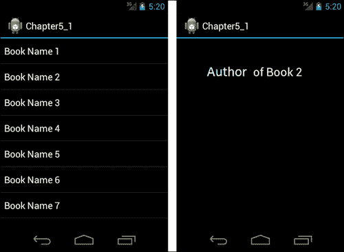
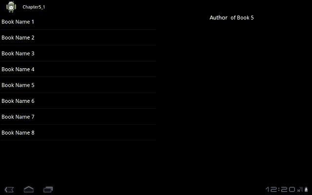

# 五、片段

虽然 **片段**是在安卓 3.0 中引入的，但它们现在已经可以用于带有安卓冰淇淋三明治的小屏幕设备。本章将介绍片段的基础知识以及如何使用它们。

本章涵盖的主题如下:

*   片段基础
*   创建和管理片段
*   片段类型

# 片段基础

**片段**是一个活动中的模块化组件，有自己的生命周期和事件处理，和一个活动非常相似。虽然片段有自己的生命周期，但它们直接受其主人活动的生命周期影响。例如，如果一个活动被销毁，它的片段也会被销毁。每个片段都应该有一个所有者活动。片段可以动态地添加到活动中或从活动中移除。

片段增加了软件的可重用性，并为用户界面设计提供了灵活性。一个片段可以被多个活动使用。这种方式可以实现一次，使用多次。此外，可以将片段用于不同的布局配置和不同的屏幕模式。这种方式为用户界面设计提供了灵活性。

### 注

重要的是设计片段，使它们能够独立工作，也就是说，它们不应该依赖于其他片段和活动。通过这种方式，可以独立于其他片段重复使用片段。

## 片段生命周期

片段有自己的生命周期；但是，它们仍然直接受到所有者活动生命周期的影响。下图展示了片段生命周期的创建流程:


图中的块执行以下任务:

*   `onAttach():`当一个片段被添加到一个 活动中时，调用`onAttach()`方法。
*   `onCreate():`当一个 片段被创建时，这个方法被调用。
*   `onCreateView():`此方法 返回一个视图。这个视图是片段的用户界面。如果片段正在做后台工作，并且没有用户界面，那么这个方法应该返回 null。
*   `onActivityCreated():`此方法 在创建了所有者活动后调用。
*   `onStart():`调用该方法后， 片段的视图对用户可见。
*   `onResume()`:调用该方法后， 片段变为活动状态，用户可以与该片段进行交互。此方法可以多次调用，因为此方法是在应用程序重新启动或暂停后调用的。

下图显示了一个片段的生命周期的破坏流程:


图中的块执行以下任务:

*   `onPause():`当装备暂停并且不再与用户交互时，调用该方法。
*   `onStop():`当 片段停止时，调用此方法。调用此方法后，用户看不到该片段。
*   `onDestroyView():`当片段的视图被破坏时，这种方法被称为 。
*   `onDestroy():`当 片段不再使用时，调用此方法。
*   `onDetach()`:当 片段从活动中移除时，调用此方法。

# 创建和管理片段

我们将学习如何用一个示例安卓应用程序创建和管理片段。这个应用程序将列出图书名称。点击图书名称，会显示该书的作者。这个应用程序将为小屏幕和大屏幕设备设计，这样我们将看到如何使用不同屏幕大小的片段。下面是这个小屏幕应用的截图。正如你在这张截图中看到的，屏幕的左手边有图书列表，当点击一本书时，屏幕的右手边会显示被点击图书的作者:



我们将首先实现这些屏幕，然后我们将为大屏幕设计这个应用程序。

在这个应用程序中，我们有两个活动，一个用于第一个屏幕，一个用于第二个屏幕。每个活动由一个片段组成。下图显示了该应用程序的结构:


`Fragment B`布局的 XML 代码如下:

```java
<?xml version="1.0" encoding="utf-8"?>
<LinearLayout xmlns:android="http://schemas.android.com/apk/res/android"
    android:layout_width="match_parent"
    android:layout_height="match_parent"
    android:gravity="center_horizontal"
    android:orientation="vertical" >
    <TextView
        android:id="@+id/textViewAuthor"
        android:layout_width="wrap_content"
        android:layout_height="wrap_content"
        android:textAppearance="?android:attr/textAppearanceLarge" />

</LinearLayout>
```

在这段代码中可以看到，它有一个带有 `TextView`组件的`LinearLayout`布局 。`TextView`是为了展示这本书的作者。我们没有`Fragment A`的布局，因为它是一个包含`ListView` 组件的`ListFragment`属性。

现在我们需要两个类来扩展每个片段的`Fragment`类。以下是`Fragment A`T2 的班级:

```java
package com.chapter5;

import android.app.ListFragment;
import android.content.Intent;
import android.os.Bundle;
import android.view.View;
import android.widget.AdapterView;
import android.widget.AdapterView.OnItemClickListener;
import android.widget.ArrayAdapter;

public class Chapter5_1FragmentA extends ListFragment implements  
OnItemClickListener {

  @Override
  public void onActivityCreated(Bundle savedInstanceState) {
             super.onActivityCreated(savedInstanceState);
             //initialize the adapter and set on click events of items
    ArrayAdapter<String> adapter = new ArrayAdapter<String>(getActivity(),
        android.R.layout.simple_list_item_1, Book.BOOK_NAMES);
    this.setListAdapter(adapter);
    getListView().setOnItemClickListener(this);
  }
  @Override
  public void onItemClick(AdapterView<?> parent, View view, int position, long id) 
  {
    //Start a new Activity in order to display author name
    String author = Book.AUTHOR_NAMES[position];
    Intent intent = new Intent(getActivity().getApplicationContext(),
    Chapter5_1Activity_B.class);
    intent.putExtra("author", author);
    startActivity(intent);
  }
}
```

如您所见，`Chapter5_1FragmentA`类扩展了`ListFragment`，因为我们在这个屏幕中列出了书籍。类似于`ListActivity`这个班有`ListView`观。在 `onActivityCreated`方法中我们设置`ListFragment`的`ListAdapter`属性。适配器的来源是一个类，它包含图书名称和作者的字符串数组，如下面的代码块所示:

```java
package com.chapter5;

public class Book {
  public static final String[] BOOK_NAMES = { "Book Name 1", "Book Name 2", "Book Name 3", "Book Name 4", "Book Name 5", "Book Name 6", "Book Name 7", "Book Name 8" };
  public static final String[] AUTHOR_NAMES = { "Author of Book 1", "Author of Book 2", "Author of Book 3", "Author of Book 4", "Author of Book 5", "Author of Book 6", "Author of Book 7", "Author of Book 8" };
}
```

初始化`ListAdapter`后，我们设置`ListView`视图的`OnItemClickListener`事件。点击`ListView`项时，调用该事件。单击某个项目时，会调用`onItemClick`方法。在这种方法中，一个新的活动从书的作者开始。如代码中所示，我们使用 `getActivity()`方法到达片段的所有者活动。我们可以通过`getActivity()`方法接收`ApplicationContext`。请记住`OnCreateView`方法是在`OnActivityCreated`之前调用的，正因为如此，我们在`OnActivityCreated`方法、 中初始化了`ListAdapter`和`ListView`，因为我们需要在初始化用户界面组件之前创建它们，并且它们是在`OnCreateView`中创建的。我们不需要覆盖`ListFragment`的`OnCreateView`方法，因为它返回一个`ListView`。如果要使用自定义的`ListView`，可以覆盖 `OnCreateView`方法。

以下是`Fragment B`的课程:

```java
package com.chapter5;

import android.app.Fragment;
import android.os.Bundle;
import android.view.LayoutInflater;
import android.view.View;
import android.view.ViewGroup;

public class Chapter5_1FragmentB extends Fragment {

  @Override
  public View onCreateView(LayoutInflater inflater, ViewGroup container,
      Bundle savedInstanceState) {

    View view = inflater.inflate(R.layout.fragment_b, container, false);
    return view;
  }
}
```

从这段代码中可以看出，如果一个片段有用户界面，那么这个方法应该被重写，并且应该返回一个视图。在我们的示例应用程序中，我们返回了一个用之前实现的 XML 布局填充的视图。

现在我们需要两个活动类来承载这些片段。以下是主办`Fragment A`的`Activity A`的 `Activity`班:

```java
package com.chapter5;

import android.app.Activity;
import android.os.Bundle;

public class Chapter5_1Activity_A extends Activity {
    /** Called when the activity is first created. */
    @Override
    public void onCreate(Bundle savedInstanceState) {
        super.onCreate(savedInstanceState);
        setContentView(R.layout.activity_a);
    }
}
```

这是一个简单的`Activity`类，只是用布局设置内容视图。`Activity A`类的 XML 布局代码如下:

```java
<?xml version="1.0" encoding="utf-8"?>
<LinearLayout xmlns:android="http://schemas.android.com/apk/res/android"
    android:layout_width="fill_parent"
    android:layout_height="fill_parent"
    android:orientation="vertical">

    <fragment
        android:id="@+id/fragment_a"
        android:layout_width="match_parent"
        android:layout_height="match_parent"
        class="com.chapter5.Chapter5_1FragmentA" />

</LinearLayout>
```

从这段代码中可以看到，我们用类属性`com.chapter5.Chapter5_1FragmentA`指定了`Fragment A`。此外，我们指定了`id`属性。片段应该有一个 `id`或一个 `tag`属性作为标识符，因为当活动重新启动时，安卓在恢复片段时需要这个属性。

主办`Fragment B`的`Activity B`的`Activity`班如下:

```java
package com.chapter5;

import android.app.Activity;
import android.os.Bundle;
import android.widget.TextView;

public class Chapter5_1Activity_B extends Activity {
    /** Called when the activity is first created. */
    @Override
    public void onCreate(Bundle savedInstanceState) {
        super.onCreate(savedInstanceState);
        setContentView(R.layout.activity_b);

        Bundle extras = getIntent().getExtras();
    if (extras != null) {
      String s = extras.getString("author");
      TextView view = (TextView) findViewById(R.id.textViewAuthor);
      view.setText(s);
    }
    }
}
```

这是一个简单的`Activity`类，只是用布局设置内容视图。`Activity B`的 XML 布局代码如下:

```java
<?xml version="1.0" encoding="utf-8"?>
<LinearLayout xmlns:android="http://schemas.android.com/apk/res/android"
    android:layout_width="match_parent"
    android:layout_height="match_parent"
    android:orientation="vertical" >

    <fragment
        android:id="@+id/fragment_b"
        android:layout_width="match_parent"
        android:layout_height="match_parent"
        class="com.chapter5.Chapter5_1FragmentB" />

</LinearLayout>
```

从这段代码中可以看到，我们用类属性`com.chapter5.Chapter5_1FragmentB`指定了`Fragment B`。

## 以编程方式添加片段

在我们之前的示例应用程序中，我们在 XML 布局代码中向活动布局添加了一个片段。您还可以通过编程方式向活动添加片段。以下是我们之前示例应用程序的以编程方式添加的片段版本和活动的 XML 布局代码:

```java
package com.chapter5;

import android.app.Activity;
import android.app.FragmentManager;
import android.app.FragmentTransaction;
import android.os.Bundle;

public class Chapter5_1Activity_A extends Activity {
  /** Called when the activity is first created. */
  @Override
  public void onCreate(Bundle savedInstanceState) {
    super.onCreate(savedInstanceState);
    setContentView(R.layout.activity_a);
    addFragment();
  }

 public void addFragment() {
 FragmentManager fragmentManager = getFragmentManager();
 FragmentTransaction fragmentTransaction = fragmentManager.beginTransaction();

 Chapter5_1FragmentA fragment = new Chapter5_1FragmentA();
 fragmentTransaction.add(R.id.layout_activity_a, fragment);
 fragmentTransaction.commit();
 }
}
<?xml version="1.0" encoding="utf-8"?>
<LinearLayout xmlns:android="http://schemas.android.com/apk/res/android"
    android:id="@+id/layout_activity_a"
    android:layout_width="fill_parent"
    android:layout_height="fill_parent"
    android:orientation="vertical" >

</LinearLayout>
```

从这段 XML 代码中可以看到，我们删除了`Fragment`标签，因为我们是以编程方式添加`Fragment A`的。在`Chapter5_1Activity_A`类中可以看到，我们增加了一个名为 `addFragment()`的方法。我们使用`FragmentTransaction`类来添加`Fragment A`。`FragmentTransaction`类用于添加片段、移除片段、将片段附加到 UI 等操作。正如您在`addMethod()`方法中看到的，您可以使用 `beginTransaction()`方法获得一个带有`FragmentManager`的`FragmentTransaction`实例。最后，我们必须调用 `commit()`方法来应用更改。

`FragmentManager`是 用于管理片段。正如您在代码中看到的，您可以通过 `getFragmentManager()`方法获得一个`FragmentManager`的实例。`FragmentManager`允许您通过`beginTransaction()`方法开始事务，通过`findFragmentById()`或`findFragmentbyTag()`方法获取活动中的片段，并通过 `popBackStack()`方法从堆栈中弹出一个片段。

## 与活动分享事件

在我们的例子中，我们在`ListFragment`类的`onItemClick`方法 中开始了一项活动。我们可以通过在`ListFragment`中创建回调接口来建立相同的操作，并使`Activity`类实现该回调。通过这种方式`Fragment`班将通知车主`Activity`班。当所有者`Activity`类被通知时，可以通过其他片段共享通知。这样，片段可以共享一个事件并进行通信。我们可以通过以下步骤进行操作:

1.  我们在`Chapter5_1FragmentA`类中创建回调接口:

    ```java
    public interface OnBookSelectedListener 
      {
        public void onBookSelected(int bookIndex);
      }
    ```

2.  We create an instance of `OnBookSelectedListener` and assign the owner activity to that instance in the `Chapter5_1FragmentA` class:

    ```java
    OnBookSelectedListener mListener;
    @Override
      public void onAttach(Activity activity) {
        super.onAttach(activity);
        mListener = (OnBookSelectedListener) activity;
      }
    ```

    从这段代码中可以看出，`Chapter5_1FragmentA`的所有者活动类应该实现`onBookSelectedListener`实例，否则会出现类强制转换异常。

3.  We make the `Chapter5_1Activity_A` class implement the `onBookSelectedListener` interface:

    ```java
    public class Chapter5_1Activity_A extends Activity implements 
    OnBookSelectedListener {
    //some code here
            @Override
            public void onBookSelected(int bookIndex) {

              String author = Book.AUTHOR_NAMES[bookIndex];
              Intent intent = new Intent(this,Chapter5_1Activity_B.class);
              intent.putExtra("author", author);
              startActivity(intent);
           } 
    //some more code here
    }
    ```

    从这段代码中可以看到，`Chapter5_1Activity_A`在事件回调中接收一个选定的图书索引，并使用作者数据启动活动。

4.  我们在`Chapter5_1FragmentA`类的`onItemClick`方法中称 `onBookSelected`方法为:

    ```java
    @Override
    public void onItemClick(AdapterView<?> parent, View view, int position, long id) {

      mListener.onBookSelected(position);
    }
    ```

这样，我们使活动和片段共享一个事件回调。

## 在活动中使用多个片段

我们的样本图书列表应用程序是为小屏幕设计的。当您在更大的屏幕上执行这个应用程序时，它看起来会很糟糕。我们必须在更大的屏幕尺寸下有效利用空间。为了实现这一点，我们必须为大屏幕创建新的布局。新布局如下:

```java
<?xml version="1.0" encoding="utf-8"?>
<LinearLayout xmlns:android="http://schemas.android.com/apk/res/android"
    android:id="@+id/layout_small_a"
    android:layout_width="fill_parent"
    android:layout_height="fill_parent"
    android:orientation="horizontal" >

 <fragment
        android:id="@+id/fragment_a"
        android:layout_width="fill_parent"
        android:layout_height="fill_parent"
        class="com.chapter5.Chapter5_1FragmentA" 
        android:layout_weight="1"/>
 <fragment
        android:id="@+id/fragment_b"
        android:layout_width="fill_parent"
        android:layout_height="fill_parent"
        class="com.chapter5.Chapter5_1FragmentB" 
        android:layout_weight="1"/>

</LinearLayout>
```

从这段代码中可以看到，我们将两个片段放在一个水平的`LinearLayout`布局中。在前面的示例应用程序中，每个活动中有一个片段，但是在这个活动中有两个片段，以便有效地使用空间。通过将`layout_weight`属性 设置为`1`，我们使片段消耗屏幕上相等的空间。

我们必须把这个新的布局 XML 文件放在`res`文件夹下名为`layout-xlarge-land`的文件夹下。这样，当设备屏幕较大且处于横向模式时，Android 会使用此布局文件。安卓根据布局文件夹名称决定在运行时使用哪个布局文件。`layout`是安卓的默认文件夹名。如果安卓找不到适合设备屏幕大小和模式的布局文件夹，它会使用`layout`文件夹中的布局。布局的一些常见限定符如下:

*   `small`适用于小屏幕尺寸
*   `normal`正常屏幕尺寸
*   `large`适用于大屏幕尺寸
*   `xlarge`超大屏幕尺寸
*   `land`为横向
*   `port`为纵向

然而，这种布局不足以使我们的示例在大屏幕上正常运行。为了使新的布局正确运行，我们必须改变片段的管理方式。在`Chapter5_1Activity_A`中更新 `onBookSelected`属性如下:

```java
  @Override
  public void onBookSelected(int bookIndex) {

    FragmentManager fragmentManager = getFragmentManager();
    Fragment fragment_b = fragmentManager.findFragmentById(R.id.fragment_b);
    String author = Book.AUTHOR_NAMES[bookIndex];
    if(fragment_b == null)
    {
      Intent intent = new Intent(this,
          Chapter5_1Activity_B.class);
      intent.putExtra("author", author);
      startActivity(intent);
    }
    else
    {
      TextView textViewAuthor = (TextView)fragment_b.getView().findViewById(R.id.textViewAuthor);
      textViewAuthor.setText(author);
    }
  }
```

从这段代码中可以看到，我们通过使用`FragmentManager`得到了`Fragment B`类。如果`fragment_b`不为空，我们理解此活动包含`Fragment B`，设备有大屏幕，因为`Fragment B`只有在屏幕大且处于横向模式时才会在`Activity A`中使用。然后使用`fragment_b`，我们获得`textViewAuthor`文本视图组件，并使用所选书籍的作者姓名更新其文本。在屏幕的右边，我们可以看到所选书籍的作者姓名。

如果`fragment_b`为空，我们理解该设备有一个小屏幕，我们使用`Intent`开始新的活动。

在`AndroidManifest.xml`文件中，我们必须将最低 SDK 版本设置为 API Level 14，因为从 API Level 14 开始，小屏幕就可以使用片段了。`AndroidManifest.xml`文件应该看起来像下面的代码块:

```java
<?xml version="1.0" encoding="utf-8"?>
<manifest xmlns:android="http://schemas.android.com/apk/res/android"
    package="com.chapter5"
    android:versionCode="1"
    android:versionName="1.0" >

    <uses-sdk android:minSdkVersion="14" />

    <application
        android:icon="@drawable/ic_launcher"
        android:label="@string/app_name" >
        <activity
            android:name=".Chapter5_1Activity_A"
            android:label="@string/app_name" >
            <intent-filter>
                <action android:name="android.intent.action.MAIN" />

                <category android:name="android.intent.category.LAUNCHER" />
            </intent-filter>
        </activity>
        <activity android:name=".Chapter5_1Activity_B"/>
    </application>

</manifest>
```

我们的示例应用程序将在大屏幕上显示如下:



# 片段类型

片段有四种类型:

*   `ListFragment`
*   `DialogFragment`
*   `PreferenceFragment`
*   `WebViewFragment`

在本节中，我们将开发一个使用这些片段的示例应用程序。本节结束时，申请将完成。

## 列表片段

该片段类似于`ListActivity`，默认包含一个`ListView`视图。用于显示项列表。在我们之前的示例代码中，我们使用了`ListFragment`；参见`ListFragment`的*创建和管理片段*部分。

## 对话片段

该片段在其所有者活动的顶部显示一个对话框。在下面的示例应用程序中，我们将创建一个带有**删除**按钮的片段。点击按钮后，将显示**对话片段**对话框。**对话片段**对话框将有一条确认消息和两个按钮–**确定**和**取消**按钮。如果点击**确定** 按钮，将显示一条消息，**对话片段**将被取消。示例应用程序的屏幕如下图所示:


带有**删除**按钮的片段的布局 XML 代码如下代码块所示:

```java
<?xml version="1.0" encoding="utf-8"?>
<LinearLayout xmlns:android="http://schemas.android.com/apk/res/android"
    android:layout_width="match_parent"
    android:layout_height="match_parent"
    android:gravity="center_horizontal"
    android:orientation="vertical" >

    <Button
        android:id="@+id/buttonFragment"
        android:layout_width="wrap_content"
        android:layout_height="wrap_content"
        android:text="Delete" />

</LinearLayout>
```

这个布局是一个简单的布局，其中有一个`LinearLayout`布局和一个`Button`组件。这个布局的`Fragment`类如下:

```java
package com.chapter5;

import android.app.Fragment;
import android.app.FragmentTransaction;
import android.os.Bundle;
import android.view.LayoutInflater;
import android.view.View;
import android.view.View.OnClickListener;
import android.view.ViewGroup;
import android.widget.Button;

public class Chapter5_2Fragment extends Fragment implements OnClickListener{

  Button fragmentButton;
  @Override
  public View onCreateView(LayoutInflater inflater, ViewGroup container,
      Bundle savedInstanceState) {

    View view = inflater.inflate(R.layout.fragment, container, false);
    fragmentButton = (Button)view.findViewById(R.id.buttonFragment);
    fragmentButton.setOnClickListener(this);
    return view;
  }

  @Override
 public void onClick(View v) {
 //we need a FragmentTransaction in order to display a dialog
 FragmentTransaction transaction = getFragmentManager().beginTransaction();

 Chapter5_2DialogFragment dialogFragment = new Chapter5_2DialogFragment();

 dialogFragment.show(transaction, "dialog_fragment");

 }
}
```

从这段代码中可以看到，在`Chapter5_2Fragment`类的`onClick`方法中，创建了一个`Chapter5_2DialogFragment`类的实例，使用这个实例，用其 `show()`方法显示一个对话框。

**对话片段**对话框的布局代码为，如下:

```java
<?xml version="1.0" encoding="utf-8"?>
<GridLayout android:layout_width="wrap_content"
    android:layout_height="wrap_content"
    android:layout_gravity="center_horizontal"
    android:columnCount="2"
    android:orientation="horizontal" xmlns:android="http://schemas.android.com/apk/res/android">

    <TextView
        android:id="@+id/textViewMessage"
        android:layout_width="fill_parent"
        android:layout_height="wrap_content"
        android:layout_columnSpan="2"
        android:layout_gravity="fill"
        android:text="This item will be deleted. Do you want to continue?"
        android:textAppearance="?android:attr/textAppearanceLarge" />

     <!—we used a linear layout here because we need it in order to evenly distribute the buttons -->
    <LinearLayout
        android:layout_width="wrap_content"
        android:layout_gravity="fill_horizontal"
        android:layout_columnSpan="2" >

        <Button
            android:id="@+id/buttonOk"
            android:layout_width="fill_parent"
            android:layout_height="wrap_content"
            android:layout_weight="1"
            android:text="OK" />

    <Button
        android:id="@+id/buttonCancel"
        android:layout_width="fill_parent"
        android:layout_height="wrap_content"
        android:layout_weight="1"
        android:text="CANCEL" />

    </LinearLayout>

</GridLayout>
```

从前面这段代码中可以看到，我们使用`GridLayout`作为根布局。然后我们输入一个显示确认信息的`TextView`组件。最后，布局中增加了两个按钮— **确定**和**取消**按钮。以下是这个布局的`DialogFragment`类:

```java
package com.chapter5;

import android.app.DialogFragment;
import android.os.Bundle;
import android.view.LayoutInflater;
import android.view.View;
import android.view.View.OnClickListener;
import android.view.ViewGroup;
import android.widget.Button;
import android.widget.Toast;

public class Chapter5_2DialogFragment extends DialogFragment implements
OnClickListener{

  Button okButton;
  Button cancelButton;
  @Override
  public View onCreateView(LayoutInflater inflater, ViewGroup container,
      Bundle savedInstanceState) {

    View view = inflater.inflate(R.layout.dialog_fragment, container, false);
    //initialize the buttons and set click events
    okButton = (Button)view.findViewById(R.id.buttonOk)
    okButton.setOnClickListener(this);

    cancelButton = (Button)view.findViewById(R.id.buttonCancel);
    cancelButton.setOnClickListener(this);

    return view;
  }

  @Override
  public void onClick(View v) {

    if(v == cancelButton)
      dismiss();
    else if( v == okButton)
    {
      Toast.makeText(this.getActivity(), "Item is deleted.", Toast.LENGTH_LONG).show();
      dismiss();
    }

  }
}
```

从这段代码中可以看出，这个类扩展了 can `DialogFragment`类。在`Chapter5_2DialogFragment`类的`onCreateView`方法中，我们初始化按钮并设置它们的`onClick`事件。在类的`onClick`方法中，我们处理按钮点击事件。如果点击的按钮是**取消**，我们关闭对话框。如果点击的按钮是**确定**，我们会显示一条信息消息并关闭对话框。从前面的代码可以看出，`dismiss()` 方法用于关闭对话框。

## 偏好片段

这个片段类似`PreferenceActivity`。它显示偏好并保存到`SharedPreferences`。在本节中，我们将扩展前面的示例代码。我们将在删除过程中优先显示确认信息。用户可以选择查看或不查看确认消息。我们使用`PreferenceFragment`执行以下步骤:

1.  Create a source XML for the preference screen and put it under the `res/xml` folder:

    ```java
    <?xml version="1.0" encoding="utf-8"?>
    <PreferenceScreen xmlns:android="http://schemas.android.com/apk/res/android" >

        <CheckBoxPreference android:summary="check this in order to show confirmation message when deleting"
            android:title="show confirmation message" 
            android:key="checkbox_preference"/>

    </PreferenceScreen>
    ```

    从前面的代码中可以看到，我们的首选项屏幕包含了确认消息的复选框首选项。

2.  创建一个扩展`PreferenceFragment` :

    ```java
    package com.chapter5;

    import android.os.Bundle;
    import android.preference.PreferenceFragment;

    public class Chapter5_2PereferenceFragment extends PreferenceFragment {

      @Override
      public void onCreate(Bundle savedInstanceState) {
        super.onCreate(savedInstanceState);
        addPreferencesFromResource(R.xml.pref);
      }

    }
    ```

    的类

从这段代码中可以看出，创建首选项屏幕非常容易；您只需用为首选项创建的 XML 文件调用`addPreferencesFromResource`方法。现在，我们将放入设置选项菜单项，我们将通过点击该菜单项打开首选项屏幕。为了实现这一点，我们将使用以下步骤修改`Chapter5_2Fragment`类:

1.  我们将把`setHasOptionsMenu(true)`添加到`Chapter5_2Fragment`类的`onCreateView`方法中:

    ```java
      @Override
      public View onCreateView(LayoutInflater inflater, ViewGroup container, Bundle savedInstanceState) 
    {

        View view = inflater.inflate(R.layout.fragment, container, false);
        fragmentButton = (Button)view.findViewById(R.id.buttonFragment);	
        fragmentButton.setOnClickListener(this);

        setHasOptionsMenu(true);
        return view;
      }
    ```

2.  我们将在`Chapter5_2Fragment`类中添加以下方法:

    ```java
      @Override
      public void onCreateOptionsMenu(Menu menu, MenuInflater inflater) {
        inflater.inflate(R.menu.fragment_menu, menu);

      }

      @Override
      public boolean onOptionsItemSelected(MenuItem item) {

        Intent intent = new Intent(getActivity(),Chapter5_2PreferenceActivity.class);
        startActivity(intent);
        return true;
      }
    ```

从这段代码中可以看出，`onCreateOptionsMenu`是选项菜单的组成部分。这就是片段如何贡献给所有者活动菜单的。单击选项菜单项时，用`onOptionsItemSelected`方法开始新的活动。

`fragment_menu`菜单 XML 如下:

```java
<menu xmlns:android="http://schemas.android.com/apk/res/android">
    <item android:id="@+id/itemSettings" android:title="Settings"></item>
</menu>
```

`Chapter5_2PreferenceActivity`是主办`Chapter5_2PereferenceFragment`的班级:

```java
package com.chapter5;

import android.app.Activity;
import android.os.Bundle;

public class Chapter5_2PreferenceActivity extends Activity {

  @Override
  protected void onCreate(Bundle savedInstanceState) {
    super.onCreate(savedInstanceState);

    getFragmentManager().beginTransaction()
 .replace(android.R.id.content, new Chapter5_2PereferenceFragment())
 .commit();
  }
}
```

从这段代码中可以看出，我们通过编程将`Chapter5_2PereferenceFragment`添加到`Chapter5_2PreferenceActivity`类中。

首选项屏幕应如下图 截图所示:


通过添加该偏好选项，用户可以选择是否接收确认消息。(要读取设置，请使用标准`SharedPreference`API。)

## webview 片段

`WebViewFragment`是包裹在片段中的预制`WebView`。`WebView`当片段暂停或恢复时，该片段内部会自动暂停或恢复。在本节中，我们将把前面的示例代码扩展到 s 如何使用`WebViewFragment`。

1.  我们将一个**打开网页**按钮添加到`Chapter5_2Fragment`类的布局 XML 代码中。最终布局如下:

    ```java
    <?xml version="1.0" encoding="utf-8"?>
    <LinearLayout xmlns:android="http://schemas.android.com/apk/res/android"
        android:id="@+id/layout_fragment"
        android:layout_width="match_parent"
        android:layout_height="match_parent"
        android:gravity="center_horizontal"
        android:orientation="vertical" >

        <Button
            android:id="@+id/buttonFragment"
            android:layout_width="wrap_content"
            android:layout_height="wrap_content"
            android:text="Delete" />

     <Button
     android:id="@+id/buttonOpenWeb"
     android:layout_width="wrap_content"
     android:layout_height="wrap_content"
     android:text="Open Web" />

    </LinearLayout>
    ```

2.  我们使用下面的代码块创建了一个扩展`WebViewFragment` 的类和一个托管这个片段的活动:

    ```java
    package com.chapter5;

    import android.os.Bundle;
    import android.webkit.WebViewFragment;

    public class Chapter5_2WebViewFragment extends WebViewFragment {

      @Override
      public void onActivityCreated(Bundle savedInstanceState) {
        super.onActivityCreated(savedInstanceState);

        getWebView().loadUrl("http://www.google.com");
      }
    }
    ```

从这段代码中可以看到，我们在`onActivityCreated`方法中获得`WebView`实例，并加载一个打开谷歌网站的 URL。

托管此片段的活动如下:

```java
package com.chapter5;

import android.app.Activity;
import android.os.Bundle;

public class Chapter5_2WebActivity extends Activity {

  @Override
  protected void onCreate(Bundle savedInstanceState) {
    super.onCreate(savedInstanceState);

 getFragmentManager().beginTransaction()
 .replace(android.R.id.content, new Chapter5_2WebViewFragment())
 .commit();
  }
}
```

从这段代码中可以看出，我们通过编程将添加到`Chapter5_2WebViewActivity`中。当点击**打开网页**按钮时，该示例应用程序打开[www.google.com](http://www.google.com)网站。

`Chapter5_2Fragment`类的最终版本如下:

```java
package com.chapter5;

import android.app.Fragment;
import android.app.FragmentTransaction;
import android.content.Intent;
import android.os.Bundle;
import android.view.LayoutInflater;
import android.view.Menu;
import android.view.MenuInflater;
import android.view.MenuItem;
import android.view.View;
import android.view.View.OnClickListener;
import android.view.ViewGroup;
import android.widget.Button;

public class Chapter5_2Fragment extends Fragment implements OnClickListener{

  Button fragmentButton;
  Button openWebButton;

  @Override
  public View onCreateView(LayoutInflater inflater, ViewGroup container, Bundle savedInstanceState) {

    View view = inflater.inflate(R.layout.fragment, container, false);
    fragmentButton = (Button)view.findViewById(R.id.buttonFragment);	
    fragmentButton.setOnClickListener(this);

    openWebButton = (Button)view.findViewById(R.id.buttonOpenWeb);
    openWebButton.setOnClickListener(this);

    setHasOptionsMenu(true);
    return view;
  }

  @Override
  public void onClick(View v) {
 if(v == fragmentButton)
 {
 FragmentTransaction transaction = getFragmentManager().beginTransaction();
 Chapter5_2DialogFragment dialogFragment = new Chapter5_2DialogFragment();
 dialogFragment.show(transaction, "dialog_fragment");
 }
 else if( v == openWebButton)
 {
 Intent intent = new Intent(getActivity(),Chapter5_2WebActivity.class);
 startActivity(intent);
 }
  }

  @Override
  public void onCreateOptionsMenu(Menu menu, MenuInflater inflater) {
    inflater.inflate(R.menu.fragment_menu, menu);

  }

  @Override
  public boolean onOptionsItemSelected(MenuItem item) {

Intent intent = new Intent(getActivity(),Chapter5_2PreferenceActivity.class);
    startActivity(intent);
    return true;
  }
}
```

本次申请的主要`Activity`类如下:

```java
package com.chapter5;

import android.app.Activity;
import android.os.Bundle;

public class Chapter5_2Activity extends Activity {

    @Override
    public void onCreate(Bundle savedInstanceState) {
        super.onCreate(savedInstanceState);
        setContentView(R.layout.activity_main);
    }

}
```

这个`Activity`类是`Chapter5_2Fragment`的拥有者活动。前面`Activity`的布局如下:

```java
<?xml version="1.0" encoding="utf-8"?>
<LinearLayout xmlns:android="http://schemas.android.com/apk/res/android"
    android:id="@+id/layout_small_a"
    android:layout_width="fill_parent"
    android:layout_height="fill_parent"
    android:orientation="vertical" >

 <fragment
 android:id="@+id/fragment"
 android:layout_width="match_parent"
 android:layout_height="match_parent"
 class="com.chapter5.Chapter5_2Fragment" />

</LinearLayout>
```

该示例应用程序的`AndroidManifest.xml`文件应该如下所示:

```java
<manifest xmlns:android="http://schemas.android.com/apk/res/android"
    package="com.chapter5"
    android:versionCode="1"
    android:versionName="1.0" >

    <uses-sdk
 android:minSdkVersion="14"
 android:targetSdkVersion="15" />
    <uses-permission android:name="android.permission.INTERNET" />

    <application
        android:icon="@drawable/ic_launcher"
        android:label="@string/app_name"
        android:theme="@style/AppTheme" >
        <activity
            android:name=".Chapter5_2Activity"
            android:label="@string/title_activity_main" >
            <intent-filter>
                <action android:name="android.intent.action.MAIN" />

                <category android:name="android.intent.category.LAUNCHER" />
            </intent-filter>
        </activity>
 <activity android:name=".Chapter5_2PreferenceActivity"></activity>
 <activity android:name=".Chapter5_2WebActivity"></activity>
    </application>

</manifest>
```

正如你在这段代码中看到的，我们需要互联网许可才能打开一个网站。此外，为了使用小屏幕的片段，我们需要将最小 SDK 设置为 API Level 14。

# 总结

片段可用于推出安卓冰淇淋三明治的小屏幕设备。在本章中，我们首先学习了片段的基础知识，以及片段的构建和销毁生命周期。然后，我们学习了使用示例应用程序创建和管理片段。最后，我们学习了片段的专门化类型–`ListFragment`、`DialogFragment`、`PreferenceFragment`和`WebViewFragment`。在下一章中，我们将看到一些开发支持不同屏幕尺寸的应用程序的实践。