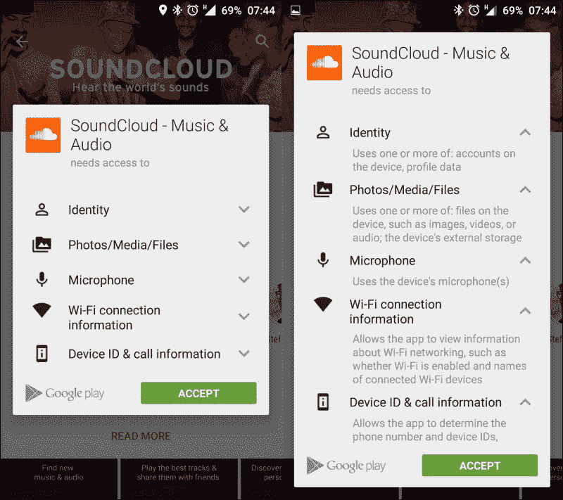

# 第一章。安卓棉花糖权限

**安卓权限**从我们记事起就存在了——确切地说是从安卓 1.0 开始。多年来，随着平台的演变，安卓权限模型已经被修改，增加了新的权限，并试图允许对应用程序拥有的设备硬件/数据部分进行更精细的控制。

在本章中，我们将回顾一下在 **安卓棉花糖**之前的安卓权限模型，我们将重点关注它给桌面带来的变化。我们还将解释您作为开发人员必须做的更改，以便处理所有其他更改，并确保您的应用程序在安卓棉花糖上按预期工作。

在本章中，我们将介绍以下内容:

*   安卓权限概述
*   了解安卓棉花糖权限
*   用最佳实践处理代码权限

# 安卓权限概述

在安卓系统中，每个应用程序运行时都有不同的系统标识，即 **Linux 用户标识**和T5 组标识。系统部分也被分成不同的标识，形成应用程序的隔离区域——彼此之间以及与系统之间。作为这个隔离的生命周期方案的一部分，访问服务或其他应用程序的数据需要您通过请求权限来提前声明这一愿望。

这是通过将`uses-permission`元素添加到您的`AndroidManifest.xml`文件中来完成的。您的清单可能有零个或多个`uses-permission`元素，并且它们都必须是根< `manifest>`元素的直接子元素。

试图在没有适当许可的情况下访问数据或功能将会给出一个安全异常(使用`SecurityException`类)，在大多数情况下通知我们缺少许可。

`sendBroadcast(Intent)`方法是异常的，因为它在方法调用返回后检查权限，所以如果有权限失败，我们不会收到异常。一个**权限失败** 应该打印到系统日志中。请注意，在棉花糖之前的安卓版本中，缺少权限是因为清单中缺少声明。因此，当你想出应用程序的功能列表时，记住权限是很重要的。

## 权限

当使用安卓平台作为应用程序时，您有限制，禁止访问某些硬件、系统应用程序接口、私人用户数据和应用程序数据。

需要权限才能允许访问特定的应用编程接口、数据或硬件；在安卓棉花糖之前，它是在安装你的应用程序时被问到的。大多数权限用于限制访问。授予权限后，您就可以访问该特定的受限区域。一个功能最多可以被一个权限保护。

`uses-permission`元素采用名称属性`android:name`，这是您的应用程序需要的权限的名称:

```java
<uses-permission android:name="string" android:maxSdkVersion="integer" />
```

你知道吗，在 API 等级 19 中添加的`android:maxSdkVersion`属性是用来通知 API 的版本，该权限*不应该被*授予。如果在较高版本的应用编程接口上不再需要权限，这将非常有用。例如，看看以下内容:

```java
<uses-permission
  android:name="android.permission.READ_EXTERNAL_STORAGE"
  android:maxSdkVersion="18" />
```

在 API 19 中，你的应用程序不需要请求这个权限——它是授予你的。

您的应用程序还可以保护自己的组件，如活动、服务、广播接收器和具有权限的内容提供者。

它可以使用任何由安卓定义并由其他应用程序声明的权限，也可以定义自己的权限。

更多权限信息，可以阅读[http://developer . Android . com/reference/Android/manifest . permission . html](http://developer.android.com/reference/android/Manifest.permission.html)。

## 权限组定义

权限被分成组。根据谷歌的说法，我们可以说一个**权限组**将相关权限放在一个名字/标签中。您可以使用`<permission>`元素中的`permissionGroup`属性将权限分组在一起。

在批准权限或检查应用程序权限时，分组在同一权限组中的权限显示为一个组。

权限组是您从播放存储安装应用程序时看到的内容；例如，看一下下面的截图:



我们来看看的`permission-group`标签的结构:

```java
<permission-group android:description="string resource"
                  android:icon="drawable resource"
                  android:label="string resource"
                  android:name="string" />
```

上述结构的要素可以解释如下:

*   `android:description`:这是指用来描述群体的简单文字。
*   `android:icon`:这是指来自可绘制资源的代表权限的图标。
*   `android:label`:这是指组的简单文本名称。
*   `android:name`:这是群的名字。它用于向特定组分配权限。

下面的表显示了权限组中的各种权限类别:

<colgroup class="calibre14"><col class="calibre15"> <col class="calibre15"></colgroup> 
| 

权限组

 |
| --- |
| 应用内购买 | 设备和应用历史记录 |
| 联系人 | 日历 |
| 电话 | 照片、媒体和文件 |
| 无线网络连接信息 | 蓝牙连接信息 |
| 身份 | 蜂窝数据设置 |
| 短信 | 位置 |
| 麦克风 | 照相机 |
| 设备标识和呼叫信息 | 可穿戴传感器/活动数据 |
| 其他的 |

### 注

不属于权限组的任何权限将显示为**其他**。更新应用程序时，该应用程序的权限组可能会发生变化。

## 暗示功能需求的权限

有些权限是功能需求隐含的；我们接下来会谈到这一点。

当在清单中声明一个特性时，我们还必须请求我们需要的权限。

比方说，我们希望有一个为联系人设置图片的功能。如果我们想通过`Camera` API 拍照，那么我们必须请求`Camera`许可。

`<users-feature>`标签使确信我们声明我们需要支持我们的应用程序工作和使用所需功能的设备。如果该功能不是必需功能，并且我们的应用程序可以在没有该功能但功能较少的情况下工作，我们可以使用`android:required="false"`，请记住该功能是可选的。

`<uses-feature>`声明总是优先于权限隐含的特性。暗示功能需求的权限类别的完整列表可以在[http://developer . Android . com/guide/topics/manifest/uses-feature-element . html #权限](http://developer.android.com/guide/topics/manifest/uses-feature-element.html#permissions)中找到。

## 查看每个应用的权限

您可以使用设置应用程序或`adb` shell 命令查看每个应用程序的权限。

要使用设置应用，进入**设置** | **应用**。选择一个应用程序并向下滚动查看该应用程序使用的权限您可以在下面的截图中看到棒棒糖版本:


安卓棉花糖中，UI 不一样。


第二种选择是使用`adb` shell 命令和`aapt`命令:

1.  List all the applications along with their installation paths. As an example, let's try to find out Facebook groups' app permissions using the following command:

    ```java
    adb shell pm list packages –f

    ```

    我们可以使用`-3`标志来显示第三方应用程序，而不是整个列表。

2.  一旦我们获得包裹位置(`apk`)，我们需要通过`adb`拉动:

    ```java
    adb pull /data/app/com.facebook.groups-1/base.apk

    ```

    将其从设备中拉出
3.  Our final step to show permissions is to use `aapt` found in the `build-tools` folder of your specific build tools version:

    ```java
    aapt d permissions base.apk

    ```

    这给了我们以下截图作为结果:

    

    要查看整个设备的权限，请看下面的截图:

    

使用`adb`命令，您可以打印设备上所有已知的权限。`adb`命令中的包管理器(`pm`)命令如下所示:

```java
$ adb shell pm list permissions [options] <GROUP>
```

列出权限获取`[options]`和`<GROUP>`参数(两者都是可选的)。

这里，`options`可以如下:

*   `-g`:这是指一个组组织的权限列表
*   `-f`:这会打印所有信息
*   `-s`:这会打印一个简短的摘要，这是用户在检查权限或批准权限时在屏幕上看到的内容
*   `-d`:这将查找并仅打印被认为是危险的权限
*   `-u`:这列出了仅对用户可见的权限

# 了解安卓棉花糖权限

安卓棉花糖引入了新的应用权限模型，允许用户在安装和/或升级应用时使用更简单的流程。在棉花糖上运行的应用程序应该根据新的权限模型工作，在这种模型中，用户可以在安装后授予或撤销权限，直到用户接受后才会授予权限。

支持新的权限模式是向后兼容的，这意味着您的应用程序仍然可以在运行旧版本安卓的设备上使用旧的权限模式进行安装和运行。

## 概述

安卓棉花糖版本引入了新的应用权限模型。

让我们更彻底地回顾一下:

*   **声明权限**:应用需要的所有权限都在清单中声明，这样做是为了保持向后兼容性，类似于早期的安卓平台版本。
*   **权限组**:如之前所讨论的，权限根据其功能划分为权限组:
    *   **PROTECTION_NORMAL 权限**:部分权限是用户安装应用时授予的。安装后，系统会检查您的应用程序清单，并自动授予与`PROTECTION_NORMAL`组匹配的权限。
    *   **互联网权限**:一个重要的权限是`INTERNET`权限，安装时会授予，用户不能撤销。
*   **授予**的应用签名权限:用户在安装时不会被提示授予任何权限。
*   **用户在运行时授予的权限**:你作为应用开发者需要在你的应用中请求权限；系统会向用户显示一个对话框，用户的响应会传回您的应用程序，通知是否授予了权限。
*   **可以撤销权限**:用户可以撤销之前授予的权限。我们必须学会如何处理这些案件，我们将在后面学习。

### 注

如果一个应用程序的目标是安卓棉花糖版本，它必须使用新的权限模型。

## 权限组

使用权限时，我们将它们分成组。这种划分是为了在审查和批准权限时实现快速的用户交互。每个权限组只授予一次。如果您添加了新权限或向同一权限组请求了新权限，并且用户已经批准了该组，系统将授予您添加的权限，而不会就批准事宜打扰用户。

更多信息请访问[https://developer . Android . com/reference/Android/content/pm/permissioninfo . html # constants](https://developer.android.com/reference/android/content/pm/PermissionInfo.html#constants)。

当用户安装应用程序时，该应用程序仅被授予属于`PROTECTION_NORMAL`组的清单中列出的那些权限。

只有当应用程序与具有声明权限的应用程序使用相同的证书签名时，才会向`PROTECTION_SIGNATURE`组请求权限。

### 注

应用程序无法在运行时请求签名权限。

系统组件自动接收其清单中列出的所有权限。

## 运行时权限

安卓棉花糖展示了一个新的权限模型，用户可以在应用运行时直接管理应用权限。谷歌已经改变了旧的权限模式，主要是为了让用户和应用程序开发人员能够更容易、更无摩擦地安装和自动更新。这允许用户安装应用程序，而无需预先批准应用程序所需的每个权限。用户可以安装该应用程序，而无需经过检查每个权限和因单个权限而拒绝安装的阶段。

用户可以授予或撤销已安装应用的权限，将调整和选择的自由留在用户手中。

当将目标应用编程接口更新到 23 时，大多数应用程序都需要解决这些问题。

# 考虑编码权限

嗯，经过所有的解释，我们已经到达了编码部分，这就是我们将弄脏我们的编码手的地方。以下是用于处理权限的主要方法:

*   `Context.checkSelfPermission()`:这将检查您的应用程序是否已被授予权限
*   `Activity.requestPermission()`:这在运行时请求权限

即使你的应用还没有针对安卓棉花糖，你也应该测试你的应用，并准备支持它。

## 测试权限

在安卓棉花糖权限模型中，你的应用在运行时必须向用户询问个人权限。传统应用程序的兼容性支持有限，您应该测试您的应用程序，并测试一个版本以确保它受支持。

可以使用以下测试指南，用新的行为进行 app 测试:

*   映射您应用程序的权限
*   授予和撤销权限的测试流

`adb`命令外壳对检查权限很有帮助:

*   使用以下`adb`命令可以按组列出应用程序权限和状态:

    ```java
    adb shell pm list permissions -g

    ```

*   您可以使用以下`adb`语法授予或撤销权限:

    ```java
    adb shell pm [grant|revoke] <permission.name>

    ```

*   您可以使用以下`adb`命令授予权限并安装`apk`:

    ```java
    adb install -g <path_to_apk>

    ```

## 运行时权限的编码

当我们想要将我们的应用程序调整到新模式时，我们需要确保组织好我们的步骤，并且不要让任何权限搁浅:

*   **Check what platform the app is running on**: When running a piece of code that is sensitive at the API level, we start by checking the version/API level that we are running on.

    到现在，你应该熟悉`Build.VERSION.SDK_INT`了。

*   **Check whether the app has the required permission**: Here, we get ourselves a brand new API call:

    `Context.checkSelfPermission(String permission_name)`。

    有了这个，我们默默地检查权限是否被授予。

    这个方法会立即返回，所以任何与权限相关的控件/流都应该通过首先检查这个来处理。

*   **Prompting for permissions**: We have a new API call, `Activity.requestPermissions (String[] permissions, int requestCode)`. This call triggers the system to show the dialog requesting a permission. This method functions asynchronously.

    您可以一次请求多个权限。第二个参数是回调中返回的简单请求代码，这样您就可以识别调用。这就像我们多年来处理`startActivityForResult()`和`onActivityResult()`的方式一样。

    另一个新的 API 是`Activity.shouldShowRequestPermissionRationale(String permission)`。

    当您请求了权限，而用户拒绝了请求时，此方法返回`true`。在确认你向用户解释了你为什么需要那个确切的许可之后，这被认为是一个好的做法。用户可以决定拒绝许可请求并选择*不再询问*选项；然后，该方法将返回`false`。

以下示例代码检查应用程序是否有权读取用户的联系人。需要时请求权限，结果回调返回`onRequestPermissionsResult`:

```java
if (checkSelfPermission(Manifest.permission.READ_CONTACTS) != PackageManager.PERMISSION_GRANTED) {
  requestPermissions(new String[]{Manifest.permission.READ_CONTACTS}, SAMPLE_MATRIXY_READ_CONTACTS);
}
//Now this is our callback
@Override
public void onRequestPermissionsResult(int requestCode, String permissions[], int[] grantResults) {
  switch (requestCode) {
  case SAMPLE_MATRIXY_READ_CONTACTS:
    if (grantResults[0] == PackageManager.PERMISSION_GRANTED) {
      // permission granted - we can continue the feature flow.
    } else {
      // permission denied! - we should disable the functionality that depends on this permission.
    }
  }
}
```

为了确保我们都知道所用的常数，解释如下:

*   `public static final int PERMISSION_DENIED=-1`:

    因为它是 API 级别 1，所以没有授予给定包权限

*   `public static final int PERMISSION_GRANTED=0`:

    因为它是 API 级别 1，所以已经向给定的包授予了权限。

如果用户拒绝你的权限请求，你的 app 应该采取适当的行动，比如通知用户为什么需要这个权限，或者说明没有这个权限功能无法工作。

### 注

您的应用程序不能假设已经发生了用户交互，因为用户可以选择拒绝授予权限以及*不再显示*选项；您的许可请求将被自动拒绝，`onRequestPermissionsResult`将获得结果。

## 最佳实践和使用说明

新的权限模型为用户带来了更流畅的体验，也为开发人员带来了更多的代码处理。它使安装和更新应用程序变得更加容易，并且对应用程序正在做的事情感到舒适。

### 极简主义是一个很好的选择

不要成为一个许可猪！在我们的应用程序生命周期中，我们应该尽量减少权限请求。要求大量的权限并维护它们对一些人来说似乎是危险的，我们应该尝试使功能流畅，并尽可能要求最小数量的权限，以便允许轻松、不受干扰的使用。尽可能考虑使用意图——依靠其他应用程序为我们做一些工作(更少的权限意味着更少的摩擦，把一个好的应用程序变成一个伟大的应用程序)。

### 一次请求太多权限

用户可能会被太多弹出的对话框分散注意力，要求他们获得越来越多的权限。相反，您应该在需要时请求权限。

然而，每条规则都有一些例外。您的应用程序可能需要一些权限才能开始，例如相机应用程序会在开始显示相机权限。但是，只有当用户触发该特定操作时，才能将照片设置为您的联系人并请求。尝试映射你的流程，让用户更容易理解正在发生的事情。如果用户要求通过您的应用程序为联系人设置信息，他们会理解您已经请求了联系人的权限。

还有一个建议:带有教程的应用程序可以将基本权限的请求集成到教程中，让用户更好地理解流程以及使用每个权限的原因。

### 诚实可能是一项伟大的政策

当询问权限时，系统会显示一个对话框，说明你的应用想要哪个权限，但没有说明原因。想想那些讨厌被蒙在鼓里思考为什么现在需要这个权限的用户，或者那些因为猜测而拒绝权限的用户。事情可能会更糟:有时，用户的光标可能距离 1 星评级或卸载按钮 2 厘米。

这就是为什么在调用`requestPermissions()`之前解释你的应用为什么想要权限是个好主意。

请记住，大多数开发人员会选择教程，但许多用户可能会尽可能选择跳过教程，因此，除了教程中的信息之外，您必须确保能够提供有关权限的信息。

# 需要支持处理运行时权限吗？

借助最新版本的 **v4** 或 **v13** 支持库(23，与安卓棉花糖 API 版本相同，所以很容易记住)，管理权限变得更加容易

支持库现在提供了几种新的方法来管理权限，并在任何可以使用这些库的设备上正常工作。例如，这为您节省了检查足够的应用编程接口级别所需的时间，无论设备是否运行安卓棉花糖。如果在运行安卓棉花糖的设备上安装了一个应用程序，就可以实现正确的行为——就像你在运行相同的框架调用一样。即使在较低版本上运行，您也可以从支持库方法中获得预期的行为。

v4 支持库有以下方法:

*   `ActivityCompat.checkSelfPermission (Context context, String permission)`:

    这将检查您的应用程序是否有权限。如果应用程序有权限，则返回`PERMISSION_GRANTED`；否则，返回`PERMISSION_DENIED`。

*   `ActivityCompat.requestPermissions (Activity activity, String[] permissions, int requestCode`:

    如果需要，这将请求权限。如果设备没有运行安卓 6.0，你会得到一个回调。

*   `ActivityCompat.OnRequestPermissionsResultCallback(int requestCode, String[] permissions, int[] grantResults)`:

    如果应用程序已经具有指定的权限，则通过`PERMISSION_GRANTED`，如果没有，则通过`PERMISSION_DENIED`。

*   `ActivityCompat.shouldShowRequestPermissionRationale (Activity activity, String permission)`:

    如果用户至少拒绝了一次权限请求，并且还没有选择*不再询问*选项，则返回`true`。

根据的设计模式，我们现在应该给我们的用户更多关于该功能的信息，以及为什么这些权限对应用如此重要。

### 注

如果设备没有运行安卓棉花糖，`shouldShowRequestPermissionRationale`会一直返回`false`。

`PermissionChecker`类也包含在 v4 中。

这个类为使用 IPC 的应用程序提供了几种方法，用于在进行 IPC 调用时检查特定的包是否具有指定的权限。

安卓有一个兼容模式，允许用户撤销对传统应用程序权限保护方法的访问。当用户在兼容模式下撤销访问时，应用程序的权限保持不变，但对应用程序接口的访问受到限制。

`PermissionChecker`方法验证普通模式和传统模式下的应用权限。

### 注

如果您的应用程序代表其他应用程序充当中间人，需要调用需要运行时权限的平台方法，您应该使用适当的`PermissionChecker`方法，以确保允许其他应用程序执行操作。

v13 支持库提供以下权限方法:

*   `FragmentCompat.requestPermissions()`:

    如果需要，这将请求权限。如果设备没有运行安卓 6.0，你会得到一个回调。

*   `FragmentCompat.OnRequestPermissionsResultCallback`:

    如果应用程序已经具有指定的权限，则通过`PERMISSION_GRANTED`，如果没有，则通过`PERMISSION_DENIED`。

*   `FragmentCompat.shouldShowRequestPermissionRationale()`:

    如果用户至少拒绝了一次权限请求，并且还没有选择*不再询问*选项，则返回`true`。

根据的设计模式，我们现在应该给我们的用户更多关于该功能的信息，以及为什么这个权限对应用程序如此重要。

### 注

如果设备没有运行安卓棉花糖，总是会返回`false`。

您可以查看示例项目中处理权限的三种方法:

[https://github . com/matrix/permissions migration guide](https://github.com/MaTriXy/PermissionMigrationGuide)

有关权限设计模式的更多信息，请阅读[谷歌发布的*模式–权限*。](https://www.google.com/design/spec/patterns/permissions.html)

## 有些权限比较正常，使用起来比较安全

安卓系统根据权限的保护级别标记权限。等级描述见。

与我们的讨论相关的级别是`PROTECTION_NORMAL`，在这个级别中，当应用程序拥有权限时，权限被认为几乎没有风险。

假设你想构建一个手电筒应用；允许你的应用打开闪光灯并不被认为是对隐私或安全的巨大风险，这就是为什么手电筒许可被标记为`PROTECTION_NORMAL`。

当您在清单中声明正常权限时，系统会在安装时自动授予这些权限。没有提示授予普通权限组权限，用户不能撤销这些权限。

这意味着您可以确保在安装时授予正常权限。

目前分类为`PROTECTION_NORMAL`的权限如下:

*   `android.permission.ACCESS_LOCATION_EXTRA_COMMANDS`
*   `android.permission.ACCESS_NETWORK_STATE`
*   `android.permission.ACCESS_WIFI_STATE`
*   `android.permission.ACCESS_WIMAX_STATE`
*   `android.permission.BLUETOOTH`
*   `android.permission.BLUETOOTH_ADMIN`
*   `android.permission.BROADCAST_STICKY`
*   `android.permission.CHANGE_NETWORK_STATE`
*   `android.permission.CHANGE_WIFI_MULTICAST_STATE`
*   `android.permission.CHANGE_WIFI_STATE`
*   `android.permission.DISABLE_KEYGUARD`
*   `android.permission.EXPAND_STATUS_BAR`
*   `android.permission.FLASHLIGHT`
*   `android.permission.GET_ACCOUNTS`
*   `android.permission.GET_PACKAGE_SIZE`
*   `android.permission.INTERNET`
*   `android.permission.KILL_BACKGROUND_PROCESSES`
*   `android.permission.MODIFY_AUDIO_SETTINGS`
*   `android.permission.NFC`
*   `android.permission.PERSISTENT_ACTIVITY`
*   `android.permission.READ_SYNC_SETTINGS`
*   `android.permission.READ_SYNC_STATS`
*   `android.permission.READ_USER_DICTIONARY`
*   `android.permission.RECEIVE_BOOT_COMPLETED`
*   `android.permission.REORDER_TASKS`
*   `android.permission.SET_TIME_ZONE`
*   `android.permission.SET_WALLPAPER`
*   `android.permission.SET_WALLPAPER_HINTS`
*   `android.permission.SUBSCRIBED_FEEDS_READ`
*   `android.permission.TRANSMIT_IR`
*   `android.permission.VIBRATE`
*   `android.permission.WAKE_LOCK`
*   `android.permission.WRITE_SETTINGS`
*   `android.permission.WRITE_SYNC_SETTINGS`
*   `android.permission.WRITE_USER_DICTIONARY`
*   `com.android.alarm.permission.SET_ALARM`
*   `com.android.launcher.permission.INSTALL_SHORTCUT`

# 总结

正如您所看到的，安卓权限系统和模型非常庞大，并引入了一些变化，这些变化可以帮助应用程序开发人员和应用程序获得更多的吸引力和安装，并让用户能够决定您的应用程序何时能够使用每个权限相关的功能。不过请记住，这只是一个起点，安卓棉花糖仍然需要获得市场份额并被原始设备制造商采用，让用户有选择的自由。作为应用程序开发人员，您必须提前做好准备，并确保您的应用程序开发面向未来，让新用户能够尽快享受最新的更新，同时保持应用程序的高性能。

在下一章中，我们将讨论安卓棉花糖版本中一个小而重要的特性:应用链接。