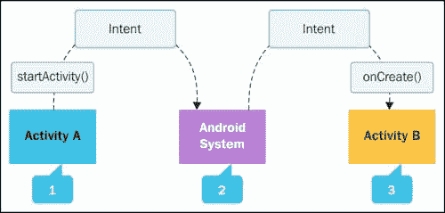
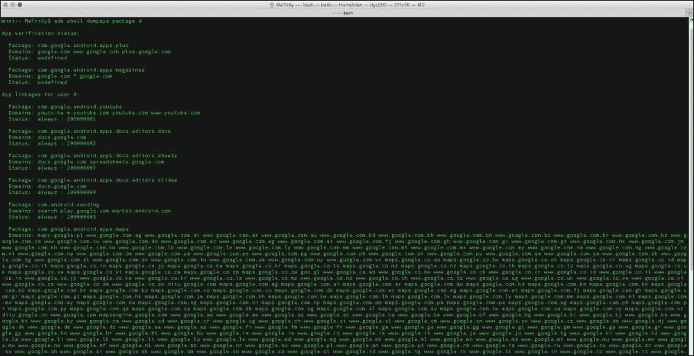

# 第二章。应用链接

新安卓棉花糖版本的主要改进之一是强大的**应用程序链接**。它允许将你的应用与你拥有的网络域名关联起来。有了这种关联，作为开发人员，您允许系统确定应该处理特定 web 链接的默认应用程序，并跳过提示用户选择应用程序。节省点击意味着摩擦更少，意味着你接触内容更快；这导致用户和开发人员感到高兴。在本章中，我们将涵盖以下主题:

*   安卓意图系统
*   创建网站关联
*   触发应用程序链接验证
*   应用程序链接设置和管理
*   测试应用链接

# 安卓意图系统

几乎每个开发人员都知道什么是**安卓意图**系统，但是我们将稍微解释一下，并阐述理解应用链接功能所需的基本原则。安卓意向系统可以在安卓平台找到；这允许在一个小而简单的包中传递数据。意图意味着我们想要执行一个动作。您可能已经知道基本意图:

*   `startActivity()`
*   `startActivityForResult()`
*   `startService()`
*   `sendBroadcast()`

下图显示了用于`startActivity()`和`onCreate()`意图的安卓意图系统:



来源:http://developer . Android . com/guide/components/intent-filters . html

安卓意图系统是一种灵活的机制，用于使应用程序能够处理内容和请求。多个应用程序可以在其 **意图过滤器**中声明匹配的**【URI】**(统一资源标识符的缩写)。当用户点击没有默认 **启动处理程序**的网页链接时，平台可能会显示一个对话框，供用户从已声明匹配意图过滤器的应用列表中进行选择。

意图也用于触发整个系统的动作，其中一些动作是系统定义的，例如`ACTION_SEND`(称为*共享*动作)，作为应用程序开发人员，您可以向另一个应用程序共享/发送特定信息，以完成用户要求的动作。

在安卓棉花糖出现之前，浏览器处理网络上点击的每个链接，系统检查是否有**定制 URI 方案** 可用。您的应用程序可以通过自定义 URI 方案处理特定的自定义操作。这有时很棘手，不允许处理整个网络域下的链接。现在，这是可能的。安卓棉花糖增加了对应用程序链接的支持，作为应用程序开发人员，您可以将应用程序与网络域相关联。自动地，这将允许你决定默认的应用程序将处理一个特定的网络链接，而不是显示选择的应用程序来处理对话框。

### 注

如果您想了解更多关于意向的信息，您可以访问以下链接:

[http://developer . Android . com/guide/components/intent-filters . html](http://developer.android.com/guide/components/intents-filters.html)

## 创建网站关联

作为应用开发者和网站所有者，您需要声明与应用的网站关联。声明是通过托管一个 JSON 文件来完成的，这个文件被特别命名为`assetlinks.json`。该文件必须位于相关域的特定位置，例如:

`https://<domain>:<optional port>/.well-known/assetlinks.json`

### 注

该文件是通过 HTTPS 协议而不是 HTTP 来访问和验证的。

### 为什么是这个文件？

JSON 文件保存了安卓应用程序的信息，该应用程序将是该域下网址的默认处理程序。在 JSON 文件中，您必须具有以下结构:

```java
[{
  "relation": ["delegate_permission/common.handle_all_urls"],
  "target": {
    "namespace": "android_app",
    "package_name": "com.yourapp.androidapp",
    "sha256_cert_fingerprints": [""]
  }
}]
```

以下是上述结构的一些元素:

*   `package_name`:这是你的应用**清单**中的包名
*   `sha256_cert_fingerprints`: This is the SHA-256 fingerprint of your app

    如果您没有这个**SHA**(T2 安全哈希算法的缩写)，请使用以下命令:

    ```java
    keytool -list -v -keystore app_release_signing.keystore

    ```

## 触发 app 链接验证

您可以请求`assetlinks.json`文件中声明的任何应用链接的自动验证。通过向清单中的每个意图过滤器添加`android:autoVerify`属性并将其设置为`true`来请求验证。

假设我们拥有一个 WhatsApp 应用程序和域。我们希望自动验证具有`android.intent.action.VIEW`动作的意图过滤器。

以下是 WhatsApp 处理应用程序链接和自动验证属性的示例活动:

```java
<activity android:name="com.whatsapp.XXX" …>
  <intent-filter android:autoVerify="true">
    <action android:name="android.intent.action.VIEW"/>
    <category android:name="android.intent.category.DEFAULT"/>
    <category android:name="android.intent.category.BROWSABLE"/>
    <data android:scheme="http" android:host="www.whatsapp.com"/>
    <data android:scheme="https" android:host="www.whatsapp.com"/>
  </intent-filter>
</activity>
```

`android:autoVerify`属性在安装应用时提醒平台验证应用链接。如果应用程序链接验证失败，您的应用程序将不会被设置为处理这些链接的首选应用程序。如果用户每次打开其中一个链接时都没有首选应用程序来处理这些链接，则会显示一个对话框来选择应用程序。

如果用户使用了系统设置，并将某个应用程序设置为首选应用程序，则链接会直接转到该应用程序，但不会因为验证成功。

## App 链接设置和管理

为了便于管理，您可以进入系统设置，通过导航至**设置** | **应用程序** | **应用程序信息** | **默认打开**来调整网址处理。


# 测试应用链接

如同我们添加的每一个新的特性一样，我们必须测试我们将添加到应用程序中的应用程序链接特性。

## 检查清单并列出域

我们的第一步是检查清单，确保所有的域都正确注册并且所有的意图过滤器都被很好地定义。只有以下项目中提到的所有标准下的链接/域才是我们需要测试的:

*   值为 HTTP 或 HTTPS 的`android:scheme`属性
*   带有域 URI 模式的`android:host`属性
*   `category`元素，可以是以下元素之一:
    *   `android.intent.action.VIEW`
    *   `android.intent.category.BROWSABLE`

## 数字资产链接应用编程接口

我们可以使用 **数字资产链接应用编程接口**使用以下语法来确认我们链接的 JSON 文件被正确托管和定义:

```java
https://digitalassetlinks.googleapis.com/v1/statements:list?source.web.site=https://<DOMAIN>:<port>& relation=delegate_permission/common.handle_all_urls

```

## 测试我们的意图

现在我们已经确认托管的 JSON 文件是有效的，我们将在我们的设备上安装该应用，并等待至少 20-30 秒以完成验证过程。之后，我们可以检查系统是否验证了我们的应用程序，并使用以下语法设置正确的链接处理策略:

`adb shell am start -a android.intent.action.VIEW \ -c android.intent.category.BROWSABLE \ -d "http://<DOMAIN>:<port>"`

例如，如果我们拍摄 YouTube 视频，我们可以使用以下命令触发 YouTube 应用程序直接打开视频:

```java
adb shell am start -a android.intent.action.VIEW -c android.intent.category.BROWSABLE -d "http://youtu.be/U9tw5ypqEN0"

```

## 使用亚行检查政策

**安卓调试桥** ( **adb** )可以通过以下命令帮助我们检查设备中所有应用程序的现有链接处理策略:

```java
adb shell dumpsys package domain-preferred-apps

```

下面的截图是前面命令的结果:


另一个选项如下:

```java
adb shell dumpsys package d

```

下面的截图是前面命令的结果:



### 注

我们必须在安装后等待至少 20-30 秒，系统才能完成验证过程。

以下列表表示应用程序与每个用户的域的关联:

*   **包**:这是指应用的包名，在它的清单中声明
*   **域**:指其网页链接由本 app 处理的主机列表；空格用作分隔符
*   **状态**:这是指该应用当前的链接处理设置

通过验证，`android:autoVerify="true"`将显示`always`状态。

状态后的十六进制数字(如前面截图所示)是安卓系统对用户 app 联动偏好的记录。这并不表示验证成功。

### 注

用户可以在验证过程结束前更改应用程序链接设置，这意味着我们可能会看到验证成功的假阳性。用户偏好优先于编程验证，因此我们将看到链接直接进入我们的应用程序，而不显示对话框，就好像验证成功了一样。

# 总结

正如我们所见，应用链接在安卓棉花糖中变得非常强大。这让你，应用开发者，帮助系统更好地决定如何行动。处理网络网址会给你带来更大的曝光度、更大的应用漏斗和更好的体验，你可以提供给你的用户(这反过来会带来更好的评级、更多的下载，反之亦然)。

应用链接实现简单，易于理解，是当今移动/网络世界的必备功能。虽然应用程序链接可以为使用您的应用程序的用户提供更好的操作处理，但用户可以有多个设备，期望在每个设备上有相同的行为，如果他们的数据和操作处理顺利进行，他们会更加投入。这将带我们进入下一章，这一章将教你如何备份用户设置等等。