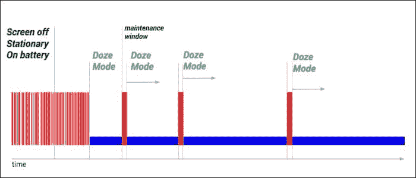
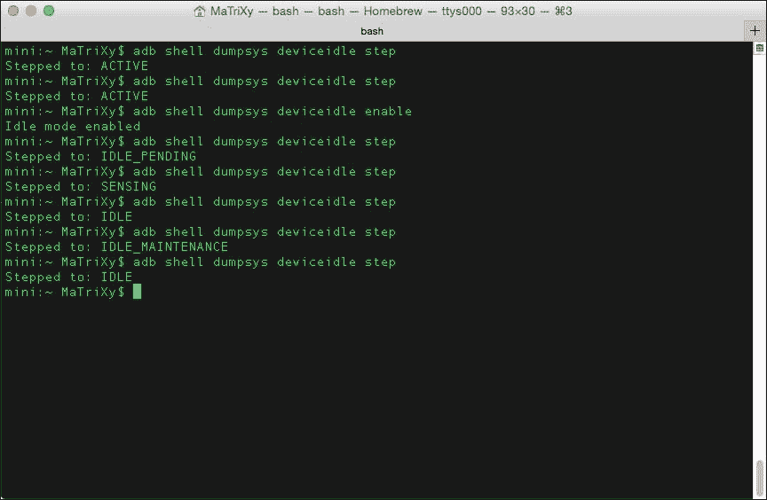
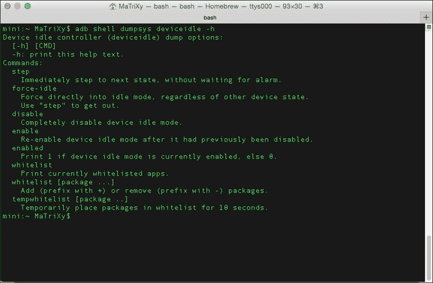
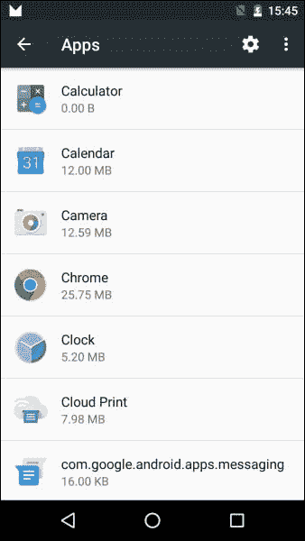
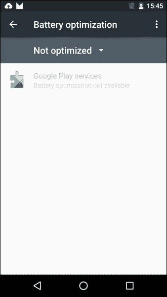
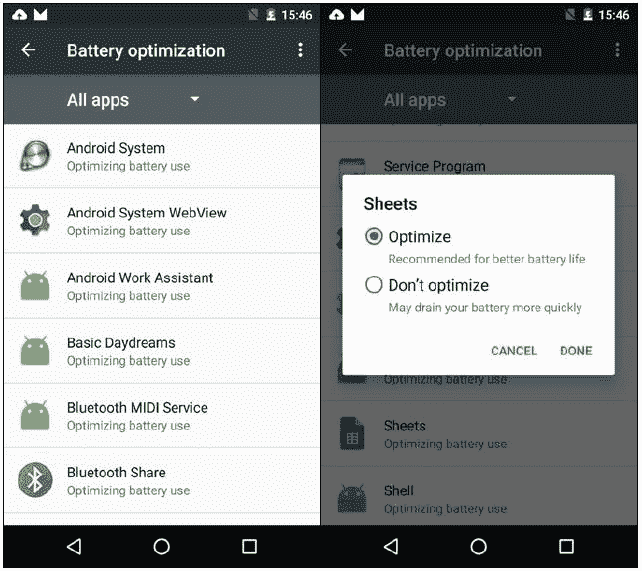

# 四、变化展示

安卓棉花糖包含一些可能被忽视的变化。这些变化很多都很短，但需要你全力以赴才能完全理解它们，并确保在尝试使用已删除/不推荐使用的应用编程接口、新的*流*或新的改进的应用编程接口时不会错过。

我已经打包了一组您在为 Android 6.0(棉花糖)构建应用时可能会用到或需要了解和理解的更改:

*   省电模式
*   采用可移动存储
*   Apache HTTP 客户端删除
*   通知
*   文本选择
*   支持库通知
*   安卓密钥库更改
*   无线网络和网络的变化
*   运行时间
*   硬件标识符
*   APK 验证
*   USB 连接
*   directshare
*   语音交互
*   辅助应用编程接口
*   蓝牙应用编程接口更改

前面一组没有单独的章节来介绍主要的变化，例如[第 1 章](1.html#E9OE2-d332ea27e7224e4f9f2d9e09fae9c7cb "Chapter 1. Android Marshmallow Permissions")、*安卓棉花糖权限*中涵盖的权限模型，或者改进的 API，例如我们将在下一章中介绍的视频/音频/相机 API。

# 省电模式

安卓 6.0 增加了新的省电模式、**打盹**和**应用待机**，根据谷歌的测量，电池续航时间延长了多达 2 倍。打瞌睡模式旨在提高空闲设备的睡眠效率，而应用待机模式旨在防止应用在空闲状态下耗尽电量。在这两种情况下，将设备插入充电器可以恢复正常操作。

## 打盹模式

打瞌睡是指某个设备被拔掉电源，屏幕关闭，并且在一段确定的时间内保持静止(这可以通过传感器来确定，例如加速度计)。我们得到的是系统尽可能长时间保持睡眠状态的状态。当安卓 6.0 设备处于打盹模式时，后台不会发生太多事情，如下图所示:



简而言之，你认为会在后台发生的一切，实际上都不会发生。

### 当设备打瞌睡时，应用会发生什么？

当设备进入打盹状态时，您会遇到一些电池高效的系统行为，包括以下内容:

*   除非您的应用收到高优先级的 GCM，否则网络访问受到限制
*   **唤醒锁**被忽略，但被授予应用
*   同步和作业通过以下方式延迟:
    *   同步适配器
    *   `JobScheduler`(不允许运行；这是由系统实施的)
*   Alarms are deferred

    ### 注

    如果您有重要的警报并需要触发用户界面:

*   使用`setAndAllowWhileIdle()`方法
*   不能被滥用；这允许每 15 分钟一次
*   无线扫描关闭
*   全球定位系统关闭

瞌睡模式将在任何`setAlarmClock()`报警前不久结束；它也可以在静止和拔出状态互换时结束。退出休眠模式将触发设备执行任何挂起的作业和同步。

### 用打盹模式测试应用

使用设备(安卓 6.0)和`adb`命令测试应用:

1.  Simulate an unplugged device using the following command:

    ```java
    $ adb shell dumpsys battery unplug

    ```

    这将导致您的电池图标显示，好像设备没有插入。

2.  Take the step to the next state using the following command:

    ```java
    $ adb shell dumpsys deviceidle step

    ```

    这可以在下面的截图中看到:

    

3.  使用以下命令将电池状态重置回正常状态:

    ```java
    $ adb shell dumpsys battery reset

    ```

您也可以使用以下命令列出可用的命令:

```java
$ adb shell dumpsys deviceidle -h

```

这将打印更多关于`deviceidle`用法的信息，如下图所示:



## 应用待机模式

应用待机是一种特殊模式，当系统确定某个应用空闲时，应用将处于该模式。一段时间后，应用被视为闲置，除非该应用表现出以下特征:

*   它当时有一个前台进程(一个活动或服务)
*   它在锁定屏幕或通知托盘中显示通知
*   它是由用户明确启动的
*   它通过设置应用被标记为排除在优化之外

### 在应用待机模式下，应用会发生什么？

如果拔出设备，同步和作业将被推迟，网络访问将受到限制。

如果设备已插入，系统会在待机状态下释放应用锁定，允许设备恢复网络访问和/或执行任何挂起的作业和同步。

### 注

当长时间处于空闲状态时，系统只允许空闲应用每天访问网络一次。

### 在应用待机模式下测试应用

使用设备(安卓 6.0)和`adb`命令测试应用:

1.  模拟进入待机模式的应用:

    ```java
    $ adb shell am broadcast -a android.os.action.DISCHARGING
    $ adb shell am set-inactive <App Package Name > true

    ```

2.  通过唤醒你的应用来模拟:

    ```java
    $ adb shell am set-inactive <App Package Name > false

    ```

3.  看看当你的应用醒来时会发生什么。测试从待机模式正常恢复。检查您的应用的通知和后台作业是否如您预期的那样运行。

您可以通过以下命令将应用设置为非活动状态:

```java
$ adb shell am set-inactive <App Package Name > true

```

您也可以通过以下命令检查应用的状态:

```java
$ adb shell am get-inactive <App Package Name >

```

### 注

样本测试是对谷歌照片行为进行的；保留所有权利。

例如，控制台输出如下:

```java
~ adb shell am set-inactive com.google.android.apps.photos false
~ adb shell am get-inactive com.google.android.apps.photos
Idle=false
~ adb shell am set-inactive com.google.android.apps.photos true
~ adb shell am get-inactive com.google.android.apps.photos
Idle=true

```

### 排除的应用和设置

如前所述，您可以通过设置应用将应用从应用待机模式中排除。这样做的步骤如下:

1.  Go to **Settings** | **Apps**.

    

2.  Click on the cog/gear icon to open the **Configure apps** screen.

    

3.  Choose **Battery optimization**.

    

4.  The following screenshot shows a list of the apps excluded from the App Standby mode—that is, the ones that are not optimized. You can open the selection for all apps and choose the exact behavior you require for each application.

    

### 提示

这里有几个点和提示供你注意和记住:

*   将`isIgnoringBatteryOptimizations()`用于`PowerManager`实例，并检查您的应用是否在**白名单**中
*   使用以下命令将用户直接导航到配置屏幕:

    ```java
    startActivity(new Intent(Settings.ACTION_IGNORE_BATTERY_OPTIMIZATION_SETTINGS ));
    ```

*   执行以下步骤以显示系统对话框，询问有关将特定应用添加到白名单的信息:
    1.  将`REQUEST_IGNORE_BATTERY_OPTIMIZATIONS`权限添加到应用的清单中。
    2.  创建指向您的应用的 URI 包。
    3.  将 URI 包装在一个意图中，并用它调用`startActivity()`，如以下代码所示:

        ```java
        Intent intent = new Intent(Settings.ACTION_REQUEST_IGNORE_BATTERY_OPTIMIZATIONS , Uri.parse("package:" + getPackageName()));
        startActivity(intent);
        ```

*   注意如果我们的应用已经被列入白名单，对话框就不会再显示了

# 采用可移动存储

安卓棉花糖允许用户*采用*外接存储设备，比如 SD 卡。这种采用将格式化和加密存储设备，并将其安装为内部存储。完成后，用户可以在存储设备之间移动应用和应用的私有数据。然后，系统将使用清单中的`android:installLocation`首选项来确定每个应用的可用位置。您需要记住的是，对目录或文件使用`Context`方法和`ApplicationInfo`字段将返回可以在运行之间改变的值。您应该总是动态调用这些 API。不要使用硬编码的文件路径或保留完全限定的文件路径。

`Context`方法如下:

*   `getFilesDir()`
*   `getCacheDir()`
*   `getCodeCacheDir()`
*   `getDatabasePath()`
*   `getDir()`
*   `getNoBackupFilesDir()`
*   `getFileStreamPath()`
*   `getPackageCodePath()`
*   `getPackageResourcePath()`

`ApplicationInfo`字段如下:

*   `dataDir`
*   `sourceDir`
*   `nativeLibraryDir`
*   `publicSourceDir`
*   `splitSourceDirs`
*   `splitPublicSourceDirs`

您可以调试此功能，并使用以下命令启用通过 **OTG** (旅途中**的简称**)电缆连接的 USB 驱动器:

```java
$ adb shell sm set-force-adoptable true

```

关于 USB 的更多信息，请前往[https://developer . Android . com/guide/topics/connectivity/USB/index . html](https://developer.android.com/guide/topics/connectivity/usb/index.html)。

# Apache HTTP 客户端删除

从 2011 年左右开始， **Apache HTTP 客户端**已经被弃用了很长时间。不建议在安卓 2.3 及更高版本上使用该客户端；现在有了 Android 6.0 棉花糖，这个 API 已经被移除了。所以，我们将使用`HttpURLConnection`类来代替。

该应用编程接口效率更高，减少了网络使用，并将功耗降至最低。

如果您希望继续使用 Apache HTTP APIs，您必须首先在您的`build.gradle`文件中声明以下编译时依赖项:

```java
android {
  useLibrary 'org.apache.http.legacy'
}
```

### 注

如果你在安卓工作室有编译错误，你可以在 stackoverflow 上找到这些问题和解决方案:

*   [http://stackoverflow.com/q/30856785/529518](http://stackoverflow.com/q/30856785/529518)
*   [http://stackoverflow.com/q/31653002/529518](http://stackoverflow.com/q/31653002/529518)

# 通知

通知功能有一些变化，如下所示:

*   `Notification.setLatestEventInfo()`方法现在被移除。在构造通知时，我们必须使用`Notification.Builder`类。
*   更新通知也是通过`Notification.Builder`实例使用构建器的同一个实例完成的，调用`build()`方法会得到一个更新的`Notification`实例。如果需要旧版支持，可以使用`NotificationCompat.Builder`代替，可在 **安卓支持库**中找到。
*   `adb shell dumpsys notification`命令不再输出通知文本。现在正确的用法是`adb shell dumpsys notification --noredact`。
*   新增加的`INTERRUPTION_FILTER_ALARMS`过滤级别对应一个新模式:*只报警不打扰*。
*   新增的`CATEGORY_REMINDER`类别用于用户预约提醒。
*   新增加的`Icon`类允许通过`setSmallIcon()`和`setLargeIcon()`方法将图标附加到通知上。
*   更新后的`addAction()`方法现在接受一个`Icon`对象，而不是一个可绘制的资源标识。
*   新增加的`getActiveNotifications()`方法可以让你找出哪些通知当前是活动的。
*   使用以下方法时，我们可以获得一些关于用户是什么以及不希望在通知下看到什么的信息:
    *   新增加的`getCurrentInterruptionFilter()`方法返回当前通知中断过滤器，其中允许通知中断用户
    *   新增加的`getNotificationPolicy()`方法返回当前通知策略

# 文本选择

材质设计指南规范的一部分讨论了应用中的文本选择。用户在你的应用中选择文本，你现在有了一个应用编程接口来合并一个**浮动工具栏**设计模式，类似于一个上下文操作栏。有关设计规格的更多信息，请前往[http://www . Google . com/design/spec/patterns/selection . html # selection-item-selection](http://www.google.com/design/spec/patterns/selection.html#selection-item-selection)。

实施步骤如下:

1.  将您的`ActionMode`通话更改为`startActionMode(Callback,ActionMode.TYPE_FLOATING)`。
2.  延伸`ActionMode.Callback2`。
3.  覆盖`onGetContentRect()`方法，并为视图中的内容`Rect`对象提供坐标。
4.  当需要使`Rect`对象无效且其位置不再有效时，调用`invalidateContentRect()`方法。

## 支持库通知

浮动工具栏不是向后兼容的。`Appcompat`默认控制`ActionMode`对象。这将阻止浮动工具栏显示。

实施步骤如下:

1.  在返回的`AppCompatDelegate`对象上调用`getDelegate()`和`setHandleNativeActionModesEnabled()`。
2.  将输入参数设置为`false`。

该调用将把对`ActionMode`对象的控制返回给框架，允许 6.0 设备支持`ActionBar`或浮动工具栏模式，并允许早期版本支持`ActionBar`模式。

# 安卓密钥库更改

从安卓 6.0 开始，安卓密钥库提供商不再支持 **数字签名算法** ( **DSA** )。

有关密钥库及其使用的更多信息，请访问[https://developer . Android . com/training/articles/keystore . html](https://developer.android.com/training/articles/keystore.html)。

# Wi-Fi 和网络变化

安卓棉花糖对无线网络和网络应用接口做了一些改变。

改变`WifiConfiguration`对象的状态只对自创对象是可能的。您被限制修改或删除用户或其他应用创建的`WifiConfiguration`对象。

在早期版本中，使用`enableNetwork()`强制设备连接到特定的无线网络并设置`disableAllOthers=true`会导致设备与其他网络断开连接。这在 Android 6.0 中是不会发生的。使用`targetSdkVersion <=20`，您的应用将被锁定使用选定的无线网络。当`targetSdkVersion >=21`时，您需要使用`MultiNetwork`应用编程接口，并确保网络流量被分配到适当的网络。关于`MultiNetwork` API 的更多信息，请参考[https://developer . Android . com/about/versions/Android-5.0 . html # Wireless](https://developer.android.com/about/versions/android-5.0.html#Wireless)。

# 运行时间

安卓 **ART** (简称**安卓运行时**)运行时也在安卓棉花糖中更新，更新如下:

*   `newInstance()`方法:错误检查访问规则的 **达尔维克**(另一个运行时)问题已修复。如果您希望覆盖访问检查，请调用`setAccessible()`方法，并将输入参数设置为`true`。
*   使用`v7 Appcompat`库还是`v7 Recyclerview`库？您必须更新到最新版本。
*   确保从 XML 引用的任何自定义类都已更新，以便可以访问它们的类构造函数。
*   动态链接器的行为被更新。
*   The ART runtime understands the difference between a library's `soname` and its path; search by `soname` is now implemented. There was an open bug with this issue that was fixed; if you wish to extend your reading, visit here:

    [https://code.google.com/p/android/issues/detail?id=6670](https://code.google.com/p/android/issues/detail?id=6670)

# 硬件标识符

安卓 6.0 已经引入了一个重大变化，以获得更大的数据保护；`WifiInfo.getMacAddress()`和`BluetoothAdapter.getAddress()`方法现在返回一个常量`02:00:00:00:00:00`，这意味着你不能依靠这些方法来获取信息。

现在，当您试图使用 API 中的一些方法时，您需要添加权限:

*   `WifiManager.getScanResults()`和`BluetoothLeScanner.startScan()`需要授予这两种权限之一:
    *   `ACCESS_FINE_LOCATION`许可
    *   `ACCESS_COARSE_LOCATION`许可
*   `BluetoothDevice.ACTION_FOUND`:这个必须有`ACCESS_COARSE_LOCATION`的许可

### 注

当运行安卓 6.0(棉花糖)的设备启动后台 Wi-Fi 或蓝牙扫描时，外部设备会将原点视为随机 MAC 地址。

# APK 验证

平台现在对**安卓套装** ( **APKs** )进行严格验证。

如果清单中声明的文件不在 APK 本身，则 APK 被视为已损坏。从 APK 移除内容需要重新签署 APK。

# USB 连接

默认情况下，USB 连接仅充电。用户现在必须授予通过 USB 端口进行交互的权限。您的应用应该考虑到这一点，并注意可能不会授予权限。

# 直接分享

依我拙见，技术最好的一点是，它给用户提供了很好的互动选择，并从中受益。**直接分享** 可以被视为优点列表中的一个很好的补充，在整个应用世界都有很好的、流畅的用户体验。那么，什么是直接分享？嗯，今天几乎每个应用都使用某种信息/数据交换，通过共享机制与用户设备上的其他应用或外部世界进行交换。共享机制将一条信息从一个应用公开给另一个应用。通常，用户会与几个亲密的伙伴(家人、亲密的朋友或同事)互动，这就是直接分享对你的帮助。

“直接共享”是为了让用户能够直观、快速地进行共享而需要的一组应用编程接口。您可以在应用中定义启动特定活动的直接共享目标。这些目标显示在**共享**菜单中，允许更快的共享和流畅的数据流动。

通过直接共享，用户可以将内容共享给目标，比如其他应用中的联系人。

实施步骤如下:

1.  定义一个扩展`ChooserTargetService`类的类。
2.  在清单中声明您的服务。
3.  指定`BIND_CHOOSER_TARGET_SERVICE`权限和意图过滤器`SERVICE_INTERFACE`动作。

服务声明示例如下:

```java
<service android:name=".MyChooserTargetService" android:label="@string/McTs_name" android:permission= "android.permission.BIND_CHOOSER_TARGET_SERVICE">
  <intent-filter>
    <action android:name= "android.service.chooser.ChooserTargetService"/>
  </intent-filter>
</service>
```

现在，我们已经声明了一个服务，对于我们想要公开的每个目标，我们在您的应用清单中添加一个名为`android.service.chooser.chooser_target_service`的`<meta-data>`元素:

```java
<activity android:name=".SampleDirectShareTarget" android:label="@string/SampleDirectShareTarget_name">
  <intent-filter>
    <action android:name="android.intent.action.SEND" />
  </intent-filter>
  <meta-data android:name= "android.service.chooser.chooser_target_service" android:value=".ChooserTargetService" />
</activity>
```

让我们看看我们服务中的代码:

```java
public class MyChooserTargetService extends ChooserTargetService {
  private String mDirectShareTargetName;
  private final int MAX_SHARE_TARGETS = 5;

  @Override
  public void onCreate() {
    super.onCreate();
    mDirectShareTargetName = "Sharing Person demo #%d";
  }

  @Override
  public List < ChooserTarget > onGetChooserTargets(ComponentName sendTarget, IntentFilter matchedFilter) {
    ArrayList < ChooserTarget > result = new
    ArrayList < ChooserTarget > ();
    for (int i = 1; i <= MAX_SHARE_TARGETS; i++) {
      result.add(buildTarget(i));
    }
    return (result);
  }

  private ChooserTarget buildTarget(int targetId) {
    String title = String.format(mDirectShareTargetName, targetId);
    Icon icon = Icon.createWithResource(this, R.drawable.share_target_picture);
    float target_value = ((float)(25 - targetId) / 25);
    ComponentName componentName = new ComponentName(MyChooserTargetService.this, TargetActivity.class);
    Bundle bundle = new Bundle();
    bundle.putInt("simple_key", targetId);
    return (new ChooserTarget(title, icon, target_value, componentName, bundle));
  }
}
```

如果您希望更好地查看代码，可以前往**要点**；你可以参观[https://gist.github.com/MaTriXy/adeacdf5496bcdae5f42](https://gist.github.com/MaTriXy/adeacdf5496bcdae5f42)。

你必须执行`onGetChooserTargets()`方法，因为它将在直接分享被触发时被调用。您返回一个表示共享入口点的`ChooserTarget`对象列表到您的应用。`onGetChooserTargets()`的结果包括在常规的`ACTION_SEND`活动中。所以，我们只要`ChooserTarget`提高流量的对象，不要重复。

创建几个`ChooserTarget`对象时，每个对象都可能指向同一个活动。您必须确保附加包包含有区别的信息，以便每个请求都是唯一的。*不要将*自定义的`Parcelable`对象放在这个包中，因为这会导致崩溃。您可以在[https://developer . Android . com/reference/Android/service/chooser/chooser target . html # chooser target](https://developer.android.com/reference/android/service/chooser/ChooserTarget.html#ChooserTarget)了解更多关于`ChooserTarget`的信息。

## 如果我们没有什么可以分享的呢？

有时候，你不会对某个特定的请求有任何直接的分享目标；那么，返回一个空列表将会很棒。如果您知道在将来使用该应用之前不会有任何结果，也可以通过`android:enabled="false"`禁用该服务。另一个选择是只为安卓 6.0 启用该服务。这可以使用布尔资源轻松完成:

*   让我们添加一个名为`is_share_targets_on`的布尔资源:
    *   默认值为`res/values/bools.xml`；设置为`false`
    *   安卓 6.0 是 API 23，所以在`res/values-v23/bools.xml`中，设置为`true`
*   将`android:enabled="@bool/is_share_targets_on"`添加到您的服务声明中

## 直接分享最佳实践

以下是直接分享中遵循的一些最佳实践:

*   安卓 6.0 限制了份额目标的数量，只显示了其中的 8 个。提供八个以上的份额指标，会根据得分显示出最好的八个。
*   如果您的目标列表超过 1 MB，则会出现`FAILED BINDER TRANSACTION`例外。
*   尽量限制/封顶你试图从`ChooserTargetService`类返回的份额目标数。
*   确保您的应用图标正确显示，因为它将作为徽章应用于您用于直接共享目标的图标上。

# 语音交互

**语音交互** 通常源于用户语音动作。然而，语音交互活动在没有任何用户输入的情况下开始。安卓棉花糖有一个新的语音交互应用编程接口，与 **语音动作**一起，允许我们在应用中构建对话式语音体验。使用`isVoiceInteraction()`方法确定某个活动是否由语音动作触发。然后，您可以使用`VoiceInteractor`类与用户进行交互。

不要与`isVoiceInteractionRoot()`方法混淆，只有当活动也是语音交互的根源时，该方法才会返回`true`。在这里，如果您的活动是由语音交互服务直接启动的，而不是在进行语音交互时由另一个活动(另一个应用)启动的，您将获得`true`。

最佳做法是提示用户并确认这是他们的预期操作。你已经知道语音输入是从 **谷歌现在**调用的，你可以通过简单的语音输入打开网址，比如`open android.com`。现在，你可以发明新的语音动作，并在谷歌注册它们，直接并专门为你的应用带来流量。

要了解更多关于实施语音动作的信息，请前往[https://developers.google.com/voice-actions/interaction/](https://developers.google.com/voice-actions/interaction/)。

# 辅助原料药

回到 **谷歌 I/O 2015** 中的，我们看到了 *Now on Tap* 功能，在该功能中，谷歌 Now 可以偷看正在运行的应用并提供上下文帮助。`Assist`应用编程接口为用户通过 **助手**参与提供了一种新的方式。在使用助手之前，必须启用它，使它能够了解当前的上下文。无论哪个应用处于活动状态，长按 *Home* 按钮即可触发助手。

您可以通过设置`WindowManager.LayoutParams.FLAG_SECURE`标志选择退出。

选择加入需要使用新的`AssistContent`类。

为了能够从我们的应用向助手提供额外的上下文，我们需要遵循以下步骤:

1.  实现`Application.OnProvideAssistDataListener`界面，用户请求协助时调用。
2.  使用`Application.registerOnProvideAssistDataListener()`注册。
3.  覆盖`onProvideAssistData()`回调，当用户请求协助时调用。它用于构建一个包含当前应用所有上下文的`ACTION_ASSIST`意图。
4.  覆盖`onProvideAssistContent()`回调；这是可选的。当用户请求帮助时调用它，允许我们提供与当前活动相关的内容的引用。
5.  完成后，使用`Application.unregisterOnProvideAssistDataListener()`注销自己。

# 蓝牙 API 变更

除了前面提到的变化，安卓棉花糖 6.0 还对蓝牙 API 做了一些改动。

## 支持蓝牙手写笔

**铁笔**已经来过一段时间了；在安卓棉花糖之前的版本中，蓝牙手写笔并不完全支持规范。您可以将兼容的蓝牙手写笔与手机或平板电脑配对连接。因为您不仅仅局限于屏幕上的触摸，您可以融合位置、压力和按钮状态数据，从而允许更精确的用户输入和体验。您的应用可以为手写笔按钮添加一个监听器，并相应地采取行动。只需在活动中使用`View.OnContextClickListener`和`GestureDetector.OnContextClickListener`对象。

为了检测手写笔按钮的交互和移动，您需要以下内容:

*   `MotionEvent`方法
*   `getTooltype()`方法，如果在屏幕上触摸带有按钮的手写笔，则返回`TOOL_TYPE_STYLUS`
*   `getButtonState()`方法，返回(在安卓 6.0 目标应用上)以下内容:
    *   `BUTTON_STYLUS_PRIMARY`:按下主手写笔按钮
    *   `BUTTON_STYLUS_SECONDARY`:按二次按钮
    *   `BUTTON_STYLUS_PRIMARY` | `BUTTON_STYLUS_SECONDARY`:按下两个按钮
*   API 级别低于 Android 6.0 的目标应用将导致以下结果:
    *   `BUTTON_SECONDARY`:按下主手写笔按钮
    *   `BUTTON_TERTIARY`:按二次按钮
    *   `BUTTON_SECONDARY` | `BUTTON_TERTIARY`:按下两个按钮

## 改进的蓝牙低能量扫描

习惯在你的应用中蓝牙低能量？嗯，现在扫描过程更容易了，也更完善了。使用新的`setCallbackType()`方法，并指定当系统发现/看到与`ScanFilter`类匹配的广告包时，您想要回调。与以前的安卓版本相比，您可以获得更高的能效。

# 总结

我们回顾了安卓棉花糖的一些变化。所有这些变化都很重要，将在应用开发周期中帮助您。在以后的章节中，还会有一些更详细的变化需要讨论。我们的下一章将讨论音频、视频和相机功能以及安卓 6.0.6 中所做的更改。