# 第一章。电晕 SDK 入门

> *在我们直接开始编写一些简单的游戏之前，我们需要安装并运行必要的程序，让我们的应用变得生动起来。 **Corona SDK** 主要是 2D 开发引擎。如果你有过为 iOS 或安卓系统开发的经验，你会发现使用 Corona 的体验令人耳目一新。使用起来也很简单。很快，你就会创造出成品，通过苹果应用商店和谷歌 Play 商店进行销售。*

在本章中，我们将:

*   在 Mac OS X 和 Windows 上设置 Corona SDK
*   为 Mac OS X 安装 Xcode
*   用两行代码创建一个 Hello World 程序
*   在 iOS 配置门户中添加设备
*   将应用加载到 iOS 设备
*   将应用加载到安卓设备

# 下载并安装电晕

你可以选择 Mac OS X 或者微软 Windows 操作系统进行开发。请记住运行程序所需的以下系统要求。本书使用的最兼容版本是 Build 2014.2511。

如果您要为 Mac OS X 安装 Corona，请确保您的系统具有以下功能:

*   Mac OS X 10.9 或更高版本
*   运行狮子、山狮、小牛或约塞米蒂的基于英特尔的系统
*   64 位中央处理器(双核)
*   OpenGL 2.0 或更高版本的图形系统

如果您正在运行微软视窗，请确保您的系统具有以下功能:

*   Windows 8、Windows 7、Vista 或 XP (Service Pack 2)操作系统
*   1 千兆赫处理器(推荐)
*   80 MB 磁盘空间(最低)
*   1 GB 内存(最低)
*   OpenGL 2.1 或更高版本的图形系统(在大多数现代视窗系统中可用)
*   32 位(x86)版本的 **Java 开发工具包** ( **JDK**
*   安卓软件开发工具包不需要在苹果电脑或视窗系统上创建带有电晕的安卓设备版本

# 行动时间-在 Mac OS X 上设置并激活 Corona

让我们从在桌面上设置电晕 SDK 开始:

1.  如果您还没有下载软件开发工具包，请从[http://www.coronalabs.com/downloads/coronasdk](http://www.coronalabs.com/downloads/coronasdk)下载。在访问软件开发工具包之前，您必须将注册为用户。
2.  The file extension for any Mac program should end in `.dmg`; this is known as an Apple disk image. Once you've downloaded the disk image, double-click on the disk image file to mount it. The name should be similar to `CoronaSDK-XXXX.XXXX.dmg`. Once it is loaded, you should see the mounted disk image folder, as shown in the following screenshot:

    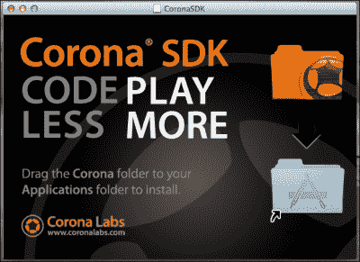

3.  Next, drag the `CoronaSDK` folder into the `Applications` folder. This will copy the contents of the Corona folder into `/Applications`. You will be prompted to enter an administrator password if you are not the main administrator of the account. You will be able to see the `CoronaSDK` folder in `/Applications` once it has been successfully installed. For easy access to the folder contents, create an alias by dragging the `CoronaSDK` folder to the dock of your Mac desktop:

    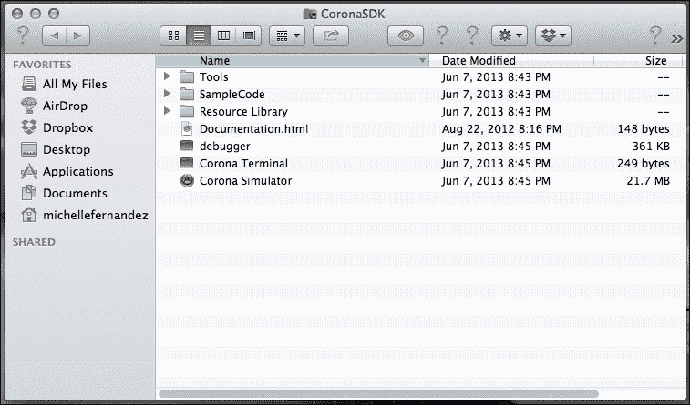

第一次使用 Corona SDK 的用户必须先执行快速简单的一次性授权流程，然后才能访问。您必须连接到互联网才能完成授权过程。

1.  在软件开发工具包文件夹中启动电晕模拟器。
2.  Assuming this is your first time, you will be presented with an **End-user License Agreement** (**EULA**). Once you have accepted the agreement, enter the e-mail you used to register for Corona and the password to activate the SDK. Otherwise, click on **Register** to create an account.

    ### 注

    如果你以单个开发者的身份向 Corona 注册，在 iOS 和/或安卓设备上开发是不收费的。

    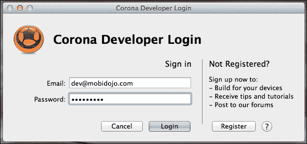

3.  Upon successful login, you will get a confirmation dialog to show that the SDK is ready to use:

    

4.  Click on the **Continue** button, and you'll be presented with the Welcome to Corona screen:

    

## *刚刚发生了什么？*

在你的苹果操作系统上设置 Corona SDK 就像安装任何其他专用的苹果程序一样简单。在您的机器上授权SDK 并使用您的电子邮件和密码登录后，它就可以使用了。从现在开始，每次你启动 Corona，它都会自动登录你的账户。你会注意到，当这种情况发生时，你会看到一个电晕 SDK 屏幕。

# 行动时间-设置和激活窗户上的电晕

让我们通过以下步骤在桌面上设置电晕软件开发工具包:

1.  从[http://www.coronalabs.com/downloads/coronasdk](http://www.coronalabs.com/downloads/coronasdk)下载科罗纳软件开发工具包。在访问软件开发工具包之前，您必须注册为用户。
2.  Windows 版本的 Corona 的文件扩展名应该以`.msi`结尾，这被称为 Windows Installer，是微软为安装程序而制作的 Windows 组件。双击文件。文件名应该类似于`CoronaSDK.msi`。
3.  按照屏幕上的说明进行安装。
4.  Corona will be installed directly into your `Programs` folder by default. On Microsoft Windows, select **Corona Simulator** from the list of programs in your Start menu or double-click on the Corona icon on the desktop. Upon successful activation, you should be greeted with the following screen:

    

5.  The process to activate the SDK should be the same as the Mac procedure once you launch Corona for the very first time.

    ### 注

    如果您遇到图像显示不正常的问题，请检查您是否使用了最新的 OpenGL 图形驱动程序 2.1 或更高版本。

    请注意，Windows 上的 Corona SDK 只能为 Android 设备构建，不能为 iOS 设备(iPhone、iPad 或 iPod Touch)构建。苹果不仅可以为 iOS 构建，也可以为科罗纳的安卓设备构建。

6.  要创建设备版本，您需要在您的电脑上安装 Java 6 SDK。您将需要到甲骨文网站[http://www . Oracle . com/technetwork/Java/javasebook/downloads/Java-archive-downloads-javase 6-419409 . html](http://www.oracle.com/technetwork/java/javasebusiness/downloads/java-archive-downloads-javase6-419409.html)进行 JDK 下载，并点击 **Java SE 开发工具包 6u45** 链接上的。
7.  在下一页，选择**接受许可协议**单选按钮，然后点击 **Windows x86** 链接下载安装程序。如果您还没有用户帐户，系统会要求您登录或在甲骨文网站上创建一个用户帐户。
8.  下载 JDK 后，立即运行安装程序。安装后，您将能够在您的电脑上为安卓创建设备版本。

## *刚刚发生了什么？*

在 Windows 上安装 SDK 与在 Mac OS X 上安装 SDK 是不同的设置过程，在执行安装程序文件的同时，Windows 会自动呈现一个指定的位置来安装应用，比如`Programs`文件夹，这样就不用手动选择目的地了。成功安装后，您将在桌面上看到 Corona SDK 图标，以便于访问，或者它可能会在“开始”菜单的程序列表中突出显示，假设您是第一次访问它。当您在机器上授权 Corona 并使用您的登录信息登录时，它就可以供您使用，并且每次启动时都会自动登录。

# 在 Mac 和 Windows 上使用模拟器

在 Mac OS X 上，通过从`Applications`目录中选择电晕终端或电晕模拟器，启动电晕软件开发工具包。两个选项都将访问软件开发工具包。电晕模拟器只会打开模拟器。电晕终端将打开模拟器和终端窗口。该终端有助于调试您的程序，并显示模拟器错误/警告和`print()`消息。

在微软视窗上，选择`Corona SDK`文件夹，从开始菜单的程序列表中点击**电晕模拟器**，或者双击桌面上的电晕图标。如果您使用的是 Windows，模拟器和终端总是一起打开的。

让我们浏览一下`Corona SDK`文件夹中包含的有用内容(位于 Mac 上的`Applications/Corona SDK`和窗口上的`Start/All Apps/Corona SDK`:

*   **调试器(Mac)/Corona 调试器(Windows)** :这是一款工具，可以发现并隔离代码中的问题。
*   **电晕模拟器**:这是用来启动你的测试应用的环境。它模拟您正在本地计算机上开发的移动设备。在 Windows 上，它会同时打开模拟器和终端。
*   **电晕终端**:启动电晕模拟器，打开终端窗口显示错误/警告信息和`print()`语句。它对调试您的代码非常有帮助，但仅在 Mac 上可用。
*   **模拟器**:这个和 Corona 终端有相同的属性，但是从命令行调用，只能在 Mac 上使用。
*   **示例代码**:这个是一组让你开始使用 Corona 的示例应用。它包含要使用的代码和艺术资产。

当您启动模拟器时，电晕 SDK 窗口会自动打开。您可以在模拟器中打开一个 Corona 项目，创建一个用于测试或分发的设备构建，并查看一些示例游戏和应用来熟悉 SDK。

# 行动时间–在模拟器中查看样本项目

让我们来看看模拟器中的样本项目:

1.  点击`Corona SDK`文件夹中的**电晕模拟器**。
2.  当电晕 SDK 窗口启动时，点击**样品**链接。在出现的**打开**对话框中，导航至`Applications/CoronaSDK/SampleCode/Physics/HelloPhysics`(苹果)或 `C:\Program Files (x86)\Corona Labs\Corona SDK\Sample Code\Physics\HelloPhysics`(视窗)。在苹果电脑上，点击**打开**，它会自动打开`main.lua`。在窗口双击`main.lua`打开文件。`HelloPhysics`应用在模拟器中打开并运行。

## *刚刚发生了什么？*

通过电晕终端或电晕模拟器访问软件开发工具包是首选。许多苹果用户更喜欢使用电晕终端，这样他们就可以跟踪输出到终端的消息。当你通过 Corona 模拟器启动 SDK 时，会显示模拟器，但不会显示终端窗口。当 Windows 用户启动 Corona 模拟器时，它将同时显示模拟器和终端窗口。当您想要使用 Corona 提供的任何示例应用时，这非常好用。

`main.lua`文件是一个特殊的文件名，它告诉 Corona 在项目文件夹中从哪里开始。该文件还可以加载其他代码文件或其他程序资源，如声音或图形。

当你在 Corona 中启动`HelloPhysics`应用时，你会在模拟器中观察到一个盒子物体从屏幕顶部落下，并与地面物体发生碰撞。从启动`main.lua`文件到在模拟器中查看结果的转换几乎是立即的。

## 拥有围棋英雄——使用不同的设备外壳

当你开始熟悉 Corona 模拟器时，无论你是在 Windows 还是 Mac OS X，当你启动一个应用时，总是会使用一个默认设备。Windows 使用 Droid 作为默认设备，而 Mac OS X 则使用普通的 iPhone。尝试在不同的设备外壳中启动示例代码，以查看模拟器可用的所有设备之间的屏幕分辨率差异。

当将构建移植到多个平台时，您必须考虑 iOS 和安卓设备中的各种屏幕分辨率。构建是所有源代码的编译版本，转换成一个文件。让您的游戏构建配置为多个平台可以扩大您的应用的受众范围。

# 选择文本编辑器

Corona 没有指定的程序编辑器来编码，所以你必须找到一个适合你需要的。

对于 Mac OS 来说，text 牧马人是一款不错的，也是免费的！你可以从[下载。其他文本编辑器](http://www.barebones.com/products/textwrangler/download.html)如位于[http://www.barebones.com/thedeck](http://www.barebones.com/thedeck)的 BBEdit 和位于[http://macromates.com/](http://macromates.com/)的文本编辑器都很棒，但是您需要购买它们才能使用它们。TextMate 也与 Corona TextMate Bundle 兼容，后者可在[http://www . dictionary software . com/Corona-text mate-Bundle/index . html](http://www.ludicroussoftware.com/corona-textmate-bundle/index.html)获得。

对于微软 Windows，推荐记事本++可以从[http://notepad-plus-plus.org/](http://notepad-plus-plus.org/)下载。

以下是兼容 Mac OS 和微软 Windows 的文本编辑器:

*   崇高文字([http://www.sublimetext.com](http://www.sublimetext.com)
*   卢阿滑翔机([http://www.mydevelopersgames.com/Glider/](http://www.mydevelopersgames.com/Glider/)
*   outlaw([http://outlaw gametools . com/outlaw-code-editor-and-project-manager/](http://outlawgametools.com/outlaw-code-editor-and-project-manager/))

任何已经包含在操作系统中的文本编辑器，如苹果的文本编辑或视窗的记事本，都可以工作，但使用为编程设计的编辑器会更容易。对于 Corona，使用支持 Lua 语法高亮显示的编辑器在编码时效果最好。语法突出显示为关键字和标点符号添加了格式属性，使读者更容易将代码与文本分开。

# 在设备上开发

如果只是想让使用 Corona 模拟器，不需要下载苹果的开发者套件、Xcode 或者安卓 SDK。为了在 iOS 设备(iPhone、iPod Touch 和 iPad)上构建和测试您的代码，您需要注册为苹果开发人员，并创建和下载配置文件。如果你想在安卓上开发，你不需要下载安卓软件开发工具包，除非你想使用 ADB 工具来帮助安装版本和查看调试消息。

Corona SDK 入门版允许您构建 Adhoc(针对 iOS)和调试构建(针对 Android)，以便在自己的设备上进行测试。Corona Pro 用户还可以获得特殊功能的好处，例如访问日常构建、高级功能、所有插件和高级支持。

# 行动时间-下载并安装 Xcode

为了开发任何 iOS 应用，您需要注册每年花费 99 美元的苹果开发者计划，并通过以下步骤在苹果网站的 http://developer.apple.com/programs/ios/创建一个 T2 账户:

1.  点击**立即注册**按钮，按照苹果的指示完成该过程。添加程序时，选择 **iOS 开发者程序**。
2.  完成注册后，点击标有**开发中心**部分下的 iOS 链接。
3.  向下滚动到**下载**部分，下载当前的 Xcode，也可以从 Mac App Store 下载 Xcode。
4.  Once you have fully downloaded Xcode, double-click on Xcode from `/Applications/Xcode`. You will be asked to authenticate as an administrative user:

    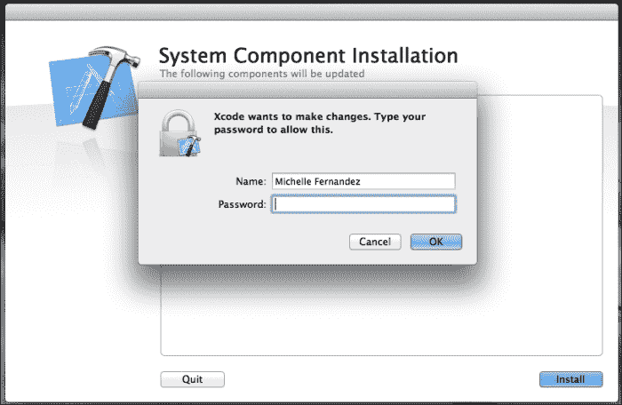

5.  After you have entered your credentials, click on the **OK** button to complete the installation. You will see the following screen:

    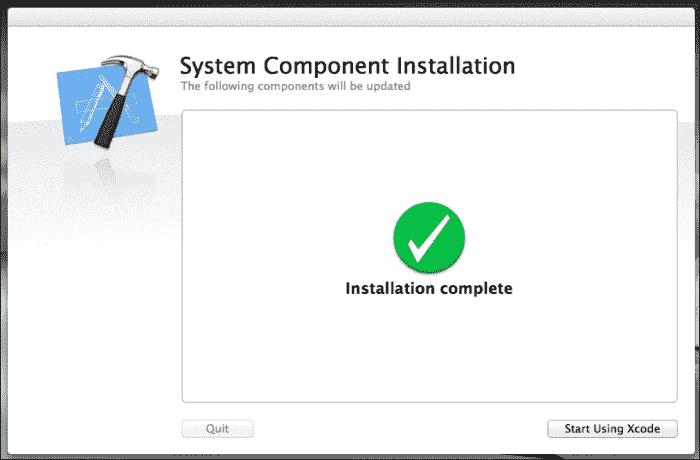

6.  当安装了 Xcode 开发工具后，您可以通过启动 Xcode 并选择**帮助**菜单中的任何项目来访问文档。开发人员应用如 Xcode 和 Instruments 安装在`/Applications/Xcode`中。您可以将这些应用图标拖到您的坞站，以便于访问。

## *刚刚发生了什么？*

我们刚刚完成了如何为 Mac OS X 安装 Xcode 的步骤。通过注册苹果开发者计划，您将可以在网站上访问最新的开发工具。请记住，要继续成为苹果开发者，*你必须每年支付*99 美元的费用来保持你的订阅。

Xcode 文件相当大，因此下载需要一点时间，这取决于您的互联网连接速度。一旦您的安装完成，Xcode 将准备就绪。

# 行动时间——用两行代码创建一个 Hello World 应用

现在已经设置好模拟器和文本编辑器，让我们开始制作第一个 Corona 程序吧！我们要制作的第一个程序叫做`Hello World`。这是许多人在开始一门新的编程语言时学习的传统程序。

1.  打开你喜欢的文本编辑器，输入以下几行:

    ```java
    textObject = display.newText( "Hello World!", 160, 80, native.systemFont, 36 )
    textObject: setFillColor ( 1, 1, 1 )
    ```

2.  接下来，在你的桌面上创建一个名为`Hello World`的文件夹。将前面的文本保存为名为`main.lua`的文件，保存到项目文件夹的位置。
3.  Launch Corona. You will be greeted with the Corona SDK screen. Click on **Open** and navigate to the `Hello World` folder you just created. You should see your `main.lua` file in this folder:

    

4.  On a Mac, click on the **Open** button. On Windows, select the `main.lua` file and click on the **Open** button. You'll see your new program running in the Corona simulator:

    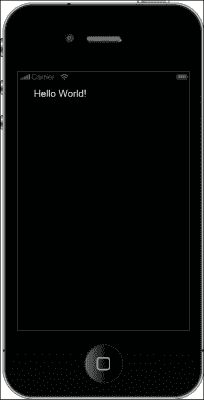

### 类型

**下载示例代码**

您可以从您在[http://www.packtpub.com](http://www.packtpub.com)的账户中下载您购买的所有 Packt Publishing 图书的示例代码文件。如果您在其他地方购买了这本书，您可以访问[http://www.packtpub.com/support](http://www.packtpub.com/support)并注册，以便将文件直接通过电子邮件发送给您。

# 行动时间-修改我们的应用

在我们进入更复杂的例子之前，让我们通过执行以下步骤来改变程序中的一些小事情:

1.  让我们将`main.lua`的第二行改为如下显示:

    ```java
    textObject = display.newText( "Hello World!", 160, 80, native.systemFont, 36 )
    textObject:setFillColor( 0.9, 0.98 ,0 )
    ```

2.  Save your file and go back to the Corona simulator. The simulator will detect a change from your file and automatically relaunch with the changes. If the simulator doesn't relaunch automatically upon saving your file, press *Command* + *R* (Mac) / *Ctrl* + *R* (Windows). You will see the following output on the screen:

    

### 注

随着继续学习更多的 Corona 函数，你会注意到一些文本值将是可选的。在这种情况下，我们需要使用五个值。

# 行动时间-在我们的应用中应用新的字体名称

现在，让我们通过执行以下步骤来玩转字体名称:

1.  将第一行改为下面一行代码:

    ```java
    textObject = display.newText( "Hello World!", 160, 80, "Times New Roman", 36 )
    ```

2.  Be sure to save your `main.lua` file after making any alterations; then, press *Command* + *R* (Mac) / *Ctrl* + *R* (Windows) in Corona to relaunch the simulator to view the new font. If you're using a Mac, usually, the simulator automatically relaunches after saving your file, or it may ask you if you want to relaunch the program. You can see the new font in the simulator:

    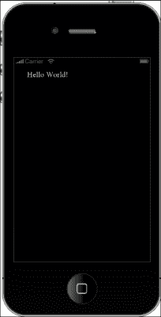

## *刚刚发生了什么？*

您现在已经完成了第一个完整的移动应用！更神奇的是，这是一款完整的 iPhone、iPad 和安卓应用。如果您要创建一个构建，这个两行程序将实际安装并运行在您的 iOS/Android 设备上。您现在已经看到了 Corona 中的基本工作流程。

如果你看一下你的`main.lua`文件中的第 2 行，你会注意到`setFillColor`改变了**你好世界的文本颜色！**。

颜色由三组 RGB 数字组成，代表一种颜色中包含的红、绿、蓝的数量。它们以三个数字显示，数值范围从 0 到 1。例如，黑色为(0，0，0)，蓝色为(0，0，1)，白色为(0.6，0.4，0.8)。

继续玩转不同的色值，看不同的结果。当你保存你的`main.lua`文件并重新启动 Corona 时，你可以在模拟器中看到对代码的修改。

当你查看`main.lua`文件的第一行时，你会注意到`newText()`被显示对象调用了。返回参考是`textObject`。`newText()`功能返回一个代表屏幕上文本的对象。`newText()`功能是显示库的一部分。

当你想进入`newText`的显示属性时，输入`display.newText`。`Hello World!`后面的两个数字以像素为单位控制文本在屏幕上的水平和垂直位置。下一项指定字体。我们使用了名称`native.systemFont`，默认情况下，这是指当前设备上的标准字体。例如，iPhone 的默认字体是 Helvetica。您可以使用任何标准字体名称，例如前面示例中使用的 Times New Roman。最后使用的数字是字体大小。

## 玩个围棋英雄——添加更多文本对象

现在你开始尝试编码了，试着在你当前的项目文件中遵循这些步骤:

1.  使用不同的字体和文本颜色创建新的显示对象。确保它显示在`Hello World!`文本下方。确保您的新显示对象具有不同的对象名称。
2.  继续更改当前显示对象的值，`textObject`。更改 *x* 和 *y* 坐标、字符串、字体名称，甚至字体大小。
3.  当`object:setFillColor( r,g,b )`设置文本颜色时，有一个可选参数可以添加，用于控制文本的不透明度。尝试使用`object:setFillColor( r, g, b [, a] )`。`a`的可用值也在 0 到 1 之间(1 是不透明的，这是默认值)。观察文本颜色的结果。

# 在 iOS 设备上测试我们的应用

如果您只对在安卓设备上测试应用感兴趣，请跳过本章的这一部分，转到*在安卓设备上测试我们的应用*。在我们可以在 iOS 设备上上传我们的第一个 Hello World 应用之前，我们需要登录我们的苹果开发者帐户，这样我们就可以在我们的开发机器上创建和安装我们的签名证书。如果您还没有创建开发人员帐户，请前往[http://developer.apple.com/programs/ios/](http://developer.apple.com/programs/ios/)创建。请记住，成为苹果开发者每年需要支付 99 美元的费用。

### 注

Apple 开发者帐户仅适用于在 Mac OS X 上开发的用户。请确保您的 Xcode 版本与手机上的 OS 版本相同或更新。例如，如果您安装了 5.0 版的 iPhone 操作系统，您将需要与 iOS SDK 版或更高版本捆绑的 Xcode。

# 行动时间-获取 iOS 开发者证书

确定你已经注册了开发者计划；您将需要使用位于`/Applications/Utilities`的钥匙串访问工具，以便您可以创建证书申请。有效的证书必须签署所有 iOS 应用，然后才能在苹果设备上运行，以便进行任何类型的测试。以下步骤将向您展示如何创建 iOS 开发人员证书:

1.  Go to **Keychain Access** | **Certificate Assistant** | **Request a Certificate From a Certificate Authority**:

    

2.  In the **User Email Address** field, type in the e-mail address you used when you registered as an iOS developer. For **Common Name**, enter your name or team name. Make sure that the name entered matches the information that was submitted when you registered as an iOS developer. The **CA Email Address** field does not need to be filled in, so you can leave it blank. We are not e-mailing the certificate to a **Certificate Authority** (**CA**). Check **Saved to disk** and **Let me specify key pair information**. When you click on **Continue**, you will be asked to choose a save location. Save your file at a destination where you can locate it easily, such as your desktop.

    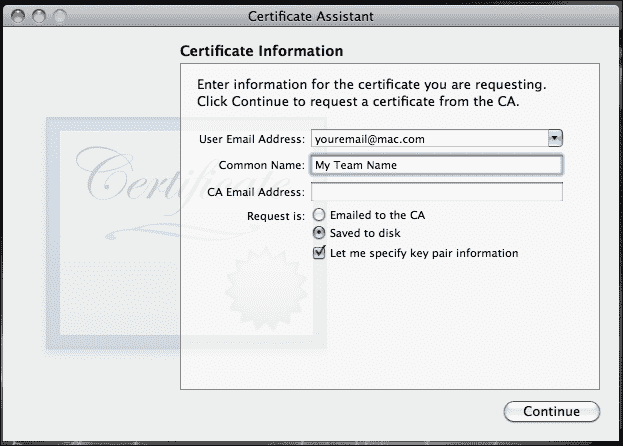

3.  In the following window, make sure that **2048 bits** is selected for the **Key Size** and **RSA** for the **Algorithm**, and then click on **Continue**. This will generate the key and save it to the location you specified. Click on **Done** in the next window.

    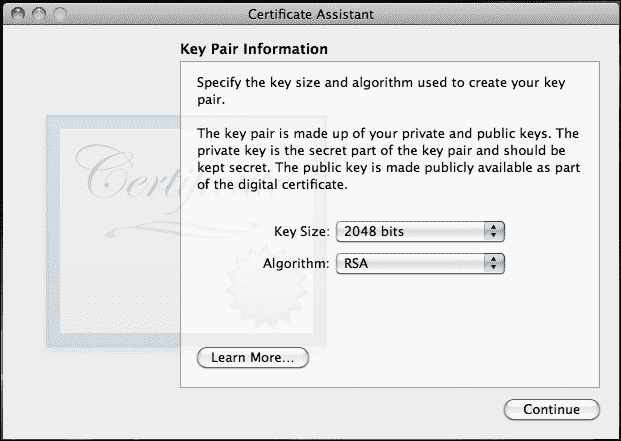

4.  Next, go to the Apple developer website at [http://developer.apple.com/](http://developer.apple.com/), click on **iOS Dev Center**, and log in to your developer account. Select **Certificates, Identifiers & Profiles** under **iOS Developer Program** on the right-hand side of the screen and navigate to **Certificates** under **iOS Apps**. Select the **+** icon on the right-hand side of the page. Under **Development**, click on the **iOS App Development** radio button. Click on the **Continue** button till you reach the screen to generate your certificate:

    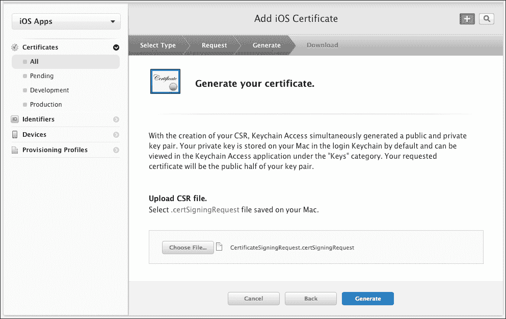

5.  点击**上的选择文件**按钮，找到保存到桌面的证书文件，然后点击**生成**按钮。
6.  Upon hitting **Generate**, you will get the e-mail notification you specified in the CA request form from Keychain Access, or you can download it directly from the developer portal. The person who created the certificate will get this e-mail and can approve the request by hitting the **Approve** button.

    

7.  Click on the **Download** button and save the certificate to a location that is easy to find. Once this is completed, double-click on the file, and the certificate will be added automatically in the Keychain Access.

    

## *刚刚发生了什么？*

我们现在有了 iOS 设备的有效证书。iOS 开发证书仅用于开发目的，有效期约一年。密钥对由您的公钥和私钥组成。私钥是允许 Xcode 签署 iOS 应用的东西。私钥仅对密钥对创建者可用，并且存储在创建者机器的系统钥匙串中。

## 添加 iOS 设备

在 iPhone 开发者计划中，您最多可以分配 100 台设备用于开发和测试。要注册设备，您需要**唯一设备标识(UDID)** 号码。你可以在 iTunes 和 Xcode 中找到这个。

### Xcode

要找到您设备的 UDID，请将您的设备连接到您的苹果电脑并打开 Xcode。在 Xcode 中，导航至菜单栏，选择**窗口**，然后点击**管理器**。**标识符**字段中的 40 个十六进制字符串是您设备的 UDID。一旦**管理器**窗口打开，您应该会在左侧的**设备**列表中看到您的设备名称。点击它，用鼠标选择标识符，将其复制到剪贴板。

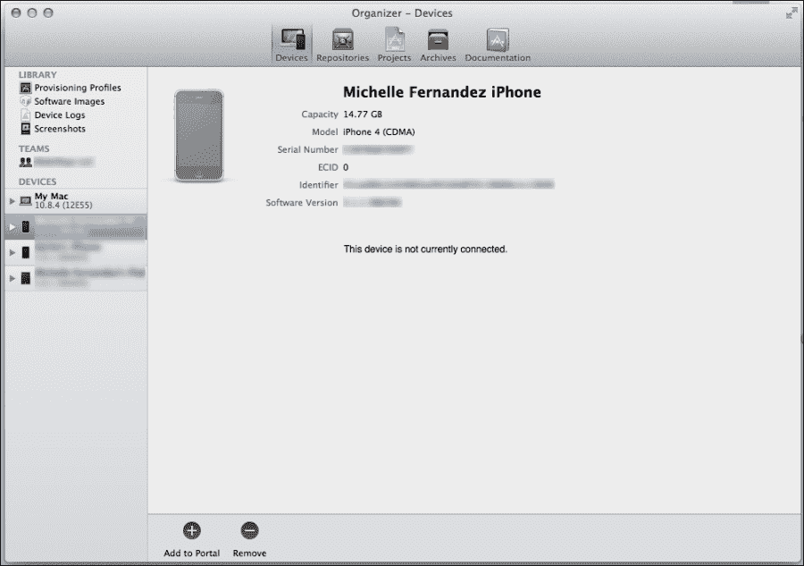

通常，当您第一次将设备连接到**管理器**时，您会收到一个按钮通知，上面写着**用于开发**。选择它，Xcode 将在 iOS 配置门户中为您的设备执行大部分配置工作。

### iTunes

连接设备后，打开 iTunes，在设备列表中点击您的设备。选择**汇总**标签。点击**序列号**标签，显示**标识符**字段和 40 个字符的 UDID。按*命令* + *C* 将 UDID 复制到剪贴板。


# 行动时间-添加/注册您的 iOS 设备

要在中添加用于开发/测试的设备，请执行以下步骤:

1.  在开发者门户中选择**设备**，点击 **+** 图标注册新设备。选择**注册设备**单选按钮注册一个设备。
2.  通过按下*命令* + *V* 将您保存的号码粘贴到剪贴板上，在**名称**字段中为您的设备创建一个名称，并将您设备的 UDID 放在 **UDID** 字段中。
3.  Click on **Continue** when you are done and click on **Register** once you have verified the device information.

    

# 行动时间-创建应用标识

现在您已经向门户添加了一个设备，您需要创建一个应用标识。应用标识有一个由苹果生成的唯一的 10 个字符的苹果标识前缀和一个由团队管理员在供应门户中创建的苹果标识后缀。应用标识可能如下所示:`7R456G1254.com.companyname.YourApplication`。要创建新的应用标识，请执行以下步骤:

1.  Click on **App IDs** in the **Identifiers** section of the portal and select the **+** icon.

    

2.  用您的应用名称填写**应用标识** **描述**字段。
3.  您已经分配了一个苹果标识前缀(也称为团队标识)。
4.  在**应用标识后缀**字段中，指定应用的唯一标识符。如何识别您的应用由您决定，但建议您使用反向域样式字符串，即`com.domainname.appname`。点击**继续**，然后点击**提交**创建您的应用标识。

### 注

您可以在捆绑包标识符中创建一个通配符，您可以使用相同的钥匙串访问在一组应用之间共享该通配符。为此，只需创建一个末尾带有星号(*)的应用标识。您可以将它单独放在包标识符的字段中，或者放在字符串的末尾，例如`com.domainname.*`。有关此主题的更多信息，请访问位于[https://developer.apple.com/ios/manage/bundles/howto.action](https://developer.apple.com/ios/manage/bundles/howto.action)的 iOS 配置门户的应用标识部分。

## *刚刚发生了什么？*

所有的 UDIDs 在每个设备上都是唯一的，我们可以在 Xcode 和 iTunes 中找到它们。当我们在 iOS Provisioning Portal 中添加一个设备时，我们采用了由 40 个十六进制字符组成的 UDID，并确保我们创建了一个设备名称，这样我们就可以识别我们用于开发的设备。

我们现在有了要安装在设备上的应用的应用标识。应用标识是一个唯一的标识符，iOS 使用它来允许您的应用连接到苹果推送通知服务，在应用之间共享钥匙串数据，以及与您希望将 iOS 应用与之配对的外部硬件附件进行通信。

## 供应配置文件

一个**配置文件**是一个数字实体的集合，它将应用和设备与一个授权的 iOS 开发团队唯一地联系起来，并使一个设备能够用于测试一个特定的应用。供应配置文件定义了应用、设备和开发团队之间的关系。它们需要针对应用的开发和分发方面进行定义。

# 行动时间–创建供应配置文件

要创建配置文件，请转到开发人员门户的**配置文件**部分，然后单击 **+** 图标。请执行以下步骤:

1.  选择**开发**部分下的 **iOS 应用开发**单选按钮，然后选择**继续**。
2.  在下拉菜单中选择您为应用创建的**应用标识**，然后单击**继续**。
3.  选择您希望包含在配置文件中的证书，然后点击**继续**。
4.  选择您希望为此配置文件授权的设备，然后点击**继续**。
5.  Create a **Profile Name** and click on the **Generate** button when you are done:

    

6.  点击**下载**按钮。文件下载时，如果还没有打开，启动 Xcode，按键盘上的 *Shift* + *命令* + *2* 打开**管理器**。
7.  Under **Library**, select the **Provisioning Profiles** section. Drag your downloaded `.mobileprovision` file to the **Organizer** window. This will automatically copy your `.mobileprovision` file to the proper directory.

    

## *刚刚发生了什么？*

只要证书包含在配置文件中，在配置文件中拥有权限的设备就可以用于测试。一台设备可以安装多个配置文件。

## 应用图标

目前，我们的应用没有图标图像显示在设备上。默认情况下，如果没有为应用设置图标图像，一旦构建加载到您的设备，您将看到一个浅灰色的框，并在下方显示您的应用名称。所以，启动你喜欢的创造性开发工具，让我们创建一个简单的形象。

标准分辨率 iPad2 或 iPad mini 图像文件的应用图标为 76 x 76 px PNG。图像应始终保存为`Icon.png`，并且必须位于您当前的项目文件夹中。支持视网膜显示的 iPhone/iPod touch 设备需要额外的高分辨率 120 x 120 px，iPad 或 iPad mini 的图标为 152 x 152 px，命名为`Icon@2x.png`。

当前项目文件夹的内容应该如下所示:

```java
Hello World/       name of your project folder
 Icon.png           required for iPhone/iPod/iPad
 Icon@2x.png   required for iPhone/iPod with Retina display
 main.lua

```

为了分发您的应用，应用商店需要 1024 x 1024 像素版本的图标。最好先以更高的分辨率创建您的图标。关于最新的官方应用商店要求，请参考[的*苹果 iOS 人机界面指南*。](http://developer.apple.com/library/ios/#documentation/userexperience/conceptual/mobilehig/Introduction/Introduction.html)

创建应用图标是应用名称的可视化表示。一旦您一起编译了一个构件，您将能够在您的设备上查看该图标。图标也是启动应用的图像。

# 为 iOS 创建 Hello World 构建

我们现在准备为我们的设备构建我们的 Hello World 应用。因为我们已经准备好了配置文件，所以从现在开始的构建过程非常简单。在创建设备版本之前，请确保您已连接到互联网。您可以在 Xcode 模拟器或设备上构建应用进行测试。

# 行动时间到了——创建 iOS 构建

按照这些步骤在 Corona SDK 中创建新的 iOS 版本:

1.  打开电晕模拟器，选择**打开**。
2.  导航到你的 Hello World 应用，选择你的`main.lua`文件。
3.  Once the application is launched in the simulator, go to the Corona Simulator menu bar and navigate to **File** | **Build** | **iOS** or press *Command* + *B* on your keyboard. The following dialog box will appear:

    

4.  Create a name for your app in the **Application Name** field. We can keep the same name, `Hello World`. In the **Version** field, keep the number at `1.0`. In order to test the app in the Xcode simulator, select **Xcode Simulator** from the **Build For** drop-down menu. If you want to build for the device, choose **Device** to build an app bundle. Next, select the target device (iPhone or iPad) from the **Supported Devices** drop-down menu. From the **Code Signing Identity** drop-down menu, choose the provisioning file you created for the specified devices you are building for. It is the same name as **Profile Name** in the iOS Provisioning Portal on the Apple developer website. In the **Save to folder** section, click on **Browse** and choose where you would like your application to be saved.

    如果对话框中所有信息都已确认，点击**建立**按钮。

### 类型

将应用设置为保存在桌面上更方便；这种方式，很容易找到。

## *刚刚发生了什么？*

恭喜你！您现在已经创建了第一个可以上传到设备的 iOS 应用文件。当您开始开发用于分发的应用时，您将希望创建应用的新版本，以便您可以跟踪每一个新构建中的变化。您的配置文件中的所有信息都是在 iOS 配置门户中创建的，并应用于构建。一旦 Corona 完成编译，应用应该位于您保存它的文件夹下。

# 行动时间——在你的 iOS 设备上加载应用

选择你的 Hello World 构建你创建的并选择 iTunes 或 Xcode 将你的应用加载到你的 iOS 设备上。它们可以用来传输应用文件。

如果使用 iTunes，请将您的构件拖到您的 iTunes 资料库中，然后正常同步您的设备，如下图所示:

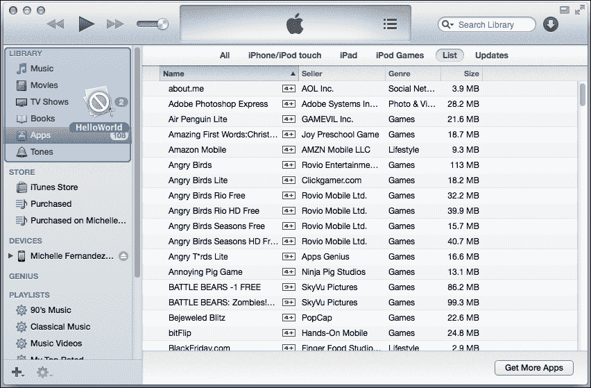

将应用安装到设备上的另一种方法是使用 Xcode，因为它提供了一种安装 iOS 设备应用的方便方法。请执行以下步骤:

1.  连接设备后，通过进入**窗口** | **管理器**从菜单栏打开 Xcode 的**管理器**，导航至左侧**设备**列表下您连接的设备。
2.  If a proper connection is established, you will see a green indicator. If it is yellow after a couple minutes, try powering the device off and on again or disconnect the device and connect it again. This will usually establish a proper connection.

    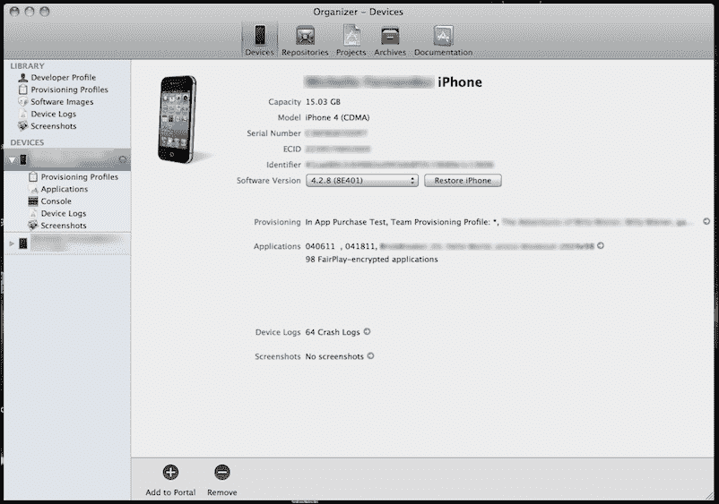

3.  只需将您的构建文件拖放到**管理器**窗口的**应用**区域，它就会自动安装在您的设备上。

## *刚刚发生了什么？*

我们刚刚学习了两种不同的方式将应用构建加载到 iOS 设备:使用 iTunes 和使用 Xcode。

使用 iTunes 提供了一个简单的拖放功能到您的资料库中，然后只要您的设备同步，您就可以传输构建。

Xcode 方法可能是将构建加载到设备的最简单和最常见的方法。只要您的设备连接正确并准备好在管理器中使用，您就可以将构建拖放到应用中，它就会自动加载。

# 在安卓设备上测试我们的应用

在安卓设备上创建并测试我们的构建不需要像苹果在 iOS 设备上那样的开发者账户。你需要为安卓构建的唯一工具是一台电脑或苹果电脑、科罗纳软件开发工具包、安装的 JDK6 和一台安卓设备。如果你打算向谷歌 Play 商店提交一款应用，你需要在 https://play.google.com/apps/publish/signup/注册成为谷歌游戏开发者。如果你想在谷歌 Play 商店发布软件，你必须一次性支付 25 美元的注册费。

# 为安卓打造 Hello World 版本

构建我们的 Hello World 应用相当简单，因为我们不必为调试构建创建唯一的密钥库或密钥别名。当您准备向谷歌 Play 商店提交应用时，您需要创建一个发布版本并生成自己的私钥来签署您的应用。我们将在本书后面详细讨论发布版本和私钥。

# 该行动了——创建一个安卓版本

按照以下步骤在 Corona SDK 中创建新的 Android 版本:

1.  启动电晕模拟器，选择**模拟器**。
2.  导航到你的 Hello World 应用，选择你的`main.lua`文件。
3.  Once your application is running in the simulator, go to the **Corona Simulator** menu bar and navigate to **File** | **Build For** | **Android** (Windows) / *Shift* + *Command* + *B* on your keyboard (Mac). The following dialog box will appear:

    

4.  在**应用名称**字段中为您的应用创建一个名称。我们可以保留同一个名字，**你好世界**。在**版本代码**字段中，将该号码设置为 **1** ，如果该号码还不是默认号码。该特定字段必须始终为整数，并且对用户不可见。在**版本名称**字段中，将编号保留在 **1.0** 处。该属性是向用户显示的字符串。在**包**字段中，您将需要指定一个使用传统 Java 方案的名称，这基本上是您域名的反向格式；例如，**com . my company . app . hello world**将作为包名工作。**项目路径**显示项目文件夹的位置。**最低 SDK 版本**目前支持安卓 2.3.3 以及运行 ArmV7 处理器的更新设备。在**目标应用商店**下拉菜单中，默认商店可以保留为 Google Play。在**密钥库**字段中，您将使用 Corona 中已经提供的`Debug`密钥库签署您的构建。在**键别名**字段中，如果没有选择，从下拉菜单中选择`androiddebugkey`。在**保存到文件夹**部分，点击**浏览**并选择您希望应用保存到的位置。
5.  如果所有的信息已经在对话框中确认，点击**建立**按钮。

### 类型

有关 Java 包名的更多信息，请参见[Java 文档中*唯一包名*一节。](http://java.sun.com/docs/books/jls/third_edition/html/packages.html#40169)

## *刚刚发生了什么？*

你已经创建了你的第一个安卓版本！看到这有多简单了吗？由于 Corona SDK 已经在引擎中提供了`Debug`密钥库和`androiddebugkey`密钥别名，所以大部分的签名工作已经为您完成了。您唯一的要求是填写应用的构建信息，然后点击**构建**按钮进行调试构建。你的 Hello World 应用将在你指定的位置保存为`.apk`文件。文件名将显示为`Hello World.apk`。

# 行动时间——在你的安卓设备上加载应用

有几种方法可以将你的 Hello World 构建加载到你的安卓设备上，这些方法不需要你下载安卓软件开发工具包。这里有一些简单的方法。

一个方便的方法是通过 Dropbox。您可以在[https://www.dropbox.com/](https://www.dropbox.com/)创建账户。Dropbox 是一项免费服务，允许您在电脑/Mac 和移动设备上上传/下载文件。执行以下步骤，使用 Dropbox 加载 Hello World 构建:

1.  下载 Dropbox 安装程序并将其安装在您的计算机上。此外，从谷歌 Play 商店下载手机应用(也是免费的)并安装在您的设备上。
2.  在您的电脑和移动设备上登录您的 Dropbox 帐户。从你的电脑上传你的`Hello World.apk`文件。
3.  上传完成后，进入设备上的 Dropbox 应用，选择您的`Hello World.apk`文件。您将看到一个屏幕，询问您是否要安装该应用。选择**安装**按钮。假设安装正确，将出现另一个屏幕，显示**应用已安装**，您可以通过按下可用的**打开**按钮来启动您的 Hello World 应用。

另一种将文件上传到设备上的方法是通过 USB 接口将其传输到 SD 卡。如果你的设备没有某种文件管理器应用，你可以从谷歌 Play 商店下载一个很好的文件管理器，它可以在 https://play.google.com/store/apps/details?的[找到 T4。您始终可以通过设备上的 Google Play 应用正常搜索前面的应用或类似的 apk 安装程序。要将`.apk`文件传输到 SD 卡，请执行以下步骤:](https://play.google.com/store/apps/details?id=com.metago.astro)

1.  在设备的**设置**中，选择**应用**，然后选择**开发**。如果模式未激活，点击 **USB 调试**。
2.  返回几个屏幕到**应用**部分。如果未知源尚未激活，则启用**未知源。这将允许您安装任何非市场应用(即调试版本)。完成后，选择设备上的主页按钮。**
3.  使用 USB 电缆将设备连接到电脑。您将看到一个新的通知，表明新的驱动器已连接到您的电脑或苹果电脑。访问标清驱动器并创建一个新文件夹。为你的安卓版本命名一个你能容易识别的文件夹。将您的`Hello World.apk` 文件从桌面拖放到文件夹中。
4.  Eject the drive from your desktop and disconnect your device from the USB cable. Launch ASTRO File Manager or use whichever app you decided to download from the Google Play Store. In ASTRO, select **File Manager**, search for the folder you added to your SD card, and select it. You will see your `Hello World.apk` file. Select the file, and a prompt will appear asking you to install it. Select the **Install** button, and you should see your Hello World application appear in the **Apps** folder of your device.

    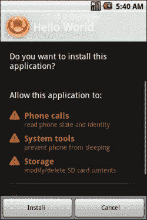

最简单的方法之一就是通过 Gmail。如果你还没有 Gmail 账户，可以在[https://mail.google.com/](https://mail.google.com/)创建一个。执行以下步骤在您的 Gmail 帐户上发送`.apk`文件:

1.  登录您的帐户，撰写新的电子邮件，并将您的`Hello World.apk`文件附加到邮件中。
2.  将邮件的收件人发送到您自己的电子邮件地址并发送。
3.  在你的安卓设备上，确保你的电子邮件账户已经链接。收到邮件后，立即打开电子邮件。您可以选择在设备上安装应用。将显示**安装**按钮或类似的东西。

## *刚刚发生了什么？*

我们刚刚学习了几种将`.apk`文件加载到安卓设备的方法。上述方法是快速加载应用而不会遇到任何问题的最简单方法。

使用文件管理器方法，您可以轻松访问您的`.apk`文件，而不需要任何载体数据或无线网络连接。使用与您的设备兼容的 USB 电缆并将其连接到您的计算机是一个简单的拖放过程。

Dropbox 方法在您的电脑和移动设备上设置后最方便。你所要做的就是将你的`.apk`文件拖放到你的账户文件夹中，安装了 Dropbox 应用的任何设备都可以立即访问它。你也可以通过下载链接分享你的文件，这也是 Dropbox 提供的另一个很棒的功能。

如果您不想将任何文件管理器或其他程序下载到您的设备和计算机上，设置一个 Gmail 帐户并将您的`.apk`文件作为附件发送给自己很简单。你唯一要记住的是，你不能在 Gmail 中用电子邮件发送超过 25 MB 的附件。

## 突击测验–了解科罗娜

Q1。使用电晕模拟器的真实情况是什么？

1.  你需要一个`main.lua`文件来启动你的应用。
2.  Corona SDK 只在 Mac OS X 上运行。
3.  电晕终端没有启动模拟器。
4.  以上都不是。

Q2。在 iPhone 开发者计划中，你可以使用多少款 iOS 设备进行开发？

1.  50 `.`
2.  75 `.`
3.  5 `.`
4.  100 `.`

Q3。在 Corona SDK 中为安卓构建时，版本代码必须是什么？

1.  一根绳子。
2.  整数。
3.  它必须遵循 Java 方案格式。
4.  以上都不是。

# 总结

在本章中，我们介绍了开始为 Corona SDK 开发应用所需的一些必要工具。无论您是在苹果 OS X 还是微软视窗系统上工作，您都会注意到在这两种操作系统上工作的相似之处，以及运行 Corona SDK 有多简单。

要进一步熟悉 Corona，请尝试执行以下操作:

*   花点时间看看 Corona 提供的示例代码，了解 SDK 的功能
*   请随意根据自己的喜好修改任何示例代码，以便更好地理解 Lua 中的编程
*   无论您是在 iOS(如果您是注册的苹果开发者)还是安卓系统上工作，请尝试在您的设备上安装任何示例代码，以了解应用在模拟器环境之外是如何工作的
*   看看位于[http://forums.coronalabs.com/](http://forums.coronalabs.com/)的 Corona Labs 论坛，浏览 Corona SDK 开发人员和工作人员关于 Corona 开发的最新讨论

现在您已经了解了如何在 Corona 中显示对象的过程，我们将能够深入了解有助于创建可操作的移动游戏的其他功能。

在下一章中，我们将进一步了解 Lua 编程语言的细节，您将学习类似于 Corona 中示例代码的简单编码技术。您将更好地理解 Lua 语法，并注意到与其他编程语言相比，它学习起来是多么快速和容易。所以，让我们开始吧！