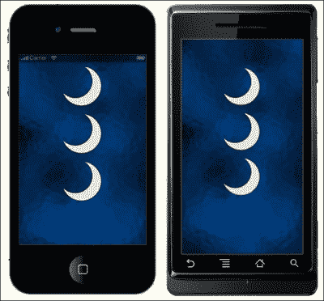
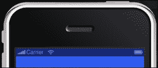

# 第二章。卢阿速成班和科罗纳框架

> *Lua 是用于在 Corona SDK 上开发的编程语言。到目前为止，您已经学习了如何使用主要资源来运行 SDK 和其他开发工具，从而在移动设备上创建应用程序。既然我们已经涉猎了创建几行代码来使一个程序工作，让我们跳到基础上，让您更好地理解 Lua 的能力。*

在本章中，您将学习如何:

*   将变量应用于脚本
*   使用数据结构形成表格
*   使用显示对象
*   使用对象方法和参数实现函数
*   优化您的工作流程

让我们开始吧。

# 卢阿去救援

Lua 是游戏编程的行业标准。它类似于 JavaScript 和 Flash 的 ActionScript。任何用这些语言编写过脚本的人几乎都会立即过渡到 Lua。

Lua 在创建各种应用程序和游戏方面非常有用。许多游戏程序员发现 Lua 是一种方便的脚本语言，因为它易于嵌入，执行速度快，学习曲线小。在*魔兽世界*中无处不在。在*愤怒的小鸟*、*轻点轻点复仇*、*就餐者突进*等游戏中，也被电子艺术、Rovio、ngmoco 和 Tap Tap 使用。

更多关于 Lua 的信息，请参考[http://www.lua.org](http://www.lua.org)。

# 有价值的变量

像许多脚本语言一样，Lua 也有变量。你可以把变量想象成存储值的东西。将值应用于变量时，可以使用相同的变量名引用它。

应用程序由注释、块、语句和变量组成。一个 **的评论**是永远不会被处理的，但它被包括在内是为了解释一个声明或区块的目的。一个**块**是的一组语句。**语句** 提供需要进行哪些操作和计算的说明；**变量**存储这些计算的值。在变量中设置一个值称为**赋值**。

Lua 使用三种变量，如下所示:

*   全局变量
*   局部变量
*   表字段(属性)

变量占用内存空间，这在各种移动设备上是有限的。当不再需要某个变量时，最好将其值设置为零，以便可以快速清除。

## 全局变量

全局变量可以在每个范围内访问，并且可以在任何地方修改。术语“范围”用于描述一组变量可访问的区域。您不必声明全局变量。一旦您为它赋值，它就会被创建:

```java
myVariable = 10
print( myVariable ) -- prints the number 10
```

## 局部变量

局部变量是从局部范围访问的，通常从函数或代码块中调用。当我们创建一个块时，我们正在创建一个范围，其中变量可以存在，或者创建一个语句列表，这些语句按顺序执行。引用变量时，Lua 必须找到该变量。本地化变量有助于加快查找过程并提高代码的性能。使用 local 语句，它声明了一个局部变量:

```java
local i = 5 -- local variable
```

以下代码行显示了如何在块中声明局部变量:

```java
x = 10    -- global 'x' variable
local i = 1

while i <= 10 do
   local x = i * 2  -- a local 'x' variable for the while block
   print( x )       -- 2, 4, 6, 8, 10 ... 20
   i = i + 1
end

print( x )  -- prints 10 from global x
```

## 表格字段(属性)

表字段是由索引唯一访问的变量组成的组。数组可以用数字和字符串或者任何与 Lua 相关的值来索引，除了`nil`。您可以将索引到数组中，使用整数或字符串将值赋给字段。当索引为字符串时，该字段称为属性。可以使用点运算符(`x.y`)或字符串(`x["y"]`)来访问所有属性，以索引到表中。结果是一样的:

```java
x = { y="Monday" }  -- create table 
print( x.y )  -- "Monday"
z = "Tuesday"    -- assign a new value to property "Tuesday"
print( z )  -- "Tuesday"
x.z = 20  -- create a new property 
print( x.z )  -- 20
print( x["z"] )  -- 20
```

与表格相关的更多信息将在后面名为*表格*的章节中讨论。

在前面的示例中，您可能已经注意到某些代码行中的附加文本。这些就是你所说的评论。注释以双连字符`--`开头，除了字符串内部。他们一直跑到终点。块注释也是可用的。注释掉一个块的一个常见技巧是用`--[[`包围它。

以下是如何注释一行的示例:

```java
a = 2
--print(a)    -- 2
```

这是块注释的一个示例:

```java
--[[
k = 50
print(k)    -- 50
--]]
```

# 分配惯例

变量名是有规则的。变量以字母或下划线开头。它不能包含除字母、下划线或数字以外的任何内容。也不能是 Lua 以下保留的字之一:

*   `and`
*   `break`
*   `do`
*   `else`
*   `elseif`
*   `end`
*   `false`
*   `for`
*   `function`
*   `if`
*   `in`
*   `local`
*   `nil`
*   `not`
*   `or`
*   `repeat`
*   `return`
*   `then`
*   `true`
*   `until`
*   `while`

以下为有效变量:

*   x
*   X
*   字母表
*   _abc
*   测试 _01
*   我的集团

以下是无效变量:

*   功能
*   我的变量
*   One hundred and twenty-three

### 注

Lua 也是一种区分大小写的语言。例如，`else`是一个保留字，但是 ELSE 和 Else 是两个不同的有效名称。

# 值的类型

Lua 是一种动态类型语言。语言中没有定义的变量类型。这允许每个值携带自己的类型。

正如你已经注意到的，值可以存储在变量中。它们可以被操作来给出任何类型的值。这还允许您将参数传递给其他函数，并将它们作为结果返回。

您将处理的基本类型的值如下:

*   **无**:这是唯一一个值为`nil`的类型。任何未初始化的变量都有`nil`作为其值。和全局变量一样，默认为`nil`，可以分配`nil`删除。
*   **布尔**:该类型有两个值:`false`和`true`。你会注意到条件表达式认为`false`和`nil`是假的，其他任何东西都是`true`。
*   **数字**:这些代表实数(双精度，浮点)。
*   **字符串**:这是一个字符序列。允许使用 8 位字符和嵌入的零。
*   **表**:这些是 Lua 中的数据结构。它们由一个关联数组实现，该数组是一个不仅可以用数字索引，还可以用字符串或任何其他值索引的数组，除了`nil`(关于这一点的更多信息在本章后面称为*表*)。
*   **功能**:这些被称为 Lua 的一等值。通常，函数可以存储在变量中，作为参数传递给其他函数，并作为结果返回。

# 行动时间-使用块打印值

让我们试一试，看看 Lua 语言有多强大。我们开始了解变量是如何工作的，以及给变量赋值时会发生什么。如果有一个变量附加了多个值会怎么样？Lua 如何区分它们？我们将使用电晕端子，这样我们就可以看到接线盒中输出的值。在这一过程中，随着的进行，你会学到其他编程技术。在本练习中，我们还将提到组块。Lua 中的执行单位叫做**块**。块是一个按顺序执行的块。开始使用 Lua 时，请遵循以下步骤:

如果你记得的话，在上一章中，你学习了如何为 Hello World 应用程序创建自己的项目文件夹和`main.lua`文件。

1.  在桌面上创建一个新的项目文件夹并命名为`Variables`。
2.  打开您喜欢的文本编辑器，并将其保存为`Variables`项目文件夹中的`main.lua`。
3.  创建以下变量:

    ```java
    local x = 10 -- Local to the chunk
    local i = 1  -- Local to the chunk        
    ```

4.  加入`while`循环:

    ```java
    while (i<=x) do
      local x = i  -- Local to the "do" body
      print(x)       -- Will print out numbers 1 through 10 
      i = i + 1
    end
    ```

5.  创建一个`if`语句来表示另一个本地实体:

    ```java
    if i < 20 then
      local x          -- Local to the "then" body
      x = 20
      print(x + 5)  -- 25
    else
      print(x)         -- This line will never execute since the above "then" body is already true
    end

    print(x)  -- 10
    ```

6.  保存您的脚本。
7.  启动电晕终端。确保您看到电晕 SDK 屏幕和终端窗口弹出。
8.  导航到您的`Variables`项目文件夹，在模拟器中打开您的`main.lua`文件。您会注意到模拟器中的设备是空白的，但是如果您查看您的终端窗口，会从如下所示的代码打印出一些结果:

    ```java
    1
    2
    3
    4
    5
    6
    7
    8
    9
    10
    25
    10

    ```

## *刚刚发生了什么？*

创建的前两个变量是每个代码块之外的局部变量。注意在`while`循环的开始，`i <= x`指的是第 1 行和第 2 行的变量。`while`回路内的`local x = i`声明仅在`do`身体局部，与`local x = 10`不同。`while`循环运行 10 次，并输出一个每次递增 1 的值。

`if`语句比较`i < 20`，此时`i`等于 11，并使用另一个位于`then`体内的`local x`变量。既然陈述是真的，`x`等于 20，打印出`x + 5`的值，就是`25`。

最后一行`print(x)`没有附加到`while`循环或`if`语句中的任何代码块。因此，它引用`local x = 10`并在终端窗口打印出 10 的值。这可能看起来令人困惑，但是理解局部和全局变量在 Lua 中是如何工作的很重要。

# 表情

表达式“T1”是代表一个值的东西“T2”。它可以包括数字常量、带引号的字符串、变量名、一元和二元运算以及函数调用。

## 算术运算符

`+`、`-`、`*`、`/`、`%`和`^`称为算术运算符。

下面是二进制算术运算符的一个例子:

```java
t = 2*(2-5.5)/13+26
print(t)  -- 25.461538461538
```

模(除法余数)运算符的示例如下:

```java
m = 18%4
print(m)  -- 2
```

操作员权力的一个例子如下:

```java
n = 7^2
print(n)  -- 49
```

## 关系运算符

关系运算符总是导致假或真，并询问是或否的问题。相关的运算符有`<`、 `>`、`<=`、 `>=`、 `==`、 `~=`。

`==`算子测试等式，`~=`算子测试不等式。如果值类型不同，则结果为假。否则，Lua 会将这些值与其类型进行比较。数字和字符串以通常的方式进行比较。只要两个这样的值被认为相等，就通过引用来比较表和函数，只要它们是同一个对象。创建新对象时，新对象不同于以前存在的对象。

以下是关系运算符的示例。它们将显示布尔结果，并且不能与字符串连接:

```java
print(0 > 1)  --false
print(4 > 2)  --true
print(1 >= 1)  --true
print(1 >= 1.5)  --false
print(0 == 0)  --true
print(3 == 2)  --false
print(2 ~= 2)  -- false
print(0 ~= 2)  -- true
```

## 逻辑运算符

Lua 中的逻辑运算符是`and`、`or`和`not`。所有的逻辑运算符都认为`false`和`nil`为假，其他都为真。

如果值为`false`或`nil`，则运算符返回其第一个参数；否则，它返回第二个参数。如果值不同于`nil`和`false`，则`or`运算符返回其第一个参数；否则，它返回第二个参数。`and`和`or`都使用快捷评估；这意味着只有在必要时才计算第二个操作数。以下是一些逻辑运算符的示例:

```java
print(10 and 20)      -- 20
print(nil and 1)      -- nil
print(false and 1)    -- false
print(10 or 20)       -- 10
print(false or 1)     -- 1
```

`not`运算符总是返回真或假:

```java
print(not nil)      -- true
print(not true)    -- false
print(not 2)        -- false
```

## 串联

Lua 中的字符串串联运算符由两个点“`..`”表示。它将两个值作为操作数，并将它们拼接在一起。如果它的任何操作数是一个数字，那么它也被转换成一个字符串。串联运算符的一些示例如下:

```java
print("Hello " .. "World")  -- Hello World

myString = "Hello"
print(myString .. " World")   -- Hello World
```

## 长度运算符

`#`长度操作符测量一根绳子的长度或桌子的尺寸。字符串的长度只是其中的字符数。一个字符被认为是一个字节。长度运算符的示例如下:

```java
print(#"*") --1
print(#"\n") --1
print(#"hello") --5
myName = "Jane Doe"
print(#myName) --8
```

## 优先

以下列表显示了 Lua 中操作员优先级从最高到最低显示的:

*   `^`
*   `not`、`#`、`-`(一元)
*   `*`、`/`
*   `+`、`-`
*   `..`
*   `<`、`>`、`<=`、`>=`、`~=`、`==`
*   `and`
*   `or`

所有二进制运算符都是左关联的，除了`^`幂运算和`..`连接是右关联的。您可以使用括号来更改表达式的优先级。

在两个具有相同优先级的操作数竞争操作数的情况下，操作数属于左侧的运算符:

```java
print(5 + 4 – 2) -- This returns the number 7
```

前面的表达式显示了具有相同优先级的加法和减法运算符。第二个元素(数字`4`)属于加法运算符，因此表达式的数学计算如下:

```java
print((5 + 4) – 2) -- This returns the number 7
```

让我们关注基于优先级的优先规则。这里有一个例子:

```java
print (7 + 3 * 9) -- This returns the number 34
```

没有经验的程序员可能会认为，如果从左到右计算，前面例子的值是 90。正确的值是 34，因为乘法的优先级比加法高，所以先执行。在同一个表达式中添加括号会使其更容易阅读:

```java
print (7 + (3 * 9)) -- This returns the number 34
```

# 字符串

在本章的前面，您看到了一些使用字符序列的代码示例。那些字符序列被称为**字符串**。字符串可以由任何字符组成，包括数值。

## 引用字符串

引用字符串有三种方式:带双引号、带单引号、带方括号。

### 注

引用字符串时，请确保代码中只使用直引号，而不使用花引号；否则，它不会编译。

双引号字符`"`标记字符串的开始和结束。这里有一个例子:

```java
print("This is my string.")  -- This is my string.
```

您也可以使用单引号字符`'`来引用字符串。单引号的作用与双引号相同，只是单引号字符串可以包含双引号。这里有一个例子:

```java
print('This is another string.')  -- This is another string.

print('She said, "Hello!" ')  -- She said, "Hello!"
```

最后，使用一对方括号也会引用字符串。当不能使用双引号或单引号时，它们主要用于字符串。发生这种情况的情况不多，但它们会起到作用:

```java
print([[Is it 'this' or "that?"]]) -- Is it 'this' or "that?"
```

# 行动的时间到了——让我们的手充满弦

我们开始熟悉几个代码块以及它们之间的交互方式。让我们看看当我们使用字符串添加一些表达式时会发生什么，以及它们与您在终端中打印出来的常规字符串有什么不同:

1.  在桌面上创建一个新的项目文件夹并命名为`Working With Strings`。
2.  在你的文本编辑器中新建一个`main.lua`文件，并保存到你的文件夹中。
3.  键入以下行(代码中不包括行号，仅供行参考):

    ```java
    1 print("This is a string!") -- This is a string!
    2 print("15" + 1) -- Returns the value 16
    ```

4.  加入以下变量。请注意，它使用了相同的变量名:

    ```java
    3 myVar = 28
    4 print(myVar)  -- Returns 28

    5 myVar = "twenty-eight"
    6 print(myVar) -- Returns twenty-eight
    ```

5.  让我们用一些字符串值添加更多的变量，并使用不同的运算符进行比较:

    ```java
    7 Name1, Phone = "John Doe", "123-456-7890"
    8 Name2 = "John Doe"

    9 print(Name1, Phone) -- John Doe  123-456-7890
    10 print(Name1 == Phone) -- false
    11 print(Name1 <= Phone) -- false
    12 print(Name1 == Name2) -- true
    ```

6.  保存你的脚本，并在科罗纳启动你的项目。观察终端窗口中的结果:

    ```java
    This is a string!
    16
    28
    twenty-eight
    John Doe  123-456-7890
    false
    false
    true

    ```

## *刚刚发生了什么？*

您可以看到第 1 行只是一个普通的字符串，并打印出字符。在第 2 行，请注意数字`15`在字符串内部，然后添加到数字`1`中，后者在字符串外部。Lua 在运行时提供数字和字符串之间的自动转换。应用于字符串的数字操作将尝试将字符串转换为数字。

处理变量时，可以使用同一个变量，并让它们在不同的时间包含一个字符串和一个数字，如第 3 行和第 5 行(`myVar = 28`和`myVar = "twenty-eight"`)。

在最后一段代码中(第 7-12 行)，我们使用关系运算符比较了不同的变量名。首先，我们打印了`Name1`和`Phone`的字符串。接下来的几行比较了`Name1`、`Name2`和`Phone`。当两个字符串以完全相同的顺序具有相同的字符时，则它们被认为是相同的字符串，并且彼此相等。当您查看`print(Name1 == Phone)`和`print(Name1 <= Phone)`时，由于 ASCII 顺序，语句返回`false`。数字在字母之前，当你比较它们时，字母更小。在`print(Name1 == Name2)`中，两个变量包含相同的字符，因此，它返回`true`。

## 玩一个围棋英雄——多拉一些线

字符串很容易处理，因为它们只是字符序列。尝试使用类似于前面示例的表达方式，并做以下修改:

1.  用数值创建一些变量，用数字字符串值创建另一组变量。使用关系运算符比较这些值，然后打印出结果。
2.  使用串联运算符，将几个字符串或数字组合在一起，并等距隔开。在终端窗口中打印出结果。

# 表格

表是 Lua 中专有的数据结构。它们代表数组、列表、集合、记录、图形等等。Lua 中的表类似于关联数组。关联数组可以用任何类型的值进行索引，而不仅仅是数字。表有效地实现了所有这些结构。例如，数组可以通过用整数索引表来实现。阵列没有固定的大小，而是根据需要增长。初始化数组时，它的大小是间接定义的。

以下是如何构造表格的示例:

```java
1 a = {}    -- create a table with reference to "a"
2 b = "y"
3 a[b] = 10    -- new entry, with key="y" and value=10
4 a[20] = "Monday"  -- new entry, with key=20 and value="Monday"
5 print(a["y"])    -- 10
6 b = 20
7 print(a[b])     -- "Monday"
8 c = "hello"     -- new value assigned to "hello" property
9 print( c )    -- "hello"
```

您会注意到，在第 5 行中，`a["y"]`正在索引第 3 行的值。在第 7 行中，`a[b]`使用变量`b`的新值并将`20`的值索引到字符串`"Monday"`。最后一行`c`与前面的变量分开，它唯一的值是字符串`"hello"`。

## 将表作为数组传递

表的键可以是个连续的整数，从 1 开始。它们可以做成数组(或列表):

```java
colors =  {
[1] = "Green", 
[2] = "Blue", 
[3] = "Yellow", 
[4] = "Orange", 
[5] = "Red"
}
print(colors[4]) -- Orange
```

另一种编写表构造函数以更快更方便的方式构建数组的方式，不需要写出每个整数键，如下所示:

```java
colors = {"Green", "Blue", "Yellow", "Orange", "Red"}
print(colors[4]) -- Orange
```

## 更改表格中的内容

在处理表格时，您可以修改或删除其中已经存在的值，也可以向其中添加新值。这可以使用赋值语句来完成。下面的例子创建了一个三个人的桌子和他们喜欢的饮料类型。您可以分配一个任务来更改一个人的饮料，在桌子上添加新的人-饮料对，并删除现有的人-饮料对:

```java
drinks = {Jim = "orange juice", Matt = "soda", Jackie = "milk"}
drinks.Jackie = "lemonade" -- A change.
drinks.Anne = "water" -- An addition.
drinks.Jim = nil -- A removal.

print(drinks.Jackie, drinks.Anne, drinks.Matt, drinks.Jim)
-- lemonade water soda nil
```

`drinks.Jackie = "lemonade"`覆盖`drinks.Jackie = "milk".`的初始值

`drinks.Anne = "water"`向表中添加新的键和值。这条线之前`drinks.Anne`的值为零。

`drinks.Matt = "soda"`的值保持不变，因为它没有变化。

`drinks.Jim = nil`用`nil`覆盖`drinks.Jim = "orange juice"` 的初始值。它从桌子上取下`Jim`键。

## 填充表格

填充表的方法是从一个空表开始，一次向其中添加一个东西。我们将使用构造函数，它是创建和初始化表的表达式。最简单的构造函数是空构造函数`{}`:

```java
myNumbers = {} -- Empty table constructor

for i = 1, 5 do
  myNumbers[i] = i 
end

for i = 1, 5 do
print("This is number " .. myNumbers[i])
end
```

以下是来自终端的结果:

```java
--This is number 1
--This is number 2
--This is number 3
--This is number 4
--This is number 5

```

前面的例子说明`myNumbers = {}`是一个空表构造器。创建一个`for`循环并调用`myNumbers[i]` 5 次，从数字 1 开始。每次调用它时，它都会递增 1，然后打印出来。

# 物体

表和函数是对象；变量实际上并不包含这些值，只包含对它们的引用。表也被用在面向对象编程中。变量和操纵这些变量的方法可以一起收集到对象中。这样的值称为**对象**，其函数称为 **方法**。在 Corona 中，我们将更加关注显示对象，因为它们对于游戏开发至关重要。

## 显示对象

屏幕上画的任何东西都是由显示对象构成的。在电晕中，模拟器中显示的资产是显示对象的实例。您可能已经看到了形状、图像和文本，它们都是显示对象的形式。当您创建这些对象时，您将能够制作它们的动画，将它们变成背景，使用触摸事件与它们交互等等。

显示对象是通过调用称为工厂函数的函数来创建的。每种类型的显示对象都有一种特定的工厂功能。例如，`display.newCircle()`创建一个矢量对象。

显示对象的实例的行为方式类似于 Lua 表。这使您能够将自己的属性添加到对象中，只要它们不与系统分配的属性和方法名称冲突。

## 显示属性

点运算符用于访问属性。显示对象共享以下属性:

*   `object.alpha`:这是物体的不透明度。值 0 是透明的，1.0 是不透明的。默认值为 1.0。
*   `object.height`:这是在的局部坐标。
*   `object.isVisible`:控制物体在屏幕上是否可见。真可见假不可见。默认值为真。
*   `object.isHitTestable`这允许对象继续接收命中事件，即使它不是可见的。如果为真，则无论可见性如何，对象都将接收命中事件；如果为 false，则事件仅发送到可见对象。默认为假。
*   `object.parent`:这个是一个只读属性，返回对象的父对象。
*   `object.rotation`:这是当前的旋转角度(度)。可以是负数或正数。默认值为 0。
*   `object.contentBounds`:这是一张`xMin`、`xMax`、`yMin`、`yMax`属性在屏幕坐标的表格。它通常用于将一组中的对象映射到屏幕坐标。
*   `object.contentHeight`:这是屏幕坐标中的高度。
*   `object.contentWidth`:这是屏幕坐标中的宽度。
*   `object.width`:这是局部坐标中的。
*   `object.x`:这指定了对象相对于父对象的 *x* 位置(在局部坐标中)——精确地说是父对象的原点。它提供了对象参考点相对于父对象的 *x* 位置。更改该值将在 *x* 方向移动对象。
*   `object.anchorX`:此指定对象与父对象原点对齐的 *x* 位置。锚的范围从 0.0 到 1.0。默认情况下，新对象的锚点设置为 0.5。
*   `object.xScale`:此获取或设置 *x* 比例因子。值 0.5 将在 *x* 方向将对象缩放至 50%。缩放发生在对象的参考点周围。大多数显示对象的默认参考点是中心。
*   `object.y`:此指定对象相对于父对象的 *y* 位置(在局部坐标中)，精确地说是父对象的原点。
*   `object.anchorY`:指定对象与父对象的原点对齐的 *y* 位置。锚的范围从 0.0 到 1.0。默认情况下，新对象的锚点设置为 0.5。
*   `object.yScale`:该获取或设置 *y* 比例因子。值 0.5 将在 *y* 方向将对象缩放至 50%。缩放发生在对象的锚点周围。大多数显示对象的默认参考点是中心。

## 目标方法

Corona 可以创建显示对象来存储对象方法作为属性。有两种方法可以做到这一点:使用点运算符(“`.`”)或使用冒号运算符(“`:`”)。这两种方法都是创建对象方法的有效方法。

这是点运算符的一个示例:

```java
object = display.newRect(110, 100, 50, 50)
object.setFillColor(1.0, 1.0, 1.0)
object.translate( object, 10, 10 )
```

这是冒号运算符的一个示例:

```java
object = display.newRect(110, 100, 50, 50)
object:setFillColor(1.0, 1.0, 1.0)
object:translate( 10, 10 )
```

如果对象是第一个参数，则使用点运算符对对象方法的调用会传递给该对象。冒号运算符方法只是一种快捷方式，创建函数只需要较少的输入。

显示对象共享以下方法:

*   `object:rotate(deltaAngle)`或`object.rotate(object, deltaAngle)`:这有效地将`deltaAngle`(以度为单位)添加到当前旋转属性中。
*   `object:scale(sx, sy)`或`object.scale(object, sx, sy)`:这分别使用`sx`和`sy`有效地倍增了`xScale`和`yScale`属性。如果电流`xScale`和`yScale`值为 0.5，`sx`和`sy`也为 0.5，则`xScale`和`yScale`的结果比例为 0.25。这会将对象从原始大小的 50%缩放到 25%。
*   `object:translate(deltaX, deltaY)`或`object.translate(object, deltaX, deltaY)`:这有效地将`deltaX`和`deltaY`分别添加到`x`和`y`属性中。这会将对象从其当前位置移开。
*   `object:removeSelf()`或`object.removeSelf(object)`:这将移除显示对象并释放其内存，假设没有其他对它的引用。这相当于在同一个显示对象上调用`group:remove(IndexOrChild)`，但是在语法上更简单。在其他情况下也支持`removeSelf()`语法，比如去除物理中的物理关节。

# 图像

很多艺术资产都是在 Corona 应用中使用的图像。您会注意到位图图像对象是一种显示对象。

## 加载图像

使用`display.newImage(filename [, baseDirectory] [, left, top])`，返回一个图像对象。图像数据从您为图像指定的文件名加载，并在`system.ResourceDirectory` 中查找该文件。支持的可接受的图像文件类型有`.png`(仅限 PNG-24 或更高版本)和`.jpg`文件。避免高`.jpg`压缩，因为加载到设备上可能需要更长时间。`.png`文件比`.jpg`文件质量更好，用于显示透明图像。`.jpg`文件不保存透明图像。

## 图像自动缩放

`display.newImage()`的默认行为是自动缩放大图像。这是为了节省纹理内存。但是，有时您不想让图像自动缩放，并且在参数列表中有一个可选的布尔标志来手动控制它。

要覆盖自动缩放并以全分辨率显示图像，请使用可选的`isFullResolution`参数。默认情况下，它为 false，但如果指定 true，则新图像将以其全分辨率加载:

```java
display.newImage( [parentGroup,] filename [, baseDirectory] [, x, y] [,isFullResolution] )
```

局限性和已知问题如下:

*   不支持索引 PNG 图像文件。
*   当前不支持灰度图像；图像必须是 RGB。
*   如果图像大于设备的最大可能纹理尺寸，它们仍会自动缩放。这通常是 2048 x 2048 px (iPad)，对于更新、更快的设备来说更大。
*   如果多次重新加载同一个图像，后续对`display.newImage`的调用将忽略`isFullResolution`参数，并采用第一次传递的值。换句话说，第一次加载图像文件的方式会影响下次加载相同文件时的自动缩放设置。这是因为 Corona 通过自动重用已经加载的纹理来节省纹理内存。因此，您可以根据需要多次使用相同的图像，而不会消耗额外的纹理内存。

更多关于 Corona SDK 文档的信息位于 Corona 的网站[http://coronalabs.com](http://coronalabs.com)。

# 行动时间–将图像显示在屏幕上

通过开始使用图像添加显示对象，我们终于进入了本章的视觉吸引力部分。我们现在不必参考终端窗口。所以，让我们关注模拟器屏幕。我们将首先通过执行以下步骤来创建背景图像和一些艺术资产:

1.  首先，在你的桌面上创建一个新的项目文件夹，并命名为`Display Objects`。
2.  在`Chapter 2 Resources`文件夹中，将`glassbg.png`和`moon.png`图像文件以及`config.lua`文件复制到您的`Display Objects`项目文件夹中。
3.  启动你的文本编辑器，为你当前的项目创建一个新的`main.lua`文件。
4.  Write out the following lines of code:

    ```java
    local centerX = display.contentCenterX
    local centerY = display.contentCenterY

    local background = display.newImage( "glassbg.png", centerX, centerY, true)
    local image01 = display.newImage( "moon.png", 160, 80 )

    local image02 = display.newImage( "moon.png" )
    image02.x = 160; image02.y = 200

    image03 = display.newImage( "moon.png" )
    image03.x = 160; image03.y = 320
    ```

    背景显示对象应该包含项目文件夹中背景图像的文件名。例如，如果背景图像文件名被称为`glassbg.png`，那么您将显示如下图像:

    ```java
    local background = display.newImage( "glassbg.png", centerX, centerY, true)
    ```

    使用`image02.x = 160; image02.y = 200`与下面几行代码相同:

    ```java
    image02.x = 160
    image02.y = 200
    ```

    分号(`;`)表示语句结束，是可选的。它使得在一行中分隔两个或多个语句变得更加容易，并且节省了在代码中添加额外的行。

5.  Save your script and launch your project in the simulator.

    ### 注

    如果您在 Mac OS X 上使用 Corona SDK，默认设备是 iPhone。如果您使用的是 Windows，默认设备是 Droid。

6.  You should see a background image and three other display objects of the same image, as shown in the following screen. The display results will vary depending on which device you use to simulate.

    

`image01`、`image02`和`image03`变量的显示对象应该包含`moon.png`文件名。代码中的文件名是区分大小写的，所以要确保你准确地写出它在项目文件夹中的显示方式。

## *刚刚发生了什么？*

目前，使用`contentCenterX`和`contentCenterY`缩放`background`以适应设备屏幕的高度和宽度。由于没有应用顶部或左侧( *x* 或 *y* )坐标，图像以其本地原点为中心。它也被设置为全分辨率，因为我们在显示对象中指定了`true`。

当你观察模拟器中`image01`、`image02`和`image03`的位置时，它们实际上是垂直对齐的，尽管`image01`和`image02` / `image03`的脚本风格有所不同。这是因为`image01`的坐标基于显示对象的(左，上)坐标。您可以选择指定图像的左上角位于坐标(左，上)；如果不同时提供这两个坐标，图像将以其本地原点为中心。

`image02`和`image03`的位置从显示对象的本地原点开始指定，并由设备屏幕的 *x* 和 *y* 属性的本地值定位。局部原点在图像中心；参考点被初始化至此。由于我们没有对`image02`和`image03`应用(左，上)值，进一步访问 *x* 或 *y* 属性是指图像的中心。

现在，你可能已经注意到 iPhone 4 的输出看起来很好，但是 Droid 的输出显示背景图像以全分辨率显示，而其他对象在屏幕下方。我们看到，我们指定的所有对象都在那里，但缩放功能已关闭。这是因为每个 iOS 和安卓设备都有不同的屏幕分辨率。iPhone 4 的屏幕分辨率为 640 x 960 像素，Droid 的屏幕分辨率为 480 x 854 像素。在一种设备上看起来很好的东西在另一种设备上可能看起来不完全一样。不用担心；有一个简单的解决方案可以使用`config.lua`文件来修复这一切，这将在接下来的几节中讨论。

## 拥有围棋英雄-调整显示对象属性

现在，您已经知道如何向设备屏幕添加图像，请尝试测试其他显示属性。尝试执行以下任一操作:

*   更改所有`image01`、`image02`和`image03`显示对象的 *x* 和 *y* 坐标
*   选择任何显示对象并更改其旋转
*   更改单个显示对象的可见性

如果您不确定如何进行上述任何调整，请参考本章前面提到的显示属性。

# 运行时配置

所有项目文件不仅包含一个`main.lua`文件，还包含项目所需的其他`.lua`和相关资产。一些 Corona 项目使用一个`config.lua`文件进行配置，该文件被编译到您的项目中并在运行时访问。这允许您同时指定动态内容缩放、动态内容对齐、动态图像分辨率、帧速率控制和抗锯齿，以便每种设备上的输出都以类似的方式显示。

## 动态内容缩放

Corona 允许您指定您计划将内容瞄准的屏幕大小。这是使用名为`config.lua`的文件完成的。您将能够扩展您的应用程序的资产，以便在屏幕尺寸更小或更大的设备上运行。

应使用以下值来缩放内容:

*   `width`(数字):这是原始目标设备的屏幕分辨率宽度(纵向)
*   `height`(数字):这是原始目标设备的屏幕分辨率高度(纵向)。
*   `scale` (string): This is a type of autoscaling from the following values:
    *   `letterbox`:这样可以尽可能统一地放大内容
    *   `zoomEven`:这将内容缩放到均匀填充屏幕，同时保持纵横比
    *   `zoomStretch`:这将不均匀地放大内容以填充屏幕，并将垂直或水平拉伸它

    ### 注

    `zoomStretch`值适用于安卓设备缩放，因为其中许多设备具有不同的屏幕分辨率。

## 动态内容对齐

默认情况下，动态缩放的内容已经居中。您可能会发现不希望内容居中的情况。iPhone 3G 和 Droid 等设备的屏幕分辨率完全不同。为了使 Droid 上显示的内容与 iPhone 3G 相似，需要调整对齐方式，使内容填满整个屏幕，而不会留下任何空白的黑屏空间。对齐方式如下:

*   `xAlign`:这是一个字符串，指定了在 *x* 方向的对齐方式。可以使用以下值:
    *   `left`
    *   `center`(默认)
    *   `right`
*   `yAlign`:这是一个字符串，指定了 *y* 方向的对齐。可以使用以下值:
    *   `top`
    *   `center`(默认)
    *   `bottom`

## 动态图像分辨率

Corona 允许您将更高分辨率版本的图像交换到更高分辨率的设备，而无需更改布局代码。这是一个考虑是否为具有不同屏幕分辨率的多个设备构建的案例。

您想要显示高分辨率图像的一个例子是在分辨率为 640 x 960 像素的 iPhone 4 上。它的分辨率是早期 iOS 设备的两倍，比如 iPhone 3GS，分辨率为 320 x 480 像素。将 iPhone 3GS 的内容放大以适合 iPhone 4 的屏幕是可行的，但是图像不会那么清晰，在设备上看起来会有点模糊。

通过在文件名末尾添加`@2x`后缀(但在句点和文件扩展名之前)，可以将分辨率更高的图像换入 iPhone 4。例如，如果你的图像文件名是`myImage.png`，那么你的高分辨率文件名应该是`myImage@2x.png`。

在您的`config.lua`文件中，需要添加一个名为`imageSuffix`的表格，以使图像命名约定和图像分辨率生效。`config.lua`文件位于您的项目文件夹中，所有其他`.lua` 文件和图像文件都存储在该文件夹中。请看下面的例子:

```java
application =
{
  content =
  {
    width = 320,
    height = 480,
    scale = "letterbox",

    imageSuffix =
    {
       ["@2x"] = 2,
    },
  },
}
```

调用您的显示对象时，使用`display.newImageRect( [parentGroup,] filename [, baseDirectory] w, h)`代替`display.newImage()`。目标高度和宽度需要设置为基础图像的尺寸。

## 帧率控制

默认情况下，帧速率为 30 fps(每秒帧数)。Fps 指的是游戏中图像刷新的速度。30fps 是手机游戏的标准，尤其是对于老设备。您可以在添加 fps 键时将其设置为 60 fps。使用 60 fps 让你的应用运行更流畅。当运行动画或碰撞检测时，您可以轻松检测到运动中逼真的流动性。

# 行动时间–缩放多个设备上的显示对象

在我们的`Display Objects`项目中，我们停止了在模拟器中显示背景图像和三个相似的显示对象。在不同设备上运行项目时，坐标和分辨率大小仅与 iPhone 最兼容。在 iOS 和安卓平台上为多个设备构建应用时，我们可以使用`config.lua`文件进行配置，该文件被编译到项目中并在运行时访问。让我们开始吧！

1.  在您的文本编辑器中，创建一个新文件并写出以下行:

    ```java
    application =
    {
      content =
      {
        width = 320,
        height = 480,
        scale = "letterbox",
        xAlign = "left",
        yAlign = "top"
      },
    }
    ```

2.  将您的脚本另存为`Display Objects`项目文件夹中的`config.lua`。
3.  对于 Mac 用户，在 iPhone 设备下的 Corona 中启动应用程序。完成后，在电晕模拟器菜单栏下，进入**窗口** | **查看为** | **iPhone 4** 。您会注意到显示对象完全适合屏幕，并且也没有显示空白的黑色空间。
4.  Windows users, launch your application in Corona under the Droid device. You will notice that all the content is scaled and aligned properly. Under the Corona Simulator menu bar, go to **Window** | **View As** | **NexusOne**. Observe the similarities in the content placement to that of the Droid. In the following screenshot, from left to right, you can see the iPhone 3GS, iPhone 4, Droid, and NexusOne:

    

## *刚刚发生了什么？*

现在，您已经学习了一种实现简单配置的方法，可以在 iOS 和 Android 上的各种设备上显示您的内容。内容缩放功能对于多屏开发非常有用。如果你查看我们创建的`config.lua`文件，`width = 320`和`height = 480`。这是内容最初创作的分辨率大小。这种情况下，就是 iPhone 3G。由于我们使用了`scale = "letterbox"`，它使内容能够尽可能均匀地放大，同时仍然在屏幕上显示整个内容。

我们还设置了`xAlign = "left"`和`yAlign = "top"`。这填补了 Droid 上显示的空白黑屏空间。默认情况下，内容缩放位于中心，因此将内容对齐到屏幕的左侧和顶部会占用额外的屏幕空间。

# 动态分辨率图像

之前我们用动态图像分辨率触底。iOS 设备是这种情况下的一个完美例子。Corona 能够在同一个项目文件中使用基本图像(适用于 3GS 及以下的设备)和双分辨率图像(适用于配有视网膜显示屏的 iPhone 4)。您的任何双分辨率图像都可以交换到您的高端 iOS 设备，而无需更改您的代码。这将允许您的构建使用旧设备，并允许您处理更复杂的多屏幕部署情况。您会注意到动态图像分辨率与动态内容缩放一起工作。

用线`display.newImageRect( [parentGroup,] filename [, baseDirectory] w, h)`，会调出你的动态分辨率图像。

这里`w`是指图像的内容*宽度*，`h`是指图像的内容*高度*。

这里有一个例子:

```java
myImage = display.newImageRect( "image.png", 128, 128 )
```

请记住，这两个值代表基本图像大小，*而不是图像的屏幕位置。您必须在代码中定义基本尺寸，以便 Corona 知道如何渲染更高分辨率的替代图像。项目文件夹的内容将如下设置:*

```java
My New Project/    name of your project folder
  Icon.png         required for iPhone/iPod/iPad
  Icon@2x.png      required for iPhone/iPod with Retina display
  main.lua
  config.lua
  myImage.png      Base image (Ex. Resolution 128 x 128 pixels)
  myImage@2x.png   Double resolution image (Ex. Resolution 256 x 256 pixels)
```

创建双分辨率图像时，确保它是基础图像大小的两倍*。创建显示资产时，最好从双分辨率图像开始。电晕让你选择自己的图像命名模式。`@2x`约定是可以使用的一个例子，但是你可以选择根据你的个人喜好来命名后缀。现在，我们将使用`@2x`后缀，因为它区分了双分辨率参考。当你创建你的双分辨率图像时，用包含的`@2x`后缀来命名它。获取相同的图像，将其大小调整为原始大小的 50%，然后使用相同的文件名，不包含`@2x`后缀。*

命名后缀的其他示例如下:

*   @2
*   -2
*   两个

正如本章前面提到的，您必须在`config.lua`文件的`imageSuffix`表中为双分辨率图像定义图像后缀。您设置的内容比例将允许 Corona 确定当前屏幕和基本内容尺寸之间的比例。以下示例使用`@2x`后缀来定义双分辨率图像:

```java
application =
{
  content =
  {
    width = 320,
    height = 480,
    scale = "letterbox",

    imageSuffix =
    {
      ["@2x"] = 2,
    },
  },
}
```

## 某些形状的时间

创建显示对象的另一种方法是使用矢量对象。您可以使用矢量对象创建形状，例如矩形、圆角矩形和圆形，使用以下功能:

*   `display.newRect([parentGroup,] x, y, width, height)`:这创建了一个矩形，使用宽度乘以高度。`x`和`y`值确定矩形中心的坐标。局部原点位于矩形的中心，锚点被初始化为该局部原点。
*   `display.newRoundedRect([parentGroup,] x, y, width, height, cornerRadius)`:这将使用宽度乘以高度来创建一个圆角矩形。`x`和`y`值决定了矩形中心的坐标。局部原点位于矩形的中心，锚点被初始化为该局部原点。您可以使用`cornerRadius`将拐角修圆。
*   `display.newCircle([parentGroup,] xCenter, yCenter, radius)`:这将使用以`xCenter`、`yCenter`为中心的半径创建一个圆。

### 应用笔画宽度、填充颜色和笔画颜色

所有矢量对象都可以用笔画出轮廓。您可以使用以下方法设置笔画宽度、填充颜色和笔画颜色:

*   `object.strokeWidth`:这将创建以像素为单位的笔画宽度
*   `object:setFillColor(red, green, blue, alpha)`:我们可以使用 0 和 1 之间的 RGB 码。`alpha`参数是可选的，默认为 1.0
*   `object:setStrokeColor(red, green, blue, alpha)`:我们可以使用 0 到 255 之间的 RGB 码。`alpha`参数是可选的，默认为 1.0

以下是使用笔画显示矢量对象的示例:

```java
local rect = display.newRect(160, 130, 150, 150)
rect:setFillColor(1.0, 1.0, 1.0) 
rect:setStrokeColor(0.1, 0.6, 0.2) 
rect.strokeWidth = 5
```

您将在模拟器上获得类似下图所示的输出:


## 文字，文字，文字

在[第 1 章](01.html "Chapter 1. Getting Started with Corona SDK")*开始使用 Corona SDK* 中，我们使用文本显示对象创建了 Hello World 应用程序。我们去详细了解文本是如何在屏幕上实现的:

*   `display.newText( [parentGroup,] text, x, y, font, fontSize)`方法使用`x`和`y`值创建文本对象。默认情况下没有文本颜色。在`font`参数中，应用库中的任何字体名称。`fontSize`参数显示文本的大小。
*   如果不想应用字体名称，可以使用以下一些默认常量:
    *   `native.systemFont`
    *   `native.systemFontBold`

### 应用颜色和字符串值

尺寸、颜色和文本字段可以在文本显示对象中设置或检索:

*   `object.size`:这个就是文字的大小。
*   `object:setFillColor(red, green, blue, alpha)`:我们可以使用 0 到 1 之间的 RGB 码。`alpha`参数是可选的，默认为 1.0。
*   `object.text`:这个包含文本对象的文本。它允许您更新测试对象的字符串值。

# 什么是功能？

函数可以执行过程或计算并返回值。我们可以将函数调用作为语句，也可以将其用作表达式。也可以使用对象方法作为函数。你已经知道函数可以是变量。表可以使用这些变量将它们存储为属性。

函数是 Lua 中最重要的抽象手段。我们用过很多次的一个功能是`print`。在下面的例子中，`print`函数被告知执行一段数据——字符串`"My favorite number is 8"`:

```java
print("My favorite number is 8") -- My favorite number is 8
```

另一种说法是`print`是用一个参数调用的。`print`函数只是 Lua 拥有的众多内置函数中的一个，但几乎任何你编写的程序都会涉及到你定义自己的函数。

## 定义函数

当试图定义一个函数时，你必须给它一个名字，当你想返回值时，你可以叫出这个名字。然后，您必须创建一个值将输出的语句或语句块，并在完成定义后将`end`应用于您的函数。这里有一个例子:

```java
function myName()
  print("My name is Jane.")
end

myName()  -- My name is Jane.
```

注意函数名是`myName`，用来调出`print("My name is Jane.")`函数定义里面的内容。

定义函数的扩展如下:

```java
function myName(Name)
  print("My name is " .. Name .. ".")
end

myName("Jane")  -- My name is Jane.
myName("Cory")  -- My name is Cory.
myName("Diane")  -- My name is Diane.
```

新的`myName`函数有一个使用`Name`变量的参数。`"My name is "`字符串与`Name`串联，然后一个句点作为打印结果。调用函数时，我们使用了三个不同的名称作为参数，结果是为每一行打印一个新的自定义名称。

## 更多显示功能

在 Corona 中，您可以更改设备上状态栏的外观。这是代码中的一行设置，一旦启动应用程序就会生效。您可以使用`display.setStatusBar(mode)`方法更改状态栏的外观。这将隐藏或更改 iOS 设备(iPad、iPhone 和 iPod Touch)和 Android 2.x 设备上状态栏的外观。不支持安卓 3.x 设备。

参数模式应为以下模式之一:

*   `display.HiddenStatusBar`:To hide the status bar, you can use the following line at the beginning of your code:

    ```java
    display.setStatusBar(display.HiddenStatusBar)
    ```

    在下面的截图中，您可以看到状态栏是隐藏的:

    

*   `display.DefaultStatusBar`: To show the default status bar, you can use the following line at the beginning of your code:

    ```java
    display.setStatusBar(display.DefaultStatusBar)
    ```

    代码将显示默认状态栏，如下图截图所示:

    

*   `display.TranslucentStatusBar`: To show the translucent status bar, you can use the following line at the beginning of your code:

    ```java
    display.setStatusBar(display.TranslucentStatusBar)
    ```

    半透明的状态栏看起来像下面截图中显示的那样:

    

*   `display.DarkStatusBar`: To show the dark status bar, you can use the following line at the beginning of your code:

    ```java
    display.setStatusBar(display.DarkStatusBar)
    ```

    下图为暗状态栏的:

    

### 内容大小属性

当您想要获取设备上的显示信息时，您可以使用内容大小属性来返回值。这些属性如下:

*   `display.contentWidth`:返回内容的原始宽度，以像素为单位。这将默认为屏幕宽度。
*   `display.contentHeight`:此以像素为单位返回内容的原始高度。这将默认为屏幕高度。
*   `display.viewableContentWidth`:这是一个只读属性，包含在原始内容的坐标系内，以像素为单位的可视屏幕区域的宽度。访问此属性将显示如何查看内容，无论您是处于纵向模式还是横向模式。下面是一个例子:

    ```java
    print(display.viewableContentWidth)
    ```

*   `display.viewableContentHeight`:这是一个只读属性，包含原始内容坐标系内可视屏幕区域的高度，单位为像素。访问此属性将显示如何查看内容，无论您是处于纵向模式还是横向模式。下面是一个例子:

    ```java
    print(display.viewableContentHeight)
    ```

*   `display.statusBarHeight`:这是一个只读属性，以像素为单位表示状态栏的高度(仅在 iOS 设备上有效)。下面是一个例子:

    ```java
    print(display.statusBarHeight)
    ```

# 优化您的工作流程

到目前为止，我们已经触及了 Lua 中编程的重要基础知识和 Corona SDK 中使用的术语。一旦你开始开发交互式应用程序在应用商店或安卓市场销售，你需要知道你的设计选择以及它们如何影响你的应用程序的性能。这意味着要考虑您的移动设备正在使用多少内存来处理应用程序。如果您刚开始使用 Corona SDK，以下是一些需要注意的事项。

## 高效利用内存

在我们前面的一些例子中，我们在代码中使用了全局变量。像这样的情况是一个例外，因为这些例子没有包含大量的函数、要调用的循环或显示对象。一旦你开始构建一个大量涉及函数调用和多个显示对象的游戏，局部变量将提高你的应用程序的性能，并被放在堆栈上，这样 Lua 就可以更快地与它们接口。

以下代码将导致内存泄漏:

```java
-- myImage is a global variable
myImage = display.newImage( "image.png" )
myImage.x = 160;  myImage.y = 240

-- A touch listener to remove object
local removeBody = function( event )
  local t = event.target
  local phase = event.phase

  if "began" == phase then
    -- variable "myImage" still exists even if it's not displayed
    t:removeSelf() -- Destroy object
  end

  -- Stop further propagation of touch event
  return true
end

myImage:addEventListener( "touch", removeBody )
```

上述代码一旦被触摸，就会将`myImage`从显示层次结构中移除。唯一的问题是`myImage`使用的内存泄漏，因为`myImage`变量仍然引用它。由于`myImage`是一个全局变量，即使`myImage`没有显示在屏幕上，它引用的显示对象也不会被释放。

与全局变量不同，局部化变量有助于加快显示对象的查找过程。它也只存在于定义它的代码块中。在以下代码中使用局部变量将完全移除对象并释放内存:

```java
-- myImage is a local variable
local myImage = display.newImage( "image.png" )
myImage.x = 160;  myImage.y = 240

-- A touch listener to remove object
local removeBody = function( event )
  local t = event.target
  local phase = event.phase

  if "began" == phase then
    t:removeSelf() -- Destroy object
    t = nil
  end

  -- Stop further propagation of touch event
  return true
end

myImage:addEventListener( "touch", removeBody )
```

# 优化您的显示图像

尽可能优化图像文件大小非常重要。使用全屏图像会影响应用程序的性能。它们需要更多时间加载到设备上，并消耗大量纹理内存。当应用程序消耗大量内存时，在大多数情况下，它将被迫退出。

iOS 设备的可用内存大小各不相同，具体取决于以下哪种设备:

*   256 兆内存的 iPhone 3GS、iPad 和 iTouch 3G/4G
*   iPhone 4/4S、iPad 2、iPad Mini 和 512 MB 内存的 iTouch 5G
*   1 GB 内存的 iPhone 5/5S/6、6 Plus、iPad 3G 和 iPad 4G

例如，在性能问题开始出现之前，iPhone 3GS 上的纹理内存应该保持在 25 MB 以下，方法是减慢应用程序的速度，甚至强制其退出。iPad 2 没有问题，因为它有更多的可用内存。

### 注

参考[http://docs . coronalabs . com/API/event/memoryWarning/index . html](http://docs.coronalabs.com/api/event/memoryWarning/index.html)对 iOS 设备应用内存警告。

对于安卓设备，内存限制在 24 MB 左右。因此，了解场景中有多少显示对象以及当应用程序不再需要它们时如何管理它们非常重要。

如果不再需要在屏幕上显示图像，请使用以下代码:

```java
image.parent:remove( image ) -- remove image from hierarchy
```

或者，您也可以使用这一行代码:

```java
image:removeSelf( ) -- same as above
```

如果您想在应用的整个生命周期内将图像从场景中完全移除，请在您的`image.parent:remove( image )`或`image:removeSelf()`代码后包含以下行:

```java
image = nil
```

将内存使用率保持在以内可以防止应用程序崩溃并提高性能。有关优化的更多信息，请访问。

## 突击测验–Lua 基础知识

Q1。以下哪些是值？

1.  数字
2.  无
3.  用线串
4.  上述全部

Q2。哪个关系运算符是假的？

1.  `print(0 == 0)`
2.  `print(3 >= 2)`
3.  `print(2 ~= 2)`
4.  `print(0 ~= 2)`

Q3。在 *x* 方向缩放对象的正确方法是什么？

1.  `object.scaleX`
2.  `object.xscale`
3.  `object.Xscale`
4.  `object.xScale`

# 总结

本章讨论了 Lua 编程的一些部分，这些部分将在您开始在科罗纳创建自己的应用程序的过程中发送给您。随着您继续使用 Lua，您将开始更好地理解术语。最终，你会发现新的编程解决方案，这将有利于你的开发过程。

到目前为止，您学到的一些技能包括:

*   创建变量并为其赋值
*   使用运算符建立表达式
*   使用电晕终端输出或打印结果
*   使用表来构造列表、数组、集合等
*   在模拟器中添加显示对象
*   将应用程序构建配置为在不同的移动设备上工作
*   实现动态分辨率图像
*   创建运行代码块的函数

这一部分肯定很难理解。Lua 上仍然有很多我们没有接触到的信息，但是您已经学到了足够的知识来让您开始。关于 Lua 编程的更多信息，可以参考[http://www.lua.org/pil/index.html](http://www.lua.org/pil/index.html)或者[http://www.coronalabs.com/resources/](http://www.coronalabs.com/resources/)科罗纳网站上的参考资料部分。

在下一章中，我们将开始制作我们的第一个游戏，叫做突破！您将获得一些在 Corona 创建游戏框架并应用所有必要资产开发移动游戏的实践经验。你会惊讶于创建一个有多快多简单。