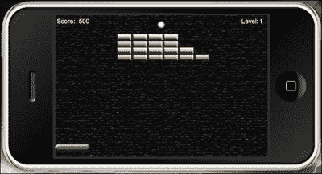
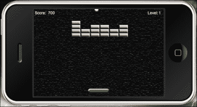

# 第四章。游戏控制

> *到目前为止，我们已经完成了上一章的上半场比赛。我们从开发项目的初始结构开始，将游戏对象引入屏幕。目前，桨和球的运动是不活跃的，但模拟器中显示的一切都是根据原始游戏设计进行缩放的。完成本教程的最后一个阶段是添加游戏中会发生的所有动作，包括物体移动和更新分数。*

在本章中，我们将涵盖以下主题:

*   使用触摸事件和加速度计移动拨片
*   场景中所有游戏对象之间的碰撞检测
*   碰撞检测时移除对象
*   屏幕边界内的球运动
*   计算分数
*   输赢条件

伸个懒腰！我们能做到！

# 向上移动

如果让物体出现在屏幕上让你兴奋，那就等着看它们移动吧！突破的主要目标是将球保持在划水位置之上，保持在比赛中，并使其与所有砖块碰撞以完成水平。保持悬念的是对球在游戏屏幕周围移动的预期。如果不在游戏对象上添加物理边界来对碰撞检测做出反应，这是不可能的。

# 让我们进行更多的体能训练

在前一章中，我们讨论了如何将物理引擎集成到您的代码中。我们也开始实现砖块对象的实体，现在，我们需要对其他活动的游戏对象做同样的事情，比如球拍和球。让我们继续学习教程的后半部分。我们将继续使用`Breakout`项目文件夹中的`main.lua`文件。

## 物理学. addBody()

电晕显示对象可以用一行代码变成模拟的物理对象。以下信息解释了物理体的不同形式:

*   如果没有指定形状信息，则显示对象采用原始图像的实际矩形边界的形式来创建物理体。例如，如果显示对象是 100 x 100 像素，那么这将是物理实体的实际大小。
*   如果指定了形状，则主体边界将遵循该形状提供的多边形。形状坐标必须按顺时针顺序定义，生成的形状只能是凸的。
*   如果指定了半径，则实体边界将是圆形的，以用于创建物理实体的显示对象的中间为中心。

身体形状是相对于显示对象中心的局部(x，y)坐标表。

身体形状的语法如下:

*   圆形:

    ```java
    physics.addBody(object, [bodyType,] {density=d, friction=f, bounce=b [,radius=r]})
    ```

*   多边形形状:

    ```java
    physics.addBody(object, [bodyType,] {density=d, friction=f, bounce=b [,shape=s]})
    ```

以下是身体形状的例子:

*   圆形物体:

    ```java
    local ball = display.newImage("ball.png")
    physics.addBody( ball, "dynamic" { density = 1.0, friction = 0.3, bounce = 0.2, radius = 25 } )
    ```

*   多边形体:

    ```java
    local rectangle = display.newImage("rectangle.png")
    rectangleShape = { -6,-48, 6,-48, 6,48, -6,48 }
    physics.addBody( rectangle, { density=2.0, friction=0.5, bounce=0.2, shape=rectangleShape } )
    ```

现在，我们将讨论前面方法的参数:

*   `Object`:这个是显示对象。
*   `bodyType`:这是一个字符串，指定正文类型是可选的。它在第一个主体元素之前使用一个字符串参数。可能的类型有`"static"`、`"dynamic"`和`"kinematic"`。如果未指定值，默认类型为`"dynamic"`。让我们来谈谈这些类型:
    *   静态体除非在代码中手动移动，否则不会移动，并且不会相互交互；静态物体的例子包括弹球机的地面或墙壁。
    *   动态物体受到重力和与其他物体类型碰撞的影响。
    *   运动对象受力的影响，但不受重力的影响，因此通常应将可拖动对象设置为运动的，至少在拖动事件的持续时间内是如此。
*   `Density`:这是一个数字乘以身体形状的面积来确定质量。它基于水的标准值 1.0。较轻的材料(如木材)的密度低于 1.0，较重的材料(如石头)的密度大于 1.0。默认值为`1.0`。
*   `Friction`:这是一个数字。这可以是任何非负值；值 0 表示没有摩擦，1.0 表示相当强的摩擦。默认值为`0.3`。
*   `Bounce`:这是一个决定物体碰撞后返回速度的数字。默认值为`0.2`。
*   `Radius`:这是一个数字。这是以像素为单位的边界圆的半径。
*   `Shape`:这是一个数字。它是形状顶点表形式的形状值，即{x1，y1，x2，y2，…，xn，yn}，例如，`rectangleShape = { -6,-48, 6,-48, 6,48, -6,48 }`。坐标必须按顺时针顺序定义，生成的形状只能是凸的。物理学假设物体的(0，0)点是物体的中心。A *-x* 坐标将位于对象中心的左侧， *-y* 坐标将位于对象中心的顶部。

# 行动时间——开始桨和球的物理训练

现在，我们的显示对象相当停滞。为了开始游戏，我们必须激活物理来检测桨和球之间的碰撞。请执行以下步骤:

1.  在`gameLevel1()`函数上方，创建一个名为`startGame()`的新函数:

    ```java
    function startGame()
    ```

2.  添加以下几行来实例化桨和球的物理特性:

    ```java
      physics.addBody(paddle, "static", {density = 1, friction = 0, bounce = 0})
      physics.addBody(ball, "dynamic", {density = 1, friction = 0, bounce = 0})
    ```

3.  创建一个事件监听器使用背景显示对象来移除`startGame()`的`"tap"`事件。用`end` :

    ```java
      background:removeEventListener("tap", startGame)
    end
    ```

    关闭功能
4.  在我们上一章创建的`addGameScreen()`函数中，我们必须在调用`gameLevel1()`函数后添加下面一行。这将在触摸背景时开始实际游戏:

    ```java
      background:addEventListener("tap", startGame)
    ```

## *刚刚发生了什么？*

桨状物体具有`"static"`体型，因此不会受到与之发生的任何碰撞的影响。

球对象具有`"dynamic"`体型，因为我们希望它受到屏幕上碰撞的影响，这些碰撞是由于墙壁边框、砖块和桨状物引起的方向变化。

后台的事件监听器从`startGame()`功能中移除；这样，它不会影响游戏中应用的任何其他触摸事件。

# 划桨运动

让桨左右移动是需要完成的关键动作之一。游戏设计的一部分是防止球到达屏幕底部。我们将分离模拟器中的桨叶运动和加速度计。模拟器中的运动使我们能够用触摸事件进行测试，因为加速度计的动作无法在模拟器中进行测试。

# 行动时间——在模拟器中拖动船桨

对现在，桨根本不动。没有坐标设置允许桨在屏幕上左右移动。因此，让我们通过执行以下步骤来创建它们:

1.  在`addGameScreen()`函数下面，创建一个名为`dragPaddle(event)` :

    ```java
    function dragPaddle(event)
    ```

    的新函数
2.  接下来，我们将重点关注在游戏屏幕的边界内左右移动球拍。添加以下代码块，在模拟器中启用桨叶运动，然后关闭该功能。添加此块的原因是模拟器不支持加速度计事件:

    ```java
      if isSimulator then

        if event.phase == "began" then
          moveX = event.x - paddle.x
        elseif event.phase == "moved" then
          paddle.x = event.x - moveX
        end

        if((paddle.x - paddle.width * 0.5) < 0) then
          paddle.x = paddle.width * 0.5
        elseif((paddle.x + paddle.width * 0.5) > display.contentWidth) then
          paddle.x = display.contentWidth - paddle.width * 0.5
        end

      end

    end
    ```

看到下面的球与砖块和桨碰撞的图像，并预测球下一步将向哪里移动:



## *刚刚发生了什么？*

我们已经创建了一个功能，拖动事件只在模拟器中工作。对于`if event.phase == "began"`，已经对桨进行了触摸事件。在`elseif event.phase == "moved"`上，发生了一个触摸事件，此时拨片从其原始位置移动。

为了防止船桨越过墙壁边界，`paddle.x`碰到坐标时在 *x* 方向上的行程不小于`0`。当拨片滑动到屏幕右侧时，`paddle.x`在 *x* 方向上的行程不会大于 `display.contentWidth`。

屏幕右侧没有指定坐标，因为该代码应该对 iOS 和安卓设备上的所有屏幕尺寸都通用。两个平台的屏幕分辨率不同，所以`display.contentWidth`会考虑到这一点。

# 行动时间-用加速度计移动桨

如前所述，加速度计事件无法在模拟器中测试。它们只在游戏构建被上传到设备以查看结果时起作用。桨叶的运动将停留在穿过 *x* 轴的水平面的墙壁边界内。要移动挡板，请按照下列步骤操作:

1.  在`dragPaddle()`函数下面，创建一个名为`movePaddle(event)`的新函数:

    ```java
    function movePaddle(event)
    ```

2.  使用`yGravity`加入加速度计运动。它在 *y* 方向提供重力加速度:

    ```java
      paddle.x = display.contentCenterX - (display.contentCenterX * (event.yGravity*3))
    ```

3.  加入关卡的墙边框，关闭功能:

    ```java
      if((paddle.x - paddle.width * 0.5) < 0) then
        paddle.x = paddle.width * 0.5
      elseif((paddle.x + paddle.width * 0.5) > display.contentWidth) then
        paddle.x = display.contentWidth - paddle.width * 0.5
      end
    end
    ```

## *刚刚发生了什么？*

为了使加速度计的运动与设备一起工作，我们必须使用`yGravity`。

### 注

相应使用`xGravity`和`yGravity`时，加速度计事件基于纵向比例。当显示对象被指定为横向模式时，`xGravity` 和`yGravity`值被切换以补偿事件正常工作。

我们从`function dragPaddle()`开始对桨板应用了相同的代码:

```java
  if((paddle.x - paddle.width * 0.5) < 0) then
    paddle.x = paddle.width * 0.5
  elseif((paddle.x + paddle.width * 0.5) > display.contentWidth) then
    paddle.x = display.contentWidth - paddle.width * 0.5
  end
```

这仍然可以防止桨叶越过任何墙壁边界。

# 球与桨的碰撞

球的运动必须在每次与桨碰撞时以流体的方式流动。这意味着游戏场的所有方面都有适当的方向变化。

# 行动时间——让球在球拍上反弹

我们将检查球击中了船桨的哪一侧，以选择它下一步移动的一侧。像在现实环境中一样，让动作跟随任何方向的命中是很重要的。每次划桨碰撞，我们都想确保球向上。为此，请遵循以下步骤:

1.  在`movePaddle()`函数之后为球创建一个名为`bounce()`的新函数:

    ```java
    function bounce()
    ```

2.  将 *y* 方向的速度值`-3`相加。这将使球向上运动:

    ```java
      vy = -3
    ```

3.  检查何时与`paddle`和`ball`物体发生碰撞，并关闭功能:

    ```java
      if((ball.x + ball.width * 0.5) < paddle.x) then
        vx = -vx
      elseif((ball.x + ball.width * 0.5) >= paddle.x) then
        vx = vx
      end
    end
    ```

## *刚刚发生了什么？*

当球与球拍碰撞时，运动随之进行，这取决于球接触到球拍的哪一侧。在`if`语句的第一部分，球沿 *x* 方向向 0 运动。`if`语句的最后一部分显示了球在 *x* 方向上向屏幕的另一侧移动。

# 从场景中移除对象

设备上的资源有限。尽管我们希望它们像台式机一样强大，能够容纳如此多的内存，但现在还不是时候。这就是为什么当您不再在应用中使用显示对象时，从显示层次结构中删除它们是很重要的。这有助于通过减少内存消耗和消除不必要的绘图来提高整体系统性能。

创建显示对象时，默认情况下会将其添加到显示层次结构的根对象中。这个物体是一种特殊的群体物体，被称为**阶段**物体。

为了防止对象在屏幕上呈现，需要将其从场景中移除。该对象需要从其父对象中显式移除。这将从显示层次结构中移除对象。这可以通过以下任一方式完成:

```java
myImage.parent:remove( myImage ) -- remove myImage from hierarchy
```

或者，这个可以使用下面一行代码来完成:

```java
myImage:removeSelf( ) -- same as above
```

这不会释放显示对象的所有内存。为了确保显示对象被正确移除，我们需要消除对它的所有变量引用。

## 变量引用

即使显示对象已经从层次结构中移除，但是存在对象继续存在的情况。为此，我们将属性设置为`nil`:

```java
local ball = display.newImage("ball.png")
local myTimer = 3

function time()
  myTimer = myTimer - 1
  print(myTimer)

  if myTimer == 0 then 

    ball:removeSelf()
    ball = nil

  end
end

timer.performWithDelay( 1000, time, myTimer )
```

# 一砖一瓦

游戏中的砖块是主要障碍，因为它们必须被清除才能进入下一轮。在这个版本的突围中，玩家必须一次摧毁所有砖块。否则将导致从当前级别的开始重新开始。

# 行动时间-移除砖块

当球与砖块碰撞时，我们将使用应用于桨的相同技术来确定球将遵循的路径。当一个砖块被击中时，我们需要找出哪个砖块被触碰过，然后从舞台和砖块组中移除它。每次拆砖将增加 100 分的分数。分数将取自`score`常量，并作为文本添加到当前分数中。要从游戏中移除砖块，请执行以下步骤:

1.  在`gameLevel2()`函数下面，创建一个名为`removeBrick(event)`的函数:

    ```java
    function removeBrick(event)
    ```

2.  使用`if`语句检查球击中砖块的哪一侧。当检查一个事件时，我们将该事件引用对象名`"brick"`。这是我们给我们的`brick`展示对象取的名字:

    ```java
      if event.other.name == "brick" and ball.x + ball.width * 0.5 < event.other.x + event.other.width * 0.5 then
        vx = -vx 
      elseif event.other.name == "brick" and ball.x + ball.width * 0.5 >= event.other.x + event.other.width * 0.5 then
        vx = vx 
      end
    ```

3.  加入以下`if`语句，当球与一个球碰撞时，将砖块从场景中移除。发生碰撞后，将`score`增加 1。启动`scoreNum`取分值乘以`scoreIncrease` :

    ```java
      if event.other.name == "brick" then
        vy = vy * -1
        event.other:removeSelf()
        event.other = nil
        bricks.numChildren = bricks.numChildren - 1

        score = score + 1
        scoreNum.text = score * scoreIncrease
        scoreNum.anchorX = 0
        scoreNum.x = 54 
      end
    ```

4.  当关卡中的所有砖块都被破坏时，创建一个`if`语句，弹出获胜条件的警告屏幕，并将`gameEvent`字符串设置为`"win"`；

    ```java
      if bricks.numChildren < 0 then
        alertScreen("YOU WIN!", "Continue")
        gameEvent = "win"
      end
    ```

5.  用`end` :

    ```java
    end
    ```

    关闭功能

以下是球与球拍碰撞的截图:


## *刚刚发生了什么？*

如果你还记得上一章，我们给`brick`物体起了一个名字叫`"brick"`。

当球碰到任何一块砖的左手边时，它会向左移动。当球碰到砖块的右侧时，它会向右移动。把每个物体的宽度作为一个整体来计算球的运动方向。

当砖块被击中时，球向上反弹(向 *y* 方向)。每次球与砖块碰撞后，砖块会从场景中移除，并从记忆中销毁。

`bricks.numChildren – 1`语句从最初开始的砖块总数中减去计数。移除砖块后，分数每次增加 100 分。`scoreNum`文本对象在每次击中砖块时更新分数。

当所有的砖块都没了，警报屏幕会弹出一个通知，玩家赢得了这个等级。我们还将`gameEvent`设置为等于`"win"`，这将用于另一个将事件转换到新场景的功能中。

# 方向变化

除了球对桨的运动，另一个因素是对墙边界的碰撞状态。当发生碰撞时，球以相反的方向转向。每一个动作都有一个反应，就像现实世界的物理一样。

# 行动时间-更新球

球需要在不受重力影响的情况下连续运动。我们必须考虑到侧壁以及顶壁和底壁。当任何边界上发生碰撞时， *x* 和 *y* 方向上的速度必须反过来。我们需要设置坐标，以便球只允许移动通过，并在它通过桨状区域下方的区域时发出警报。让我们执行以下步骤:

1.  在`removeBrick(event)`函数下面创建一个名为`function updateBall()`的新函数:

    ```java
    function updateBall()
    ```

2.  加入球的运动:

    ```java
      ball.x = ball.x + vx
      ball.y = ball.y + vy
    ```

3.  Add in the ball movement for the *x* direction:

    ```java
      if ball.x < 0 or ball.x + ball.width > display.contentWidth then
        vx = -vx
      end
    ```

    下面的截图显示了球在 *x* 方向的移动:

    

4.  Add in the ball movement for the *y* direction:

    ```java
      if ball.y < 0 then 
        vy = -vy 
      end
    ```

    下面的截图显示了球在 *y* 方向的移动:

    

5.  Add in the ball movement when it collides with the bottom of the game play screen. Create the lost alert screen and a game event for `"lose"`. Close the function with `end`:

    ```java
      if ball.y + ball.height > paddle.y + paddle.height then 
        alertScreen("YOU LOSE!", "Play Again") gameEvent = "lose" 
      end
    end
    ```

    下面的截图显示了当球与游戏画面底部碰撞时的丢失警报画面:

    

## *刚刚发生了什么？*

球无论走到哪里，当它碰到墙壁时，都需要适当地改变方向。每当球碰到侧壁，我们就使用`vx = -vx`。当球击中顶部边界时，使用`vy = -vy` 。球唯一不反射相反方向的时候就是碰到屏幕底部的时候。

警告屏幕显示输的情况，强调给玩家再玩一次。`gameEvent = "lose"`语句将在另一个`if`语句中用于重置当前电平。

# 过渡级别

当出现赢或输的情况时，游戏需要一种过渡到下一关或重复当前关的方式。主要的游戏对象必须重置到它们的起始位置，砖块重新绘制。这和你刚开始玩游戏时的想法差不多。

# 行动时间-重置和更改级别

我们需要来创建在游戏中设置第一级和第二级的功能。如果需要重播某个级别，则只能访问用户丢失的当前级别。按照以下步骤在各个级别之间转换:

1.  创建一个名为`changeLevel1()`的新函数。这将放在 `updateBall()`功能的下方:

    ```java
    function changeLevel1()
    ```

2.  当玩家输掉回合时清除`bricks`组，然后重置:

    ```java
      bricks:removeSelf()

      bricks.numChildren = 0
      bricks = display.newGroup()
    ```

3.  移除`alertDisplayGroup` :

    ```java
      alertBox:removeEventListener("tap", restart)
      alertDisplayGroup:removeSelf()
      alertDisplayGroup = nil
    ```

4.  重置`ball`和`paddle`位置:

    ```java
      ball.x = (display.contentWidth * 0.5) - (ball.width * 0.5)
      ball.y = (paddle.y - paddle.height) - (ball.height * 0.5) -2

      paddle.x = display.contentWidth * 0.5
    ```

5.  重绘当前级别的砖块:

    ```java
    gameLevel1()
    ```

6.  为`startGame()`的`background`对象添加一个事件监听器。关闭功能:

    ```java
      background:addEventListener("tap", startGame)
    end
    ```

7.  接下来，创建一个名为`changeLevel2()`的新函数。应用与`changeLevel1()`相同的代码，但确保为`gameLevel2()`重新绘制砖块:

    ```java
    function changeLevel2()

      bricks:removeSelf()

      bricks.numChildren = 0
      bricks = display.newGroup()

      alertBox:removeEventListener("tap", restart)
      alertDisplayGroup:removeSelf()
      alertDisplayGroup = nil

      ball.x = (display.contentWidth * 0.5) - (ball.width * 0.5)
      ball.y = (paddle.y - paddle.height) - (ball.height * 0.5) -2

      paddle.x = display.contentWidth * 0.5

     gameLevel2() -- Redraw bricks for level 2

      background:addEventListener("tap", startGame)
    end
    ```

## *刚刚发生了什么？*

当需要重置或更改级别时，必须从屏幕上清除显示对象。在这种情况下，我们使用`bricks:removeSelf()`移除了`bricks`组。

当弹出任何警告屏幕时，无论是赢还是输，整个`alertDisplayGroup`也会在复位过程中被移除。`ball`和`paddle`对象被设置回它们的起始位置。

调用`gameLevel1()`函数来重绘 1 级砖块。该功能保存`brick`显示对象和`bricks`组的初始设置。

`background`对象再次用于调用带有事件监听器的`startGame()`函数。当需要设置 2 级时，使用与函数`changeLevel1()`中相同的过程，但是调用`changeLevel2()`和`gameLevel2()`来重新绘制砖块。

## 拥有一个围棋英雄——增加更多关卡

现在，游戏只有两个级别。扩展这个游戏可以做的就是增加更多的关卡。通过调整用于创建砖块行和列的数字，可以使用用于`gameLevel1()`和`gameLevel2()`的相同逻辑来创建砖块。你必须创建一个新的函数来重置级别。我们可以使用与`changeLevel1()`和`changeLevel2()`相同的方法重新创建关卡并重置。

# 你赢了一些，你输了一些

没有什么比对胜利的期待更令人兴奋了。那就是直到你犯了那一个小错误，导致你重新开始。不用担心；这不是世界末日；你总是可以再试一次，从你的错误中学习，超越水平。

游戏事件，如输赢情况，将提醒玩家他们的进展。游戏必须有某种方式来指导玩家下一步需要采取什么行动来重播关卡或进入下一关。

# 行动时间——创造输赢条件

为了让任何游戏警报在游戏过程中出现，我们需要为每个关卡中的每个可能场景创建一些`if`语句。出现这种情况时，需要将分数重置回零。要制定输赢条件，请遵循的以下步骤:

1.  在`alertScreen()`函数下面，创建一个名为`restart()`的新函数:

    ```java
    function restart()
    ```

2.  Create an `if` statement for a `"win"` game event when the first level has been completed and transitions to level 2:

    ```java
      if gameEvent == "win" and currentLevel == 1 then
        currentLevel = currentLevel + 1
        changeLevel2()
        levelNum.text = tostring(currentLevel)
    ```

    ### 注

    `tostring()`方法将任何参数转换为字符串。在前面的示例中，`currentLevel`值在发生`"win"`游戏事件时从`1`变为`2`。该值将转换为`levelNum`文本对象可以在屏幕上显示的字符串格式，级别为 2。

3.  当第二关已经完成并且通知玩家游戏已经完成时，为`"win"`游戏事件添加`elseif`语句:

    ```java
      elseif gameEvent == "win" and currentLevel == 2 then
        alertScreen("  Game Over", "  Congratulations!")
        gameEvent = "completed"
    ```

4.  为第一关的`"lose"`游戏事件增加另一条`elseif`语句。将比分重置为零，重赛一级:

    ```java
      elseif gameEvent == "lose" and currentLevel == 1 then
        score = 0
        scoreNum.text = "0"
        changeLevel1()
    ```

5.  为第二级别的`"lose"`游戏事件添加另一个`elseif`语句。将比分重置为零，重赛 2 级:

    ```java
      elseif gameEvent == "lose" and currentLevel == 2 then
        score = 0
        scoreNum.text = "0"
        changeLevel2()
    ```

6.  最后，为`gameEvent = "completed"`增加另一条`elseif`语句。用`end` :

    ```java
      elseif gameEvent == "completed" then
        alertBox:removeEventListener("tap", restart)
      end
    end
    ```

    关闭功能
7.  现在，我们需要使用`alertBox`对象回溯并添加一个事件监听器到`alertScreen()`函数。我们将把它添加到函数的底部。这将激活`restart()`功能:

    ```java
      alertBox:addEventListener("tap", restart)
    ```

## *刚刚发生了什么？*

`restart()`功能检查游戏过程中出现的所有`gameEvent`和`currentLevel`变量。当一个游戏事件检查`"win"`字符串时，它也会进入语句列表，看看什么是真的。例如，如果玩家赢了，并且当前在 1 级，那么玩家就进入 2 级。

如果玩家输了，`gameEvent == "lose"`变为真，代码检查玩家输在哪一关。对于玩家输掉的任何级别，分数将恢复为 0，并且玩家当前所在的级别将被重新设置。

# 激活事件监听器

这个游戏中的事件听者基本上是打开和关闭物体的运动。我们已经编写了执行游戏对象操作的函数来运行关卡。现在，是时候使用特定类型的事件来激活它们了。正如您在上一章中注意到的，我们可以添加事件侦听器来显示对象，或者让它们全局运行。

## 碰撞事件

物理引擎内的碰撞事件通过 Corona 的事件监听器模型发生。有三种新事件类型，如下所示:

*   `"collision"`:该事件包括`"began"`和`"ended"`阶段，表示初始接触和断开接触的时刻。正常的两体碰撞和体传感器碰撞都存在这些阶段。如果不实现`"collision"`侦听器，此事件将不会触发。
*   `"preCollision"`:这是一个在对象开始交互之前触发的事件类型。根据您的游戏逻辑，您可能希望检测到此事件并有条件地忽略冲突。这还可能导致每个联系人有多个报告，并影响应用的性能。
*   `"postCollision"`:这是一个对象交互后立即触发的事件类型。这是唯一报告碰撞力的事件。如果不实现`"postCollision"`侦听器，此事件将不会触发。

冲突在对象对之间报告，可以使用运行时监听器全局检测，也可以使用表监听器在对象内局部检测。

### 全局碰撞监听器

当被检测为运行时事件时，每个碰撞事件包括`event.object1`，它包含所涉及的电晕显示对象的表标识。

这里有一个例子:

```java
local physics = require "physics"
physics.start()

local box1 = display.newImage( "box.png" )
physics.addBody( box1, "dynamic", { density = 1.0, friction = 0.3, bounce = 0.2 } )
box1.myName = "Box 1"

local box2 = display.newImage( "box.png", 0, 350)
physics.addBody( box2, "static", { density = 1.0, friction = 0.3, bounce = 0.2 } )
box2.myName = "Box 2"

local function onCollision( event )
  if event.phase == "began" and event.object1.myName == "Box 1" then

    print( "Collision made." )

  end
end

Runtime:addEventListener( "collision", onCollision )

```

### 本地冲突监听器

当对象内的表监听器检测到时，每个碰撞事件包括`event.other`，它包含碰撞中涉及的其他显示对象的表标识。

下面是一个例子:

```java
local physics = require "physics"
physics.start()

local box1 = display.newImage( "box.png" )
physics.addBody( box1, "dynamic", { density = 1.0, friction = 0.3, bounce = 0.2 } )
box1.myName = "Box 1"

local box2 = display.newImage( "box.png", 0, 350)
physics.addBody( box2, "static", { density = 1.0, friction = 0.3, bounce = 0.2 } )
box2.myName = "Box 2"

local function onCollision( self, event )
  if event.phase == "began" and self.myName == "Box 1" then

    print( "Collision made." )

  end
end

box1.collision = onCollision
box1:addEventListener( "collision", box1 )

box2.collision = onCollision
box2:addEventListener( "collision", box2 )

```

# 行动时间-添加游戏监听器

对于我们为游戏对象创建的许多功能，我们需要激活事件侦听器，以便它们运行代码，然后在游戏停止时禁用它们。要添加游戏监听器，请按照下列步骤操作:

1.  为了完成这个游戏，我们需要创建的最后一个函数叫做`gameListeners()`，它也会有一个参数叫做`event`。这应该添加在`gameLevel2()`功能之后:

    ```java
    function gameListeners(event)
    ```

2.  使用`if`语句添加以下事件监听器，这些监听器将在应用中启动几个事件:

    ```java
      if event == "add" then
        Runtime:addEventListener("accelerometer", movePaddle)
        Runtime:addEventListener("enterFrame", updateBall)
        paddle:addEventListener("collision", bounce)
        ball:addEventListener("collision", removeBrick)
        paddle:addEventListener("touch", dragPaddle)
    ```

3.  接下来，我们将为事件侦听器添加一个`elseif`语句，该语句将移除事件，然后关闭函数:

    ```java
      elseif event == "remove" then
        Runtime:removeEventListener("accelerometer", movePaddle)
        Runtime:removeEventListener("enterFrame", updateBall)
        paddle:removeEventListener("collision", bounce)
        ball:removeEventListener("collision", removeBrick)
        paddle:removeEventListener("touch", dragPaddle)

      end
    end
    ```

4.  为了让`function gameListeners()`正常工作，我们需要使用参数中的`"add"`字符串在`startGame()`函数中实例化它。放在功能结束前:

    ```java
      gameListeners("add")
    ```

5.  在`alertScreen()`函数中，在参数中添加`"remove"`字符串，并将其放在函数的开头:

    ```java
      gameListeners("remove")
    ```

6.  所有代码都写好了！继续在模拟器中运行游戏。应用也是设备就绪的。制作一个简单的图标图像，适合您正在开发的设备所需的尺寸。编译一个构建并在您的设备上运行。

## *刚刚发生了什么？*

`event`参数有两套`if`语句:`"add"`和`"remove"`。

这个函数中的所有事件监听器在游戏运行中起着重要的作用。`"accelerometer"`和`"enterframe"`事件被用作运行时事件，因为它们没有特定的目标。

`paddle`和`ball`物体都有`"collision"`事件，这些事件将在任何物体接触中实现它们的目的。

`"touch"`事件允许用户触摸和拖动桨板，以便它可以在模拟器中来回移动。

请注意，当`event == "remove"`时，它会移除游戏中所有活动的事件监听器。游戏开始时，`gameListeners("add")`被激活。当达到输赢条件时，`gameListeners("remove")`被激活。

## 玩个围棋英雄——让我们把一切都颠倒过来

如果我们决定把游戏翻转过来，也就是把球拍放在屏幕顶部附近，球放在球拍下面，那组砖块更靠近屏幕底部，会怎么样？

你需要考虑的事情如下:

*   顶墙现在是你必须阻止球进入的区域
*   *y* 方向是球与砖块碰撞时的行进方向
*   当球与它碰撞时，它必须从底壁反射出去

如您所见，在将值从负转换为正之前，有几件事需要考虑，反之亦然。一定要验证你的逻辑，并确保它在创建这个新的变体时是有意义的。

# 结果出来了！

让我们总结一下已经做了什么，以确保您已经将所有内容添加到您的游戏中。也可以参考`Chapter 4`文件夹中的`Breakout Final`文件夹查看最终代码。你确保在游戏中引入了必要的变量。您还初始化了开始游戏的`main()`功能。主菜单屏幕实现了游戏标题和播放按钮。

接下来，您将`menuScreenGroup`从屏幕上移开，以加载主游戏区域。添加了游戏的主要显示对象，如球拍、球和砖块。分数和等级编号显示为用户界面元素，并在整个游戏过程中更新。模拟器和加速度计中增加了桨的运动，以及与桨和球的碰撞检测。

桨和球的物理属性是在游戏开始时添加的。创建了两个级别的砖块布局。您还将事件监听器添加到我们所有的游戏对象中，从它们需要在游戏过程中被激活的时候开始，到游戏结束时被移除。

每次球与砖块碰撞，砖块就会从场景中移除。球的方向变化会随着墙、桨或砖块的碰撞而更新。每次出现赢或输的情况，所有游戏对象都被重置，开始当前或新的关卡。

当情况发生时，会弹出一个警告屏幕，通知玩家发生了什么。启动警报的显示对象是在功能中创建的。最后，创建赢和输参数来确定当前级别是否必须重放，玩家是否进入下一级别，或者游戏是否已经完成。

小心区分大小写的变量和函数，以防遇到错误。另外，一定要检查你的代码中是否缺少任何标点符号。这些很容易被忽视。有关任何错误参考，请参考模拟器中的终端窗口。

## 突击测验–使用游戏控件

Q1。如何正确地从舞台上移除显示对象？

1.  `remove()`
2.  `object: remove()`
3.  `object:removeSelf()`

    `object = nil`

4.  以上都不是。

Q2。把下面的显示对象变成物理对象的正确方法是什么？

```java
local ball = display.newImage("ball.png")
```

1.  `physics.addBody( ball, { density=2.0, friction=0.5, bounce=0.2,radius = 25 })`
2.  `physics.addBody( ball, "dynamic", { density=2.0, friction=0.5, bounce=0.2,radius = 15 } )`
3.  1 和 2 `.`
4.  以上都不是。

Q3。以下函数中什么最能代表`"began"`的意思？

```java
local function onCollision( event )
  if event.phase == "began" and event.object1.myName == "Box 1" then

    print( "Collision made." )

  end
end
```

1.  一根手指在屏幕上移动。
2.  一根手指从屏幕上抬起。
3.  系统取消跟踪开始触摸。
4.  一根手指触到了屏幕。

# 总结

恭喜你！你已经完成了你的第一场比赛！你应该为自己感到骄傲。现在，您已经体验了用 Corona SDK 制作应用是多么简单。制作一个应用只需要几百行代码。

在本章中，我们执行了以下操作:

*   通过触摸事件增加了拨片的移动
*   介绍了加速度计的特性
*   为所有受影响的游戏对象实现了冲突事件监听器
*   当游戏屏幕不需要时，从内存中删除对象
*   将球作为物理对象进行移动
*   更新了每次砖块碰撞的记分牌
*   学会了如何处理输赢情况

最后两章现在没那么糟了吧？随着您继续在 Lua 中编程，您已经熟悉了工作流。只要你不断进步，使用不同的游戏框架，它肯定会变得更容易理解。

下一章举行另一场比赛，一定会引起你的注意。您将为显示对象创建动画精灵表。眼糖怎么样？