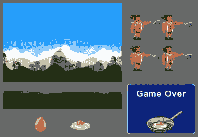
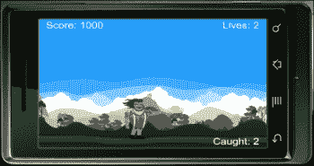
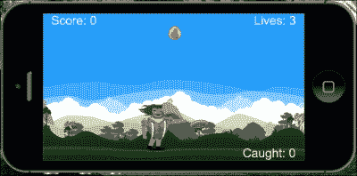
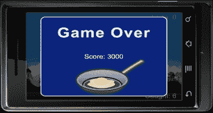

# 第七章。物理学–坠落物体

> *关于如何使用显示对象合并物理引擎，有很多变体。到目前为止，我们已经致力于通过碰撞移除物体，移动物体通过舞台区域，以及通过施加重力来发射物体，仅举几个例子。现在，我们将探索另一种让重力控制环境的机制。下一个游戏，我们将创建与下落的物理物体交易。*

在本章中，我们将:

*   与更多的物理实体合作
*   定制车身结构
*   跟踪捕获的对象
*   处理冲突后问题
*   创建下落物体

为在这一章中创造另一个有趣、简单的游戏干杯。我们开始吧！

# 创造我们的新游戏——蛋蛋

到目前为止所采取的每一步都让我们更加了解了 iOS/Android 设备上的游戏开发。在这个新的细分市场中，我们的游戏将包括音效，这将增强我们游戏中的感官体验。

### 类型

确保您使用的是最新稳定版本的 Corona SDK。

我们将要创建的新游戏叫做蛋蛋游戏。玩家控制主角，主角是一个拿着煎锅的伐木工人。在游戏过程中，鸡蛋开始从天而降，伐木工人的工作是抓住他煎锅里的鸡蛋，不让它们掉到地上。每抓到一个鸡蛋就赚 500 分。玩家从三条命开始。当一个鸡蛋没有砸到煎锅，砸到地上，一条生命就失去了。当三条命都没了，游戏就结束了。

当开始新的游戏项目时，一定要从`Chapter` `7`文件夹中抓取`Egg` `Drop`文件。您可以在 http://www.packtpub.com/的 Packt 出版网站下载本书附带的项目文件。它包含所有为您构建的必要文件，如`build.settings`、`config.lua`、音频文件，以及游戏所需的艺术资产。然后，在开始编码之前，您必须在项目文件夹中创建一个全新的`main.lua`文件。



## 起始变量

这将是我们第一次完整的游戏设置，其中将充满引人注目的电晕 SDK 功能。我们将把目前所学的基础知识与变量、显示对象、物理引擎、触摸/加速度计事件和音频结合起来。Corona 的很多 API 都很容易使用和理解。这显示了 Corona 的快速学习曲线，只需要对编程有基本的或没有的知识。

# 行动时间-设置变量

让我们从介绍我们将用来创建游戏的变量开始。将有显示对象和整数的组合来保持计数；我们还需要预加载游戏过程中使用的主要音效。按照以下步骤声明所有必需的变量:

1.  隐藏状态栏并添加名为`gameGroup` :

    ```java
        display.setStatusBar( display.HiddenStatusBar )
        local gameGroup = display.newGroup()
    ```

    的`display.newGroup()`组
2.  包括游戏中的外部模块:

    ```java
        local physics = require "physics"
    ```

3.  添加显示对象:

    ```java
        local background
        local ground
        local charObject
        local friedEgg
        local scoreText
        local eggText
        local livesText
        local shade
        local gameOverScreen
    ```

4.  加入变量:

    ```java
        local gameIsActive = false
        local startDrop -- Timer object
        local gameLives = 3
        local gameScore = 0
        local eggCount = 0
        local mRand = math.random
    ```

5.  创建蛋的边界和密度:

    ```java
        local eggDensity = 1.0
        local eggShape = { -12,-13, 12,-13, 12,13, -12,13 }
        local panShape = { 15,-13, 65,-13, 65,13, 15,13 }
    ```

6.  设置加速计和音频:

    ```java
        system.setAccelerometerInterval( 100 )
        local eggCaughtSound = audio.loadSound( "friedEgg.wav" )
        local gameOverSound = audio.loadSound( "gameOver.wav" )
    ```

## *刚刚发生了什么？*

我们继续创建类似的变量设置，就像我们在熊猫追星游戏中做的那样。通过分离组、显示对象、音频等来组织它们会更有效。

显示的许多变量都指定了整数来实现游戏的目标。这包括`gameLives``=``3``eggCount``=``0`等数值。

## 控制主角

加速计事件在游戏的主要范围内效果最好。它使您能够查看游戏环境的全部真实情况，而不必与屏幕上的触摸进行交互。必要的触摸事件对于诸如暂停、菜单、播放等用户界面按钮来说是有意义的。

# 行动时间-移动角色

鸡蛋将从天空中落到屏幕的所有不同区域。让我们准备好我们的主角在屏幕上的所有潜在区域中移动:

1.  设置一个名为`moveChar()`的新的本地函数，参数为`event`:

    ```java
    local moveChar = function(event)
    ```

2.  加入角色的加速度计运动:

    ```java
      charObject.x = display.contentCenterX - (display.contentCenterX* (event.yGravity*3))
    ```

3.  在屏幕上移动的地方创建角色边界。这使得角色能够停留在游戏屏幕内，而不会越过屏幕外的边界:

    ```java
      if((charObject.x - charObject.width * 0.5) < 0) then charObject.x = charObject.width * 0.5
      elseif((charObject.x + charObject.width * 0.5) > display.contentWidth) then
      charObject.x = display.contentWidth - charObject.width * 0.5
      end
    end
    ```

## *刚刚发生了什么？*

为了使加速度计的运动与设备一起工作，我们必须使用`yGravity`。

### 注

相应使用`xGravity`和`yGravity`时，加速度计事件基于纵向比例。当显示对象被指定为横向模式时，`xGravity`和`yGravity`值被切换以补偿事件正常工作。

请注意步骤 3 中的代码防止`charObject`显示对象越过任何墙边界。

## 有一个围棋英雄——增加触摸事件

字符当前由加速度计控制。另一个控制角色的选项是通过触摸事件。尝试用`"touch"`替换事件监听器，并使用事件参数，使触摸事件正常工作。

如果你还记得我们在[第 3 章](03.html "Chapter 3. Building Our First Game – Breakout")、*打造我们的第一场比赛–突破*和[第 4 章](04.html "Chapter 4. Game Controls")、*游戏控制*中是如何将划水动作与突破结合在一起的，对于模拟器来说，应该非常相似。

## 更新分数

当分数更新时，它引用我们的文本显示对象，并将数值从数字翻译成字符串。

这里有一个例子:

```java
gameScore = 100
scoreText = display.newText( "Score: " .. gameScore, 0, 0, "Arial", 45 )
scoreText:setTextColor( 1, 1, 1)
scoreText.x = 160; scoreText.y = 100
```

在前面的例子中，您会注意到我们将`100`的值设置为`gameScore`。在下面的`scoreText`行中，`gameScore`用于连接“`Score:`”字符串和`gameScore`的值。这样做通过`scoreText`以字符串格式显示`gameScore`的值。

# 行动时间-设置分数

谁不喜欢一些友谊赛？我们熟悉前几章制作的游戏的计分板。所以，我们对追踪比分并不陌生。执行以下步骤来设置分数:

1.  创建一个名为`setScore()`的局部函数，参数名为`scoreNum` :

    ```java
        local setScore = function( scoreNum )
    ```

2.  设置统计分数的变量:

    ```java
          local newScore = scoreNum
          gameScore = newScore
          if gameScore < 0 then gameScore = 0; end
    ```

3.  在游戏中获得积分时更新分数，并关闭功能:

    ```java
          scoreText.text = "Score: " .. gameScore
          scoreText.xScale = 0.5; scoreText.yScale = 0.5
          scoreText.x = (scoreText.contentWidth * 0.5) + 15
          scoreText.y = 15
        end
    ```

## *刚刚发生了什么？*

当在任何函数内调用`setScore(scoreNum)`时，它将引用所有使用`gameScore`变量的方法。假设在应用程序开始时`gameScore` `=` `0`，该值将增加到`gameScore`设置的值。

在`scoreText.text` `=` `"Score: " .. gameScore`中，`"Score: "`是游戏过程中显示在设备上的字符串。`gameScore`变量获取变量的当前值，并将其显示为字符串。

## 显示游戏环境

显示对象的逻辑设置有助于玩家想象主角和环境之间的关系。因为我们的主角是一个伐木工人，所以把他放在一个森林或一个完全专注于自然的地方是有意义的。

# 行动时间-绘制背景

在这一部分，我们将用我们的环境显示对象填充屏幕。这包括我们的背景和地面物体，我们还可以向我们的地面添加物理元素，以便我们可以为其指定碰撞事件。要绘制背景，请执行以下步骤:

1.  创建一个名为`drawBackground()` :

    ```java
        local drawBackground = function()
    ```

    的本地函数
2.  添加背景图片:

    ```java
          background = display.newImageRect( "bg.png", 480, 320 )
          background.x = 240; background.y = 160
          gameGroup:insert( background )
    ```

3.  添加地面元素并创建地面物理边界。关闭功能:

    ```java
          ground = display.newImageRect( "grass.png", 480, 75 )
          ground.x = 240; ground.y = 325
          ground.myName = "ground"
          local groundShape = { -285,-18, 285,-18, 285,18, -285,18}
          physics.addBody( ground, "static", { density=1.0, bounce=0, friction=0.5, shape=groundShape } )
          gameGroup:insert( ground )
        end
    ```

## *刚刚发生了什么？*

`background`和`ground`显示对象放置在名为`drawBackground()`的功能中。使用`display.newImageRect()`功能是因为我们对一些图像进行了动态缩放。地面显示对象具有与原始显示对象大小不同的自定义物理形状。

我们的`background`对象以设备屏幕区域的尺寸为中心，并插入到`gameGroup`中。

`ground`显示对象放置在显示区域的底部附近。它通过`ground.myName` `=` `"ground"`被赋予一个名字。稍后我们将使用名称`"ground"`来确定碰撞事件。通过`groundShape`为地面定制物理边界。这允许地面主体影响显示对象的指定尺寸。当`physics.addBody()`初始化时，我们使用`groundShape`作为形状参数。接下来，`ground`也被设置为`gameGroup`。

## 显示平视显示器

在游戏中，**平视** **显示器** ( **平视显示器**)是将信息视觉传达给玩家的方法。在许多游戏中，显示的共同特征是健康/生命、时间、武器、菜单、地图等。这可以让你的玩家在玩游戏时保持警惕。当追踪你的生活时，你想在你的角色没有机会继续玩游戏和游戏结束之前被告知还剩多少。

# 行动时间——设计抬头显示器

在试图让玩家的游戏体验变得愉快的同时，重要的是显示的信息要与游戏相关，并有策略地放置，这样才不会干扰主游戏区。因此，要设计抬头显示器，请执行以下步骤:

1.  创建名为`hud()` :

    ```java
        local hud = function()
    ```

    的新本地函数
2.  显示游戏过程中捕获的鸡蛋的文本:

    ```java
          eggText = display.newText( "Caught: " .. eggCount, 0, 0, "Arial", 45 )
          eggText:setTextColor( 1, 1, 1 )
          eggText.xScale = 0.5; eggText.yScale = 0.5
          eggText.x = (480 - (eggText.contentWidth * 0.5)) - 15
          eggText.y = 305
          gameGroup:insert( eggText )
    ```

3.  添加文字来追踪生活:

    ```java
          livesText = display.newText( "Lives: " .. gameLives, 0, 0, "Arial", 45 )
          livesText:setTextColor( 1, 1, 1 )--> white
          livesText.xScale = 0.5; livesText.yScale = 0.5  --> for clear retina display text
          livesText.x = (480 - (livesText.contentWidth * 0.5)) - 15
          livesText.y = 15
          gameGroup:insert( livesText )
    ```

4.  Add in text for the score and close the function:

    ```java
          scoreText = display.newText( "Score: " .. gameScore, 0, 0, "Arial", 45 )
          scoreText:setTextColor( 1, 1, 1 )--> white
          scoreText.xScale = 0.5; scoreText.yScale = 0.5  --> for clear retina display text
          scoreText.x = (scoreText.contentWidth * 0.5) + 15
          scoreText.y = 15
          gameGroup:insert( scoreText )
        end
    ```

    

## *刚刚发生了什么？*

`eggText`显示对象可以在屏幕右下角附近找到。在玩游戏时，它仍然在用户的视图中，同时远离主要焦点。请注意，当值更新时，`eggText = display.newText( "Caught: " .. eggCount, 0, 0, "Arial", 45 )`将引用`eggCount`。

`livesText`显示对象设置类似于`eggText`。它位于屏幕右上角附近。这个物体的位置相当突出，因为它在游戏中的重要性。它在一个从背景看很明显的区域，玩家可以在游戏中参考。当`gameLives`被更新时，`livesText`显示对象递减数字。

`scoreText`的初始设置从`hud()`功能开始。它放置在屏幕的左上角，与`livesText`相对。

## 创造游戏生活

如果一个游戏中没有的后果，那么就没有完成主要目标的紧迫感。为了让玩家在玩游戏时保持专注，引入一些具有挑战性的元素将保持竞争力和刺激感。在游戏中添加后果会给玩家带来紧张感，并给他们更多的动力来保持活力。

# 行动的时间——计算生命

追踪游戏中剩余的生命可以让玩家知道游戏结束还有多久。要计算游戏中剩余的生命，请执行以下步骤:

1.  设置名为`livesCount()` :

    ```java
        local livesCount = function()
    ```

    的功能
2.  每次数字递减时显示生命文本:

    ```java
          gameLives = gameLives - 1
          livesText.text = "Lives: " .. gameLives
          livesText.xScale = 0.5; livesText.yScale = 0.5  --> for clear retina display text
          livesText.x = (480 - (livesText.contentWidth * 0.5)) - 15
          livesText.y = 15
          print(gameLives .. " eggs left")
          if gameLives < 1 then
            callGameOver()
          end
        end
    ```

## *刚刚发生了什么？*

`livesCount()`功能是更新`gameLives`的独立功能。它确保你意识到`gameLives = gameLives – 1`。这将减少在代码开头实例化的设置值。当`gameLives`改变值时，通过`livesText`显示更新。`print`语句在函数的末尾用于跟踪终端窗口中的计数。

当`gameLives < 1`时，将调用`callGameOver()`功能，显示游戏的游戏结束元素。

## 拥有一个围棋英雄——为游戏生活添加图像

目前，游戏使用屏幕上的显示文本来显示游戏过程中还剩多少条生命。一种使平视显示器更具吸引力的方法是创建/添加与游戏相关的小图标，如鸡蛋或煎锅。

需要以有序的方式创建和放置三个独立的显示对象，以便当一个生命被夺走时，对象的α被降低到 0.5。

需要创建一种方法，以便当游戏寿命减少到零时，所有三个显示对象都受到影响。

## 介绍主角

我们的主角将会为游戏中的每一个动作制作动画。我们还将创建一个复杂的身体构造，因为它的碰撞点的焦点将是角色所拿着的物体，而不是他们的整个身体。

### 复杂车身构造

也可以用多种元素构成一个物体。每个主体元素都被指定为一个独立的多边形，具有自己的物理属性。

由于 Box2D 中的碰撞多边形必须是凸的，因此任何具有凹形形状的游戏对象都必须通过附加多个身体元素来构建。

复杂几何体的构造函数与简单多边形几何体的构造函数相同，只是它列出了多个几何体元素:

```java
physics.addBody( displayObject, [bodyType,] bodyElement1, [bodyElement2, ...] )
```

每个实体元素可能有自己的物理属性，以及其碰撞边界的形状定义。这里有一个例子:

```java
local hexagon = display.newImage("hexagon.png")
hexagon.x = hexagon.contentWidth
hexagon.y = hexagon.contentHeight
hexagonShape = { -20,-40, 20, -40, 40, 0, 20,40, -20,40, -40,0 }
physics.addBody( hexagon, "static", { density = 1.0, friction = 0.8, bounce = 0.3, shape=hexagonShape } )
```

与更简单的情况一样，`bodyType`属性是可选的，如果没有指定，它将默认为`"dynamic",`。

# 行动时间——创造角色

主角色是用精灵表创建的，需要设置才能查看它提供的动画。其他会出现的显示图像包括与物理物体发生碰撞时破裂的鸡蛋。要创建角色，请执行以下步骤:

1.  创建名为`createChar()` :

    ```java
        local createChar = function()
    ```

    的新本地函数
2.  为主角创建精灵表:

    ```java
    local sheetData = { width=128, height=128, numFrames=4, sheetContentWidth=256, sheetContentHeight=256 }
    local sheet = graphics.newImageSheet( "charSprite.png", sheetData )

        local sequenceData = 
        {
          { name="move", start=1, count=4, time=400 } 
        }

        charObject = display.newSprite( sheet, sequenceData )
        charObject:setSequence("move")
        charObject:play()
    ```

3.  设置主角的起始位置和物理属性:

    ```java
        charObject.x = 240; charObject.y = 250
        physics.addBody( charObject, "static", { density=1.0, bounce=0.4, friction=0.15, shape=panShape } )
        charObject.rotation = 0
        charObject.isHit = false -- When object is not hit
        charObject.myName = "character"
    ```

4.  Add in the transition image after the egg has made a collision:

    ```java
        friedEgg = display.newImageRect( "friedEgg.png", 40, 23 )
        friedEgg.alpha = 1.0
        friedEgg.isVisible = false
        gameGroup:insert( charObject )
        gameGroup:insert( friedEgg )
      end
    ```

    

## *刚刚发生了什么？*

被引用的图像单称为`sheetData`，从`"charSprite.png"`获取动画的第一个`4`帧。我们创建了一个名为`"move"`的动画集。每次调用`"move"`时，它从第`1`帧开始动画，并在第`400`毫秒从开始播放第`4`帧。

主显示对象称为`charObject`，呈现`sheetData`的特征。当它调用`setSequence("move")`时，该动画序列在执行`play()`命令时播放。

角色身体的一个重要变化是其主要碰撞点将指向动画中使用的煎锅。角色身体上的任何碰撞检测都不会被读取。`charObject`显示对象被赋予一个名为`"character"`的名称，将用于检测与下落的鸡蛋的碰撞。

我们还在这个功能中放置了煎蛋，为碰撞做准备。

## 添加后碰撞

我们希望确保当一个对象与另一个对象交互时，紧接着会发生一个事件类型。在后碰撞的情况下，我们可以确认两个物体之间的碰撞力。这有助于我们确定被摧毁的物体是用设定的力量完成的。

### 碰撞处理

小心你如何操作 Box2D 物理引擎。如果 Corona 代码试图修改仍然参与碰撞的对象，它将在碰撞过程中崩溃，因为 Box2D 仍然在对它们进行迭代数学计算。

对于防撞碰撞检测，不要让碰撞立即发生。

在碰撞过程中，不要修改/创建/破坏物理物体，以防止碰撞。

如果由于碰撞而需要修改/创建/销毁一个对象，您的碰撞处理程序应该设置一个标志或添加一个时间延迟，以便更改可以在以后发生，使用`timer.performWithDelay()`。

## 身体属性

许多原生 Box2D 方法已经被做成更简单的显示对象的点属性。以下示例显示了使用构造函数方法之一创建的实体`newBody`。

### body.isAwake

这是当前清醒状态的一个布尔值。默认情况下，当有几秒钟没有与身体互动时，所有身体都会自动*转到* *到* *睡眠*。物体停止模拟，直到某种碰撞或其他相互作用唤醒它们。

这里有一个例子:

```java
newBody.isAwake = true
local object = newBody.isAwake
```

### 身体。isbodyactive

这是一个表示物体活动状态的布尔值。不活动的实体不会被破坏，但它们会从模拟中移除，并停止与其他实体交互。

这里有一个例子:

```java
newBody.isBodyActive = true
local object = newBody.isBodyActive
```

### 身体。isbullet

这是一个被当作*子弹*对待的身体的布尔值。子弹受到连续碰撞检测。默认为`false`。

这里有一个例子:

```java
newBody.isBullet = true
local object = newBody.isBullet
```

### 身体. issensor

这是一个布尔属性，用于设置身体中所有元素的`isSensor`属性。传感器通过其他物体，而不是反弹，但检测到一些碰撞。该属性作用于所有主体元素，并将覆盖元素本身的任何`isSensor`设置。

这里有一个例子:

```java
newBody.isSensor = true
```

### body . is leeping allowed

这是一个被允许进入睡眠的身体的布尔值。在倾斜重力等情况下，醒着的身体是有用的，因为睡着的身体对全球重力的变化没有反应。默认为`true`。

这里有一个例子:

```java
newBody.isSleepingAllowed = true
local object = newBody.isSleepingAllowed
```

### body . is fixedrostation

这是的一个布尔值，表示一个物体的旋转应该被锁定，即使该物体将要加载或承受偏心力。默认为`false`。

这里有一个例子:

```java
newBody.isFixedRotation = true
local object = newBody.isFixedRotation
```

### 车身角度

这是当前旋转速度的值，单位为度/秒。

这里有一个例子:

```java
newBody.angularVelocity = 50
local myVelocity = newBody.angularVelocity
```

### 车身.线性阻尼

这是物体的线性运动被阻尼的数值。这是角速度随时间降低的速率。默认值为零。

这里有一个例子:

```java
newBody.linearDamping = 5
local object = newBody.linearDamping
```

### 身体.角度跳动

这是一个物体的旋转应该被阻尼多少的值。默认值为零。

这里有一个例子:

```java
newBody.angularDamping = 5
local object = newBody.angularDamping
```

### body.bodyType

这是被模拟的身体类型的字符串值。可用值为`"static"`、`"dynamic"`、`"kinematic"`，在此说明:

*   `static`身体不运动，也不相互作用。静态物体的例子包括地面或迷宫的墙壁。
*   `dynamic`身体受到重力和与其他体型碰撞的影响。
*   `kinematic`物体受力影响，不受重力影响。在拖动事件的持续时间内，可拖动对象的主体应设置为`"kinematic"`。

默认体型为`"dynamic"`。

这里有一个例子:

```java
newBody.bodyType = "kinematic"
local currentBodyType = newBody.bodyType
```

# 行动时间——制造鸡蛋碰撞

在我们之前创建的示例游戏中，我们已经处理了碰撞。处理冲突后事件需要强制执行冲突后事件的完成:

1.  创建一个名为`onEggCollision()`的新本地函数，有两个参数名为`self`和`event` :

    ```java
        local onEggCollision = function( self, event )
    ```

2.  当力大于`1`时创建`if`语句，并包含`not` `self.isHit`。加入`eggCaughtSound`音效:

    ```java
          if event.force > 1 and not self.isHit then
            audio.play( eggCaughtSound )
    ```

3.  使`self`不可见且不活动，替换为`friedEgg`显示对象:

    ```java
            self.isHit = true
            print( "Egg destroyed!")
            self.isVisible = false
            friedEgg.x = self.x; friedEgg.y = self.y
            friedEgg.alpha = 0
            friedEgg.isVisible = true
    ```

4.  使用`onComplete`命令:

    ```java
            local fadeEgg = function()
              transition.to( friedEgg, { time=500, alpha=0 } )
            end
            transition.to( friedEgg, { time=50, alpha=1.0, onComplete=fadeEgg } )
            self.parent:remove( self )
            self = nil
    ```

    创建一个转换`friedEgg`显示对象并将其淡出舞台的功能
5.  Using `if` `event.other.myName == "character"`, update `eggCount` when the main character catches the eggs. Also, update `gameScore` by `500` points for every collision. If the egg hits the ground, use `elseif event.other.myName == "ground"` and decrement the lives using `livesCount()`:

    ```java
            if event.other.myName == "character" then
              eggCount = eggCount + 1
              eggText.text = "Caught: " .. eggCount
              eggText.xScale = 0.5; eggText.yScale = 0.5  --> for clear retina display text
              eggText.x = (480 - (eggText.contentWidth * 0.5)) - 15
              eggText.y = 305
              print("egg caught")
              local newScore = gameScore + 500
              setScore( newScore )
            elseif event.other.myName == "ground" then
              livesCount()
              print("ground hit")
            end
          end
        end
    ```

    

## *刚刚发生了什么？*

使用`onEggCollision( self, event )`，我们为`event.force > 1 and not self.isHit`设置了带有`if`语句的函数。当两个语句返回`true`时，鸡蛋的声音效果播放。从天而降的初始彩蛋在碰撞时会从场景中移除，并由相同位置的`friedEgg`显示对象替换，使用`friedEgg.x = self.x; friedEgg.y = self.y`。

`fadeEgg()`功能通过`transition.to( eggCrack, { time=50, alpha=1.0, onComplete=fadeCrack } )`使新替换的鸡蛋对象出现在`50`毫秒内，然后通过`onComplete`命令，用`transition.to( eggCrack, { time=500, alpha=0 } )`将对象返回到不可见状态。

当从`event.other.myName`调用名称`"character"`时，分配给该名称的每次碰撞都会增加`eggCount + 1`。因此，`eggText`更新为`eggCount`值。每次碰撞到`"character"`时，`setScore( newScore )`语句将分数增加`500`。当`"ground"`发生碰撞时，调用`livesCount()`功能，该功能将`1`减去寿命。

## 使显示对象落下

我们将通过学习如何在场景中添加物理对象并让它们落在游戏中的随机区域来应用主资产(鸡蛋对象)。物理引擎将考虑到我们将为蛋显示对象创建的动态物理体。

# 动作时间-添加鸡蛋对象

想象一个世界，到处都是落下的鸡蛋。这并不完全太现实，但在这个游戏中，我们正在创造这个元素。至少，我们将确保重力和真实世界的物理都将得到应用。要添加 egg 对象，请执行以下步骤:

1.  创建名为`eggDrop()` :

    ```java
        local eggDrop = function()
    ```

    的新本地函数
2.  在`egg`中添加显示对象属性:

    ```java
          local egg = display.newImageRect( "egg.png", 26, 30 )
          egg.x = 240 + mRand( 120 ); egg.y = -100
          egg.isHit = false
          physics.addBody( egg, "dynamic",{ density=eggDensity, bounce=0, friction=0.5, shape=eggShape } )
          egg.isFixedRotation = true
          gameGroup:insert( egg )
    ```

3.  Add in the `postCollision` event for the `egg` display object:

    ```java
          egg.postCollision = onEggCollision
          egg:addEventListener( "postCollision", egg )
        end
    ```

    

## *刚刚发生了什么？*

我们已经用`240 + mRand( 120 )`设置了`x`的值。`mRand`功能等同于`math.random`，将允许鸡蛋出现在`120`像素区域的随机位置，从 *x* 方向的 50 开始。

确保碰撞事件的`egg.isHit = false`正确应用至关重要。物理体被设置为`"dynamic"`，这样它会对重力做出反应，使物体下落。有一个定制的密度和形状是为我们创建的鸡蛋制作的，它已经在代码的开头制作好了。

碰撞生效的最后一个重要细节是用`egg.postCollision = onEggCollision`将`egg`添加到`onEggCollision()`功能中，然后让事件监听器用`egg:addEventListener( "postCollision", egg )`使用`"postCollision"`事件。

# 行动时间——让鸡蛋落下

我们将为鸡蛋执行计时器，这样它们就可以开始出现在屏幕上。要使鸡蛋落下，请执行以下步骤:

1.  创建一个名为`eggTimer()`的局部函数，使用`timer.performWithDelay`每 1 秒(`1000`毫秒)重复丢一个鸡蛋。使用`eggDrop()`激活掉落:

    ```java
        local eggTimer = function()
          startDrop = timer.performWithDelay( 1000, eggDrop, 0 )
        end
    ```

2.  在`onEggCollision()`功能的第一个`if`语句中，使用`timerID`和`startDrop`变量取消定时器。添加`if` `gameLives < 1`语句，然后停止鸡蛋下落:

    ```java
          if gameLives < 1 then
            timer.cancel( startDrop )
            print("timer cancelled")
          end
    ```

## *刚刚发生了什么？*

为了让鸡蛋开始从天而降，我们创建了一个名为`eggTimer()`的函数。每次无限使用`startDrop = timer.performWithDelay( 1000, eggDrop, 0 )`让鸡蛋在`1000`毫秒(1 秒)后落下，激活`eggDrop()`功能。

回溯到`onEggCollision()`，我们要检查`gameLives`是否达到了小于`1`。当这种说法成立时，鸡蛋就会停止下落。这是使用`timer.cancel( startDrop )`完成的。我们在`eggTimer()`设定的`timerID`是 `startDrop`。

## 游戏结束

一场比赛的每一次开始总有一个结局，无论是简单的*你*T3】赢还是*你*T7】输还是仅仅一场*比赛*T11】战胜；所有这些都结束了玩家。将此类事件通知玩家很重要，这样他们就可以反思所获得的成就。

# 行动时间到——游戏结束

我们将确保当显示屏上弹出一个游戏时，我们当前正在运动的任何显示对象都停止移动，并且事件监听器被停用。除了我们的游戏在屏幕上的视觉显示，我们将添加一个声音通知，这也将有助于触发事件。要结束游戏，请执行以下步骤:

1.  创建一个名为`callGameOver()`的新本地函数，并将其放在`setScore()`函数之后和`drawBackground()`函数之前:

    ```java
        local callGameOver = function()
    ```

2.  介绍游戏超显弹出时的音效。将`gameIsActive`设置为`false`并暂停游戏中的物理:

    ```java
          audio.play( gameOverSound )
          gameIsActive = false
          physics.pause()
    ```

3.  创建覆盖当前背景的阴影:

    ```java
          shade = display.newRect( 0, 0, 570, 320 )
          shade:setFillColor( 0, 0, 0 )
          shade.x = 240; shade.y = 160
          shade.alpha = 0  -- Getting shade ready to display at game end
    ```

4.  在窗口显示游戏，并重复最终得分:

    ```java
          gameOverScreen = display.newImageRect( "gameOver.png", 400, 300 )
          local newScore = gameScore
          setScore( newScore )
          gameOverScreen.x = 240; gameOverScreen.y = 160
          gameOverScreen.alpha = 0
          gameGroup:insert( shade )
          gameGroup:insert( gameOverScreen )
          transition.to( shade, { time=200, alpha=0.65 } )
          transition.to( gameOverScreen, { time=500, alpha=1 } )
    ```

5.  Have the score display on the game over screen:

    ```java
          scoreText.isVisible = false
          scoreText.text = "Score: " .. gameScore
          scoreText.xScale = 0.5; scoreText.yScale = 0.5  --> for clear retina display text
          scoreText.x = 240
          scoreText.y = 160
          scoreText:toFront()  -- Moves to front of current display group
          timer.performWithDelay( 0,
            function() scoreText.isVisible = true; end, 1 )
        end
    ```

    

## *刚刚发生了什么？*

我们的`gameOver()`功能触发了我们在代码的开头预装的`gameOverSound`音效。我们通过`gameIsActive = false`确保没有任何事件(如加速度计的运动)被禁用。

我们的显示对象的元素在这个时间点以`shade`、`gameOverScreen`和`scoreText`出现。

如果您注意到，`scoreText`在游戏结束时消失，然后使用`timer.performWithDelay( 0, function() scoreText.isVisible = true; end, 1 )`重新出现在屏幕的不同区域。

## 开始游戏

我们将激活所有剩余的功能，并让它们相应地运行。

# 行动时间-激活游戏

所有的游戏玩法元素都设置好了，是时候使用以下步骤启动应用程序了:

1.  新建一个名为`gameActivate()`的本地函数，插入`gameIsActive = true`。将功能置于`moveChar()`功能之上:

    ```java
        local gameActivate = function()
          gameIsActive = true
        end
    ```

2.  通过创建一个名为`gameStart()` :

    ```java
        local gameStart = function()
    ```

    的新函数来初始化所有游戏动作
3.  启动物理属性，设置下落物体的重力:

    ```java
          physics.start( true )
          physics.setGravity( 0, 9.8 )
    ```

4.  激活所有实例化的函数。使用`moveChar()`功能的`"accelerometer"`事件为`charObject`添加一个事件监听器:

    ```java
          drawBackground()
          createChar()
          eggTimer()
          hud()
          gameActivate()
          Runtime:addEventListener("accelerometer", moveChar)
        end
    ```

5.  实例化`gameStart()`功能，返回`gameGroup`组:

    ```java
        gameStart()
        return gameGroup
    ```

## *刚刚发生了什么？*

如果你还记得，在我们代码的开头，我们设置了`gameIsActive = false`。我们现在将通过`gameActivate()`功能更改此状态，并制作`gameIsActive = true`。我们使`gameStart()`功能应用了所有的初始游戏元素。这包括物理引擎和重力的启动。同时，我们获取了所有函数的剩余部分，并对它们进行了初始化。

一旦所有功能被激活，需要返回`gameGroup`，以便所有显示对象在游戏过程中出现。

要确保显示对象的物理对象边界在正确的位置，请使用`gameStart()`功能中的`physics.setDrawMode( "hybrid" )`。

## 突击测验–动画图形

Q1。什么检索或设置文本对象的文本字符串？

1.  `object.text`
2.  `object.size`
3.  `object:setTextColor()`
4.  以上都不是

Q2。什么函数将任何参数转换成字符串？

1.  `tonumber()`
2.  `print()`
3.  `tostring()`
4.  `nil`

Q3。什么体型会受到重力和与其他体型碰撞的影响？

1.  动态的
2.  运动学的
3.  静电
4.  以上都不是

# 总结

我们的应用程序的游戏构建现已完成。现在我们已经熟悉了使用物理引擎的各种方法，它将展示使用 Box2D 设计其他涉及物理实体的游戏的便利性。

我们现在有了一个更好的想法:

*   应用动态和静态物理体的用途
*   为显示对象的物理属性构建定制的形状
*   使用给定变量的值跟踪捕获的对象数量
*   使用后冲突切换图像

在下一章中，我们将通过使用 Composer API 创建多功能菜单屏幕来完成游戏体验。您还将学习如何添加暂停动作、保存高分以及了解更多关于数据保存和卸载文件的信息。

使用 Corona SDK 帮助我们在最短的时间内设计和开发游戏。让我们继续为我们的游戏添加最后的润色吧！