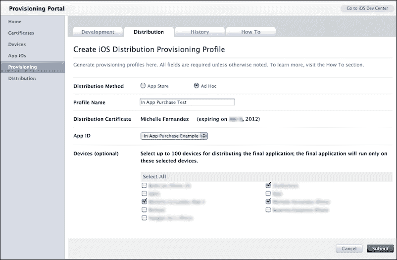
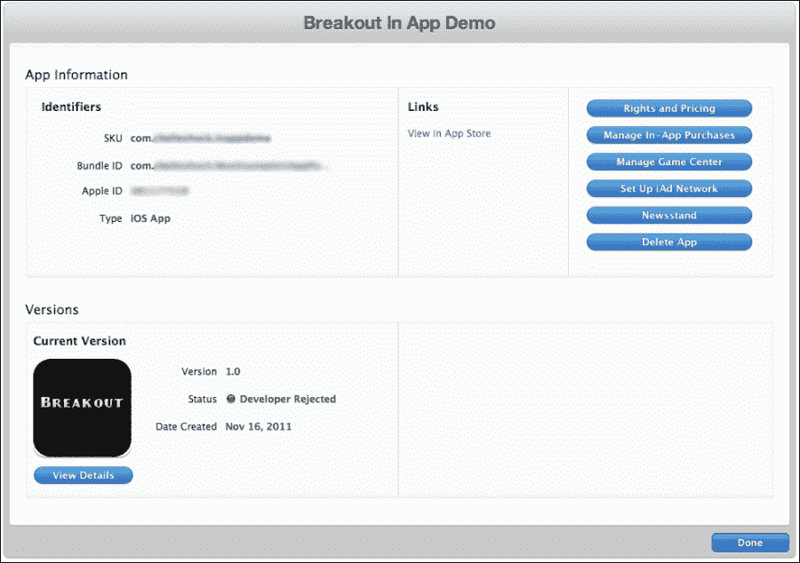
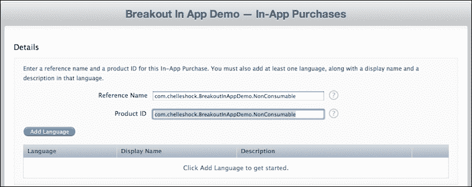
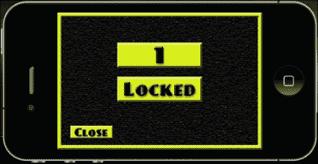
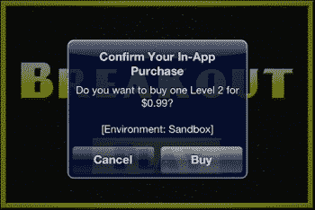
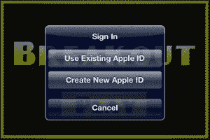
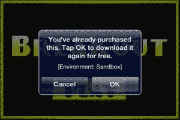

# 第十一章。实施应用内购买

> *应用内购买是一个可选功能，开发者可以使用它在应用内直接嵌入商店。有时，您可能希望扩展当前游戏中的一些功能，以保持您的消费者对游戏的兴趣。这是你的机会，也可能是你口袋里更多的收入！*

本章仅涉及苹果 iTunes 商店中针对 iOS 平台的应用内购买。想要在应用中实现应用内购买的安卓开发者可以参考一下。应用内购买的设置与 iOS 和安卓类似。但是，在您的`build.settings`文件和代码中需要设置一些差异。

### 注

这里使用的应用程序界面经常更新。但是，无论您使用什么界面，您都可以执行所有步骤。

我们将在本章中介绍以下内容:

*   消耗品、非消耗品和订购购买
*   进行交易
*   恢复购买的项目
*   正在初始化科罗娜的商店模块
*   在设备上创建和测试应用内购买

准备，准备，开始！

# 应用内购买的奇迹

实施应用内购买的目的是添加一个应用内支付功能，为您的游戏中可使用的增强功能或附加内容收取费用。以下是合并此功能的选项:

*   一款提供新关卡包的游戏，可以在默认内容之外玩
*   一款免费的 mium 游戏，允许你购买虚拟货币，在游戏过程中创建或建立新的资产
*   添加额外的角色或特殊的电源来增强游戏元素

以下是一些可以通过应用内购买实现的示例。

应用内购买允许用户在应用内购买附加内容。应用商店仅管理交易信息。开发人员不能使用应用商店来交付内容。因此，如果你想传递内容，要么在你发送时将内容与你的应用捆绑在一起(它将在购买时解锁)，要么你必须开发自己的系统来下载数据。

## 应用内购买的类型

有几种应用内购买类型可以在你的应用中应用。

### 注

您可以在苹果网站[上找到更多关于应用内购买的信息，网址为:](https://developer.apple.com/library/ios/documentation/LanguagesUtilities/Conceptual/iTunesConnectInAppPurchase_Guide/Chapters/CreatingInAppPurchaseProducts.html)

*   **消耗品**:这些都是用户每次需要那个物品时必须购买的产品。它们通常是一次性的服务，比如应用程序中的钱，你需要为建造建筑的供应品付费。
*   **不可消费**:这些都是用户只需要购买一次的产品。这些可以是游戏中的附加关卡包。
*   **自动更新订阅**:这些产品允许用户在设定的时间段内购买应用内内容。自动更新订阅的一个例子是利用 iOS 内置的自动更新功能的杂志或报纸。
*   **免费订阅**:这些是用来在报摊投放免费订阅内容的。一旦用户注册免费订阅，它将在与该用户的苹果标识相关联的所有设备上可用。请注意，免费订阅不会过期，只能在支持报摊的应用程序中提供。
*   **非续订订阅**:与自动续订订阅类似，这些是非续订订阅，要求用户在每次订阅到期时进行续订。您的应用程序必须包含能够识别过期时间的代码。它还必须提示用户购买新的订阅。可自动更新的订阅消除了这些步骤。

# 科罗娜的商店模块

在您的应用程序中应用应用内购买可能是一个有点令人难以置信和繁琐的过程。将其与 Corona 集成需要调用商店模块:

```java
store = require("store")
```

商店模块已经合并到 Corona API 中，类似于脸书和游戏网络。你可以在[上找到更多关于科罗纳商店模块的信息。](http://docs.coronalabs.com/daily/guide/monetization/IAP/index.html)

## store.init()

处理应用程序的商店交易时，必须调用`store.init()`功能。它激活应用内购买，并允许您使用您指定的监听器功能接收回调:

```java
store.init( listener )
```

这里唯一的参数是`listener`。这是一个处理事务回调事件的函数。

以下模块确定了应用内购买过程中可能出现的交易状态。购买、恢复、取消和失败这四种不同的状态:

```java
function transactionCallback( event )
  local transaction = event.transaction
  if transaction.state == "purchased" then
    print("Transaction successful!")
    print("productIdentifier", transaction.productIdentifier)
    print("receipt", transaction.receipt)
    print("transactionIdentifier", transaction.identifier)
    print("date", transaction.date)

    elseif  transaction.state == "restored" then
    print("Transaction restored (from previous session)")
    print("productIdentifier", transaction.productIdentifier)
    print("receipt", transaction.receipt)
    print("transactionIdentifier", transaction.identifier)
    print("date", transaction.date)
    print("originalReceipt", transaction.originalReceipt)
    print("originalTransactionIdentifier", transaction.originalIdentifier)
    print("originalDate", transaction.originalDate)

    elseif transaction.state == "cancelled" then
    print("User cancelled transaction")

    elseif transaction.state == "failed" then
    print("Transaction failed, type:", transaction.errorType, transaction.errorString)

    else
    print("unknown event")
    end

    -- Once we are done with a transaction, call this to tell the store
    -- we are done with the transaction.
    -- If you are providing downloadable content, wait to call this until
    -- after the download completes.
    store.finishTransaction( transaction )
end

store.init( "apple", transactionCallback )
```

### 事件.交易

`event.transaction`对象包含交易。

事务对象支持以下只读属性:

*   `"state"`:这是一个包含事务状态的字符串。有效值为`"purchased"`、`"restored"`、`"cancelled"`和`"failed"`。
*   `"productIdentifier"`:这是交易关联的产品标识。
*   `"receipt"`:这是 App Store 返回的唯一收据。它以十六进制字符串的形式返回。
*   `"signature"`:这是用来验证购买的字符串。对于谷歌 Play，则由`"inapp_signature"`返回。在 iOS 中，它返回`nil`。
*   `"identifier"`:这是 App Store 返回的唯一交易标识。它是一个字符串。
*   `"date"`:这是交易发生的日期。
*   `"originalReceipt"`:这是 App Store 从最初购买尝试返回的唯一收据。它主要与恢复相关。它以十六进制字符串的形式返回。
*   `"originalIdentifier"`:这是商店从最初的购买尝试中返回的唯一交易标识符。这主要与恢复相关。它是一个字符串。
*   `"originalDate"`:这是原始交易的日期。它主要与恢复相关。
*   `"errorType"`:这是状态为`"failed"`(字符串)时出现的错误类型。
*   `"errorString"`:这是一条描述`"failed"`情况下出错的描述性错误信息。

## store.loadProducts()

`store.loadProducts()`功能检索可供出售商品的信息。该包括每个物品的价格、名称和描述:

```java
store.loadProducts( arrayOfProductIdentifiers, listener )
```

其参数如下:

*   `arrayOfProductIdentifiers`:这是一个数组，每个元素包含一个你想知道的应用内产品的产品标识的字符串
*   `listener`:这是一个回调函数，当商店完成产品信息的检索时调用

以下块显示了应用程序中可用的产品列表。关于产品的信息可以从`loadProductsCallback()`功能中检索到，并确定其是否有效:

```java
-- Contains your Product ID's set in iTunes Connect
local listOfProducts = 
{
  "com.mycompany.InAppPurchaseExample.Consumable",
  "com.mycompany.InAppPurchaseExample.NonConsumable",
  "com.mycompany.InAppPurchaseExample.Subscription",
}

function loadProductsCallback ( event )
  print("showing valid products", #event.products)
  for i=1, #event.products do
    print(event.products[i].title)
    print(event.products[i].description)
    print(event.products[i].price)
    print(event.products[i].productIdentifier)
  end

  print("showing invalidProducts", #event.invalidProducts)
    for i=1, #event.invalidProducts do
      print(event.invalidProducts[i])
end
end

store.loadProducts( listOfProducts, loadProductsCallback )
```

### 事件.产品

当`store.loadProducts()`返回一个请求的产品列表时，可以通过`event.products`属性访问产品信息数组。

产品信息，如标题、描述、价格和产品标识符，包含在一个表中:

```java
event.products
```

`event.products`数组中的每个条目支持以下字段:

*   `title`:这是项目的本地化名称
*   `description`:这是项目的本地化描述
*   `price`:这是一个物品的价格(作为数字)
*   `productIdentifier`:这是产品标识

### event.invalidProducts

当`store.loadProducts()`返回其请求的产品列表时，您请求的任何不可销售的产品将按阵列返回。您可以通过`event.invalidProducts`属性访问无效产品数组。

这是一个 Lua 数组，包含从`store.loadProducts()`请求的产品标识符字符串:

```java
event.invalidProducts
```

## store . can make purposes

如果允许购买，`store.canMakePurchases`函数返回真，否则返回假。Corona 的 API 可以检查购买是否可能。iOS 设备提供了禁用购买的设置。这可以用来避免意外购买应用程序。

```java
    if store.canMakePurchases then
      store.purchase( listOfProducts )
    else
      print("Store purchases are not available")
    end
```

## store.purchase()

`store.purchase()`功能在提供的产品列表上启动购买交易。

该功能将向商店发送购买请求。当商店完成交易处理时，将调用`store.init()`中指定的监听器:

```java
store.purchase( arrayOfProducts )
```

它唯一的参数是 `arrayOfProducts`，一个指定你想买的产品的数组:

```java
store.purchase{ "com.mycompany.InAppPurchaseExample.Consumable"}
```

## store.finishTransaction()

该功能通知应用商店交易完成。

处理完事务后，必须在事务对象上调用`store.finishTransaction()`。如果您不这样做，应用商店将认为您的交易被中断，并将尝试在下次应用程序启动时恢复交易。

语法:

```java
store.finishTransaction( transaction )
```

参数:

事务:属于您要标记为完成的事务的`transaction`对象。

示例:

```java
store.finishTransaction( transaction )
```

## store.restore()

任何先前购买的物品已经从设备上清除干净或升级到新设备上，都可以在用户账户上恢复，而无需再次支付产品费用。`store.restore()` API 启动这个过程。交易可以通过`store.init()`注册的`transactionCallback`监听器恢复。交易状态将为`"restored"`，然后您的应用程序可以使用交易对象的`"originalReceipt"`、`"originalIdentifier"`和`"originalDate"`字段:

```java
store.restore()
```

该模块将运行`transactionCallback()`功能，并确定之前是否从应用程序中购买过产品。如果结果为真，`store.restore()`将启动检索产品的过程，而不要求用户再次付费:

```java
function transactionCallback( event )
  local transaction = event.transaction
  if transaction.state == "purchased" then
    print("Transaction successful!")
    print("productIdentifier", transaction.productIdentifier)
    print("receipt", transaction.receipt)
    print("transactionIdentifier", transaction.identifier)
    print("date", transaction.date)

  elseif  transaction.state == "restored" then
    print("Transaction restored (from previous session)")
    print("productIdentifier", transaction.productIdentifier)
    print("receipt", transaction.receipt)
    print("transactionIdentifier", transaction.identifier)
    print("date", transaction.date)
    print("originalReceipt", transaction.originalReceipt)
    print("originalTransactionIdentifier", transaction.originalIdentifier)
    print("originalDate", transaction.originalDate)

  elseif transaction.state == "cancelled" then
      print("User cancelled transaction")

  elseif transaction.state == "failed" then
    print("Transaction failed, type:", transaction.errorType, transaction.errorString)

  else
    print("unknown event")
  end

  -- Once we are done with a transaction, call this to tell the store
  -- we are done with the transaction.
  -- If you are providing downloadable content, wait to call this until
  -- after the download completes.
  store.finishTransaction( transaction )
end

store.init( transactionCallback )
store.restore()
```

# 创建应用内购买

在继续阅读之前，请确保您知道如何从 iOS 配置门户创建应用程序标识和分发配置文件。此外，确保您知道如何在 iTunes Connect 中管理新应用程序。如果您不确定，请参考[第 10 章](10.html "Chapter 10. Optimizing, Testing, and Shipping Your Games")、*优化、测试和运输您的游戏*，了解更多信息。在创建应用内购买之前，您需要在应用中准备好以下事项:

*   已经为您的应用程序制作了分发证书。
*   应用程序的明确应用程序标识，例如`com.companyname.appname`。不要替换通配符(星号:“*”)。要使用应用内购买功能，捆绑包标识需要完全唯一。
*   An ad hoc Distribution Provisioning Profile (used to test In-App Purchases). When you're ready to submit an app with In-App Purchase, an App Store Distribution Provisioning Profile is required.

    

*   您的应用程序信息必须在 iTunes Connect 中设置。您不需要上传您的二进制文件来创建或测试应用内购买。
*   确保您与苹果公司签订了有效的 iOS 付费应用合同。如果没有，您需要在 iTunes Connect 主页上的**合同、税务和银行**中申请。您需要提供您的银行和税务信息，以便在您的应用程序中提供应用程序内购买。

# 行动时间-在 iTunes Connect 中创建应用内购买

我们将通过 iTunes Connect】实现应用内购买，并在一个示例应用程序中创建一个调用事务的场景。让我们创建将在应用内购买中使用的产品标识:

1.  登录 iTunes 连接。在主页上，选择**管理您的应用程序**。选择您计划添加应用内购买的应用。
2.  Once you're on the app summary page, click on the **Manage In-App Purchases** button and then click on the **Create New** button in the top-left corner.

    

3.  您将进入一个页面，显示您可以创建的应用内购买类型的摘要。本例中，选择了**非消耗性**。我们将创建一个只需购买一次的产品。
4.  In the next page is the area where you fill in the information about the product. The information applies to consumable, nonconsumable, and non-renewing subscription In-App Purchases. Fill the **Reference Name** and **Product ID** fields for your product. The Product ID needs to be a unique identifier and can be any alphanumeric sequence of letters and numbers (for example, `com.companyname.appname.productid`).

    ### 注

    自动续订订阅需要您生成共享机密。如果您要在您的应用程序中使用自动续订套餐，则在**管理应用程序内购买**页面上，单击**查看或生成共享机密**链接。您将被带到生成共享秘密的页面。点击**生成**按钮。共享密码将显示一个由 32 个随机生成的字母数字字符组成的字符串。当您选择自动续订订阅时，与其他应用内购买类型的区别在于，您必须选择产品自动续订的持续时间。有关自动续订套餐的更多信息，请访问[http://developer.apple.com/library/ios/iTunesConnectGuide](http://developer.apple.com/library/ios/iTunesConnectGuide)。

    

5.  Click on the **Add Language** button. Select the language that will be used for the In-App Purchase. Add a display name for your product and a short description about it. When you're done, click on the **Save** button.

    

6.  In **Pricing and Availability**, ensure that **Yes** is selected for **Cleared for Sale**. In the **Price Tier** drop-down menu, select the price you plan to sell your In-App Purchase for. In this example, **Tier 1** is selected. In **Screenshot for Review**, you'll need to upload a screenshot of your In-App Purchase. If you're testing on an ad hoc build, the screenshot is not necessary. Once you're ready for distribution, the screenshot is required so that the In-App Purchase can be reviewed upon submittal. Click on the **Save** button when done.

    

7.  You will see a summary of the In-App Purchase that you created on the next page. Click on the **Done** button if all of the information looks correct.

    

## *刚刚发生了什么？*

添加新的应用内购买是一个非常简单的过程。产品标识中包含的信息是交易过程中需要用到的信息。管理应用内购买的类型完全取决于你想在游戏中销售什么类型的产品。这个的例子演示了拿一个代表在游戏中购买/解锁一个新等级的不可消费产品的目的。对于想要销售关卡包的用户来说，这是一个常见的场景。

测试应用内购买无需填写您的申请。只需要在 iTunes Connect 中设置您的应用程序信息，以便您可以管理应用程序内购买的功能。

# 行动时间-使用 Corona 商店模块创建应用内购买

现在我们已经在 iTunes Connect 中为我们的应用内购买设置了产品标识，我们可以在我们的应用中实现它来购买我们要销售的产品。创建了一个示例菜单应用程序来演示如何在应用程序中购买级别。该应用程序在级别选择屏幕中包含两个级别。第一个默认可用。第二个是锁定的，只能通过 0.99 美元购买才能解锁。我们将创建一个级别选择屏幕，以便它以这种方式工作:

1.  在`Chapter 11`文件夹中，将`Breakout In-App Purchase Demo`项目文件夹复制到桌面。您可以从 Packt 出版网站下载本书附带的项目文件。您会注意到所需的配置、库、资源和`.lua`文件都包括在内。
2.  新建一个`levelselect.lua`文件，保存到项目文件夹。
3.  使用以下变量和保存/加载功能设置场景。最重要的变量是`local store = require("store")`，它调用应用内购买的商店模块:

    ```java
    local composer = require( "composer" )
    local scene = composer.newScene()

    local ui = require("ui")
    local movieclip = require( "movieclip" )
    local store = require("store")

    ---------------------------------------------------------------------------------
    -- BEGINNING OF YOUR IMPLEMENTATION
    ---------------------------------------------------------------------------------

    local menuTimer

    -- AUDIO
    local tapSound = audio.loadSound( "tapsound.wav" )

    --***************************************************

    -- saveValue() --> used for saving high score, etc.

    --***************************************************
    local saveValue = function( strFilename, strValue )
      -- will save specified value to specified file
      local theFile = strFilename
      local theValue = strValue

      local path = system.pathForFile( theFile, system.DocumentsDirectory )

      -- io.open opens a file at path. returns nil if no file found
      local file = io.open( path, "w+" )
      if file then
        -- write game score to the text file
        file:write( theValue )
        io.close( file )
      end
    end

    --***************************************************

    -- loadValue() --> load saved value from file (returns loaded value as string)

    --***************************************************
    local loadValue = function( strFilename )
      -- will load specified file, or create new file if it doesn't exist

      local theFile = strFilename

      local path = system.pathForFile( theFile, system.DocumentsDirectory )

      -- io.open opens a file at path. returns nil if no file found
      local file = io.open( path, "r" )
      if file then
        -- read all contents of file into a string
        local contents = file:read( "*a" )
        io.close( file )
        return contents
      else
        -- create file b/c it doesn't exist yet
        file = io.open( path, "w" )
        file:write( "0" )
        io.close( file )
        return "0"
      end
    end

    -- DATA SAVING
    local level2Unlocked = 1
    local level2Filename = "level2.data"
    local loadedLevel2Unlocked = loadValue( level2Filename )
    ```

4.  创建事件，删除`"mainmenu"`、`"level1"`和`"level2"`场景:

    ```java
    -- Called when the scene's view does not exist:
    function scene:create( event )
      local sceneGroup = self.view

      -- completely remove maingame and options
      composer.removeScene( "mainmenu" )
      composer.removeScene( "level1" )
      composer.removeScene( "level2" )

      print( "\nlevelselect: create event" )
    end
    ```

5.  接下来，创建`show()`事件和一个数组，该数组包含在 iTunes Connect 中设置为应用内购买的一串**产品 ID【T3:

    ```java
    function scene:show( event )
      local sceneGroup = self.view

      print( "levelselect: show event" )

      local listOfProducts = 
      {
        -- These Product IDs must already be set up in your store
        -- Replace Product ID with a valid one from iTunes Connect
        "com.companyname.appname.NonConsumable", -- Non Consumable In-App Purchase
      }
    ```** 
6.  为`validProducts`和`invalidProducts`添加一个局部空白表格。创建一个名为`unpackValidProducts()`的本地函数，检查有效和无效的产品标识:

    ```java
      local validProducts = {} 
        local invalidProducts = {}

        local unpackValidProducts = function()
            print ("Loading product list")
            if not validProducts then
                native.showAlert( "In-App features not available", "initStore() failed", { "OK" } )
            else
              print( "Found " .. #validProducts .. " valid items ")
                for i=1, #invalidProducts do
                  -- Debug:  display the product info 
                    native.showAlert( "Item " .. invalidProducts[i] .. " is invalid.",{ "OK" } )
                    print("Item " .. invalidProducts[i] .. " is invalid.")
                end

            end
        end
    ```

7.  用`event`参数创建一个名为`loadProductsCallback()`的局部函数。设置接收带有打印报表的产品信息的处理程序:

    ```java
      local loadProductsCallback = function( event )
        -- Debug info for testing
            print("loadProductsCallback()")
            print("event, event.name", event, event.name)
            print(event.products)
            print("#event.products", #event.products)

            validProducts = event.products
            invalidProducts = event.invalidProducts    
            unpackValidProducts ()
        end
    ```

8.  用和 `event`参数创建一个名为`transactionCallback()`的局部函数。为每一个`transaction.state`事件添加几个预期发生的结果案例。当商店完成交易后，在功能结束前调用`store.finishTransaction(event.transaction)`。设置另一个名为`setUpStore()`的本地函数，用`event`参数调用`store.loadProducts(listOfProducts, loadProductsCallback)` :

    ```java
      local transactionCallback = function( event )
        if event.transaction.state == "purchased" then 
          print("Transaction successful!")
            saveValue( level2Filename, tostring(level2Unlocked) 
        elseif event.transcation.state == "restored" then 
          print("productIdentifier", event.transaction.productIdentifier)
          print("receipt", event.transaction.receipt)
          print("transactionIdentifier", event.transaction.transactionIdentifier)
          print("date", event.transaction.date)
          print("originalReceipt", event.transaction.originalReceipt)
        elseif event.transaction.state == "cancelled" then
          print("Transaction cancelled by user.")
        elseif event.transaction.state == "failed" then
          print("Transaction failed, type: ", event.transaction.errorType, event.transaction.errorString)
          local alert = native.showAlert("Failed ", infoString,{ "OK" })
        else
          print("Unknown event")
          local alert = native.showAlert("Unknown ", infoString,{ "OK" })
        end
        -- Tell the store we are done with the transaction.
        store.finishTransaction( event.transaction )
        end

        local setupMyStore = function(event)
          store.loadProducts( listOfProducts, loadProductsCallback)
          print ("After store.loadProducts(), waiting for callback")
        end
    ```

9.  设置背景显示对象和关卡 **1** 按钮:

    ```java
      local backgroundImage = display.newImageRect( "levelSelectScreen.png", 480, 320 )
      backgroundImage.x = 240; backgroundImage.y = 160
      sceneGroup:insert( backgroundImage )

      local level1Btn = movieclip.newAnim({"level1btn.png"}, 200, 60)
      level1Btn.x = 240; level1Btn.y = 100
      sceneGroup:insert( level1Btn )

      local function level1touch( event )
        if event.phase == "ended" then
          audio.play( tapSound )
          composer.gotoScene( "loadlevel1", "fade", 300  )
        end
      end
      level1Btn:addEventListener( "touch", level1touch )
      level1Btn:stopAtFrame(1)
    ```

10.  设置等级 **2** 按钮位置:

    ```java
      -- LEVEL 2
      local level2Btn = movieclip.newAnim({"levelLocked.png","level2btn.png"}, 200, 60)
      level2Btn.x = 240; level2Btn.y = 180
      sceneGroup:insert( level2Btn )
    ```

11.  使用本地`onBuyLevel2Touch(event)`功能并创建一个`if`语句来检查`event.phase == ended and level2Unlocked ~= tonumber(loadedLevel2Unlocked)`，以便场景变为`mainmenu.lua` :

    ```java
      local onBuyLevel2Touch = function( event )
        if event.phase == "ended" and level2Unlocked ~= tonumber(loadedLevel2Unlocked) then
          audio.play( tapSound )
          composer.gotoScene( "mainmenu", "fade", 300  )
    ```

12.  在同一个语句中，用`product`参数创建一个名为`buyLevel2()`的本地函数来调用`store.purchase()`函数:

    ```java
        local buyLevel2 = function ( product ) 
          print ("Congrats! Purchasing " ..product)

         -- Purchase the item
          if store.canMakePurchases then 
            store.purchase( {validProducts[1]} ) 
          else
            native.showAlert("Store purchases are not available, please try again later",  { "OK" } ) – Will occur only due to phone setting/account restrictions
          end 
        end 
        -- Enter your product ID here
         -- Replace Product ID with a valid one from iTunes Connect
     buyLevel2("com.companyname.appname.NonConsumable")

    ```

13.  交易完成后，添加`elseif`语句，检查二级何时购买并解锁:

    ```java
        elseif event.phase == "ended" and level2Unlocked == tonumber(loadedLevel2Unlocked) then
          audio.play( tapSound )
          composer.gotoScene( "loadlevel2", "fade", 300  )
        end
      end
      level2Btn:addEventListener( "touch", onBuyLevel2Touch )

      if level2Unlocked == tonumber(loadedLevel2Unlocked) then
        level2Btn:stopAtFrame(2)
      end
    ```

14.  使用`store.init()`激活应用内购买，并调用`transactionCallback()`作为参数。也可以用 500 毫秒的计时器呼叫`setupMyStore()`:

    ```java
      store.init( "apple", transactionCallback) 
        timer.performWithDelay (500, setupMyStore)
    ```

15.  创建**关闭**用户界面按钮和带有事件参数的名为`onCloseTouch()`的本地功能。释放**关闭**按钮后，具有功能过渡场景至`loadmainmenu.lua`。用`end` :

    ```java
      local closeBtn

      local onCloseTouch = function( event )
        if event.phase == "release" then

          audio.play( tapSound )
          composer.gotoScene( "loadmainmenu", "fade", 300  )

        end
      end

      closeBtn = ui.newButton{
        defaultSrc = "closebtn.png",
        defaultX = 100,
        defaultY = 30,
        overSrc = "closebtn.png",
        overX = 105,
        overY = 35,
        onEvent = onCloseTouch,
        id = "CloseButton",
        text = "",
        font = "Helvetica",
        textColor = { 255, 255, 255, 255 },
        size = 16,
        emboss = false
      }

      closeBtn.x = 80; closeBtn.y = 280
      closeBtn.isVisible = false
      sceneGroup:insert( closeBtn )

      menuTimer = timer.performWithDelay( 200, function() closeBtn.isVisible = true; end, 1 )

    end
    ```

    结束`enterScene()`活动
16.  创建`hide()`和`destroy()`事件。在`hide()`事件中，取消`menuTimer`计时器。将所有事件监听器添加到场景事件和`return scene` :

    ```java
    -- Called when scene is about to move offscreen:
    function scene:hide()

      if menuTimer then timer.cancel( menuTimer ); end

        print( "levelselect: hide event" )

      end

    -- Called prior to the removal of scene's "view" (display group)
    function scene:destroy( event )

      print( "destroying levelselect's view" )
    end

    -- "create" event is dispatched if scene's view does not exist
    scene:addEventListener( "create", scene )

    -- "show" event is dispatched whenever scene transition has finished
    scene:addEventListener( "show", scene )

    -- "hide" event is dispatched before next scene's transition begins
    scene:addEventListener( "hide", scene )

    -- "destroy" event is dispatched before view is unloaded, which can be
    scene:addEventListener( "destroy", scene )

    return scene
    ```

17.  Save the file and run the project in the Corona simulator. When you select the **Play** button, you will notice a **1** button and a **Locked** button on the level select screen. When you press the **Locked** button, it calls the store to make a transaction. You will notice a print statement in the terminal that displays what **Product ID** is being referred to for purchase. Full In-App Purchase features cannot be tested in the simulator. You will have to create a distribution build and upload it on an iOS device to initiate a purchase in the store.

    

## *刚刚发生了什么？*

在这个例子中，我们使用了 BeebeGames 类中的`saveValue()`和`loadValue()`函数来实现我们的锁定级别如何使用电影剪辑作为按钮从锁定模式变为解锁模式。`local listOfProducts`中的数组以字符串格式显示**产品标识**。本示例中的产品标识必须是不可总结的应用内购买类型，并且必须是 iTunes Connect 中的现有产品标识。

`unpackValidProducts()`功能检查应用内购买中有多少有效和无效项目。`loadProductsCallback()`功能接收店铺内的产品信息。`transactionCallback(event)`功能检查每个状态:`"purchased"`、`"restored"`、`"cancelled"`和`"failed"`。当应用内购买达到`"purchased"`状态时，调用`saveValue()`功能改变`level2.data`的值。交易完成后，需要调用`store.finishTransaction(event.transaction)`告诉店铺你的购买已经完成。

`setupMyStore(event)`函数调用`store.loadProducts(listOfProducts, loadProductsCallback)`并检查应用程序中可用的产品标识。一旦`store.init(transactionCallback)`被初始化并且`setupMyStore()`被调用，事件就被处理。

`onBuyLevel2Touch(event)`功能允许我们检查何时为锁定级别进行了应用内购买。当用户能够购买并且接受应用内购买时，交易被处理，并且`level2Unlocked`的值将匹配`tonumber(loadedLevel2Unlocked)`的值。一旦产品标识返回有效，`buyLevel2(product)`功能将使用`store.purchase()`验证购买的产品。

应用内购买后，屏幕切换到主菜单，允许**锁定**按钮切换到等级 **2** 按钮。一旦按钮变为第 2 帧，就可以访问第 2 层。

## 拥有一个围棋英雄——处理多个产品标识

现在您知道如何为一个产品创建应用内购买，尝试将多个产品添加到同一个应用中。场景是开放式的。

您可以添加以下内容:

*   更多购买级别
*   用户可以扮演各种角色，就像你的游戏有一个主角一样
*   应用程序的新背景场景

你如何为你的商店处理新产品取决于你。

# 测试应用内购买

您会希望确保购买正常进行。苹果提供了一个沙盒环境，允许你测试你的应用程序内购买。沙盒环境使用与应用商店相同的模型，但不处理实际支付。交易返回时就像付款处理成功一样。在提交给苹果公司审查之前，需要在沙盒环境中测试应用内购买。

在沙盒环境中测试时，您需要创建一个不同于当前 iTunes Connect 帐户的单独用户测试帐户。不允许使用您当前的帐户在沙箱中测试您的商店。

## 用户测试账户

当您登录到您的 iTunes Connect 帐户时，您必须从主页选择**管理用户**链接。在**选择用户类型**页面选择**测试用户**。添加新用户，并确保测试帐户使用的电子邮件地址不与任何其他苹果帐户相关联。当测试应用内购买时，所有测试帐户应仅在测试环境中使用。填写完所有信息后，点击**保存**按钮。

创建用户测试帐户后，您必须确保已经在设备的**商店**设置中注销了您的苹果帐户。这将防止在测试应用内购买时使用非测试帐户。只有在应用内购买沙箱中提示您测试应用时，才允许您登录用户测试帐户。在应用程序启动之前，不要登录您的测试帐户。这将防止它使您的测试帐户无效。

# 行动时间-使用突破性应用内购买演示测试应用内购买

在您可以在 iOS 设备上测试应用内购买之前，请确保您在 iTunes Connect 中有一个测试用户帐户。此外，请确保您已经使用应用程序的临时分发配置文件创建了分发版本，以测试应用程序内购买的功能。如果您遵循本章前面的所有步骤，则通过商店测试购买将会相应地起作用:

1.  在电晕模拟器中，创建一个分线应用内购买演示的分发版本。编译好构建后，在您的 iOS 设备上上传构建。
2.  保持您的设备连接到您的机器，并启动 Xcode。从工具栏中，转到**窗口** | **组织者**。进入**管理器**后，在**设备**部分选择连接的设备，然后选择**控制台**。这将允许您检查设备的控制台输出，以捕获来自代码(即打印语句)和任何应用程序崩溃的调试消息。
3.  Before launching the application, you'll need to select the **Settings** icon on your device. Scroll up until you see the **Store** icon and select it.

    

4.  Sign out of your iTunes Store account if you're logged in, so that you can test In-App Purchases in the sandbox environment.

    

5.  Launch the Breakout In-App Purchase Demo from your device. Select the **Play** button and then select the **Locked** button. The screen will transition back to the main menu, and a window will pop up to confirm your In-App Purchase. Press **OK** to continue with the purchase.

    

6.  Next, you will be greeted with another window to sign in with your Apple ID. This is where you will log in with the test user account you created in iTunes Connect. Do not sign in with your actual Apple account that was used to log in to iTunes Connect.

    

7.  Once you've logged in, select the **Play** button again. You will notice that the **2** button has been unlocked. When you select it, you will have access to that scene.

    

8.  Exit the app and refer to the console. You will notice the output from the device and some familiar print statements from your code. The console log displays the Product ID used for the In-App Purchase and informs you whether it is valid and whether the transaction is successful.

    

9.  If you want to ensure that the In-App Purchase actually worked, delete the application from your device and log out of your user test account. Upload the same build on your device—there's no need to create a new one. Launch the application and run the In-App Purchase again. Log in using the same user test account. You should receive a pop-up window that mentions that you've already purchased the product, and asks you whether you want to download it again for free. Receiving a notification means your In-App Purchase was successful.

    

## *刚刚发生了什么？*

正确遵循应用内购买测试步骤非常重要。为了确保您在沙盒环境中获得准确的结果，从**商店**设置中注销您的苹果帐户是整个过程的关键。

一旦您启动应用程序并通过按锁定按钮调用商店功能，您将注意到应用内购买的显示名称和价格。如果您正确实施了它，它应该与您在 iTunes Connect 中创建的内容相匹配。

当您使用您在 iTunes Connect 中创建的测试用户帐户登录时，假设苹果方面没有服务器问题或设备上没有连接问题，交易应该不会出现任何错误。级别选择屏幕上的级别 2 将被解锁并可访问。恭喜你！您已经创建了应用内购买。

## 玩一把围棋——使用其他应用内购买类型

在突破性应用内购买演示中，我们更加关注不可总结的应用内购买。尝试将消耗品、自动续订或非续订订阅与您自己的应用程序集成。

以消费品为特色的应用程序是需要货币才能在自由游戏环境中购买或制作东西的游戏。订阅产品可以专注于永无止境的游戏，并不断更新新的水平或游戏，可能需要在线服务器在多人环境中互动。看你能想出什么！

## 突击测验–关于应用内购买的所有内容

Q1。什么是不可消费的购买？

1.  用户只需购买一次的产品。
2.  用户每次需要物品时需要购买的产品。
3.  允许用户在设定的时间内购买内容的产品。
4.  每次到期时都需要用户续订的订阅。

Q2。测试应用内购买的真实情况是什么？

1.  您需要随时登录您的帐户。
2.  您的苹果帐户用于测试应用内购买。
3.  在应用内购买沙箱中出现提示时，登录您的用户测试帐户。
4.  以上都不是。

Q3。必须使用哪种类型的供应配置文件来测试应用内购买？

1.  开发配置文件。
2.  临时分发设置配置文件。
3.  应用商店分发配置文件。
4.  以上都不是。

# 总结

我们终于可以看到隧道尽头的光了。到目前为止，你应该已经知道如何在你的游戏中实现应用内购买。在沙盒环境中组织、设置代码和测试准确的购买是一个非常漫长的过程。

本章讲述了以下内容:

*   如何在 iTunes Connect 中为应用内购买设置产品标识
*   使用 Corona 的商店模块实现采购项目
*   在 iTunes Connect 中添加测试用户帐户
*   在设备上测试应用内购买

掌握应用内采购的概念可能需要一些时间。最好研究样本代码，并回顾与 Corona 商店模块相关的功能。

请查看苹果的*应用内购买编程指南*，网址为:[https://developer . Apple . com/library/IOs/documents/networking internet/conceptive/StoreKitGuide/StoreKitGuide . pdf](https://developer.apple.com/library/ios/documentation/NetworkingInternet/Conceptual/StoreKitGuide/StoreKitGuide.pdf)和 Corona Labs 网站的 API 参考部分中的应用内购买:以获取与此主题相关的更多参考。

经过 11 章，我们已经到了这本书的结尾。您现在已经获得了足够的知识来创建自己的应用程序，以便在苹果应用商店或谷歌 Play 商店销售。希望你获得的所有信息都有帮助。我期待听到关于你使用电晕 SDK 开发的游戏！