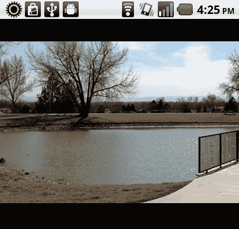
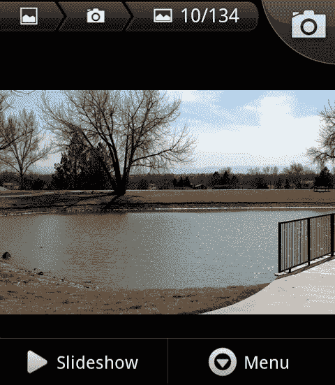
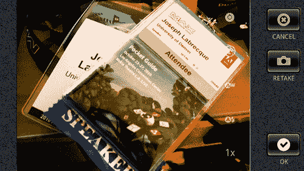
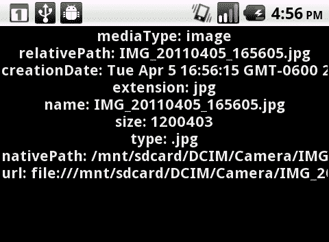
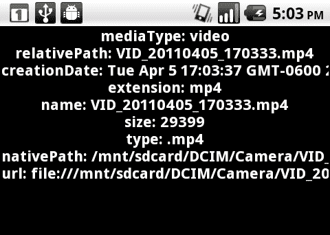

# 第四章。视觉和音频输入:摄像头和麦克风接入

本章将涵盖以下食谱:

*   检测摄像头和麦克风支架
*   使用传统的相机应用编程接口保存捕获的图像
*   使用移动相机应用编程接口保存拍摄的照片
*   使用移动摄像机应用编程接口保存捕获的视频
*   使用设备麦克风监控音频样本数据
*   录制麦克风音频样本数据

# 简介

相机和麦克风是大多数移动设备的标准配件，安卓设备也不例外。本章将涵盖从访问相机和拍摄照片、录制视频数据，以及对从设备麦克风捕获的原始音频进行编码并将其编码为 WAV 或 MP3 以在其他平台和系统上使用的所有内容。

本章中的所有方法都表示为纯 ActionScript 3 类，不依赖于外部库或 Flex 框架。因此，我们将能够在任何我们希望的 IDE 中使用这些示例。

# 检测摄像头和麦克风支架

几乎所有安卓设备都配备了摄像头硬件来捕捉静态图像和视频。现在许多设备都有前置和后置摄像头。通过我们的应用程序了解默认设备摄像头是否可用非常重要。我们永远不应该假设某些硬件项目的可用性，无论它们在设备中有多普遍。

同样，当我们捕捉视频或音频数据时，我们也希望确保能够访问设备麦克风。

## 怎么做...

我们将确定哪些音频和视频应用编程接口在我们的安卓设备上可用:

1.  首先，将以下类导入到您的项目中:

    ```java
    import flash.display.Sprite;
    import flash.display.Stage;
    import flash.display.StageAlign;
    import flash.display.StageScaleMode;
    import flash.media.Camera;
    import flash.media.CameraUI;
    import flash.media.Microphone;
    import flash.text.TextField;
    import flash.text.TextFormat;

    ```

2.  声明一个`TextField`和`TextFormat`对象对，以允许在设备上显示输出:

    ```java
    private var traceField:TextField;
    private var traceFormat:TextFormat;

    ```

3.  我们现在将设置我们的`TextField`，应用`TextFormat`，并将`TextField`添加到`DisplayList`。在这里，我们创建一个方法来为我们执行所有这些操作:

    ```java
    protected function setupTextField():void {
    traceFormat = new TextFormat();
    traceFormat.bold = true;
    traceFormat.font = "_sans";
    traceFormat.size = 44;
    traceFormat.align = "center";
    traceFormat.color = 0x333333;
    traceField = new TextField();
    traceField.defaultTextFormat = traceFormat;
    traceField.selectable = false;
    traceField.mouseEnabled = false;
    traceField.width = stage.stageWidth;
    traceField.height = stage.stageHeight;
    addChild(traceField);
    }

    ```

4.  现在，我们必须检查每个对象的`isSupported`属性。我们在这里创建了一个方法来执行这三个步骤，并将结果写入一个`TextField:`

    ```java
    protected function checkCamera():void {
    traceField.appendText("Camera: " + Camera.isSupported + "\n");
    traceField.appendText("CameraUI: " + CameraUI.isSupported + "\n");
    traceField.appendText("Microphone: " + Microphone.isSupported + "\n");
    }

    ```

5.  We now know the capabilities of video and audio input for a particular device and can react accordingly:

    

## 它是如何工作的...

这三个类都有一个属性`isSupported`，我们可以随时调用它来验证特定安卓设备上的支持。传统的`Camera`和移动专用的`CameraUI`都指的是同一个硬件相机，但是处理闪光灯和相机本身之间的交互是完全不同的类，因为`CameraUI`依赖于默认的设备相机应用程序来完成所有的拍摄，`Camera`只在闪光灯环境中工作。

### 注

传统的`Microphone`对象也是这样支持的。

## 还有更多...

需要注意的是，尽管许多安卓设备配备了多个摄像头，但只有主摄像头(和麦克风)会暴露在我们的应用程序中。随着安卓的发展，该平台可能会增加对多摄像头和其他传感器的支持。

# 使用传统相机 API 保存拍摄图像

当通过 Flash player 为网络编写应用程序时，或者为带有 AIR 的桌面编写应用程序时，我们可以通过 ActionScript 访问`Camera`类。这使我们能够访问连接到我们正在使用的任何机器上的不同摄像头。在安卓上，我们仍然可以使用`Camera`类访问设备上的默认摄像头，并访问它为各种事情提供的视频流。在这个例子中，我们将简单地从`Camera`提要中抓取一个静止图像，并将其保存到安卓`CameraRoll`中。

## 怎么做...

我们将构建一个`Video`对象来绑定`Camera`流，并使用`BitmapData`方法来捕捉并保存我们使用移动`CameraRoll` API: 渲染的图像

1.  至少，我们需要将以下类导入到我们的项目中:

    ```java
    import flash.display.BitmapData;
    import flash.display.Sprite;
    import flash.display.Stage;
    import flash.display.StageAlign;
    import flash.display.StageScaleMode;
    import flash.events.TouchEvent;
    import flash.media.Camera;
    import flash.media.CameraRoll;
    import flash.media.Video;
    import flash.ui.Multitouch;
    import flash.ui.MultitouchInputMode;

    ```

2.  现在我们必须声明相机访问和文件引用所必需的对象实例:

    ```java
    private var video:Video;
    private var camera:Camera;
    private var capture:BitmapData;
    private var cameraRoll:CameraRoll;
    private var videoHolder:Sprite;

    ```

3.  初始化一个`Video`对象，传入所需的宽度和高度，并将其添加到`DisplayList:`

    ```java
    protected function setupVideo():void {
    videoHolder = new Sprite();
    videoHolder.x = stage.stageWidth/2;
    videoHolder.y = stage.stageHeight/2;
    video = new Video(360, 480);
    videoHolder.addChild(video);
    video.x = -180;
    video.y = -240;
    videoHolder.rotation = 90;
    addChild(videoHolder);
    }

    ```

4.  在将`Camera`连接到`DisplayList:`

    ```java
    protected function setupCamera():void {
    camera = Camera.getCamera();
    camera.setMode(480, 360, 24);
    video.attachCamera(camera);
    }

    ```

    上的我们的`Video`之前，初始化一个`Camera`对象并使用`setMode`来指定宽度、高度和每秒帧数
5.  我们现在将向`Stage`注册一个类型为`TOUCH_TAP`的`TouchEvent`收听者。这将使用户能够通过点击设备屏幕拍摄相机显示的快照:

    ```java
    protected function registerListeners():void {
    Multitouch.inputMode = MultitouchInputMode.TOUCH_POINT;
    stage.addEventListener(TouchEvent.TOUCH_TAP, saveImage);
    }

    ```

6.  为了从相机馈送中捕获图像，我们将初始化我们的`BitmapData`对象，匹配我们的`Video`对象的宽度和高度，并采用`draw`方法将`Video`像素转换为`BitmapData`。
7.  To save our acquired image to the device, we must initialize a `CameraRoll` object and invoke `addBitmapData()`, passing in the `BitmapData` object we have created using `Video` object pixels. We will also determine whether or not this device supports the `addBitmapData()` method by verifying `CameraRoll.supportsAddBitmapData` is equal to `true:`

    ```java
    protected function saveImage(e:TouchEvent):void {
    capture = new BitmapData(360, 480);
    capture.draw(video);
    cameraRoll = new CameraRoll();
    if(CameraRoll.supportsAddBitmapData){
    cameraRoll.addBitmapData(capture);
    }
    }

    ```

    

8.  If we now check our Android Gallery, we will find the saved image:

    

## 它是如何工作的...

这其中的大部分都与桌面上正常的闪存平台开发完全一样。将`Camera`附加到`Video`上，将`Video`添加到`DisplayList`上，然后针对您的特定应用做任何您需要的事情。在这种情况下，我们只需捕获显示为`BitmapData`的内容。

然而`CameraRoll`类是移动应用程序开发专用的，因为它总是引用设备摄像头存储其生成的照片的目录。如果您想将这些图像保存在不同的目录中，我们可以使用`File`或`FileReference`对象来实现，但这需要用户执行更多的步骤。

请注意，在使用`Camera`类时，相机的硬件方向是横向。我们可以通过将应用程序限制为横向模式，或者通过我们在示例类中执行的旋转和额外操作来处理这个问题。在本例中，我们使用`videoHolder.rotation`对图像进行了 90 度旋转，以解释在`BitmapData`中读取时的偏移。根据任何特定应用程序对此的处理方式，可能没有必要这样做。

## 还有更多...

传统摄像机对象的其他使用案例包括向 Flash Media Server 发送视频流以进行直播、增强现实应用程序或实时对等聊天。

## 另见...

为了访问摄像头和存储，我们需要为`CAMERA`和`WRITE_EXTERNAL_STORAGE`添加一些安卓权限。参考[第 11 章](11.html "Chapter 11. Final Considerations: Application Compilation and Distribution")、*最终考虑事项:应用程序编译和分发*了解如何进行。

# 使用手机摄像头应用编程接口保存拍摄的照片

使用新的`CameraUI`应用编程接口(可在移动空气软件开发工具包中获得)，我们可以执行正常`Camera`应用编程接口的替代捕获过程。`Mobile CameraUI`类将使用默认的安卓相机应用程序和我们的定制应用程序来拍摄照片。

## 怎么做...

我们将设置一个`CameraUI`对象来调用本机安卓相机来拍摄照片:

1.  首先，将以下类导入到您的项目中:

    ```java
    import flash.display.Sprite;
    import flash.display.StageAlign;
    import flash.display.StageScaleMode;
    import flash.events.Event;
    import flash.events.MediaEvent;
    import flash.events.TouchEvent;
    import flash.media.CameraUI;
    import flash.media.MediaType;
    import flash.media.MediaPromise;
    import flash.ui.Multitouch;
    import flash.ui.MultitouchInputMode;
    import flash.text.TextField;
    import flash.text.TextFormat;

    ```

2.  声明 aTextField 和`TextFormat`对象对，以允许在设备上进行可见输出。对于本例，还必须声明一个`CameraUI`对象:

    ```java
    private var camera:CameraUI;
    private var traceField:TextField;
    private var traceFormat:TextFormat;

    ```

3.  我们现在将设置我们的`TextField`，应用`TextFormat`，并将`TextField`添加到`DisplayList`。这里，我们创建一个方法来为我们执行所有这些操作:

    ```java
    protected function setupTextField():void {
    traceFormat = new TextFormat();
    traceFormat.bold = true;
    traceFormat.font = "_sans";
    traceFormat.size = 22;
    traceFormat.align = "center";
    traceFormat.color = 0xFFFFFF;
    traceField = newTextField();
    traceField.defaultTextFormat = traceFormat;
    traceField.selectable = false;
    traceField.mouseEnabled = false;
    traceField.width = stage.stageWidth;
    traceField.height = stage.stageHeight;
    addChild(traceField);
    }

    ```

4.  实例化一个新的`CameraUI`实例，该实例将用于启动设备摄像头应用程序，并将文件信息返回给我们。如果特定设备不支持`CameraUI`对象，则会向我们的`TextField`输出一条消息，指出这一点:

    ```java
    protected function setupCamera():void {
    if(CameraUI.isSupported) {
    camera = new CameraUI();
    registerListeners();
    }else{
    traceField.appendText("CameraUI is not supported...");
    }
    }

    ```

5.  向`CameraUI`对象添加一个事件监听器，这样我们就知道捕获何时完成。我们还将在`Stage`上注册一个触摸事件来启动捕获:

    ```java
    protected function registerListeners():void {
    Multitouch.inputMode = MultitouchInputMode.TOUCH_POINT;
    camera.addEventListener(MediaEvent.COMPLETE, photoReady);
    stage.addEventListener(TouchEvent.TOUCH_TAP, launchCamera);
    }

    ```

6.  要在我们的安卓设备上使用默认的相机应用程序，我们需要调用`launch`方法，传入`MediaType.IMAGE`常量来指定我们想要拍摄的照片:

    ```java
    protected function launchCamera(e:TouchEvent):void {
    camera.launch(MediaType.IMAGE);
    }

    ```

7.  Now, the default Android camera will initialize, allowing the user to capture a photograph. Once the user hits **OK**, focus will return to our application.

    

8.  最后，一旦我们完成捕获过程，一个类型为`MediaEvent.COMPLETE`的事件将会触发，调用我们的`photoReady`方法。由此，我们可以确定我们拍摄的照片的某些细节。

    ```java
    protected function photoReady(e:MediaEvent):void {
    var promise:MediaPromise = e.data;
    traceField.appendText("mediaType: " + promise.mediaType + "\n");
    traceField.appendText("relativePath: " + promise.relativePath + "\n");
    traceField.appendText("creationDate: " + promise.file.creationDate + "\n");
    traceField.appendText("extension: " + promise.file.extension + "\n");
    traceField.appendText("name: " + promise.file.name + "\n");
    traceField.appendText("size: " + promise.file.size + "\n");
    traceField.appendText("type: " + promise.file.type + "\n");
    traceField.appendText("nativePath: " + promise.file.nativePath + "\n");
    traceField.appendText("url: " + promise.file.url + "\n");
    }

    ```

9.  The output will look something like this:

    

## 它是如何工作的...

调用`CameraUI.launch`方法将请求安卓设备打开默认的相机应用程序，并允许用户拍照。完成拍摄过程并确认拍摄的照片后，焦点将与包含在`MediaEvent.COMPLETE`事件对象中的新文件的一组数据一起返回给我们的应用程序。

此时，我们的应用程序可以用返回的数据做各种事情，甚至可以在应用程序中打开文件，假设文件类型可以由运行时加载和显示。

## 还有更多...

如果设备没有安装存储卡，默认相机应用程序将不会加载。还需要注意的是，如果设备在捕获过程中内存不足，安卓可能会在该过程完成之前终止我们的应用程序。

## 另见...

我们将在[第 5 章](05.html "Chapter 5. Rich Media Presentation: Working with Images, Video, and Audio") : *富媒体演示:处理图像、视频和音频中讨论通过 AIR for Android 应用程序显示图像。*

# 使用手机摄像头应用编程接口保存拍摄的视频

使用新的`CameraUI`应用编程接口(可在移动空气软件开发工具包中获得)，我们可以执行普通`Camera`应用编程接口的替代捕获过程。移动`CameraUI`类将使用默认的安卓相机应用，以及我们的定制应用来捕捉视频。

## 怎么做...

我们将设置一个`CameraUI`对象来调用原生安卓相机来捕捉视频:

1.  首先，将以下类导入到您的项目中:

    ```java
    import flash.display.Sprite;
    import flash.display.StageAlign;
    import flash.display.StageScaleMode;
    import flash.events.Event;
    import flash.events.MediaEvent;
    import flash.events.TouchEvent;
    import flash.media.CameraUI;
    import flash.media.MediaPromise;
    import flash.media.MediaType;
    import flash.text.TextField;
    import flash.text.TextFormat;
    import flash.ui.Multitouch;
    import flash.ui.MultitouchInputMode;

    ```

2.  声明一个`TextField`和`TextFormat`对象对，以允许在设备上显示输出。对于本例，还必须声明一个`CameraUI`对象:

    ```java
    private var camera:CameraUI;
    private var traceField:TextField;
    private var traceFormat:TextFormat;

    ```

3.  我们现在将设置我们的`TextField`，应用`TextFormat`，并将`TextField`添加到`DisplayList`。在这里，我们创建一个方法来为我们执行所有这些操作:

    ```java
    protected function setupTextField():void {
    traceFormat = new TextFormat();
    traceFormat.bold = true;
    traceFormat.font = "_sans";
    traceFormat.size = 22;
    traceFormat.align = "center";
    traceFormat.color = 0xFFFFFF;
    traceField = new TextField();
    traceField.defaultTextFormat = traceFormat;
    traceField.selectable = false;
    traceField.mouseEnabled = false;
    traceField.width = stage.stageWidth;
    traceField.height = stage.stageHeight;
    addChild(traceField);
    }

    ```

4.  实例化一个新的`CameraUI`实例，该实例将用于启动设备摄像头应用程序，并将文件信息返回给我们。如果特定设备不支持`CameraUI`对象，则会向我们的`TextField`输出一条消息，表明这一点。

    ```java
    protected function setupCamera():void {
    if(CameraUI.isSupported) {
    camera = new CameraUI();
    registerListeners();
    }else{
    traceField.appendText("CameraUI is not supported...");
    }
    }

    ```

5.  向`CameraUI`对象添加一个事件监听器，这样我们就知道捕获何时完成。我们还将在`Stage`上注册一个触摸事件来启动捕获:

    ```java
    protected function registerListeners():void {
    Multitouch.inputMode = MultitouchInputMode.TOUCH_POINT;
    camera.addEventListener(MediaEvent.COMPLETE, videoReady);
    stage.addEventListener(TouchEvent.TOUCH_TAP, launchCamera);
    }

    ```

6.  要在我们的安卓设备上使用默认的相机应用程序，我们需要调用`launch`方法，传入`MediaType.VIDEO`常量来指定我们希望捕获视频文件:

    ```java
    protected function launchCamera(e:TouchEvent):void {
    camera.launch(MediaType.VIDEO);
    }

    ```

7.  Now, the default Android camera will initialize, allowing the user to take some video. Once the user hits **OK**, focus will return to our application:

    

8.  最后，一旦我们完成捕获过程，一个类型为`MediaEvent.COMPLETE`的事件将会触发，调用我们的`videoReady`方法。由此，我们可以确定我们捕获的视频文件的某些细节:

    ```java
    protected function videoReady(e:MediaEvent):void {
    var promise:MediaPromise = e.data;
    traceField.appendText("mediaType: " + promise.mediaType + "\n");
    traceField.appendText("relativePath: " + promise.relativePath + "\n");
    traceField.appendText("creationDate: " + promise.file.creationDate + "\n");
    traceField.appendText("extension: " + promise.file.extension + "\n");
    traceField.appendText("name: " + promise.file.name + "\n");
    traceField.appendText("size: " + promise.file.size + "\n");
    traceField.appendText("type: " + promise.file.type + "\n");
    traceField.appendText("nativePath: " + promise.file.nativePath + "\n");
    traceField.appendText("url: " + promise.file.url + "\n");
    }

    ```

9.  The output will look something like this:

    

## 它是如何工作的...

调用`CameraUI.launch`方法将请求安卓设备打开默认的相机应用程序，并允许用户捕捉一些视频。完成捕获过程并确认捕获的视频文件后，焦点将与包含在`MediaEvent.COMPLETE`事件对象中的新文件的一组数据一起返回给我们的应用程序。

此时，我们的应用程序可以用返回的数据做各种事情，甚至可以在应用程序中打开文件，假设文件类型可以由运行时加载和显示。当涉及视频时，这一点非常重要，因为某些设备将使用各种编解码器来编码捕获的视频，并非所有设备都与 Flash Platform 兼容。

## 还有更多...

如果设备没有安装存储卡，默认相机应用程序将不会加载。还需要注意的是，如果设备在捕获过程中内存不足，安卓可能会在该过程完成之前终止我们的应用程序。

此外，除了`MediaEvent.COMPLETE`之外，我们还可以在这样的过程中使用许多其他事件。例如，注册类型为`Event.CANCEL`的事件监听器，以便对用户取消视频保存做出反应。

## 另见...

我们将在[第 5 章](05.html "Chapter 5. Rich Media Presentation: Working with Images, Video, and Audio")中讨论通过一个 AIR for Android 应用程序播放视频文件。

# 使用设备麦克风监控音频样本数据

通过监控从安卓设备麦克风通过动作脚本`Microphone`应用编程接口返回的样本数据，我们可以收集关于正在捕获的声音的许多信息，并在我们的应用程序中执行响应。这种输入可以用在实用程序、学习模块甚至游戏中。

## 怎么做...

我们将设置一个事件监听器来响应通过`Microphone` API 报告的样本数据:

1.  首先，将以下类导入到您的项目中:

    ```java
    import flash.display.Sprite;
    import flash.display.Stage;
    import flash.display.StageAlign;
    import flash.display.StageScaleMode;
    import flash.events.SampleDataEvent;
    import flash.media.Microphone;
    import flash.text.TextField;
    import flash.text.TextFormat;

    ```

2.  声明一个`TextField`和`TextFormat`对象对，以允许在设备上显示输出。对于本例，还必须声明一个`Microphone`对象:

    ```java
    private var mic:Microphone;
    private var traceField:TextField;
    private var traceFormat:TextFormat;

    ```

3.  我们现在将设置我们的`TextField`，应用`TextFormat`，并将`TextField`添加到`DisplayList`。在这里，我们创建一个方法来为我们执行所有这些操作:

    ```java
    protected function setupTextField():void {
    traceFormat = new TextFormat();
    traceFormat.bold = true;
    traceFormat.font = "_sans";
    traceFormat.size = 44;
    traceFormat.align = "center";
    traceFormat.color = 0x333333;
    traceField = new TextField();
    traceField.defaultTextFormat = traceFormat;
    traceField.selectable = false;
    traceField.mouseEnabled = false;
    traceField.width = stage.stageWidth;
    traceField.height = stage.stageHeight;
    addChild(traceField);
    }

    ```

4.  现在，我们必须实例化我们的`Microphone`对象，并根据我们的需求和偏好对`codec, rate, silenceLevel`进行调整，以此类推。这里我们使用`setSilenceLevel()`来确定我们的应用程序应该考虑的最小输入电平是“声音”，并且`rate`属性被设置为 **44** ，表示我们将以 44kHz 的速率捕获音频数据。将`setLoopBack ()`属性设置为假将阻止捕获的音频通过设备扬声器:

    ```java
    protected function setupMic():void {
    mic = Microphone.getMicrophone();
    mic.setSilenceLevel(0);
    mic.rate = 44;
    mic.setLoopBack(false);
    }

    ```

5.  一旦我们实例化了我们的`Microphone`对象，我们就可以注册各种各样的事件监听器。在本例中，我们将监控来自设备麦克风的音频样本数据，因此我们需要为`SampleDataEvent.SAMPLE_DATA`常量

    ```java
    protected function registerListeners():void {
    mic.addEventListener(SampleDataEvent.SAMPLE_DATA, onMicData);
    }

    ```

    注册我们的听众
6.  由于`Microphone` API 从 Android 设备输入中生成样本数据，我们现在可以通过多种方式对此做出响应，因为我们可以访问关于`Microphoneobject`本身的信息，更重要的是，我们可以访问样本字节，利用这些字节我们可以执行许多高级操作:

    ```java
    public function onMicData(e:SampleDataEvent):void {
    traceField.text = "";
    traceField.appendText("activityLevel: " + e.target.activityLevel + "\n");
    traceField.appendText("codec: " + e.target.codec + "\n");
    traceField.appendText("gain: " + e.target.gain + "\n");
    traceField.appendText("bytesAvailable: " + e.data.bytesAvailable + "\n");
    traceField.appendText("length: " + e.data.length + "\n");
    traceField.appendText("position: " + e.data.position + "\n");
    }

    ```

7.  The output will look something like this. The first three values are taken from the `Microphone` itself, the second three from `Microphone` sample data:

    

## 它是如何工作的...

当我们实例化一个`Microphone`对象并注册一个`SampleDataEvent.SAMPLE_DATA`事件监听器时，我们可以很容易地监控我们的安卓设备麦克风的各种属性和正在收集的相关样本数据。然后，我们可以用多种方式对这些数据做出反应。一个例子是基于`Microphone.activityLevel`属性在`Stage`移动物体。另一个例子是将样本数据写入一个`ByteArray`进行后续分析。

### 所有这些属性意味着什么？

*   `activityLevel:`这是表示接收到的声音量的测量值
*   `codec:`这表示正在使用的编解码器:内利默瑟或施佩克斯
*   `gain:`这是麦克风对声音信号提供的增强量
*   `bytesAvailable:`这显示了从当前位置到样本数据结束的字节数`byteArray`
*   `length:`让我们知道样本数据的总长度`byteArray`
*   `position:`这是当前位置，以字节为单位，在我们的样本数据`byteArray`内

## 另见...

为了访问麦克风，我们需要为`RECORD_AUDIO`添加一些安卓权限。参考[第 11 章](11.html "Chapter 11. Final Considerations: Application Compilation and Distribution")了解如何进行。

# 记录麦克风音频样本数据

开发人员希望能够利用从安卓麦克风收集的音频样本数据做的最基本的事情之一是捕获数据并以某种方式在应用程序中使用它。本食谱将演示如何保存和回放采集的麦克风音频样本数据。

## 怎么做...

我们将使用一个事件监听器来响应通过`Microphone` API 报告的样本数据，方法是将捕获的音频数据写入到`ByteArray`中，然后通过`Sound`对象进行内部回放:

1.  首先，将以下类导入到您的项目中:

    ```java
    import flash.display.Sprite;
    import flash.display.Stage;
    import flash.display.StageAlign;
    import flash.display.StageScaleMode;
    import flash.events.SampleDataEvent;
    import flash.events.TouchEvent;
    import flash.media.Microphone;
    import flash.media.Sound;
    import flash.media.SoundChannel;
    import flash.utils.ByteArray;
    import flash.ui.Multitouch;
    import flash.ui.MultitouchInputMode;
    import flash.text.TextField;
    import flash.text.TextFormat;

    ```

2.  声明一个`TextField`和`TextFormat`对象对，以允许在设备上显示输出。对于本例，还必须声明一个`Microphone`对象。为了存储和回放样本数据，我们需要声明一个`ByteArray`，以及一个`Sound`和`SoundChannel`对:

    ```java
    private var mic:Microphone;
    private var micRec:ByteArray;
    private var output:Sound;
    private var outputChannel:SoundChannel;
    private var traceField:TextField;
    private var traceFormat:TextFormat;

    ```

3.  我们现在将设置我们的`TextField`，应用`TextFormat`，并将`TextField`添加到`DisplayList`。在这里，我们创建一个方法来为我们执行所有这些操作:

    ```java
    protected function setupTextField():void {
    traceFormat = new TextFormat();
    traceFormat.bold = true;
    traceFormat.font = "_sans";
    traceFormat.size = 44;
    traceFormat.align = "center";
    traceFormat.color = 0x333333;
    traceField = new TextField();
    traceField.defaultTextFormat = traceFormat;
    traceField.selectable = false;
    traceField.mouseEnabled = false;
    traceField.width = stage.stageWidth;
    traceField.height = stage.stageHeight;
    addChild(traceField);
    }

    ```

4.  然后，实例化一个`Microphone`对象，并根据我们的需求和偏好进行设置，并对`codec, rate, silenceLevel`进行调整，以此类推。这里我们使用`setSilenceLevel()`来确定我们的应用程序应该考虑的最小输入电平是“声音”，并且`rate`属性被设置为 **44** ，表示我们将以 44kHz 的速率捕获音频数据。将`setLoopBack ()`属性设置为 false 将阻止捕获的音频通过设备扬声器传送。我们还将实例化一个`ByteArray`来保存所有被截取的音频样本:

    ```java
    protected function setupMic():void {
    mic = Microphone.getMicrophone();
    mic.setSilenceLevel(0);
    mic.rate = 44;
    mic.setLoopBack(false);
    micRec = new ByteArray();
    }

    ```

5.  一旦我们实例化了我们的`Microphone`和`ByteArray`对象，我们就可以注册一个事件监听器来启用触摸交互。轻轻一敲就够了:

    ```java
    protected function registerListeners():void {
    Multitouch.inputMode = MultitouchInputMode.TOUCH_POINT;
    stage.addEventListener(TouchEvent.TOUCH_TAP, startRecording);
    traceField.text = "Tap to Record";
    }

    ```

6.  一旦用户调用录音，我们将从设备麦克风监控音频样本数据，因此需要为`SampleDataEvent.SAMPLE_DATA`常量

    ```java
    protected function startRecording(e:TouchEvent):void {
    stage.removeEventListener(TouchEvent.TOUCH_TAP, startRecording);
    stage.addEventListener(TouchEvent.TOUCH_TAP, stopRecording);
    mic.addEventListener(SampleDataEvent.SAMPLE_DATA, onMicData);
    traceField.text = "Recording Audio \nTap to Stop";
    }

    ```

    注册我们的收听者
7.  由于`Microphone` API 从安卓设备输入生成样本数据，我们可以访问音频样本数据字节，我们可以将其写入`ByteArray`以备后用:

    ```java
    protected function onMicData(e:SampleDataEvent):void {
    micRec.writeBytes(e.data);
    }

    ```

8.  要停止录制，我们需要从我们的`Microphone`对象中移除`SampleDataEvent.SAMPLE_DATA`事件监听器:

    ```java
    protected function stopRecording(e:TouchEvent):void {
    mic.removeEventListener(SampleDataEvent.SAMPLE_DATA, onMicData);
    stage.removeEventListener(TouchEvent.TOUCH_TAP, stopRecording);
    stage.addEventListener(TouchEvent.TOUCH_TAP, playBackAudio);
    traceField.text = "Tap to Playback";
    }

    ```

9.  为了准备回放，我们将实例化一个新的`Sound`对象，并在其上注册一个`SampleDataEvent.SAMPLE_DATA`事件，就像我们之前为`Microphone`对象所做的那样。我们还将实例化一个`SoundChannel`对象，并调用我们的`Sound`对象的`play()`方法来回放捕获的`Microphone`音频:

    ```java
    protected function playBackAudio(e:TouchEvent):void {
    stage.removeEventListener(TouchEvent.TOUCH_TAP, playBackAudio);
    micRec.position = 0;
    output = new Sound();
    output.addEventListener(SampleDataEvent.SAMPLE_DATA, onSampleDataRequest);
    outputChannel = output.play();
    traceField.text = "Playing Audio";
    }

    ```

10.  一旦我们在`Sound`对象上调用`play()`方法，它将开始从一个名为`onSampleDataRequest`的方法中收集生成的样本数据。我们现在需要创建这个方法，并允许它循环我们之前写给`ByteArray`对象的字节。这实际上是我们捕获过程的逆过程。
11.  In order to provide proper playback within our application we must provide between 2048 and 8192 samples of data. It is recommended to use as many samples as possible, but this will also depend upon the sample frequency.

    ### 注

    请注意，我们在同一个循环中调用`writeFloat()`两次，因为我们需要用立体声对表示我们的数据，每个通道一个。

12.  在本例中使用`writeBytes()`时，我们实际上是通过我们的`SampleDataEvent`和一个`Sound`对象将声音数据传送回来，从而使应用程序能够产生声音:

    ```java
    protected function onSampleDataRequest(e:SampleDataEvent):void {
    var out:ByteArray = new ByteArray();
    for(var i:int = 0; i < 8192 && micRec.bytesAvailable; i++ ) {
    var micsamp:Number = micRec.readFloat();
    // left channel
    out.writeFloat(micsamp);
    // right channel
    out.writeFloat(micsamp);
    }
    e.data.writeBytes(out);
    }

    ```

13.  Output to our `TextField` will change depending upon the current application state:

    

## 它是如何工作的...

当我们实例化一个`Microphone`对象并注册一个`SampleDataEvent.SAMPLE_DATA`事件监听器时，我们可以很容易地监控正在收集的相关样本数据，并将这些数据写入一个`ByteArray`以便以后回放。随着新样本的到来，更多的数据被添加到`ByteArray`中，随着时间的推移建立声音数据。

通过将一个`SampleDataEvent.SAMPLE_DATA`事件监听器注册到一个`Sound`对象，一旦我们调用`play()`，我们就指示它主动寻找从特定方法生成的音频数据。在我们的例子中，我们通过构造的`ByteArray`移动，并通过这种方法将音频数据发送回来，通过`Sound`对象和关联的`SoundChannel`有效地回放记录的音频。

## 另见...

动作脚本中字节的使用是一个复杂的主题。想了解更多这个话题，我们推荐 Thibault Imbert 的书*“你能用字节做什么？”*，可从[http://www.bytearray.org/?p=711](http://www.bytearray.org/?p=711)免费获得。

阅读关于音频文件回放的食谱，请看[第五章](05.html "Chapter 5. Rich Media Presentation: Working with Images, Video, and Audio")。有关将捕获的音频数据保存到安卓设备的信息，请参考[第 8 章:](08.html "Chapter 8. Abundant Access: File System and Local Database") *丰富的访问:文件系统和本地数据库。*