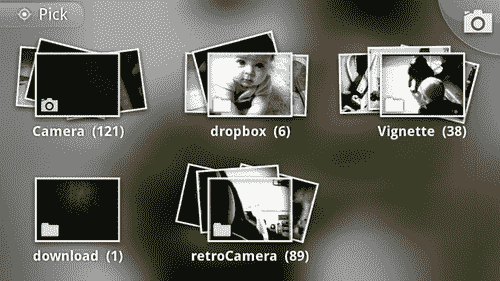
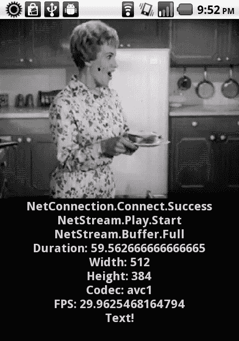
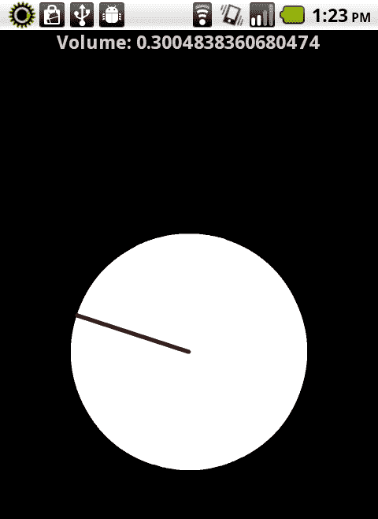

# 第五章。富媒体演示:使用图像、视频和音频

本章将涵盖以下食谱:

*   从设备加载照片相机所有
*   将像素弯曲着色器效果应用于加载的图像
*   从本地文件系统或通过 HTTP 播放视频文件
*   在 RTMP 播放远程视频文件
*   从本地文件系统或通过 HTTP 播放音频文件
*   生成音频频谱可视化工具
*   为您的应用生成音频音调

# 简介

本章将包括多种显示图像数据和回放视频和音频流的方法。这些方法中包括演示从设备相机存储库加载图像的能力、将 Pixel Bender 着色器应用于加载的图像、通过不同协议回放音频和视频以及从声音生成视觉数据和生成原始声音数据的示例。

Flash 平台是全球知名的首播视频分发平台。在接下来的几页中，我们将看到这种体验和影响绝不仅限于基于桌面和浏览器的计算。借助 AIR 2.6 和 Flash Player 10.2 中提供的 StageVideo 等新功能，Flash 正在成为一个更强大的视频传输平台，同时保持设备电池寿命并提供更好的用户体验。

# 从设备摄像机加载照片

安卓操作系统有一个中央存储库，用于存储用户可能安装的各种相机应用拍摄的照片。安卓的 AIR 中有一些 API，允许 Flash 开发人员专门针对这个存储库并从中提取，以便在应用中显示。

## 怎么做…

我们必须使用移动`CameraRoll`应用编程接口直接浏览到设备相机滚轮，并选择一张照片进行显示:

1.  首先，将以下类导入到您的项目中:

    ```java
    import flash.display.Loader;
    import flash.display.Sprite;
    import flash.display.StageAlign;
    import flash.display.StageScaleMode;
    import flash.events.Event;
    import flash.events.MediaEvent;
    import flash.events.TouchEvent;
    import flash.filesystem.File;
    import flash.media.CameraRoll;
    import flash.media.MediaPromise;
    import flash.ui.Multitouch;
    import flash.ui.MultitouchInputMode;

    ```

2.  声明一个`CameraRoll`对象和一个`Loader`，用于显示照片，一旦选择:

    ```java
    private var loader:Loader;
    private var cameraRoll:CameraRoll;

    ```

3.  我们将创建我们的`Loader`对象，将其添加到`Stage`中，并注册一个事件监听器，以便在加载照片后正确缩放照片:

    ```java
    protected function setupLoader():void {
    loader = new Loader();
    loader.contentLoaderInfo.addEventListener(Event.COMPLETE, sizePhoto);
    stage.addChild(loader);
    }

    ```

4.  对于`CameraRoll`本身，我们所需要做的就是实例化它，然后添加一个事件监听器，一旦用户选择了要显示的照片，它就会触发。我们应该经常检查设备是否支持`CameraRoll.browseForImage()by`检查`supportsBrowseForImage`属性:

    ```java
    protected function setupCameraRoll():void {
    if(CameraRoll.supportsBrowseForImage){
    cameraRoll = new CameraRoll();
    cameraRoll.addEventListener(MediaEvent.SELECT, imageSelected);
    registerListeners();
    }else{
    trace("CameraRoll does not support browse for image!");
    }
    }

    ```

5.  We will now register a `TouchEvent` listener of type `TOUCH_TAP` to the `Stage`. This will enable the user to invoke a browse dialog in order to select a photograph from the `CameraRoll` by tapping the device screen.

    ### 注

    我们将`Multitouch.inputMode`设置为`MultitouchInputMode.TOUCH_POINT`常量，以便我们的应用接受触摸事件。

    ```java
    protected function registerListeners():void {
    Multitouch.inputMode = MultitouchInputMode.TOUCH_POINT;
    stage.addEventListener(TouchEvent.TOUCH_TAP, loadFromCameraRoll);
    }

    ```

6.  一旦从用户交互中调用了下面的方法，我们就可以在前面设置的`CameraRoll`对象上调用`browseForImage()`方法。这将打开安卓设备上的默认图库应用，并允许用户从他们的收藏中选择一张照片。如果设备上有多个图库应用，用户将首先通过本机安卓对话框选择哪个用于此事件。我们的应用将失去焦点，这将由操作系统处理，一旦做出选择，就返回到我们的应用。

    ```java
    protected function loadFromCameraRoll(e:TouchEvent):void {
    cameraRoll.browseForImage();
    }

    ```

7.  Here, we can see the default gallery application on Android. A user can spend as much time as they wish browsing the various collections and photographs before a selection is made.

    

8.  当用户在原生安卓图库应用中执行了有效选择后，焦点返回到我们的应用，并返回一个包含`MediaPromise`对象的事件。`Loader`类有一个特定的方法叫做`loadFilePromise()`专门针对这种事情。我们现在将通过这种方法通过`MediaPromise`。

    ```java
    protected function imageSelected(e:MediaEvent):void {
    var promise:MediaPromise = e.data;
    loader.loadFilePromise(promise);
    }

    ```

9.  一旦我们使用`loadFilePromise()`通过`Loader`通过`MediaPromise`物体，它将装载到`Stage`上。我们将在这里执行一个动作来调整`Loader`的尺寸，使其符合我们的`Stage:`

    ```java
    protected function sizePhoto(e:Event):void {
    loader.width = stage.stageWidth;
    loader.scaleY = loader.scaleX;
    }

    ```

    的约束
10.  The resulting image, when loaded upon the `Stage`, will appear as follows:

    

# 它是如何工作的…

动作脚本`CameraRoll`应用编程接口专门针对安卓系统上照片的设备存储位置。每当用户在我们的应用中执行一些调用`CameraRoll.browseForImage()`方法的交互时，默认的安卓图库应用就会启动，允许用户从他们的收藏中选择一个图像文件。

一旦用户从图库应用中选择了一张照片，它们将与一个`MediaPromise`对象一起返回到我们的 AIR for Android 应用，通过该对象，我们可以确定该文件的某些信息，甚至可以将照片直接加载到我们的应用中。

# 还有更多…

在本例中，我们研究如何将图像从`CameraRoll`加载到`Stage`上的`Loader`中。当然，一旦照片被加载，我们可以对它做很多事情。例如，看看下一个配方:*将像素弯曲着色器效果应用于加载的图像*。

# 对加载的图像应用像素弯曲着色器效果

一旦我们将一个可视对象加载到我们的应用中，因为这都是基于 Flash 的，我们就可以进行各种健壮的可视操作。在这个例子中，我们将从本地文件系统加载一张预选的照片，然后对其应用各种像素弯曲着色器，彻底改变其外观。

## 准备…

这个配方利用了像素弯曲着色器。您可以从 Adobe Exchange 下载`.pbj`文件或创建自己的文件。

如果你决定自己编写 Pixel Bender 内核，可以从[http://www.adobe.com/devnet/pixelbender.html](http://www.adobe.com/devnet/pixelbender.html)免费下载 Pixel Bender 工具包，用它来编译各种着色器，用于 Flash 和 AIR 项目。

该工具包允许您使用 Pixel Bender 内核语言(以前称为 Hydra)编写内核，并提供了图像预览和单独属性操作的机制，这些机制可以暴露给 ActionScript。


关于编写像素弯曲着色器的好资源，请查看位于[http://www.adobe.com/devnet/pixelbender.html](http://www.adobe.com/devnet/pixelbender.html)的文档。

在这个食谱中，我们还引用了安卓图像库中的一张照片，这是我们之前用默认相机应用拍摄的。您也可以这样做，或者只是将图像文件与应用捆绑在一起，以供以后参考。

## 怎么做…

我们现在将从本地设备存储中加载一个预定的图像，并对其应用多个像素弯曲着色器:

1.  首先，将以下类导入到您的项目中:

    ```java
    import flash.display.Loader;
    import flash.display.Shader;
    import flash.display.Sprite;
    import flash.display.StageAlign;
    import flash.display.StageScaleMode;
    import flash.events.Event;
    import flash.events.TouchEvent;
    import flash.filters.ShaderFilter;
    import flash.net.URLLoader;
    import flash.net.URLLoaderDataFormat;
    import flash.net.URLRequest;
    import flash.ui.Multitouch;
    import flash.ui.MultitouchInputMode;

    ```

2.  对于这个配方，我们必须预先声明一些不同的对象。我们将声明一个`String`常量来保存我们图像的路径，以及一个`Loader`，用于显示照片。一个`URLRequest`和`URLLoader`对象对将用于加载我们的`.pbj`文件。将设置`Array`来保存我们将要装载的每个`.pbj`的名称。一个`int`被用来跟踪我们当前从`Array`集合加载的着色器。最后，声明一对`Shader`和`ShaderFilter`将加载的`.pbj`应用到我们的`Loader`上。

    ```java
    private const photoURL:String = " {local file path or http address}";
    private var loader:Loader;
    private var urlRequest:URLRequest;
    private var urlLoader:URLLoader;
    private var pbjArray:Array;
    private var currentFilter:int;
    private var shader:Shader;
    private var shaderFilter:ShaderFilter;

    ```

3.  下一步是初始化我们的`Array`并用我们将要加载到应用中的像素弯曲着色器文件引用填充它。这些文件可以通过 Adobe Exchange、网络上的其他位置获得，也可以使用 Pixel Bender Toolkit:

    ```java
    protected function setupArray():void {
    pbjArray = new Array();
    pbjArray[0] = "dot.pbj";
    pbjArray[1] = "LineSlide.pbj";
    pbjArray[2] = "outline.pbj";
    }

    ```

    创作
4.  然后，我们创建我们的`Loader`对象，将其添加到`Stage`中，并注册一个事件监听器，以便在照片加载后正确缩放照片:

    ```java
    protected function setupLoader():void {
    loader = new Loader();
    loader.contentLoaderInfo.addEventListener(Event.COMPLETE, sizePhoto);
    stage.addChild(loader);
    }

    ```

5.  我们现在将向`Loader`注册一个类型为`TOUCH_TAP`的`TouchEvent`收听者。这将使用户能够点击加载的图像，以循环通过各种像素弯曲着色器。我们还将`currentFilter int`设置为`0`，这将指示我们的`Array:`

    ```java
    protected function registerListeners():void {
    Multitouch.inputMode = MultitouchInputMode.TOUCH_POINT;
    loader.addEventListener(TouchEvent.TOUCH_TAP, loadShader);
    currentFilter = 0;
    }

    ```

    的第一个位置
6.  为了将照片加载到`Loader`实例中以便在我们的应用中显示，我们将调用`load()`方法并传入一个新的`URLRequest`以及前面声明的`photoURL String`常量:

    ```java
    protected function loadPhotograph():void {
    loader.load(new URLRequest(photoURL));
    }

    ```

7.  一旦文件已经加载，我们将执行一个动作来调整`Loader`的大小，以适应我们的`Stage:`

    ```java
    protected function sizePhoto(e:Event):void {
    loader.width = stage.stageWidth;
    loader.scaleY = loader.scaleX;
    }

    ```

    的约束
8.  The resulting image, when loaded upon the `Stage`, without any shaders applied, will appear as follows:

    

9.  每当用户在`Loader`实例上执行触摸点击时，该方法将执行。基本上，我们使用先前设置的着色器位置的`Array`值来设置`URLRequest`，从已经记录到`currentFilter`对象的任何当前索引中提取值。
10.  在调用`URLLoader.load()`方法之前，我们必须显式地将`dataFormat`属性设置为`URLLoaderDataFormat.BINARY`常数。这确保了当我们的文件被加载时，它被视为二进制而不是文本。
11.  一旦加载了着色器，就注册了一个`Event.COMPLETE`侦听器来调用`applyFilter`方法。
12.  最后，我们可以增加我们的`currentFilter`值，或者将其设置回`0`，这取决于我们在`Array:`

    ```java
    protected function loadShader(e:TouchEvent):void {
    urlRequest = new URLRequest(pbjArray[currentFilter]);
    urlLoader = new URLLoader();
    urlLoader.dataFormat = URLLoaderDataFormat.BINARY;
    urlLoader.addEventListener(Event.COMPLETE, applyFilter);
    urlLoader.load(urlRequest);
    if(currentFilter < pbjArray.length-1){
    currentFilter++;
    }else{
    currentFilter = 0;
    }
    }

    ```

    上的位置
13.  为了将加载的`.pbj`应用到我们的`Loader`上，我们首先将二进制数据分配给一个新的`Shader`对象。这随后通过`ShaderFilter`的构造器传递，然后作为`Array:`

    ```java
    protected function applyFilter(e:Event):void {
    shader = new Shader(e.target.data);
    shaderFilter = new ShaderFilter(shader);
    loader.filters = [shaderFilter];
    }

    ```

    应用于我们的`Loader`的过滤器属性
14.  When the user has tapped the image, we cycle through the available Pixel Bender Shaders and apply then, in turn, to the loaded photograph. The resulting image cycle can be seen as follows:

    

## 它是如何工作的…

使用像素弯曲着色器是在应用中实现一些真正强大的视觉操作的简单而直接的方法。在这个配方中，我们将一个图像加载到一个`Loader`对象中，构造一个`.pbj`文件引用的`Array`来通过一个`URLLoader`。当用户与我们加载的图像交互时，我们将加载一个`.pbj`文件，并基于接收到的数据构建一个`Shader`。最后，我们可以基于这个对象构建一个`ShaderFilter`，并通过`Loader.filters`属性将其传递给我们的图像。

## 还有更多…

在本例中，我们研究了如何将图像加载到`Stage`上的`Loader`中，并研究在用户交互时对其应用像素弯曲着色器。当然，你可以将这样的着色器应用到任何你喜欢的`DisplayObject`上，包括视频！

在这样的例子中，定位各种 Pixel Bender 文件的好地方是 Adobe Exchange。访问[http://www.adobe.com/exchange](http://www.adobe.com/exchange)交易所网站。

# 从本地文件系统或通过 HTTP 播放视频文件

由于我们在安卓设备上有完整的 Flash Player(和 Adobe AIR)，视频文件的回放就像在桌面上一样简单。主要考虑的是视频是否针对手机播放进行了优化。

## 准备…

这个方法包括播放一个与我们的应用一起打包的视频文件。我们可以很容易地引用一个 HTTP 地址，甚至是安卓设备上的本地存储，只要它是一种文件格式和编解码器，可以通过 Flash Platform 运行时播放。您需要提前准备好这个文件。

## 怎么做…

我们将创建一个`Video`对象，将其添加到`Stage`中，并通过一个基本的`NetConnection`和`NetStream`对:将文件流式传输进来

1.  首先，将以下类导入到您的项目中:

    ```java
    import flash.display.Sprite;
    import flash.display.StageAlign;
    import flash.display.StageScaleMode;
    import flash.events.NetStatusEvent;
    import flash.media.Video;
    import flash.net.NetConnection;
    import flash.net.NetStream;
    import flash.text.TextField;
    import flash.text.TextFormat;

    ```

2.  对于这个配方，我们必须预先声明一些不同的对象。在这种情况下，我们将视频文件与应用本身打包在一起；我们将声明一个引用该文件的`String`常量。
3.  下一组对象属于实际的视频流。声明一个`Video`对象来显示通过我们本地`NetConnection`传入的`NetStream`数据。我们还将声明一个`Object`来绑定特定的，必要的功能到视频播放。
4.  最后，我们将宣布`TextField`和`TextFormat`对，以将文本消息中继到设备显示器上:

    ```java
    private const videoPath:String = "assets/test.m4v";
    private var video:Video;
    private var streamClient:Object;
    private var connection:NetConnection;
    private var stream:NetStream;
    private var traceField:TextField;
    private var traceFormat:TextFormat;

    ```

5.  我们现在将设置我们的`TextField`，应用一个`TextFormat`，并将其添加到`DisplayList`。这里，我们创建一个方法来为我们执行所有这些操作:

    ```java
    protected function setupTextField():void {
    traceFormat = new TextFormat();
    traceFormat.bold = true;
    traceFormat.font = "_sans";
    traceFormat.size = 24;
    traceFormat.align = "center";
    traceFormat.color = 0xCCCCCC;
    traceField = new TextField();
    traceField.defaultTextFormat = traceFormat;
    traceField.selectable = false;
    traceField.mouseEnabled = false;
    traceField.width = stage.stageWidth;
    traceField.height = stage.stageHeight;
    addChild(traceField);
    }

    ```

6.  现在来建立我们的视频连接；我们将创建一个名为`streamClient`的新对象，我们将使用它来将许多辅助函数绑定到我们的流对象。必须创建一个`Video`对象并将其添加到`DisplayList`中，以便用户能够实际观看视频流。最后，我们创建一个`NetConnection`，将`streamClient`分配给它的`client`属性，注册一个事件监听器来监控连接状态，然后调用`connect()`方法，传入`null`作为连接参数，因为在这个例子中我们没有使用任何类型的媒体服务器。
7.  我们可能不总是想将`Video.smoothing`属性设置为真；在这种情况下，由于我们不确定视频到底有多大，我们将启用它，以便平滑可能通过缩放发生的任何潜在的人工合成:

    ```java
    protected function setupVideoConnection():void {
    streamClient = new Object();
    streamClient.onTextData = onTextData;
    streamClient.onMetaData = onMetaData;
    streamClient.onCuePoint = onCuePoint;
    video = new Video();
    video.smoothing = true;
    addChild(video);
    connection = new NetConnection();
    connection.client = streamClient;
    connection.addEventListener(NetStatusEvent.NET_STATUS, onNetStatus);
    connection.connect(null);
    }

    ```

8.  一旦我们确定`NetConnection`连接成功，将从我们的`onNetStatus`函数调用以下方法。在这个方法中，创建一个新的`NetStream`对象，在我们的`NetConnection`上流式传输视频。我们还将把`streamClient`分配给`client`属性，并注册一个事件监听器来监控流状态。要通过我们的`Video`对象显示流，使用`attachStream()`方法并传入我们的`NetStream`对象。现在，只需调用`play()`方法，传入我们的`videoPath`常量，并指向视频文件位置:

    ```java
    protected function connectStream():void {
    stream = new NetStream(connection);
    stream.addEventListener(NetStatusEvent.NET_STATUS, onNetStatus);
    stream.client = streamClient;
    video.attachNetStream(stream);
    stream.play(videoPath);
    }

    ```

9.  下面代码片段中定义的`onNetStatus`方法可以用于我们的`NetStream`和`NetConnection`对象，以便根据返回的不同状态消息做出决定。在这个例子中，我们要么在成功连接了`NetConnection`后启动`connectStream`方法，要么在确定`NetStream`播放成功后执行一些缩放和布局。
10.  关于所有支持的`NetStatusEvent`信息代码的完整列表，请看:[http://help . adobe . com/en _ US/FlashPlatform/reference/action script/3/flash/events/netstatussevent . html # info](http://help.adobe.com/en_US/FlashPlatform/reference/actionscript/3/flash/events/NetStatusEvent.html#info)。T1】
11.  接下来的三个步骤包括已经绑定到`NetConnection`或`NetStream`的客户端属性的方法。这些必须作为客户端对象的一部分存在，否则可能会抛出错误，因为它们是预期的方法。每当在流传输的文件中遇到文本时，`onTextData`方法就会触发:

    ```java
    public function onTextData(info:Object):void {
    traceField.appendText("Text!\n");
    }

    ```

12.  当流元数据加载到应用中时，`onMetaData`方法会触发。这为我们提供了许多有用的信息，如河流宽度、高度和持续时间:

    ```java
    public function onMetaData(info:Object):void {
    traceField.appendText("Duration: " + info.duration + "\n");
    traceField.appendText("Width: " + info.width + "\n");
    traceField.appendText("Height: " + info.height + "\n");
    traceField.appendText("Codec: " + info.videocodecid + "\n");
    traceField.appendText("FPS: " + info.videoframerate + "\n");
    }

    ```

13.  每当在流传输的文件中遇到嵌入的提示点时，

    ```java
    public function onCuePoint(info:Object):void {
    traceField.appendText("Cuepoint!\n");
    }

    ```

    方法就会触发
14.  The resulting application will look similar to the following screen render:

    

## 它是如何工作的…

整个工作流程几乎完全是为桌面开发时所使用的。在 Flash 上播放视频时，首先要建立一个`NetConnection`让我们的`NetStream`穿越。一旦`NetConnection`被连接起来，我们就创建我们的`NetStream`并将它们两个绑定在一起。在`Stage`上添加一个`Video`对象，只要我们将`NetStream`附加到设备上，就可以在我们的设备上看到该流。此时，我们只需调用`play()`方法，就可以在`NetStream`上播放我们想要的任何文件。

在处理`NetConnection`和`NetStream`时，总是需要创建一些辅助函数。这些功能包括注册事件监听器来检测特定的状态事件，以及定义一个自定义的`client`属性，该属性带有已建立的工作流所期望的相关方法。

## 还有更多…

在这个例子中，我们正在播放一个用我们的应用打包的文件。从设备库中播放视频文件(假设 Flash 和 AIR 支持用于压缩视频的编解码器)或从无线网络连接上的可用位置通过 HTTP 逐步流式传输视频同样简单。

我们通过 Flash 播放器或 AIR 播放的视频文件必须是 Flash 平台运行时支持的类型。

有效的视频文件类型包括:

*   猫白血病病毒
*   MP4
*   M4V
*   F4V
*   第三代合作伙伴项目（the3rdGenerationPartnershipProject）

Flash Platform 运行时支持 H.264 标准的每个级别和配置文件，并保留完全的 FLV 支持。但是，针对安卓系统的推荐解决方案如下:

*   **4:3 视频:** 640 × 480，512 × 384，480 × 360
*   **16:9 视频:** 640 × 360，512×288，480 × 272

当打包这样一个应用时，它利用了作为应用包的一部分分发的文件，我们还需要确保通过使用图形用户界面(如果您的集成开发环境支持这一点)或作为命令行编译过程中的额外文件来包含它们。

# 在 RTMP 播放远程视频流

除了通过本地文件系统或远程 HTTP 网址播放视频之外，我们还能够使用闪存媒体服务器和 RTMP 协议将视频文件流式传输到安卓设备上。如果像这样的流媒体服务器可用，您可以在跨移动安卓设备部署视频时充分利用这一点。

## 准备…

该方法包括播放已部署到闪存媒体服务器的视频文件。如果您无法访问生产服务器，您实际上可以免费设置开发人员版本的 FMS。要了解更多关于通过**实时消息协议** ( **RTMP** )传输视频的信息，您可以查看以下网站的资源:[http://www.adobe.com/products/flashmediaserver/](http://www.adobe.com/products/flashmediaserver/)

## 怎么做…

我们将创建一个`Video`对象，将其添加到`Stage`中，并通过一对`NetConnection`和`NetStream`将文件流式传输到 RTMP:

1.  首先，将以下类导入到您的项目中:

    ```java
    import flash.display.Sprite;
    import flash.display.StageAlign;
    import flash.display.StageScaleMode;
    import flash.events.NetStatusEvent;
    import flash.media.Video;
    import flash.net.NetConnection;
    import flash.net.NetStream;
    import flash.text.TextField;
    import flash.text.TextFormat;

    ```

2.  对于这个配方，我们必须预先声明一些不同的对象。在这种情况下，我们使用闪存媒体服务器在 RTMP 执行流；我们将声明一个引用 FMS 应用路径的`String`常量。
3.  下一组对象属于实际的视频流。声明一个`Video`对象来显示通过我们本地`NetConnection`传入的`NetStream`数据。我们还将声明一个`Object`来绑定特定的、必要的视频播放功能。
4.  最后，我们将宣布`TextField`和`TextFormat`对，以将文本消息中继到设备显示器上:

    ```java
    private const fmsPath:String = "rtmp://fms/vod";
    private var video:Video;
    private var streamClient:Object;
    private var connection:NetConnection;
    private var stream:NetStream;
    private var traceField:TextField;
    private var traceFormat:TextFormat;

    ```

5.  我们现在将设置我们的`TextField`，应用一个`TextFormat`，并将其添加到`DisplayList`。这里，我们创建一个方法来为我们执行所有这些操作:

    ```java
    protected function setupTextField():void {
    traceFormat = new TextFormat();
    traceFormat.bold = true;
    traceFormat.font = "_sans";
    traceFormat.size = 24;
    traceFormat.align = "center";
    traceFormat.color = 0xCCCCCC;
    traceField = new TextField();
    traceField.defaultTextFormat = traceFormat;
    traceField.selectable = false;
    traceField.mouseEnabled = false;
    traceField.width = stage.stageWidth;
    traceField.height = stage.stageHeight;
    addChild(traceField);
    }

    ```

6.  现在来建立我们的视频连接；我们将创建一个名为`streamClient`的新对象，我们将使用它来将许多辅助函数绑定到我们的流对象。必须创建一个`Video`对象并将其添加到`DisplayList`中，以便用户能够实际观看视频流。
7.  最后，我们创建一个`NetConnection`，将`streamClient`分配给它的`client`属性，注册一个事件监听器来监控连接状态，然后调用`connect()`方法，传入预定义的`fmsPath`常量作为连接参数。这是因为在继续之前，我们必须连接到闪存介质服务器上的此应用实例。

    ```java
    protected function setupVideoConnection():void {
    streamClient = new Object();
    streamClient.onBWDone = onTextData;
    streamClient.onTextData = onTextData;
    streamClient.onMetaData = onMetaData;
    streamClient.onCuePoint = onCuePoint;
    video = new Video();
    video.smoothing = true;
    addChild(video);
    connection = new NetConnection();
    connection.client = streamClient;
    connection.addEventListener(NetStatusEvent.NET_STATUS, onNetStatus);
    connection.connect(fmsPath);
    }

    ```

8.  一旦我们确定`NetConnection`连接成功，将从我们的`onNetStatus`函数调用以下方法。在这个方法中，创建一个新的`NetStream`对象，在我们的`NetConnection`上流式传输视频。我们还将把`streamClient`分配给`client`属性，并注册一个事件监听器来监控流状态。
9.  要显示通过我们的`Video`对象的流，使用`attachStream()`方法并传入我们的`NetStream`对象。
10.  现在，只需调用`play()`方法，传入一个`String`来标识要在 RTMP 播放的特定流或文件。您会注意到，因为我们使用的是基于 H.264 的文件格式，所以我们必须在流名前面加上`mp4:`。如果直播或通过 FLV，前缀是不必要的。T3】
11.  下面代码片段中定义的`onNetStatus`方法可以用于我们的`NetStream`和`NetConnection`对象，以便根据返回的不同状态消息做出决定。在这个例子中，我们要么在成功连接了一个`NetConnection`后启动`connectStream`方法，要么在确定`NetStream`播放成功后执行一些缩放和布局:

    ```java
    protected function onNetStatus(e:NetStatusEvent):void {
    traceField.appendText(e.info.code + "\n");
    switch (e.info.code) {
    case "NetConnection.Connect.Success":
    connectStream();
    break;
    case "NetStream.Buffer.Full":
    video.width = stage.stageWidth;
    video.scaleY = video.scaleX;
    traceField.y = video.height;
    break;
    }
    }

    ```

12.  接下来的三个步骤包括已经绑定到`NetConnection`或`NetStream`的客户端属性的方法。这些必须作为客户端对象的一部分存在，否则可能会抛出错误，因为它们是预期的方法。`onBWDone`方法特别适用于流过 RTMP 的文件。每当流服务器完成对客户端可用带宽的估计时，它就会触发。T3】
13.  每当在流传输的文件中遇到文本时，`onTextData`方法就会触发。

    ```java
    public function onTextData(info:Object):void {
    traceField.appendText("Text!\n");
    }

    ```

14.  当流元数据加载到应用中时，`onMetaData`方法会触发。这为我们提供了许多有用的信息，如河流宽度、高度和持续时间:

    ```java
    public function onMetaData(info:Object):void {
    traceField.appendText("Duration: " + info.duration + "\n");
    traceField.appendText("Width: " + info.width + "\n");
    traceField.appendText("Height: " + info.height + "\n");
    traceField.appendText("Codec: " + info.videocodecid + "\n");
    traceField.appendText("FPS: " + info.videoframerate + "\n");
    }

    ```

15.  每当在流传输的文件中遇到嵌入的提示点时，`onCuePoint`方法就会触发:

    ```java
    public function onCuePoint(info:Object):void {
    traceField.appendText("Cuepoint!\n");
    }

    ```

16.  The resulting application will look similar to the following screen render:

    

## 它是如何工作的…

回放 RTMP 溪流时，我们必须先建立一个`NetConnection`让我们的`NetStream`穿越。`NetConnection`将尝试连接到闪存媒体服务器地址上定义的指定应用。一旦`NetConnection`被连接起来，我们就创建了我们的`NetStream`并将他们两个绑定在一起。在`Stage`中添加一个`Video`对象，只要我们将`NetStream`附加到设备上，该流就可以在我们的设备上查看。在这一点上，我们可以通过简单地调用`play()`方法来播放我们希望在`NetStream`上播放的任何文件。

在处理`NetConnection`和`NetStream`时，总是需要创建一些辅助函数。这些功能包括注册事件监听器来检测特定的状态事件，以及定义一个自定义的`client`属性，该属性带有已建立的工作流所期望的相关方法。

## 还有更多…

在本例中，我们通过 Flash Media Server 在互联网上通过 RTMP 位置流式传输视频文件。您可以使用同样的技术在 RTMP 传输音频文件，或者使用设备摄像头编写视频聊天应用。当我们在这里演示如何从头开始生成一个`Video`对象时，请记住有各种可用的组件解决方案，例如 Flash Professional 附带的`FLVPlayBack`控件以及`VideoDisplay`和`VideoPlayer`组件，它们是 Flex 框架的一部分。这项技术有无限的可能性！

# 从本地文件系统或通过 HTTP 播放音频文件

通过安卓设备上的 Flash 平台运行时播放音频文件相当简单。我们可以指向与我们的应用捆绑在一起的文件，就像这个配方演示的那样，设备存储器上的文件，或者远程网络连接上的文件。无论文件位于何处，回放都是以相同的方式完成的。

## 怎么做…

我们必须将音频文件加载到一个`Sound`对象中，然后才能操纵回放、音量、声相以及其他属性。在本食谱中，我们将允许用户通过旋转基本转盘来控制音量:

1.  首先，将以下类导入到您的项目中:

    ```java
    import flash.display.Sprite;
    import flash.display.StageAlign;
    import flash.display.StageScaleMode;
    import flash.events.TransformGestureEvent;
    import flash.media.Sound;
    import flash.media.SoundChannel;
    import flash.media.SoundTransform;
    import flash.net.URLRequest;
    import flash.text.TextField;
    import flash.text.TextFormat;
    import flash.ui.Multitouch;
    import flash.ui.MultitouchInputMode;

    ```

2.  对于这个配方，我们必须预先声明一些不同的对象。我们将从由`Sound, SoundChannel`和`SoundTransform`组成的声音对象组开始。这些对象将允许我们完全控制这个食谱的音频。我们还将创建一个`Sprite`，作为用户交互点。最后，我们将宣布`TextField`和`TextFormat`配对，以将文本消息中继到设备显示器上:

    ```java
    private var sound:Sound;
    private var channel:SoundChannel;
    private var sTransform:SoundTransform;
    private var dial:Sprite;
    private var traceField:TextField;
    private var traceFormat:TextFormat;

    ```

3.  我们现在将设置我们的`TextField`，应用一个`TextFormat`，并将其添加到`DisplayList`。这里，我们创建一个方法来为我们执行所有这些操作:

    ```java
    protected function setupTextField():void {
    traceFormat = new TextFormat();
    traceFormat.bold = true;
    traceFormat.font = "_sans";
    traceFormat.size = 24;
    traceFormat.align = "center";
    traceFormat.color = 0xCCCCCC;
    traceField = new TextField();
    traceField.defaultTextFormat = traceFormat;
    traceField.selectable = false;
    traceField.mouseEnabled = false;
    traceField.width = stage.stageWidth;
    traceField.height = stage.stageHeight;
    addChild(traceField);
    }

    ```

4.  为了创建我们的音量标度盘，我们将初始化一个新的`Sprite`，并使用`graphics`应用编程接口在其中绘制标度盘的表示。然后我们将这个`Sprite`添加到`Stage:`

    ```java
    protected function setupDial():void {
    dial = new Sprite();
    dial.graphics.beginFill(0xFFFFFF, 1);
    dial.x = stage.stageWidth/2;
    dial.y = stage.stageHeight/2;
    dial.graphics.drawCircle(0,0,150);
    dial.graphics.endFill();
    dial.graphics.lineStyle(5,0x440000);
    dial.graphics.moveTo(0, -150);
    dial.graphics.lineTo(0, 0);
    addChild(dial);
    }

    ```

5.  现在我们将开始设置我们的音频相关对象。初始化我们的`Sound`并通过`URLRequest`载入一个`MP3`文件。
6.  接下来，我们将通过创建一个`SoundTransform`并传入一个值`0.5`来将声音的初始音量设置为 50%，因为动作脚本中的`volume`注册在`0 -1`的范围内。
7.  为了玩`Sound`，我们将创建一个`SoundChannel`对象，将我们的`SoundTransform`分配给它的`soundTransform`属性，最后通过`Sound.Play()`方法设置`SoundChannel`:

    ```java
    protected function setupSound():void {
    sound = new Sound();
    sound.load(new URLRequest("assets/test.mp3"));
    sTransform = new SoundTransform(0.5, 0);
    channel = new SoundChannel();
    channel.soundTransform = sTransform;
    channel = sound.play();
    traceField.text = "Volume: " + sTransform.volume;
    }

    ```

8.  通过将`Multitouch.inputMode`设置为`MultitouchInputMode.GESTURE`常量，设置多点触摸应用编程接口支持触摸输入的具体输入模式。我们还将在我们的`Sprite`上注册一个`TransformGestureEvent.GESTURE_ROTATE`事件的监听器来拦截用户交互:

    ```java
    protected function registerListeners():void {
    Multitouch.inputMode = MultitouchInputMode.GESTURE; dial.addEventListener(TransformGestureEvent. GESTURE_ROTATE, onRotate);
    }

    ```

9.  当用户旋转`Sprite`时，我们要相应地调整播放音量。为了实现这一点，我们将根据从手势事件接收到的数据来调整`Sprite rotation`。然后我们可以将`Sprite rotation`转换为有效的`volume Number`并修改`SoundTransform`以反映这一点，这将提高或降低我们的音频音量:

    ```java
    protected function onRotate(e:TransformGestureEvent):void {
    dial.rotation += e.rotation;
    sTransform.volume = (dial.rotation+180)/360;
    channel.soundTransform = sTransform;
    traceField.text = "Volume: " + sTransform.volume;
    }

    ```

10.  The resulting application will look similar to the following screen render:

    

## 它是如何工作的…

我们通过`URLRequest`将音频文件加载到动作脚本中的`Sound`对象中，使其对我们的应用可用。通过调用`Sound`上的`play()`方法可以实现简单的回放，但是通过将声音回放分配给`SoundChannel`对象，我们保留了更大程度的控制，因为我们可以通过构造和分配`SoundTransform`对象来控制声相和音量等方面。在本食谱中，我们修改`SoundTransform`的音量，然后将其分配给`SoundChannel.soundTransform`属性，我们的`Sound`将在该属性上播放，从而修改声音。

## 还有更多…

在这个例子中，我们正在播放一个用我们的应用打包的文件。播放设备文件系统中的音频文件(假设 Flash 和 AIR 支持用于压缩音频的编解码器)或通过网络连接从一个可用的位置通过 HTTP 逐步流式传输文件同样简单。

我们通过 Flash Player 或 AIR 播放的音频文件必须是 Flash 平台运行时支持的类型。

有效的音频格式包括:

*   猫白血病病毒
*   MP3 文件
*   AAC+
*   高等教育委员会
*   AAC v1
*   AAC v2

当打包这样一个应用时，它利用了作为应用包的一部分分发的文件，我们还需要确保通过使用图形用户界面(如果您的集成开发环境支持这一点)或作为命令行编译过程中的额外文件来包含它们。

# 生成音频频谱可视化工具

播放音频时生成某种视觉反馈的能力对用户非常有用，因为即使设备音量被静音或调低，他们也能看到播放发生。从音频生成视觉效果在某些游戏或监控音频输入水平时也很有用。

## 怎么做…

我们将把一个`MP3`文件加载到一个`Sound`对象中。通过使用`SoundMixer. computeSpectrum()`方法，我们可以访问正在回放的实际字节，并使用`Sprite graphics`应用编程接口:用这些数据构建可视化

1.  首先，将以下类导入到您的项目中:

    ```java
    import flash.display.Sprite;
    import flash.display.StageAlign;
    import flash.display.StageScaleMode;
    import flash.events.TimerEvent;
    import flash.media.Sound;
    import flash.media.SoundChannel;
    import flash.media.SoundMixer;
    import flash.net.URLRequest;
    import flash.ui.Multitouch;
    import flash.ui.MultitouchInputMode;
    import flash.utils.ByteArray;
    import flash.utils.Timer;

    ```

2.  对于这个配方，我们必须预先声明一些不同的对象。我们将从由`Sound`和`SoundChannel`组成的声音对象对开始。这些对象将允许我们完全控制这个食谱的音频。我们还将创建一个`Sprite`，它将作为绘制音频频谱数据的画布。最后，我们将声明一个`Timer`，以便每隔几毫秒刷新一次声谱可视化:

    ```java
    private var sound:Sound;
    private var channel:SoundChannel;
    private var spectrum:Sprite;
    private var timer:Timer;

    ```

3.  为了构建我们将在其中绘制可视化元素的画布，我们必须初始化一个`Sprite`，在`graphics` API 上定义一个特定的线条样式，并将其添加到`Stage:`

    ```java
    protected function setupSpectrum():void {
    spectrum = new Sprite();
    addChild(spectrum);
    }

    ```

    中
4.  一个`Timer`将被用来决定我们在我们的容器`Sprite`内刷新可视化的频率。在这种情况下，我们将它设置为每 100 毫秒触发一次`TIMER`事件，或者每秒 10 次。

    ```java
    protected function registerTimer():void {
    timer = new Timer(100);
    timer.addEventListener(TimerEvent.TIMER, onTimer);
    }

    ```

5.  现在我们将开始设置我们的音频相关对象。初始化我们的`Sound`并通过`URLRequest`载入一个`MP3`文件。为了玩`Sound`，我们将创建一个`SoundChannel`对象，将我们的`SoundTransform`分配给它的`soundTransForm`属性，最后通过`Sound.Play()`方法设置`SoundChannel`。由于我们现在已经加载了`Sound`并准备好了，我们可以开始运行我们的`Timer`。

    ```java
    protected function setupSound():void {
    sound = new Sound();
    sound.load(new URLRequest("assets/test.mp3"));
    channel = new SoundChannel();
    channel = sound.play();
    timer.start();
    }

    ```

6.  最后，构造一个类似于下面的方法，它将从全局 Flash `SoundMixer`中提取字节数据，并使用`graphics`应用编程接口根据这些数据绘制可视化。我们首先初始化这个方法中使用的一些变量，并从`SoundMixer`类中运行`computeSpectrum()`。这将为我们的`ByteArray`填充创建视觉效果所需的所有声音样本数据。
7.  在循环数据时，我们可以使用`graphics`应用编程接口在`Sprite`容器中绘制线条、圆圈或任何我们想要的东西。在这种情况下，我们绘制一系列线条来创建光谱可视化。由于它被设置为每 100 毫秒更新一次，因此它成为正在播放的声音的不断变化的视觉指示器。

    ```java
    protected function onTimer(e:TimerEvent):void {
    var a:Number = 0;
    var n:Number = 0;
    var i:int = 0;
    var ba:ByteArray = new ByteArray();
    SoundMixer.computeSpectrum(ba);
    spectrum.graphics.clear();
    spectrum.graphics.lineStyle(4, 0xFFFFFF, 0.8, false);
    spectrum.graphics.moveTo(0, (n/2)+150);
    for(i=0; i<=256; i++) {
    a = ba.readFloat();
    n = a*300;
    spectrum.graphics.lineTo(i*(stage.stageWidth/256), (n/2)+150);
    }
    spectrum.graphics.endFill();
    }

    ```

8.  The resulting application will look similar to the following screen render:

    

## 它是如何工作的…

`SoundMixer`类提供了对`computeSpectrum()`方法的访问，该方法能够对通过 Flash Player 或 AIR 播放的任何声音进行快照，并将其写入一个`ByteArray`对象。总共有 512 个`Number`值写入了`ByteArray`；第一个 256 代表左声道，其余 256 代表右声道。根据您需要的可视化类型，可能不需要完整的 512 值，就像这里的情况一样。

为了使用图形应用编程接口生成决定在哪里画线的值，我们使用`ByteArray.readFloat()`，它从字节流中读取一个 32 位浮点值，并将其转换为`Number`。由于该值表示特定样本的特定声音数据，因此我们可以使用该值通过图形 API 绘制一系列线条，并形成我们的可见光谱。

## 还有更多…

你可以通过简单的搜索在网上找到大量的额外方法和公式。进行这种生成式可视化的可能性确实是无穷无尽的，但是在决定将任何可视化引擎推进多远时，我们必须考虑到这些设备上低于正常的硬件规格。

# 为您的应用生成音频音调

将大量声音文件打包到应用中是包含音频的一种方法。另一种方法是声音数据的运行时生成。我们将在这个配方中产生一些简单的正弦音调，这些音调根据检测到的触摸压力而变化。

## 怎么做…

我们将研究如何基于用户触摸压力生成音频样本字节数据，并将其输入到`Sound`对象中以生成各种音调:

1.  首先，将以下类导入到您的项目中:

    ```java
    import flash.display.Sprite;
    import flash.display.StageAlign;
    import flash.display.StageScaleMode;
    import flash.events.SampleDataEvent;
    import flash.events.TouchEvent;
    import flash.media.Sound;
    import flash.media.SoundChannel;
    import flash.ui.Multitouch;
    import flash.ui.MultitouchInputMode;
    import flash.utils.ByteArray;
    import flash.text.TextField;
    import flash.text.TextFormat;

    ```

2.  对于这个配方，我们必须预先声明一些不同的对象。我们将从由`Sound`和`SoundChannel`组成的声音对象对开始。这些对象将允许我们完全控制这个食谱的音频。我们还将创建一个`Number`，它将保留通过用户触摸获得的压力信息。最后，我们将宣布`TextField`和`TextFormat`配对，以将文本消息中继到设备显示屏上:

    ```java
    private var sound:Sound;
    private var channel:SoundChannel;
    private var touchPressure:Number;
    private var traceField:TextField;
    private var traceFormat:TextFormat;

    ```

3.  我们现在将设置我们的`TextField`，应用一个`TextFormat`，并将其添加到`DisplayList`。这里，我们创建一个方法来为我们执行所有这些操作:

    ```java
    protected function setupTextField():void {
    traceFormat = new TextFormat();
    traceFormat.bold = true;
    traceFormat.font = "_sans";
    traceFormat.size = 24;
    traceFormat.align = "center";
    traceFormat.color = 0xCCCCCC;
    traceField = new TextField();
    traceField.defaultTextFormat = traceFormat;
    traceField.selectable = false;
    traceField.mouseEnabled = false;
    traceField.width = stage.stageWidth;
    traceField.height = stage.stageHeight;
    addChild(traceField);
    }

    ```

4.  现在我们将开始设置我们的音频相关对象。初始化一个`Sound`和`SoundChannel`对象对。这些将在以后用于播放我们生成的音频数据:

    ```java
    protected function setupSound():void {
    sound = new Sound();
    channel = new SoundChannel();
    }

    ```

5.  通过将`Multitouch.inputMode`设置为`MultitouchInputMode.TOUCH_POINT`常量，设置多点触摸应用编程接口支持触摸输入的具体输入模式。我们还将为`SampleDataEvent.SAMPLE_DATA`事件注册一个侦听器，一旦我们通过先前建立的`SoundChannel:`

    ```java
    protected function registerListeners():void {
    Multitouch.inputMode = MultitouchInputMode.TOUCH_POINT;
    stage.addEventListener(TouchEvent.TOUCH_BEGIN, onTouch);
    sound.addEventListener(SampleDataEvent.SAMPLE_DATA, onSampleDataRequest);
    channel = sound.play();
    }

    ```

    向`play()`发出`Sound`对象，该请求将开始
6.  每当检测到触摸事件时，我们将通过以下方法进行监控。基本上，我们修改`touchPressure Number`，它将用于计算我们的正弦波生成:

    ```java
    protected function onTouch(e:TouchEvent):void {
    touchPressure = e.pressure;
    traceField.text = "Pressure: " + touchPressure;
    }

    ```

7.  每当当前播放的`Sound`对象请求回放新的样本数据时，我们的最终方法就会执行。我们将采用`ByteArray.writeFloat()`方法将生成的音频数据发送回我们的`Sound`对象，以便根据每个样本请求进行回放:

    ```java
    protected function onSampleDataRequest(e:SampleDataEvent):void {
    var out:ByteArray = new ByteArray();
    for( var i:int = 0 ; i < 8192; i++ ) { out.writeFloat(Math.sin((Number(i+e.position)/ Math.PI/2))*touchPressure);
    out.writeFloat(Math.sin((Number(i+e.position)/ Math.PI/2))*touchPressure);
    }
    e.data.writeBytes(out);
    }

    ```

8.  The resulting application will produce a variable tone depending upon the amount of pressure applied through touch and should look similar to the following screen render:

    

## 它是如何工作的…

当向`SampleDataEvent`事件监听器注册时，动作脚本`Sound`对象将在开始回放时充当套接字。我们必须通过一个函数提供样本数据传递给这个`Sound`对象，这个函数生成这个数据，并将样本传递给等待的`Sound`对象。样本数量可以在 2048 和 8192 之间变化，在这种情况下，我们提供尽可能多的样本数据。Adobe 提供的产生正弦波的通用公式是:`Math.sin((Number(loopIndex+SampleDataEvent.position)/Math.PI/2))`乘以 0.25。因为我们是基于记录的触摸点压力修改公式，所以我们改为乘以这个记录的值。这将修改应用生成的音频。

## 还有更多…

对于生成的音调的更受控制的库，存在动作脚本库，根据库的不同，可以免费或收费使用。我建议去 http://www.sonoport.com/的索诺波特看看。