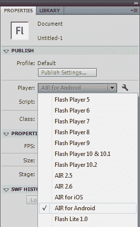
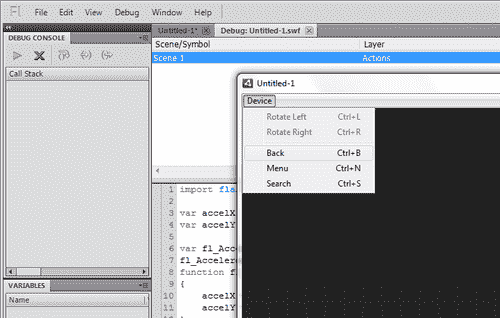
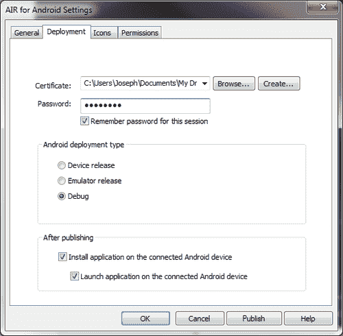
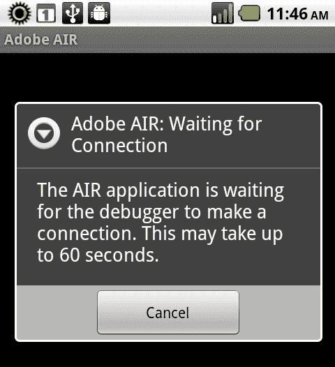
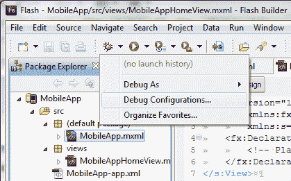
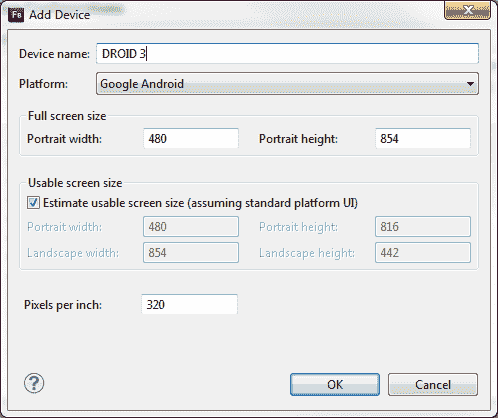
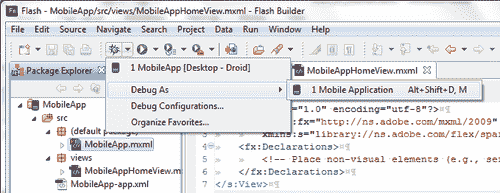
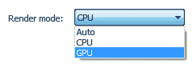

# 第十章。避免问题:调试和资源考虑

本章将涵盖以下食谱:

*   使用 Flash Professional 调试应用
*   使用闪存生成器调试应用
*   使用设备图形处理器渲染应用元素
*   设备中断事件时自动关闭应用
*   使用设备后退按钮退出应用
*   监控应用中的内存使用和帧速率

# 简介

由于安卓是一个移动操作系统，它在优化性能和用户体验方面提出了一系列新的具体挑战。这是 Flash Platform 开发者在为安卓和手机 Flash Player 开发 AIR 应用时必须考虑的问题。本章将概述调试和优化技术以及用户体验调整，以使我们的安卓应用 AIR 尽可能表现良好。

# 使用 Flash Professional 调试应用

使用 Flash Professional 调试 Android 应用的 AIR 与调试桌面 AIR 或 Flash 项目非常相似，但有一些明显的例外。

## 准备…

请确保您的安卓 AIR 项目在 Flash Professional 中打开，并且您的播放器是安卓 AIR。这可以通过**属性**面板:来验证



## 怎么做...

使用移动调试启动器或通过 USB 在设备本身上进行调试:

1.  In the application menu, choose **Debug** and hover over the option labeled **Debug Movie**. This will cause a submenu of debug options to appear:

    

2.  When choosing to debug **in AIR Debug Launcher (Mobile)**, Flash Professional will switch to the full Debug Console and launch the application within the device debugger. This is useful for performing quick debugging of your application when multi-touch, accelerometer, or other device-specific inputs and sensors are not involved. Breakpoints, trace statements, and other debug tools will function exactly the same as within a normal desktop project.

    

3.  一旦我们在调试播放器中进行了初步测试，并准备通过 USB 在设备上进行调试，我们就可以在**调试**菜单中切换到该选项。如果我们从未为这个项目配置过安卓设置的 AIR，将会出现一个对话框窗口，允许我们这样做。该窗口不应在后续调试会话中出现。请务必选择**安卓部署类型**下的**调试**选项，并在发布后的**部分选择**安装并启动**选项。**
4.  You will notice there are fields for determining a certificate to sign your application at this point. To learn more about the code-signing process, please refer to [Chapter 11](11.html "Chapter 11. Final Considerations: Application Compilation and Distribution"), *Final Considerations: Application Compilation and Distribution.*

    

5.  After initiating a debug session to deploy on our device, Flash Professional will take a few seconds to compile and deploy the application. As the application begins to load upon the device, AIR will launch a small dialog letting us know that it is attempting to connect to the debugger on our computer. Once this connection occurs, the window will go away and our full application will launch, allowing us to test and debug as normal.

    

## 它是如何工作的...

当使用任何 Flash Platform 技术开发应用时，通过断点和变量检查调试应用与课程不相上下。对于安卓的 AIR，我们正在处理外部硬件，必须采取一些额外的步骤来确保我们能够在正常环境下进行调试，同时还能与运行在真实设备上的应用进行交互。这个配方展示了在我们目前的工作流程中实现这一切所必需的步骤。

## 另见...

有关使用 Flash Professional 进行项目设置的更多信息，您可以参考[第 1 章](01.html "Chapter 1. Getting Ready to Work with Android: Development Environment and Project Setup")、*准备使用 Android:开发环境和项目设置。*

# 使用 Flash Builder 调试应用

在 Flash Builder 中定义调试配置的能力是一个很好的工作流改进，我们应该在设置新的移动项目或准备测试我们已经工作了一段时间的项目时利用它。我们可以使用 Flash Builder **调试配置**面板为同一个项目设置多个配置。

## 怎么做…

我们将探索**调试配置**面板，为我们的移动项目配置一组自定义启动设置:

1.  Select a mobile project and click the arrow next to the **Debug** button in the Flash Builder toolbar. Choose the **Debug Configurations** option from this menu. The Debug Configurations dialog window will open up:

    

2.  Double click on the left-hand menu entry labeled **MobileApp** to edit the particular settings for this selected project. From this window, we can select another project to configure, specify the default `Application` file for the project, set a `Target` platform (Google Android, in our case), and configure a `Launch` method. If debugging on the desktop, we can also select from a variety of device profiles and even configure our own. In the next screenshot , we have chosen to debug using the dimensions and resolution present on the Motorola Droid:

    

3.  If it is necessary to define additional devices, we can click the **Configure** button to launch the **Device Configurations** screen, which allows us to Import device profiles, or even add our own:

    

4.  When adding a custom device profile, we are given options for specifying width and height of our display along with supported pixels per inch. Google Android has a standard platform UI that can differ between devices depending upon how much customization the manufacturer performs over the standard display elements. The notifications bar, for instance, always appears unless the device is in full screen mode. If the notifications bar was taller or shorter on a specific device, we can account for it here.

    ### 注

    虽然这里可以模拟分辨率和 PPI，但除非开发机器有多点触控界面，否则我们将不得不在实际设备上测试任何触摸或手势输入。当然，设备性能也不是模拟的一部分。

    

5.  When choosing to debug on actual physical hardware, we can choose to debug on a device through USB or over a wireless network. USB debugging is often the more direct way and is recommended for most situations. Within the following screenshot, you can see that we have now defined one configuration for desktop debug and one for debugging on a USB-connected device:

    

6.  When finished, click **Apply** and then **Close**. We can now access any of the defined configurations from the Flash Builder debug icon or the project context menu:

    

7.  Once we choose to launch a debug session for our project, it will open within the Flash Builder mobile debug player when debugging on the desktop, or in the case of USB device debug; it will be compiled, pushed to the device, and installed. For a device debug session, AIR will launch a small dialog letting us know that it is attempting to connect to the debugger on our computer. Once this connection occurs, the window will go away and our full application will launch, allowing us to test and debug as normal.

    

## 它是如何工作的...

如果您选择在桌面上启动，您将能够在闪存生成器中进行本地调试。您还可以通过从一组配置文件中进行选择来模拟各种安卓设备。如果您希望创建自己的个人资料，您可以通过单击**配置**按钮来创建。

当选择在设备上启动时，您还可以选择通过闪存生成器在设备上进行调试。到目前为止，这是调试移动应用的最佳方式，因为它是在真正的安卓硬件上测试的。

## 另见...

有关使用 Flash Builder 进行项目设置的更多信息，您可以参考[第 1 章](01.html "Chapter 1. Getting Ready to Work with Android: Development Environment and Project Setup")、*准备使用 Android:开发环境和项目设置。*

# 使用设备 GPU 渲染应用元素

虽然旧的安卓设备必须依赖中央处理器来处理移动 Adobe AIR 项目中呈现的所有内容，但市场上的许多新设备都完全支持图形处理单元(GPU)呈现，并为我们的应用提供了必要的钩子来利用这一点。本食谱将展示我们必须采取的必要步骤，以实现应用元素的图形处理器加速。

## 怎么做...

我们将修改 AIR 描述符文件中的设置，并启用`DisplayObject`实例来利用这些修改:

1.  在项目中找到 AIR 描述符文件。它通常被命名为类似`{MyProject}-app.xml`的东西，并且位于项目根。
2.  在文件中浏览本文档开头附近名为`<initialWindow>`的节点。该节点包含许多默认设置，用于处理应用窗口的视觉方面。
3.  我们现在必须定位名为`<renderMode>`的子节点。如果这个节点不存在，我们可以很容易地添加到这里。`renderMode`值决定应用是使用 CPU 还是 GPU 来渲染内容。有三种可能的应用价值`renderMode:`
    *   **自动:**应用将尝试使用设备图形处理器渲染视觉显示对象:

        ```java
        <renderMode>auto</renderMode>

        ```

    *   **GPU:** 应用将被锁定为 GPU 模式。如果设备不支持 Adobe AIR 中的 GPU 渲染，将会出现问题:

        ```java
        <renderMode>gpu</renderMode>

        ```

    *   **CPU:** 应用将使用设备 CPU 渲染所有视觉显示对象。这是最安全的设置，但提供的好处最少:

        ```java
        <renderMode>cpu</renderMode>

        ```

4.  现在，每当我们想利用应用中的`DisplayObject`实例时，我们必须将`DisplayObject`实例`cacheAsBitmap`属性设置为`true`，并将`cacheAsBitmapMatrix`属性分配给新的矩阵对象。这将通过设备图形处理器为这些单个对象启用 2D 内容渲染。当使用 2.5D 空间中的对象时，它们将使用 GPU 自动渲染，并且不需要这些附加设置。

    ```java
    displayObject.cacheAsBitmap = true;
    displayObject.cacheAsBitmapMatrix =new Matrix();

    ```

### 它是如何工作的...

将 AIR 描述符文件中的应用`renderMode`设置为`gpu`将强制应用使用图形处理器渲染视觉对象。但是，未在 2.5D 空间中渲染的单个对象将要求将`cacheAsBitmap`属性设置为`true`并将`cacheAsBitmapMatix`属性分配给矩阵对象。当将`renderMode`设置为`auto`时，应用将尝试通过 GPU 渲染这些对象，如果特定设备不支持 GPU 加速，将退回到 CPU 渲染。我们也可以将`renderMode`设置为`cpu`，它只是通过 CPU 渲染一切，完全绕过任何 GPU 渲染。

如果使用得当，设置应用`renderMode`可以大大加快应用内的视觉对象渲染。重要的是要认识到，许多设备不会通过 AIR 为安卓提供完全的 GPU 支持，在这种情况下，强制使用 GPU 实际上可能会给应用带来很大的问题，甚至可能使其在特定设备上不可用。在使用图形处理器时，还存在许多限制。例如:不支持滤镜、像素混合和各种标准混合模式。

### 还有更多...

如果使用 Flash Professional，我们还可以通过**安卓设置**面板的 AIR 设置`Render`模式。可通过**属性**面板进行访问。点击**玩家选择**旁边的小扳手图标，配置这些设置。



# 设备中断事件时自动关闭应用

当应用在安卓设备上运行时，用户会话很有可能会被电话或其他不可预见的事件中断。当出现这种情况时，我们应该考虑退出应用并释放系统资源用于其他任务是否合适。

## 怎么做...

我们将监听应用以触发停用事件，并作为响应退出应用:

1.  首先，我们需要将以下类导入到我们的应用中:

    ```java
    import flash.desktop.NativeApplication:
    import flash.display.Sprite;
    import flash.display.StageAlign;
    import flash.display.StageScaleMode;
    import flash.events.Event;

    ```

2.  我们必须在我们的`NativeApplication.nativeApplication`对象上注册一个`Event.DEACTIVATE`类型的事件侦听器。当应用在电话或其他中断事件中失去对设备的关注时，此事件将会触发:

    ```java
    protected function registerListeners():void {
    NativeApplication.nativeApplication.addEventListener(Event. DEACTIVATE, appDeactivate);
    }

    ```

3.  在下面的函数中，我们将调用`NativeApplication.nativeApplication`对象上的`exit()`方法，完全关闭应用。这将为其他设备应用释放资源:

    ```java
    protected function appDeactivate(e:Event):void {
    NativeApplication.nativeApplication.exit();
    }

    ```

### 它是如何工作的...

我们希望能够很好地管理在用户设备上活动时为我们的应用运行留出的资源。一个有效的方法是确保释放我们的应用在非活动状态下使用的任何内存。监听停用事件将允许我们知道其他应用何时获得焦点。在这一点上，我们可以完全退出应用，这将释放资源，用于用户当前正在做的任何事情。

### 另请参见…

在实际退出应用之前，我们有机会通过本地共享对象或本地数据库保留任何会话数据。关于如何做到这一点的更多信息，请看[第 8 章](08.html "Chapter 8. Abundant Access: File System and Local Database")、*丰富的访问:文件系统和本地数据库。*

# 使用设备后退按钮退出应用

安卓设备通常在设备的一侧有一组四个软键，它们总是呈现给用户。其中两个键涉及导航——后退键和主页键。当用户激活一个事件时，比如当按下后退按钮时，我们应该考虑完全退出应用并释放系统资源用于其他任务是否合适。

### 注

主页按钮总是会将用户返回到安卓桌面，从而停用我们的应用。要了解如何在这种情况下关闭应用，请参考前面的方法。

## 怎么做...

我们将听到专用的安卓后退按钮被按下，并退出应用作为响应:

1.  首先，我们需要将以下类导入到我们的应用中。

    ```java
    import flash.desktop.NativeApplication;
    import flash.display.Sprite;
    import flash.display.StageAlign;
    import flash.display.StageScaleMode;
    import flash.events.KeyboardEvent;
    import flash.ui.Keyboard;

    ```

2.  我们必须在我们的`NativeApplication.nativeApplication`对象上注册一个`KeyboardEvent.KEY_DOWN`类型的事件侦听器。该事件将在用户激活专用安卓返回键时触发:

    ```java
    protected function registerListeners():void {
    NativeApplication.nativeApplication. addEventListener(KeyboardEvent.KEY_DOWN, onBackPressed);
    }

    ```

如果用户按下返回键，我们将调用`NativeApplication.nativeApplication`对象上的`exit()`方法，完全关闭应用。这将为其他设备应用释放资源:

```java
protected function onBackPressed(e:KeyboardEvent):void {
if(e.keyCode == Keyboard.BACK){
NativeApplication.nativeApplication.exit();
}
}

```

## 它是如何工作的...

我们希望能够很好地管理在用户设备上活动时为我们的应用运行留出的资源。一个有效的方法是确保释放我们的应用在非活动状态下使用的任何内存。一种方法是监听键盘事件并截取一个回车键。在这一点上，我们可以完全退出应用，这将释放资源，用于用户当前正在做的任何事情。

根据应用的当前状态，我们可以选择是退出应用还是简单地返回到以前的状态。在基于 Flex 的移动项目中执行此类操作时，如果我们当前的视图是应用中的初始视图`ViewNavigator.` ，我们可能会退出应用

## 还有更多…

也可以通过使用`KeyboardEvent.preventDefault():`来阻止安卓后退按钮做任何事情

```java
protected function onBackPressed(e:KeyboardEvent):void {
if(e.keyCode == Keyboard.BACK){
KeyboardEvent.preventDefault();
}
}

```

## 另请参见…

请注意，在实际退出应用之前，我们有机会通过本地共享对象或本地数据库保留任何会话数据。关于如何做到这一点的更多信息，请看[第 8 章](08.html "Chapter 8. Abundant Access: File System and Local Database")、*丰富的访问:文件系统和本地数据库。*

# 监控应用中的内存使用和帧速率

与传统的台式机或笔记本电脑相比，安卓设备的内存和中央处理器通常要少得多。在构建安卓应用时，我们必须非常小心，以免创建一些非常耗电的东西，以至于帧率下降到不可接受的水平，或者应用变得没有响应。为了帮助我们排除故障和监控这些问题，我们可以跟踪应该相应响应的正在运行的应用的内存消耗和计算的帧速率。

## 怎么做...

我们可以通过使用`flash.system`包和`flash.utils.getTimer`类来监控许多系统属性，以计算当前应用的帧速率:

1.  首先，我们需要将以下类导入到我们的应用中:

    ```java
    import flash.display.Sprite;
    import flash.display.StageAlign;
    import flash.display.StageScaleMode;
    import flash.events.Event;
    import flash.system.Capabilities;
    import flash.system.System;
    import flash.text.TextField;
    import flash.text.TextFormat;
    import flash.utils.getTimer;

    ```

2.  我们需要声明一组`Number`对象来保存持久的定时值，以便计算应用帧速率。另外，声明一对`TextField`和`TextFormat`向用户追踪该消息和其他设备消息:

    ```java
    private var prevTime:Number;
    private var numFrames:Number;
    private var frameRate:Number;
    private var traceField:TextField;
    private var traceFormat:TextFormat;

    ```

3.  此时，我们将继续设置我们的`TextField`，应用一个`TextFormat`，并将其添加到`DisplayList`。这里，我们创建一个方法来为我们执行所有这些操作:

    ```java
    protected function setupTraceField():void {
    traceFormat = new TextFormat();
    traceFormat.bold = true;
    traceFormat.font = "_sans";
    traceFormat.size = 24;
    traceFormat.align = "left";
    traceFormat.color = 0xCCCCCC;
    traceField = new TextField();
    traceField.defaultTextFormat = traceFormat;
    traceField.selectable = false;
    traceField.multiline = true;
    traceField.wordWrap = true;
    traceField.mouseEnabled = false;
    traceField.x = 20;
    traceField.y = 40;
    traceField.width = stage.stageWidth-40;
    traceField.height = stage.stageHeight - traceField.y;
    addChild(traceField);
    }

    ```

4.  下一步需要创建处理我们的帧速率计算的机制。当应用初始化后，我们将`prevTimeNumber`设置为当前经过的毫秒数。我们也将暂时将`numFrames`变量设置为`0`。这为我们提供了一组基数。最后，我们在我们的应用上注册一个类型为`Event.ENTER_FRAME`的事件监听器，定期为我们执行新的帧速率计算:

    ```java
    protected function registerListeners():void {
    prevTime = getTimer();
    numFrames = 0;
    this.addEventListener(Event.ENTER_FRAME, onEnterFrame);
    }

    ```

5.  每次输入一帧，这个冗长的方法都会刷新我们`TextField`内的一切。首先，我们将写出一些关于 CPU 架构、制造商和应用可用内存的信息。记忆是这一步的重要一环。
6.  为了计算运行的帧速率，我们将首先增加我们的帧计数器，并再次收集从应用初始化开始经过的毫秒数。然后可以减去之前的读数，得出这个函数最后一次运行的时间。
7.  如果经过的时间超过 1000 秒，那么已经过去了一秒，然后我们可以执行一些计算来确定我们每秒的实际帧数。我们将检索每分钟的帧数，方法是将我们在这个周期中处理的帧数除以保存我们之前时间的变量，再乘以 1000。将先前的时间变量设置为当前经过的时间，并将我们的帧数重置为`0`，将开始一个新的周期:

    ```java
    protected function onEnterFrame(e:Event):void {
    traceField.text = "CPU Arch: " + Capabilities.cpuArchitecture + "\n";
    traceField.appendText("Manufacturer: " + Capabilities. manufacturer + "\n");
    traceField.appendText("OS: " + Capabilities.os + "\n\n");
    traceField.appendText("Free Memory: " + System.freeMemory + "\n");
    traceField.appendText("Total Memory: " + System.totalMemory + "\n\n");
    numFrames++;
    var timeNow:Number = getTimer();
    var timePast:Number = timeNow - prevTime;
    if(timePast > 1000){
    var fpm:Number = numFrames/timePast;
    frameRate = Math.floor(fpm * 1000);
    prevTime = timeNow;
    numFrames = 0;
    }
    traceField.appendText("Framerate: " + frameRate);
    }

    ```

8.  When we run the application upon a device, we can see the CPU and OS information, along with memory usage and the calculated frame rate:

    

## 它是如何工作的...

有大量关于中央处理器和内存使用的信息可以通过“功能”和“系统”类访问。我们可以通过基于从`getTimer()`实用程序方法收集的数据计算实际 FPS 来收集关于当前帧速率的附加信息。将所有这些结合起来，将为我们提供一组合理的数据，以确定我们的应用在特定设备上的运行情况。然后，我们可以在应用运行时使用这些数据做出明智的决定，方法是修改应用属性、更改我们呈现内容的方式，甚至提醒用户可能存在问题。

## 还有更多...

如果帧速率变得太慢，我们可能会考虑降低帧速率，甚至降低应用的渲染质量，以提高性能。这可以使用以下代码片段来完成:

```java
this.stage.frameRate = 10;
this.stage.quality = StageQuality.LOW;

```

## 另见...

我们也可以推荐使用类似`Hi-ReS-Stats`的包，可以从[https://github.com/mrdoob/Hi-ReS-Stats](http://https://github.com/mrdoob/Hi-ReS-Stats)下载，用于移动安卓应用监控资源使用情况。使用这个类将在我们的应用中产生一个图形覆盖来监控应用的性能。