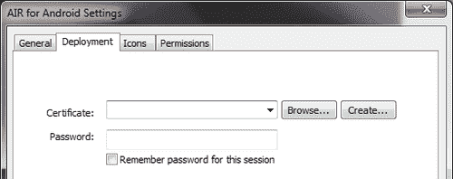
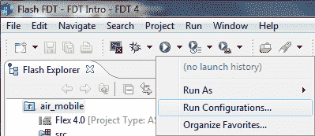
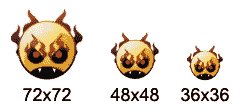
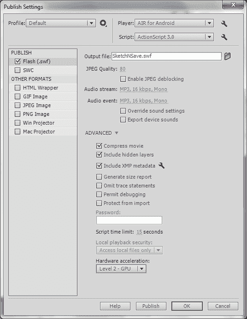
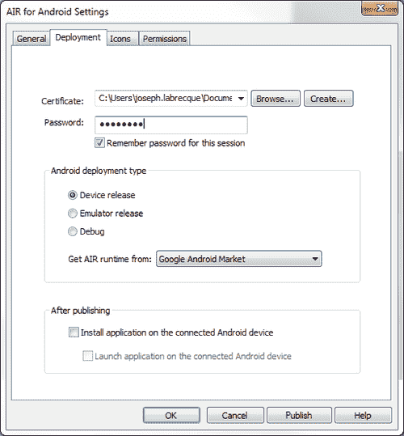
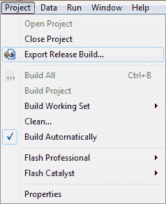
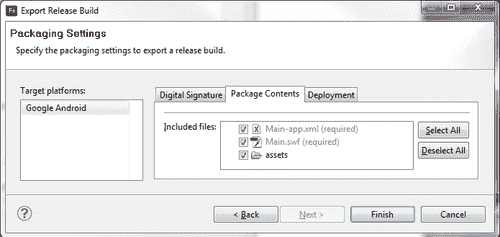
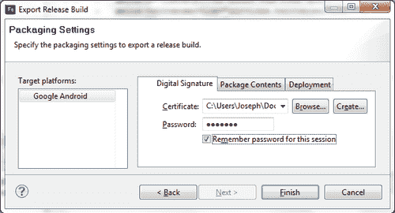
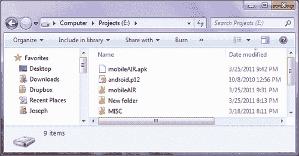
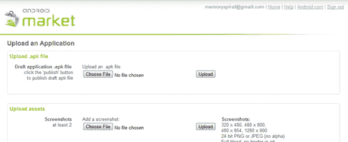

# 第十一章。最终考虑:应用程序编译和分发

本章将涵盖以下食谱:

*   使用 Flash Professional 生成代码签名证书
*   使用闪存生成器生成代码签名证书
*   使用 FDT 生成代码签名证书
*   使用 AIR 开发工具生成代码签名证书
*   准备分发图标文件
*   使用 Flash Professional 编译应用程序
*   使用闪存生成器编译应用程序
*   使用 FDT 编译应用程序
*   使用 AIR 开发工具编译应用程序
*   向安卓市场提交申请

# 简介

将移动 Flash 应用(`.swf`)部署到 Web 时，流程与桌面上非常相似；将你的`.swf`嵌入到一个 HTML 容器中，你就完成了。然而，将 AIR 应用程序部署到安卓市场是完全不同的体验。在本章中，我们将了解如何准备应用程序以分发到安卓市场，生成适当的代码签名证书，以及编译和提交过程的细节。

# 使用 Flash Professional 生成代码签名证书

在安卓市场上分发的应用程序需要使用 25 年代码签名证书进行数字签名。有许多不同的方法可以为安卓应用程序生成代码签名证书。我们将演示如何在本食谱中使用 Flash Professional 生成这样的证书。

## 怎么做...

在 Flash Professional 中，执行以下操作来创建自签名数字证书:

1.  With a project open which targets **AIR for Android**, open the **Properties** panel and click the little wrench icon beside the **Player selection** box. This will open the **AIR for Android Settings** dialog:

    

2.  Within the **AIR for Android Settings** dialog, click the **Create** button to open the **Create Self-Signed Digital Certificate** dialog window:

    

3.  Now that the **Create Self-Signed Digital Certificate** dialog is before us, we will enter the required information and choose a name and location for the certificate. When everything has been entered properly, we will click **OK** to have Flash Professional generate the certificate. Be sure to enter 25 years in the **Validity period** input for Android:

    

## 它是如何工作的...

通过生成有效的数字代码签名证书，我们能够正确地签署我们的安卓应用程序，以提交给安卓市场。Flash Professional 提供了一种简单的方法来生成适当的证书类型，并将其应用到我们的应用程序中进行分发。

# 使用 Flash Builder 生成代码签名证书

在安卓市场上分发的应用程序需要使用 25 年代码签名证书进行数字签名。有许多不同的方法可以为安卓应用程序生成代码签名证书。我们将演示如何在这个配方中使用 Flash Builder 生成这样的证书。

## 怎么做...

在闪存生成器中，执行以下操作来创建自签名数字证书:

1.  在**包浏览器**中选择一个移动项目，进入**文件**菜单，选择**属性**。该项目将出现**属性**对话框。
2.  Within the **Properties** dialog, scroll down the **Flex Build Packaging** or **ActionScript Build Packaging** item (depending upon the type of project selected) and choose **Google Android**. With the **Digital Signature** tab selected, click the **Create** button to open the **Create Self-Signed Digital Certificate** dialog:

    

3.  All that is now needed is to enter the required information and choose a name and location for the certificate. When everything has been entered properly, we will click **OK** to have Flash Builder generate the certificate:

    

## 它是如何工作的...

通过生成有效的数字代码签名证书，我们能够正确地签署我们的安卓应用程序，以提交给安卓市场。Flash Professional 提供了一种简单的方法来生成适当的证书类型，并将其应用到我们的应用程序中进行分发。

# 使用 FDT 生成代码签名证书

在安卓市场上分发的应用程序需要使用 25 年代码签名证书进行数字签名。有许多不同的方法可以为安卓应用程序生成代码签名证书。我们将演示如何在本食谱中使用 power flash FDT 生成这样的证书。

## 怎么做...

在 FDT，执行以下操作来创建自签名数字证书:

1.  Click upon the small arrow next to the **Run** icon in the top menu and choose **Run Configurations** from the sub menu that appears. This will open the **Run Configurations** dialog:

    

2.  With the **Run Configurations** dialog window now open, double-click the **FDT AIR Application Release** menu item to create a new configuration. Choose the **Certificate** tab and to enter the required information, choosing a name and location for the certificate. Once everything has been entered properly, we will click **Create Certificate** to have FDT generate the certificate for us:

    

## 它是如何工作的...

通过生成有效的数字代码签名证书，我们能够正确地签署我们的安卓应用程序，以提交给安卓市场。FDT 提供了一种简单的方法来生成适当的证书类型，并将其应用于我们的分发应用程序。

# 使用 AIR 开发工具生成代码签名证书

在安卓市场上分发的应用程序需要使用 25 年代码签名证书进行数字签名。有许多不同的方法可以为安卓应用程序生成代码签名证书。我们将演示如何在这个配方中使用 ADT 命令行工具生成这样的证书。

## 准备…

有关在您的特定环境中配置 ADT 的步骤，请查看[第 1 章](01.html "Chapter 1. Getting Ready to Work with Android: Development Environment and Project Setup")、*准备使用 Android:开发环境和项目设置。*

## 怎么做...

使用 ADT 命令行工具，执行以下操作创建自签名数字证书:

1.  对于这个例子，我们将假设如下:

    ```java
    Publisher Name: "Joseph Labrecque"
    Validity Period: 25 (years)
    Key Type: 1024-RSA
    PFX File: C:\Users\Joseph\Documents\airandroid.p12
    Password: airAndroidPass

    ```

2.  打开命令提示符或终端(取决于操作系统)并输入命令字符串以生成我们的证书:

    ```java
    adt -certificate -cn "Joseph Labrecque" -validityPeriod 25 1024-
    RSA C:\Users\Joseph\Documents\airandroid.p12 airAndroidPass

    ```

3.  The ADT utility will now process the command and complete the certificate generation process. If there is a problem with our command, ADT will print out error messages here, letting us know something went wrong:

    

4.  We can now browse to the location specified within the command string to locate our newly created certificate and can use this to sign our AIR for Android applications:

    

## 它是如何工作的...

通过生成有效的数字代码签名证书，我们能够正确地签署我们的安卓应用程序，以提交给安卓市场。使用与 AIR SDK 捆绑在一起的 ADT 工具，我们可以生成适当的证书类型进行分发。

# 准备分发图标文件

当我们编译一个应用程序在安卓市场发行时，我们必须在我们的应用程序中包含一组标准图标图像。这些图标的位置是在我们的 AIR 应用描述符文件中定义的。安卓系统需要一组三个图标:36x36、48x48 和 72x72。每个图标用于不同的屏幕密度，并且都应该作为标准的 PNG 文件包括在内。

## 怎么做...

根据所使用的工具，可以用不同的方式来完成这项任务。我们将演示如何使用 Flash Professional CS5.5 在应用程序中包含这些图标，以及如何通过直接修改 AIR 应用程序描述符文件来包含这些图标。

### 使用 Flash Professional CS5.5

1.  With a project open which targets **AIR for Android**, open the **Properties** panel and click the little wrench icon beside the **Player selection** box. This will open the **AIR for Android Settings** dialog:

    

2.  Within the **AIR for Android Settings** dialog, click the **Icon** tab. To specify specific icons for our project, we simply need to select each icon entry in the list and to browse to locate a file to be used for each one through use of the folder and magnifying glass icon:

    

### 直接修改 AIR 描述符文件

1.  在项目中找到 AIR 描述符文件。它通常被命名为类似`{MyProject}-app.xml`的东西，并且位于项目根。
2.  在文件中浏览本文档中名为`<icon>within`的节点。该节点包含许多默认设置，用于处理应用程序窗口的视觉方面。如果它已被注释掉，我们必须在继续之前取消注释。
3.  我们现在必须确保`<icon>`节点内存在以下三个子节点。确保我们图标文件的路径是正确的。如果它们不正确，一旦我们试图编译这个应用程序，编译器会让我们知道:

    ```java
    <image36x36>assets/icon_36.png</image36x36>
    <image48x48>assets/icon_48.png</image48x48>
    <image72x72>assets/icon_72.png</image72x72>

    ```

举个例子，这里有一组三个图标，可以在安卓应用中使用，还有它们的像素测量值:



## 它是如何工作的...

当通过安卓市场分发应用程序时，在安卓应用程序包中包含一组图标至关重要。一旦应用程序安装到设备上，它还为用户添加了易于识别的视觉提示。花一些时间想出一组图标，真正反映他们将代表的应用程序。

## 还有更多...

如果应用程序要发布到安卓市场上，我们还需要制作各种其他图像来正确标记我们的应用程序。查看安卓市场，了解目前在[https://market.android.com/](http://https://market.android.com/)需要哪些图片的详细信息。

# 使用 Flash Professional 编译应用程序

将项目编译为安卓发布版本`.apk`文件是将应用程序分发到安卓市场或其他渠道之前的最后一步。根据使用的工具，有许多方法可以做到这一点。在这个配方中，我们将使用 Flash Professional 中可用的工具来编译和打包我们的应用程序。

## 怎么做...

要从 Flash Professional 编译一个`.apk`，我们将采取以下步骤:

1.  With a project open which targets **AIR for Android**, open the **Properties** panel and click the **Publish Settings** button. This will open the **Publish Settings** dialog:

    

2.  We can look over our settings here and even simply click **Publish** if we know for certain everything is configured appropriately. To verify all of the settings are in place to publish to Android, click the little wrench icon for our **Player selection** box, which should be set to **AIR for Android**. This will provide access to the **AIR for Android Settings** dialog:

    

3.  With the **AIR for Android Settings** dialog now open, we can go about verifying our **specific configuration** options before deciding to publish. The **General** tab contains a number of important inputs including the path to the generated `.apk` file, the application name, version, ID, and other required configuration settings. We can also choose to include files other than the compiled `.swf` and AIR descriptor file, such as external image assets. The **Icons** tab allows us to include icon files with a basic GUI, and the **Permissions** tab will allow us to set application permissions specific to Android.

    ### 注

    这些设置都会修改应用描述符文件，进而生成安卓清单文档。我们可以将这些设置视为这些文件的图形用户界面。

4.  As a final step, click on the **Deployment** tab:

    

5.  在**部署**选项卡中，存在部署类型的设置以及使用自签名证书签署我们的应用程序的机会。这一点非常重要，因为安卓市场不会接受未签名的应用程序或不符合安卓市场条款要求的应用程序。
6.  确保提供应用程序名称和唯一的应用程序标识，应用程序名称用于用户在设备上安装后识别应用程序。`App ID`非常重要，因为这是你的应用在安卓市场的主要标识符。它必须是唯一的，这样应用程序更新才能正常运行，建议开发人员特别注意使用反向域符号来保持这种唯一性。
7.  我们将需要确保从选择中获取 AIR 运行时表明我们瞄准的特定发行市场。对于一般的安卓市场，我们选择谷歌安卓市场。该对话框还为我们提供了通过安卓部署类型设置为不同目的编译应用构建的选项:
    *   **设备发布:**当我们想要通过安卓市场分发我们的应用程序时，这是我们需要选择的选项
    *   **模拟器版本:**生成与 Android SDK 模拟器和 AIR 运行时的模拟器构建兼容的版本
    *   **调试:**该选项生成专门用于调试应用程序的版本
8.  Once we are satisfied with all of our configuration settings, we can exit back out to the **Publish Settings** dialog and hit **Publish**, or simply click the **Publish** button here. We can also publish using traditional methods available in Flash Professional, so long as we've previously gone through these configuration steps.

    

我们现在有一个完全编译的、有效签名的`.apk`文件准备分发。

## 它是如何工作的...

我们通过 Flash Professional GUI 对话框更改的配置设置实际上是在幕后修改 AIR 描述符文件。一旦我们选择发布我们的应用程序，Flash Professional 将使用该文件将所有内容编译并打包到一个有效的`.apk`中，准备在安卓市场上分发。

# 使用 Flash Builder 编译应用程序

将项目编译为安卓发布版本`.apk`文件是通过安卓市场或其他渠道分发应用程序之前的最后一步。根据使用的工具，有许多方法可以做到这一点。在这个配方中，我们将使用 Flash Builder 中可用的工具来编译和打包我们的应用程序。

## 怎么做...

要从 Flash Builder 编译`.apk`，请执行以下步骤:

1.  Within a mobile ActionScript or Flex project, navigate to the Flash Builder menu and choose the **Project** menu item. This will reveal a submenu with a number of options. From this menu, choose **Export Release Build** opening the **Export Release Build** dialog window:

    

2.  Within this window, we are given the option to specify the project and specific application within that project we wish to perform a release build upon, decide which platforms to target, specify the path, and filename of our build, and choose what sort of application to export as. For Android, we will choose **Signed packages** for each target platform. So long as we have selected **Google Android** as a target platform, this will open the **Packaging** Settings dialog once we click **Next:**

    

3.  Now, we are able to configure some advanced properties for the build. Click on the **Package Contents** tab to verify that all required files are to be included in the build. If we want to package additional files, or even exclude certain assets, we can do so through use of the checkboxes aside each item. Click the **Digital Signature** tab to continue:

    

4.  The final task will be to choose a signing certificate in order to digitally sign our application for distribution on the Android Market. Select a certificate and type in the associated password. Clicking **Finish** will perform the build and save a compiled `.apk` into the location we had previously chosen. If we wish, we can include external files through the **Package Contents** tab and choose to deploy to any connected devices through the **Deployment** tab:

    

我们现在有一个完全编译的、有效签名的`.apk`文件准备分发。

## 它是如何工作的...

当导出项目的发布版本时，Flash Builder 提供了目标平台的概念。如果我们选择谷歌安卓作为目标平台，我们会得到特定于安卓的附加选项，我们可以根据特定项目的需求进行修改。额外的对话框元素允许我们将所有内容编译并打包到一个有效的`.apk`中，准备在安卓市场上发布。

# 使用 FDT 时编译应用程序

将项目编译为安卓发布版本`.apk`文件是通过安卓市场或其他渠道分发应用程序之前的最后一步。根据使用的工具，有许多方法可以做到这一点。在这个食谱中，我们将讨论三种流行的方法，当我们使用 powerflash FDT 编译和打包我们的应用程序时。

## 怎么做...

截至本文撰写之时，FDT 不支持直接与 AIR 合作开发安卓系统。然而，有三种主要的方法可以让 FDT 用户为安卓发行版编译他们的项目。

### 使用移动项目模板

FDT 社区已经制作了许多支持安卓 AIR 的移动项目模板。这些模板与所有 FDT 项目使用的新模板系统一起工作，并为工作流添加了不同级别的功能。其中大部分还包括 ANT 脚本，使用 AIR 开发工具编译一个`.apk`。

### 使用蚂蚁

这是迄今为止为安卓编译项目最灵活的方法，因为它实际上与 IDE 无关，任何人都可以使用。ANT 与 FDT 的标准安装一起打包，许多为 Android 部署 AIR 的入门脚本可以通过社区在线找到。要开始在 FDT 使用 ANT，请看一下[http://fdt.powerflasher.com/docs/FDT_Ant_Tasks](http://fdt.powerflasher.com/docs/FDT_Ant_Tasks)。

### 通过命令行界面使用自动驾驶仪

最基本的方法就是简单的使用 FDT 开发一个移动项目，然后通过命令行界面使用 AIR Developer Tool 将其打包为`.apk`。下一个食谱实际上详细说明了这是如何实现的。

## 它是如何工作的...

无论选择哪种方法，目标都是一样的——将所有内容编译并打包到一个有效的`.apk`中，准备在安卓市场上发布。FDT 的优势之一是它不限制开发者用一种特定的方式做事。当为安卓生产发布版本时，我们有很多选择。

# 使用 AIR 开发工具编译应用程序

将项目编译为安卓发布版本`.apk`文件是通过安卓市场或其他渠道分发应用程序之前的最后一步。根据使用的工具，有许多方法可以做到这一点。在本食谱中，我们将使用 **AIR 开发工具** ( **ADT** )命令行实用程序来编译和打包我们的应用程序。

## 怎么做...

要使用 ADT 命令行工具从移动 AIR 项目编译`.apk`，我们将采取以下步骤:

1.  对于本例，我们将假设如下:
    *   **证书:**安卓. p12
    *   **想要的 APK:** `mobileAIR.apk`
    *   **空气描述符:** `mobileAIR\src\mobileAIR-app.xml`
    *   **SWF 文件**t0
2.  打开命令提示符或终端(取决于操作系统)并输入命令字符串以生成我们的证书。在这种情况下，我们将目标类型设置为`.apk`进行发布构建。我们还可以将其设置为 apk-debug，用于调试构建，或者 apk-emulator，用于安装在模拟器上:

    ```java
    -package -target apk -storetype pkcs12 -keystore android.p12
    mobileAIR.apkmobileAIR\src\mobileAIR-app.xml mobileAIR\src\
    mobileAIR.swf

    ```

3.  任何其他文件(如资产或图标)都可以包含在。swf 条目，由空格分隔:

    ```java
    -package -target apk -storetype pkcs12 -keystore android.p12
    mobileAIR.apkmobileAIR\src\mobileAIR-app.xml mobileAIR\src\
    mobileAIR.swf mobileAIR\src\assets\icon_32.pngmobileAIR\src\
    assets\icon_36.pngmobileAIR\src\assets\icon_72.png

    ```

4.  The ADT utility will now process the command and complete the `.apk` compilation process. If there is a problem with our command, ADT will print out error messages here, letting us know something went wrong. Normally, if something does go wrong, it will be a problem with the AIR descriptor file or an incorrect file path to an expected input file.

    

5.  We can now browse to the result location specified within the command string to locate our newly created `.apk` file, which can be installed directly upon an Android device or distributed through the Android Market:

    

我们现在有一个完全编译的、有效签名的`.apk`文件准备分发。

## 它是如何工作的...

假设我们已经正确配置了我们的应用程序，ADT 将为我们编译、签名并将我们所有的项目文件打包到一个`.apk`中。ADT 有许多不同的实用程序和配置选项，可用于对项目执行许多操作。看一下[http://help.adobe.com/en_US/air/build/](http://help.adobe.com/en_US/air/build/)点击菜单中的**AIR Developer Tool**(**ADT**)查看完整文档。

## 另请参见…

有关在您的特定环境中配置 ADT 的步骤，请查看[第 1 章](01.html "Chapter 1. Getting Ready to Work with Android: Development Environment and Project Setup")、*准备使用 Android:开发环境和项目设置。*

# 向安卓市场提交申请

谷歌让注册成为安卓开发者和向安卓市场发布应用变得非常容易。在编辑完成的`.apk`后，该配方将详细说明这样做的必要步骤。

## 做好准备...

在开发人员能够向安卓市场提交任何东西之前，必须创建一个开发人员帐户。该过程可以在几分钟内完成，简单且便宜。

要注册为安卓开发者:

1.  使用网络浏览器，进入[http://market.android.com/publish/signup](http://market.android.com/publish/signup)。
2.  使用您的谷歌帐户登录(或创建一个新帐户)。
3.  填写登记表并支付 25 美元的一次性设置费。
4.  恭喜你成为安卓开发者！

## 怎么做...

1.  1 上传编译并签署的`.apk`文件到安卓市场进行全球发行。
2.  使用您的安卓开发者证书在[https://market.android.com/publish/](http://https://market.android.com/publish/)登录安卓市场。
3.  Click on the button in the lower right that says **Upload Application:**

    

4.  我们现在看到了一个相当长的表格，它允许我们包含关于我们的应用程序的各种信息。我们可以对我们的应用程序进行分类，添加描述性和宣传性文本，更新发行说明，并选择是向用户收取应用程序费用还是允许免费下载。如果我们决定要求付款，我们必须首先从本页提供的链接建立一个谷歌商家账户。
5.  In addition to textual entries and other input choices, we also have the opportunity to upload a wide variety of images which will represent our application in the Android Market. Specific image attributes are detailed within this form:

    

6.  本页底部有三个按钮。我们可以点击**保存**来保存我们的应用配置文件，以便以后编辑。点击**删除**按钮将允许我们从安卓市场完全删除一个应用程序。要发布我们的应用程序，我们将单击**发布**按钮。

### 注

一旦发布应用程序，该按钮将显示为**取消发布**，**删除**按钮将不再作为选项出现，如果用户已经安装了该应用程序。


该应用程序现已发布到安卓市场，可供全球数百万用户使用。

## 它是如何工作的...

向安卓市场上传和发布应用程序将允许用户下载和安装应用程序。我们完全控制应用程序描述、版本信息和相关的图像资产。我们还能够跟踪来自开发者区域的评级和评论，以及管理一个商家账户，如果有必要的话，我们的应用程序。发布到安卓市场是立竿见影的。没有像其他应用市场一样的批准和不批准过程。

## 还有更多...

将应用程序更新到新版本比设置全新的应用程序要简单得多:

1.  进入安卓市场后，点击现有应用的名称。这将允许您编辑与之相关的任何图像或文本。
2.  To actually publish a new version of the application, we must click the link `[Upload Upgrade]`. This will cause a new set of form controls to appear.

    

3.  点击**选择文件**并浏览新的`.apk`文件。现在点击**上传**将文件提交到谷歌服务器。
4.  将解析新文件的版本信息，并验证其内容是否有效。对版本号、应用程序图标、请求的权限等的任何更改都将反映在草稿中。
5.  应用程序描述符文件中定义的版本号必须高于之前提交的版本号，才能进行有效升级。如有必要，我们还可以对该页面上的常规应用程序信息进行其他编辑。点击页面底部的**发布**，新版本将立即在安卓市场上市。