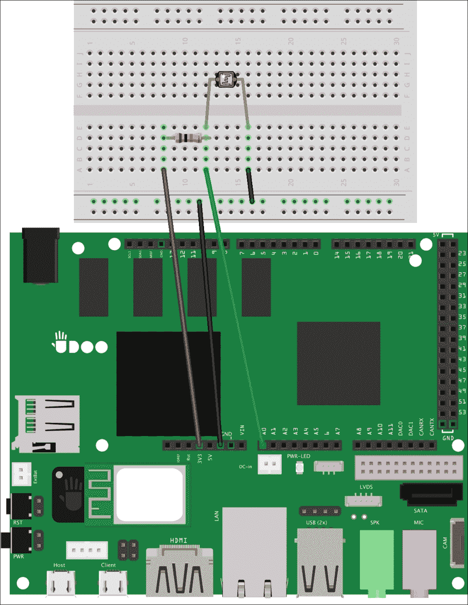
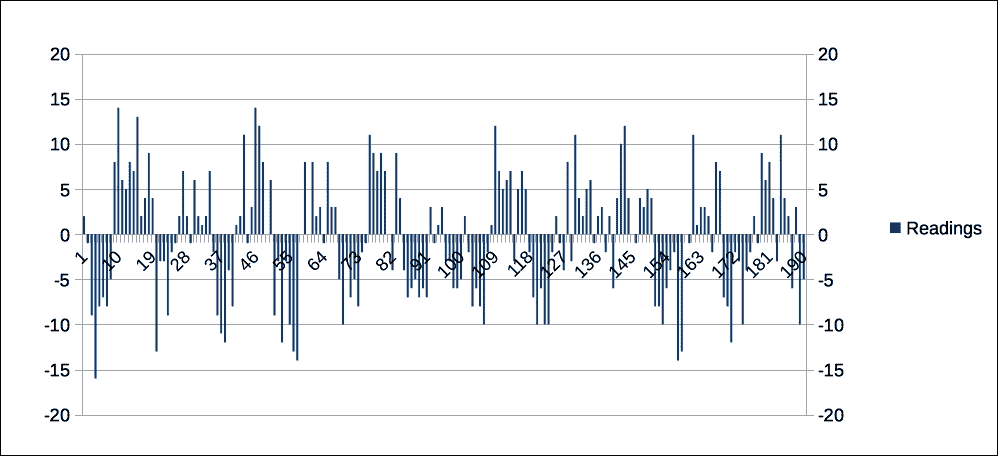

# 第四章。使用传感器聆听环境

当我们构建原型时，我们希望为最终用户提供最好的交互。有时，我们构建没有任何人工交互的真实世界应用，但它们只是倾听环境来收集数据并决定做什么。无论我们的原型是什么，如果我们想要阅读和理解人类的行为或环境变化，我们需要使用一套新的电子元件:**传感器**。

每次我们构建一个物理应用时，我们都必须记住，我们的项目越复杂，我们就越有可能需要添加传感器来实现所需的交互。

在这一章中，我们将从头开始一个新的现实世界应用，它能够感知我们的心跳并将结果发布到我们的安卓应用。

在本章中，我们将涵盖以下主题:

*   使用环境传感器
*   构建心跳监视器
*   从传感器收集数据
*   显示从安卓应用收集的数据

# 使用环境传感器

在电子学中，传感器是用来检测特定物质或粒子性质的任何变化的组件。当任何变化发生时，传感器提供的电压变化可以改变电流和其他电子元件的行为。如果微控制器连接到传感器，它可以根据运行的程序决定采取不同的行动。

传感器可以检测许多*属性*的变化，例如热辐射、湿度、光、无线电、声波和许多其他属性。当我们在项目中使用传感器时，我们必须选择特定的属性来收听，然后我们需要读取和管理电压变化。有时，为了执行我们的检查，我们需要将这些电气变化转换成其他测量单位，如仪表或温度。在其他时候，我们可能会使用更复杂的传感器，这些传感器已经为我们进行了全部或部分转换。例如，如果我们正在建造机器人漫游车，我们可能需要使用传感器来检测与物体的距离，以便避开任何房间障碍物。在这种情况下，我们将使用*超声波传感器*，其原理类似于雷达或声纳。它发出高频声波，并评估收到的回声。通过分析发送和接收信号回波之间的时间间隔，我们可以确定距离目标的距离。

实际上，在一个普通的草图中，我们从传感器读取接收到信号回波之前经过的微秒数。为了使这些值更有用并找到正确的距离，我们可能需要在草图内部编写一个微秒到厘米或英寸的转换器。

然而，只有当我们知道传感器是如何工作的，以及信号每微秒传播多少厘米或英寸时，这才是可能的。幸运的是，我们可以在组件制造商发布的一份文件中找到这些信息，这份文件被称为 **数据表**。有了这些知识，我们可以很容易地将所有探究的价值转化为我们所寻找的。当我们完成本章中的原型时，我们可以看一下网址[http://arduino.cc/en/tutorial/ping](http://arduino.cc/en/tutorial/ping)，其中包括一个关于如何使用超声波传感器以及如何容易地将检测到的信号转换成不同的测量单位的示例。

# 搭建心跳监测仪

在前面的章节中，我们构建了我们的第一个配备了 led 执行器的原型来改变周围的环境，然后我们使 Android 应用能够通过内部的 ADK 通信来控制 LED 的行为。我们已经看到，传感器确实有助于改善我们原型的交互，我们可能会尝试将这一新功能添加到以前的项目中。事实上，因为我们使用的是能够发光的组件，所以我们可能会考虑添加一个外部光传感器，以便微控制器能够根据环境光打开和关闭发光二极管。

这只是我们如何使用光传感器的一个例子。事实上，我们必须记住，每个传感器可以以不同的方式使用，我们的工作是找到检测值和物理应用目标之间的相关性。正如我们将在心跳监视器中看到的那样，我们永远不应该停止仅将传感器用于主要用途。

## 用光传感器创建电路

与之前的原型类似，心跳监视器由两部分组成。第一个是电路和草图，应该从光传感器收集数据，并将其转换为代表**每分钟节拍** ( **bpm** )的值。第二个是安卓应用，它在屏幕上显示我们心率的计算值。

### 注

即使这个原型能取得好的结果，出于医学原因使用自制原型总是一个坏主意。光敏电阻仅用于演示，*不应用于任何医疗目的。*

对于这个物理应用，我们将使用一个 **光敏电阻**作为我们的光传感器的一部分。光敏电阻，也称为**光敏电阻** ( **LDR** )，其工作原理类似于以前原型中使用的传统电阻，但它提供的电阻略有不同。事实上，它的电阻根据测量的光强而变化，如果我们监控这个值，我们可以很容易地计算出环境强度是增加还是减少。我们还使用了一个*亮红色* LED，与之前使用的不同，因为它的功率足够让光线穿过我们的皮肤。

我们的目标是创建一个电路，我们可以将食指的一侧放在光敏电阻的顶部，另一侧是明亮的发光二极管。这样，一部分光会通过我们的手指，被光敏电阻探测到。在每一次心跳中，压力波沿着动脉向外移动，增加了我们的血液量。当光线穿过我们的组织时，这种血液体积的变化会改变照射在传感器上的光量。所以，当我们看到探测到的数值有中等或高的变化时，这可能就是我们的心跳。

为了开始构建我们的原型，我们需要将光敏电阻放入实验板，这样我们就可以实现以下模式:



通过以下步骤实现前面的模式:

1.  光敏电阻的腿可能太长。使用电子元件切割机切割腿部，使其最多为 1.5 厘米。这不是一个要求，但它可以简化原型的使用。
2.  将 UDOO +3.3V 引脚连接到试验板的第一条线。请确保不要连接+5V 电源引脚，因为它可能会在连接过程中损坏电路板。
3.  在板上放一个 *10 千欧*电阻，连接到+3.3V 引脚；我们还需要将另一根引线连接到模拟输入 A0 引脚。
4.  Connect the photoresistor to the same column of the resistor and the A0 pin; the second lead should be connected to the negative line of the power bus.

    ### 类型

    光敏电阻的作用和其他电阻一样，所以我们在这一步连接哪根导线并不重要，因为*它们没有极性*。

5.  将 UDOO 接地连接到电源总线的负极线。

通过这些步骤，我们构建了一个由两个电阻组成的**分压器**电路。根据电阻值，这种电路产生的输出电压是输入电压的一小部分。这意味着，因为电阻根据光强而变化，所以分压器给出的输出电压会随着光照而变化。这样，电路板会注意到这些变化，并将其转换为一个介于 0 和 1023 之间的数值。换句话说，当光敏电阻处于阴影中时，我们读取高值，而当它处于光照中时，我们读取低值。因为我们将 *10 千欧*电阻连接到+3.3V 引脚，所以我们可以说这个分压器是使用**上拉**电阻构建的。

### 类型

电压互感器常用于许多电子电路中。你可以在[https://learn.sparkfun.com/tutorials/voltage-dividers](https://learn.sparkfun.com/tutorials/voltage-dividers)找到更多关于这种电路的其他应用的信息。

为了完成我们的原型，我们必须在电路中添加明亮的发光二极管。然而，因为我们需要将 LED 放在手指的相对侧，所以我们不能将组件直接连接到我们的实验板，而是需要使用几个*鳄鱼夹*。作为第一步，我们需要按照以下模式扩展电路:


通过以下步骤实现前面的模式:

1.  将 UDOO +5V 电源引脚连接到电源总线的正极线。
2.  在试验板上增加一个 *220 欧姆*电阻，并将一根引线连接到电源总线的负极线。
3.  将导线连接器的一侧连接到 *220 欧姆*电阻器的另一根引线上。
4.  将导线连接器的一侧连接到电源总线的正极线上。
5.  将第一个鳄鱼夹的一侧连接到连接到电源总线正极线的导线上。
6.  将第二个鳄鱼夹的一侧连接到连接到电阻器的导线上。
7.  Connect the crocodile clip that extends the +5V pin to the long leg of the LED.

    ### 注

    在进行下一步之前，请记住您使用的是非常明亮的发光二极管。你应该避免把它对准你的眼睛。

8.  将延长电阻器和接地连接的鳄鱼夹连接到发光二极管的短腿。

如果所有的连接都设置好了，LED 应该会亮起，我们可以把它作为我们原型的移动部分。需要记住的一点是，鳄鱼夹*的金属终端千万不要碰在一起*否则电路会停止工作，一些部件可能会因为*短路*而损坏。

# 从草图中收集数据

既然有了工作电路，就应该开始写下草图，从光传感器采集数据。然后我们应该分析这些结果，并考虑一种将读数转换为心跳计数器的算法。我们应该开始一个新的草图，并添加以下步骤:

1.  Add the following declarations on the top of the sketch:

    ```java
    #define SENSOR A0
    #define HEARTBEAT_POLL_PERIOD50
    #define SECONDS 10
    constint TIMESLOTS = SECONDS * 1000 / HEARTBEAT_POLL_PERIOD;
    int sensorReading = 0;
    ```

    我们用`A0`值定义类似对象的宏`SENSOR`，该值是我们将用于模拟读取的引脚。我们设置`HEARTBEAT_POLL_PERIOD`来指定微控制器在连续传感器读数之间应该等待多少毫秒。使用`SECONDS`参数，我们定义了在使用收集的数据处理和估计心率之前应该经过的秒数。实际上，我们将`SECONDS`乘以`1000`将该值转换为毫秒，然后除以`HEARTBEAT_POLL_PERIOD`参数以定义`TIMESLOTS`常数。这个变量定义了我们应该循环读取相位多少次，以收集正确数量的读数来估计心率。这样，我们对每个`TIMESLOTS`周期进行读取，当周期结束时，我们计算心率。最后一个变量`sensorReading`用于存储每次循环迭代期间的传感器读数。

2.  在`setup()`功能中，增加串口的初始化，这样我们就可以在 UDOO 板和我们的电脑之间打开一个通讯:

    ```java
    void setup() {
     Serial.begin(115200);
    }
    ```

3.  Add the following function at the bottom of the sketch to print read values through the serial port:

    ```java
    void printRawData() {
     sensorReading = analogRead(SENSOR);
     Serial.println(sensorReading);
    }
    ```

    我们使用`analogRead`内置功能从模拟输入引脚读取输入数据。因为这些引脚是只读的，所以我们不需要在`setup()`功能中做任何进一步的配置，也不需要改变输入分辨率。

    ### 类型

    有时我们可能需要更好的模拟读取分辨率，范围在 0 到 4095 之间，而不是 0 到 1023。在这种情况下，我们应该使用`analogReadResolution`参数来更改分辨率。我们可以在 http://arduino.cc/en/Reference/AnalogReadResolution 的官方文档中找到更多关于模拟输入分辨率的信息。

    当读取完成时，我们在串行端口中打印结果，以便我们可以通过 Arduino IDE 串行监视器读取这些值。

4.  In the main `loop()` function, add the `printRawData()` function call for each reading timeslot:

    ```java
    void loop() {
     for (int j = 0; j < TIMESLOTS; j++) {
     printRawData();
     delay(HEARTBEAT_POLL_PERIOD);
     }
     Serial.println("Done!");
     delay(1000);
    }
    ```

    我们正在进行`TIMESLOTS`迭代，这样我们可以获得 10 秒钟的读数，如前所述。所有读数完成后，我们在串行端口上打印一条消息，并等待一秒钟，然后再次开始读数。

    ### 类型

    延迟一秒**完成！**消息只是阅读周期工作正常概念的证明。我们稍后会移除它们。

在这个配置之后，我们可以上传草图并继续我们的第一个实验。将食指的下侧放在光敏电阻上，同时将发光二极管放在另一侧。

### 类型

为了获得更精细的读数，最好与光敏电阻和发光二极管的接触部分是指骨和指甲之间的部分。

要开始实验，点击**串行监视器**按钮，当草图打印出**完成！**消息，我们会看到一些数值如下图截图所示:


这些是光传感器在我们心跳期间捕捉到的绝对值。如果我们将完整的 10 秒迭代复制并粘贴到 Microsoft Excel、Libre Office Calc 或 Numbers 电子表格中，我们可以绘制一个折线图，并以更容易理解的格式查看给定的结果:


我们可以看到这些值随着时间的推移而变化，当心跳发生时，光传感器检测到光强的变化，这一事件在我们的图表中引起峰值。换句话说，我们可以假设每个峰值都与一次心跳有关。下一步是改进我们的草图来近似和转换这些值，因为我们应该尝试消除读取错误和误报。主要思想是在每次迭代后收集固定数量的样本，以存储这个读数和最后一个读数之间的差异。如果我们存储所有随时间变化的差异，我们可以很容易地找到我们读数的趋势，并识别我们何时读取了峰值。为了改进我们的算法，我们需要执行以下步骤:

1.  Add the following variables on the top of the sketch:

    ```java
    #define SECONDS 10
    #define SAMPLES 10

    constint TIMESLOTS = SECONDS * 1000 / HEARTBEAT_POLL_PERIOD;

    int sensorReading = 0;
    int lastReading = 0;
    int readings[SAMPLES];
    int i = 0;
    int delta = 0;
    int totalReading = 0;

    ```

    我们设置了多少`SAMPLES`来计算增量差异。然后我们使用`lastReading`、`i`和`delta`变量分别存储上次读数、当前索引迭代`readings`数组和上次读数的当前差值。然后我们定义一个累加器来存储当前的总读数。

2.  初始化设置功能中的`readings`数组:

    ```java
    void setup() {
     Serial.begin(115200);

     for (int j = 0; j < SAMPLES; j++) {
     readings[j] = 0;
     }
    }
    ```

3.  Add the `collectReads()` function at the bottom of the sketch:

    ```java
    void collectReads() {
     sensorReading = analogRead(SENSOR);
      delta = sensorReading - lastReading;
     lastReading = sensorReading;
     totalReading = totalReading - readings[i] + delta;
      readings[i] = delta;
     i = (i + 1) % SAMPLES;
    }
    ```

    在第一部分中，我们将读取当前值，并计算与上次读数的差值。然后我们使用当前的`totalReading`和最后存储在`readings`数组中的差值来累加这个差值。我们现在可以用当前索引的新`delta`对象更新`readings`数组，该对象在最后一行递增，并使用*模运算符*保持在范围内。

4.  在主`loop()`函数中，用新的`collectReads()`函数代替`printRawData()`函数调用，然后打印累加值:

    ```java
    for (int j = 0; j < TIMESLOTS; j++) {
     collectReads();
     Serial.println(totalReading);
      delay(HEARTBEAT_POLL_PERIOD);
    }
    ```

有了这些增强，我们可以上传新的草图，并以与之前相同的方式重复实验:

1.  将食指放在光敏电阻和发光二极管之间。
2.  点击 Arduino IDE 上的**串行监视器**。
3.  完成整整 10 秒的迭代。
4.  将这些值复制并粘贴到之前的电子表格中，并绘制一个条形图。我们应该避免包含前八个读数，因为它们与`readings`数组尚未初始化的第一次迭代相关。

收集的值生成一个图表，如下所示:



在这些经过处理的读数中，正值和负值之间有波动，这发生在我们攀登或下降第一张图表中看到的峰值时。有了这些知识，我们可以稍微改进我们的算法，这样我们就可以跟踪上升或下降阶段，并选择是丢弃读数还是将其算作单次心跳。为了完成这一部分，我们需要使用以下步骤添加以下代码:

1.  Add these declarations at the top of the sketch:

    ```java
    #define SECONDS 10
    #define POS_THRESHOLD 3
    #define NEG_THRESHOLD -3

    const int TIMESLOTS = SECONDS * 1000 / HEARTBEAT_POLL_PERIOD;
    const int PERMINUTE = 60 / SECONDS;
    int beats = 0;
    boolean hillClimb = false;

    ```

    我们定义`POS_THRESHOLD`和`NEG_THRESHOLD`参数来设置间隔的界限，在该界限内我们丢弃值以避免误报。我们还定义了一个`PERMINUTE`常数来知道哪一个是获得每分钟节拍的乘数和`beats`累加器。作为最后的声明，如果下一个读数处于上升或下降阶段，我们设置`hillClimb`变量来存储。例如，一个`True`值意味着我们正处于上升阶段。

2.  Add the `findBeat()` function at the bottom of the sketch:

    ```java
    void findBeat() {
      if (totalReading<NEG_THRESHOLD) {
       hillClimb = true;
      }
      if ((totalReading>POS_THRESHOLD)&&hillClimb) {
       hillClimb = false;
        beats += 1;
      }
    }
    ```

    我们检查`totalReading`参数是否低于`NEG_THRESHOLD`参数，以了解我们是否处于峰值的下降阶段。在这种情况下，我们将`hillClimb`变量设置为`True`。在最后一个代码块中，我们检查我们是否越过了`POS_THRESHOLD`并处于上升阶段。在这种情况下，我们将`hillClimb`设置为`False`，并将该相位变化计为心跳。如果我们看一下前面的图表，通过前面的代码，我们可以很容易地确定我们在每次读取过程中处于哪个阶段，并且有了这些信息，我们可以丢弃尽可能多的错误和误报。

3.  在草图底部增加实用功能【T0:

    ```java
    int calcHeartRate() {
      return beats * PERMINUTE;
    }
    ```

4.  在主`loop()`功能中，添加以下代码以使用前面的功能，并在串口中打印带有心跳次数的心率:

    ```java
    for (int j = 0; j < TIMESLOTS; j++) {
     collectReads();
     findBeat();
      delay(HEARTBEAT_POLL_PERIOD);
    }
    Serial.print(calcHeartRate());
    Serial.print(" with: ");
    Serial.println(beats);
    beats = 0;
    delay(1000);
    ```

5.  再次上传草图，开始数心跳。在串行监视器中，我们会注意到以下值:

    ```java
    72 with: 12
    84 with: 14
    66 with: 11
    78 with: 13
    90 with: 15
    84 with: 14
    ```

我们草图的最后一个改进是添加了 ADK 功能，将计算出的心跳发送到我们的安卓应用。在草图的顶部，添加下面的*配件描述符*，它几乎等于我们在前面的原型中使用的描述符:

```java
#include <adk.h>
#define BUFFSIZE 128
char accessoryName[] = "Heartbeat monitor";
char manufacturer[] = "Example, Inc.";
char model[] = "HeartBeat";
char versionNumber[] = "0.1.0";
char serialNumber[] = "1";
char url[] = "http://www.example.com";
uint8_t buffer[BUFFSIZE];
uint32_tbytesRead = 0;
USBHostUsb;
ADKadk(&Usb, manufacturer, model, accessoryName, versionNumber, url, serialNumber);
```

作为最后一步，在主`loop()`功能中，在 ADK 通信中结束草图执行，并移除所有串行打印以及一秒钟的最后延迟:

```java
void loop() {
Usb.Task();
  if (adk.isReady()) {
    // Collect data
    for (int j = 0; j < TIMESLOTS; j++) {
      collectReads();
      findBeat();
      delay(HEARTBEAT_POLL_PERIOD);
    }
  buffer[0] = calcHeartRate();
 adk.write(1, buffer);
  beats = 0;
 }
}
```

这样，当 ADK 通信启动并运行时，心率监视器将启动，我们将使用`adk.write()`功能将计算的心率发送回安卓应用。

# 安卓进行数据可视化

现在，我们的物理应用有了一个完全工作的电路，可以通过非常规地使用光传感器来读取我们的心率，我们应该用一个安卓应用来完成原型。从安卓工作室，用**安卓 API 19** 启动一个名为*心脏监视器*的新安卓项目。在引导过程中，选择一个名为*监视器*的**空白活动**。

我们从用户界面开始编写应用，我们必须思考和设计活动布局。为了这个应用的目的，我们编写了一个简单的布局，其中有一个标题和一个文本组件，我们将在安卓每次从草图接收心跳估计时更新它。这种布局可以通过以下步骤实现:

1.  In the `styles.xml` file under `res/values/`,add these color declarations and replace the standard theme:

    ```java
    <color name="sulu">#CBE86B</color>
    <color name="bright_red">#A30006</color>

    <style name="AppTheme" parent="Theme.AppCompat">
    <!-- Customize your theme here. -->
    </style>
    ```

    `AppTheme`参数继承了`Theme.AppCompat`参数，该参数引用了安卓支持库中可用的*赫萝黑暗*主题。我们还创建了绿色和红色，稍后将在我们的应用中使用。

2.  在`res/layout/`下的`activity_monitor.xml`文件中，用突出显示的更改替换根布局:

    ```java
    <LinearLayout
    xmlns:android="http://schemas.android.com/apk/res/android"
     xmlns:tools="http://schemas.android.com/tools"
     android:orientation="vertical"
     android:layout_width="match_parent"
     android:layout_height="match_parent"
     android:paddingLeft="@dimen/activity_horizontal_margin"
     android:paddingRight="@dimen/activity_horizontal_margin"
     android:paddingTop="@dimen/activity_vertical_margin"
     android:paddingBottom="@dimen/activity_vertical_margin"
     tools:context=".Monitor">
    </LinearLayout>

    ```

3.  用下面的代码更改前面布局中包含的`TextView`参数，使其有一个更大的绿色标题，显示应用名称:

    ```java
    <TextView
     android:text="Android heart rate monitor"
     android:gravity="center"
     android:textColor="@color/sulu"
     android:textSize="30sp"
     android:layout_width="match_parent"
     android:layout_height="wrap_content" />
    ```

4.  Nest a new `LinearLayout` in the root layout:

    ```java
    <LinearLayout
     android:layout_width="match_parent"
     android:layout_height="wrap_content"
     android:layout_marginTop="30sp"
     android:gravity="center">
    </LinearLayout>
    ```

    我们从前面的元素设置一个边距，使用所有可用的空间将内部组件放置在中心位置。

5.  添加以下文本视图以显示标签和占位符，该占位符将包含每分钟的计算节拍:

    ```java
    <TextView
     android:text="Current heartbeat: "
     android:textColor="@color/sulu"
     android:textSize="20sp"
     android:layout_width="wrap_content"
     android:layout_height="wrap_content"/>

    <TextView
     android:id="@+id/bpm"
     android:text="0 bpm"
     android:textColor="@color/bright_red"
     android:textSize="20sp"
     android:layout_width="wrap_content"
     android:layout_height="wrap_content"/>
    ```

6.  检索活动类中的小部件，以便在每次阅读后进行更改。在`Monitor`类的顶部添加以下声明:

    ```java
    private TextViewmBpm;
    ```

7.  通过高亮显示的代码

    ```java
    @Override
    protected void onCreate(Bundle savedInstanceState) {
     super.onCreate(savedInstanceState);
     setContentView(R.layout.activity_monitor);
     mBpm = (TextView) findViewById(R.id.bpm);
    }
    ```

    ，在`onCreate()`回调中找到`bpm`标识的视图

在没有任何进一步配置的情况下，以下是获得的布局:


应用布局现已完成，我们可以开始设置 ADK 通信。

## 设置 ADKToolkit

就像我们对第一个原型所做的那样，我们需要再次编写所有的 ADK 类和方法来发送和接收数据。然而，因为软件开发的一个很好的原则是不要重复自己(DRY)，我们将使用一个外部库，为所有需要的功能提供高度抽象。这个库叫做 **ADKToolkit** ，它是的包装器，这是本地 ADK API，可以防止我们每次启动一个新项目时代码重复。我们可以在[http://docs.adktoolkit.org](http://docs.adktoolkit.org)找到更多与库相关的信息和例子。

所需的第一步是将 ADKToolkit 库添加到应用依赖项中。在用安卓工作室构建的项目中，我们有两个不同的文件叫做`build.gradle`。这些文件包含与 Gradle 构建系统相关的所有配置，其中一个与全局项目相关，另一个与我们正在构建的模块应用相关。即使两个文件都包含依赖列表，我们也应该将库添加到与应用模块相关的`build.gradle`文件中，该文件位于`app`文件夹中。如果我们使用安卓工作室界面左侧的**项目**面板，我们必须双击 **build.gradle (Module: app)** 脚本。在这个文件中，我们需要在`dependencies`块中添加高亮显示的代码:

```java
dependencies {
  compile fileTree(dir: 'libs', include: ['*.jar'])
 compile 'com.android.support:appcompat-v7:21.0.3'
 compile 'me.palazzetti:adktoolkit:0.3.0'
}
```

现在我们可以点击 flash 消息中的**立即同步**按钮，等待 gradle 完成自动下载 ADKToolkit 库的同步过程。

就像我们在[第 2 章](2.html "Chapter 2. Know Your Tools")、*了解你的工具*中所做的那样，我们应该更新安卓清单文件，用正确的意图过滤器和附件描述符注册应用。要继续 ADK 配置，请遵循以下提醒:

1.  使用以下代码创建位于`res/xml/`下的附件过滤器文件【T0:

    ```java
    <resources>
     <usb-accessory
        version="0.1.0"
        model="HeartBeat"
        manufacturer="Example, Inc."/>
    </resources>
    ```

2.  在`AndroidManifest.xml`文件中添加 USB `<uses-feature>`标签。
3.  在`AndroidManifest.xml`文件的活动块中，添加 ADK `<intent-filter>`和`<meta-data>` 标签来设置 USB 附件过滤器。

现在，我们必须初始化 ADKToolkit 库，以启用通信并开始读取已处理的数据。在`Monitor`类中，添加以下片段:

1.  在类的顶部声明`AdkManager`对象:

    ```java
    private TextViewmBpm;
    private AdkManagermAdkManager;

    ```

2.  Add the `AdkManager` initialization in the `onCreate()` method:

    ```java
    mBpm = (TextView) findViewById(R.id.bpm);
    mAdkManager = new AdkManager(this);

    ```

    `AdkManager`是 ADKToolkit 库的主类。要初始化管理器实例，我们应该将当前上下文传递给它的构造函数，因为活动类继承自`Context`类，所以我们可以简单地使用`this`关键字传递实例。与 ADK 通信相关的所有功能将通过`mAdkManager`实例使用。

3.  Override the `onResume()` and `onPause()` callbacks to start and stop the ADK connection when the `Monitor` activity is opening or closing:

    ```java
    @Override
    protected void onResume() {
     super.onResume();
     mAdkManager.open();
    }

    @Override
     protected void onPause() {
     super.onPause();
     mAdkManager.close();
    }
    ```

    `mAdkManager`实例展示了`close()`和`open()`方法，可以轻松控制附件连接。我们必须记住，这是在`onResume()`方法中打开 ADK 通信的要求，因为`AdkManager`初始化不足以启用安卓和 Arduino 之间的通道。

通过前面的步骤，我们已经完成了 ADK 配置，现在我们可以开始编写从草图接收数据的逻辑。

## 来自安卓的连续数据读数

我们的安卓应用的主要概念是使用 ADKToolkit 对 UDOO 板收集的数据进行连续读取。每次在 OTG 串行端口中写入估计值时，我们都需要读取这些值并更新安卓用户界面，但是，在继续之前，我们需要对安卓线程系统进行一些考虑。

当一个安卓应用启动时，这个应用的所有组件都在同一个进程和线程中运行。这被称为 **主线程**，它托管其他组件，当前前景`Activity`实例。每当我们需要更新当前活动的任何视图时，我们应该在主线程中运行更新代码，否则应用将崩溃。另一方面，我们必须记住，在主线程中完成的任何操作都应该立即完成。如果我们的代码很慢，或者它进行了阻塞操作，例如输入/输出，系统将弹出**应用不响应** ( **ANR** )对话框，因为主线程无法处理用户输入事件。

如果我们在主线程中运行连续读取，这个错误肯定会发生，因为我们应该在一个周期内查询光传感器，这导致每 10 秒钟就有一次输入/输出操作被阻塞。由于这些原因，我们可以利用一个`ExecutorService`类来运行定期调度的线程。在我们的例子中，我们将从上面的调度程序中定义一个每 10 秒创建一次的短命线程。

当调度线程完成从 OTG 串口读取数据时，它应该通过`Handler`类将接收到的消息传递给主线程。我们可以在官方安卓文档中找到更多关于如何与主线程沟通的信息和示例，网址为:

[https://developer . Android . com/training/多线程/communicate-ui.html](https://developer.android.com/training/multiple-threads/communicate-ui.html) 。

作为第一步，我们应该通过以下步骤公开更新安卓用户界面所需的所有方法:

1.  Create a new Java interface called `OnDataChanges` and add the following method:

    ```java
    public interface OnDataChanges {
      void updateBpm(byte heartRate);
    }
    ```

    通过这段代码，我们定义了将在我们的`Handler`中使用给定的`heartRate`参数更新用户界面的界面。

2.  通过高亮显示的代码

    ```java
    public class Monitor extends ActionBarActivity implements OnDataChanges {
      private TextViewmBpm;
      // ...
    ```

    实现`Monitor`类中的接口
3.  在类的末尾写下以下代码，通过`updateBpm`方法更新安卓用户界面:

    ```java
    @Override
    public void updateBpm(byte heartRate) {
     mBpm.setText(String.format("%d bpm", heartRate));
    }
    ```

最后一个需要的步骤是实现我们的调度线程，该线程从 Arduino 中读取已处理的数据，并将这些值写入用户界面。要完成最后一个构建模块，请执行以下步骤:

1.  在您的命名空间中创建一个名为`adk`的新包。
2.  在`adk`包中，添加一个名为`DataReader`的新类。
3.  At the top of the class, add the following declarations:

    ```java
    private final static int HEARTBEAT_POLLING = 10000;
    private final static int HEARTBEAT_READ = 0;
    private AdkManager mAdkManager;
    private OnDataChanges mCaller;
    private ScheduledExecutorService mScheduler;
    private Handler mMainLoop;
    ```

    我们正在定义心跳轮询时间和一个`int`变量，稍后我们将使用它来标识我们的处理程序中发布的消息。我们还存储了`AdkManager`参数和`caller`活动的引用，以分别使用 ADK `read`方法和`updateBpm`回调。然后我们定义我们的`ExecutorService`实现以及一个`Handler`，我们将附加到主线程。

4.  Implement the `DataReader` constructor to define the handling message code when the main thread receives a new message from the background thread:

    ```java
    public DataReader(AdkManageradkManager, OnDataChangescaller) {
     this.mAdkManager = adkManager;
     this.mCaller = caller;
     mMainLoop = new Handler(Looper.getMainLooper()) {
        @Override
        public void handleMessage(Message message) {
          switch (message.what) {
            case HEARTBEAT_READ:
         mCaller.updateBpm((byte) message.obj);
              break;
          }
        }
      };
    }
    ```

    在存储了`AdkManager`实例和`caller`活动引用之后，我们将新的`Handler`附加到应用的主循环程序，它位于主线程中。我们应该覆盖`handleMessage`回调，以便检查用户定义的消息代码来识别`HEARTBEAT_READ`消息。在这种情况下，我们使用附加到接收到的`message`参数的对象调用`updateBpm`回调。

    ### 类型

    每个`Handler`都有自己的消息代码命名空间，因此您不需要担心您的`message.what`属性的可能值与其他处理程序冲突。

5.  At the bottom of the `DataReader` class, add the following private class that implements the `Runnable` interface to read and publish sensor data:

    ```java
    private class SensorThread implements Runnable {
      @Override
      public void run() {
        // Read from ADK
       AdkMessage response = mAdkManager.read();
        // ADK response back to UI thread for update
        Message message = mMainLoop.obtainMessage(HEARTBEAT_READ, response.getByte());
       message.sendToTarget();
      }
    }
    ```

    当线程启动时，我们使用`AdkManager read`方法读取可用数据。该方法返回一个`AdkMessage`实例，该实例包含原始接收字节和一些解析响应的实用程序；在我们的例子中，我们使用`getByte`方法获取第一个接收到的字节。作为最后一步，我们应该通过主线程处理程序发布收集的值。然后，我们使用`obtainMessage`方法创建一个`Message`实例，它将从处理程序消息池中提取一个新消息。现在我们可以使用`sendToTarget`方法将消息发送到主线程。

6.  Add the `DataReader start()` method to start a scheduler that spawns threads periodically:

    ```java
    public void start() {
      // Initialize threads
     SensorThread thread = new SensorThread();
      // Should start over and over publishing results

     Executors.newSingleThreadScheduledExecutor();
     mScheduler.scheduleAtFixedRate(thread, 0, HEARTBEAT_POLLING, TimeUnit.MILLISECONDS);
    }
    ```

    当我们从`Monitor`活动调用这个方法时，`ExecutorService` 参数将使用`newSingleThreadScheduledExecutor()`函数初始化。这将创建一个单线程执行器，保证在任何给定时间执行不超过一个任务，不管轮询周期如何。作为最后一步，我们使用一个周期性的调度程序每隔`HEARTBEAT_POLLING`毫秒运行我们的`SensorThread`。

7.  将`stop()`方法添加到`DataReader`类中，以阻止调度产生新线程。在我们的例子中，我们简单地使用`shutdown()`执行者的方法:

    ```java
    public void stop() {
      // Should stop the calling function
    mScheduler.shutdown();
    }
    ```

8.  现在我们应该回到`Monitor`类，在活动生命周期内启动和停止我们的线程调度器。在`Monitor`类顶部添加`DataReader`申报:

    ```java
    private AdkManager mAdkManager;
    private DataReader mReader;

    ```

9.  在`onResume()`和`onPause()`活动的回调中启动和停止读取调度程序，如以下高亮显示的代码所示:

    ```java
    @Override
    protected void onResume() {
     super.onResume();
     mAdkManager.open();
     mReader = new DataReader(mAdkManager, this);
     mReader.start();
    }
    @Override
    protected void onPause() {
     super.onPause();
     mReader.stop();
     mAdkManager.close();
    }
    ```

没有什么可以做的了我们的原型已经准备好部署了。现在我们可以把食指放在光敏电阻和发光二极管之间，看一看安卓应用，同时结果每 10 秒更新一次。

# 增强原型

即使原型获得了良好的结果，我们也可能想要更精确的读数。通过为光敏电阻和明亮的发光二极管提供更好的外壳，可以极大地增强物理应用。事实上，如果我们能够去除环境光，并使两个组件在读取过程中更加稳定，我们就可以有很大的改进。

实现这个目标的一个好方法是使用一个容易获得的组件:*一个木桩*。我们可以一次钻完钉子，这样洞就排好了。这样，我们可以把光敏电阻放在一个孔中，而发光二极管放在另一个孔中。其余组件和试验板本身保持不变。下图显示了容纳两个组件的木栓:


另一个改进是更改和使用草图中可用的算法参数。改变间隔和样本数量可以获得更好的结果；然而，我们必须记住，这些变化也可能得到更糟糕的读数。以下是我们可能更改的算法参数的集合:

```java
#define SAMPLES 10
#define POS_THRESHOLD 3
#define NEG_THRESHOLD -3
#define HEARTBEAT_POLL_PERIOD 50
#define SECONDS 10
```

例如，如果我们发现我们的光敏电阻在 50 毫秒的`HEARTBEAT_POLL_PERIOD`类物体宏中工作不良，我们可以尝试使用更常见的计时，如 100 或 200 毫秒。

# 总结

在本章中，我们探讨了使用外部传感器来提高物理应用的能力。我们发现了传感器的工作原理，并看了一个检测距离和物体接近度的例子。

作为第一步，我们获得了一些关于心跳生物过程的信息，我们发现光敏电阻和明亮的发光二极管如何帮助我们检测心率。我们使用我们的第一台心脏监护仪原型做了一些初步实验，收集了各种绝对值，并在随后绘制成图表。在第一次分析之后，我们发现每个峰值都可能是一次心跳，这使我们能够通过一种能够计算选定时间间隔内读数之间差异的算法来增强读数阶段。

利用之前的值，我们绘制了一个新的图表，并发现我们应该检查何时有相位变化，以找到可能的心跳。事实上，我们的最后一项工作是添加一个计算心率的函数，准备通过 ADK 通信协议发送回安卓应用。

为了显示前面的结果，我们为我们的安卓应用创建了一个布局。我们配置并使用了 ADKToolkit 库来简化通信过程。通过一个`ScheduledExecutorService`实例，该实例启动用于数据收集的短期线程，我们在自定义用户界面中设置处理后的心率。在本章的最后，我们探讨了如何改进我们的工作原型，并给出了一些建议，我们可以在继续下一章之前遵循这些建议。

在下一章中，我们将构建另一个使用外部组件来控制安卓应用的物理应用。它将利用一些安卓本地应用编程接口，以一种简单的方式实现一些没有过于复杂的硬件和草图是不可能实现的功能。