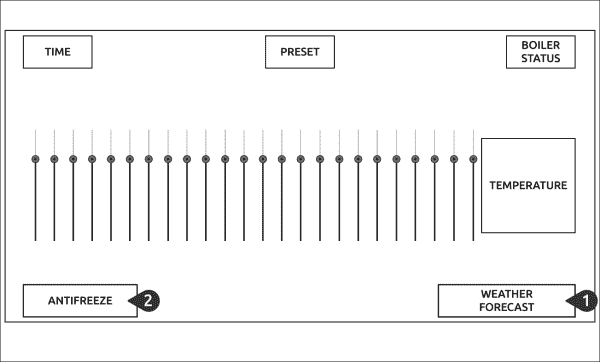
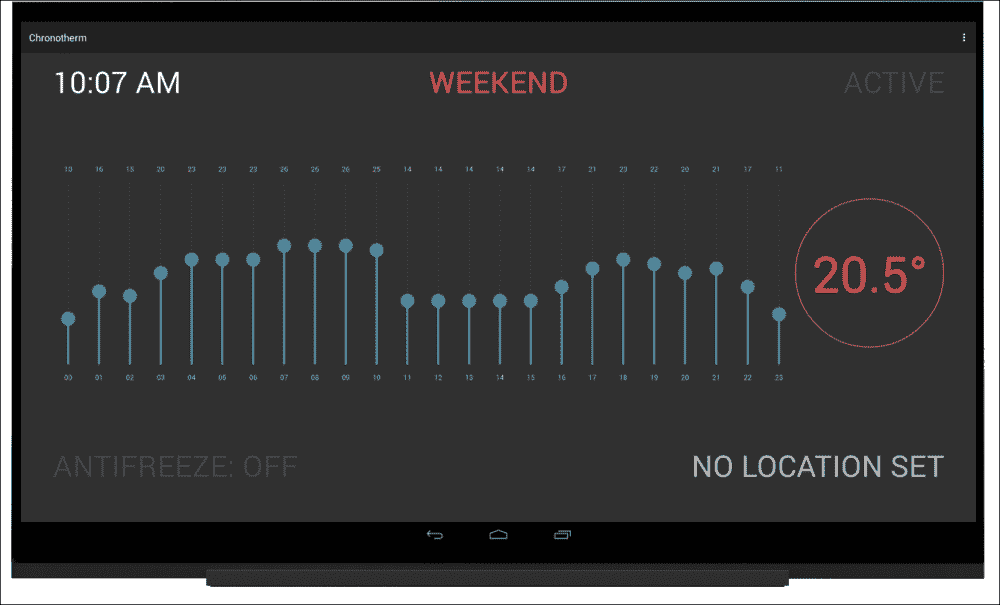
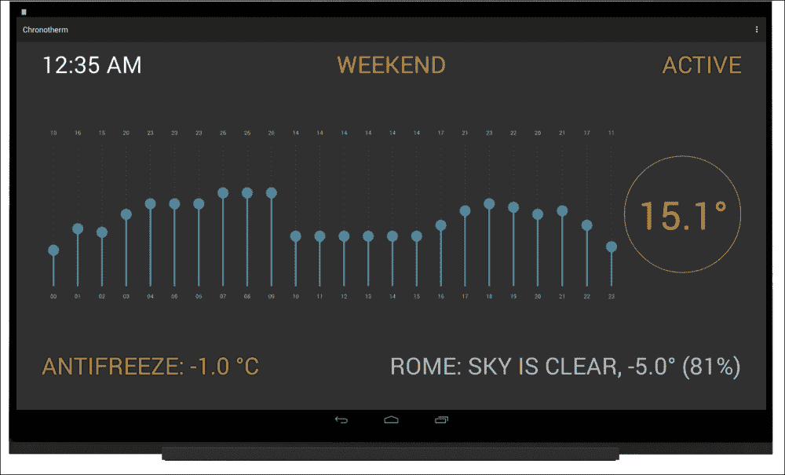

# 八、添加网络功能

在[第 6 章](6.html "Chapter 6. Building a Chronotherm for Home Automation")*为家庭自动化构建 Chronotherm】中，我们探索了家庭自动化的定义，并且一步接一步，我们构建了能够根据用户偏好以编程方式控制锅炉的原型。我们扩展了这个原型，提供了一个预设的配置来存储不同的温度时间表，并通过语音识别和合成来改善用户交互。*

这一次，我们正在增强 Chronotherm 应用的另一个功能，该功能利用网络功能从互联网上收集数据。本章的目标是使我们的原型能够对连接的传感器无法轻易捕捉到的外部事件做出反应。

在本章中，我们将涵盖以下主题:

*   利用网络功能扩展 Chronotherm 应用
*   使用网络服务收集天气预报数据
*   使用收集的数据改变超时空行为

# 通过网络功能扩展 Chronotherm

Chronotherm 应用解决了一个特定的问题。每当当前温度低于一天中每个小时的设定值时，它就会打开锅炉。这个逻辑对于传统的 Chronotherm 来说已经足够了，但是我们可以改进这个行为，这样它就考虑到了家庭温度和天气条件之间的严格关系。例如，在寒冷的日子里，内部温度通常下降得更快；如果我们将这些信息整合到锅炉逻辑中，我们可以让我们的原型更智能。

此外，如果天气真的很冷，我们的锅炉可能会因为里面的水结冰而停止工作。如果我们实现一个防冻功能，不管用户的喜好，当外部温度下降到规定值以下时，启动锅炉，这个问题就可以解决。当用户不在家或过夜时，这些功能可以处理意外情况。

不幸的是，连接外部传感器并不容易，而且构建和使用无线热传感器可能过于复杂。但是，考虑到外部温度确实很重要，我们必须找到一种方法来收集天气条件数据。因为 UDOO Chronotherm 在我们家里，而且它很可能连接到互联网，所以我们可以从提供预测数据的网络服务中获得这些信息，并在我们的计算中使用这些知识。这样，我们甚至可以添加天气状况的完整概述，在为用户提供有用信息的同时改善用户界面。

根据前面提到的需求，我们可以按照以下步骤组织工作:

1.  实现一个模块，用于将我们的原型连接到天气 REST APIs。
2.  定期收集和显示天气预报数据。
3.  编写将使用上述数据的锅炉防冻逻辑。

## 连接到休息应用接口

我们从提供一个连接到 RESTful 网络服务的实现开始我们的工作。**表征状态转移** ( **REST** )是一种简单的无状态架构风格，通常运行在 HTTP 协议上。REST 背后的思想包括将系统的状态公开为我们可以操纵的资源集合，通过它们的名称或 ID 来称呼它们。后端服务负责保存资源数据，通常是通过使用数据库服务器。

当客户端通过 HTTP 协议请求资源时，应用服务器从数据库服务器检索资源，并使用交换格式(如 XML 或 JSON)将其发送回客户端。公开 REST API 使得向移动客户端、浏览器扩展或任何需要访问和处理应用数据的软件提供数据变得极其容易。

在本章中，我们将只使用 REST API 进行信息检索。如果你对 REST 架构的更多细节感兴趣，请点击此链接。

在我们开始实现 API 连接器之前，我们应该在`<application>`标签之前的`AndroidManifest.xml`文件中添加以下权限(以便在我们的应用中使用互联网):

```java
<uses-permission android:name="android.permission.INTERNET" />
```

然后，为了给我们的应用提供网络功能，我们必须创建一个`HttpURLConnection`类的抽象，这样我们就可以通过一个更简单的应用编程接口使用外部服务。要为我们的应用创建连接器，请执行以下步骤:

1.  在名为`http`的新包中创建`UrlConnector`类。
2.  在类的顶部，添加以下声明来存储`HttpURLConnection`类实例:

    ```java
    private HttpURLConnection mConnector;
    ```

3.  Add the following constructor that we will use to initialize the request parameters:

    ```java
    public UrlConnector(String encodedUrl) throws IOException {
      URL url = new URL(encodedUrl);
      mConnector = (HttpURLConnection) url.openConnection();
      mConnector.setReadTimeout(10000);
      mConnector.setConnectTimeout(15000);
    }
    ```

    我们期望一个`encodedUrl`参数作为参数，并使用它来初始化稍后用来打开连接的 URL 对象。然后，我们为读取和连接阶段设置超时，使用对我们的原型有益的值。

4.  添加一个通用方法来设置我们请求的 HTTP 头:

    ```java
    public void addHeader(String header, String content) {
      mConnector.setRequestProperty(header, content);
    }
    ```

5.  Add the following code snippet below the `get()` method that is used to make the call:

    ```java
    public int get() throws IOException {
      mConnector.setRequestMethod("GET");
      return mConnector.getResponseCode();
    }
    ```

    对于`mConnector`实例，我们设置`GET`请求方法返回响应的状态代码。此状态代码将用于检查请求是成功完成还是失败完成。

6.  Add the following `getResponse()` method to get the result from the web server connection:

    ```java
    public String getResponse() throws IOException {
      BufferedReader readerBuffer = new BufferedReader(new InputStreamReader(mConnector.getInputStream()));
      StringBuilder response = new StringBuilder();
      String line;
      while ((line = readerBuffer.readLine()) != null) {
        response.append(line);
      }
      return response.toString();
    }
    ```

    我们使用`mConnector`实例的输入流创建一个缓冲阅读器，然后通过上面的阅读器，我们获得服务器发送的内容。完成后，我们返回字符串，不做任何进一步的修改。

7.  创建一个`disconnect()`方法来关闭与服务器的连接:

    ```java
    public void disconnect() {
      mConnector.disconnect();
    }
    ```

`UrlConnector`类简化了 HTTP 调用，这个实现足以连接到许多不使用任何身份验证流的网络服务。在我们继续之前，我们必须选择一个提供我们要查询的天气预报数据的网络服务。对于我们的原型，我们将使用 OpenWeatherMap 服务，因为它提供了一个没有身份验证流的免费层，并且它也通过 REST API提供。您可以在[http://openweathermap.org/](http://openweathermap.org/)或[http://openweathermap.org/current](http://openweathermap.org/current)找到更多关于服务描述的信息，并了解其 REST APIs 的结构:

当我们调用上面的 RESTful 服务时，我们应该解析 JSON 响应，使其在我们的应用中可用。这种方法可以通过一个知道响应结构并根据我们的需要解析它的 Java 类来实现。实施需要以下步骤:

1.  在名为`weather`的新包中创建`Weather`类。
2.  At the top of the class, add the following declarations:

    ```java
    private String mStatus;
    private double mTemperature;
    private int mHumidity;
    ```

    我们根据我们将从给定响应中使用的内容来声明变量。在我们的例子中，我们使用一个`mStatus`变量来存储天气状况，这样用户就可以知道天气是晴天还是阴天。我们还使用`mTemperature`变量，这是我们的第一个要求，以及`mHumidity`属性为我们的用户提供加分。

3.  Add the class constructor as follows:

    ```java
    public Weather(JSONObject apiResults) throws JSONException, NullPointerException {
      mStatus = apiResults.getJSONArray("weather").getJSONObject(0).getString("description");
      mTemperature = convertTempKtoC(apiResults.getJSONObject("main").getDouble("temp"));
      mHumidity = apiResults.getJSONObject("main").getInt("humidity");
    }
    ```

    我们期望作为参数 a `JSONObject`参数，即成功调用后的 API 结果。从这个对象中，我们得到了`weather`字段的第一个元素，在`JSONObject`对象中，我们得到了`description`键的值。然后我们从`main`字段得到`temperature`变量值；这应该传递给`convertTempKtoC()`函数，因为服务的返回值是开尔文。最后一步是从同一个字段获取`humidity`参数。这段代码可能会在 JSON 解析期间引发一些异常，因此，如果构造函数抛出一个列表，我们会添加这些异常。

4.  Add the `convertTempKtoC()` member function, used in the constructor, that converts Kelvin to Celsius:

    ```java
    private double convertTempKtoC(double temperature) {
      return temperature - 273.15;
    }
    ```

    ### 注

    这只是一个例子；你可以使用任何你喜欢的温度测量单位。

5.  向天气类添加以下获取器，以检索实例数据:

    ```java
    public String getStatus() {
      return mStatus;
    }

    public double getTemperature() {
      return mTemperature;
    }

    public int getHumidity() {
      return mHumidity;
    }
    ```

现在我们有了一个进行 HTTP 调用的抽象和一个 JSON 结果解析器，我们需要实现调用 REST API 并返回一个`Weather`实例的最新构建块。我们可以通过以下步骤实现:

1.  在`weather`包内创建`WeatherApi`类。
2.  At the top of the class, declare the following variables:

    ```java
    private static final String BASE_URL = "http://api.openweathermap.org/data/2.5/weather";
    private static final String API_PARAM = "?q=%s&lang=%s";
    ```

    `BASE_URL`属性定义了我们应该调用以获取天气数据的端点。`API_PARAM`属性定义了所使用的查询字符串，其中`q`参数是我们要查询的位置，而`lang`参数要求服务器为给定的地区翻译结果。

3.  Define a `static` method to generate a valid request URL:

    ```java
    private static String getUrl(String location) {
      String params = String.format(API_PARAM, location, Locale.US);
      return BASE_URL + params;
    }
    ```

    此方法需要一个与有效位置一起使用的`location`参数来生成`params`字符串。这样，它设置了`q`和`lang`参数，然后通过适当的连接返回`BASE_URL`属性。

4.  Add the static method to make the API call and to return an instance of the `Weather` class:

    ```java
    public static Weather getForecast(String location) {
      JSONObject results = null;
      Weather weather = null;
      UrlConnector api;
      try {
        api = new UrlConnector(getUrl(location));
        api.addHeader("Content-Type", "application/json");
        // Do GET and grab tweets into a JSONArray
        int statusCode = api.get();
        if (statusCode == HttpURLConnection.HTTP_OK) {
          results = new JSONObject(api.getResponse());
          weather = new Weather(results);
        }
        else {
          // manage 30x, 40x, and 50x status codes
        }
        api.disconnect();
      }
      catch (IOException e) {
        // manage network errors
      }
      catch (JSONException e) {
        // manage response parsing errors
      }
      return weather;
    }
    ```

    这个方法需要`location`参数，传递给我们前面看到的`getUrl()`方法，生成应该查询的端点。通过`addHeader()`方法，我们将请求媒体类型定义为`application/json`参数，服务器使用该参数来推断我们请求的格式。我们使用为我们的端点正确配置的`api`实例进行 HTTP 调用，检查状态代码是否成功。调用结束后，我们关闭连接，返回初始化的`Weather`实例或`null`引用(如果出现异常)。

    ### 类型

    在本节中，我们将处理一个不同的状态代码，一个`IOException`异常和一个`JSONException`异常，它们分别在应用编程接口调用没有成功结束时、网络错误发生时或者我们的应用编程接口调用导致响应解析错误时引发。每次处理原型中的异常时，记住*错误永远不要无声无息地通过*。我们应该始终处理这样的错误，通过适当的反馈将问题通知给用户。

## 扩展安卓用户界面

既然可以通过`WeatherApi`类收集天气预报数据，就应该开始思考用户交互了。作为第一步，我们应该询问用户他们的家庭位置，用当前选择的位置和相关的天气条件更新 Chronotherm 用户界面。其次，我们应该提供一个组件来设置防冻设定点，该设定点可以根据用户的喜好启用或禁用。

为了实现这两种交互，我们可以使用一个可点击的`TextView`对象，该对象根据用户输入启动语音识别，就像我们在[第 7 章](7.html "Chapter 7. Using Android APIs for Human Interaction")、*中使用 Android APIs 进行人类交互*一样。以下模型中总结了所有必需的组件:



第一步是更新`Overview`参数布局。按照前面的建议，我们应该:

*   添加*天气预报* `TextView`:每当短时间线程使用`WeatherApi`类加载`Weather`实例时，该组件就会改变。在这种情况下，它显示当前位置、天气状况、温度和湿度。当用户点击这个组件时，我们应该启动语音识别意图来获取用户的位置。
*   添加*防冻液* `TextView`:当启用防冻功能时，该组件以绿色显示当前防冻液设定值；另一方面，当用户禁用防冻检查时，它会变成灰色。当用户点击这个组件时，我们应该启动语音识别意图来获取用户的防冻设定点；如果启用了防冻功能，则应从用户偏好中删除设定点。

我们从可以实现的布局开始，更新`res/layout/`和`Overview`类下的`activity_overview.xml`文件，如下步骤所示:

1.  更改包含`view_container`和`temperature`视图的`LinearLayout`，突出显示以下代码:

    ```java
    <LinearLayout
      android:orientation="horizontal"
      android:gravity="center"
      android:layout_width="match_parent"
      android:layout_height="0dp"
      android:layout_weight="1">
    ```

2.  在前一个`LinearLayout`下方，添加以下包含两个文本视图的布局:

    ```java
    <LinearLayout
      android:orientation="horizontal"
      android:layout_width="match_parent"
      android:layout_height="0dp"
      android:layout_weight="0.2">
    </LinearLayout>
    ```

3.  In the previous container, add the *Antifreeze* and the *Weather Forecast* TextViews with the following code:

    ```java
    <TextView
      android:id="@+id/weather_antifreeze"
      android:clickable="true"
      android:onClick="changeAntifreeze"
      android:text="ANTIFREEZE: OFF"
      android:textColor="@color/mine_shaft"
      android:textSize="@dimen/text_title"
      android:layout_width="wrap_content"
      android:layout_height="match_parent"/>

    <TextView
      android:id="@+id/weather_status"
      android:clickable="true"
      android:onClick="changeLocation"
      android:text="NO LOCATION SET"
      android:textSize="@dimen/text_title"
      android:gravity="end"
      android:layout_height="match_parent"
      android:layout_width="0dp"
      android:layout_weight="1"/>
    ```

    在这两个组件中，我们定义了调用`changeAntifreeze`和`changeLocation`方法的`onClick`属性。这些成员函数实现了前面描述的交互，我们将在下一节继续它们的实现。

4.  现在我们应该继续进行`Overview`活动，实现缺失的代码来更新两个文本视图。第一步，在`Overview`类的顶部声明他们的推荐人:

    ```java
    private TextView mCurrentPreset;
    private TextView mTemperature;
    private TextView mStatus;
    private TextView mWeatherStatus;
    private TextView mAntifreeze;

    ```

5.  在`onCreate()`活动方法中，用高亮显示的代码获取两个引用:

    ```java
    setContentView(R.layout.activity_overview);
    mCurrentPreset = (TextView) findViewById(R.id.current_preset);
    mTemperature = (TextView) findViewById(R.id.temperature);
    mStatus = (TextView) findViewById(R.id.boiler_status);
    mWeatherStatus = (TextView) findViewById(R.id.weather_status);
    mAntifreeze = (TextView) findViewById(R.id.weather_antifreeze);

    ```

6.  因为短命线程应该更新`mWeatherStatus` `TextView`参数，所以我们必须在`OnDataChangeListener`参数接口中提供一个回调，该回调需要一个`Weather`实例。在`OnDataChangeListener`参数界面增加高亮显示的方法:

    ```java
    public interface OnDataChangeListener {
      void onTemperatureChanged(float temperature);
      void onBoilerChanged(boolean status);
      void onWeatherChanged(Weather weather);
    }
    ```

7.  As the last step, add the `onWeatherChanged()` interface implementation with the following code at the bottom of the `Overview` class:

    ```java
    @Override
    public void onWeatherChanged(Weather weather) {
      if (weather != null && weather.getStatus() != null) {
        String status = "%s: %s, %.1f° (%d%%)";
        status = String.format(status,
          Preset.getLocation(this).toUpperCase(),
          weather.getStatus().toUpperCase(),
          weather.getTemperature(),
          weather.getHumidity()
        );
        mWeatherStatus.setText(status);
      }
    else {
        mWeatherStatus.setText("NO LOCATION SET");
      }
    }
    ```

    正如我们之前讨论的，如果我们有一个`weather`实例，我们用一个显示当前位置、天气条件、温度和湿度的格式化字符串来更新`mWeatherStatus`属性。

通过前面的更改，我们可以上传我们的 Chronotherm 应用。它呈现如下图所示:



# 收集天气预报数据

现在我们的应用的用户界面已经完成，我们可以继续执行逻辑来存储用户的位置，同时从 RESTful web 服务获取天气数据。这一实施可分为以下几个步骤:

1.  更新`Preset`类存储用户位置。
2.  当用户点击`weather_status` `TextView`参数时，处理语音识别结果。
3.  添加一个新的调度线程，使用`onWeatherChanged()`回调获取天气数据并更新用户界面。

我们开始更新`Preset`类，并通过以下步骤实现:

1.  在类的顶部添加突出显示的声明，用作存储和检索用户设置的位置的键:

    ```java
    private static final String CURRENT_PRESET = "__CURRENT__";
    private static final String CURRENT_LOCATION = "__LOCATION__";

    ```

2.  在类的底部，添加以下 setter 来存储给定的位置:

    ```java
    public static void setLocation(Context ctx, String name) {
      SharedPreferences sharedPref = ctx.getSharedPreferences(SHARED_PREF, Context.MODE_PRIVATE);
      SharedPreferences.Editor editor = sharedPref.edit();
      editor.putString(CURRENT_LOCATION, name);
      editor.apply();
    }
    ```

3.  To retrieve the stored value, add the following getter:

    ```java
    public static String getLocation(Context ctx) {
      String location;
      SharedPreferences sharedPref = ctx.getSharedPreferences(SHARED_PREF, Context.MODE_PRIVATE);
      location = sharedPref.getString(CURRENT_LOCATION, null);
      return location;
    }
    ```

    通过`CURRENT_LOCATION`键，我们检索存储的位置，如果没有设置，我们返回一个`null`值。这样，我们就覆盖了没有设置位置时的第一次运行，防止了任何无用的 API 调用。

现在，我们可以继续更新应用的交互，通过语音识别来更改当前存储的位置。要完成此步骤，请进行以下更改:

1.  在`Overview`类的顶部，添加突出显示的声明，为新的`Intent`结果定义一个请求代码，该代码将询问用户的位置:

    ```java
    public static final int VOICE_PRESET = 1000;
    public static final int VOICE_LOCATION = 1002;

    ```

2.  执行`weather_status`可点击视图使用的`changeLocation()`方法:

    ```java
    public void changeLocation(View v) {
      startRecognition("Provide your location", VOICE_LOCATION);
    }
    ```

3.  Implement the member function that will set the current location using the `Preset` class, while providing the appropriate feedback to users:

    ```java
    private void setLocation(String location) {
      Preset.setLocation(this, location);
      mWeatherStatus.setText(location.toUpperCase() + ": WAITING DATA");
      mVoice.speak("Loading forecast data for " + location);
    }
    ```

    在我们将当前位置存储在应用的共享首选项中后，我们用占位符消息更新`weather_status`视图，直到计划的线程检索到天气条件。

4.  将高亮显示的代码添加到`onRecognitionDone()`回调中，将`bestMatch`参数传递给前面的方法:

    ```java
    if (requestCode == VOICE_PRESET) {
      setPreset(bestMatch);
    }
    else if (requestCode == VOICE_LOCATION) {
      setLocation(bestMatch);
    }

    ```

我们缺少的最后一个构建模块是通过一个新的计划线程定期收集和显示天气预报数据。最后一部分可以通过以下步骤更新`DataReader`类来实现:

1.  At the top of the class, add the highlighted declarations:

    ```java
    private final static int TEMPERATURE_POLLING = 1000;
    private final static int WEATHER_POLLING = 5000;
    private final static int TEMPERATURE_UPDATED = 0;
    private final static int BOILER_UPDATED = 1;
    private final static int WEATHER_UPDATED = 2;
    private AdkManager mAdkManager;
    private Context mContext;
    private OnDataChangeListener mCaller;
    private ScheduledExecutorService mSchedulerSensor;
    private ScheduledExecutorService mSchedulerWeather;
    private Handler mMainLoop;
    private boolean mBoilerStatus = false;
    private Weather mWeather = null;

    ```

    ### 类型

    在前面的片段中，我们将天气线程轮询时间设置为 5 秒，但是我们必须记住，外部温度永远不会变化得这么快，因此对 web 服务创建太多查询是没有用的。我们选择这个值只是为了测试；当原型准备好了，我们将需要设置更合理的时间。

2.  在类的底部，添加下面的`Runnable`实现，该实现收集天气数据并将`Weather`实例发布到主线程:

    ```java
    private class WeatherThread implements Runnable {
      @Override
      public void run() {
        String location = Preset.getLocation(mContext);
        if (location != null) {
          mWeather = WeatherApi.getForecast(location);
          Message message = mMainLoop.obtainMessage(WEATHER_UPDATED, mWeather);
          message.sendToTarget();
        }
      }
    }
    ```

3.  添加，新的调度器初始化，为天气数据获取生成短期线程到`start()`方法，正如你在高亮显示的代码中看到的:

    ```java
    public void start() {
      // Start thread that listens to ADK
      SensorThread sensor = new SensorThread();
      mSchedulerSensor = Executors.newSingleThreadScheduledExecutor();
      mSchedulerSensor.scheduleAtFixedRate(sensor, 0, TEMPERATURE_POLLING, TimeUnit.MILLISECONDS);
      // Start thread that updates weather forecast
      WeatherThread weather = new WeatherThread();
      mSchedulerWeather = Executors.  newSingleThreadScheduledExecutor();
      mSchedulerWeather.scheduleAtFixedRate(weather, 0,   WEATHER_POLLING, TimeUnit.MILLISECONDS);
    }
    ```

4.  停止前面的调度程序，用下面的代码改变`stop()`方法:

    ```java
    public void stop() {
      mSchedulerSensor.shutdown();
      mSchedulerWeather.shutdown();
    }
    ```

5.  更新主线程处理程序，根据消息类型将`Weather`实例传递给适当的回调:

    ```java
    case BOILER_UPDATED:
      mCaller.onBoilerChanged((boolean) message.obj);
      break;
    case WEATHER_UPDATED:
      mCaller.onWeatherChanged((Weather) message.obj);
      break;

    ```

现在我们有了一个能够定期收集和显示天气数据的原型，我们可以将我们的应用上传到 UDOO 板上。我们点击天气状态视图，通过语音识别插入我们的位置后，应用应该会用当前的天气情况更新`Overview`界面。下一步是改进锅炉点火检查，增加防冻功能。

# 对锅炉进行防冻检查

现在预测提取已经启动并运行，我们可以继续执行防冻功能。为了实现前面讨论的交互和逻辑，我们应该:

1.  增强存储用户防冻设定值的`Preset`等级。在本课中，我们应该提供两个实用程序来禁用防冻检查，并了解该功能是否已启用。
2.  在`Overview`活动中处理防冻功能，当选择设定点时更新用户界面。
3.  更新`SensorThread`类中的锅炉逻辑，使其在启用时考虑防冻检查。

我们从改变`Preset`类开始工作，步骤如下:

1.  At the top of the class, add the highlighted declarations:

    ```java
    private static final String CURRENT_LOCATION = "__LOCATION__";
    private static final String CURRENT_ANTIFREEZE = "__ANTIFREEZE__";
    private static final float ANTIFREEZE_DISABLED = -Float.MAX_VALUE

    ```

    我们使用`ANTIFREEZE_DISABLED`属性作为不可能达到的默认温度。这样，我们就可以匹配这个变量来知道防冻液是否被激活。

2.  添加以下设置器，将防冻设定值存储在类的底部:

    ```java
    public static void setAntifreeze(Context ctx, float temperature) {
      SharedPreferences sharedPref = ctx.getSharedPreferences(SHARED_PREF, Context.MODE_PRIVATE);
      SharedPreferences.Editor editor = sharedPref.edit();
      editor.putFloat(CURRENT_ANTIFREEZE, temperature);
      editor.apply();
    }
    ```

3.  In line with the preceding method, add the following getter to retrieve the antifreeze setpoint:

    ```java
    public static float getAntifreeze(Context ctx) {
      float temperature;
      SharedPreferences sharedPref = ctx.getSharedPreferences(SHARED_PREF, Context.MODE_PRIVATE);
      temperature = sharedPref.getFloat(CURRENT_ANTIFREEZE, ANTIFREEZE_DISABLED);
      return temperature;
    }
    ```

    通过这种方法，我们返回`CURRENT_ANTIFREEZE`键或`ANTIFREEZE_DISABLED`属性的值，如果没有设置的话。

4.  增加以下方法删除防冻设定值:

    ```java
    public static void disableAntifreeze(Context ctx) {
      SharedPreferences sharedPref = ctx.getSharedPreferences(SHARED_PREF, Context.MODE_PRIVATE);
      SharedPreferences.Editor editor = sharedPref.edit();
      editor.remove(CURRENT_ANTIFREEZE);
      editor.apply();
    }
    ```

5.  如果启用了防冻功能，添加以下返回值的实用程序:

    ```java
    public static boolean antifreezeIsEnabled(Context ctx) {
      return getAntifreeze(ctx) != ANTIFREEZE_DISABLED;
    }
    ```

对于下一步，我们应该在`Overview`活动中增加防冻功能，在通过语音识别处理用户输入的同时，提供更新用户界面的所有方法。实施需要以下步骤:

1.  在`Overview`类的顶部，添加指出防冻检查当前是否激活的`mFreeze`布尔值:

    ```java
    private TextView mWeatherStatus;
    private TextView mAntifreeze;
    private boolean mFreeze = false;

    ```

2.  At the bottom of the class, add the following method used to update the `Overview` layout:

    ```java
    public void updateAntifreeze() {
      float freezeTemperature = Preset.getAntifreeze(this);
      mFreeze = Preset.antifreezeIsEnabled(this);
      if (mFreeze) {
        String status = "ANTIFREEZE: %.1f °C";
        status = String.format(status, freezeTemperature);
        mAntifreeze.setText(status);
        mAntifreeze.setTextColor(getResources().getColor(R.color.pistachio));
      }
      else {
        mAntifreeze.setText("ANTIFREEZE: OFF");
        mAntifreeze.setTextColor(getResources().getColor(R.color.mine_shaft));
      }
    }
    ```

    作为第一步，我们检索共享首选项中可用的防冻温度，通过`antifreezeIsEnabled()`方法设置`mFreeze`布尔值。此时，如果启用了防冻功能，我们会显示一条带有给定设定值的绿色信息；否则，我们会显示一条灰色消息，说明该功能已被禁用。

3.  调用`readPreferences()`成员函数底部的`updateAntifreeze()`方法，我们可以在高亮显示的代码中看到:

    ```java
      // ...
      mCurrentPreset.setText(activatedPreset.toUpperCase());
      updateAntifreeze();
    }
    ```

现在我们有了一个可以使用存储的防冻设定点的布局，我们应该为用户提供语音识别和合成来激活或停用防冻检查。为了实现这种实现，需要以下步骤:

1.  在`Overview`类的顶部，添加高亮显示的`Intent`请求代码:

    ```java
    public static final int VOICE_LOCATION = 1002;
    public static final int VOICE_ANTIFREEZE = 1003;

    ```

2.  添加`changeAntifreeze()`方法来启用或禁用该功能，当用户点击`weather_antifreeze`视图时:

    ```java
    public void changeAntifreeze(View v) {
      if (mFreeze) {
        Preset.disableFreezeAlarm(this);
        updateAntifreeze();
        mVoice.speak("Antifreeze disabled");
      }
      else {
        startRecognition("Provide antifreeze degrees", VOICE_ANTIFREEZE);
      }
    }
    ```

3.  执行成员功能，启用并存储防冻设定值:

    ```java
    private void enableAntifreeze(float temperature) {
      Preset.setAntifreeze(this, temperature);
      updateAntifreeze();
      mVoice.speak("Antifreeze set to " + temperature + " degrees");
    }
    ```

4.  Add the highlighted code to the `onRecognitionDone()` callback, passing the `bestMatch` attribute to the previous method:

    ```java
    if (requestCode == VOICE_PRESET) {
      setPreset(bestMatch);
    }
    else if (requestCode == VOICE_LOCATION) {
      setLocation(bestMatch);
    }
    else if (requestCode == VOICE_ANTIFREEZE) {
      try {
        float temperature = Float.parseFloat(bestMatch);
        enableAntifreeze(temperature);
      }
      catch (NumberFormatException e) {
        mVoice.speak("Unrecognized number, " + bestMatch);
      }
    }

    ```

    如果识别意图与`VOICE_ANTIFREEZE`请求代码相关，我们尝试将`bestMatch`参数解析为浮点数，并将该值传递给`enableAntifreeze()`方法。如果 float 解析失败，我们会通过语音合成提供适当的反馈。

Chronotherm 原型机差不多完成；剩下的唯一任务是使用防冻功能改进锅炉逻辑。在`DataReader`类中，我们应该在`isBelowSetpoint()`方法中添加以下突出显示的代码，以使`SensorThread`类知道防冻设定点，如下所示:

```java
private boolean isBelowSetpoint(float temperature) {
  int currentHour = Calendar.getInstance().get(Calendar.HOUR_OF_DAY);
  String currentPreset = Preset.getCurrent(mContext);
  ArrayList<Integer> currentValues = Preset.get(mContext, currentPreset);
  float antifreeze = Preset.getAntifreeze(mContext);
  if (mWeather != null && mWeather.getTemperature() < antifreeze) {
    return true;
  }
  if (currentValues.size() > 0) {
    return temperature < currentValues.get(currentHour);
  } else {
    return false;
  }
}
```

使用该代码，如果外部温度低于存储的防冻设定值，锅炉将会打开，而不管用户的喜好。如果这种情况没有发生，默认行为将继续。

原型完成；通过天气预报数据，它让我们的房子保持温暖，也消除了锅炉因冰冻温度而发生故障的风险。我们可以上传应用，然后设置防冻温度。下面的截图显示了预期的结果:



现在原型已经完成，我们可以用`0.3.0`版本更新`app/build.gradle`文件中的 Chronotherm 应用。

# 总结

在这一章中，我们发现了互联网对我们的设备有多重要，这要归功于它的海量数据和服务。我们发现，我们的原型可以使用外部温度进行改进，并且在不改变电路的情况下，我们通过网络收集天气情况。

在第一部分中，我们编写了一个通用连接器，这样我们就可以在不做太多工作的情况下进行 HTTP 调用。然后，我们使用这个组件来实现 RESTful web 服务的部分抽象，能够检索给定位置的当前天气。我们在 Chronotherm 布局中添加了新的元素，以显示预测数据并通过语音识别处理位置输入。

最后，我们决定在我们的锅炉逻辑中集成外部温度。事实上，我们实现了防冻功能，当外部温度过低时，无论用户的偏好如何，都会打开锅炉。

这个原型是本书最后一次尝试 UDOO 板和安卓操作系统提供的许多特性。但是，如果您对 Chronotherm 应用的进一步改进感兴趣，您可以深入研究奖励章节、*第 9 章*、*使用 MQTT* 监控您的设备，该章节讲述了*物联网*和 *MQTT 协议*的主要概念，用于在物理设备之间交换数据。即使您的下一个项目使用了另一个原型板或技术，我希望您已经找到了有用的建议，并且您已经喜欢上了我们一起为构建简单但交互式的设备所做的工作。