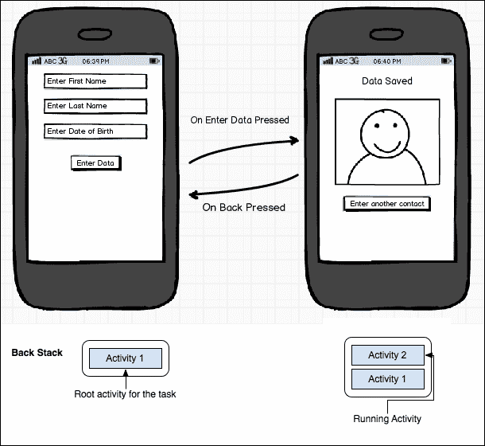
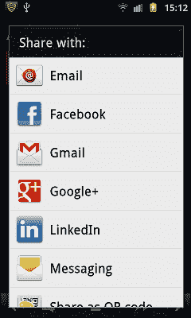
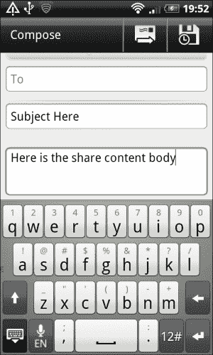
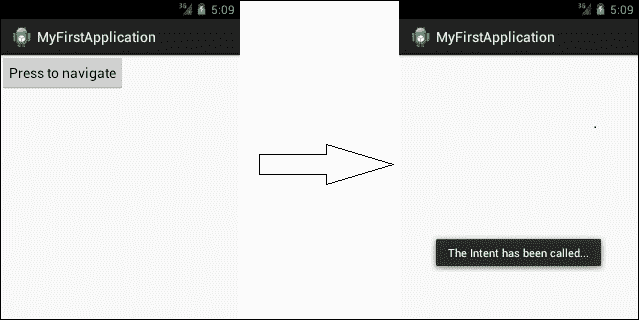
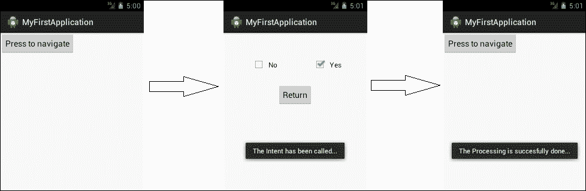

# 第二章。安卓意图介绍

修改上一课——安卓活动是用户交互的控件、小部件和许多其他东西的可视化表示。安卓应用程序是许多活动的组合，这些活动相互作用，以便执行该应用程序专用的单个或多个任务。大多数情况下，在特定时间屏幕上只显示一个活动。某些操作(如按钮点击或手势)可能会导致从当前活动导航到活动堆栈顶部的新活动。

安卓意图帮助开发人员在两个活动之间执行交互，然而这并不是意图所做的唯一事情。这种交互包括从一个活动移动到另一个活动，将数据从一个活动推送到另一个活动，并在任何特定活动结束后带来结果。简而言之，可以说意图是安卓系统中的一个抽象术语，指的是要执行的任何任务。当你通读这本书时，随着时间的推移，还会有各种各样的其他东西被探索。

本章包括以下主题:

*   意图在安卓应用中的作用
*   意图–技术概述
*   意图的结构

### 类型

如前一章所述，安卓活动、活动生命周期和活动堆栈的概念是理解本章和后续章节的先决条件。如果你没有这些东西的基本概念，我们会建议你阅读[第一章](01.html "Chapter 1. Understanding Android")、*了解安卓*，以便前进。

# 意图在安卓应用中的作用

在这一节中，我们将看到安卓 Intents 的范围是什么。到目前为止，我们已经完全理解了为什么需要这些活动，以及为什么需要维护和跟踪从一个活动到另一个活动的流程。



按钮点击(使用意图)上不同活动之间的导航及其由活动堆栈表示

可以说，这本书的这一部分是我们可以从安卓意图中获得的好处的总结。范围在于安卓活动、服务、数据传输等诸多因素。我们将在以下列表中看到这一点:

*   活动从一个活动过渡到另一个活动
*   从一个活动到另一个活动的数据传输
*   使用无线网络和蓝牙进行连接
*   访问安卓摄像头
*   获取当前位置的全球定位系统传感器
*   发送短信和彩信
*   定制手机通话
*   发送电子邮件和社交媒体帖子
*   启动和控制安卓服务
*   处理广播消息
*   更改时区
*   通知栏提醒
*   还有更多

我们现在将看看安卓意图的每个关键角色。安卓意图的这些主要特性的简短描述将在以下章节中给出。

## 意图在安卓活动中的作用

最重要和最广泛的意图使用可以在安卓活动中看到。安卓应用程序由许多活动组成，为了在这些活动之间转换，我们需要使用安卓意图。在上图中，可以看到在**活动 1** (左侧)中，当内容被填充并且用户点击**输入数据**按钮时，安卓将使用意图导航到**活动 2** (右侧)。

除了前面提到的意图角色之外，它还可以用于调用其他应用程序，如浏览器(带有您活动中的某个网站)和电子邮件客户端(如 Gmail 或任何其他带有适当主题和活动中的电子邮件正文的应用程序，方法是将其打包发送)。

## 意图在活动间数据传输中的作用

现在很清楚，我们使用意图从一个活动导航到另一个活动。但是我们都知道数据在安卓应用中的巨大作用，用户需要获取、操作和显示数据来执行某项任务。这些数据的处理和从一个活动到另一个活动的安全传输是安卓意图的另一个目的。

在上图中，一旦用户在活动 1 中填写了表格，点击**输入数据**按钮，用户将执行两个任务。一个任务是将用户从一个活动带到另一个活动， 第二个任务是将填充的数据转移到下一个活动，以便显示/计算结果。

## 意图在 Wi-Fi 和蓝牙传输中的作用

而在应用程序内部，如果你想实现一个功能，让一个设施来改变当前的无线/蓝牙连接，你需要使用安卓意图。有了安卓意图，你可以很容易地提供内部接口，让用户在保持在应用程序内部的同时，在无线网络和蓝牙连接之间切换。

## 意图在安卓相机中的作用

当你谈论安卓应用程序时，安卓硬件可能非常重要。这些组件的使用可能是你的安卓应用的一个基本部分。假设是 1D 或 2D 条形码阅读器的例子，应用程序需要扫描条形码并对其进行解码，以便提取信息。此操作只能通过从应用程序内部打开摄像机来执行。摄像头的开启也是由安卓 Intents 来处理。

## 意图在全球定位系统传感器中的作用

安卓应用市场在许多领域都表现出色。当今市场上有各种各样的安卓应用程序，这包括基于位置的应用程序，它们通过跟踪用户的位置来执行各种任务。通过意图，开发人员可以根据计算需要轻松提取用户的当前位置。

## 意图在发送短信/彩信中的作用

可以使用安卓意图来启用您的应用程序发送短信/彩信。这个任务可以通过从你的活动中设置短信/彩信正文，并捆绑设置，调用原生内置应用发送手机短信/彩信。这种短信/彩信发送功能可以通过实现广播接收器来增强，该接收器使您的活动能够知道消息何时发送或何时送达。

## 意图在移动通话中的作用

任何将在应用程序中发起移动呼叫的条件都可以通过安卓意图来实现。安卓应用程序将使用内置应用程序来启动对任何特定号码的呼叫，该呼叫将以数据的形式在意向中提供。

## 意图在电子邮件和社交网络帖子中的作用

访问 Gmail 从您的应用程序发送电子邮件是由安卓 Intents 管理的。有一个意图呼叫，在该呼叫中，我们输入收件人的电子邮件、附件、正文和电子邮件主题，并开始活动的意图。这将打开填充了这些参数的本机 Gmail 应用程序，用户可以将其发送给所需的收件人。

同样，我们可以通过意向发送各种社交网络更新，如脸书、推特、谷歌+。此任务使用共享意图完成。我们把内容以文本或捆绑的形式，通过安卓意图发送。然后，Android 会打开所有可用的共享应用程序(如上图所示)，并向用户提供访问权限，以便选择最佳的共享应用程序。唯一的条件是应该有一个预装的应用程序，安卓意图通过它进行交互并发送所需的帖子，如下所示:

```java
Intent sharingIntent = new Intent(android.content.Intent.ACTION_SEND);

```

### 注

除了在墙上发帖或在推特上发布时间线之外，安卓意向没有透露社交网络的任何其他功能。为了观察整套功能，互联网上有许多第三方应用编程接口作为免费软件或付费软件出现。



使用分享意向在各种平台上分享帖子

下一个截图显示了当你给用户一个功能时会发生什么，例如用户想要通过 Gmail 共享它。在这种情况下，屏幕会显示您的内容，如下图所示:



从共享意图传递数据后的 Gmail 界面

## 意图在安卓服务中的作用

与安卓活动相同，意图用于启动**安卓服务**。安卓服务基本上是安卓应用在不影响用户界面的情况下完成的长期运行任务。即使在用户切换应用程序后，该后台任务也可以继续运行。换句话说，服务可以或不能与活动绑定。为了执行任务，服务可以独立工作。但是，在每种情况下，都会使用一个意图来启动服务。

## 意图在广播接收器中的作用

意图在广播接收器中有广泛的用途。广播接收器用于响应任何其他应用程序甚至系统发起的广播消息。在这种情况下，我们捕捉安卓消息并提取数据，以便在我们的应用程序中显示它。例如，当系统启动完成时，我们需要接收信号时，就使用`Intent.ACTION_BOOT_COMPLETED`。类似地，许多其他意图值和意图对象可以在应用的不同点使用，以便执行与广播接收器相关的各种任务。

另一个例子是发送短信/彩信，您可以制作一个广播接收器，以查看发送是否完成或消息是否已发送。

## 意图在时区中的作用

您的应用程序可能会执行与时区相关的操作。当您旅行时，一旦时区发生变化，您希望您的应用程序以不同的方式运行。在这种情况下，我们可以使用广播接收器来检测时区的变化，从意图中获取数据以访问当前时区，并执行某项任务。这是根据您的时区维护应用程序结构和数据的一种非常方便的方法。

## 状态栏中意图的作用

安卓状态栏用于向用户提供即时通知，而不会占用屏幕太多空间。从上到下滑动的通知面板中有很多功能，比如一些快速访问的项目，比如无线连接管理器(目前只有少数手机有)等。我们可以在那个栏里放一个通知，以便通知用户任何事情。安卓意图用于放置内容并在其中提供状态栏通知。


安卓通知面板和通知

# 意图–技术概述

在过去的几个主题中，我们已经浏览了安卓意图的理论概述。让我们更深入地看看安卓这个特性的技术细节。在这一部分，我们将看到安卓意图的大图，包括示例代码及其解释。

从技术上讲，Android Intent 由两个组件组成，两者独立工作。这两个组件如下:

*   编码部分
*   XML 组件

## 编码组件

安卓意图是在编写类时用 Java 代码实现的。通常在安卓项目中，我们有一个单独的包来处理这些活动。如前所述，为了对应用程序进行完整的跟踪，有一个`AndroidManifest.xml`文件，其中应该包括每个活动、服务、权限和其他内容的记录。

### 类型

在实现代码时，我们需要注意所有的活动都应该在`AndroidManifest.xml`文件中声明，以便从代码中访问它们。否则安卓会抛出`ActivityNotFoundException`的错误。

安卓意图对活动、服务和广播接收器的实现是相同的。在活动中实现安卓意图时，我们需要注意以下事项:

*   在实现意图之前导入`android.content`包(这是存在意图类的安卓的父包)。
*   意图构造器应该在安卓活动的上下文中。如果不是，它应该有上下文对象，以便确定在哪个活动上调用意图。
*   应该导入目标活动类(如果它在源活动的任何其他包下)。
*   只有当意图在安卓活动的上下文中，或者源活动的上下文存在于上下文对象中时，才能调用`startActivity()`方法。

## XML 组件

意图所依赖的第二个也是最重要的组成部分在`AndroidManifest.xml`文件中。概括一下这个文件包括的内容— `AndroidManifest`是文件，它包含了关于应用程序的所有信息。它包含所有活动、服务、权限、版本代码、sdk 版本和许多其他东西的名称。

同样，本文件中也提到了意图过滤器。此时，我们只想介绍意图过滤器的主要用途。意图过滤器的简要介绍可在以下列表中找到:

*   意图过滤器需要满足一些条件才能处理安卓意图
*   意图过滤器有关于安卓意图的数据和类别的附加信息

一个更简短的定义可能是意图过滤器描述了安卓系统将如何识别在某个安卓意图上采取什么行为。

```java
<activity
  android:name=".MyFirstActivity"
  android:label="@string/app_name" >
  <intent-filter>
    <action android:name="android.intent.action.MAIN" />

    <category android:name="android.intent.category.LAUNCHER" />
  </intent-filter>
</activity>
```

### 类型

在`AndroidManifest.xml`中，您可以在单个活动中包含多个意图过滤器。

如前面的代码所示，很明显`<intent-filter>`的标签包含了关于类别和动作的信息。当应用程序试图执行系统未知的任务时，这些标签是`AndroidManifest`中活动的重要部分。

为了理解为什么`<category>`出现在意图过滤器的前面代码中，举个例子:我们制作了一个应用程序，其中有两个活动。如果我们没有提到启动应用程序的第一个活动是哪个系统；系统会混淆并显示错误`No Launcher Activity Found`，并且不会启动应用程序。所以，为了实现这个任务，我们需要把任何一个活动的类别都作为`android.intent.category.LAUNCHER`。这将有助于系统识别应用程序开始和流程继续的基本活动。

# 安卓活动导航意图的实现

在这一节中，我们将看看安卓意图的实现。我们开始吧。

为了开始这个例子，你需要构建一个安卓项目。您可以使用安卓工作室或 Eclipse(根据您的方便)，但请确保如果您正在使用 Eclipse，您应该已经正确安装了JDK、ADT 和安卓 SDK，以及它们的兼容包。如果不知道这些 ide 的区别，可以参考本书[第一章](01.html "Chapter 1. Understanding Android")、*了解安卓*。

在前一章中已经介绍了在安卓工作室中创建项目。重复这些步骤将帮助你创建一个完整的安卓项目，其中包含一些预定义的文件和文件夹。

为了让开始执行安卓意图，您需要执行以下步骤:

1.  创建一个新的安卓项目或者选择任何你想要实现安卓意图的现有项目。
2.  Open the source activity in which you want to implement the intent.

    ### 注

    这只是一个提醒，当活动中发生事件调用时，会调用意图。例如，在点击按钮时，下一个活动应该会出现。所以点击按钮就是事件。

3.  为了达到这个结果，执行以下代码:

    ```java
    //-------------------------------------------------------------------------
    Part One - MainActivity Class

    public class MainActivity extends Activity {

      @Override
      protected void onCreate(Bundle savedInstanceState) {
        super.onCreate(savedInstanceState);
        setContentView(R.layout.activity_main);
        Button button = (Button) findViewById(R.id.button1);
        button.setOnClickListener(new OnClickListener() {

          @Override
          public void onClick(View v) {
            // TODO Auto-generated method stub
            Intent myIntent = new Intent(MainActivity.this,MySecondActivity.class);
            startActivity(myIntent);
          }
        });
      }
    }

    //---------------------------------------------------------------------------
    Part Two - MySecondActivity Class

    public class MySecondActivity extends Activity {
      @Override
      protected void onCreate(Bundle savedInstanceState) {
        // TODO Auto-generated method stub
        super.onCreate(savedInstanceState);
        setContentView(R.layout.activity_two_layout);
        Toast.makeText(this, "The Intent has been called...",Toast.LENGTH_LONG).show();
      }
    }

    //----------------------------------------------------------------------------
    Part Three - activity_main.xml File

    <?xml version="1.0" encoding="utf-8"?>
    <LinearLayout xmlns:android="http://schemas.android.com/apk/res/android"
      android:layout_width="match_parent"
      android:layout_height="match_parent"
      android:orientation="vertical" >

      <Button
        android:id="@+id/button1"
        android:layout_width="wrap_content"
        android:layout_height="wrap_content"
        android:text="Press to navigate"
      />

    </LinearLayout>

    //----------------------------------------------------------------------------
    Part Four - activity_two_layout.xml File

    <?xml version="1.0" encoding="utf-8"?>
    <LinearLayout xmlns:android="http://schemas.android.com/apk/res/android"
      android:layout_width="match_parent"
      android:layout_height="match_parent"
      android:orientation="vertical" >

    </LinearLayout>

    //---------------------------------------------------------------------------
    Part Five - AndroidManifest.xml File

    <?xml version="1.0" encoding="utf-8"?>
    <manifest xmlns:android="http://schemas.android.com/apk/res/android"
      package="com.app.fragmenttestingapplication"
      android:versionCode="1"
      android:versionName="1.0" >

      <uses-sdk
        android:minSdkVersion="8"
        android:targetSdkVersion="16" />

      <application
        android:allowBackup="true"
        android:icon="@drawable/ic_launcher"
        android:label="@string/app_name"
        android:theme="@style/AppTheme" >
      <activity
        android:name="com.app.fragmenttestingapplication.MainActivity"
          android:label="@string/app_name" >
          <intent-filter>
            <action android:name="android.intent.action.MAIN" />

            <category android:name="android.intent.category.LAUNCHER" />
          </intent-filter>
        </activity>
      <activity
        android:name="com.app.fragmenttestingapplication.MySecondActivity"
        android:label="@string/app_name" >
      </activity>
    </application>

    </manifest>
    ```

4.  运行项目，会出现一个按钮。点击按钮，通过意图导航到下一个活动。



指示从第一个活动到第二个活动的应用流程

## 了解流程

前面的代码分五个部分描述；我们将逐一描述它们。请记住，这些部分指的是安卓项目中的五个不同文件。知道您将在预定义的项目中使用这些代码后，我们将从一个新创建的项目的场景中对其进行描述，以便使其更加详细和清晰。

### 第一部分——MainActivity.java

`MainActivity.java`是创建项目时制作的第一个类。由于是安卓活动，自带`onCreate`方法，一旦创建了活动，就会调用该方法(如[第 1 章](01.html "Chapter 1. Understanding Android")、*了解安卓*、*安卓活动生命周期*所述)。本活动所附版面命名为`activity_main.xml`。因此在`onCreate()`方法中，`setContentView(R.layout.activity_main)`一行引用该 XML，并用于根据`activity_main.xml`中的布局设置该活动的视图。

现在，在第二步中，使用存在于`Activity`类中的`findViewById(int id)`方法在代码中获取存在于`activity_main.xml`布局中的具有`button1`标识的按钮。它将返回`View`类的对象，所以我们可以很容易地将其投射到按钮上，以便拥有一个按钮对象。

一旦提取了按钮对象，我们就在上面实现`setOnClickListener()`方法。 `setOnClickListener()`方法属于`View`类，它接受`View.OnClickListener`(一个接口)的参数。该界面要求我们覆盖要实现的`onClick()`功能。只要在用户界面中点击按钮，就会触发此事件。

在这个`onClick()`方法里面，意图的真正实现将会发生。因为我们想要调用我们点击按钮的意图，我们将在这个方法中做所有与意图相关的事情。用接受上下文和目标类参数的构造函数声明意图对象。`MySecondActivity.class`文件是目标活动，当我们通过使用`MainActivity`访问当前活动的上下文时，我们想要在其上导航(或者您可以使用基本上返回活动的相同上下文的 `getContext()`方法)。这是因为我们目前处于`OnClickListener`的背景下。

此时此刻，我们有了意向对象。我们可以用这个对象做更多的事情，但目前，我们的任务只是将它导航到下一个活动。这就是为什么我们调用方法`startActivity`()并将这个意图作为参数传递。这将把应用程序导航到下一个活动，它将从活动堆栈的顶部出现，而前一个活动将在它的下面。

### 第二部分——MySecondActivity.java

活动`MySecondActivity.java`是意图的目的地活动。这是一个简单的活动，包含一个`onCreate()`方法，在屏幕上设置内容视图。就在布局创建之后，我们通过`show()`方法在屏幕上显示祝酒信息，以便识别第二个活动已经加载并正在显示信息`The intent has been called`。

### 注

祝酒词是一个简单的信息，在盒子里出现几秒钟就消失了。默认情况下，此消息包含文本，但您可以轻松地制作自定义吐司，以便包含图片和许多其他内容。

### 第三部分–活动 _ 主. xml

这个 XML 文件是`MainActivity.java`类的布局。如您所见，我们试图从布局中获取按钮的引用。该按钮在这个`activity_main`文件中声明，其标识用于从 XML 中提取该按钮。

### 注

XML 文件中声明的所有布局的引用都放在 R 文件中，Java 代码/类使用 R 文件来获取代码中的对象。

描述`activity_main.xml`文件时，有一个线性布局，其中包含关于其长度、宽度和方向的某些参数。在线性布局的标签里面，你可以看到被带入 Java 代码的按钮被声明了。该标签还附带了关于高度、宽度、标识和将出现在布局中的文本的某些参数。

### 注

采取预防措施，以使任何观点的身份。所有这些标识都存在于处理单个类中所有内容的 R 文件中。尝试自定义您的标识，以避免将一个活动的视图与另一个活动的视图混淆。

### 第四部分–活动 _ 二 _ 布局. xml

这是一个简单的布局文件，包含父线性布局，以便进行简单的空白活动。该布局文件被分配给第二个活动，在该活动中，用户在点击按钮后产生意图，并在该活动中显示敬酒信息。

### 第五部分–AnDroidManifest . XML

没有`AndroidManifest.xml`文件，任何项目都不是完整的，因为它包含了关于应用程序的所有信息。在这个 XML 文件中，有一个清单的父标记，它包含关于项目的三个最重要的属性:

*   **包名**:这是应用程序将从其中进入 Google Play(或任何其他市场)的项目名称。这个名称应该是为整个应用程序唯一定义的，它不应该与市场上的任何其他软件包名称相匹配。
*   **版本代码**:这是一个整数值，代表与应用程序之前版本相比的版本号。
*   **版本名称**:这是一个字符串值，用于向用户显示。它是应用程序的发布版本名称。

在`Manifest`标签中，有一个名为`<uses-sdk>`的标签，在其属性中，定义了应用程序可访问的最小和最大安卓应用编程接口版本。之后是一个应用程序标签，其中存储了与应用程序相关的信息，包括应用程序的图标、标签和主题。

在描述应用程序中的活动的主标签中，有`<activity>`标签。它应该等于应用程序中使用的活动数量。如您所见，意图的 XML 组件出现在第一个活动中，即`<intent-filter>`，它告诉系统`MainActivity.java`是应该用作启动器活动的类。与第一个活动不同，第二个活动不包含意图过滤器的标记。您可以分析第二个活动不需要包含这些标签，因为它与第一个活动在同一个流程中。

从第一个活动开始，第二个活动应该出现在前台意图上。这就是为什么它不需要包含标签`<category>`和`<action>`。没有它，应用程序也能正常工作。

#### 未来考虑

在这本书里，我们将详细了解我们还能对意图做些什么。到目前为止，我们只介绍了基本的意图功能及其在活动堆栈中的流程。你会在路上遇到很多内容。

## Android . content . intent 类的其他构造函数

意图类带有各种各样的构造函数，可以在不同的场景中帮助开发人员。在前一节中，我们只使用了一种类型的构造函数。谷歌上也有构造函数的其他多态形式。

各种各样的构造函数将在下面的章节中解释。

### 意图()

这是返回空意图对象的默认构造函数。然而，为空并不意味着为空。

### 意图(o 的意图)

此构造函数用于克隆现有意图。我们传递想要克隆的意图对象，并将其放入构造函数的参数中。在这种情况下，返回的意图是原始意图的副本。它还会将中的每一个值(附加值)映射到原始值，并返回该意图的副本。

### 意图(上下文 c，类<？> cls)

这是我们之前在示例中使用的构造函数。它基本上需要两个参数:源上下文和目标类。源上下文是您当前正在使用的活动的上下文，而第二个参数是您想要导航到的类。

### 意图(字符串动作)

带有操作的构造函数用于创建一个意图对象，在该对象中编写操作。动作的正确用法和定义将在接下来的章节中介绍。还要记住，这个构造函数用于广播动作。

### 意图(字符串动作，URI uri)

该构造函数用于创建一个带有所需动作和一些数据网址的意图。例如，我们传递参数`new Intent(Intent.ACTION_VIEW, Uri.parse("http://www.google.com"));`。该构造函数明确表示该意图将促进用于查看的操作，使用其他参数，我们正在解析 URL[http://www.google.com](http://www.google.com)的 URI 。这将打开加载谷歌网站的浏览器。再举一个这个构造函数的例子:`new Intent(Intent.ACTION_DIAL, Uri.parse("tel: (+1) 123456789"));`。通过撰写本声明，我们清楚地表明，我们希望创建一个意图，用于激活电话拨号器并传递 URI 值，以便通过意图执行呼叫功能。

### 注

这种形式的构造函数主要用于调用隐式意图。更多关于代码的信息可以在[http://developer . Android . com/reference/Android/content/intent . html](http://developer.android.com/reference/android/content/Intent.html)找到。

## 从安卓意图获取结果

正如我们之前看到的，安卓意图用于从一个活动导航到另一个活动，但是在真实场景中，这种导航需要很多东西。这里将讨论安卓意图最重要的特性之一。我们将在这里看到的是源活动在目标活动关闭后得到的响应。

为了进一步解释前面的陈述，我们有一个场景:

*   有一个源活动(导航将从该活动开始)
*   目的地活动(导航将到达的目的地)
*   目标活动结束时，它会将结果返回给源活动

在安卓意图中，这是一个非常方便的选项，可以从活动中带回结果。我们将通过示例代码详细讨论这个特性。

### 举例理解

在这个例子中，我们将看看有两个活动的场景。活动一将被用作启动器活动。活动二将被用作目标活动，它也将返回一些结果给第一个活动。第一个活动将捕获结果，并根据该代码决定在第二个活动中完成或失败的任务类型。最后，根据返回的结果，在第一个活动中将显示一些对话消息。

### 深入示例

同样，下面的代码分为五个部分。这是对描述意图的正常使用的最后一个例子的修改。为了实现此示例，请执行以下步骤:

1.  创建一个新项目或打开要在其中进行更改的任何现有项目。
2.  打开要在其中实现意图的源活动。
3.  执行以下代码:

    ```java
    //----------------------------------------------------------------
    //Part One - MainActivity Class

    public class MainActivity extends Activity {

      @Override
      protected void onCreate(Bundle savedInstanceState) {
        super.onCreate(savedInstanceState);
        setContentView(R.layout.activity_main);
        Button button = (Button) findViewById(R.id.button1);
        button.setOnClickListener(new OnClickListener() {

          @Override
          public void onClick(View v) {
            // TODO Auto-generated method stub
            Intent myIntent = new Intent(MainActivity.this, MySecondActivity.class);
            startActivityForResult(myIntent, 1);
          }
        });
      }

      @Override
      protected void onActivityResult(int requestCode, int resultCode, Intent data) {

      if(requestCode == 1){
        if(resultCode == RESULT_OK){      
        Toast.makeText(this, "The Processing is succesfully done...", Toast.LENGTH_LONG).show();       
        }
        if (resultCode == RESULT_CANCELED) {    
          Toast.makeText(this, "The Processing failed,try again later..", Toast.LENGTH_LONG).show();
        }
      }
    }
    }

    //----------------------------------------------------------------
    //Part Two - MySecondActivity Class

    public class MySecondActivity extends Activity {

      @Override
      protected void onCreate(Bundle savedInstanceState) {
        // TODO Auto-generated method stub
        super.onCreate(savedInstanceState);
        setContentView(R.layout.activity_two_layout);
        Toast.makeText(this, "The Intent has been called...", Toast.LENGTH_LONG).show();

        Intent returnIntent = new Intent();

        CheckBox yesCheckBox = (CheckBox)findViewById(R.id.checkBox1);
        CheckBox noCheckBox = (CheckBox)findViewById(R.id.checkBox2);
        Button button = (Button) findViewById(R.id.button2);
        button.setOnClickListener(new OnClickListener() {

          @Override
            public void onClick(View v) {
            // TODO Auto-generated method stub
            if(yesCheckBox != null && yesCheckBox.isChecked()){
              setResult(RESULT_OK, returnIntent);
            finish();
          }else if(noCheckBox != null &&noCheckBox.isChecked()){
           setResult(RESULT_CANCELED, returnIntent);
           finish();
           }
          }
        });
      }
    }
    }

    //----------------------------------------------------------------------------
    Part Three - activity_main.xml File

    <?xml version="1.0" encoding="utf-8"?>
    <LinearLayout xmlns:android="http://schemas.android.com/apk/res/android"
      android:layout_width="match_parent"
      android:layout_height="match_parent"
      android:orientation="vertical" >

      <Button
        android:id="@+id/button1"
        android:layout_width="wrap_content"
        android:layout_height="wrap_content"
        android:text="Press to navigate"
      />

    </LinearLayout>

    //----------------------------------------------------------------------------
    Part Four - activity_two_layout.xml File

    <?xml version="1.0" encoding="utf-8"?>
    <RelativeLayout xmlns:android="http://schemas.android.com/apk/res/android"
      xmlns:tools="http://schemas.android.com/tools"
      android:layout_width="match_parent"
      android:layout_height="match_parent"
      tools:context=".MainActivity" >
      <Button
        android:id="@+id/button2"
        android:layout_width="wrap_content"
        android:layout_height="wrap_content"
        android:layout_below="@+id/checkBox1"
        android:layout_centerHorizontal="true"
        android:layout_marginTop="24dp"
        android:text="@string/return_string" />

      <CheckBox
        android:id="@+id/checkBox2"
        android:layout_width="wrap_content"
        android:layout_height="wrap_content"
        android:layout_alignBaseline="@+id/checkBox1"
        android:layout_alignBottom="@+id/checkBox1"
        android:layout_toRightOf="@+id/button1"
        android:text="@string/no_string" />

      <CheckBox
        android:id="@+id/checkBox1"
        android:layout_width="wrap_content"
        android:layout_height="wrap_content"
        android:layout_alignParentTop="true"
        android:layout_marginTop="50dp"
        android:layout_toLeftOf="@+id/button1"
        android:text="@string/yes_string" />

    </RelativeLayout>

    //---------------------------------------------------------------------------
    Part Five - AndroidManifest.xml File

    <?xml version="1.0" encoding="utf-8"?>
    <manifest xmlns:android="http://schemas.android.com/apk/res/android"
      package="com.app.fragmenttestingapplication"
      android:versionCode="1"
      android:versionName="1.0" >

      <uses-sdk
        android:minSdkVersion="8"
        android:targetSdkVersion="16" />

      <application
        android:allowBackup="true"
        android:icon="@drawable/ic_launcher"
        android:label="@string/app_name"
        android:theme="@style/AppTheme" >
        <activity
          android:name="com.app.fragmenttestingapplication.MainActivity"
          android:label="@string/app_name" >
          <intent-filter>
          <action android:name="android.intent.action.MAIN" />

          <category android:name="android.intent.category.LAUNCHER" />
        </intent-filter>
      </activity>
      <activity
        android:name="com.app.fragmenttestingapplication.MySecondActivity"
          android:label="@string/app_name" >
          </activity>
      </application>

    </manifest>
    ```

4.  运行项目，会出现一个按钮。点击按钮，通过意图导航到下一个活动。
5.  成功执行意图后，会出现新的活动。点击你正在测试的模拟器或安卓手机的返回键，系统将带你回到第一个活动。
6.  After coming back to first activity it will show the toast in order to communicate the result from the destination activity.

    

    指示应用程序从第一个活动流向第二个活动，并将结果返回给第一个活动

### 解释代码

在本例中，如前所述，我们将了解如何返回结果，以便验证(在第一个活动中)第二个活动中执行的任务是否成功完成。

在继续之前，请记住这是前面定义的示例的扩展；所以我们之前经历的事情在这个例子中不会解释。如果你觉得这里有什么困难，请阅读前面的例子。

让我们开始，一步一步。

#### 第一部分——MainActivity.java

与之前类似，这是第一个点击按钮开始导航的活动。这个活动的大部分内容与前面的例子相同，但是如果你深入观察，你会注意到使用`startActivityForResult()`方法来启动活动。那是因为我们正在开始的活动会在第二个活动结束后返回一个结果。

`startActivityForResult()`方法有两个论点。首先是意图，类似于前面描述的`startActivity()`方法。让我们看看第二个论点是什么。假设第一个活动调用多个活动，这些活动将返回一些结果。现在在捕捉那个结果的时候，我们需要确定它来自哪个活动。这就是为什么我们分配一个请求代码，当意图将用户带回第一个活动时，它将返回结果。然后，我们将检查结果来自哪个活动。

继续，如果你仔细看代码，有一个被覆盖的方法叫做`onActivityResult()`。当第二个活动结束时，将调用此方法。从代码中可以看出，它有三个参数。第一个是`requestCode`，这将与正在发回结果的活动一致。除此之外，我们还有`resultCode`，它将告诉我们第二个活动中的任务是否成功完成。第三，我们有一个意图，它基本上是导致活动回到第一个活动的对象。我们还可以通过这个意图将一些数据发送回第一个活动。

#### 第二部分——MySecondActivity.java

这与第一个例子相同；相反，它在布局文件中携带两个复选框对象，这些用于在第二个活动中产生结果。我们使用该标识找到视图，并根据选中的复选框，查看哪个被启用。当按钮被按下时，它将看到哪个复选框被启用，并且根据启用的优先级，它调用`setResult()`功能。该函数将结果设置为有助于活动返回到第一个活动的意图。

设置结果后，我们将完成第二个活动，它将带着结果返回到第一个活动。活动刚结束后，将执行第一个活动的`onActivityResult()`方法，以便查看第二个活动发送的结果。

#### 第三部分–活动 _ 主. xml

这部分代码类似于第一个例子的；请参考第一个例子进行解释。

#### 第四部分–活动 _ 二 _ 布局. xml

这个布局文件指的是第二个活动。我们放了两个复选框，在此基础上决定将哪个结果发送回第一个活动。有些属性与上一个示例中的属性相同，因此可以参考该示例。

#### 第五部分–AnDroidManifest . XML

同样，该文件保持不变，与第一个示例相同。请参考第一个简单的意图示例。

#### 未来考虑

作为未来的考虑，我们可以重点关注两种情况。第一个是如何处理两个或更多的活动，而所有这些活动都将结果发回。这当然是借助`requestCode`的论证。第二重要的是，在我们只发回响应代码的场景中，可能还需要发回一些字符串、int 值或一些自定义对象。在这种情况下，我们将需要一些其他的方法通过意图将这些对象发送回第一个对象。

### 注

在[第 5 章](05.html "Chapter 5. Data Transfer Using Intents")、*使用意图进行数据传输*中，我们将全面了解如何在意图中传输不同类型的数据。

# 意图的结构

在本节中，我们将研究安卓系统中使用的意图对象的结构。一个意图是中的信息束，其中有多种东西需要促进。它包含执行意图时应该采取的操作的信息。同样，它也有关于将要处理意图的类别的信息。数据在意图中起着至关重要的作用。所以一个意图有信息的数据，以 URI 的形式，必须被执行。

### 注

由于这里空间有限，我们无法解释每个组件中的每个常数。为了获得安卓使用的常量的完整列表，您可以在这里查看:

[http://developer . Android . com/reference/Android/content/intent . html](http://developer.android.com/reference/android/content/Intent.html)

我们现在将仔细检查每一个组件，以了解它们的真正含义。

## 组件

这将解释哪个组件将受到影响或处理特定意图的执行。例如，有一个意图负责做出与调用它的活动相关的动作。类似地，有一个意图由广播接收器处理，并在执行某个与系统相关的任务时报告。如果未设置组件名称，它将使用其他信息自识别组件。下表显示了安卓意图中使用的不同类型的组件:

<colgroup><col style="text-align: left"> <col style="text-align: left"></colgroup> 
| 

常数

 | 

描述

 |
| --- | --- |
| `CATEGORY_BROWSABLE` | 描述浏览器可以安全地执行意图来显示数据。 |
| `CATEGORY_LAUNCHER` | 告知活动应该在应用程序启动时作为启动器执行。 |
| `CATEGORY_GADGET` | 该活动可以放在从任何小工具启动的另一个活动中。 |

## 行动

行动基本上陈述了这个意图会引起什么行动。例如，如果我们使用名为`ACTION_CALL`的动作启动一个意图对象，这个意图将使用以 URI 形式与`ACTION_CALL`动作一起传递的数据字符串来启动调用功能。再举一个`ACTION_BATTERY_LOW`的例子，与广播接收器组件有关。通过将此操作置于意图过滤器中，如果电池电量低于阈值，它将触发事件(或者简单地说，低电量弹出窗口)。

安卓系统中有各种各样的动作。下表显示了一些意图操作及其描述:

<colgroup><col style="text-align: left"> <col style="text-align: left"> <col style="text-align: left"></colgroup> 
| 

常数

 | 

成分

 | 

描述

 |
| --- | --- | --- |
| `ACTION_CALL` | 活动 | 开始打电话 |
| `ACTION_EDIT` | 活动 | 显示要编辑的用户数据 |
| `ACTION_MAIN` | 活动 | 从没有数据的初始活动开始 |
| `ACTION_SYNC` | 活动 | 将服务器上的数据与移动设备同步 |
| `ACTION_BATTERY_LOW` | 广播收音机 | 显示电池电量低警告 |
| `ACTION_HEADSET_PLUG` | 广播收音机 | 当耳机插入或拔出时显示警报 |
| `ACTION_SCREEN_ON` | 广播收音机 | 当屏幕打开时触发 |
| `ACTION_TIMEZONE_CHANGED` | 广播收音机 | 当时区的设置改变时 |

## 数据

这不应被视为单独的组成部分；相反，它用于促进动作组件。如前所述，有些组件需要传递一些数据。例如， `ACTION_CALL`功能需要一个数据值，通过该数据值可以识别应该对哪个电话号码进行呼叫。在这个特定的场景中，我们需要将`tel: xxxxxxxxxxx` URI 放入数据中，并转发给动作。同样，当执行`ACTION_EDIT`或`ACTION_VIEW`动作时，需要为它们提供一个文档或一个 HTTP 网址来完成该动作。数据以 **URI** ( **通用资源标识符**)的形式提供给意图。

## 临时演员

这些基本上是安卓意图所需的附加数据的键值对。我们可以从代码中获取这些值(当我们创建一个意图对象时)，并将这些数据传输到下一个活动。说到动作，有些动作需要额外的数据来完成任务。例如，`ACTION_TIMEZONE_CHANGED`动作需要一个额外的时区来描述新的时区，在此基础上可以执行进一步的任务。

# 总结

在这一章中，我们讨论了意向的介绍及其作用、技术概述、在安卓应用程序中的基本实现以及意向的结构，在此基础上，我们将进一步探索可以执行的不同类型的任务。本章还提供了两个非常重要的安卓意图实现，其中从一个活动导航到另一个活动，而在第二个活动中，对应于任何特定活动的结果被发送回第一个活动。本章中讨论的概念是理解安卓意图高级概念的关键工具，这将在本书的后面讨论。在下一章中，我们将根据各种可以在您的 Eclipse 环境中轻松实现的便利示例，了解安卓意图的分类及其理论和实现。