# 第四章。移动组件意向

在最后一章中，我们讨论了意图的类别以及不同的类别是如何使用的。我们还讨论了隐性意图和显性意图等类别的利弊。但是除了我们一直在讨论的关于意图的理论之外，现在是时候用一种更实际的方法来讨论意图的一些应用了。在本章中，我们将讨论所有安卓手机中常见的移动组件。我们将看到这些移动组件是如何通过互联网轻松访问和使用的。安卓提供了大量的库和功能，开发者可以通过它们来使用移动组件。这就像在公园散步一样容易。本章主要包括四个不同类别的组件:摄像头等视觉组件、Wi-Fi 和蓝牙等通信组件、视频和音频录制、语音识别和文本到语音转换等媒体组件，最后是接近传感器等运动组件。本章将讨论以下主题:

*   常见移动组件
*   组件和意图
*   通信组件
*   通过互联网使用蓝牙
*   通过互联网使用无线网络
*   媒体组件
*   通过互联网拍照和录像
*   使用意图的语音识别
*   意图在文本到语音转换中的作用
*   运动分量
*   通过意图发出邻近警报

意图的概念和结构，正如前面章节所讨论的，是理解本章和后面章节的先决条件。如果您对这些东西没有基本的了解，我们建议您阅读[第 2 章](02.html "Chapter 2. Introduction to Android Intents")、*安卓意向介绍*、[第 3 章](03.html "Chapter 3. Intent and Its Categorization")、*意向及其分类*，以便继续前进。

# 常用移动组件

由于安卓操作系统的开源性质，许多不同的公司，如宏达电和三星，在他们的设备上移植了安卓操作系统，具有许多不同的功能和风格。每款安卓手机都有这样或那样的独特之处，拥有许多不同于其他品牌和手机的独特功能和组件。但是有一些组件在所有安卓手机中都很常见。

### 注

我们在这里使用两个关键术语:组件和功能。 **组件**是安卓手机的硬件部分，比如摄像头、蓝牙等等。 **功能**是安卓手机的软件部分，比如短信功能、电子邮件功能等等。这一章是关于硬件组件、它们的访问以及它们通过意图的使用。

这些通用组件通常可以独立于任何手机或型号使用和实现。毫无疑问，意图是激活这些安卓组件的最佳异步消息。这些意图用于在发生某些事件时触发安卓操作系统，并应采取某些措施。安卓根据收到的数据，确定意图的接收者并触发它。以下是每个安卓手机中常见的几个组件:

## Wi-Fi 组件

每部安卓手机都配有无线连接组件的完整支持。搭载安卓 4.1 及以上版本的全新安卓手机也支持 Wi-Fi 直连功能。这允许用户连接到附近的设备，而不需要连接到热点或网络接入点。

## 蓝牙组件

安卓手机包括蓝牙网络支持，允许安卓手机用户与其他设备在低范围内无线交换数据。安卓应用框架通过安卓蓝牙应用接口为开发者提供对蓝牙功能的访问。

## 细胞成分

没有手机就没有完整的手机。每个安卓手机都有一个蜂窝组件，用于通过短信、电话等进行移动通信。安卓系统提供了非常高、灵活的应用编程接口，可以利用电话和蜂窝组件来创建非常有趣和创新的应用。

## 全球定位系统和地理位置

在任何安卓手机中，全球定位系统都是一个非常有用但消耗电池的组件。它用于为安卓用户开发基于位置的应用。谷歌地图是与全球定位系统和地理位置相关的最佳功能。开发者已经在安卓系统中提供了许多利用谷歌地图和全球定位系统组件的创新应用和游戏。

## 地磁场分量

地磁场分量在大多数安卓手机中都有。该组件用于估计安卓手机在地球上给定点的磁场，特别是计算来自北方的磁偏角。

### 注

地磁场分量使用美国国家地理空间情报局制作的 **世界磁模型**。目前用于地磁场的模型有效期到 2015 年。较新的安卓手机将拥有较新版本的地磁场。

## 传感器组件

大多数安卓设备都有内置传感器，可以测量运动、方向、环境条件等。这些传感器有时充当应用的大脑。例如，他们根据手机周围的环境(天气)采取行动，并允许用户与应用进行自动交互。这些传感器为测量各自的传感器值提供高精度和准确度的原始数据。例如，重力传感器可用于跟踪任何应用或游戏中的手势和运动，如倾斜、摇动等。类似地，温度传感器可用于检测移动温度，或者地磁传感器(如前一节所述)可用于任何旅行应用，以跟踪罗盘方位。大体上，安卓系统中有三类传感器:运动、位置和环境传感器。以下小节简要讨论这些类型的传感器。

### 运动传感器

运动传感器让安卓用户监控设备的运动。既有基于硬件的传感器如加速度计、陀螺仪，也有基于软件的传感器如重力、线性加速度和旋转矢量传感器。运动传感器用于检测设备的运动，包括倾斜效果、抖动效果、旋转、摆动等。如果使用得当，这些效果可以使任何应用或游戏变得非常有趣和灵活，并可以证明提供了出色的用户体验。

### 位置传感器

地磁传感器和方位传感器这两个位置传感器用于确定移动设备的位置。另一个传感器，接近传感器，让用户确定设备的表面离物体有多近。比如我们在安卓手机上接到任何电话，把手机放在上，耳朵就会关闭屏幕，当我们把手机拿回手中，屏幕显示就会自动出现。这个简单的应用使用接近传感器来检测设备正面(屏幕)的耳朵(物体)。

### 环境传感器

这些传感器在安卓应用中使用不多，但被安卓系统广泛用于检测很多小东西。例如温度传感器用于检测手机的温度，可用于节省电池和移动寿命。

### 注

在撰写本书时，三星 Galaxy S4 安卓手机已经推出。这款手机展示了环境手势的巨大用途，它允许用户通过非触摸手势(例如在手机前移动手或脸)来执行打电话等操作。

# 组件和意图

安卓手机包含大量组件和功能。这对安卓开发者和用户都有利。安卓开发者可以使用这些移动组件和功能定制用户体验。对于大多数组件，开发人员有两种选择；他们要么扩展组件并根据应用需求定制组件，要么使用安卓系统提供的内置接口。我们不会阅读关于扩展组件的第一选择，因为它超出了本书的范围。但是，我们将研究为移动组件使用内置接口的另一种选择。

通常，要使用我们的安卓应用中的任何移动组件，开发人员会向安卓系统发送意图，然后安卓会相应地采取行动来调用相应的组件。正如我们之前讨论的，意图是发送到安卓操作系统的异步消息，以执行任何功能。大多数移动组件可以由意图触发，只需使用几行代码，开发人员可以在他们的应用中充分利用这些组件。在本章接下来的章节中，我们将看到一些组件，以及它们是如何通过实际例子被意图使用和触发的。我们将组件分为三种方式:通信组件、媒体组件和运动组件。现在，让我们在以下几节中讨论这些组件。

## 通信组件

任何手机的核心目的都是通讯。安卓手机除了通讯功能外，还提供了很多功能。安卓手机包含短信/彩信、无线网络和蓝牙，用于通信目的。本章重点介绍硬件组件；所以，本章我们只讨论 Wi-Fi 和蓝牙。安卓系统提供了内置的应用编程接口来管理和使用蓝牙设备、设置、可发现性等等。它不仅为蓝牙，还为无线网络、热点、配置设置、互联网连接等提供完整的网络应用编程接口。更重要的是，通过编写几行代码就可以非常容易地使用这些 API 和组件。我们将在下一节讨论蓝牙，以及如何通过意图使用蓝牙。

### 通过意图使用蓝牙

蓝牙是一种为短距离、低带宽、点对点通信而设计的通信协议。在本节中，我们将讨论如何与本地蓝牙设备进行交互和通信，以及如何使用蓝牙与附近的远程设备进行通信。蓝牙是一种非常低范围的协议，但它可以用来传输和接收文件、媒体等数据。从安卓 2.1 开始，由于数据加密，只有配对设备可以通过蓝牙设备相互通信。

### 注

蓝牙应用编程接口和库从安卓 2.0 版本(SDK 应用编程接口 5 级)开始提供。还需要注意的是，并不是所有的安卓手机都一定会包含蓝牙硬件。

安卓系统提供的蓝牙 API 用于执行许多与蓝牙相关的动作，包括打开/关闭蓝牙、与附近设备配对、与其他蓝牙设备通信等等。但是，并非所有这些行动都可以通过意图来执行。我们将只讨论那些可以通过意图执行的操作。这些操作包括从我们的安卓应用中设置蓝牙开/关，跟踪蓝牙适配器状态，以及使我们的设备在短时间内可被发现。无法通过意图执行的操作包括向其他蓝牙设备发送数据和文件、与其他设备配对等。现在，让我们在下面的部分中逐一解释这些操作。

#### 一些蓝牙 API 类

在本节中，我们将讨论安卓蓝牙应用编程接口中的一些类，这些类在所有使用蓝牙的安卓应用中使用。理解这些类将帮助开发人员更容易理解下面的例子。

##### 蓝星装置

此类表示用户与之通信的每个远程设备。这个类是手机蓝牙硬件的薄包装。要对这个类的对象执行操作，开发人员必须使用`BluetoothAdapter`类。这个类的对象是不可变的。我们可以通过调用`BluetoothAdapter.getRemoteDevice(String macAddress)`并传递任何设备的媒体访问控制地址来获得`BluetoothDevice`。这个类的一些重要方法是:

*   `BluetoothDevice.getAddress()`:返回当前设备的 MAC 地址。
*   `BluetoothDevice.getBondState()`:返回当前器件的键合状态，如未键合、键合或键合。

### 注

**MAC 地址** 是由 xx:xx:xx:xx:xx:xx 表示的 12 个字符组成的字符串。比如 00:11:22:AA:BB:CC。

##### blue tooth 配接卡

这个类代表当前运行我们的安卓应用的设备。需要注意的是`BluetoothAdapter`类代表电流器件，`BluetoothDevice`类代表可以或不可以和我们器件绑定的其他器件。此类是单例类，不能实例化。为了得到这个类的对象，我们可以使用`BluetoothAdapter.getDefaultAdapter()`方法。要执行任何与蓝牙通信相关的操作，这个类是它的主要起点。这个类的一些方法包括`BluetoothAdapter.getBondedDevices()`，返回所有配对的设备，`BluetoothAdapter.startDiscovery()`，搜索附近所有可发现的设备，等等。有一种叫做`startLeScan(BluetoothAdapter.LeScanCallback callback)`的方法，用于在发现设备时接收回调。该方法是在美国石油学会 18 级中引入的。

### 注

`BluetoothAdapter`和`BluetoothDevice`类中的一些方法需要`BLUETOOTH`的许可，一些方法也需要`BLUETOOTH_ADMIN`的许可。所以，当在你的应用中使用这些类时，不要忘记在你的安卓清单文件中添加这些权限。

到目前为止，我们已经讨论了安卓操作系统中的一些蓝牙类以及这些类中的一些方法。在下一部分，我们将开发我们的第一个安卓应用，它将要求用户打开蓝牙。

#### 打开蓝牙应用

要执行任何蓝牙动作，首先必须打开蓝牙。因此，在这一部分，我们将开发一个安卓应用，如果蓝牙设备还没有打开，它将要求用户打开它。用户可以接受并打开蓝牙，也可以拒绝。在后一种情况下，应用将继续运行，蓝牙将保持关闭状态。如果说这个动作可以很容易地使用意图来执行，那就太好了。让我们看看如何通过查看代码来做到这一点。

首先，在你最喜欢的 IDE 中创建一个空的安卓项目。我们在安卓工作室开发了它。在撰写本书时，该项目处于预览模式，预计很快将推出测试版。现在，我们将修改项目中的几个文件，以制作我们的安卓蓝牙应用。我们将修改两个文件。让我们在下面的部分中看到这些文件。

##### MainActivity.java 文件

这个类代表我们安卓应用的主要活动。下面的代码在这个类中实现:


在我们的活动中，我们已经用名称`BLUETOOTH_REQUEST_CODE`声明了一个常量值。在我们的应用和安卓系统之间的通信中，该常量用作请求代码或请求唯一标识符。当我们请求安卓操作系统执行一些操作时，我们会传递任何请求代码。然后，安卓系统执行该操作，并将相同的请求代码返回给我们。在将我们的请求代码与安卓的请求代码进行比较后，我们了解了已经执行的操作。如果代码不匹配，这意味着此操作是针对其他请求的。这不是我们的要求。在`onCreate()`方法中，我们通过调用`setContentView()`方法来设置活动的布局。然后，我们在接下来的几行中执行真正的任务。

我们创建一个字符串`enableBT`来获取属于`BluetoothAdapter`类的`ACTION_REQUEST_ENABLE`方法的值。这个字符串在意图构造器中传递，告诉意图它是为了启用蓝牙设备。与支持蓝牙的请求字符串一样，安卓操作系统也包含许多其他请求，用于各种操作，如无线网络、传感器、摄像头等。在本章中，我们将了解一些请求字符串。创建请求字符串后，我们创建我们的意图并将请求字符串传递给它。然后，我们通过`startActivityForResult()`方法传递它来开始我们的意图。

这里需要注意的一点是，在前面的章节中，我们使用了`startActivity()`方法，而不是`startActivityForResult()`方法。基本上，`startActivity()`方法只是启动通过意图传递的任何活动，但是`startActivityForResult()`方法启动任何活动，并且在执行一些动作之后，它返回到原始活动并呈现动作的结果。因此，在这个例子中，我们调用了请求安卓系统启用蓝牙设备的活动。安卓系统执行该操作，并询问用户是否应该启用该设备。然后，安卓系统将结果返回到先前启动意图的原始活动。为了从其他活动中得到我们活动的任何结果，我们覆盖了`onActivityResult()`方法。从其他活动返回后调用此方法。该方法包含三个参数:`requestCode`、`resultCode`和`dataIntent`。`requestCode`参数为整数值，包含开发者提供的请求的请求码值。`resultCode`参数是动作的结果。它告诉开发人员该操作是以肯定响应还是否定响应成功执行的。`dataIntent`对象包含原始的调用意图数据，例如哪个活动启动了意图以及所有相关信息。现在，让我们详细看看我们被覆盖的方法。我们首先检查了我们的请求代码`requestCode`是否为`BLUETOOTH_REQUEST_CODE`。如果两者相同，我们已经比较了结果代码，以检查我们的结果是否正常。如果没问题，说明蓝牙已经启用；所以，我们显示一个祝酒词，通知用户这件事，如果结果不好，那说明蓝牙还没有启用。在这里，我们还通过显示祝酒词来通知用户。

这是执行支持蓝牙的应用的核心功能的活动类。现在，让我们在下面的部分中看到安卓清单文件。

##### AnDroidManifest . XML 文件

AndroidManifest.xml 文件包含应用的所有必要设置和首选项。以下是此清单文件中包含的代码:


任何使用蓝牙设备的安卓应用都必须获得蓝牙使用许可。因此，为了向用户提供权限，开发人员在安卓清单文件中声明`<uses-permission>`标签，并写入必要的权限。如代码所示，我们提供了两个权限:`android.permission.BLUETOOTH`和`android.permission.BLUETOOTH_ADMIN`。对于大多数支持蓝牙的应用，只有`BLUETOOTH`权限才能完成大部分工作。`BLUETOOTH_ADMIN`权限仅适用于那些使用蓝牙管理设置的应用，例如使设备可被发现、搜索其他设备、配对等。当用户第一次安装应用时，会向他提供关于该应用需要哪些权限的详细信息。如果用户接受并授予该应用的权限，则该应用被安装；否则，用户无法安装该应用。文件的其余部分与书中的其他示例相同。

在讨论了安卓清单和活动文件之后，我们将通过编译和运行它来测试我们的项目。当我们运行项目时，我们应该会看到如下截图所示的屏幕:


启用蓝牙应用

当应用启动时，用户会看到一个对话框来启用或禁用蓝牙设备。如果用户选择**是**，蓝牙打开，举杯通过显示蓝牙的状态来更新状态。

#### 跟踪蓝牙适配器状态

在前面的例子中，我们看到了如何打开蓝牙设备，只需用几行代码将蓝牙请求的意图传递给安卓系统。但是启用和禁用蓝牙是耗时且异步的操作。因此，我们可以使用广播接收器进行状态更改，而不是轮询蓝牙适配器的状态。在这个例子中，我们将看到如何使用广播接收器中的意图来跟踪蓝牙状态。

这个示例是上一个示例的扩展，我们将使用相同的代码并向其中添加新代码。现在让我们看看代码。我们有三个文件，`MainActivity.java`、`BluetoothStateReceiver.java`和`AndroidManifest.xml`。让我们逐一讨论这些文件。

##### MainActivity.java 文件

这个类代表我们安卓 app 的主要活动。下面的代码在这个类中实现:

```java
public class MainActivity extends Activity {
  final int BLUETOOTH_REQUEST_CODE = 0;
  @Override
  protected void onCreate(Bundle savedInstanceState) {
    super.onCreate(savedInstanceState);
    setContentView(R.layout.activity_main);
    registerReceiver(new BluetoothStateReceiver(), new IntentFilter(
      BluetoothAdapter.ACTION_STATE_CHANGED));
    String enableBT = BluetoothAdapter.ACTION_REQUEST_ENABLE;
    Intent bluetoothIntent = new Intent(enableBT);
    startActivityForResult(bluetoothIntent,
      BLUETOOTH_REQUEST_CODE);
  }
  @Override
  protected void onActivityResult(int requestCode, int resultCode,
    Intent data) {

    // TODO Auto-generated method stub
    super.onActivityResult(requestCode, resultCode, data);
    if (resultCode == RESULT_OK) {
      if (requestCode == BLUETOOTH_REQUEST_CODE) {
        Toast.makeText(this, "Turned On", Toast.LENGTH_SHORT).show();
      }
    }
    else if (resultCode == RESULT_CANCELED) {
      Toast.makeText(this, "Didn't Turn On", Toast.LENGTH_SHORT).show();
    }
  }
}
```

从代码中可以清楚地看出，代码与前面的示例几乎相同。唯一不同的是，我们在设置了活动的内容视图后增加了一行。我们调用了`registerReceiver()`方法，该方法通过编程向安卓系统注册任何广播接收器。我们还可以通过在安卓清单文件中声明接收者来注册接收者。广播接收器用于接收安卓系统发送的广播。

在执行打开蓝牙、打开/关闭 Wi-Fi 等常规操作的同时，安卓系统会发送广播通知，开发者可以使用这些通知来检测手机中的状态变化。有两种类型的广播。正常广播是完全异步的。这些广播的接收器运行无序，多个接收器可以同时接收广播。与其他类型的有序广播相比，这些广播效率更高。有序广播一次发送到一个接收器。当每个接收器收到结果时，它会将结果传递给下一个接收器，或者完全中止广播。在这种情况下，其他接收器不接收广播。

虽然`Intent`类用于发送和接收广播，但是意图广播是一种完全不同的机制，并且与`startActivity()`方法中使用的意图是分开的。广播接收器无法看到或捕捉到`startActivity()`方法使用的意图。这两种意图机制的主要区别在于`startActivity()`方法中使用的意图执行用户当前正在从事的前台操作。然而，广播接收机使用的意图执行一些用户不知道的后台操作。

在我们的活动代码中，我们使用`registerReceiver()`方法来注册我们在`BluetoothStateReceiver`类中定义的定制广播接收器的对象，并且我们根据接收器的类型通过了意图过滤器`BluetoothAdapter.ACTION_STATE_CHANGED`。此状态告诉意图过滤器，我们的广播接收器对象用于检测应用中的蓝牙状态变化。注册接收器后，我们创建了一个通过`BluetoothAdapter.ACTION_REQUEST_ENABLE`的意图，告诉应用打开蓝牙。最后，我们通过调用`startActivityForResult()`开始我们的行动，我们比较`onActivityResult()`方法中的结果，看看蓝牙是否打开。您可以在本章前面的示例中了解这些过程。

### 注

当你用活动的`onCreate()`或`onResume()`方法注册接收者时，你应该用`onPause()`或`onDestroy()`方法取消注册。这种方法的好处是，当应用暂停或关闭时，您不会收到任何广播，这可以减少安卓不必要的开销操作，从而延长电池寿命。

现在，让我们看看我们定制的广播接收器类的代码。

##### BluetoothStateReceiver.java 文件

这个类代表我们的定制广播接收器，它跟踪蓝牙设备中的状态变化。下面的代码显示了该文件的实现:

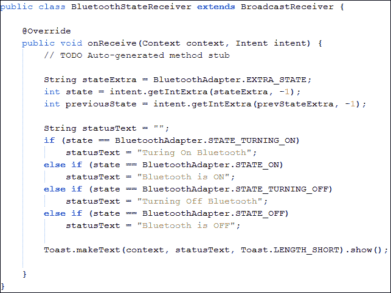

就像我们为活动和服务所做的那样，为了创建一个定制的广播接收器，我们从`BroadcastReceiver`类扩展并覆盖方法来声明定制行为。我们已经覆盖了`onReceive()`方法，并在该方法中执行了跟踪蓝牙设备状态的主要功能。首先，我们将创建一个字符串变量来存储当前状态的字符串值。为了检索字符串值，我们使用了`BluetoothAdapter.EXTRA_STATE`。现在，我们可以在意图的`get()`方法中传递这个值来获得我们需要的数据。由于我们的状态是整数，也是额外的，所以我们调用了`Intent.getIntExtra()`，并在其中传递了我们需要的字符串及其默认值`-1`。现在，由于我们已经获得了当前状态代码，我们可以将这些代码与`BluetoothAdapter`中的预定义代码进行比较，以查看蓝牙设备的状态。有四种预定义的状态。

*   `STATE_TURNING_ON`:该状态通知用户蓝牙开启操作正在进行中。
*   `STATE_ON`:该状态通知用户蓝牙已经开启。
*   `STATE_TURNING_OFF`:该状态通知用户蓝牙设备正在关闭。
*   `STATE_OFF`:该状态通知用户蓝牙已经关闭。

我们将我们的状态与这些常数进行比较，并根据我们得到的结果显示祝酒词。安卓清单文件与前面的例子相同。

因此，简而言之，我们讨论了如何启用蓝牙设备，并要求用户通过意图打开或关闭它。我们还看到了如何使用广播接收器中的意图跟踪蓝牙操作的状态，并显示祝酒词。以下截图显示了应用演示:


启用蓝牙应用

#### 被发现

到目前为止，我们只是通过打开或关闭蓝牙来与它进行交互。但是，要通过蓝牙开始通信，一个人的设备必须可被发现才能开始配对。我们不会为这个意图的应用创建任何示例，但我们将只解释如何通过意图来实现这一点。为了打开蓝牙，我们使用了`BluetoothAdapter.ACTION_REQUEST_ENABLE`意图。我们在`startActivityForResult()`方法中传递了意图，并在`onActivityResult()`方法中检查了结果。现在，为了使设备可被发现，我们可以在意图中传递`BluetoothAdapter.ACTION_REQUEST_DISCOVERABLE`字符串。然后，我们在`startActivityForResult()`方法中传递这个意图，并在`onActivityResult()`方法中跟踪结果以比较结果。

以下代码片段显示了使设备可被发现的意图创建过程:

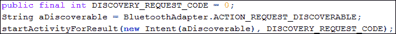

在代码中，您可以看到没有之前没有讨论过的新内容。只有意图动作串类型发生了变化，其余不变。这是意图的力量；你可以在几分钟内用几行代码做几乎任何事情。

#### 监控可发现模式

当我们跟踪蓝牙的状态变化时，我们也可以使用本章前面解释的完全相同的方法来监控可发现性模式。我们必须通过扩展`BroadcastReceiver`类来创建一个定制的广播接收器。在`onReceive()`方法中，我们将获得两个额外的字符串:`BluetoothAdapter.EXTRA_PREVIOUS_SCAN_MODE`和`BluetoothAdapter.EXTRA_SCAN_MODE`。然后，我们在`Intent.getIntExtra()`方法中传递这些字符串，以获得模式的整数值，然后我们将这些整数与预定义的模式进行比较，以检测我们的模式。下面的代码片段显示了代码示例:


#### 通过蓝牙通信

蓝牙通信 API 只是标准蓝牙射频通信协议 **RFCOMM** 的包装器。要与其他蓝牙设备通信，它们必须相互配对。我们可以使用`BluetoothServerSocket`类通过蓝牙进行双向通信，该类用于建立监听套接字，以启动设备和`BluetoothSocket`之间的链接，该类用于创建新的客户端套接字来监听蓝牙服务器套接字。一旦建立连接，服务器套接字就会返回这个新的客户端套接字。我们将不讨论蓝牙如何用于通信，因为它超出了本书的范围。

### 通过互联网使用无线网络

如今，互联网时代及其在移动电话中的广泛使用使得全球信息随时可用。几乎每一个安卓手机用户都希望所有应用都能优化互联网的使用。在应用中添加互联网接入成为开发人员的责任。例如当用户使用你的应用时，他们希望与他们在各种社交网络上的朋友分享使用情况以及他们在你的应用中执行的活动，例如完成任何级别的游戏或阅读任何新闻应用中的任何文章，或者通过发送消息等。因此，如果用户没有通过你的应用连接到互联网、社交平台或全球信息，那么这个应用就会变得太有限，可能会很无聊。

要执行任何使用互联网的活动，我们首先必须处理互联网连接本身，例如手机是否有任何活动连接。在本节中，我们将了解如何通过我们的核心主题—意图来访问互联网连接。像蓝牙一样，我们可以通过与互联网连接相关的意图做很多工作。我们将实现三个主要示例:检查电话的互联网状态，选择任何可用的无线网络，以及打开无线设置。让我们开始第一个使用意图检查电话互联网连接状态的例子。

#### 检查互联网连接状态

在我们开始编码我们的例子之前，我们需要知道一些重要的事情。任何连接到互联网的安卓手机都可以有任何类型的连接。移动电话可以使用数据连接连接到互联网，也可以是任何开放或安全的无线网络。数据连接称为移动连接，通过 SIM 和服务提供商提供的移动网络进行连接。在这个例子中，我们将检测手机是否连接了到任何网络，如果连接了，它连接到哪种类型的网络。现在让我们实现代码。

执行应用功能的主要文件有两个:`NetworkStatusReceiver.java`和`AndroidManifest.xml`。你可能会对`MainActivity.java`文件感到疑惑。在下面的示例中，由于应用的要求，没有使用该文件。在这个例子中，我们要做的是，每当手机的互联网连接状态发生变化时，例如无线网络打开或关闭，这个应用都会显示一个显示状态的祝酒词。该应用将在后台执行其工作；所以，这个应用不需要活动和布局。现在，让我们逐一解释这些文件:

##### NetworkStatusReceiver.java 文件

该类代表我们的定制广播接收器，用于跟踪设备网络连接的状态变化。下面的代码显示了该文件的实现:

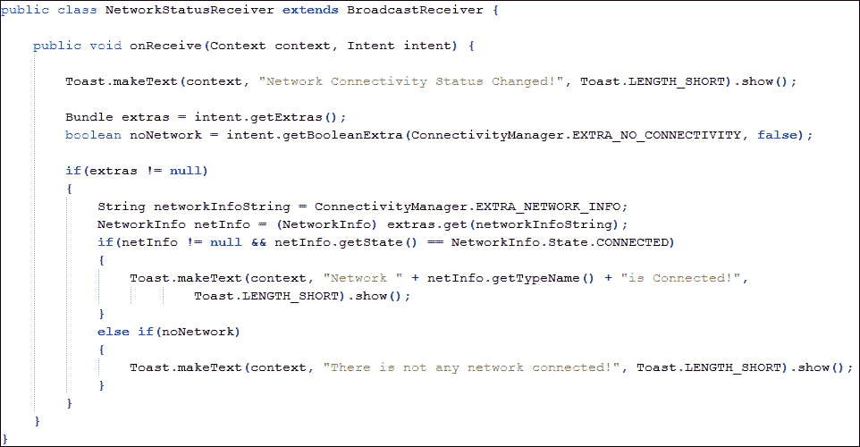

就像我们为活动和服务所做的那样，为了创建一个定制的广播接收器，我们从`BroadcastReceiver`类扩展并覆盖方法来声明定制行为。我们已经覆盖了`onReceive()`方法，我们正在用这个方法执行追踪 Wi-Fi 设备状态的主要功能。我们已经在安卓清单文件中注册了这个接收器作为网络状态更改，我们将在下一节讨论该文件。这个`onReceive()`方法只有在网络状态改变时才会调用。因此，我们首先显示一个祝酒词，说明网络连接状态已经改变。

### 注

必须注意的是，任何广播接收器都不能像我们过去在`Activity`类中所做的那样，在`Toast`的上下文参数中使用`this`传递，因为`BroadcastReceiver`类不像`Activity`类那样扩展`Context`类。

我们已经通知了用户网络状态的变化，但是我们仍然没有通知用户发生了什么变化。因此，在这一点上，我们的意图对象变得很方便。它以`extra`对象的形式包含了网络的所有信息和数据。回想前几章，`extra`是`Bundle`班的一个对象。我们创建一个本地`Bundle`引用，并通过调用`getExtras()`方法在其中存储意图`extra`对象。与此同时，我们还将无连通性`extra`对象存储在一个`boolean`变量中。`EXTRA_NO_CONNECTIVITY`是`boolean`变量的查找键，该变量指示是否完全缺乏网络连接，即是否有任何网络可用。如果该值为真，则意味着没有可用的网络。

存储完我们需要的`extra`对象后，我们需要检查`extra`对象是否可用。因此，我们检查了空的`extra`对象，如果`extra`对象可用，我们从这些`extra`对象中提取更多的网络信息。在安卓系统中，开发人员被以常量字符串的形式告知感兴趣的数据。所以，我们首先得到的是我们不断串的网络信息，也就是`EXTRA_NETWORK_INFO`。我们将其存储在一个字符串变量中，然后将其用作`extra`对象的`get()`方法中的键值参数。`Bundle.get()`方法返回一个对象的`Object`类型，我们需要将其类型转换为我们需要的类。我们正在寻找网络信息；所以，我们使用的是`NetworkInfo`类对象。

### 类型

`Intent.EXTRA_NETWORK_INFO`字符串在 API 级别 14 中被否决。由于`NetworkInfo`可以根据**用户标识** ( **UID** )，应用应始终通过`getActiveNetworkInfo()`或`getAllNetworkInfo()`方法获取网络信息。

我们已经获得了所有感兴趣的价值观和数据；现在，我们将比较和检查数据，以找到连接状态。我们检查这个`NetworkInfo`数据是否为`null`。如果不是`null`，我们通过`NetworkInfo`的`getState()`方法检查值来检查网络是否连接。代表粗粒度网络状态的`NetworkInfo.State`状态是一个枚举。如果`NetworkInfo.State`枚举等于`NetworkInfo.State.CONNECTED`，则表示手机连接到任何网络。请记住，我们仍然不知道我们连接到哪种类型的网络。我们可以通过调用`NetworkInfo.getTypeName()`方法找到网络的类型。该方法将在相应情况下返回`Mobile`或`Wi-Fi`。

### 注

粗粒度网络状态多用于应用而非`DetailedState`。这两种状态映射的区别在于粗粒度网络只显示四种状态:`CONNECTING`、`CONNECTED`、`DISCONNECTING`和`DISCONNECTED`。但是`DetailedState`显示其他状态更详细，如`IDLE`、`SCANNING`、`AUTHENTICATING`、`UNAVAILABLE`、`FAILED`，以及其他四种粗粒度状态。

剩下的是一个`if` - `else` 块，检查网络状态，并在屏幕上显示状态的相对祝酒词。总的来说，我们首先从意图中提取我们的`extra`对象，将它们存储在局部变量中，从附加项中提取网络信息，检查状态，最后以祝酒词的形式显示信息。现在，我们将在下一节讨论安卓清单文件。

##### AnDroidManifest . XML 文件

由于我们在应用中使用了广播接收器来检测网络连接状态，因此有必要在应用中注册和注销广播接收器。在我们的清单文件中，我们执行了两个主要任务。首先，我们添加了访问网络状态的权限。我们已经使用了`android.permissions.ACCESS_NETWORK_STATE`。其次，我们已经在应用中使用 receiver 标签注册了我们的接收器，并添加了类的名称。

此外，我们还添加了意图过滤器。这些意图过滤器定义了接收器的目的，例如应该从系统接收什么类型的数据。我们使用了`android.net.conn.CONNECTIVITY_CHANGE`过滤动作来检测网络连通性变化广播。除了这两个之外，这个文件中没有什么新内容，其余代码与我们在前面章节中讨论的相同。以下是该文件的代码实现:


总结前面应用的细节，我们创建了一个定制的广播接收器，并定义了我们的网络变化的定制行为，即显示祝酒词，然后我们在清单文件中注册了我们的接收器以及所需权限的声明。以下截图显示了在手机中打开无线网络时应用的简单演示:

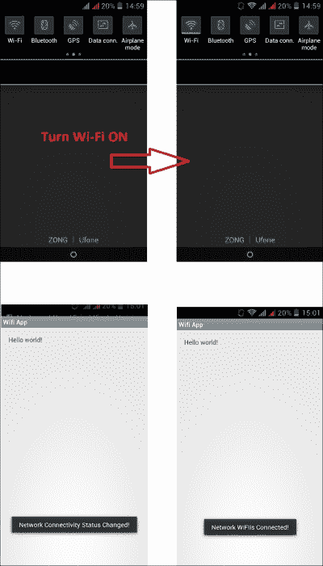

网络更改状态应用

在前面的截图中，我们可以看到当我们打开 Wi-Fi 时，应用会显示一个祝酒词，表示网络状态发生了变化。祝酒后，它显示变化；在我们的例子中，Wi-Fi 是连接的。你可能想知道意向在这个应用中的作用。没有使用意图，这个应用是不可能的。意图的第一个用途是在清单文件中注册接收者，以过滤其网络状态变化。意图的另一个用途是当我们收到更新并且我们想知道变化时，在接收器中。因此，我们使用意图，并以`extra`对象的形式从中提取数据，并将其用于我们的目的。在这个例子中，我们没有创建自己的意图；相反，我们只使用提供的意图。在下一个例子中，我们将创建自己的意图，并使用它们从我们的应用中打开无线设置。

#### 打开 Wi-Fi 设置应用

到目前为止，我们只使用网络和无线网络。在这个例子中，我们将创建意图对象，并在我们的应用中使用它。在前面的应用示例中，我们检测到手机的网络更改状态，并将其显示在屏幕上。在这个例子中，我们将在同一个应用中添加一个按钮。点击或点击按钮后，应用将打开无线网络设置。用户可以从那里打开或关闭无线网络。当用户执行任何操作时，应用将在屏幕上显示网络状态变化。对于网络状态，我们使用了`NetworkStatusReceiver.java`和`AndroidManifest.xml`文件。现在，让我们打开同一个项目，更改我们的`MainActivity.java`和`layout_main.xml`文件，为它们添加一个按钮及其功能。让我们逐一查看这两个文件:

##### activity _ main . XML 文件

这个文件是我们主活动文件的可视化布局。我们将在这个 XML 文件中添加一个按钮视图。该文件的代码实现如下:


我们在布局中增加了一个按钮，视图标识为`btnWifiSettings`。我们将使用该标识在布局文件中获取按钮视图。我们已经在前面的章节中讨论了布局。现在让我们看看我们的主要活动文件，它将使用这个布局作为视觉内容。

##### MainActivity.java 文件

该文件将主活动文件表示为应用的启动点。我们将在这个文件中实现按钮的核心功能。该文件的代码实现如下:

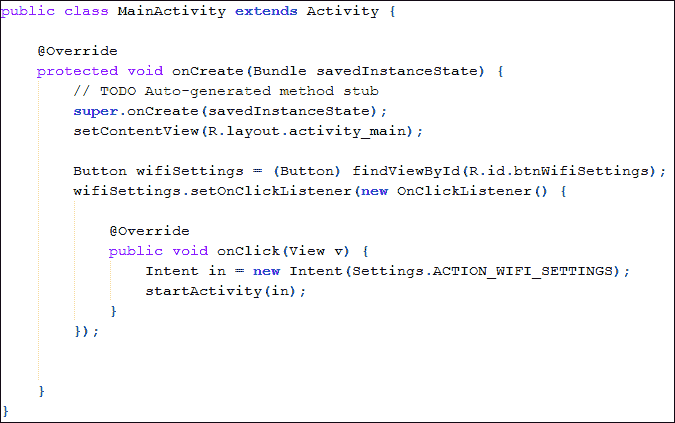

正如多次讨论的，我们已经从`Activity`类扩展了我们的类，并且我们已经覆盖了类的`onCreate()`方法。调用超级方法后，我们首先使用`setContentView()`方法引用了我们的布局文件(在上一节中解释过)，并传递了布局标识作为参数。获取布局文件后，我们通过调用`findViewById()`方法从布局中提取了我们的 Wi-Fi 设置按钮。请记住，我们将按钮视图的标识设置为`btnWifiSettings`；所以，我们将在方法中传递这个 ID 作为参数。我们将按钮的引用文件存储在本地`Button object.reference`对象中。现在，我们将设置本地按钮的`View.OnClickListener`以在按钮点击时执行我们的任务。我们在`button.setOnClickListener()`方法中传递了一个`OnClickListener`的匿名对象，并覆盖了匿名对象的`onClick()`方法。

到目前为止，我们只执行了一些初始步骤来为我们的应用创建设置。现在，让我们专注于打开 Wi-Fi 设置任务。我们将创建一个`Intent`对象，我们必须传递一个常量字符串 ID 来告诉意图要开始什么。我们将使用显示设置的`Settings.ACTION_WIFI_SETTINGS`常数来配置无线网络。在创建了`Intent`对象之后，我们将通过`startActivity()`方法打开包含无线设置的活动。没有火箭科学就这么简单。当我们运行该应用时，我们会看到类似于以下截图的内容:


打开无线网络设置应用

从前面的截图可以看到，当我们点击或者点击 Wi-Fi 设置按钮时，会打开安卓手机的 Wi-Fi 设置画面。在更改设置时，例如打开无线网络，它将显示祝酒词，以显示更新的更改和网络状态。

我们已经讨论完了使用意图的通信组件，其中我们通过意图使用了蓝牙和无线网络，并了解了如何在各种示例和应用中使用它们。现在，我们将在以下部分讨论如何通过意图使用媒体组件，以及我们可以为媒体组件做些什么。

## 媒体组件

前面的部分都是关于通信组件的。但旧手机和新智能手机的区别在于媒体功能，比如高清音视频功能。手机的多媒体功能已经成为许多消费者更重要的考虑因素。幸运的是，安卓系统为许多功能提供了多媒体应用编程接口，例如在本地和流式播放和录制各种图像、音频和视频格式。如果我们用简单的语言描述媒体组件，这个话题只能在一个完全专用的章节中涵盖，超出了本书的范围。我们将只讨论那些可以通过意图触发、使用和访问的媒体组件。本节要讨论的组件包括使用意图拍照、使用意图录制视频、使用意图进行语音识别以及意图在文本到语音转换中的作用。前三个主题使用意图来执行动作；但是文本到语音转换的最后一个主题并没有完全使用意图。我们还将开发一个示例应用来查看实际的意图。让我们在下面的小节中逐一讨论这些主题。

### 使用意图拍照

如今，几乎每部手机都有数码相机组件。手机内置数码相机的普及导致其价格随尺寸下降。安卓手机还包括从 320 万像素到 3200 万像素的数码相机。从发展的角度来看，照片可以通过许多不同的方法拍摄。安卓系统也提供了相机控制和图片的应用编程接口，但我们将只关注其中一种使用意图的方法。这是安卓开发中最简单的拍照方式，包含的代码不超过几行。

我们将首先创建一个带有图像视图和按钮的布局。然后，在`Activity`类中，我们将从布局文件中获取我们视图的引用，并设置按钮的点击监听器。点击按钮，我们将创建捕获图像的意图，并作为子类开始另一个活动。获得结果后，我们将在图像视图中显示捕获的图像。

因此，准备好基本的空 Hello World 项目后，我们将更改三个文件并向其中添加代码。文件有`activity_main.xml`、`MainActivity.java`、 `AndroidManifest.xml`。让我们逐一解释每个文件中的变化:

#### activity _ main . XML 文件

该文件代表文件的视觉布局。我们将添加一个`ImageView`标签来显示捕获的图像，并添加一个`Button`标签来拍照并触发相机。该文件的代码实现如下:


从代码中可以看到，我们在相对布局中放置了一个`ImageView`标签，ID 为`imageView1`。该标识将在主活动文件中使用，以从布局中提取视图，从而在 Java 文件中使用。我们通过在`android:layout_centerHorizontal`标签中赋值`true`将视图放置在布局的水平中心。最初，我们将应用启动器图标的默认图像设置为图像视图。在“视图”图像下方，我们放置了一个“视图”按钮。轻按按钮，照相机就会启动。按钮的标识通过图像视图布局下方的`android:layout_below`标签设置为`btnTakePicture`。与线性布局相比，这种相关性是相对布局的主要优势。所以现在，让我们看看执行主要功能并使用该布局作为视觉部分的应用的活动。

#### MainActivity.java 文件

该文件代表该应用的主要发布活动。该文件使用`layout_main.xml`文件作为可视化部分，是从`Activity`类扩展而来的。该文件的代码实现如下:

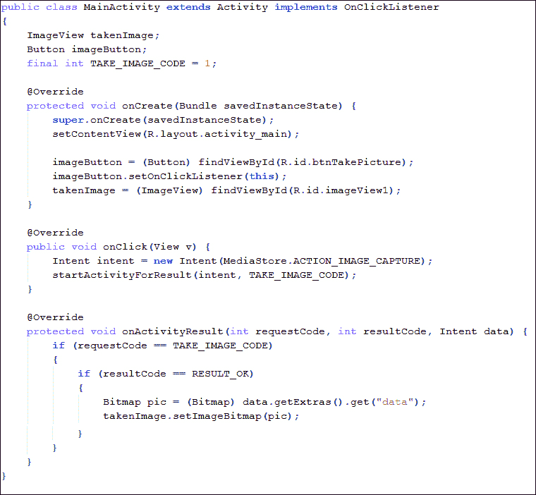

我们通过覆盖活动的`onCreate()`方法开始上课。我们通过调用`setContentView()`方法将活动的视觉布局设置为`activity_main.xml`布局。现在，当布局设置好后，我们可以在布局文件中获取视图的引用。

我们在类中创建两个字段；用于显示捕获的图像的`ImageView`类的`takenImage`和用于通过点击触发摄像机的`Button`类的`imageButton`。点击按钮时将调用`onClick()`方法。因此，我们将在这个方法中定义我们的相机触发代码。因此，在这个方法中，我们创建了一个`Intent`类的实例，并且在构造函数中传递了`MediaStore.ACTION_IMAGE_CAPTURE`常量。这个常量会告诉安卓，意图是为了图像捕捉的目的，安卓会在启动这个意图时启动相机。如果用户安装了多个相机应用，安卓会显示所有有效相机应用的列表，用户可以选择任何一个来拍摄图像。

创建意图实例后，我们在`startActivityForResult()`方法中传递该意图对象。在我们的图片捕捉应用中，点击按钮将启动相机的另一项活动。当我们关闭相机活动时，它会回到我们应用的原始活动，并给我们一些捕获图片的结果。因此，为了在任何活动中获得结果，我们必须覆盖`onActivityResult()`方法。当父活动在子活动完成后启动时，调用此方法。当这个方法被调用时，意味着我们已经使用了相机，现在回到了我们的父活动。如果结果成功，我们可以在图像视图中显示捕获的图像。

首先，我们可以了解这个方法是在相机之后调用的，还是发生了另一个动作。为此，我们必须比较方法的`requestCode`参数。记住，在调用`startActivityForResult()`方法时，我们传递了`TAKE_IMAGE_CODE`常量作为另一个参数。这是要比较的请求代码。

之后，为了检查结果，我们可以看到方法的`resultCode`参数。当我们将此代码用于相机图片意图时，我们将比较我们的`resultCode`和`RESULT_OK`常数。在这两个条件都成功之后，我们可以断定我们已经收到了我们的形象。因此，我们使用意图通过调用`getExtras().get()`方法来获取我们的图像数据。这将为我们提供`Object`类型的数据。我们进一步将其打造成`Bitmap`为`ImageView`做准备。

最后，我们调用`setImageBitmap`方法将新位图设置为我们的图像视图。如果你运行代码，你会看到一个图标图像和一个按钮。点击按钮后，摄像机将启动。当你拍照时，应用会崩溃并关闭。可以在下面的截图中看到:


该应用在拍照后崩溃

你可能想知道为什么会发生车祸。我们忘了提一件事；每当任何应用使用摄像头时，我们都必须在我们的清单文件中添加`uses-feature`标签，告诉应用它将使用摄像头功能。让我们看看我们的安卓清单文件，了解`uses-feature`标签。

#### AnDroidManifest . XML 文件

该文件定义了我们应用中使用的所有设置和功能。只有一个我们没见过的新东西。该文件的代码实现如下:


您可以看到我们添加了`uses-feature`标签，并且在`android:name`属性中分配了`android.hardware.camera`。这个标签告诉应用里面的摄像头使用情况，安卓操作系统给我们的应用使用外接摄像头的许可。

在清单文件中添加这一行并运行代码后，如果您的手机中有多个相机应用，您将看到类似于以下截图的内容:

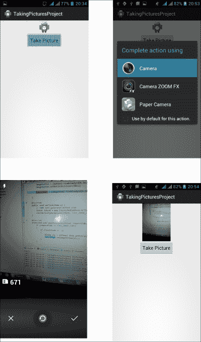

通过意向应用拍照

在截图中，可以看到用户被要求选择相机，拍照时，图像会显示在 app 中。

当我们总结代码时，我们首先创建了一个带有图像视图和按钮的布局。然后，在`Activity`类中，我们从布局文件中获取视图的引用，并设置按钮的点击监听器。点击按钮后，我们创建了捕获图像的意图，并启动了另一个活动作为子活动。得到结果后，我们在图像视图中显示了捕获的图像。这就像在公园散步一样简单。在下一节中，我们将看到如何使用意图录制视频。

### 使用意图录制视频

到目前为止，我们已经看到了如何使用意图拍照。在本节中，我们将了解如何使用意图录制视频。我们不会在这一部分讨论整个项目。使用意图录制视频的程序几乎和拍照一样，只有很少的细微变化。我们将只在这一部分讨论这些变化。现在，让我们看看这个应用是如何录制视频的。

我们所做的第一个更改是在布局文件中。我们删除了图像视图部分，并放置了`VideoView`标签。下面的代码实现显示了该标签:


你可以看到一切都和`ImageView`时一样。现在，当我们在布局中将图像视图更改为视频视图时，我们也必须在活动中更改这一点。就像我们为`ImageView`做的一样，我们将创建一个`VideoView`的字段对象，并在我们的`onCreate()`活动方法中获取引用。以下代码示例显示了`VideoView`行的字段对象:


一切都是一样的，我们已经讨论过了。现在，在我们的`onClick()`方法中，我们将看到我们如何发送触发视频录制的意图。发送意图的`onClick()`方法的代码实现如下:

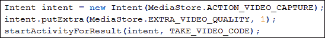

你可以看到我们已经创建了一个意图对象，我们没有传递`MediaStore.ACTION_IMAGE_CAPTURE`，而是在意图的构造函数中传递了`MediaStore.ACTION_VIDEO_CAPTURE`。另外，我们通过调用`putExtra()`方法在意图中放置了一个`extra`对象。我们通过将`MediaStore.EXTRA_VIDEO_QUALITY`值分配给`1`，将定义视频质量的`extra`对象设置为`high`。然后，我们再次通过`startActivityForResult()`方法中的意图来启动相机活动。

下一个变化是在`onActivityResult()`方法中，我们从意图中获取视频。下面的代码展示了一些获取视频并将其传入`VideoView`标签并播放的示例代码:

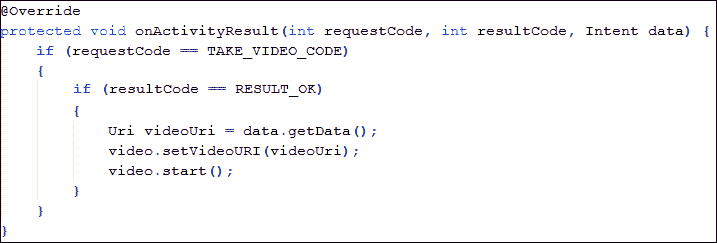

在拍照的情况下，我们从意图中恢复原始数据，将其输入`Bitmap`，然后将我们的`ImageView`设置为`Bitmap`。但是在这里，如果录制视频，我们只能获得视频的 URI。`Uri`对象声明手机中数据的引用。我们获取视频的 URI，并使用`setVideoURI()`方法将其设置在我们的`VideoView`中。最后，我们通过调用`VideoView.start()`方法播放视频。

从这些部分，您可以看到使用意图来捕获图像或录制视频是多么容易。通过意图，我们正在使用已经内置的相机或相机应用。如果我们想要自己的定制相机来捕捉图像和视频，我们必须使用安卓的相机应用编程接口。

我们可以使用`MediaPlayer`类播放视频、音频等等。`MediaPlayer`类包含像`start()`、`stop()`、`seekTo()`、`isLooping()`、`setVolume()`等方法。要录制视频，我们可以使用`MediaRecorder`类。这个类包含的方法包括`start()`、`stop()`、`release()`、`setAudioSource()`、`setVideoSource()`、`setOutputFormat()`、`setAudioEncoder()`、`setVideoEncoder()`、`setOutputFile()`等等。

### 注

当你在应用中使用`MediaRecorder`API 时，不要忘记在你的清单文件中添加`android.premission.RECORD_AUDIO`和`android.permission.RECORD_VIDEO`的权限。

不使用意图拍照，可以使用`Camera`类。这个类包括方法`open()`、`release()`、`startPreview()`、`stopPreview()`、`takePicture()`等等。

### 注

当你在你的应用中使用相机应用编程接口时，不要忘记在你的清单文件中添加`android.premission.CAMERA`的权限。

到目前为止，我们已经使用视觉媒体组件来制作使用意图的视频和图片。在下一节中，我们将使用意图来使用手机的音频组件。在接下来的章节中，我们将看到如何使用语音识别和文本到语音的支持。

### 使用意图的语音识别

智能手机引入了语音识别，这成为残疾人的一大成就。安卓在 1.5 版本的 API Level 3 中引入了语音识别。安卓支持使用`RecognizerIntent`类的语音输入和语音识别。安卓的默认键盘包含一个带有麦克风图标的按钮。这允许用户说话，而不是键入文本。为此，它使用了语音识别应用编程接口。下面的屏幕截图显示了带有麦克风按钮的键盘:


带有麦克风按钮的安卓默认键盘

在本节中，我们将创建一个包含按钮和文本字段的示例应用。点击按钮后，将显示安卓标准语音输入对话框，并要求用户说话。该应用将尝试识别用户说的任何话，并在文本栏中键入。我们将从在安卓工作室或任何其他 IDE 中创建一个空项目开始，我们将在其中修改两个文件。让我们从下一节的布局文件开始。

#### activity _ main . XML 文件

这个文件代表app 的视觉内容。我们将在这个文件中添加文本字段和按钮视图。该文件的代码实现如下:

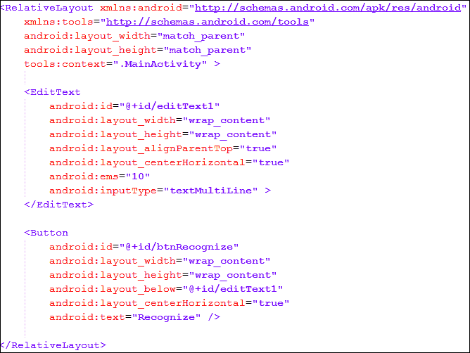

如你所见，我们放置了一个`EditText`场。我们已经将`android:inputType`设置为`textMultiLine`来多行输入文本。在文本字段下方，我们添加了一个 ID 为`btnRecognize`的`Button`视图。当点击或点击这个按钮时，它将被用来开始语音识别活动。现在，让我们讨论一下主要的活动文件。

#### MainActivity.java 文件

该文件代表项目的主要活动。文件的代码实现如下:


像往常一样，我们覆盖`onCreate()`方法，从`setContentView()`方法设置的布局中获取我们的按钮引用。我们将按钮的监听器设置为这个类，并且在活动中，我们实现了`OnClickListener`以及覆盖`onClick()`方法。在`onClick()`方法中，我们创建一个意图对象，并将`RecognizerIntent.ACTION_RECOGNIZE_SPEECH`作为动作字符串传递给构造函数。这个常量将告诉安卓，其目的是为了语音识别。然后，我们还要添加一些`extra`对象，给安卓提供更多关于意图和语音识别的信息。最重要的`extra`要添加的对象是`RecognizerIntent.EXTRA_LANGUAGE_MODEL`。这通知识别器在识别语音时使用哪个语音模型。识别器使用这些额外的信息来更精确地微调结果。这个`extra`方法是必需的，并且必须是在调用语音识别器意图时提供的。我们已经通过了演讲的`RecognizerInent.ACTION_LANGUAGE_MODEL_FREE_FORM`模式。这是一种基于自由形式语音识别的语言模型。现在，我们有一些可选的`extra`对象来帮助识别器获得更准确的结果。我们添加了`RecognizerIntent.EXTRA_PROMPT`的`extra`，并在其中传递了一些字符串值。这将通知用户语音识别已经开始。

接下来，我们添加`RecognizerIntent.EXTRA_MAX_RESULTS`额外值，并将其值设置为`1`。语音识别的准确性总是变化的。因此，识别器将尝试更准确地进行识别。因此，它会产生不同的结果，有不同的准确度，可能还有不同的含义。因此，通过这些额外的信息，我们可以告诉识别器我们对多少结果感兴趣。在我们的应用中，我们将其命名为`1`。因此，这意味着识别器将只向我们提供一个结果。不能保证这个结果会足够准确；这就是为什么建议传递大于`1`的值。对于一个简单的例子，你可以传递一个值到`5`。记住，你传递的价值越大，识别它所需要的时间就越长。

最后，我们把我们最后的可选`extra`的语言。我们通过`Locale.ENGLISH`作为`RecognizerIntent.EXTRA_LANGUAGE`额外的价值。这将告诉识别器关于语音的语言。因此，识别器不必检测语言，这导致语音识别更准确。

### 注

语音识别引擎可能无法理解`Locale`类中所有可用的语言。此外，并非所有设备都必须支持语音识别。

添加所有`extra`对象后，我们已经确保我们的意图对象已经准备好了。我们以`requestCode`为`1`通过`startActivityForResult()`方法。当调用此方法时，会显示一个标准的语音识别对话框，其中包含我们给出的提示信息。我们讲完后，我们家长活动的`onActivityResult()`方法被调用。我们先检查`requestCode`是不是`1`，这样就可以确定这是我们语音识别的结果。之后，我们将检查`resultCode`以查看结果是否正常。成功结果后，我们会得到一个包含识别器识别的所有单词的字符串数组列表。我们可以通过调用`getStringArrayListExtra()`方法并通过`RecognizerIntent.EXTRA_RESULTS`来获得这些单词的列表。此列表仅在`resultCode`正常时返回；否则，我们将得到一个空值。结束语音识别后，我们现在可以为结果设置文本值。为此，我们首先从布局中提取`EditText`视图，并通过调用`setText()`方法将结果设置为文本字段的值。

### 注

运行语音识别需要活动的互联网连接。语音识别过程在谷歌的服务器上执行。安卓手机接收语音输入，将其发送到谷歌服务器，并在那里进行处理以供识别。识别后，谷歌将结果发回安卓手机，手机通知用户结果，循环完成。

如果您运行该项目，您将看到类似于以下截图的内容:


使用意图的语音识别

在图中，可以看到点击**识别**按钮后，出现一个标准的语音输入对话框。说话时，我们将返回到我们的父活动，识别出语音后，它将打印文本字段中的所有文本。

### 意图在文本到语音转换中的作用

上一节我们讨论了安卓系统如何识别我们的语音，并通过语音命令执行控制手机等动作。我们还使用意图开发了一个简单的语音到文本的例子。本节与上一节相反。在本节中，我们将讨论安卓系统如何将我们的文本转换成优美的语音旁白。我们可以称之为文本到语音的转换。安卓在 1.6 版 API Level 4 中引入了**文本转语音** ( **TTS** ) **转换**引擎。我们可以使用这个应用编程接口从我们的应用中产生语音，从而允许我们的应用与我们的用户交谈。如果我们添加语音识别，这就像用我们的应用说话一样。文本到语音的转换需要预装语言包，由于手机存储空间不足，手机中没有必要安装任何语言包。因此，在使用文本到语音引擎创建任何应用时，检查语言包是否安装是一个很好的做法。

我们不能使用文本到语音的转换。我们只能通过称为 TTS 的文本到语音引擎来使用它。但是，意图在文本到语音转换中的作用很小。意图仅用于检查语言包是否已预安装。因此，创建任何使用文本到语音转换的应用都必须首先检查语言包的安装状态。这就是意图在文本到语音转换中的作用。让我们看看检查语言包安装状态的示例代码:

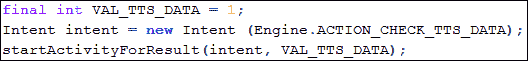

对于文本到语音的转换，我们首先要做的是检查语言包。在代码中，我们可以看到我们正在创建一个意图对象。我们正在传递`Engine.ACTION_CHECK_TTS_DATA`常量，该常量将告诉系统意图将检查文本到语音(TTS)数据和语言包。然后，我们传递 `startActivityForResult()`方法中的意图以及用作`requestCode`的`VAL_TTS_DATA`常量值。现在，如果安装了语言包并且一切正常，我们将在`onActivityResult()`方法中获得`resultCode`作为`RESULT_OK`。所以，如果结果没问题，我们可以使用文本到语音的转换。那么，让我们看看`onActivityResult()`方法的代码示例，如下图所示:

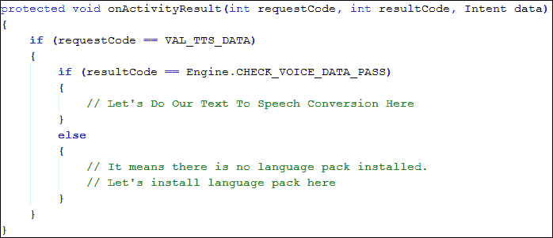

因此，我们首先检查我们传递的代码的`requestCode`。然后，我们检查`resultCode`到`Engine.CHECK_VOICE_DATA_PASS`。该常数用于判断语音数据是否可用。如果我们的手机里有数据，我们可以在那里进行文本到语音的转换。否则，很明显，我们必须先安装语音数据，然后再进行文本到语音的转换。你会很高兴知道安装语音数据也很容易；它使用意图来达到这个目的。以下代码片段显示了如何使用意图安装语音数据:


我们创建了一个意图对象，并在构造函数中传递`Engine.ACTION_INSTALL_TTS_DATA`。这个常量将告诉安卓，目的是安装文本到语音语言包的数据。然后，我们将意图传递到`startActivity()`方法中开始安装。语言包安装后，我们必须创建一个`TextToSpeech`类的对象，并在我们想要进行一些文本到语音转换时调用其`speak()`方法。下面的代码实现展示了如何在`onActivityResult()`方法中使用`TextToSpeech`类的对象:

```java
protected void onActivityResult(int requestCode, int resultCode,
  Intent data) {

  if (requestCode == VAL_TTS_DATA) {
    if (resultCode == Engine.CHECK_VOICE_DATA_PASS) {
      TextToSpeech tts = new TextToSpeech(this,
        new OnInitListener() {
        public void onInit(int status) {
          if (status == TextToSpeech.SUCCESS) {
            tts.setLanguage(Locale.US);
            tts.setSpeechRate(1.1f);
            tts.speak("Hello, I am writing book for Packt",
              TextToSpeech.QUEUE_ADD, null);
          }
        }
      });
    }
    else {
      Intent installLanguage = new Intent (
        Engine.ACTION_INSTALL_TTS_DATA);
      startActivity(installLanguage);
    }
  }
}
```

如代码所示，在成功安装语言数据包后，我们创建了一个`TextToSpeech`实例，并传递了一个匿名的`OnInitListener`对象。我们已经实施了`onInit()`方法。该方法将设置`TextToSpeech`对象的初始设置。如果状态成功，我们设置语言、语速，最后调用`speak()`方法。在这个方法中，我们传递了一串字符，安卓会大声朗读这些字母。

总结整个主题，意图在文本到语音转换中的作用是检查和安装语音数据包。意图不会直接影响文本到语音的转换，但它们只是设置文本到语音转换的初始设置。

通过文本到语音的转换，我们已经完成了对媒体组件的讨论。在媒体组件中，我们讨论了拍照、录制视频、语音识别和文本到语音转换。在下一节中，我们将讨论运动分量，看看意图在这些分量中是如何发挥作用的。

## 运动分量

安卓手机中的运动组件包括许多不同类型的传感器，它们执行许多不同的任务和动作。在本节中，我们将讨论运动和位置传感器，如加速度计、地磁传感器、方位传感器和接近传感器。所有这些传感器都在安卓手机的运动和位置中发挥作用。我们将只讨论那些使用意图被触发的传感器。我们只有一个使用意图的传感器，那就是接近传感器。让我们在下一节讨论它。

### 意图和接近警报

在了解意图在邻近警报中的作用之前，我们将讨论什么是邻近警报，以及这些警报如何在各种应用中有用。

#### 什么是接近警报？

接近传感器让用户确定设备离物体有多近。当你的应用对手机屏幕移向或移离任何特定对象做出反应时，它通常很有用。例如，当我们在安卓手机上接到任何来电时，将手机放在耳朵上会关闭屏幕，拿在手里会自动打开屏幕。该应用使用接近警报来检测耳朵和设备的接近传感器之间的距离。下图以可视化格式显示了它:


另一个例子是，当我们的手机闲置了一段时间，屏幕关闭时，如果我们有一些未接电话或发出通知提示我们检查手机，它会振动。这也可以使用接近传感器来完成。

接近传感器使用接近警报，检测手机传感器和任何物体之间的距离。这些警报让您的应用设置触发器，当用户从某个地理位置移动到设定的距离之内或之外时，这些触发器将被触发。在本节中，我们不会讨论使用邻近警报的所有细节，但我们将只介绍一些基本信息和意图在使用邻近警报中的作用。例如，我们为给定的覆盖区域设置了邻近警报。我们以经度和纬度的形式选择一个点，以米为单位选择该点周围的半径，并为警报选择一些到期时间。现在，在使用邻近警报后，如果设备越过边界，就会发出警报。可以是设备从外部移动到半径内，也可以是从半径内移动到半径外。

### 意图在邻近警报中的作用

当触发接近警报时，它们会触发意图。我们将使用`PendingIntent`对象来指定要激发的意图。让我们在下面的实现中看到一些我们在前面章节中讨论的距离应用的代码示例:

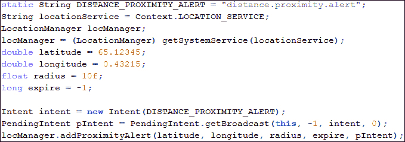

在前面的代码中，我们实现了在应用中使用邻近警报的第一步。首先，我们创建一个接近警报，可以通过`PendingIntent`完成。我们将警报的名称定义为`DISTANCE_PROXIMITY_ALERT`，然后通过调用我们编写代码的当前活动的`getSystemService()`方法来获得位置管理器服务。然后，我们为纬度、经度、半径、和截止时间设置一些随机值到无穷大。应该记住，这些值可以设置为任意值，具体取决于您正在创建的应用的类型。

现在是我们创建邻近警报的最重要部分。我们创建意图，并在构造函数中传递我们自己的警报名称来创建我们自己的意图。然后，我们通过使用`getBroadcast()`方法获得广播意图来创建`PendingIntent`的对象。最后，我们通过调用`addProximityAlert()`方法，在我们的位置管理器服务中添加邻近警报。

该代码片段仅创建了警报并为其设置了初始值。现在，假设我们已经完全完成了我们的距离应用。因此，每当我们的设备通过我们在应用中指定的边界或进入其中时，`LocationManager`将检测到我们已经越过边界，并且它将激发一个具有额外值`LocationManager.KEY_PROXIMITY_ENTERING`的意图。该值是一个布尔值。如果它的值是`true`，则表示我们已经进入了边界，如果是`false`，则表示我们已经离开了边界。为了接收这个意图，我们将创建一个广播接收器并执行该操作。下面的代码片段显示了接收器的示例实现:

```java
public class ProximityAlertReceiver extends BroadcastReceiver {
  @Override
  public void onReceive(Context context, Intent intent) {
    Boolean isEntered = intent.getBooleanExtra(
      LocationManager.KEY_PROXIMITY_ENTERING, false);
    if (isEntered)
      Toast.makeText(context, "Device has Entered!",
        Toast.LENGTH_SHORT).show();
    else
      Toast.makeText(context, "Device has Left!",
        Toast.LENGTH_SHORT).show();
  }
}
```

在代码中，您可以看到我们正在使用`getBooleanExtra()`方法获取`LocationManager.KEY_PROXIMITY_ENTERING`的额外值。我们比较数值并相应地显示吐司。如你所见，这很容易。但是，像所有的接收器一样，这个接收器只有在`AndroidManifest.xml`注册或通过 Java 代码注册后才能工作。注册接收器的 java 代码如下:


这里没有什么可以解释的，只是我们在调用`Activity`类的`registerReceiver()`方法。我们将在接下来的章节中更详细地讨论`IntentFilter`。

简而言之，意图在获得邻近警报中扮演次要角色。意图仅用于告诉安卓操作系统已经添加的邻近警报的类型、何时触发以及应该包含哪些信息，以便开发人员可以在他们的应用中使用它。

# 总结

在这一章中，我们讨论了几乎所有安卓手机中常见的移动组件。这些组件包括无线组件、蓝牙、蜂窝、全球定位系统、地磁场、运动传感器、位置传感器和环境传感器。然后，我们讨论了意图在这些组件中的作用。为了更详细地解释这个角色，我们使用了蓝牙通信的意图，打开/关闭蓝牙，使设备可被发现，打开/关闭无线网络，以及打开无线网络设置。我们还看到了如何通过意图拍照、录制视频、进行语音识别和文本到语音的转换。最后，我们看到了如何通过意图使用接近传感器。

在下一章中，我们将看到意图如何用于在活动、服务和其他移动组件之间传输数据。