# 第五章。使用意图进行数据传输

到目前为止，我们已经了解了意图的分类，它们在安卓组件中的用途，以及在您的安卓应用中实现它们的分步指南。这是查看安卓应用最重要部分的合适时机。安卓应用必须将数据从一个活动传输到另一个活动(无论是隐式的还是显式的)。数据的安全传输和检索是本章的重点。

本章包括以下主题:

*   传输数据的需要
*   活动之间的数据传输–一种*意图的*方式
*   明确意图的数据传输
*   使用意图进行显式数据传输的方法
*   隐式意图中的数据传输

# 发现需要传输数据

从技术上讲，安卓应用是不同活动的组合。这些活动包括布局、视图和一些内容。这些内容大多不是动态的，也不是预先定义的。例如，如果安卓布局由一个按钮组成，该按钮中的文本可以是静态的或预定义的。类似地，如果活动中存在任何文本字段或任何列表视图，它主要由来自任何服务器或任何其他方式的动态数据组成。

在这种情况下，我们需要一些我们的应用可以从服务器(或其他地方)获取的动态数据，以及在它们之间传输这些数据的活动。这是发生数据传输的场景。此外，数据传输的可能性很大，其中一个活动对数据执行一些操作，而另一个活动需要在其视图中显示数据。

## 举个简单的例子

为了更好地理解图片，让我们举一个理论上的例子，说明为什么我们需要在活动之间执行数据传输。Reader 应用可以作为一个很好的例子来理解数据传输的原因。

阅读器应用是一个应用，其中有不同种类的新闻出现在列表视图中，点击它们会进入描述页面，在该页面中，整个新闻以图像和其他文本显示。让我们一步步来看看这个应用的流程(以 TechCrunch 安卓应用为例)。该应用将从一个闪屏开始，向读者或制作该应用的开发人员进行描述。

下面的截图是闪屏；该应用将搜索互联网连接，以便在应用的屏幕上显示提要。一旦在本地提取了数据，它就会解析数据并将其放入列表视图中。请注意，下面的列表视图截图基本上是定制的列表视图，不是安卓内置布局直接获得的。我们需要为此定制一个布局，然后在普通的列表视图中填充它。为此，使用了适配器(参考互联网，以了解基本的列表视图是如何在安卓系统中创建的)。


在列表视图中列出新闻的阅读器应用的活动。

现在，数据传输有两种可能性，描述如下:

*   提取包括描述在内的全部数据
*   单击列表视图上的提要后，将在该特定时刻获取该提要的描述


显示在前面活动中点击的故事描述的活动

不管是什么情况，这一步都需要将数据从第一个活动转移到下一个活动。如果场景是第一个，由第一个活动解析的描述数据将被传递给第二个活动，以便在视图中填充它。否则，在第二种情况下，它会将一些 URL 传递给第二个活动，从那里可以获取新闻的描述。参考前面的截图。

# 活动之间的数据传输——有意图的方式

当我们谈论活动之间的数据传输时，我们需要记住，交互和管理活动流的唯一方法是通过意图。在前一章中，我们对如何使用意图从一个活动转移到另一个活动进行了深入的讨论。在这里，我们将看到如何按照这些意图传输数据，以及如何在目标活动中安全地捕获传输的数据。

# 明确意图的数据传输

通过注意数据在显式意图中的使用，您可以开始理解意图中的数据传输。回顾显式意图的定义，它们是指向另一个活动(在该应用或另一个应用中)的意图。显式意图通常指向同一应用中的活动，但根据应用的要求，它们也可以指向属于其他应用的活动(例如，设备摄像头)。

# 活动间数据传输的方法

在本节中，我们将从安卓应用中使用的各种数据传输技术开始。这些技术各有利弊。共有三种方法可以将数据从一个活动显式传输到另一个活动。我们将很快看到他们以及他们的例子。这三种方法如下:

*   使用`putExtras()`进行数据传输
*   使用`Parcelable`进行数据传输(仅适用于自定义数据对象)
*   使用`Serializable`进行数据传输(仅适用于自定义数据对象)

## 使用 putExtras 进行数据传输()

在安卓系统中，将数据从一个活动传输到另一个活动的最简单的方法是通过附加程序发送数据。意图附加支持原始数据类型来发送数据。这意味着您可以以不同的数据类型发送数据，如`String`、`Boolean`、`Integer`或`Float`。

理论上解释，意图附加可以在安卓应用编程接口的`Intent`类中找到。开发人员需要制作一个`Intent`类的对象。这将是用于在活动中导航的同一个对象。有了这个对象，`putExtras()`功能会有多种形态。这些多态以不同的数据类型(如前所述)作为参数，并用这些数据加载意图对象。这样，对象就完成了。现在，从`Activity`类调用`startActivity()`方法开始执行意图。

这是画面的一面。这种意图将应用流带到第二个活动；在显式调用的情况下，它是同一个应用的活动，或者在隐式意图的情况下，它可以是某个其他应用。这个新活动将接收意图对象并从中提取数据。由此，在`Intent`类中出现了另一种称为`getExtras()`的方法。因此，它将给出意图对象中由源活动添加的所有额外数据，使用它，我们可以轻松地提取意图额外数据中的所需数据。

这种理论解释可能无法让您理解使用意图进行数据传输的每一个细节。在下一节中，我们将通过示例了解更多关于使用意图的数据传输，其中将逐步解释数据传输。

### putExtras 的实现()

在本节中，我们将研究如何在 extras 的帮助下将数据从一个活动转移到另一个活动的分步实现。您可能已经阅读过，在考虑活动之间的数据传输时，这种方法是最简单的。为了理解这个方法的工作和实现，你必须理解活动生命周期，不同活动的处理，以及意图的实现，以便作为先决条件在活动之间导航。

为了从第一个例子开始，第一步是制作一个安卓项目。在安卓工作室制作一个项目的步骤在前面几章已经介绍过了；如果你愿意，你可以参考它们。你最终会制作一个包含不同数量的文件和文件夹的项目(因为它是安卓项目的默认设置)。

#### 实施现成教程

为了简单起见，我们使用名称`Activity1`作为源活动，`Activity2`作为目的地活动。现在，按照给定的步骤成功实现这个例子。

1.  首先，创建一个新的安卓项目，或者选择您想要有目的地实现数据传输的任何现有项目。在新创建的项目中，在它们各自的类中实现以下代码:

    ```java
    //---------------------------------------------------------------
    //Activity1 Class

    public class Activity1 extends Activity {

      @Override
      protected void onCreate(Bundle savedInstanceState) {
        super.onCreate(savedInstanceState);
        setContentView(R.layout.main_first);

        final EditText editTextFieldOne = (EditText) findViewById(R.id.edittext1);
        final EditText editTextFieldTwo  = (EditText) findViewById(R.id.edittext2);
        final EditText editTextFieldThree  = (EditText) findViewById(R.id.edittext3);

        Button transferButton = (Button) findViewById(R.id.button);

        String valueOne = editTextFieldOne.getText().toString();
        String valueTwo = editTextFieldTwo.getText().toString();
        String valueThree = editTextFieldThree.getText().toString();

        transferButton.setOnClickListener(new OnClickListener() {

          @Override
          public void onClick(View v) {
            // TODO Auto-generated method stub

            Intent intent = new Intent(Activity1.this,Activity2.class);
            intent.putExtra("EDITTEXT_ONE_VALUE",valueOne);
            intent.putExtra("EDITTEXT_TWO_VALUE",valueTwo);
            intent.putExtra("EDITTEXT_THREE_VALUE",valueThree);
            Activity1.this.startActivity(intent);

          }
        });

      }
    }

    //----------------------------------------------------------------
    //Activity2.java

    public class Activity2 extends Activity {

      @Override
      protected void onCreate(Bundle savedInstanceState) {
        // TODO Auto-generated method stub
        super.onCreate(savedInstanceState);
        setContentView(R.layout.main_second);

        Intent intent = getIntent();

        String valueOne = intent.getExtras().getStringKey("EDITTEXT_ONE_VALUE");
        String valueTwo = intent.getExtras().getStringKey("EDITTEXT_TWO_VALUE");
        String valueThree = intent.getExtras().getStringKey("EDITTEXT_THREE_VALUE");

        TextView textViewOne = (TextView) findViewbyId(R.id.textView1);
        TextView textViewTwo = (TextView) findViewbyId(R.id.textView2);
        TextView textViewThree = (TextView) findViewbyId(R.id.textView3);

        textViewOne.setText(valueOne);
        textViewTwo.setText(valueTwo);
        textViewThree.setText(valueThree);

      }
    }

    //----------------------------------------------------------------
    //main_first.xml File

    <RelativeLayout
      xmlns:android="http://schemas.android.com/apk/res/android"
      xmlns:tools="http://schemas.android.com/tools"
      android:layout_width="match_parent"
      android:layout_height="match_parent"
      android:paddingBottom="@dimen/activity_vertical_margin"
      android:paddingLeft="@dimen/activity_horizontal_margin"
      android:paddingRight="@dimen/activity_horizontal_margin"
      android:paddingTop="@dimen/activity_vertical_margin"
      tools:context=".Activity1" >

      <EditText
        android:id="@+id/edittext1"
        android:layout_width="wrap_content"
        android:layout_height="wrap_content"
        android:layout_alignBaseline="@+id/textView1"
        android:layout_alignBottom="@+id/textView1"
        android:layout_alignParentRight="true"
        android:layout_toRightOf="@+id/textView1"
        android:ems="10"
        android:inputType="textPersonName" >

        <requestFocus />
      </EditText>

      <EditText
        android:id="@+id/edittext2"
        android:layout_width="wrap_content"
        android:layout_height="wrap_content"
        android:layout_alignBaseline="@+id/textView2"
        android:layout_alignBottom="@+id/textView2"
        android:layout_alignLeft="@+id/edittext_enter_name"
        android:layout_alignRight="@+id/edittext_enter_name"
        android:ems="10" />

      <EditText
        android:id="@+id/edittext3"
        android:layout_width="wrap_content"
        android:layout_height="wrap_content"
        android:layout_alignLeft="@+id/edittext_enter_sirname"
        android:layout_alignRight="@+id/edittext_enter_sirname"
        android:layout_alignTop="@+id/textView3"
        android:ems="10" />

      <Button
        android:id="@+id/button"
        android:layout_width="wrap_content"
        android:layout_height="wrap_content"
        android:layout_alignRight="@+id/edittext_enter_address"
        android:layout_below="@+id/textView3"
        android:layout_marginRight="10dp"
        android:layout_marginTop="33dp"
        android:text="@string/enter_button_text" />

    </RelativeLayout>

    //----------------------------------------------------------------
    //main_second.xml File

    <?xml version="1.0" encoding="utf-8"?>
    <LinearLayout
      xmlns:android="http://schemas.android.com/apk/res/android"
      android:layout_width="match_parent"
      android:layout_height="match_parent"
      android:orientation="vertical" >

      <TextView
        android:id="@+id/textView1"
        android:layout_width="wrap_content"
        android:layout_height="wrap_content"
        android:text="@string/null_string"
        android:textAppearance="?android:attr/textAppearanceMedium" />

      <TextView
        android:id="@+id/textView2"
        android:layout_width="wrap_content"
        android:layout_height="wrap_content"
        android:text="@string/null_string"
        android:textAppearance="?android:attr/textAppearanceMedium" />

      <TextView
        android:id="@+id/textView3"
        android:layout_width="wrap_content"
        android:layout_height="wrap_content"
        android:text="@string/null_string"
        android:textAppearance="?android:attr/textAppearanceMedium" />

    </LinearLayout>

    //----------------------------------------------------------------
    //AndroidManifest.xml File

    <?xml version="1.0" encoding="utf-8"?>
    <manifest
      xmlns:android="http://schemas.android.com/apk/res/android"
      package="com.app.application"
      android:versionCode="1"
      android:versionName="1.0" >

      <uses-sdk
        android:minSdkVersion="8"
        android:targetSdkVersion="17" />

      <application
        android:allowBackup="true"
        android:icon="@drawable/ic_launcher"
        android:label="@string/app_name"
        android:theme="@style/AppTheme" >
        <activity
          android:name="com.app.application.Activity1"
          android:label="@string/app_name" >
          <intent-filter>
            <action android:name="android.intent.action.MAIN" />

            <category android:name=
              "android.intent.category.LAUNCHER" />
          </intent-filter>
        </activity>
        <activity
          android:name="com.app.application.Activity2"
          android:label="@string/app_name" >
        </activity>
      </application>

    </manifest>
    ```

2.  Run the project and the following screenshot will appear on the screen:

    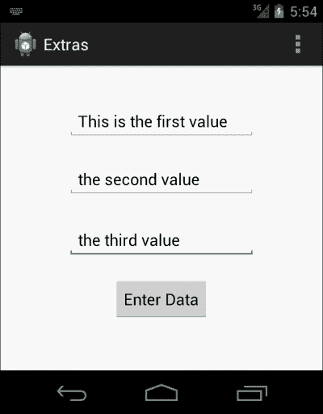

    从用户处获取 PutExtra()输入的 Acivity1.java 布局

3.  Fill the `EditText` fields and tap the button to transfer the data. The `Activity2` screen will appear with the form data that was entered in the `Activity1` screen:

    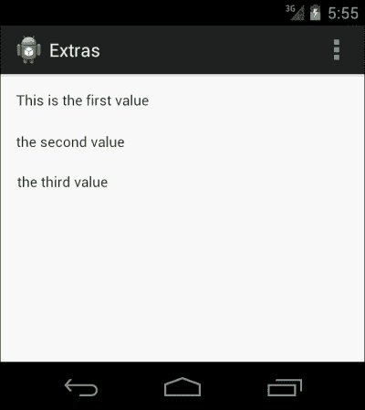

    Activity2.java 文件的视图，显示数据被成功捕获和显示。

#### 理解代码

上一小节*实现一个现成的教程*，由五个部分组成，我们将在接下来的章节中详细介绍。像本书中介绍的每个例子一样，我们已经针对一个新项目描述了这个例子，以便使它灵活且易于理解。您可以很容易地将这个例子放在自己的应用中；一旦你对额外的意图有了正确的理解，就不需要额外的努力去做。

##### Activity1.java 班

开始时，这是将启动意图的源活动，以便导航到下一个活动。

这是一个简单的活动，是在创建新的安卓项目时构建的。回想一下基础，它会有一个`onCreate()`方法，当活动由安卓创建时，它会首先被执行。创建活动后，在`Layout`文件夹的`main_first.xml`文件中定义的布局将呈现在屏幕上。

现在，是时候获取布局文件中所有`EditText`字段的对象了。为此，我们将在代码中添加以下几行，这些行将通过标识找到视图并返回对象:

```java
EditText editTextFieldOne = (EditText) findViewById(R.id.edittext1);
```

### 类型

为对象使用有意义的名称是很好的。因为这本书是为通常不在大型应用上工作的初学者准备的，所以给出对象名是为了使代码尽可能简单。

`findViewById()`方法属于`Activity`类，其目的是找到特定的视图，该视图可以是任何布局的子视图并返回对象。同样，我们将通过写下以下几行得到另外两个`EditText`对象:

```java
EditText editTextFieldTwo = (EditText) findViewById(R.id.edittext2);
EditText editTextFieldThree = (EditText) findViewById(R.id.edittext3);
```

此时，我们拥有`Activity1.java`类中存在的所有输入字段的对象。下一步是实现按钮的功能，该按钮将从这些字段中获取输入，将它们添加到意向对象中，并将其发送出去。

### 注

`findViewById()`方法的返回类型是`View`类的一个对象。因此，在使用`findViewbyId()`时，我们需要将返回的对象转换成特定的类类型。为了理解这一点，您可以看到在前面的代码中视图被转换为`EditText`。

现在，下一步是在按钮上执行`OnClickListener()`方法。为此，第一步是使用类似于输入字段中使用的方法来获取按钮的对象。

```java
Button transferButton = (Button) findViewById(R.id.button);
```

一旦我们获得了 button 对象，我们将实现带有参数的`setOnClickListener()`方法，`OnClickListener()`及其实现:

```java
transferButton.setOnClickListener(new OnClickListener(){});
```

正如你在前面一行代码中看到的，我们已经附加了一个带有`transferButton`的`OnClickListener()`对象以及它自己的`setOnClickListener`方法。请记住，这仍然是一个原始的方法。现在是推翻`onClick()`方法的时候了。

在前面的代码中，您可以看到`onClick()`方法的定义已经给出，在这个方法中，我们将从`EditText`字段中获取数据，并将其放入意图附加项中。如代码中所述，通过在每个`EditText`对象上调用这些行，从`EditText`字段获取数据:

```java
String valueOne = editTextFieldOne.getText().toString();
```

这将获得输入字段中的当前值。我们获取所有`EditText`字段的值，并将其连续存储在`valueOne`、`valueTwo`和`valueThree`中。

现在，由于我们有了要放在意图对象中的数据，我们使用前面描述的方法创建了一个意图对象。我们设置活动的来源和目的地(即`Activity1.java`为来源，`Activity2.java`为目的地)。下一步是在代码中传递值。`Intent.putExtra(String name, String data)`方法是将字符串值放在额外内容中最合适的方法。

`putExtra()`的参数有点像键值对。第一个参数`name`，基本上是一旦到达目的地活动，它将被识别的关键。另一个只是要在与该键相关联的额外部分中传输的值。因此，通过下面一行，我们将字符串放在一个带有键的意图对象中:

```java
intent.putExtra("EDITTEXT_ONE_VALUE",valueOne);
```

现在，第一个`EditText`字段的值被放置在意图对象内，键为`EDITTEXT_ONE_VALUE`，我们对另外两个值重复该信息。一旦这些值被加载到意图对象中，我们就调用`startActivity()`方法来执行意图。

##### Activity2.java 班

这是中的目的地类，将处理传入的意图。这个类包含一个带有三个`TextView`视图的简单布局文件，以便显示来自前一个活动的值。在`onCreate()`方法中，意图由`getIntent()`方法接收。该方法属于`Activity`类，用于获取将要导航到它的意图。

在`Intent`类中有一个方法，用于获取该特定意图对象附带的所有额外内容。以下方法用于识别带有所述密钥的特定数据集:

```java
String valueOne = intent.getExtras().getStringKey("EDITTEXT_ONE_VALUE");
```

与键`EDITTEXT_ONE_VALUE`相关联的值将从意图对象中提取，并保存到`valueOne`字符串中。同样，所有数据都将从意图对象中取出，并保存在这个目标类中。

一旦数据保存在变量中，就到了获取`TextView`视图的对象并将这些值设置到其中的时候了。如前所述，`TextView`视图使用`findViewById()`方法获得。

```java
textViewOne.setText(valueOne);
```

`setText()`方法用于设置`TextView`中的文本，因此，它由来自第一个活动的值保存。这就是目标活动如何使用`putExtras()`功能从源活动获取数据。

##### main _ first . XML 文件

main_first.xml 文件是一个简单的 xml 文件，它包含三个`EditText`字段，活动使用这些字段获取输入。此外，它还有一个用于触发事件的按钮，以便导航到下一个活动。这些视图的标识分别为`edittext1`、`edittext2`、`edittext3`和`button1`。

### 类型

您可以在图形用户界面中拖放所需的布局文件。布局文件的 XML 代码很简单，在前面的章节中也有解释。但是，切记*不建议拖拽*尤其是对于新安卓开发者；因此，实现它的最佳方式是通过一个 XML 文件。

##### main _ second . XML 文件

这是实际上是目的地和数据接收活动的第二个活动的布局文件。布局由三个`TextView`视图组成，用于显示从`Activity1`发送的`valueOne`、`valueTwo`和`valueThree`，即源活动。

##### AnDroidManifest . XML 文件

`AndroidManifest.xml`文件是安卓应用的基础部分。它跟踪应用的整个结构。它包含了所有的活动、接收者、权限、版本相关的问题、最小和最大 SDK 以及许多其他的东西。因为我们的项目中有两个活动，`Activity1`和`Activity2`，所以`AndroidManifest.xml`文件也有这些不同的活动，比如应用版本名和 XML 标签中的版本代码。

### 注

将数据从一个活动发送到另一个活动不需要特殊权限，但是在 SD 卡或内存上进行数据读写的情况下，我们确实需要一定的权限来完成任务。

##### 未来考虑

通过包裹发送数据是安卓用户使用的基本技术之一。它有更多的改进和有效的增强，我们将在下面的数据传输方法中进一步研究。我们还应该记住，这种方法仅限于某些有限的数据类型(在下一节中给出)。为了将自定义对象从一个活动转移到另一个活动，我们需要使用下一种数据转移方法。

### 额外支持的数据类型

Intent 的`putExtra()`方法支持可以传输到目的活动的各种数据类型。在前面的示例中，我们只使用了一种数据类型(`String`)，但除此之外，我们还可以添加各种其他数据类型。除了 `putParcelable()`和`putSerializable()`这两个本章接下来的主要话题外，这些方法都是不言而喻的。请看下面显示各种数据类型的截图:


可以添加到 putExtras()意图中的不同数据类型

### 安卓捆绑包的概念

安卓数据包是一个包，其中可以添加各种值并一起发送。例如，如果我们希望通过`putExtra()`发送多个值，我们创建一个包，将所有这些值添加到该包中，然后使用`intent.putExtras()`方法发送该包。

### 注

您可以通过将所有值单独添加到意图中来直接向意图提供数据，或者第二种方法是通过添加 Bundle 中的所有值并通过意图发送它来实现。

现在，我们将了解如何向捆绑包提供数据，并将这个捆绑包发送到下一个活动，方法是接受上一个活动并对其稍加修改。从`Activity1`发送数据时，我们不直接向意图添加不同的值，而是执行以下操作:


如代码中所示，`valueOne`、`valueTwo`和`valueThree`使用`newBundle.putString()`功能添加到包中，每个数据值都有一个一致的键。现在，使用`intent.putExtras(newBundle)`函数将这个包添加到意图中，然后我们调用`startActivity()`函数，就像在前面的示例中调用一样。

在目的地活动上，我们可以使用`getIntent().getExtras()`函数先提取数据束，直接捕捉数据。这将返回 Bundle 对象，通过引用该特定键(我们在源活动中添加的)，我们可以使用以下函数提取所有三个值的数据:

```java
Bundle.getString("EDITTEXT_ONE_VALUE","DEFAULT_VALUE");
```

### 注

`Bundle.getString(key, defaultValue)`中的第二个参数是如果找不到指定键的值将返回的默认值。

看看下面的截图。您将看到可以同时添加到捆绑包中的不同数据类型:


用于在包中添加不同数据类型的不同函数

## 使用 Parcelable 进行数据传输

用于在活动之间传输数据的第二种也是最重要的方法是`Parcelable()`。之前的方法有一个限制，根据这个限制我们只能发送`Strings`、`Integers`、`Doubles`、`Floats`等原始数据类型。在实际场景中，当我们处理项目时，有一些定制的对象需要在活动之间传递。这些自定义数据对象根据应用的需要保存信息。因此，应该相应地转移。

因为现在很清楚，以前的版本只用于基本数据类型的数据传输，所以 Parcelable 可以被称为以前类型的子类型。

在这种方法中，数据类通过实现`Parcelable`类接口来继承，以便使其对象与`putExtra()`意图方法兼容。我们还需要覆盖`Parcelable`类接口中的一些方法，以便赋予它功能。一旦完成，该类的对象可以放在意图或捆绑包中，以便在活动中导航。

### 可分配的实现

在本节中，我们将学习如何在数据类上实现`Parcelable`，然后如何在活动之间传递该对象。这有两种情况:

*   只有一个对象从源类发送到目标类
*   自定义对象的数组正从源类发送到目标类

保持传统，我们将从创建一个新的安卓项目开始。在给定的示例中，我们称之为宗地应用。该项目有`Activity1.java`作为默认活动，该活动将在新创建项目时创建。它也将作为源活动。第二个活动将是`Activity2.java`，作为接收包裹的目的地活动。

#### 实施现成教程

一旦我们完成了创建一个新的项目，在你的应用中插入这个代码。这将影响`Activity1.java`、`Activity2.java`、`layout_activity1.xml`、`layout_activity2.xml`和`AndroidManifest.xml`，并引入另一个名为`Person.java`的类。

```java
//----------------------------------------------------------------
//The Activity1 Class

public class Activity1 extends Activity {

  @Override
  protected void onCreate(Bundle savedInstanceState) {
    super.onCreate(savedInstanceState);
    setContentView(R.layout.layout_activity1);

    final EditText nameText = (EditText) findViewById(R.id.edittext_enter_name);
    final EditText sirnameText = (EditText) findViewById(R.id.edittext_enter_sirname);
    final EditText addressText = (EditText) findViewById(R.id.edittext_enter_address);

    Button enterButton = (Button) findViewById(R.id.button1);
    final Person firstPerson = new Person();
    enterButton.setOnClickListener(new OnClickListener() {

      @Override
      public void onClick(View v) {
        // TODO Auto-generated method stub
        firstPerson.setFirstName(nameText.getText().toString());
        firstPerson.setSirName(sirnameText.getText().toString());
        firstPerson.setAddress(addressText.getText().toString());

        Intent parcelIntent = new Intent(Activity1.this,Activity2.class);
        parcelIntent.putExtra("FIRST_PERSON_DATA", firstPerson);
        Activity1.this.startActivity(parcelIntent);

      }
    });

  }

  @Override
  public boolean onCreateOptionsMenu(Menu menu) {
    // Inflate the menu; this adds items to the action bar if it//is present.

    getMenuInflater().inflate(R.menu.activity1, menu);
    return true;}

}

//----------------------------------------------------------------
//The MySecondActivity Class

public class Activity2 extends Activity {

  @Override
  protected void onCreate(Bundle savedInstanceState) {
    // TODO Auto-generated method stub
    super.onCreate(savedInstanceState);
    setContentView(R.layout.layout_activity1);

    Person incomingPersonObj = getIntent().getParcelableExtra("FIRST_PERSON_DATA");
    TextView nameTextView= (TextView) findViewById(R.id.person_name_text);
    TextView sirnameTextView= (TextView) findViewById(R.id.person_sirname_text);
    TextView addressTextView= (TextView) findViewById(R.id.person_address_text);

    nameTextView.setText(incomingPersonObj.getFirstName());
    sirnameTextView.setText(incomingPersonObj.getSirName());
    addressTextView.setText(incomingPersonObj.getAddress());

  }
}

//----------------------------------------------------------------
//The layout_activity1.xml File

<RelativeLayout
  xmlns:android=http://schemas.android.com/apk/res/android
  xmlns:tools=http://schemas.android.com/tools
  android:layout_width="match_parent"
  android:layout_height="match_parent"
  android:paddingBottom="@dimen/activity_vertical_margin"
  android:paddingLeft="@dimen/activity_horizontal_margin"
  android:paddingRight="@dimen/activity_horizontal_margin"
  android:paddingTop="@dimen/activity_vertical_margin"
  tools:context=".Activity1" >

  <TextView
    android:id="@+id/textView1"
    android:layout_width="wrap_content"
    android:layout_height="wrap_content"
    android:layout_alignParentLeft="true"
    android:layout_alignParentTop="true"
    android:layout_marginTop="20dp"
    android:text="@string/name_text"
    android:textAppearance="?android:attr/textAppearanceMedium" />

  <EditText
    android:id="@+id/edittext_enter_name"
    android:layout_width="wrap_content"
    android:layout_height="wrap_content"
    android:layout_alignBaseline="@+id/textView1"
    android:layout_alignBottom="@+id/textView1"
    android:layout_alignParentRight="true"
    android:layout_toRightOf="@+id/textView1"
    android:ems="10"
    android:inputType="textPersonName" >

  <requestFocus />
  </EditText>

  <TextView
    android:id="@+id/textView2"
    android:layout_width="wrap_content"
    android:layout_height="wrap_content"
    android:layout_below="@+id/edittext_enter_name"
    android:layout_marginTop="20dp"
    android:layout_toLeftOf="@+id/edittext_enter_sirname"
    android:text="@string/sirname_text"
    android:textAppearance="?android:attr/textAppearanceMedium" />

  <EditText
    android:id="@+id/edittext_enter_sirname"
    android:layout_width="wrap_content"
    android:layout_height="wrap_content"
    android:layout_alignBaseline="@+id/textView2"
    android:layout_alignBottom="@+id/textView2"
    android:layout_alignLeft="@+id/edittext_enter_name"
    android:layout_alignRight="@+id/edittext_enter_name"
    android:ems="10" />

  <EditText
    android:id="@+id/edittext_enter_address"
    android:layout_width="wrap_content"
    android:layout_height="wrap_content"
    android:layout_alignLeft="@+id/edittext_enter_sirname"
    android:layout_alignRight="@+id/edittext_enter_sirname"
    android:layout_alignTop="@+id/textView3"
    android:ems="10" />

  <TextView
    android:id="@+id/textView3"
    android:layout_width="wrap_content"
    android:layout_height="wrap_content"
    android:layout_below="@+id/edittext_enter_sirname"
    android:layout_marginTop="20dp"
    android:layout_toLeftOf="@+id/edittext_enter_address"
    android:text="@string/address_text"
    android:textAppearance="?android:attr/textAppearanceMedium" />

  <Button
    android:id="@+id/button1"
    android:layout_width="wrap_content"
    android:layout_height="wrap_content"
    android:layout_alignRight="@+id/edittext_enter_address"
    android:layout_below="@+id/textView3"
    android:layout_marginRight="10dp"
    android:layout_marginTop="33dp"
    android:text="@string/enter_button_text" />

</RelativeLayout>

//----------------------------------------------------------------
//The activity_two_layout.xml File

<?xml version="1.0" encoding="utf-8"?>
<LinearLayout
  xmlns:android=http://schemas.android.com/apk/res/android
  android:layout_width="match_parent"
  android:layout_height="match_parent"
  android:orientation="vertical" >

  <TextView
    android:id="@+id/person_name_text"
    android:layout_width="wrap_content"
    android:layout_height="wrap_content"
    android:text="@string/null_string"
    android:textAppearance="?android:attr/textAppearanceMedium" />

  <TextView
    android:id="@+id/person_sirname_text"
    android:layout_width="wrap_content"
    android:layout_height="wrap_content"
    android:text="@string/null_string"
    android:textAppearance="?android:attr/textAppearanceMedium" />

  <TextView
    android:id="@+id/person_address_text"
    android:layout_width="wrap_content"
    android:layout_height="wrap_content"
    android:text="@string/null_string"
    android:textAppearance="?android:attr/textAppearanceMedium" />

</LinearLayout>

//----------------------------------------------------------------
//The Person.java File

public class Person implements Parcelable {

  private String firstName;
  private String sirName;
  private String address;

  public Person(){
    firstName = null;
    sirName = null;
    address = null;
  }
  public Person(String fName, String sName, String add) {
    firstName = fName;
    sirName = sName;
    address = add;
  }

  public Person(Parcel in) {
    firstName = in.readString();
    sirName = in.readString();
    address = in.readString();
  }

  public String getFirstName() {
    return firstName;
  }

  public void setFirstName(String firstName) {
    this.firstName = firstName;
  }

  public String getSirName() {
    return sirName;
  }

  public void setSirName(String sirName) {
    this.sirName = sirName;
  }

  public String getAddress() {
    return address;
  }

  public void setAddress(String address) {
    this.address = address;
  }

  @Override
  public int describeContents() {
    // TODO Auto-generated method stub
    return 0;
  }

  @Override
  public void writeToParcel(Parcel dest, int flags) {
    // TODO Auto-generated method stub
    dest.writeString(firstName);
    dest.writeString(sirName);
    dest.writeString(address);
  }

  public static final Parcelable.Creator<Person> CREATOR =new Parcelable.Creator<Person>() {

    public Person createFromParcel(Parcel in) {
      return new Person(in);
    }

    public Person[] newArray(int size) {
      return new Person[size];
    }
  };
}

//----------------------------------------------------------------
//The AndroidManifest.xml File

<?xml version="1.0" encoding="utf-8"?>
<manifest
  xmlns:android="http://schemas.android.com/apk/res/android"
  package="com.app.parcelapplication"
  android:versionCode="1"
  android:versionName="1.0" >

  <uses-sdk
    android:minSdkVersion="8"
    android:targetSdkVersion="17" />

  <application
    android:allowBackup="true"
    android:icon="@drawable/ic_launcher"
    android:label="@string/app_name"
    android:theme="@style/AppTheme" >
    <activity
      android:name="com.app.parcelapplication.Activity1"
      android:label="@string/app_name" >
      <intent-filter>
        <action android:name="android.intent.action.MAIN" />
        <category android:name="android.intent.category.LAUNCHER" />
      </intent-filter>
    </activity>
    <activity
      android:name="com.app.parcelapplication.Activity2"android:label="@string/app_name" >
    </activity>
  </application>

</manifest>
```

运行此应用，它将在您的设备上显示`Activity1`输出屏幕。看看下面的截图，看看应用将如何出现在安卓屏幕上:

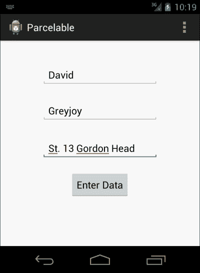

活动 1 有三个编辑文本字段，用于接收用户的输入，还有一个按钮，用于将数据传输到下一个活动

当您在第一个屏幕上时，输入数据并按下按钮迁移到显示输入数据的下一个活动。屏幕将如下所示:

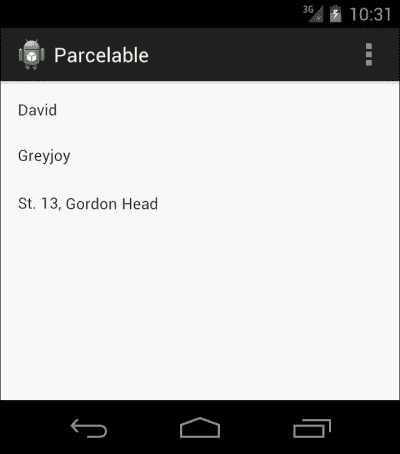

活动 2 以可分组的形式显示活动 1 中传输的数据

#### 理解可分组实现

为了理解这个例子的工作原理，我们首先需要了解`Parcelable`是如何工作的。在安卓系统中，需要将自定义数据(即自定义对象和自定义对象数组)从一个活动转移到另一个活动。通常，自定义数据类与附加数据不兼容；所以，我们实现了该类的`Parcelable`接口。

`Parcelable`对自定义数据类的作用是开发与附加数据的兼容性。使用`Parcelable`实现的类的一个或多个对象可以很容易地添加到意图的`putExtra()`方法中。同样，它也可以是 Bundle 对象的一部分，稍后可以通过意图进行传输。

我们现在可以完成前面代码的解释。

##### Activity1.java 班

这是`Parcelable`对象将开始迁移的源类。首先是`onCreate()`方法的实现。在该方法中，设置主视图后，我们通过视图的标识找到视图，并将它们的对象带到活动中。视图包括三个`EditText`字段和一个按钮。它们用于接受用户的输入并触发事件，以便开始将数据传输到下一个活动。

在`button.setOnClickListener()`方法中，我们传递一个新的`OnClickListener()`对象，在该对象中`onClick()`方法被覆盖。我们希望一旦按钮被点击，意图就开始了；这就是为什么我们要实现意图并从`onClick()`方法内部的字段中获取数据。

现在，我们不希望方法直接将数据传输到意图。这就是为什么我们要创建一个`Person.java`类的对象，它将保存从字段中获得的值。我们把这个物体命名为`firstPerson`。为了给这个对象设置值，我们实现了下面一行代码:

```java
firstPerson.setFirstName(nameText.getText().toString());
```

前一行将该对象的名字设置为从第一个`EditText`字段中写入的内容获得的值。第一个`EditText`字段`nameText`保存名字的值。因此，使用`nameText.getText()`方法，它将返回`Editable`对象，通过调用其上的`toString()`方法可以轻松转换该对象。

为了从第二个和第三个`EditText`字段中获取值，将重复相同的方法。它们将被设置在同一个`Person`对象内。您可以看到这是使用以下代码行完成的:

```java
firstPerson.setSirName(sirNameText.getText().toString());.
firstPerson.setAddress(addressText.getText().toString());.
```

在此阶段，`firstPerson`物体准备从`Activity1`运送到`Activity2`。由于对象是通过实现`Parcelable`继承的，所以我们可以直接将其添加到 extra 中。我们将在下一节学习如何实现`Parcelable`。在这里，我们将看到如何在意图对象中添加`Parcelable`。

制作一个`Intent`类的对象，并赋予它源和目的地，即源上下文和目的地类的`.class`引用，以便让它知道从哪里发起这个意图，从哪里结束。我们可以通过调用`parcelIntent.putExtra()`来添加`Parcelable`。请参见下面一行代码:

```java
parcelIntent.putExtra("FIRST_PERSON_DATA", firstPerson);
```

利用这一点，我们可以很容易地在意图对象内部添加自定义的`Parcelable`数据对象，在下一行中，只需调用`startActivity()`函数即可启动意图。

##### Activity2.java 班

这节课，我们将学习如何在目标类中捕捉传输的`Parcelable`对象。为此，首先从执行活动的`onCreate()`方法的正常程序开始。设置内容视图，并通过从布局中查找标识引入三个文本视图。这三个文本视图将显示第一个活动对象的接收值。

`getIntent()`方法将接收保存数据的`Activity1.java`类发送的意图对象。一旦获得了对象，我们就可以通过调用`getExtras()`方法来获得它的额外内容，该方法将返回保存数据的包。用键调用该束上的`getParcelable()`功能，以检索对象。这个物体现在被名为`incomingPersonObj`的`Person`类的一个新物体所占据。

现在，我们有了在从`startActivity()`调用意图时从源类发起的相同对象。我们现在将通过调用以下代码行来设置文本视图的文本:

```java
nameTextView.setText(incomingPersonObj.getFirstName());
sirnameTextView.setText(incomingPersonObj.getSirName());
addressTextView.setText(incomingPersonObj.getAddress());
```

`incomingPersonObj.getFirstname()`方法将从`incomingPersonObj`中获取该人的名字，并在调用第一个方法时将其值直接设置为`nameTextView`。`sirnameTextView`和`addressTextView`对象的程序相同。

##### layout _ activity 1 . XML 文件

这是包含`Activity1.java`视图的布局文件。如代码中所述，它包含三个带有标识的`EditText`字段:`edittext_enter_name`、`edittext_enter_sirname`、和`edittext_enter_address`。除此之外，还有三个文本视图，用于简单地指示哪个`EditText`字段包含哪个值。

每个活动都需要一个用于启动任何进程的事件触发器。在这个布局中，按钮将完成任务；因此，它也被放置在`EditText`场的下方。

##### layout _ activity 2 . XML 文件

该布局文件创建作为目标活动的`Activity2.java`的布局。此活动负责提取数据并在其布局中显示。布局由三个`TextView` 视图组成，其标识为`person_name_text`、`person_sirname_text`和`person_address_text`。这些标识用于将这些视图带到代码中(如代码的第二部分所示)。

##### Person.java 班

`Person`类基本上是数据持有者类，其对象将在应用的任何地方创建。这也被称为 **bean 类** ，用于保存来自服务器的 JSON、XML 或任何其他格式的数据。在我们的`Person`类中，它有三个字段。所有领域都是私有的，有各自的公共获取者和设定者。`firstName`、`sirName`和`address`对象代表它们将持有的信息类型。`Activity1.java`类是这个类的一个对象，从`EditText`字段中获取数据，并将其添加到对象中。

这个类是通过实现`Parcelable`接口继承的。这个`Parcelable`接口需要实现一些重要的东西。首先，我们将实现这个类的一个构造函数，它将把`Parcel`作为一个参数。这个构造函数将在实现`Parcelable`接口时从这个类内部使用。`in.readString()`方法用于从包裹中读取价值。

### 类型

为了使这项技术发挥作用，请按照`writeToParcel()`方法中写入包裹的相同顺序读取包裹。参见代码中包裹的书写顺序。是`firstName`、`sirName,`、`address`。同样的事情可以在构造函数中观察到。

`writeToParcel()`方法被`Parcelable`覆盖，以产生相同类别的对象，以便可以使用。`Parcelable.Creator<Person>`用于创建该类的实例，如`Parcel`所用；它使用`writeToParcel()`方法来做这项工作。

一旦对象准备好了，它就被转发到下一个活动并被`Activity2.java`类捕获，正如在给定代码的第一和第二部分中所解释的那样。

##### AnDroidManifest . XML 文件

当你在谈论开发一个安卓应用时，这个文件的重要性是不可忽视的。我们需要在这个文件中添加这两个活动，以便安卓应用能够识别它们。正如您在文件中看到的那样，这两个活动在清单文件中都有自己的标签，以及它们的参数和意图过滤器。

#### 未来考虑

前面实现`Parcelable`的方法是在额外的或一个束内仅转移一个`Parcelable`对象。同样，我们可以通过实现`Parcelable`来传输自定义数据 beans 的数组或数组列表。

## 使用可串行化的数据传输

意图中使用的第三种数据传输方法是`Serializable`。许多 Java 开发人员已经很熟悉这个术语`Serializable`，因为它早在引入安卓系统之前就被使用了。安卓最大的优势是它的开发是在 SDK 的 Java 上进行的，在 C++上是在 NDK 进行的。这使得它极其宽大和强大。

功能也是如此；`Java.io.Serializable`纯粹是 Java 的一个功能，可以在安卓开发中原样使用。`putExtras()`意图可以选择将 Java 序列化的对象从一个活动转移到另一个活动，而无需任何特定的努力。我们从介绍非 Java 用户的`Serializable`开始这一节。

### 什么是可串行化？

Java 附带了一种机制，在这种机制中，对象可以用字节数组来表示。不仅仅是序列化的数据，还可以在其中找到关于对象类型的信息以及对象内部放置了什么样的数据。

这些序列化对象可以写入文件，并存储在任何外部存储器(如 SD 卡)中。重新生成对象的过程称为反序列化，在这种过程中，可以收集隐藏在字节数组中的信息，以便在需要时在内存中重新生成对象。

制作和重新制作任何序列化对象的过程完全独立于 JVM。这意味着该对象可以用 Java 序列化，并且可以用任何也支持 JVM 的语言重新构建，该 JVM 具有与序列化时相同的 Java 版本。

在 Java 中，`ObjectOutputStream`类用于序列化对象，而`ObjectInputStream`类用于在我们从现有的序列化对象重新生成时创建一个对象。这些类分别包含`writeObject()`和`readObject()`方法。这些方法实际上启动了序列化或反序列化的过程。

### 可串行化的一个例子

在这一节中，我们将看到`Serializable`是如何在 Java 中完成的。这就是安卓如何处理这些对象的内在机制。此示例包含两种执行序列化和反序列化任务的方法。

首先，序列化的方法如下:

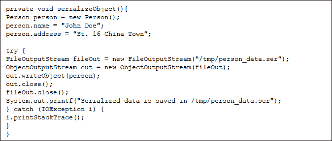

`Person`类实现了`Serializable`接口。这将使对象能够被`ObjectOutputStream`类的对象识别。首先，我们将通过设置名称和地址来创建一个序列化对象，如代码所示。

一旦创建了对象，就可以进行序列化了。我们先制作一个`FileOutputStream`的对象，用来将数据写入文件；还会添加指向该序列化文件所在位置的路径。创建一个`ObjectOutputStream`对象，该对象将包含由`ObjectOutputStream out = new ObjectOutputStream(fileOut)`引用的文件。我们现在准备通过调用`out.writeObject(person)`来编写对象。这将开始序列化对象(将其转换为字节数组)并将其添加到给定的位置。然后我们将关闭`out`和`fileOut`对象。

从序列化源读取数据是我们将看到的下一步。请参见以下代码:

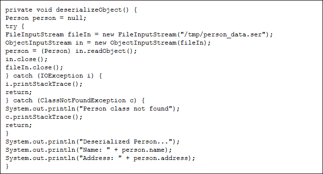

代码很容易理解，因为它包含的步骤几乎与将对象编写为序列化文件所需的步骤相同。我们将创建一个`Person`类的实例来保存重制的对象。创建`FileInputStream`对象。它指向要反序列化的文件的位置。`ObjectInputStream`对象用于获取文件路径，并使其准备好被读取。使用这个，调用 `in.readObject()`方法来反序列化对象，它将返回`person`对象。一旦完成，我们将关闭`in`和`fileIn`对象。

我们现在有了反序列化的`Person`类的对象，它可以记录在日志中或打印在控制台上。

### 注

Java 和 Android 写可序列化对象的方法是一样的。当我们在安卓系统上做的时候，我们可以把文件写在 SD 卡上。该文件以后可以由任何其他活动或应用获取和反序列化。

### 可串行化的实现

直到现在，我们已经明白了使用`Serializable`的主要原因。快速复习总是好的。`Serializable`技术用于将对象转换为字节数组；我们可以用它来写入一个文件，并将其作为一个 T2 文件存储在 SD 卡或任何其他存储设备上。然后，无论活动如何，都可以从任何位置读取该序列化对象。

### 注

`Serializable`是执行数据传输最简单的方法。它还用于将一个或多个自定义数据对象从一个活动转移到另一个活动。

序列化文件不必总是有`.ser`扩展名。

就像其他示例和实现一样，我们将通过创建一个新项目来开始这个过程。该项目将有两项活动；一个是源头，另一个是目的地。序列化对象将从一个活动开始导航，目标活动将捕获它，以便从中提取数据。Android 支持对象序列化和反序列化的原生 Java 过程；这就是为什么，我们不需要做任何事情，因为序列化的现象是由安卓本身处理的。

#### 通过 Serializable–教程

在本章中，`Serializable`的实施将从制作一个新项目开始。默认情况下，这个项目会有一个活动(比如`Activity1.java`)。执行以下步骤，将引导您制作一个实施`Serializable`的项目。我们将会看到它的解释。

从第一步开始，在您新创建的安卓项目中实现以下代码。这将引入三个新文件:

*   `Activity2.java`:这将作为目的地活动。
*   `layout_activity2.xml`:该文件将保存目标活动的布局。
*   `Person.java`:这是负责给数据豆对象的序列化类。

    ```java
    // =============================================================
    //The Activity1.java file

    public class Activity1 extends Activity {

    @Override
    protected void onCreate(Bundle savedInstanceState) {
    super.onCreate(savedInstanceState);
    setContentView(R.layout.layout_activity1);

    final EditText edittext1 = (EditText) findViewById(R.id.editText1);
    final EditText edittext2 = (EditText) findViewById(R.id.editText2);
    final EditText edittext3 = (EditText) findViewById(R.id.editText3);

    Button button = (Button) findViewById(R.id.button1);
    button.setOnClickListener(new OnClickListener() {

    @Override
    public void onClick(View v) {
    // TODO Auto-generated method stub
    Person person = new Person();
    person.setName(edittext1.getText().toString());
    person.setSirname(edittext2.getText().toString());
    person.setAddress(edittext3.getText().toString());

    Intent intent = new Intent(Activity1.this, Activity2.class);
    intent.putExtra("PERSON_OBJECT", person);
    startActivity(intent);

    }
    });
    }

    @Override
    public boolean onCreateOptionsMenu(Menu menu) {
    // Inflate the menu; this adds items to the action bar if it is present.
    getMenuInflater().inflate(R.menu.main, menu);
    return true;
    }

    }

    //================================================================
    //The Activity2.java file

    public class Activity2 extends Activity {

    String TAG = "MainActivity2";
    @Override
    protected void onCreate(Bundle savedInstanceState) {
    super.onCreate(savedInstanceState);
    setContentView(R.layout.layout_activity2);
    Person person = (Person) getIntent().getExtras().getSerializable("PERSON_OBJECT");
    TextView tView = (TextView) findViewById(R.id.data_text);

    if(person != null){
    tView.setText("Data Successfully catched");
    Log.d(TAG, person.getName);
    Log.d(TAG, person.getSirName);
    Log.d(TAG, person.getAddress);

    }else{
    tView.setText("Data Object is null");
    } 
    }

    @Override
    public boolean onCreateOptionsMenu(Menu menu) {
    // Inflate the menu; this adds items to the action bar if it is present.
    getMenuInflater().inflate(R.menu.main, menu);
    return true;
    }

    }

    //================================================================
    //The Person.java
    public class Person implements Serializable {
    String name;
    String sirname;
    String address;

    private static final long serialVersionUID = 1L;

    public String getName() {
    return name;

    }
    public void setName(String name) {
    this.name = name;
    }

    public String getSirname() {
    return sirname;
    }

    public void setSirname(String sirname) {
    this.sirname = sirname;
    }

    public String getAddress() {
    return address;
    }

    public void setAddress(String address) {
    this.address = address;
    }
    }

    //================================================================
    //The layout_activity1.xml file

    <RelativeLayout xmlns:android="http://schemas.android.com/apk/res/android"
        xmlns:tools="http://schemas.android.com/tools"
        android:layout_width="match_parent"
        android:layout_height="match_parent"
        android:paddingBottom="@dimen/activity_vertical_margin"
        android:paddingLeft="@dimen/activity_horizontal_margin"
        android:paddingRight="@dimen/activity_horizontal_margin"
        android:paddingTop="@dimen/activity_vertical_margin"
        tools:context=".MainActivity" >

        <EditTextandroid:id="@+id/editText1"
            android:layout_width="wrap_content"
            android:layout_height="wrap_content"
            android:layout_alignParentTop="true"
            android:layout_centerHorizontal="true"
            android:layout_marginTop="26dp"
            android:ems="10" >

            <requestFocus />
        </EditText>

        <EditText
            android:id="@+id/editText2"
            android:layout_width="wrap_content"
            android:layout_height="wrap_content"
            android:layout_below="@+id/editText1"
            android:layout_centerHorizontal="true"
            android:layout_marginTop="41dp"
            android:ems="10" />

        <EditText
            android:id="@+id/editText3"
            android:layout_width="wrap_content"
            android:layout_height="wrap_content"
            android:layout_above="@+id/button1"
            android:layout_centerHorizontal="true"
            android:layout_marginBottom="22dp"
            android:ems="10" />

        <Button
            android:id="@+id/button1"
            android:layout_width="wrap_content"
            android:layout_height="wrap_content"
            android:layout_alignParentBottom="true"
            android:layout_centerHorizontal="true"
            android:layout_marginBottom="153dp"
            android:text="Enter Data" />

    </RelativeLayout>

    //================================================================
    // The layout_activity2.xml file

    <RelativeLayout xmlns:android="http://schemas.android.com/apk/res/android"
        xmlns:tools="http://schemas.android.com/tools"
        android:layout_width="match_parent"
        android:layout_height="match_parent"
        android:paddingBottom="@dimen/activity_vertical_margin"
        android:paddingLeft="@dimen/activity_horizontal_margin"
        android:paddingRight="@dimen/activity_horizontal_margin"
        android:paddingTop="@dimen/activity_vertical_margin"
        tools:context=".MainActivity" >

        <TextView
            android:id="@+id/data_text"
            android:layout_width="wrap_content"
            android:layout_height="wrap_content"
            android:text="@string/hello_world" />

    </RelativeLayout>

    //================================================================
    //The AndroidManifest.xml file

    <?xml version="1.0" encoding="utf-8"?>
    <manifest xmlns:android="http://schemas.android.com/apk/res/android"
        package="com.app.serializable"
        android:versionCode="1"
        android:versionName="1.0" >

        <uses-sdk
            android:minSdkVersion="8"
            android:targetSdkVersion="17" />

        <application
            android:allowBackup="true"
            android:icon="@drawable/ic_launcher"
            android:label="@string/app_name"
            android:theme="@style/AppTheme" >
            <activity
                android:name="com.app.serializable.Activity1"
                android:label="@string/app_name" >
                <intent-filter>
                    <action android:name="android.intent.action.MAIN" />

                    <category android:name="android.intent.category.LAUNCHER" />
                </intent-filter>
            </activity>
            <activity
                android:name="com.app.serializable.Activity2"
                android:label="@string/app_name" >
                <intent-filter>
                    <action android:name="android.intent.action.MAIN" />

                    <category android:name="android.intent.category.DEFAULT" />
                </intent-filter>
            </activity>
        </application>

    </manifest>
    ```

完成实施后，运行项目。将出现以下屏幕，您需要将数据添加到字段中。然后点击**输入数据**按钮:

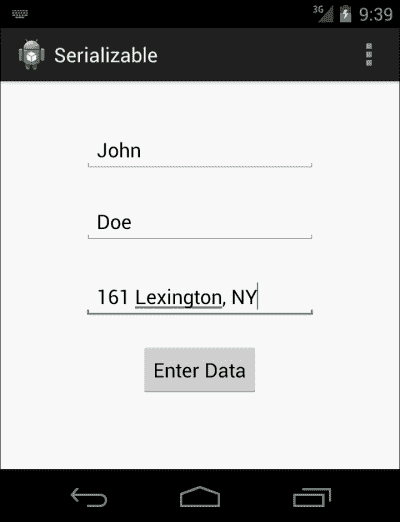

要求输入数据以通过 serializable 发送数据的源活动

一按下**输入数据**按钮，`Activity2.java`就会打开，并显示如下画面:


练习 2 显示数据已成功输入

同时，当你看到这个项目的日志文件时，它会显示我们在`Activity2.java`文件中记录的数据。请看下面的截图:


显示活动 2 中成功捕获数据的日志卡特彼勒

#### 遍历可序列化代码

为了理解 Serializable 在安卓中的工作原理，你需要在 Java 中浏览一下前面描述的`Serializable`的细节。如果您还没有这样做，我们建议您看看这个。在这一节中，我们将重点解释前面的例子，以及如何在安卓项目中实现它。

为了简单起见，我们将其分为六个部分。每个部分的解释都给出了详细的说明。

##### Activity1.java 班

`Activity1.java`类将作为意图启动的源活动。它还将充当源活动，因为它负责创建和发送自定义数据对象。让我们从代码的第一部分开始，这是`Activity1.java`类的实现。

正如前面提到的，这个类负责从用户那里获取数据输入，并从中创建一个数据对象。在`onCreate()`方法中，我们将首先使用`setContentView()`方法设置保存视图的特定布局。布局设置好之后，我们的下一个任务是在 Java 代码中将这些视图作为对象，如下面的代码所示。这将帮助我们对那些绑定在布局中的视图上的对象执行各种任务。

```java
final EditText edittext1 = (EditText) findViewById(R.id.editText1);
final EditText edittext2 = (EditText) findViewById(R.id.editText2);
final EditText edittext3 = (EditText) findViewById(R.id.editText3);
```

调用`findViewById()`功能会带来与该标识相关联的特定视图。我们把它丢到`EditText`类，分别带在`edittext1`、`edittext2`和`edittext3`物体里面。

这三个字段将用于接受用户的输入，但我们需要一个事件触发器，用于将用户从一个活动导航到另一个活动，并负责数据传输。为此，我们在布局中实现了一个按钮，我们将通过调用`findViewById()`方法在 Java 代码中获取它:

```java
Button button = (Button) findViewById(R.id.button1);
```

现在，我们的 Java 代码中有了所有必要的视图。我们的下一步是实现按钮功能，也就是当它被点击时会做什么。为此，我们需要在此按钮上实现一个`OnClickListener`界面:

```java
Button.setOnClickListener(new OnClickListener())
```

前一行代码负责设置按钮上的点击监听器。它需要一个`OnClickListener`的参数，在这个参数中我们实现了`onClick()`方法。这个`onClick()`方法将负责分配一个工作给按钮:

```java
button.setOnClickListener(new OnClickListener() {
  @Override
  public void onClick(View v) {
    // TODO Auto-generated method stub
  }

  });
```

完成后，我们将创建一个`Person`类的对象(即`Serializable`对象)，并将其值设置为从`EditText`字段获取输入的值。现在，它有两个部分；首先是制作`Person`类的新对象。我们将通过调用它的构造函数来实现:

```java
Person person = new Person();
```

在第二部分中，我们将通过使用对象调用`getText()`方法来获取`EditText`对象的值。`getText()`方法返回一个`Editable`对象；所以，为了把它转换成字符串，我们在上面调用了`toString()`方法。当您观察代码时，我们一起执行了所有这些任务:

```java
person.setName(edittext1.getText().toString())
```

首先，来自`edittext1`对象的值被带入并转换为`String`。第二，我们通过名字的价值来设定名字。我们将使用类似的过程进一步设置`person`对象的`sirName`和`address`:

```java
person.setSirname(edittext2.getText().toString());
person.setAddress(edittext3.getText().toString());
```

现在，我们有一个准备转移的对象。我们现在将创建一个`Intent`对象，并分配其源和目标活动的上下文。它将表示启动意图的活动以及将迁移到哪个活动。我们将通过调用构造函数来实现这一点:

```java
Intent intent = new Intent(Activity1.this, Activity2.class);
```

一旦意图对象被创建，我们将在这个意图中添加数据对象，并调用`startActivity()`方法。为了将序列化对象放入意图对象中，我们将调用`intent.putExtra()`方法。这一部分的最后一步是调用`startActivity()`方法来启动导航过程。

##### Activity2.java 班

目的地活动的主要目的是捕捉意图，从中提取数据对象，并在视图中显示。我们从`onCreate()`方法的实现开始。首先，通过调用`Activity`类的`setContentView()`方法来设置布局。现在，是时候抓住`Activity1.java`班发起的`intent`对象了。

就像本章前面的例子一样，我们通过调用`getIntent()`函数来获取意图。该函数返回一个用于启动该活动的`intent`对象。一旦`intent`对象在这里，我们就调用`getExtras()`函数。这将返回一个包，其中包含发送者活动在此`intent`对象上添加的所有附加内容。

在这个捆绑包中，我们现在将调用`getSerializable()`方法，该方法将借助发送者活动赋予的`key`值来带来`Serializable`对象。`key`值应与发送者活动的值相同；否则，它将返回一个空值，这可能会导致您的应用因`NullPointException`而崩溃。

`Person`对象现在拥有所有的值。我们的下一个任务是将这些值记录在 LogCat 中，以便我们可以验证它。执行空指针检查是为了查看对象是否为空。如果它不为空，我们通过从`person.getName`、`person.getSirName`和`person.getAddress`获取它来记录它的值。如果对象为空，它将显示`Data Object is null`，因此，它不会崩溃。

```java
Log.d(TAG, person.getName);
```

##### Person.java 班

当我们谈论从`Serializable`传输数据时，`Person.java`类是我们为了进行传输而需要实现的最重要的类。我们创建了一个由三个私有字符串变量组成的 Java 类。它们中的每一个都有自己的 getter 和 setter 函数，以便从类外部获取和设置值。和前面的方法一样，我们使用`Parcelable`接口实现了我们的数据 bean 类；在这里，我们将用`Serializable`实现我们的类。

一旦实现，安卓就准备把这个类的对象当作`Serializable`。现在，每当它被添加到意图对象中时，安卓都会将其作为字节数组进行传输。与`Parcelable`相比，这是一个缓慢的过程，但是当我们在很少的物体上进行时，它的缓慢并不明显。如果我们想在有成千上万个数据对象的地方应用这种方法，可能需要一些时间。

##### layout _ activity 1 . XML 文件

布局文件属于`Activity1.java`类。当您第一次运行代码时，将出现的布局描述在这个布局文件中。在`onCreate()`方法里面的`Activity1.java`类中，我们使用了`setContentView()`方法来粘贴用户界面。

在这个 XML 文件中，有四个视图；其中三个是`EditText`字段，用于在活动 1 中获取用户输入。除此之外，还有一个按钮，用于在数据完全填入字段后触发事件。给它们的标识是`Activity1.java`类用来在`.java`类中获取这些视图的默认标识，`edittext1`、`edittext2`和`edittext3`是它们各自字段的标识。

##### layout _ activity 2 . XML 文件

该布局文件包含`Activity2.java`类的视图。它由一个`TextView`视图组成，该视图将告诉我们来自`Activity1.java`类的值是否被正确获取。该文本视图将根据数据对象显示**数据成功捕获**或**数据对象为空**消息。

##### AnDroidManifest . XML 文件

`AndroidManifest.xml`文件由所有活动、权限、SDK 信息、版本代码和许多其他内容组成。简而言之，它用于保存关于应用的所有信息。在这里，我们有我们的活动，`Activity1.java`和`Activity2.java`类以及它们的意图值。如果你忘记在这个文件中提到你的任何活动，它将在日志中产生一个异常，说`ClassNotFoundException`。

### 类型

`Parcelable`和`Serializable`是用于将数据对象从一个活动转移到另一个活动的两种方法。`Serializable`是最简单的，而`Parcelable`是最快的。如果你需要基于更少的对象执行任务，并且你想要一个简单的解决方案，你应该选择`Serializable`。但是如果你想要一个完美的方法而不考虑实现的复杂性，你应该选择`Parcelable`。

# 数据和隐含意图

在前面的示例中，数据传输的需求在应用中进行了描述。现在非常清楚，如果没有数据的传输和操作，任何应用都是不完整的。在本章的这一节中，我们将看到需要将数据传输到隐式意图的场景。

回顾隐含意图的定义，它们是那些通常不指向特定目标的意图，而是将应用的流程提供给外部应用，或者换句话说，它们启动另一个活动来执行某个任务。

外部应用需要您的应用提供一些数据来执行任务。我们现在将看到 URI 形式的数据传输传递给隐含意图的场景。

## 查看地图

谷歌地图可以从你自己的应用中的某个特定位置启动。这意味着你可以通过隐含的意图发送任何你需要在谷歌地图中打开的位置。根据纬度和经度，您可以在谷歌地图中打开特定的点。这个纬度和经度是使用 URI 提供给谷歌地图的，这是一种向隐含目的地发送数据的方式。

为了执行这个任务，我们需要编写下面一行代码:


我们需要根据一种特殊的语法来编写 URI 字符串。为了打开具有特定位置的地图，URI 字符串由`geo`关键字后跟纬度和经度(逗号分隔，如代码所示)组成。该 URI 值被赋予`android.content.Intent.ACTION_VIEW`动作的隐含意图。此查看操作将采用 URI 并打开最佳可用应用来执行任务。然后我们将通过调用`startActivity(intent)`方法来开始意图。

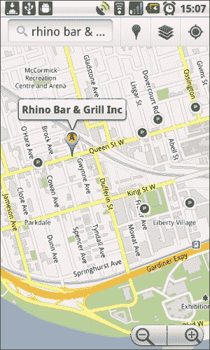

安卓操作系统中的谷歌地图视图。

## 打开网页

传输数据的隐含需求也可以分类为如果你想打开一个网页，你需要打开一个特定加载页面的默认网页浏览器。在这个过程中，我们需要传输我们的应用想要在浏览器中打开的网址。这个网址也是借助 `Uri.parse()`方法传递的。

### 类型

请记住，在这种情况下，我们使用默认的 web 浏览器。它不是作为安卓应用的一部分出现的网络视图。

实现以下代码行，以便在默认网络浏览器中发送和打开网址:

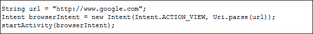

正如您在代码中看到的，有一个字符串包含要在 web 浏览器中打开的值(URL)。然后通过`Intent.ACTION_VIEW`动作将该值输入到`Uri.parse()`函数的意图构造器中。这将选择打开网址的最佳选项。


从我们的应用调用打开 Google.com 网页的浏览器视图

## 发送电子邮件

很有可能您需要一个函数，该函数需要调用默认的谷歌邮件应用，在您的应用中输入特定的电子邮件和特定的收件人。在这种情况下，我们再次需要将数据，即发件人姓名、电子邮件正文和电子邮件主题添加到意图对象中，并以此开始活动。

为了执行这项任务，我们需要编写以下几行代码:

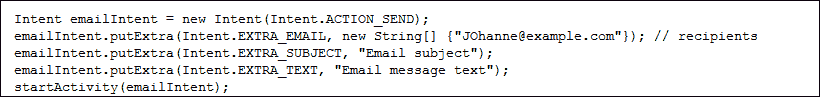

用`Intent.ACTION_SEND`动作做一个`Intent`物体。它的工作是用发送选项打开意图。现在，是时候在这个对象中添加数据了。Android API 迎合了所有可能发生的场景；因此，`Intent`类中定义了某些常量，可以被安卓用来唯一识别数据。`Intent.EXTRA_EMAIL`是关键字常量，在您向意图提供电子邮件地址时，在`putExtra()`方法中使用。同样，在附加内容中有一个关键字常量用于提及主题；`Intent.EXTRA_SUBJECT`和`Intent.EXTRA_TEXT`将用于添加电子邮件正文。

一旦我们用这些参数调用应用，它将打开 Gmail，这些参数填充在字段中。它看起来类似于下面的截图:


我们的应用调用的 Gmail 应用的视图

## 打电话

如果你想用你的应用中的某个号码发起一个呼叫，你需要呼叫拨号器意图。使用`Intent.ACTION_DIAL`，你可以用一个特定的数字作为 URI 来激发拨号器的意图。按照给定的代码在应用中实现拨号器功能:

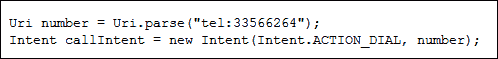

URI 字符串包含拨号器应该启动的电话号码。一旦拨号器打开，它将显示书写的号码，用户现在可以拨打该号码。

## 其他场景

本章中还可以包含各种其他场景(例如日历和时间小部件)，但是由于空间和限制，我们只考虑了四种场景。隐式意图之间的数据传输的实现是极其重要的，并且可以非常容易地完成。

# 总结

在本章中，我们详细学习了如何在安卓应用中处理数据。我们学习了如何使用不同的方法将数据从一个活动转移到另一个活动，以及使用意图的`putExtra()`功能简单转移默认数据结构。可以使用`Parcelable`和`Serializable`将自定义数据对象或自定义数据对象数组发送到另一个活动。我们还学习了如何在我们的安卓应用中实现所有这些数据传输方法。在这一章的最后，我们简要介绍了四种场景，在这四种场景中，当通过我们的应用的意图调用其他应用时，数据被发送到其他应用(使用隐式意图)。

本章对于实际应用开发非常重要，因为在活动之间甚至在应用之外传输数据是任何安卓应用的基本部分，这可以使用安卓意图轻松完成。

在接下来的章节中，我们将研究访问安卓功能的意图的使用。我们还将看到意图过滤器是如何工作的，广播意图的基础是什么，最后，我们将看到意图服务和待定意图的实现。