# 第六章。使用意图访问安卓功能

在最后一章中，我们讨论了使用组件的数据传输。我们看到了如何将数据从一个活动传输到另一个活动，以及为什么我们应该在不同的组件之间传输数据。我们还讨论了使用 intents 进行数据传输的各种方法。安卓系统中有很多组件，intent 提供了一个简单的界面来让这些组件相互通信。在[第 4 章](04.html "Chapter 4. Intents for Mobile Components")*移动组件意向*中，我们讨论了使用 Wi-Fi、蓝牙、摄像头、麦克风等系统硬件的不同安卓组件。我们还讨论了如何使用意图来利用这些组件，以及如何使用安卓硬件用不超过几行代码来制作许多不同的应用。

到目前为止，我们只讨论了硬件组件和意图在这些组件中的作用。这一章是关于安卓软件功能以及我们如何在应用中使用这些功能，使用意图作为主要界面。安卓包含大量的库和应用编程接口，开发者可以通过它们非常容易地使用不同的安卓功能。本章将向我们介绍常见的安卓功能，我们还将开发一些示例应用，向我们展示这些功能的用途。

本章包括以下主题:

*   安卓操作系统的特点
*   安卓功能与组件
*   常见的安卓操作系统功能
*   安卓功能和意图
*   `<uses-feature>`和`<uses-permission>`标签
*   使用 SEND 操作共享
*   使用意图发送短信/彩信
*   使用意图发送数据消息
*   确认邮件传递
*   接收短信
*   电话和使用意图打电话
*   使用意图发送通知
*   Some other Android features

    ### 类型

    意图的概念和结构，正如前几章所讨论的，是理解这一章和后面几章的先决条件。如果您没有这些东西的基本概念，我们建议您阅读[第 3 章](03.html "Chapter 3. Intent and Its Categorization")、*意向及其分类*和[第 4 章](04.html "Chapter 4. Intents for Mobile Components")、*移动组件意向*，以便继续前进。

# 安卓操作系统的特性

安卓是一个开源的操作系统和中间件框架，适用于手机和平板电脑等智能设备。设备包含许多特性和功能，为用户提供了一种轻松的生活方式。这些功能包括硬件功能，如音频、蓝牙、摄像头、网络、麦克风、GSM、NFC，以及传感器，如加速度计、气压计、指南针、陀螺仪和 Wi-Fi。

它不仅包括硬件组件，还包括软件功能，如应用小部件、主屏幕、输入法、实时壁纸、布局、存储、消息传递、多语言支持、浏览器、Java 支持、媒体支持、多点触控、呼叫、消息传递、多任务处理、可访问性、外部存储等。我们已经将硬件特性称为移动组件，并在前面的章节中进行了讨论。我们将在本章中用实际例子讨论软件特性。

### 注

我们在这里使用两个关键术语:组件和功能。摄像头、蓝牙等组件是安卓手机的硬件部分。功能是安卓手机的软件部分，比如短信功能、电子邮件功能等等。这一章是关于软件特性，它们的访问，以及它们通过意图的使用。

# 安卓功能对比组件

一般来说，“安卓功能”和“组件”这两个术语可以互换使用。但是为了澄清起见，我们将关键字*组件*称为使用硬件的功能，将关键字*功能*称为在其后端使用软件的安卓功能。正如我们在上一节中讨论的那样，安卓包含许多组件和功能，当移植到任何手机上时，都使其成为智能手机。并非所有组件和功能都可以通过互联网使用。因此，我们将只详细讨论那些可以被用户使用的特性。

需要注意的是，直接或间接使用硬件的功能需要用户提供访问权限。这些权限是在应用安装期间提供的。如果用户不给应用提供权限，应用就不能访问硬件；因此，它不能使用该功能。

在本章中，我们将了解那些使用软件作为后端但也需要一些权限的功能。我们将在以下部分提供有关权限的更多详细信息。

# 常见安卓功能

到现在为止，我们只是笼统的说安卓的功能。在本节中，我们将讨论安卓手机和平板电脑中最常见的一些安卓功能。每台安卓设备在某些方面都是独一无二的，拥有许多不同于其他品牌和手机的独特功能和组件。但是有些功能在所有安卓手机中都很常见。这些功能中的许多都可以在我们的应用中使用，而与任何特定的型号或手机无关，毫无疑问，意图是在我们的应用中使用这些功能的最异步和最简单的方式。现在让我们来看看许多设备中常见的安卓功能及其在手机中的功能。

## 布局和显示

如今，智能手机的尺寸越来越大，有新的叫做平板电脑的安卓设备可供使用。更大的屏幕和更高分辨率的显示器已经把手机变成了多媒体设备。这些设备的布局尺寸从 240 x 320 到 1268 x 800 像素，屏幕尺寸从 3 英寸到 11 英寸。这些可以在不同的设备屏幕密度中找到，例如低、中、高、大、超大等等。下图显示了三种不同分辨率的设备:


不同屏幕尺寸的安卓设备

为了显示高质量的图形，安卓使用 OpenGL 为 2D 画布绘图和 3D 图形提供了图形库。安卓 3.0 版本之后，引入了一个新的渲染图形库 RenderScript。RenderScript 是 Android OS 的一种脚本语言，允许开发人员编写高性能的图形渲染和原始计算代码。它主要面向并行数据计算，如在多核处理器(如中央处理器、图形处理器或数字信号处理器)之间划分处理。

### 注

在为安卓平板电脑开发的安卓 3.0 版本之前，安卓使用 2D 画布渲染其布局、主屏幕和移动用户界面。安卓 3.0 中的 RenderScript 之后，安卓用更漂亮的和使用 RenderScript 优化的图形渲染其布局、主屏幕和移动 UI。

## 数据存储和检索

没有任何安卓设备不使用任何类型的存储来运行。为了获得更好的性能，该设备不仅需要像随机存取存储器这样的易失性存储器来进行处理和更快的访问，而且还需要一个永久存储器，例如外部 SD 卡。安卓设备支持多种方式的数据存储和检索，这些方式因开发者和应用而异。

如果我们的应用使用大数据，开发人员可以使用 SQLite 为他们的每个应用使用轻量级关系数据库特性。开发人员可以使用 SQLite 数据库来管理具有秘密和高效存储能力的数据。

不仅是数据库，安卓设备也提供文件存储功能。由于保存和加载数据对于几乎每个应用都是必不可少的，安卓提供了许多不同的方法来存储和检索数据，以使我们的应用持久化。文件存储不是一个好的选择，但是有时候，开发人员除了读写文件来处理他们应用的持久数据之外，没有其他选择。幸运的是，安卓提供的功能允许开发人员在设备的内部或外部介质(如 SD 卡)上创建、保存和加载文件。这些 microSD 卡使用 FAT32、Ext3 或 Ext4 文件系统格式化。不仅是这些文件系统，还有一些安卓设备，大部分是平板电脑，都支持大容量存储介质，比如 u 盘。

除了在数据库或磁盘文件中存储大量或繁重的数据之外，安卓还提供了一个存储简单应用数据的功能，如用户界面状态、游戏滚动等。这是使用`SharedPreferences`方法实现的。`SharedPreferences`方法使用名称/值对(NVP)机制来存储应用的轻量级数据。

## 连接和通信

我们不能称安卓设备为智能手机，除非它有连接功能。支持的连接、通信、和数据传输技术包括 GSM/Edge、IDEN、CDMA、EV-DO、蓝牙、Wi-Fi、LTE、近场通信(NFC)、WiMAX 等。安卓提供了一套完整的通信和连接库。这允许开发人员在他们的应用中轻松地利用和使用这些特性。例如，通过蓝牙支持，用户可以发送文件、访问电话簿和语音拨号，以及在手机之间交换联系人。

### 注

在安卓 3.1 和更高版本中，安卓包含通过蓝牙通信将键盘、鼠标和操纵杆设备与安卓手机连接的本机功能。在安卓 3.1 之前，一些第三方应用为此提供了一种定制的方式。

安卓手机不仅支持数据传输，还支持电话和消息传递。安卓包含短信和彩信，用于与线程文本消息和**安卓云到设备消息** ( **C2DM** )，新的 **谷歌云消息** ( **GCM** )也是安卓推送消息服务的一部分。

对于电话，Android 支持通话，但对视频通话没有原生支持(写这本书的时候)；然而，一些安卓设备已经定制了操作系统版本，允许开发者和用户通过 UMTS 网络(如三星 Galaxy S)或通过 IP 进行视频通话。此外，谷歌聊天的替代品谷歌聊天在安卓 2.3.4 及更高版本中可用。这允许用户使用互联网连接进行视频通话。要使用谷歌 Hangout 视频通话，用户需要一个谷歌+账户。微软公司的第三方工具 Skype 也用于在 Android 2.3 及更高版本中进行视频通话。

## 辅助功能和多点触控

安卓设备运行在完全基于触摸的界面上，几乎不包含根据设备而变化的硬触摸或软触摸按钮。安卓设备支持多点触控。多点触控技术允许开发者和用户使用单触、轻击、双击、长触、捏-缩放手势、旋转手势、向各个方向滑动手势等等。安卓的最新版本(写本书的时候是安卓 4.4 KitKat)包含了一些新的触摸手势，比如轻点和长触摸手势、滚动手势等等。此外，三星还推出了非接触式手势，利用了其称为外观应用编程接口的特定应用编程接口。通过 Look API，用户可以在不触摸屏幕、不在空中移动手或头的情况下使用手机，安卓将执行所需的功能。例如，在他们的手机上，向上移动头部会向上滚动页面，向下移动头部会向下滚动页面。此外，许多安卓设备制造商，如三星，推出了笔功能，允许用户在手机上书写，并使用笔更容易和准确。

### 注

多点触控功能最早是在 HTC Hero 安卓手机中推出的。在此之前，由于当时苹果在触摸屏技术上的专利，该功能最初在 Linux 内核级别被禁用。

除了触摸，用户还可以通过安卓手机自带的语音或语音识别引擎访问手机。此外，安卓系统还包含一个名为“对讲”的功能，允许没有视力或视力低下的人在特定时间听到他们的安卓手机在做什么。这些人可以使用语音操作来访问他们的手机，如呼叫、短信、导航等等。这些语音动作是从 Android 2.2 开始引入的。在安卓系统中，通过语音操作来控制硬件的能力尚不具备(在撰写本书时)。

### 注

安卓 4.1 和更高版本提供了对语音操作的增强，以便在仅使用特定命令查询时从谷歌知识图中读取答案。

## 广泛的内容和媒体支持

安卓设备不亚于任何支持高清媒体的电脑。安卓为管理图像、视频和音频提供了全面的 API。安卓设备支持的格式包括 WebM、H.263、H.264、3GP、MP4、MPEG-4、AMR、MP3、MIDI、OGG、WAV、JPEG、PNG、GIF、BMP 和 WebP。不仅如此，安卓还为使用 RTP/RTSP 协议的在线流媒体提供功能，HTML 渐进式下载如 HTML5 `<video>`标签、 HTTP 动态流协议，以及 Flash 插件提供的 Adobe Flash Streaming (RTMP)协议。

### 注

新的安卓设备支持 3D 图像捕捉。和 3D 视频支持。

除了广泛的媒体支持，安卓还提供回放功能、控件、播放器、与其他手机一样的声音控制硬按钮、全屏回放等。

安卓不仅有媒体支持，还有文本文件、word 文档、HTML 等内容支持。安卓中可用的网络浏览器是基于苹果公司首先开发的开源 WebKit 布局引擎。这与安卓中 Chrome 的 V8 JavaScript 引擎相结合。

虽然大多数安卓应用都是用 Java 原生编写的，但由于安卓中的 Java 虚拟机不可用，安卓不支持 Java 字节码。相反，这些 Java 代码被编译成达尔维克可执行文件，并在达尔维克虚拟机上运行，达尔维克虚拟机是安卓系统的专用虚拟机。Dalvik 区别于 Java 虚拟机的最重要的一点是，它针对内存和 CPU 有限的低电池寿命进行了优化。

### 注

安卓浏览器在安卓 4.0 版本的 Acid3 测试中获得了 100/100 的分数。Acid3 测试是 web 标准项目的一个 web 测试页面，它检查 web 浏览器是否符合各种 Web 标准的元素，如文档对象模型(DOM)、JavaScript 等。

## 硬件支持

安卓设备不仅提供电话功能，如打电话、发送消息等，还具有许多新硬件组件的功能，用于许多不同的目的。安卓具有摄像机、触摸屏、基于位置应用的全球定位系统、加速度计、陀螺仪、气压计、磁力计、接近传感器、压力传感器、温度计、无线网络、蓝牙和专用游戏控制等功能。

### 注

一些新的安卓手机，如三星 Galaxy S4，提供了新的传感器，如用于捕捉非触摸手势的光和颜色传感器。

随着全球定位系统和基于位置的技术被包含在安卓手机中，安卓系统已经获得了对谷歌地图的本地支持，谷歌的基于 GSM 手机的定位技术用于确定设备的当前位置。为了让地图对开发人员和用户更有用，安卓还提供了用于正向和反向地理编码支持的本地 API，这有助于将坐标转换为地址，反之亦然。

## 后台服务和多任务处理

由于安卓智能手机的屏幕尺寸有限，用户界面屏幕上只能看到一个应用。但是安卓支持后台运行的应用和服务，具有多任务功能。使用后台服务，开发人员可以执行不需要任何用户交互的自动处理。该功能的一些示例应用包括生成警报；监控消息、统计数据和天气报告；从互联网下载数据；或者在后台播放音频文件。

### 类型

当安卓设备内存不足时，它会在后台停止优先级较低的应用。开发人员应该在进入后台之前存储必要的数据和应用的状态，以便在停止时，应用可以从保存的状态恢复其状态。

安卓还支持通知功能，这是一种标准的传统方法，用于提醒手机中的用户。使用安卓库进行通知，开发人员可以发出声音、支持振动或发光二极管激活的通知警报。除此之外，安卓还允许开发者设置通知 UI 图标、布局等。

这些后台应用可以是独立的，也可以依赖于其他应用。安卓为应用间的通信方法和机制提供了意图和内容提供商等功能。

## 增强主屏幕

主屏幕就像电脑或笔记本电脑的桌面屏幕。安卓用户可以在主屏幕上获得快速链接、应用快捷方式和信息。安卓为家庭屏幕提供了可定制的功能。小部件、实时文件夹和实时壁纸使用户的主屏幕更具交互性和美观性。这些应用允许安卓开发者创建动态应用组件，这些组件提供了一个进入应用的窗口，或者直接在主屏幕上提供有用和及时的信息。开发人员还可以为用户提供在主屏幕上添加快捷方式的选项。这些快捷方式将为用户提供必要的信息，他们不需要打开他们的应用。例如，我们有一个应用告诉我们当前的时间和天气。现在，每当用户想要查看时间和天气时，他们都必须打开应用。因此，与其为此目的创建一个应用，不如创建一个主屏幕小部件会更好。这个小部件将在主屏幕上显示天气和时间，用户届时不必打开应用。

## 其他安卓功能

安卓开发者可以用多种语言开发应用，向用户提供应用的本地版本。安卓提供了多语言应用的功能。

此外，安卓支持共享，允许用户与其他手机和电脑共享设备的网络连接。这种共享可以通过无线热点或通用串行总线共享来实现。

### 注

安卓 2.2 版本引入了系绳；因此，早期版本通过第三方应用和制造商获得了共享支持。

同时按下电源和调低音量按钮，用户可以捕捉到设备的截图。这个功能最早是在 Android 4.0 中引入的。早期版本使用第三方应用，但这些应用需要根设备作为先决条件。开发人员也可以通过电脑连接使用 DDMS 工具截图。

### 注

不允许在任何安卓设备上扎根，这违反了所有的保修和保证协议，有时对手机来说是一个有风险的过程。

# 安卓功能和意图

到目前为止，我们已经讨论了安卓手机和平板电脑中常见的不同功能，但我们仍然不知道意图和这些功能之间的联系。有些功能可以通过意图使用，有些则不能。只是提醒你，意图是不同应用和安卓系统之间的异步消息。

在本章中，我们将讨论几个可以通过意图使用的特性，并看看意图如何执行各种动作。我们将这些特性分为四个部分:消息、电话、通知和警报。我们将开发一些使用意图并访问这些功能的示例，我们将讨论如何访问这些功能以及意图在其中的作用。

在我们开始讨论这些示例应用之前，我们将讨论安卓中用于澄清意图和功能之间概念的一些基本术语。在下一节中，我们将讨论来自`AndroidManifest`文件的两个不同的标签，`uses-feature`和`uses-permission`。这些标签用于声明任何安卓应用的一些权限和设置。让我们在下一节看看它们是干什么用的。

# <使用-特征>和<使用-许可>标签

默认情况下，任何安卓应用都无权执行任何直接或间接影响任何其他应用、系统或用户的操作。这包括读取或写入用户的私人数据，如联系人和消息，读取或写入其他应用的文件，或任何其他活动。安卓系统允许应用独立和沙盒化，但是在共享数据的情况下，应用必须明确地相互共享数据。为了更容易地实现共享这一目标，安卓允许开发人员在其应用中声明应用想要执行的活动的权限。用户将被告知允许他们在设备上安装应用的权限。

关于权限，开发人员需要记住两件事:设备功能的权限，例如访问摄像头或硬件以及定义自定义权限。在本主题中，我们将讨论访问设备功能和硬件以及授予应用权限的第一个选项。这可以使用清单文件中的两个标签来实现:`uses-feature`标签和`uses-permission`标签。

首先，我们将讨论`<uses-feature>`标签。`<uses-feature>`标签允许开发人员声明应用要使用的任何单个硬件或软件特性。这在应用的`<manifest>`标签中的`AndroidManifest`文件中声明，正如标签的名称所暗示的，这通知应用要访问的依赖实体。下面的代码片段显示了`<uses-feature>`标签的一般声明:

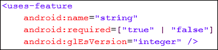

可以看到`<uses-feature>`标签中有三个属性:`name`、`required`和`glEsVersion`。 `android:name`属性以字符串描述符的形式指定应用使用的任何单个硬件或软件功能。`android:required`属性是`<uses-feature>`标签中相当重要的属性。它是一个布尔值，指示应用是否需要在`android:name`属性中指定的功能。如果开发人员为任何功能声明`android:required="true"`，这意味着没有设备上可用的指定功能，应用将无法运行。如果开发人员声明`android:required="false"`为该功能，这意味着应用更喜欢该功能在设备上可用。如果该功能不可用，应用将无法正常工作，或者在使用该功能时由于不可用而可能会崩溃。此属性的默认值为真。`<uses-feature>`标签中的最后一个属性是`android:glEsVersion`。这是一个用 16 位表示的版本号。此属性指定应用将使用的 OpenGL ES 版本。例如，我们在应用中使用了一个摄像头。下面的代码片段显示了如何在清单文件中声明摄像机的权限:

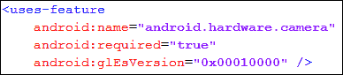

您可以在代码中看到，我们已经为`android:name`属性使用了`android.hardware.camera`字符串。这个字符串声明了 Android 的相机功能，其他属性声明了应用需要相机功能并支持 OpenGL ES 1.0 版本才能正常工作。开发人员必须在单独的`<uses-feature>`标签中指定应用中使用的每个功能；因此，如果应用需要多个特性，那么应该在清单文件中声明多个标记。声明应用中使用的所有功能是一种很好的做法。`<uses-feature>`这些声明的标签只提供信息，安卓系统在安装应用之前不会检查匹配的功能。

### 注

谷歌 Play 使用清单文件中声明的`<uses-feature>`标签，从不符合其软硬件要求的设备中过滤应用。

`<uses-feature>`标签最早是在 API 等级 4 中引入的。如果包含`<uses-feature>`标签的应用在较低版本的设备上运行，早期版本会忽略该标签。

下表分别显示了硬件和软件特性的一些特性类型和名称字符串的列表。它们可用于`<uses-feature>`标签的`android:name`属性:

## 硬件特性

<colgroup><col style="text-align: left"> <col style="text-align: left"> <col style="text-align: left"></colgroup> 
| 

特征类型

 | 

功能描述符(安卓名称)

 | 

描述

 |
| --- | --- | --- |
| 蓝牙 | `android.hardware.bluetooth` | 该功能允许应用使用设备的蓝牙。 |
| 照相机 | `android.hardware.camera` | 该功能允许应用使用设备的摄像头组件。 |
| `android.hardware.camera.flash` | 这是子功能，允许应用使用设备的相机闪光灯。 |
| 位置 | `android.hardware.location.gps` | 该子功能允许应用使用从设备的全球定位系统接收器获得的精确位置坐标。 |
| 传感器 | `android.hardware.sensor.accelerometer` | 该功能允许应用使用来自设备加速计传感器的运动读数。 |
| `android.hardware.sensor.compass` | 该功能允许应用使用来自设备罗盘的方向读数。 |
| `android.hardware.sensor.proximity` | 该功能允许应用使用设备的接近传感器。 |
| 屏幕 | `android.hardware.screen.landscape` | 该功能将应用的屏幕方向设置为横向。 |
| `android.hardware.screen.portrait` | 该功能将应用的屏幕方向设置为纵向。 |
| 触摸屏 | `android.hardware.touchscreen.multitouch` | 这项子功能允许应用使用两点多点触控功能，如 Pinch。 |
| 无线网络连接 | `android.hardware.wifi` | 该功能允许应用使用设备的无线组件。 |

## 软件特性

<colgroup><col style="text-align: left"> <col style="text-align: left"> <col style="text-align: left"></colgroup> 
| 

特征类型

 | 

功能描述符(安卓名称)

 | 

描述

 |
| --- | --- | --- |
| 应用小部件 | `android.software.app_widgets` | 该功能允许应用包括应用小部件，并且可以安装在具有主屏幕的设备上。 |
| 主屏幕 | `android.software.home_screen` | 功能允许应用作为设备的主屏幕替代。 |
| 输入法 | `android.software.input_methods` | 该功能允许应用提供自定义输入方法。 |
| 直播壁纸 | `android.software.live_wallpaper` | 该功能允许应用提供实时壁纸。 |

我们没有显示前面表格中的所有特性和描述符。我们只介绍了一些最常用的特性。该表显示了每个特征的特征类型，其在`android:name`标签中使用的特征名称描述符，以及该特征将做什么以及它将如何影响设备中的应用的简短描述。

一些特性被归类为硬件特性，一些被归类为软件特性。硬件功能是在后端使用硬件组件的功能。要访问这些硬件组件，我们的应用应该拥有访问硬件的权限。需要注意的是`<uses-feature>`标签只是提供信息，它只是告诉用户应用正在使用 app 中的某个特定功能。它不允许使用任何特定的特性或组件来访问应用。

为了允许应用使用任何特定的组件，安卓提供了另一个标签`<uses-permission>`。如果用户在安装时允许，该标签提供对应用组件的访问。以下代码片段显示了在清单文件中写入`<uses-permission>`标记的语法:


`<uses-permission>`标签请求应用正常运行必须获得的任何特定许可。权限仅由用户在安装应用时授予。与`<uses-feature>`标签不同，`<uses-permission>`标签只有一个`android:name`属性。标签的唯一属性指定权限的名称。权限的名称可以使用`<permission>`标签定义(这超出了本书的范围，我们就不讨论了)或者使用安卓系统提供的标准权限名称。例如，为了允许应用读取电话联系人，我们可以编写如下代码片段:


你可以看到我们是如何从`android.permission`包中提供一个标准的权限名称来读取手机的联系人的。

### 注

通过`<uses-feature>`标签声明的功能被 Google Play 用来过滤应用，通过`<uses-permission>`标签声明的权限在安装时呈现给用户，用于授予访问权限。

一些`<uses-feature>`标签名称描述符被添加到应用编程接口中的`<uses-permission>`标签描述符之后。因此，一些使用`<uses-permission>`标签的应用能够使用特定的硬件，而不需要在清单文件中声明`<uses-feature>`标签。为了防止应用出现任何与这种不匹配相关的意外问题，某些功能隐含了一些权限。Google Play 假设某些硬件相关权限表明默认情况下需要底层硬件功能。`<uses-feature>`标签允许谷歌 Play 过滤市场上的应用，只向用户显示设备能够运行的应用。然而，`<uses-permission>`标签在用户下载并安装应用时履行其职责。安装前，要求用户授予应用中指定的所有权限。只有当用户授权访问时，才会安装应用。因此，对于那些同时具有`<uses-feature>`和`<uses-permission>`标签名称描述符的特性，最好在应用的清单中声明这两个描述符，以使其正常工作。下表显示了权限隐含的一些功能:

<colgroup><col style="text-align: left"> <col style="text-align: left"> <col style="text-align: left"></colgroup> 
| 

种类

 | 

<uses-permission>描述符</uses-permission>

 | 

<uses-feature>描述符</uses-feature>

 |
| --- | --- | --- |
| 蓝牙 | `android.permission.BLUETOOTH` | `android.hardware.bluetooth` |
| 照相机 | `android.permission.CAMERA` | `android.hardware.camera` |
| 位置 | `android.permission.ACCESS_COARSE_LOCATION` | `android.hardware.location``android.hardware.location.network` |
| `android.permission.ACCESS_FINE_LOCATION` | `android.hardware.location.gps``android.hardware.location` |
| 麦克风 | `android.permission.RECORD_AUDIO` | `android.hardware.microphone` |
| 电话 | `android.permission.CALL_PHONE` | `android.hardware.telephony` |
| `android.permission.PROCESS_OUTGOING_CALLS` | `android.hardware.telephony` |
| `android.permission.READ_SMS` | `android.hardware.telephony` |
| `android.permission.RECIEVE_SMS` | `android.hardware.telephony` |
| `android.permission.SEND_SMS` | `android.hardware.telephony` |
| `android.permission.WRITE_SMS` | `android.hardware.telephony` |
| 无线网络连接 | `android.permission.ACCESS_WIFI_STATE` | `android.hardware.wifi` |

您可以在表格中看到，所有由权限暗示的功能都是硬件功能，需要硬件组件才能正常运行应用。所以，已经明确了开发者应该声明`<uses-feature>`和`<uses-permission>`标签都在 Google Play 中进行过滤，并正确安装在设备上，而不会给用户和开发者带来任何麻烦。

# 使用发送操作进行共享

任何手机的主要目的都是提供一种便捷的通信方式。像所有手机一样，安卓智能手机提供了一种更简单的通信方式。在这个互联网和社交网络的时代，安卓手机在分享和社交网络方面被证明是相当有成效的。安卓提供分享图片、状态、发邮件、脸书、推特等社交网络等功能。幸运的是，对于开发人员来说，所有这些共享特性都可以很容易地使用，只需要几行代码。意图被证明是在安卓组件和应用中执行异步通信的一种非常好的方式。

在[第 3 章](03.html "Chapter 3. Intent and Its Categorization")、*意向及其分类*中，我们讨论了一个使用意向共享状态的例子。我们将在本章中更详细地解释相同的`SEND`意图，并看看我们如何根据用户的选择通过任何媒体共享图像和文本。说到在安卓手机上分享任何东西，使用`SEND`动作的意图非常多。在本节中，我们将讨论`SEND`行动的意图，看看它有什么可能。

为了用`SEND`动作定义意图，下面的代码片段显示了声明:


可以看到，我们在意向的构造函数中传递了一个`Intent.ACTION_SEND`的字符串常量。这个字符串常量告诉安卓系统，意图是在设备上发送任何东西。我们可以通过调用`startActivity()`方法来执行以下意图，如以下代码片段所示:

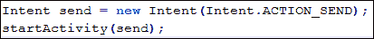

在`startActivity()`方法中传递`SEND`意图将允许用户通过提供所有可能的共享应用的对话框来选择他喜欢的发送方式。但是如果我们在没有设置意图类型的情况下在`startActivity()`方法中传递`SEND`意图，它将抛出一个运行时异常。以下日志显示了运行时引发的异常的一些行:

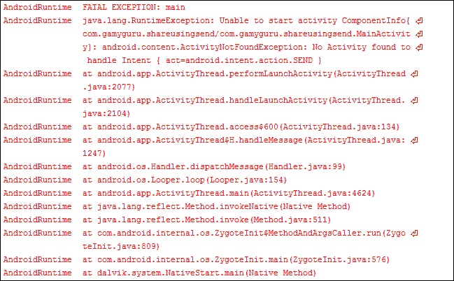

在日志中可以看到`"Unable to start activity"`然后`android.content.ActivityNotFoundException`被抛出。当对`startActivity(intent)`方法或其变体之一的调用失败时，会引发此异常，因为找不到执行给定意图的活动。不仅异常类型，日志也显示了活动失败的原因。上面写着`"No activity is found to handle the intent"`。你可能想知道为什么安卓找不到合适的活动来接收意图。回想一下前面章节中隐含的意图，安卓会寻找所有与意图类型匹配的可能活动，并在对话框中显示所有这些应用。在我们的例子中，除了它的`Intent.ACTION_SEND`行为，我们没有定义任何类型的意图；这就是为什么我们会得到`ActivityNotFoundException`的运行时异常。让我们设置操作类型，并查看显示接收意图的所有可能应用的对话框:


你可以看到我们调用了`setType()`方法，传递了一串`text/html`类型。此方法设置意图的显式 MIME 数据类型。这用于创建仅指定类型而不指定数据的意图。这些是安卓系统中常用的隐含意图。此方法清除先前设置的意图的任何数据。

### 注

安卓框架中的 MIME 类型匹配是区分大小写的。所以，你应该总是用小写字母写你的 MIME 类型。也可以使用`normalizeMimeType(String)`方法确保转换为小写。

我们已经在方法参数中将`text/html`作为 MIME 类型传递了。这种类型告诉安卓系统，所有支持 HTML 类型数据并处理它的应用都可以接收到这种意图。因此，结果是，安卓在一个对话框中推送所有这些应用，让用户选择他/她喜欢的应用。下图显示了`text/html`类型的对话框:


你可以看到所有支持 HTML 类型内容的应用都显示在图片中，比如**邮件**、 **Imo Messenger** 、 **Skype** 。你可以看到在安卓手机中使用`SEND`意图分享内容是多么容易，而选择应用并启动它们的工作就留给了安卓。

### 注

您可能已经注意到对话框中没有显示短信/彩信发送应用，因为短信/彩信只是纯文本应用，它们只支持这种类型的内容。

从列表中选择任何选项后，应用将启动。由于我们没有设置任何要共享的内容，应用大部分是空的。为了在意图中设置内容，我们必须使用额外的东西。我们将放一些额外的信息，如标题、主题或文本。下面的代码片段显示了如何在`SEND`意图中加入一些额外的内容:

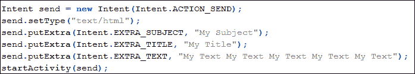

在代码中可以看到，在设置了意图的 MIME 类型之后，我们已经调用了`putExtra()`方法几次。此方法将扩展数据添加到意图中。该函数有两个参数:`name`和`value`。`name`参数必须包含包前缀；例如，应用`com.android.contacts`会使用像`com.android.contacts.ShowAll`这样的名字。我们传递了意图的主题、标题和文本内容的三个字符串。这些类型数据的`Intent.EXTRA_SUBJECT`、`Intent.EXTRA_TITLE`、`Intent.EXTRA_TEXT`等名称已经在`Intent`类中声明了，我们可以静态访问这些名称。如果我们也传递了标题字符串，你可能会想为什么我们传递了主题。嗯，`SEND`意图是一个隐含的意图，安卓显示了所有支持该意图的应用。用户可以选择任何应用，因为不同的应用对不同的数据感兴趣。例如，任何电子邮件应用都会对主题、收件人和正文字符串感兴趣。任何短信应用只会对收件人和正文字符串感兴趣。因此，为了有效利用`SEND`意图，您应该添加所有可能的内容，以便有效地与每个应用共享。让我们举一个使用`SEND`意图发送电子邮件的例子。下面的代码片段显示了我们如何使用`SEND`意图发送电子邮件:


首先，我们通过传递构造函数的`Intent.ACTION_SEND`参数来声明我们的`SEND`意图。然后，我们通过`calling setType()`方法将意图类型设置为`"text/html"` MIME 类型。然后，我们为电子邮件应用添加额外的内容，如下列表所示:

*   `Intent.EXTRA_SUBJECT`:这个名字常量是用来添加主语的。
*   `Intent.EXTRA_EMAIL`:此名称常量用于填写“收件人”字段中的电子邮件地址。
*   `Intent.EXTRA_CC`:此名称常量用于填写“抄送”字段中的电子邮件地址。
*   `Intent.EXTRA_BCC`:此名称常量用于填写密件抄送字段中的电子邮件地址。

最后，在调用`startActivity()`方法之前，我们将电子邮件正文放在`Intent.EXTRA_TEXT`名称常量旁边，并将我们的文本传递到`putExtra()`方法的值参数中。`startActivity()`方法将显示与上图所示相同的对话框，在选择电子邮件应用时，将显示以下截图:


一个电子邮件应用已经充满了输入意图的内容

您可以从图片中看到，我们放入额外数据的所有数据都已经填充在电子邮件应用中，如主题、电子邮件、文本等。现在，用户只需点击**发送**按钮，邮件就会被发送。在这个示例应用中，我们使用“收件人”字段直接向一个地址发送了一封电子邮件，并通过“抄送”和“密件抄送”间接向另外两个地址发送了一封电子邮件。安卓也允许我们添加多个电子邮件地址。名称常量`Intent.EXTRA_EMAIL`用于此目的。我们在代码中传递了一个地址；我们还可以传递由电子邮件地址组成的字符串数组来发送电子邮件。

从这一节中，我们主要了解了`ACTION_SEND`意图是如何使用的，以及使用这一意图我们只用几行代码就能做多少工作。如果我们从对话框中选择脸书、推特或任何其他应用，我们将看到通过该应用共享数据的相同结果。这就是使用隐含意图的力量，使它以几乎所有可能的方式通用，而不需要做任何艰苦的开发工作。

### 注

`ACTION_SEND` 是一个意图的动作。和这个动作一样，在安卓系统中还有`ACTION_VIEW`、`ACTION_SEARCH`等其他动作可以通过传入意图用于其他目的。

# 电话和使用意图拨打电话

不仅仅是安卓手机，从发明之日起，任何手机的主要目的都是提供一种远距离对话的交流方式。和所有其他手机一样，安卓手机也提供了拨打和接听电话、查看未接电话和拨打号码等通话记录、存储联系人、编辑/修改/删除联系人等功能。由于安卓手机处于智能手机的框架中，通话功能有很多。用户可以进行视频通话、录音通话、电话会议、手机到电脑通话，反之亦然，等等。所有这些特性为用户提供了一个非常有效的产品，并让开发人员使用这些特性来获得更大的灵活性和生产力。

Android 为开发者提供了许多电话功能的 API。这些电话应用编程接口允许您的应用和开发人员访问底层的电话硬件，从而使创建自定义拨号器、集成呼叫处理或电话状态监控等成为可能。

### 注

由于安全原因，开发人员无法自定义电话的来电显示屏幕。当用户拨打任何电话或接收任何来电时，都会显示来电屏幕。

由于本书侧重于意图，我们将只讨论那些可以使用意图的电话功能。从拨打电话、接听电话、查看通话记录、接听/拒绝电话等诸多功能来看，能够直接利用的功能非常少，只有使用意图。幸运的是，打电话是其中之一。让我们在下一节讨论如何使用意图拨打电话。

## 使用意图打电话

安卓系统有两种打电话的方法。开发人员可以使用 Android 提供的 API 打电话，也可以只通过发送带有电话号码等必要信息的意向来发起电话。我们将在本节后面探讨发起电话呼叫的方法。

在前面的部分中，我们看到了如何使用意图中的动作来告诉安卓系统我们的意图。我们也会这样做，通过告诉安卓我们的意图来打电话，剩下的工作就交给系统了。下面的代码片段允许应用使用已经拨打的指定号码启动拨号器，并且用户可以通过按其中的呼叫按钮来明确地进行呼叫:

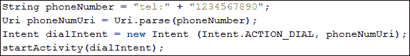

您可以看到，我们在代码中只做了很少的更改。我们已经声明了一个存储我们想要拨打的号码的`phoneNumber`字符串。你可能想知道为什么我们在字符串中连接了一个`tel:`前缀。这个前缀是用来获取号码的**通用资源标识符**(**URI**)的。我们通过调用`Uri`类的静态方法`Uri.parse()`得到这个 URI。这个方法返回 URI，我们依次将它传递给构造函数的另一个参数。我们通过在意图声明中传递`Intent.ACTION_DIAL`来提供`DIAL`动作，最后，我们一如既往地调用`startActivity(intent)`方法来执行意图，并告诉安卓系统处理我们的意图。下面的屏幕截图显示了前面提到的代码片段的拨号器结果:


一个拨号屏幕，带有通过启动拨号意图而启动的已拨号码

当我们运行前面的代码时，应用将启动安卓手机的默认拨号器，并拨打其中代码中提供的号码。它不会拨打该号码；它只会拨号码，因为我们用了`Intent.ACTION_DIAL`。用户可以明确地按下拨号器的呼叫按钮并进行呼叫。

如果用户不想拨打该号码，也可以不先去拨号器直接拨打该号码。安卓为此提供了`Intent.ACTION_CALL`动作。下面的代码片段显示了如何直接进行调用:

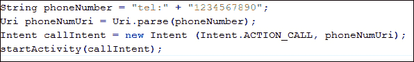

从代码中可以看出，除了在意图的构造函数中传递的操作之外，一切都是相同的。在最后一个例子中，我们传递了`Intent.ACTION_DIAL`，在这个例子中，我们传递了`Intent.ACTION_CALL`来直接进行调用。当我们运行这个代码片段时，应用将开始在安卓手机上打电话。以下屏幕截图显示了该呼叫:


通过启动`CALL`意图显示的通话中屏幕

`ACTION_CALL`直接打电话的这个动作需要用户授予应用权限。以下代码片段显示了将权限放入`AndroidManifest`文件以使应用能够完美工作的权限:


需要注意的是`ACTION_CALL`不能使用意图拨打紧急号码；但是，使用`ACTION_DIAL`可以拨打紧急号码。如果用户在手机上安装了多个拨号器，`ACTION_DIAL`操作将显示拨号器列表，用户可以从中选择喜欢的拨号器。下面的截图显示了多个拨号器的场景:

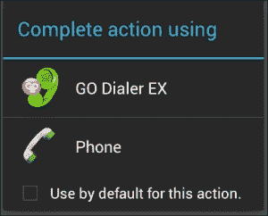

从对话框中选择多个经销商

`ACTION_DIAL`和`ACTION_CALL`的意图差别很小。`ACTION_DIAL`意向性只拨打号码，用户可以通过按呼叫按钮明确呼叫，但`ACTION_CALL`直接进行呼叫，不向用户显示拨号器。

### 注

直接打电话的应用可能会受到限制。所以，在应用中使用`ACTION_DIAL`是一个很好的做法，除非需要`ACTION_CALL`。

这就是我们如何使用意图轻松打电话和使用安卓的电话功能。在下一节中，我们将看到如何使用意图发送短信、彩信和数据消息。除了发送，我们还可以确认消息传递以及接收消息。现在让我们在下一节详细讨论这些问题。

# 短信/彩信使用意图

除了通话功能之外，手机还支持短消息服务、多媒体消息服务以及最近的数据消息等消息服务。短信/彩信功能在手机中使用最广泛，许多人更喜欢它，而不是打电话。Android 提供了 API 和框架，允许开发人员在他们的应用中发送和接收消息。开发人员甚至可以替换原生的短信应用来发送和接收短信。

### 注

在撰写本书时，您的应用中没有发送彩信的应用编程接口或库，但您可以使用`ACTION_SEND`或`ACTION_SENDTO`意图发送彩信。

本节将引导您完成各种操作，例如发送短信、发送彩信、发送数据消息、确认消息传递以及使用意图接收短信。然后，我们将向您简要介绍如何在不使用意图的情况下执行所有这些操作，以及安卓的应用编程接口如何对我们有益。在下一小节中，让我们来看看使用意图发送短信的第一个任务。

## 使用意图发送短信

使用意图最好的一点是，它将我们需求的责任传递给安卓系统，而不是我们从核心创建全部功能。如果我们在当前的情况下使用意图，即向某人发送短信，我们只需提供发送消息的号码和要发送的消息。剩下的都是安卓自己做的。

我们已经就发送东西或使用意图分享东西的同一个话题进行了大量的讨论，幸运的是，我们在这里没有什么不同之处需要吸收。这与创建`ACTION_SEND`意图并通过调用`startActivity(intent)`方法来执行它的旧方法是一样的。下面的代码片段显示了我们之前使用的`ACTION_SEND`意图示例:

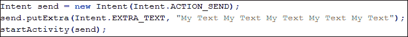

现在，如果我们使用这个代码，它对我们没有用，因为它不执行我们发送短信的动作。它也不在选择器对话框中显示支持短信的应用，也不发送任何带有在`EXTRA_TEXT`额外传递的数据的短信。为了利用`ACTION_SEND`发送短信，我们必须处理一些额外的事情。使用意图发送短信有两种方式:通过`ACTION_SEND`意图和通过`ACTION_SENDTO`意图。让我们看看如何使用`ACTION_SEND`意图发送短信。

我们必须用`ACTION_SEND`动作创建意图，然后放入一个额外的`"sms_body"`，其中嵌入了消息。安卓会向用户询问收件人本身的电话号码。但是它仍然不会在选择列表对话框中显示任何短信支持应用，因为我们仍然缺少意图类型。由于短信是短短信，我们应该将意向类型设置为`"text/html"`，但由于彩信不支持原生，大多数短信应用会将`"image/jpg"`或`"image/png"`作为意向类型。因此，在将意图类型设置为`"image/png"`之后，我们将得到以下代码片段:

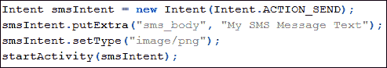

当我们执行这段代码时，我们将看到各种应用的选择器对话框，包括短信支持应用、电子邮件应用等。当我们选择任何短信应用时，我们会看到类似于下图的内容:

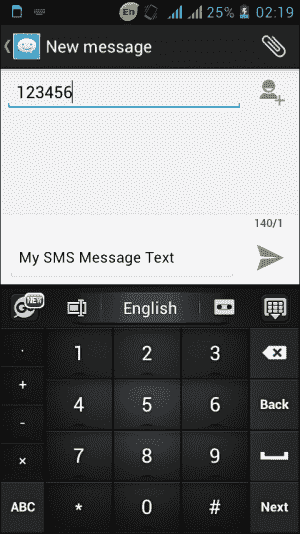

发送短信意向后显示的默认短信应用

您可能已经注意到短信应用的文本部分是已经填写了我们在`"sms_body"`额外添加的内容，用户正在输入消息的收件人数。

### 注

上图显示了 A10 智能手机的默认短信应用。您的设备将显示您在手机上设置为默认的短信应用，它肯定不会与此应用相同。

这就是我们如何使用意图发送短信。现在，让我们来看另一个案例，在这个案例中，我们想要使用编码来设置接收者的数量。为此，我们必须使用`ACTION_SENDTO`意图而不是`ACTION_SEND`意图。以下代码片段显示了`ACTION_SENDTO`意图的使用:

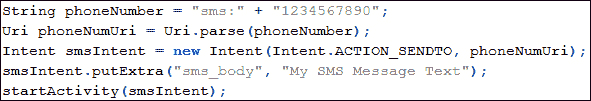

在前面的代码中，您可以看到，在发送短信之前，我们对之前讨论的代码进行了一些更改。我们已经将动作设置为`ACTION_SENDTO`而不是`ACTION_SEND`。另外，我们在意图的构造函数中传递了电话号码 URI 的另一个参数。我们已经为电话号码创建了一个字符串，并在号码前连接了`"sms:"`标签。这个标签让`Uri`类理解这个字符串代表发送消息的电话号码，并相应地解析它。您可能还记得上一节，我们使用`"tel"`标签拨打任何电话号码。当您执行代码时，它会要求应用选择短信。在选择任何支持短信的应用时，它会将短信直接发送到提供的电话号码，而不是像前面的示例那样询问电话号码。您可能已经注意到，我们没有在这段代码片段中设置意图的类型。这是因为当我们使用`ACTION_SENDTO`意图时，我们不必显式设置意图的类型。安卓将从`"sms"`或`"tel"`等标签和`ACTION_SENDTO`或`ACTION_CALL`等动作中理解开发者试图做什么。

### 注

如果您想使用`ACTION_SEND`并使用代码明确设置收件人号码，安卓系统会额外提供`"address"`来将号码字符串放入其中，而无需使用任何标签，如`"tel"`或`"sms"`。

到现在为止，我们一直在谈论使用`ACTION_SEND`和`ACTION_SENDTO`发送短信。在下一节中，我们将看到如何使用意图发送嵌入图片的彩信。

## 使用意图发送彩信

短信和彩信唯一不同的是嵌入其中的富媒体。彩信包含丰富的媒体内容，如照片、视频和卡片，以及一些作为内容消息的文本。目前，没有安卓提供的库可以让开发者本地发送彩信，不像短信。但幸运的是，为了发送彩信，意图为我们开辟了一条清晰的出路。正如真正的区别所定义的，我们必须在文本消息意图中添加一些媒体，其类型设置为多媒体，如`"image/png"`，然后我们就完成了彩信的发送。下面的代码片段显示了如何使用短信的意图发送任何彩信:


您可以看到代码有两部分。在第一部分中，我们将所需图像的 URI 存储在`images`文件夹的外部存储器中。第二部分，我们用`ACTION_SEND`创造意图。然后，我们通过使用一个额外的`"sms_body"`来添加我们的文本，并将类型设置为`"image/png"`以使其对彩信有意义。之后，我们使用`Intent.EXTRA_STREAM`附加我们的媒体，并在其中传递我们的形象 URI 作为价值。最后，我们通过调用`startActivity(intent)`方法来执行意图。唯一不同的是使用`EXTRA_STREAM`附加媒体 URI，其余与短信相同。你还要注意，我们可以用`ACTION_SENDTO`指定收件人号码，也可以用电话号码的值加上`"address"`多余的。

### 注

我们在前面的例子中已经设置了`"image/png"`的类型。这只能发送 PNG 图像。对于其他图像格式，我们可以指定`"images/*"`。

到目前为止，我们只讨论了发送短信和彩信。但是我们确定那些信息已经成功传递了吗？下一节是关于确认消息传递和理解意图在其中的作用。让我们看看如何使用下一节中的意图来确认消息传递。

## 使用意图确认消息传递

当我们使用意图发送消息时，无论是短信还是彩信，我们都无法跟踪这些消息的动作，例如确认传递。这背后的原因是隐含使用意图，依赖安卓系统的默认动作。如果我们使用意图来发送消息，这意味着我们正在将发送消息的责任传递给安卓系统。现在，如果我们想确认消息的传递状态，这意味着我们正在向安卓询问我们的消息。不幸的是，我们缺少两件事来让它成为可能:一是告诉安卓系统我们对某个消息的确认，二是安卓系统可能不记得我们在说什么消息。

为了能够确认传递，我们必须使用本机应用编程接口来手动发送消息。这个应用编程接口的工作是跟踪交付状态和我们正在讨论的消息。同样，使用这个 API，我们可以轻松地发送我们的查询，询问安卓系统关于交付确认的信息。

现在，如果我们使用本地 API 发送消息，我们必须考虑彩信。如前所述，彩信仍然没有原生支持；因此，我们将无法跟踪和确认彩信的发送，但可以，我们可以确认短信的发送状态。在本节中，我们将讨论如何使用本机短信应用编程接口检查短信发送状态，以及如何使用意图来实现我们的目标。

意图是安卓系统中一种异步的通信方式，它们无处不在。唯一的变化是它们被用来实现我们的目标和完成需求。在关于确认消息传递状态的简短说明中，我们将使用名为`SmsManager`的本机短信应用编程接口，使用`SmsManager.sendTextMessage()`方法发送短信。但是为了跟踪消息，我们将使用两个意图:一个用于发送操作，一个用于传递操作。除了这两个意向，我们还将创建两个待定的意向:一个用于发送操作，一个用于交付操作。最后，为了实现所有四个意图，我们将创建两个广播接收器:一个用于检查发送的动作，另一个用于检查传递的动作。在这里看起来可能很复杂，但它就像一个咒语一样简单。让我们看一下声明我们的四个意图的代码片段:两个意图和两个待定意图:

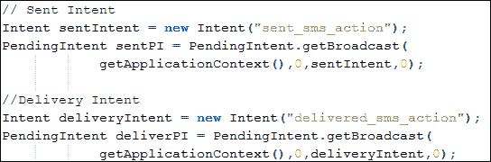

您可以看到，我们已经在代码中以通常的方式声明了我们的意图。这里唯一的区别是，我们使用了自己的自定义动作，用字符串表示，如`"sent_sms_action"`或`"delivered_sms_action"`。然后，我们使用`PendingIntent`类的`getBroadcast()`工厂方法创建了两个待定意图。`getBroadcast()`方法将检索执行任何广播的`PendingIntent`，例如调用`Context.sendBroadcast()`方法。

因此，在创建了所有四个意图之后，我们现在必须创建并注册广播接收器，将待定的意图付诸行动。下面的代码片段显示了正在实现的两个接收器:

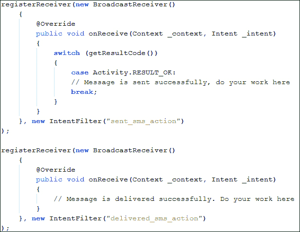

如前面的代码所示，我们已经使用`Activity.registerReceiver()`方法注册了两个广播接收器，并传递了匿名对象。超驰方法`onReceive()`服务于我们的目的。一个`onReceive()`方法在发送任何消息时调用，另一个`onReceive()`方法在发送任何消息时调用。我们在代码中添加了注释，向您展示了在哪里可以使用自定义功能。你可能想知道安卓如何知道这些是发送和交付状态的广播接收器。安卓将通过检查意图过滤器来了解它。您可以看到，我们已经在意图过滤器的构造器中传递了我们在意图中传递的自定义操作，这些过滤器将过滤广播，并且接收器将只接收它注册的那些广播。到目前为止，我们已经完成了确认消息传递的核心工作。现在剩下的就是付诸行动，在这里，`SmsManager`应用编程接口派上了用场。我们将创建一个`SmsManager`的实例，并调用其`sendTextMessage()`方法来发送消息，并将所有意图放入其中，然后我们就完成了。下面的代码片段显示了`SmsManager`的用法代码:


记住，`SmsManager` API 使用`android.permission.SEND_SMS`权限；因此，不要忘记将其添加到清单文件中，如以下代码片段所示:


因此，这是我们确认消息传递的方式。我们只能确认短信的发送状态，，我们必须要求用户为此授予`SEND_SMS`权限。但是，如果我们使用意图，我们只能发送消息，不需要用户的任何许可。

### 注

安卓模拟器支持发送和接收短信。这可以通过创建多个模拟器实例并发送文本消息来连接模拟器的数量来实现。

总结意图在确认消息传递中的作用，意图在这里不执行确认消息传递的核心动作。它们只是提供了一种通信方式，通过携带必要的信息，例如要检查哪个消息的传递等等。然后，这些意图被广播接收器使用，这些接收器不断检查传送和发送状态。一旦完成，它们会在我们的意图中传递状态，然后这些意图会向我们提供消息是否已经发送或传递的更新。

在下一节中，我们将做几乎相同的事情和编码，但这一次，我们将做它来接收消息。在使用了所有这些代码片段之后，我们就可以开发可以发送和接收消息的短信应用了。让我们看看我们如何接收信息，以及意图在其中的作用。

## 使用意图接收短信

到目前为止，我们已经讨论了发送短信/彩信以及这些应用中意图的重要性。在本节中，我们将讨论如何监听传入的消息，以便在应用中使用它们。利用这个特性，我们可以开发消息应用。意图者可以直接使用`ACTION_SEND`或`ACTION_SENDTO`意图发送消息，但是这些意图者在监听传入的消息和接收消息时不会起到直接作用。意图的使用方式与`Broadcast Receiver`相同，用于获取发送者号码、消息、消息时间等数据。在我们讨论如何监听传入的消息之前，我们必须了解一些在下面的应用中使用的类。

### smsmsmanager 类

我们已经使用了前面小节中的`SmsManager`类来确认消息传递。这个类用于管理短信操作，例如发送数据、短信和 PDU 消息。我们不能用构造函数实例化这个对象；我们可以通过调用`SmsManager.getDefault()`的静态方法来获取它的实例。我们可以使用这个类来发送消息。

### 注

有两个不同的类，名字分别是`SmsManager` : `android.telephony.SmsManager`和`android.telephony.gsm.SmsManager`。在应用编程接口级别 4 和更高版本中，不推荐使用 GSM 包中的更高版本。

### 短信对象

这个类代表一个简单的短信对象。在接收到传入消息后，我们将获得一组`SmsMessage`对象。此类用于获取信息，如消息正文、消息时间和发件人号码。

### 协议数据单元

分组数据单元是短信的行业格式。开发人员不应该担心详细阅读 PDU 或者理解格式，因为 Android 的`SmsManager`类读写 PDU，并为开发人员提供使用 PDU 的方法。

这些类和概念将用于接收传入消息的应用。现在，让我们讨论在安卓系统中如何接收消息。当任何设备接收到任何新的短信时，就会触发新的广播意图。这个意图的作用是`android.provider.telephony.SMS_RECEIVED`。我们必须创建一个定制的广播接收器来寻找这种广播意图。每当我们收到任何消息时，都会调用广播接收器的`onReceive()`方法。下面的代码片段显示了我们的传入消息自定义广播接收器的实现:

```java
public class IncomingMsgReceiver extends BroadcastReceiver {
  private static final String SMS_RECEIVED = "android.provider.
    Telephony.SMS_RECEIVED";
  public void onReceive(Context _context, Intent _intent) {
    if (_intent.getAction().equals(SMS_RECEIVED)) {
      // SMS Received. Write your code here.
      Bundle msgBundle = _intent.getExtras();
      getMessageData(msgBundle);
    }
  }
}
```

像往常一样，我们从`BroadcastReceiver`开始扩展我们的类，并覆盖了`onReceive()`方法。当设备接收到任何传入消息时，都会调用此方法。我们首先检查这个意图是否包含任何接收到的消息。如果意图动作与我们的`SMS_RECEIVED`字符串相同，这意味着我们已经收到了我们的消息。

### 注

短信接收动作`android.provider.Telephony.SMS_RECEIVED`在安卓中不受支持，在未来的任何平台版本中可能会有所变化。开发人员在使用安卓这些不支持的隐藏方法和属性时应该谨慎。

一旦在检查和比较之后验证了操作，我们就必须从意图中获取消息数据，并执行应用的自定义操作。我们首先通过调用`getExtras()`方法从意图中获取额外的包，然后我们在中传递了那个包，我们的方法称为`getMessageData()`。这是我们的自定义方法，在这个方法中，我们将看到如何从包中获取消息数据。下面的代码实现展示了方法的定义:


我们首先检查我们的包不是空对象。然后我们通过调用`get()`方法并传递`"pdus"`键从包中提取 PDU。

### 注

如果不知道在`get()`方法中传递哪个键，可以调用`Set<String> Bundle.keySet()`方法，获取捆绑包中使用的所有键。

回想起 PDU，PDU 是短信的行业格式。一旦我们在一个数组中有了所有的 PDU 对象，我们使用`SmsMessage.createFromPdu()`方法从这些 PDU 创建一条短信。创建所有消息后，我们遍历数组，并使用`SmsMessage.getMessageBody()``SmsMessage.getOriginatingAddress()`和`SmsMessage.getTimestampMillis()`方法从数组中获取消息数据，如消息正文、消息发送者号码和消息时间。现在，我们可以在应用中使用这些数据字符串。必须注意的是，任何大消息都被分解成许多小消息，这就是为什么我们得到了一个对象数组。

除非我们在应用中注册，否则这个广播不会工作。要在我们的应用中注册它，我们必须在我们的主活动中编写以下代码:

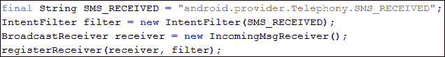

这里没有什么新的讨论。我们正在用`SMS_RECEIVED`动作和我们的广播接收器的一个实例创建一个意图过滤器。然后，我们通过活动的`registerReceiver()`方法。消息接收者需要`android.permission.RECEIVE_SMS`的许可；因此，不要忘记在清单文件中添加这一行:

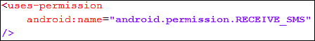

这就是我们如何在应用中接收传入的消息，并以多种不同的方式使用它们。您可能想知道意图在这个应用中的作用。如前所述，意图不直接用于此应用。当设备接收到任何消息时，就会触发广播意图。我们使用这种意图从中提取数据和消息，这些消息在我们的应用中使用。意图扮演的角色是在安卓设备中接收到消息后提供消息的相关数据。

我们可以使用**达尔维克调试监控服务器**(**【DDMS】**)面板的安卓调试工具在我们的安卓模拟器上模拟传入的消息。以下截图显示了 DDMS 视图中用于模拟消息的**模拟器控制**面板:

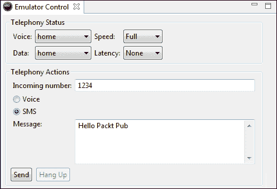

DDMS 视图中用于模拟消息的模拟器控制面板

在本节中，我们学习了发送短信、彩信、确认消息传递和接收传入消息。我们还讨论了所有这些应用中意图的重要性和用途。在下一节中，我们将了解通知以及如何在交互通知中使用意图。

# 使用意图的通知

从传统手机到智能手机，每一部手机都用一些方法来通知和提醒用户一些事件，比如接收消息或通话。像这些手机一样，安卓手机使用通知系统来提醒用户。通知是在应用的正常用户界面之外显示的消息。当任何新的通知被触发时，它会显示在通知区域。用户可以通过使用向下手势向下拉动抽屉，在随时看到来自通知抽屉和通知区域的通知。下面的截图显示了安卓系统中两个不同的通知示例:


安卓手机中的通知

通知就像渠道，当用户忙于其他移动活动(如玩游戏)时，会提醒用户重要事件的发生。

对于任何开发人员来说，通知是开发人员在应用的正常用户界面之外显示的用户界面元素，用于指示和通知用户事件已经发生。然后，用户可以选择在使用其他应用的同时查看通知，并在需要时对其做出响应。对于不可见的应用组件(如广播接收器和服务)来说，使用通知是提醒用户任何事件发生的首选方式。

在本节中，我们将讨论通知及其布局、在通知布局中显示附加信息以及启动意图。我们将学习意图的作用，并创建一个带有自定义通知布局的示例应用，以及意图在这些类型的应用中有多重要。在开始开发示例应用之前，让我们讨论一下通知中使用的一些基本概念。

## 通知表格

通知可以采取不同的形式，如进入状态栏的任何持久图标，可以通过启动器访问。当用户选择此通知时，当某些活动或服务发生时，任何指定的意图都会被触发。通知也可用于打开设备的闪烁指示灯。此外，设备可以在收到通知时振动或播放铃声。

## 通知管理器类

`NotificationManager`类代表一个系统服务，用于处理安卓系统中的通知。我们不能实例化这个类，但是我们可以通过调用`getSystemService()`方法并传递`Context.NOTIFICATION_SERVICE`来获得它的实例对象。下面的代码片段显示了如何获取`NotificationManager`类的实例:


## 通知类

`Notification`类代表安卓系统中的任何通知。它提供了允许开发者设置图标、标题、通知时间等的应用编程接口。下面的代码片段向我们展示了如何在安卓系统中创建通知:

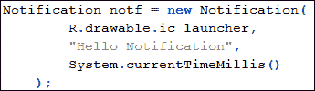

## 通知布局

每个通知都有一个图标和滚动条文本，有时称为状态文本。当通知已启动且通知抽屉关闭时，会显示一个图标。当触发通知时，滚动条文本沿着状态栏滚动，然后当通知抽屉打开时，滚动条文本被设置为通知消息文本。以下屏幕截图概述了通知区域的不同方面:

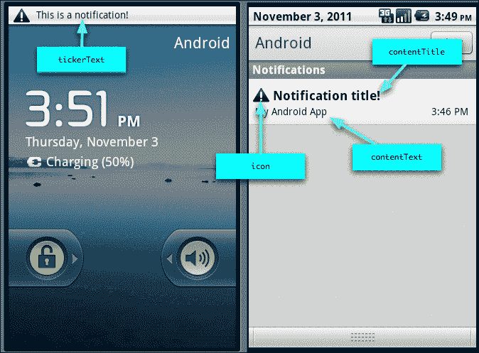

通知和通知区

您可以从前面的屏幕截图中看到，当任何通知被触发时，其滚动条文本会滚动通过状态栏。滚动整个文本后，其图标会显示在状态栏上。当用户通过下拉打开通知抽屉时，会显示通知的大图标以及通知标题、内容文本和时间戳。这就是在安卓系统中任何通知的触发方式。

现在，我们将讨论如何触发通知，以及如何在通知应用中使用意图。我们将创建一个通知，如下图所示:


简单的通知

因此，在向前移动以创建通知之前，我们需要通知的布局。下面的代码实现显示了我们的通知布局:

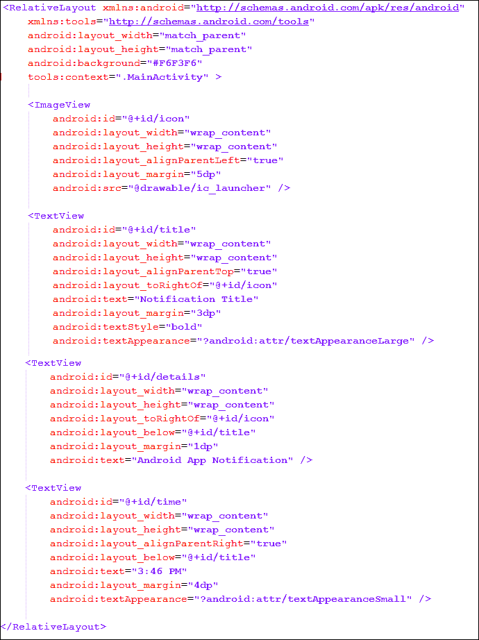

我们在`RelativeLayout`中放置了四个视图:一个`ImageView`为图标，一个大的`TextView`为标题，两个小的`TextViews`分别为描述和时间戳。我们使用`RelativeLayouts`的对齐方式将视图放置在下方、上方、的右侧和其他视图的左侧，这样它就可以在不同智能手机的每个分辨率上以相同的方式显示。我们已经在资源目录的布局文件夹中将该文件保存为`notification_layout.xml`。这是我们的通知布局。现在，让我们学习如何创建任何使用这种布局的通知。

要创建带有自定义布局的通知，我们在安卓中有两种不同的方法。第一种方法是使用 `setLatestEventInfo`方法更新标准扩展状态-通知显示中显示的详细信息。这种方法是最简单的方法，在更多的应用中使用。另一种方法是设置通知的`contentView`和`contentIntent`属性，使用`RemoteView`类为扩展显示状态分配自定义用户界面布局。

### 注

`RemoteView` 是一种允许开发人员嵌入和控制嵌入在任何单独应用中的布局的机制。这最常用于创建主屏幕小部件。

在本节中，我们将使用一种困难的方法来创建通知，因为该方法在其代码中使用意图。我们将首先创建一个`RemoteView`对象，并将其分配给通知对象的`contentView`属性。`contentView`视图表示扩展状态栏中的通知。通知通常表示对操作的请求，当用户单击通知抽屉区域或展开的状态栏中的通知时，就会执行该操作。我们可以指定`PendingIntent`当用户点击通知项时将被触发。大多数情况下，这种意图会打开我们的应用，并提供更多关于我们的通知的信息。除了设置`contentView`，我们还需要将`contentIntent`设置为`PendingIntent`的创建对象，其中自定义内容视图被分配给我们的通知。`contentIntent`意图是当点击展开的状态条目时必须执行的意图。如果这是活动的意图，我们必须包括`FLAG_ACTIVITY_NEW_TASK`，它将在新的任务中开始我们的活动。

### 注

手动设置`contentView`属性时，还必须设置`contentIntent`属性；否则，当触发通知导致应用运行时崩溃时，将引发异常。

一旦 `contentView`属性被设置为我们的自定义远程视图，我们就不能以正常方式设置我们需要的视图。我们必须在`RemoteView`对象上使用设置方法，修改在定义的布局中使用的每个视图。这就是任何带有自定义布局的通知的开发方式。下面的代码显示了带有自定义布局的通知的实现，这可以添加到任何活动中:

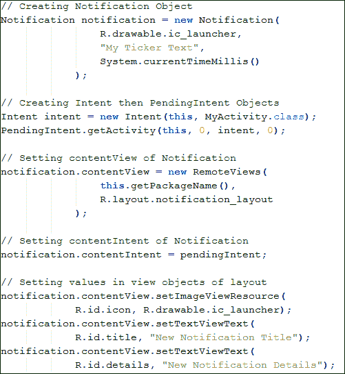

您可以从代码中看到，我们首先创建了一个`Notification`对象，该对象具有初始图标、滚动条文本和触发通知的时间。然后，我们创建意图对象`Intent`和`PendingIntent`，用于指定我们的通知被点击时的动作。然后，我们设置通知对象的`contentIntent`和`contentView`。我们为`contentView`创建一个新的`RemoteView`对象，并在其中传递我们的`notification_layout.xml`引用。这是通知布局如何设置为我们在`RemoteView`构造函数中传递的自定义布局。然后，我们将待定意图设置为`contentIntent`。最后，我们使用设置的方法更新布局的值，如`setImageViewResource()`和`setTextViewText()`。到目前为止，我们已经开发了带有自定义布局的通知。现在，我们将看到如何触发通知。下面的代码片段显示了如何触发通知:

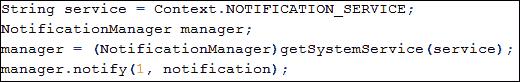

通过调用`getSystemService()`方法，我们得到了一个`NotificationManager`类的实例。触发通知，我们调用`NotificationManager.notify()`方法接收两个参数:第一个是通知的 ID，第二个是通知对象本身。下面的屏幕截图显示了应用的输出:

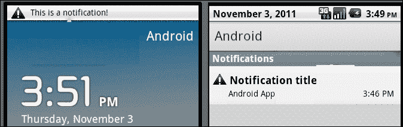

从我们的应用触发的通知

到目前为止，我们已经看到了如何为他们的视图创建通知和设置自定义布局。您可能正在思考意图在这个应用中的重要性和用途。在这个应用中，意图仅用于一个目的，即当用户点击通知时，将用户导航到我们需要的应用或活动。我们创建了一个`Intent`对象，并由此创建了一个`PendingIntent`对象，该对象在通知中被用作`contentIntent`。

# 总结

在这一章中，我们讨论了安卓的特性。我们了解了常见的安卓功能，如布局、显示、连接、通信、可访问性、触摸和硬件支持，以及它们与安卓移动组件的比较。然后我们看到了两个最重要的标签`<uses-feature>`和`<uses-permission>`是如何在`AndroidManifest`文件中使用的，以及用于什么目的。

我们还讨论了硬件和软件特性与安卓移动组件之间的关系，以及它们与这些清单标签之间的关系。然后，我们看到了最常见的意图操作`ACTION_SEND`，它使用隐式意图方法来发送任何东西或与其他应用共享任何东西。然后，我们将我们对意图的了解扩展到电话的更具体的功能，包括拨打电话、发送短信/彩信、确认消息的传递以及接收消息。我们使用意图和本地安卓应用编程接口来执行这些操作。然后，我们讨论了通知和警报，并学习了如何在通知中设置自定义布局。我们学习了两种不同的方法，并在示例应用中使用了一种方法。我们了解了意图在这些类型的应用中是如何使用的，也了解了它们在这些类中的作用。

在下一章中，我们将讨论意图过滤器，看看安卓如何识别不同的意图，并根据调用和应用对它们进行过滤。